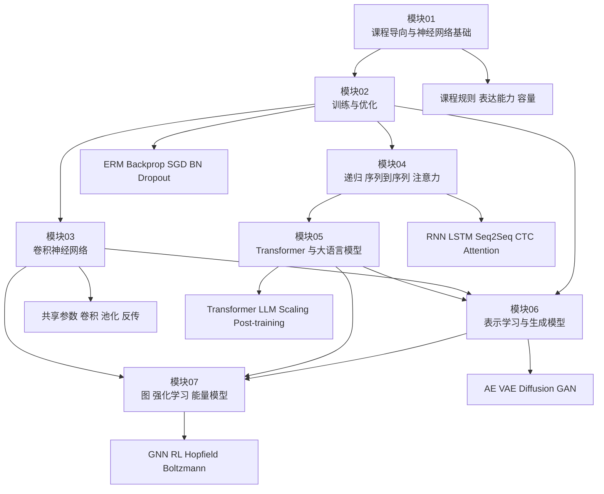

> 这份总指南只使用仓库内证据：`README.md`、`MATERIALS.md`、`READINGS.md`、`PRACTICE.md`、`REVIEW_CHECKLIST.md`、`course.json`、七份模块指南，以及对应 lecture root `NOTES.md` 的已整理结论。
> 文中凡出现 `[需回听]`，表示原仓库笔记已明确标注该处需要回到课堂录音、字幕或课件核验；这里保留不确定性，不用外部知识补空。

## 快速导航

1. 课程身份、范围与证据
2. 如何使用现有 artifacts
3. 全课依赖图
4. 七模块学习路线
5. Lecture 0-28 讲次索引
6. 核心公式与方法速查
7. 关键模型比较
8. 实践映射
9. 阅读与论文映射
10. 误解与复核风险索引
11. 全量复习计划与加速复习计划
12. 24 题综合练习与简明答案
13. 掌握度 rubric

## 课程身份、范围与证据

### 课程身份

- 课程名称：CMU 11-785 Introduction to Deep Learning，Spring 2026。
- 教师：Bhiksha Raj、Rita Singh。
- 主讲范围：Lecture 00-28，共 29 讲。
- 课程材料范围：29 讲 slides、公开视频入口、recitation、lab、bootcamp/hackathon、assignment、papers/readings、notebooks、数据与课程页归档。

### 证据基座

| 证据文件 | 本指南从中取什么 | 需要注意的边界 |
| --- | --- | --- |
| [README.md](/courses/cmu-11785-s26/) | 课程身份、官方来源、资源构建流程、公开视频总时长、课程使用边界 | README 的“完成状态”是一次快照；与当前目录里已存在的模块指南、lecture notes、复核清单并不完全同步 |
| [MATERIALS.md](/courses/cmu-11785-s26/materials/) | Lecture 00-28 标题、slides、视频入口、课程级资源总数 | 它是资源索引，不替代课堂笔记 |
| [course.json](/assets/courses/cmu-11785-s26/metadata/course.json) | 课程元数据、资源组类型、recitation/lab/homework 结构 | 是机器可读清单，不直接给出学习优先级 |
| [READINGS.md](/courses/cmu-11785-s26/readings/) | 官方 paper/reading 归属、唯一计数与复用说明 | 只记录官方列出的 paper/reading，不补课外推荐 |
| [PRACTICE.md](/courses/cmu-11785-s26/practice/) | Recitation/Lab/Bootcamp/HW 的阶段化实践路线 | 不提供作业答案，也不外推隐藏要求 |
| [REVIEW_CHECKLIST.md](/courses/cmu-11785-s26/review-checklist/) | `[需回听]` 汇总、风险类别、复核优先级 | 标记表示“需核验”，不自动等于“笔记错误” |
| 七份模块指南 | 模块主线、公式、边界、常见误解、掌握标准 | 是 lecture notes 的压缩版，不应替代逐讲回看 |

### 课程范围一眼看清

依据 [README.md](/courses/cmu-11785-s26/)、[MATERIALS.md](/courses/cmu-11785-s26/materials/)、[READINGS.md](/courses/cmu-11785-s26/readings/)、[PRACTICE.md](/courses/cmu-11785-s26/practice/) 与 [course.json](/assets/courses/cmu-11785-s26/metadata/course.json)，当前仓库内可直接支持下列学习范围：

- 主讲次：29 讲，Lecture 00-28。
- 公开视频总时长：39:13:19。
- 课前 recitation：28 个。
- 学期内 lab：15 个。
- bootcamp/hackathon：15 个。
- assignment 组：14 个。
- notebook 入口：36 条。
- 官方唯一 paper：17 篇。
- 官方唯一其他 reading：11 条。

### 这门课真正在训练什么

仅按仓库笔记与模块证据，这门课不是“把架构名词按时间顺序背完”，而是在同一条能力链上反复推进：

1. 先建立 `implementation-heavy` 的课程完成方式。
2. 再建立“网络能表示什么”。
3. 再建立“网络怎样训练、为何会失稳、如何修正”。
4. 再进入 CNN、序列建模、attention、transformer、LLM。
5. 最后扩展到表示学习、生成模型、图结构、强化学习、能量模型。

## 如何使用现有 artifacts

### 最稳的使用顺序

1. 先用 [MATERIALS.md](/courses/cmu-11785-s26/materials/) 确认这讲的 slides、视频与课程级资源是否存在。
2. 再读对应模块指南，先拿到这讲在整门课中的作用、依赖和边界。
3. 然后读该 lecture 的 root `NOTES.md`，只抓主线、公式和老师强调的判断。
4. 做题或做实验前，回到 [PRACTICE.md](/courses/cmu-11785-s26/practice/) 找对应 lab / bootcamp / homework 入口。
5. 遇到概念争议或笔记表述摇摆时，回到 [REVIEW_CHECKLIST.md](/courses/cmu-11785-s26/review-checklist/) 看是否已有 `[需回听]` 标记。
6. 想补论文与官方 reading 时，统一从 [READINGS.md](/courses/cmu-11785-s26/readings/) 进入，不要自己凭印象拼阅读单。

### 各类 artifact 的角色分工

| Artifact | 角色 | 什么时候先用它 |
| --- | --- | --- |
| [MATERIALS.md](/courses/cmu-11785-s26/materials/) | 课程总索引 | 先确认资源是否存在、讲次标题与 slides/video 是否齐全 |
| `lectures/*/NOTES.md` | 单讲主证据 | 需要抓课堂论证、公式、例子、边界时 |
| `modules/*.md` | 模块压缩与复习入口 | 第一次建立全局图、第二次压缩复习时 |
| [PRACTICE.md](/courses/cmu-11785-s26/practice/) | 实践路线图 | 做 lab、recitation、bootcamp、homework 前 |
| [READINGS.md](/courses/cmu-11785-s26/readings/) | 官方阅读地图 | 需要把 lecture 与 paper/reading 对齐时 |
| [REVIEW_CHECKLIST.md](/courses/cmu-11785-s26/review-checklist/) | 风险地图 | 想判断哪些点最值得回听、复核和二次确认时 |

### 不要把这些文件混用

- 不要拿 [PRACTICE.md](/courses/cmu-11785-s26/practice/) 代替 lecture notes。它负责“练什么”，不负责“老师在课堂上精确讲了什么”。
- 不要拿 [READINGS.md](/courses/cmu-11785-s26/readings/) 代替模型结论。它负责“官方给了哪些阅读”，不负责“论文细节已在课上完全推导”。
- 不要把 [REVIEW_CHECKLIST.md](/courses/cmu-11785-s26/review-checklist/) 当错题本。它记录的是需核验位置，不是最终裁决。

## 全课依赖图

## 七模块学习路线

| 模块 | 覆盖讲次 | 核心问题 | 你完成后应具备的能力 | 实践桥接 |
| --- | --- | --- | --- | --- |
| [模块 01：课程导向与神经网络基础](/courses/cmu-11785-s26/modules/01/) | Lecture 00-02 | 这门课怎样学；MLP 到底能表示什么 | 说清课程规则、connectionism、perceptron、XOR、universal approximation 与 capacity 边界 | 先完成 [PRACTICE.md](/courses/cmu-11785-s26/practice/) 中 Phase 0 的基础准备 |
| [模块 02：训练与优化](/courses/cmu-11785-s26/modules/02/) | Lecture 03-08 | 为什么“能表示”不等于“能学到”；如何把训练写成可优化问题 | 说清 ERM、可微性、backprop、loss surface、SGD、BN、正则化、dropout | 对接 Phase 1 的 Lab 1-4、HW1 |
| [模块 03：卷积神经网络](/courses/cmu-11785-s26/modules/03/) | Lecture 09-12 | 如何把位置敏感的 MLP 改造成共享参数、可训练的局部扫描系统 | 说清卷积/池化/stride/receptive field 与 CNN backward | 对接 Phase 2 的 Lab 5-6、HW2 |
| [模块 04：递归、序列到序列与注意力](/courses/cmu-11785-s26/modules/04/) | Lecture 13-18 | 长期依赖、alignment、CTC、attention 如何逐步接管序列建模 | 说清 RNN/LSTM、Viterbi、CTC、conditional LM、attention、self-attention 的因果链 | 对接 Phase 3 的 Lab 7-10、HW3 |
| [模块 05：Transformer 与大语言模型](/courses/cmu-11785-s26/modules/05/) | Lecture 19-20 | transformer 如何成为主流；LLM 如何从预训练走到 post-training | 说清 QKV、mask、三类 transformer、scaling laws、SFT/RLHF/RLVR/RFT | 对接 Phase 3 的 Lab 11 与后续 LLM 视角复盘 |
| [模块 06：表示学习与生成模型](/courses/cmu-11785-s26/modules/06/) | Lecture 21-24 | 表示如何从分类过渡到重构、采样、逐步生成与对抗生成 | 区分 AE/VAE/Diffusion/GAN 的目标、收益和失效模式 | 对接 Phase 4 的 Lab 12-14、HW4 |
| [模块 07：图、强化学习与能量模型](/courses/cmu-11785-s26/modules/07/) | Lecture 25-28 | 非规则结构、多步决策、记忆能量面与概率记忆模型如何进入 DL 课程 | 说清 GNN/RL/Hopfield/Boltzmann 的问题设定、机制与边界 | 对接 Phase 4 的 Lab 15；RL/Hopfield/Boltzmann 以概念迁移为主 |

## Lecture 0-28 讲次索引

> 这一节是全指南里唯一放置 29 个 lecture note 链接的地方。每讲只出现一次，方便你把“目的 - 先修 - 掌握目标”与单讲笔记一一对齐。

| 讲次 | 目的 | 先修 | 掌握目标 |
| --- | --- | --- | --- |
| [Lecture 00](/courses/cmu-11785-s26/lectures/001/) | 定义课程的学习目标、评分、作业、项目、求助链路与诚信边界 | 无 | 能准确复述 attendance、quiz、Part 1/2、slack days、协作与诚信边界 |
| [Lecture 01](/courses/cmu-11785-s26/lectures/002/) | 从 associationism 与 connectionism 走到 neuron、Hebb、perceptron 与 MLP | Lecture 00；基础线代/微积分/Python 先修 | 能解释 Hebb 与 perceptron rule 的差别，并用 XOR 说明 hidden layer 的必要性 |
| [Lecture 02](/courses/cmu-11785-s26/lectures/003/) | 说明 MLP 何以成为 universal Boolean machine、classifier 与 approximator | Lecture 01 | 能区分表示与逼近、深度与宽度、activation 与 capacity 的边界 |
| [Lecture 03](/courses/cmu-11785-s26/lectures/004/) | 把“能表示”转成“怎样学”，并给出 learnability requirements 与 ERM 入口 | Lecture 02 | 能解释 perceptron 为何只在单层线性可分场景直接成立，并区分 divergence、expected risk、empirical risk、loss |
| [Lecture 04](/courses/cmu-11785-s26/lectures/005/) | 用梯度、Hessian 与输出层设计把训练写成连续优化问题 | Lecture 03；多元微积分 | 能说清负梯度更新、候选极值与局部最小的区别，以及回归/二分类/多分类输出层差异 |
| [Lecture 05](/courses/cmu-11785-s26/lectures/006/) | 说明 backprop 是怎样把单样本 divergence 高效传播到任意参数的 | Lecture 04；链式法则 | 能复述 ordinary chain rule、distributed chain rule、forward 缓存与矩阵版仿射层局部导数规则 |
| [Lecture 06](/courses/cmu-11785-s26/lectures/007/) | 解释 proxy loss、坏 loss surface、学习率、收敛与动量 | Lecture 05 | 能说明 proxy loss 最优不保证分类误差最优，并比较 decaying LR、Rprop、momentum、Nesterov |
| [Lecture 07](/courses/cmu-11785-s26/lectures/008/) | 从 full batch 转向 SGD 与 mini-batch，建立计算与统计折中 | Lecture 06；期望/方差直觉 | 能写出 SGD 收敛的两条条件，并解释“无偏但高方差”为何是 SGD 的核心画像 |
| [Lecture 08](/courses/cmu-11785-s26/lectures/009/) | 把训练主线扩展到 loss 选择、batch norm、weight decay 与 dropout | Lecture 07 | 能说明 softmax 分类更偏向 KL、写出 BN 前向两步，并把正则化、weight decay、dropout 放进同一泛化主线 |
| [Lecture 09](/courses/cmu-11785-s26/lectures/010/) | 从位置敏感的 MLP 过渡到 scanning、共享参数与 distributed scanning | Lecture 08 | 能解释 shift invariance、共享参数梯度求和、distributed scanning 的三项收益，以及 filter/receptive field/flattening/stride/pooling 的第一版含义 |
| [Lecture 10](/courses/cmu-11785-s26/lectures/011/) | 把 CNN 前向的局部乘加、通道、padding、stride、pooling 与最小架构讲清 | Lecture 09 | 能从局部窗口口头算出一个卷积输出位置，并说清 1x1 conv、通道关系与最小 CNN 架构 |
| [Lecture 11](/courses/cmu-11785-s26/lectures/012/) | 进入 CNN backward，建立卷积层与池化层反向传播的主规则 | Lecture 10；backprop | 能写出激活层链式法则、输入梯度与 filter 梯度规则，以及 max/mean pooling backward |
| [Lecture 12](/courses/cmu-11785-s26/lectures/013/) | 补全重采样反传，并把 CNN 推到不变性、定位与历史脉络 | Lecture 11 | 能解释 downsampling/upsampling backward、显式变换不变性的工程代价、depthwise conv 与定位 head 的位置 |
| [Lecture 13](/courses/cmu-11785-s26/lectures/014/) | 说明有限窗口为何不够，并建立 state-space RNN、BPTT 与双向 RNN 动机 | Lecture 12；序列任务直觉 | 能解释有限窗口模型为何在长期依赖任务上失效，并从时间展开解释 BPTT 的共享参数梯度累加 |
| [Lecture 14](/courses/cmu-11785-s26/lectures/015/) | 解释朴素 RNN 的失稳来源，并引入 LSTM/GRU 作为记忆主干修复 | Lecture 13；矩阵/特征值直觉 | 能从 `w^t`、`W^t`、奇异值与激活导数解释失稳，并写出 LSTM 两条核心公式与各门职责 |
| [Lecture 15](/courses/cmu-11785-s26/lectures/016/) | 把 seq2seq 的核心难点转向 divergence、alignment、compression/expansion 与 Viterbi | Lecture 14 | 能说明为什么 alignment 比 backprop 更先成为 seq2seq 难点，并口头描述 Viterbi 的状态、递推与回溯 |
| [Lecture 16](/courses/cmu-11785-s26/lectures/017/) | 用 CTC 把单一路径训练改成 all-alignments 训练，并引入 blank 与 beam/pruning | Lecture 15 | 能说清 alpha、beta-hat、beta、gamma 的角色，解释 blank 如何解决重复字符歧义 |
| [Lecture 17](/courses/cmu-11785-s26/lectures/018/) | 先建立 language model 与 embedding，再把 decoder 明确成 conditional language model | Lecture 16 | 能从 one-hot 与 projection 解释 embedding，并说明 teacher forcing 与 greedy 非最优翻译问题 |
| [Lecture 18](/courses/cmu-11785-s26/lectures/019/) | 用 attention 与 self-attention 重写 simple seq2seq 的信息流，并给出 transformer 入口 | Lecture 17 | 能区分 raw score、attention weight、context、Q/K/V，并说明 positional encoding 与 masked self-attention 的结构位置 |
| [Lecture 19](/courses/cmu-11785-s26/lectures/020/) | 系统建立 transformer：tokenization、embedding、position、QKV、mask、FFN、norm 与高效实现 | Lecture 18 | 能按顺序复述 transformer 主流程，说明 `sqrt(d_k)`、多头、causal mask、FlashAttention 与 KV caching 各解决什么问题 |
| [Lecture 20](/courses/cmu-11785-s26/lectures/021/) | 从 foundation model 走到预训练、评测、scaling laws 与 post-training | Lecture 19 | 能复述预训练 - 评测/scaling - post-training 三段式，并区分 SFT、RLHF、RLVR、RFT 的训练信号与风险 |
| [Lecture 21](/courses/cmu-11785-s26/lectures/022/) | 从后验概率解释、流形拉直与模板检测器走到 autoencoder 与 PCA | Lecture 20；交叉熵/KL 基础 | 能解释“前层学表示、后层线性读出”，写出线性 AE 重构形式，并说明它为何等价于 PCA |
| [Lecture 22](/courses/cmu-11785-s26/lectures/023/) | 说明普通 AE 为何不能随意采样，并用先验、近似后验与重参数化建立 VAE | Lecture 21 | 能说明标准 Gaussian 先验、`q(z|x)`、decoder likelihood 与重参数化各自承担什么角色 |
| [Lecture 23](/courses/cmu-11785-s26/lectures/024/) | 把一步生成难题拆成 fixed noising + learned denoising 的多步扩散框架 | Lecture 22 | 能区分固定前向腐蚀与学习后向去噪，并用 2D spiral 解释 coarse-to-fine 学习 |
| [Lecture 24](/courses/cmu-11785-s26/lectures/025/) | 用 generator/discriminator 建立 GAN、JSD 直觉、critic 与对抗生成路线 | Lecture 23；最大似然/KL/JSD 直觉 | 能写出原始 min-max 目标，说明“判别器就是损失”，并说清 vanishing gradients 与 mode collapse |
| [Lecture 25](/courses/cmu-11785-s26/lectures/026/) | 把输入结构从规则网格/序列扩展到图，建立 message passing 主框架 | Lecture 24；CNN/RNN/Transformer 表示直觉 | 能完整讲出 gather、aggregate、update，以及 GCN、GraphSAGE、GAT、Graph Transformer 的差别 |
| [Lecture 26](/courses/cmu-11785-s26/lectures/027/) | 把静态预测改写为 sequential decision making，建立 value、policy、Bellman 与 deep RL 主线 | Lecture 25；期望值与状态建模直觉 | 能定义 state/reward/cost/objective，区分 MC、TD、SARSA、Q-learning，并说明 replay 与 target network 的作用 |
| [Lecture 27](/courses/cmu-11785-s26/lectures/028/) | 把网络看成 content-addressable memory 与能量下降系统 | Lecture 26；二次型与稳定性直觉 | 能写出 Hopfield 的结构约束与能量函数，并区分 stationary、stable、false memory 与 valley shaping |
| [Lecture 28](/courses/cmu-11785-s26/lectures/029/) | 在 Hopfield 记忆系统上加入随机性与 hidden units，进入 Boltzmann machine/RBM | Lecture 27 | 能解释为何 hidden units 与随机采样把记忆系统改写为概率模型，并讲清 full BM、RBM 与 contrastive divergence 的关系 |

## 核心公式与方法速查

> 这里只保留模块或 lecture notes 中稳定出现、且能支持课堂结论的公式/方法。若原笔记说明该处字幕或公式细节不稳，右栏会直接标 `[需回听]`。

| 主题 | 课堂形式 | 它在课程里的作用 | 假设与边界 |
| --- | --- | --- | --- |
| Hebb rule | $$w_{xy}=w_{xy}+\beta xy$$ | 给出“共同激活就增强连接”的最早学习直觉 | Lecture 01 明说它缺少负反馈，因此本身不稳定 |
| Perceptron rule | $$w=w+a\,(d(x)-y(x))\,x$$ | 把学习从“共同激活”变成“基于误差的更新” | 收敛保证只在 `linearly separable` 条件下成立 |
| Threshold perceptron / affine form | $$z=\sum_i w_i x_i-t,\quad \theta(z)$$ | 把 threshold、sigmoid、ReLU 放到同一“仿射 + 激活”框架里 | Lecture 02 后续所有表达能力讨论都以此为底座 |
| ERM | 训练集固定后，loss 仅依赖参数 $W$ | 把“组合搜索中间标签”重写成连续优化问题 | 依赖可微激活与可微 divergence |
| Gradient descent | 沿负梯度更新参数 | 把“局部乘子最大下降方向”落到训练规则 | Lecture 05 强调候选临界点不自动等于局部最小值 |
| Backprop 的三件事 | ordinary chain rule、distributed chain rule、forward 缓存 | 解释为何大网络导数可以由局部规则拼出 | Lecture 06 强调 backprop 是求导器，不是优化器 |
| SGD 收敛条件 | $$\sum_k \eta_k=\infty,\quad \sum_k \eta_k^2<\infty$$ | 给出“无偏但高方差”的 SGD 仍可收敛的课堂条件 | 依赖样本顺序随机化与递减学习率 |
| BatchNorm 前向 | $$u=\frac{z-\mu_B}{\sqrt{\sigma_B^2+\varepsilon}},\quad \hat z=\gamma u+\beta$$ | 解释为什么 BN 能重置批内中心和尺度 | 训练与推理使用的统计量不同；批内样本过度同质会出问题 |
| RNN state-space form | $$h_t=f(x_t,h_{t-1}),\quad y_t=g(h_t)$$ | 给出“为什么有限窗口不够”的递归状态表达 | Lecture 13 的 BPTT 只是在时间展开后对共享参数做普通 backprop |
| LSTM 核心 | $$c_t=f_t\ast c_{t-1}+i_t\ast \tilde c_t,\quad h_t=o_t\ast \tanh(c_t)$$ | 把长期记忆放到尽量少失真的主干中 | Lecture 14 明确说 LSTM 缓解而非消灭一切失稳 |
| Attention 缩放 | $$\text{scale} = \frac{1}{\sqrt{d_k}}$$ | 避免点积方差随维度增大而把 softmax 推进饱和区 | 完整位置编码细式在课堂 transcript 中不稳定 `[需回听]` |
| 线性 AE | $$\hat x=W^\top W x$$ | 解释为什么线性 autoencoder 等价于 PCA | 等价结论依赖线性激活与平方重构误差 |
| VAE 目标骨架 | $$\mathrm{KL}(q(z\mid x)\,\|\,p(z\mid x))$$ | 把“可重构”升级为“可采样且近似先验”的 latent 学习 | 真实后验难显式求解，所以只能做 variational approximation |
| VAE 重参数化 | $$z=\mu+\Sigma^{0.5}\epsilon$$ | 让采样路径也能接受 backprop | 缩放因子的口头细节在 notes 中有 `[需回听]` 标记 |
| Diffusion 训练法 | fixed forward Gaussian noising + reverse noise prediction MSE | 把“一步生成”拆成 many small steps 的去噪回归 | closed-form noising、DDIM、reverse SDE 的精细公式在 transcript 中不稳定 `[需回听]` |
| GAN 原始目标 | $$\min_G\max_D\;\mathbb E_X[\log D(X)]+\mathbb E_Z[\log(1-D(G(Z)))]$$ | 把“像不像目标分布”交给判别器学习 | JSD 结论依赖“判别器近似最优”的理想分析 |
| Bellman 关系 | $$V(s)=\text{局部 reward/cost}+\sum_{s'}P(s'\mid s)V(s')$$ | 说明 RL 中“当前值 = 眼前收益 + 后续期望”的递归结构 | 模块 07 明确提醒：这里只保留课堂稳定结构，不补更强板书版 `[需回听]` |
| Hopfield 能量 | $$E=-\frac{1}{2}\sum_{i,j}w_{ij}y_i y_j$$ | 把 associative memory 解释成能量下降到局部低谷 | 常数项、容量定理与若干细节在 notes 中保留 `[需回听]` |

## 关键模型比较

### 1. 判别式主线模型比较

| 模型 | 课程里解决的核心问题 | 主要收益 | 主要边界 |
| --- | --- | --- | --- |
| MLP | 通用表示与分类/函数逼近 | 理论表达力强，能统一成“仿射 + 激活” | 位置敏感；训练与容量代价可能很高 |
| CNN | 局部模式与近似平移不变性 | 参数共享、层级局部表示、可高效扫描 | 对显式旋转/缩放不变性，课堂认为理论可做但工程常不划算 |
| RNN | 顺序状态建模 | 把有限窗口扩展为递归状态 | 长期依赖难、梯度消失/爆炸、并行性差 |
| LSTM | 修复朴素 RNN 的记忆主干 | 更稳地保留长期信息 | 不是“所有问题自动消失” |
| Attention/Transformer | 长程依赖与并行训练 | 全局可访问信息、并行更强、结构更统一 | 位置必须显式补入；长序列效率仍是工程问题 |
| Decoder-only LLM | 在大规模文本上持续 next-token prediction 与后训练 | 强生成、强迁移、可对接 SFT/RLHF | 评测、数据污染、奖励设计与对齐仍是核心风险 |

### 2. 生成模型比较

| 模型 | 课堂中保留的核心机制 | 主要收益 | 主要失效模式或边界 |
| --- | --- | --- | --- |
| 普通 AE | 压缩并重构输入 | 学主子空间或主流形；decoder 可作生成字典 | 不知道哪些 latent 合法，随机采样常掉到未训练区 |
| VAE | 先验 + 近似后验 + 重参数化 | latent 连续、可采样、可插值 | 样本易模糊；Gaussian 近似与一步生成都带边界 |
| Diffusion | fixed noising + learned denoising | 训练稳定，高保真，能 coarse-to-fine 地学结构 | 采样慢；公式细节多处 `[需回听]` |
| GAN | 判别器/critic 提供可学习损失 | 可直接优化“像不像目标分布” | vanilla GAN 易梯度消失、mode collapse；理论 JSD 不等于现实稳定训练 |

### 3. 图模型比较

| 模型 | 邻居处理方式 | 优势 | 边界 |
| --- | --- | --- | --- |
| GCN | 归一化邻接聚合 + 共享权重 | 快、直观、是图卷积的稳定起点 | 主要是局部 message passing |
| GraphSAGE | 学聚合函数而非死记每个节点 embedding | 更适合 inductive 场景与新节点 | 仍受局部传播限制 |
| GAT | 对邻居做 attention 加权 | 不再把所有邻居等权平均 | 仍需多层传播才能触达长程依赖 |
| Graph Transformer | 允许全局节点两两交互 | 更强的 global dependencies | 需要结构编码；计算代价升到 $O(N^2)$ |

### 4. RL 学习路线比较

| 方法 | 更新信号 | 优势 | 风险或代价 |
| --- | --- | --- | --- |
| Monte Carlo | 完整 episode return | 无偏、概念直观 | 方差高、更新慢 |
| TD | bootstrapped one/few-step target | 更新快 | 用猜测学猜测，稳定性更敏感 |
| SARSA | on-policy action value | 与当前行为策略一致 | 对探索策略依赖更强 |
| Q-learning | off-policy action value | 目标更直接，适合控制 | 仍会面临 moving target |
| DQN | 用神经网络逼近 Q | 处理大状态空间 | correlated data、bootstrapping、moving target 叠加 |
| RLHF | 以人类偏好近似 reward | 把“人想要什么”引入训练 | 人类反馈噪声、reward misspecification、sample inefficiency |

## 实践映射

> 详细入口统一在 [PRACTICE.md](/courses/cmu-11785-s26/practice/)。这里的目标不是重复那份文件，而是说明“学完哪一块理论，应该去做哪一组实践”。

| 理论阶段 | 对应实践阶段 | 应优先完成的内容 | 为什么这时做 |
| --- | --- | --- | --- |
| 模块 01 前后 | [PRACTICE.md](/courses/cmu-11785-s26/practice/) Phase 0 | 28 个课前 recitation，尤其 Python、NumPy、PyTorch、环境、datasets、dataloaders、debugging、losses、workflow | 这门课是 `implementation-heavy`；基础工具若不先稳定，后面理论不会顺利落地 |
| 模块 02 | [PRACTICE.md](/courses/cmu-11785-s26/practice/) Phase 1 | Lab 1-4，Hackathon 1，HW1 相关工作流 | 训练与优化部分对应 MLP、autograd、调参、normalization、debugging 的第一轮动手 |
| 模块 03 | [PRACTICE.md](/courses/cmu-11785-s26/practice/) Phase 2 | Lab 5-6，HW2 Bootcamp，HW2 | CNN 的价值必须通过局部扫描、分类与验证任务真正体会 |
| 模块 04 前半 | [PRACTICE.md](/courses/cmu-11785-s26/practice/) Phase 3 | Lab 7-9，HW3 Bootcamp，HW3 | RNN、CTC、beam search、alignment 都需要在序列实验中消化 |
| 模块 04 后半 + 模块 05 | [PRACTICE.md](/courses/cmu-11785-s26/practice/) Phase 3 | Lab 10-11 | attention、LAS、transformer、pretrained usage 在这里形成闭环 |
| 模块 06 | [PRACTICE.md](/courses/cmu-11785-s26/practice/) Phase 4 | Lab 12-14，HW4 | VAE、Diffusion、GAN 的差别只看 lecture 名称远远不够，必须通过生成实验落地 |
| 模块 07 | [PRACTICE.md](/courses/cmu-11785-s26/practice/) Phase 4 | Lab 15 | 图结构主题有直接实验入口；RL/Hopfield/Boltzmann 当前仓库更偏 lecture-level 理解与迁移 |

### 做实践时最重要的三条纪律

1. 作业要求只以 [PRACTICE.md](/courses/cmu-11785-s26/practice/) 所链接的官方 Autolab/Piazza/Slides/Notebook 为准。
2. bootcamp 与 hackathon 的角色是“把工作流与常见坑显式化”，不是替你推断隐藏测试。
3. 若实践结果与 lecture 直觉冲突，先回 lecture notes 与 [REVIEW_CHECKLIST.md](/courses/cmu-11785-s26/review-checklist/)，再决定是实现错了还是理解错了。

## 阅读与论文映射

> 详细列表见 [READINGS.md](/courses/cmu-11785-s26/readings/)。这一节只做“该在什么时候读、读它是为了什么”的路线化摘要。

| 讲次范围 | 阅读重点 | 你应从哪份文件进入 | 作用 |
| --- | --- | --- | --- |
| Lecture 00 | 无正式 paper/reading | [READINGS.md](/courses/cmu-11785-s26/readings/) | 以课程规则与学习系统为主，不靠附加阅读 |
| Lecture 01 | connectionism、McCulloch-Pitts、Rosenblatt、Hebb 相关源头文本 | [READINGS.md](/courses/cmu-11785-s26/readings/) | 建立“神经网络不是凭空冒出来的黑箱”的历史与概念背景 |
| Lecture 02 | 布尔电路复杂度与表示能力材料 | [READINGS.md](/courses/cmu-11785-s26/readings/) | 帮你把 universal approximation、布尔构造和深度/宽度代价联系起来 |
| Lecture 03-08 | perceptron、backprop、Adagrad、Adam、momentum 等训练与优化相关阅读 | [READINGS.md](/courses/cmu-11785-s26/readings/) | 把课堂的 ERM、可微性、优化动力学与经典方法对应起来 |
| Lecture 09-10 | 无官方新增 reading | [READINGS.md](/courses/cmu-11785-s26/readings/) | 以 lecture notes 和实验为主 |
| Lecture 11 | CNN Explainer | [READINGS.md](/courses/cmu-11785-s26/readings/) | 作为可视化辅助材料，而不是新理论主线 |
| Lecture 12 | 无官方新增 reading | [READINGS.md](/courses/cmu-11785-s26/readings/) | 以 CNN backward 与工程边界为主 |
| Lecture 13-14 | RNN 相关少量 paper | [READINGS.md](/courses/cmu-11785-s26/readings/) | 用来加深 recurrent 结构与求导直觉 |
| Lecture 15-28 | 官方 reading 清单基本不再扩张 | [READINGS.md](/courses/cmu-11785-s26/readings/) | 这些阶段主要靠 lecture notes、slides 与实践消化 |

### 读法建议

1. 不要把 [READINGS.md](/courses/cmu-11785-s26/readings/) 当成“必须先读完的文献课表”。
2. 最有效的顺序通常是：先看 lecture notes 提问题，再去阅读文件找原出处。
3. Lecture 03 与 Lecture 04 有复用条目；[READINGS.md](/courses/cmu-11785-s26/readings/) 已处理唯一计数，不要重复算工作量。

## 误解与复核风险索引

### 复核总况

依据 [REVIEW_CHECKLIST.md](/courses/cmu-11785-s26/review-checklist/)：

- 唯一待回听项：270。
- 涉及讲次：16/29。
- 类别分布：ASR 术语或名称 100；上下文或语义不清 111；代码/API 或实现 2；公式/符号/数值 23；课件与口述差异 34。
- 官方建议优先级：公式/符号/数值 > 代码/API > 课件与口述差异 > 核心术语 > 普通语义。

### 高风险误解索引

| 风险类型 | 典型误解 | 最稳的纠偏入口 |
| --- | --- | --- |
| 课程规则误读 | 把可讨论边界当成可提交边界；把 slack days 适用范围记错 | Lecture 00 notes + [REVIEW_CHECKLIST.md](/courses/cmu-11785-s26/review-checklist/) |
| 表达能力误读 | 把“一层隐藏层可逼近”误解成“有限宽网络可精确做任何事” | 模块 01 + Lecture 02 notes |
| 训练目标误读 | 把 backprop 当优化器，把 proxy loss 当分类误差本身 | 模块 02 + Lecture 06/07 notes |
| 公式过度确定 | 在 stride、closed-form noising、reverse SDE、某些位置编码细节上擅自补全 | 模块 03、05、06 中标注 `[需回听]` 的部分 |
| 结构混淆 | 把 pooling 和 downsampling、self-attention 和 cross-attention、SFT 和 RLHF 混为一谈 | 模块 03、05 对比表 |
| 生成模型误读 | 把普通 AE 当可自由采样模型，把 GAN 判别器 0.5 当成训练成功 | 模块 06 比较表 |
| RL 误读 | 把 Markov 性理解成“世界没有历史”，把 replay/target network 当细枝末节 | 模块 07 + Lecture 26 notes |
| 能量模型误读 | 把 stationary 当 stable，把 Hopfield Hebbian 当最优训练法 | 模块 07 + Lecture 27 notes |

### 你该怎么用复核清单

1. 若你要背公式，先看 [REVIEW_CHECKLIST.md](/courses/cmu-11785-s26/review-checklist/) 里有没有该讲的“公式、符号或数值”条目。
2. 若你要实现某个 API 或层，优先排查“代码、API 或实现”类别，哪怕全局只有 2 条。
3. 若你要引用课堂原话，必须先排查“课件与口述差异”类别，尤其 Lecture 00-10 这类定义密集讲。

## 全量复习计划与加速复习计划

### 全量复习计划

适合第一次系统复习、准备课程总结或准备完整重走一遍理论加实践。

#### 第 1 阶段：搭框架

1. 先读七份模块指南的“模块定位/用途/依赖图/掌握标准”。
2. 用本文件的“七模块学习路线”和“讲次索引”把 29 讲压成一条时间线。
3. 暂时不做细题，只要求你能回答每一模块“上一代方法为什么不够”。

#### 第 2 阶段：补主线

1. 重读 Lecture 00-08，建立 `课程规则 -> 表示能力 -> ERM -> backprop -> 优化 -> 正则化` 主线。
2. 同步完成 [PRACTICE.md](/courses/cmu-11785-s26/practice/) Phase 1 的对应 Lab/Bootcamp 回看。
3. 在这一阶段解决 80% 的公式与定义问题。

#### 第 3 阶段：补架构

1. 重读 Lecture 09-20，建立 `CNN -> RNN/LSTM -> Seq2Seq/CTC -> Attention -> Transformer -> LLM` 主线。
2. 把 [PRACTICE.md](/courses/cmu-11785-s26/practice/) Phase 2-3 的 Lab 5-11 全部重新映射到对应 lecture。
3. 这一步要尤其注意不要把模块 04 与 05 割裂开。

#### 第 4 阶段：补生成与扩展

1. 重读 Lecture 21-28，建立 `表示学习 -> VAE -> Diffusion -> GAN -> GNN -> RL -> Hopfield -> Boltzmann` 的扩展图。
2. 对接 [PRACTICE.md](/courses/cmu-11785-s26/practice/) Phase 4 的 Lab 12-15。
3. 这一阶段重点不是“做最多题”，而是“看清问题设定变了什么”。

#### 第 5 阶段：统一复核

1. 通读 [REVIEW_CHECKLIST.md](/courses/cmu-11785-s26/review-checklist/) 的汇总与自己最常引用的讲次。
2. 优先回听公式、符号、数值与课件/口述差异条目。
3. 对仍不稳定的地方，保留 `[需回听]` 标签，不要假装已经确定。

#### 第 6 阶段：输出式掌握

1. 完成本文件后面的 24 题。
2. 试着不用看稿，讲出 7 条模块主线和 29 讲的用途。
3. 选择 3 个模块各做一次“讲给别人听”的 5 分钟压缩口述。

### 加速复习计划

适合考试前、面试前或只想快速恢复课程结构时使用。

#### Day 1

1. 读模块 01-02。
2. 只看 Lecture 00-08 的掌握标准与关键公式。
3. 做练习 1-6。

#### Day 2

1. 读模块 03-04。
2. 只看 Lecture 09-18 的讲次索引与核心比较表。
3. 做练习 7-13。

#### Day 3

1. 读模块 05-06。
2. 只看 transformer/LLM 与 AE/VAE/Diffusion/GAN 的速查表。
3. 做练习 14-20。

#### Day 4

1. 读模块 07。
2. 只看 GNN、RL、Hopfield、Boltzmann 的问题设定与边界。
3. 做练习 21-24。

#### Day 5

1. 通读 [REVIEW_CHECKLIST.md](/courses/cmu-11785-s26/review-checklist/) 汇总。
2. 把所有带 `[需回听]` 的高频点单独列出来。
3. 只回听你最常说错、最容易实现错、最可能被追问的条目。

## 24 题综合练习与简明答案

### A. 理解题

1. 为什么课程从 Lecture 00 开始就反复强调 `implementation-heavy`？
答：因为这门课的成功不只靠听懂 lecture，还要靠 recitation、lab、homework、project 和 debug 能力协同完成，课程结构本身就是实现导向的。

2. 为什么 Lecture 01 把 XOR 放在这么早的位置？
答：因为 XOR 是单个 perceptron 能力边界的最短反例，它迫使你接受 hidden layer 不是装饰而是必要结构。

3. 为什么 Lecture 02 里“universal approximator”不等于“任意有限网络都能精确拟合任意函数”？
答：课堂强调的是一层隐藏层可做任意精度逼近，且常常需要极宽甚至近乎无限宽；这不是有限规模精确表示的保证。

4. Lecture 03 的两个 learnability requirements 为什么关键？
答：因为只有激活函数和 divergence 都可微，训练才可能从中间标签的组合搜索改写成连续优化问题。

5. 为什么 Lecture 07 说 SGD 的核心画像是“无偏但高方差”？
答：因为单样本梯度在期望上仍指向正确方向，但每次只看一个样本会带来最大方差与更强抖动。

6. 为什么 Lecture 08 里 BN、weight decay、dropout 被放在同一讲？
答：因为它们都不是“新的主优化器”，而是围绕训练稳定性与泛化能力做的系统级修正。

### B. 推导与机制题

7. 为什么 backprop 必须区分 ordinary chain rule 和 distributed chain rule？
答：因为网络中的某个变量常常通过多条路径影响最终损失，单链连乘不够，必须把所有路径贡献相加。

8. 为什么 Lecture 06 的最优步长分析只是一维二次函数的局部结论，却仍然重要？
答：因为它清楚展示了“学习率过大振荡、再大就发散”的核心动力学，后续多维复杂面只是把这个问题放大。

9. 为什么共享参数的扫描网络仍然可以用普通 backprop 训练？
答：因为它本质上仍是一张大网络，只是多条边共享同一组值；训练时对公共参数的梯度把所有共享边贡献相加即可。

10. 为什么 max pooling backward 必须保存前向最大值的位置？
答：因为只有那个位置真正决定了输出，反传时梯度只能回到该赢家位置，其余位置应为 0。

11. 为什么 RNN 的训练困难会从“记忆问题”变成“梯度问题”？
答：因为时间展开后的 RNN 就是一张深网络，信息与梯度都要经历长链乘积，所以前向记忆衰减与反向梯度消失/爆炸会同时出现。

12. 为什么 LSTM 的修复逻辑不是“再加更多非线性”，而是“让记忆主干少失真”？
答：因为真正有害的是记忆主干上反复放大的权重与收缩 Jacobian 的非线性，LSTM 通过门控把“写什么、忘什么、读什么”和“主干传递”拆开。

### C. 应用题

13. 你在做 ASR 序列标注，alignment 不知道，但输出顺序和目标顺序一致，应该先想到哪条课堂主线？
答：先想到 Lecture 15-16 的 `alignment -> Viterbi -> CTC -> blank -> beam/pruning` 主线，而不是先纠结优化器。

14. 你发现 greedy decoding 给出的翻译句子局部词都看着合理，但全句明显更差，应该回到哪一讲的什么结论？
答：回到 Lecture 17 的“decoder 是 conditional language model，greedy 不等于全局最优翻译，因此需要 beam search”。

15. 你训练 transformer 时忘记了 causal mask，会造成什么问题？
答：decoder 会在训练时直接偷看未来 token，目标被破坏，模型学到的不是合法自回归生成。

16. 你把普通 autoencoder 的 latent 随机采样喂给 decoder，结果输出很怪，最可能的课程内解释是什么？
答：普通 AE 没有约束哪些 latent 是合法的，decoder 只在训练实际覆盖过的 latent 区域附近可靠。

17. 你要向同学解释为什么 diffusion 比“直接从噪声一步生成图像”更稳，最短说法是什么？
答：它把大跨越拆成 many small steps，每一步只学局部去噪，因此结构更稳、细节恢复更自然。

18. 你在图任务里只会平均邻居表示，但模型对远距离结构始终迟钝，最可能缺了什么？
答：你还停在局部 message passing；可能需要更多层传播、attention 化的邻居加权，或者 graph transformer 式全局交互与结构编码。

### D. 比较题

19. 用一句话区分 self-attention 与 cross-attention。
答：self-attention 的 `QKV` 都来自同一序列；cross-attention 的 `Q` 来自 decoder，而 `KV` 来自 encoder。

20. 用一句话区分 AE、VAE、Diffusion、GAN 的核心训练目标。
答：AE 学重构，VAE 学“可采样 latent + 高似然重构”，Diffusion 学多步去噪，GAN 学“骗过判别器的可学习分布匹配”。

21. 为什么课程把 Graph Transformer 的问题说成“不是图从此变简单了”？
答：因为图没有天然顺序，哪怕允许全局两两交互，也仍要额外设计结构编码并承担 $O(N^2)$ 代价。

22. 为什么 RL 里 replay 与 target network 都不是细节优化？
答：因为它们分别对付 correlated data 与 moving target，是 DQN 能否稳定工作的结构性补丁。

23. 为什么 stationary pattern 不等于 stable memory？
答：stationary 只表示当前不会自发改变；stable 还要求受到小扰动后能回到原模式，后者才是真正可靠的记忆。

24. 为什么 Boltzmann machine 比 Hopfield 更像概率模型而不是确定性记忆系统？
答：因为它允许 hidden units、multiple completions 与按 Boltzmann 分布随机采样，系统不再只会确定性地下滑到单一低谷。

## 掌握度 rubric

| 等级 | 你应该能做到什么 | 证据 |
| --- | --- | --- |
| Level 1：识别 | 能按顺序说出 7 个模块和 29 讲各自大致讲什么 | 依赖本文件“七模块学习路线”和“讲次索引” |
| Level 2：复述 | 能不看稿解释每个模块“上一代方法为什么不够、下一代方法修了什么” | 依赖模块指南的“主线/掌握标准/比较表” |
| Level 3：推导与实现 | 能写出关键公式、解释训练/推理路径，并把它们映射到 lab/hackathon/homework | 依赖本文件“公式速查”与 [PRACTICE.md](/courses/cmu-11785-s26/practice/) |
| Level 4：迁移与批判 | 能指出边界、失败模式与 `[需回听]` 不确定性，不把课堂结论过度泛化 | 依赖 [REVIEW_CHECKLIST.md](/courses/cmu-11785-s26/review-checklist/) 与各模块的“边界/误解/需回听”部分 |

### 达到课程掌握的最低完整标准

1. 你能顺着时间线讲出 `表示能力 -> 训练 -> CNN -> 序列 -> Transformer/LLM -> 生成 -> 图/RL/能量模型`。
2. 你能把至少 15 个关键概念和对应实践入口连起来，不再把 lecture 与 lab 拆成两套系统。
3. 你能在至少 8 个地方主动说出边界，例如“这里只是 arbitrary precision approximation”“这里的 exact formula 需回听”“这里是理想化分析而非现实稳定性保证”。
4. 你能在不查外部资料的前提下，完成本文件 24 题中的大部分，并知道不会的题应回到哪份仓库文件补。

### 最后一句

如果只记一件事，就记这门课真正训练的是一种连续迁移的能力：先知道模型能表示什么，再知道它怎样被训练、为什么会失效、如何被修正，最后把同一套思维迁移到序列、生成、结构化数据、决策与能量模型上。
