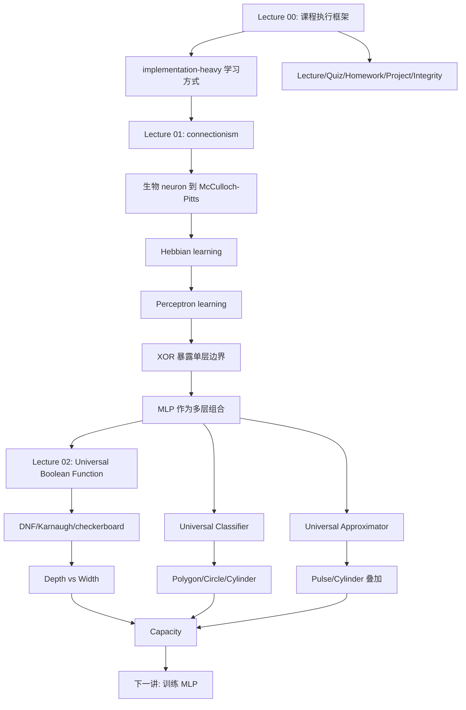

## 说明

- 本模块只依据以下三份 root `NOTES.md` 整理，不补充任何外部事实、定理证明或课外定义。
- 原始笔记里已经标出的不确定处，本文保留为 `[需回听 HH:MM:SS]`，用于提醒复核录音或课件，而不是替换成外部知识。
- 本模块中的“能做到”“能逼近”“能保证收敛”等说法，都只在原讲义给出的条件和口径内成立。

## 模块目的

- 把课程一开始三讲压成一条连续主线：先知道这门课要你如何学习，再知道神经网络为什么成为 AI 主流，最后知道多层感知机为什么在表达能力上足够强。
- 建立后续所有训练、优化与架构讨论的共同词汇：`implementation-heavy`、connectionism、perceptron、hidden layer、MLP、hyperplane、universal Boolean function、universal classifier、universal approximator、capacity。
- 把“课程执行规则”和“模型表达边界”放在一起理解，避免一上来只会背结论，却不知道这些结论在什么条件下成立、又在哪些地方会失效。

## 先修与使用方式

- 先修要求来自 Lecture 00：Python、基础 machine learning、线性代数、微积分，以及愿意实现、实验、debug 的学习方式。[00:02:43-00:03:03][课件 p.11] 这不是礼貌性建议，而是对 `implementation-heavy` 课程的直接前提。[00:03:35-00:04:40][课件 p.13]
- 使用方式建议按“规则 -> 历史与单元 -> 表达能力”三层推进。先把课程参与规则压实，再读 Lecture 01 的历史与模型链，最后读 Lecture 02 的表达能力与边界。
- 若你现在的困难是“跟不上作业/项目节奏”，优先回看 Lecture 00 关于求助链路、study group、mentor、Piazza 发帖要求的部分。[00:14:20-00:16:42][00:27:20-00:28:31][课件 p.47]
- 若你现在的困难是“知道很多术语，但说不清为什么单层不够、为什么要深度”，优先回看 Lecture 01 的 XOR 段与 Lecture 02 的 parity/checkerboard 段。[01:05:26-01:08:20][00:41:41-00:50:49]

## 讲次推进顺序

1. [Lecture 00 课程规则与学习系统](/courses/cmu-11785-s26/lectures/001/)
   作用：定义课程目标、评分、作业、项目、求助链路与诚信边界，告诉你“这门课怎样被完成”。关键段落集中在 [00:04:40-00:10:15]、[00:17:47-00:20:01]、[00:20:06-00:30:06]。
2. [Lecture 01 神经网络导论](/courses/cmu-11785-s26/lectures/002/)
   作用：从 associationism 和 connectionism 讲到 neuron、Hebb、perceptron、MLP，并把神经网络统一成“函数近似机器”。关键段落集中在 [00:28:04-00:39:54]、[00:51:54-01:11:49]、[01:11:49-01:22:56]。
3. [Lecture 02 多层感知机的表达能力](/courses/cmu-11785-s26/lectures/003/)
   作用：把 MLP 的能力分成布尔函数、分类边界、实值函数逼近三条线，并系统说明深度、宽度、激活函数、容量的约束。关键段落集中在 [00:31:54-00:50:49]、[00:51:35-01:11:22]、[01:12:24-01:24:18]。

## 概念依赖图

## 核心定义、公式、论证与证据边界

### 一、Lecture 00：先把学习系统搭起来

- 课程定位不是“看 slide 即可”的轻量理论课，而是 `implementation-heavy` 训练：lecture 讲概念，recitation/hackathon/bootcamp 把概念转成实现，homework 和 project 把实现能力推到可评分产出。[00:03:35-00:05:33][00:07:23-00:09:34][课件 p.13]
- 评价系统由 attendance、weekly quizzes、homework assignments、project/guided project 组合而成，老师明确说它想在理解、应用、创造力之间做平衡。[00:17:47-00:18:08]
- `Weekly quiz` 的关键规则是 14 次取最好 12 次，每次 10 道选择题，每次 quiz 取 3 次尝试中的最好成绩。[00:06:43-00:07:16]
- Homework Part 1 与 Part 2 的分工不同。Part 1 训练“从零实现 neural nets”，Part 2 训练“在真实数据集上解决复杂问题”。[00:20:06-00:22:17][课件 p.40-p.41]
- Part 2 评分结构是明确的：early submission 占 10/100，剩余 90/100 由最终成绩相对 cutoff 的位置决定。[00:22:17-00:22:43][课件 p.41]
- 线性插值示例是本讲少数明确数值论证之一：若 85% accuracy 对应 high cutoff、75% 对应 medium cutoff，则 80% accuracy 得 82.5/90 分。[00:23:03-00:23:18][课件 p.42]
- `slack days` 规则是执行层面的高频考点：每人共 10 天，不适用于 initial submissions、所有 bonus points 和 HW Part 1；用完后，迟交还会在其他惩罚外再累计 10% penalty。[00:26:37-00:26:59][课件 p.45]
- 诚信边界同样明确：quiz 必须独立完成；homework 可以讨论，但最终提交代码必须自己写；从网上或朋友处抄代码都算 violation；不确定边界就去 Piazza 或 office hours 问。[00:28:38-00:29:53][课件 p.48-p.49]
- 证据边界：Lecture 00 关于“拿 A 的学生技术上已准备好做 deep learning job”的说法，是老师对课程内部能力标准的口径，不等于对外部招聘结果的保证。[00:04:52-00:05:33]
- 不确定点要保留：例如教师姓名、MediaTech 截止时间口头表述、`mytorch` 前一处字幕误写，原笔记均已标为 `[需回听 00:00:27]`、`[需回听 00:18:47]`、`[需回听 00:20:25]`。

### 二、Lecture 01：从 connectionism 到 perceptron，再到 MLP

- 历史主线从 associationism 开始。老师用“闪电 -> 雷声”和 Pavlov 的狗说明 cognition 可先被理解为联想形成。[00:28:04-00:30:17]
- 但真正与神经网络直接相接的是 connectionism：Bain 把信息和知识理解为存储在 neurons 之间的连接里，而不是存储在单独规则表中。[00:32:01-00:37:29]
- 这一步的关键对比对象是传统程序机。传统 von Neumann / Harvard-Princeton 风格机器把处理器与程序/数据存储分开；connectionist machine 则把“程序”编码在连接里。[00:37:29-00:39:54]
- 生物 neuron 为计算模型提供结构原型：dendrites 接收输入，axon 输出信号，总输入超过阈值就 fire。[00:42:21-00:42:59]
- McCulloch-Pitts neuron 把神经元建模为阈值布尔逻辑单元，因此可以实现 AND、OR、NOT 等门，还能搭任意布尔电路。[00:46:05-00:48:55]
- 但 M-P 模型缺少“如何从经验中学权重”的机制，因此老师转向 Hebb rule：

$$
w_{xy} = w_{xy} + \beta xy
$$

  其中只有当 $x=1$ 且 $y=1$ 时权重才增加。[00:55:13-00:56:07]
- Hebbian learning 的证据边界也很清楚：它提供了“neurons that fire together wire together”的学习直觉，但因为只有增长、没有减小项，所以 fundamentally unstable。[00:54:06-00:56:58]
- Perceptron learning 引入期望输出和误差反馈：

$$
w = w + a\,(d(x)-y(x))\,x
$$

  它与 Hebb rule 的差别在于更新不再只由共同激活触发，而由误差触发，因此会产生 negative feedback。[01:01:51-01:02:30]
- 老师给出的可保证结论只在 `linearly separable` 条件下成立：若两类样本能被一个 hyperplane 分开，则 perceptron learning 保证收敛到一组可分权重。[01:02:38-01:03:02]
- 单个 perceptron 的能力边界由 XOR 暴露出来。单个单元可以实现 AND、OR、NOT，但不能实现 XOR，因此它不是 universal Boolean machine。[01:04:26-01:06:00]
- hidden layer 的引入不是装饰，而是必要结构：通过中间层先算 `X OR Y` 与 `NOT X OR NOT Y`，再由输出层组合，3 个 perceptrons 就能得到 XOR。[01:06:03-01:06:39]
- 从这里老师推出一般结论：MLP 是 universal Boolean function machine。[01:06:43-01:08:20]
- 接着，perceptron 被改写为“仿射组合 + activation”的统一结构。若定义

$$
z = \sum_i w_i x_i + b
$$

  再对 $z$ 施加 threshold activation，那么 bias 本质上就是阈值的另一种写法。[01:08:20-01:11:49]
- 最终统一视角是 `neural network as function`：图像描述、语音转写、博弈决策，都可压成“输入映射到输出”的函数；网络学习的是这个函数的建模或近似。[01:21:43-01:22:29][课件 p.114]
- 证据边界：Lecture 01 末尾把 MLP 概括成 universal approximators，但详细展开和“深度为什么重要”的主论证被明确留到下一讲。[01:22:32-01:22:50][课件 p.115]
- 不确定点要保留：如 `Bain/Bane`、`Rosenblatt`、`a posteriori / a priori`、`affine` 的 ASR 不稳定，以及 M-P 抑制连接那句疑似口误 `[需回听 00:47:28]`。

### 三、Lecture 02：MLP 的通用表达力与它的代价

- 本讲把 MLP 的表达能力分成三条并行主线：universal Boolean function、universal classifier、universal approximator。[00:23:28-00:24:17]
- 全讲的基本拆法是先把单元写成“先算 affine term，再过 activation”。对 threshold perceptron，可写为

$$
z = \sum_i w_i x_i - t,\quad \theta(z)=\begin{cases}1,& z\ge 0\\0,& z<0\end{cases}
$$

  这样后续才能把 threshold、sigmoid、tanh、ReLU、softplus 放到同一框架下比较。[00:05:50-00:07:47][00:11:48-00:14:08]

#### 1. Universal Boolean Function

- 单隐藏层通用性的构造性论证来自 truth table 与 DNF：每个输出为 1 的输入组合对应一个 AND clause，所有 clauses 再由输出层 OR 起来。[00:32:08-00:33:48]
- 因而“一层 hidden layer + 一个输出 OR”已经足以表达任意布尔函数。[00:33:48-00:34:25]
- 但代价可能非常高。Karnaugh map 可用来压缩 DNF；若能把 7 个亮格化简成 3 个 groups，对应网络隐藏层就从 7 个单元缩到 3 个单元。[00:36:39-00:38:18]
- 最坏情况是 checkerboard，它等价于 parity/XOR，不能再分组化简，因此对 $n$ 个输入，一层隐藏层最坏需要 $2^{n-1}$ 个 hidden neurons。[00:38:56-00:40:13]
- 深度收益在 parity 上尤其清楚。把多变量 XOR 串起来时，$n$ 输入 XOR 只需 $3(n-1)$ 个 perceptrons；若利用更紧凑的 XOR 单元，可到 $2(n-1)$ 量级。[00:42:53-00:44:03]
- 再利用 XOR 的结合律并行配对，所需层数可压到 $2\log_2 n$。[00:44:44-00:46:39]
- 证据边界：这里的深度收益不是“任何函数都一样明显”，而是在 XOR/parity 这种结构性最坏例子上给出的清晰对比。[00:48:33-00:49:09]

#### 2. Universal Classifier

- 单个 threshold perceptron 是线性分类器，因为“加权和等于阈值”的点构成一个 hyperplane。[00:51:49-00:52:22]
- 多个 perceptrons 可以组合成多边形边界：每条边一个单元，内部所有边界单元都输出 1，再由输出层做 AND。例如五边形需要 5 个边界单元加 1 个输出单元。[00:54:48-00:55:39]
- 更高层还可以 OR 多个子区域，所以两个五边形的并、一般复杂区域的并，都可由分层组合得到。[00:55:42-00:56:32]
- 若只用一层隐藏层，老师改用“多边形边数趋于无穷得到圆”的构造：圆内总和接近 $n$、圆外接近 $n/2$；减去 $n/2$ 后得到局部 `cylinder` 响应。[01:02:31-01:03:22]
- 再把很多小圆平移、复制、求和，就能把任意复杂分类边界逼近到任意精度，因此一层隐藏层 MLP 是 universal classifier。[01:03:24-01:05:34]
- 证据边界：这里强调的是 `arbitrary precision approximation`，不是“有限个圆、一层网络就能精确表达任意边界”。[01:04:22-01:05:34]
- 深度的优势仍然存在。对 16 条线的网格图案，两层隐藏层方案要 57 个神经元；改写成深层 XOR 后更省。对 64 条线图案，两层隐藏层方案是 609 个，而更深 XOR 网络只需 253 或 190 个。[01:07:02-01:09:50]

#### 3. Universal Approximator

- 一维情形的基本积木是 `pulse`：两个阈值单元、两个阈值 $T_1,T_2$、输出权重 1 与 -1，可构造只在区间 $(T_1,T_2)$ 内取 1 的局部脉冲。[01:12:35-01:13:11][课件 p.127]
- 把很多窄 pulse 适当缩放并相加，就能逼近任意一维实值函数。[01:13:11-01:13:31][课件 p.128]
- 高维情形则复用前面 universal classifier 的 `cylinder` 构造：把许多平移、缩放后的局部响应相加，就能逼近任意高维实值函数。[01:13:33-01:14:04][课件 p.129-p.130]
- 因而一层隐藏层 MLP 是 universal function approximator。[01:13:48-01:14:04]
- 证据边界必须保留：即便隐藏层神经元无限多，Lecture 02 这里讲的也是“只能逼近，不能对任意实值函数做精确建模”。老师在 Poll 4 里明确强调了这一点。[01:14:07-01:15:05][课件 p.131-p.132]

#### 4. 宽度、深度、激活函数、容量的联合边界

- 深度不是万能补丁。若第一层太窄，且 activation 是 threshold，那么第一层输出只会告诉后面“你落在哪个 strip/cell”，却不会告诉“你在这个区域里的具体位置”，后续层再深也可能恢复不了 checkerboard 细节。[01:15:58-01:18:04][课件 p.141-p.145]
- graded activation 能缓解这个问题，因为 sigmoid/ReLU/leaky ReLU 可以把“离边界有多远”的信息继续传下去，而 threshold 会直接把它截断。[01:18:56-01:20:06][课件 p.147-p.148]
- 但 graded activation 仍非充分条件；若少量边界方向覆盖不够，信息仍会缺失，后续层还是无从恢复目标模式。[01:21:19-01:22:09]
- 因此老师在本讲给出的 capacity 工作定义是：网络能表示的输入空间中彼此断开的区域数目上限。[01:22:39-01:22:53][课件 p.153]
- 若目标函数所需的最小断开区域数超过当前网络容量，它就不可能被精确表示，只能近似。[01:22:54-01:23:14]

## 讲间递进关系

- Lecture 00 解决的是“这门课如何学、如何交付、如何求助、哪里不能越界”。如果这一步没吃透，后面即使概念会背，也会在作业、项目、诚信和协作上出错。
- Lecture 01 解决的是“神经网络为什么不是凭空冒出来的黑箱”。它从 cognition、associationism、connectionism 讲到 perceptron，让你知道网络的最小计算单元、学习规则，以及为什么单个单元不够。
- Lecture 02 则把 Lecture 01 末尾的能力口号补成严格得多的结构性结论：MLP 确实强，但强在什么意义上、代价是什么、什么时候需要深度、什么时候宽度不足、什么时候 activation 会丢信息，这些都必须说清。
- 从问题顺序看，这三讲正好对应三层问题：`怎么学课` -> `什么是网络` -> `网络到底能表示什么`。下一讲自然才轮到 `网络怎样学到具体函数`。[01:23:53-01:24:18][课件 p.156]

## 常见误解与复习标记

- 误解 1：`implementation-heavy` 只是教学风格。更准确地说，它决定了先修要求、作业设计、bootcamp/recitation 的存在方式，以及为什么“只看 slides 会很吃力”。[00:03:35-00:05:33][00:07:23-00:08:46]
- 误解 2：Hebbian learning 既然“会学”，就可以直接拿来训练稳定网络。Lecture 01 明确说它缺少负向修正，因而 fundamentally unstable。[00:56:09-00:56:58]
- 误解 3：单个 perceptron 很强，所以已经几乎什么都能做。XOR 是最直接反例；它迫使你接受 hidden layer 的必要性。[01:05:26-01:06:39]
- 误解 4：Lecture 01 说 MLP 是 universal approximator，所以任何一层网络都能精确做任何事。Lecture 02 明确纠正：一层隐藏层往往只能做任意精度逼近，而且可能需要指数宽或近乎无限宽。[01:05:34-01:06:19][01:14:07-01:15:05]
- 误解 5：深度越大越好，宽度无所谓。Lecture 02 明确指出，若前层已经把关键信息压没了，再深也恢复不了；每一层仍要足够宽。[01:15:58-01:18:04]
- 误解 6：graded activation 一定解决窄层信息瓶颈。老师只说它可能保留更多距离信息，但如果方向覆盖不足，仍会失败。[01:21:19-01:22:09]
- 误解 7：capacity 在这里等于某个统一单一数学定义。Lecture 02 明说 capacity 有很多定义，而本讲只先抓“可表示多少个 disconnected regions”这一工作定义。[01:22:39-01:22:53]
- 复习标记：出现以下口头或字幕不稳时，不要自作主张补外部知识，应回到原笔记的 `[需回听]` 标记复核，例如 `Bain/Bane`、`Rosenblatt`、`affine`、`Karnaugh map`、`XOR/exor/XR`、`ReLU/reloop`。

## 掌握标准

### Lecture 00 掌握标准

- 能说明为什么这门课把 lecture、quiz、homework、project、study group、mentor 组织成一套联动系统，而不是互相独立的清单。[00:04:40-00:10:15][00:14:38-00:17:45]
- 能准确复述 Part 1、Part 2、early submission、cutoff、slack days、bonus 的边界，且不会把讨论允许范围与提交允许范围混为一谈。[00:20:06-00:27:16]
- 能在求助时按 Piazza 规范给出标题、最小相关代码、已尝试过的 debug 过程，而不是丢整本 notebook。[00:27:20-00:28:31][课件 p.47]

### Lecture 01 掌握标准

- 能复述从 associationism 到 connectionism，再到 neuron、Hebb、perceptron、MLP 的概念链，而不是把这些词看成平铺术语表。[00:28:04-00:39:54][00:52:44-01:08:20]
- 能解释 Hebb rule 与 perceptron learning rule 的差别，并指出后者为什么引入了 negative feedback。[00:55:13-00:56:58][01:01:51-01:02:30]
- 能用 XOR 说清单个 perceptron 的能力边界，以及 hidden layer 为什么不是可有可无。[01:05:26-01:06:39]
- 能把 perceptron 改写成 affine term 加 activation，并说明 bias 与 threshold 的关系。[01:08:20-01:11:49]

### Lecture 02 掌握标准

- 能分别解释 universal Boolean function、universal classifier、universal approximator 各自指的是什么，并区分“精确表示”和“任意精度逼近”。[00:31:54-00:34:25][01:05:00-01:05:34][01:14:07-01:15:05]
- 能从 DNF/Karnaugh/checkerboard 讲清一层隐藏层为什么通用、为什么最坏情况下会指数爆宽。[00:32:08-00:40:13]
- 能用 parity/XOR 的串联和并行构造说明深度如何把指数宽度换成线性规模和对数层数。[00:42:53-00:46:39]
- 能解释为什么宽度不足、threshold 过硬、边界方向覆盖不足时，深度和 graded activation 也未必救得回来。[01:15:58-01:23:14]

### 模块总体掌握标准

- 你能把三讲压缩成一句完整的话：这门课要求你以实现为主线学习；神经网络可以从连接式计算和 perceptron 组网来理解；多层感知机在表达上足够强，但它的实际可表达性仍受深度、宽度、激活函数与容量约束。
- 你能指出至少三个明确的“边界条件”：`linearly separable` 才有 perceptron 收敛保证；一层隐藏层的很多结论是逼近而非精确表示；深度收益并不等于宽度和前层信息都不重要。

## 累积练习（含简明答案）

1. 为什么 Lecture 00 把 attendance 设计成 mandatory，而不是“可选但建议参加”？
答案：老师明确说 attendance 与课程成功高度相关，且通过 polls 或 MediaTech 观看记录来计分，因此它既是学习建议，也是评价项。[00:12:24-00:12:52][00:18:39-00:19:27]

2. 用一句话对比 Hebb rule 和 perceptron learning rule。
答案：Hebb rule 只会在共同激活时正向增强连接，perceptron learning rule 则根据期望输出与实际输出的误差增减权重。[00:55:13-00:56:58][01:01:51-01:02:30]

3. 为什么 XOR 是 Lecture 01 和 Lecture 02 都反复出现的关键例子？
答案：因为它最直接暴露单个 perceptron/单条线性边界的不足，同时又能展示多层组合与深度收益。[01:05:26-01:06:39][00:42:04-00:46:39]

4. 用 Lecture 02 的语言解释：为什么“一层隐藏层 MLP 是 universal Boolean function”并不等于“一层隐藏层总是高效”？
答案：因为 DNF 构造保证了可表示性，但在 checkerboard/parity 最坏情况下隐藏层要 $2^{n-1}$ 个单元，宽度会指数爆炸。[00:32:31-00:40:13]

5. 一个五边形分类区域为什么需要“5 个边界单元 + 1 个输出单元”？
答案：每条边一个 perceptron，只有在五边形内部五个单元才同时输出 1，最后一个单元对这 5 个输出做 AND。[00:54:48-00:55:39]

6. 为什么 Lecture 02 insist 一层隐藏层的 universal classifier / approximator 结论只能说“逼近到任意精度”？
答案：因为它依赖很多小圆或很多 pulse/cylinder 的局部叠加，本质上是 arbitrary precision approximation，而不是对任意目标函数的有限精确表示。[01:04:22-01:05:34][01:12:35-01:15:05]

7. 为什么第一层太窄且用 threshold activation 时，后面再深也可能无济于事？
答案：因为第一层已经把输入压成 0/1 区域编号，只保留“在哪个 strip/cell”，丢掉了区域内位置细节，后续层无法恢复这些信息。[01:16:29-01:18:04]

8. 如果你要向同学解释这三讲如何过渡到下一讲，你会怎么说？
答案：前两讲先说明课程怎么学、网络是什么、它为什么能表示复杂函数；到 Lecture 02 末尾，问题自然从“能表示吗”转成“怎样把它训练成我们想要的那个函数”。[01:23:53-01:24:18][课件 p.156]

## 建议复习顺序

1. 先重读 Lecture 00 顶部的“学习目标、核心概念与依赖关系、掌握标准”，只抓课程执行规则，不急着看细节段落。
2. 再读 Lecture 01 的 `00:28:04-00:39:54` 与 `00:51:54-01:11:49`，把 `associationism -> connectionism -> Hebb -> perceptron -> XOR -> MLP` 这条线串顺。
3. 接着读 Lecture 02 的 `00:31:54-00:50:49`，只聚焦 DNF、Karnaugh、checkerboard、parity，先吃透“为什么深度可能省很多单元”。
4. 然后读 Lecture 02 的 `00:51:35-01:15:05`，把 universal classifier 与 universal approximator 的几何构造和“只能逼近”的边界分开记。
5. 最后读 Lecture 02 的 `01:15:05-01:24:18`，把宽度、深度、activation、capacity 的联合限制补齐，并与下一讲训练问题接上。
6. 做完上面 8 题后，再回到三份 root notes 中标了 `[需回听]` 的地方复核专有名词与边界句，不要在这些点上用印象替代证据。
