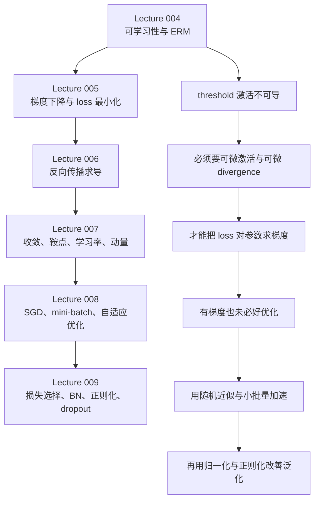

## 模块定位

本模块对应课程训练主线的前半程，严格只整合以下 6 讲根目录 `NOTES.md`：Lecture 004-009。它回答六个连续问题：

1. 为什么“网络能表示”还不等于“网络能学到”。
2. 训练为什么会被改写成关于参数 W 的函数最小化。
3. 反向传播到底在算什么，为什么它只是求导器而不是优化器。
4. 即使能求梯度，为什么还会遇到坏 loss surface、振荡、发散与收敛慢。
5. 为什么 full batch 不现实，为什么 SGD 和 mini-batch 会成为主流。
6. 为什么光有优化器还不够，还要选合适的散度函数、归一化、正则化与 dropout。

模块目标不是罗列技巧，而是把“训练问题的定义、可导性条件、求导机制、优化动态、统计噪声、正则化启发式”连成一条因果链。

## 先修要求

- 线性代数：向量、内积、矩阵乘法、特征值与特征向量。
- 微积分：导数、偏导、链式法则、二阶导数、Taylor 展开。
- 概率与统计直觉：均值、方差、期望、无偏估计。
- 神经网络基础：感知机、前馈网络、激活函数、输出层、训练样本。

## 讲次推进

| 讲次 | 主题 | 在模块中的作用 | 关键锚点 |
| --- | --- | --- | --- |
| [Lecture 004](/courses/cmu-11785-s26/lectures/004/) | ERM 与可学习性问题 | 从“能表示”转向“怎样学”；说明 threshold 网络为什么难训练 | diamond boundary [00:10:06]-[00:11:14]；double pentagon [00:42:40]-[00:49:51]；ERM [01:20:29]-[01:22:22] |
| [Lecture 005](/courses/cmu-11785-s26/lectures/005/) | 梯度下降与训练问题形式化 | 把训练写成 loss 最小化，补齐 gradient、Hessian、输出表示与 divergence 选择 | gradient 方向 [00:14:13]-[00:16:08]；极值判别 [00:20:50]-[00:29:00]；训练框架 [00:45:24]-[00:46:21] |
| [Lecture 006](/courses/cmu-11785-s26/lectures/006/) | 反向传播 | 说明如何从单样本 divergence 算到任意参数导数 | influence diagram [00:08:36]-[00:10:09]；distributed chain rule [00:15:53]-[00:17:30]；矩阵版 backprop [01:20:38]-[01:23:20] |
| [Lecture 007](/courses/cmu-11785-s26/lectures/007/) | 收敛、loss surface、momentum | 解释 proxy loss 与分类目标错位，以及优化动态为什么慢、抖、会卡住 | proxy 失配 [00:13:32]-[00:16:28]；二次函数步长阈值 [00:39:50]-[00:41:39]；momentum/Nesterov [01:09:39]-[01:19:00] |
| [Lecture 008](/courses/cmu-11785-s26/lectures/008/) | Batch size、SGD、mini-batch、Adam | 解释为什么要从 full batch 转向小批量，以及方差与效率的折中 | SGD 随机化 [00:15:04]-[00:16:31]；收敛条件 [00:31:40]-[00:34:01]；mini-batch 方差 1/B [00:52:44]-[00:52:56] |
| [Lecture 009](/courses/cmu-11785-s26/lectures/009/) | 损失函数、BN、正则化、dropout | 把优化主线扩展到 loss 形状、归一化、泛化控制 | KL vs L2 [00:10:00]-[00:15:43]；batch norm [00:21:20]-[00:30:34]；weight decay [01:03:17]-[01:06:42]；dropout [01:10:48]-[01:18:57] |

## 依赖图

## 模块主线

### 一、从可表示到可训练：Lecture 004

Lecture 004 的核心不是再证明网络能表达复杂边界，而是指出“手工构造能做到”与“训练算法能学出来”之间有本质差别。老师先用 diamond boundary 说明简单边界可以被多个 perceptron 手工拼出来，其中一条边写成 x1 - x2 + 1 = 0，四条边再加顶部 AND 就能构成整个 diamond [00:10:06]-[00:10:56]。但这只能处理极简单问题，不能扩展到一般学习场景。

这讲最重要的两个转折是：

- 单个 perceptron 在线性可分时可以学，因为边界是超平面，更新有几何意义：错分正样本做 W = W + x，错分负样本做 W = W - x [00:34:46]-[00:35:47]。
- 多层 threshold 网络学不动，因为中间神经元没有现成标签，double pentagon 例子里必须穷举 relabeling，单个边界就有 2^n 种重标可能 [00:47:15]-[00:49:27]。

老师最终把困难压缩成两个可学习性要求：

- 激活函数必须连续并可微 [01:06:21]-[01:07:13]。
- divergence 也必须可微 [01:11:29]-[01:12:07]。

这让训练从“组合搜索中间标签”改写成“给定训练集，最小化关于 W 的 loss”，也就是 empirical risk minimization [01:20:29]-[01:22:22]。

### 二、把训练改写成优化：Lecture 005

Lecture 005 的任务是搭起后面所有训练算法共享的数学地基。老师先把 loss 定义为训练集上 average divergence，因此训练网络就是寻找一组参数，让 loss 最小 [00:01:20]-[00:01:53]。接着，他把导数解释成“把输入微小增量映射到输出微小增量的局部乘子”，而不是只把它当作 dy/dx 的商记号 [00:02:50]-[00:04:39]。

这讲要抓住三条链：

1. derivative 与 gradient：
   - derivative 在本课记号里是行向量。
   - gradient 是其转置列向量 [00:11:40]-[00:11:47]。
2. gradient 的几何意义：固定步长下，与 gradient 同向时函数上升最快，与负 gradient 同向时下降最快 [00:14:13]-[00:16:08]。
3. 极值判别：
   - 一元里，f'(x) = 0 只是候选条件，f''(x) > 0 才支持局部最小 [00:22:57]-[00:25:23]。
   - 多元里，先解 ∇f = 0，再看 Hessian 是否 positive definite [00:28:29]-[00:29:00]。

当这些工具回到神经网络时，老师重新定义了训练对象：

- 回归输出通常用 identity [00:56:51]-[00:59:17]。
- 二分类常用 sigmoid 概率输出 [00:59:20]-[01:00:23]。
- 多分类用 one-hot 目标与 softmax 概率输出 [01:01:17]-[01:04:39]。

因此，这讲完成的不是具体算法，而是把“神经网络训练”合法地变成“loss 最小化”的函数优化问题。

### 三、如何求导：Lecture 006

Lecture 006 解决的是“既然我们要沿着梯度更新，那么梯度怎么来”。老师先把总 loss 的梯度拆成样本级 divergence 导数的平均 [00:06:02]-[00:07:03]，于是问题被化约为：怎样计算单个样本的 divergence 对任意参数的导数。

这讲有四个必须按顺序理解的部件：

1. influence diagram：边表示影响关系，边上放局部导数 [00:08:36]-[00:09:34]。
2. 普通链式法则：一条链上总导数是局部导数连乘 [00:12:53]-[00:13:44]。
3. distributed chain rule：一个变量通过多条路径影响目标时，总导数要把所有路径贡献求和 [00:15:53]-[00:17:30]。
4. forward/backward 分工：forward 负责把所有 z, y 算出来并保存；backward 负责从输出端一路把导数传回去 [00:22:31]-[00:23:13], [00:28:41]-[00:29:58]。

标量版反向传播的三条局部规则最值得直接记住：

- dDiv/dz = (dDiv/dy) · (dy/dz)
- dDiv/dw = y · (dDiv/dz)
- dDiv/dy = Σ_over_downstream_z (dDiv/dz) · (dz/dy)

其中最后一条在仿射层里会退化为“所有下游 z 导数按边权加权求和” [00:37:01]-[00:39:33]。

矩阵版则进一步压缩成每层两步：

- z_k = W_k y_(k-1) + b_k
- y_k = f_k(z_k)

以及反向里的三个局部结论：

- dD/dy = (dD/dz) W
- dD/db = dD/dz
- dD/dW = y · (dD/dz)

[01:12:44]-[01:13:46]。这就是后面所有优化器共享的“导数供应系统”。

### 四、为什么有梯度也不够：Lecture 007

Lecture 007 的核心结论是：就算 backprop 算出了梯度、gradient descent 也真的把可微 proxy loss 降到了极小值，依然不保证学到真正想要的分类器。

老师先用大量“安全区域”样本把边界推错的反例说明：分类真正想最小化的是 classification error，但训练里实际最小化的是可微 divergence；两者的最优点可能不一致 [00:13:32]-[00:16:28]。加一个 spoiler 点时，perceptron 可能会为了保持可分而显著改边界，而 proxy-loss 方案只会轻微移动 [00:17:20]-[00:19:14]。这意味着训练目标本身就带偏差。

但老师并没有把这件事简单说成坏事，而是引入 bias-variance 视角：

- perceptron low bias、high variance，少量样本就能让边界剧变 [00:20:21]-[00:20:58]。
- backprop-based proxy 解“prefers consistency over perfection”，虽然未必分得最干净，但通常更稳定 [00:20:45]-[00:22:22]。

随后问题进入真正的优化动力学。老师在一维二次函数

- E(w) = 1/2 · a w^2 + b w + c

上做 Taylor 展开，并得到当前点附近的最优一步：

- w* = w_k - [E''(w_k)]^(-1) E'(w_k)

因此最优固定步长等于二阶导逆 [00:36:36]-[00:38:49]。更重要的是三段式收敛阈值：

- η < 2η_opt 时收敛。
- η = 2η_opt 时振荡。
- η > 2η_opt 时发散。

[00:40:42]-[00:41:39]。

多维里，困难不是“没有最优步长”，而是每个方向的最优步长不同：陡方向需要小步，缓方向希望大步，统一学习率无法两头兼顾 [00:45:34]-[00:48:32]。因此老师给出一串改进思路：

- decaying learning rate：先大后小，用大学习率帮助逃离坏盆地，再逐步稳定 [00:54:17]-[00:56:12]。
- Rprop：按坐标看导数符号是否翻转，同号就放大步长，翻号就缩小并回退 [01:00:21]-[01:02:12]。
- momentum：对历史梯度步做运行平均，让同号方向积累、振荡方向相互抵消 [01:09:39]-[01:15:28]。
- Nesterov：先沿历史方向 look-ahead，再在前瞻位置算梯度 [01:15:56]-[01:18:46]。

这一讲的本质是把“会求导”推进到“会不会收敛、收敛快不快、收敛到哪里”。

### 五、为什么要小批量：Lecture 008

Lecture 008 从计算与统计两方面回答：为什么现代训练很少坚持 full batch，而更偏向 SGD 或 mini-batch。

老师先指出 batch update 的代价：一次更新前必须先扫完整个训练集，前向、反向并平均导数，代价高 [00:07:15]-[00:09:12]。随后引入 incremental update：每次随机挑一个训练点，立刻更新一次；一个 epoch 若有 t 个样本，就会产生 t 次更新 [00:13:02]-[00:16:31]。

SGD 有两个关键前提：

- 样本顺序必须随机化，否则会出现 cyclic behavior [00:14:40]-[00:15:39]。
- 学习率必须递减，否则模型会永远“追逐最新样本”而摆动不止 [00:24:03]-[00:26:50]。

这讲给出了 SGD 收敛的两条正式条件：

- Ση_k = ∞
- Ση_k^2 < ∞

[00:31:40]-[00:32:15]。老师点名 1/k 是典型满足者，因为 harmonic series 发散而 Σ1/k^2 收敛 [00:33:05]-[00:34:01]。

然后进入统计解释：

- empirical risk 是 expected divergence 的无偏估计 [00:39:47]-[00:41:50]。
- 但样本平均的方差按 1/n 下降 [00:42:45]-[00:45:12]。
- SGD 每次只看一个样本，仍无偏，但因为相当于 n = 1，方差最大 [00:46:12]-[00:46:42]。

这就解释了为什么 SGD 往往“更快但更抖”。mini-batch 的角色正是在两者之间折中：

- 仍然随机抽小子集更新。
- mini-batch loss 依然无偏 [00:52:27]-[00:52:44]。
- 方差按 1/B 下降，其中 B 是 batch size [00:52:44]-[00:52:56]。

因此，mini-batch 的价值不是单纯“更适合 GPU”，而是它在统计上通过更大的 B 降低方差，在计算上又保持高频更新，成为 full batch 与 SGD 之间的可操作平衡点。

这一讲最后再把趋势法与自适应法重新拉回：

- momentum / Nesterov 平滑高方差梯度 [01:03:20]-[01:08:36]。
- RMSProp 通过平方导数的运行平均按方向调学习率 [01:13:16]-[01:16:25]。
- Adam 把一阶趋势与二阶矩缩放合在一起 [01:17:43]-[01:19:53]。

### 六、优化器之外：Lecture 009

Lecture 009 处理的是“即使优化框架已经建立，我们还得选什么损失、如何做批归一化、如何防过拟合”。它把训练从纯优化问题推进到完整训练系统。

#### 1. 散度函数不是语义选择，也是优化几何选择

老师先总结一个经验标准：好散度需要“远处斜率够大、近处不至于太陡” [00:04:35]-[00:05:56]。回归里常用 L2：

- D_L2 = 1/2 · (y - d)^2

或其向量版 [00:07:05]-[00:07:26]；分类里常用 KL，二分类口头形式是

- -d log y - (1 - d) log(1 - y)

[00:07:47]。但老师真正强调的是：不能只看对输出概率 y 的曲线形状，更要看经过 softmax 之后对仿射输入 z、乃至对最终层权重的几何形状 [00:10:36]-[00:12:49]。在这一层面，KL 对 softmax 分类更友好，而 L2 会形成更差的损失面 [00:12:49]-[00:15:43]。

同时，老师给出一个非常重要的统一结论：在常见线性回归输出加 L2、以及 softmax 分类输出加 KL 的配置里，对最终仿射量 z 的梯度都等于

- dL/dz = y - d

[00:15:43]-[00:16:21]。这也是 “error backpropagation” 这个名字的来源。

#### 2. Batch normalization 解决什么，代价是什么

BN 的动机是：小批量训练默认各 mini-batch 分布近似一致，但深层非线性会把原本接近的批次拉得很开 [00:19:57]-[00:20:33]。因此老师先定义批内标准化：

- u = (z - μ_B) / sqrt(σ_B^2 + ε)

[00:29:04]-[00:29:13]，然后再做可学习的重定位：

- z_hat = γu + β

[00:30:34]。

这带来两个收益和两个代价：

- 收益 1：把不同 mini-batch 拉回到相近中心位置和尺度。
- 收益 2：实证上显著加快收敛、改善结果 [00:58:24]-[00:59:20]。
- 代价 1：批内样本不再独立，任一 z_i 会通过均值和方差影响所有 u_j [00:31:46]-[00:33:55]。
- 代价 2：若一个 batch 里样本过度同质，完整梯度可能退化为 0，batch norm 反向传播会失败 [00:52:45]-[00:56:13]。

因此 BN 不是“单样本上的普通层”，而是“作用在整个 mini-batch 上的向量操作”。这也是为什么推理阶段不能再用当前单样本统计量，而要用训练期累计得到的全局均值和方差 [00:56:21]-[00:56:40]。

#### 3. 正则化、weight decay 与深度带来的平滑性

老师把过拟合的根源追到“只要训练点拟合得好就够了”，但这样完全可能学出一条在样本点间疯狂摆动的函数 [00:59:38]-[01:00:47]。单个感知机层面，若权重过大，sigmoid 会变陡并趋近阶跃 [01:01:21]-[01:02:24]；网络层面，这让模型更容易拼出尖锐、局部化的边界。

所以老师引入 L2 正则：在原始损失外再加权重平方范数 [01:03:17]-[01:03:54]。把它带回梯度下降后，更新式会自动出现“先收缩旧权重、再做普通梯度步”的结构：

- W ← (1 - β)W - data-gradient term

[01:05:03]-[01:05:46]。这就是 weight decay 的来源，而不是一个与 L2 正则无关的独立魔法。

老师还给出一个经验观察：更深的网络不只表达更强，也可能带来更强的隐式正则化，因而在同等总神经元数下更容易学到平滑边界 [01:07:22]-[01:09:16]。

#### 4. Dropout 是随机模型集成

dropout 的第一解释来自 bagging：同一训练集上训练多个模型再平均，通常更稳健 [01:10:15]-[01:10:48]。把它搬到神经网络里，就是对每个输入、每次迭代，为每个神经元采样 0/1 mask；被关掉的神经元不参与前向，也不参与反向 [01:10:48]-[01:13:58]。

这样一来，若有 n 个可开关神经元，就对应 2^n 个可能子网络，dropout 相当于在这些子网络上采样并学习它们的平均效果 [01:12:07]-[01:13:17]。

推理阶段不能真的枚举全部子网络，因此老师采用近似：若 mask 服从 Bernoulli(α)，则其期望是 α，所以可用“输出乘 α”或等价的权重缩放来近似集成平均 [01:17:25]-[01:18:09]。老师明确提醒这是近似，而不是精确恒等 [01:15:48]-[01:16:32]。

最后，他还补了一条非常实用的工程边界：dropout 往往和 batch norm 配得不好，因为 dropout 会显著扰动 BN 依赖的批内统计量 [01:19:42]-[01:20:07]。

## 核心公式与假设汇总

### Lecture 004

- 感知机边界：W^T X = 0 [00:29:54]-[00:30:17]。
- 内积几何：W^T X = ||W|| ||X|| cos(theta) [00:30:21]-[00:30:43]。
- 感知机更新：错分正样本 W = W + x；错分负样本 W = W - x [00:35:11]-[00:35:47]。
- 经验风险最小化：训练集固定后，loss 只依赖 W [01:21:49]-[01:22:20]。

假设：结构已足够表达目标函数；训练样本是目标函数与输入分布的经验近似 [00:11:16]-[00:11:38], [01:17:24]-[01:18:10]。

### Lecture 005

- 导数是局部线性乘子，不只是商记号 [00:02:50]-[00:04:39]。
- gradient 给最速上升方向，负 gradient 给最速下降方向 [00:14:13]-[00:16:08]。
- 候选最小点需先满足一阶条件，再用二阶信息判别 [00:22:57]-[00:29:00]。

假设：loss 对参数可微；网络输出与 divergence 已被正确定义。

### Lecture 006

- 链式法则与 distributed chain rule 是 backprop 的唯一数学骨架 [00:12:53]-[00:17:30]。
- 前向保存所有中间 z, y，否则局部导数无处取值 [00:22:31]-[00:23:13], [00:28:34]-[00:28:40]。
- 矩阵版每层仿射公式：z_k = W_k y_(k-1) + b_k [00:59:40]-[01:00:00]。

假设：局部函数可导；特殊点如 ReLU 在 0 处可用 subgradient 处理 [00:49:11]-[00:50:54]。

### Lecture 007

- proxy loss 的最优点未必对应 classification error 的最优点 [00:15:53]-[00:16:28]。
- 一维二次函数的最优步长来自二阶导逆 [00:36:36]-[00:38:49]。
- 收敛/振荡/发散阈值由 2η_opt 分界 [00:40:42]-[00:41:39]。

假设：局部二次近似能描述当前位置的优化动态；多维时各方向曲率不同。

### Lecture 008

- SGD 收敛条件：Ση_k = ∞，Ση_k^2 < ∞ [00:31:40]-[00:32:15]。
- 经验风险无偏，但方差随样本数按 1/n 下降 [00:41:17]-[00:46:42]。
- mini-batch 方差按 1/B 下降 [00:52:44]-[00:52:56]。

假设：每轮样本顺序随机；mini-batch 是对总体分布的随机子采样。

### Lecture 009

- softmax 分类里，对最终仿射量的梯度统一为 y - d [00:15:43]-[00:16:21]。
- batch norm 前向：u = (z - μ_B) / sqrt(σ_B^2 + ε)，z_hat = γu + β [00:29:04]-[00:30:34]。
- weight decay 形式来自 L2 正则下的梯度更新 [01:05:03]-[01:06:42]。

假设：batch norm 依赖批内样本足够多样；dropout 推理近似接受 f(E[x]) 近似 E[f(x)] [01:16:32]-[01:18:09]。

## 训练算法与机制对比

| 机制 | 解决的核心问题 | 依赖的信息 | 主要收益 | 主要代价或失败边界 |
| --- | --- | --- | --- | --- |
| perceptron rule | 单层线性可分分类 | 错分样本与标签 | 简单、几何直观、线性可分时收敛 | 多层 threshold 网络需要中间 relabeling，组合爆炸 |
| vanilla gradient descent | 连续 loss 最小化 | 当前全局梯度 | 目标清晰、易分析 | 统一学习率无法兼顾各方向曲率 |
| backpropagation | 高效求任意参数梯度 | 局部导数、链式法则、中间值缓存 | 把全网求导分解为局部规则 | 只负责求导，不保证目标选得对或收敛快 |
| decaying learning rate | 兼顾前期探索与后期稳定 | 时间步或 plateau 信号 | 可先逃离坏盆地再细收敛 | schedule 选得差会过早变慢或长期震荡 |
| SGD | 降低单次更新成本、提高更新频率 | 单样本梯度 | 同算力下更新次数多 | 方差最大，顺序不随机会震荡 |
| mini-batch | 在效率与方差之间折中 | 小批量平均梯度 | 方差随 1/B 下降，且适合并行 | batch 太小噪声大，太大又减少更新频率 |
| momentum | 抑制振荡方向、强化持续方向 | 历史梯度步运行平均 | 更顺滑、更快下坡 | 在 constant slope 上无额外收益 |
| Nesterov | 比 momentum 更快利用趋势 | look-ahead 后的梯度 | 更快逼近较优轨迹 | 仍需良好学习率配合 |
| Rprop | 每维独立调步长 | 导数符号是否翻转 | 不再受统一学习率约束 | 仍需 backprop 供导数符号 |
| RMSProp | 不同方向用不同学习率 | 平方导数运行平均 | 摆动大方向自动降学习率 | 只处理二阶矩，不平滑一阶趋势 |
| Adam | 同时平滑趋势并按方向缩放 | 一阶矩与二阶矩运行平均 | 实践中稳健、通用 | 早期需偏置修正，仍属启发式 |
| batch norm | 缓解批次漂移、加快收敛 | 批均值与批方差 | 训练更快、更稳 | 批内样本过于同质会堵死梯度；训练/推理统计量不同 |
| weight decay | 抑制过陡单元与过拟合 | 权重大小 | 强制平滑、改善泛化 | 过强会欠拟合 |
| dropout | 近似模型集成、抑制共适应 | 随机 mask | 强正则化、增强鲁棒性 | 推理只做近似；和 batch norm 常不协调 |

## 常见失败模式

1. 结构足够表达，但训练规则不具备可学习性。Lecture 004 的 double pentagon 说明，失败点不在表达力，而在缺失中间监督与可 tractable 的搜索空间 [00:42:40]-[00:49:51]。
2. 目标函数选错。Lecture 007 指出，最小化 proxy divergence 不保证最小化 classification error [00:15:53]-[00:16:28]。
3. 学习率太大。Lecture 007 在一维二次函数上给出精确阈值：超过 2η_opt 会发散 [00:40:42]-[00:41:39]。
4. 学习率太小。会在平缓方向上极慢收敛，尤其多维曲率差异大时更严重 [00:46:18]-[00:48:32]。
5. SGD 顺序没打乱。固定顺序会诱发 cyclic behavior [00:14:40]-[00:15:39]。
6. SGD 学习率不衰减。模型会持续追逐最新样本而不能稳定 [00:24:03]-[00:26:50]。
7. batch norm 批内样本过于相似。梯度可能整体变成 0 [00:52:45]-[00:56:13]。
8. dropout 与 batch norm 直接叠加。批统计量会被 dropout 掩码显著扰动 [01:19:42]-[01:20:07]。
9. 只盯训练损失。Lecture 009 明确提醒要看验证集并使用 early stopping [01:20:23]-[01:21:10]。

## 常见误解与复习标记

- 误解：网络是 universal approximator，所以 perceptron rule 也能把多层网络学出来。
  复习标记：回看 Lecture 004 的 double pentagon 与 relabeling 爆炸 [00:44:39]-[00:49:27]。

- 误解：导数等于零就是最小值。
  复习标记：回看 Lecture 005 的 inflection point 与 Hessian 判别 [00:25:26]-[00:29:00]。

- 误解：backprop 就是训练算法。
  复习标记：Lecture 006 明确区分“backprop 算导数，gradient descent 用导数更新” [00:43:52]-[00:44:17]。

- 误解：把 loss 降到最小就等于分类器最优。
  复习标记：Lecture 007 的 5 trillion blue dots 反例与 spoiler 点反例 [00:13:32]-[00:19:14]。

- 误解：更大的学习率一定更糟。
  复习标记：Lecture 007 的“先逃离坏盆地再减小学习率”直觉 [00:53:36]-[00:56:12]。

- 误解：SGD 的问题是有偏。
  复习标记：Lecture 008 指出 SGD 仍无偏，主要问题是方差大 [00:46:12]-[00:46:42]。

- 误解：mini-batch 只是为了并行硬件。
  复习标记：Lecture 008 的 1/B 方差结论 [00:52:44]-[00:52:56]。

- 误解：分类里 L2 看起来更平滑，所以一定比 KL 更好。
  复习标记：Lecture 009 对 z 与最终层权重的几何分析 [00:10:36]-[00:15:43]。

- 误解：batch norm 只是预处理。
  复习标记：Lecture 009 中它是有可学习 γ, β 且会引入批内耦合的层 [00:30:34]-[00:36:21]。

- 误解：weight decay 是和 L2 正则无关的技巧。
  复习标记：Lecture 009 的梯度更新推导 [01:03:17]-[01:06:42]。

## 掌握标准

### Lecture 004 掌握标准

- 能解释为什么 perceptron rule 只在单层线性可分场景直接成立。
- 能说出两个 learnability requirements，并说明它们为什么把组合搜索改写成连续优化。
- 能区分 divergence、expected risk、empirical risk、loss 的层级关系。

### Lecture 005 掌握标准

- 能从梯度几何意义解释为什么更新沿负梯度走。
- 能区分候选临界点与真正局部最小值。
- 能把回归、二分类、多分类的输出层与目标表示说清楚。

### Lecture 006 掌握标准

- 能不看稿复述普通链式法则与 distributed chain rule 的差别。
- 能说明 forward 为什么要缓存中间值。
- 能写出矩阵版每层前向公式与三条仿射层局部导数规则。

### Lecture 007 掌握标准

- 能说明为什么 proxy loss 最优不保证 classification error 最优。
- 能写出一维二次函数里最优步长与 2η_opt 阈值结论。
- 能比较 decaying LR、Rprop、momentum、Nesterov 各自依赖什么信息。

### Lecture 008 掌握标准

- 能说明 batch、SGD、mini-batch 在计算与统计上的差别。
- 能写出 SGD 收敛的两条学习率条件。
- 能解释“无偏但高方差”为什么是 SGD 的核心画像。

### Lecture 009 掌握标准

- 能解释为什么 softmax 分类更偏向 KL，而不是只根据输出层面的曲线选 L2。
- 能写出 batch norm 前向两步并说明训练/推理统计量差异。
- 能把正则化、weight decay、dropout 放进同一条“提升泛化”的主线理解。

### 模块总掌握标准

- 能从头口述：为什么训练被写成 ERM，为什么要可微激活与可微 divergence，为什么需要 backprop，为什么优化会慢或抖，为什么要用 mini-batch 与趋势/自适应优化，为什么最后还要配合 BN、weight decay、dropout 和早停。

## 累积练习

1. 为什么 Lecture 004 说“网络能表示函数”不等于“网络能学到函数”？
答：因为多层 threshold 网络缺少中间监督，训练会退化成 relabeling 的组合搜索；表达力不是训练可行性的充分条件。

2. 对单个线性可分 perceptron，错分正样本与错分负样本的更新为什么相反？
答：正样本的 ideal weight 是 +x，负样本的 ideal weight 是 -x，更新是在把法向量拖向能把该样本放到正确一侧的方向。

3. 为什么 Lecture 005 要强调导数是“局部乘子”而不是只写成 dy/dx？
答：因为神经网络优化里自变量通常是向量，导数更本质的角色是把输入微扰映射成输出微扰。

4. 为什么 gradient 为 0 只给出候选点，而不是最小值结论？
答：因为最大值、拐点、saddle point 都可能出现零梯度，还需要二阶信息进一步区分。

5. 反向传播里为什么隐藏层导数要对多条路径求和？
答：因为一个隐藏输出往往通过多个下游节点共同影响最终损失，必须把所有路径贡献累加。

6. 为什么说 backprop 不是 optimizer？
答：因为它只负责算出 loss 对参数的导数；真正决定参数怎么动的是 gradient descent 及其变体。

7. 一维二次函数里，学习率为什么会出现“收敛/振荡/发散”三段式？
答：因为更新是在最优点两侧来回跨越；跨越适中时会逼近，恰好两倍最优步长时会永远来回弹，过大时会越弹越远。

8. 为什么 Lecture 007 认为 proxy loss 解有时比 separating solution 更 desirable？
答：因为它通常方差更低，不会为了极少数样本而剧烈改变解，泛化上可能更稳。

9. SGD 的两个学习率条件各自保证什么？
答：Ση_k = ∞ 保证总步长足够远，Ση_k^2 < ∞ 保证步长最终缩小并稳定。

10. mini-batch 为什么比 SGD 更稳？
答：因为它把多个样本的梯度做平均，方差按 1/B 下降，但仍保留频繁更新与并行计算优势。

11. 为什么 softmax 分类里常说最终层反传的是 y - d？
答：因为在常见 softmax + KL 配置下，对最终仿射量 z 的梯度就化成预测概率减目标概率，这个误差项继续向前传播。

12. 为什么 batch norm、weight decay、dropout 都可被放进“泛化控制”而不只是“训练加速”主题里？
答：因为它们都在不同层面限制模型过度依赖偶然样本模式：BN 稳定分布，weight decay 限制陡峭权重，dropout 通过随机子网络集成抑制共适应。

## 建议复习顺序

1. 先按 Lecture 004 -> 006 连读，建立“可学习性 -> loss 形式化 -> backprop 求导”的主干。
2. 再读 Lecture 007，把“proxy 目标错位”和“收敛动态”分开理解，不要混成一个问题。
3. 接着读 Lecture 008，只抓三件事：随机顺序、递减学习率、方差随样本数下降。
4. 最后读 Lecture 009，把它拆成四块：loss 选择、BN、L2/weight decay、dropout，不要一次吞成一团。
5. 第二轮复习时，优先背下 8 个锚点：double pentagon、negative gradient、distributed chain rule、2η_opt 阈值、SGD 两条条件、mini-batch 的 1/B、softmax 下 y - d、BN 的训练/推理差异。

## 模块收束

Lecture 004-009 共同完成了一件事：把“训练神经网络”从一个朴素口号，拆成了可检查的六层结构。先要保证问题可学，再要把训练写成关于 W 的 loss 最小化；接着要能高效求梯度；有了梯度之后还要面对错误目标、坏曲率、随机噪声和泛化风险；最后还要靠合适的 loss、batch norm、weight decay、dropout 与早停把整个系统调到可用。读完这六讲后，真正应该形成的不是某个单独技巧，而是一个判断框架：训练失败时，你应先问是目标错了、导数断了、学习率坏了、方差太大了，还是模型开始过拟合了。
