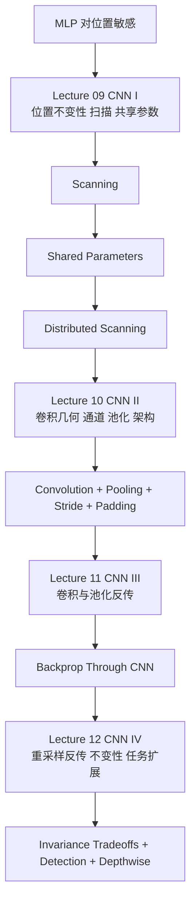

本模块只综合 Lecture 09-12 的根目录 `NOTES.md`，不引入其他资料。目标不是把 CNN 写成百科，而是把这四讲实际讲清楚的主线、术语、机制、边界和练习压成一份可复习、可回跳的中文模块导读。

## 模块用途与先修

### 你学完这部分后要能做到什么
- 说明为什么普通 MLP 对位置敏感，而 CNN 通过扫描与共享参数获得近似平移不变性。[Lecture 09 00:03:20-00:08:12]
- 把 `scanning -> shared-parameter giant network -> layer-wise maps scan -> convolutional neural network` 这条链条完整复述出来。[Lecture 09 00:11:54-00:18:40, 00:20:42-00:29:42, 00:40:35-00:59:15]
- 解释卷积层的局部乘加、跨通道求和、输出尺寸变化、zero padding、stride、pooling、flattening、receptive field 等前向机制。[Lecture 10 00:34:07-00:49:12, 00:49:45-01:19:39]
- 解释卷积层与池化层的反向传播规则，并说清哪些地方必须做梯度累加。[Lecture 11 summary; Lecture 12 00:00:49-00:40:35]
- 说明课程里明确给出的边界：某些 stride 公式与 ASR 有噪声，卷积/池化的精确尺寸式要以原讲回听为准；变换不变性的显式滤波器族理论可行，但工程上通常不划算。[Lecture 10 00:56:06, 00:57:47; Lecture 12 00:50:28-01:00:26]

### 先修要求
- 已掌握 MLP、softmax、梯度下降、反向传播、链式法则。[Lecture 09 00:02:19-00:02:58; Lecture 11 summary]
- 已接受“层级表示”这件事：低层学简单局部模式，高层学组合模式。[Lecture 09 00:48:49-01:04:19]
- 能读懂基本张量维度：空间尺寸、通道数、局部窗口、stride、padding。[Lecture 10 summary]

## 讲次推进与阅读入口

| 讲次 | 入口 | 这讲解决什么问题 | 对模块的贡献 |
| --- | --- | --- | --- |
| Lecture 09 | [CNN I](/courses/cmu-11785-s26/lectures/010/) | 为什么需要位置不变性，扫描与共享参数如何构成 CNN 雏形 | 给出 shift invariance、scanning、distributed scanning、filter/receptive field/flattening/stride/pooling 的第一版定义 |
| Lecture 10 | [CNN II](/courses/cmu-11785-s26/lectures/011/) | CNN 从哪里来，卷积/池化/重采样前向到底怎么做 | 给出生物学动机、neocognitron、LeCun 工程化、卷积几何、多通道、padding、1x1 conv、架构设计 |
| Lecture 11 | [CNN III](/courses/cmu-11785-s26/lectures/012/) | CNN 怎么训练 | 给出卷积层、max/mean pooling 的反向传播主规则 |
| Lecture 12 | [CNN IV](/courses/cmu-11785-s26/lectures/013/) | 反传补完、任务扩展与历史收束 | 给出 downsampling/upsampling backward、变换不变性边界、定位 head、depthwise conv、LeNet/AlexNet/ResNet 脉络 |

建议顺序：09 -> 10 -> 11 -> 12。Lecture 09 建立“为什么”，Lecture 10 建立“前向怎么跑”，Lecture 11-12 建立“怎么学、边界在哪”。

## 讲次依赖图

## 核心主线

### 1. 为什么要从 MLP 走向 CNN
- 课程不是先定义“卷积”再讲用途，而是先展示失败案例：语音里的 `welcome` 或图像里的 `flower` 只要平移位置，普通 MLP 就会把它们当成完全不同的输入向量。[Lecture 09 00:03:20-00:07:16]
- 因此真正的问题定义是 `只关心模式是否存在，不关心它出现在何处`，老师把这件事命名为 `shift invariance`。[Lecture 09 00:07:16-00:07:46]
- 数据增强可以部分缓解，但课程明确说这不是首选结构性答案，因为它要求更多数据和更大的网络。[Lecture 09 00:08:12]

一句话总结：CNN 在这门课里的起点不是“图像专用模块”，而是“对位置变化更稳健的模式扫描结构”。

### 2. 扫描、共享参数与 giant network
- 第一版答案是扫描：在每个位置切一个局部窗口，用同一个 MLP 做局部检测，再把各位置输出用 `max / softmax / perceptron / 更一般的 MLP` 聚合成整体判断。[Lecture 09 00:10:45-00:12:45]
- 老师随后把扫描重写成一个 `giant network`：每个窗口对应一个子网，但这些子网是 `identical subnets`，即参数共享。[Lecture 09 00:13:26-00:15:07]
- 这一步非常关键，因为一旦承认“它本质上仍是一张大网络”，训练就仍然可以走常规 backprop，只是共享权重的梯度要合并。[Lecture 09 00:22:06-00:29:42]

共享参数规则：如果多条边都等于同一个公共值 $W_s$，那么对 $W_s$ 的梯度就是所有共享边梯度的和，再更新一次并复制回所有副本。[Lecture 09 00:25:29-00:29:22]

### 3. distributed scanning 为什么是 CNN 的效率核心
- 课程明确反对把第一层做成“直接识别整朵花/整个单词”的庞大 detector，因为这会把复杂模式全压给第一层。[Lecture 09 00:47:10-00:00:49, 01:04:19]
- `distributed scanning` 的做法是：第一层只学更小的局部模式，例如花瓣、花蕊、短时语音子单位；更高层再组合这些局部响应。[Lecture 09 00:48:49-00:59:15, 01:00:25-01:04:19]
- 它的收益在课程里被明确拆成三类：
  1. 表示更层级化、更一般化。[Lecture 09 01:04:00-01:04:19]
  2. 参数更少，示例对比为 `8D*N1 + N1*N2 + N2*N3` 对 `2D*N1 + 4*N1*N2 + N2*N3`。[Lecture 09 01:05:44-01:09:42]
  3. 相邻扫描窗口可复用中间计算。[Lecture 09 01:10:45-01:14:05]
- 课程还给了一个数值对比：某个样例里非分布式要 1034 个参数，分布式只要 194 个。[Lecture 09 01:13:07]

### 4. 从生物视觉到现代 CNN
- Lecture 10 先从 Hubel-Wiesel 的感受野、兴奋/抑制区域、方向选择性讲起，用 S-cells 找模式、C-cells 清理模式作为 CNN 的生物学直觉来源。[Lecture 10 00:06:07-00:09:56]
- Fukushima 的 neocognitron 把这个想法变成计算模型：S-plane 内同类神经元响应相同，只是看输入的不同局部位置，因此能提供 position invariance；C-plane 再做局部清理。[Lecture 10 00:14:28-00:19:19]
- LeCun 的工程化改动包括：
  1. 把同一 plane 里很多相同神经元改写成一个 filter 在输入上扫描，数学等价。[Lecture 10 00:27:01-00:27:59]
  2. 把椭圆感受野改成方形感受野。[Lecture 10 00:28:02-00:28:37]
  3. 让 C-cells 用 stride 汇总前层，形成 downsampling。[Lecture 10 00:28:42-00:29:05]
  4. 在末端加分类层并用 ground-truth labels + backprop 训练整网。[Lecture 10 00:25:01-00:26:27]

这条历史线的意义是：课程把现代 CNN 解释成“局部感受野 + 参数共享 + 局部聚合 + 监督训练”的工程化组合，而不是孤立出现的新算子。

## 前向机制总表

### 1. 卷积几何：一个输出位置到底怎么算
- 一个输出 map 的一个位置，先取输入的一个局部窗口，与 filter 对应位置逐元素相乘并求和；若有多个输入通道，则对每个通道都做一次，再跨通道求和，最后加 bias，得到 affine 值；再逐点过激活，形成 activation map。[Lecture 10 00:34:07-00:39:58]
- 课程用 3x3 二值示意图举例，左上角九项乘加求和得到 4。[Lecture 10 00:36:07-00:36:45]
- 课程还把多通道卷积改画成 `input cuboid` 与 `filter cuboid` 的内积，这样“先单图求和、再跨图求和”可以统一成一个三维局部块的乘加总和。[Lecture 10 00:40:52-00:41:56]

最稳的记忆句式：`局部乘加 -> 跨通道求和 -> 加 bias -> 逐点激活`。[Lecture 10 00:45:54-00:46:33]

### 2. 通道、filters、maps 三者关系
- 输出 maps 的数量 = filters 的数量，因为一个 filter 生成一个输出 map。[Lecture 10 00:46:55-00:47:35]
- 单个 filter 的输入 channels 数 = 输入 maps 数，因为它必须同时读取前一层所有 maps。[Lecture 10 00:37:16-00:38:35, 00:47:35-00:47:47]
- pooling 是逐 channel 独立做的，因此 pooling 前后 channels 数不变。[Lecture 10 00:52:55-00:53:40]
- 课程还特别指出：1x1 convolution 仍然是卷积层，但它只在每个空间位置对输入 channels 做加权组合，不读取空间邻域；老师把它解释成 `non-distributed scan`。[Lecture 10 01:07:01-01:08:02]

### 3. 输出尺寸、padding 与 stride
- 无 padding 时，课程用 `5x5 输入 + 3x3 filter -> 3x3 输出` 解释卷积为什么会缩小空间尺寸；一般表达意图是输入边长 $n$、filter 边长 $m$ 时，输出边长为 $n-m+1$。[Lecture 10 00:42:26-00:44:00]
- 若想保持输入输出同尺寸，课程给出的直觉是做 zero padding；当 filter 边长为奇数 $m$ 时，上下左右各补 $(m-1)/2$ 层零，可恢复 same-size 卷积。[Lecture 10 00:44:44-00:45:44]
- stride 是扫描步长。Lecture 09 已先给出定性定义：stride 增大时，输出图会缩小，计算量也下降。[Lecture 09 01:17:58-01:19:02]
- Lecture 10 补充说：卷积/池化常把“算子本身”和“downsampling”合并成带 stride 的扫描；精确尺寸公式在 notes 中被标记为 ASR 不稳，因此这里保留结构结论，不擅自补板书公式。[Lecture 10 00:55:09-00:57:47]

### 4. pooling、downsampling、upsampling 各自干什么
- max pooling 解决的是局部 jitter sensitivity：同一花瓣在小窗口里轻微平移，不应让高层“花”的判断突然失效。[Lecture 10 00:49:45-00:51:26]
- 课程定义非常直接：在局部窗口中找到最大值，把它复制到输出；为了后续反传，要先保存最大值位置。[Lecture 10 00:51:51-00:52:18]
- mean pooling 则是窗口均值，是另一种局部聚合设计。[Lecture 10 00:52:18-00:52:40]
- downsampling 是尺寸变化操作，不等于 pooling；它表示每隔 $S$ 只保留一行/列，删除其余 $S-1$ 行/列。[Lecture 10 00:54:19-00:55:09]
- upsampling 是插入零来放大尺寸，课程强调它通常后接 convolution，而不是 pooling，否则零值会直接干扰聚合。[Lecture 10 00:58:18-00:59:18]

一句区分：`pooling 是局部聚合，down/upsampling 是尺寸变换，stride 是把两者与扫描实现合并的工程手段。` [Lecture 10 00:57:09]

### 5. receptive field、flattening 与层级表示
- Lecture 09 先给出了直觉：高层单元的响应可以沿依赖链一路回溯到原图的某个更大区域，这是 receptive field 的前置想法。[Lecture 09 00:42:49]
- Lecture 09 后半段正式定义：filter 是扫描神经元的一组权重；receptive field 是一个神经元在原输入上实际“看到”的区域；高层 receptive field 会受下层 receptive field 与 stride 递推放大。[Lecture 09 01:16:55-01:17:07]
- flattening 则是把末层 maps 改排成向量后送给 softmax/MLP。[Lecture 09 01:17:45-01:17:58; Lecture 10 01:13:53-01:14:10]
- 层级表示的课堂语言非常一致：低层学边缘/花瓣/短时语音子模式，高层学部件组合与更大对象。[Lecture 09 00:50:52-00:59:35; Lecture 12 01:00:24-01:10:23]

### 6. 架构视图：课程里认可的最小 CNN 叙述
- `若干 convolutional layers + 若干 pooling layers + flatten + MLP/softmax`。[Lecture 10 00:32:40-00:33:27]
- 更具体的早期例子是 LeCun digit recognizer：`5 个 5x5 filters -> 2x2 stride 2 pooling/downsampling -> 10 个 5x5 filters -> 再做一次因子 2 max pooling -> MLP`。[Lecture 10 01:20:25-01:20:57]
- 课程还给出 LeNet-5 的更详细历史结构，以及 AlexNet、ZFNet、VGG、Inception、ResNet、DenseNet 的后续演化脉络，但作为模块复习，这里只需记住：课程把它们用作“CNN 工程成熟与性能跃迁”的历史证据，而不是要求你在本模块内背完整网络表。[Lecture 12 01:10:20-01:20:19]

## 训练与反向传播

### 1. 训练入口没有变，变的是结构
- 课程反复强调：CNN 不是换了一套优化法。训练样本依然是 `输入 + 目标输出`，损失仍是 divergence / cross-entropy 一类，参数仍靠 gradient descent 及其变体更新。[Lecture 10 01:21:04-01:21:22; Lecture 11 00:12:06-00:14:22]
- 结构上的不同在于：最终 MLP 的输入只是卷积部分最后一层输出 maps 的展开，所以可以先在最终 MLP 上做常规 backprop，再把梯度 reshape 回卷积部分继续传。[Lecture 11 00:14:22-00:15:26]

### 2. 卷积层反传：课程要求记住的三条规则
- 激活层局部规则：

  $$
  \frac{\partial Div}{\partial z(l,m,x,y)} = \frac{\partial Div}{\partial y(l,m,x,y)} f'(z(l,m,x,y))
  $$

  [Lecture 11 summary; Lecture 11 00:19:01-00:20:16]

- 输入 maps 的梯度：课程把它总结为 `补零后的输出导数图` 与 `翻转 filter` 的卷积，并且要对所有输出 maps 的贡献求和。[Lecture 11 summary]
- filters 的梯度：课程把它总结为 `输入图` 与 `输出仿射图导数` 的卷积型求和，而且这里不需要翻转 filter。[Lecture 11 summary]

必须死记的区分：`求输入梯度要翻转 filter，求 filter 梯度不翻转。` [Lecture 11 易错点]

### 3. pooling 反传：最大值路由与平均分配
- max pooling backward：只有前向时赢得最大值的那个输入位置接收梯度，其余位置为 0。[Lecture 12 00:10:45-00:20:44]
- mean pooling backward：若窗口为 $K \times K$，则每个输入位置接收 $1/K^2$ 倍的输出梯度。[Lecture 12 00:10:45-00:20:44]
- 两者在窗口重叠时都必须累加，不可覆盖；课程甚至拿旧版 PyTorch bug 当过反例提醒。[Lecture 12 00:10:45-00:20:44]

### 4. downsampling / upsampling backward
- downsampling backward：前向被删掉的位置梯度为 0；前向被直接复制到输出的位置，把输出梯度原样复制回去。[Lecture 12 00:20:41-00:30:39]
- upsampling backward：前向人工插入的零不对应任何输入变量，因此不回传梯度；只有那些真实复制来的位置把梯度取回输入。[Lecture 12 00:20:41-00:30:39]
- 课程的总提醒是：这两者在概念上互为对偶，但真正实现不能忽略边界，必须保存前向输入尺寸。[Lecture 12 00:20:41-00:30:39, 00:40:32-00:50:31]

### 5. “从前向代码倒写 backward” 是统一方法
- Lecture 12 给出一个非常实用的总原则：不要把卷积反传想成神秘特例，先写前向代码，再按依赖关系逆序写 backward。[Lecture 12 00:30:38-00:40:35]
- 老师用 $z = wx,\ y = \sigma(z)$ 做最小例子，先求 $dL/dz$，再求 $dL/dw$ 与 $dL/dx$；卷积只不过是把这件事放进多层循环和共享参数里。[Lecture 12 00:30:38-00:40:35]

## 关键比较

### 1. 普通 MLP vs CNN
- MLP：把平移后的模式视为不同输入点，对位置敏感。[Lecture 09 00:03:49-00:07:16]
- CNN：把同一个 detector 复用到不同位置，用结构性共享换取 shift invariance。[Lecture 09 00:11:54-00:15:07]

### 2. non-distributed scan vs distributed scan
- non-distributed：第一层直接看大窗口，参数更多，低层负担更重，不要求输出 maps 与输入保持几何对应。[Lecture 09 01:02:04-01:09:42]
- distributed：每层都从前层取窗口继续处理，保留几何布局，更利于层级组合、参数压缩和计算复用。[Lecture 09 00:56:17-01:14:05]

### 3. convolution vs pooling vs downsampling
- convolution：局部乘加、跨通道求和、可学习。[Lecture 10 00:34:07-00:49:12]
- pooling：局部聚合，通常不学习，主要为 jitter robustness。[Lecture 10 00:49:45-00:53:40]
- downsampling：尺寸操作，可独立理解，也可被 stride 合并进前两者。[Lecture 10 00:54:19-00:57:24]

### 4. 标准卷积 vs depthwise convolution
- 标准卷积：每个 filter 跨所有输入通道卷积后求和，形成一个输出通道。[Lecture 12 01:00:24-01:10:23]
- depthwise convolution：先保留逐通道卷积结果，再用不同加权组合出多个输出，因此更省参数、计算量和中间激活量，但课程也明确说它的表达能力通常不如完整卷积。[Lecture 12 summary; Lecture 12 01:00:24-01:10:23]

### 5. 显式变换不变性 vs 数据增强
- 理论做法：枚举旋转/缩放等变换后的滤波器族，对每个版本都做卷积。[Lecture 12 00:50:28-01:00:26]
- 工程结论：计算量和通道数爆炸，实际通常改用数据增强。[Lecture 12 00:50:28-01:00:26]

## 边界与不要擅自补的地方

- 本模块可以明确讲 `卷积、池化、重采样、反传` 的结构规则，但不能把 notes 中标记为 ASR 不稳的 stride 公式擅自正规化成精确板书版；这些地方应回听原讲确认。[Lecture 10 00:56:06, 00:57:47]
- Lecture 10 讨论“总值数量”来解释 retain information，这是一条课堂设计直觉，不是严格信息论定理；因此只能按课程语义复述，不要扩写成严格证明。[Lecture 10 01:15:02-01:18:47]
- 课程讲了 rotation/scaling invariance 的理论构造，但结论不是“默认就该这么做”，而是“理论漂亮，工程太贵，通常不这么做”。[Lecture 12 00:50:28-01:00:26]
- 课程讨论了定位、bounding box 和 pose estimation，但这部分是“共享卷积表示后接额外 head”的任务扩展，不是本模块要求你掌握完整检测器框架。[Lecture 12 00:50:28-01:00:26]
- 课程给出 LeNet/AlexNet/ResNet 历史线索时，目的在于建立脉络与直觉，不是在这四讲里推导所有细节超参数。[Lecture 12 01:10:20-01:20:19]

## 易错点与复习标记

### 高优先级易错点
- 不要把位置不变性理解成“靠更多数据凑出来”；这四讲始终把它当成结构共享问题。[Lecture 09 00:08:12]
- 不要把 giant network 当普通全连接大网；扫描网络的关键是重复子网与参数共享。[Lecture 09 00:13:26-00:15:07]
- 不要把 distributed scanning 理解成“窗口变小了所以任务变简单”；它是把同等检测范围拆到多层完成。[Lecture 09 00:48:49-00:59:15]
- 不要混淆 `output maps 数 = filters 数` 与 `单个 filter 的 channels 数 = 输入 maps 数`。[Lecture 10 00:40:08-00:40:23, 00:46:55-00:47:47; Lecture 11 00:07:27]
- 不要把 pooling 与 downsampling 视为同一个概念；前者是聚合，后者是尺寸变化。[Lecture 10 00:57:09]
- 不要把 1x1 convolution 误解成“没有卷积”；课程明确把它解释成只在通道维做加权组合的 non-distributed scan。[Lecture 10 01:07:01-01:08:02]
- 卷积反传里别把两个方向弄反：输入梯度要翻转 filter，filter 梯度不翻转。[Lecture 11 summary]
- pooling backward、卷积输入 backward、重叠窗口场景下都可能需要 `+=` 累加，而不是覆盖赋值。[Lecture 11 易错点; Lecture 12 00:10:45-00:20:44]

### 快速自检标记
- 如果你不能在 1 分钟内解释 `为什么扫描网络仍可用 backprop 训练`，回到 Lecture 09 的共享参数梯度段。[Lecture 09 00:23:20-00:29:42]
- 如果你说不清 `一个输出位置的卷积值` 是怎么来的，回到 Lecture 10 的 3x3 乘加例子。[Lecture 10 00:36:07-00:36:45]
- 如果你混淆 `pooling` 和 `stride`，回到 Lecture 10 的 resampling 总结段。[Lecture 10 00:54:19-00:59:18]
- 如果你说不清 `梯度为什么必须同形`，回到 Lecture 12 的 downsampling / upsampling backward 段。[Lecture 12 00:20:41-00:30:39]

## 掌握标准

### 按讲次掌握
- Lecture 09：能解释 shift invariance、扫描、共享参数梯度求和、distributed scanning 的三项收益，并说出 filter、receptive field、flattening、stride、pooling 的第一版含义。
- Lecture 10：能从局部窗口出发，口头算出一个卷积输出位置；能说清通道关系、padding、stride、pooling、1x1 conv、flatten 和最小 CNN 架构。
- Lecture 11：能写出激活层链式法则、卷积输入梯度规则、卷积 filter 梯度规则、max/mean pooling backward 规则。
- Lecture 12：能解释 downsampling/upsampling backward、stride 与 fractional stride 的拆分视角、显式变换不变性的工程代价、定位双 head、depthwise conv 与历史脉络。

### 模块级掌握
- 能把这四讲压缩成一句工程描述：`CNN 是一种共享参数的分层扫描网络，通过卷积与池化构造局部到整体的表示，并可用常规 backprop 训练。`
- 能在不查资料的情况下说出：为什么卷积层要跨所有输入通道、为什么 pooling 不改 channels 数、为什么高层 receptive field 更大、为什么重叠窗口 backward 要累加。
- 能判断某个说法是否超出了 notes 的边界，例如把 stride 公式写得比 notes 更确定、把 retain information 说成严格定理、把旋转不变结构当成默认实用方案。

## 10 个递进练习（含答案）

### 1. 为什么普通 MLP 识别了“左上角的花”，却不保证识别“右下角的花”？
答案：因为目标一旦平移，展开后的输入向量就变成另一个点；普通 MLP 对位置敏感，不会天然把两个位置视为同一模式。[Lecture 09 00:04:44-00:07:16]

### 2. 扫描式检测的最小结构是什么？
答案：在每个位置切局部窗口，用同一个 MLP 做局部检测，再把各位置输出用 max、softmax 或其他聚合器合并成整体判断。[Lecture 09 00:10:45-00:12:45]

### 3. 共享参数网络里，为什么公共权重的梯度要做求和？
答案：因为同一个公共值同时影响多条共享边，对它求损失导数时必须把所有路径的贡献累加；在约束 `w_i = W_s` 下，每条边对公共值的导数都是 1，所以最后就是求和。[Lecture 09 00:25:29-00:29:22]

### 4. 若输入是 `5x5`，filter 是 `3x3`，不做 padding 时输出为什么是 `3x3`？
答案：因为 filter 左上放置后，每个方向只能再移动两步，总共只有 3 个合法位置；课程的一般表达意图是输出边长为 `n-m+1`。[Lecture 10 00:42:26-00:44:00]

### 5. 为什么一个 filter 的 channels 数必须等于输入 maps 数？
答案：因为当前输出 map 必须从前一层所有输入 maps 共同计算；每个输入 map 都要有对应的 filter channel 参与局部乘加。[Lecture 10 00:37:16-00:38:35, 00:47:35-00:47:47]

### 6. 1x1 convolution 在这门课里为什么仍然有意义？
答案：因为它虽然不看空间邻域，但会在每个位置对各输入 channels 做加权组合；课程把它解释成 non-distributed scan。[Lecture 10 01:07:01-01:08:02]

### 7. 为什么课程说 pooling 和 downsampling 不能混为一谈？
答案：因为 pooling 是窗口内的聚合算子，downsampling 是尺寸变化操作；实践里常通过 stride 合并实现，但概念上必须区分。[Lecture 10 00:57:09]

### 8. 卷积层反传时，求输入 maps 梯度和求 filter 梯度的规则分别是什么？
答案：输入 maps 梯度是补零后的输出导数图与翻转 filter 的卷积，并对所有输出 maps 求和；filter 梯度是输入图与输出仿射图导数的卷积型求和，不翻转 filter。[Lecture 11 summary]

### 9. max pooling backward 为什么必须保存前向时最大值的位置？
答案：因为只有那个赢家位置真正影响了输出，所以反传时只有它接收梯度；如果窗口重叠，还要把多个来源的梯度累加到同一位置。[Lecture 10 00:51:51-00:52:18; Lecture 12 00:10:45-00:20:44]

### 10. 为什么显式做旋转/缩放不变的滤波器族，课程上被判定为“理论漂亮但工程昂贵”？
答案：因为要把允许的变换离散枚举出来，并对每个变换后的滤波器都做卷积；这会迅速扩大计算量和输出通道数，所以实际常改用数据增强。[Lecture 12 00:50:28-01:00:26]

## 复习顺序

1. 先复习 Lecture 09 的 `为什么需要 CNN`：只抓 `shift invariance -> scanning -> shared parameters -> distributed scanning` 四步。
2. 再复习 Lecture 10 的 `前向结构`：卷积一个位置怎么算、通道关系是什么、padding/stride/pooling/downsampling/upsampling 各干什么。
3. 然后复习 Lecture 11 的 `backprop 三规则`：激活层链式法则、卷积输入梯度、卷积 filter 梯度。
4. 接着复习 Lecture 12 的 `补完与扩展`：max/mean pooling backward、down/upsampling backward、从前向代码倒写 backward。
5. 最后回到比较与边界：1x1 conv、depthwise conv、显式变换不变性 vs 数据增强、定位双 head、LeNet/AlexNet/ResNet 历史位置。

## 最后一句模块化总结

如果只允许保留一句话，这四讲的 CNN 可以概括为：`它把“模式可能出现在不同位置”这个问题，改写成“同一组可学习参数在不同位置反复扫描，并在层级表示中逐步组合”的问题；前向靠卷积、池化和重采样组织表示，训练仍靠常规 backprop。`
