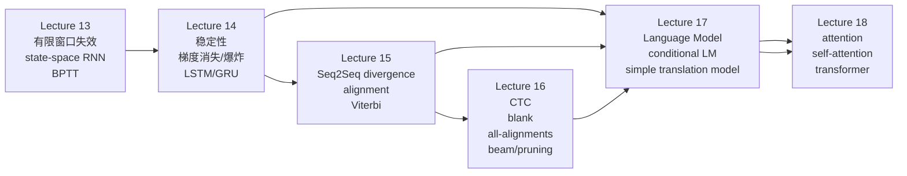

本模块只综合以下 6 份 root `NOTES.md`，不引入其他外部材料或额外结论：

1. [Lecture 13: RNNs I](/courses/cmu-11785-s26/lectures/014/)
2. [Lecture 14: RNNs II](/courses/cmu-11785-s26/lectures/015/)
3. [Lecture 15: Seq2Seq + Alignment + Viterbi](/courses/cmu-11785-s26/lectures/016/)
4. [Lecture 16: CTC + Blank + Beam](/courses/cmu-11785-s26/lectures/017/)
5. [Lecture 17: Language Models + Translation](/courses/cmu-11785-s26/lectures/018/)
6. [Lecture 18: Attention + Transformers Intro](/courses/cmu-11785-s26/lectures/019/)

## 模块用途

这一模块把课程在 Lecture 13-18 中建立的主线收束成一条连续链：

- 为什么有限窗口不够，必须引入递归状态。
- 为什么朴素 RNN 会在记忆与训练上同时失稳，进而需要 LSTM/GRU。
- 为什么序列到序列训练的关键不只是 backprop，而是输出序列与目标序列之间的 divergence、alignment 与 decoding。
- 为什么 simple seq2seq 还会把整段输入压得过狠，最终走到 attention、self-attention、masked self-attention 与 transformer。

## 先修要求

- 已掌握前馈网络、链式法则、softmax、KL divergence / cross entropy 的基本含义。
- 能接受“矩阵乘积、特征值/奇异值、Jacobian 连乘”这类表述。
- 已知道 `<sos>`、`<eos>`、one-hot、embedding、beam search 这些课堂语境中的基本对象。

## 学习推进与相对链接

| 顺序 | 讲次 | 核心推进 | 关键时间范围 | 页码/不确定性保留 |
| --- | --- | --- | --- | --- |
| 1 | [Lecture 13](/courses/cmu-11785-s26/lectures/014/) | 有限响应 vs 无限响应，Jordan/Elman/state-space RNN，BPTT，双向 RNN 动机 | 00:00:14-01:20:49 | 课件 `p.6-p.21` 与 `01:09:50` 之后双向 RNN 口述不完全对齐，notes 已标 `[需回听]` |
| 2 | [Lecture 14](/courses/cmu-11785-s26/lectures/015/) | 线性化稳定性、特征值/奇异值、vanishing gradient、LSTM/GRU | 00:00:03-01:20:03 | LSTM 结构以 transcript 为主；`constant error carousel` 等术语在 notes 中已保留 `[需回听]` |
| 3 | [Lecture 15](/courses/cmu-11785-s26/lectures/016/) | time-synchronous loss、alignment、compression/expansion、Viterbi | 00:00:06-01:21:29 | notes 内有分段页码 `p.1-p.102`，音素与个别术语存在 `[需回听]` |
| 4 | [Lecture 16](/courses/cmu-11785-s26/lectures/017/) | all-alignments 训练、alpha/beta/gamma、blank、CTC decoding、beam/pruning | 00:00:05-01:21:08 | `gamma` 导数化简、若干数值例子与 OCR 公式页保留 `[需回听]` |
| 5 | [Lecture 17](/courses/cmu-11785-s26/lectures/018/) | one-hot/projection/embedding、LM、conditional LM、simple translation model、teacher forcing、beam | 00:01:20-01:22:08 | notes 的补充页码覆盖 `p.20-p.144`；外语词串以 notes 当前保留为准 |
| 6 | [Lecture 18](/courses/cmu-11785-s26/lectures/019/) | attention、Q/K/V、self-attention、positional encoding、masked self-attention、transformer、GPT/BERT | 00:00:05-01:21:25 | `p.18-p.31` 与 `p.125-p.165` 为主要锚点；公式 OCR 噪声与若干 poll 细节保留 `[需回听]` |

## 依赖图

## 一条主线：从递归到 transformer

### 1. 为什么必须从有限窗口走向递归

Lecture 13 的起点非常明确：语音、文本、股价这些任务的困难不只是“输入是多个向量”，而是“顺序本身携带信息”。只看固定窗口的 time-delay / 卷积式结构，老师把它归成有限响应系统：某一时刻输入只会影响未来有限个时间步。股价里的周趋势、月趋势、季节趋势与年度趋势，正是这一限制的反例来源。

于是课程要的是无限响应系统，也就是今天发生的事可以持续影响未来任意时刻。Lecture 13 依次经过输出反馈、Jordan、Elman，最终把真正可训练的主模型收束到标准 state-space RNN：

$$
h_t = f(x_t, h_{t-1}), \qquad y_t = g(h_t)
$$

notes 中更具体的单层口头整理是：

$$
z_t = W_x x_t + W_h h_{t-1} + b, \qquad h_t = \phi(z_t), \qquad y_t = \psi(W_y h_t + b_y)
$$

这里要保留两条课堂边界：

- `h_{-1}` 必须先定义，否则递归根本无法启动。
- Jordan/Elman 虽然都在“用过去”，但老师把它们视为过渡方案，因为它们没有把“跨时间可训练的状态”放在真正合适的位置上。

### 2. 为什么 BPTT 不是新魔法，而是“共享参数深网络”的普通反传

Lecture 13 后半与 Lecture 14 前部把 RNN 的训练统一成一条简单观点：时间展开后的 RNN 看起来是很多列网络，但本质上是同一组参数在各时间步反复使用。因此：

- 激活处仍然乘 Jacobian。
- 变量分叉处仍然把梯度相加。
- 权重梯度仍然是“输入 × 对 pre-activation 的梯度”。
- 唯一新增点是：同一组参数的梯度要沿时间维累加，而不是每步独立更新。

Lecture 13 为了先把 BPTT 讲清楚，明确做了一个局部化简：先假设损失在时间上可以写成逐时刻一一对应的局部项。Lecture 15 之后课程才把“loss 本身如何定义”重新拉回来，说明这正是 sequence-to-sequence 的真正难点。

### 3. 为什么朴素 RNN 会同时在前向记忆和反向训练上失稳

Lecture 14 先不急着修模型，而是先在线性化假设下拆问题。老师的入口是：

- 只分析发生递归的隐藏层。
- 先把隐藏激活设成恒等，得到线性递推。
- 先看单输入响应，再利用线性叠加推广到整体。

线性化后的课堂主式是：

$$
h_k = W_h h_{k-1} + W_x x_k
$$

沿时间展开后，某个早期输入在未来的影响会反复乘上 `W_h`。于是得到 Lecture 14 的两个核心判断：

- 标量情形看 `w^t`：`|w| > 1` 爆炸，`|w| < 1` 衰减。
- 矩阵情形看 `W^t`：长期行为由特征值模长主导，只有特征值恰好处在合适位置时，某些方向才能不爆炸也不消失。

再把非线性加回来，问题没有消失，只是换了形态：

- sigmoid 很快饱和，最后主要记住偏置而不是输入。
- tanh 相对好一些，但仍会遗忘。
- ReLU 更接近线性系统的“爆炸或归零”。

Lecture 14 随后把这一点与深网络梯度问题合并：时间展开后的 RNN 就是一张很深的网络，梯度要不断经历“激活 Jacobian × 权重矩阵”的长链连乘。老师的结论不是“绝不会爆炸”，而是“主导现象通常是大多数方向上的梯度消失，爆炸只发生在少数方向上”。

### 4. LSTM 的修复逻辑不是“更复杂”，而是“把真正有害的部件移出记忆主干”

Lecture 14 后半不是直接丢公式，而是先给出设计原则：

- 记忆主干上不要再放会持续放大/缩小的循环权重。
- 记忆主干上不要再放会不断收缩 Jacobian 的循环非线性。
- “记多久”应该由输入驱动，而不是由参数谱性质硬决定。

因此出现 constant error carousel：一条尽量原样传递记忆的主通道。课堂用“代码括号匹配”当主例子：看到左花括号后，模型应一直保留相关记忆，直到未来出现匹配闭合信号，而不是固定几步后自动忘掉。

在 notes 的整理里，LSTM 的前向主式是：

$$
c_t = f_t \ast c_{t-1} + i_t \ast \tilde{c}_t
$$

$$
h_t = o_t \ast \tanh(c_t)
$$

其中：

- `f_t` 是 forget gate，决定旧记忆保留多少。
- `i_t` 是 input gate，决定新模式允许写入多少。
- `\tilde{c}_t` 对应老师口述的 pattern detector 输出，notes 为了区分写成候选写入项。
- `o_t` 是 output gate，决定当前时刻把多少记忆暴露为隐藏状态。

Lecture 14 还保留了两个重要边界：

- LSTM 显著缓解长期记忆与梯度消失问题，但并没有形式化保证“一定学到正确的忘记/写入语义”。老师把这称为 inductive bias。
- LSTM 仍可能出现 exploding gradient，所以它不是“绝对稳定”，只是实践上远好于朴素 RNN。

### 5. 序列到序列的难点转移到 loss、alignment 与 decoding

Lecture 15 先把问题从“RNN 如何反传”移到“序列输出与目标序列怎么比较”。课程依次区分：

- conventional MLP 也可以做序列，只是序列性全压在 divergence 定义里。
- time-synchronous recurrent model：每个输入都有一个输出，最容易把总 loss 写成逐时刻项之和。
- 先读完整段、再给一个类的 sequence classification。
- order-synchronous but time-asynchronous seq2seq：顺序保持，但不知道该在哪些时刻正式读出符号。

Lecture 15 的第一轮处理不是 CTC，而是 alignment 视角：

- 已知 alignment 时，可以把目标符号沿时间轴展开，loss 就退化成逐时刻 KL / cross entropy 的和。
- 未知 alignment 时，先走 “guess alignment, then train” 路线。

为此课程引入 compression / expansion：

- expanded / aligned time-synchronous sequence 沿持续时长重复符号。
- compressed sequence 删去重复，只保留 order-synchronous 输出。

alignment problem 被重述为：给定压缩后的目标符号序列、输入序列与当前模型，找出“压缩后恰好等于目标序列”的最可能 time-synchronous sequence。Lecture 15 的 reduced table、合法路径、只准“向右或右下”移动的 DAG，都是为 Viterbi 准备的。

### 6. Viterbi 路线能工作，但它的失败模式也很明确

Lecture 15 的 Viterbi 逻辑是经典动态规划：

- 一个节点的最佳路径一定来自其某个父节点的最佳路径扩展。
- 所以每个节点只需保留 best parent 与 best path score。
- 从右下角回溯就能恢复当前模型最看好的 alignment。

得到 alignment 后，训练重新回到熟悉的逐时刻 loss。Lecture 15 结尾把整个闭环说得很清楚：

1. 初始化 alignment。
2. 按 alignment 训练模型。
3. 用当前模型重新做 Viterbi，重估 alignment。
4. 再训练。

失败模式同样明确：

- 这条路高度依赖初始 alignment。
- 差的初始猜测会诱导差的模型。
- 差的模型又会继续产出差的 alignment。
- 于是容易落进 poor local optimum。

也正因为如此，Lecture 15 最后自然转到“不显式固定单一路径”的 CTC 框架。

### 7. CTC 的关键变化不是“另一个解码器”，而是“对所有合法对齐求期望”

Lecture 16 把训练目标从“单条 best alignment”改成“所有 alignment 的期望 loss”。于是核心对象变成节点后验，而不再是唯一对齐路径。notes 中保留的定义链条是：

- `alpha`：到达某节点的所有路径总概率。
- `beta-hat`：从某节点出发并包含该节点，到终点的总概率。
- `beta`：去掉当前节点概率后的后向量。
- `gamma`：列内归一化后的节点后验。

训练目标被写成对所有节点的加权和：

$$
\text{DIV} = \sum_{t,r} -\gamma_{t,r} \log y_{t,r}
$$

而对完整输出概率向量的导数，Lecture 16 的 notes 保留了一个很重要的课堂处理：先出现

$$
\frac{\partial (\gamma \log y)}{\partial y}
$$

中的两项，然后老师说把显式的

$$
(\partial \gamma / \partial y) \log y
$$

这项先扔掉，得到 maximum likelihood 形式的简洁导数。这一点必须保留为课堂结论本身，而不能在本模块里擅自补别的证明。

### 8. blank 解决的是“重复字符歧义”，不是装饰符号

Lecture 16 进一步指出：即便训练问题解决了，若没有 blank，greedy collapse 仍无法区分 `red` 与 `read` 这类重复字符情况。于是课程把 blank 放进词表，并改变压缩规则：

- blank 是真实词表项，但最终压缩后不可见。
- 两个相同可见符号之间若没有 blank，压缩后会合并。
- 想让相同字符保留双写，中间就必须被 blank 隔开。

这会直接改写 trellis 连接规则：

- 每个节点至少有两类基本父节点/子节点。
- 当“隔两格的符号与当前不同”时，才允许 skip 连接。

Lecture 16 因此把带 blank 的扩展图重新跑一遍 alpha / beta / gamma / gradient，并把整套训练明确命名为 Connectionist Temporal Classification。

### 9. Lecture 17 先绕去 language model，不是离题，而是为了定义 decoder

Lecture 17 的前半讲的不是翻译技巧，而是 decoder 的起源：

- one-hot 之所以被保留，是因为它不预设词与词之间的几何关系。
- projection 矩阵与 one-hot 相乘，等价于取出该词的一列向量，于是得到 embedding。
- fixed-window TDNN 只能看有限历史；recurrent LM 才对应“根据全部过去预测下一个词”。

从这里课程自然得到一个关键观点：language model 表面上是在做 next symbol prediction，实质上是在给整个词序列分配概率。这个观点正是后面 decoder 与 beam search 的基础。

### 10. simple translation model 之所以成立，是因为 decoder 本质上就是 conditional language model

Lecture 17 把 delayed self-referencing seq2seq 收束成两个部件：

- encoder 把输入序列压成表示。
- decoder 以该表示为条件，结合已经生成的前缀逐词输出。

老师明确说 decoder 不是普通 LM，而是 conditional language model。推理时它要找的是：

- 给定输入，
- 从 `<sos>` 开始，
- 一直乘到 `<eos>`，
- 使整条输出路径概率乘积最大的句子。

这立即解释了为什么 greedy 可能失败。Lecture 17 的课堂反例是 `he nose` / `he knows`：局部最大词不一定导向全局最大句子，因此需要 beam search。老师同样保留了边界：beam 是务实近似，不是理论全局最优。

训练端的关键课堂词是 `cheat code`：

- 训练时把真实目标前缀送入 decoder。
- 若完全按推理模式让模型自由生成，早期错误会让后续全部位置错位，训练难以逐步比较。

这一点和 Lecture 16 的思路相通：本质上都在努力制造稳定的、可对齐的训练信号。

### 11. 注意力不是“多加一个向量”，而是彻底改写 simple seq2seq 的信息流

Lecture 18 一开始就重新批 simple model：

- encoder 端把整句压到最终一个 hidden state，过载。
- decoder 端又在递归生成中持续稀释这个表示。

于是课程先试图“把 encoder 表示喂给每个 decoder 时刻”，再试图“平均所有 encoder hidden states”，然后明确指出平均仍然不够，因为：

- 不同输出词该关注不同输入位置。
- 同一个平均向量不可能同时对所有输出都合适。

因此 context vector 变成“随输出时刻变化的加权平均”。Lecture 18 的课堂定义链条是：

1. 用 `h_i` 与 `s_{t-1}` 先算 raw score `e_i^(t)`。
2. 对同一时刻所有 raw scores 做 softmax，得到全正且和为 1 的 attention weights。
3. 用这些 weights 对输入表征做加权和，得到当前输出步的 context vector。

### 12. Q/K/V 的拆分是因为“决定关注谁”和“传递什么内容”不是同一任务

Lecture 18 用 `apple` 例子解释得很直接：

- 决定“该不该注意这个位置”时，也许知道它是 fruit / something to eat 就够了。
- 真正把内容送入 context 时，又得保留“它就是 apple”这类更细的信息。

于是：

- query 决定“我现在在找什么”。
- key 决定“这个位置拿什么被匹配”。
- value 决定“这个位置真正把什么内容传出去”。

这个拆分在 Lecture 18 里先服务于 encoder-decoder attention，随后又被搬到 self-attention 中。

### 13. self-attention 的出现，是因为 attention 已经让 recurrence 不再是唯一的信息路由方式

Lecture 18 在图像 captioning 的 CNN encoder 旁证之后，明确追问：既然 decoder 已经能显式访问全部输入位置，encoder 里的 recurrence 还必需吗。回答是否定的。但一旦去掉 recurrence，又必须解决“词表示仍然需要上下文化”的问题，例如 `apple` 在 fruit 与 Apple computer 之间的歧义。

于是 self-attention 出现：对每个位置，

- 由该位置自己的 query 去看所有位置的 keys，
- 得到对所有位置的权重，
- 再对所有 values 做加权和，
- 获得这个位置更新后的表示。

Lecture 18 继续给出两步扩展：

- multi-head：不同 heads 学不同方面的信息。
- attention 后接 MLP：否则 heads 只会并列堆放，彼此不真正混合。

### 14. positional encoding 与 masked self-attention 是 transformer 真正成立的两个补丁

如果只有 self-attention 而没有位置编码，同一个词在不同远近处重复出现时，模型可能给出不合理的近似权重。Lecture 18 因此给出位置编码的课堂要求：

- 位置向量长度一致。
- 每个位置编码唯一。
- 两个位置编码的关系应只依赖相对距离。
- notes 中保留的关系写法是：`P_(t+τ) = M(τ) P_t`。

再进一步，decoder 不能看未来，所以：

- encoder 端可以 full self-attention。
- decoder 端必须 masked self-attention。
- 而且不是只 mask 第一层，老师明确说每层 decoder 都要 mask。

### 15. transformer 在本模块中的定位

Lecture 18 对 transformer 的课堂定位很克制，但足够清楚：

- 它是“positional encoding + multi-head self-attention + MLP + residual”的 encoder / decoder 堆叠结构。
- 相比 RNN，它减少了时间递归深链带来的记忆/梯度问题。
- 更关键的是，很多计算可以并行完成，不再像 RNN 那样必须严格按顺序一步步算。

同一讲最后给出两个结构定位：

- GPT 基本上是 transformer 的 decoder。
- BERT 基本上是 transformer 的 encoder。

同时老师保留了两个 caveat：

- 不是所有 transformer 都一样，选型要看大小、速度、语种、生成式/对比式等条件。
- transformer 不一定总优于 LSTM；在相同性能下，它常需要更多参数，对小硬件不友好。

## 比较与失效模式

| 比较对象 | 课程给出的关键差异 | 主要失效模式或边界 |
| --- | --- | --- |
| 有限窗口模型 vs state-space RNN | 前者只能形成有限响应，后者可持续携带隐藏状态 | 长期依赖、季节/年度趋势、跨句/跨词长期证据会把有限窗口逼到失效 |
| Jordan / Elman vs fully recurrent RNN | 前两者在记忆位置与时间可训练性上都不彻底 | 老师认为它们不能真正把误差信号完整穿过时间传播 |
| 单向 RNN vs 双向 RNN | 是否允许当前位置利用未来上下文 | 未来不可见的任务，如股票预测，只能单向 |
| 朴素 RNN vs LSTM/GRU | 前者记忆长度主要受谱性质支配，后者用门控与记忆主干分离修复 | LSTM 仍可能 exploding；GRU 只是简化版，不是“完全正确”的唯一结构 |
| guessed alignment 训练 vs CTC | 前者押单一路径，后者对全部对齐取期望 | guessed alignment 易被差初始化拖进 poor local optimum |
| greedy decode vs beam search | greedy 每步局部选大，beam 保留 top-K 前缀 | beam 仍非理论最优，只是更实用的近似 |
| simple seq2seq vs attention seq2seq | simple model 把整句压成单表示；attention 让每步动态看不同输入 | simple model 会过载并在 decoder 中继续稀释输入表示 |
| encoder-decoder attention vs self-attention | 前者是输出端看输入；后者是同一句内位置彼此看 | self-attention 若无位置信息，会错误忽略远近差异 |
| RNN family vs transformer | recurrence 严格按序；transformer 依赖 self-attention 与位置编码，可并行 | transformer 不是在所有部署场景都更划算；小硬件成本可能偏高 |

## 推导假设与边界条件

1. Lecture 13/15 都曾先把 loss 局部化处理：先假设逐时刻一一对应，方便讲 BPTT 或 time-synchronous divergence；真正的 alignment 难点是后续补上的。
2. Lecture 14 的稳定性分析先把隐藏激活线性化为恒等，只在此基础上看 BIBO、`w^t`、`W^t`、特征值与奇异值。
3. Lecture 14 的 LSTM 动机只针对“记忆主干”的权重与非线性，不是让整个网络都线性化。
4. Lecture 15 的 Viterbi 路线默认目标是找最可能的合法 time-synchronous alignment，而不是直接找最可能的 compressed sequence。
5. Lecture 16 的 CTC 导数整理中，notes 保留了老师“先丢掉 `(∂γ/∂y) log y` 项”的处理；本模块只忠实复述这一课堂步骤。
6. Lecture 17 的 beam search 目标是整句条件概率最大，而不是某一步 softmax 最大。
7. Lecture 18 的 positional encoding、masked self-attention、GPT/BERT 都只保留了本讲结构定位，不延伸到更完整的后续家族细节。

## 易错点与复习标记

- 不要把 backward net 理解成 backprop。Lecture 13 的双向 RNN里，backward net 是另一张独立前向网络，只是时间方向反过来。
- 不要把“普通 RNN 会爆炸/消失”误解成“任何方向都一样”。Lecture 14 说的是多数方向消失，少数方向可能爆炸。
- 不要把 LSTM 的 gate 当成手工规则。Lecture 14 说得很清楚，它们是模型学出来的 inductive bias，而不是保证正确的逻辑器件。
- 不要把 greedy collapse 当成最优解码。Lecture 15 和 Lecture 16 都反复指出：局部最优路径与压缩序列总概率最优不是一回事。
- 不要把 blank 当“什么都没有”。Lecture 16 把它定义成词表中的真实符号，只是压缩后不可见。
- 不要把 decoder 当普通 language model。Lecture 17 把它明确叫作 conditional language model。
- 不要把 raw attention score 和最终 attention weight 混为一谈。Lecture 18 里 softmax 是决定性一步。
- 不要把 multi-head 当成简单复制。Lecture 18 的动机是让不同 head 学不同类型的信息，并用 MLP 混合。
- 不要忘记 decoder self-attention 每层都要 mask。Lecture 18 明确回答过这个问题。

## 不确定性与需回听点

- Lecture 13：`TDNN`、`NARX`、`affine`、双向 RNN 结尾示例中的个别词串存在 `[需回听]`。
- Lecture 14：`constant error carousel`、若干 `affine / Jacobian` 字样、部分公式页 OCR 明显失真，notes 已保留 `[需回听]`。
- Lecture 15：若干音素、`connectionist temporal` 提前预告时的措辞、`S(r)` 的局部例子有 ASR 污染。
- Lecture 16：`red/read/Ted` 数值例子、`gamma` 相关某些下标与公式 OCR、部分 poll 题面需要视频核对。
- Lecture 17：外语词串与个别人名不稳定，但不影响“LM -> conditional LM -> translation model”主链。
- Lecture 18：position encoding 公式页、某些 poll 题面与板书索引存在 OCR/字幕噪声；本模块只保留 notes 中稳定可确认的结构关系。

## 分讲掌握标准

### Lecture 13：RNN I

- 能说明为什么有限窗口模型在长期依赖任务上失效。
- 能区分 Jordan、Elman 与 standard state-space RNN 的结构差异。
- 能从时间展开角度解释 BPTT 为什么要沿时间累加共享参数梯度。
- 能判断单向与双向 RNN 各自的适用边界。

### Lecture 14：RNN II

- 能从 `w^t`、`W^t`、特征值/奇异值和激活导数四个层面解释朴素 RNN 的失稳来源。
- 能写出并解释 LSTM 的两条核心公式与各门职责。
- 能说明 LSTM 解决的是“记忆主干设计”，不是“所有问题都完全消失”。

### Lecture 15：Seq2Seq + Alignment + Viterbi

- 能解释为什么 seq2seq 的核心难点先是 divergence 与 alignment，而不是 backprop 本身。
- 能说明 compression / expansion / reduced table / 合法路径之间的关系。
- 能口头描述 Viterbi 的状态、递推与回溯。

### Lecture 16：CTC

- 能说清 alpha、beta-hat、beta、gamma 分别是什么。
- 能解释 blank 如何解决重复字符歧义，以及它如何改变 trellis 连接规则。
- 能区分 greedy path、最优压缩序列与 beam/pruning 的关系。

### Lecture 17：Language Models + Translation

- 能从 one-hot 与 projection 解释 embedding 的课堂定义。
- 能把 decoder 明确定位成 conditional language model。
- 能解释为什么训练要把目标前缀送进 decoder，以及 greedy 为什么不等于最优翻译。

### Lecture 18：Attention + Transformers Intro

- 能解释 simple seq2seq 为什么会过载，以及 attention 如何把信息流改成动态取用。
- 能区分 raw score、attention weight、context、Q/K/V 的分工。
- 能说明 positional encoding、masked self-attention、transformer、GPT、BERT 在本讲中的结构位置。

### 模块总掌握标准

- 能沿课程顺序完整讲出：有限窗口失败 -> state-space RNN -> 稳定性问题 -> LSTM -> alignment / CTC -> conditional LM -> attention -> self-attention -> transformer。
- 能在每一步指出“为什么上一代方法不够”，而不是只背结构名称。
- 能在需要时给出课堂里保留的边界、简化假设与失败模式，而不是把每一讲都说成“完美升级”。

## 12 个递进练习（含答案）

### 1. 为什么 Lecture 13 认为股票预测不是一个“看当前向量就够了”的问题？

答案：因为老师要学生注意周趋势、月趋势、季节趋势乃至年度趋势。只看有限窗口时，今天的输入只会影响未来有限几步输出，无法形成无限响应。股价例子正是用来说明“趋势”而不是“点值”才是任务核心。

### 2. Jordan、Elman 与标准 state-space RNN 的真正分界线是什么？

答案：不是“有没有用过去”，而是“历史到底存在哪里、梯度能不能真正跨时间传播”。Jordan 主要把历史压在输出摘要里，Elman 通过 context copy 使用过去隐藏值，但 Lecture 13 认为它们都没有像标准 state-space RNN 那样把可训练状态直接放在跨时间递归主链上。

### 3. 为什么 BPTT 中同一组权重的梯度必须按时间求和？

答案：因为时间展开后看到的是很多列网络，但这些列共享同一组参数。每个时间步只贡献局部梯度项，更新前必须把所有时间步的贡献累加起来，而不是把每列当独立参数训练。

### 4. Lecture 14 为什么说朴素 RNN 的“记忆多久”主要由参数而不是由输入语义决定？

答案：在线性化分析下，早期输入的影响会不断乘上 `w^t` 或 `W^t`；长期行为由标量模长或矩阵特征值主导。再把非线性加回来，sigmoid/tanh 也主要把末态拉向由参数决定的区域，因此老师才说系统最后主要记住的是参数和偏置，而不是具体输入内容。

### 5. LSTM 为什么要把非线性放到输出旁路，而不是放在记忆主干上？

答案：因为 Lecture 14 的修复原则就是保护长期记忆主路。若主干上再放非线性，长期记忆仍会在时间上传播时被收缩或扭曲；所以记忆主干尽量保持 constant error carousel，而非线性通过 `h_t = o_t * tanh(c_t)` 在输出端使用。

### 6. Lecture 15 中，为什么“知道目标符号序列”不等于“知道 alignment”？

答案：因为目标符号序列只给出了 order-synchronous 输出，不告诉你每个符号该落在哪些输入时间段上。alignment 是额外的时间对应信息；没有它，就不能直接把 loss 写成逐时刻目标和输出的一一比较。

### 7. Viterbi 在 Lecture 15 里为什么不是“每列选概率最大的符号”？

答案：因为路径必须满足 reduced table 的顺序约束与合法移动规则。Viterbi 比较的是“到当前节点为止的最佳合法路径分数”，而不是当前列单个节点的局部最大值；因此它需要 best parent 与 best path score，而不是单列 argmax。

### 8. Lecture 16 的 blank 为什么能区分 `red` 和 `read`？

答案：因为 blank 是词表里的真实状态，但压缩后不可见。两个相同可见字符若中间没有 blank，会在压缩时合并；若中间有 blank 隔开，就能在压缩后的可见输出里保留双写。因此 `r e blank e d` 与 `r e e d` 压缩后的结果不同。

### 9. Lecture 16 里，为什么 greedy path 不一定对应最优的 compressed sequence？

答案：因为 greedy 只拿到一条时间同步路径的最大概率，而真正应该比较的是“某个 compressed sequence 在所有合法对齐上的总概率”。单条路径峰值可以输给另一序列的多条中等概率路径总和，这正是 `red` / `Ted` 例子想说明的事。

### 10. Lecture 17 中，为什么 decoder 必须被叫作 conditional language model？

答案：因为它不是只根据已经生成的输出前缀预测下一个词，还要在整个输入表示的条件下做这件事。换句话说，它建模的是“给定输入后输出句子”的概率分布，因此比普通 language model 多了一层输入条件。

### 11. Lecture 18 中，为什么“平均所有 encoder hidden states”不等于 attention？

答案：因为平均给所有输入相同权重，也把同一个向量送给所有输出步骤；但老师强调，不同输出词应关注不同输入位置。attention 的关键就在于：权重会随当前输出步变化，并由 decoder 状态与各输入位置表示共同决定。

### 12. 综合题：若一个任务满足“未来可见、输出与输入不时间同步、重复符号必须可分、输出生成时还要动态挑选输入片段”，从 Lecture 13-18 的路线看，你会把哪些机制串起来？

答案：先用能看未来的表示层（在早期讲法里可想到双向 RNN；在后期讲法里可想到 full self-attention encoder），再用 alignment / all-alignments 视角处理不时间同步问题；如果重复符号歧义关键，则要引入 blank 和 CTC 风格 trellis；若任务最终是更一般的 conditional generation，则要让 decoder 作为 conditional language model，并通过 attention 动态读取输入片段。这个答案不是要求只选一个“万能结构”，而是要能指出不同 lecture 各自解决的痛点。

## 建议复习顺序

1. 先看 [Lecture 13](/courses/cmu-11785-s26/lectures/014/) 的 `00:00:14-00:40:02`，把“有限窗口为什么不够、state-space RNN 是什么”讲顺，再看 `00:40:00-01:20:49` 把 BPTT 与双向动机补齐。
2. 再看 [Lecture 14](/courses/cmu-11785-s26/lectures/015/) 的 `00:09:57-00:49:44`，先吃透稳定性与梯度问题，再看 `00:49:42-01:20:03` 把 LSTM/GRU 的修复逻辑串上去。
3. 接着看 [Lecture 15](/courses/cmu-11785-s26/lectures/016/) 的 `00:00:06-00:39:52`，先明白 divergence、alignment 与 compression/expansion，再看 `00:39:49-01:21:29` 把 reduced table、Viterbi 与 guessed-alignment 训练闭环吃透。
4. 然后看 [Lecture 16](/courses/cmu-11785-s26/lectures/017/) 的 `00:00:05-00:49:48`，先掌握 alpha/beta/gamma，再看 `00:49:46-01:19:37` 把 blank、CTC 与 beam/pruning 接上。
5. 再看 [Lecture 17](/courses/cmu-11785-s26/lectures/018/) 的 `00:11:17-00:51:04`，完成 LM -> embedding -> conditional LM -> simple translation model 的过渡，再看 `00:51:01-01:20:54` 理清 greedy、beam、teacher forcing 与 simple model 的瓶颈。
6. 最后看 [Lecture 18](/courses/cmu-11785-s26/lectures/019/) 的 `00:10:02-00:39:53`，先掌握 attention、Q/K/V 与训练/推理接口，再看 `00:49:49-01:19:41` 把 self-attention、position、mask、transformer、GPT、BERT 统一起来。

## 一句话总收束

Lecture 13-18 的真正升级顺序不是“模型名字越来越新”，而是课程持续在回答同一个问题：怎样在序列里既保住长期信息、又定义可训练的目标、又在推理时搜索合理输出。RNN 给了记忆主链，LSTM 修了记忆主链，Viterbi/CTC 修了序列 loss 与对齐，attention 修了信息路由，transformer 则把这种路由推进成主结构。
