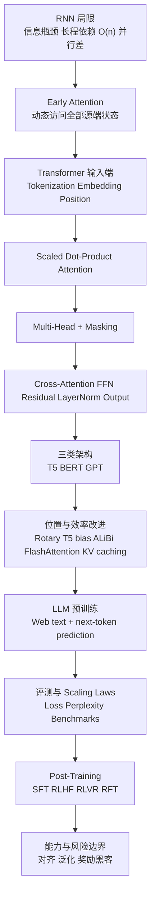

## 适用范围与来源

本模块只基于以下两份课堂总笔记整理，不引入任何外部资料、额外公式或课外结论：

- [Lecture 19 NOTES](/courses/cmu-11785-s26/lectures/020/)
- [Lecture 20 NOTES](/courses/cmu-11785-s26/lectures/021/)

如果本模块中的表述与视频、课件页码或自动字幕存在冲突，应以对应课堂内容为准；凡源笔记标为 `[需回听]` 的位置，这里继续保留不确定性，不做外推补写。

## 模块目标

学完本模块后，应能把两讲连成一条完整链路：

1. 从 RNN 的信息瓶颈、长程依赖与并行性限制，过渡到 attention 与原始 transformer。
2. 解释 transformer 的输入端、注意力核心、掩码、cross-attention、FFN、norm 与输出投影如何串联。
3. 区分 encoder-decoder、encoder-only、decoder-only 三类架构，以及 T5、BERT、GPT 在课堂中的定位。
4. 说明 FlashAttention、KV caching、rotary、T5 bias、ALiBi 在课堂中分别被放在哪一层讨论。
5. 复述 LLM 的三段式训练主线：预训练、评测与 scaling laws、post-training。
6. 区分 SFT、RLHF、RLVR、RFT 的训练信号来源、用途与风险边界。

## 先修要求

进入本模块前，默认已经掌握下列内容，这些也都是源笔记明确写出的先修项：

- RNN、encoder-decoder、embedding、softmax、矩阵乘法。
- 梯度消失与爆炸、teacher forcing、sequence-to-sequence、next-token prediction、beam search。
- decoder-only transformer 的自回归生成方式。
- cross entropy、validation set、perplexity、监督学习、迁移学习、微调、强化学习的基本框架。

## 讲次推进图

### Lecture 19：从 transformer 动机到现代高效实现

- `00:00:00-00:09:58`：RNN 的三重限制。固定长度 context vector 造成信息瓶颈，远距离通信路径是 `O(n)`，时间步顺序依赖限制 GPU 并行。
- `00:09:56-00:19:55`：early attention 让当前解码步访问全部源端隐藏状态，再转入 tokenization。
- `00:19:53-00:29:02`：BPE、unigram、SentencePiece、WordPiece 的高层比较与工程取舍。
- `00:29:58-00:39:58`：embedding 与 positional encoding；强调没有位置信息时，句子会退化成近似 bag-of-words。
- `00:39:55-00:49:54`：scaled dot-product attention 的 soft lookup 直觉与 self-attention 的 QKV 来源。
- `00:49:52-00:59:51`：`1/sqrt(d_k)`、multi-head attention、causal mask。
- `00:59:49-01:09:46`：cross-attention、FFN、residual、layer norm、pre-norm/post-norm、输出投影。
- `01:09:45-01:19:44`：三类 transformer 架构、位置编码改进、FlashAttention、KV caching。
- `01:19:42-01:21:39`：课堂收束，确认 FlashAttention 与 KV caching 的边界，明确 slides 中仍有未口头展开主题。

### Lecture 20：从 foundation model 到 post-training

- `00:00:00-00:10:00`：foundation model 目标能力地图，强调数据比花哨架构更关键。
- `00:09:57-00:19:56`：web text 预训练与 next-token prediction 为什么会逼出知识、语法、情感、数学、代码模式。
- `00:19:53-00:29:52`：validation loss、perplexity、benchmark 与评测危机。
- `00:29:49-00:39:42`：固定 compute 预算下，为什么仅靠“大项目式调参”不够，进而引出 scaling laws。
- `00:39:40-00:49:39`：`L(X)=X^{-\alpha}` 与 `L(N,D)=E+\frac{A}{N^{\alpha}}+\frac{B}{D^{\beta}}` 的课堂版本。
- `00:49:35-00:59:34`：Kaplan 视角、Chinchilla 修正、diminishing returns，以及 loss 与 capability 不必单调对应。
- `00:59:32-01:09:12`：从预训练过渡到 SFT，强调预训练先验与小数据泛化风险。
- `01:09:10-01:18:57`：SFT 的局限、`R(x,y)`、RLHF、RLVR、RFT。
- `01:18:56-01:25:11`：总结、reward model 为什么不等于 LLM、reward hacking 与 inoculation prompting。

## 依赖关系图

## 一、为什么 RNN 让位给 attention

Lecture 19 的起点不是“transformer 很强”，而是“旧范式在什么地方卡住了”。课堂给出的三条主因必须一起记：

1. 固定长度 context vector 会形成信息瓶颈。老师用法译英 encoder-decoder 说明，短句翻译还行，长段落里开头词对结尾词的影响会被压缩丢失。
2. 远距离 token 的通信路径长度是 `O(n)`。这同时解释了长程依赖难学，以及梯度消失/爆炸风险。
3. RNN 的顺序计算方式限制 GPU 并行。语言关系更像图，不像只能按时间链逐步传播的信息流。

early attention 的课堂作用，是把“整段输入被压成一个向量”改成“当前解码步可以直接访问全部源端隐藏状态”。源笔记的稳定表述是：当前 query 对全部候选状态打分，经过 attention distribution 后，对 value 做加权和，形成新的动态 context vector。这里最重要的转折不是某个具体公式，而是老师提出的那个架构判断：如果模型已经能保留整段表示并自行选择关注位置，那么 recurrence 也许不是序列建模的必要条件。

## 二、原始 transformer 的完整链条

### 2.1 Tokenization：输入不是自然语言字符串，而是离散 ID

Lecture 19 在 `00:19:53-00:29:02` 把 tokenization 讲成一组工程权衡，而不是单一“正确答案”。

- 字符级：词表小、几乎不会 OOV，但序列很长、单字符语义弱。
- 词级：词本身语义完整，但词表大、未见词处理差。
- BPE：从 `256` 个 byte 起步，反复合并最常见的相邻 token 对，直到达到目标词表大小。
- unigram：从大词表出发，持续剪掉不有用 token，用似然或损失相关准则保留更优词表，还可对同一词采样不同切法，带来正则化效果。
- SentencePiece：显式把空格当作特殊 token，更适合不可靠依赖空格的语言场景。
- WordPiece：课堂只保留“比 BPE 更看重 likelihood 的底向上合并方案”这一高层判断。

这里必须保留一个明确边界：关于 WordPiece likelihood 的具体概率模型，源笔记指出老师自己在问答中也说“不完全确定”，因此这里只能记高层比较，不能补完整数学细节。[需回听]

### 2.2 Embedding：查表形式，语义结果

Lecture 19 在 `00:29:58-00:39:58` 把 embedding 讲得很直接：`nn.Embedding` 可以看成一个 `(vocab_size × embedding_dim)` 的可学习矩阵，每个 token ID 只是取其中一行。课堂强调的重点不是“查表”，而是这个矩阵会随着任务一起学习，因此最终形成任务相关的语义几何结构。

### 2.3 Positional Encoding：attention 本身不保序

这部分的教学重点非常清楚：没有位置信息时，`the dog bit the man` 与 `the man bit the dog` 会近乎等价。于是位置编码至少要满足：

- 位置唯一。
- 可重复计算。
- 能表达距离或相对变化。
- 最好能外推到训练长度之外。

原始 transformer 的课堂版结论是：

- 偶数维使用 `sin`。
- 奇数维使用 `cos`。
- 不同维度对应不同频率。
- 位置向量与 embedding 直接相加，不是拼接。

源笔记明确写出一个不能越界的限制：完整 sinusoidal positional encoding 公式并没有在 transcript 中被逐字保留下来，只有结构和性质被口头复述。所以本模块只保留这些确定内容，不补写超出源笔记的分母、指数或下标形式。[需回听]

### 2.4 Scaled Dot-Product Attention：核心算子

Lecture 19 用“数据库 hard lookup 对比 deep learning soft lookup”来解释 attention 的直觉。最需要记住的是下面这条计算链，而不是额外装饰：

1. self-attention 中，`Q`、`K`、`V` 都来自输入 `X` 的线性投影。
2. 先计算相似度矩阵 `QK^T`。
3. 再经过 softmax，得到对每个 query 归一化、和为 `1` 的权重分布。
4. 最后对 `V` 做加权和，得到输出。

老师后面解释为什么要除以 `sqrt(d_k)`。在 `Q`、`K` 近似零均值、单位方差时，点积方差会随着 `d_k` 增大，使 softmax 输入过大，分布过尖，梯度进入不友好区域。因此需要缩放：

$$
\text{scale factor} = \frac{1}{\sqrt{d_k}}
$$

课堂要求掌握的是“点积方差变大 -> softmax 饱和 -> 梯度变差 -> 需要缩放”这条高层因果链，而不是额外数学证明。源笔记也明确指出，更细的推导过程没有在 transcript 中完整保留。

### 2.5 Multi-Head Attention：不是换公式，而是换观察角度

单头 attention 只提供一种相关性视角，多头则允许不同 head 学不同关系。Lecture 19 保留下来的维度关系和实现流最值得背：

$$
D_k = h \times D_h
$$

张量流是：

`(B, L, D_k) -> (B, L, h, D_h) -> (B, h, L, D_h)`

各个 head 并行做同样的 scaled dot-product attention，之后再转回、拼接并做输出投影。老师给的工程提示也很明确：实现上不必真的为每个 head 写完全独立的一套层，也可以先做一次大线性层再 reshape/split，效果等价。

### 2.6 Masking：编码器双向，解码器自回归

Lecture 19 对 masking 的划分很稳：

- 编码器侧通常没有“偷看未来”的问题，因此可双向注意。
- 解码器侧要做自回归生成和 teacher forcing 训练，因此必须施加 causal mask，确保当前位置只能访问当前位置及之前内容。

这部分的常见误解是把 mask 理解成“为了提高效果加一点约束”。课堂给出的逻辑更硬：如果 decoder 不做 causal mask，训练就会直接偷看未来 token，目标被破坏。

### 2.7 Cross-Attention、FFN、Norm 与输出层

Lecture 19 在 `00:59:49-01:09:46` 把原始 transformer 的后半段收束完整：

- cross-attention：`Q` 来自 decoder，`K,V` 来自 encoder 输出，用于条件生成。
- FFN：本质是一个 MLP，典型宽度变化是

$$
d_{model} \rightarrow 4d_{model} \rightarrow d_{model}
$$

- residual + layer norm：每个子层外侧都有残差连接和 layer norm；layer norm 是沿 embedding 维度规范化，不是按 batch 维。
- pre-norm / post-norm：作业采用 pre-norm，因为课堂经验是它更容易训练；post-norm 也不是错，只是更依赖学习率与 warm-up 等超参数设置。
- 输出投影：把隐藏状态映射回词表空间，再经 softmax 形成 next-token distribution。

源笔记保留了两个页码信息，适合一并记住：

- slide `p.64`：用视觉 cross-attention 的 “bear / watches / bird” 例子帮助理解不同 query 会在不同区域聚焦。
- slide `p.63-p.72`：覆盖了 cross-attention、FFN、norm 与输出层的结构位置。

## 三、Lecture 19 的现代变体与效率改进

### 3.1 三类 transformer 架构

Lecture 19 在 `01:09:45-01:19:44` 的高层总结是：

- encoder-decoder：适合条件生成，例如 text-to-text、翻译、语音到文本。典型代表是 T5，老师特别提到可通过 prompt 中的 task token 决定当前任务。
- encoder-only：以 BERT 为代表，主要通过 masked token prediction 与 next sentence prediction 预训练可迁移表示。
- decoder-only：以 GPT 为代表，训练目标是 next-token prediction；大语言模型则是在数据规模、模态和工具能力上把这一范式持续放大。

这里要避免一个偷换：课堂并没有把三类系统讲成“谁全面优于谁”，而是强调它们对应不同任务接口与训练目标。

### 3.2 位置编码改进：rotary、T5 bias、ALiBi

Lecture 19 只给出这些改进的课堂层级定位：原始 sinusoidal encoding 对训练分布之外的长序列外推并不总是稳健，所以后续出现了 rotary、T5 bias、ALiBi 等方案。它们的共同点是未必把位置向量直接加到输入上，而是通过修改 attention 内部的 query、key、value 或 bias 来引入位置信息。

边界同样要守住：课堂没有在 transcript 中展开这些方法的逐项公式，所以这里只保留“改动发生在 attention 内部、目标与长度外推相关”这一层信息。

### 3.3 FlashAttention：改的是 IO，不是数学定义

Lecture 19 对 FlashAttention 的课堂结论很明确：

- 注意力计算在序列长度上仍是二次增长的压力点。
- FlashAttention 的关键是 IO-aware 实现，而不是近似替换。
- 它依赖 tiled computation、online softmax，以及更少的慢速内存访问。
- 目标是把更多数据交换留在 GPU SRAM。
- 源笔记保留的收益表述是“大约 `2.8×` 的速度提升”。

最重要的边界句必须原样记住：FlashAttention 不改变 attention 的数学结果，只改变实现方式。

### 3.4 KV caching：推理侧避免重算历史

Lecture 19 在结尾明确把 KV caching 放在自回归推理优化里。核心思想是缓存历史 key/value，只对新时间步做增量计算，而不是每一步重算全部历史。老师特别点出 beam search with big beam width 这一场景，认为收益会更明显。

## 四、从 transformer 走向 foundation model

Lecture 20 的起点不是新架构，而是“当基本 transformer 和常见优化方法已经固定，我们真正该围绕什么组织训练”。老师的回答很直接：围绕能力目标与数据。

课堂给出的 foundation model 目标能力链是：

- Language
- Knowledge
- Alignment
- Capability
- Safety
- In-Context Learning
- Reasoning
- Agentic Tool Use

Lecture 20 的关键判断是：如果架构足够通用、表达力足够强，那么很多关于世界与语言的归纳偏置，不一定要人工写进结构里，而可以通过数据来塑造。源笔记把这概括为“数据即偏置”。

这也解释了为什么 Lecture 20 会从 web text 讲起。老师用 Eiffel Tower 填空、代词指代、电影评价、数学文字题、爱因斯坦角色提示、代码补全等例子说明：当模型在海量 web text 上做 next-token prediction 时，它被迫学习的不只是“补下一个词”的表面动作，而是支撑这些预测所需的事实知识、语法、情感、简单推理与代码模式。

## 五、预训练、评测与 scaling laws

### 5.1 预训练：底层目标没变，但数据分布决定了学什么

Lecture 20 反复强调真实训练目标通常是 decoder-only transformer 上的 next-token prediction，token-level 损失用 cross entropy 计算；借助 causal masking，可以并行监督多个位置，而不是严格逐词串行训练。

这里的一个关键提醒是：课堂里的填空展示只是帮助理解能力，不等于实际训练一定用那种表面格式。真正要记的是“在自由文本上做大规模 next-token prediction”。

### 5.2 评测：loss 与 perplexity 很重要，但不够

Lecture 20 在 `00:19:53-00:29:52` 把评测分成两层：

- 通用、平滑、易监控的一层：held-out validation set 上的平均 cross entropy，以及其指数化形式 perplexity。
- 更贴近目标能力的一层：专门 benchmark，例如语言理解、知识、指令遵循、工具使用、代码生成、计算机操作和真人使用场景等。

课堂判断不是“perplexity 没用”，而是“perplexity 不足以直接回答我们真正关心的能力问题”。同时，benchmark 又会面临 contamination、刷榜和维护成本高等问题，因此现代 LLM 评测会陷入持续危机。

### 5.3 Scaling laws：用于固定预算下的配置决策

Lecture 20 引入 scaling laws 的背景，是大预算下不能再套用“小项目式调参”：

- 方法一：训练 `M` 个等 compute 模型再挑最优，代价太高，而且最终模型只用到了总预算的 `1/M`。
- 方法二：先在小规模把超参数全调好再直接放大，也不可靠，因为小规模最优不必然大规模最优。

课堂保留的幂律形式有两个：

$$
L(X)=X^{-\alpha}
$$

其中 `X` 可以表示数据量、参数量或 compute。

更实用的 Chinchilla 风格写法是：

$$
L(N,D)=E+\frac{A}{N^{\alpha}}+\frac{B}{D^{\beta}}
$$

源笔记对这些符号的解释是：

- `E`：不可约 loss，代表数据自身带来的不确定性或噪声下界。
- `N`：参数量。
- `D`：数据量。
- `\alpha, \beta`：处于 `0` 到 `1` 之间，因此收益递减。

Lecture 20 还给出一个实践使用方式：做多组模型规模与数据规模实验，记录 `<compute FLOPs, loss>`，抽取 frontier，再外推最终预算下更优的 `N` 与 `D` 组合。老师特别提醒，学习率衰减日程必须与预计训练长度匹配，否则实验点会失真。

### 5.4 Kaplan 与 Chinchilla：课堂保留到什么程度

Lecture 20 对比这两类判断时，只要求保留下列边界内结论：

- Kaplan 视角一度让人相信：额外 compute 更应优先用来增大参数量。
- Chinchilla 修正指出：参数量与数据量应大致等比例扩展，数据仍然是瓶颈。
- 即使 loss 持续下降，也不意味着目标能力必然同比例提升。

这部分的核心风险意识是：next-token prediction 的 loss 只是代理目标。小幅 loss 改善，可能带来 disproportionate capability gain，也可能只是更贴近并非真正想要的目标。

## 六、Post-Training：把“强先验”变成“可用助手”

### 6.1 为什么不能只靠预训练继续缩放

Lecture 20 在 `00:59:32-01:09:12` 用 GSM8K 历史对比推进出一个关键结论：纯 scaling 外推过于天真。更合理的路线是分阶段训练：

1. 先做大规模预训练，让模型学语言、学世界、形成强先验。
2. 再用更小但更精心整理、更对齐目标行为的数据做 transfer learning 与 fine-tuning。

这部分最重要的课堂例子，是 user/assistant template。老师要说明的是：即使底层仍是 next-token prediction，输入输出接口已经被重塑成对话式助手行为。

### 6.2 SFT：形式相似，语义不同

Lecture 20 对 supervised fine-tuning 的课堂定义是：本质上仍使用 token-level cross entropy，但通常只对回答 token 计算损失，而且发生在预训练后的参数上。

这里最不能忽略的，是小数据泛化风险。源笔记用两个问答对照来说明：

- “美国首都”这类问题，模型可能早就在预训练里学过事实，SFT 更多是在教它回答格式与交互方式。
- “某小镇 2026 年 3 月人口”这类问题，如果预训练并没有相关事实，SFT 可能教会的只是“对未知问题也要生成看似合理的答案”。

所以课堂不是把 SFT 讲成“只改格式，不改能力”，而是强调它会深刻改变模型行为，同时也可能把模型带偏。

### 6.3 为什么仅靠 SFT 不够

Lecture 20 在 `01:09:10-01:18:57` 用糟糕 haiku 的研究例子说明一个更深层的问题：模型不会只是记标签，而会从标签中归纳某种更宽泛的目标。如果监督信号本身含糊、扭曲或奖励错位，泛化也会被带偏。

于是课程引入奖励驱动的 post-training 视角：

$$
R(x,y)
$$

这里 `x` 是 prompt，`y` 是模型回答，函数返回一个“goodness score”。与“每个 prompt 只有唯一标准答案”的思路相比，奖励建模允许模型先生成，再根据结果质量被打分。

### 6.4 RLHF、RLVR、RFT 的课堂版关系

- RLHF：用人类偏好或排序数据训练 reward model，再让模型朝更高预期奖励方向更新。课堂强调，人类不能长期处在训练内环，因此 reward model 很关键。
- RLVR：对数学、代码等任务，奖励可建立在高精度可验证标准上，例如最终数值是否正确、表达式是否正确、代码是否通过测试。
- RFT：对同一 prompt 采样多个回答，用奖励函数打分，只保留高分回答，再把这些 `<x,y>` 对回灌为监督更新。

课堂给出的边界也必须记住：当前 LLM 上的 RL 仍很早期，现有方法并没有把 reward hacking、泛化偏差和不可预测失败彻底解决。

## 七、关键比较表

| 比较对象 | 课堂中保留的核心区别 | 结论边界 |
| --- | --- | --- |
| self-attention vs cross-attention | 前者 `QKV` 来自同一序列；后者 `Q` 来自 decoder，`KV` 来自 encoder | 不展开更细变体 |
| encoder-decoder vs encoder-only vs decoder-only | 条件生成 vs 表示学习 vs 自回归语言建模 | 不是优劣总排序 |
| sinusoidal vs rotary/T5 bias/ALiBi | 原始方法直接加到输入；后续方法通过 attention 内部修改引入位置 | 不补课堂未展开公式 |
| standard attention vs FlashAttention | 数学定义相同；后者优化 IO、tiled 计算与内存访问 | 课堂给出约 `2.8×` 速度提升表述 |
| full recomputation vs KV caching | 推理时是否重算全部历史 `K/V` | 主要讨论自回归推理场景 |
| validation loss/perplexity vs benchmarks | 前者平滑统一；后者更贴近能力 | benchmark 更易污染和刷榜 |
| Kaplan vs Chinchilla | 参数优先扩展 vs 参数与数据大致等比例扩展 | 都是经验规律，不是终局真理 |
| SFT vs RLHF/RLVR/RFT | 直接监督回答 token vs 用偏好/可验证奖励/拒绝采样高分答案继续训练 | RL on LLMs 仍早期 |

## 八、常见误解与复习标记

1. attention 不是只看最后一个 encoder 状态，而是让当前 query 对所有候选状态分配权重。
2. 缩放项是 `sqrt(d_k)`，不是 `d_k`。
3. self-attention 和 cross-attention 的差别，不是“有没有 encoder”，而是 `QKV` 是否来自同一序列。
4. layer norm 是按 embedding 维规范化，不是按 batch 维。
5. FlashAttention 改的是 IO 实现，不是 attention 的数学定义。
6. KV caching 改的是推理重算策略，不是训练目标。
7. loss/perplexity 很重要，但不能直接等价为“模型能力已经足够好”。
8. “底层仍是 next-token prediction”不等于“后训练没有改变目标”；课堂强调的是训练接口延续，而数据分布和奖励信号已显著改变模型行为。
9. SFT 不是只做表面格式微调。小数据泛化本身可能强烈塑造行为，也可能引入系统性错位。

### `[需回听]` 与“只保留高层结论”的位置

- Lecture 19 `00:04:08-00:04:46`：RNN 回顾字幕有缺口，只能保留高层限制描述。
- Lecture 19 `00:27:16-00:28:34`：WordPiece likelihood 细节不确定，只保留“比 BPE 更偏向 likelihood”的高层说法。
- Lecture 19 positional encoding 完整公式：课件中有，但 transcript 只保留结构与性质，不补全具体式子。
- Lecture 19 slide `p.76`、`p.84`、`p.90` 出现 GQA、MQA、MLA 名词，但课堂未口头展开，不写原理。
- Lecture 19 slide `p.103-p.125` 中 ViT、Conformer、LoRA、quantization 等主题留在 slides，课堂未详细讲解。
- Lecture 20 专有人名、模板 token 和个别问答口语识别存在字幕噪声，整理时以论点为准，不强补专名拼写。[需回听]
- Lecture 20 slide `p.32`：user/assistant template 的准确格式以课件页为准，源笔记已提醒自动字幕有大小写与空格误差。
- Lecture 20 slide `p.5`：关于过去过滤代码网页、现在重视代码数据的口述跨段衔接，有轻微截断。[需回听]

## 九、掌握标准

### 讲次掌握

完成 Lecture 19 后，应能：

- 从信息瓶颈、长程依赖、并行性三点解释为什么要从 RNN 走向 attention。
- 按顺序复述 transformer 主流程，不把 tokenization、embedding、position、attention、mask、FFN、norm、output 混乱。
- 解释为什么要除以 `sqrt(d_k)`、为什么要多头、为什么 decoder 必须有 causal mask。
- 区分 T5、BERT、GPT 的课堂定位。
- 说清 FlashAttention 与 KV caching 分别优化什么。

完成 Lecture 20 后，应能：

- 复述整讲三段式：预训练、评测与 scaling laws、post-training。
- 解释为什么 web text 预训练会逼出超出“补词器”直觉的能力。
- 写出 `L(X)=X^{-\alpha}`、`L(N,D)=E+\frac{A}{N^{\alpha}}+\frac{B}{D^{\beta}}` 的课堂形式，并解释各符号含义与递减收益。
- 解释 SFT、RLHF、RLVR、RFT 的训练信号来源与核心风险。

### 模块掌握

完成本模块后，应能把两讲连起来回答三个综合问题：

1. 为什么 attention 既是架构替换，也是大规模训练可行性的前提之一。
2. 为什么 LLM 能力不只是“更大的 decoder-only transformer”，还取决于数据、评测、预算分配与 post-training 设计。
3. 为什么现代系统即使已经很强，仍不能被描述为“问题已经解决”。

## 十、8 个累积练习与答案

### 练习 1

问题：Lecture 19 中，老师用哪三条理由说明 RNN 不再适合作为后续主线架构？

答案：固定长度 context vector 会形成信息瓶颈；远距离 token 通信路径是 `O(n)`，导致长程依赖难学且梯度易消失或爆炸；时间步顺序依赖使 GPU 并行能力发挥不出来。

### 练习 2

问题：early attention 相比固定长度 context vector，到底改了什么信息访问方式？

答案：它让当前解码步不再只依赖最后一个 encoder 隐藏状态，而是对全部源端隐藏状态做相似度分配，形成 attention distribution，再对 value 做加权和，得到动态 context vector。

### 练习 3

问题：为什么 transformer 不能只做 embedding，而必须再注入 positional encoding？请用课堂中的反例说明。

答案：因为 attention 本身不保序，不加位置信息时，`the dog bit the man` 与 `the man bit the dog` 会近乎等价，模型会退化成近似 bag-of-words 式处理。

### 练习 4

问题：为什么 scaled dot-product attention 里的缩放项必须是 `1/sqrt(d_k)`？

答案：课堂给出的解释是：当 `Q`、`K` 近似零均值单位方差时，点积方差会随 `d_k` 增大，softmax 输入过大导致分布过尖、梯度变差，因此需要除以 `sqrt(d_k)` 缩放。

### 练习 5

问题：请区分 self-attention、cross-attention、FlashAttention、KV caching 四者分别改动的是哪一层问题。

答案：self-attention 与 cross-attention 区分的是 `QKV` 来源关系；FlashAttention 改的是 attention 的 IO 实现和内存访问方式，不改数学定义；KV caching 改的是自回归推理时是否重算历史 `K/V`。

### 练习 6

问题：Lecture 20 为什么说 validation loss 和 perplexity 很重要，但又不足以代表我们真正想要的能力？

答案：因为它们平滑、统一、适合持续监控，但不能直接回答语言理解、知识、指令遵循、工具使用、代码生成、人类偏好等目标能力是否达标；专门 benchmark 更贴近能力，却又更容易污染、刷榜并引发评测危机。

### 练习 7

问题：写出课堂中的两个 scaling laws 形式，并说明 Chinchilla 修正相对 Kaplan 视角改了什么决策直觉。

答案：课堂保留的公式是 `L(X)=X^{-\alpha}` 与 `L(N,D)=E+\frac{A}{N^{\alpha}}+\frac{B}{D^{\beta}}`。Kaplan 视角一度更偏向优先增大参数量；Chinchilla 修正指出参数量与数据量应大致等比例扩展，数据仍然是关键瓶颈。

### 练习 8

问题：为什么课程在 SFT 之后还要引入 RLHF、RLVR、RFT？请分别给出课堂理由。

答案：因为 SFT 可能把监督信号中的错位模式泛化出去，且很多任务并不存在唯一标准答案。RLHF 用人类偏好或 reward model 来打分；RLVR 用可验证结果给数学、代码等任务提供更高精度奖励；RFT 则通过对同一 prompt 采样多答案、保留高分答案再继续监督更新，利用奖励信号筛出更好的训练样本。

## 十一、建议复习顺序

1. 先复习 Lecture 19 的动机段，把 RNN 的三重限制吃透，因为后面所有结构都在回应这些问题。
2. 再按 Lecture 19 的主流程复盘：tokenization -> embedding -> positional encoding -> scaled dot-product attention -> multi-head -> masking -> cross-attention -> FFN -> norm -> output。
3. 然后复习 Lecture 19 的现代分支，但只记课堂真正展开的层级：三类架构、位置编码改进、高效注意力与推理缓存。
4. 接着切到 Lecture 20，先抓住 foundation model 目标能力与“数据即偏置”的总判断。
5. 再复习预训练、评测、perplexity、benchmark、评测危机与 scaling laws，把 `loss`、`capability`、`budget allocation` 三者关系分开。
6. 最后集中复习 post-training：SFT 的收益与风险、`R(x,y)`、RLHF、RLVR、RFT，以及 reward hacking 为什么仍未解决。
7. 结束前回看本模块中的 `[需回听]` 标记，只把它们当成待确认点，不擅自补全课堂未给出的公式或机制。

## 十二、回到源笔记

- [Lecture 19 NOTES](/courses/cmu-11785-s26/lectures/020/)
- [Lecture 20 NOTES](/courses/cmu-11785-s26/lectures/021/)
