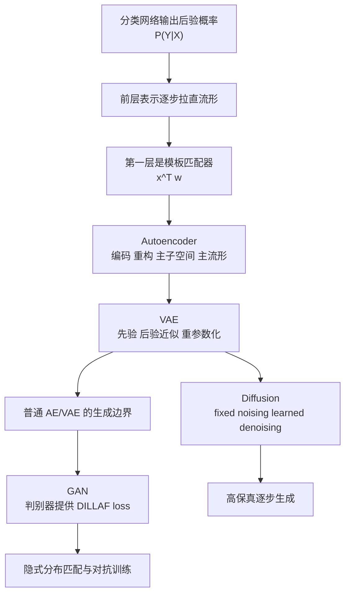

本模块只基于以下四份课堂总笔记整理，不引入外部资料、课外公式或额外案例：

- [Lecture 21 NOTES](/courses/cmu-11785-s26/lectures/022/)
- [Lecture 22 NOTES](/courses/cmu-11785-s26/lectures/023/)
- [Lecture 23 NOTES](/courses/cmu-11785-s26/lectures/024/)
- [Lecture 24 NOTES](/courses/cmu-11785-s26/lectures/025/)

如果本模块中的表述与视频、课件页码或自动字幕冲突，应以对应课堂内容为准；源笔记已标注 `[需回听]` 的位置，这里继续保留不确定性，不做外推补写。

## 模块用途

本模块把四讲压成一条连续主线：先回答“分类网络内部到底在表示什么”，再把这个问题推进为“怎样让表示不仅能分辨数据，还能重构、采样、逐步生成，甚至通过对抗损失逼近真实分布”。学完后，应能把以下四步连成一体：

- 从分类网络的后验概率解释，过渡到“前层学表示、后层线性读出”的表示几何。
- 从 manifold、模板检测器与 autoencoder，过渡到“decoder 是受分布约束的生成字典”。
- 从普通 AE 不能随意采样的问题，过渡到 VAE 的先验、后验近似与重参数化。
- 从 VAE 的一步生成困难，过渡到 diffusion 的多步去噪，再到 GAN 用判别器学习“像不像目标分布”的损失。

## 先修要求

- perceptron、sigmoid、softmax、多层感知机、线性分类边界、交叉熵、最大似然、KL divergence。
- PCA、Gaussian 分布、均值方差、基本矩阵乘法、反向传播与链式法则。
- 上一模块中的 transformer / decoder-only 自回归直觉有助于理解 diffusion 与 GAN 在“生成分布”这一侧和判别式训练的差别，但本模块不依赖更深的课外生成模型背景。

## 学习推进与相对链接

- [Lecture 21 NOTES](/courses/cmu-11785-s26/lectures/022/)：`00:00:24-00:10:24` 从“不要学锯齿状 0/1 函数”切入表示问题；`00:10:20-00:20:16` 把输出改写为后验概率 $P(Y=1\mid X)$；`00:20:13-00:30:11` 用最大似然、交叉熵与 KL 把分类网络放回统计估计；`00:30:09-00:40:08` 用 manifold hypothesis 解释深层表示为何越来越线性可分；`00:40:04-00:50:03` 用 toy MLP 和 CIFAR 可视化说明“拉直流形”；`00:50:02-01:00:01` 把第一层 perceptron 解释成模板匹配器；`00:59:59-01:09:58` 给出线性 autoencoder 与 PCA；`01:09:54-01:19:53` 推到 nonlinear PCA / principal manifold analysis；`01:19:49-01:23:03` 用 source-specific decoder 完成混合信号分离。相关页码在笔记中明确出现于 [课件: lec21.representations.pdf p.1-p.9]、[课件: lec21.representations.pdf p.10-p.25]、[课件: lec21.representations.pdf p.26-p.55]、[课件: lec21.representations.pdf p.52-p.58]、[课件: lec21.representations.pdf p.59]、[课件: lec21.representations.pdf p.63-p.69]、[课件: lec21.representations.pdf p.76-p.95]、[课件: lec21.representations.pdf p.96-p.100]。
- [Lecture 22 NOTES](/courses/cmu-11785-s26/lectures/023/)：`00:00:00-00:09:40` 指出普通 AE 学到流形却没约束“哪些 latent 合法”；`00:10:12-00:20:11` 规定标准 Gaussian 先验并否定“重建误差 + $\lambda\|z\|^2$”的朴素方案；`00:20:09-00:30:09` 加入输出噪声，把 decoder 变成 generative story；`00:30:07-00:40:06` 把 encoder 改写为后验分布估计器；`00:40:03-00:50:02` 用 Bayes 展开 KL，得到“贴近先验 + 高似然重建”的目标结构；`00:50:00-00:59:59` 用局部低曲率直觉支持 Gaussian 后验近似；`01:00:00-01:09:59` 用重参数化让采样可回传梯度；`01:09:56-01:19:54` 说明连续 latent、生成能力与模糊缺陷；`01:19:53-01:20:32` 用 normalizing flow 和 diffusion 作收束预告。
- [Lecture 23 NOTES](/courses/cmu-11785-s26/lectures/024/)：`00:00:01-00:10:00` 先区分判别式与生成式，再把 diffusion 放回生成模型谱系；`00:09:57-00:19:55` 用 GAN 不稳、VAE 模糊、flow 可逆约束强的对比，说明 diffusion 的 many small steps 动机；`00:19:54-00:29:52` 定义 fixed forward noising、Markov chain 与 Gaussian closed form；`00:29:50-00:39:47` 把 reverse learning 压成噪声预测 MSE 与 log-scale noise schedule；`00:39:45-00:49:44` 用 2D spiral toy model 可视化 coarse-to-fine 学习；`00:49:42-00:59:41` 从数据流形几何解释 DDPM 与 DDIM；`00:59:39-01:09:37` 改写为 score-based reverse SDE；`01:09:34-01:19:33` 进入 conditional generation、classifier-free guidance 与指标；`01:19:31-01:26:40` 收束到 latent diffusion、ControlNet、DreamBooth 与 video diffusion。
- [Lecture 24 NOTES](/courses/cmu-11785-s26/lectures/025/)：`00:00:57-00:10:56` 先重建判别式/生成式与显式/隐式两组坐标，再把 GAN 放进“隐式生成模型”；`00:10:52-00:20:52` 用 VAE 的似然训练对照出 DILLAF loss；`00:20:49-00:30:48` 写出 generator / discriminator 的原始 min-max 目标与交替训练顺序；`00:30:46-00:40:44` 推到最优判别器与 JSD；`00:40:42-00:50:41` 说明 stationary point 不等于可靠收敛；`00:50:38-01:00:37` 用点质量例子解释 KL / JSD 的梯度缺口；`01:00:34-01:10:34` 引出 Wasserstein critic、1-Lipschitz、weight clipping 与 gradient penalty；`01:10:31-01:20:29` 展开 conditional GAN、progressive GAN、StyleGAN、pix2pix、CycleGAN、StarGAN；`01:20:27-01:25:11` 收束到 text-to-image GAN 与“判别器是可学习损失”这一核心洞见。

## 依赖图

## 一条主线：从后验概率到生成分布

Lecture 21 的出发点不是“先学会生成”，而是先回答“分类网络内部到底表示什么”。课堂先把目标从硬 0/1 决策函数挪到后验概率，再通过“最后一层仍是线性分类器”推出：真正困难的工作都由前层表示变换完成。于是表示学习被描述成一条几何链条：原始数据位于非线性流形上，网络逐层扭转并拉直它，使更深层表示变得线性可分。

一旦把第一层 perceptron 看成模板匹配器，下一步自然就是：不仅检测模板，还要把激活过的模板重新拼回输入。这就引出 autoencoder。再往后，VAE 说明“会重构”还不够，因为普通 AE 不告诉我们哪些 latent 可以被合法采样；diffusion 则说“合法采样”也不够，因为从纯噪声一步跳回复杂图像分布太难；GAN 则换了另一条路线，不再主要依赖显式似然，而是训练一个判别器去回答“当前生成结果看起来像不像目标分布”。

因此这四讲真正连起来的问题不是“哪种生成模型最强”，而是同一个结构问题在不断升级：

- 分类侧：内部表示如何支持决策。
- 重构侧：表示如何保留输入结构。
- 显式生成侧：表示如何被约束成可采样 latent。
- 隐式生成侧：表示如何通过对抗损失逼近真实数据分布。

## 表示、流形与 Autoencoder

### 1. 分类网络首先是在估计后验概率

Lecture 21 先用“90 个红点、10 个蓝点共享同一 $x$”的例子说明：比起硬输出 0/1，更有信息量的是后验概率。课堂直接把 sigmoid 写成：

$$
P(Y=1\mid x)=\frac{1}{1+e^{-(w_0+w_1x)}}
$$

随后把训练集联合概率写成：

$$
P(\mathcal D)=\prod_i P(x_i,y_i)=\prod_i P(x_i)P(y_i\mid x_i)
$$

取对数后，与参数相关的部分只剩下后验项，所以交叉熵训练被课堂明确解释为最大似然估计，也可说成最小化目标分布与模型输出之间的 KL divergence。边界同样明确：这并不要求类别已经线性可分，最大似然解释仍然成立。

### 2. “前层学表示，后层线性读出”不是口号，而是结构结论

Lecture 21 的关键推进是：如果最后一层是 logistic perceptron 或 softmax 线性读出，那么倒数第二层表示必须已经近似线性可分。于是前半网络被解释为特征提取器 $f(x)$，其任务是把数据流形逐层 straighten。toy MLP 与 CIFAR probes 的作用，正是让这条抽象结论可视化：

- 线性层先把二维数据嵌到更高维线性子空间。
- tanh 等非线性再把平面弯成曲面。
- 最后的线性投影把这张曲面压到可阈值分离的一维轴上。

这里要保留课堂的边界：网络不是“随便乱扭数据”，而是在 manifold hypothesis 下，把原本非线性可分的结构逐层改造成更适合线性分类的表示空间。[课件: lec21.representations.pdf p.52-p.58]

### 3. 第一层 perceptron 是模板检测器

Lecture 21 把第一层阈值 perceptron 写成：

$$
x^\top w > \theta
$$

再利用内积恒等式：

$$
x^\top w = \|x\|\,\|w\|\cos\alpha
$$

在模长近似固定时，判定就等价于“输入向量与模板向量的夹角是否足够小”。这也是老师把权重解释成模板、把神经元解释成相关性检测器的依据。LED 数字模板例子进一步说明：第一层不是神秘的“抽象特征”，而是在做具体模式匹配。[课件: lec21.representations.pdf p.59] [课件: lec21.representations.pdf p.63-p.69]

### 4. 线性 autoencoder 给出 PCA，非线性 autoencoder 给出主流形

一旦训练目标从分类改为重构，隐藏层必须保留所有对恢复输入稳定有用的特征，而不只是分类相关信息。Lecture 21 对单隐藏单元、线性激活的 autoencoder 给出完整推导：

$$
z=Wx,
\qquad y=z,
\qquad \hat x=W^\top Wx
$$

训练目标是：

$$
\|x-\hat x\|_2^2 = \|x-W^\top Wx\|_2^2
$$

课堂结论非常直接：这等价于 PCA。若有多个线性隐藏单元，学到的就是主子空间；若 decoder 含非线性激活，学到的就不再是最佳线性子空间，而是 principal manifold，也就是 nonlinear PCA。[课件: lec21.representations.pdf p.76-p.95]

### 5. decoder 是受分布约束的生成字典

Lecture 21 在 helix、sinusoid、数字和乐器谱图上反复强调同一件事：decoder 不是“任意外推器”，它只能在已学流形附近生成“像训练集”的样本。也因此，老师把 decoder 抬升为 source-specific generative dictionary：

- 用数字训练的 decoder，只会生成像数字的样本。
- 用 saxophone 训练的 decoder，只会生成像萨克斯的样本。
- 用 clarinet 训练的 decoder，只会生成像单簧管的样本。

最后在 `01:19:49-01:23:03`，老师把这个字典直觉落成混合信号分离流程。训练阶段学的是各自 decoder 的参数；测试阶段冻结参数，只反推隐变量输入，使两个 decoder 的输出和逼近混合信号：

$$
J = \sum_{f,t} \left(X(f,t)-Y(f,t)\right)^2
$$

这一步的重点不是再学字典，而是“用反向传播反推出输入”。[课件: lec21.representations.pdf p.96-p.100]

## VAE：把 AE 变成可采样生成模型

### 1. 普通 AE 的缺口：decoder 学到了流形，但没有说明哪些 $z$ 合法

Lecture 22 延续上一讲的 manifold 直觉，但明确指出普通 AE 的核心缺口不在 decoder 是否学到了 face manifold，而在 latent variable $z$ 没有被约束。螺旋流形例子说明：decoder 只在训练实际使用过的那些 latent 区域附近可靠，随机喂一个没见过的 $z$，并不会自动生成有效样本。

### 2. 仅靠“重建误差 + $\lambda\|z\|^2$”不够

老师先规定标准 Gaussian 先验：

$$
p(z)=\frac{1}{(\sqrt{2\pi})^D} e^{-0.5\|z\|^2}
$$

由于负对数似然去掉常数后与 $\|z\|^2$ 成正比，最朴素的想法就是在重建损失之外加一个 latent norm 惩罚。但 Lecture 22 明确反对这一点：它只会把所有训练样本的 latent 压向零点，最终在 $z=0$ 附近得到 average face，而不是学出“整体分布像标准 Gaussian”的可采样 latent 空间。

### 3. VAE 的生成故事：流形 + 小而无结构的噪声

Lecture 22 的真正升级，是把 decoder 从确定性重构器改写成 generative story：

- 先从标准 Gaussian 采样 latent。
- decoder 把 latent 映到主流形上。
- 再在输出端加尽量小、尽量无结构的 Gaussian noise。

老师强调为何仍用 Gaussian 噪声：如果 residual 还带结构，那就说明模型本应学到的可预测部分被漏进了噪声项。于是“无结构噪声”既是建模选择，也是能力边界。

### 4. encoder 不再输出单点，而是近似后验 $q(z\mid x)$

有了输出噪声后，同一个 $x$ 可以由许多不同的 $z$ 加噪声生成，因此 encoder 不能再只给出一个点估计，而要描述给定样本的整块后验区域。Lecture 22 直接把训练目标写成近似后验与真实后验之间的 KL：

$$
\mathrm{KL}(q(z\mid x)\,\|\,p(z\mid x))
$$

再用 Bayes 展开：

$$
p(z\mid x)=\frac{p(z)p(x\mid z)}{p(x)}
$$

这一步把 VAE 的损失结构拆成两个主要方向：

- 让近似后验靠近标准 Gaussian 先验。
- 让从近似后验采样出的 latent 在 decoder 下高似然地重建样本。

其中 $\log p(x)$ 被课堂明确视为与网络参数无关的常数项。

### 5. Gaussian 近似与重参数化

Lecture 22 用“标准 Gaussian 在 affine plane 上的条件分布仍是 Gaussian，低曲率曲面上也可近似 Gaussian”的直觉，支持把后验近似写成参数化高斯。随后再用重参数化把采样改写成可回传梯度的形式：

$$
z=\mu+\Sigma^{0.5}\epsilon
$$

其中 $\epsilon$ 是噪声，$\mu$ 和方差参数由 encoder 输出。课堂在 `00:58:17-00:58:24` 对缩放因子的口头表达有即时修正，因此这里保留标准整理形式，同时标注为 `[需回听]` 的不确定口述来源。

### 6. VAE 的收益与边界

Lecture 22 给出的收益有两条：

- latent space 连续且可采样，因此可以做插值。
- decoder 从标准 Gaussian 出发生成是有依据的，不再像普通 AE 那样“乱喂 latent”。

同时，边界也很明确：复杂视觉分布上样本往往会发糊。老师把这件事解释为“从标准 Gaussian 一步跨到复杂数据分布仍然太难”，这也正是 flow 与 diffusion 会接在 VAE 之后出现的原因。

## Diffusion：把一步难题拆成多步去噪

### 1. 动机：VAE 的 one-step jump 太大

Lecture 23 对生成模型的评价链非常清楚：GAN 可能 mode collapse 且训练不稳，VAE 训练稳但容易模糊，flow 有 exact likelihood 但受 invertibility 强约束。diffusion 采取的是另一种赌注：不要一步从纯噪声跳到高分辨率图像，而是搭一个 many small steps 的楼梯，把大跳跃拆成上千个小去噪步骤。

### 2. forward 是 fixed noising，reverse 才是 learned denoising

Lecture 23 先把 forward 定义成一条 Markov chain：

$$
q(x_t\mid x_{t-1})
$$

它只负责逐步向数据中加入 Gaussian noise，直到分布接近标准高斯。对应地，真正要学的是 reverse process：

$$
p_\theta(x_{t-1}\mid x_t)
$$

老师反复强调：不要把 diffusion 误解成“前向和后向都要学”。前向是人为设定好的固定腐蚀过程，后向才是神经网络学习对象。

### 3. Gaussian choice、closed form 与可训练性

Lecture 23 选择 Gaussian 有三层理由：

- 高斯相加仍是高斯，因此很多步 noising 可以写成 closed form。
- 于是训练时不必真的顺序模拟到第 $t$ 步，而能从 $x_0$ 一步采样出任意噪声级别的 $x_t$，复杂度从顺序的 $O(T)$ 降到直接采样的 $O(1)$。
- 前向小步若是 Gaussian，反向小步也可近似看成 Gaussian，因此网络只需学习比较规整的参数化对象。

这里必须保留课堂边界：closed-form noising 的完整根号、上下标与记号在 transcript 中保留不稳定，笔记只稳定保留了“signal survives 多少、noise 占多少”的结构解释，因此本模块不补写超出源笔记的完整排版公式。[需回听]

### 4. 实际训练目标是噪声预测 MSE

Lecture 23 把 diffusion training 压成一个简单回归问题。记 noisy sample 为 $x_\sigma$，记 denoiser 为 $\epsilon_\theta$，则网络接收 noisy image 与噪声级别，目标是恢复真正加进去的那份噪声。课堂保留的训练形式是：

- 从 clean image 采样一个噪声级别或时间步。
- 采一个 Gaussian $\epsilon$。
- 用 reparameterization trick 构造 $x_\sigma$。
- 最小化预测噪声与真实噪声之间的 MSE。

噪声级别的课堂范围是 $\sigma_{\min}=0.01$ 到 $\sigma_{\max}=100$，通常用 100 到 1000 个离散级别，并在 $\log\sigma$ 空间均匀采样。老师明确指出：如果在线性尺度上采样，训练会过度偏向极高噪区间，从而学不好接近 clean image 的细节。

### 5. 2D spiral 说明了 coarse-to-fine 学习机制

Lecture 23 的 2D spiral toy model 是整讲最关键的直觉载体：

- 高噪时，模型几乎看不出样本原本位于 spiral 的哪一段，只能把点往整体均值附近推。
- 中噪时，向量场开始恢复螺旋的整体弯曲结构。
- 低噪时，箭头明确指向最近的数据流形局部位置，做细粒度修复。

这也是老师说 diffusion 在不同噪声尺度上分别学到 global structure 与 fine details 的依据。

### 6. DDPM、DDIM 与连续时间视角

Lecture 23 对 DDPM 和 DDIM 的区分非常实用：DDPM 慢，不是因为数学上绝对不能跳步，而是因为模型只被训练成 one-step reverse；DDIM 的 insight 是利用 predicted $x_0$ 重写更新，使采样能做 larger informed jumps，因此能把 1000 步压到几十步。

再往后，老师把离散 diffusion 改写成 score-based reverse SDE。这里本模块只保留课堂稳定结论：

- ODE 只有 drift。
- SDE 有 drift 加 diffusion term。
- score function 给出朝向更高概率数据区域的方向，并自动消去难算的正规化常数。
- 噪声预测与 score estimation 在数学上是同一向量场的两种表述。

reverse SDE、DDIM 更新式与 theorem 中的常数因子在字幕里均不稳定，因此不在这里补写。[需回听]

## GAN：用可学习判别器学习“像不像目标分布”

### 1. GAN 被放在隐式生成模型一侧

Lecture 24 先回顾判别式/生成式与显式/隐式两组分类框架，再把 GAN 放在“隐式生成模型”一侧。课堂给出的对照非常尖锐：VAE 最大化训练数据似然，但“训练集似然高”不等于“随机采样出来就像脸”。于是老师引入口语化的 DILLAF loss，也就是 “Does it look like a face?”。

### 2. 原始 min-max 目标

随后定义两方：

- 生成器从先验 $Z\sim P(Z)$ 出发，产生样本 $G(Z)$。
- 判别器接收输入 $X$，判断它是真实样本还是生成样本。

课堂原始目标写成：

$$
\min_G \max_D \mathbb{E}_X[\log D(X)] + \mathbb{E}_Z[\log(1-D(G(Z)))]
$$

判别器想让真实样本输出 1、生成样本输出 0；生成器则希望 $D(G(Z))$ 尽量接近 1。Lecture 24 还明确给出训练顺序：先训练判别器，再训练生成器，并且判别器通常要更新得更频繁，因为“判别器就是损失”。

### 3. 最优判别器与 JSD

Lecture 24 用计数例子说明：在某个 $x$ 附近，若真实分布密度约 0.4、生成分布约 0.1，则最优分类器输出的应该是“该点来自真实分布的后验概率”。课堂把最优判别器写成：

$$
D^*(x)=\frac{P_X(x)}{P_X(x)+P_G(x)}
$$

把它代回原目标，老师得到的高层结论是：若每一步都把判别器训到最优，则生成器等价于在最小化 Jensen-Shannon divergence。笔记保留的形式为：

$$
0.5\,\mathrm{KL}(P,0.5(P+Q))+0.5\,\mathrm{KL}(Q,0.5(P+Q))
$$

边界也要保留：这个结论依赖“判别器每一步都近似最优”的理想化分析，而不是 vanilla GAN 训练中天然就会达到的现实状态。

### 4. vanilla GAN 的两大问题

Lecture 24 把问题拆成两条：

- vanishing gradients：判别器太强时，sigmoid 在生成样本区域饱和；判别器太弱时，输出又近似处处 0.5，两边都会让生成器拿不到有效梯度。
- mode collapse：即使单个样本足够像，生成器也可能只覆盖真实分布的一小部分模式。

老师与 TA 还用点质量反例说明：

- KL 在分布不重叠时可能因 $\log(1/0)$ 直接爆炸。
- JSD 虽然不爆炸，但在不重叠时可能退化成常数型目标，仍不给“往哪边走”的细粒度方向。

因此，“训练停住了”既可能是成功，也可能只是坏的 stationary point。

### 5. Wasserstein critic 的动机

为了解决“分布离得很远时也要保留方向”的问题，Lecture 24 引入 Wasserstein distance 的土堆填坑直觉，并用 critic 代替输出概率的 discriminator。课堂只保留高层结论：

- critic 输出实值分数，而不是 sigmoid 概率。
- 需要 1-Lipschitz 约束，原始 WGAN 用 weight clipping，后续更稳的做法是 gradient penalty。
- Wasserstein 的关键收益是：当分布相距很远时，损失仍反映“还差多远”，而不是爆炸或常数化。

本讲并未完整证明最优传输理论，因此这里不补理论细节，只保留课堂给出的动机和约束。

## 比较与失效模式

| 对象 | 课程给出的核心机制 | 主要收益 | 主要失效模式或边界 |
| --- | --- | --- | --- |
| 分类网络中的表示学习 | 前层把流形逐层拉直，最后一层做线性后验读出 | 解释了“表示为何越来越可分” | 若只盯硬 0/1 决策，可得到锯齿式记忆函数而非有意义表示 |
| 普通 AE | encoder 压缩，decoder 重构输入；线性情形等价 PCA | 学主子空间或主流形，decoder 可作生成字典 | 不知道哪些 latent 合法；随机采样 $z$ 常落到未训练区域 |
| VAE | 显式先验 $p(z)$、近似后验 $q(z\mid x)$、decoder likelihood 与重参数化 | latent 连续、可采样、可插值 | 样本易模糊；Gaussian 近似与一步生成都带来边界 |
| Diffusion | fixed forward Gaussian noising + learned reverse denoising + 噪声预测 MSE | 训练稳定，高保真，能 coarse-to-fine 学结构 | 采样慢；DDIM/连续时间公式在课堂中只给高层解释；多处符号需回听 |
| GAN | generator 造样本，discriminator/critic 提供可学习损失 | 能直接优化“像不像目标分布”；图像质量与速度强 | vanilla GAN 易梯度消失、mode collapse；理想 JSD 结论不等于现实训练稳定 |

## 推导假设与边界条件

1. Lecture 21 把分类网络的输出解释成后验概率，并把交叉熵放回最大似然/KL 框架；这里的重点是统计解释，不是说数据必须已经可分。
2. Lecture 21 用 toy MLP、CIFAR probes 与 manifold hypothesis 说明“前层学表示”；这是几何解释，不是严格完备定理。[课件: lec21.representations.pdf p.52-p.58]
3. Lecture 21 中线性 autoencoder 与 PCA 的等价，依赖于线性激活与平方重构误差；非线性 autoencoder 则只被课堂解释为 principal manifold analysis。
4. Lecture 22 的 VAE 推导默认先验取标准 Gaussian，输出噪声也取 Gaussian；这些都是老师明确选择的“最无结构、最好处理”的课堂起点。
5. Lecture 22 中真实后验 $p(z\mid x)$ 因 decoder 非线性而难以显式求出，所以才需要 variational approximation；Gaussian 近似依赖“局部低曲率”的课堂直觉，而不是精确全局结论。
6. Lecture 23 的 diffusion 建立在 forward corruption 固定、每一步加入 Gaussian noise、反向小步可近似为 Gaussian 的假设上；完整 closed form、DDIM 与 reverse SDE 公式在 transcript 里不稳定，本模块只保留稳定含义。
7. Lecture 24 中“最优判别器代回后生成器最小化 JSD”的结论，是在判别器每步足够接近最优的理想化分析；课堂同时强调现实训练会受 stationary point、vanishing gradients 与 mode collapse 影响。
8. Lecture 24 的 Wasserstein 路线只讲了 critic、1-Lipschitz、weight clipping 与 gradient penalty 的动机，没有展开完整最优传输证明。

## 易错点与复习标记

- 不要把 sigmoid 的非线性与分类边界的非线性混为一谈。Lecture 21 里，sigmoid/softmax 先是概率模型，最后一层是否线性要看阈值化后的决策边界。
- 不要把“前层学表示”当抽象口号。Lecture 21 是从“最后一层仍是线性分类器”反推出前层必须逐步把表示变成可分。
- 不要把 decoder 当任意外推器。Lecture 21 的 helix 和 sinusoid 例子都说明训练范围外的 latent 可能给出怪异输出。
- 不要把普通 AE 的 decoder 会生成样本，误解成“普通 AE 可以随便随机采样”。Lecture 22 说得很清楚：问题正出在 latent 无约束。
- 不要把“重建误差 + $\lambda\|z\|^2$”当成标准 VAE。课堂明确说这只会把样本挤向零点，得到 average face。
- 不要把 VAE 的 encoder 理解成只输出一个 code。它输出的是近似后验的参数，至少包含均值和方差。
- 不要把 diffusion 理解成“前后向都学习”。Lecture 23 明确说 forward 是 fixed，reverse 才是 learned。
- 不要把 DDIM 的加速理解成“训练更快”或“模型更小”。课堂结论是：它快在 intelligent timestep skipping。
- 不要把 GAN 的“骗过判别器”直接等同于“学到完整分布”。Lecture 24 用 mode collapse 明确否定了这点。
- 不要把判别器输出 0.5 直接当成成功标志。随机判别器同样可能处处给 0.5，并导致零梯度。

## 不确定性与需回听点

- Lecture 21：`KL` 被误识别成 `kale`，$W^\top$ 被误识别成 `wranspose`，`tanh`、`CIFAR` 和作者名在若干位置有字幕噪声；若需逐字引文，应回听对应时间点。[需回听]
- Lecture 22：`00:58:17-00:58:24` 的重参数化缩放因子口头表达有即时自我修正；`01:12:05-01:12:43` 的收束段字幕噪声较重，如 `Track zone` 等应忽略。[需回听]
- Lecture 23：closed-form noising、DDIM 更新式和 reverse SDE 的公式根号、下标、常数项在字幕中保留不稳定，因此这里只保留课堂稳定语义。[需回听]
- Lecture 24：`DILLAF` 是课堂助记说法，不是正式术语；结尾 tug of war、Da Vinci、Sherlock Holmes 等专有名词字幕误识较重；WGAN 相关少数词串也有噪声。[需回听]

## 分讲掌握标准

### Lecture 21：Representation and Autoencoders

- 能解释为什么老师更愿意把分类网络输出解释为后验概率，而不是硬性 0/1 决策函数。
- 能从“最后一层仍是线性分类器”推出“前层必须学出越来越线性可分的表示”。
- 能把第一层 perceptron 的内积判定解释成模板匹配或相关性检测。
- 能写出线性 autoencoder 的重构形式，并说明它为什么等价于 PCA。
- 能解释非线性 autoencoder 为什么更接近 principal manifold analysis，以及 decoder 为什么是 source-specific generative dictionary。

### Lecture 22：Variational Auto-Encoders

- 能说清普通 AE 为什么不能直接随机采样生成。
- 能解释标准 Gaussian 先验、输出噪声模型、近似后验 $q(z\mid x)$ 和 decoder likelihood 各自承担的角色。
- 能写出或口头说明 $\mathrm{KL}(q(z\mid x)\,\|\,p(z\mid x))$ 的来源与 Bayes 分解。
- 能解释重参数化为什么让 encoder 可以被 backprop 训练。
- 能说明 VAE 为什么有连续 latent 空间，以及为什么复杂视觉样本常会发糊。

### Lecture 23：Diffusion

- 能解释 diffusion 为什么比“一步从噪声到图像”的方案更适合高保真生成。
- 能区分 fixed forward noising 与 learned reverse denoising。
- 能解释为什么 Gaussian 使 forward closed form、O(1) noising 采样和 reverse 近似成为可能。
- 能用 2D spiral 的不同噪声水平说明 coarse-to-fine 学习行为。
- 能区分 DDPM 与 DDIM，并说明 score-based reverse SDE 是什么层级的重述。

### Lecture 24：Generative Adversarial Networks

- 能解释为什么 GAN 被称作“生成对抗网络”，并指出 generator 与 discriminator 各自优化什么。
- 能写出原始 GAN 的 min-max 目标，并说明为什么“判别器就是损失”。
- 能解释最优判别器为何等于后验概率，以及理想化分析下为什么会引向 JSD。
- 能说清 vanilla GAN 的两大问题：vanishing gradients 与 mode collapse。
- 能说明 critic、1-Lipschitz 与 gradient penalty 的动机，以及 conditional GAN、StyleGAN、pix2pix、CycleGAN、StarGAN 各自服务的任务。

### 模块总掌握标准

- 能沿课程顺序完整讲出：后验概率解释 -> 表示几何与流形拉直 -> 模板检测器 -> PCA / principal manifold -> 先验约束与后验近似 -> 多步去噪 -> 对抗式可学习损失。
- 能在每一步指出“上一代方法为什么不够”，而不是只背模型名称。
- 能在比较 AE、VAE、diffusion、GAN 时，同时说出收益、失败模式和课堂保留的边界。

## 12 个递进练习（含答案）

### 1. 为什么 Lecture 21 不满意能把训练点全部记住的锯齿函数？

答案：因为那只是记忆训练样本，不是平滑、可解释、可泛化的内部表示；老师希望模型学的是后验概率与稳定表示，而不是局部翻转的硬判决函数。

### 2. 为什么同一 $x$ 上“90 红 10 蓝”更支持输出 0.9，而不是 1 或 0？

答案：因为 0.9 保留了局部类别混合的信息，正是后验概率 $P(Y=1\mid X)$ 的经验近似。

### 3. Lecture 21 中“前层学表示，后层线性读出”是怎样被推出来的？

答案：因为最后一层仍是 logistic perceptron 或 softmax 线性分类器，所以倒数第二层表示必须已经近似线性可分，前面的层只能承担表示变换的职责。

### 4. 为什么 $x^\top w$ 的阈值比较可以被理解成模板匹配？

答案：因为 $x^\top w=\|x\|\,\|w\|\cos\alpha$，在模长近似固定时，判定就等价于检查输入与权重模板的夹角是否足够小。

### 5. 线性 autoencoder 为什么等价于 PCA？

答案：因为其重构形式是 $\hat x=W^\top Wx$，最小化 $\|x-W^\top Wx\|_2^2$ 正是在寻找最佳低维线性投影方向或主子空间。

### 6. 普通 AE 为什么不能直接随机喂 latent 做生成？

答案：因为训练从未约束 latent 的整体分布，只保证训练实际使用过的那些 latent 区域附近可重构，未见区域没有可靠语义。

### 7. 为什么“重建误差 + $\lambda\|z\|^2$”不是 VAE？

答案：因为它只会把所有 latent 压向零点，得到 average face 一类塌缩结果，而不是让整体 latent usage 接近标准 Gaussian。

### 8. VAE 里为什么 encoder 必须输出分布而不是单点？

答案：因为观测端有噪声，同一个 $x$ 可能由许多不同的 $z$ 加噪声生成，所以真正要刻画的是后验分布 $p(z\mid x)$。

### 9. diffusion 为什么要把一步生成拆成 many small steps？

答案：因为从纯噪声一步跳到复杂图像分布太难，模型会倾向于平均化自己的猜测，导致模糊；拆成很多小去噪步骤后，每一步都更容易学。

### 10. 为什么 Lecture 23 说高斯噪声不是纯工程细节？

答案：因为高斯闭合性让多步 noising 有 closed form，也让 reverse 小步可近似成 Gaussian，同时还把原本尖锐的几何地形平滑成可学习的向量场。

### 11. GAN 中为什么说“判别器就是损失”？

答案：因为生成器并没有手写好的“像不像目标分布”目标函数，它依赖判别器当前给出的真假反馈来获得训练信号，所以判别器本身就是可学习损失。

### 12. 综合题：如果你要比较 AE、VAE、diffusion、GAN，这四者最关键的升级关系是什么？

答案：AE 解决重构与主流形表示；VAE 解决 latent 可采样与近似后验；diffusion 解决“一步从噪声到图像太难”的生成跨度问题；GAN 则用判别器直接学习“像不像目标分布”的损失，但会带来对抗训练稳定性与 mode collapse 风险。

## 建议复习顺序

1. 先看 [Lecture 21 NOTES](/courses/cmu-11785-s26/lectures/022/) 的 `00:00:24-00:30:11`，把“后验概率、最大似然、交叉熵、前层学表示”讲顺。
2. 再看同一份 [Lecture 21 NOTES](/courses/cmu-11785-s26/lectures/022/) 的 `00:30:09-01:23:03`，把 manifold hypothesis、模板检测器、线性/非线性 autoencoder 与 source-specific decoder 串起来。
3. 接着看 [Lecture 22 NOTES](/courses/cmu-11785-s26/lectures/023/) 的 `00:00:00-00:50:02`，先把“普通 AE 为何不能随意采样”与“VAE 的 KL/Bayes 结构”吃透。
4. 再看同一份 [Lecture 22 NOTES](/courses/cmu-11785-s26/lectures/023/) 的 `00:50:00-01:19:54`，重点抓住 Gaussian 近似、重参数化、latent continuity 与模糊边界。
5. 然后看 [Lecture 23 NOTES](/courses/cmu-11785-s26/lectures/024/) 的 `00:09:57-00:49:44`，把 one-step problem、forward/reverse、noise prediction MSE、noise schedule 和 2D spiral 讲顺。
6. 再看同一份 [Lecture 23 NOTES](/courses/cmu-11785-s26/lectures/024/) 的 `00:49:42-01:26:40`，理清 DDPM/DDIM、score-based SDE、CFG 与 latent diffusion 的层级关系。
7. 最后看 [Lecture 24 NOTES](/courses/cmu-11785-s26/lectures/025/) 的 `00:10:52-01:25:11`，按“DILLAF loss -> min-max -> 最优判别器/JSD -> vanilla GAN 两大问题 -> Wasserstein critic -> 代表性变体”的顺序收束整个模块。

## 一句话总收束

Lecture 21-24 的真正升级顺序不是“生成模型越来越多”，而是课程在持续回答同一个问题：内部表示怎样从支持判别，推进到支持重构、可采样生成、逐步去噪生成，以及通过可学习判别器直接逼近目标分布。
