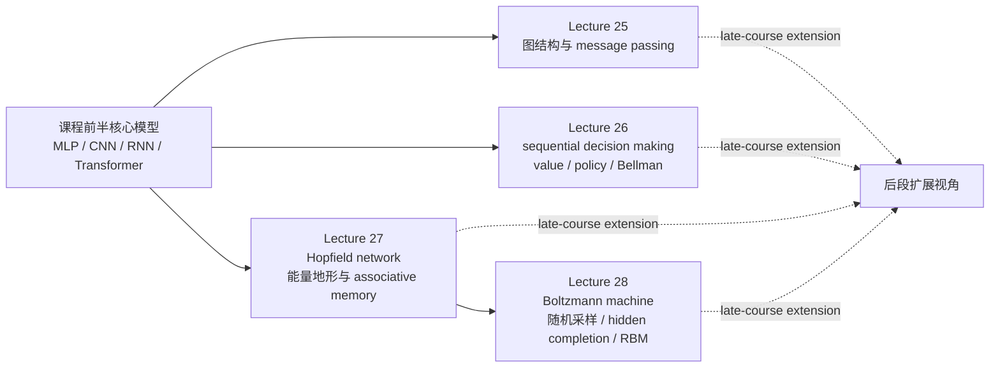

本模块只综合以下 4 份 root `NOTES.md`，不引入其他外部材料或额外结论：

1. [Lecture 25: Graph Neural Networks (GNNs)](/courses/cmu-11785-s26/lectures/026/)
2. [Lecture 26: Reinforcement Learning](/courses/cmu-11785-s26/lectures/027/)
3. [Lecture 27: Hopfield Networks](/courses/cmu-11785-s26/lectures/028/)
4. [Lecture 28: Boltzmann Machines](/courses/cmu-11785-s26/lectures/029/)

## 模块用途

这一模块对应课程后段的四个“扩展视角”，它们不是一条像 `RNN -> attention -> transformer` 那样的单线升级链，而是在核心监督学习主线之外，分别回答四类额外问题：

- 当输入不是规则网格或固定序列，而是关系结构时，怎样学习表示。
- 当问题不是静态预测，而是顺序决策时，怎样定义价值、策略与学习目标。
- 当模型被看成动力系统与记忆系统时，怎样用能量地形解释回忆、伪记忆与容量。
- 当记忆或生成不再是确定性低谷，而要描述分布、隐藏变量与采样时，怎样走到 Boltzmann machine 与 RBM。

这四讲共同说明：课程后半不再只关心“给定输入，输出标签”，而开始系统处理结构、环境、状态演化、记忆盆地、分布采样与人类反馈等更宽的问题设定。与此同时，notes 也显示它们之间的依赖强弱并不相同：

- [Lecture 25](/courses/cmu-11785-s26/lectures/026/) 与 [Lecture 26](/courses/cmu-11785-s26/lectures/027/) 更像平行扩展。
- [Lecture 27](/courses/cmu-11785-s26/lectures/028/) 与 [Lecture 28](/courses/cmu-11785-s26/lectures/029/) 则是直接成对出现，后者明确建立在前者的容量与能量讨论之上。

## 先修要求

- 已学过 MLP、CNN、RNN/LSTM、Transformer，并知道它们各自更适合规则网格、序列或 token 级输入。
- 能接受 embedding、共享权重、局部感受野、attention、Q/K/V、交叉熵、梯度下降这些基本语境。
- 能理解“状态表示是否足够”“期望值”“概率分布”“局部最小值/能量地形”“采样近似”这些跨讲反复出现的抽象概念。
- 对矩阵、外积、二次型、条件概率、边缘化、对数似然与链式法则有基本直觉。

## 学习推进与相对链接

| 顺序 | 讲次 | 在模块中的定位 | 关键时间范围 | 依赖强度说明 |
| --- | --- | --- | --- | --- |
| 1 | [Lecture 25](/courses/cmu-11785-s26/lectures/026/) | 从规则结构走向关系结构，建立 graph learning 与 message passing 主框架 | 00:03:22-01:29:38 | 平行扩展，主要依赖前面学过的 MLP/CNN/RNN/Transformer 直觉 |
| 2 | [Lecture 26](/courses/cmu-11785-s26/lectures/027/) | 从静态监督问题走向 sequential decision making，建立 value、policy、Bellman、deep RL、RLHF 主线 | 00:02:39-01:25:56 | 平行扩展，和 GNN 并列，不要求先学 Hopfield/Boltzmann |
| 3 | [Lecture 27](/courses/cmu-11785-s26/lectures/028/) | 从递归/回路网络走向 associative memory 与能量最小化 | 00:00:03-01:23:40 | 与 Lecture 28 构成强配对，先有 Hopfield 才能自然理解 Boltzmann |
| 4 | [Lecture 28](/courses/cmu-11785-s26/lectures/029/) | 把确定性能量记忆改写成随机分布模型、hidden completion、RBM 与预训练 | 00:00:00-01:20:52 | 明确建立在 Lecture 27 的容量、能量、稳定态与记忆讨论之上 |

## 依赖图

## 模块定位：为什么这四讲被放在后段

从 notes 的教学组织看，这四讲并不是“基础模型的简单续写”，而是课程在后段故意打开的四个出口：

- [Lecture 25](/courses/cmu-11785-s26/lectures/026/) 说的是“如果数据本身没有规则顺序怎么办”。
- [Lecture 26](/courses/cmu-11785-s26/lectures/027/) 说的是“如果问题目标跨越很多步，甚至 reward 本身都难定义怎么办”。
- [Lecture 27](/courses/cmu-11785-s26/lectures/028/) 说的是“如果网络是一个会演化的记忆系统，而不是一次前向计算怎么办”。
- [Lecture 28](/courses/cmu-11785-s26/lectures/029/) 则继续追问“如果这种记忆系统不再是确定性地滑入单个低谷，而是在分布上随机游走怎么办”。

因此，这一模块更适合被理解为“课程后段的结构化扩展包”，而不是单个统一架构。最强的一条局部连续链是：

$$
\text{Hopfield memory} \rightarrow \text{capacity bottleneck} \rightarrow \text{hidden bits} \rightarrow \text{Boltzmann distribution} \rightarrow \text{RBM and pretraining}
$$

而 GNN 与 RL 则分别从“结构”和“决策”两个方向，展示神经网络课程怎样超出标准监督学习边界。

## 一条总主线：从结构、决策到能量与分布

### 1. 图学习先回答“输入对象是什么样的”

[Lecture 25](/courses/cmu-11785-s26/lectures/026/) 的起点不是某个新层，而是新的输入结构。老师先回顾 MLP、CNN、RNN/LSTM 和 Transformer，随后指出分子、社交网络、交通系统这类对象天然不是规则网格，也没有固定序列顺序，因此必须换一种表示。

稳定可确认的基本记号是：

$$
G = (V, E)
$$

邻接矩阵用 $A(i, j)$ 表示边是否存在；若显式加入 self relationship，则对角线可取 1。Lecture 25 最重要的约束不是某条公式，而是 permutation invariance：同一张图重画、重标号后，语义关系不应改变。因此图模型的关键不是“按位置卷积”，而是“按关系聚合”。

### 2. message passing 是图模型的总范式，后续模型只是围绕它改造

Lecture 25 将 GNN 的共同骨架压成三步：

- gather：从邻居收集 message。
- aggregate：把多条邻居信息压成固定长度摘要。
- update：把邻域摘要与自身状态结合成新的节点表示。

notes 明确保留了“重复 $L$ 层可得到 $L$-hop 信息”这一机制结论，但并未给出可稳定抄录的完整下标公式，因此本模块只保留课堂中稳定出现的结构关系，而不补写更强的消息传递式。[需回听]

从这里往后，Lecture 25 的模型比较链条很清楚：

- 原始 GNN：有总范式，但 recurrent fixed-point 风格太慢、太贵。
- GCN：用 normalized adjacency matrix、共享权重矩阵 $W$ 与激活函数，换来更快、更可扩展的图卷积式更新。
- GraphSAGE：把“死记每个节点 embedding”改成“学习可迁移的聚合函数”，因此更适合 inductive 场景和新节点到来。
- GAT：不再平均所有邻居，而是通过 attention 学邻居权重，再用 softmax 归一化相对重要性。
- Graph Transformer：让每个节点都能看所有节点，显式建模 global dependencies，但必须补上 graph structural encoding，且计算代价涨到 $O(N^2)$。

这条比较链必须连同两条边界一起记住：

- GAT 虽然比均值聚合灵活，但仍属于局部 message passing，长程依赖仍要靠加层传播。
- 图 Transformer 解决的是“长路径信息不能快速抵达”，不是“图从此和序列一样简单”；图上没有天然顺序，因此必须额外设计结构编码。

### 3. 强化学习先回答“目标不是一步预测，而是多步决策”

[Lecture 26](/courses/cmu-11785-s26/lectures/027/) 与图学习完全不同。它不是换输入结构，而是换任务结构：从 static dataset 走向 sequential decision making。

老师用出租车网格世界给出四个底层对象：

- state：现在在哪里、周围世界是什么。
- reward：接到乘客得到的钱。
- cost：移动产生的油耗、磨损等。
- objective：reward 尽量高、cost 尽量低。

随后课程把 value 的定义推进到 Bellman 式递归。根据 notes 中可稳定确认的课堂口述，随机环境里的状态价值可以概括成：

$$
V(s) = \text{local reward/cost} + \sum_{s'} P(s'\mid s) V(s')
$$

严格说，这是 notes 对口头 Bellman 结构的整理，而不是完整板书公式转录；但“当前局部代价/奖励 + 后继状态期望价值”这一关系在 Lecture 26 中是稳定主轴。

更关键的是 Markov assumption 与 information state。Lecture 26 明确说：

- Markov 性不是“世界天然无历史”。
- 它真正要求的是“当前 state 是否已经包含决策所需全部信息”。
- 若某个路口是否能转弯依赖来向，则必须把“从哪来”编码进 state，把 world state 扩成 information state。

因此 RL 的第一步不是写算法，而是先把“什么算状态”定义对。

### 4. model-free RL 的主线，是在未知环境里边互动边学价值

Lecture 26 接着从可知环境走向未知环境，并依次经过：

- Monte Carlo：完整跑完 episode，再回头用 total return 更新估计。优点是无偏；问题是方差高、更新慢。
- Temporal Difference：不等 episode 结束，每走一步或几步就更新。优点是快；问题是 bootstrapping，属于“用一个猜测去学另一个猜测”。
- SARSA：on-policy，沿当前 policy 生成的行为更新 action value。
- Q-learning：off-policy 代表，直接学“在 state $s$ 下做 action $a$ 有多值”。

Lecture 26 明确把 Q-learning 说成仍然沿同一条 Bellman 思路，只是学习对象从 state value 转成 action value。也就是说，这里不是“抛弃 Bellman”，而是“把 Bellman 递归搬到 action-choice 层”。

### 5. deep RL 修的是表示与稳定性，不是 reward 定义

当状态空间一大，表格法只剩 memorization，于是 Lecture 26 进入 function approximation 与 Deep Q Network：

- 输入是 state。
- 输出是该 state 下各 action 的 Q values。

但 notes 反复强调 naive DQN 的三重不稳定来源：

- neural network 的非线性全局更新；
- TD bootstrapping；
- highly correlated streaming sequential data。

老师给出的两个经典修复是：

- experience replay：打乱相关数据，把“整部电影顺序训练”变成“从电影里抽样截图训练”。
- target network：把学习目标暂时固定，避免网络追逐自己不断变化的 target。

再往后，Lecture 26 进一步指出：很多现实任务真正难的不是优化器，而是 reward design。于是才有 RLHF：

- 把 reward 来源从环境换成人类偏好。
- 先从 human ranking / preference 学 reward model。
- 再按该 reward model 优化 policy。

但 notes 同时把限制说得很直白：sample inefficiency、reward misspecification、exploration/exploitation、stability、generalization，以及“humans suck”导致的人类反馈噪声，都是 RL 不能绕开的真实边界。

### 6. Hopfield 先回答“网络能否作为记忆动力系统”

[Lecture 27](/courses/cmu-11785-s26/lectures/028/) 的切换更彻底。它不再把网络当成一次前向映射，而是一个会持续演化的 loopy、binary、symmetric 系统。

Lecture 27 固定的结构约束是：

- 神经元输出只能取 $+1$ 或 $-1$。
- 权重对称，满足 $W_{ij}=W_{ji}$。
- 每个神经元根据 local field 与自身符号是否一致来决定是否翻转。

老师先证明：虽然单个神经元翻转会连锁影响其他神经元，但这种演化不会永远持续。理由是每次翻转都会让某个全局量单调变化，而该量又有上界，因此翻转次数有限。

随后课堂把这个单调量重写成能量函数。notes 中稳定保留了两种写法：

$$
E=-\frac{1}{2}\sum_j y_j\,field_j
$$

以及忽略 bias 后的二次型：

$$
E=-\frac{1}{2}\sum_{i,j} w_{ij} y_i y_j
$$

于是 Hopfield net 被明确解释成一个沿能量地形向局部低谷滑动的动力系统。

### 7. associative memory 的关键不是“停住”，而是“能被扰动后拉回”

Lecture 27 接着把记忆解释成 content-addressable memory：

- 给定残缺或带噪初态，系统会自动滑回附近完整模式。
- 这不是地址式 memory，而是内容式回忆。

这里要严格区分两个课堂术语：

- stationary：当前模式不会自发改变。
- stable：受小扰动后还能回到原模式。

老师明确说 stationary 只是必要条件，不足以当作“可靠记忆”；stable 才是真正可用的记忆条件。

Lecture 27 的单模式 Hebbian 构造是：

$$
w_{ij}=y_i y_j
$$

它能保证目标模式上每个神经元看到的 field 与自身符号一致，因此该模式 stationary；进一步从能量最低得到 stability。课堂还明确指出：

- 若无偏置，$Y$ 稳定，则 $-Y$ 也稳定。
- 多模式平均 Hebbian 会引入 parasitic patterns 和容量问题。
- 经典随机模式容量约为 $0.14N$，且带有召回误差，不是完美上界。

### 8. Lecture 27 后半真正把 Hopfield 改回了优化问题

Lecture 27 不满足于“经典规则记不多”。后半讲把训练重写成更现代的目标：

- 对想记住的模式，最小化它们的能量。
- 对不想记住的模式，抬高它们的能量。

单模式能量目标写成：

$$
E(Y)=-\frac{1}{2}Y^T W Y
$$

而关键矩阵导数是：

$$
\frac{\partial (Y^T W Y)}{\partial W}=YY^T
$$

于是老师把完整更新写成“学习目标模式、反学习非目标模式”的外积差。再进一步，由于全部非目标模式有 $2^N$ 个，不可能穷举，课堂才一路近似到：

- 先抬实际落入的 valley；
- 再聚焦目标模式附近的坏谷；
- 最后收缩到只抬目标邻域的 down-valley。

notes 给出的最终 SGD 风格更新可概括为：

$$
pp^T - dd^T
$$

其中 $p$ 是目标模式，$d$ 是从该目标模式出发下滑几步后的 down-valley 模式。这里的设计逻辑很重要：目标不是完美塑造全局能量面，而是先把目标模式附近的吸引盆地加宽、加稳。

### 9. Boltzmann 是对 Hopfield 的两次推广：随机化和隐藏变量化

[Lecture 28](/courses/cmu-11785-s26/lectures/029/) 的出发点非常明确：Hopfield 的容量与确定性记忆都不够，于是要加 hidden neurons，并允许同一 visible pattern 对应多组 hidden completion。

这一步一旦成立，系统就不能再只看成“确定性滑到某个 valley”，而必须看成“在多个 completion 之间随机访问的概率机器”。Lecture 28 因此从热力学出发，先定义：

- internal energy 是状态能量的概率期望；
- 熵刻画无序；
- 固定温度下真正被最小化的是 Helmholtz free energy。

notes 中保留的自由能形式是：

$$
F = \sum_s p(s)E(s) + kT \sum_s p(s)\log p(s)
$$

在概率和为 1 的约束下最小化后，得到 Boltzmann / Gibbs distribution：

$$
p(s)=\frac{1}{Z}\exp\left(-\frac{E(s)}{kT}\right)
$$

这条结论把 Lecture 27 的“单个低谷”视角改写成“低能状态概率更高”的分布视角。

### 10. sigmoid 在本讲不是随手选的激活，而是条件分布

Lecture 28 进一步比较两个只差一个 bit 的状态，在固定其余位条件下推出单 bit 的条件分布。notes 中稳定保留的课堂结论是：

$$
P(s_i=1\mid R)=\sigma\left(\sum_j w_{ij}s_j+b_i\right)
$$

这一步有两个重要含义：

- sigmoid 不是凭空指定，而是从 Boltzmann 条件分布推出来的。
- 随机 Hopfield / Boltzmann 更新因此变成 Gibbs sampling：固定其余 $N-1$ 个变量，对剩下的一个变量按 logistic 概率采样。

于是温度也有了非常具体的作用：

- $T=0$ 时退回确定性 Hopfield 行为。
- $T=1$ 时是标准随机 Hopfield / Boltzmann 定义。
- 温度更高时，能量地形更平，翻转概率更接近 0.5，更容易跳出小的 parasitic valley。

### 11. Boltzmann machine 的训练目标，是数据相关性减去模型相关性

Lecture 28 接着把训练写成 maximum likelihood。若没有 hidden units，notes 中保留的核心梯度是：

$$
\frac{\partial \log P(\text{data})}{\partial w_{ij}} = \langle s_i s_j \rangle_{\text{data}} - \langle s_i s_j \rangle_{\text{model}}
$$

课堂解释非常直接：

- 第一项提高训练数据里真实出现的相关性。
- 第二项压低模型自由运行时自己过度偏好的相关性。

这与 Lecture 27 的“学目标、反学非目标”在精神上是连续的，只是从离散模式记忆改写成了概率分布拟合。

### 12. hidden units 把训练改成 clamped / unclamped 两阶段

Lecture 28 真正的扩容来自 hidden neurons。此时完整状态记为 $(V, H)$，训练不再最大化某个单一 completion，而是最大化 visible 的边缘概率：

$$
P(V)=\sum_H P(V,H)
$$

因此训练流程变成：

1. clamped phase：固定 visible bits，只让 hidden bits 按 $P(H\mid V)$ 演化并采样，补出 completed pattern。
2. unclamped phase：解除固定，让整个网络自由运行，从联合分布中采样 model states。

这与无 hidden units 时的数据项减模型项完全平行，只是“数据项”现在也需要经过 hidden completion 才能形成完整状态。

### 13. RBM 与 contrastive divergence 是 Lecture 28 给出的实用化答案

Lecture 28 也明确承认 full Boltzmann machine 太慢，因为 visible 和 hidden 全互连时，采样要做很久。因此出现 Restricted Boltzmann Machine：

- visible 只连 hidden；
- hidden 只连 visible；
- 层内没有连接。

这直接带来两个实用收益：

- clamped 时，固定 visible 后，hidden 可一步条件采样出来；
- 自由运行时，只需交替采样 visible 和 hidden，而不必处理全连接随机系统里的慢耦合演化。

再进一步，Lecture 28 用 Hopfield 邻域抬升的直觉解释 contrastive divergence：

- 不必把自由链跑到完全平衡；
- 只做很少步，甚至一轮短链；
- 就能得到足够有用的梯度近似。

最后，notes 把 RBM 的历史定位说得很明确：它的重要意义之一，在于为 2000 年代后的无监督预训练和神经网络复兴提供了会工作的初始化。

## 图模型、RL 与能量模型的并列比较

| 主题 | Lecture 25 图学习 | Lecture 26 强化学习 | Lecture 27 Hopfield | Lecture 28 Boltzmann |
| --- | --- | --- | --- | --- |
| 核心问题 | 输入是关系结构而非规则网格 | 任务是多步决策而非静态预测 | 网络是记忆动力系统而非一次映射 | 记忆/生成要描述分布与隐藏变量 |
| 基本对象 | 节点、边、邻域、结构角色 | state、reward、cost、policy、value | binary state、field、energy、stable pattern | visible/hidden state、temperature、distribution |
| 主机制 | message passing | Bellman 递归 + interaction learning | 能量下降到局部低谷 | 按 Boltzmann 分布随机采样 |
| 关键升级链 | GNN -> GCN -> GraphSAGE -> GAT -> GT | MC -> TD -> SARSA -> Q-learning -> DQN -> RLHF | Hebbian -> capacity limit -> anti-memory / valley shaping | stochastic update -> ML training -> hidden completion -> RBM/CD |
| 主要收益 | 处理非规则关系数据 | 处理 long-horizon 决策与 delayed reward | 解释 associative memory 与 content-addressable recall | 处理 hidden completions、分布建模与预训练 |
| 主要代价/边界 | over-smoothing、局部传播、O(N^2) GT 代价 | sample inefficiency、reward design、stability、generalization | false memories、容量有限、训练近似 | full BM 很慢、采样成本高、公式页需严格回看 |

## 推导假设与边界条件

1. [Lecture 25](/courses/cmu-11785-s26/lectures/026/) 中 message passing 的完整下标公式在 transcript 里不稳定；notes 只稳定保留 gather / aggregate / update、邻域集合与 $L$-hop 语义，因此本模块不补更强的统一公式。[需回听]
2. Lecture 25 中 GCN、GAT、Graph Transformer 的比较主要是机制级与工程级解释，而不是完整严格推导；这里保留 normalized adjacency matrix、共享权重、softmax attention、structural encoding 与 $O(N^2)$ 这类稳定结论。
3. [Lecture 26](/courses/cmu-11785-s26/lectures/027/) 的 Bellman 方程在 notes 中主要以口头结构出现，本模块只保留“当前局部 reward/cost + 后继价值期望”的稳定表达，不补未被证据完整支持的板书版本。[需回听]
4. Lecture 26 对 discount 的解释偏课堂直觉与经验判断，而非严格系数公理化说明，因此本模块只保留“近期更可信、远期更不确定”的功能定位。
5. [Lecture 27](/courses/cmu-11785-s26/lectures/028/) 中若干数值常数、能量下界口述和 $1.06^N$ 的细定理，notes 已标有不稳定处；这里只保留它们在课堂中扮演的结论角色，而不做论文级精确化。[需回听]
6. [Lecture 28](/courses/cmu-11785-s26/lectures/029/) 的多页公式 OCR 丢字严重，尤其是 full BM / hidden-unit 梯度细节；本模块只保留 notes 中明确稳定的自由能、Boltzmann 分布、单 bit sigmoid 条件分布、数据期望减模型期望、visible 边缘化与 clamped/unclamped 逻辑。
7. 整个模块都不把这四讲强行串成“一个模型更替另一个模型”的单链。notes 支持的更稳妥说法是：GNN 与 RL 是并列扩展；Hopfield 与 Boltzmann 是成对推进。

## 易错点与复习标记

- 不要把 [Lecture 25](/courses/cmu-11785-s26/lectures/026/) 的 GNN、GCN、GraphSAGE、GAT、Graph Transformer 当成互不相干名词。老师是按“同一个 message passing 问题如何逐步改造”来讲的。
- 不要把 permutation invariance 理解成“图上什么顺序都不重要”。课堂真正的要求是：重标号不应改变图语义，因此聚合与结构编码必须尊重这种不变性。
- 不要把 [Lecture 26](/courses/cmu-11785-s26/lectures/027/) 的 value 看成单纯距离或单纯 cost。老师反复强调它是 reward 与 cost 综合后的最好可得收益。
- 不要把 Markov 性理解成“现实世界没有历史”。Lecture 26 明确说，必要时要把 history 编进 information state。
- 不要把 DQN 的难点理解成“神经网络不够强”。Lecture 26 说得更具体：难点来自 correlated data、bootstrapping 和 moving target 叠加。
- 不要把 [Lecture 27](/courses/cmu-11785-s26/lectures/028/) 里的 stationary 当成 stable。能停住不是可靠记忆的充分条件。
- 不要把 Hopfield 的 Hebbian learning 当成“最优训练算法”。Lecture 27 明确指出它只做了学习目标模式的一半，没有系统处理非目标模式和伪记忆。
- 不要把 [Lecture 28](/courses/cmu-11785-s26/lectures/029/) 里的 sigmoid 当普通工程激活函数。课堂重点恰恰是它来自单 bit 条件分布。
- 不要把随机 Hopfield / Boltzmann 理解成“每一步都降能量”。Lecture 28 说得很清楚：它只是在分布上偏向低能状态，允许以非零概率上坡。
- 不要把 hidden bits 理解成“完全无关”。在 Boltzmann machine 里，它们虽然不是最终输出目标，但会参与能量、分布和训练。

## 分讲掌握标准

### Lecture 25：Graph Neural Networks

- 能解释为什么图像是规则网格图，而一般图没有天然方向和顺序。
- 能完整讲出 gather、aggregate、update 三步，以及为什么重复 $L$ 层能得到 $L$-hop 信息。
- 能比较 GCN、GraphSAGE、GAT、Graph Transformer 在邻居处理方式、泛化能力与代价上的不同。
- 能说明 over-smoothing、structural encoding、WL test、equivariance 在课堂里分别承担什么角色。

### Lecture 26：Reinforcement Learning

- 能从出租车例子准确定义 state、reward、cost、objective。
- 能解释 information state 为什么能把看似 non-Markov 的世界改写成 Markov 模型。
- 能区分 Monte Carlo、TD、SARSA、Q-learning 的更新直觉与风险。
- 能说明 replay、target network 与 RLHF 分别在解决什么问题。

### Lecture 27：Hopfield Networks

- 能写出 Hopfield network 的结构约束、翻转规则和能量函数。
- 能解释从局部翻转到全局单调量，再到能量下降和有限步收敛的证明链条。
- 能区分 stationary、stable、local minimum、false memory、parasitic pattern。
- 能从 Hebbian、容量、外积差更新和 valley / down-valley 近似讲清训练思路如何升级。

### Lecture 28：Boltzmann Machines

- 能说明为什么 hidden neurons 和 multiple completions 会把记忆系统改写成概率模型。
- 能从自由能最小化讲到 Boltzmann distribution，并解释温度的作用。
- 能解释单 bit 条件分布为什么是 sigmoid，以及这如何导向 Gibbs sampling。
- 能讲清 full BM、clamped/unclamped、RBM、contrastive divergence 和预训练之间的关系。

### 模块总掌握标准

- 能把这四讲准确定位为课程后段的扩展视角，而不是捏成一条并不存在的统一主链。
- 能指出其中唯一较强的内部连续链是 Hopfield -> Boltzmann，而 GNN 与 RL 是并列扩展。
- 能在讲解每一讲时同时给出“它解决了什么问题”和“它自己又引入了什么新代价/边界”。
- 能在需要时写出本模块中真正稳定出现过的几个关键公式，并明确哪些地方 notes 只支持机制解释、不支持更强的精确补写。

## 12 个递进练习（含答案）

### 1. 为什么 Lecture 25 不能直接把图当成“另一种序列”来处理？

答案：因为图没有天然顺序，重画节点位置或重标号并不改变图语义。Lecture 25 因此把 permutation invariance 当成硬约束。若强行按某个顺序把图序列化，模型就可能学到人为顺序，而不是关系结构本身。

### 2. GCN 相比原始 GNN 的真正改进点是什么？

答案：不是“它也会聚合邻居”，而是它把原始 GNN 那种 recurrent fixed-point、收敛慢、回传长的形式改成了基于 normalized adjacency matrix、共享权重矩阵 $W$ 和激活函数的高效卷积式更新，因此更快、更可扩展。

### 3. GraphSAGE 为什么在 notes 里被强调为 inductive？

答案：因为它学的是聚合函数，而不是死记每个节点的固定 embedding。这样在训练后遇到新节点，只要还能看到该节点及其邻居，就可以现场生成表示，而不是重训整图。

### 4. GAT 与 Graph Transformer 的差别，为什么不能简单概括成“都用了 attention”？

答案：因为 GAT 仍在局部邻域里学习邻居权重，本质上还是 message passing；Graph Transformer 则让每个节点都能看所有节点，直接引入全局依赖建模，但必须补上 structural encoding，而且计算变成 $O(N^2)$。attention 只是共同手段，不代表结构代价相同。

### 5. 在出租车例子里，为什么“离乘客最近的车”不一定是最优选择？

答案：因为 Lecture 26 的 value 不是几何距离，而是综合 reward 与 cost 后的最好可得收益。近的路口可能更堵、更耗油，value 反而更低；老师在问答里明确指出派车应看 value，而不是只看最近。

### 6. Monte Carlo 和 TD 的核心差异到底是什么？

答案：Monte Carlo 要等整个 episode 结束后，拿真实 total return 回头更新，因此无偏但方差高、收敛慢；TD 则边走边用“下一步的估计”更新当前估计，因此更快，但属于 bootstrapping，会有偏并可能引发误差级联。

### 7. replay 和 target network 为什么要一起出现？

答案：因为 Lecture 26 把 DQN 的不稳定归因为三件事叠加。replay 主要修 correlated sequential data，target network 主要修 moving target；它们各自解决不同不稳定源，只做其中一个都不完整。

### 8. 为什么 Lecture 27 说单模式 Hebbian learning 保证的是 stationary，并进一步可推出 stable？

答案：因为取 $w_{ij}=y_i y_j$ 后，每个神经元在目标模式上的 field 都与自身取值同号，所以不会翻转，先得到 stationary。再把该模式代入能量，老师进一步说明它达到最低能量，因此受扰动后会滑回去，从而成为 stable。

### 9. 为什么 Lecture 27 说只靠 Hebbian 平均会出现 parasitic patterns？

答案：因为多模式平均只是在目标模式上做正更新，并没有系统抬高不该记住的模式能量。结果一些模式的组合态、平均态或混合态也可能变成局部低谷，于是网络会“记住”并非目标的假模式。

### 10. Lecture 28 中，为什么同一个 visible pattern 可以对应多组 hidden completion 这一点会迫使我们转向概率模型？

答案：因为一旦 hidden bits 不要求唯一、也不要求精确召回，系统就不再对应“唯一目标状态”。它必须表达“对同一 visible，哪些 hidden configurations 都可以接受，以及各自多大概率出现”，这正是分布建模问题。

### 11. 单 bit 的 sigmoid 条件分布在课堂里解决了什么实际问题？

答案：它把 Boltzmann 分布落成了可执行的局部更新规则。只要固定其余位，就能用 $P(s_i=1\mid R)=\sigma(\sum_j w_{ij}s_j+b_i)$ 为第 $i$ 位采样。于是整网采样就变成 Gibbs sampling，而不是一个抽象概率定义。

### 12. 综合题：如果某个任务同时满足“输入是图结构”“决策跨很多步”“局部最优容易困住系统”“目标反馈本身也难定义”，这四讲分别能给出哪类不同帮助？

答案：Lecture 25 提供的是对关系结构输入的表示与 message passing 框架；Lecture 26 提供的是 state、value、policy、Bellman、deep RL 与 RLHF 这套决策学习语言；Lecture 27 提供的是能量地形、局部极小值、稳定记忆与吸引盆地的动力系统直觉；Lecture 28 提供的是随机上坡逃出小 valley、hidden completion、概率采样与 data-vs-model 对比学习的分布视角。它们并不意味着要把四种模型硬拼成一个系统，而是分别提供结构、决策、能量和概率四种分析工具。

## 建议复习顺序

1. 先看 [Lecture 25](/courses/cmu-11785-s26/lectures/026/) 的 `00:13:20-01:12:59`，把图的基本约束、message passing、GCN/GraphSAGE/GAT/GT 比较主线吃透；再回头看 `01:12:57-01:29:38`，把 WL、equivariance、graph generation 与教授总结补全。
2. 再看 [Lecture 26](/courses/cmu-11785-s26/lectures/027/) 的 `00:12:34-00:52:26`，先把 state、value、information state、Bellman、MC/TD/SARSA/Q-learning、DQN 的核心逻辑串起来；然后看 `00:52:23-01:25:56`，把 RLHF、limitations 与问答中的概念澄清补上。
3. 接着看 [Lecture 27](/courses/cmu-11785-s26/lectures/028/) 的 `00:00:03-00:40:22`，先弄清结构、翻转规则、收敛证明、能量与 associative memory；再看 `00:40:21-01:23:40`，完成 stationary/stable、Hebbian、容量、伪记忆与 valley / down-valley 训练主线。
4. 最后看 [Lecture 28](/courses/cmu-11785-s26/lectures/029/) 的 `00:19:56-01:19:39`，先把自由能、Boltzmann 分布、sigmoid 条件分布、温度与 Gibbs sampling 吃透，再把 clamped/unclamped、RBM、contrastive divergence 与预训练历史位置串起来。
5. 收尾时再对照本模块的依赖图复述一遍：GNN 与 RL 是平行 late-course extensions；Hopfield 与 Boltzmann 是更强的连续对讲。

## 一句话总收束

模块 07 的真正价值不在于给出一个统一大模型，而在于让课程后段同时打开四扇门：对图，学会按关系而不是按位置建模；对决策，学会按状态、价值与策略而不是按单步标签建模；对记忆，学会按能量盆地而不是按地址建模；对生成与隐变量，学会按概率分布、采样与 completion 而不是按唯一目标状态建模。
