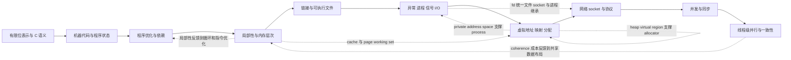


> 覆盖范围：Lecture 01–26，严格按课程讲次顺序组织。  
> 使用原则：先用本页建立全局结构，再进入模块、单讲笔记和原始工件；遇到公式、数值、代码、API 或关键语义时，回到课件、转录和录像交叉核验。  
> 证据边界：本文只综合本目录中的课程元数据、七份模块指南、26 份课堂笔记与复核清单，不使用外部知识补齐材料空白。

## 一、课程身份、范围与证据来源

### 1.1 课程身份与纳入范围

- 课程：**CMU 15-213/15-513 Introduction to Computer Systems, Fall 2015**。
- 用户入口是一个 YouTube 播放列表；[source-manifest.json](/courses/cmu-csapp-f15/) 保存原 YouTube URL、匹配的 CMU 官方 Fall 2015 Panopto URL、讲次标题和官方 PPTX 映射。
- YouTube 列表包含 Lecture 01–26，但 Lecture 26 在列表中的位置不是第 26 项；本目录依据讲次编号恢复为教师的 Lecture 01 → 26 顺序。[README.md](/courses/cmu-csapp-f15/) 记录了这一恢复过程。
- 实际媒体来自标题、时长和内容顺序逐项匹配的 CMU Fall 2015 官方 Panopto；每讲仍保留用户列表中的原 YouTube URL。官方 Panopto 中额外的 Lecture 27 与 recitation **不在本指南范围内**。
- 官方课程 PPTX 位于 [official-materials](/courses/cmu-csapp-f15/)；Lecture 02 与 03 共用 `02-03-bits-ints.pptx`，其余讲次各有对应课件。
- [course.json](/courses/cmu-csapp-f15/) 是处理结果的课程索引；[source-manifest.json](/courses/cmu-csapp-f15/) 是顺序、来源与课件映射的来源清单。二者共同约束本文的标题和讲次次序。

### 1.2 证据层级

本目录中的学习材料不是教师审定的逐字稿，应按以下强度使用：

1. **录像与官方课件**：原始课堂事件和静态课件证据；录像中的现场口误、课件遗留错误或两者差异仍可能存在。
2. **自动 transcript**：由 ASR 生成，适合定位时间与搜索术语，不是 instructor-approved verbatim text。
3. **单讲 `NOTES.md`**：按教师推进顺序把 transcript、课件页和演示整理在一起，并显式保留 `[需回听]`、课件/口述冲突和材料边界。
4. **模块指南**：跨相邻讲次建立概念依赖、公式、误区和掌握门槛；它们是综合说明，不替代原讲证据。
5. **本课程指南**：建立 26 讲的全局路线、跨模块方法、学习计划和累计练习；它不把未决标记升级为事实。

因此，涉及精确公式、数值、寄存器、代码路径、API 参数或关键语义时，应把本文视为导航和推理框架，而不是可脱离原材料引用的教师原话。

## 二、如何使用本目录工件

### 2.1 推荐阅读链

```text
COURSE_SUMMARY.md
  -> 对应模块指南
  -> 对应 Lecture 的 NOTES.md
  -> transcript / PPTX / source.mp4
  -> REVIEW_CHECKLIST.md 中的核验队列
```

1. 从 [COURSE_SUMMARY.md](/courses/cmu-csapp-f15/) 选择当前知识链、模块目标或复习计划。
2. 进入七份模块指南之一，理解该组讲次的教师推进、概念依赖、公式前提与边界。例如 [模块 01](/courses/cmu-csapp-f15/modules/01/) 负责 Lecture 01–04。
3. 打开单讲笔记，按时间顺序学习，并用笔记中的时间戳和课件页回查。例如 [Lecture 01 NOTES](/courses/cmu-csapp-f15/lectures/001/)。
4. 对关键细节同时查看该讲的 [transcript.txt](/assets/courses/cmu-csapp-f15/lectures/001/transcript.txt)、[官方 PPTX](/assets/courses/cmu-csapp-f15/slides/01-overview.pptx) 与 [source.mp4](https://www.youtube.com/watch?v=ScMxnXq6fbI)。其他讲次目录使用同样的文件结构。
5. 若笔记标出不确定项，进入 [REVIEW_CHECKLIST.md](/courses/cmu-csapp-f15/review-checklist/)，按原音时间、课件页和上下文核验。清单是验证队列，不是学习前必须清零的先决条件。

### 2.2 各工件最适合回答的问题

| 工件 | 最适合回答 | 不应单独承担 |
| --- | --- | --- |
| 本指南 | 全课程依赖、跨讲方法、计划、累计练习 | 精确逐字引用 |
| 模块指南 | 相邻讲次如何递进、公式前提、模块误区 | 某个时间点的原音判定 |
| `NOTES.md` | 教师顺序、演示、时间戳、课件页、证据边界 | 未标明来源的外部扩展 |
| transcript | 搜索原词、定位上下文 | 术语、数字、公式的最终裁决 |
| PPTX | 静态公式、代码、图表和讲者备注 | 证明教师逐页讲过所有内容 |
| `source.mp4` | 语音、板书、指向、演示和现场纠错 | 快速全局复习 |
| `REVIEW_CHECKLIST.md` | 按风险核验未决证据 | 把全部标记视为确认错误 |

## 三、一页式课程总览

### 3.1 课程回答的核心问题

**高级语言程序怎样在有限位表示、机器指令、存储层次、链接与进程、虚拟内存、网络和并发硬件上正确而高效地运行？**

课程不是把七个主题并列陈列，而是持续拆开抽象：值先被编码为 bits；bits 被机器指令读写；指令受控制流、调用约定和地址布局约束；实际性能受依赖和局部性约束；程序经链接成为 executable，再由进程、异常和 I/O 与内核交互；虚拟地址把进程隔离、共享和按需装载统一起来；allocator 在该地址空间中管理对象；socket 把描述符模型延伸到网络；线程共享地址空间后，必须用不变量约束交错，并用测量判断并行是否真正缩短整体时间。

### 3.2 七个模块的学习产出

| 模块 | 讲次 | 完成后应能做到 |
| --- | ---: | --- |
| 01 系统观与数据表示 | 01–04 | 从位宽、编码、转换、截断和舍入推导整数/浮点结果，并区分数学、机器位模型与 C 语义 |
| 02 机器级编程与优化 | 05–10 | 逐条追踪寄存器/内存/条件码/栈状态，从类型恢复布局，从依赖图与语义约束解释安全和性能 |
| 03 内存层次与缓存 | 11–12 | 从设备差距和局部性推出层次结构，手算缓存地址、命中轨迹、平均成本和循环访问模式 |
| 04 链接、异常控制流与 I/O | 13–16 | 把 symbol、relocation、process、signal、fd 与 open-file state 串成 executable 到受控 I/O 的状态链 |
| 05 虚拟内存与分配 | 17–20 | 完成 VA→PA 翻译和 fault 判定，解释 mapping/COW，并维护 allocator/GC 的块、所有权和一致性不变量 |
| 06 网络编程 | 21–22 | 从 IP:port、DNS 和候选地址走到 socket 生命周期，再追踪 echo、HTTP、Tiny 静态内容与 CGI 数据流 |
| 07 并发、同步与并行 | 23–26 | 枚举共享实例和交错，用 semaphore/锁不变量证明正确性，并用 speedup、Amdahl 与 coherence 分析并行成本 |

## 四、全课程知识依赖图



### 4.1 主链的含义

1. **表示 → 机器代码**：若不知道位宽、signedness、object bytes 和浮点舍入，就无法可靠解释寄存器值、数组地址或编译器生成代码。
2. **机器代码 → 性能/存储层次**：优化不是改写源代码外观，而是减少重复工作、缩短依赖链、提高独立工作量并改善访问模式。
3. **性能/存储层次 → 链接/进程/I/O**：代码和数据的最终位置由链接落实；运行时由异常和进程控制；外部状态通过 fd 和 Unix I/O 进入程序。
4. **进程/I/O → VM/allocator**：private address space、共享映射、COW 和 demand paging 支撑进程；heap 是地址空间中的区域，allocator 再在其中管理 variable-sized blocks。
5. **VM/allocator → network**：socket 继承 fd 的命名、生命周期与 I/O 语义；网络程序还复用 fork/exec、RIO、mmap 和 descriptor redirection。
6. **network → concurrency/synchronization/parallelism**：多个慢 client 让单一阻塞流不可用；多 flow 又引入共享、race、deadlock、粒度和 coherence 成本。

### 4.2 重要反馈环

- **Locality 同时反馈到机器优化与 VM/cache**：Lecture 10 的循环和依赖优化必须与 Lecture 11–12 的 stride/block 行为相容；Lecture 17 的 page working set 和 TLB translation locality 又把同一思想提升到页级。Lecture 26 的 cache-line ownership 说明“不同变量”也可能在同一硬件块上竞争。
- **Descriptors 连接文件、socket 与进程**：Lecture 16 的 descriptor/open-file/v-node 三表说明 fd 是进程内索引；`fork` 复制表项但共享底层打开状态，`dup2` 改写引用。Lecture 21–23 用同一模型解释 clientfd/listenfd/connfd、EOF、父子 close 与 worker ownership。
- **Virtual address abstraction 支撑 process 与 allocator**：进程的 private address space 依赖每进程映射；`fork` 的 COW、`execve` 的按需装载和 `mmap` 都在映射层工作。`malloc` 管理的是该虚拟空间中 heap blocks，而不是直接分配物理页。
- **正确性机制反馈到性能**：锁、signal mask、page fault、cache miss 和 coherence 都是为正确性或抽象服务的机制，却会成为慢路径。课程要求先证明语义，再测量真正的瓶颈，不能用“更并行”或“更低层”替代证据。

## 五、七个模块章节

### 5.1 模块 01：系统观、整数与浮点数据表示

**模块指南：** [01-foundations-and-data-representation.md](/courses/cmu-csapp-f15/modules/01/)

**包含讲次：**

- [Lecture 01: Course Overview](/courses/cmu-csapp-f15/lectures/001/)
- [Lecture 02: Bits, Bytes, and Integers](/courses/cmu-csapp-f15/lectures/002/)
- [Lecture 03: Bits, Bytes, and Integers (cont.)](/courses/cmu-csapp-f15/lectures/003/)
- [Lecture 04: Floating Point](/courses/cmu-csapp-f15/lectures/004/)

**教师推进。** Lecture 01 先用 five realities 说明抽象为何会在 correctness、performance、security 和 system interaction 处暴露边界，再给出课程和 labs 路线。Lecture 02 从物理 bits、binary/hex、Boolean vectors 推到 B2U/B2T、signed/unsigned conversion、extension 与 truncation。Lecture 03 从“只保留低位”继续推出定宽加法、乘法、移位、除法舍入和补码取负，随后转入 byte-addressed memory、alignment、endianness 与 object bytes。Lecture 04 从有限二进制小数的局限推出 IEEE 的 significand/exponent、norm/denorm/special values、spacing、nearest-even 和浮点代数边界。

**必须掌握的推理。**

- 每题先写 width、type/decoder、operation 和 boundary assumptions。
- 能从位权推导 B2U/B2T、范围、T2U/U2T，而不是背端点。
- 能把 mathematical result、low bits、machine interpretation 与 portable-C conclusion 分开。
- 能画出 multi-byte scalar 的 endian layout，并区分 pointer width、object size 和 usable address bits。
- 能按 `sign -> exponent/significand -> normalize -> round` 解释浮点运算，并只在 exact halfway 使用 nearest-even。

**边界与误区。** Unsigned 模运算有课堂明确的 C 保证；signed overflow、某些 signed left shift 和 negative signed right shift 不能被写成无条件可移植结论。Endian 反转的是 multi-byte object 的 byte significance，不是每 byte 内 bits 或字符串元素。`exp` 字段、$Exp$ 数值和实际指数 $E$ 不可混同。浮点可交换不推出可任意改括号；narrowing 丢失的信息不会因随后 widening 恢复。

**模块门槛。** 在不查表的情况下，用 4/5-bit 模型完成一次 signed/unsigned conversion、overflow、shift/division 和 truncation；画出一个整数的两种 endian bytes；编码一个课堂浮点例并解释一次 tie-to-even。每个答案都能同时写出机器模型与 C/平台边界，才进入机器级代码。

### 5.2 模块 02：机器级编程与程序优化

**模块指南：** [02-machine-programming-and-optimization.md](/courses/cmu-csapp-f15/modules/02/)

**包含讲次：**

- [Lecture 05: Machine-Level Programming I: Basics](/courses/cmu-csapp-f15/lectures/005/)
- [Lecture 06: Machine-Level Programming II: Control](/courses/cmu-csapp-f15/lectures/006/)
- [Lecture 07: Machine-Level Programming III: Procedures](/courses/cmu-csapp-f15/lectures/007/)
- [Lecture 08: Machine-Level Programming IV: Data](/courses/cmu-csapp-f15/lectures/008/)
- [Lecture 09: Machine-Level Programming V: Advanced Topics](/courses/cmu-csapp-f15/lectures/009/)
- [Lecture 10: Program Optimization](/courses/cmu-csapp-f15/lectures/010/)

**教师推进。** Lecture 05 建立寄存器、内存、operand、effective address、`mov`/`lea` 和 symbolic execution。Lecture 06 把算术/`cmp`/`test` 产生的 flags 接到 SetX、jump、`cmov`、loops 与 jump table。Lecture 07 把 control、data 与 local storage 绑定到 `call`/`ret`、ABI、stack frame、保存责任和递归。Lecture 08 从声明推导数组缩放、多级间接、struct padding 和 XMM 数据流。Lecture 09 把 stack/data layout 推到 buffer overflow、return-address 破坏和 ASLR/NX/canary/ROP 的分层前提。Lecture 10 最后以 compiler blockers、CPE、依赖链、latency/throughput、multiple accumulators 和 SIMD 回答“何种源级重写既合法又更快”。

**必须掌握的推理。**

- 对每条汇编写 `{registers, memory, flags, rip, rsp}` 的前后状态。
- 先算 effective address，再由 mnemonic 判断是否 dereference；`leaq` 不自动读取内存。
- 从 flags 最近写入者恢复条件，从 label 前驱/后继恢复控制流，而不是逐 C 行猜配对。
- 由值的 lifetime 判断 register、stack slot 和 caller/callee-saved responsibility。
- 由声明推导 `sizeof`、stride、field offset、padding 和间接读取次数。
- 优化前依次检查语义许可、alias/call/浮点阻碍、dependency graph 和测得的 latency/throughput bound。

**边界与误区。** 汇编输出依赖课堂 Linux x86-64、GCC、ABI 和优化级别。C local 不必落栈；frame 属于 invocation，不属于静态函数定义。能计算越界地址不代表可合法解引用。一次未崩溃不能证明没有 overflow。ASLR、NX 和 canary 切断不同前提。普通 loop unrolling 不必然缩短单累加器依赖链；课堂 Haswell 数字和 CPE 表不能外推为所有机器常数。

**模块门槛。** 给一段含 branch、call、数组/struct access 和 helper 的汇编，能画 data-flow、CFG、stack/lifetime 与字节布局；再对一个归约循环说明 compiler 能否重写、关键依赖链在哪里、应测什么。若只能认 mnemonic 而不能证明状态和边界，暂不进入 cache 分析。

### 5.3 模块 03：内存层次与缓存

**模块指南：** [03-memory-hierarchy-and-caches.md](/courses/cmu-csapp-f15/modules/03/)

**包含讲次：**

- [Lecture 11: The Memory Hierarchy](/courses/cmu-csapp-f15/lectures/011/)
- [Lecture 12: Cache Memories](/courses/cmu-csapp-f15/lectures/012/)

**教师推进。** Lecture 11 先比较 SRAM/DRAM/disk/SSD 的速度、容量、成本和访问机制，用 disk timing、DMA 和 CPU-storage gap 说明均匀大数组只是抽象；再用 temporal/spatial locality 推出相邻层缓存、block transfer、working set 和 cold/capacity/conflict misses。Lecture 12 才定义 $S/E/B/C$、tag/index/offset、direct/set/fully associative、replacement、write policies 和多级 cache 成本；随后用 Memory Mountain、矩阵循环排列与 blocking 把硬件模型映射回代码。

**必须掌握的推理。**

- 从“设备约束 + 速度鸿沟 + locality”推出 hierarchy，而不是只背层级。
- 给定 $m,S,E,B$，求 $s,b,t,C$，按 `index -> valid/tag -> offset` 判定 hit。
- 手算 direct-mapped 与 set-associative 的完整 line state；区分 cold、capacity、conflict。
- 把 write hit 的 through/back 与 write miss 的 allocate/no-allocate 分成两个决策轴。
- 用平均访问时间、stride、working-set size 和 block reuse 解释性能；明确 misses/iteration 不等于 cycles/iteration。

**边界与误区。** $C=SEB$ 只计 data bytes；$B$ 是 block bytes，$b$ 才是 offset bits。提高 associativity 只放宽指定 set 内位置。L1 miss 还可能由 L2/L3 服务。Memory Mountain、disk/SSD 数字和 Core i7 参数属于课堂系统。矩阵 miss 比例、blocking 公式和 $3B^2<C$ 都依赖模块列出的元素大小、块大小、容量单位和省略项。

**模块门槛。** 闭卷重算 disk access 例、`0,1,7,8,0` 两种 cache 组织、97%/99% 平均时间和一种矩阵 loop order；每题说明单位、初始状态、placement 与适用前提。做到后才把 cache/page 思维用于系统接口和 VM。

### 5.4 模块 04：链接、异常控制流与系统级 I/O

**模块指南：** [04-linking-ecf-and-io.md](/courses/cmu-csapp-f15/modules/04/)

**包含讲次：**

- [Lecture 13: Linking](/courses/cmu-csapp-f15/lectures/013/)
- [Lecture 14: Exceptional Control Flow: Exceptions and Processes](/courses/cmu-csapp-f15/lectures/014/)
- [Lecture 15: Exceptional Control Flow: Signals and Nonlocal Jumps](/courses/cmu-csapp-f15/lectures/015/)
- [Lecture 16: System-Level I/O](/courses/cmu-csapp-f15/lectures/016/)

**教师推进。** Lecture 13 从独立 `.o` 的 symbols 与 relocation entries 构造 executable，并用 static/shared linking、loader 和 dynamic linker把磁盘文件交到 `execve`。Lecture 14 说明 exception 如何让 kernel 取得控制，再用 logical flow/private address space、context switch、`fork`、`wait` 和 `execve` 建立进程生命周期。Lecture 15 从后台 child 的回收需求推出 pending/blocked signals、handler 限制、`SIGCHLD`、mask 与 `sigsuspend`，重点训练 race 的精确失败交错。Lecture 16 把进程持有外部资源的状态展开成 descriptor/open-file/v-node 三表，并用 short count、RIO、`fork` 共享位置和 `dup2` redirection 收束。

**必须掌握的推理。**

- 区分 symbol resolution 的“绑定谁”和 relocation 的“修哪里/写什么”。
- 用 process graph 和 happens-before 判断 `fork` 输出，不猜 scheduler。
- 区分 program/process、`fork`/`execve`、terminate/zombie/reap。
- 用 `pending & ~blocked`、普通信号不排队和 handler 安全规则分析通知。
- 写出 child-before-addjob 与 check-before-sleep 的失败交错，再证明 mask/`sigsuspend` 如何消除窗口。
- 逐操作画 descriptor table 指向 open-file entry 的箭头和 refcount/file position；用 RIO invariant 处理 short count。

**边界与误区。** Linker 不按 C 类型替你保护同名 globals。`fork` 一次调用、两处返回；`execve` 替换当前 program 而不创建 process。发送 signal 不等于 handler 立即运行；通知次数不等于事件数。`volatile` 不提供互斥。fd 不是 pathname 或文件本体；两次 `open` 与 `fork`/`dup2` 的共享关系不同。课堂三表和地址空间图是概念模型，不是完整内核实现。

**模块门槛。** 从 `cmd > out &` 出发，完整追踪链接、`fork`、mask、`open/dup2/close`、`execve`、write、child termination、`SIGCHLD` 与 reap；每一步指出改变的是 symbol、program image、process、signal state 还是 descriptor reference。

### 5.5 模块 05：虚拟内存与动态内存分配

**模块指南：** [05-virtual-memory-and-allocation.md](/courses/cmu-csapp-f15/modules/05/)

**包含讲次：**

- [Lecture 17: Virtual Memory: Concepts](/courses/cmu-csapp-f15/lectures/017/)
- [Lecture 18: Virtual Memory: Systems](/courses/cmu-csapp-f15/lectures/018/)
- [Lecture 19: Dynamic Memory Allocation: Basic Concepts](/courses/cmu-csapp-f15/lectures/019/)
- [Lecture 20: Dynamic Memory Allocation: Advanced Concepts](/courses/cmu-csapp-f15/lectures/020/)

**教师推进。** Lecture 17 用 MMU、page cache、PTE、fault、working set、protection、TLB 和多级页表建立 VM 的缓存/管理/保护三重用途。Lecture 18 先用玩具系统完成 TLB→page table→PA→cache 全路径，再进入 Core i7 四级翻译、Linux VM areas、fault 判定、mapping、COW、`fork`/`execve`/`mmap`。Lecture 19 把粒度从固定 page 降到 heap 中 variable-sized block，定义 throughput/utilization、fragmentation、header、placement、splitting、boundary-tag coalescing。Lecture 20 用 explicit/segregated lists 缩小搜索，再以 reachability、Mark-and-Sweep、C memory bugs 和 consistency checker建立 lifetime 与调试闭环。

**必须掌握的推理。**

- 严格分开 TLB hit/miss、page hit/fault 和普通 cache hit/miss。
- 用 VPN/VPO、PTEA、PPN/PPO 逐步翻译；多级 page walk 中上级 PTE 给 base，下一 VPN 字段给 index。
- Fault 后先查 area 与权限，再区分非法地址、权限违规、合法 absent page 和 COW write。
- 区分 mapping、page residency、heap allocation 和 object reachability 四个状态层。
- 从 block header/size 推导 traversal、split remainder、physical neighbors 和 coalescing；区分物理邻接与 free-list links。
- 把 allocator invariants 写成静默 checker，并用二分 probe 找首次非法状态。

**边界与误区。** VM 不只是借磁盘；valid=0 也不是单一含义。TLB hit 不省目标 data access。`fork` 立即复制描述结构/page tables，但 data pages 按写 COW。`malloc` 不等于立即分配物理页，`free` 也不等于立即 unmap。总 free bytes 足够仍可能因不连续而失败。Explicit-list `next` 不是物理 successor；conservative GC 的误判方向是保留垃圾，不是释放可达对象。

**模块门槛。** 完成一条含 TLB miss、page-table hit、data-cache miss 的翻译；对四类 fault 分类；画一轮 split/free/coalesce 与 explicit-list 更新；在 object graph 上执行 Mark/Sweep，并能用两个 allocator invariants定位 use-after-free/double-free 的首次破坏。

### 5.6 模块 06：网络编程

**模块指南：** [06-network-programming.md](/courses/cmu-csapp-f15/modules/06/)

**包含讲次：**

- [Lecture 21: Network Programming: Part 1](/courses/cmu-csapp-f15/lectures/021/)
- [Lecture 22: Network Programming: Part II](/courses/cmu-csapp-f15/lectures/022/)

**教师推进。** Lecture 21 从 client/server role、NIC/LAN/router、IP/UDP/TCP 逐层收束到可靠 byte stream，再区分 IP value、network byte order、presentation、domain name、DNS multi-mapping、port 与 connection identity；最后建立 `getaddrinfo` 和原始 socket 生命周期。Lecture 22 把候选重试与清理封装成 `open_clientfd/open_listenfd`，用 echo 固化 listenfd/connfd/clientfd 和 EOF，再把 TCP stream 提升为 HTTP transaction、Tiny 静态文件发送和 `QUERY_STRING -> fork -> dup2 -> execve -> CGI` 动态路径。

**必须掌握的推理。**

- 区分 frame、IP datagram、TCP byte stream 与 application message boundary。
- 把 address value、network order、numeric text、domain name、port 和 socket address 放在不同层。
- 遍历 `addrinfo` candidates；每次失败关闭本轮 descriptor，最终释放 list。
- 画 server `socket->bind->listen->accept` 与 client `socket->connect`，区分长期监听与会话 descriptor。
- 追踪 echo 的一行 bytes 与 EOF；再按 start line、headers、blank line、body 解析 HTTP。
- 区分 Tiny server 与 CGI child 对 response 各部分的所有权，并追踪环境变量与 stdout redirection。

**边界与误区。** Client/server 是 process roles，不是机器类型。`socket` 只建本地状态，`bind` 不等于已监听，`accept` 不覆盖 listenfd。同一 service port 可服务多连接，完整两端地址区分它们。DNS 不是固定单值函数。HTTP 在 TCP 上，不替代 TCP。两讲的 echo/Tiny 都是 sequential teaching servers；proxy 只讲到 request-target 差异，additional slides 不能冒充实际讲授。

**模块门槛。** 从 domain/service strings 开始，逐候选建立一次连接，追踪一轮 echo 与关闭，再手工解析一个 GET，并分别画 Tiny static 的 header/body path 和 CGI 的 process/environment/descriptor path。

### 5.7 模块 07：并发、同步与线程级并行

**模块指南：** [07-concurrency-synchronization-and-parallelism.md](/courses/cmu-csapp-f15/modules/07/)

**包含讲次：**

- [Lecture 23: Concurrent Programming](/courses/cmu-csapp-f15/lectures/023/)
- [Lecture 24: Synchronization: Basics](/courses/cmu-csapp-f15/lectures/024/)
- [Lecture 25: Synchronization: Advanced](/courses/cmu-csapp-f15/lectures/025/)
- [Lecture 26: Thread-Level Parallelism](/courses/cmu-csapp-f15/lectures/026/)

**教师推进。** Lecture 23 从 iterative server 被慢 client 阻塞的功能问题出发，比较 process/event/thread，并用 descriptor ownership、partial input state 和 `&connfd` race 揭示每种模型的成本。Lecture 24 从变量实例判定共享，把 `cnt++` 展开成 L/U/S 和 progress graph，再从 semaphore 的 $s\ge0$ 推出 mutex 排除 unsafe region。Lecture 25 扩展到 producer-consumer、reader-priority readers-writers、prethreaded server、thread safety、独立参数对象和多锁 deadlock。Lecture 26 从外部事件并发转到单任务并行，以 `psum` 三版、speedup/efficiency/Amdahl、parallel quicksort、sequential consistency 和 E/S/I coherence 连接正确性与性能。

**必须掌握的推理。**

- 先枚举变量实例、引用线程、读写和 lifetime，再判定共享与 race。
- 把 race 写成两个未排序事件，把 deadlock 写成资源等待环；单核交错也足够触发。
- 从 P/V 的原子、阻塞和唤醒语义说明每个 semaphore 表示什么资源/条件，证明不变量而非背模板。
- Producer-consumer 中资源资格、结构互斥和完成通知必须分开；多锁统一获取全序。
- 并行前建立强 sequential baseline，报告 elapsed time、speedup、efficiency、串行部分、粒度和额外工作。
- 用 sequential consistency 的有向约束和 coherence line 状态同时分析“结果是否合法”和“共享热写为何昂贵”。

**边界与误区。** Concurrency 不等于多核 parallelism；readiness 不等于完整消息；thread stack 不受进程级隔离。`volatile` 不使 L/U/S 原子。Lecture 24 未讲 producer-consumer，Lecture 25 只实现 reader-priority，未给 writer-priority/fairness 方案。线程越多、任务越细或局部 kernel 越快都不保证 overall speedup。E/S/I 是课堂简化模型，不是完整 coherence protocol。

**模块门槛。** 对一段 threaded server 或 parallel loop：画 ownership/共享表、给出一条错误交错、写同步不变量、检查锁顺序；随后计算 speedup/efficiency/Amdahl 上限，并解释 cache-line ownership 和新增总工作对结果的影响。

## 六、Lecture 01–26 全表

> 每讲在本表中恰好出现一次并按数值顺序排列。“推荐工件”优先指向该讲 `NOTES.md`；遇到精确数值、公式或 `[需回听]` 再沿笔记回到 transcript、PPTX 与录像。

| 讲次与标题 | 在课程中的角色 | 3–5 个掌握产出 | 推荐工件 |
| --- | --- | --- | --- |
| 01 Course Overview | 建立“抽象有用但不能忘记现实”的课程问题与 labs 路线 | 复述 five realities；区分 programmer-/builder-centric；用 overflow/roundoff/layout/locality 例说明现实边界；说明课程工件与实践闭环 | [NOTES](/courses/cmu-csapp-f15/lectures/001/) |
| 02 Bits, Bytes, and Integers | 给 bits 建立 Boolean、unsigned 与补码解释 | binary/hex 转换；区分 bitwise/logical；推导 B2U/B2T 与范围；执行 T2U/U2T；解释 extension/truncation | [NOTES](/courses/cmu-csapp-f15/lectures/002/) |
| 03 Bits, Bytes, and Integers (cont.) | 从截断推进到定宽算术与内存字节布局 | 手算 UAdd/TAdd/UMult；解释 shift 与除法 bias；推出 `~x+1`；审计 mixed unsigned；画 alignment/endianness/object bytes | [NOTES](/courses/cmu-csapp-f15/lectures/003/) |
| 04 Floating Point | 建立有限二进制近似、IEEE 类别和舍入模型 | 展开 binary fraction；编码 norm/denorm/special；推导 bias/spacing；执行 nearest-even；解释浮点不结合与 conversion loss | [NOTES](/courses/cmu-csapp-f15/lectures/004/) |
| 05 Machine-Level Programming I: Basics | 建立可执行的 x86-64 programmer-visible state | 区分 assembly/object bytes；识别 operand；计算 effective address；区分 `mov`/`lea`；逐条 symbolic execution | [NOTES](/courses/cmu-csapp-f15/lectures/005/) |
| 06 Machine-Level Programming II: Control | 把 flags 连接到布尔值、分支、循环与 `switch` | 找 flags producer；解释 SetX/jX/cmovX；恢复 if/loop CFG；分析 cmov 安全边界；追 jump table | [NOTES](/courses/cmu-csapp-f15/lectures/006/) |
| 07 Machine-Level Programming III: Procedures | 解释调用如何保存控制、数据和局部状态 | 追 `call/ret` 与 `%rsp/%rip`；列参数/返回位置；判断 frame/stack slot；应用 caller/callee saving；解释递归逐层状态 | [NOTES](/courses/cmu-csapp-f15/lectures/007/) |
| 08 Machine-Level Programming IV: Data | 从 C 声明推出数组、结构体和浮点数据流 | 计算 pointer scaling；区分 nested/multi-level arrays；推导 row-major；画 struct padding/stride；追 XMM load/store | [NOTES](/courses/cmu-csapp-f15/lectures/008/) |
| 09 Machine-Level Programming V: Advanced Topics | 把对象越界连接到控制流风险与分层防护 | 画课堂地址空间；从写入长度推 return-address 边界；解释未崩溃的破坏；区分 ASLR/NX/canary；说明 ROP/union 边界 | [NOTES](/courses/cmu-csapp-f15/lectures/009/) |
| 10 Program Optimization | 从语义许可和依赖图推导性能 | 找 hidden quadratic work；识别 call/alias/浮点 blockers；解释 CPE；区分 latency/throughput；比较展开、重关联、多累加器、SIMD | [NOTES](/courses/cmu-csapp-f15/lectures/010/) |
| 11 The Memory Hierarchy | 从设备约束与 locality 推出层次结构 | 比较 SRAM/DRAM/disk/SSD；计算 disk timing；解释 DMA；识别 temporal/spatial locality；区分 cold/capacity/conflict | [NOTES](/courses/cmu-csapp-f15/lectures/011/) |
| 12 Cache Memories | 建立 cache 组织、成本与代码访问模型 | 求 $S/E/B/C$ 与字段；手算 hit/miss/eviction；比较 associativity/replacement；分开写策略两轴；分析 AMAT、stride、blocking | [NOTES](/courses/cmu-csapp-f15/lectures/012/) |
| 13 Linking | 把独立 object modules 的名字和位置落实成 executable | 区分 resolution/relocation；分类 symbols；应用 strong/weak；读 ELF sections；手算 PC-relative patch；解释 static/shared loading | [NOTES](/courses/cmu-csapp-f15/lectures/013/) |
| 14 Exceptional Control Flow: Exceptions and Processes | 建立 kernel 控制转移与进程生命周期 | 分类 interrupt/trap/fault/abort；解释 context switch；画 fork graph；区分 zombie/reap；说明 execve 替换边界 | [NOTES](/courses/cmu-csapp-f15/lectures/014/) |
| 15 Exceptional Control Flow: Signals and Nonlocal Jumps | 在不可预测调度下建立异步通知与顺序 | 计算 pending/blocked；解释信号不排队；审查 handler safety；循环回收 child；修复 addjob race；用 sigsuspend 消除 lost wakeup | [NOTES](/courses/cmu-csapp-f15/lectures/015/) |
| 16 System-Level I/O | 把 fd、打开状态、可靠传输与 redirection 统一 | 区分 read 返回值；维护 RIO invariant；画三表；比较两次 open/fork；追 dup2/refcount；按数据模型选接口 | [NOTES](/courses/cmu-csapp-f15/lectures/016/) |
| 17 Virtual Memory: Concepts | 建立 VM 的缓存、管理、保护与翻译模型 | 区分 VA/PA；分类 VP 状态；解释 page fault/restart；计算 VPN/VPO/PTEA；区分 TLB/page/cache；推导多级页表动机 | [NOTES](/courses/cmu-csapp-f15/lectures/017/) |
| 18 Virtual Memory: Systems | 把翻译模型落到玩具系统、Core i7 与 Linux mapping | 完成两条翻译链；走四级 page walk；解释 VIPT；按 VMA 分类 fault；追 shared/COW；说明 fork/execve/mmap 延迟工作 | [NOTES](/courses/cmu-csapp-f15/lectures/018/) |
| 19 Dynamic Memory Allocation: Basic Concepts | 在 heap 中管理 variable-sized blocks | 计算 throughput/utilization；区分三类 fragmentation；读 header/implicit list；比较 placement；计算 split；执行四类 coalescing | [NOTES](/courses/cmu-csapp-f15/lectures/019/) |
| 20 Dynamic Memory Allocation: Advanced Concepts | 缩小 allocator 搜索并建立 GC/调试不变量 | 区分物理/链表邻接；更新 explicit list；执行 seglist reclassification；做 Mark/Sweep；解释 conservative retention；用 checker 二分定位 | [NOTES](/courses/cmu-csapp-f15/lectures/020/) |
| 21 Network Programming: Part 1 | 从 Internet 抽象走到地址、名称与原始 socket | 区分网络层次；说明 TCP stream；构造 IP:port/connection identity；解释 DNS multi-mapping；遍历 addrinfo；画 socket lifecycle | [NOTES](/courses/cmu-csapp-f15/lectures/021/) |
| 22 Network Programming: Part II | 从稳健 helpers 和 echo 推进到 HTTP/Tiny/CGI | 模拟 candidate retry；区分 bind/listen/accept；追 echo/EOF；解析 HTTP framing；发送 static body；追 CGI env/dup2/execve | [NOTES](/courses/cmu-csapp-f15/lectures/022/) |
| 23 Concurrent Programming | 比较 process/event/thread 并建立 ownership 视角 | 画 iterative blockage；比较三模型；追 process descriptor refcount；保存 partial event state；区分 thread context/shared state；修复参数 race | [NOTES](/courses/cmu-csapp-f15/lectures/023/) |
| 24 Synchronization: Basics | 从共享实例和交错推出 semaphore mutex | 枚举变量实例；展开 `cnt++` 的 L/U/S；手算失更新；画 progress graph；复述 P/V；由 $s\ge0$ 证明 mutual exclusion | [NOTES](/courses/cmu-csapp-f15/lectures/024/) |
| 25 Synchronization: Advanced | 把 semaphore 扩展到资源、读写者、线程池与多锁 | 写 sbuf 协议；推首/末 reader；画 prethreaded server；分类 thread safety；消除参数 race；构造/修复双锁 deadlock | [NOTES](/courses/cmu-csapp-f15/lectures/025/) |
| 26 Thread-Level Parallelism | 用测量、Amdahl 与 coherence评价单任务并行 | 比较 psum 三版；计算 speedup/efficiency；应用 Amdahl；调 quicksort 粒度；证明 SC 不可能输出；追 E/S/I ownership | [NOTES](/courses/cmu-csapp-f15/lectures/026/) |

## 七、跨课程核心方法

### 7.1 表示推理

**可重复程序：**

1. 写出对象宽度、位模式或字节范围。
2. 指明 decoder/type：unsigned、two's complement、float fields、pointer、字符或结构体。
3. 执行转换、extension/truncation、地址缩放或舍入。
4. 分开写 mathematical value、stored bits、machine result 和 language/ABI boundary。
5. 用 `0/-1/TMin/TMax/UMax`、特殊浮点值、对齐边界或对象末端做反例检查。

**出现位置：** Lecture 02–04 的整数/浮点；Lecture 08–09 的 data layout/union/overflow；Lecture 13 的 symbol object size；Lecture 17–18 的地址字段；Lecture 19–20 的 block header 与 pointer bugs；Lecture 21 的 network order。

### 7.2 状态与控制流追踪

**可重复程序：**

1. 选择最小完整状态：寄存器/内存/flags，或 process/mask/fd，或 buffer/index/semaphore。
2. 把复合源码动作展开成可观察的 primitive transitions。
3. 为每个 transition 写前置条件、状态更新和后继控制点。
4. 画 CFG、process graph、descriptor arrows 或 progress graph。
5. 检查所有合法路径，而不是只解释一次运行。

**出现位置：** Lecture 05–07 汇编；Lecture 13 relocation；Lecture 14–16 process/signal/I/O；Lecture 21–23 socket/server；Lecture 24–26 interleaving 与 consistency。

### 7.3 局部性与层次

**可重复程序：**

1. 确定 transfer unit：word、cache block、page 或 task。
2. 写出当前 working set、访问顺序、stride 和 reuse distance 的课堂可见部分。
3. 确定 mapping/placement restriction 与容量。
4. 手算 hit/miss/fault/eviction 序列。
5. 把昂贵事件的频率乘以 penalty，并用测量校验。

**出现位置：** Lecture 10 的依赖/循环；Lecture 11–12 的 hierarchy/cache；Lecture 17–18 的 page/TLB working set；Lecture 26 的 cache-line coherence 与 task grain。

### 7.4 间接层与命名

**可重复程序：**

1. 先问当前名称是什么：C identifier、symbol、pointer、VPN、fd、domain 或 list node。
2. 画它指向的下一层对象及元数据。
3. 对每层区分“选择索引”“保存目标”“共享引用”“复制值”。
4. 逐层检查 lifetime、权限和失败返回。
5. 不把同名、同地址数值或同一路径误认为同一对象。

**出现位置：** Lecture 08 的 pointer-to-array；Lecture 13 的 symbol/relocation；Lecture 16 的 fd/open entry/v-node；Lecture 17–18 的 page tables；Lecture 19–20 的 free lists；Lecture 21–22 的 DNS/addrinfo/socket。

### 7.5 资源所有权与生命周期

**可重复程序：**

1. 标出创建/取得资源的动作。
2. 标出所有引用者、共享方式和所有权转移点。
3. 写出释放条件与谁负责释放。
4. 检查早释放、漏释放、重复释放和退出/exec 后的保留状态。
5. 用 refcount、allocated/free、reachable/unreachable 或 joined/detached 等课程状态验证。

**出现位置：** Lecture 07 stack frame；Lecture 14 child/zombie；Lecture 16 descriptor refcount；Lecture 18 mappings/COW；Lecture 19–20 heap/GC；Lecture 21–23 connection/thread argument；Lecture 25 worker pool。

### 7.6 并发交错与不变量

**可重复程序：**

1. 枚举共享变量实例和资源。
2. 把 read-modify-write、check-sleep 或 acquire-acquire 展开为事件。
3. 写出程序已保证的 happens-before 边。
4. 构造能违反目标的最短合法交错或等待环。
5. 设计 mask/semaphore/lock order，使坏状态违反可证明不变量。
6. 再检查 starvation、粒度和性能，不用“测试多次没出错”代替证明。

**出现位置：** Lecture 15 signal races；Lecture 23 参数 race；Lecture 24 mutex；Lecture 25 producer-consumer/readers-writers/deadlock；Lecture 26 sequential consistency。

### 7.7 测量与性能边界

**可重复程序：**

1. 先确定 correctness 和语义许可。
2. 选择用户关心的 metric：elapsed time、CPE、throughput、miss rate、utilization、speedup。
3. 建立强 baseline，并声明机器、输入和假设。
4. 用 latency、throughput、Amdahl、容量或串行依赖给出上限。
5. 测 overall path，而不是只测被并行/重写的局部 kernel。
6. 记录负结果并调整粒度、布局或独立链数量。

**出现位置：** Lecture 10 CPE；Lecture 11–12 storage/cache；Lecture 19–20 allocator throughput/utilization；Lecture 23 server models；Lecture 26 speedup/efficiency/Amdahl。

## 八、核心公式与模型速查

> 本节只收录七份模块指南中已经出现的公式。每组都写明课堂假设；不要脱离来源把教学模型升级为语言、ABI、硬件或操作系统的普遍保证。

### 8.1 整数与浮点表示

来源：[模块 01](/courses/cmu-csapp-f15/modules/01/)，重点回查 [Lecture 02](/courses/cmu-csapp-f15/lectures/002/)、[Lecture 03](/courses/cmu-csapp-f15/lectures/003/)、[Lecture 04](/courses/cmu-csapp-f15/lectures/004/)。

设 $\vec{x}=[x_{w-1},\ldots,x_0]$：

$$
\operatorname{B2U}_w(\vec{x})=\sum_{i=0}^{w-1}x_i2^i,
$$

$$
\operatorname{B2T}_w(\vec{x})=-x_{w-1}2^{w-1}+\sum_{i=0}^{w-2}x_i2^i.
$$

$$
\operatorname{UMax}_w=2^w-1,
\qquad
\operatorname{TMin}_w=-2^{w-1},
\qquad
\operatorname{TMax}_w=2^{w-1}-1.
$$

同宽重新解释：

$$
\operatorname{T2U}_w(x)=
\begin{cases}
x,&x\ge0,\\
x+2^w,&x<0,
\end{cases}
$$

$$
\operatorname{U2T}_w(u)=
\begin{cases}
u,&0\le u\le\operatorname{TMax}_w,\\
u-2^w,&\operatorname{TMax}_w<u\le\operatorname{UMax}_w.
\end{cases}
$$

Unsigned 定宽运算：

$$
\operatorname{UAdd}_w(u,v)=(u+v)\bmod2^w,
\qquad
\operatorname{UMult}_w(u,v)=uv\bmod2^w.
$$

对课堂目标机上的负数除以 $2^k$ 的 toward-zero 变换：

$$
\operatorname{trunc}\left(\frac{x}{2^k}\right)
=\left\lfloor\frac{x+2^k-1}{2^k}\right\rfloor,
\qquad x<0.
$$

**假设：** 模运算是 unsigned 模型；signed overflow/shift 另受 C 语义和目标实现约束。

浮点基本模型：

$$
v=(-1)^sM2^E,
\qquad
Bias=2^{k-1}-1.
$$

若 `frac` 有 $f$ bits：

$$
\Delta_{denorm}=2^{1-Bias-f},
\qquad
\Delta_E=2^{E-f}.
$$

运算的课堂推理模型：

$$
x+_fy=Round(x+y),
\qquad
x\times_fy=Round(xy).
$$

**假设：** normalized 使用 $E=Exp-Bias$ 与 implied leading 1；denormalized 使用 $E=1-Bias$ 与 $M=0.frac_2$；`exp` 全 1 的 infinity/NaN 不代入 normalized 公式。

### 8.2 机器地址与性能依赖

来源：[模块 02](/courses/cmu-csapp-f15/modules/02/)，回查 [Lecture 05](/courses/cmu-csapp-f15/lectures/005/)、[Lecture 08](/courses/cmu-csapp-f15/lectures/008/)、[Lecture 10](/courses/cmu-csapp-f15/lectures/010/)。

$$
EA=D+Reg[R_b]+S\cdot Reg[R_i],
\qquad S\in\{1,2,4,8\}.
$$

$$
\operatorname{Addr}(A[i])=A+iK,
\qquad
\operatorname{Addr}(A[i][j])=A+(iC+j)K.
$$

$$
T(n)=\mathrm{CPE}\cdot n+\mathrm{Overhead}.
$$

对 operation latency $D$、$K$ 条独立累计链：

$$
\mathrm{CPE}\gtrsim
\max\left(\frac{D}{K},\mathrm{ThroughputBound}\right).
$$

**假设：** 地址公式按课堂 x86-64/AT&T operand model；二维数组连续 row-major；CPE 近似用于课堂归约和特定处理器数据，不是所有程序的闭式性能公式。

### 8.3 Cache、平均访问时间与 disk timing

来源：[模块 03](/courses/cmu-csapp-f15/modules/03/)，回查 [Lecture 11](/courses/cmu-csapp-f15/lectures/011/) 与 [Lecture 12](/courses/cmu-csapp-f15/lectures/012/)。

Cache data capacity：

$$
C=SEB,
\qquad
S=2^s,
\quad E=2^e,
\quad B=2^b.
$$

对 $m$ 位 byte address：

$$
m=t+s+b.
$$

等价算术拆分：

$$
\operatorname{block}(A)=\left\lfloor\frac{A}{B}\right\rfloor,
\quad
\operatorname{offset}(A)=A\bmod B,
$$

$$
\operatorname{set}(A)=\operatorname{block}(A)\bmod S,
\quad
\operatorname{tag}(A)=\left\lfloor\frac{\operatorname{block}(A)}{S}\right\rfloor.
$$

课堂平均访问时间模型：

$$
r_{miss}=\frac{misses}{accesses}=1-hit\ rate,
$$

$$
T_{avg}=T_{hit}+r_{miss}P_{miss}.
$$

**假设：** $P_{miss}$ 是 hit time 之外的额外成本，不能重复计入；$C$ 不含 tag/valid/dirty/replacement metadata。

Disk capacity：

$$
Capacity=(bytes/sector)(avg\ sectors/track)(tracks/surface)
(surfaces/platter)(platters/disk).
$$

Disk access：

$$
T_{access}=T_{avg\ seek}+T_{avg\ rotation}+T_{avg\ transfer},
$$

$$
T_{avg\ rotation}=\frac12\frac{60}{RPM},
\qquad
T_{avg\ transfer}=\frac{60}{RPM}\frac1{S_{track}}.
$$

**假设：** 时间单位先统一；Lecture 11 的 `13.02 ms` 采用课件先取整再相加的路径，保留完整小数到最后会略有不同。

### 8.4 Virtual address translation、TLB 与页表

来源：[模块 05](/courses/cmu-csapp-f15/modules/05/)，回查 [Lecture 17](/courses/cmu-csapp-f15/lectures/017/) 与 [Lecture 18](/courses/cmu-csapp-f15/lectures/018/)。

页大小与页数：

$$
P=2^p\ bytes,
$$

$$
\#VP=2^{n-p},
\qquad
\#PP=2^{m-p}.
$$

单级翻译：

$$
VPN=\left\lfloor\frac{VA}{2^p}\right\rfloor,
\qquad
VPO=VA\bmod2^p,
$$

$$
PTEA=PTBR+VPN\times sizeof(PTE),
$$

$$
PPO=VPO,
\qquad
PA=PPN\cdot2^p+VPO.
$$

若 TLB 有 $T=2^t$ 个 sets：

$$
VA=[TLBT\mid TLBI\mid VPO],
\qquad |TLBI|=t.
$$

单级页表空间：

$$
size=2^{n-p}E,
$$

其中 $E$ 是每个 PTE 的 bytes。多级 page walk 的第 $i$ 级地址：

$$
PTEA_i=B_i+VPN_i\times sizeof(PTE).
$$

**假设：** VP/PP 同页大小，所以偏移不变；有效/权限检查成功后才能形成可用 PA；TLB miss、page fault 和 data-cache miss 是三层独立判断。

### 8.5 Allocation、block 与 fragmentation

来源：[模块 05](/courses/cmu-csapp-f15/modules/05/)，回查 [Lecture 19](/courses/cmu-csapp-f15/lectures/019/) 与 [Lecture 20](/courses/cmu-csapp-f15/lectures/020/)。

$$
throughput=\frac{completed\ requests}{time}.
$$

执行完请求 $R_k$ 后的 peak utilization：

$$
U_k=\frac{\max_{0\le i\le k}P_i}{H_k}.
$$

Split：

$$
remainder=oldsize-newsize.
$$

External fragmentation 的课堂算例：

$$
5+2=7\ge6,
\qquad
\max(5,2)=5<6.
$$

Implicit/explicit 搜索尺度：

$$
T_{implicit\ allocate}=O(B),
\qquad
T_{explicit\ allocate}=O(F),
$$

其中 $B$ 是 heap blocks 数，$F$ 是 free blocks 数。

Reachability：

$$
b\ reachable
\iff
\exists r\in Roots,\ \exists path\ r\leadsto b.
$$

**假设：** $P_i$ 是当前 allocated payload，$H_k$ 是课堂假设下单调不减 heap size；块长度、word/byte 单位和对齐须统一；可达性针对 allocated object graph，不是 free-list links。

### 8.6 Speedup、efficiency 与 Amdahl

来源：[模块 07](/courses/cmu-csapp-f15/modules/07/)，回查 [Lecture 26](/courses/cmu-csapp-f15/lectures/026/)。

$$
S_p=\frac{T_1}{T_p},
\qquad
E_p=\frac{S_p}{p}=\frac{T_1}{pT_p}.
$$

原时间 $T$ 中比例 $p$ 可加速 $k$ 倍：

$$
T_k=\frac{pT}{k}+(1-p)T.
$$

无限资源上限：

$$
T_\infty=(1-p)T,
\qquad
S_\infty=\frac1{1-p}.
$$

Parallel summation 在课堂简化的 $t\mid n$ 前提下，thread $j$ 的区间：

$$
start=j\frac nt,
\qquad
end=start+\frac nt.
$$

**假设：** $T_p$ 是用户可见 elapsed runtime；relative/absolute speedup 的 $T_1$ 基线必须声明；SMT 时 $p$ 的计数口径也要声明。局部 kernel speedup 不等于 overall speedup。

## 九、Labs 与实践能力地图

> 以下只整理 Lecture 01/模块指南实际提到的 Data、Bomb、Attack、Cache、Shell、Malloc、Proxy 七项。讲次范围是概念复习前置，不是对 assignment handout、评分、接口或提交要求的补写。

| 实践 | 主要强化能力 | 建议先掌握的讲次范围 | 边界 |
| --- | --- | --- | --- |
| Data Lab | 受限 bit-level C 中的 Boolean、补码、shift、取负与表示推理 | 02–04 | 不在本文补写函数清单或限制条件 |
| Bomb Lab | 用 GDB/反汇编读 compiler-generated code，恢复 control、procedures 与输入约束 | 05–07 | 不提供 phase 解法或具体输入 |
| Attack Lab | 把 x86-64 control、stack layout、overflow 与课堂提到的 ROP 连起来 | 05–09 | 防护配置与具体攻击要求以原 lab 材料为准 |
| Cache Lab | 用 cache model 解释模拟、miss 与 transpose locality/访问顺序 | 10–12 | 不发明 cache 参数、评分规则或目标阈值 |
| Shell Lab | 把 linking/process、`fork/execve/wait`、signals、job control 与 fd/I/O 组合 | 13–16 | 不补写 shell feature list 或 signal policy |
| Malloc Lab | 用 pointers/casts 管理 raw heap blocks，在 throughput 与 utilization 间权衡并维护 invariants | 17–20 | 不补写 block format、driver 或评分指标细节 |
| Proxy Lab | 综合 Unix I/O、sockets、networking、concurrency 与 synchronization | 13–16、21–25 | Lecture 22 未完整讲 proxy additional slides；不据此发明 proxy requirements |

## 十、常见误解索引

### 10.1 表示、类型与机器语义

- “整数 overflow 后是随机值。”应先按固定宽度推 bits；但确定的 bit model 不等于 portable signed-C 保证。[模块 01](/courses/cmu-csapp-f15/modules/01/)
- “Bits 自带 signedness，sign bit 是额外负号。”同一 pattern 可由 B2U/B2T 解成不同值，MSB 是带权位。[模块 01](/courses/cmu-csapp-f15/modules/01/)
- “Little endian 会倒转字符串或每个 byte 的 bits。”它只改变 multi-byte scalar 的 byte significance/address 对应。[模块 01](/courses/cmu-csapp-f15/modules/01/)
- “Floating point 就是范围更大的 real，nearest-even 看见首个 1 就进位。”有限 precision、special values 和 exact-tie 条件都必须显式处理。[模块 01](/courses/cmu-csapp-f15/modules/01/)

### 10.2 汇编、数据布局、安全与优化

- “括号 operand 都会读内存，C local 都在 stack，call 自动建立完整 frame。”Mnemonic、lifetime 与 ABI 决定实际状态。[模块 02](/courses/cmu-csapp-f15/modules/02/)
- “相同双下标语法意味着相同布局。”Nested array 与 pointer array 的间接层数不同。[模块 02](/courses/cmu-csapp-f15/modules/02/)
- “没崩溃就没有 overflow；ASLR/NX/canary 是同一种防护。”越界可静默改变控制，三种机制切断不同前提。[模块 02](/courses/cmu-csapp-f15/modules/02/)
- “展开循环必然并行，compiler 应做所有数学变换。”别名、副作用、浮点顺序和依赖链都会限制变换。[模块 02](/courses/cmu-csapp-f15/modules/02/)

### 10.3 Cache 与 locality

- “Tag 相同就 hit，offset 选 set，cache miss 表示整体已满。”命中需在 index 指定 set 中满足 valid/tag；冲突可发生在其他 sets 空闲时。[模块 03](/courses/cmu-csapp-f15/modules/03/)
- “Associativity 越高无成本，write-back 永不写下层，L1 miss 就访问 DRAM。”这些都忽略比较/状态成本、dirty eviction 和多级层次。[模块 03](/courses/cmu-csapp-f15/modules/03/)
- “同为 $O(n^3)$，loop order/blocking 不重要。”渐进运算数相同不等于 miss 常数和驻留复用相同。[模块 03](/courses/cmu-csapp-f15/modules/03/)

### 10.4 Linking、process、signal 与 I/O

- “`.o` 已可执行，linker 会检查 C 类型，PC-relative field 就是绝对地址。”Resolution、relocation 和访问宽度必须分开。[模块 04](/courses/cmu-csapp-f15/modules/04/)
- “Program/process 相同，`fork` 两次调用，`execve` 新建 process，parent 总先运行。”应画 logical flows 与明确保留/替换状态。[模块 04](/courses/cmu-csapp-f15/modules/04/)
- “一次 signal 等于一次事件，`volatile` 可修竞态，`pause` 循环天然安全。”普通信号可合并，handler 与 main 共享状态，check-sleep 有窗口。[模块 04](/courses/cmu-csapp-f15/modules/04/)
- “fd 就是文件，两次 open/fork/dup2 的位置都同样共享，short read 就是错误。”三表箭头和返回值状态决定语义。[模块 04](/courses/cmu-csapp-f15/modules/04/)

### 10.5 VM、allocator 与 GC

- “VM 只是借磁盘；TLB miss 就是 page fault；page hit 就是 cache hit。”缓存、管理、保护和三层 hit/miss 必须分开。[模块 05](/courses/cmu-csapp-f15/modules/05/)
- “每个 fault 都调页；fork 复制全部 data；mmap 立即复制文件。”Area/permission/backing/COW 决定 fault 和延迟工作。[模块 05](/courses/cmu-csapp-f15/modules/05/)
- “malloc 直接分配物理页，free 立即 unmap；总 free bytes 足够就可满足请求。”Page/block 粒度、连续性和 allocator ownership 不同。[模块 05](/courses/cmu-csapp-f15/modules/05/)
- “Explicit-list next 是物理邻居；没有 direct root pointer 就是 garbage；segfault 行就是根因。”应区分两套邻接、多跳 reachability 和首次非法写。[模块 05](/courses/cmu-csapp-f15/modules/05/)

### 10.6 网络与应用协议

- “Client/server 是机器类型；socket 就是 IP；domain 永远对应一个 IP。”它们分别是角色、本地 descriptor state、可变的名称映射。[模块 06](/courses/cmu-csapp-f15/modules/06/)
- “`socket` 已联系远端，`bind` 已监听，`accept` 替换 listenfd。”原始 lifecycle 的状态边界不同。[模块 06](/courses/cmu-csapp-f15/modules/06/)
- “HTTP 替代 TCP，Content-Length 包含 headers，CGI 参数走 argv。”HTTP 在 stream 上；长度描述 body；课堂 CGI 通过 `QUERY_STRING`。[模块 06](/courses/cmu-csapp-f15/modules/06/)
- “Tiny 已是并发、稳健、完整 proxy server。”它是 sequential teaching server，proxy additional slides 未在实际时间线展开。[模块 06](/courses/cmu-csapp-f15/modules/06/)

### 10.7 并发、同步与并行

- “Concurrency 就是多核；thread stack 对其他 threads 不可访问；readiness 等于完整消息。”单核也有交错，线程共享 VA，事件循环须保存 partial state。[模块 07](/courses/cmu-csapp-f15/modules/07/)
- “`volatile` 修复 `cnt++`；P 在 0 时减成 -1；items 已锁住 buffer。”原子性、资源计数和结构互斥是三件事。[模块 07](/courses/cmu-csapp-f15/modules/07/)
- “Reader-priority 保证 writer 最终运行；更多锁总更安全；释放锁也必须统一顺序。”课堂算法允许 starvation，多锁需统一获取全序，释放顺序不决定该 deadlock 修复。[模块 07](/courses/cmu-csapp-f15/modules/07/)
- “线程数或局部 speedup 增加就会整体更快。”串行部分、粒度、额外 work、SMT 竞争和 coherence 都可抵消收益。[模块 07](/courses/cmu-csapp-f15/modules/07/)

## 十一、学习计划

### 11.1 八周完整复习计划

| 周 | 阅读与重建 | 推导/代码追踪 | 练习与验证检查点 |
| --- | --- | --- | --- |
| 1 | 本指南 1–5.1；模块 01；Lecture 01–04 NOTES | 4/5-bit B2U/B2T、conversion、overflow、shift；画 endian；编码 `15213.0` 与 nearest-even | 做题 1–5；闭卷写 width/type/boundary 四栏；随机挑两个 `[需回听]` 只练证据回查，不要求清空清单 |
| 2 | 模块 02 的 Lecture 05–07 | 对 `mov/lea/cmp/set/jump/call/ret` 做状态表、CFG、stack/lifetime 图 | 做题 6–8；给一段 NOTES 中的函数写寄存器和栈验证；所有 return path 检查 `%rsp` |
| 3 | 模块 02 的 Lecture 08–10；模块 03 | 画 nested/multi-level/struct；分析 overflow 防护；画归约依赖；手算 cache 轨迹、AMAT、矩阵 loop order | 做题 9–15；验证一个优化同时满足语义、依赖和测量三关 |
| 4 | 模块 04；Lecture 13–16 NOTES | 手算 relocation；画 fork graph；写 signal race；追 `rio_readn` 与三表/dup2 | 做题 16–20；闭卷完成 `cmd > out &` 全状态链，并核对每次 close/reap |
| 5 | 模块 05；Lecture 17–20 NOTES | 两条 VA 翻译；fault 四分；COW；split/coalesce；explicit/seglist；Mark/Sweep | 做题 21–25；对 allocator trace 每步运行两个 invariants；区分 mapped/allocated/reachable |
| 6 | 模块 06；Lecture 21–22 NOTES | 画网络层次和 socket lifecycle；模拟 candidate retry；追 echo EOF、HTTP framing、Tiny static/CGI | 做题 26–30；用 localhost 工件思维检查 descriptor/resource cleanup，但不把本地成功当跨机证明 |
| 7 | 模块 07；Lecture 23–26 NOTES | 比较并发模型；手算 L/U/S；证明 mutex；写 sbuf/readers-writers/锁序；算 speedup/Amdahl/SC | 做题 31–35；为每个同步对象写“状态含义、初值、阻塞条件、不变量” |
| 8 | 重读总依赖图、跨课程方法、误区和公式表 | 做一次端到端设计：从 executable/VM/fd/socket 到 threaded server；做一次 performance audit | 重新做全部错题；从 26 讲各抽一个 mastery outcome；按 rubric 收集证据并从 checklist 选高风险项复核 |

### 11.2 三周强化计划

| 周 | 每日主线 | 必做产出 | 周末验证 |
| --- | --- | --- | --- |
| 1 | D1 L01–04；D2 L05–06；D3 L07–08；D4 L09–10；D5 L11–12；D6 累计；D7 补缺 | 一张表示表、一份汇编状态表、一张 stack/layout 图、一张依赖图、两条 cache 轨迹 | 完成题 1–15；90 分钟内重建 representation → machine code → locality，不查模块正文 |
| 2 | D1 L13；D2 L14–15；D3 L16；D4 L17；D5 L18；D6 L19–20；D7 累计 | relocation 计算、fork/signal graph、fd 三表、两条 VA 翻译、allocator/GC trace | 完成题 16–25；闭卷解释 `cmd > out &` 与 mapped/allocated/reachable 三层 |
| 3 | D1 L21；D2 L22；D3 L23；D4 L24；D5 L25；D6 L26；D7 全课 | socket/HTTP/CGI 图、并发模型表、两条错误交错、三种同步协议、parallel performance report | 完成题 26–35；按 26 讲表逐项抽答；优先复核公式、数值、代码/API 与关键语义标记 |

强化计划的目标是建立可推导框架和验证习惯，不是宣称三周内必须处理 [REVIEW_CHECKLIST.md](/courses/cmu-csapp-f15/review-checklist/) 的全部 778 项。

## 十二、35 道累计练习与答案要点

> 共 **35 题**，每个模块 5 题。建议先遮住答案，写出假设、状态或推导，再核对要点。

### 模块 01：表示与边界

#### 1. 解释题：为什么课程先讲 five realities，而不是直接给补码和 IEEE 表？

**答案要点：** 课程先用 overflow、roundoff、越界破坏、locality 和 system interaction 说明高级抽象在什么地方不足；后续公式是在解释可观察行为。抽象仍有价值，目标是知道何时下探 representation、execution、memory 和 system state。

#### 2. 计算题：5-bit `10110₂` 的 unsigned 与 two's-complement 值各是多少？

**答案要点：** B2U 为 $16+4+2=22$；B2T 为 $-16+4+2=-10$。同一 bits 的 MSB 权重从 $+16$ 变为 $-16$，差为 $2^5=32$。

#### 3. C 推理题：在同宽 32-bit `int/unsigned` 课堂场景中，为什么 `-1 > 0U`？

**答案要点：** `0U` 使比较在 unsigned interpretation 中进行；`-1` 的全 1 pattern 变为 `UMax`，所以大于 0。步骤必须是 type → conversion → comparison，不能按纸面负数直接比较。

#### 4. 推导题：4-bit 中分别计算 unsigned `13+5` 与 signed `7+5` 的低位结果，并写 C 边界。

**答案要点：** $18\bmod16=2$，bits `0010`；$12$ 的低 4 bits 是 `1100`，按 B2T 为 $-4$。前者是 unsigned C 明确的 modulo；后者是课堂补码位模型，不能写成 portable signed-overflow 合约。

#### 5. 浮点题：把 `10.11100₂` 舍入到小数点后两位，为什么结果是 `11.00₂`？

**答案要点：** 保留候选 `10.11`，被丢部分是 exact halfway `100`；最低保留 bit 为 1，nearest-even 选择进位后的偶数末位，得到 `11.00`。只有 exact tie 才看奇偶。

### 模块 02：机器状态、布局与性能

#### 6. 汇编计算题：若 `%rax=0x1000`、`%rcx=3`，`leaq 8(%rax,%rcx,4),%rdx` 后是什么？是否读内存？

**答案要点：** $EA=0x1000+3\times4+8=0x1014$，`%rdx=0x1014`。`leaq` 只计算数值，不读取 `M[0x1014]`；换成 memory-source `mov` 才解引用。

#### 7. 控制流题：`cmpq %rsi,%rdi; setg %al; movzbl %al,%eax` 如何返回规范布尔值？

**答案要点：** `cmpq` 按 `%rdi-%rsi` 写 flags；`setg` 依据 signed greater 条件只写 `%al`；`movzbl` 零扩展为 32-bit，写 `%eax` 又清 `%rax` 高位，最终为 0 或 1。不能只看 `SF`，还要考虑 `OF/ZF`。

#### 8. 调用追踪题：`call` 前 `%rsp=0x120`，返回地址 `0x400549`，callee 为 `0x400550`。写 call/ret 状态。

**答案要点：** Call 后 `%rsp=0x118`、`M[0x118]=0x400549`、`%rip=0x400550`。Ret 前 cleanup 必须使 `%rsp` 再指向该 slot；ret 后 `%rsp=0x120`、`%rip=0x400549`。

#### 9. 布局题：`int pgh[4][5]` 的总大小和 `pgh[i][j]` 地址是什么？

**答案要点：** 课堂 `int=4 B` 时总大小 $4\times5\times4=80$ B；地址为 $pgh+(5i+j)4=pgh+20i+4j$。这是连续 nested row-major；pointer array 则还要先读 row pointer。

#### 10. 设计/性能题：一个浮点归约普通 2×1 展开后 CPE 不变，应怎样诊断？

**答案要点：** 先确认重写允许改变何种浮点顺序；画 dependency graph。若仍只有一个 accumulator，展开只减少 loop control，关键链未缩短。可比较重关联或多 accumulators，再看是否接近 $\max(D/K,throughput)$；必须实测 overall CPE。

### 模块 03：层次、缓存与 locality

#### 11. Disk 计算题：7200 RPM、9 ms seek、400 sectors/track，按课件取整路径求平均 access。

**答案要点：** 一圈 $60/7200=8.333\ldots$ ms；平均 rotation 约 4 ms；transfer 约 $8.333/400=0.02$ ms；总计 $9+4+0.02=13.02$ ms。若最后才取整约 13.19 ms，差在取整时点。

#### 12. Cache 字段题：$m=4,S=4,E=1,B=2$，求 $s,b,t,C$。

**答案要点：** $s=2,b=1,t=4-2-1=1$；$C=4\times1\times2=8$ B。地址为 `tag(1)|set(2)|offset(1)`，capacity 不计 metadata。

#### 13. Cache 轨迹题：初始空 cache 使用题 12 参数，判断 `0,1,7,8,0`。

**答案要点：** 0 miss 装 `[0,1]` 到 set 0；1 hit；7 miss 装 `[6,7]` 到 set 3；8 miss 并驱逐 set 0 的 `[0,1]`；最后 0 miss 再驱逐。后两次是 0/8 的 placement conflict，不是总容量已满。

#### 14. 平均成本题：$T_{hit}=1$ cycle、$P_{miss}=100$，97% 与 99% hit rate 的平均时间是多少？

**答案要点：** $1+0.03\times100=4$ cycles；$1+0.01\times100=2$ cycles。Hit rate 只增 2 点，但昂贵事件频率降为三分之一。

#### 15. 代码/locality 题：为什么 row-major matrix 中 inner `j` 通常优于 inner `i`？这是否自动给出精确速度倍数？

**答案要点：** Inner `j` 访问同一行相邻元素，能利用 block spatial locality；inner `i` 每次跨一行。精确 miss/速度还依元素/块大小、对齐、working set、cache 组织和预取，不能从“stride-1”直接给固定倍数。

### 模块 04：链接、进程、信号与 I/O

#### 16. Relocation 题：next instruction 为 `0x4004e3`，PC-relative field 为 `0x5`，目标在哪？

**答案要点：** $0x4004e3+0x5=0x4004e8$。`0x5` 是相对下一条指令的 displacement，不是 absolute symbol address；resolution 必须先决定绑定的 definition。

#### 17. Process graph 题：两次连续 `fork()` 后有多少进程？为何不能只用输出行数判断某个顺序可行？

**答案要点：** $1\to2\to4$。每条 logical flow 内 statement order 形成 happens-before 边；可行输出必须是整个 process graph 的 topological ordering，数量正确但违反局部顺序仍不可行。

#### 18. 信号竞态题：写出 job list “先删后加”的失败交错与修复。

**答案要点：** `Fork -> child terminate -> parent receive SIGCHLD -> handler deletejob -> parent addjob`。修复是在 fork 前阻塞 `SIGCHLD`，parent addjob 后恢复 mask；child 在 exec 前恢复旧 mask，从而建立 add happens-before delete。

#### 19. RIO 题：`rio_readn` 中 `nleft` 与 `bufp` 的循环不变量是什么？

**答案要点：** `nleft` 是尚未完成字节数，`bufp` 指向下一待填位置，已完成量为 `n-nleft`。正 short read 继续；`EINTR` 重试；0 表示 EOF 并返回已完成量；其他错误返回 -1。

#### 20. 描述符设计题：child 做 `open(out)->fd4; dup2(4,1); close(4); execve`，为何新程序写 fd 1 仍进文件？

**答案要点：** `dup2` 让 fd 1 成为指向 fd 4 open-file entry 的另一 descriptor reference；close(4) 只删一条引用，fd 1 仍有效。`execve` 保留 open files，所以新 program 的 write(1) 使用该 entry。

### 模块 05：VM、allocator 与 GC

#### 21. 地址字段题：20-bit VA、18-bit PA、$2^{10}$ B page，求字段和页数。

**答案要点：** VPO=PPO=10 bits；VPN=10 bits、PPN=8 bits；VP 数 $2^{10}=1024$，PP 数 $2^8=256$。这不说明任何页是否 mapped/present。

#### 22. 分层判断题：一次访问 TLB miss，内存 PTE present，随后 data cache miss。是否 page fault？

**答案要点：** 不发生 page fault。TLB miss 只回退到 page table；present PTE 给出 PPN，形成 PA；data cache miss 是该物理 line 未命中。三层状态独立。

#### 23. Fault 分类题：地址不在 VMA、写只读 text、写 private-COW read-only page、读合法 file-backed absent page，各怎样处理？

**答案要点：** 前两者分别是非法地址/权限违规并向进程报告错误；COW write 触发复制、改写映射并 restart；合法 absent page 按 backing 调入、更新并 restart。进入同一 fault handler 不代表都应调页。

#### 24. Allocator 计算题：14-word free block 分出 8-word allocated，随后释放；其前方 16-word free、后方是 remainder。求合并结果。

**答案要点：** Remainder $14-8=6$；释放后两侧 free，合并为 $16+8+6=30$ words，新 header 从 16-word predecessor 起。Explicit list 还需摘除两个旧 free nodes，再插入结果。

#### 25. GC/调试题：roots→A→B，C↔D 但无 root path。Mark/Sweep 如何处理？如何定位 allocator 破坏？

**答案要点：** 标记 A/B，Sweep 释放 allocated/unmarked 的 C/D；cycle 不产生 reachability。调试时检查“无物理相邻 free blocks”和“heap/free-list 的 free 数一致”，在正常点与失败点间移动静默 checker，二分找首次 violation。

### 模块 06：网络、HTTP 与 CGI

#### 26. 解释题：按课堂路径解释 NIC、frame、router、IP、TCP、socket descriptor。

**答案要点：** NIC 是 host I/O device；本地网络承载 frame；router 连接网络并转发 Internet packet；IP 提供 best-effort datagram；TCP 重传/重排并向应用呈现可靠双向 byte stream；应用通过 socket fd 读写。

#### 27. 名称/地址题：为什么 `getaddrinfo` 返回 list，程序不应只取第一项？

**答案要点：** DNS 是可变 multi-mapping，name 可对应零个/多个 addresses；list 还统一不同 address families。程序逐候选 socket/connect 或 bind，失败时清理当前 descriptor，全部失败才报告。

#### 28. Socket 状态题：排列 client/server 调用，并指出会话专用 fd 从何而来。

**答案要点：** Server `socket->bind->listen->accept`，client `socket->connect`。`accept` 保留长期 `listenfd`，返回当前会话的 `connfd`；client 使用 connected `clientfd`。

#### 29. Echo/EOF 题：client 输入一行后关闭，server 为什么不退出？

**答案要点：** Bytes 经 clientfd 到 server connfd，server 原样写回；client close 后 server 在该 connfd 上读到 0/EOF，退出当前 echo、close connfd，然后外层仍在同一 listenfd 上 accept 下一连接。

#### 30. HTTP/CGI 设计题：追踪 `/cgi-bin/adder?17&13` 到 response body。

**答案要点：** Tiny 分离 program path 与 `cgiargs`；fork child，`setenv(QUERY_STRING)`，`dup2(connfd,stdout)`，`execve` CGI；程序 `getenv`、解析、输出 content headers/blank line/body，经重定向 stdout 进入 socket。Server 与 CGI 分担 response；每请求 fork 且 Tiny sequential，不能称 production-ready。

### 模块 07：并发、同步与并行

#### 31. 交错题：为什么把 main-local `connfd` 的同一地址传给每个 peer 会 race？

**答案要点：** Main 可在 peer 解引用前执行下一次 accept 并覆盖 slot，于是多个 peers 读到同一新 fd。Race 是“peer read slot”和“main write next fd”未排序。每连接独立 heap object，peer 先复制再 free，消除共享可变 slot。

#### 32. Semaphore 协议题：写出有界 buffer 的 insert/remove 次序并说明三个 semaphore。

**答案要点：** Insert `P(slots)->P(mutex)->write/update->V(mutex)->V(items)`；remove `P(items)->P(mutex)->read/update->V(mutex)->V(slots)`。Slots/items 是空位/项目资格，mutex 保护 buf/front/rear；通知必须在结构更新完成后。

#### 33. Deadlock 题：T0 按 `s0->s1`、T1 按 `s1->s0` 获取，给出死锁与修复。

**答案要点：** T0 持 s0 等 s1，T1 持 s1 等 s0，双方释放动作都在第二次 P 之后而不可达。给资源统一全序，所有线程都按 `s0->s1` 获取；课堂说明释放顺序不需要统一。

#### 34. 性能计算题：最佳 sequential 80 s，8-core parallel 12 s，parallel code 的 one-thread 为 96 s；求 absolute/relative speedup、absolute efficiency。若 10% 永远串行，求上限。

**答案要点：** Absolute $80/12\approx6.67$；relative $96/12=8$；absolute efficiency $6.67/8\approx83.3\%$；Amdahl 上限 $1/0.1=10$。Relative 更漂亮是因为基线较弱，必须声明。

#### 35. 一致性/coherence 题：T1 `W(a=2);R(b)`，T2 `W(b=200);R(a)`，初值 `a=1,b=100`。为何双旧值不符合 SC？

**答案要点：** Program order 给 $W_a<R_b$、$W_b<R_a$；双旧值要求 $R_b<W_b$、$R_a<W_a$，合并成 $W_a<R_b<W_b<R_a<W_a$ 的环，无 total order。课堂 E/S/I 模型中持最新 Exclusive line 的 peer 必须响应 read，写前又要取得 Exclusive 并 invalidate Shared；同一机制会让共享热写反复转移 ownership，拖慢 `psum-mutex`。

## 十三、完成度与掌握度量规

| 层级 | 能力定义 | 可声称达到该层级所需证据 |
| --- | --- | --- |
| 初学熟悉 | 能按顺序说出七模块与 26 讲角色；认识核心术语、图和公式；能跟随现成推导 | 完成七份模块指南首轮阅读；为每讲写一句角色和三个术语；能在有提示时重做每模块至少一道基础题，并明确材料边界 |
| 工作掌握 | 能独立执行表示、状态、地址、cache、process/fd、VM、socket 和 interleaving 推理；能解释误区 | 闭卷完成本指南 35 题至少一轮并订正；手绘总依赖图和每模块一张状态图；从每模块随机选一段 NOTES，能用原证据验证公式/代码路径 |
| 考试/Lab 准备度 | 能在新组合题中选择模型、写假设、构造反例、证明不变量并测量；能定位失败到控制路径或首次非法状态 | 在限时条件下完成跨模块题；能解释 Data/Bomb/Attack/Cache/Shell/Malloc/Proxy 各强化何种能力；提交至少一份含 correctness、boundary、performance 和 evidence 的综合审计；对高风险标记有针对性回听记录，而不是声称全部 778 项已清空 |

量规重视可展示的推导、状态图、反例、测量和证据回查，不以“看完视频”或“记住术语”作为单独完成证明。

## 十四、复核状态与风险管理

[REVIEW_CHECKLIST.md](/courses/cmu-csapp-f15/review-checklist/) 对 26 份 `NOTES.md` 做严格 UTF-8 扫描、去除格式说明与不承载技术结论的课堂插曲，并在同讲内合并同一实质议题。其可复算统计为：

- **778 个唯一实质性核验标记**；
- **26 / 26 讲含标记**；
- **294 个高优先级事项**；
- 主类别合计：ASR 术语/名称 371，数值/公式歧义 150，代码/API/汇编语义 104，课件与口述差异 29，证据边界/上下文缺失 124。

这些 markers 是**验证队列，不是 778 个已确认错误**。不少条目已有较强课件或代码支持，但仍保留原音核验入口；同一条也只分配一个主类别。学习时不应等待清单全部清空，而应按风险使用：

1. **最高优先：公式与数值。** 错一个指数、位宽、地址、单位或取整时点会改变后续计算。
2. **同级优先：代码、API 与汇编语义。** Operand 顺序、寄存器、返回值、mask、fd 方向、P/V 次序等会改变程序状态。
3. **关键概念语义。** 如 signed-C 边界、fault 分类、signal 不排队、COW、ownership 和 consistency，应回查上下文而非凭术语猜测。
4. **课件/口述差异。** 保留两种证据及教师现场纠错顺序，不静默拼成第三个版本。
5. **纯术语/名称。** 若不改变推导，可在学习主线后处理；若参与 API、公式或代码，则提升优先级。

复核动作应记录：讲次、时间戳、课件页、当前结论、仍不确定之处和是否影响本指南中的公式/练习。这样清单服务于证据质量，而不会变成阻塞学习的 778 项闸门。

## 十五、最终导航索引

### 15.1 七份模块指南

1. [模块 01：系统观、整数与浮点数据表示](/courses/cmu-csapp-f15/modules/01/)
2. [模块 02：机器级编程与程序优化](/courses/cmu-csapp-f15/modules/02/)
3. [模块 03：内存层次与缓存](/courses/cmu-csapp-f15/modules/03/)
4. [模块 04：链接、异常控制流与系统级 I/O](/courses/cmu-csapp-f15/modules/04/)
5. [模块 05：虚拟内存与动态内存分配](/courses/cmu-csapp-f15/modules/05/)
6. [模块 06：网络编程](/courses/cmu-csapp-f15/modules/06/)
7. [模块 07：并发、同步与线程级并行](/courses/cmu-csapp-f15/modules/07/)

### 15.2 26 份 Lecture NOTES

1. [Lecture 01: Course Overview](/courses/cmu-csapp-f15/lectures/001/)
2. [Lecture 02: Bits, Bytes, and Integers](/courses/cmu-csapp-f15/lectures/002/)
3. [Lecture 03: Bits, Bytes, and Integers (cont.)](/courses/cmu-csapp-f15/lectures/003/)
4. [Lecture 04: Floating Point](/courses/cmu-csapp-f15/lectures/004/)
5. [Lecture 05: Machine-Level Programming I: Basics](/courses/cmu-csapp-f15/lectures/005/)
6. [Lecture 06: Machine-Level Programming II: Control](/courses/cmu-csapp-f15/lectures/006/)
7. [Lecture 07: Machine-Level Programming III: Procedures](/courses/cmu-csapp-f15/lectures/007/)
8. [Lecture 08: Machine-Level Programming IV: Data](/courses/cmu-csapp-f15/lectures/008/)
9. [Lecture 09: Machine-Level Programming V: Advanced Topics](/courses/cmu-csapp-f15/lectures/009/)
10. [Lecture 10: Program Optimization](/courses/cmu-csapp-f15/lectures/010/)
11. [Lecture 11: The Memory Hierarchy](/courses/cmu-csapp-f15/lectures/011/)
12. [Lecture 12: Cache Memories](/courses/cmu-csapp-f15/lectures/012/)
13. [Lecture 13: Linking](/courses/cmu-csapp-f15/lectures/013/)
14. [Lecture 14: Exceptional Control Flow: Exceptions and Processes](/courses/cmu-csapp-f15/lectures/014/)
15. [Lecture 15: Exceptional Control Flow: Signals and Nonlocal Jumps](/courses/cmu-csapp-f15/lectures/015/)
16. [Lecture 16: System-Level I/O](/courses/cmu-csapp-f15/lectures/016/)
17. [Lecture 17: Virtual Memory: Concepts](/courses/cmu-csapp-f15/lectures/017/)
18. [Lecture 18: Virtual Memory: Systems](/courses/cmu-csapp-f15/lectures/018/)
19. [Lecture 19: Dynamic Memory Allocation: Basic Concepts](/courses/cmu-csapp-f15/lectures/019/)
20. [Lecture 20: Dynamic Memory Allocation: Advanced Concepts](/courses/cmu-csapp-f15/lectures/020/)
21. [Lecture 21: Network Programming: Part 1](/courses/cmu-csapp-f15/lectures/021/)
22. [Lecture 22: Network Programming: Part II](/courses/cmu-csapp-f15/lectures/022/)
23. [Lecture 23: Concurrent Programming](/courses/cmu-csapp-f15/lectures/023/)
24. [Lecture 24: Synchronization: Basics](/courses/cmu-csapp-f15/lectures/024/)
25. [Lecture 25: Synchronization: Advanced](/courses/cmu-csapp-f15/lectures/025/)
26. [Lecture 26: Thread-Level Parallelism](/courses/cmu-csapp-f15/lectures/026/)

### 15.3 课程与复核元数据

- [REVIEW_CHECKLIST.md](/courses/cmu-csapp-f15/review-checklist/)：26 讲未决证据的去重核验队列、统计和方法。
- [README.md](/courses/cmu-csapp-f15/)：来源匹配、课件匹配、处理策略与范围说明。
- [course.json](/courses/cmu-csapp-f15/)：处理后的 26 讲标题、目录、来源、时长和材料索引。
- [source-manifest.json](/courses/cmu-csapp-f15/)：用户列表、官方 Panopto、官方课程来源和 PPTX 映射。

---

完成本课的标志不是记住最多术语，而是能反复执行同一组系统方法：明确表示与边界，追踪状态与控制流，画出命名/间接/所有权关系，以 locality 和 cost model解释性能，用交错和不变量证明并发正确性，并在所有关键结论上保留可回查的证据链。

