
> 课程：CMU 15-213/15-513 Introduction to Computer Systems (Fall 2015)  
> 讲者：Randal E. Bryant  
> 视频范围：`00:00:00-01:16:24`  
> 本讲实际覆盖：fixed-width addition/multiplication、power-of-two shift arithmetic、C signed/unsigned pitfalls、byte-addressed memory、word size/alignment、endianness、object byte representation 与 Integer C Puzzles。[课件: 02-03-bits-ints.pptx p.2]

## 学习目标

学完本讲，应能：

1. 从 Lecture 2 的 truncation 规则推出 $w$-bit unsigned addition，并写出 $\operatorname{UAdd}_w(u,v)=(u+v)\bmod2^w$。[00:02:03-00:06:20] [课件: 02-03-bits-ints.pptx p.35] [课件: 02-03-bits-ints.pptx p.37]
2. 解释 `TAdd` 与 `UAdd` 为什么具有相同 bit-level behavior，并判定 two's-complement positive/negative overflow。[00:06:24-00:14:14] [课件: 02-03-bits-ints.pptx p.38] [课件: 02-03-bits-ints.pptx p.40]
3. 推导 exact product 的位宽上界，区分 full product、upper word 与 truncated low word，并解释 signed/unsigned multiplication 的低位一致性。[00:14:14-00:22:33] [课件: 02-03-bits-ints.pptx p.41] [课件: 02-03-bits-ints.pptx p.43]
4. 从 binary positional weights 推导 left shift 乘 $2^k$、unsigned logical right shift 除 $2^k$，并识别 fixed-width truncation 与 C shift-count 边界。[00:22:44-00:27:54] [课件: 02-03-bits-ints.pptx p.44] [课件: 02-03-bits-ints.pptx p.45]
5. 比较 arithmetic right shift 的 floor rounding 与 C signed division 的 toward-zero rounding，并推导 negative dividend 的 bias $2^k-1$。[00:27:54-00:31:28] [课件: 02-03-bits-ints.pptx p.80] [课件: 02-03-bits-ints.pptx p.81]
6. 用 complement-and-increment 手算 two's-complement negation，并解释 `TMin` 为什么是其自身的 fixed-width additive inverse。[00:31:28-00:33:11] [01:12:35-01:13:27] [课件: 02-03-bits-ints.pptx p.73]
7. 追踪 C usual arithmetic conversions，分析 unsigned countdown、`sizeof`/`size_t`、negative signed count 与 mixed comparison 的 bug。[00:35:02-00:44:08] [课件: 02-03-bits-ints.pptx p.48] [课件: 02-03-bits-ints.pptx p.49]
8. 说明 unsigned 的合适用途：modular arithmetic、multiprecision、bit sets 与 logical right shift，而不是只因某个量“理论上非负”就使用它。[00:44:08-00:44:40] [课件: 02-03-bits-ints.pptx p.50]
9. 建立 byte-addressed flat memory model，区分 pointer width、usable address bits、C type width 与 word size，并解释 natural alignment。[00:44:40-00:55:28] [课件: 02-03-bits-ints.pptx p.52] [课件: 02-03-bits-ints.pptx p.54]
10. 定义 big/little endian，独立写出 `0x01234567` 在两种 convention 下的逐地址 byte layout，并解释 network byte order 的转换需求。[00:55:28-00:59:36] [课件: 02-03-bits-ints.pptx p.56] [课件: 02-03-bits-ints.pptx p.57]
11. 使用 `show_bytes` 检查 integer、pointer 与 string object representation，正确区分 pointer 自身大小与 pointee/object 的 `sizeof`。[00:59:36-01:08:39] [课件: 02-03-bits-ints.pptx p.59] [课件: 02-03-bits-ints.pptx p.62]
12. 对 Integer C Puzzles 先确认类型、位宽和语言假设，再选择证明或边界反例；尤其熟练使用 `TMin`、0、`TMax` 与 `UMax`。[01:08:39-01:16:24] [课件: 02-03-bits-ints.pptx p.63]

## 先修知识

本讲是 Lecture 2 的直接续篇，依赖以下已讲结论，而不是重新从头定义：[课件: 02-03-bits-ints.pptx p.33]

- **固定 word width $w$。** 一个 operation 的输入、保留结果和 interpretation 必须先明确位宽。
- **B2U/B2T。** Unsigned 以权重 $2^i$ 求和；two's complement 将 MSB 赋权 $-2^{w-1}$。
- **范围端点。**

  $$
  \operatorname{UMax}_w=2^w-1,
  \qquad
  \operatorname{TMin}_w=-2^{w-1},
  \qquad
  \operatorname{TMax}_w=2^{w-1}-1.
  $$

- **Signed/unsigned conversion。** 同宽 conversion 保持 bit pattern，只改变 interpretation；negative signed value 转 unsigned 时加 $2^w$。[课件: 02-03-bits-ints.pptx p.22] [课件: 02-03-bits-ints.pptx p.29]
- **Expansion。** Unsigned widening 补 0，signed widening 做 sign extension。[课件: 02-03-bits-ints.pptx p.31]
- **Truncation。** 丢弃 high bits，只保留 low bits，再按目标类型和目标宽度重新解释。Lecture 2 最后一个例子正是 `10011`（5-bit $-13$）截成 `0011`（4-bit $+3$）；教师随后明确把 addition、multiplication 与 shifting arithmetic 留到本讲。[01:09:29-01:10:52，Lecture 2] [课件: 02-03-bits-ints.pptx p.33]
- **Bitwise/shift syntax。** 知道 `& | ~ ^ << >>` 的位级作用，并区分 logical 与 arithmetic right shift。[课件: 02-03-bits-ints.pptx p.14]
- **C 基础。** 能阅读 integer casts、loops、arrays、pointers、`sizeof`、`typedef` 和 `printf` format directives。

无需预先掌握 floating point、assembly calling convention、cache 或 virtual-memory implementation；本讲只使用 flat address-space abstraction，机制后续再学。[00:48:31-00:49:28]

## 教学路径

教师沿一条连续的“低位保留”主线推进，而不是把 arithmetic 与 memory 当成无关清单：

```mermaid
flowchart LR
    A[Lecture 2: bits + interpretation + truncation]
    A --> B[UAdd: true sum 后保留 low w bits]
    B --> C[TAdd: 同一 bits + signed interpretation]
    C --> D[UMult/TMult: exact 2w product 后截断]
    D --> E[left shift: multiply by powers of two]
    E --> F[right shift: divide + rounding]
    F --> G[bias 与 complement-and-increment]
    G --> H[C unsigned conversion pitfalls]
    H --> I[byte-addressed memory]
    I --> J[word size + alignment]
    J --> K[endianness]
    K --> L[show_bytes: 实际观察 object representation]
    L --> M[Integer C Puzzles 综合检验]
```



时间顺序索引：

| 顺序 | 时间 | 教学问题 | 主要结论 |
|---:|---|---|---|
| 1 | 00:00-00:14 | 定宽加法如何处理多出的 carry | `UAdd` 模 $2^w$；`TAdd` 位级相同，分 NegOver/normal/PosOver |
| 2 | 00:14-00:22 | 乘积位宽翻倍后怎么办 | exact product 最多 $2w$；普通乘法保留 low $w$ bits |
| 3 | 00:22-00:34 | shift 怎样替代乘除与取负 | `<<k` 乘 $2^k$；`>>k` 涉及 logical/arithmetic 与 rounding；负数除法加 bias |
| 4 | 00:34-00:44 | 模运算何时有用、何时致错 | C unsigned 有标准保证；implicit conversion 与 loop boundary 容易出 bug |
| 5 | 00:44-00:55 | 程序怎样看 memory 与 words | Memory 是 byte-addressed flat space；word/type/address widths 不应混淆 |
| 6 | 00:55-01:08 | multi-byte object 怎样排列和观察 | Big/little endian；`show_bytes`；pointer 与 string representation |
| 7 | 01:08-01:16 | 能否把规则用于边界命题 | 先做 conversion/bit tracking；用 `TMin` 等反例；标清 C semantics |

## 知识依赖

| 后续能力 | 直接依赖 | 为什么 |
|---|---|---|
| `UAdd` wraparound | Lecture 2 truncation、$\operatorname{UMax}$ | 丢 carry 就是保留 low $w$ bits，即 modulo $2^w$ |
| `TAdd` overflow | T2U/U2T、补码范围 | 位级结果相同，signed interpretation 把高半区映到 negative values |
| Signed/unsigned low product 相同 | 同位串代表值相差 $2^w$ | 乘积差含 $2^w$ 因子，模 $2^w$ 后消失 |
| Shift strength reduction | binary positional weights | 位左移 $k$ 位把权重 $2^i$ 变成 $2^{i+k}$ |
| Signed division bias | arithmetic shift=floor、C `/`=toward zero | 对 negative nonmultiple，两个 rounding direction 相差 1 |
| `~x+1` 取负 | all-ones pattern 是 $-1$ | $x+\sim x=-1$，再加 1 得 0 模 $2^w$ |
| Unsigned loop reasoning | modular decrement、usual conversions | `0-1=UMax` 可作为 sentinel，也可造成永真条件 |
| `size_t` 风险 | signed/unsigned comparison | Negative count 转成巨大 unsigned，前置校验必须在转换前做 |
| Endianness | byte addressing、hex/byte grouping | 只有知道 lowest address 与 byte significance 才能判断顺序 |
| `show_bytes` | pointer、`sizeof`、endianness | Address 定位 object，length 决定读取范围，平台决定 byte listing |
| C puzzles | 全部算术/转换/shift 边界 | 命题只有在位宽、类型和标准/实现假设明确后才有确定意义 |

## 核心推导与例子

| 时间 | 推导/例子 | 结果 | 匹配课件 |
|---|---|---|---|
| 00:02:03-00:06:20 | 4-bit `13+5` | `1 0010` 丢 carry 为 `0010`；$18\bmod16=2$ | [课件: 02-03-bits-ints.pptx p.35] [课件: 02-03-bits-ints.pptx p.37] |
| 00:07:19-00:12:03 | `-3+5=2`、`-3+(-6)→7`、`7+5→-4` | `TAdd` 正常、NegOver、PosOver 三种区域 | [课件: 02-03-bits-ints.pptx p.38] [课件: 02-03-bits-ints.pptx p.40] |
| 00:14:14-00:19:20 | $w$-bit multiplication 与 `5*5` | exact product 最多 $2w$；4-bit low `1001` 为 unsigned 9 / signed $-7$ | [课件: 02-03-bits-ints.pptx p.41] [课件: 02-03-bits-ints.pptx p.43] |
| 00:20:42-00:22:33 | $13*14=182=\texttt{0xB6}$ | Low nibble `0110` 同时是 $(-3)(-2)=6$ 的 truncated product | [课件: 02-03-bits-ints.pptx p.43] |
| 00:22:44-00:26:13 | $x=\sum x_i2^i$ 后左移 | $x<<k\equiv x2^k\pmod{2^w}$；compiler 可用 shift/add | [课件: 02-03-bits-ints.pptx p.44] [课件: 02-03-bits-ints.pptx p.78] |
| 00:26:13-00:30:56 | `6>>1=3`、`3>>1=1`、`-3>>1=-2` | Unsigned shift toward zero；negative arithmetic shift toward $-\infty$ | [课件: 02-03-bits-ints.pptx p.45] [课件: 02-03-bits-ints.pptx p.80] |
| 00:30:11-00:31:28 | Negative divide-by-$2^k$ | $\operatorname{trunc}(x/2^k)=\lfloor(x+2^k-1)/2^k\rfloor$ for $x<0$ | [课件: 02-03-bits-ints.pptx p.81] [课件: 02-03-bits-ints.pptx p.83] |
| 00:31:28-00:33:11 | `0110 -> ~ -> +1 -> 1010` | $\sim x+1=-x$ in fixed-width two's complement | [课件: 02-03-bits-ints.pptx p.73] |
| 00:36:44-00:42:30 | 两种 unsigned countdown | `i>=0` 永真；`i<cnt` 可用 `UMax` wrap 终止，但需验证 `cnt` domain | [课件: 02-03-bits-ints.pptx p.48] [课件: 02-03-bits-ints.pptx p.49] |
| 00:45:58-00:47:41 | $2^{10}\approx10^3$ | $2^{47}\approx128\times10^{12}$ bytes，课堂约称 128 TB | [课件: 02-03-bits-ints.pptx p.52] |
| 00:53:12-00:59:36 | 4/8-byte words 与 `0x01234567` | 对齐地址为 size 的倍数；little endian 从低地址写 `67 45 23 01` | [课件: 02-03-bits-ints.pptx p.54] [课件: 02-03-bits-ints.pptx p.57] |
| 01:01:06-01:08:39 | `show_bytes(&a,sizeof(int))` | `15213=0x00003b6d` 在 x86-64 显示 `6d 3b 00 00`；string 为 `31 38 32 31 33 00` | [课件: 02-03-bits-ints.pptx p.60] [课件: 02-03-bits-ints.pptx p.62] |
| 01:09:31-01:16:18 | `TMin`、`ux>-1`、`x|-x` puzzles | Boundary values 与 conversion 推翻整数直觉；非零 `x` 的 sign bit trick 依 32-bit arithmetic shift | [课件: 02-03-bits-ints.pptx p.63] |

### 关键公式汇总

Unsigned addition：

$$
\operatorname{UAdd}_w(u,v)=(u+v)\bmod2^w.
$$

Two's-complement addition，令 $s=x+y$：

$$
\operatorname{TAdd}_w(x,y)=
\begin{cases}
s+2^w,&s<\operatorname{TMin}_w,\\
s,&\operatorname{TMin}_w\le s\le\operatorname{TMax}_w,\\
s-2^w,&s>\operatorname{TMax}_w.
\end{cases}
$$

Unsigned multiplication：

$$
\operatorname{UMult}_w(u,v)=uv\bmod2^w.
$$

Shift multiplication/division：

$$
x<<k\equiv x2^k\pmod{2^w},
\qquad
u>>k=\left\lfloor\frac{u}{2^k}\right\rfloor.
$$

Negative signed divide-by-power-of-two bias：

$$
\operatorname{trunc}\left(\frac{x}{2^k}\right)
=\left\lfloor\frac{x+2^k-1}{2^k}\right\rfloor,
\qquad x<0.
$$

Two's-complement negation：

$$
-x=\sim x+1\pmod{2^w}.
$$

## 关键假设与边界

- **固定宽度先行。** 所有 modulo、overflow、shift、`TMin/TMax` 和 byte-listing 结论都必须先确定 $w$ 或 object type；4-bit 课堂例子不能把数值常数直接外推到 32/64 bits。
- **Representation 与 C semantics 分层。** Deck 用 two's-complement truncation 描述 machine bits；C 保证 unsigned overflow 为 modulo arithmetic，却不保证 signed overflow wraparound。`INT_MIN*2`、`-INT_MIN`、positive signed overflow 等 puzzle 在 ISO C 中可能先触发 undefined behavior。
- **Signed right shift。** Unsigned `>>` 必须 logical；negative signed `>>` 在课堂目标机器上 arithmetic，但 C 语义依实现。本讲 bias 代码生成与 `>>31` puzzle 都依此前提。[00:33:25-00:34:07]
- **Signed left shift。** Deck 的 bit-vector 推导可跟踪被保留 bits；实际 C 中 negative operand、溢出或把 1 移入 sign bit 的 signed left shift 可能 undefined。
- **Puzzle 平台。** p.63 的题按 32-bit `int/unsigned`、two's complement 与 arithmetic right shift讲解；离开这些假设，`>>31` 与 sign test 需重写。[课件: 02-03-bits-ints.pptx p.63]
- **类型宽度。** 课程 x86-64 环境使用 `int=32 bits`、`long/pointer=64 bits`、`size_t` 为 64-bit unsigned；C 只保证相对 rank/最小范围及 `size_t` 能表示 object size，不保证所有平台同宽。
- **Address width。** 64-bit pointer representation 与当时 47 usable virtual-address bits 不相等；47 是 2015 课堂平台事实，不是 x86-64 的永久普遍上限。[00:45:17-00:45:58]
- **Alignment。** 4-byte/8-byte natural alignment 是课程 ABI/性能惯例；不能仅由 C source 假设所有 object 在所有 ABI 上都按自身大小对齐。
- **Endianness 作用单位。** 它排列 multi-byte object 的 bytes，不反转每个 byte 内 bits，也不倒置 `char` array 的 element order。
- **Compiler optimization 数字。** Shift、multiply、divide 的 cycle 数是当时平台/历史经验；应掌握 strength reduction 与 cost-model 思路，不把具体 latency 当语言保证。
- **Backup slides。** p.73、p.78-p.84 与课堂实际口述的 negation、compiled shift/division 内容吻合，用于公式/代码对应；未把 p.85-p.87 等未讲 bonus 内容加入教学主线。
- **ASR 校正。** 仅在课件、bit pattern、紧邻上下文能共同支持时校正；无法确定的板书数字和学生回答保留 `[需回听 HH:MM:SS]`。

## 常见误区与陷阱

1. **把 mathematical result、low-bit result 与 interpreted value 混为一体。** `5*5=25`、low bits `1001`、unsigned 9、signed $-7$ 是四个相关但不同的对象。
2. **把 carry/upper product 当普通 fixed-width 返回值的一部分。** Standard operation 丢弃它们；若需要 exact result，必须显式扩宽或取 high word。
3. **认为 overflow 产生随机数。** Machine low bits 有严格 modulo pattern；但 portable C 仍可能不允许依赖 signed overflow。
4. **把 `x<<k==x2^k` 当无条件 C 恒等式。** 需考虑 high-bit truncation、operand signedness 与 shift-count range。
5. **认为 arithmetic right shift 等于所有 signed `/2^k`。** 对 negative nonmultiple，它朝 $-\infty$，需 bias 才得到 toward zero。
6. **忘记 `~x=-x-1`。** Complement 后还要 increment 才是 fixed-width negation。
7. **认为 unsigned 只因“不应为负”就更安全。** `i>=0` 永真、`0-1` wrap、mixed comparison 都可能造成越界。
8. **只看变量声明，不看 subexpression type。** `sizeof` 返回 `size_t`，会让 signed `i-DELTA` 先转 unsigned。
9. **把 `size_t` 当负输入过滤器。** Negative `int` 转入 unsigned domain 反而变成巨大 value，必须在转换前校验。
10. **认为 64-bit machine 上所有东西都是 8 bytes。** `int` 仍是 4 bytes，pointer/object width 要分别判断。
11. **把 little endian 理解为反转 hex digits 或 bits。** `0x01234567` 以 bytes 反排为 `67 45 23 01`。
12. **把 pointer width 当 pointee length。** `show_bytes(&a,sizeof(int))` 读取 4-byte `int`，即使 pointer 自身为 8 bytes。
13. **把 raw pointer 当可移植数据。** Address 依赖 process、run、OS、ABI 与 machine，不能跨运行直接复用。
14. **认为 endian 会倒置 string。** `char` elements 各为一 byte，`"18213"` 仍按地址为 `31 38 32 31 33 00`。
15. **忽略 C operator precedence。** 课堂题意是 `(x & 7)==7`；原样写 `x & 7 == 7` 会按 precedence 得到另一 expression。
16. **不带假设背 puzzle 答案。** `TMin` 回绕与 arithmetic signed shift 是 machine-model 结论；标准 C 边界必须单独说明。
17. **替教师回答未讲题。** p.63 最后三道题在 `01:16:18` 明确留作课后，本笔记不伪造课堂答案。

## 掌握清单

- [ ] 我能从 Lecture 2 的 low-bit truncation 推出 `UAdd`，而不是孤立背公式。
- [ ] 我能画出 `TAdd` 的 NegOver、normal、PosOver 三个真实和区域。
- [ ] 我能计算 4-bit `-3+(-6)`、`7+5`、`5*5` 的 bit pattern 与解释值。
- [ ] 我能说明为什么 signed/unsigned multiplication 低 word 相同，而 high word 不同。
- [ ] 我能从 $\sum x_i2^i$ 推导 left shift，而不是把它当口诀。
- [ ] 我能分别计算 unsigned、positive signed、negative signed 的 right shift rounding。
- [ ] 我能推导 bias $2^k-1$，并用 $-3/2$、`/8` 或 `/16` 验证。
- [ ] 我能用 `~x+1` 手算取负，并解释 `TMin` 的特殊性。
- [ ] 我能逐步分析两个 countdown loops 与 `i-sizeof(int)` 的 expression type。
- [ ] 我能说出 unsigned 的四种合适语义，而不是只说“非负”。
- [ ] 我能区分 64-bit machine、64-bit pointer、47-bit usable address 与 32-bit `int`。
- [ ] 我能由 alignment size 写出 address 低位条件。
- [ ] 我能不看图写出 `0x01234567 @ 0x100` 的 big/little-endian layout。
- [ ] 我能解释 `show_bytes` 的 `unsigned char *`、`size_t len`、`%p` 与 `%.2x`。
- [ ] 我能从 `15213` 推出 x86-64 bytes `6d 3b 00 00`。
- [ ] 我能写出 `"18213"` 的 ASCII/null bytes，并说明为何与 endian 无关。
- [ ] 我会优先用 0、-1、`TMin`、`TMax`、`UMax` 检验 C puzzle。
- [ ] 我能为每个 signed-overflow/shift puzzle 同时给出课堂 machine-model 结论与 portable C caveat。

## 推荐复习顺序

1. **先补 Lecture 2 依赖。** 复算 B2U/B2T、T2U/U2T、sign extension，以及最后的 `-13 -> +3` truncation；这些是本讲所有 modulo 推导的入口。
2. **第一遍抓算术主线。** 阅读第 1-2 节，手算 4-bit addition/multiplication，始终分开 true result、low bits 与 interpreted value。
3. **第二遍攻移位与舍入。** 阅读第 3-4 节，用同一个正数、负偶数、负奇数比较 `<<`、logical `>>`、arithmetic `>>`、`/2^k` 和 bias。
4. **第三遍做 C 类型审计。** 阅读第 4-5 节，给每个 loop/comparison 标注 operand type，并在纸上执行 usual arithmetic conversions。
5. **第四遍画 memory。** 阅读第 5-7 节，从 byte array、word/alignment 到 endian，最后手工模拟 `show_bytes`。
6. **第五遍闭卷做 puzzles。** 阅读第 8 节前先遮住答案；每题先写假设，再证明或给 counterexample，最后补 portable C caveat。
7. **最终检查。** 逐项完成掌握清单；对所有 `[需回听 ...]` 只回到原音/画面核对，不用推测替代证据。

---

## 完整分节笔记

<div id="section-01" class="course-note-section-anchor" aria-hidden="true">&nbsp;</div>

## 第 1 节：从整数表示到定宽加法

> 时间范围：`00:00:00-00:09:56`  
> 对应主题：Lecture 2 回顾、unsigned addition、two's-complement addition、overflow 引入

### 本段在整讲中的作用

Lecture 2 已建立三层区分：**bit pattern**、unsigned interpretation 与 two's-complement interpretation；并讲过 signed/unsigned cast 保持位模式但改变解释、扩展时 zero/sign extension、截断时丢弃高位。本讲从“数怎样表示”继续到“固定字长机器怎样做算术”。教师先处理更直观的 unsigned addition，再把完全相同的逐位加法用于 two's-complement，借此说明补码流行的重要工程原因：同一套加法硬件可以服务两种解释。[课件: 02-03-bits-ints.pptx p.33] [课件: 02-03-bits-ints.pptx p.34] [课件: 02-03-bits-ints.pptx p.38]

本段先回答两个问题：

1. 两个 $w$-bit 操作数的真实和需要 $w+1$ 位时，机器如何仍给出 $w$-bit 结果？
2. 为什么把同一结果位串解释成补码，就能自然得到负数参与的加法？

段末开始进入 two's-complement overflow；正、负溢出的完整分类在下一节继续。

### 学习目标

- 从 Lecture 2 的“截断”规则推出 fixed-width unsigned addition。
- 写出并解释 $\operatorname{UAdd}_w(u,v)$ 的模运算定义。
- 用 4-bit 例子逐位说明 carry 被丢弃后为什么发生 wraparound。
- 解释 unsigned 与 two's-complement addition 为何具有相同的 bit-level behavior。
- 区分 mathematical sum、$w$-bit machine result 与对结果位串的 signed/unsigned interpretation。
- 识别本段两处 ASR 断裂，不把错误数字带入后续推导。

### 前置知识与 Lecture 2 依赖

- $w$-bit unsigned 范围：

  $$0 \le u \le \operatorname{UMax}_w=2^w-1$$

- $w$-bit two's-complement 范围：

  $$\operatorname{TMin}_w=-2^{w-1},\qquad \operatorname{TMax}_w=2^{w-1}-1$$

- 同一非负且可表示的值在 unsigned 与 two's-complement 下有相同编码；最高位为 1 时，两种解释不同。[课件: 02-03-bits-ints.pptx p.18] [课件: 02-03-bits-ints.pptx p.20]
- signed/unsigned conversion 保持 bit pattern，只重新解释；负补码转换为 unsigned 时相当于加 $2^w$。[课件: 02-03-bits-ints.pptx p.22] [课件: 02-03-bits-ints.pptx p.29]
- 截断到 $w$ 位就是丢弃高位，再按目标类型解释剩余位。[课件: 02-03-bits-ints.pptx p.33]

### 核心教学路径

1. 回顾 Lecture 2：unsigned 与 two's-complement 是同一位串的两种解释。
2. 说明两个 $w$-bit unsigned 数的真实和最多需要 $w+1$ 位。
3. 定义机器加法：只保留低 $w$ 位，静默丢弃 carry-out。
4. 用 $w=4$、$13+5$ 演示 $18\mapsto2$。
5. 用平面“悬崖”图解释 wraparound 与 overflow。
6. 对同一低 $w$ 位结果改作 two's-complement interpretation。
7. 用负数加正数的例子说明同一硬件得到正确补码和。
8. 引出两个负数相加越界的反例，留待下一节分类。

### 教学展开

#### 1. 从 Lecture 2 的 representation 转向 arithmetic（`00:00:55-00:02:03`）

教师把本讲称为两讲整数主题的第二部分。上一讲关注位模式怎样解释为：

- unsigned：范围 $0$ 到 $2^w-1$；
- two's complement：最常用的 signed integer representation，可表示负数与非负数。

本讲不再停留于编码，而要研究 addition、multiplication 与 shift 等运算及其性质。教学策略仍是先讲更直观的 unsigned case，再讲 two's-complement case。课件目录也把 addition、negation、multiplication、shifting 放在 representation、conversion、expansion/truncation 之后。[课件: 02-03-bits-ints.pptx p.34]

#### 2. 为什么真实和会多出一位（`00:02:03-00:03:05`）

设 $u,v$ 都是 $w$-bit unsigned numbers。最大可能真实和为：

$$
(2^w-1)+(2^w-1)=2^{w+1}-2,
$$

因此最多需要 $w+1$ 位。机器不会因为一次加法临时无限扩大 word size；standard addition function 只输出固定的 $w$ 位，最高位之外的 carry 被直接丢弃，不报错、不发 warning，也不产生额外消息。[课件: 02-03-bits-ints.pptx p.35]

这正是上一讲 truncation 的算术应用：先算真实和，再只保留低 $w$ 位。

#### 3. Unsigned addition 就是模 $2^w$（`00:03:05-00:04:04`）

教师把规则解释为 modular arithmetic。对 $u,v\in[0,2^w-1]$：

$$
\operatorname{UAdd}_w(u,v)=(u+v)\bmod 2^w.
$$

等价的分段形式是：

$$
\operatorname{UAdd}_w(u,v)=
\begin{cases}
u+v, & u+v<2^w,\\
u+v-2^w, & 2^w\le u+v\le 2^{w+1}-2.
\end{cases}
$$

因为两个 $w$-bit 操作数的和小于 $2^{w+1}$，本次加法至多回绕一次。[课件: 02-03-bits-ints.pptx p.35] [课件: 02-03-bits-ints.pptx p.37]

教师选 $w=4$ 建立直觉。此时：

$$
\operatorname{UMin}_4=0,\qquad \operatorname{UMax}_4=2^4-1=15.
$$

小位宽可把每一位和 carry 都写出来，比直接处理 32/64 位更适合检查推理。

#### 4. 例子：$13+5$ 为什么得到 $2$（`00:04:11-00:05:05`）

4-bit 编码为：

```text
  1101   (13)
 + 0101   (5)
 ------
 1 0010   (18 的 5-bit 真实和)
```

逐位二进制加法与十进制竖式相同，只是每列按 base 2 产生 carry。真实结果 $18$ 需要 5 位；固定 4-bit 运算丢弃最左侧 carry，只留下 `0010`：

$$
18\bmod16=2.
$$

关键不是“机器误算了 $18$”，而是输出契约本来就是低 4 位。被丢弃的信息正是结果是否超出 unsigned 可表示范围的信息。[课件: 02-03-bits-ints.pptx p.35]

#### 5. 可视化：从线性平面跌回 0（`00:05:13-00:06:20`）

教师让横纵轴分别为 4-bit unsigned operands $u,v\in[0,15]$。mathematical sum

$$
\operatorname{Add}_4(u,v)=u+v
$$

随 $u,v$ 线性增长，最大为 $30$，形成一个平面。[课件: 02-03-bits-ints.pptx p.36]

机器的 $\operatorname{UAdd}_4$ 在真实和从 $15$ 增到 $16$ 时出现“悬崖”：结果不继续到 16，而是回到 0。之后继续增长，直到真实和 30 映射为：

$$
30-16=14.
$$

所以 unsigned overflow 的图像含义是：真实和达到 $2^w$ 后减去 $2^w$，把结果重新放回 $[0,2^w-1]$。[课件: 02-03-bits-ints.pptx p.37]

#### 6. 同一逐位加法也适用于 two's complement（`00:06:24-00:08:24`）

接下来教师要证明的不是“补码数没有溢出”，而是：**在位级上，$\operatorname{TAdd}$ 和 $\operatorname{UAdd}$ 执行同一操作**。操作数照常逐位相加，丢弃 carry-out，再把剩余 $w$ 位解释成 two's-complement value。[课件: 02-03-bits-ints.pptx p.38]

4-bit two's-complement 范围为：

$$
-8\le x\le7.
$$

第一例把 `1101` 解释为 $-3$，把 `0101` 解释为 $5$：

```text
  1101   (-3)
 + 0101   ( 5)
 ------
 1 0010
```

丢弃 carry 后得到 `0010`，补码解释为 $2$，恰好等于：

$$
-3+5=2.
$$

这看似“神奇”，实际依赖 Lecture 2 的映射：`1101` 作为 unsigned 是 13，而 $13= -3+16$。因此低位运算为：

$$
(13+5)\bmod16=18\bmod16=2.
$$

负数所多出的 $2^w$ 在模 $2^w$ 运算中消失。正因如此，unsigned 与 two's-complement addition 可以共享硬件和算法。[课件: 02-03-bits-ints.pptx p.38]

教师随后给出异号相加得到 $-2$ 的例子。由结果和上下文判断，应为 $-5+3=-2$：

```text
  1011   (-5)
 + 0011   ( 3)
 ------
  1110   (-2)
```

但该处 ASR 把操作数重复、拼接为 “minus 3 and minus 5 and plus 3”，原音仍应回听确认：[需回听 00:08:24]。

#### 7. 从“算得对”过渡到 two's-complement overflow（`00:09:10-00:09:56`）

如果真实和落在 $[-8,7]$，低 4 位重新解释后得到正确的 mathematical sum。段末教师开始展示真实和不可表示时会怎样。根据下一段的连续讲解，例子应是：

$$
-3+(-6)=-9,
$$

它小于 $\operatorname{TMin}_4=-8$，因而不可能以 4-bit two's complement 表示；截断结果会在下一节解释为 $+7$。本段 ASR 在边界处漏掉第一个负号，写成 “3 and minus 6”，需以连续画面/原音确认：[需回听 00:09:29]。

### 概念、符号与推导

#### 1. Three different objects

学习定宽算术时必须始终分开：

- **Mathematical sum**：无限精度整数里的 $u+v$。
- **Bit-level result**：逐位加法后保留的低 $w$ 位。
- **Interpreted value**：把该位串按 unsigned 或 two's complement 解码所得的值。

同一 bit-level result 可以有不同 interpreted value，但位串本身不变。

#### 2. Unsigned overflow 条件

对 $u,v\in[0,2^w-1]$：

$$
\operatorname{unsigned\ overflow}\iff u+v\ge2^w.
$$

若溢出，结果为 $u+v-2^w$；否则结果等于真实和。课堂的 4-bit 例子中，阈值为 $16$。

#### 3. Two's-complement addition 的位级同构

令 $\operatorname{T2U}_w$ 把补码值保持位串地解释为 unsigned，$\operatorname{U2T}_w$ 做反向解释，则课堂规则可写为：

$$
\operatorname{TAdd}_w(x,y)
=\operatorname{U2T}_w\left(
\operatorname{UAdd}_w(\operatorname{T2U}_w(x),\operatorname{T2U}_w(y))
\right).
$$

本段以例子解释这条关系；课件用 `s == t` 强调两条计算路径保留相同低位。[课件: 02-03-bits-ints.pptx p.38]

#### 4. C 语言层面的限制

课件用 C 表达“相同 bit-level behavior”，但本讲后半明确补充：C standard 保证 unsigned arithmetic 按模 $2^w$ 工作，却**不保证 signed overflow 的结果**（见 `00:40:28-00:40:51`）。因此：

- unsigned overflow 是定义良好的 modular arithmetic；
- two's-complement hardware 的低位行为可按本节模型理解；
- 不能据此在 portable C 中依赖 signed overflow 回绕。

这一区分是本讲后续 C pitfalls 的依赖，不应把硬件模型误写成 C 的可移植承诺。

### 例子与课堂提示

- **先用 4 位而不是 32/64 位**（`00:03:18-00:03:44`）：目的是让 carry、截断和解释都能手算，不改变一般的 $w$-bit 规则。
- **$13+5=2$**（`00:04:11-00:05:05`）：展示 unsigned wraparound，不是普通整数等式。
- **“悬崖”图**（`00:05:13-00:06:20`）：把模运算可视化为达到 $2^w$ 后跌回 0。[课件: 02-03-bits-ints.pptx p.37]
- **$-3+5=2$**（`00:07:19-00:08:00`）：展示同一低位加法如何自然支持负操作数。
- **共享硬件**（`00:08:04-00:08:16`）：two's complement 的工程价值之一，是 signed/unsigned addition 不需要两套低位加法器。
- **静默发生**（`00:02:34-00:03:00`）：固定字长运算不会自动扩大结果，也不会因为丢 carry 主动报告错误。

### 常见误解与陷阱

- **误解：carry-out 是结果的一部分。** 在本节定义的 $w$-bit standard addition 中，它被丢弃；若要真实和，必须使用更宽表示或显式检测。
- **误解：overflow 后得到随机值。** unsigned 结果精确等于模 $2^w$；two's-complement 也有确定的低位模式，只是 C 不承诺 signed overflow 的语言级结果。
- **误解：最高位为 1 就意味着加法算法不同。** 算法不变；改变的是对结果位串的解释。
- **误解：$13+5=2$ 是数学等式。** 它只在 $w=4$ 的 $\operatorname{UAdd}_4$ 中成立。
- **误解：只要位级结果确定，就可以在 portable C 中依赖 signed wraparound。** 后者不受 C standard 保证。
- **陷阱：照抄 ASR 的操作数。** `00:08:24` 与 `00:09:29` 有明显断裂，应以算式连续性和原音复核。

### 本段掌握清单

- [ ] 能写出 $\operatorname{UAdd}_w(u,v)$ 并说明为什么模数是 $2^w$。
- [ ] 能手算 `1101 + 0101`，同时给出真实和、低 4 位和两种解释。
- [ ] 能从 $w$-bit 范围推导真实和最多需要 $w+1$ 位。
- [ ] 能解释 $\operatorname{TAdd}$ 与 $\operatorname{UAdd}$ 为什么共享 bit-level operation。
- [ ] 能区分 hardware two's-complement wraparound 与 C signed-overflow semantics。

### 本段掌握检查

1. **问：为什么两个 $w$-bit unsigned 数相加最多只需 $w+1$ 位？**  
  **答：** 最大和为 $2(2^w-1)=2^{w+1}-2<2^{w+1}$。

2. **问：4-bit unsigned 中 $13+5$ 的机器结果为何为 2？**  
  **答：** 真实和 18 的二进制为 `1 0010`；丢弃 carry 得 `0010`，即 $18\bmod16=2$。

3. **问：为什么 `1101 + 0101` 也能表示 $-3+5=2$？**  
  **答：** `1101` 的 unsigned 值 13 与补码值 $-3$ 相差 16；模 16 加法消去这一区别，低 4 位仍为 `0010`。

4. **问：unsigned addition 何时 overflow，溢出后怎样修正真实和？**  
  **答：** 当 $u+v\ge2^w$；结果为 $u+v-2^w$，且一次加法至多减一次。

5. **问：相同低位行为是否意味着 portable C 可依赖 signed overflow 回绕？**  
  **答：** 否。C 保证 unsigned 模运算，但不保证 signed overflow；本节的相同规则首先是位级/机器模型。

### 待核对项

- `00:00:55-00:01:03` ASR 将 “integer arithmetic” 误成 “energy and integer arithmetic”，已依课程标题与上下文校正。
- `00:03:05` ASR 写成 “for two's complement ... modular arithmetic”，但此处仍在讲 unsigned addition，已依前后文和 p.35 校正为 unsigned case。[课件: 02-03-bits-ints.pptx p.35]
- `00:08:24-00:09:10` 操作数重复、断裂；结果 `1110=-2` 支持 $-5+3=-2$，仍标记 **[需回听 00:08:24]**。
- `00:09:29` 与下一段连续内容支持 $-3+(-6)=-9\mapsto7$，但 ASR 漏录第一个负号，标记 **[需回听 00:09:29]**。
- 自动 section prompt 称本段没有课件材料，但完整 `materials.jsonl` 的 p.34-p.38 与口述标题、公式、示例顺序直接匹配；本笔记按完整材料引用，没有引用不匹配页面。

<div id="section-02" class="course-note-section-anchor" aria-hidden="true">&nbsp;</div>

## 第 2 节：补码加法溢出与定宽乘法

> 时间范围：`00:09:56-00:19:56`  
> 对应主题：negative/positive overflow、`TAdd` 三个区域、unsigned/signed multiplication

### 本段在整讲中的作用

上一节证明 unsigned 与 two's-complement addition 使用同一低位加法。本节先处理“真实和超出补码范围”这一剩余问题，分别定义 negative overflow 与 positive overflow；随后把同一个“先算、再截断、最后解释”框架推广到 multiplication。教学主线没有换：机器并非产生随机结果，而是固定保留低 $w$ 位，差别只在这些位怎样解释。[课件: 02-03-bits-ints.pptx p.39] [课件: 02-03-bits-ints.pptx p.43]

### 学习目标

- 判断 $w$-bit two's-complement addition 的正溢出、负溢出与正常区域。
- 推导 $\operatorname{TAdd}_w(x,y)$ 的三段式结果。
- 用 4-bit 例子解释为什么两个负数可加出正数、两个正数可加出负数。
- 说明两个 $w$-bit 因子的 exact product 为什么最多需要 $2w$ 位。
- 写出 $\operatorname{UMult}_w(u,v)$ 的模运算形式。
- 解释 signed 与 unsigned multiplication 的低 $w$ 位为何相同，以及结果符号为何可能反直觉。

### 前置知识与依赖

- 4-bit two's-complement 范围为 $[-8,7]$；一般范围为 $[-2^{w-1},2^{w-1}-1]$。
- 固定字长加法与截断保留低 $w$ 位。
- 同一位串可通过 `T2U`/`U2T` 在 signed 与 unsigned 值之间重新解释。
- 本节继续使用机器 two's-complement 模型；portable C 对 signed overflow 不作保证，这一限制在本讲后面明确说明。

### 核心教学路径

1. 完成上一节未讲完的 $-3+(-6)$，定义 negative overflow。
2. 用 $7+5$ 定义 positive overflow。
3. 把 `TAdd` 图分为负溢出、正常、正溢出三个区域。
4. 提出 multiplication 的位宽问题：一次 exact product 最多翻倍到 $2w$。
5. 定义 unsigned product 截断与模 $2^w$。
6. 用 $3\times5$、$5\times5$ 展示不溢出和溢出。
7. 将低位乘法结果解释为 two's complement。
8. 用 $5\times4$、$5\times5$ 展示正数乘积也可回绕为正数或负数。

### 教学展开

#### 1. Negative overflow：两个负数加出正数（`00:09:56-00:10:46`）

本段接续上一节边界处的例子：4-bit 中

$$
-3+(-6)=-9.
$$

位级计算为：

```text
  1101   (-3)
 + 1010   (-6)
 ------
 1 0111
```

丢弃最高 carry 后只剩 `0111`，解释为 $+7$。真实和 $-9$ 小于 $\operatorname{TMin}_4=-8$，无法表示，于是发生 **negative overflow**：

$$
-9+2^4=-9+16=7.
$$

结果与真实和恰差 $16$ 并非巧合，而是保留低 4 位等价于模 $16$；为把结果放回补码区间，此处加上 $2^w$。[课件: 02-03-bits-ints.pptx p.39]

#### 2. Positive overflow：两个正数加出负数（`00:10:46-00:12:03`）

教师接着取两个较大正数 $7$ 与 $5$。真实和为：

$$
7+5=12,
$$

而 `12` 的低 4 位是 `1100`。若按 unsigned 解释它仍是 12；按 4-bit two's complement 解释，最高位权重为 $-8$：

$$
\operatorname{B2T}_4(1100)=-8+4=-4.
$$

即：

$$
12-2^4=-4.
$$

两个正数得到负结果，称为 **positive overflow**。[课件: 02-03-bits-ints.pptx p.39]

ASR 在 `00:10:46` 一度记成 “we'll get minus 6”，但随后教师明确说 “7 plus 5 is minus 4”，二进制 `1100` 和公式也只支持 $-4$；已按可验证信息校正，原音仍标为 [需回听 00:10:46]。

#### 3. `TAdd` 的三个结果区域（`00:12:03-00:14:14`）

令：

$$
\operatorname{TMin}_w=-2^{w-1},\qquad
\operatorname{TMax}_w=2^{w-1}-1,
$$

真实和 $s=x+y$ 的可能范围为 $[-2^w,2^w-2]$。固定 $w$ 位补码结果为：

$$
\operatorname{TAdd}_w(x,y)=
\begin{cases}
s+2^w, & s<\operatorname{TMin}_w \quad(\text{NegOver}),\\
s, & \operatorname{TMin}_w\le s\le\operatorname{TMax}_w,\\
s-2^w, & s>\operatorname{TMax}_w \quad(\text{PosOver}).
\end{cases}
$$

对 $w=4$：

- $s<-8$：结果加 16 后落到正区间；
- $-8\le s\le7$：结果等于真实和；
- $s\ge8$：结果减 16 后落到负区间。

由于真实和的范围有限，两侧都至多回绕一次。课件的三维图把正常平面与两块翻折区域分别标作 `NegOver`、`PosOver`。[课件: 02-03-bits-ints.pptx p.40]

教师强调这种 signed wraparound 不像 unsigned modular arithmetic 那样直观有用，但它仍有严格模式，不是无规律的故障。

#### 4. 乘法为什么可能需要 $2w$ 位（`00:14:14-00:15:23`）

加法最多把位宽从 $w$ 增至 $w+1$；乘法会把最大量级平方，因此 exact product 最多需要 $2w$ 位。[课件: 02-03-bits-ints.pptx p.41]

Unsigned 情形：

$$
0\le u,v\le2^w-1,
$$

所以：

$$
0\le uv\le(2^w-1)^2
=2^{2w}-2^{w+1}+1<2^{2w}.
$$

Two's-complement 情形中，最大正乘积来自两个 $\operatorname{TMin}_w$：

$$
(-2^{w-1})^2=2^{2w-2},
$$

而最负乘积可由 $\operatorname{TMin}_w\operatorname{TMax}_w$ 得到：

$$
(-2^{w-1})(2^{w-1}-1)
=-2^{2w-2}+2^{w-1}.
$$

因此 exact multiplication 所需位宽显著大于输入位宽。若每次运算都永久扩大表示，连续乘法会迅速耗尽固定硬件位宽；需要 exact arbitrary precision 时，通常由 software package 维护多字表示。[课件: 02-03-bits-ints.pptx p.41]

#### 5. Unsigned multiplication：仍是保留低 $w$ 位（`00:15:23-00:17:06`）

Standard unsigned multiplication 丢弃 exact $2w$-bit product 的高 $w$ 位：

$$
\operatorname{UMult}_w(u,v)=(u\cdot v)\bmod2^w.
$$

[课件: 02-03-bits-ints.pptx p.42]

教师仍用 $w=4$：

- $3\times5=15$，编码 `1111`，仍可由 4-bit unsigned 表示，故结果为 15。
- $5\times5=25$，8-bit 形式可写为 `0001 1001`；丢掉高 4 位后为 `1001`，unsigned value 为 9：

  $$25\bmod16=9.$$

课堂没有要求手工写完整 binary multiplication table；重点是 exact product 的高半部被截断。

#### 6. Signed multiplication：低位相同，解释可能改符号（`00:17:06-00:19:20`）

Two's-complement multiplication 也保留 product 的低 $w$ 位。Signed 与 unsigned full-width product 的高位可能不同，但其低 $w$ 位相同；因此标准的 truncated product 可共享低位乘法硬件。[课件: 02-03-bits-ints.pptx p.43]

4-bit 例子按教师顺序为：

1. $5\times4=20$：

  ```text
  exact: 0001 0100
  low 4:      0100
  ```

  `0100` 的补码值是 $4$，所以 true product 20 回绕为 4。

2. $5\times5=25$：

  ```text
  exact: 0001 1001
  low 4:      1001
  ```

  `1001` 的最高位成为 sign bit，补码值为：

  $$-8+1=-7.$$

  因此两个正数可以乘出负的机器结果。其原因不是乘法依据输入符号任意改变，而是截断后剩余最高位恰为 1。

这也呼应课程开篇的 integer overflow 反例：机器整数不保留“正数乘正数必为正”等 ordering property。

#### 7. 为 shift optimization 铺垫（`00:19:20-00:19:56`）

有学生询问如何得到二进制 product。教师说一般 binary long multiplication 需要列出部分积并相加，适合交给计算机；但乘以 power of two 有快捷方式：左移相应位数。本节只提出这个技巧，推导和编译器意义在下一节展开。[课件: 02-03-bits-ints.pptx p.44]

### 概念、符号与推导

#### 1. Overflow 的符号判据

对 two's-complement addition：

- 两个非负数相加得到负结果，是 positive overflow。
- 两个负数相加得到非负结果，是 negative overflow。
- 异号相加不会溢出，因为真实和必位于两个操作数之间，仍在 representable range 内。

最后一条可由范围直接看出：若 $x<0\le y$，则 $x\le x+y\le y$。

#### 2. 乘法截断与模运算

丢掉 product 的高 $w$ 位等价于保留除以 $2^w$ 的余数：

$$
uv=q2^w+r,\qquad0\le r<2^w,
$$

其中 $r$ 正是低 $w$ 位。Unsigned 直接把 $r$ 解释为 $[0,2^w-1]$ 中的值；two's complement 再由 `U2T` 把同一位串映射到 signed range。

#### 3. Signed/unsigned 只在 high product 上分流

若只取低 $w$ 位，signed 与 unsigned operands 的代表值相差若干个 $2^w$。乘积之差含因子 $2^w$，因此模 $2^w$ 后消失。这就是 lower bits 相同的数学原因。若需要 full $2w$ 位或 upper word，signed 与 unsigned extension 不同，不能再混用；教师在下一节进一步指出硬件通常提供不同指令取得高半部。

#### 4. C 语义边界

- Unsigned multiplication overflow 在 C 中定义为模 $2^w$。
- 本节 `TMult` 描述的是补码机器保留低位的行为。
- C signed overflow 不受标准保证；优化器可以假设它不发生，不能把课堂低位模型当作 portable C 合约。

### 例子与课堂提示

- **$-3+(-6)\mapsto7$**（`00:09:56-00:10:46`）：negative overflow，结果比真实和大 $2^w$。
- **$7+5\mapsto-4$**（`00:10:46-00:12:03`）：positive overflow，结果比真实和小 $2^w$。
- **三个区域图**（`00:12:45-00:13:44`）：把补码加法从“反直觉”变成可分类的 piecewise function。[课件: 02-03-bits-ints.pptx p.40]
- **不手算乘法表**（`00:15:29-00:15:40`）：课堂要掌握的是位宽与截断，不是机械列部分积。
- **$5\times5$ 的双重解释**（`00:16:14-00:16:55`、`00:18:31-00:19:06`）：低位 `1001` 作为 unsigned 是 9，作为 4-bit two's complement 是 $-7$。
- **Arbitrary precision**（`00:14:35-00:15:16`）：需要 exact result 时由软件扩展表示，不改变普通硬件乘法的固定输出位宽。

### 常见误解与陷阱

- **误解：负溢出就是结果为负。** 恰好相反，两个负数的真实和太小时，截断结果回绕到非负区。
- **误解：positive overflow 只丢一个 sign bit。** 实际保留全部低 $w$ 位，再按补码解释；结果等于真实和减 $2^w$。
- **误解：$w$-bit 乘法的 exact result 总是 $2w$ 位。** 最多需要 $2w$ 位；小乘积可用更少位表示。
- **误解：两个正数相乘必得到正的 machine integer。** 截断后的 sign bit 可为 1，例如 4-bit 的 $5\times5\mapsto-7$。
- **误解：signed 与 unsigned full product 完全相同。** 只有保留的低 $w$ 位相同；高半部依赖 signedness。
- **陷阱：把课堂补码回绕直接当成 C signed-overflow 保证。** Portable C 不允许这样推断。

### 本段掌握清单

- [ ] 能从真实和相对 `TMin/TMax` 的位置写出 `TAdd` 三段式。
- [ ] 能用位串验证 $-3+(-6)\mapsto7$ 与 $7+5\mapsto-4$。
- [ ] 能推导 unsigned exact product 的最大值与 $2w$ 位上界。
- [ ] 能分别解释 `1001` 为 unsigned 9 和 4-bit signed $-7$。
- [ ] 能说明何时 signed/unsigned multiplication 需要不同的高位处理。

### 本段掌握检查

1. **问：4-bit 中为什么 $-3+(-6)$ 得到 $+7$？**  
  **答：** 真实和 $-9<-8$；低 4 位为 `0111`，等价于 $-9+16=7$，属于 negative overflow。

2. **问：`TAdd` 的 positive overflow 条件和修正公式是什么？**  
  **答：** $x+y>\operatorname{TMax}_w$；机器值为 $x+y-2^w$。

3. **问：为什么两个 $w$-bit unsigned 因子的 exact product 最多需要 $2w$ 位？**  
  **答：** 最大乘积 $(2^w-1)^2<2^{2w}$。

4. **问：4-bit 中 $5\times5$ 的 unsigned 与 signed 截断结果分别是什么？**  
  **答：** 低位都是 `1001`；unsigned 为 9，two's complement 为 $-7$。

5. **问：signed 与 unsigned multiplication 何时不能共享同一个结果？**  
  **答：** 只取低 $w$ 位时相同；若要 upper word 或完整宽乘积，高位扩展不同，必须区分 signedness。

### 待核对项

- `00:10:46` ASR 的 “we'll get minus 6” 与同段 “7 plus 5 is minus 4”、二进制 `1100` 及 p.39 冲突；正文校正为 $-4$，保留 **[需回听 00:10:46]**。[课件: 02-03-bits-ints.pptx p.39]
- `00:11:13` ASR 写成 “7 plus 5 is minus 4”，该句本身与推导一致；前一句才是冲突源。
- `00:18:53` ASR 将 “sign bit” 识别为 “sine bit”，已依 p.43 与上下文校正。[课件: 02-03-bits-ints.pptx p.43]
- 自动 section prompt 未匹配课件，但完整 `materials.jsonl` 的 p.39-p.44 与本段顺序、公式及例子直接对应；未引用 bonus 中未讲授的代数性质。

<div id="section-03" class="course-note-section-anchor" aria-hidden="true">&nbsp;</div>

## 第 3 节：低位乘积、左移乘法与右移除法

> 时间范围：`00:19:56-00:29:46`  
> 对应主题：negative operands multiplication、power-of-two multiply、unsigned/signed power-of-two divide

### 本段在整讲中的作用

上一节只用正操作数展示 truncated signed multiplication。本节先补上两个负操作数，证明 signed 与 unsigned 的低 $w$ 位确实可由同一乘法得到；然后利用 bit weight 推出移位与乘除 $2^k$ 的关系。Unsigned 除法完全吻合 logical right shift；signed negative division 则暴露 rounding mismatch，为下一节的 bias correction 留下问题。[课件: 02-03-bits-ints.pptx p.43] [课件: 02-03-bits-ints.pptx p.45]

### 学习目标

- 用 4-bit 负数乘法验证 signed/unsigned lower product 相同。
- 区分 low word 与 upper word 对 signedness 的不同要求。
- 从二进制位权推导 `x << k` 对应乘以 $2^k$ 并截断。
- 说明编译器为何常以 shift/add 实现常数乘法。
- 推导 unsigned `u >> k` 等于 $\lfloor u/2^k\rfloor$。
- 解释 arithmetic right shift 如何保持负数符号，以及为什么它对非整除负数朝错误方向舍入。

### 前置知识与依赖

- $w$-bit standard multiplication 只保留 exact product 的低 $w$ 位。
- 4-bit 中 `1101` 可解释为 unsigned 13 或 signed $-3$；`1110` 可解释为 unsigned 14 或 signed $-2$。
- Logical right shift 左侧补 0；arithmetic right shift 左侧复制 sign bit。该区别由 Lecture 2 引入。[课件: 02-03-bits-ints.pptx p.14]
- C integer division 对本节讨论的负数按 toward zero 舍入；arithmetic shift 对负数等价于 floor，二者不总相同。

### 核心教学路径

1. 将 $-3,-2$ 的位串先按 unsigned 值 13、14 相乘。
2. 截取 $13\times14=182=\texttt{0xB6}$ 的低 4 位，得到正确 signed product 6。
3. 区分 lower product 可共享与 upper product 必须区分 signedness。
4. 从 $x=\sum x_i2^i$ 推导左移一位使每个位权翻倍。
5. 推广至左移 $k$ 位，说明溢出仍按低 $w$ 位截断。
6. 用 `0110` 的右移展示 unsigned 除 $2$ 与 toward-zero rounding。
7. 用 `1010`（$-6$）展示 arithmetic right shift 保号。
8. 再移一次得到 $-2$，暴露 $-3/2$ 应为 $-1$ 的舍入冲突。

### 教学展开

#### 1. 两个负数的 low product 仍然正确（`00:19:56-00:21:46`）

教师回到 $w=4$：

```text
1101 = -3 (signed) = 13 (unsigned)
1110 = -2 (signed) = 14 (unsigned)
```

先按 unsigned 做完整乘法：

$$
13\times14=182=\texttt{0xB6}=1011\ 0110_2.
$$

只保留低 4 位：

```text
1011 0110
    0110 = 6
```

而 mathematical signed product 也是：

$$
(-3)(-2)=6.
$$

所以即使输入位串代表负补码，用同一 unsigned-looking bit multiplication 算出后截低位，也能得到 signed truncated product。这里不是说完整 unsigned product 182 等于 signed product 6，而是说它们**模 $16$ 的低位相同**。[课件: 02-03-bits-ints.pptx p.43]

#### 2. Lower word 可共享，upper word 不能混用（`00:21:46-00:22:33`）

普通乘法绝大多数时候只消费 low word，因此 signed/unsigned 可用相同硬件路径。若程序或指令需要 product 的 upper word，则不能忽略 signedness：

- unsigned operands 以 0 向高位扩展；
- signed operands 以 sign extension 表示负值；
- 因而完整 $2w$-bit product 的高半部可能不同。

教师指出机器通常提供不同指令取得 signed 或 unsigned high product。课件也明确写出：“高 $w$ 位有些不同，低位相同”。[课件: 02-03-bits-ints.pptx p.43]

#### 3. 左移一位为什么等于乘 2（`00:22:44-00:24:28`）

设 $w$-bit 位向量 $x$ 的位为 $x_{w-1},\ldots,x_0$，按 unsigned 位权写作：

$$
x=\sum_{i=0}^{w-1}x_i2^i.
$$

左移一位后，原来的第 $i$ 位移到第 $i+1$ 位，位权从 $2^i$ 变为 $2^{i+1}$：

$$
x\ll1
=\sum_{i=0}^{w-2}x_i2^{i+1}
=2\sum_{i=0}^{w-2}x_i2^i.
$$

若最高位没有被移出，结果就是 $2x$；若有高位被移出，fixed-width 结果就是 $2x$ 的低 $w$ 位。推广到 $k$ 位：

$$
x\ll k\equiv x\cdot2^k\pmod{2^w}.
$$

右侧补入的 $k$ 个 0 对应乘积中的 $2^k$ 因子，高侧移出的位对应普通 multiplication 本来就会丢弃的高 product bits。[课件: 02-03-bits-ints.pptx p.44]

课件把规则同时列给 signed 与 unsigned；准确理解应是“相同低位 bit-vector behavior”。结果若超出类型范围，signed C expression 的标准语义仍不能简单当作保证的回绕。

#### 4. 常数乘法为什么常变成 shift/add（`00:24:28-00:26:13`）

教师让学生预期：C 写 `x * 4`，assembly 很可能是 `x << 2`。原因是：

- shift 历史上约 1 cycle；
- 老机器 multiplication 可能耗费 11、12 乃至 30 cycles；
- 当时课程使用的机器 multiplication 已约 3 cycles，但仍慢于 1-cycle shift；
- compiler 会自行判断用 shift/add 替换 constant multiplication 是否更划算。

一般常数可拆成 powers of two。例如课件给出：

$$
(u\ll5)-(u\ll3)=32u-8u=24u.
$$

[课件: 02-03-bits-ints.pptx p.44]

Backup slide 还展示 `x*12` 可先算 $x+2x=3x$，再左移 2 位得到 $12x$，并对应 `leaq`/`salq` 指令。[课件: 02-03-bits-ints.pptx p.78]

#### 5. Unsigned 右移就是除以 $2^k$ 后向下取整（`00:26:13-00:27:54`）

对 unsigned $u$ 使用 logical right shift，右侧被移出的 $k$ 位相当于二进制小数部分，左侧补 0。因此：

$$
u\gg k=\left\lfloor\frac{u}{2^k}\right\rfloor.
$$

[课件: 02-03-bits-ints.pptx p.45]

课堂例子从 `0110`（6）开始：

```text
0110 >> 1 = 0011   6 / 2 = 3
0011 >> 1 = 0001   3 / 2 = 1（整数除法舍去 0.5）
```

Unsigned value 非负，所以 floor 与 toward zero 是同一方向。编译器可将 `unsigned long x / 8` 编译为 logical shift right 3 位。[课件: 02-03-bits-ints.pptx p.79]

#### 6. Signed 正数右移没有新问题（`00:27:54-00:28:21`）

正补码的 sign bit 为 0；arithmetic right shift 复制 0，与 logical shift 相同。因此对非负 signed $x$：

$$
x\gg k=\left\lfloor\frac{x}{2^k}\right\rfloor
=\operatorname{trunc}\left(\frac{x}{2^k}\right).
$$

问题只在负数，因为 floor 与 toward zero 不再相等。

#### 7. Arithmetic right shift 保持负号（`00:28:21-00:29:21`）

教师取 4-bit `1010`，即 $-6$。若 logical shift：

```text
1010 >> 1 = 0101 = +5
```

符号会被破坏。Arithmetic shift 则复制最高 sign bit：

```text
1010 >> 1 = 1101 = -3
```

结果正好是 $-6/2=-3$。这就是 arithmetic right shift 的主要用途：对补码负数按 $2^k$ 缩小，同时保持高位为 1。[课件: 02-03-bits-ints.pptx p.80]

#### 8. 非整除负数出现 rounding mismatch（`00:29:21-00:29:46`）

再把 `1101`（$-3$）算术右移一位：

```text
1101 >> 1 = 1110 = -2
```

Arithmetic shift 给出：

$$
\left\lfloor-\frac{3}{2}\right\rfloor=-2,
$$

但课堂要求的 C integer division 方向是 toward zero：

$$
\operatorname{trunc}\left(-\frac{3}{2}\right)=-1.
$$

所以 arithmetic shift 对负数是“向 $-\infty$ 舍入”，比真实商更负。本段停在这一冲突；下一节通过先加 bias 再 shift 修正。[课件: 02-03-bits-ints.pptx p.80]

### 概念、符号与推导

#### 1. 为什么负数代表值的差不影响低 product

4-bit 中 $-3$ 与 unsigned 13 相差 16，$-2$ 与 14 相差 16。一般地，把 signed 值替换为同位串 unsigned 值会增加 0 或 $2^w$。展开乘积后，新增项都含 $2^w$ 因子，故模 $2^w$ 为 0；低 $w$ 位不变。

#### 2. Shift/multiply 的适用边界

课堂等式更准确地写为：

$$
\operatorname{Low}_w(x\cdot2^k)=\operatorname{Low}_w(x\ll k).
$$

若 exact product 可表示，则可直接说等于 $x2^k$；若不可表示，只能说低位相同。另据 Lecture 2 的 shift rule，shift amount 小于 0 或大于等于 word size 属 undefined behavior。[课件: 02-03-bits-ints.pptx p.14]

#### 3. Right shift 的 rounding table

| 类型/符号 | shift 类型 | 数学结果 |
|---|---|---|
| unsigned | logical | $\lfloor u/2^k\rfloor$，也就是 toward zero |
| signed, $x\ge0$ | arithmetic | $\lfloor x/2^k\rfloor$，也就是 toward zero |
| signed, $x<0$ | arithmetic | $\lfloor x/2^k\rfloor$，即 toward $-\infty$ |

最后一行只有在 $2^k$ 整除 $x$ 时与 C 的 toward-zero division 一致。

#### 4. 性能数字是平台相关观察

教师给出的 1、3、11–30 cycles 是当时机器与历史实现的经验，不是 C 语言保证，也不是所有现代 CPU 的固定 latency。应掌握的是 compiler strength reduction 的动机，而不是把具体 cycle 数当普遍常数。

### 例子与课堂提示

- **`0xB6` 的低 nibble**（`00:20:42-00:21:39`）：把负数乘法转成可见的十六进制低位检查。
- **99% 只看 lower product**（`00:21:59-00:22:28`）：说明为何共享低位硬件在实践中重要；不是严格统计结论。
- **位权推导**（`00:23:09-00:24:24`）：避免把“左移就是乘 2”背成无条件整数恒等式。
- **编译器 judgment call**（`00:24:47-00:25:43`）：source-level multiplication 不必对应 machine multiply instruction。
- **6、3、1 的连续右移**（`00:26:34-00:27:49`）：同时展示 exact division 与非整除时的 truncation。
- **$-6\to-3\to-2$**（`00:28:21-00:29:46`）：第一次 shift 正确，第二次暴露负数 rounding direction。

### 常见误解与陷阱

- **误解：13×14=182 就是 $-3\times-2$ 的 signed full product。** 只有低 4 位吻合；完整值和高位不同。
- **误解：左移总等于数学乘法。** 高位可能被丢弃，且 C shift amount 有范围限制。
- **误解：compiler 一定把乘法变成 shift。** 它按目标架构和 cost model 选择；课堂只说经常如此。
- **误解：所有 `>>` 都在左侧补 0。** Unsigned 要 logical shift；负 signed 常用 arithmetic shift 复制 1。
- **误解：arithmetic shift 对所有 signed division 都正确。** 对负且不能整除的数，它向 $-\infty$ 而不是向 0 舍入。
- **陷阱：把性能 cycle 数跨架构照搬。** 这些数字只服务于优化动机。

### 本段掌握清单

- [ ] 能复算 $13\times14=\texttt{0xB6}$ 并解释低 4 位为何代表 6。
- [ ] 能从 $\sum x_i2^i$ 推导 `x << k`。
- [ ] 能说明 upper product 为什么必须区分 signed/unsigned。
- [ ] 能手算 unsigned `0110 >> 1 >> 1`。
- [ ] 能对比 $-3>>1=-2$ 与 C 的 $-3/2=-1$。

### 本段掌握检查

1. **问：为什么用 unsigned 13 和 14 相乘能得到 $(-3)(-2)$ 的正确低 4 位？**  
  **答：** 两种代表值各相差 $2^4$，乘积差含 16 的因子；模 16 后低位相同，均为 `0110`。

2. **问：`x << k` 在固定 $w$ 位模型中的准确含义是什么？**  
  **答：** 它保留 $x2^k$ 的低 $w$ 位，即与乘 $2^k$ 模 $2^w$ 等价。

3. **问：unsigned `u >> k` 为什么是 $\lfloor u/2^k\rfloor$？**  
  **答：** 右移丢掉权重低于 $2^k$ 的余数位，剩余位权整体下降 $k$ 位，左侧补 0。

4. **问：为什么 $-6>>1$ 正确而 $-3>>1$ 不等于 C 的 `/2`？**  
  **答：** $-6$ 可整除；$-3$ 不可整除时 arithmetic shift floor 到 $-2$，C division toward zero 得 $-1$。

5. **问：何时需要不同的 signed/unsigned multiply instruction？**  
  **答：** 当要取得高半部或完整宽 product 时；只取低 word 时位模式相同。

### 待核对项

- `00:21:32` ASR 把 `0110` 记成 “our 110”，正文依 `0xB6` 与结果 6 补全前导 0。
- `00:23:23-00:24:15` 位权讲解中的变量名被 ASR 重复为 “x”；正文按标准 $x_i2^i$ 记号重建，内容由移位推导与 p.44 支持。[课件: 02-03-bits-ints.pptx p.44]
- `00:27:09` ASR 漏录/拆散 `0110`；正文依教师明确说 “that's six” 校正。
- `00:27:54` 教师说 signed case “I don't have a slide”，但完整材料的 backup p.80-p.83 正好给出对应推导；引用这些页只用于匹配公式，不声称它们当时显示在主投影片序列。
- `00:29:30` 学生回答被识别为 “Nice 2”，应为 “minus 2”，已依 `1110` 和后续 rounding 讨论校正；如需逐字稿应 **[需回听 00:29:30]**。

<div id="section-04" class="course-note-section-anchor" aria-hidden="true">&nbsp;</div>

## 第 4 节：负数除法偏置、补码取负与 C 的 unsigned 陷阱

> 时间范围：`00:29:46-00:39:46`  
> 对应主题：biased power-of-two division、complement and increment、arithmetic summary、implicit unsigned conversion

### 本段在整讲中的作用

上一节停在 $-3>>1=-2$，而 C 的 $-3/2$ 应 toward zero 得到 $-1$。本节先用 bias 修正这一舍入差异，再补讲 two's-complement negation 的手算方法。算术规则总结之后，教师转向“为什么不能不加理解地使用 unsigned”：同一套模运算在刻意使用时很有价值，在 C 的 implicit conversion 和循环边界中却会制造隐蔽 bug。[课件: 02-03-bits-ints.pptx p.81] [课件: 02-03-bits-ints.pptx p.48]

### 学习目标

- 推导负数除以 $2^k$ 时为何要先加 bias $2^k-1$。
- 手算 `(~x)+1` 并解释它为何给出 two's-complement negation。
- 区分 C 对 unsigned right shift 与 signed right shift 的要求。
- 总结 fixed-width addition/multiplication 的共同“normal operation + truncate”规则。
- 分析 `unsigned i; i >= 0` 为什么永远成立。
- 追踪 `sizeof` 返回 `size_t` 后 usual arithmetic conversions 怎样改变表达式类型。

### 前置知识与依赖

- 对负补码，arithmetic right shift 计算 $\lfloor x/2^k\rfloor$；C integer division 要 toward zero，即 $\lceil x/2^k\rceil$。
- $w$-bit 加法、乘法都先执行普通位级运算，再保留低 $w$ 位。
- Lecture 2 已说明同宽 signed/unsigned 混合表达式会把 signed operand 转成 unsigned。[课件: 02-03-bits-ints.pptx p.28] [课件: 02-03-bits-ints.pptx p.29]
- 本节按课堂所用 two's-complement、32/64-bit x86 环境理解生成代码，同时明确哪些行为是 C standard 保证、哪些只是常见实现。

### 核心教学路径

1. 比较 arithmetic shift 的 toward $-\infty$ 与 C division 的 toward zero。
2. 对 $-3/2$ 先加 1，再右移，得到 $-1$。
3. 推广到除以 $2^k$：负数先加 $2^k-1$。
4. 说明 compiler 用 bias + shift 避开昂贵 division。
5. 插入补码取负技巧：complement all bits, then increment。
6. 说明 unsigned `>>` 必须 logical，signed `>>` 在 C 中不固定；课程机器采用 arithmetic。
7. 总结 signed/unsigned 加乘的共同低位行为与溢出类别。
8. 比较 Java 显式 `>>>` 与 C 隐式 signed/unsigned conversion。
9. 用 unsigned countdown 与 `sizeof` 两例展示转换 bug。

### 教学展开

#### 1. 问题：arithmetic shift 把 $-3/2$ 舍到 $-2$（`00:29:46-00:30:11`）

上一节得到：

```text
1101 (-3) >> 1 = 1110 (-2)
```

Arithmetic right shift 等于：

$$
\left\lfloor-\frac32\right\rfloor=-2,
$$

但 C integer division 的目标是 toward zero：

$$
\operatorname{trunc}\left(-\frac32\right)
=\left\lceil-\frac32\right\rceil=-1.
$$

因此不能对所有 negative signed values 直接以 arithmetic shift 替换 `/2`。[课件: 02-03-bits-ints.pptx p.80]

#### 2. Divide by 2：先加 bias 1（`00:30:11-00:30:56`）

教师给出的修正是右移前先加 1：

```text
1101  (-3)
0001  (bias)
----
1110  (-2)

1110 >> 1 = 1111 = -1
```

即：

$$
\operatorname{trunc}(x/2)=
\begin{cases}
x>>1, & x\ge0,\\
(x+1)>>1, & x<0.
\end{cases}
$$

Bias 把负 dividend 向 0 推近一点，再让 arithmetic shift 的 floor 落到 toward-zero quotient。

#### 3. 推广到除以 $2^k$（`00:30:56-00:31:28`）

对 $x<0$，想要：

$$
\left\lceil\frac{x}{2^k}\right\rceil.
$$

利用恒等式：

$$
\left\lceil\frac{x}{2^k}\right\rceil
=\left\lfloor\frac{x+2^k-1}{2^k}\right\rfloor,
$$

所以可写：

$$
\operatorname{DivPow2}(x,k)=
\begin{cases}
x>>k, & x\ge0,\\
(x+(2^k-1))>>k, & x<0.
\end{cases}
$$

对应 C 形式是：

```c
if (x < 0)
   x += (1 << k) - 1;
return x >> k;
```

[课件: 02-03-bits-ints.pptx p.81] [课件: 02-03-bits-ints.pptx p.82]

为什么统一选最大余数 $2^k-1$？设负数按欧几里得形式写作：

$$
x=q2^k+r,\qquad0\le r<2^k.
$$

若 $r=0$，加 $2^k-1$ 后仍小于下一个 $2^k$ 边界，floor quotient 不变；若 $r>0$，bias 足以把 floor result 增加 1，正好从 toward $-\infty$ 修到 toward zero。

课堂举例说 source 中 `/16` 可由 compiler 对负数加 15 后 arithmetic shift 4 位。Backup slide 对 `/8` 展示 `if x < 0, x += 7; return x >> 3` 以及相应 `addq`、`sarq`。[课件: 02-03-bits-ints.pptx p.83]

教师给出的性能动机是 division 即使在当时现代机器上也常需 30+ cycles，所以 compiler 会尽量改用 shift 与少量修正。具体 latency 依处理器而变，规则本身不依该数字。

#### 4. 补码取负：complement and increment（`00:31:28-00:33:11`）

教师暂停除法，补充手算 $x\mapsto-x$ 的方法：

1. Complement：逐位翻转 $x$，得到 `~x`。
2. Increment：对结果加 1。

$$
-x=\sim x+1.
$$

推导来自：

$$
x+(\sim x)=11\ldots11_2=-1,
$$

两边加 1：

$$
x+(\sim x)+1=0\pmod{2^w},
$$

所以 `~x + 1` 是 $x$ 的 additive inverse。[课件: 02-03-bits-ints.pptx p.73]

课堂例子 $6\leftrightarrow-6$：

```text
 6: 0110
~6: 1001
 +1: 1010 = -6

~-6: ~1010 = 0101
  +1          0110 = 6
```

同一规则双向有效。教师把它定位为 blackboard/纸笔和 Data Lab 中有用的技巧，不是要求程序员日常手写取负实现。[课件: 02-03-bits-ints.pptx p.74]

#### 5. C 的 right-shift 规则与实现假设（`00:33:11-00:34:07`）

教师说明：

- 对 unsigned，C 要求 right shift 是 logical shift，左侧补 0。
- 对 signed negative，C standard 在这门课所依据的语境下不固定要求 logical 还是 arithmetic，结果依实现。
- 课程使用的机器以及绝大多数 two's-complement 机器对 signed negative 使用 arithmetic shift，复制 sign bit。

因此 bias + signed `>>` 的代码生成说明以目标实现采用 arithmetic shift 为前提；它不是脱离实现的纯 C 等式。课件总结也把 unsigned logical 与 signed arithmetic 分开列出。[课件: 02-03-bits-ints.pptx p.84]

#### 6. Integer arithmetic 总结（`00:34:07-00:35:02`）

教师回顾：

- addition：signed/unsigned 都是 normal addition followed by truncation，bit level operation 相同；
- multiplication：signed/unsigned 都是 normal multiplication followed by truncation，low product 相同；
- unsigned overflow 只有从上界回绕这一类；
- two's-complement addition 有 positive/negative overflow 两类；
- overflow result 有确定的加/减 $2^w$ 模式，不是 random number。

[课件: 02-03-bits-ints.pptx p.47]

“负数运算 works out as long as you don't have overflow”指 mathematical result 在可表示范围内时，低位解释等于真实结果；溢出时则只能按 fixed-width 规则理解。

#### 7. 为什么语言要保留 logical shift（`00:35:02-00:36:44`）

教师提出一种反应：signed/unsigned 混合如此容易出错，是否干脆取消 unsigned？Java 的设计在课堂表述中接近这一选择：常用整数类型按 signed two's complement 处理，但仍提供两种右移：

- `>>`：arithmetic right shift；
- `>>>`：logical right shift。

保留 `>>>` 是因为 bit manipulation 有时需要无 sign extension 的右移。教师认为另一种较好的语言设计是保留 signed/unsigned，但要求显式 cast，避免程序员没意识到的 silent conversion。

C 则允许 implicit conversion，这正是下面 bug 的来源。[课件: 02-03-bits-ints.pptx p.48]

#### 8. 错误 countdown：`i >= 0` 永远为真（`00:36:44-00:37:38`）

课堂代码：

```c
unsigned i;
for (i = cnt - 2; i >= 0; i--)
   a[i] += a[i + 1];
```

`i` 的所有可能值都在 $[0,\operatorname{UMax}]$，所以 `i >= 0` 对 unsigned 永远为 true。执行到 `i==0` 后：

$$
0-1\equiv\operatorname{UMax}\pmod{2^w}.
$$

循环不会正常退出，下一次数组索引通常巨大并越界，可能触发 memory error。问题不是 `i--` 未执行，而是 modular decrement 与错误 termination test 配合后的必然结果。[课件: 02-03-bits-ints.pptx p.48]

#### 9. `sizeof` 让 signed 表达式悄悄变 unsigned（`00:37:38-00:39:46`）

更隐蔽的例子：

```c
#define DELTA sizeof(int)
int i;

for (i = CNT; i - DELTA >= 0; i -= DELTA)
   /* ... */;
```

`sizeof` 的结果类型是 `size_t`，它是 unsigned integer type；在课程 x86-64 环境上通常是 64-bit `unsigned long`。因此 `i - DELTA` 进行 usual arithmetic conversions 时，`i` 被转换到 unsigned 类型。即使数学上的 $i-\text{DELTA}$ 应为负，机器表达式也会变成一个巨大 unsigned value；再与 0 比较当然非负。[课件: 02-03-bits-ints.pptx p.48]

这一例说明危险不只来自显式声明 `unsigned i`：library/API type、`sizeof`、assignment 或 function call 都可能把 unsigned 带入表达式。段末教师引出 Robert Seacord 的 secure coding 建议，正确 countdown 写法留到下一节。

### 概念、符号与推导

#### 1. Bias 的统一公式

对 division by $2^k$：

$$
\operatorname{trunc}\left(\frac{x}{2^k}\right)
=\left\lfloor\frac{x+\operatorname{bias}(x)}{2^k}\right\rfloor,
$$

其中：

$$
\operatorname{bias}(x)=
\begin{cases}
0,&x\ge0,\\
2^k-1,&x<0.
\end{cases}
$$

公式依赖 arithmetic right shift 实现 floor division。

#### 2. Complement-and-increment 的极值提示

`~x + 1` 对所有 $w$-bit patterns 都产生 additive inverse modulo $2^w$。这也包括特殊位串 `100...0`（`TMin`）：它取反加一后仍是自身。教师尚未在本段展开这个特殊点，会在最后 puzzles 中用作反例。

#### 3. Usual arithmetic conversion 的追踪方法

分析混合表达式时按三步：

1. 标出每个 operand 的实际类型，而不是只看字面值。
2. 在运算发生前应用 integer promotions/usual arithmetic conversions。
3. 用转换后的类型判断 arithmetic 与 comparison。

`i - sizeof(int) >= 0` 的关键不是最终的 `0`，而是 subtraction 已先被 unsigned 化。

#### 4. 标准保证与常见实现

| 行为 | 本讲给出的地位 |
|---|---|
| unsigned overflow 模 $2^w$ | C standard 保证 |
| unsigned right shift 补 0 | C standard 保证 |
| signed negative right shift 复制 sign bit | 常见机器行为，C 中依实现 |
| signed overflow 按补码回绕 | 硬件模型常见，C standard 不保证 |

### 例子与课堂提示

- **$-3+1$ 再右移**（`00:30:18-00:30:56`）：最小例子展示 bias 改变舍入方向。
- **`/16` 避开 division instruction**（`00:30:56-00:31:24`）：把公式连接到 compiler optimization。
- **Complement and increment**（`00:31:28-00:33:11`）：用于纸笔、blackboard 和 Data Lab。[课件: 02-03-bits-ints.pptx p.73]
- **Java `>>>`**（`00:35:27-00:36:20`）：说明即使没有常规 unsigned 类型，bit-level logical shift 仍有需求。
- **数组倒序循环**（`00:36:49-00:37:38`）：unsigned underflow 与永真条件组合成越界。
- **`sizeof` 传播 unsignedness**（`00:37:46-00:38:33`）：提醒类型危险可从宏或 API 间接进入。

### 常见误解与陷阱

- **误解：对负数直接右移就是 C `/2^k`。** 仅在恰好整除时成立；否则要 bias。
- **误解：所有负数都加 1。** 只有除以 2 时 bias 为 1；除以 $2^k$ 应加 $2^k-1$。
- **误解：`~x` 就是 `-x`。** `~x=-x-1`，还必须 increment。
- **误解：C 保证 signed `>>` 为 arithmetic。** 课堂机器如此，但语言规则依实现。
- **误解：`i >= 0` 是通用循环守卫。** 对 unsigned 它没有终止能力。
- **误解：变量声明为 `int` 就能保证整个表达式 signed。** `sizeof` 的 `size_t` 可通过 usual conversions 把它转成 unsigned。
- **陷阱：把课程平台的 `size_t == unsigned long` 当所有平台保证。** C 只保证 `size_t` 是能表示对象大小的 unsigned integer type。

### 本段掌握清单

- [ ] 能写出 negative divide-by-$2^k$ 的 bias 公式并用 $-3/2$ 验证。
- [ ] 能由 `x + ~x == -1` 推出 `~x + 1 == -x`。
- [ ] 能列出 C 对 signed/unsigned right shift 的不同保证。
- [ ] 能解释 unsigned countdown 如何从 0 回绕到 `UMax`。
- [ ] 能逐步追踪 `i - sizeof(int) >= 0` 的类型转换。

### 本段掌握检查

1. **问：负数除以 $2^k$ 为什么使用 bias $2^k-1$？**  
  **答：** Arithmetic shift 会 floor；最大余数 bias 使有余数时 quotient 增 1、无余数时 quotient 不变，从而改成 toward zero。

2. **问：如何从 `x + ~x == -1` 推出补码取负规则？**  
  **答：** 两边加 1 得 $x+(\sim x+1)=0$ 模 $2^w$，所以 `~x+1` 是 `-x`。

3. **问：为什么 `unsigned i; i >= 0` 永远成立？**  
  **答：** Unsigned 值域本来就不含负数；`0-1` 回绕为 `UMax` 而不是 $-1$。

4. **问：`int i` 为什么不能挽救 `i - sizeof(int) >= 0`？**  
  **答：** `sizeof` 返回 unsigned `size_t`，运算前 usual conversions 会把 `i` 转为 unsigned。

5. **问：本节哪些 shift 行为是 C 保证，哪些依实现？**  
  **答：** Unsigned right shift 必须 logical；negative signed right shift 的填充方式依实现，课程机器采用 arithmetic。

### 待核对项

- `00:30:34` ASR 句子 “I'll tell you where the shift. that comes from” 断裂；正文按紧随其后的加 bias 演示与 p.81-p.82 重建，不补入额外口述。[课件: 02-03-bits-ints.pptx p.81] [课件: 02-03-bits-ints.pptx p.82]
- `00:32:26` 教师指着板书说 “this is six, this is minus six”，位串未被 ASR 保存；正文使用与上一段一致的 4-bit `0110/1010`，若需确认板书布局应 **[需回听 00:32:05]**。
- `00:33:25-00:33:56` 关于 signed shift 的措辞较口语化；正文保留教师核心结论“C 不固定、课程机器通常 arithmetic”，没有扩大为所有平台承诺。
- `00:35:27` “every number is two's complement” 是教师对 Java 设计的课堂概括，不应理解为 Java 拥有 C 式 signed-overflow undefined behavior；这里只用于对比 `>>`/`>>>`。
- `00:38:03` 教师称 `size_t` 为 “long unsigned number” 是课程 x86-64 平台事实，不是跨平台 typedef 保证，正文已限定假设。

<div id="section-05" class="course-note-section-anchor" aria-hidden="true">&nbsp;</div>

## 第 5 节：正确使用 unsigned 与字节寻址内存

> 时间范围：`00:39:46-00:49:38`  
> 对应主题：counting down with unsigned、unsigned use cases、byte-oriented memory、address-space estimation

### 本段在整讲中的作用

上一节展示了错误的 unsigned countdown。本节完成这个案例：不逃避 wraparound，而是利用 C standard 保证的 modular arithmetic，把回绕本身变成终止信号；同时指出这个 idiom 仍依赖 `cnt` 的类型和值域。随后教师总结 unsigned 真正适合的任务，并把全讲从“整数算术”切换到“位串在内存中的物理次序”：程序将 memory 看成按 byte 编号的巨大 flat address space。[课件: 02-03-bits-ints.pptx p.49] [课件: 02-03-bits-ints.pptx p.52]

### 学习目标

- 解释 `i < cnt` 怎样利用 unsigned wraparound 终止倒序循环。
- 区分 C 对 unsigned overflow 与 signed overflow 的标准保证。
- 说明为何 `size_t` 比固定 32-bit `unsigned` 更适合索引对象大小。
- 识别 signed negative `cnt` 进入 mixed comparison 时的前置校验要求。
- 列出课堂给出的 unsigned 正当用途。
- 建立 byte-addressed flat memory、address 与 pointer 的概念模型。
- 用 $2^{10}\approx10^3$ 快速估算 $2^{47}$ bytes 的量级。

### 前置知识与依赖

- Unsigned subtraction 定义为 modulo $2^w$，所以 $0-1=\operatorname{UMax}_w$。
- 同宽 signed 与 unsigned 混合比较时，signed value 可能被转换为 unsigned。
- Pointer 存储 address；本节尚不讨论 pointer 指向对象的具体 byte ordering。
- 课堂平台为 x86-64：pointer representation 为 64 bits，但当时实现只允许低 47 bits 所描述的有效地址范围。

### 核心教学路径

1. 从 `i=cnt-2` 开始向下计数，以 `i<cnt` 替代永真的 `i>=0`。
2. 让 `i` 从 0 回绕到 `UMax`，此时守卫恰好变 false。
3. 用 C standard 的 unsigned 模运算保证解释为何该写法可移植。
4. 将索引类型改为 word-sized unsigned `size_t`。
5. 反问 `cnt` 若为 negative signed int，会被转换成什么。
6. 强调 C 的 silent implicit cast 很难从代码表面发现。
7. 给出 unsigned 的正当用途：modular arithmetic、multiprecision、bit sets、logical shift。
8. 转入 byte-oriented memory：address 是 byte array 的 index，pointer 保存 address。
9. 估算 47-bit address range，并解释 invalid region 与 segmentation fault。
10. 提示 flat space 由 virtual memory 的软硬件协作实现，最后引出 word size。

### 教学展开

#### 1. 利用 wraparound 的正确倒序守卫（`00:39:46-00:40:28`）

Robert Seacord 推荐的课堂写法是：

```c
unsigned i;
for (i = cnt - 2; i < cnt; i--)
   a[i] += a[i + 1];
```

[课件: 02-03-bits-ints.pptx p.49]

教师按执行过程解释：

1. 正常情况下，初始 `i=cnt-2`，所以 `i<cnt`。
2. `i` 只递减，从 `cnt-2` 依次走到 0，条件一直成立。
3. 当 `i==0` 再执行 `i--`：

  $$
  i=\operatorname{UMax}.
  $$

4. 此时 `UMax < cnt` 为 false；课件特别强调，即使 `cnt==UMax`，两者相等也会使比较失败。

旧代码让 wraparound 发生却无法检测；新代码把 wraparound 变成可预期的 sentinel state，并以 `< cnt` 识别它。

#### 2. 为什么依赖 unsigned 而不是 signed overflow（`00:40:28-00:41:09`）

教师明确区分 C standard：

- signed overflow 的结果没有可依赖的保证，不能只因多数机器采用 two's complement 就假定它必回绕；
- unsigned arithmetic 保证 modular behavior，因而 $0-1\to\operatorname{UMax}$ 可以成为算法的一部分。

这说明“`TAdd` 与 `UAdd` 的低位相同”并不等于 C 对两者提供相同语言保证。写 secure/portable C 时，只能依赖标准明确承诺的行为。[课件: 02-03-bits-ints.pptx p.49]

#### 3. 为什么课件进一步推荐 `size_t`（`00:41:09-00:41:38`）

教师说课程机器上的普通 `unsigned` 是 32 bits，而 `size_t` 是与该平台 word/address size 对应的 64-bit unsigned type，因此课件进一步写成：

```c
size_t i;
for (i = cnt - 2; i < cnt; i--)
   a[i] += a[i + 1];
```

[课件: 02-03-bits-ints.pptx p.49]

课堂动机是让索引位宽覆盖机器可寻址对象范围。这里“`size_t` 长度等于 word size”是目标平台描述；C 的跨平台保证只是 `size_t` 为能够表示对象大小的 unsigned integer type。

#### 4. 该 idiom 仍有前提：`cnt` 不能是未验证的负 signed 值（`00:41:38-00:42:30`）

教师立即提出反例：若 `cnt` 是 `int` 且小于 0，表达式 `i < cnt` 混合 unsigned/`size_t i` 与 signed `cnt`。Usual arithmetic conversions 会把 negative `cnt` 转为很大的 unsigned value，于是比较很可能成立，代码仍会进入危险路径。

因此正确结论不是“换成 `size_t` 后任何输入都安全”，而是：

- 计数与对象大小应处于一致的 unsigned domain；
- 若 API 接收 signed count，必须在转换前检查 `cnt < 0`；
- 还要在进入循环前验证算法所需的下界，例如是否至少有两个元素；
- 前置条件检查必须早于 mixed signed/unsigned expression。

#### 5. C 的 implicit conversion 为什么难以审计（`00:42:30-00:44:08`）

课堂问答再次确认：转换是 implicit、silent 的，默认编译流程未必给出显眼 warning。程序员只看 `i < cnt`，容易按数学整数比较理解，而忽略 comparison 之前 operand 已换类型。

教师指出重要 library software 曾因同类 signed/unsigned mismatch 出现 security flaw。绝大多数日常输入可能不触发问题，但边界值或恶意输入会专门寻找这类 oddball case。

#### 6. Unsigned 的正当用途（`00:44:08-00:44:40`）

教师没有得出“永远不用 unsigned”，而是给出适用场景：[课件: 02-03-bits-ints.pptx p.50]

- **Modular arithmetic**：算法本身需要模 $2^w$，例如课堂提到的 encryption 计算。
- **Multiprecision arithmetic**：用多个 word 组合更宽整数时，需要可预测的低位、carry 与模行为。
- **Bit sets**：bits 表示集合成员而非正负数，unsigned interpretation 更自然。
- **Logical right shift**：希望左侧补 0，不要 sign extension。

原则是先理解 implications 再选择 unsigned，而不是仅因某个量“理论上非负”就机械选型。

#### 7. 过渡到 byte-oriented memory（`00:44:40-00:45:17`）

本讲最后一个大主题是数据在 memory 中的低层表示。程序员，包括 assembly programmer，可以先采用概念模型：memory 是从地址 0 到某个最大地址的巨大 byte array。[课件: 02-03-bits-ints.pptx p.52]

- 每个 array element 是 1 byte；
- address 类似该数组的 index；
- pointer variable 保存一个 address；
- 每个 process 获得自己的 private address space。

“Private”表示普通 process 可以破坏自己地址空间的数据，但不能直接用同一逻辑地址覆盖另一个 process 的私有数据；具体隔离由 OS 与 hardware 实现。

#### 8. 64-bit pointer 不等于当时有 $2^{64}$ 个可用地址（`00:45:17-00:45:58`）

课堂机器用 64 bits 表示 address/pointer，但当时有效 virtual address 只使用 47 bits。因此概念上的当前可用地址量级约为：

$$
2^{47}\ \mathrm{bytes}.
$$

其余 representation bits 并不意味着程序可以访问任意 $2^{64}$ byte location。教师强调 $2^{47}$ 已远超普通预算能购买的 DRAM 容量。

#### 9. 快速估算二进制容量（`00:45:58-00:47:41`）

教师给出常用近似：

$$
2^{10}=1024\approx10^3.
$$

因此每增加 10 bits，数量级约增加 3 个十进制 digits：

$$
2^{20}\approx10^6,\qquad
2^{30}\approx10^9,\qquad
2^{40}\approx10^{12}.
$$

继续估算：

$$
2^{47}=2^7\cdot2^{40}
\approx128\cdot10^{12}\ \mathrm{bytes}.
$$

教师口头称约 128 terabytes。严格区分单位时，$2^{47}$ bytes 是 128 TiB，约 140.7 decimal TB；课堂此处明确使用心算近似，不是精确单位换算。

#### 10. Flat address space 是受保护的抽象（`00:47:41-00:49:28`）

程序逻辑上仿佛拥有完整大数组，实际上只有某些 regions 被 OS 映射为可访问：

- 访问有效 mapped region：hardware/OS 完成地址转换并找到数据；
- 访问未允许 region：系统发出错误，典型表现为 segmentation fault。

后续 virtual memory 课程会说明 hardware 与 software 怎样在 physical memory、disk 等资源之间管理映射，给每个 process 制造 large flat space 的视图。这个机制对 C 甚至 assembly programmer 大多不可见。[课件: 02-03-bits-ints.pptx p.52]

段末教师引出 **word size**，并警告这个词在现代系统中没有单一、无上下文的固定含义；下一节继续。

### 概念、符号与推导

#### 1. Countdown invariant

在 `cnt` 已处于同一 unsigned domain 的前提下，循环有效阶段满足：

$$
0\le i<cnt.
$$

递减保持 `i<cnt`，直到 $i=0$ 后 underflow 到 `UMax`。终止判据为：

$$
\operatorname{UMax}<cnt\quad(\mathrm{false}).
$$

该证明必须包含 `cnt` 的类型/范围前提，不能只看 loop body。

#### 2. Signed input 的安全检查顺序

若来源是 signed `cnt`，安全顺序是：

1. 在 signed domain 检查 `cnt < 0`。
2. 检查下界是否满足算法需要。
3. 再转换到 `size_t` 或进入 unsigned comparison。

一旦先转换，负值会映射成大 unsigned，原来的负号信息不再直接可见。

#### 3. Address-space 数量级

若有 $n$ 个 address bits 且每个地址定位 1 byte，可寻址位置数为 $2^n$，地址范围通常写作：

$$
0,\ldots,2^n-1.
$$

这解释了为何 47 usable bits 对应 $2^{47}$ byte locations，而不是 47 bytes。

#### 4. Conceptual model 与 reality

| 程序所见 | 系统实现 |
|---|---|
| 连续、平坦的 byte array | 分页、映射与保护形成的 virtual address space |
| address 是 array index | virtual address 需经 hardware/OS translation |
| 大范围似乎都存在 | 只有 mapped regions 可访问 |
| 每个 process 有自己的空间 | OS page tables 与 privilege mechanism 隔离 |

本节只建立接口模型；具体 virtual memory mechanism 后续再讲。

### 例子与课堂提示

- **把 wraparound 当终止信号**（`00:39:46-00:40:28`）：展示 modular arithmetic 不只是风险，也可成为经过证明的控制逻辑。
- **标准保证优先于“机器通常如此”**（`00:40:28-00:40:59`）：secure code 不依赖 signed overflow 的偶然实现。
- **Negative `cnt`**（`00:41:38-00:42:28`）：对“正确 idiom”立即做 adversarial boundary check。
- **Encryption 与 bit sets**（`00:44:08-00:44:40`）：给 unsigned 明确语义，而非仅以“没有负数”命名。[课件: 02-03-bits-ints.pptx p.50]
- **Memory as a big array of bytes**（`00:44:47-00:45:17`）：后续 pointer、endianness 与 machine code 的共同模型。
- **$2^{10}\approx10^3$**（`00:46:03-00:47:26`）：系统课程常用数量级心算技巧。

### 常见误解与陷阱

- **误解：所有 unsigned countdown 都应使用 `i<cnt`。** 该 idiom 有初始化、边界和 `cnt` domain 前提，必须整体证明。
- **误解：`size_t` 自动消除负输入。** 它只改变表示；negative signed value 转入 `size_t` 会变成巨大正值。
- **误解：unsigned 只适合“理论上非负”的量。** 是否需要 modular arithmetic/bit semantics 比自然语言标签更重要。
- **误解：64-bit pointer 表示所有 64 bits 都可作为当时有效地址。** 课堂机器只使用 47-bit virtual-address range。
- **误解：程序真的拥有连续的 $2^{47}$ bytes DRAM。** Flat array 是 virtual-memory abstraction，不是物理配置。
- **误解：$2^{47}=128\times10^{12}$ 是精确十进制等式。** 这是由 $2^{10}\approx10^3$ 得出的近似。

### 本段掌握清单

- [ ] 能证明 `i<cnt` 在 unsigned countdown 中何时终止。
- [ ] 能说明该证明对 `cnt` 类型和值域的要求。
- [ ] 能列出至少三种课堂认可的 unsigned 用途。
- [ ] 能解释 address、pointer、byte-addressed memory 与 process address space。
- [ ] 能心算 $2^{47}$ bytes 的近似容量并说明误差来源。

### 本段掌握检查

1. **问：为什么 `i<cnt` 能在 `i` 从 0 回绕后终止循环？**  
  **答：** 回绕后 `i==UMax`，而 `UMax<cnt` 为假；C 保证 unsigned subtraction 的模行为。

2. **问：若 `cnt` 是负的 `int`，这个 idiom 为什么仍危险？**  
  **答：** 与 unsigned/`size_t i` 比较前，`cnt` 会被转换为巨大 unsigned value，条件可能错误成立。

3. **问：课堂给出的 unsigned 正当用途有哪些？**  
  **答：** Modular arithmetic、multiprecision arithmetic、bits-as-sets，以及需要 logical right shift 的位操作。

4. **问：byte-oriented memory 模型中 address 和 pointer 分别是什么？**  
  **答：** Address 类似巨大 byte array 的 index；pointer variable 保存 address。

5. **问：如何快速估算 $2^{47}$ bytes？**  
  **答：** 用 $2^{10}\approx10^3$，得到 $2^{47}=2^7\cdot2^{40}\approx128\times10^{12}$ bytes；这是数量级近似。

### 待核对项

- `00:39:46` 从上一段中 Robert Seacord 的建议中途切入；代码与语义由连续 transcript 及 p.49 完整恢复。[课件: 02-03-bits-ints.pptx p.49]
- `00:42:51` 学生问题没有被 ASR 保存，教师回答只足以确认它涉及 mixed comparison 的 implicit unsigned cast；若需逐字问题，应 **[需回听 00:42:51]**。
- `00:46:11` ASR 把 “1024” 拆成 “100, 1024”；正文依教师随后 `2^10\approx10^3` 的推导校正。
- `00:47:07-00:47:18` 教师先口误说 `2^48`，随即改回 `2^47`；正文保留最终计算 $2^7\cdot2^{40}$，不把 false start 当新结论。

<div id="section-06" class="course-note-section-anchor" aria-hidden="true">&nbsp;</div>

## 第 6 节：Machine word、对齐与字节序

> 时间范围：`00:49:38-00:59:36`  
> 对应主题：word size、32/64-bit mode、word alignment、big endian、little endian

### 本段在整讲中的作用

上一节把 memory 抽象成 byte array；本节回答“多 byte 的值怎样放进这个数组”。教师先澄清 word size 不是 `int` 大小的简单同义词，而由 address width、硬件自然运算宽度和编译模式共同决定；随后说明 bytes 如何成组、对齐，最后定义 multi-byte object 内部的 big/little endian 顺序。这为下一节用 `show_bytes` 实际观察 integer、pointer 与 string representation 做准备。[课件: 02-03-bits-ints.pptx p.53] [课件: 02-03-bits-ints.pptx p.56]

### 学习目标

- 用课堂口径解释 machine word/word size，并指出其上下文依赖。
- 区分 64-bit hardware、64-bit pointer、47 usable address bits 与 32-bit `int`。
- 说明同一 x86-64 hardware 为什么可运行 32-bit 或 64-bit object code。
- 解释 word address、successive-word address difference 与 alignment。
- 准确定义 big endian 和 little endian。
- 把 `0x01234567` 在地址 `0x100` 开始的两种 byte layout 写完整。
- 说明 byte order 何时需要 translation，以及它不改变什么。

### 前置知识与依赖

- Memory 按 byte 寻址；每个 address 指定一个 byte location。
- 一个 hex digit 表示 4 bits，两个 hex digits 正好表示 1 byte。
- Multi-byte value 可切分为从 most significant byte 到 least significant byte 的若干 byte。
- Signed integer 的位串含 sign bit，但 endianness 排列的是 bytes，不改变 two's-complement encoding 本身。

### 核心教学路径

1. 从 pointer/address width 和硬件自然运算单位给出 word size 的粗略定义。
2. 说明 64-bit machine 可常规处理 64-bit 值，即使只有 47 address bits 当时可用。
3. 用 GCC 32/64-bit target mode 说明 hardware 不单独决定程序 word size。
4. 强调 64-bit mode 中 `int` 仍可只有 32 bits。
5. 把 byte array 分组成 4-byte/8-byte words，并以首 byte 地址命名 word。
6. 定义 aligned word：4-byte word 常从 4 的倍数开始，8-byte word 从 8 的倍数开始。
7. 列出课程平台主要 C data widths。
8. 提出 multi-byte word 内 byte order 的两种 convention。
9. 给出 x86/ARM、Sun/PPC 与 Internet 的 endian 例子。
10. 用 `0x01234567 @ 0x100` 展开两种 layout，说明 convention 本身无算术优劣。

### 教学展开

#### 1. Word size 的两个主要线索（`00:49:38-00:50:32`）

教师先承认 “word size” 在现代系统里容易含混。粗略说，它可指：

- 语言/ABI 中 address 或 pointer 的 nominal width；
- hardware 能常规存储并执行 arithmetic 的自然数据宽度。

因此称某系统为 64-bit machine，通常意味着它能 routine 地操作 64-bit values，并使用 64-bit pointer representation。即使当时只有 47 address bits 真正用于有效 virtual address，仍称 64-bit machine。[课件: 02-03-bits-ints.pptx p.53]

这一定义是 nominal/conventional，不是说系统中的每个 object 都占 64 bits。

#### 2. Hardware 与 compiler mode 共同确定程序模型（`00:50:32-00:51:46`）

在课程 x86-64 机器上，GCC 可通过 target flag 生成 64-bit object code，也可为 backward compatibility 生成并运行 32-bit object code。同一 hardware 因编译目标/ABI 不同，可以给程序不同 pointer width、register usage 与 object-code conventions。

教师的结论是：特定程序所用 word size 是 hardware 与 compiler/ABI 的组合结果，不能只看 CPU 型号就推断某个已编译程序中所有所谓 “word” 的精确大小。

#### 3. 64-bit word size 不使 `int` 自动变成 64 bits（`00:51:46-00:52:19`）

课程平台在 64-bit mode 下仍有：

$$
\operatorname{sizeof(int)}=4\ \mathrm{bytes}=32\ \mathrm{bits}.
$$

而 `long` 与 pointer 通常为 8 bytes。系统同时支持 word size 的 fractions 与 multiples，只要求这些 data format 由整数个 bytes 构成。[课件: 02-03-bits-ints.pptx p.53]

所以脱离上下文说 “one word” 信息不足；需要明确它指 ISA natural word、pointer width、C type width、ABI word 还是某个 instruction operand size。

#### 4. 完整 64-bit address range 的量级（`00:52:19-00:53:12`）

若理论上使用全部 64 address bits，byte-addressable range 为：

$$
2^{64}\ \mathrm{bytes}
=16\ \mathrm{EiB}
\approx18.4\times10^{18}\ \mathrm{bytes}.
$$

课件写作约 18 EB。[课件: 02-03-bits-ints.pptx p.53]

课堂随口估算会受 $2^{10}\approx10^3$ 近似及 binary/decimal prefix 影响；ASR 的 “16/18 petabytes” 明显少了三级数量级，须依课件校正为 exabytes。当前 47-bit range 仍约为上一节的 $128\times10^{12}$ bytes。

#### 5. 从 bytes 组成 words（`00:53:12-00:54:46`）

Memory 的基本地址单位仍是 byte。要表示更宽值，就收集连续 bytes：

- 32-bit word = 4 bytes；
- 64-bit word = 8 bytes。

Word 的 address 按其**第一个 byte 的地址**给出。若 words 紧邻排列：

- successive 32-bit word addresses 相差 4；
- successive 64-bit word addresses 相差 8。

[课件: 02-03-bits-ints.pptx p.54]

课堂 32-bit 示例地址是十进制 `0, 4, 8, 12`。

#### 6. Alignment 为什么体现为低地址位为 0（`00:53:35-00:54:43`）

Compiler 通常尽量让 object 按自然边界对齐：

- 4-byte aligned address 是 4 的倍数，binary address 的最低 2 bits 为 `00`；
- 8-byte aligned address 是 8 的倍数，最低 3 bits 为 `000`。

一般形式：若 object 按 $2^k$ bytes 对齐，则：

$$
\operatorname{address}\bmod2^k=0.
$$

教师指出 aligned access 通常让 hardware 更高效。口述在这里先说错 “first five bit positions”，随即自我修正；正确对象是低 **bits**，不是低 bytes。

#### 7. 课程 64-bit 平台上的 data width 混合（`00:54:46-00:55:28`）

教师口述所用机器的数据表示特点：

- `int`：32 bits；
- `long`：64 bits；
- pointer：64 bits，是 64-bit mode 最显著的差异之一；
- floating point 另有多种宽度，下一讲专门讨论。

课件 p.55 是图表页，提取文本没有保留表格细节；上述宽度只采用本段可听口述与相邻 machine-word slide，不补造缺失单元格。[课件: 02-03-bits-ints.pptx p.55]

#### 8. Endianness：multi-byte word 内 bytes 的地址顺序（`00:55:28-00:56:25`）

当一个 word 含多个 bytes，必须约定哪个 byte 放在最低地址：[课件: 02-03-bits-ints.pptx p.56]

- **Little endian**：least significant byte (LSB) 放在 lowest address；随地址增加，byte significance 增大。
- **Big endian**：most significant byte (MSB) 放在 lowest address；等价地，least significant byte 放在 highest address。

名称来自 *Gulliver's Travels* 中从鸡蛋大端还是小端敲开的争论。ASR 全段把 “endian” 识别成 “Indian”，正文依标准术语与 p.56 校正。

#### 9. 平台 convention 与 network byte order（`00:56:25-00:57:47`）

教师给出的 2015 生态概览：[课件: 02-03-bits-ints.pptx p.56]

- x86：little endian；
- ARM hardware 可配置，但 Android/iOS/Windows 等课堂列举的常见运行环境使用 little endian；
- 历史 Sun 与 PowerPC Macintosh：课堂列为 big endian；
- Internet multi-byte network data：采用 big-endian network byte order。

因此 little-endian host 在收发 network integer 时需要在 host order 与 network order 之间转换。不能把本机 memory dump 的 byte sequence 不加协议定义地直接解释为网络整数。

#### 10. 完整例子：`0x01234567` 存于 `0x100`（`00:57:47-00:58:44`）

把 4-byte value 按 significance 切开：

```text
value: 0x01 23 45 67
     MSB        LSB
```

若 `&x == 0x100`，布局为：[课件: 02-03-bits-ints.pptx p.57]

| Address | Big endian | Little endian |
|---|---:|---:|
| `0x100` | `0x01` | `0x67` |
| `0x101` | `0x23` | `0x45` |
| `0x102` | `0x45` | `0x23` |
| `0x103` | `0x67` | `0x01` |

Big endian 的 memory listing 从低到高看起来与日常 hexadecimal notation 一致；little endian 则像按 byte 反转。注意只反转 **byte order**，每个 byte 内的 bit order 和 hex digit 写法没有反转。

#### 11. Convention 没有算术优劣（`00:58:44-00:59:36`）

历史上人们会争论哪种更“自然”，big endian 的视觉优势是 memory listing 与数字书写顺序一致。但 computer 只需一致遵守 convention，两者都能正确执行 arithmetic。某些 hardware 甚至可由 mode flag 切换。

教师的实践判断是，当时学生最常遇到 little-endian machines，但仍必须识别 big endian，因为 legacy systems、cross-platform data 与 network protocols 会暴露差异。下一节从历史机器的实际 byte dump 接着讲。

### 概念、符号与推导

#### 1. 四个不能混为一谈的宽度

| 概念 | 课堂平台示例 |
|---|---:|
| ISA/nominal machine word | 64 bits |
| pointer representation | 64 bits |
| 当时 usable virtual address bits | 47 bits |
| C `int` | 32 bits |

这四者相关但不相等。后续阅读 memory dump 时，必须用对象的实际 type/`sizeof` 决定读取几 bytes。

#### 2. Alignment 的公式

对齐到 $a=2^k$ bytes：

$$
\operatorname{address}\ \&\ (a-1)=0,
$$

等价于：

$$
\operatorname{address}\bmod a=0.
$$

课堂只讲自然对齐的动机与例子；不能据此假设每个 C object 在所有 ABI 上都按自身大小对齐。

#### 3. Endianness 的判定

给定 multi-byte integer：

- 找出 LSB；
- 若 LSB 位于 object 的 lowest address，则 little endian；
- 若 LSB 位于 highest address，则 big endian。

定义关注 address 与 byte significance 的对应，不关注数字在 source code 中从左到右怎样写。

#### 4. Endianness 影响的边界

Endianness 会影响 multi-byte object 的 byte dump、binary file/protocol 的跨机解释，以及 disassembly 中 multi-byte immediate 的 byte listing。它不会改变单个 byte 的值、CPU 对正确加载数值执行的抽象 arithmetic result，也不会倒置 C string 的 character array 顺序。

### 例子与课堂提示

- **同一 hardware 编译两种 mode**（`00:50:32-00:51:40`）：word size 是程序执行模型的一部分，不只是一块芯片标签。
- **`int` 仍为 32 bits**（`00:51:46-00:52:07`）：最常见的 “64-bit means everything is 8 bytes” 反例。
- **`0,4,8,12`**（`00:54:07-00:54:36`）：从 successive address difference 观察 4-byte grouping/alignment。[课件: 02-03-bits-ints.pptx p.54]
- **ARM 可配置但 OS 选 convention**（`00:56:42-00:57:06`）：hardware capability 与 deployed ABI/OS convention 不同。
- **Internet big endian**（`00:57:30-00:57:47`）：endianness 从本机实现细节变成 interoperability contract。
- **`0x01234567`**（`00:57:47-00:58:44`）：必须能不看图独立写出两种 layout。[课件: 02-03-bits-ints.pptx p.57]

### 常见误解与陷阱

- **误解：64-bit machine 的 `int` 必为 64 bits。** 课程 ABI 中 `int` 是 32 bits。
- **误解：pointer 有 64 bits 就能使用全部 $2^{64}$ addresses。** Pointer representation width 与当时 implemented virtual-address width 不同。
- **误解：word size 是语言和硬件唯一固定的数字。** Compiler target/ABI 与语境都会改变含义。
- **误解：4-byte alignment 是地址最低 2 bytes 为 0。** 应是最低 2 **bits** 为 0。
- **误解：little endian 把所有 bits 反转。** 它只倒置 multi-byte object 的 byte significance 顺序。
- **误解：hex 写成 `0x01234567` 就决定 memory order。** Source notation 总写 MSB 在左；memory layout 由 endianness 决定。
- **误解：本机是 little endian 就可忽略 big endian。** Network byte order 与跨平台 binary data 仍要求转换。

### 本段掌握清单

- [ ] 能列出 nominal word、pointer、usable address 与 `int` 的不同宽度。
- [ ] 能解释 compiler mode 如何让同一 hardware 运行 32-bit/64-bit code。
- [ ] 能由 object size 判断 successive addresses 和自然对齐低位。
- [ ] 能一句话准确定义 little/big endian。
- [ ] 能写出 `0x01234567 @ 0x100` 的两种 4-byte layout。

### 本段掌握检查

1. **问：为什么 47 usable address bits 的机器仍称 64-bit machine？**  
  **答：** 它的 nominal arithmetic/register/pointer execution model 是 64-bit；当时只实现 47-bit 有效地址范围不改变该分类。

2. **问：32-bit word 若按 4 bytes 对齐，地址有什么性质？**  
  **答：** 地址是 4 的倍数，最低 2 address bits 为 0；连续 words 地址相差 4。

3. **问：little endian 的精确定义是什么？**  
  **答：** Multi-byte object 的 least significant byte 放在 lowest memory address。

4. **问：`0x01234567` 从 `0x100` 开始，在 little endian 下四个 bytes 是什么？**  
  **答：** `0x100:67, 0x101:45, 0x102:23, 0x103:01`。

5. **问：为什么 network interface 可能要转换 byte order？**  
  **答：** Internet multi-byte values 采用 big-endian network order，而 x86 host 是 little endian。

### 待核对项

- `00:52:36-00:52:59` ASR 把完整 64-bit range 说成 “16/18 petabytes”；p.53 明确给出约 18 EB，正文据此校正。如需确认教师原词，应 **[需回听 00:52:36]**。[课件: 02-03-bits-ints.pptx p.53]
- `00:53:47-00:54:06` 教师先说 “first five bit positions”，随即自我修正到 4-byte alignment 的最低 2 bits；正文采用修正后结论，板书过程可 **[需回听 00:53:47]**。
- `00:55:45-00:59:25` ASR 反复写成 “Little/Big Indian” 和 “bites”，均由 p.56-p.57 及标准术语校正为 **endian/bytes**。[课件: 02-03-bits-ints.pptx p.56] [课件: 02-03-bits-ints.pptx p.57]
- `00:58:31-00:58:38` 数字串被 ASR 拆坏；正文的逐地址 bytes 只采用 p.57 的 `0x01234567 @ 0x100`，未从坏字幕猜测。[课件: 02-03-bits-ints.pptx p.57]

<div id="section-07" class="course-note-section-anchor" aria-hidden="true">&nbsp;</div>

## 第 7 节：用 `show_bytes` 检查整数、指针与字符串表示

> 时间范围：`00:59:36-01:09:31`  
> 对应主题：cross-machine representations、`show_bytes`、pointer bytes、string bytes、Integer C Puzzles 引入

### 本段在整讲中的作用

上一节给出 endianness 的抽象定义，本节用实际程序逐 byte 观察 object representation。教师先比较不同机器上的整数 bytes，再解释 `show_bytes` 为什么把任意 object address cast 成 `unsigned char *`。随后将同一工具用于 pointers，并对比 strings：pointer value 会随机器、编译器乃至运行而变；character sequence 则按地址顺序保存，因每个 character 是单 byte 而不受 multi-byte endianness 影响。段末把全讲规则汇入 exam-style C puzzles。[课件: 02-03-bits-ints.pptx p.59] [课件: 02-03-bits-ints.pptx p.63]

### 学习目标

- 根据 endian 与 extension 规则预测正/负 integer 的 byte listing。
- 解释 `unsigned char *` 为什么可把 object 看作 byte array。
- 逐行说明 `show_bytes(start, len)` 的 pointer arithmetic 与输出。
- 区分 pointer 本身的 width 与 pointer 所指 object 的 `sizeof`。
- 解读 Linux x86-64 上 `int a=15213` 的四行输出。
- 说明 pointer representation 为什么不应跨进程/跨机器直接复制。
- 写出 `char S[6]="18213"` 的 ASCII/null-terminated bytes，并解释 byte order 不影响 character sequence。
- 掌握课堂 puzzles 的方法：证明 always true，或给出合法 counterexample。

### 前置知识与依赖

- $15213_{10}=0x3B6D=00111011\ 01101101_2$。[课件: 02-03-bits-ints.pptx p.58]
- Little endian 把 least significant byte 放在 lowest address；x86-64 使用 little endian。
- Widening signed negative integer 采用 sign extension，positive value 高位补 0。
- Pointer 保存 address；`sizeof(type)` 给出该 object representation 占用的 bytes。

### 核心教学路径

1. 从历史 big-/little-endian 机器的实际结果确认 integer bytes 反序。
2. 观察 32/64-bit representation 的差别主要是高侧补 0 或补 1。
3. 定义 `pointer` 为 `unsigned char *`，实现逐 byte 输出函数。
4. 解释地址逐 1 增加与每个 byte 用两位 hex 显示。
5. 在 x86-64 上检查 `int a=15213`，得到 `6d 3b 00 00`。
6. 回答为何传 `sizeof(int)==4`，尽管 pointer 自身是 8 bytes。
7. 对比 `unsigned char *` 可解引用与 `void *` 只作 generic transport。
8. 说明 pointer 地址随环境/运行变化，不能当稳定 data value 迁移。
9. 展示 ASCII string 与 trailing null，说明 character order 跨 endian 一致。
10. 引出 true/false integer puzzles 及 counterexample 方法。

### 教学展开

#### 1. 实机结果确认 byte order 与 extension（`00:59:36-01:00:55`）

教师说过去可直接在 Sun big-endian machine 与 x86 little-endian machine 上运行同一观察程序。跨平台对比的核心结果：

- 对 multi-byte integer，little endian 与 big endian 的 byte sequence 互为反向；
- little endian 的 least significant byte 最先出现在最低地址；
- negative integer 也按同一 byte-order convention 排列；
- 从 32 bits 扩到 64 bits 时，positive value 多出高位 0 bytes，negative value 多出 sign-extension 的 `0xff` bytes。

例如 `15213=0x3B6D`，若作为 32-bit `int`：

```text
numeric bit pattern: 0x00003b6d
big endian bytes:    00 00 3b 6d
little endian bytes: 6d 3b 00 00
```

若作为 64-bit positive `long`，只是在高侧多 4 个 `00`；其 memory listing 仍按平台 endian 排列。[课件: 02-03-bits-ints.pptx p.58]

“Sign bits first” 是从 big-endian 低地址到高地址观看 negative value 的说法；sign extension 实际发生在数值的 high-order side，不应理解成“时间上先写入”。

#### 2. `show_bytes` 的接口目标（`01:01:06-01:01:41`）

教师引入一个通用观察工具：从某个 starting address 起，按请求的 length 逐个读取 bytes，并把每个 byte 打印为两位 hexadecimal。课件代码为：[课件: 02-03-bits-ints.pptx p.59]

```c
typedef unsigned char *pointer;

void show_bytes(pointer start, size_t len) {
   size_t i;
   for (i = 0; i < len; i++)
      printf("%p\t0x%.2x\n", start + i, start[i]);
   printf("\n");
}
```

参数语义：

- `start`：第一个待检查 byte 的 address；
- `len`：要读取的 byte count；
- `start+i`：第 $i$ 个 byte 的 address；
- `start[i]`：该地址的 byte value；
- `%.2x`：以至少两位 hex 显示该 byte。

#### 3. 为什么使用 `unsigned char *`（`01:01:30-01:01:41`、`01:07:03-01:08:24`）

`typedef` 给 `unsigned char *` 起名为 `pointer`。Cast 一个 object address 到该类型后：

- pointer arithmetic 每次 `+1` 前进 1 byte；
- `start[i]` 可实际 dereference，读出第 $i$ 个 byte；
- byte value 按 0–255 解释，不会因 plain `char` signedness 显示为负数。

教师把它称为“略微 generic”的 pointer：可观察任意 object 的 bytes，但 element type 明确为 byte。相比之下，`void *` 适合传递 generic address，却没有可直接 dereference 的 element type；标准 C 中不能直接写 `start[i]`。因此工具先把 address 转成 `unsigned char *` 再索引。[课件: 02-03-bits-ints.pptx p.59]

#### 4. x86-64 地址与逐 byte 输出（`01:01:41-01:02:48`）

函数同时打印 address 和 value。教师指出示例 stack address 以很多 `7f` 开头，位于当时 47-bit virtual-address space 的高端；地址末尾连续为：

```text
...1dbc, ...1dbd, ...1dbe, ...1dbf
```

说明每次正好前进 1 byte。`%p` 用于 pointer，`%x`/`%.2x` 用于 hexadecimal value。

#### 5. 完整例子：`int a = 15213`（`01:01:41-01:02:48`、`01:04:32-01:06:57`）

调用为：

```c
int a = 15213;
show_bytes((pointer)&a, sizeof(int));
```

Linux x86-64 输出：[课件: 02-03-bits-ints.pptx p.60]

```text
0x7fffb7f71dbc    6d
0x7fffb7f71dbd    3b
0x7fffb7f71dbe    00
0x7fffb7f71dbf    00
```

推导顺序是：

1. $15213=0x00003b6d$。
2. `int` 占 4 bytes。
3. x86-64 是 little endian。
4. 从最低地址起依次为 `6d 3b 00 00`。

这个例子同时验证 numeric encoding、zero extension 到 32 bits 和 little-endian layout。[课件: 02-03-bits-ints.pptx p.58] [课件: 02-03-bits-ints.pptx p.60]

#### 6. 为什么长度传 4，而 pointer 自身是 8 bytes（`01:04:32-01:06:57`）

学生问：64-bit machine 上 pointer 是 8 bytes，为何调用只传 `sizeof(int)` 即 4？教师区分：

- Pointer argument 的职责是定位 `a`；它自身的 representation width 不等于要观察的范围。
- `len` 指定从该地址开始读取多少 object bytes；目标 object 是 `int a`，所以是 4。
- `%p` 负责按当前平台所需宽度格式化 pointer address，无需把 pointer width 传给 `show_bytes`。

若目标是观察 pointer variable `p` 自身的 bytes，才应传 `&p` 与 `sizeof(p)`；那是不同 object。

#### 7. Pointer value 不具有跨运行稳定性（`01:02:48-01:03:35`）

同一工具也能检查 pointer object。教师强调 pointer bytes 不只受 endianness 和 width 影响：

- 不同 machine/compiler/ABI 可把 object 放在不同 location；
- 即使 hardware 与 OS 相同，不同 program run 的 address 也可能变化；
- 因此不能把一个 process/machine 的 raw pointer value 直接复制到另一个并期待仍指向同一 object。

课件比较 x86-64、Sun、IA32 的 pointer representation，并指出每次运行也可有不同结果。[课件: 02-03-bits-ints.pptx p.61]

Pointer 的意义依赖当前 process address space，而不只是一个可独立持久化的 integer。

#### 8. C string 是按地址递增排列的 character bytes（`01:03:35-01:04:32`、`01:08:24-01:08:39`）

课堂例子：[课件: 02-03-bits-ints.pptx p.62]

```c
char S[6] = "18213";
```

按课堂采用的 ASCII encoding：

```text
Address offset:  0    1    2    3    4    5
Character:      '1'  '8'  '2'  '1'  '3'  '\0'
Hex byte:       31   38   32   31   33   00
```

Character `'0'` code 为 `0x30`，digit $i$ 为 `0x30+i`；最后 `0x00` 是 null terminator。每个 `char` 本身是 1 byte，所以 character sequence 无需在 multi-byte word 内重排：无论 big/little endian，从低到高地址都读取 `1,8,2,1,3,\0`。

教师提到 ASCII 是较老的 7-bit code，现代系统还需支持非英语字符集。本例只说明课件所用 ASCII digits，不把 6-byte `char` array 扩展为 Unicode text 的通用存储模型。

#### 9. 进入 Integer C Puzzles（`01:08:39-01:09:31`）

教师最后用一组 exam-style statements 汇总本讲。每道题要判断：

- **Always true**：给出由 bit-level/C rules 导出的理由；
- **Possibly false**：给出一个满足前提、使结论失败的 counterexample。

课件设定：[课件: 02-03-bits-ints.pptx p.63]

```c
int x = foo();
int y = bar();
unsigned ux = x;
unsigned uy = y;
```

本段只建立方法并开始第一题 `x < 0 => x*2 < 0`；答案与其余课堂实际解题顺序在下一节。

### 概念、符号与推导

#### 1. Object、address 与 representation length

调用 `show_bytes((pointer)&obj, sizeof(obj))` 中三个量不能混淆：

- `obj`：被观察的 object；
- `&obj`：该 object 起始地址；
- `sizeof(obj)`：其 representation 的 byte count。

Pointer variable 的自身大小只影响传参/存储 pointer，不改变它所指 object 的大小。

#### 2. 从 numeric value 到 memory listing 的四步

1. 确定 type width。
2. 求出该宽度的 bit pattern；signed negative 要使用 two's complement。
3. 每 8 bits 分成一个 byte。
4. 按 target endianness 从 lowest 到 highest address 排列。

`show_bytes` 的输出正是第 4 步后的实物证据。

#### 3. 为什么 strings 不受这里的 endianness 影响

Endianness 只决定一个 multi-byte scalar 内部各 bytes 的 significance order。C string 是 `char` elements 的 array；每个 element 只有 1 byte，array order 已由 index/address 决定。因此无需对 character bytes 反向。

若 character encoding 自身使用 multi-byte code units/sequences，则其协议另有排序规则；这不属于本段教学范围。

#### 4. Puzzle 的 counterexample 策略

优先检查本讲出现的边界值：

- `0`、`-1`；
- `TMin`、`TMax`、`UMax`；
- 能触发 addition/multiplication overflow 的大值；
- signed/unsigned mixed comparison；
- shift 后恰好把关键 bit 移出或移到 sign position 的模式。

下一节教师尤其推荐从 `TMin` 开始找反例。

### 例子与课堂提示

- **Legacy Sun 对比**（`00:59:36-01:00:55`）：服务于验证 endian 与 sign extension，不要求记住已淘汰机器型号。
- **相邻地址 `bc,bd,be,bf`**（`01:02:10-01:02:42`）：直观看到 byte-addressed memory 中 pointer 每次加 1。
- **`6d 3b 00 00`**（`01:02:32-01:02:48`）：把 `0x00003b6d` 和 little endian 连接起来。[课件: 02-03-bits-ints.pptx p.60]
- **`%p` 自动适应 pointer width**（`01:04:32-01:06:57`）：调试地址时比手工假定 32/64-bit hex 宽度稳妥。
- **`unsigned char *` 与 `void *`**（`01:07:03-01:08:21`）：generic transport 与可按 byte dereference 的区别。
- **String trailing zero**（`01:03:44-01:04:20`）：字符串长度与 array storage 需额外包含 null terminator。

### 常见误解与陷阱

- **误解：64-bit pointer 指向的每个对象都是 8 bytes。** Pointer width 与 pointee size 无关。
- **误解：`show_bytes` 打印的是数值从高位到低位。** 它按 address 从低到高打印；顺序由 endianness 决定。
- **误解：`0x3b6d` 在 little endian 中应写成 `0xd6b3`。** 反转单位是 bytes，正确 sequence 是 `6d 3b`，不是反转 hex nibbles。
- **误解：`void *` 可像 `unsigned char *` 一样直接索引。** 标准 C 中必须先转换到有 element size 的 pointer type。
- **误解：raw pointer bytes 可序列化后在另一运行中恢复。** Address 依赖当前 process layout。
- **误解：little endian 会倒置 string。** `char` array 按 element/address 顺序不变。
- **陷阱：调用 `show_bytes` 时传 pointer 的 `sizeof` 而非 object 的 `sizeof`。** 这会读取错误范围，甚至越过 object boundary。

### 本段掌握清单

- [ ] 能从 `15213` 推出 `6d 3b 00 00` 的 x86-64 byte listing。
- [ ] 能逐项解释 `show_bytes` 的两个参数、loop 和 format directives。
- [ ] 能说明 `unsigned char *` 与 `void *` 在该工具中的角色差异。
- [ ] 能区分 pointer value variability 与 string byte compatibility。
- [ ] 能写出 `"18213"` 的 6 个 bytes，包括 null terminator。

### 本段掌握检查

1. **问：为什么 `int a=15213` 在 x86-64 上从低地址起是 `6d 3b 00 00`？**  
  **答：** 32-bit pattern 是 `0x00003b6d`，x86-64 little endian 把 least significant byte `6d` 放在最低地址。

2. **问：`show_bytes` 为什么要把 `&a` cast 成 `unsigned char *`？**  
  **答：** 这样 pointer 每加 1 前进一个 byte，并能以 0–255 的 byte element 逐项 dereference。

3. **问：pointer 为 8 bytes 时，为什么观察 `int` 仍传 `sizeof(int)==4`？**  
  **答：** Pointer 只定位 object；读取长度由被观察的 `int` representation 决定。

4. **问：为什么 raw pointer value 不能跨运行直接复用？**  
  **答：** Object address 会随 machine、compiler/ABI 和每次 process layout 改变，意义限于当前 address space。

5. **问：`char S[6]="18213"` 的 bytes 是什么，为什么不受 endian 影响？**  
  **答：** `31 38 32 31 33 00`；每个 character 是单 byte，array element order 随地址固定，不存在 scalar 内部 byte 重排。

### 待核对项

- `00:59:48-01:00:14` ASR 的 “Indian”/“bite” 均依 p.56-p.58 校正为 **endian/byte**。
- `01:01:30` 的 “unsigned care” 已依 p.59 与后续 `typedef` 讨论校正为 `unsigned char *`。[课件: 02-03-bits-ints.pptx p.59]
- `01:02:32` ASR 把连续地址重复成 “B-C, B-D, B-D, B-E, B-F”；p.60 明确为 `...1dbc` 至 `...1dbf`，正文依课件校正。[课件: 02-03-bits-ints.pptx p.60]
- `01:04:08-01:04:20` ASR 的 “ASCY/ASC” 校正为 **ASCII**；教师关于 C 标准字符支持的口语概括不作为跨实现字符集规范扩展。
- `01:04:32-01:05:03` 学生问题前半缺失，正文只依教师完整回答恢复“为何显示 4-byte int/指针格式”的主题；若需逐字问题，应 **[需回听 01:04:32]**。
- `01:07:25-01:07:44` ASR 的 “avoid star” 已依上下文校正为 `void *`。
- Section prompt 错配 p.2-p.8，但完整材料 p.58-p.63 与本段口述、代码和输出逐项匹配；正文仅引用后者。

<div id="section-08" class="course-note-section-anchor" aria-hidden="true">&nbsp;</div>

## 第 8 节：Integer C Puzzles 与边界值反例

> 时间范围：`01:09:31-01:16:24`  
> 对应主题：overflow counterexamples、unsigned comparison、`TMin` asymmetry、bit-mask/shift reasoning

### 本段在整讲中的作用

本节是全讲的综合检验。教师不再引入一套新表示，而是要求学生对每个 C-like statement 做两类工作：若 always true，就从类型转换和位级规则证明；若可能 false，就给出一个合法 counterexample。解题过程把本讲的 multiplication/addition overflow、signed/unsigned conversion、`TMin` 不对称、bit mask、shift 与 arithmetic right shift 串在一起。[课件: 02-03-bits-ints.pptx p.63]

课堂采用 32-bit `int`、32-bit `unsigned`、two's-complement bit pattern 以及目标机器的 arithmetic signed right shift 来推理。教师多处按固定字长硬件回绕讨论 signed overflow；严格 ISO C 中 signed overflow、`-INT_MIN` 以及某些 signed left shifts 不能按该回绕结果依赖。本节同时保留“课堂 bit-vector 答案”和“portable C 限制”，避免混成一个结论。

### 学习目标

- 用 `TMin`、`TMax`、0、`UMax` 系统寻找 counterexample。
- 解释 signed multiplication/addition overflow 怎样破坏整数的 ordering properties。
- 对 mixed signed/unsigned comparison 先做 conversion，再判断大小。
- 推导 `TMin == -TMin` 的固定字长补码性质及其范围不对称来源。
- 从 low-bit mask 推出左移后 sign bit 的值。
- 证明对非零 $x$，`x | -x` 的 sign bit 必为 1，并指出 $x=0$ 的课堂反例。
- 区分 lecture machine model 与 portable C semantics。

### 前置知识与题目设定

课件给定：[课件: 02-03-bits-ints.pptx p.63]

```c
int x = foo();
int y = bar();
unsigned ux = x;
unsigned uy = y;
```

因此：

- `ux` 与 `x` 保持相同低 32-bit pattern，但按 unsigned reinterpretation；
- `TMin = INT_MIN = -2^31`，bit pattern 为 `0x80000000`；
- `TMax = INT_MAX = 2^31-1`；
- `UMax = UINT_MAX = 2^32-1`；
- 课堂目标机器对 negative signed `>>31` 做 arithmetic shift，得到 32 个 1，即 $-1$。

本节判断的是投影片/口述意图。涉及 overflow 的 statement 若按纯 ISO C expression 求值，可能先触发 undefined behavior，此时不能声称标准 C 产生某个固定结果。

### 核心教学路径

1. 用 `TMin` 推翻“负数乘 2 仍为负”。
2. 由类型定义证明 `ux >= 0`。
3. 从 `(x & 7) == 7` 推出低位全 1，再左移到 sign position。
4. 对 `ux > -1` 应用 implicit unsigned conversion，得到永假。
5. 用 `TMin` 的自反取负推翻 negation 的 order reversal。
6. 用 multiplication/addition overflow 推翻平方非负与正数和为正。
7. 比较两个看似对称的 negation implications，找出 `TMin` 造成的不对称。
8. 分析 `x | -x`：非零时至少一个 operand 为负，零时失败。
9. 明确最后三道 slide puzzles 课堂未解，不补写教师没有讲的答案。

### 教学展开

#### 1. `x < 0 => (x * 2) < 0`：false（`01:09:31-01:10:03`）

教师问：若 $x$ 为负，乘 2 后是否保证仍为负？答案是否定，并推荐一个通用 counterexample strategy：**先试 `TMin`**。

在 32-bit fixed-width two's-complement 模型中：

```text
x       = TMin = 1000...000
x << 1         = 0000...000
```

数学结果 $-2^{32}$ 超出 32-bit signed range，保留低 32 位为 0。因此前件 `x<0` 为 true，而结论 `(x*2)<0` 为 false。[课件: 02-03-bits-ints.pptx p.63]

课堂结论展示 multiplication overflow 会破坏“负数乘正数仍为负”的 ordering intuition。Portable C caveat：`INT_MIN * 2` 发生 signed overflow，behavior undefined；它是目标机器 bit-level counterexample，不是 ISO C 保证返回 0。

#### 2. `ux >= 0`：always true（`01:10:03-01:10:23`）

`ux` 的 static type 是 `unsigned`，值域为：

$$
0\le ux\le2^{32}-1.
$$

比较中的 literal `0` 可无损转换为 unsigned 0，因此 statement 对每个 `ux` 都成立。即使原始 `x` 为负，赋给 `ux` 后也只是同一 bit pattern 被解释成较大的 nonnegative unsigned value。[课件: 02-03-bits-ints.pptx p.27] [课件: 02-03-bits-ints.pptx p.63]

#### 3. `(x & 7) == 7 => (x << 30) < 0`：课堂位模型下 true（`01:10:23-01:11:35`）

教师按以下意图读前件：

$$
(x\ \&\ 7)==7.
$$

因为：

```text
7 = 000...0111
```

`x & 7` 只保留最低 3 bits；结果等于 7 表示 $x_2=x_1=x_0=1$。把原始 32-bit `x` 左移 30 位后：

- 原 bit 0 移到 bit 30；
- 原 bit 1 移到 bit 31，即 sign bit；
- 原 bit 2 及更高 bits 移出 32-bit word。

保留下来的 bit 31 为 1，因此结果按 two's complement 解释为 negative。教师称其“rather obscure, but true”。[课件: 02-03-bits-ints.pptx p.63]

有两个限制：

1. 投影片写作 `x & 7 == 7`，若当作未经括号的真实 C source，`==` precedence 高于 bitwise `&`，会解析为 `x & (7 == 7)`；课堂口述显然意指 `(x & 7) == 7`。
2. 对 signed `x` 左移并把 1 移入/越过 sign bit，ISO C 可能为 undefined behavior；“true”是教师使用的 32-bit truncate-and-reinterpret bit-vector model 下的答案。[课件: 02-03-bits-ints.pptx p.14]

#### 4. `ux > -1`：always false（`01:11:38-01:12:18`）

课堂中教师先短暂猜测可能有少量反例，随后在学生提醒下纠正为“never true”。正确推理必须先做 usual arithmetic conversion：

$$
-1\quad\longrightarrow\quad(\texttt{unsigned})-1
=\operatorname{UMax}=2^{32}-1.
$$

所以 expression 实际比较 $ux>\operatorname{UMax}$，对任何 unsigned value 都是 false。[课件: 02-03-bits-ints.pptx p.28] [课件: 02-03-bits-ints.pptx p.63]

这题专门测试：不能先按数学整数判断 $ux$ 非负所以大于 $-1$；`-1` 会在 comparison 前被变成最大的 unsigned number。

#### 5. `x > y => -x < -y`：false（`01:12:19-01:13:27`）

数学整数中，乘以 $-1$ 会反转 strict order；固定字长补码在 `TMin` 处例外。教师先推导：

```text
 TMin: 1000...000
~TMin: 0111...111
 + 1 : 1000...000 = TMin
```

因此在 modulo-$2^{32}$ machine model 中：

$$
-\operatorname{TMin}=\operatorname{TMin}.
$$

取 $x=0$、$y=\operatorname{TMin}$，则 $x>y$ 为 true，但 $-x=0$、$-y=\operatorname{TMin}$，所以 $-x<-y$ 为 false。[课件: 02-03-bits-ints.pptx p.18] [课件: 02-03-bits-ints.pptx p.73]

教师称 `TMin` 是极好的 counterexample，原因正是它没有可表示的 positive counterpart。Portable C caveat：计算 `-INT_MIN` 本身发生 signed overflow，不能在标准 C 中依赖结果仍为 `INT_MIN`。

#### 6. `x * x >= 0`：false（`01:13:27-01:13:37`）

教师说前面已见过反例，没有重新展开数字。Fixed-width multiplication 截断后，正的 mathematical square 可留下 sign bit 为 1 的 low word，因此被解释为 negative。

本讲 4-bit 模型已有：

$$
5\times5=25\equiv9\pmod{16},
$$

而 low bits `1001` 的 4-bit two's-complement value 为 $-7$。对课件设定的 32-bit `int`，课程开篇的 $50000^2$ 同样超出 `TMax` 并在常见 two's-complement wrap model 下成为负值。核心不是具体常数，而是 signed multiplication overflow 破坏平方非负性质。[课件: 02-03-bits-ints.pptx p.43] [课件: 02-03-bits-ints.pptx p.63]

严格 C 中溢出的 signed multiplication 是 undefined behavior；只有明确采用 fixed-width machine model 时，才可把 wrapped negative value 当答案。

#### 7. `x > 0 && y > 0 => x + y > 0`：false（`01:13:37-01:13:47`）

两个正 operand 的 mathematical sum 可超过 `TMax`，发生 positive overflow，机器低位解释为 negative。取：

$$
x=y=\operatorname{TMax},
$$

则 fixed-width two's-complement model 中：

$$
\operatorname{TMax}+\operatorname{TMax}
=2^w-2
\mapsto-2.
$$

因此前件成立，结论失败。[课件: 02-03-bits-ints.pptx p.39] [课件: 02-03-bits-ints.pptx p.63]

ISO C signed addition overflow 同样不提供这一固定结果；课堂是在证明 machine integer 不保留 ordered integer algebra 的性质。

#### 8. 两个取负 implication 为何不对称（`01:13:47-01:14:24`）

教师依次判断：

- `x >= 0 => -x <= 0` 为 true。若 $0\le x\le\operatorname{TMax}$，则 $-\operatorname{TMax}\le-x\le0$，整个结果范围可表示。
- `x <= 0 => -x >= 0` 为 false。取 `x=TMin`，课堂模型中 $-\operatorname{TMin}=\operatorname{TMin}<0$。

根因是补码范围不对称：

$$
|\operatorname{TMin}|=\operatorname{TMax}+1.
$$

[课件: 02-03-bits-ints.pptx p.19] [课件: 02-03-bits-ints.pptx p.63]

#### 9. `(x | -x) >> 31 == -1`：$x=0$ 时 false，非零时成立（`01:14:24-01:16:18`）

教师与学生在板书上短暂跳题、回退，最后得到精确条件：

- 若 $x=0$，则 `-x=0`，所以 `x | -x = 0`，右移结果也是 0，与 $-1$ 不等。
- 若 $x>0$，则 $-x<0$，`-x` 的 sign bit 为 1。
- 若 $x<0$，则 $x$ 自身 sign bit 为 1；`TMin` 情况下 $-x$ 仍为 `TMin`，也不破坏该位性质。
- 因而任意非零 $x$ 都使 `x | -x` 的 sign bit 为 1；在 32-bit arithmetic right shift 假设下右移 31 位，复制 sign bit 得 $111\ldots111_2=-1$。

[课件: 02-03-bits-ints.pptx p.63]

所以课堂可总结为：

$$
((x|-x)>>31)=
\begin{cases}
0,&x=0,\\
-1,&x\ne0.
\end{cases}
$$

前提是 32-bit `int`、two's-complement negation 和 arithmetic right shift。Portable C 中 `-INT_MIN` 溢出，negative signed right shift 也依实现，不能不加约束地把该 expression 当跨平台 predicate。

#### 10. 课堂明确留下的三道题（`01:16:18-01:16:24`）

教师说还有几道 puzzles，让学生课后自行解决；本次讲授没有给答案。投影片余下包括：[课件: 02-03-bits-ints.pptx p.63]

```c
ux >> 3 == ux / 8
x  >> 3 == x  / 8
x & (x - 1) != 0
```

为严格遵守课堂 teaching order 与实际覆盖范围，本笔记不把课外推导伪装成教师当堂答案。复习时可用前面关于 logical/arithmetic shift、rounding 和 bit manipulation 的规则自行判断，但需先补全第三个 expression 想量化的输入范围/命题形式。

### 概念、符号与推导

#### 1. `TMin` 为什么是 negation fixed point

在 $w$-bit modulo arithmetic 中：

$$
\operatorname{TMin}_w=-2^{w-1}.
$$

其数学相反数 $2^{w-1}$ 超出 `TMax` 一位；模 $2^w$ 后：

$$
2^{w-1}\equiv-2^{w-1}\pmod{2^w}.
$$

所以唯一 sign bit 为 1、其余为 0 的 pattern 在 complement-and-increment 后回到自身。

#### 2. Counterexample 的最小证明结构

要推翻 implication $P\Rightarrow Q$，必须同时展示：

$$
P=\mathrm{true},\qquad Q=\mathrm{false}.
$$

只说“可能 overflow”不够；应给具体 operand 并算出 fixed-width result。例如 $x=y=TMax$ 同时满足正数前件并让 wrapped sum 为 $-2$。

#### 3. Mixed comparison 的判断顺序

对 `ux > -1`：先确认 `ux` 是 unsigned，再把 `-1` 转换成 unsigned `UMax`，最后判断 `ux > UMax`。类型转换发生在比较之前，不能先按 $-1$ 的 signed mathematical value 比较。

#### 4. Bit premise 到 sign conclusion

`(x & 7)==7` 只提供 low 3 bits 信息。左移 30 后，32-bit word 中能存活的原 bits 只有 $x_0,x_1$；其中 $x_1=1$ 被送到 sign position 31，足以判负，其余 value bits 无需知道。

#### 5. 课堂 algebra 与 C abstract machine

| Puzzle 依赖 | Fixed-width 课堂模型 | Portable C 状态 |
|---|---|---|
| `TMin * 2 -> 0` | 低 $w$ 位回绕 | signed overflow undefined |
| `-TMin == TMin` | 补码模取负 | `-INT_MIN` undefined |
| positive sum/product 变负 | 截断后重解释 | signed overflow undefined |
| signed `x << 30` | 丢高位、检查 sign bit | 可能 undefined |
| negative `>>31` 补 1 | arithmetic shift | 结果依实现 |
| unsigned comparison | 模转换 | C standard 定义良好 |

这张边界表不是否定课堂推理，而是说明它回答“目标机器的 bits 怎样变化”；编写 portable C 时还要再过一层 language-semantics 检查。

### 例子与课堂提示

- **优先试 `TMin`**（`01:09:36-01:10:03`）：适用于乘法、取负与 order-reversal 题，因为它是补码范围的非对称端点。
- **教师当场修正 `ux > -1`**（`01:11:38-01:12:18`）：示范即使熟悉规则，也必须真正执行 conversion，不能凭非负直觉。
- **`(x & 7)==7` 的 low-bit tracking**（`01:10:27-01:11:35`）：只跟踪能在 shift 后存活并影响 sign 的 bits。
- **一对不对称 implication**（`01:13:47-01:14:24`）：用 `TMin/TMax` 范围差 1 解释，而不是死记 true/false。
- **`x|-x` 的零例外**（`01:14:24-01:16:18`）：先检查 identity value 0，再证明 nonzero domain。

### 常见误解与陷阱

- **误解：数学整数恒真的 ordering property 对 machine `int` 也恒真。** Overflow 可破坏符号、大小与平方非负。
- **误解：`ux > -1` 可按“非负数大于负数”判断。** `-1` 会先转成 `UMax`。
- **误解：`TMin` 有可表示的正相反数。** Two's-complement range 不对称，课堂低位模型中 `-TMin==TMin`。
- **误解：`x & 7 == 7` 不需要括号。** 按真实 C precedence，它不等同于课堂意图 `(x & 7)==7`。
- **误解：`(x|-x)>>31` 对所有 $x$ 都是 $-1$。** `x=0` 时结果为 0。
- **误解：教师说出 fixed-width 回绕值，就表示 ISO C 保证该值。** Signed overflow/某些 left shift 是 undefined，negative right shift 依实现。
- **陷阱：替教师解完最后三题。** 本讲只把它们留作练习，不能把课后推导写成课堂讲授。

### 本段掌握清单

- [ ] 能以 `TMin` 推翻负数乘 2、取负反序和 `x<=0 => -x>=0`。
- [ ] 能在判断 `ux > -1` 前完成 usual arithmetic conversion。
- [ ] 能从 `(x&7)==7` 追踪 bit 1 到 sign bit 31。
- [ ] 能分别给出平方非负、正数和为正的 fixed-width 反例。
- [ ] 能证明 `x|-x` 对非零 $x$ 的 sign bit 为 1，并指出零例外。
- [ ] 能为每个依赖 overflow/shift 的结论写出 portable-C caveat。

### 本段掌握检查

1. **问：为什么 `TMin` 能推翻 `x < 0 => x*2 < 0`？**  
  **答：** `TMin` 的 bit pattern 左移一位后低 32 位全为 0；课堂模型中前件真而结论假。ISO C 中该乘法本身是 signed overflow。

2. **问：`ux > -1` 为什么不是“unsigned 非负，所以恒真”？**  
  **答：** 比较前 `-1` 被转换为 `UMax`，实际命题是 `ux > UMax`，恒假。

3. **问：为什么 `x>=0 => -x<=0` 成立，而反向的非正命题失败？**  
  **答：** 每个非负 signed value 都有可表示的非正相反数；`TMin` 却没有可表示的正相反数。

4. **问：`(x|-x)>>31` 的精确课堂结论是什么？**  
  **答：** 在 32-bit two's-complement、arithmetic right shift 模型中，`x==0` 时为 0，`x!=0` 时为 $-1$。

5. **问：为什么不能把 puzzles 的 fixed-width 答案直接当 portable C 结论？**  
  **答：** 多题会触发 signed overflow、`-INT_MIN`、越过 sign bit 的 signed left shift 或依实现的 negative right shift；ISO C 不承诺课堂回绕值。

### 待核对项

- `01:10:27-01:10:43` ASR 把 7 的 bit pattern 说成四个 1；随后“lowest 3 bits”、数学值 7 与 p.63 都只支持 `111`，正文据此校正。若需确认口误/字幕来源，应 **[需回听 01:10:27]**。[课件: 02-03-bits-ints.pptx p.63]
- `01:11:38-01:12:18` 教师对 `ux > -1` 先猜、再两次修正，正文采用最后明确结论 “never true”，并由 p.28 的 conversion rule 独立验证。[课件: 02-03-bits-ints.pptx p.28]
- `01:14:24-01:16:18` 板书指代和学生回答交叠，教师还明确说自己跳到了另一题；正文只保留最终条件“zero 失败、nonzero 成立”。若要逐句分配说话人，应 **[需回听 01:14:24]**。
- `01:16:18` 教师仅说其余题留给学生，没有逐题答案；正文不依据 backup knowledge 冒充课堂讲解。

