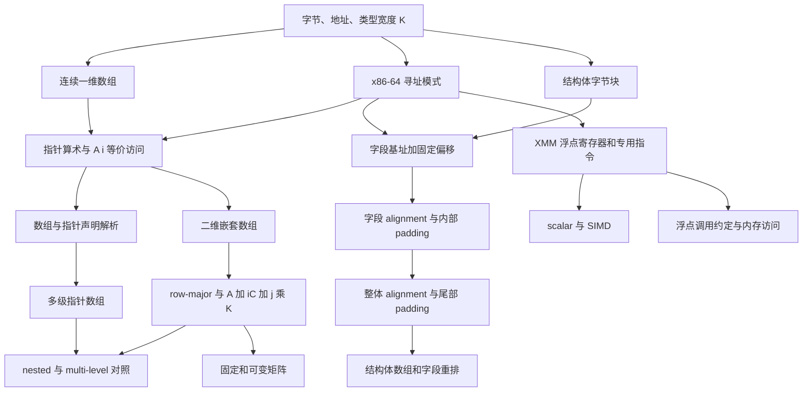


- **课程**：CMU 15-213/15-513 Introduction to Computer Systems, Fall 2015
- **讲次**：Lecture 08, Sep. 24, 2015
- **课堂时间轴**：00:00:00–01:19:33
- **主要材料**：`transcript.jsonl` / `transcript.txt`；`08-machine-data.pptx`（46 页）
- **内容范围**：arrays、pointer arithmetic、nested arrays、multi-level arrays、structs、alignment，以及课程最后的 floating-point code 概览

## 学习目标

完成本讲后，应能仅依据 C 声明、类型宽度和 x86-64 寻址形式完成以下任务：

1. 解释数组和结构体在机器级都只是内存字节块，高级类型语义由编译器转换为分配、偏移和读写 [00:00:59–00:03:16，课件 p.2–p.3]。
2. 从 `T A[L]` 推导数组总大小、`A+i` 的地址和 `A[i] == *(A+i)`，并区分数组名与可修改指针变量 [00:03:32–00:10:21，课件 p.3–p.4]。
3. 读懂 `base + index*scale + displacement` 如何实现一维数组读取、原地更新和结构体字段访问 [00:14:25–00:20:18，课件 p.5–p.7；00:59:45–01:04:19，课件 p.21–p.23]。
4. 从括号和 `[]`/`*` 优先级准确解析“数组、指针、指向数组的指针、指针数组”，并分开判断编译性、静态大小与运行时坏引用风险 [00:21:34–00:39:39，更新版课件 p.40–p.43]。
5. 从 `T A[R][C]` 推导 row-major 布局、行首地址 $A+iCK$ 与元素地址 $A+(iC+j)K$ [00:39:53–00:47:37，课件 p.8–p.13]。
6. 区分 contiguous nested array 与 multi-level pointer array，写出一次读取和两次读取的机器级表达式 [00:47:37–00:54:41，课件 p.14–p.16]。
7. 对比固定维度和运行时维度矩阵，说明为什么前者可用移位、后者需要运行时乘法 [00:54:41–00:58:27，课件 p.17–p.19]。
8. 计算结构体字段偏移、内部 padding、尾部 padding、整体对齐和结构体数组步长，并能通过字段重排减少浪费 [00:58:55–01:12:38，课件 p.21–p.31]。
9. 识别 XMM 寄存器、scalar/SIMD 操作、浮点参数与返回值位置，并逐条解释 `dincr` 的数据流 [01:12:41–01:19:33，课件 p.32–p.38]。

## 先修知识

本讲直接依赖老师此前已使用、并在本讲继续调用的知识：

- C 的基础声明、`sizeof`、数组下标、`&`、`*`、`++`、`typedef`、宏和 `struct` 字段访问。
- 指针是地址；区分“指针对象本身已分配”与“指针所指对象已分配/地址有效”。
- 字节、十六进制/二进制地址、2 的幂、左移与乘法的对应关系。
- x86-64 通用寄存器及本课参数约定，例如 `%rdi`、`%rsi`、`%rdx`、`%rcx`、`%rax/%eax`。
- `mov`、`add`、`sal`、`imul`、`lea`、`test`、条件跳转和 `base,index,scale,displacement` 内存操作数。
- 编译期信息与运行期行为的区别：编译器可知道类型和对象大小，但 C 运行时不自动做数组边界检查。

## 教学主线

1. **标量到聚合数据** [00:00:00–00:03:32，课件 p.1–p.2]  
   从此前的整数、长整数和指针，转向数组与结构体；先建立“机器只看见字节，编译器负责类型布局”的总模型。

2. **一维数组：分配、地址与指针算术** [00:03:32–00:14:25，课件 p.3–p.4]  
   连续分配推出 $L\operatorname{sizeof}(T)$；类型宽度决定指针增量；C 接受负索引/越界地址计算但不保证访问安全。

3. **数组访问机器代码** [00:14:25–00:21:34，课件 p.5–p.7]  
   `zip_dig` 把 5 个 `int` 组成 20 字节对象；`(%rdi,%rsi,4)` 直接完成缩放索引；内存目的 `addl` 完成读—加—写。

4. **数组与指针课堂测验** [00:21:34–00:39:39，更新版课件 p.40–p.43]  
   先比较 `int A1[3]` 与 `int *A2`，再解析 `int (*A3)[3]` 和 `int *A4[3]`，用 Cmp/Bad/Size 三列拆开语法、类型与运行时有效性。

5. **二维嵌套数组** [00:39:39–00:47:37，课件 p.8–p.13]  
   从“外层数组的元素是一整行”推出 row-major、行宽、行首和行内元素地址；`pgh[4][5]` 作为完整例子。

6. **多级数组对照** [00:47:37–00:54:41，课件 p.14–p.16]  
   `univ` 连续保存的是指针，不是行数据；访问先读行指针再读元素。相同 C 双下标可对应完全不同的机器内存操作。

7. **固定与可变矩阵** [00:54:41–00:58:55，课件 p.17–p.19]  
   固定 $16\times16$ `int` 矩阵行宽为 64，可用左移 6；运行时 $n$ 需要先用 `imulq` 算 $ni$。

8. **结构体表示与字段访问** [00:58:55–01:05:07，课件 p.20–p.23]  
   字段遵循声明顺序；`get_ap` 用偏移 0 加缩放索引；链表循环按偏移 16 读 `i`、按 $4i$ 写 `a[i]`、按偏移 24 读 `next`。

9. **alignment 与 padding** [01:05:07–01:12:38，课件 p.24–p.31]  
   先讲单字段 $K$ 字节对齐，再讲结构体最大对齐、内部空洞、尾部空洞、结构体数组和字段重排。

10. **浮点机器代码概览** [01:12:41–01:19:33，课件 p.32–p.39]  
    从 x87 历史转到 SSE/AVX；认识 16 个 16 字节 XMM 寄存器、scalar/SIMD、浮点调用约定和内存搬移，最后指出比较与常量处理的复杂性。

## 概念依赖



图中的地址关系用本讲公式具体化：

- 一维：$A+iK$；
- 二维：$A+(iC+j)K$；
- 多级：$\operatorname{Mem}[\operatorname{Mem}[univ+8i]+4j]$；
- 结构体字段：$base+\operatorname{Offset}(field)$；
- 结构体数组字段：$base+idx\times\operatorname{sizeof}(S)+\operatorname{Offset}(field)$。

## 关键推导与例子

### 1. 一维数组与缩放指针

对 `T A[L]`，令 $K=\operatorname{sizeof}(T)$ [00:03:32–00:09:54，课件 p.3–p.4]：

$$
\operatorname{sizeof}(A)=LK,
\qquad
\operatorname{Addr}(A[i])=A+iK,
\qquad
A[i]=*(A+i)
$$

`int val[5]` 中 $K=4$：`val+1=x+4`，`&val[2]=x+8`。数组名可提供首地址，但不能执行 `val++`。

### 2. 一维机器访问与原地更新

```asm
movl (%rdi,%rsi,4), %eax  # z[digit]
addl $1, (%rdi,%rax,4)    # z[i]++
```

第一条计算 `%rdi+4*%rsi` 后读取；第二条对 `%rdi+4*%rax` 执行读—加—写 [00:16:24–00:20:18，课件 p.6–p.7]。

### 3. `pgh` 的 row-major 地址

`int pgh[4][5]` 的每行 20 字节、整体 80 字节 [00:44:00–00:47:37，课件 p.9–p.13]：

$$
\operatorname{Addr}(pgh[index][dig])
=pgh+20index+4dig
=pgh+4(5index+dig)
$$

这里只有最后一次数据内存读取。

### 4. `univ` 的两级间接访问

`int *univ[3]` 的外层元素是 8 字节指针 [00:47:37–00:54:41，课件 p.14–p.16]：

$$
row=\operatorname{Mem}_8[univ+8index]
$$

$$
result=\operatorname{Mem}_4[row+4digit]
$$

故完整表达式是：

$$
\operatorname{Mem}_4[\operatorname{Mem}_8[univ+8index]+4digit]
$$

### 5. 固定与可变矩阵

固定 `int a[16][16]` [00:56:41–00:57:36，课件 p.18]：

$$
a[i][j]\to a+64i+4j
$$

`64i=i\ll6`，因此可用 `salq $6`。运行时 `int a[n][n]` [00:57:36–00:58:27，课件 p.19]：

$$
a[i][j]\to a+4ni+4j
$$

其中 $ni$ 需要运行时 `imulq`。

### 6. `struct rec` 的三种字段访问

对 p.23 的 `a[4]`、`int i`、`next`：

$$
i=\operatorname{Mem}_4[r+16]
$$

$$
\operatorname{Mem}_4[r+4i]=val
$$

$$
r=\operatorname{Mem}_8[r+24]
$$

若误用 `i=4`，$r+4i=r+16$，恰好写坏字段 `i` [01:01:50–01:05:07]。

### 7. `S1` 的内部与整体对齐

`S1 { char c; int i[2]; double v; }` [01:05:18–01:09:45，课件 p.24–p.27]：

- `c`：偏移 0；
- padding：偏移 1–3；
- `i[0]`：偏移 4；
- `i[1]`：偏移 8；
- padding：偏移 12–15；
- `v`：偏移 16–23；
- 总大小：24，最大对齐 $K=8$。

### 8. 结构体数组字段

`S3 { short i; float v; short j; }` 含 padding 后大小为 12，`j` 位于偏移 8 [01:10:21–01:10:57，课件 p.30]：

$$
\operatorname{Addr}(a[idx].j)=a+12idx+8
$$

### 9. 字段重排

`S4 { char c; int i; char d; }` 为 12 字节；`S5 { int i; char c; char d; }` 为 8 字节 [01:11:02–01:12:00，课件 p.31]。老师给出的策略是先放对齐要求大的字段，再依次放较小字段；编译器不会自动重排。

### 10. XMM 与 `dincr`

浮点参数进入 `%xmm0`、`%xmm1...`，返回值在 `%xmm0` [01:17:03–01:17:44，课件 p.36]。`dincr` [01:18:20–01:18:57，课件 p.37]：

```asm
movapd %xmm0, %xmm1   # preserve v
movsd  (%rdi), %xmm0  # x = *p; x is also return value
addsd  %xmm0, %xmm1   # x + v
movsd  %xmm1, (%rdi)  # *p = x + v
```

## 易错点

1. 把指针步长当作字节 1；`T *p` 的 `p+1` 增加的是 `sizeof(T)` 字节。
2. 认为负索引或越界下标不能编译；C 会计算地址但不做边界检查，读写结果不受保证 [00:10:23–00:14:07]。
3. 因数组名能参与指针算术，就认为可以执行 `A++`；数组起始位置由声明固定。
4. 混淆“表达式能编译”“`sizeof` 可确定”“运行时指针有效”这三件事。
5. 把 `int (*A3)[3]` 读成指针数组，或把 `int *A4[3]` 读成数组指针；必须从名字向外并尊重 `[]` 高于 `*` 的绑定。
6. 把 `A[i]` 当成二维数组的单个底层元素；它仍是一整行数组。
7. 把二维地址写成 $A+(i+j)K$；正确线性索引是 $iC+j$。
8. 看到 `pgh[i][j]` 与 `univ[i][j]` 的 C 写法相同，就假定机器访问次数相同。
9. 固定 16 列矩阵只按 $16i$ 字节跳行；还要乘 `sizeof(int)=4`，行宽是 64 字节。
10. 把 `leaq` 当成内存读取；它只做地址/算术计算。
11. 忽略 `movslq`：4 字节 `int i` 用作 64 位地址索引前需要扩展。
12. 只为结构体字段做内部对齐，不把对象总大小补成最大 $K$ 的倍数；结构体数组的后继对象会失去对齐。
13. 期待编译器自动调整字段顺序；字段保持源代码声明顺序。
14. 因 x86 允许未对齐访问就认为它没有代价；老师指出可能变慢。
15. 把所有浮点参数放进普通整数寄存器；本讲的浮点参数使用 XMM 序列。
16. 在 `dincr` 中覆盖 `%xmm0` 前不保存 `v`；这样无法同时保留旧值作返回并计算新值。

## 掌握标准

达到本讲掌握要求，应能在不查看答案时完成以下检查：

1. 给定任意一维 `T A[L]` 和首地址，正确算出总大小、任意元素地址，并说明是否发生内存读取。
2. 对 `int A[3]`、`int *A`、`int (*A)[3]`、`int *A[3]`，逐层写出 `A`、`*A`、`**A` 的类型/大小，并区分潜在坏引用。
3. 从 `T A[R][C]` 独立推导 $RCK$、$A+iCK$、$A+(iC+j)K$，而不是只背最终式。
4. 对同一个 `x[i][j]` 形式，根据声明判断是 nested 还是 multi-level，并写出准确的内存读取层数。
5. 把固定 $16\times16$ 与变量 $n\times n$ 的 C 访问翻译为地址式，并解释移位与乘法的来源。
6. 给定结构体字段声明与各类型宽度，画出字段偏移、内部 padding、尾部 padding、整体大小和数组步长。
7. 从 `movslq 16(%rdi)`、`movl %esi,(%rdi,%rax,4)`、`movq 24(%rdi)` 还原 `struct rec` 的三次字段访问。
8. 对 p.30 的 `S3` 独立得出 $a+12idx+8$，并说明 12 和 8 各自来自哪里。
9. 解释 `addss` 与 packed SIMD 加法的区别，以及 XMM 参数/返回值的课堂约定。
10. 逐条追踪 `dincr`，在每条指令后写出 `%xmm0`、`%xmm1` 和 `*p` 的值，并说明为何返回旧值。

## 复习顺序

1. **先固定唯一总模型**：机器只看字节和地址；编译器把 C 类型转换为大小、缩放和偏移 [课件 p.2、p.21、p.39]。
2. **重做一维地址表**：从 `int val[5]` 的 `val`、`val+1`、`&val[2]`、`*(val+1)` 开始 [课件 p.3–p.4]。
3. **重做声明测验**：先 A1/A2，再 A3/A4；每次分三列写 Cmp、Bad、Size [更新版课件 p.40–p.43]。
4. **只用图和公式重建二维布局**：先求行宽，再求行首，最后求行内列地址 [课件 p.8–p.13]。
5. **并排写 `pgh` 与 `univ`**：标出内存块、指针、缩放 20/8/4 和读取次数 [课件 p.14–p.16]。
6. **练固定/变量矩阵**：把 $C=16$ 与 $C=n$ 分别代入统一公式，观察 `salq` 与 `imulq` [课件 p.17–p.19]。
7. **画三个结构体**：`rec` 用于字段代码，`S1` 用于内部/整体对齐，`S3` 用于结构体数组字段地址 [课件 p.21–p.30]。
8. **最后复习浮点概览**：XMM 宽度与视图 → scalar/SIMD → 参数/返回 → `dincr` → 未展开的比较/常量 [课件 p.33–p.38]。

## 源材料与核对说明

- 课堂真实主题顺序并不等于当前 PPT 文件的物理页序：授课先使用 p.1–p.7，然后进行当时尚未放入 slides 的数组/指针测验；当前更新版文件把对应题目补在 p.40–p.43。之后老师回到 p.8 继续 nested arrays，并按 p.8–p.39 完成课程。
- 当前 PPT 的 p.44–p.46 是更复杂的三维指针/数组测验；transcript 中老师没有实际展开这些题，因此笔记不把其答案冒充课堂讲授内容。
- 老师在 [00:48:56–00:49:51] 明确发现课堂版本缺少 nested-array 汇编页；当前 PPT p.11、p.13 已含代码。逐段笔记引用更新版精确页码，同时保留“课堂现场缺页”的说明。
- transcript 中所有会改变技术含义的 ASR 疑点均在相应逐段笔记的“待核对项”中用 `[需回听 HH:MM:SS]` 标出；可由课件确定的标识符和指令同时给出课件页码。
- 以下逐段笔记按 001–008、00:00:00–01:19:33 连续排列，并将各文件原文不删减汇入。

---

# 全部逐段笔记
---

<div id="section-01" class="course-note-section-anchor" aria-hidden="true">&nbsp;</div>

# 第 1 段：从标量数据到数组的机器表示

- **时间范围**：00:00:00–00:09:54
- **对应课件**：08-machine-data.pptx p.1–p.4

## 本段在整讲中的作用

本段是整讲的入口。老师先把本讲放回 Machine-Level Programming 系列：这是第 4 讲，机器级编程虽然包含大量 x86-64 的底层细节，但目标不只是记住某台机器的写法，还要掌握可迁移到其他体系结构的一般原则 [00:00:00–00:00:59，课件 p.1]。随后课程从此前只处理 `int`、`long` 和指针等**标量数据**，转向把多个数据元素组合起来的**聚合数据**：同类型元素组成数组，不同类型字段组成结构体，而且两者可以递归嵌套 [00:00:59–00:02:06，课件 p.2]。

这一段实际完成两层铺垫：先建立“机器只看见连续字节，数组/结构体语义由编译器落实”的总模型，再用一维数组推导出后续所有 nested arrays、multi-level arrays、structs 和 alignment 都会反复使用的地址计算规则 [00:02:06–00:09:54]。

## 教学展开

1. **说明本讲位置与学习视角** [00:00:00–00:00:59，课件 p.1]
   - 本讲是机器级编程系列的第 4 部分，系列预计共 5 部分。
   - x86-64 的内容会显得琐碎，但老师强调第一次学习汇编语言最困难；以后迁移到其他机器会容易得多，因此应同时寻找一般原则。

2. **从标量数据过渡到聚合数据** [00:00:59–00:02:06，课件 p.2]
   - 先前程序主要操作整数、长整数和指针，老师把它们称为 scalar data。
   - 数组把多个**相同类型**的元素放在一起，例如 int 数组、数组的数组、指针数组。
   - 结构体把若干**可以不同类型**的值放在一起，每个字段由名字访问。
   - 数组和结构体可任意嵌套，例如数组的结构体、带数组字段的结构体。

3. **建立机器级统一模型** [00:02:06–00:03:16，课件 p.2]
   - 在机器代码层面没有高级语言意义上的“数组”或“结构体”；二者都只是分配的一段字节。
   - 编译器负责分配足够的存储，并把源代码中的元素/字段访问翻译为正确的地址计算和读写指令。
   - x86 的寻址形式之所以看起来复杂，正因为数组和结构体访问极其常见，硬件为这类计算提供了直接支持。
   - 老师预告本讲还会简要展示浮点机器代码 [00:03:16–00:03:27，课件 p.2]。

4. **定义数组的连续分配** [00:03:32–00:04:33，课件 p.3]
   - 长度为 $L$、元素类型为 $T$ 的数组占用一段连续内存，大小是 $L\times\operatorname{sizeof}(T)$ 字节。
   - 课堂口述例子：12 个 `char` 占 12 字节；5 个 `int` 占 20 字节；`double`、`long` 和指针在本课所用 x86-64 环境中各占 8 字节。
   - 课件还列出 `double a[3]` 和 `char *p[3]`，按 p.3 给出的类型大小，两者都占 24 字节。

5. **从连续布局得到元素地址** [00:04:33–00:04:57，课件 p.3]
   - 令数组首地址为 $x$。每个元素的位置都可由 $x$ 加一个按元素大小缩放的偏移得到。
   - 老师指出，编译器生成的正是这种地址计算。

6. **解释数组名与指针的联系** [00:04:57–00:06:25，课件 p.4]
   - 声明 `T A[L];` 同时做两件事：分配整个数组的空间；允许标识符 `A` 在许多表达式中作为指向元素 0 的 `T *` 使用。
   - 在课件例子 `int val[5]` 中，若首地址为 $x$，则 `val` 的类型为 `int *`、值为 $x$；`val[4]` 是最后一个合法元素。
   - 老师把这种数组名和指针可互换使用的能力视为 C 的基础特征。

7. **逐步解释指针算术的缩放** [00:06:25–00:08:41，课件 p.4]
   - 对 `char *p` 执行 `p++`，地址数值增加 1，因为底层元素宽度为 1 字节。
   - 对 `int *ip` 执行 `ip++`，C 源码看似是 `ip += 1`，实际地址数值增加 4，从而指向下一个 `int`。
   - 同理，`val + 1` 的值不是 $x+1$，而是 $x+4$。

8. **指出数组名与可变指针的差别，并收束到等价访问** [00:08:41–00:09:54，课件 p.4]
   - `val++` 非法，因为数组名对应的起始位置由声明固定，不能像指针变量那样改写。
   - `&val[2]` 是第二号索引元素（即第 3 个元素）的地址，值为 $x+8$。
   - 老师最后在板书上强调数组下标与“指针加偏移后解引用”是同一件事；ASR 没有保留板书公式的完整左侧 [需回听 00:09:39]。结合 p.4 可确认课堂正在使用 `val[i]` 与 `*(val+i)` 的等价关系。

## 概念、符号与推导

### 1. 聚合数据的机器级本质

- 数组：相同类型元素的聚合。
- 结构体：可含不同类型字段的聚合。
- 机器级共同点：都落实为一段内存字节；机器指令本身不保存 C 的数组或结构体类型概念 [00:01:19–00:02:55，课件 p.2]。

### 2. 一维数组的大小

对声明：

```c
T A[L];
```

设一个 `T` 占 $K=\operatorname{sizeof}(T)$ 字节，则 [00:03:32–00:04:18，课件 p.3]：

$$
\operatorname{sizeof}(A)=L\times K
$$

例：`int val[5]` 中 $L=5$、$K=4$，所以：

$$
5\times4=20\text{ bytes}
$$

### 3. 元素地址与解引用

若 $A$ 的起始地址为 $x$，索引为 $i$，元素宽度为 $K$，则由连续布局得到 [00:04:33–00:05:37，课件 p.4]：

$$
\operatorname{Addr}(A[i])=x+iK
$$

在 C 表达式中：

$$
A+i=x+iK
$$

再解引用即可取得元素：

$$
A[i]=*(A+i)
$$

对 `int val[5]`，$K=4$：

- `val + 1`：$x+1\times4=x+4$；
- `&val[2]`：$x+2\times4=x+8$；
- `*(val+1)`：读取地址 $x+4$ 处的 `int`，课件示例值为 5 [课件 p.4]。

### 4. 数组名不是普通指针变量

`val` 在表达式里可提供首元素地址，但声明也固定了这段数组存储的位置，所以可以计算 `val+i`，却不能用 `val++` 改写 `val` 自身 [00:08:26–00:08:55]。老师在这里明确区分“可按指针使用”与“就是一个可修改的指针变量”。

## 例子与课堂提示

- **12 个 `char` 与 5 个 `int`** [00:03:37–00:04:14，课件 p.3]：服务于“数组大小 = 元素数 × 单元素大小”。
- **`char *p` 和 `int *ip` 的 `++`** [00:06:47–00:08:18]：服务于说明 C 写的是元素步长，机器地址变化的是字节数；类型决定缩放因子。
- **`int val[5]` 的地址表** [00:05:54–00:09:12，课件 p.4]：把数组访问、地址取得、指针加法和解引用统一到首地址 $x$ 上。
- **学习提示** [00:00:39–00:00:59]：不要只记 x86-64 指令细节，要看清“连续布局 + 缩放索引 + 内存访问”这一可迁移原则。

## 易错点

1. 把 `int *ip` 的 `ip++` 理解成地址只增加 1；正确的是增加 `sizeof(int)=4` 字节 [00:07:37–00:08:18]。
2. 因为数组名可当作指针使用，就误以为 `val++` 合法；数组名的起始地址不可改写 [00:08:41–00:08:55]。
3. 把 `val[2]` 说成“第 2 个元素”而忽略 C 从 0 开始编号；它是索引 2，即第 3 个元素，其地址是 $x+8$ [00:08:55–00:09:12]。
4. 以为机器代码保留“数组”这一高级类型；老师的模型是机器只操作字节和地址，类型布局由编译器落实 [00:02:17–00:02:55]。
5. 看到 `A+i` 时直接做字节加法 $x+i$；必须先用元素宽度 $K$ 缩放为 $x+iK$ [课件 p.4]。

## 本段掌握检查

1. **问：`double a[3]` 在本讲的 x86-64 模型中占多少字节？为什么？**  
   **答：**24 字节，因为每个 `double` 为 8 字节，$3\times8=24$ [00:04:18–00:04:28，课件 p.3]。

2. **问：若 `int val[5]` 首地址为 $x$，`val+1` 和 `&val[2]` 分别是多少？**  
   **答：**分别是 $x+4$ 和 $x+8$，因为 `int` 的步长是 4 字节 [00:08:26–00:09:12，课件 p.4]。

3. **问：为什么 `ip += 1` 的机器地址变化可能是 4？**  
   **答：**`ip` 是 `int *`，C 的指针算术按元素而不是按字节计数，编译器把 1 缩放为 `sizeof(int)=4` [00:07:37–00:08:18]。

4. **问：数组名与指针变量最关键的差别是什么？**  
   **答：**数组名在表达式中可作为首元素地址参与指针算术，但不能被递增或重新赋值；普通指针变量的值可以改变 [00:08:41–00:08:55]。

5. **问：机器级程序如何“知道”要访问数组的哪个元素？**  
   **答：**机器本身没有数组概念；编译器根据类型宽度生成“首地址 + 索引 × 元素大小”的地址计算，再从该地址读写 [00:02:17–00:02:55，00:04:33–00:04:55]。

## 待核对项

- [需回听 00:03:53] ASR 把 `char` 识别成 “care/cares”；结合上下文和课件 p.3，应为 `char`。
- [需回听 00:09:12] 至 [需回听 00:09:52] 板书内容未被 ASR 完整捕获；可由课件 p.4 和口述确认主题是 `A[i]` 与 `*(A+i)` 的等价，但若需逐字还原板书，应回看视频。

---

<div id="section-02" class="course-note-section-anchor" aria-hidden="true">&nbsp;</div>

# 第 2 段：指针算术边界与一维数组机器代码

- **时间范围**：00:09:54–00:19:54
- **对应课件**：08-machine-data.pptx p.4–p.7

## 本段在整讲中的作用

本段承接第 1 段的核心等价式 `A[i] == *(A+i)`，先通过负索引、越界访问和指针加法问答，把“C 负责按类型缩放，但不负责边界检查”讲透；再从 C 语义切换到真实 x86-64 代码，用 `zip_dig`、`get_digit` 和 `zincr` 展示缩放寻址如何直接实现数组读取与原地更新 [00:09:54–00:19:54，课件 p.4–p.7]。

这一步把上一段的地址公式变成机器指令，也为后面比较数组与指针、推广到二维数组做准备。

## 教学展开

1. **补完下标与指针表达式的等价性** [00:09:54–00:10:21，课件 p.4]
   - 对 `int *ip`，`ip + 2` 在地址层面实际增加 $2\times4=8$ 字节。
   - 解引用 `*(ip+2)` 就是在一个以 `ip` 为首地址的“想象数组”中读取索引 2 的元素。
   - 老师再次强调，这种指针算术是 C 的基础特征。

2. **回答负下标是否允许** [00:10:23–00:12:24，课件 p.4]
   - C 编译器会接受负数组索引；语言不会自动阻止过大或过小的下标。
   - 若 `ip` 为 `int *`，一般的 `ip + x` 在机器地址上计算为 $ip+4x$。
   - 当 $x<0$ 时，缩放规则不变，结果地址只是落在 `ip` 之前。表达式本身可以是合法 C，但访问是否有效取决于该地址是否属于可合法访问的对象范围；课堂在此重点是“没有运行时边界检查”。

3. **讨论加法两边的类型限制** [00:12:26–00:13:25]
   - 学生询问能否写 `2 + ip`。老师先表示怀疑，随即根据编译器知道两个操作数类型而修正为“应该可以”；即便编译器接受，老师也明确认为这种写法很差 [需回听 00:12:26]。
   - 指针加法中只能有一个指针和一个整数，整数一侧会按指针所指类型缩放。
   - 不能把两个指针相加；老师只简短提到两个指针可以求差，并让学生查 K&R，没有在本段继续展开。

4. **说明越界读写的后果** [00:13:33–00:14:25，课件 p.4]
   - 越界地址可能无效并触发 segmentation fault，也可能恰好可读，从而取得那里碰巧存在的值。
   - 更危险的是越界写：它可能改坏内存中已有的数据。
   - 因此 `val+i` 的计算仍是首地址加 $4i$，但“能算出地址”并不等于“该访问合法”。

5. **用宏和 `typedef` 建立课堂数组类型** [00:14:25–00:16:24，课件 p.5]
   - 老师从 C 语义转入机器代码，先定义 `ZLEN`，避免在程序里散布没有说明的 magic number。
   - `typedef int zip_dig[ZLEN];` 把 `zip_dig` 定义为“5 个 `int` 构成的数组类型”，于是 `zip_dig cmu` 等价于 `int cmu[5]`。
   - `cmu`、`mit`、`ucb` 三个示例数组各占 $5\times4=20$ 字节。
   - 图中把三个数组画成相邻的 20 字节块，只是为了演示；实际地址以及三个独立数组是否彼此相邻都不能依赖，但每个数组内部必定连续。

6. **把 `z[digit]` 翻译成一条内存读取** [00:16:24–00:18:30，课件 p.6]
   - 函数 `get_digit(zip_dig z, int digit)` 中，数组参数以起始地址传入 `%rdi`，索引传入 `%rsi`，返回的 `int` 放入 `%eax`。
   - 地址模式 `(%rdi,%rsi,4)` 计算 `%rdi + 4*%rsi`，随后 `movl` 从该地址读 4 字节到 `%eax`。
   - 课堂展示的幻灯片一度写错基址/索引组合，学生指出后老师明确更正为 `%rdi + 4*%rsi` [00:18:01–00:18:27]；当前 PPT p.6 已是更正后的版本。

7. **从单次读取转到数组循环更新** [00:18:42–00:19:54，课件 p.7]
   - `zincr` 遍历 5 个元素并执行 `z[i]++`。
   - 汇编先把 `%rax` 作为 `i` 初始化为 0，并采用 jump-to-middle 形式先跳到循环测试。
   - `addl $1, (%rdi,%rax,4)` 是循环的核心：按 `%rdi+4i` 定位元素，以内存为目的操作数执行加 1。
   - 本段在老师刚要解释内存目的操作数时结束，读—加—写的完整语义在下一段开头补完。

## 概念、符号与推导

### 1. 一般指针加法

设 `ip` 类型为 `int *`，本讲环境中 `sizeof(int)=4`。对整数 $x$ [00:11:08–00:12:17]：

$$
ip+x\quad\Longrightarrow\quad \operatorname{Addr}(ip)+4x
$$

- $x=2$：地址增加 $8$ 字节；
- $x=-1$：地址减少 $4$ 字节；
- 解引用后，`*(ip+x)` 才会从计算出的地址读取 `int`。

缩放由编译器根据 `ip` 的类型加入，程序员在 C 表达式中不写字节缩放因子 [00:11:47–00:12:08]。

### 2. 合法表达式与合法内存访问不是同一层问题

老师的演示可分成两步：

1. C 语法和类型规则允许计算 `ip+x`，包括某些负 $x$；
2. 真正解引用时，C 不替程序检查这个地址是否仍在合法范围内 [00:10:27–00:10:55，00:13:33–00:14:07]。

因此越界后可能读取垃圾值、触发段错误，或在写入时破坏其他数据。课件 p.4 用 `val[5] -> ??` 明确表示对 5 元素数组而言该结果不受保证。

### 3. `zip_dig` 的存储大小

```c
#define ZLEN 5
typedef int zip_dig[ZLEN];
```

由于每个 `int` 为 4 字节 [00:14:37–00:16:24，课件 p.5]：

$$
\operatorname{sizeof}(zip\_dig)=5\times4=20\text{ bytes}
$$

这个结论保证单个数组内部是连续 20 字节，不保证 `cmu`、`mit`、`ucb` 三块彼此相邻。

### 4. `get_digit` 的地址计算

源代码和汇编 [00:16:24–00:18:01，课件 p.6]：

```c
int get_digit(zip_dig z, int digit) {
    return z[digit];
}
```

```asm
# %rdi = z, %rsi = digit
movl (%rdi,%rsi,4), %eax
```

逐步展开：

$$
\begin{aligned}
\text{base} &= \%rdi\\
\text{scaled index} &= 4\times\%rsi\\
\text{element address} &= \%rdi+4\times\%rsi\\
\%eax &= \operatorname{Mem}_4[\%rdi+4\times\%rsi]
\end{aligned}
$$

`movl` 的 4 字节宽度与返回类型 `int` 对应，所以结果使用 `%eax`。

### 5. `zincr` 的核心访问

课件 p.7 的核心指令：

```asm
addl $1, (%rdi,%rax,4)  # z[i]++
```

地址为：

$$
\%rdi+4\times\%rax=z+4i
$$

该指令把“按索引定位”和“对内存中的 4 字节整数加 1”合在一条汇编指令中；其内部读—加—写过程由下一段继续说明。

## 例子与课堂提示

- **负索引问答** [00:10:23–00:12:24]：服务于区分“指针算术规则”与“数组边界安全”。
- **`2 + ip` 课堂修正** [00:12:26–00:13:25]：老师现场修正自己的判断，结论是类型足以让编译器缩放整数，但这种反常写法不值得采用。
- **越界写比越界读更危险** [00:13:33–00:14:07]：读可能得到碰巧存在的值，写则可能直接损坏其他内存数据。
- **宏和 `typedef`** [00:14:37–00:15:43，课件 p.5]：服务于让复杂声明更可读，并避免 magic numbers。
- **三所学校邮编数组** [00:15:43–00:16:24，课件 p.5]：服务于展示数组内部连续，但不同数组之间的地址关系不可假定。
- **x86 缩放寻址** [00:16:40–00:17:59，课件 p.6]：老师指出复杂地址模式正是为常见数组访问设计的。

## 易错点

1. 认为编译通过就说明负索引或越界访问安全；C 只照常计算地址，不做边界检查 [00:10:27–00:10:55]。
2. 把 `ip+x` 展开为地址 `ip+x`；`int *` 必须展开为 `ip+4x` [00:11:08–00:12:08]。
3. 看到示意图中三个数组相邻，就在程序中依赖它们的相对地址；老师明确说这种相邻只是人为安排的例子 [00:15:52–00:16:16，课件 p.5]。
4. 把 `%rdi` 和 `%rsi` 的角色调换；正确的是 `%rdi` 为数组基址，`%rsi` 为索引，地址为 `%rdi+4*%rsi` [00:16:40–00:18:27，课件 p.6]。
5. 误以为内存目的操作数只“算出地址”；`addl $1, (...)` 会修改该地址中的值，而不仅仅返回一个地址 [00:19:26–00:19:54，课件 p.7]。

## 本段掌握检查

1. **问：`*(ip+2)` 中若 `ip` 为 `int *`，机器地址增加多少？**  
   **答：**增加 8 字节，因为索引 2 按 4 字节 `int` 缩放，$2\times4=8$ [00:09:54–00:10:12]。

2. **问：为什么负下标能编译，却仍可能出错？**  
   **答：**负数仍按元素宽度参与地址计算，但 C 不检查结果是否位于合法对象内；解引用无效地址会产生未受保证的结果 [00:10:27–00:12:24]。

3. **问：`zip_dig cmu` 分配多少字节？它保证什么、不保证什么？**  
   **答：**20 字节；保证这 5 个 `int` 连续，不保证它与其他独立数组相邻，也不保证具体起始地址 [00:15:27–00:16:24，课件 p.5]。

4. **问：`movl (%rdi,%rsi,4), %eax` 如何实现 `z[digit]`？**  
   **答：**先算数组基址 `%rdi` 加索引 `%rsi` 的 4 倍，再从该地址读取 4 字节到 `%eax` [00:16:40–00:17:59，课件 p.6]。

5. **问：`zincr` 中哪条指令真正执行 `z[i]++`？**  
   **答：**`addl $1, (%rdi,%rax,4)`；`%rax` 是 `i`，缩放 4 后与基址组成元素地址 [00:19:26–00:19:54，课件 p.7]。

## 待核对项

- [需回听 00:12:26] 老师对 `2 + ip` 先否定后现场修正；笔记保留这一教学过程，不把最初一句当作最终结论。
- [需回听 00:15:25] ASR 多次把 `zip_dig` 识别成 “zipdage/zipdage”；课件 p.5 可确认标识符。
- [需回听 00:18:10] 老师说课堂所示 slide 有 typo，并更正为 `%rdi + 4*%rsi`；当前提供的 PPT p.6 已修正，无法仅凭现文件复原当时错误文字。
- 本段最后一句停在对内存目的操作数的解释中；完整的读—加—写语义见下一段 [00:19:54–00:20:08]。

---

<div id="section-03" class="course-note-section-anchor" aria-hidden="true">&nbsp;</div>

# 第 3 段：数组原地更新与“数组还是指针”课堂测验

- **时间范围**：00:19:54–00:29:54
- **对应课件**：08-machine-data.pptx p.7、p.40–p.43

## 本段在整讲中的作用

本段先补完上一段 `zincr` 的核心指令，说明一个以内存为目的操作数的 `addl` 如何完成读取、加法和写回。随后老师暂时离开纯地址计算，用一组 `sizeof`、解引用和坏指针判断题，逼迫学生精确区分“数组声明会分配元素空间”与“指针声明只分配指针本身” [00:19:54–00:29:54，课件 p.7、p.40–p.42]。

这组测验不是旁枝：它澄清了后面 nested array 与 multi-level array 虽然 C 下标写法相似、内存模型却完全不同的根源。

## 教学展开

1. **补完 `z[i]++` 的机器动作** [00:19:54–00:20:18，课件 p.7]
   - `addl $1, (%rdi,%rax,4)` 的目的操作数是内存位置。
   - 机器必须先读出原来的 `z[i]`，加 1，再把结果存回同一位置。
   - 因而一条指令直接落实 C 的 `++` 原地更新。

2. **解释 C 指针算术为何贴近汇编** [00:20:18–00:21:34]
   - 老师把 C 描述成长期写汇编的人试图保留汇编灵活性、同时获得高级语言形式的产物。
   - C 最初用于实现 UNIX；此前操作系统通常直接用汇编编写。
   - 指针算术以及 `++`、`+=` 等运算，与机器指令中的地址增量和读改写操作有紧密对应。

3. **提出数组与指针的三项判定任务** [00:21:34–00:23:17，课件 p.40]
   - 对每个声明/表达式判断：能否编译（Cmp）；是否可能发生坏指针引用（Bad）；`sizeof` 返回多少（Size）。
   - 第一轮声明由 PPTX p.40 原文确认：

```c
int A1[3];
int *A2;
```

4. **先给出控制两类声明的核心区别** [00:23:17–00:23:51，课件 p.40–p.41]
   - 声明数组会为全部元素分配空间，并允许数组名参与指针算术。
   - 声明指针只为地址值本身分配空间，不会自动为它所指的对象分配或初始化空间。

5. **逐项求 `A1` 与 `A2` 的结果** [00:23:51–00:24:53，课件 p.41]
   - `A1` 与 `A2` 作为表达式都能编译；仅仅出现 `A2` 还没有解引用，所以老师不把它记为运行时坏引用。
   - `sizeof(A2)=8`，因为它是 x86-64 指针。
   - `sizeof(A1)=3\times4=12`，因为声明真的分配了 3 个 `int`。

6. **再比较 `*A1` 与 `*A2`** [00:24:53–00:26:17，课件 p.41]
   - 二者都能编译，解引用后的类型都是 `int`，所以表中 Size 都为 4。
   - `*A1` 指向已分配数组的首元素，不构成坏指针风险。
   - `*A2` 可能出错，因为 `A2` 尚未初始化为有效对象地址；只分配了指针，没有分配它所指的 `int`。

7. **用内存图解释 12 与 8** [00:26:17–00:27:12，课件 p.41]
   - `A1` 是一块已经分配的 12 字节区域。
   - `A2` 是一个 8 字节指针槽位，但其目标对象未分配。
   - transcript 在 [00:26:30] 出现 “array of 4 ints”，与同一句后的 12 字节及 p.41 的 `int A1[3]` 冲突，应以 3 个 `int` 为准并回听确认。

8. **说明为何必须真正掌握这一区别** [00:27:12–00:28:06]
   - 老师称前两题只是 warm-up。
   - 如果数组与指针“哪里相同、哪里不同”仍令人困惑，后续 C 编程会持续出现问题；理解底层表示和编译结果能帮助消除这种困惑。
   - 老师口述说这些题当时不在 slides 中、以后会补；当前提供的 PPT 已包含 p.40–p.46，说明我们看到的是补入后的版本。

9. **开始 A1–A4 进阶声明测验** [00:28:06–00:29:54，课件 p.42]
   - PPTX p.42 的四个声明是：

```c
int A1[3];
int *A2[3];
int (*A3)[3];
int (*A4[3]);
```

   - 问题仍是对 `A_n`、`*A_n`、`**A_n` 判断 Cmp、Bad 和 Size。
   - 老师先处理熟悉的 `A1`：`A1` 与 `*A1` 可用，但 `**A1` 不能编译，因为 `*A1` 已经是 `int`，不能再对整数解引用 [00:29:01–00:29:31]。
   - 本段结束时老师刚准备分析其余声明，完整结果留到下一段。

## 概念、符号与推导

### 1. 内存目的操作数的读—改—写

课件 p.7 的：

```asm
addl $1, (%rdi,%rax,4)
```

在本例中可展开为 [00:19:54–00:20:18]：

$$
\begin{aligned}
addr &= \%rdi+4\times\%rax\\
old &= \operatorname{Mem}_4[addr]\\
new &= old+1\\
\operatorname{Mem}_4[addr] &= new
\end{aligned}
$$

它不是只算地址，也不是只把结果留在寄存器，而是修改数组元素本身。

### 2. 数组对象与指针对象的分配差异

```c
int A1[3];  // 分配 3 个 int
int *A2;    // 只分配 1 个指针
```

在本讲 x86-64 模型中 [00:23:17–00:27:12，课件 p.41]：

$$
\operatorname{sizeof}(A1)=3\times4=12
$$

$$
\operatorname{sizeof}(A2)=8
$$

解引用后的静态类型都可为 `int`，所以表中：

$$
\operatorname{sizeof}(*A1)=\operatorname{sizeof}(*A2)=4
$$

但类型相同不代表运行时有效性相同：`A1` 的元素存储随声明产生，`A2` 的目标没有随指针声明产生。

### 3. `sizeof`、编译性与运行时安全是三个不同问题

- **Cmp**：表达式在 C 类型规则下能否成立。
- **Bad**：若实际求值/解引用，是否可能使用未初始化或无效指针。
- **Size**：相应类型/对象的 `sizeof` 结果。

老师故意把三列并置，因为“能编译”“有确定类型大小”“运行时地址有效”不能互相推出 [00:22:07–00:23:17，课件 p.40]。

### 4. A1 的连续解引用类型链

对 `int A1[3]` [00:29:01–00:29:31，课件 p.42–p.43]：

$$
A1\;\xrightarrow{\text{数组名参与表达式}}\;int *
$$

$$
*A1\;\xrightarrow{\text{解引用}}\;int
$$

此时再写 `**A1` 就等于试图对 `int` 解引用，因此不编译。

## 例子与课堂提示

- **C 与汇编的历史联系** [00:20:18–00:21:34]：服务于解释为何 C 的指针算术、`++` 和 `+=` 与机器操作对应得如此直接。
- **A1/A2 表格** [00:21:59–00:27:12，课件 p.40–p.41]：服务于把“声明分配什么”与“表达式类型是什么”分开思考。
- **未初始化指针图** [00:26:21–00:27:08，课件 p.41]：已分配的是 8 字节指针本身，不是被指向的 `int`。
- **A1–A4 预览** [00:28:06–00:29:54，课件 p.42]：通过括号、`*` 和 `[]` 的不同绑定，为下一段“从标识符向外读声明”埋下问题。

## 易错点

1. 把 `addl $1, memory` 当成只执行加法而忽略读取和写回；其效果是完整的 read-modify-write [00:19:54–00:20:18]。
2. 认为未初始化的 `A2` 只要出现在表达式中就已经发生坏引用；老师区分“指针值存在”与“对该值解引用” [00:25:17–00:25:46]。
3. 看到 `*A1` 与 `*A2` 都是 `int`、大小都为 4，就误以为二者同样安全；`A2` 没有有效目标地址 [00:25:46–00:26:17]。
4. 把 `sizeof(A1)` 当成指针大小 8；数组对象保留完整数组大小，因此是 12 [00:24:26–00:24:49，课件 p.41]。
5. 对 `int A1[3]` 连续写 `**A1`；第一次解引用已经得到 `int`，第二次解引用在类型上非法 [00:29:01–00:29:31]。

## 本段掌握检查

1. **问：`addl $1, (%rdi,%rax,4)` 对内存依次做什么？**  
   **答：**按 `%rdi+4*%rax` 读出 4 字节整数，加 1，再写回同一地址 [00:19:54–00:20:18，课件 p.7]。

2. **问：为什么 `sizeof(A1)` 是 12，而 `sizeof(A2)` 是 8？**  
   **答：**`A1` 是 3 个 `int` 的已分配数组；`A2` 只是一个 x86-64 指针对象 [00:23:17–00:24:49，课件 p.41]。

3. **问：为什么单独使用 `A2` 不等于已经发生坏指针解引用？**  
   **答：**此时只是取得/使用指针值，还没有通过它读取目标对象；执行 `*A2` 才可能访问无效地址 [00:25:17–00:25:57]。

4. **问：`*A1` 和 `*A2` 的 `sizeof` 都是多少？安全性是否相同？**  
   **答：**都为 4，因为静态结果类型都是 `int`；安全性不同，`*A1` 指向已分配首元素，`*A2` 可能解引用未初始化指针 [00:25:52–00:26:17，课件 p.41]。

5. **问：为什么 `**A1` 不编译？**  
   **答：**`*A1` 已经是 `int`，不能再把整数当指针解引用 [00:29:01–00:29:31，课件 p.42–p.43]。

## 待核对项

- [需回听 00:21:00] ASR 将 Dennis Ritchie 的姓名识别为 “Dennis Richie”，且前半句缺词；不影响老师关于 C/UNIX 历史动机的主线。
- [需回听 00:26:30] transcript 说 “array of 4 ints”，但声明、`sizeof=12` 和 PPT p.41 都是 3 个 `int`，疑为口误或 ASR 错误。
- 老师在 [00:27:16] 说这些题“不在 slides、以后更新”；当前 PPT p.40–p.46 已包含题目与答案，说明课件文件是更新版。笔记按实际讲课顺序引用更新版页码。

---

<div id="section-04" class="course-note-section-anchor" aria-hidden="true">&nbsp;</div>

# 第 4 段：从内向外读 C 声明

- **时间范围**：00:29:54–00:39:53
- **对应课件**：08-machine-data.pptx p.42–p.43

## 本段在整讲中的作用

本段完成上一段留下的 A1–A4 测验。老师不要求死记答案，而是给出一套可执行的声明阅读法：从标识符出发，根据括号和运算符优先级向外读取。通过 `A3`（指向数组的指针）与 `A4`（指针数组）的对照，学生得到后面阅读 `T A[R][C]`、nested arrays 和 multi-level arrays 所需的类型推理工具 [00:29:54–00:39:53，课件 p.42–p.43]。

## 教学展开

1. **提出声明阅读规则** [00:29:54–00:30:17，课件 p.42]
   - 老师推荐 K&R 中关于如何阅读 C 指针与声明的内容。
   - 基本方法是从声明中的名字开始，由内向外工作；按括号和运算符的绑定逐层确定“它是什么、它指向/包含什么”。

2. **读取 `A3`：指向 3 元素数组的指针** [00:30:17–00:31:38，课件 p.42–p.43]

```c
int (*A3)[3];
```

   - 括号使 `*A3` 先结合，因此先读出“`A3` 是一个指针”。
   - 再向外读 `[3]`：该指针指向一个含 3 个元素的数组。
   - 最外层 `int` 给出数组元素类型，所以完整含义是“`A3` 是指向 `int[3]` 的指针”。

3. **由类型链推导 `A3` 的大小** [00:31:38–00:32:05，课件 p.43]
   - `A3` 本身是指针，Size 为 8。
   - `*A3` 是 `int[3]`，Size 为 $3\times4=12$。
   - `**A3` 是该数组的一个 `int` 元素，Size 为 4。
   - transcript 在此出现 “star star star A3”，但 p.43 表格只有 `A3`、`*A3`、`**A3` 三列，且“得到数组元素”的类型链也对应 `**A3` [需回听 00:31:50]。

4. **由分配状态推导 `A3` 的坏引用风险** [00:32:05–00:33:11，课件 p.43]
   - 声明只为 `A3` 这个指针分配空间，没有分配 `int[3]`，也没有把 `A3` 初始化为有效数组地址。
   - 所以单独使用 `A3` 不需要解引用，表中 Bad 为 N。
   - `*A3` 需要沿未初始化指针访问目标数组，Bad 为 Y；`**A3` 还要继续取得数组元素，同样 Bad 为 Y。

5. **读取 `A4`：3 元素指针数组** [00:33:11–00:34:50，课件 p.42–p.43]

```c
int (*A4[3]);
```

   - 老师查 C 运算符优先级：方括号 `[]` 位于更高优先级层，`*` 在下一层，因此 `A4[3]` 先结合。
   - 从名字向外先得到“`A4` 是 3 元素数组”，再得到“每个元素是指针”，最后得到“每个指针指向 `int`”。
   - 完整含义是“`A4` 是由 3 个 `int *` 组成的数组”。

6. **推导 `A4` 的大小** [00:34:50–00:35:38，课件 p.43]
   - `A4` 含 3 个 8 字节指针，所以 Size 为 $3\times8=24$。
   - `*A4` 取得数组首元素，其类型为 `int *`，Size 为 8。
   - `**A4` 沿首个指针取得 `int`，Size 为 4。

7. **推导 `A4` 的坏引用风险** [00:35:39–00:36:46，课件 p.43]
   - `A4` 的数组空间随声明分配，因此取得数组元素 `*A4` 本身不需要跟随一个未分配的外层指针，表中 Bad 为 N。
   - 但数组里的 3 个 `int *` 没有被初始化；继续执行 `**A4` 可能沿空/垃圾指针访问，Bad 为 Y。

8. **回答“编译器怎么知道数组大小”** [00:36:46–00:37:45]
   - 编译器在声明处知道 `A4` 是 3 个指针，并知道目标机器上每个指针为 8 字节，因此能在编译时算出 24 字节。
   - 这不意味着运行时机器会做边界检查。声明时类型和长度信息可知，与执行时不检查下标是两回事。

9. **说明空方括号的特殊语境** [00:37:57–00:38:32]
   - 老师说空方括号写法常见于函数参数，在该语境中等价于指针声明，并不分配数组元素空间。
   - 与之对照，显式写 `A1[3]` 的数组声明会实际分配 3 个元素的空间。

10. **确认 `A2` 与 `A4` 同义并结束插曲** [00:38:33–00:39:39，课件 p.42–p.43]
    - p.42 中 `int *A2[3]` 与 `int (*A4[3])` 的类型和表格结果相同；A4 外层括号没有改变 `[]` 先与名字结合的结果。
    - 老师称这是一段 aside，但强调它能检验学生是否真正理解底层表示；学会查看编译结果会比只凭表面语法更清楚。
    - [00:39:39] 老师开始从一维推广到二维数组，下一段继续。

## 概念、符号与推导

### 1. 声明阅读算法

本段使用的实际步骤 [00:30:00–00:31:38]：

1. 找到被声明的标识符；
2. 先处理括号内与标识符直接结合的部分；
3. 再按优先级向右、向左扩展，老师特别指出 `[]` 比一元 `*` 绑定得更紧；
4. 最后读出基础类型。

### 2. `A3` 类型链

```c
int (*A3)[3];
```

逐层类型为：

$$
A3: int\ (*)[3]
$$

$$
*A3: int[3]
$$

$$
**A3: int
$$

对应大小 [课件 p.43]：

$$
8\ \longrightarrow\ 12\ \longrightarrow\ 4
$$

对应 Bad：

$$
N\ \longrightarrow\ Y\ \longrightarrow\ Y
$$

原因不是类型本身，而是只分配了外层指针，未给它合法目标地址 [00:32:31–00:33:11]。

### 3. `A4` 类型链

```c
int (*A4[3]);
```

由于 `[]` 先结合 [00:33:41–00:34:29]：

$$
A4: int *[3]
$$

$$
*A4: int *
$$

$$
**A4: int
$$

对应大小 [课件 p.43]：

$$
3\times8=24\ \longrightarrow\ 8\ \longrightarrow\ 4
$$

对应 Bad：

$$
N\ \longrightarrow\ N\ \longrightarrow\ Y
$$

外层数组已分配，所以取得其中一个指针槽位安全；该槽位中的指针未初始化，所以继续解引用可能出错。

### 4. 括号是否改变绑定

p.42 同时给出：

```c
int *A2[3];
int (*A4[3]);
```

两者中 `A2[3]` / `A4[3]` 都先形成数组，再由 `*` 说明元素是指针。因此这里的括号没有把 `*A4` 提到 `[]` 之前；与 `int (*A3)[3]` 中围住 `*A3` 的括号作用不同 [00:38:33–00:38:55]。

## 例子与课堂提示

- **A3 内存图** [00:30:39–00:33:11，课件 p.43]：图中只有指针槽位已分配，数组目标未分配，服务于解释为什么 8/12/4 的静态大小与 N/Y/Y 的动态风险可以同时成立。
- **查优先级表** [00:33:25–00:33:59]：老师直言自己的书也常翻到该页，提示不应凭视觉猜复杂声明，而应按规则解析。
- **A4 三个指针槽位** [00:34:07–00:36:36，课件 p.43]：服务于区分“数组本身存在”与“数组中保存的指针目标存在”。
- **编译时信息与运行时检查** [00:36:46–00:37:45]：编译器能知道对象大小，不代表生成的机器代码会检查下标。

## 易错点

1. 把 `int (*A3)[3]` 读成“3 个指针的数组”；括号要求先读 `*A3`，它是一个指针，目标才是 3 元素数组。
2. 把 `int (*A4[3])` 与 A3 混为一谈；`A4[3]` 先结合，所以它是 3 元素数组，每个元素才是指针。
3. 认为 `sizeof(*A3)=12` 意味着目标数组已经分配；`sizeof` 的类型大小与指针当前是否有效是不同问题。
4. 认为 `*A4` 会发生坏指针引用；这一步只是取得已分配数组中的首个指针值，继续 `**A4` 才跟随未初始化指针 [00:35:39–00:36:36]。
5. 把“编译器知道 24 字节”误解成“程序会自动检查 0–2 的边界”；老师明确区分编译期布局与运行时边界检查 [00:36:47–00:37:34]。

## 本段掌握检查

1. **问：`int (*A3)[3]` 应怎样从内向外读？**  
   **答：**`A3` 先与 `*` 结合，所以它是指针；该指针指向 `[3]` 数组；数组元素类型为 `int` [00:30:00–00:31:38]。

2. **问：为什么 `sizeof(*A3)=12`，但 `*A3` 仍可能是坏引用？**  
   **答：**`*A3` 的静态类型是 `int[3]`，所以大小为 12；但声明没有初始化 `A3` 或分配目标数组，实际跟随它可能无效 [00:31:38–00:33:11，课件 p.43]。

3. **问：`A4`、`*A4`、`**A4` 的大小依次是多少？**  
   **答：**24、8、4，分别对应 3 指针数组、一个 `int *` 元素和一个 `int` [00:34:50–00:35:38，课件 p.43]。

4. **问：为什么 `*A4` 的 Bad 为 N，而 `**A4` 为 Y？**  
   **答：**A4 数组槽位已分配，取得槽位安全；槽位里的指针未初始化，继续跟随它可能失败 [00:35:39–00:36:36]。

5. **问：`int *A2[3]` 与 `int (*A4[3])` 为什么同义？**  
   **答：**两者都是 `[]` 先与名字结合，外层括号没有改变绑定，结果均为 3 个 `int *` 构成的数组 [00:38:33–00:38:55，课件 p.42–p.43]。

## 待核对项

- [需回听 00:29:54] ASR 将 “Kernighan and Ritchie” 严重误识别为 “Kurnagena and Richie”；老师是在推荐 K&R 关于 C 声明阅读的章节。
- [需回听 00:31:50] ASR 记录为 “star star star A3”，但 PPT p.43 和类型推导显示课堂表格此处应讨论 `**A3`。
- [需回听 00:37:57] 空方括号的口述带有 “usually ... arguments” 和 “some restrictions”；本段只保留老师明确讲出的参数语境等价关系，不扩展未讲规则。

---

<div id="section-05" class="course-note-section-anchor" aria-hidden="true">&nbsp;</div>

# 第 5 段：二维嵌套数组的行优先布局

- **时间范围**：00:39:53–00:49:51
- **对应课件**：08-machine-data.pptx p.8–p.14

## 本段在整讲中的作用

本段把一维数组的“连续布局 + 按元素宽度缩放”推广到二维数组。老师不是把二维数组当作抽象矩阵直接给公式，而是先用上一段的声明阅读法说明 `A[R][C]` 本质上是“含 $R$ 个元素的数组，每个元素又是含 $C$ 个 `T` 的数组”，由此自然推出 row-major 顺序、行首地址和元素地址 [00:39:53–00:47:37，课件 p.8–p.13]。

在完成 contiguous nested array 后，老师立刻引入 `univ` 这种“指针数组”：表面的双下标相似，但其行数据并不内嵌在同一连续块中。这个对照为下一段的一次内存读取与两次内存读取之别建立数据结构基础 [00:47:37–00:49:51，课件 p.14]。

## 教学展开

1. **由声明语法定义二维数组** [00:39:53–00:40:56，课件 p.8]
   - C 用连续的方括号写多维数组，例如 `int A[3][5]`。
   - 从名字 `A` 向外读：`A` 先是含 3 个元素的数组；每个元素自身又是含 5 个 `int` 的数组。
   - 因此第二个维度（列数 $C$）是内层数组长度，而第一维（行数 $R$）是外层数组长度。

2. **从嵌套类型推出 row-major 顺序** [00:41:00–00:43:56，课件 p.8]
   - 对 `T A[R][C]`，先连续放完 row 0 的 $C$ 个元素，再放 row 1，依次直到 row $R-1$。
   - 老师称这种布局为 row-major ordering：按第一行、第二行、第三行的顺序走过内存。
   - 这不是额外规定后才硬套到声明上；因为外层数组的每个元素就是一整行，而数组元素按顺序连续存放，所以该顺序直接来自声明的嵌套结构。

3. **计算二维数组总大小** [00:41:30–00:41:56，课件 p.8]
   - 若底层元素类型 `T` 占 $K$ 字节，每行有 $C$ 个元素，共 $R$ 行，则总空间为 $R\times C\times K$ 字节。
   - 对 `int A[R][C]`，本讲中 $K=4$，所以总空间为 $4RC$ 字节。

4. **用 `pgh` 把 typedef 展开成二维数组** [00:44:00–00:44:51，课件 p.9]

```c
#define ZLEN 5
typedef int zip_dig[ZLEN];
#define PCOUNT 4
zip_dig pgh[PCOUNT];
```

   - `zip_dig` 是 5 个 `int` 的数组，因此 `zip_dig pgh[4]` 等价于 `int pgh[4][5]`。
   - `pgh` 是含 4 个元素的外层数组，每个元素是一段连续的 5 个 `int`。
   - 每行大小为 $5\times4=20$ 字节，4 行共同构成一块连续的 80 字节区域；p.9 的示意地址按 20 字节递增。
   - 老师再次提示阅读声明时从元素名出发，按 `[]` 与 `*` 的绑定逐层向外读。

5. **先求一整行 `A[i]` 的起始地址** [00:45:02–00:46:24，课件 p.10–p.11]
   - C 允许只写 `A[i]`；其结果不是一个底层 `T`，而是含 $C$ 个 `T` 的第 $i$ 行数组。
   - 一行占 $C\times K$ 字节。
   - 从数组基址跳过前 $i$ 行，行首地址为 $A+i(CK)$。
   - 对 `pgh[index]`，一行占 20 字节，当前更新版课件 p.11 将其写成 `pgh + 20*index`，并用两个 `leaq` 计算 $5\times index$ 后再乘 4。

6. **再求行内元素 `A[i][j]` 的地址** [00:46:24–00:47:21，课件 p.12–p.13]
   - 先按 $i(CK)$ 到达第 $i$ 行。
   - 再按 $jK$ 从行首到达该行的第 $j$ 个元素。
   - 合并后得到 $A+i(CK)+jK=A+(iC+j)K$。
   - 老师在图上逐步说明：`i` 按“整行字节数”缩放，`j` 按“单元素字节数”缩放，最后可把公共的 $K$ 提出来。

7. **把公式归因于存储模型，而非死记** [00:47:21–00:47:37]
   - 公式是声明与连续布局的自然结果。
   - 只要先确认“外层元素是什么、每个外层元素占多少字节”，就能重新推导，无需孤立记忆。

8. **改换数据结构：`univ` 是指针数组** [00:47:37–00:48:48，课件 p.14]

```c
int *univ[3] = {mit, cmu, ucb};
```

   - `univ` 是含 3 个元素的数组，但每个元素是 8 字节指针。
   - 每个指针分别指向某个 `int` 数组；这些目标数组不是 `univ` 对象内部连续排布的行。
   - C 声明只写 `int *`，并不在指针类型中记录目标数组有多少元素。
   - 因此它与 `int pgh[4][5]` 是不同的数据结构，即使之后都能写成两层下标。

9. **准备比较汇编，并发现课堂课件缺页** [00:48:48–00:49:51]
   - 老师准备比较 nested array 与 multi-level array 的元素访问代码。
   - 他现场发现本应展示连续二维数组汇编的 slide 没有出现，并暂停确认 [需回听 00:48:56]。
   - 当前提供的更新版 PPT 已有 p.11 和 p.13 两页 nested-array code；笔记引用其精确页码，但保留“讲课现场缺页”的事实。下一段按老师实际口述先概括缺失代码，再详细讲现成的 `univ` 代码。

## 概念、符号与推导

### 1. 二维数组是嵌套数组

```c
T A[R][C];
```

类型层次 [00:40:14–00:40:56，课件 p.8]：

$$
A:\text{ array of }R\text{ elements}
$$

每个外层元素：

$$
A[i]:\text{ array of }C\text{ elements of type }T
$$

每个底层元素：

$$
A[i][j]:T
$$

### 2. 总大小与一行大小

设 $K=\operatorname{sizeof}(T)$ [00:41:30–00:41:56，课件 p.8]：

$$
\operatorname{RowSize}=C\times K
$$

$$
\operatorname{sizeof}(A)=R\times C\times K
$$

对 `int pgh[4][5]`：

$$
\operatorname{RowSize}=5\times4=20\text{ bytes}
$$

$$
\operatorname{sizeof}(pgh)=4\times5\times4=80\text{ bytes}
$$

### 3. 行首地址

前 $i$ 行共占 $i(CK)$ 字节，所以 [00:45:27–00:46:24，课件 p.10]：

$$
\operatorname{Addr}(A[i])=A+i(CK)
$$

对 `pgh[index]` [课件 p.11]：

$$
\begin{aligned}
\operatorname{Addr}(pgh[index])
&=pgh+index(5\times4)\\
&=pgh+20\times index\\
&=pgh+4(index+4index)
\end{aligned}
$$

更新版课件给出的计算是：

```asm
leaq (%rdi,%rdi,4), %rax  # 5*index
leaq pgh(,%rax,4), %rax   # pgh+20*index
```

### 4. 元素地址

先到第 $i$ 行，再走过 $j$ 个元素 [00:46:24–00:47:21，课件 p.12]：

$$
\begin{aligned}
\operatorname{Addr}(A[i][j])
&=A+i(CK)+jK\\
&=A+iCK+jK\\
&=A+(iC+j)K
\end{aligned}
$$

对 `pgh[index][dig]`，$C=5$、$K=4$ [课件 p.13]：

$$
\begin{aligned}
\operatorname{Addr}(pgh[index][dig])
&=pgh+20index+4dig\\
&=pgh+4(5index+dig)
\end{aligned}
$$

### 5. Nested 与 multi-level 的对象布局

- `int pgh[4][5]`：20 个 `int` 全部内嵌在同一连续 80 字节对象里，行首由固定行宽算出。
- `int *univ[3]`：`univ` 本身只有 3 个连续指针，共 $3\times8=24$ 字节；每个指针的值再指向别处的 `int` 数组 [00:47:37–00:48:48，课件 p.14]。

本段先确认布局差异；相应内存读取次数在下一段由汇编展开。

## 例子与课堂提示

- **把 `int A[3][5]` 读成嵌套数组** [00:40:14–00:40:56]：服务于让 row-major 从类型结构自然产生。
- **`pgh` 的四个邮编行** [00:44:00–00:44:42，课件 p.9]：每行 5 个 `int`、20 字节，服务于具体化二维连续布局。
- **先 `A[i]`、后 `A[i][j]`** [00:45:27–00:47:21，课件 p.10、p.12]：老师刻意分两步推导，避免把二维公式当成黑盒。
- **`univ` 图** [00:47:37–00:48:48，课件 p.14]：服务于显示数组中连续的是指针，而不是所有被指向的行数据。
- **课堂缺页** [00:48:56–00:49:51]：老师没有假装代码已展示，而是明确指出 slide 遗漏；理解应以此前公式为基础继续。

## 易错点

1. 把 `A[R][C]` 想成 $C$ 个长度 $R$ 的数组；从名字向外读可知外层长度是 $R$，每个外层元素的内层长度才是 $C$。
2. 计算第 $i$ 行地址时只加 $iK$；必须跳过 $i$ 个完整行，每行是 $CK$ 字节，所以偏移为 $iCK$。
3. 将 `A[i][j]` 写成 $A+(i+j)K$；`i` 必须先按列数 $C$ 转成前面完整元素数，正确线性索引是 $iC+j$。
4. 认为 `int *univ[3]` 的 3 个目标数组也紧跟在 `univ` 后连续存放；实际连续的是 3 个指针槽位。
5. 因为 `pgh[i][j]` 与 `univ[i][j]` 语法相同，就假定机器地址计算相同；老师正要用下一段说明二者完全不同。

## 本段掌握检查

1. **问：为什么 C 的 `T A[R][C]` 是 row-major？**  
   **答：**`A` 是 $R$ 元素数组，每个元素是一整行 `T[C]`；外层数组元素连续，因此先完整存 row 0，再存 row 1 [00:40:14–00:43:56，课件 p.8]。

2. **问：`int pgh[4][5]` 的一行和整个对象各占多少字节？**  
   **答：**一行 $5\times4=20$ 字节，整体 $4\times5\times4=80$ 字节 [00:44:00–00:44:42，课件 p.9]。

3. **问：一般的 `A[i][j]` 地址怎样逐步得到？**  
   **答：**先从 $A$ 加 $i(CK)$ 到第 $i$ 行，再加 $jK$ 到第 $j$ 个元素，合并为 $A+(iC+j)K$ [00:45:27–00:47:21，课件 p.10、p.12]。

4. **问：`pgh[index][dig]` 的地址公式是什么？**  
   **答：**$pgh+20index+4dig=pgh+4(5index+dig)$ [课件 p.13]。

5. **问：`univ` 与 `pgh` 的关键布局差别是什么？**  
   **答：**`pgh` 把所有行内嵌在一个连续二维数组中；`univ` 只连续保存 3 个指针，每个指针再指向独立的 `int` 数组 [00:47:37–00:48:48，课件 p.14]。

## 待核对项

- [需回听 00:41:14] 老师在解释内外维时现场自我更正；最终结论由后续口述和 p.8 明确为 $C$ 是内层数组长度。
- [需回听 00:42:59] transcript 将 “R-th element” 识别成 “earth element”，不影响外层含 $R$ 行的结论。
- [需回听 00:48:56] 至 [需回听 00:49:51] 老师反复确认缺少 nested-array 汇编 slide。当前 PPT p.11、p.13 已补入相关代码，属于更新版课件；课堂当时未实际逐行讲这两页。

---

<div id="section-06" class="course-note-section-anchor" aria-hidden="true">&nbsp;</div>

# 第 6 段：多级数组、矩阵寻址与结构体引入

- **时间范围**：00:49:51–00:59:45
- **对应课件**：08-machine-data.pptx p.13–p.21

## 本段在整讲中的作用

本段补上课堂缺页造成的断点，并完成两类二维访问的核心对照：连续嵌套数组 `pgh` 只需算出最终地址后读取一次；指针数组 `univ` 必须先读出行指针，再读取行内元素 [00:49:51–00:54:41，课件 p.13–p.16]。随后老师把同一地址公式用于固定 $16\times16$ 矩阵和运行时 $n\times n$ 矩阵，展示编译期常量可以用移位实现，而运行时行宽需要整数乘法 [00:54:41–00:58:27，课件 p.17–p.19]。最后课程从数组切换到结构体，提出“编译器记录字段偏移、机器仍只看字节”的新主题 [00:58:55–00:59:45，课件 p.20–p.21]。

## 教学展开

1. **口头补讲缺失的 nested-array 代码** [00:49:51–00:51:04，课件 p.13]
   - 老师确认课堂版本少了一页，于是直接依赖上一段公式说明汇编会怎样实现 `A[i][j]`。
   - 元素宽度 $K$ 通常由类型确定，是编译期常量；若数组边界固定，列数 $C$ 也是编译期常量。
   - 编译器可组合内存寻址、移位和 `leaq` 来计算 $A+(iC+j)K$，最后解引用一次。
   - 当前更新版 p.13 给出 `pgh[index][dig]` 的确切实现：先算 $5index$，加 `dig`，再按 4 缩放读取。

2. **逐条拆解 `univ[index][digit]`** [00:51:04–00:53:13，课件 p.14–p.15]
   - 这是两级间接访问，因为 `univ[index]` 的内容是一个行指针。
   - `salq $2, %rsi` 把 `digit` 左移 2 位，得到 $4\times digit$。
   - `univ(,%rdi,8)` 用 `index` 按 8 字节指针宽度缩放，从 `univ` 数组读取第 `index` 个行指针。
   - `addq univ(,%rdi,8), %rsi` 把该行指针加到 $4\times digit$ 上，形成目标 `int` 的地址。
   - `movl (%rsi), %eax` 再从目标地址读取 4 字节 `int`。

3. **对照一次读取与两次读取** [00:53:13–00:54:41，课件 p.16]
   - `pgh[index][digit]`：行固定为 5 个 `int`，因此直接计算 $pgh+20index+4digit$，只在最后读一次内存。
   - `univ[index][digit]`：先从 `univ+8index` 读取行指针，再从“行指针 + $4digit$”读取元素，共两次内存读取。
   - 两段 C 代码看起来几乎相同，但声明给出的底层类型不同，机器操作因而不同。

4. **列出三种 $N\times N$ 矩阵写法** [00:54:41–00:56:17，课件 p.17]
   - 固定维度：`fix_matrix` 的 $N=16$ 在编译时已知。
   - 传统可变维度：把矩阵当一维 `int *a`，用宏 `IDX(n,i,j)=i*n+j` 显式做 row-major 线性化。
   - C99 风格可变维度：函数参数写成 `int a[n][n]`，`n` 先作为参数传入，编译器替程序生成相同的索引计算。
   - 老师还说，只要 `n` 在数组声明之前已经算出，编译器可按该值分配相应元素数 [00:55:37–00:56:17]。

5. **固定 $16\times16$ 矩阵：常量行宽用移位** [00:56:17–00:57:36，课件 p.18]
   - 对 `int a[16][16]`，$C=16$、$K=4$，每行 $16\times4=64$ 字节。
   - 参数约定：`a` 在 `%rdi`，`i` 在 `%rsi`，`j` 在 `%rdx`。
   - `salq $6, %rsi` 计算 $64i$；`addq %rsi, %rdi` 得到第 $i$ 行首地址；`movl (%rdi,%rdx,4), %eax` 再加 $4j$ 并读取元素。
   - 因为 64 是 $2^6$，编译器可用左移而不需要通用乘法。

6. **运行时 $n\times n$ 矩阵：先乘 $ni$** [00:57:36–00:58:27，课件 p.19]
   - 参数约定：`n` 在 `%rdi`，`a` 在 `%rsi`，`i` 在 `%rdx`，`j` 在 `%rcx`。
   - 编译时不知道行宽，所以 `imulq %rdx, %rdi` 在运行时计算 $ni$。
   - `leaq (%rsi,%rdi,4), %rax` 得到 $a+4ni$。
   - `movl (%rax,%rcx,4), %eax` 再加 $4j$ 并读取，最终地址仍是 $a+4(ni+j)$。
   - 老师指出通用整数乘法在性能上相对昂贵；固定维度例中则可用移位。

7. **略过三重嵌套练习** [00:58:27–00:58:55]
   - 老师说还有一个“折磨自己”的三重嵌套/解引用例子，但没有展开，直接转到结构体。
   - 因此本讲的实际教学路径在此结束数组深入推导，而不是继续补充三维公式。

8. **正式引入结构体表示** [00:58:55–00:59:45，课件 p.20–p.21]
   - 结构体由若干字段组成，字段可以是 `int`、指针，也可以本身是数组。
   - 编译器为全部字段分配足够空间，并记录每个字段相对结构体起始地址的偏移。
   - p.21 补充：字段按声明顺序排列，即使重新排序可能更紧凑；机器级程序本身仍不理解源代码中的 `struct`。
   - 本段结束于老师说明“编译器跟踪字段从哪里开始”，下一段从实际字段地址和链表访问继续。

## 概念、符号与推导

### 1. 连续嵌套数组的元素访问

对 `pgh[index][digit]`，每行 5 个 `int` [00:50:05–00:51:04，00:53:19–00:54:03，课件 p.13、p.16]：

$$
\begin{aligned}
\operatorname{Addr}
&=pgh+index(5\times4)+digit\times4\\
&=pgh+20index+4digit\\
&=pgh+4(5index+digit)
\end{aligned}
$$

更新版 p.13 的机器步骤：

```asm
leaq (%rdi,%rdi,4), %rax  # 5*index
addl %rax, %rsi           # 5*index+digit
movl pgh(,%rsi,4), %eax   # Mem[pgh+4*(5*index+digit)]
```

前两条只做地址算术；最后一条才读取数组元素，所以数据读取次数为 1。

### 2. 多级数组的两次读取

对 `int *univ[3]` [00:51:04–00:53:13，课件 p.15–p.16]：

$$
\operatorname{Value}(univ[index][digit])
=\operatorname{Mem}_4\left[
\operatorname{Mem}_8[univ+8index]+4digit
\right]
$$

逐步写成：

$$
\begin{aligned}
row &= \operatorname{Mem}_8[univ+8index]\\
addr &= row+4digit\\
result &= \operatorname{Mem}_4[addr]
\end{aligned}
$$

对应 p.15：

```asm
salq $2, %rsi
addq univ(,%rdi,8), %rsi
movl (%rsi), %eax
```

第二条里的源操作数已经进行第一次内存读取；第三条进行第二次。

### 3. 固定 $16\times16$ 矩阵

一般二维地址是 $A+(iC+j)K$。代入 $C=16$、$K=4$ [00:56:41–00:57:30，课件 p.18]：

$$
\begin{aligned}
\operatorname{Addr}(a[i][j])
&=a+(16i+j)4\\
&=a+64i+4j
\end{aligned}
$$

因为：

$$
64i=2^6i=i\ll6
$$

所以 `salq $6` 可直接产生行偏移。

### 4. 运行时 $n\times n$ 矩阵

代入 $C=n$、$K=4$ [00:57:36–00:58:15，课件 p.19]：

$$
\begin{aligned}
\operatorname{Addr}(a[i][j])
&=a+(ni+j)4\\
&=a+4ni+4j
\end{aligned}
$$

由于 $n$ 不是编译期常量，先用 `imulq` 计算 $ni$，再通过两个比例因子 4 形成字节地址。

### 5. 结构体的初始机器模型

结构体对象仍是一段内存 [00:58:55–00:59:45，课件 p.21]：

$$
\operatorname{Addr}(field)=\operatorname{Addr}(struct)+\operatorname{Offset}(field)
$$

本段只建立这一模型；具体偏移、数组字段和 alignment 在下一段推导。

## 例子与课堂提示

- **缺页后的口头复原** [00:49:51–00:51:04]：服务于强调只要掌握 $A+(iC+j)K$，即使没有汇编页也能预测编译器会组合移位、`leaq` 和寻址模式。
- **`univ` 两级访问** [00:51:04–00:53:13，课件 p.15]：第一层缩放 8 选择指针，第二层缩放 4 选择 `int`。
- **相同 C 表面、不同机器行为** [00:54:21–00:54:41，课件 p.16]：服务于说明声明和类型决定代码，不能只看 `x[i][j]` 的形状。
- **三种矩阵接口** [00:54:51–00:56:17，课件 p.17]：服务于连接传统手工线性化与 C99 编译器自动索引。
- **固定 16 与变量 n** [00:56:41–00:58:19，课件 p.18–p.19]：服务于展示同一公式如何因常量是否已知而变成移位或乘法。

## 易错点

1. 把 `addq univ(,%rdi,8), %rsi` 当成纯地址生成；括号表示它先从内存读取 `univ[index]` 的指针值。
2. 认为 `pgh[index][digit]` 也要先读一个行指针；`pgh` 的行直接内嵌，行首可由固定 20 字节步长算出。
3. 把 “row is 20” 说成 20 个元素；这里每行是 5 个元素、20 **字节** [需回听 00:53:36]。
4. 对 $16\times16$ 的 `int` 矩阵把行偏移写成 $16i$ 字节；$16i$ 是元素数，还要乘 4，得到 $64i$ 字节。
5. 认为 `int a[n][n]` 可以完全避开运行时乘法；因为 $n$ 到运行时才知道，地址计算仍须得到 $ni$ [00:57:36–00:58:19]。
6. 以为结构体字段会由编译器自动重排以节省空间；p.21 明确说字段遵循声明顺序。

## 本段掌握检查

1. **问：为什么 `pgh[index][digit]` 只需一次数据内存读取，而 `univ[index][digit]` 需要两次？**  
   **答：**`pgh` 的行内嵌且行宽固定，可直接算最终地址；`univ` 先要从指针数组读出行地址，再从该行读取元素 [00:53:19–00:54:27，课件 p.16]。

2. **问：`univ[index][digit]` 中两个缩放因子为何分别是 8 和 4？**  
   **答：**`univ` 的元素是 8 字节指针，目标行的元素是 4 字节 `int` [00:51:50–00:52:59，课件 p.15]。

3. **问：固定 $16\times16$ `int` 矩阵的 `a[i][j]` 地址是什么？**  
   **答：**$a+64i+4j$；每行 16 个 `int`，共 64 字节 [00:56:41–00:57:30，课件 p.18]。

4. **问：为什么变量维度版本出现 `imulq`？**  
   **答：**列数 $n$ 编译时未知，必须运行时计算 $ni$，再形成 $a+4ni+4j$ [00:57:36–00:58:19，课件 p.19]。

5. **问：机器级代码怎样访问结构体字段？**  
   **答：**编译器确定每个字段相对结构体首地址的偏移，机器代码用“结构体基址 + 字段偏移”访问；机器本身没有 `struct` 概念 [00:58:55–00:59:45，课件 p.21]。

## 待核对项

- [需回听 00:51:50] ASR 将寄存器 `%rsi` 识别为 “RSA I”；结合 p.15 可确认是 `%rsi`。
- [需回听 00:53:36] transcript 说 “each row is 20 elements, it is 5 times 4”，维度与 p.13/p.16 表明应理解为每行 5 个元素、20 字节。
- [需回听 00:57:00] 至 [需回听 00:57:16] 固定矩阵汇编口述有重复和寄存器误识别；精确指令以 PPT p.18 为准。
- [需回听 00:59:29] ASR 把结构体的 fields 一度识别为 “array elements”；上下文和 p.21 均确认老师说的是结构体字段。

---

<div id="section-07" class="course-note-section-anchor" aria-hidden="true">&nbsp;</div>

# 第 7 段：结构体字段偏移与对齐

- **时间范围**：00:59:45–01:09:45
- **对应课件**：08-machine-data.pptx p.21–p.29

## 本段在整讲中的作用

本段把刚建立的结构体模型落实为真实地址和指令。老师先用 `struct rec` 说明字段偏移由编译器在编译时确定，数组字段、标量字段和 `next` 指针都可由“结构体基址 + 固定偏移/缩放索引”访问；随后用一个链表循环把三类访问映射到三条核心指令 [00:59:45–01:05:07，课件 p.21–p.23]。

接着老师引入 alignment：字段不能总是无缝紧排，编译器会插入内部 padding，并在必要时添加尾部 padding，使每个字段以及连续结构体数组中的每个对象都满足地址要求 [01:05:07–01:09:45，课件 p.24–p.29]。这是本讲从“结构体只是字节块”走向“字节块为何有空洞”的关键段落。

## 教学展开

1. **结构体首地址加字段偏移** [00:59:45–01:00:03，课件 p.21]
   - 指向结构体的引用值就是结构体起始地址。
   - 编译器知道每个字段从哪里开始，生成代码时把相应固定偏移加到基址上。
   - 机器级代码没有字段名或 `struct` 概念，只执行地址运算和内存读写。

2. **数组字段 `a[idx]` 位于结构体开头** [01:00:03–01:00:48，课件 p.21–p.22]

```c
struct rec {
    int a[4];
    size_t i;
    struct rec *next;
};

int *get_ap(struct rec *r, size_t idx) {
    return &r->a[idx];
}
```

   - `a` 是第一个字段，字段偏移为 0；`r` 与 `r->a[0]` 的起始地址相同。
   - 每个 `int` 为 4 字节，所以 `&r->a[idx]` 是 $r+4idx$。
   - `leaq (%rdi,%rsi,4), %rax` 只计算并返回该地址，不从数组元素读取数据。

3. **提出同时访问三个字段的链表循环** [01:00:48–01:01:46，课件 p.23]

```c
while (r) {
    int i = r->i;
    r->a[i] = val;
    r = r->next;
}
```

   - 每次迭代先取字段 `i`，再以它为下标写数组字段 `a`，最后沿 `next` 前往下一个节点。
   - 老师把这看作一个很短函数中对同一结构体的三次不同访问，并逐条找对应汇编。

4. **读取偏移 16 的 `i` 并扩展为地址索引** [01:01:50–01:02:44，课件 p.23]
   - `a[4]` 占偏移 0–15，因此 `int i` 位于偏移 16。
   - `movslq 16(%rdi), %rax` 从 `r+16` 读取 4 字节有符号 `int`，并符号扩展为 8 字节。
   - 原因是接下来 `i` 要参与 64 位地址计算，索引必须以相应宽度进入寻址。

5. **按 `i` 写入数组字段** [01:02:44–01:03:18，课件 p.23]
   - `%rax` 保存扩展后的 `i`，`%rdi` 保存 `r`，`a` 的字段偏移为 0。
   - `movl %esi, (%rdi,%rax,4)` 计算 $r+4i$，把 4 字节 `val` 写入 `r->a[i]`。

6. **读取偏移 24 的 `next` 并循环** [01:03:18–01:04:19，课件 p.23]
   - `next` 位于偏移 24；`movq 24(%rdi), %rdi` 实现 `r = r->next`。
   - `testq %rdi, %rdi` 检查新 `r` 是否为 0；`jne` 在非空时继续。
   - 老师指出 C 的三个结构体引用与三条核心 x86 指令直接对应，这也解释了寻址模式中 displacement、base、index、scale 各部分的用途。

7. **用越界问题暴露课件 typo** [01:04:19–01:05:07，课件 p.23]
   - 学生根据课堂版本中 `a` 的长度提问。老师确认该版本把数组长度写成了 3，实际应为 `a[4]`；当前 PPT p.23 已修正。
   - 合法索引是 0–3。若 `i=4`，地址 $r+4\times4=r+16$，会把 `val` 写到字段 `i` 自己的位置，破坏结构体状态。
   - 老师也确认空指针在寄存器中的值是 0。

8. **提出 alignment 基本规则** [01:05:07–01:06:52，课件 p.24]
   - 若原始数据类型占 $K$ 字节，机器通常希望其起始地址是 $K$ 的倍数。
   - 对 `struct S1 { char c; int i[2]; double v; }`，若无 padding：`c` 在偏移 0，`i[0]` 在 1，`i[1]` 在 5，`v` 在 9；`int` 和 `double` 都未对齐。
   - 编译器在 `c` 后插入 3 字节，使 `i[0]` 从偏移 4 开始；`i[1]` 从 8 开始；再留 4 字节，使 `double v` 从偏移 16 开始。
   - 因为结构体含 `double`，老师要求结构体首地址本身按 8 字节对齐；首地址为 8 的倍数且字段偏移 16 也是 8 的倍数，`v` 的实际地址自然按 8 对齐。

9. **解释为什么硬件偏好对齐** [01:06:52–01:07:51，课件 p.25]
   - 硬件不是一次只处理一个字节；数据若跨越硬件访问块边界，会需要额外步骤。
   - p.25 具体写出：跨 quad-word 边界的装载/存储效率较低，若跨两个虚拟内存页则处理更复杂。
   - 老师口述提到当代机器常以大约 64 字节为某种硬件访问粒度，但也说具体取决于硬件宽度 [需回听 01:07:04]；课件 p.25 的表述是系统相关的 4 或 8 字节对齐块。两处共同结论是“跨边界可能增加代价”。
   - x86 可以执行未对齐访问，但可能较慢；某些其他机器会因未对齐访问产生 memory fault。

10. **回答能否强制生成未对齐数据** [01:07:51–01:08:21]
    - 对“编译器默认是否生成对齐数据”，老师回答是。
    - 对“怎样强制未对齐”，老师说不知道是否能这样做；随后把重点转到通过更聪明的字段布局减少浪费，而不是关闭对齐。

11. **从字节宽度转成地址低位规则** [01:08:21–01:09:06，课件 p.26]
    - 本讲主要关心 1、2、4、8 字节类型；老师提到还有 16 字节类型，但不在此展开。
    - 当对齐宽度是 2 的幂时，可通过地址二进制末尾 0 的数量判断：2 字节对齐最低 1 位为 0，4 字节最低 2 位为 00，8 字节最低 3 位为 000。
    - p.26 还列出 GCC/Linux 的 16 字节 `long double`，最低 4 位为 0000；这是课件列项，课堂明确说本讲不进一步讨论。

12. **从内部 padding 推到整体大小与结构体数组** [01:08:51–01:09:45，课件 p.27–p.29]
    - 编译器先在结构体内部插空洞，满足各字段自身的对齐要求。
    - 必要时还会在末尾添加字节，使结构体总大小满足该结构体的整体对齐要求。
    - p.27 给出规则：结构体对齐要求 $K$ 是所有字段对齐要求的最大值；结构体起始地址和长度都应为 $K$ 的倍数。`S1` 因 `double` 而有 $K=8$，布局最终占 24 字节。
    - 这样若声明结构体数组，只要数组首地址是 8 的倍数，每个后继对象也按 24 字节（8 的倍数）前进，所有对象中的 8 字节字段仍会对齐。老师的解释在本段末尾继续到下一段。

## 概念、符号与推导

### 1. `get_ap`：字段偏移 0 加数组索引

对 `a` 位于结构体偏移 0 的情形 [01:00:10–01:00:43，课件 p.22]：

$$
\begin{aligned}
\operatorname{Addr}(r\!\to\!a[idx])
&=r+\operatorname{Offset}(a)+4idx\\
&=r+0+4idx\\
&=r+4idx
\end{aligned}
$$

```asm
leaq (%rdi,%rsi,4), %rax
```

`leaq` 返回地址；没有括号形式的最终 `movl`，所以不读取 `a[idx]` 的值。

### 2. `set_val` 的结构体布局与三次访问

p.23 的结构体：

```c
struct rec {
    int a[4];  // offset 0, size 16
    int i;     // offset 16, size 4
    struct rec *next; // offset 24, size 8
};
```

三步映射 [01:01:50–01:03:57]：

$$
i=\operatorname{Mem}_4[r+16]
$$

$$
\operatorname{Mem}_4[r+4i]=val
$$

$$
r=\operatorname{Mem}_8[r+24]
$$

字段 `i` 结束于偏移 20，而 8 字节指针 `next` 从 24 开始；中间 4 字节正体现随后要讲的对齐空隙。

### 3. `S1` 的无对齐与对齐布局

```c
struct S1 {
    char c;
    int i[2];
    double v;
};
```

若机械紧排 [课件 p.24]：

| 字段 | 起始偏移 | 结束后偏移 |
|---|---:|---:|
| `c` | 0 | 1 |
| `i[0]` | 1 | 5 |
| `i[1]` | 5 | 9 |
| `v` | 9 | 17 |

编译器对齐后 [01:05:58–01:06:48，课件 p.24、p.27]：

| 内容 | 起始偏移 | 大小 |
|---|---:|---:|
| `c` | 0 | 1 |
| padding | 1 | 3 |
| `i[0]` | 4 | 4 |
| `i[1]` | 8 | 4 |
| padding | 12 | 4 |
| `v` | 16 | 8 |

所以：

$$
\operatorname{sizeof}(S1)=24
$$

并满足 $4\mid4$、$4\mid8$、$8\mid16$，且整体 $8\mid24$。

### 4. 地址低位与对齐

若要求地址是 $K=2^m$ 的倍数，则二进制地址最低 $m$ 位必须为 0 [01:08:36–01:08:48，课件 p.26]：

$$
addr\equiv0\pmod{2^m}
$$

- $K=2$：最低 1 位为 `0`；
- $K=4$：最低 2 位为 `00`；
- $K=8$：最低 3 位为 `000`；
- $K=16$：最低 4 位为 `0000`（仅列于 p.26，本讲不展开）。

### 5. 结构体整体对齐

令每个字段的对齐要求为 $K_1,K_2,\ldots,K_n$。p.27 给出的结构体要求是：

$$
K=\max(K_1,K_2,\ldots,K_n)
$$

结构体首地址与最终大小都取 $K$ 的倍数。若结构体大小为 $S$ 且 $K\mid S$，结构体数组首地址为 $B$ 且 $K\mid B$，则第 $q$ 个对象地址：

$$
B+qS
$$

仍是 $K$ 的倍数。这正是尾部 padding 服务于结构体数组的原因 [01:09:06–01:09:45，课件 p.28–p.29]。

## 例子与课堂提示

- **`get_ap`** [01:00:03–01:00:48，课件 p.22]：服务于展示结构体首字段为数组时，结构体寻址可直接退化为普通数组寻址。
- **链表 `set_val`** [01:00:48–01:04:19，课件 p.23]：同一循环同时展示固定字段偏移、缩放数组索引和指针追踪。
- **`i=4` 覆盖字段 `i`** [01:04:19–01:04:58]：服务于再次提醒结构体内数组也没有边界检查；越界地址可能恰好落在后续字段。
- **`S1` 对齐图** [01:05:18–01:06:48，课件 p.24]：服务于把抽象规则具体化为偏移 0、4、8、16 和总大小 24。
- **x86 与其他机器** [01:07:31–01:07:51，课件 p.25]：服务于区分“x86 上建议对齐”与“某些机器上对齐是正确执行的要求”。

## 易错点

1. 把 `leaq` 当成读取 `r->a[idx]`；它只返回地址 `r+4idx` [课件 p.22]。
2. 读取 4 字节 `i` 后直接把它当 64 位地址索引而忽略扩展；代码使用 `movslq` 做符号扩展 [01:02:20–01:02:44]。
3. 认为 `a[4]` 的索引 4 仍合法；合法范围是 0–3，索引 4 会命中偏移 16 的 `i` 字段 [01:04:19–01:04:58]。
4. 只对齐每个字段，不对齐结构体总大小；这样连续结构体数组的第二个对象可能失去对齐 [01:09:06–01:09:45]。
5. 把所有字段都按最大 $K$ 对齐；课堂规则是每个字段满足自己的要求，结构体整体使用字段中最大的要求。
6. 认为 x86 能执行未对齐访问就说明没有代价；老师明确说可能更慢 [01:07:31–01:07:44]。

## 本段掌握检查

1. **问：`get_ap(r, idx)` 为什么只需 `r+4idx`？**  
   **答：**数组字段 `a` 位于结构体偏移 0，每个 `int` 4 字节，所以地址是 $r+0+4idx$ [01:00:10–01:00:43，课件 p.22]。

2. **问：`set_val` 中偏移 16 和 24 分别是什么？**  
   **答：**16 是 `int i` 的起始偏移，24 是 8 字节 `next` 指针的起始偏移 [01:01:50–01:03:35，课件 p.23]。

3. **问：`S1` 中为什么 `v` 从偏移 16 开始，结构体大小是 24？**  
   **答：**`v` 是 8 字节 `double`，须从 8 的倍数开始；偏移 12 后填 4 字节到 16，`v` 占到 24，而 24 也是整体对齐 8 的倍数 [01:05:58–01:06:48，课件 p.24、p.27]。

4. **问：4 字节与 8 字节对齐分别要求地址二进制低位如何？**  
   **答：**4 字节要求最低 2 位为 `00`，8 字节要求最低 3 位为 `000` [01:08:21–01:08:48，课件 p.26]。

5. **问：为什么结构体总大小也必须是最大对齐 $K$ 的倍数？**  
   **答：**这样结构体数组中每个后继对象仍从 $K$ 的倍数地址开始，内部按 $K$ 对齐的字段不会在后续元素中错位 [01:09:06–01:09:45，课件 p.27–p.29]。

## 待核对项

- [需回听 01:02:20] ASR 记录为 “move S”，精确指令由 p.23 确认为 `movslq 16(%rdi), %rax`。
- [需回听 01:04:19] 至 [需回听 01:04:58] 课堂版本把 `a` 显示成 3 个元素，老师确认是 typo、应为 4；当前 PPT p.23 已修正为 `int a[4]`。
- [需回听 01:07:04] transcript 口述“约 64 字节一次”，而 p.25 以系统相关的 4 或 8 字节 aligned chunks 解释跨边界代价；两者粒度表述不同，笔记不自行统一为同一硬件层次。
- [需回听 01:09:18] ASR 把 `double` 识别成 “dot”；p.24、p.27 和对齐 8 的上下文可确认字段是 `double v`。

---

<div id="section-08" class="course-note-section-anchor" aria-hidden="true">&nbsp;</div>

# 第 8 段：结构体数组、字段重排与浮点机器代码

- **时间范围**：01:09:45–01:19:33
- **对应课件**：08-machine-data.pptx p.28–p.39

## 本段在整讲中的作用

本段先完成 alignment 的最后两步：结构体总大小必须维持数组中每个对象的对齐；访问结构体数组字段时，机器代码同时使用“对象步长”和“字段内偏移”；程序员可通过调整字段声明顺序减少 padding，但编译器不会擅自重排 [01:09:45–01:12:38，课件 p.28–p.31]。

随后老师给出浮点机器代码的“glimpse”：从 x87 的历史包袱转到 SSE/AVX 与 XMM 寄存器，区分 scalar 和 SIMD 操作，再说明浮点参数/返回值的寄存器约定及内存读写。这里不追求覆盖全部浮点指令，而是让学生看见其基本原则与此前整数代码相似 [01:12:41–01:19:33，课件 p.32–p.38]。p.39 最后把数组、结构体、组合和浮点统一成整讲总结。

## 教学展开

1. **完成结构体数组的整体对齐论证** [01:09:45–01:10:21，课件 p.28–p.29]
   - 若结构体首地址按 8 字节对齐，且单个结构体长度也是 8 的倍数，那么数组中每个后继对象的地址仍是 8 的倍数。
   - 再加上每个对象内部要求 8 字节对齐的字段都位于 8 的倍数偏移处，所有数组元素中的这些字段都会正确对齐。
   - 若为了省空间把结构体长度缩短到不是整体对齐要求的倍数，后续数组元素就会出现 misaligned reference。
   - p.28–p.29 的 `S2` 含 `double v`、`int i[2]` 和 `char c`，最大对齐要求 $K=8$，因此对象总长度补到 24 字节。

2. **结构体的 $K$ 取字段最大对齐要求** [01:10:21–01:10:50，课件 p.27–p.30]
   - 老师称它为所有字段中的“worst case”或最大对齐要求。
   - 转到 p.30 的 `S3` 后，最大字段是 4 字节 `float v`，所以结构体整体按 4 对齐。
   - 地址计算继续使用本讲反复出现的缩放、偏移和 `leaq`；只是缩放单位现在是 `sizeof(struct)`，固定偏移是目标字段在对象内部的位置。

3. **结构体数组字段访问 `a[idx].j`** [01:10:32–01:10:57，课件 p.30]

```c
struct S3 {
    short i;
    float v;
    short j;
} a[10];
```

   - p.30 给出包含 padding 后的 `sizeof(S3)=12`，字段 `j` 位于对象内偏移 8。
   - 第 `idx` 个对象从 `a+12idx` 开始，故 `a[idx].j` 位于 `a+12idx+8`。
   - `leaq (%rdi,%rdi,2), %rax` 先算 $3idx$；寻址比例 4 再把它变成 $12idx$。
   - `movzwl a+8(,%rax,4), %eax` 从 `a+8+12idx` 读取 `short j` 并放入 `%eax`。老师口述只概括了缩放与偏移，精确指令和字段偏移来自 p.30。

4. **不用关闭对齐，而是调整字段顺序** [01:11:02–01:12:00，课件 p.31]
   - 老师回到先前“能否让编译器不对齐”的问题，提出更好的办法是改变字段声明顺序，减少空洞。
   - `S4 { char c; int i; char d; }`：`c` 后需 3 字节，末尾又需 3 字节，总大小 12，其中 6 字节是 padding。
   - `S5 { int i; char c; char d; }`：先放 4 字节 `int`，再放两个 `char`，末尾只需 2 字节，总大小 8。
   - 因为本段涉及的对齐要求都是 2 的幂，老师给出贪心策略：先放对齐要求大的字段，再依次放较小字段，可把浪费最小化。
   - 这种改变必须由 C 程序作者做；编译器不会自动重排字段。

5. **澄清 alignment 落在原始类型访问上** [01:12:03–01:12:38]
   - 学生的问题在 ASR 中残缺 [需回听 01:12:03]。老师的回答是：真正从内存读取的是单个 `int`、`double` 或指针，而不是“一次读完整数组”。
   - 因此 alignment 最终约束的是底层 primitive type 的实际访问；数组和结构体的布局则负责保证其中每个底层元素满足要求。
   - 老师建议若仍困惑，可阅读教材中的细致说明。

6. **转入浮点历史：x87、SSE、AVX** [01:12:41–01:14:32，课件 p.32–p.33]
   - 早期 8086 配套有 8087 浮点芯片；老师称当年能在单芯片上实现完整 IEEE 浮点硬件是工程杰作，并说它与 IEEE 标准的发展相伴。
   - 但 x87 编程模型极其难用，相关内容从教材早期版本正文退到 web aside，后来完全移除。
   - 为视频等数值处理需求，x86 后来加入 SSE 类指令；更新版本发展到 AVX。p.33 说明本课 Shark 机器支持 SSE，而 AVX 与 SSE 相似、教材中有记录。
   - 老师本段只给“代码长什么样”的感觉，不系统展开全部历史或指令集。

7. **XMM 寄存器与多种数据视图** [01:14:32–01:15:37，课件 p.34]
   - Shark 机器支持 SSE3，共有 16 个特殊 XMM 寄存器，每个 16 字节；它们与此前讨论的整数寄存器不同。
   - 同一个 16 字节寄存器可被操作解释为 16 个单字节整数、8 个 16 位整数、4 个 32 位整数、4 个单精度浮点数或 2 个双精度浮点数。
   - 也可以只把低部相应位置当作 1 个单精度或 1 个双精度标量来运算。
   - 老师解释，现代编译器可使用这套向量指令的子集来实现普通浮点运算，从而绕开旧 x87 模型。

8. **标量操作与 SIMD 操作** [01:15:37–01:16:59，课件 p.35]
   - `addss` 表示单精度 scalar 加法：像此前的整数加法一样，把 source 加到 destination，但只处理一个标量。
   - packed 操作可让一条指令同时对多组数据做加法；老师举 `addps` 一次完成 4 个单精度加法。
   - SIMD 的课堂展开是 single instruction, multiple data：一条指令同时作用于多份数据。
   - 双精度也有标量与 packed 两类操作；ASR 对 packed-double 指令名识别不清 [需回听 01:16:44]，因此笔记不补写未可靠辨认的口述助记符。
   - 老师预告以后讲代码优化时会看到，若程序能利用这类并行指令，性能可以显著提高。

9. **浮点参数、返回值与加法** [01:17:03–01:17:44，课件 p.36]
   - 浮点参数依次放在 `%xmm0`、`%xmm1` 等 XMM 寄存器中，返回值放在 `%xmm0`。
   - 本讲说明所有 XMM 寄存器都是 caller-saved，没有 callee-saved XMM 寄存器。
   - `float fadd(float x, float y)` 用 `addss %xmm1, %xmm0`。
   - `double dadd(double x, double y)` 用 `addsd %xmm1, %xmm0`。
   - 两者都直接在 `%xmm0` 中得到并返回结果。

10. **整数/指针与浮点参数可交错使用不同寄存器序列** [01:17:44–01:18:18，课件 p.37]
    - 如果函数参数同时含指针和 `double`，指针走普通整数寄存器序列，例如 `%rdi`；浮点值走 XMM 序列，例如 `%xmm0`。
    - 老师强调参数表中这两类参数可以交错出现，但各自按所属寄存器类别编号。

11. **逐条解释 `dincr` 的浮点内存访问** [01:18:20–01:18:57，课件 p.37]

```c
double dincr(double *p, double v) {
    double x = *p;
    *p = x + v;
    return x;
}
```

   - `%rdi=p`，`%xmm0=v`。
   - `movapd %xmm0, %xmm1` 先复制 `v`，因为 `%xmm0` 随后要保存返回值 `x`。
   - `movsd (%rdi), %xmm0` 从内存读取原值 `x=*p`。
   - `addsd %xmm0, %xmm1` 得到临时值 $x+v$。
   - `movsd %xmm1, (%rdi)` 把新值写回 `*p`。
   - `%xmm0` 仍保留旧值 `x`，正好作为函数返回值。
   - 老师总结：结构与整数代码很相似，只是换成 XMM 寄存器和浮点专用指令。

12. **指出未展开的复杂部分并结束课程** [01:18:57–01:19:33，课件 p.38–p.39]
    - 浮点指令很多，不同运算和不同格式都有变体；平方根等也有专门指令。
    - 浮点比较更复杂。p.38 列出 `ucomiss`、`ucomisd`，设置条件码 CF、ZF、PF。
    - 常量 0 可用 `xorpd %xmm0, %xmm0` 产生，其他常量从内存载入。
    - 老师说这些内容教材有覆盖，但课程不会深入；底层基本原则仍较直接。
    - p.39 总结：数组用连续区域和索引算术；结构体用编译器确定的偏移并可能有内外 padding；两者可任意嵌套；浮点数据在 XMM 寄存器中操作。老师随后结束本讲 [01:19:22–01:19:33]。

## 概念、符号与推导

### 1. `S2` 的整体大小与数组步长

```c
struct S2 {
    double v;
    int i[2];
    char c;
};
```

按 p.28–p.29：

| 内容 | 起始偏移 | 大小 |
|---|---:|---:|
| `v` | 0 | 8 |
| `i[0]` | 8 | 4 |
| `i[1]` | 12 | 4 |
| `c` | 16 | 1 |
| 尾部 padding | 17 | 7 |

最大对齐要求来自 `double`，$K=8$，所以：

$$
\operatorname{sizeof}(S2)=24
$$

数组第 $q$ 个元素地址为：

$$
\operatorname{Addr}(a[q])=a+24q
$$

由于 24 是 8 的倍数，若 $a$ 按 8 对齐，则每个 `a[q]` 也按 8 对齐 [01:09:45–01:10:21]。

### 2. `S3` 的字段偏移与机器地址

`S3` 的自然布局由 p.30 给出：

| 内容 | 起始偏移 | 大小 |
|---|---:|---:|
| `short i` | 0 | 2 |
| padding | 2 | 2 |
| `float v` | 4 | 4 |
| `short j` | 8 | 2 |
| 尾部 padding | 10 | 2 |

因此对象步长为 12，`j` 的字段偏移为 8：

$$
\begin{aligned}
\operatorname{Addr}(a[idx].j)
&=a+idx\times\operatorname{sizeof}(S3)+\operatorname{Offset}(j)\\
&=a+12idx+8\\
&=a+4(3idx)+8
\end{aligned}
$$

```asm
leaq (%rdi,%rdi,2), %rax  # 3*idx
movzwl a+8(,%rax,4), %eax # Mem[a+8+12*idx]
```

### 3. 字段重排的大小比较

对 p.31：

```c
struct S4 { char c; int i; char d; };
struct S5 { int i; char c; char d; };
```

`S4`：

$$
1+3+4+1+3=12\text{ bytes}
$$

`S5`：

$$
4+1+1+2=8\text{ bytes}
$$

字段值总大小相同，都是 6 字节；差别来自 padding：6 字节对 2 字节 [01:11:17–01:11:49，课件 p.31]。

### 4. XMM 数据组织与 SIMD

每个 XMM 寄存器为 16 字节 [01:14:36–01:15:12，课件 p.34]，所以课件列出的 packed 视图满足：

$$
16=16\times1=8\times2=4\times4=2\times8\text{ bytes}
$$

scalar 操作只处理其中一个标量位置；packed SIMD 操作则让一条指令处理寄存器中的多份数据。课堂例子中：

$$
\texttt{addps}:4\text{ 组单精度加法/指令}
$$

### 5. 浮点调用约定的课堂规则

由 p.36 和口述 [01:17:03–01:17:31]：

$$
\text{FP argument}_0\to\%xmm0,\quad
\text{FP argument}_1\to\%xmm1
$$

$$
\text{FP return value}\to\%xmm0
$$

指针/整数参数仍进入普通寄存器序列；两套序列可在同一参数表中并行编号 [01:17:44–01:18:14]。

### 6. `dincr` 的数据流

p.37 的汇编可写成：

$$
\begin{aligned}
\%xmm1 &\leftarrow v\\
\%xmm0 &\leftarrow \operatorname{Mem}_8[p]=x\\
\%xmm1 &\leftarrow x+v\\
\operatorname{Mem}_8[p] &\leftarrow x+v\\
\operatorname{return} &\leftarrow \%xmm0=x
\end{aligned}
$$

复制 `v` 的目的，是让 `%xmm0` 在完成内存读取后一直保留函数要求返回的旧值。

## 例子与课堂提示

- **`S3` 数组字段 `j`** [01:10:21–01:10:57，课件 p.30]：服务于把数组步长 12 与对象内偏移 8合成一个有效地址。
- **`S4` 对比 `S5`** [01:11:02–01:12:00，课件 p.31]：服务于说明源代码字段顺序会影响对象大小，编译器遵守声明顺序而不替作者优化布局。
- **XMM 的多种解释** [01:14:36–01:15:31，课件 p.34]：同一物理宽度可支撑标量或 packed 数据操作。
- **`addss` 与 `addps`** [01:15:44–01:16:40，课件 p.35]：服务于区分单个标量加法与 single-instruction-multiple-data 的四路加法。
- **`fadd`/`dadd`** [01:17:31–01:17:44，课件 p.36]：服务于展示最简单浮点函数只需一条相应精度的加法指令。
- **`dincr`** [01:18:20–01:18:57，课件 p.37]：服务于同时展示普通寄存器传指针、XMM 传浮点值、XMM/内存搬移和“更新后返回旧值”。

## 易错点

1. 只看最后一个实际字段结束于偏移 17，就认为 `sizeof(S2)=17`；为维持 8 字节整体对齐和数组步长，必须补到 24。
2. 访问 `a[idx].j` 时只加字段偏移 8；还必须先按完整结构体步长 12 跳到第 `idx` 个对象。
3. 期待编译器自动把大字段排前面；老师明确说字段重排必须由程序员决定 [01:11:49–01:12:00]。
4. 把 XMM 寄存器只理解为一个浮点数；同一个 16 字节寄存器可承载多份 packed 数据，也可只做 scalar 运算 [课件 p.34–p.35]。
5. 把浮点参数继续放入 `%rdi/%rsi`；本讲规则是浮点参数走 `%xmm0/%xmm1...`，整数和指针走普通寄存器序列 [01:17:03–01:18:14]。
6. 在 `dincr` 中忽略对 `v` 的预先复制；若直接用 `%xmm0` 读入 `x`，原来的 `v` 会被覆盖，无法形成 $x+v$。
7. 认为老师已系统讲完浮点比较和常量；他只指出这些部分更复杂并让学生参阅教材 [01:18:57–01:19:27]。

## 本段掌握检查

1. **问：`S3 a[10]` 中 `a[idx].j` 的地址为什么是 $a+12idx+8$？**  
   **答：**含 padding 的 `sizeof(S3)=12`，所以先按 12 选择对象；`j` 在对象内偏移 8 [01:10:21–01:10:57，课件 p.30]。

2. **问：`S4` 与 `S5` 为什么字段相同却分别占 12 和 8 字节？**  
   **答：**`S4` 的 `int` 夹在两个 `char` 之间，产生 3 字节内部 padding 和 3 字节尾部 padding；`S5` 把 `int` 放前，只需 2 字节尾部 padding [01:11:17–01:11:49，课件 p.31]。

3. **问：scalar 与 SIMD packed 操作在本段中的区别是什么？**  
   **答：**scalar 一次处理一个浮点值；packed SIMD 用一条指令同时处理寄存器中的多份数据，例如 `addps` 同时做 4 个单精度加法 [01:15:44–01:16:40，课件 p.35]。

4. **问：`float`/`double` 两参数加法怎样传参和返回？**  
   **答：**两个浮点参数在 `%xmm0`、`%xmm1`，结果留在 `%xmm0`；单精度用 `addss`，双精度用 `addsd` [01:17:03–01:17:44，课件 p.36]。

5. **问：`dincr` 为什么最终返回旧值而不是新值？**  
   **答：**旧值 `x` 从 `*p` 读入 `%xmm0` 后始终保留；新值在 `%xmm1` 中计算并写回，返回寄存器 `%xmm0` 因而仍是 `x` [01:18:20–01:18:57，课件 p.37]。

## 待核对项

- [需回听 01:10:32] 老师口述的 “this particular structure” 对应当前展示的 `S3`；具体字段布局与指令以 p.30 为准。
- [需回听 01:12:03] 学生关于数组与 alignment 的问题在 ASR 中残缺；老师答复可确认 alignment 最终针对单个 primitive datum 的内存访问。
- [需回听 01:14:02] 老师未清楚展开 SSE 缩写，ASR 为 “SIMD something SIMD execution”；笔记不依据外部知识补齐。
- [需回听 01:16:44] 双精度 packed 操作的口述助记符被 ASR 识别为 “PAP”，现有 p.35 文本提取也未保留图中的具体助记符，因此只记录其存在，不猜写名称。
- [需回听 01:17:10] 至 [需回听 01:17:24] ASR 多次把 XMM 识别成 “XMMM”；精确寄存器名由 p.36 确认为 `%xmm0`、`%xmm1`。

