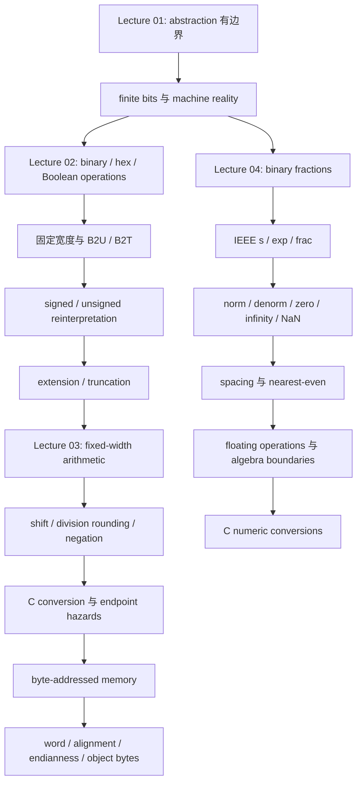


> 范围：CMU CSAPP Fall 2015 Lectures 01-04。  
> 目标：把课程动机、位级整数模型、定宽算术、内存字节表示和 IEEE 浮点模型连成一条可推导、可检查的学习路径。  
> 证据边界：本指南只综合下列四份讲义笔记，不引入讲义之外的定义、结论或例子。

## 资料与证据边界

- [Lecture 01 NOTES：Course Overview](/courses/cmu-csapp-f15/lectures/001/)
- [Lecture 02 NOTES：Bits, Bytes, and Integers](/courses/cmu-csapp-f15/lectures/002/)
- [Lecture 03 NOTES：Bits, Bytes, and Integers (cont.)](/courses/cmu-csapp-f15/lectures/003/)
- [Lecture 04 NOTES：Floating Point](/courses/cmu-csapp-f15/lectures/004/)

使用本指南时遵守四条证据规则：

1. 四份 `NOTES.md` 已在原始 transcript、课件和 ASR 之间做过校核。本指南沿用其中已经明确的校正，不再次猜测原音。
2. 原笔记标为 `[需回听 HH:MM:SS]` 的内容仍是不确定内容。本指南若无需它支撑主线，就不纳入；若必须提及，就保留“口述不确定”“课件支持”或“教师推测”等归属。
3. Lecture 03 的定宽补码位模型与 ISO C 语言保证必须分层：unsigned 模运算有明确的 C 保证；signed overflow、某些 signed left shift 不能按课堂回绕值写成可移植 C 结论；negative signed right shift 在课堂目标机上是 arithmetic shift，但语言层面依实现。
4. Lecture 04 中 raw `exp` 端点、normalized 范围、PowerPoint 中断处和最后一次 C 类型追问均存在原笔记已注明的不确定性。本指南采用课件支持的分类与公式，不替教师补出未确认的口述。

## 模块目的

本模块不是四份讲义的压缩复述，而是建立一套贯穿后续系统课程的推理程序：

```text
先问抽象隐藏了什么
  -> 再确定对象的 bits、宽度与解释规则
  -> 再追踪运算保留或丢弃了哪些 bits
  -> 再判断结果属于数学模型、机器位模型还是 C 语言语义
  -> 最后检查端点、舍入、平台和系统边界
```

完成模块后，应能做到：

- 用 Lecture 01 的 five realities 解释为什么程序员需要越过高级语言抽象观察 representation、execution、memory 和 system interaction。
- 从 Boolean bit vector 推出 unsigned 与 two's-complement 编码，而不是把端点和转换规则当作孤立口诀。
- 把 Lecture 02 的 truncation 继续推到 Lecture 03 的加法、乘法、移位和除法舍入，并区分位级结果与可移植 C 行为。
- 从 byte-addressed memory 推出 word、alignment、endianness 和 `show_bytes` 输出。
- 从有限二进制小数的局限推出 IEEE 754 的 significand/exponent 分工、特殊值、spacing 和 nearest-even。
- 对整数和浮点表达式统一采用“表示范围 + 中间结果 + 边界条件”的方法，而不是照搬实数或无限精度整数代数。

## 先修地图

### 学习层面的前置

| 前置能力 | 本模块中的用途 | 不要求预先掌握的内容 |
| --- | --- | --- |
| 基本 C 语法：整数类型、数组、`struct`、循环、cast、pointer、`sizeof` | 阅读越界写、mixed signed/unsigned、`show_bytes` 和 C puzzles | 不要求先会 x86-64 assembly、allocator 或 socket 编程 |
| 位值制与 $2^k$ | binary/hex、B2U/B2T、binary fraction、bias 和 spacing | 不要求预先知道 IEEE 字段规则 |
| 初等代数：交换律、结合律、分配律、平方非负 | 比较数学整数/实数与机器整数/浮点运算 | 不要求 numerical analysis |
| 几何级数和分数通分 | 推出全 1 pattern、$1-2^{-n}$ 和有限二进制小数边界 | 不要求额外的高等数学 |
| 集合与基本逻辑 | 把 bit mask 解释为 characteristic vector | 不要求数字电路设计 |

Lecture 01 没有给出正式 enrollment prerequisite，不能从 curriculum 图反推官方选课条件。上表只是理解 Lectures 01-04 所需的学习依赖。

### 四讲依赖顺序

```text
基本 C + 位值制 + 初等代数
  -> Lecture 01：为什么抽象边界值得研究
  -> Lecture 02：bits 怎样获得整数意义，类型与宽度怎样改变意义
  -> Lecture 03：这些 bits 怎样参与定宽运算并排列在 memory 中
  -> Lecture 04：同样的有限 bits 怎样近似更宽动态范围的数并发生舍入
```

工具层面上，Lecture 01 只说明 GDB、Linux/SSH、Autolab 和统一机器环境的作用；它没有假设学生已经熟练使用这些工具。

## Lecture 1-4 进阶路线

### Lecture 01：先建立系统视角，再给出整个学期的路线

来源：[Lecture 01 NOTES](/courses/cmu-csapp-f15/lectures/001/)

Randy Bryant 的起点不是公式，而是课程主题：**“Abstraction is good, but don't forget reality.”** 抽象仍是管理复杂度的必要工具；问题发生在 bug、性能、安全或 OS interaction 暴露了抽象边界，而程序员仍只使用理想化模型解释行为。

老师随后按固定顺序给出 five great realities：

1. **Ints are not integers; floats are not reals。** 有限表示带来 integer overflow、floating-point roundoff 和求值顺序敏感性。
2. **You've got to know assembly。** C source 经 compiler 变成 assembly/object code，再由 processor 执行；课程重在读 compiler-generated x86-64，而不是与 compiler 比赛手写大型 assembly。
3. **Memory matters。** 平坦、无限、等速的 memory 只是抽象；实际系统有层次、管理成本和越界引用造成的远距离破坏。
4. **Performance 不只由 Big-O 决定。** Representation、procedure、loop nesting 和 access pattern 可让功能与渐进复杂度相同的程序出现巨大速度差异。
5. **Computer 不只运行孤立程序。** I/O、network、concurrent processes、介质可靠性和跨平台交互都是现实系统的一部分。

接着，Randy 把这些 realities 放回 curriculum，并对比 builder-centric 与 programmer-centric：本课先问“程序员为了正确、高效地使用系统必须理解什么”，再为未来的 OS、compiler、network、architecture 等课程建立共同基础。

David R. O'Hallaron 接棒后，先界定课程组织和 academic integrity，再说明教材、lecture、recitation、lab、exam、官方求助渠道和统一机器环境怎样形成学习闭环。最后才按学期顺序展开 seven labs 和系统主题。这个顺序很重要：课程先解释为什么要下探现实，再说明怎样通过独立实现和测量获得能力，最后给出实践地图。

Lecture 01 对本模块的直接贡献是：

- 用 `40000^2`、`50000^2` 和四数乘积引出 finite-width integer。
- 用 `1e20`、`-1e20`、`3.14` 的两种结合顺序引出 floating-point roundoff。
- 用 `struct_t` 越界写说明 representation、layout 和 correctness 的联系。
- 用 `copyij`/`copyji` 说明 access pattern 与 performance 的联系。
- 用 Data/Bomb/Attack/Cache/Shell/Malloc/Proxy Labs 展示表示知识怎样进入后续执行、内存和系统实践。

边界：`struct_t` 的具体异常值和 crash index 是 system-specific；`fun(6)` 破坏何种管理状态只是教师推测。Matrix copy 接近 20 倍的差异也是特定机器观察，原材料未提取课件图的完整坐标轴。Attack Lab 可确认提到 ROP，但关于现代 stack protection 的断裂口述不在本指南中扩写。

### Lecture 02：从物理 bits 走到整数解释、转换与截断

来源：[Lecture 02 NOTES](/courses/cmu-csapp-f15/lectures/002/)

Lecture 02 从上一讲的 overflow 反直觉现象倒推原因，教学路线是：

1. 从 analog noise 与两个稳定区间解释为什么 digital systems 使用 bits。
2. 用 positional weights 建立 binary，再用 $2^4=16$ 引出 hexadecimal；1 byte 对应 8 bits 和两个 hex digits。
3. 从单 bit Boolean algebra 推广到 bit vectors，再把 bit vector 解释为集合的 characteristic vector。
4. 区分 C 的 bitwise `& | ~ ^` 与 logical `&& || !`，并引入 short-circuit。
5. 定义 left shift、logical right shift、arithmetic right shift，并把非法 shift count 划出语言边界。
6. 写出 B2U/B2T，用 5-bit 小模型推导同一 bits 的两种整数值、范围端点和全 1 为 $-1$。
7. 由“bits 不变、decoder 改变”推出 T2U/U2T，再落到 C 的 signed/unsigned cast 和 mixed comparison。
8. 用 `TMin`、unsigned countdown 和 `sizeof` 暴露端点及 implicit conversion 风险。
9. 最后讨论 width change：unsigned zero extension、signed sign extension，以及只保留 low bits 的 truncation。

老师刻意在 truncation 处结束本讲。Addition、multiplication、memory organization 和 byte order 虽在同一套 deck 后续页面出现，但不属于 Lecture 02 的实际讲授范围；它们由 Lecture 03 接续。

Lecture 02 的核心方法是 **small-width execution**：遇到抽象公式时先固定 $w=4$ 或 $w=5$，逐位写权重、转换和保留位，再一般化到 $w$ bits。

### Lecture 03：从“保留低位”推进到算术，再落到内存对象

来源：[Lecture 03 NOTES](/courses/cmu-csapp-f15/lectures/003/)

Lecture 03 把 Lecture 02 末尾的 truncation 当作控制线索：

1. 真实和后保留 low $w$ bits，得到 unsigned addition 的 modulo 规则。
2. 对同一结果 bits 改用 two's-complement decoder，得到 TAdd 的 normal、negative overflow 和 positive overflow 三个区域。
3. Exact product 最多需要 $2w$ bits；普通 multiplication 仍只保留 low $w$ bits。Signed/unsigned 低 word 相同，高 word 不同。
4. 由 positional weights 推出 left shift 乘 $2^k$，再由 right shift 推出除 $2^k$ 及舍入方向。
5. Negative arithmetic right shift 朝 $-\infty$，而课堂 C integer division 朝 0；因此先加 $2^k-1$ 的 bias 再 shift。
6. 用 complement-and-increment 推出 fixed-width negation：`~x + 1`。
7. 从算术规则转向 C 风险：unsigned countdown、`sizeof`/`size_t` 和 mixed comparison。
8. 之后才切换到 memory：byte-addressed flat space、word size、alignment、endianness。
9. 用 `show_bytes` 观察 integer、pointer 和 string object representation。
10. 最后用 Integer C Puzzles 强迫学生先写类型、位宽和机器假设，再证明或找 boundary counterexample。

这里有一条必须始终保留的双层结论：课堂 two's-complement 位模型能精确说明低位怎样变化，但 C standard 只明确保证 unsigned modulo behavior。依赖 signed overflow 回绕、`-INT_MIN`、某些 signed left shift 或 negative signed right shift 的题，必须另写 portable-C caveat。

### Lecture 04：从有限二进制小数推出浮点表示、舍入与代数边界

来源：[Lecture 04 NOTES](/courses/cmu-csapp-f15/lectures/004/)

Lecture 04 不从 IEEE 字段表开始，而是先解释为什么需要这套表示：

1. 从 binary point 和 $2^k$ 位权计算有限二进制小数。
2. 证明有限二进制小数只能精确表示 $x/2^k$，所以 $1/3$、$1/5$、$1/10$ 会循环。
3. 用 fixed-point 的 range/precision 冲突推出 floating point 的 $M2^E$ 分工。
4. 定义 `s | exp | frac` 和 $v=(-1)^sM2^E$，先只讲 normalized：biased exponent 与 implied leading 1。
5. 再用 `exp=0` 引入 denormalized 和 signed zero，用 `exp` 全 1 引入 infinity 与 NaN。
6. 用 tiny format 穷举边界，验证 denorm 到 norm 的平滑过渡和指数层级的 spacing。
7. 从“精确结果后舍入”引出四种 rounding mode，并重点训练 round-to-nearest-even。
8. 把 rounding 放回 multiplication 与 aligned addition，解释小量为何会被大数吞掉。
9. 用不结合、不分配反例划清 floating point 与 real arithmetic 的边界。
10. 最后落到 C 的 `int`/`float`/`double` conversions 和 puzzles。

老师的结论不是“浮点不可预测”，而是：IEEE 规则明确、可以按数学模型推理，但不能把实数的 associativity、distributivity 或无损转换直觉直接搬过来。

## 概念依赖图



用文字压缩后，模块只有五个反复出现的问题：

1. **宽度是多少？** 省略 $w$，`-1 -> 31`、端点、shift、truncation 和 byte listing 都失去确定含义。
2. **同一 bits 按什么解释？** Unsigned、two's complement、set、pointer、ASCII byte 和 floating fields 使用不同 decoder。
3. **运算保留了什么？** Addition/multiplication 保留 low word；extension 新增 high bits；truncation 丢 high bits；floating operation 保留目标 precision。
4. **中间结果在哪里失真？** Integer 在范围外截断；floating point 在 exponent overflow 或 significand rounding 时改变。
5. **哪个规则层面在作答？** 数学整数/实数、目标机器 bit model、C abstract machine 和具体 ABI 不是同一层。

## 关键表示、公式、推导与边界

### 1. Binary、hex 与 bit vector

一个 binary integer 或 fraction 的统一形式是：

$$
B=\sum_{k=-j}^{i}b_k2^k,\qquad b_k\in\{0,1\}.
$$

因为 $2^4=16$，每个 hex digit 对应 4 bits；一个 byte 是 8 bits，因此对应两个 hex digits。Boolean operator 对同宽 vectors 逐位置独立作用，没有 carry：

$$
a\mathbin{\&}b=[a_{w-1}\land b_{w-1},\ldots,a_0\land b_0].
$$

把 bit $j$ 定义为“元素 $j$ 是否属于集合”，则 `&`、`|`、`^`、`~` 分别对应 intersection、union、symmetric difference 和相对于固定 $w$-element universe 的 complement。

边界：`~` 的结果必须带 width；`&` 与 `&&` 不是同一运算。后者把整个 operand 规范成 0/1，并支持 short-circuit。

### 2. Unsigned 与 two's-complement decoding

设 $\vec{x}=[x_{w-1},\ldots,x_0]$：

$$
\operatorname{B2U}_w(\vec{x})=\sum_{i=0}^{w-1}x_i2^i,
$$

$$
\operatorname{B2T}_w(\vec{x})=-x_{w-1}2^{w-1}+\sum_{i=0}^{w-2}x_i2^i.
$$

唯一差别是 MSB 权重从 $+2^{w-1}$ 变为 $-2^{w-1}$，所以：

$$
\operatorname{B2U}_w(\vec{x})-\operatorname{B2T}_w(\vec{x})=x_{w-1}2^w.
$$

范围由权重直接推出：

$$
\operatorname{UMax}_w=2^w-1,
\qquad
\operatorname{TMin}_w=-2^{w-1},
\qquad
\operatorname{TMax}_w=2^{w-1}-1.
$$

由此还有：

$$
|\operatorname{TMin}_w|=\operatorname{TMax}_w+1,
\qquad
\operatorname{UMax}_w=2\operatorname{TMax}_w+1.
$$

全 1 pattern 在 B2T 下恒为：

$$
-2^{w-1}+(2^{w-1}-1)=-1.
$$

边界：sign bit 不是 sign-magnitude 的独立负号；它是有权重的数值位。类型和操作决定 decoder，bits 本身没有携带 signedness 标签。

### 3. Signed/unsigned conversion

同宽转换保持 bits，只更换 interpretation：

$$
\operatorname{T2U}_w(x)=
\begin{cases}
x,&x\ge0,\\
x+2^w,&x<0,
\end{cases}
$$

$$
\operatorname{U2T}_w(u)=
\begin{cases}
u,&0\le u\le\operatorname{TMax}_w,\\
u-2^w,&\operatorname{TMax}_w<u\le\operatorname{UMax}_w.
\end{cases}
$$

因此在 Lecture 02 的同宽 `int`/`unsigned int` 场景中，`-1 > 0U` 为 true：`-1` 的全 1 pattern 先成为 `UMax`。分析 mixed expression 的顺序必须是：

```text
标出 operand type -> 执行 implicit/explicit conversion -> 再做 arithmetic/comparison
```

边界：Lecture 02 的比较表针对课件给出的 32-bit `int`/`unsigned int` 组合，不能把简化规则无条件外推到所有不同 rank/width 的类型组合。

### 4. Extension 与 truncation

Unsigned widening 在左侧补 0；signed widening 复制原 sign bit。扩一位时，negative sign contribution 保持不变：

$$
-2^w+2^{w-1}=-2^{w-1}.
$$

所以 `1110₂` 从 4 bits sign-extend 为 `11110₂`，两者都表示 $-2$。

从 $w$ bits 截到 $k<w$ bits 的统一步骤是：保留 low $k$ bits，再按目标类型重新解释。对 unsigned：

$$
u'=u\bmod2^k.
$$

对 signed 可写成：

$$
x'=\operatorname{U2T}_k\left(\operatorname{T2U}_w(x)\bmod2^k\right).
$$

课堂例子 `10011₂` 是 5-bit $-13$；截成 4-bit `0011₂` 后变为 $+3$。

边界：widening 不是 left shift，truncation 不是 saturation 或 rounding。只有 source value 可由目标类型表示，或被丢 bits 只是合法 extension copies 时，数值才保持。

### 5. 定宽 addition 与 multiplication

Unsigned addition：

$$
\operatorname{UAdd}_w(u,v)=(u+v)\bmod2^w.
$$

令真实 signed sum 为 $s=x+y$，课堂 two's-complement 位模型为：

$$
\operatorname{TAdd}_w(x,y)=
\begin{cases}
s+2^w,&s<\operatorname{TMin}_w,\\
s,&\operatorname{TMin}_w\le s\le\operatorname{TMax}_w,\\
s-2^w,&s>\operatorname{TMax}_w.
\end{cases}
$$

两个 $w$-bit unsigned numbers 的真实和最多需要 $w+1$ bits；两个 $w$-bit factors 的 exact product 最多需要 $2w$ bits。普通 unsigned product保留 low word：

$$
\operatorname{UMult}_w(u,v)=uv\bmod2^w.
$$

Signed 与 unsigned multiplication 的低 $w$ bits 相同，因为代表值之差含 $2^w$ 因子；需要 upper word 或 full product 时，两者的扩展方式不同，不能混用。

边界：上述 TAdd/TMult 描述课堂固定宽度机器 bits。C 保证 unsigned overflow 的 modulo behavior，不保证 signed overflow 回绕；不能把 `TMax+TMax -> -2` 写成 portable C 合约。

### 6. Shift、除法舍入与补码取负

在固定 $w$-bit 位模型中：

$$
x<<k\equiv x2^k\pmod{2^w}.
$$

Unsigned logical right shift：

$$
u>>k=\left\lfloor\frac{u}{2^k}\right\rfloor.
$$

课堂目标机上的 negative arithmetic right shift也给 floor，而 C integer division 朝 0。对 $x<0$：

$$
\operatorname{trunc}\left(\frac{x}{2^k}\right)
=\left\lfloor\frac{x+2^k-1}{2^k}\right\rfloor.
$$

这就是“先加 bias $2^k-1$，再 arithmetic shift”的来源。补码取负则由全 1 为 $-1$ 推出：

$$
-x=\sim x+1\pmod{2^w}.
$$

边界：shift count `<0` 或 `>= word width` 在 C 中不可依赖；硬件对 count 取模只是某些实现现象。Unsigned `>>` 补 0；negative signed `>>` 在课堂机器上复制 sign bit，但 C 层面依实现。Signed left shift 还需单独检查语言语义。

### 7. Byte-addressed memory、alignment 与 endianness

Lecture 03 的接口模型是：memory 是按 byte 编号的 flat address space，pointer 保存 address。对齐到 $a=2^k$ bytes 时：

$$
\operatorname{address}\bmod a=0,
$$

等价于：

$$
\operatorname{address}\ \&\ (a-1)=0.
$$

Endianness 只决定 multi-byte object 的 byte significance 与 address 的对应：

- Little endian：least significant byte 位于 lowest address。
- Big endian：most significant byte 位于 lowest address。

对 `0x01234567` 从地址 `0x100` 开始：

| Address | Big endian | Little endian |
| --- | --- | --- |
| `0x100` | `01` | `67` |
| `0x101` | `23` | `45` |
| `0x102` | `45` | `23` |
| `0x103` | `67` | `01` |

`show_bytes((unsigned char *)&obj, sizeof(obj))` 的三个关键量是 object、起始地址和 object byte length。Pointer 自身的 width 不决定 pointee 的 `sizeof`。

边界：课程 x86-64 环境中的 `int=32 bits`、`long/pointer=64 bits`、当时 47 usable address bits 和自然对齐都是平台/ABI 事实，不是所有 C 实现的统一宽度。Endianness 反转 bytes，不反转每个 byte 内 bits，也不倒置单 byte `char` array 的字符顺序。

### 8. 有限二进制小数与浮点动机

有限 $n$ 位全 1 小数：

$$
0.\underbrace{11\ldots1}_{n}{}_2
=\sum_{i=1}^{n}2^{-i}
=1-2^{-n}.
$$

任意有限二进制小数都可写成 $x/2^k$。因此 $1/3$、$1/5$、$1/10$ 需要循环展开，有限机器只能截取并舍入。Fixed binary point 在总位数固定时必须在 range 与 precision 之间静态取舍，于是引出：

$$
v=(-1)^sM2^E.
$$

### 9. IEEE 字段与类别

字段按 `s | exp | frac` 排列。Single 为 `1/8/23`，double 为 `1/11/52`。设 `exp` 有 $k$ bits：

$$
Bias=2^{k-1}-1.
$$

| `exp` | `frac` | 类别 | $E$ | $M$ |
| --- | --- | --- | --- | --- |
| 非全 0、非全 1 | 任意 | normalized | $Exp-Bias$ | $1.frac_2$ |
| 全 0 | 全 0 | $\pm0$ | $1-Bias$ | $0$ |
| 全 0 | 非 0 | denormalized | $1-Bias$ | $0.frac_2$ |
| 全 1 | 全 0 | $\pm\infty$ | 不适用 | 不适用 |
| 全 1 | 非 0 | NaN | 不适用 | 不适用 |

Single normalized 的 $Exp$ 范围为 $1\ldots254$，所以：

$$
-126\le E\le127.
$$

边界：不能把 raw `exp=0,255` 代入 normalized 公式；denorm 没有 implied leading 1；$+0$ 与 $-0$ bits 不同但数值比较相等；NaN 不属于普通数值顺序。

### 10. Tiny format 与 spacing

对 Lecture 04 的 `1/4/3` 位 8-bit tiny format，$Bias=7$。正数端点为：

$$
0,\frac1{512},\ldots,\frac7{512},\frac8{512},\frac9{512},\ldots,240,+\infty.
$$

最大 denorm：

$$
\frac78\times2^{-6}=\frac7{512}.
$$

最小 norm：

$$
1\times2^{-6}=\frac8{512}.
$$

若 `frac` 有 $f$ bits：

$$
\Delta_{denorm}=2^{1-Bias-f},
\qquad
\Delta_E=2^{E-f}.
$$

在 $E=1-Bias$ 时两者相等，所以 denorm 到 norm 的边界保持同一间距；$E$ 每增加 1，spacing 翻倍。

边界：tiny format 是教学模型，不是额外的实际 IEEE 类型。它说明的是分类和间距结构。

### 11. Nearest-even 与浮点运算

浮点运算采用“精确数学结果后舍入”的抽象：

$$
x+_fy=Round(x+y),
\qquad
x\times_fy=Round(xy).
$$

Nearest-even 的判断顺序是：先比较 discarded suffix 与 halfway；只有 exact tie 才选择最低保留 digit/bit 为偶数的一侧。二进制 exact halfway 必须是 `100...`。

乘法主线：

```text
sign XOR -> significands multiply -> exponents add -> normalize -> overflow check -> round
```

加法主线：

```text
align smaller exponent -> signed significands add -> normalize -> overflow check -> round
```

边界：nearest-even 不是“看到首个 discarded bit 为 1 就进位”，也不是在每种情况下强制结果末位为偶数。硬件不必真的创建无限位中间值；“精确后舍入”是规定结果的推理模型。

### 12. 浮点代数与 C conversions

浮点 addition/multiplication 可交换，但一般不结合；multiplication 也不对 addition 分配。不同括号改变中间 alignment、rounding、overflow、infinity 或 NaN 路径。

C conversion 的课堂边界：

| 转换 | Lecture 04 的结论 |
| --- | --- |
| `float/double -> int` | 丢 fractional part，朝 0；out-of-range/NaN 不适用普通规则 |
| 课堂 32-bit `int -> double` | double 的 53-bit 有效精度可精确容纳 |
| `int -> float` | 可能舍入 |
| `float -> double -> float` | 排除 NaN 时可回到原 float |
| `double -> float -> double` | 第一次 narrowing 可能丢信息，不能保证恢复 |

边界：Lecture 04 最后关于某一 mixed `float`/`double` subexpression 的精确类型，教师明确说需查 C guide，原笔记也未消除歧义；本指南不把它补成确定规则。

## 关键例子、演示与 Labs

### 四讲核心例子

| 讲次 | 例子 | 训练的推理 | 必须保留的边界 |
| --- | --- | --- | --- |
| L1 | `50000 * 50000` 显示负值 | 数学 integer 与 finite `int` 不同 | L1 尚未推导补码细节 |
| L1 | `1e20 + -1e20 + 3.14` 两种括号 | 中间 roundoff 破坏 associativity | 只说明课堂两种顺序 |
| L1 | `struct_t.a[i]` 越界改写 `double d` | byte layout、silent corruption、action at a distance | 数值和 crash index system-specific |
| L1 | `copyij` 与 `copyji` | 同 Big-O 仍因 locality 显著不同 | 接近 20 倍是特定机器结果 |
| L2 | `0x69 & 0x55` 与 `0x69 && 0x55` | bitwise 与 logical 分层 | `~` 的结果还依 operand width |
| L2 | 5-bit `10110₂` | 同 bits 是 unsigned 22 / signed -10 | 差值 $2^5$ 依固定 width |
| L2 | `-1 > 0U` | mixed comparison 先 conversion | 针对课件同宽类型场景 |
| L2 | `1110₂ -> 11110₂` | sign extension 保值 | 不是 left shift |
| L2 | `10011₂ -> 0011₂` | signed truncation 可从 -13 变 +3 | 先丢 bits，再按新 width 解码 |
| L3 | 4-bit `13+5 -> 2` | `UAdd` 模 $16$ | 不是数学整数等式 |
| L3 | `-3+(-6)->7`、`7+5->-4` | TAdd 两类 overflow | C signed overflow 不保证回绕 |
| L3 | `5*5` low bits `1001` | 同 bits 是 unsigned 9 / signed -7 | 低 word 相同，高 word不同 |
| L3 | `-3>>1=-2` 与 `-3/2=-1` | floor 与 toward-zero 的差异 | Arithmetic signed shift 依目标实现 |
| L3 | unsigned countdown 与 `sizeof` | modulo 可以有意使用，也会造成 implicit-conversion bug | `size_t` 不是负输入过滤器 |
| L3 | `0x01234567 @ 0x100` | big/little endian byte layout | 反转单位是 byte，不是 nibble/bit |
| L3 | `show_bytes` 输出 `6d 3b 00 00` | 32-bit integer、little endian、object size | Pointer width 不等于 object size |
| L3 | 字符串 `"18213"` -> `31 38 32 31 33 00` | char array 与 scalar endianness 的差别 | 仅是课堂 ASCII digit 示例 |
| L4 | `15213.0` single encoding | binary、normalize、bias、implied 1 串联 | 此例有效 bits 足够，没有舍入 |
| L4 | tiny format `7/512 -> 8/512 -> 9/512` | denorm/norm 平滑边界 | Tiny format 仅用于教学 |
| L4 | `10.11100₂` 与 `10.10100₂` | exact tie 一次向上、一次向下 | 看保留 LSB，不看被丢位奇偶 |
| L4 | $(3.14+10^{10})-10^{10}$ | 加法不结合 | 反例依中间 alignment/rounding |
| L4 | $10^{20}$ 乘法与分配律反例 | overflow/infinity/NaN 改变代数路径 | 不能由 commutativity 推出任意重排 |
| L4 | `2/3` 与 `2/3.0` | operand type 先决定运算类别 | Comparison 不会重做左侧 integer division |

### Lecture 01 给出的七个 Labs 路线

| 顺序 | Lab | 本讲给出的学习作用 | 本模块中的依赖 |
| ---: | --- | --- | --- |
| 1 | Data Lab | 受限 bit-level C puzzles，迫使学生依据 representation 推理 | L2-L3 的 Boolean、补码、shift、negation |
| 2 | Bomb Lab | 用 GDB 读取 compiler-generated assembly，反推六个 phases 的输入 | L1 Reality #2；后续 machine execution |
| 3 | Attack Lab | x86-64 exploit 与课堂明确提到的 ROP | Machine-level control 与 memory vulnerability；保护细节未在此展开 |
| 4 | Cache Lab | 先写 cache simulator，再优化 transpose 以减少 misses | L1 的 matrix locality 例子 |
| 5 | Shell Lab | 把 process、signal、nonlocal control 与 concurrency 放入真实 shell | L1 的 ECF 路线 |
| 6 | Malloc Lab | 用 pointers/casts 管理 raw memory，在 performance 与 memory efficiency 间权衡 | L1 Reality #3；后续 Virtual Memory/allocation |
| 7 | Proxy Lab | 综合 Linux I/O、sockets、networking、concurrency、synchronization | L1 Reality #5 |

课程学习机制也属于 Lecture 01 的逻辑：lecture 建框架，recitation 练工具与应用，lab 通过独立实现和测量形成能力，Autolab 提供反馈，exam 检查概念和数学原理。Academic integrity 的边界服务于这一机制，因为 lab 的困难过程本身就是学习内容。

## 跨讲常见误区

| 误区 | 跨讲修正 |
| --- | --- |
| “课程认为 abstraction 不好” | L1 明确说 abstraction 有用；本课研究它何时不足以解释现实。 |
| “Overflow 后就是随机数” | L2-L3 给出确定的 fixed-width bit pattern；但确定的机器低位不等于 C 保证 signed wraparound。 |
| “Bits 自带 signed/unsigned 类型” | L2 的 `10110₂` 说明同一 bits 可由不同 decoder 得到 22 或 -10。 |
| “Sign bit 是额外负号” | B2T 中 MSB 的权重本身是 $-2^{w-1}$。 |
| “声明 unsigned 因为值不应为负，所以更安全” | L2-L3 的 countdown、`sizeof` 和 negative `cnt` 说明 termination 与 conversion 可能更危险。 |
| “Extension 就是 shift，truncation 会饱和到端点” | Extension 在左侧补 bits且保持原位权；truncation 只留 low bits。 |
| “同一硬件上的补码回绕就是 portable C 语义” | L3 明确区分 unsigned 标准保证与 signed overflow/shift caveat。 |
| “64-bit machine 上所有对象都是 8 bytes” | L3 区分 nominal word、pointer、usable address bits 和 32-bit `int`。 |
| “Little endian 反转整个 bit string或字符串” | 它只排列 multi-byte scalar 的 bytes；`char` array 仍按 element/address 顺序。 |
| “Floating point 只是范围更大的 real” | L4 从有限 binary fraction、precision、rounding 和 special values说明它是有限表示系统。 |
| “`exp` 就是实际指数 $E$” | 必须区分 bit field `exp`、unsigned field value $Exp$ 和 $E=Exp-Bias$。 |
| “Denorm 也有 implied leading 1” | Denorm 用 $M=0.frac_2$，并固定 $E=1-Bias$。 |
| “所有 floating values 等距” | 固定 exponent 内等距；$E$ 每增 1，spacing 翻倍；denorm 区使用固定最小间距。 |
| “Nearest-even 就是遇到 5/首个 1 一律向偶数进位” | 只有 exact halfway 才看最低保留位奇偶；其余先选真正最近的一侧。 |
| “可交换就可以任意改括号或分配展开” | L4 区分 commutativity、associativity 和 distributivity。 |
| “Narrowing 后再 widening 可恢复原值” | 第一次 narrowing 一旦舍入或截断，后续 widening 不能恢复丢失信息。 |

## 掌握清单

### Lecture 01

- [ ] 能解释课程主题，同时说明它并不反对 abstraction。
- [ ] 能严格按老师顺序复述 five realities，并为每条配一个课堂例子。
- [ ] 能区分 programmer-centric 与 builder-centric 的入口。
- [ ] 能解释 `struct_t` 越界写的空间和时间 action at a distance。
- [ ] 能说明 `copyij`/`copyji` 控制了哪些变量、改变了什么 access pattern。
- [ ] 能把 seven labs 按顺序连到 data、assembly、security、cache、ECF、allocation、networking。
- [ ] 能说明 lecture、recitation、lab、Autolab、exam 在学习闭环中的不同职责。
- [ ] 能指出 L1 只提出 overflow、cache、VM 等问题，没有提前讲完机制。

### Lecture 02

- [ ] 能解释 binary hardware 的抗噪动机，并完成 binary/hex 双向转换。
- [ ] 能区分 bitwise 与 logical operators，并解释 `p && *p` 的 short-circuit。
- [ ] 能画出 left、logical-right、arithmetic-right shift 的丢弃和填充。
- [ ] 能写出 B2U/B2T 并从权重推出 `UMax/TMin/TMax`。
- [ ] 能对任意小 $w$ 执行 T2U/U2T，而不是直接比较纸面十进制值。
- [ ] 能解释 `TMin` range asymmetry、`abs(TMin)` 风险和 unsigned countdown。
- [ ] 能追踪 `sizeof` 怎样把 surrounding expression 带入 unsigned domain。
- [ ] 能证明 sign extension 保值，并区分它与 zero extension。
- [ ] 能对 signed truncation 先保留 low bits，再使用目标 B2T。
- [ ] 能明确说出 Lecture 02 止于 truncation。

### Lecture 03

- [ ] 能从 truncation 推出 `UAdd`，并画出 TAdd 的三个真实和区域。
- [ ] 能分开 mathematical result、full bit result、low word 和 interpreted value。
- [ ] 能解释 signed/unsigned product 何时共享低位、何时必须区分高位。
- [ ] 能从 positional weights 推导 left shift，而不是把它当无条件 C 恒等式。
- [ ] 能比较 logical/arithmetic right shift 与 C `/2^k` 的舍入方向。
- [ ] 能推导 negative bias $2^k-1$，并由 `x+~x=-1` 推出 `~x+1`。
- [ ] 能说明 unsigned 的正当用途及其 loop/API 风险。
- [ ] 能区分 byte address、word、pointer width、type width 和 usable address bits。
- [ ] 能由 alignment size 写出 address low-bit 条件。
- [ ] 能不看图写出 `0x01234567` 的 big/little-endian layout。
- [ ] 能解释 `show_bytes` 的地址、长度和 `unsigned char *`。
- [ ] 能为涉及 overflow/shift 的 C puzzle同时写课堂 machine-model 答案和 portable-C caveat。

### Lecture 04

- [ ] 能把有限 binary fraction 展开成 $\sum b_k2^k$，并解释 $x/2^k$ 精确条件。
- [ ] 能从 fixed-point tradeoff 推出 significand/exponent 分工。
- [ ] 能严格区分 `exp`、$Exp$、$E$、`frac` 和 $M$。
- [ ] 能写出 single/double 字段宽度、bias 和 normalized exponent ranges。
- [ ] 能独立推导 `15213.0` 的 single bit pattern。
- [ ] 能由字段判断 norm、denorm、zero、infinity 和 NaN。
- [ ] 能用 tiny format 证明 denorm/norm 边界平滑并推出 spacing。
- [ ] 能区分四种 rounding modes，并只在 exact tie 时使用 nearest-even。
- [ ] 能按正确顺序解释 floating multiplication 与 aligned addition。
- [ ] 能逐步计算 addition non-associativity、multiplication non-associativity 和 distributivity 反例。
- [ ] 能判断 `int`/`float`/`double` conversion 是精确、舍入还是截断。
- [ ] 能在所有涉及 comparison 的结论中保留 NaN、signed zero、infinity 等前提。

### 模块综合掌握

- [ ] 面对任意整数/浮点题，先写 width、type/interpretation、operation 和 boundary assumptions。
- [ ] 能在同一题中区分 mathematical value、stored bits、machine result 和 C language result。
- [ ] 能用 small-width model 验证一般公式，并知道哪些数值只是课堂平台实例。
- [ ] 能把 L1 的 finite representation reality 分别追踪到 L2/L3 的 overflow 和 L4 的 roundoff。
- [ ] 能把 L1 的 memory reality 追踪到 L3 的 byte layout、endianness 和 object representation。
- [ ] 能用端点 `0`、`-1`、`TMin`、`TMax`、`UMax` 或浮点 special values主动寻找反例。
- [ ] 能解释为什么“结果有确定 bits”和“语言允许依赖该结果”是两个问题。
- [ ] 能把 seven labs 放回概念依赖链，而不是只背作业名称。

## 12 道累计问题与简要答案

### 1. 解释题：四讲为何从课程现实观开始，而不是直接背 IEEE 或补码表？

**答案要点：** L1 先说明抽象在 correctness、performance、security 和 system interaction 中会暴露边界；L2-L4 再逐层给出 representation、operation 和 boundary rules。公式因此是在解释已观察到的 overflow、memory corruption 和 roundoff，而不是脱离程序行为的编码清单。

### 2. 计算题：5-bit `10110₂` 的 unsigned 和 two's-complement values 各是多少？为何相差 32？

**答案要点：** B2U 为 $16+4+2=22$；B2T 为 $-16+4+2=-10$。MSB 权重从 $+16$ 变为 $-16$，差为 $32=2^5$。

### 3. 代码推理题：在 Lecture 02 的 32-bit `int/unsigned` 场景中，`-1 > 0U` 和 `(unsigned)-1 > -2` 各为何真？

**答案要点：** `U` 或 cast 使比较采用 unsigned interpretation。`-1` 的全 1 pattern 是 `UMax`；`-2` 转为 `UMax-1`。因此 `UMax>0` 且 `UMax>UMax-1`。

### 4. 表示题：先把 4-bit `1110₂` 扩为 5 bits，再把 5-bit `10011₂` 截为 4 bits。结果为何不同？

**答案要点：** Sign extension 得 `11110₂`，由 $-16+8+4+2=-2$ 保值。Truncation 保留 `0011₂`，新 sign bit 为 0，所以 5-bit $-13$ 变为 4-bit $+3$。Extension 增加冗余 sign bits；truncation 丢失承担负权重的 high bit。

### 5. 定宽算术题：在 4 bits 中分别计算 unsigned `13+5`、signed `7+5`、`5*5` 的低位结果。

**答案要点：** `13+5=18`，low bits `0010`，unsigned 为 2；`7+5=12`，low bits `1100`，signed 为 -4；`5*5=25`，low bits `1001`，unsigned 为 9、signed 为 -7。前两种 signed overflow/multiplication wrap 是课堂 bit model，portable C 不保证 signed overflow 结果。

### 6. 代码推理题：为什么下面两个 countdown 都可能失败？

```c
unsigned i;
for (i = n - 1; i >= 0; i--)
    use(a[i]);

int j;
for (j = CNT; j - sizeof(int) >= 0; j -= sizeof(int))
    use(a[j]);
```

**答案要点：** Unsigned `i>=0` 永真，`0-1` 回绕到 `UMax`。第二段中 `sizeof` 返回 unsigned `size_t`，可让 subtraction/comparison 在 unsigned domain 中进行；数学上的负结果变成大 unsigned。只看变量声明不足以判断 expression type。

### 7. 推导题：为什么课堂目标机上不能直接用 `-3 >> 1` 实现 `-3 / 2`？怎样修正？

**答案要点：** Arithmetic right shift 给 $\lfloor-3/2\rfloor=-2$，C integer division 的课堂规则朝 0 得 -1。对除以 $2^k$ 的负数先加 $2^k-1$；这里加 1，`(-3+1)>>1=-1`。该生成方式依 negative signed shift 为 arithmetic 的目标实现。

### 8. 内存题：`0x01234567` 从 `0x100` 开始怎样排列？为什么 `int a=15213` 在 x86-64 上显示 `6d 3b 00 00`，而字符串 `"18213"` 不反转？

**答案要点：** Big endian 为 `01 23 45 67`，little endian 为 `67 45 23 01`。`15213=0x00003b6d`，32-bit `int` 在 little endian 下由低地址显示 `6d 3b 00 00`。String 是单 byte `char` elements，按 array/address 顺序为 `31 38 32 31 33 00`，不存在一个 multi-byte scalar 内部的 byte significance 重排。

### 9. 编码题：从十进制 `15213.0` 推导 single-precision fields。

**答案要点：** $15213=11101101101101_2=1.1101101101101_2\times2^{13}$；$s=0$；$Exp=13+127=140=10001100_2$；`frac=11011011011010000000000`。完整编码为 `0 10001100 11011011011010000000000`。

### 10. Tiny-format 题：在 `1/4/3` 位 format 中，最大正 denorm、最小正 norm 和两者间距是什么？

**答案要点：** $Bias=7$，两类边界的实际指数均为 $-6$。最大 denorm 为 $(7/8)2^{-6}=7/512$；最小 norm 为 $1\cdot2^{-6}=8/512$；间距为 $1/512$，与 denorm 内部间距相同。

### 11. 舍入题：把 `10.11100₂` 和 `10.10100₂` 都舍入到 binary point 后两位，为什么一上、一不变？

**答案要点：** 两者 discarded suffix 都是 exact halfway `100`。`10.11` 的最低保留 bit 为 1，tie 时进位到 `11.00`；`10.10` 的最低保留 bit 为 0，tie 时保留为 `10.10`。Nearest-even 只在 exact tie 使用。

### 12. 综合代码题：判断并解释 `x == (int)(float)x`、`2/3 == 2/3.0`、`(d+f)-d == f` 是否总成立。

**答案要点：** 三者都不总成立。32-bit `int -> float` 可能舍低位，转回不能恢复；`2/3` 先执行 integer division 得 0，而 `2/3.0` 是 floating division；若 $\lvert d|\gg|f\rvert$，`d+f` 的中间舍入可先丢掉 $f$，再减 $d$ 得 0。最后一题体现 floating addition 不结合。

## 推荐复习顺序

1. **先重建 Lecture 01 的问题意识。** 闭卷写出 five realities，并把每条配到一个课堂例子和后续 lab。若只会背术语，不知道它挑战了哪个抽象，后面公式会再次碎片化。
2. **用 4/5-bit 模型重做 Lecture 02。** 依次练 binary/hex、Boolean vector、B2U/B2T、ranges、T2U/U2T、extension、truncation。每题都写 width。
3. **单独做一轮 C 类型审计。** 遮住答案重做 `-1 > 0U`、unsigned countdown、`sizeof` mixed expression；固定执行“types -> conversions -> operation”。
4. **从 truncation 接入 Lecture 03 算术。** 手算 4-bit addition/multiplication，再推 shift、division bias 和 `~x+1`。每题分别写 mathematical result、low bits、interpreted value、C boundary。
5. **画 memory，而不是只读定义。** 手画 byte addresses、alignment、`0x01234567` 两种 endian layout、`15213` 的 `show_bytes` 输出和字符串 bytes。
6. **按 Lecture 04 原顺序复习。** 先 binary fraction 与 fixed-point tradeoff，再 norm/denorm/special values；不要一开始死背分类表。
7. **用 tiny format 和 rounding 连接表示与运算。** 完整列出 `0 -> 9/512`，再做四个 nearest-even 例子，最后解释 align/normalize/round。
8. **最后做代数与代码反例。** 重算浮点不结合、不分配和 conversion puzzles；用第 12 题检查是否能把 representation loss 落到 C expression。
9. **回查所有不确定项时只回到原始证据。** 对 `[需回听]`、课件/口述冲突或教师明确未解的问题，不用记忆或课外知识自动补全。

## 四讲覆盖审计

| 讲次 | 源笔记 | 本指南中的主要落点 | 核心表示/推导 | 例子或 Labs | 不确定性是否保留 |
| --- | --- | --- | --- | --- | --- |
| Lecture 01 | [Course Overview NOTES](/courses/cmu-csapp-f15/lectures/001/) | 模块目的、先修、四讲路线、例子/Labs、误区、L1 清单、题 1、复习步骤 1 | Five realities、programmer-centric、课程依赖链 | Overflow、roundoff、`struct_t`、matrix copy、seven labs | 是：system-specific 结果、`fun(6)` 推测、20x 平台性、ROP 后续细节均有限定 |
| Lecture 02 | [Bits, Bytes, and Integers NOTES](/courses/cmu-csapp-f15/lectures/002/) | 四讲路线、公式 1-4、例子、误区、L2 清单、题 2-4 | Boolean vector、B2U/B2T、ranges、T2U/U2T、extension/truncation | `0x69` operators、`10110₂`、mixed comparisons、`-13 -> 3` | 是：固定 width/平台假设明确，且未把 deck 后续 arithmetic 算作 L2 已讲 |
| Lecture 03 | [Bits, Bytes, and Integers (cont.) NOTES](/courses/cmu-csapp-f15/lectures/003/) | 四讲路线、公式 5-7、例子、误区、L3 清单、题 5-8 | UAdd/TAdd、UMult、shift/bias/negation、memory/alignment/endian | 4-bit arithmetic、loops、`0x01234567`、`show_bytes`、C puzzles | 是：machine bit model 与 portable C 分层；课堂未解的最后三题未补写 |
| Lecture 04 | [Floating Point NOTES](/courses/cmu-csapp-f15/lectures/004/) | 四讲路线、公式 8-12、例子、误区、L4 清单、题 9-12 | Binary fractions、IEEE categories、tiny spacing、nearest-even、operations/conversions | `15213.0`、`7/512 -> 9/512`、rounding、algebra/C puzzles | 是：raw/normalized 端点按课件支持；PowerPoint 缺口和未确认 C 类型追问未补造 |

审计结论：四讲均有独立的教学进阶、关键公式或概念、课堂例子、边界说明、逐讲掌握清单和累计问题落点；Lecture 01 的课程观与 labs、Lecture 02 的整数解释、Lecture 03 的算术/内存、Lecture 04 的浮点表示与舍入均未缺席。

