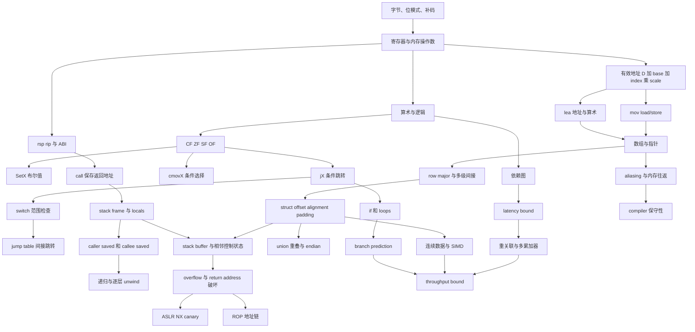


> 覆盖顺序：Basics -> Control -> Procedures -> Data -> Advanced -> Optimization  
> 覆盖讲次：Lecture 05–10  
> 证据原则：本文只综合下列六份 `NOTES.md`。不借助外部资料补全术语、ABI 细节、处理器行为、性能数字或安全机制；原笔记中的 `[需回听 HH:MM:SS]`、课件冲突和课堂口误均保留为证据边界。

## 六讲证据索引

| 代号 | 阶段 | 原始课堂笔记 |
| --- | --- | --- |
| L05 | Basics | [Lecture 05 NOTES.md](/courses/cmu-csapp-f15/lectures/005/) |
| L06 | Control | [Lecture 06 NOTES.md](/courses/cmu-csapp-f15/lectures/006/) |
| L07 | Procedures | [Lecture 07 NOTES.md](/courses/cmu-csapp-f15/lectures/007/) |
| L08 | Data | [Lecture 08 NOTES.md](/courses/cmu-csapp-f15/lectures/008/) |
| L09 | Advanced | [Lecture 09 NOTES.md](/courses/cmu-csapp-f15/lectures/009/) |
| L10 | Optimization | [Lecture 10 NOTES.md](/courses/cmu-csapp-f15/lectures/010/) |

文中 `[L05]`–`[L10]` 均指向上表对应讲次。时间、课件页码、代码和数字均可在相应 `NOTES.md` 中继续追溯。

## 模块目的

本模块把六讲组织成一条从“机器能看见什么”到“怎样让机器更高效执行”的连续推理链。目标不是背诵孤立指令，而是建立五种可重复使用的能力：

1. 从 C 语义下降到寄存器、条件码、内存和指令，再用逐条状态追踪证明等价性。
2. 从条件码生产者追到控制流消费者，恢复条件、循环和 `switch`。
3. 从值的生命周期推出调用约定、栈帧、保存责任和递归状态。
4. 从类型宽度与声明推出数组、结构体、union 的字节布局及其安全边界。
5. 从语义约束、数据依赖和硬件吞吐解释编译器为何没有优化、某次重写为何加速，以及结论何时不可外推。

六讲的核心递进是：

```text
值放在哪里、指令做什么
    -> 条件从哪里来、控制走向哪里
    -> 调用怎样保存控制、数据与局部状态
    -> 类型怎样变成连续字节、缩放和偏移
    -> 错误地址怎样破坏控制，防护怎样切断攻击前提
    -> 依赖怎样限制并行，重写怎样逼近吞吐界限
```

## 先修知识与统一假设

### 需要具备

- 能读基本 C：整数、指针、数组、结构体、函数、循环、条件、`switch`、递归和字符串终止符。
- 能做二进制与十六进制换算，理解补码、有符号/无符号解释、位运算和移位。
- 知道数组地址取决于元素宽度，能够做简单代数化简与复杂度分析。
- 能区分编译期信息与运行期状态，知道“能编译”“有静态类型”“运行时地址有效”是三个不同判断。

### 六讲共同采用但不可无限外推的环境

- 主线是课堂所用 Linux x86-64、GCC 和 AT&T syntax；操作数顺序为 `Source, Dest`。[L05]
- L05 的具体汇编来自当时 shark 环境与指定优化设置。编译器版本、OS、ABI 或优化级别变化时，合法输出可以不同。[L05]
- L07 的参数寄存器、返回寄存器和保存责任是本讲使用的 Linux x86-64 ABI 约定，不是由单条硬件指令自动推导出的唯一方案。[L07]
- L08 的类型宽度、结构体布局和 XMM 例子均按本课目标环境解释；声明、对齐和数据模型变化时必须重新推导。[L08]
- L09 的地址范围、地址示例、ASLR 观察和防护演示描述 2015 课堂环境；不得当作当前所有系统的固定配置。[L09]
- L10 的延迟、吞吐、CPE 和 SIMD 数字来自课堂中的 Haswell/基准数据；跨机器可迁移的是分析方法，不是表中每个常数。[L10]

## 六阶段教学主线

### 1. Basics：先建立可执行的机器模型

来源：[Lecture 05 NOTES.md](/courses/cmu-csapp-f15/lectures/005/)

L05 先解释为什么课程读 compiler-generated assembly，而不是用汇编重写大型应用。Object code 是处理器执行的字节；assembly 是可读的指令文本；compiler、assembler 和 linker 依次把 C 变成可执行文件，`objdump` 与 GDB 则从字节观察指令，但不能仅凭普通机器码恢复原 C 变量名、类型和意图。

随后课程建立 machine-level programmer-visible state：

| 状态 | 本阶段作用 | 后续依赖 |
| --- | --- | --- |
| `%rip` | 下一控制点/指令地址 | jump、`call`、`ret` |
| 16 个整数寄存器 | 保存整数、指针和临时值 | 参数、地址、累计值、保存责任 |
| `CF/ZF/SF/OF` 等条件码 | 概括近期运算性质 | 比较、分支、条件传送 |
| 字节寻址内存 | 保存 code、data、stack | 数组、栈帧、缓冲区、安全漏洞 |

教学从三类 operand 开始：immediate、register、memory。`movq` 的五种合法组合让学生区分值、位置和解引用；`swap` 用 two loads + two stores 强迫读者逐条维护寄存器与内存状态。完整寻址式

$$
EA=D+Reg[R_b]+S\cdot Reg[R_i],\qquad S\in\{1,2,4,8\}
$$

把指针、数组与地址算术连接起来。`movq` 使用该地址访问内存，`leaq` 只计算地址数值。最后以 `m12` 和 `arith` 证明编译器只需保持 C 语义，不需保留源代码的临时变量或运算顺序。[L05]

**进入下一阶段的门槛：** 能逐条写出指令执行后的 symbolic state，而不是按 C 行号机械匹配汇编。

### 2. Control：把条件码变成布尔值和控制路径

来源：[Lecture 06 NOTES.md](/courses/cmu-csapp-f15/lectures/006/)

L06 从 L05 只“见过名称”的 condition codes 出发，建立统一读法：

```text
算术 / cmpq / testq
    -> 写 CF、ZF、SF、OF
    -> SetX 物化为 0/1
    -> jX 选择 taken/fall-through
    -> cmovX 在两个已算出的候选值间选择
```

`cmpq Src2, Src1` 按 `Src1-Src2` 设置 flags，不保存差值；`testq` 按位与后只保留 flags。`gt(x,y)` 把 `%rdi/%rsi`、`cmpq`、`setg %al` 和 `movzbl %al,%eax` 串成完整布尔返回路径。这个例子也补上 L05 未展开的 32-bit write 清高位规则在本讲中的具体用途。[L06]

条件跳转随后被提升为 goto 形态：`if/else` 是 taken、fall-through 与汇合点；`do-while` 是 body 后回跳；`while` 必须保护首次测试；`for` 可先改写成 `Init; while (Test) { Body; Update; }`。这种中间表示比逐条汇编更适合恢复结构，同时保留真实控制边。

`cmov` 引入第一个跨到性能课的主题：若两个候选表达式简单、安全且无副作用，先算两边再选择可能避免分支预测失败；若计算昂贵、可能非法解引用或有副作用，就不能机械替换。[L06]

最后的 `switch` 把直接跳转扩展为间接跳转：先做范围检查，再从 jump table 读取目标地址。Hole 可指向 `default`，多个 case 可共享表项，fall-through 可表现为共享代码后缀。阅读顺序必须是“检查索引范围 -> 算表项地址 -> 读目标 -> 沿目标代码块恢复结果”。

**进入下一阶段的门槛：** 能找到 flags 的最近写入者，并画出每个 label 的前驱、后继和汇合点。

### 3. Procedures：把控制、数据和局部状态绑定到一次调用

来源：[Lecture 07 NOTES.md](/courses/cmu-csapp-f15/lectures/007/)

L07 把 procedure 分成三项职责：passing control、passing data、managing local storage。硬件提供寄存器和 `call`/`ret` 等指令，ABI 规定参数位置、返回位置、寄存器保存责任和栈组织。

Runtime stack 是普通内存中按 LIFO discipline 管理的一段区域。`%rsp` 指向当前栈顶，栈向低地址增长。`call` 保存下一条指令地址并转入 callee，`ret` 从当前 `%rsp` 位置取回地址。前六个 integer/pointer 参数进入 `%rdi,%rsi,%rdx,%rcx,%r8,%r9`，返回值进入 `%rax`，更多参数使用 caller 提供的 stack area。[L07]

课程随后从生命周期推导 stack frame：frame 属于一次动态 invocation，不属于一份静态 function source。固定大小 frame 可用成对的 `subq/addq` 管理；local value 若只需参与寄存器计算，可以完全不落栈；`&v1` 要求可寻址对象，因此 `call_incr` 必须给 `v1` 分配 stack slot。

跨 call 仍存活的值引出保存约定：caller-saved register 可被 callee 改写，caller 若需要旧值就自行保存；callee-saved register 可被 callee 使用，但必须恢复 entry value。`call_incr2` 和递归 `pcount_r` 展示 `%rbx` 如何在每层保存本层 live value，同时通过 push/pop 对上一层保持约定。

**进入下一阶段的门槛：** 面对一段 procedure assembly，能同时标出 control、arguments/results、locals、saved registers 和每个值的 lifetime。

### 4. Data：把类型系统压缩为大小、缩放、偏移和间接层数

来源：[Lecture 08 NOTES.md](/courses/cmu-csapp-f15/lectures/008/)

L08 的总模型是：机器只看字节和地址；compiler 根据 C 声明决定对象大小、缩放、字段偏移和实际读写。

一维数组从连续分配推出：

$$
\operatorname{sizeof}(A)=LK,
\qquad
\operatorname{Addr}(A[i])=A+iK,
\qquad
A[i]=*(A+i).
$$

数组名可在许多表达式中提供首元素地址，但不是可递增的普通指针变量。C 会计算负索引或越界地址，却不自动保证解引用安全。`(%rdi,%rsi,4)` 正是 L05 完整寻址式在 `int` 数组上的直接应用。[L08]

声明测验把语法、静态大小和运行时有效性分开：`int A[3]`、`int *A`、`int (*A)[3]`、`int *A[3]` 的内存对象和间接层数不同。这个区分随后控制二维数据的机器访问：

- `T A[R][C]` 是连续 nested array，row-major 元素地址为 $A+(iC+j)K$。
- `int *univ[3]` 连续保存的是三个指针；`univ[i][j]` 先读行指针，再读元素，形成两次内存读取。

结构体把数组缩放扩展为“对象步长 + 字段偏移”。字段保持声明顺序，compiler 插入内部和尾部 padding 以满足课堂给出的 alignment 规则。结构体数组中：

$$
\operatorname{Addr}(a[idx].field)
=a+idx\cdot\operatorname{sizeof}(S)+\operatorname{Offset}(field).
$$

课程最后用 XMM、scalar/SIMD 和 `dincr` 说明浮点仍遵循“专用寄存器 + 明确数据流 + memory load/store”的分析法，并为 L10 的 SIMD 铺垫。

**进入下一阶段的门槛：** 仅依据声明就能画出字节布局，并准确数出一次表达式需要几层地址计算和几次内存读取。

### 5. Advanced：把布局错误推导为控制流风险，再分层分析防护

来源：[Lecture 09 NOTES.md](/courses/cmu-csapp-f15/lectures/009/)

L09 先把 L07 的栈与 L08 的对象布局放进进程地址空间：text、data、动态分配区域、shared libraries 和高地址 stack。课堂机器名义上是 x86-64，但本讲使用 47 位有效地址和修正后的约 128 TB 数量级；这些是当时课堂环境的描述。[L09]

Buffer overflow 推导依赖三条已知事实：

1. C 不做数组边界检查。[L08]
2. 局部字符数组和 return address 都在调用相关的 stack state 中。[L07]
3. `ret` 把当前 `%rsp` 指向的值当作下一控制点。[L07]

`echo` 示例的特定反汇编显示 `sub $0x18,%rsp`，即 24-byte 区域；`gets` 对 $n$ 个输入字符还写一个 `\0`，所以总写入 $n+1$ bytes。23 字符加终止符填满 24 bytes；24 字符的终止符开始改写 return address。课堂还展示了“控制已被破坏但程序表面仍继续”的路径，说明“不崩溃”不等于“没有内存错误”。[L09]

防护被组织成不同攻击前提的切断点：

| 防护 | 主要切断的前提 | 不代表什么 |
| --- | --- | --- |
| 有界接口 | 写入者必须知道并遵守容量 | 不是自动修复所有旧代码 |
| ASLR | 攻击者可预测目标绝对地址 | 不阻止越界写本身 |
| Non-executable stack | 栈中输入字节可直接取指执行 | 不阻止返回地址被覆盖 |
| Stack canary | 溢出可无声越过缓冲区到达控制状态 | 不阻止写越界；是在返回前检测 |

ROP 进一步复用已有可执行代码中的 `...; ret` gadgets，并用栈上的地址链连接它们。它不需要从栈执行新指令，但本讲明确保留 canary 限制。最后 union 通过字段重叠把“同一字节的不同解释”与 struct 的独立字段布局区分开，并用 short/int/long 视图展示 endian 差异。[L09]

**进入下一阶段的门槛：** 能把一个安全问题拆成“对象边界 -> 被覆盖状态 -> 控制转移 -> 攻击所需前提 -> 各防护切断点”。

### 6. Optimization：从语义许可和依赖图推导性能上限

来源：[Lecture 10 NOTES.md](/courses/cmu-csapp-f15/lectures/010/)

L10 先使用前五讲建立的机器代码阅读能力检查 compiler 实际生成了什么，再把优化分为两层：先消除跨机器常见的低效和 compiler blockers，再根据处理器的乱序、流水和向量能力暴露并行。

Compiler 必须保持程序行为，因此过程调用副作用、分离编译、指针别名和浮点重关联都可能阻止转换。课堂的通用动作包括：

- 把循环不变量移出循环；
- 以加法/移位替代可证明等价的重复运算；
- 共享公共子表达式；
- 把重复的 `strlen` 移出循环，使 $\Theta(N^2)$ 变为 $\Theta(N)$；
- 用 local accumulator 明确中间值不经由可能别名的内存暴露。

`combine4` 移除长度调用、访问器/边界检查和每轮目的内存往返后，课程用

$$
T(n)=\mathrm{CPE}\cdot n+\mathrm{Overhead}
$$

分离每元素增量成本与固定成本。处理器模型再区分 operation latency 与 cycles/issue：一项操作的结果可能数周期后才可用，但多项独立操作可以更密集地进入流水线。

单累加器归约

$$
x_{i+1}=x_i\ \mathrm{OP}\ d_i
$$

形成真依赖链，因此 $\mathrm{CPE}\approx D$。普通展开只减少控制开销；右重关联或多个累加器把关键链缩短并提供独立工作。一般 $L\times K$ 方案的课堂近似为：

$$
\mathrm{CPE}\gtrsim
\max\left(\frac{D}{K},\mathrm{ThroughputBound}\right).
$$

达到资源吞吐界后继续增加累加器不再提供同等收益。YMM/AVX2 再把多个标量元素放进一个向量指令。最后，分支预测与推测执行解释 control dependency 如何影响前端供给；预测错误时，未提交结果被失效，处理器从正确路径重新装填。[L10]

**模块出口标准：** 优化建议必须同时回答“语义是否允许”“依赖是否真正缩短”“测量显示接近哪个界限”。

## x86-64 概念依赖图



### 图的读法

1. 横向先区分 **data path**、**control path** 和 **call state**，不要一开始就把所有指令混在一起。
2. 数组、结构体和 stack frame 最终都依赖同一个地址公式；区别来自对象大小、字段偏移、生命周期和间接层数。
3. 安全问题不是新机器机制，而是把合法 load/store、栈布局和 `ret` 组合在越界输入上得到的后果。
4. 性能分析也不另起炉灶：它重新使用 data dependency、aliasing、branch 和连续布局，判断处理器能否重叠工作。

## 核心 C/汇编模式

### 模式 1：值、地址与内存内容

```asm
movq %rax, %rdx              # register value copy
movq (%rax), %rdx            # load M[%rax]
movq %rdx, 8(%rax)           # store to M[%rax+8]
leaq 8(%rax,%rcx,4), %rdx    # %rdx = %rax + 4*%rcx + 8
```

读法顺序：先算 effective address，再看 mnemonic 是否 dereference。`leaq` 只有地址/算术结果；`movq` 的 memory operand 才读写内存。[L05]

### 模式 2：从比较到规范布尔值

```asm
cmpq   %rsi, %rdi            # flags describe %rdi - %rsi
setg   %al                   # low byte = signed (%rdi > %rsi)
movzbl %al, %eax             # zero-extend; whole %rax becomes 0 or 1
```

必须区分 flags 生产者和消费者；`setg` 只写一个 byte，不能直接假设其余位已经清零。[L06]

### 模式 3：条件分支与条件传送

```asm
cmpq   %rsi, %rdi
jle    .Lelse                # only one path executes
    # then path
    jmp .Ldone
.Lelse:
    # else path
.Ldone:
```

```asm
# both candidates have already been computed
cmpq   %rsi, %rdi
cmovle %rdx, %rax            # conditionally overwrite result
```

Branch 版只求值被选中的路径；`cmov` 版要求两个候选都已安全求值。[L06]

### 模式 4：循环骨架

```text
do-while:  Body -> Test -> back edge
while:     entry Test -> Body -> Test -> back edge
for:       Init -> Test -> Body -> Update -> Test
```

汇编形状可能因优化级别不同而变化。识别依据应是首次测试、回边与 update 的相对位置，而不是只记一个 label 排列。[L06]

### 模式 5：`switch` 的范围检查与表分派

```asm
cmpq $6, %rdi
ja   .Ldefault
jmp  *.Ltable(,%rdi,8)
```

```text
entryAddress = Ltable + 8*x
target = M8[entryAddress]
rip = target
```

`.Ltable+8*x` 是表项地址，不是最终代码地址；还要读取其中保存的 target。范围内 hole 可以直接把表项填成 `default` 地址。[L06]

### 模式 6：调用、返回与固定大小 frame

```asm
pushq %rbx
subq  $16, %rsp
    # body and calls
addq  $16, %rsp
popq  %rbx
ret
```

Setup 与 cleanup 必须逆序。若 `ret` 前 `%rsp` 未重新指向 return address，data 会被错误解释为控制地址。[L07]

### 模式 7：连续二维数组与多级数组

```text
T A[R][C]:
    Addr(A[i][j]) = A + (i*C + j)*sizeof(T)
    final data read: 1

T *P[R]:
    row = M_pointer[P + i*sizeof(pointer)]
    value = M_T[row + j*sizeof(T)]
    data reads: 2
```

相同 `x[i][j]` 表面语法不保证相同机器访问；必须回到声明。[L08]

### 模式 8：结构体数组字段

```text
Addr(a[idx].field)
    = a
    + idx * sizeof(struct S)
    + offsetof(field)
```

`sizeof(S)` 已包含内部和尾部 padding。Compiler 保持字段声明顺序，不会在本讲模型中自动重排字段。[L08]

### 模式 9：Canary 设置与检查

```asm
movq %fs:0x28, %rax
movq %rax, 8(%rsp)
    # vulnerable body
movq 8(%rsp), %rax
xorq %fs:0x28, %rax
je   .Lnormal
call __stack_chk_fail
```

课堂只确认这里的指令行为与用途。`%fs` 相关运行时来源的更具体实现没有由本讲充分确认，不能用外部知识补全。[L09]

### 模式 10：归约依赖与多个累加器

```c
/* single dependency chain */
x = x OP d[i];

/* two independent chains */
x0 = x0 OP d[i];
x1 = x1 OP d[i + 1];

/* merge once after the loop */
result = x0 OP x1;
```

普通展开只减少 loop control；多个累加器才产生独立链。浮点顺序变化可能改变结果，必须由应用语义决定是否接受。[L10]

## 关键推导、边界与跨讲连接

### A. Stack：从地址方向到递归和返回安全

#### A1. 基本状态方程

设 `RA` 为 `call` 后下一条 instruction 地址：

```text
pushq Src:
    value <- Val(Src)
    rsp   <- rsp - 8
    M[rsp] <- value

popq Dest:
    value <- M[rsp]
    rsp   <- rsp + 8
    Dest  <- value

call Target:
    rsp   <- rsp - 8
    M[rsp] <- RA
    rip   <- Target

ret:
    RA    <- M[rsp]
    rsp   <- rsp + 8
    rip   <- RA
```

这把 L05 的 memory model、L06 的 `%rip` 控制点和 L07 的 procedure control 合并为一套可执行状态模型。[L05][L06][L07]

#### A2. Frame 来自 lifetime，不来自固定模板

- Return address 的 lifetime 从 `call` 到 matching `ret`。
- Local object 的 lifetime 属于一次 invocation；递归每层需要独立 state。
- 只在当前计算中使用的 local value 可留在 register。
- 被取地址、跨 call 存活或受保存约定约束的 state 可能进入 stack slot 或 preserved register。

因此不能看到某个函数没有 `push %rbp` 就断言“没有 frame”，也不能看到 C local 就断言“必定落栈”。[L07]

#### A3. 边界

- L07 对固定 frame、可选 `%rbp` 和 variable-size allocation 的解释限于课堂例子；精确 stack alignment 未展开。
- `pushq` source operand 的课堂口述存在冲突，原笔记保留 **[需回听 00:11:30]**；本模块不扩写其完整 operand legality 表。[L07]
- Cleanup 只改变当前 stack boundary，不清零旧 bytes；这不等于旧数据仍是程序可合法使用的 live object。[L07]

### B. Data layout：从元素宽度到对象步长

#### B1. 一维到二维

令 $K=\operatorname{sizeof}(T)$：

$$
\operatorname{Addr}(A[i])=A+iK.
$$

把二维数组视为“外层元素是一整行”，每行大小为 $CK$：

$$
\operatorname{Addr}(A[i][j])
=A+i(CK)+jK
=A+(iC+j)K.
$$

这不是额外记忆公式，而是连续一维数组规则应用两次。[L08]

#### B2. Nested 与 multi-level 的分水岭

连续 nested array 的行首可由固定/运行时 row size 算出；pointer array 的行首必须先从 memory 读取。前者的一次最终 read 与后者的两次 read 会在 L10 中成为不同的 dependency 和 memory throughput 条件。[L08][L10]

#### B3. Struct alignment 到数组步长

L08 给出的课堂规则是：字段各自满足 alignment，结构体整体按字段中最大 alignment 对齐，总大小补成该值的倍数。尾部 padding 的直接目的之一是让结构体数组的每个后继对象继续保持字段 alignment。

以课堂 `S3` 为例：对象大小 12，字段 `j` 偏移 8，因此：

$$
\operatorname{Addr}(a[idx].j)=a+12idx+8.
$$

#### B4. 边界

- C 不做数组边界检查；“地址可计算”不等于“解引用有效”。[L08]
- L08 对课堂中“约 64 字节”硬件粒度与课件 4/8-byte aligned chunks 的表述不静默统一，保留 **[需回听 01:07:04]**。[L08]
- 更新版课件包含课堂当时缺失或后来修正的页面；本模块只采用 L08 `NOTES.md` 已明确区分的课堂事实与更新版材料事实。

### C. Security：从越界写到分层防护

#### C1. `echo` 的逐字节边界

特定编译结果分配 24 bytes，`gets` 写 $n+1$ bytes：

| 输入字符数 $n$ | 总写入 | 课堂例子的直接后果 |
| ---: | ---: | --- |
| 23 | 24 bytes | 已越过 `buf[4]`，但未触及 return address |
| 24 | 25 bytes | `\0` 开始改写 return address 最低地址字节 |
| 25 | 26 bytes | 进一步破坏 return address，演示发生 fault |

关键边界：这三个阈值来自该次反汇编中的 `sub $0x18,%rsp`，不能推广到所有编译器和所有 `buf[4]`。[L09]

#### C2. “不崩溃”仍可能已经改变控制流

课堂的 24-character case 把原 return address `0x4006f6` 改成 `0x400600`，后者碰巧落入已有代码并最终再次返回。这个例子证明安全判断不能依赖一次运行是否出现 segmentation fault。[L09]

#### C3. 防护是不同前提上的组合

```text
无界输入
  -> 有界接口减少/阻止越界写
越界可覆盖控制状态
  -> canary 在返回前检测
攻击者需要绝对地址
  -> ASLR 降低地址可预测性
攻击者要执行注入数据
  -> NX stack 阻止从 stack 取指
攻击者转而复用已有代码
  -> ROP 使用 gadget 地址链，但本讲仍保留 canary 限制
```

没有一项在本讲中被描述为“单独修复一切”。[L09]

#### C4. 边界

- Canary 现场 8/9-character 结果与静态课件 7/8-character 示例有差异，保留 **[需回听 00:52:22]**；本模块采用 L09 后续单步给出的机制解释，但不抹去课件冲突。[L09]
- `%fs:0x28` 的更底层来源在课堂中未获教师满意文档支持；不外补实现细节。[L09]
- “ROP 不能绕过 canary”是本讲与 Attack Lab 配置下的边界，不被扩张成材料之外的普遍安全定理。[L09]

### D. Performance：从语义阻塞到吞吐界限

#### D1. 先问 compiler 为什么不能动

Compiler 需要证明变换保持所有允许情况下的行为：

- `strlen(s)` 可能不可见或有副作用；调用次数不能随意改变。
- `a` 与 `b` 可能别名；中间 store 可能改变后续 load。
- 浮点重关联可能因舍入和溢出改变结果。

所以“数学上看起来一样”不足以自动合法化优化。[L10]

#### D2. 隐藏的复杂度

原始 `lower` 每次循环测试调用线性的 `strlen`：

$$
\Theta(N)\text{ 次测试}\times\Theta(N)\text{ 每次扫描}
=\Theta(N^2).
$$

把长度保存一次后：

$$
\Theta(N)+\Theta(N)=\Theta(N).
$$

L10 同时指出课件用 $N+(N-1)+\cdots+1$ 说明二次增长，但展示代码每次仍从同一 `s` 扫描；细节保留 **[需回听 00:17:01]**，二次结论不受影响。[L10]

#### D3. 别名反例

当 `B` 指向 `A+3` 的意图成立时，`B[1]` 与 `A[4]` 同址：

$$
0\xrightarrow{+A[3]=3}3
\xrightarrow{+A[4]=3}6
\xrightarrow{+A[5]=16}22.
$$

中间和写回后又被当作输入读出，因此 compiler 不能把 store 擅自移到循环末尾。改用 local accumulator 是程序员明确选择的新源级语义。[L10]

#### D4. Latency 与 issue rate

若 operation latency 为 $D$、独立操作发射间隔为 $I$：

- 单依赖链每一步必须等约 $D$ cycles；
- 多条独立链可以按资源允许接近 $I$ 的速率推进；
- 流水线并不自动消除 source-level dependency。

三级乘法例中前两个乘法独立、第三个依赖二者，因此总计 7 cycles，而不是完全串行的 9 cycles。[L10]

#### D5. 从 $D$ 到 $D/K$

单累加器：

$$
\mathrm{CPE}\approx D.
$$

$K$ 条独立累计链在课堂近似下：

$$
\mathrm{CPE}_{latency}\approx\frac{D}{K}.
$$

最终还必须满足资源吞吐界：

$$
\mathrm{CPE}\gtrsim
\max\left(\frac{D}{K},\mathrm{ThroughputBound}\right).
$$

这解释了为什么只增大展开因子 $L$ 但保持 $K=1$ 可能没有收益，也解释了为什么达到吞吐界后继续增加 $K$ 不会线性加速。[L10]

#### D6. 边界

- L10 的 p.44 `FP *` 标签与整数加主题冲突，吞吐界 `1.00` 也与跨页主线 `0.50` 冲突；保留 **[需回听 01:00:37]**。[L10]
- p.48 的整数加 latency bound `0.50` 与 p.45 的 `1.00` 冲突；不得静默选择一个当作无争议事实。[L10]
- `double B[3] = A+3;` 的课件声明被学生现场报告无法由 GCC 4.9 接受，保留 **[需回听 00:27:39]**；本模块只使用“制造别名”的课堂意图和逐次语义。[L10]
- 2015 编译器自动向量化能力评价、最佳 $L/K$ 和 Haswell 表不可直接外推到其他工具链或处理器。[L10]

## 常见误解与纠正

| 误解 | 纠正 | 证据 |
| --- | --- | --- |
| Assembly text 就是 CPU 直接执行的字符 | Assembler 还要把文本编码成 object bytes | L05 |
| `%rax`、`%eax` 是两个独立寄存器 | 它们是同一 register 的不同宽度视图 | L05、L06 |
| 看到括号就一定读取内存 | `leaq` 只计算 effective address | L05 |
| `movq` 可直接 memory-to-memory | L05 的课堂形式必须经 register 分两步 | L05 |
| `cmpq a,b` 保存 `a-b` | AT&T 下按 `b-a` 设置 flags，且不保存差值 | L06 |
| Signed 小于只看 `SF` | 课堂条件组合还要考虑 `OF`，严格关系还涉及 `ZF` | L06 |
| `setg %al` 已把整个 `%rax` 设为 0/1 | 它只写低 byte；示例再用 `movzbl` 清理其余位 | L06 |
| `cmov` 只计算被选中一边 | 两个候选通常都已计算，因此受成本、安全和副作用限制 | L06 |
| 一个 C 循环只有一种固定汇编形状 | 优化级别可改变入口保护、label 排列和可证明测试 | L06 |
| `.Ltable+8*x` 就是 case 代码地址 | 它是表项地址，还要读出表中的 target | L06 |
| `call` 自动传参数并建立完整 frame | `call` 只负责 return address 与控制转移；其余由 ABI 和需要决定 | L07 |
| Return address 是 `call` 自己的地址 | 它是 call 后下一条 instruction 的地址 | L07 |
| 所有 locals 都在 stack | 可 registerize 的值不必落栈；取地址等需求才强迫 memory location | L07 |
| Callee-saved register 不能修改 | 可以修改，但 callee 必须恢复 entry value | L07 |
| Frame 属于 function definition | Frame 属于一次 invocation；递归每层有独立 state | L07 |
| `A+i` 永远是地址加 `i` bytes | 指针算术按 `sizeof(element)` 缩放 | L08 |
| `x[i][j]` 总是一次内存读取 | Pointer array 先读行指针，再读元素 | L08 |
| `sizeof(*p)` 证明 `p` 当前有效 | 静态类型大小与运行时地址有效性无关 | L08 |
| Struct 只需字段内部对齐 | 总大小也可能含尾部 padding，以维持数组步长 | L08 |
| 程序没崩溃就没有 overflow | Return address 可被改到另一段有效代码并继续执行 | L09 |
| ASLR、NX 和 canary 是同一种防护 | 三者分别处理地址预测、执行权限和破坏检测 | L09 |
| Canary 阻止 `gets` 写越界 | 它在返回前检测，越界本身仍可能发生 | L09 |
| Union reinterpretation 等同数值 cast | Union 保留位并换解释；cast 执行数值转换 | L09 |
| 编译器应自动做所有数学等价变换 | 副作用、别名和浮点顺序都可能使变换不保持行为 | L10 |
| Loop unrolling 必然增加并行 | 单累加器仍是一条依赖链；普通展开可能只少做分支 | L10 |
| Latency 5 表示每 5 cycles 才能启动一项 | 独立操作的 cycles/issue 可以更小 | L10 |
| Latency bound 是整个处理器的绝对下限 | 增加独立链可越过单链延迟界，直到 throughput bound | L10 |
| 42× 是某一个技巧或 SIMD 的收益 | 它是未优化到最佳标量的端到端比值，发生在 SIMD 之前 | L10 |

## 掌握清单

### Basics

- [ ] 能画出 C -> assembly -> object -> executable，并说明 disassembly 可恢复与不可恢复的信息。
- [ ] 能区分 immediate、register、memory，列出 L05 的五种 `movq` 组合。
- [ ] 能对 $D(R_b,R_i,S)$ 先算地址，再判断 instruction 是否 dereference。
- [ ] 能逐条执行 `swap`、`m12` 和 `arith`，维护 symbolic register/memory state。

### Control

- [ ] 能从 `cmpq/testq` 找到 `CF/ZF/SF/OF` 的概念来源。
- [ ] 能解释 `SetX`、`jX`、`cmovX` 对同一 flags 的三种消费方式。
- [ ] 能恢复 `if/else`、三类循环和 `switch` 的控制流图。
- [ ] 能说明 conditional move 的“简单、安全、无副作用”边界。

### Procedures

- [ ] 能写出 `push/pop/call/ret` 对 `%rsp/%rip/memory` 的状态变化。
- [ ] 能默写六个 integer/pointer argument registers 与 `%rax` return location。
- [ ] 能从 value lifetime 判断 register、stack slot 或 preserved register 的需要。
- [ ] 能验证 prologue/epilogue 的逆序，以及 caller/callee saving responsibility。
- [ ] 能用 ordinary calls、private frames 和 LIFO 解释 direct recursion。

### Data

- [ ] 能由 `T A[L]` 推导总大小、元素地址和 pointer step。
- [ ] 能解析 array、pointer、pointer-to-array、array-of-pointers。
- [ ] 能由 `T A[R][C]` 推导 row-major 公式，不靠背诵。
- [ ] 能区分 nested 与 multi-level，并数出内存读取层数。
- [ ] 能画出 struct fields、内部 padding、尾部 padding、对象大小和数组步长。
- [ ] 能追踪 `dincr` 中 XMM 参数、旧值返回和新值写回。

### Advanced

- [ ] 能画出本讲进程内存区域与 stack 增长方向，并标注时代/环境边界。
- [ ] 能从 `sub $0x18,%rsp` 和 `gets` 的 $n+1$ 写入推导 return-address 边界。
- [ ] 能分别说明有界 API、ASLR、NX、canary 打断哪个攻击前提。
- [ ] 能说明 ROP 地址链为何依赖 `ret`，以及本讲保留的 canary 限制。
- [ ] 能区分 array、struct、union，并从字节序列推导多字节值。

### Optimization

- [ ] 面对未发生的优化，先检查过程副作用、别名和数值语义，而不是先责怪 compiler。
- [ ] 能推导 `lower` 的 $\Theta(N^2)$ 与修正版 $\Theta(N)$。
- [ ] 能定义 CPE、latency、cycles/issue、latency bound 和 throughput bound。
- [ ] 能画出 2×1、2×1a、2×2 的 dependency graph，并解释性能差异。
- [ ] 能区分 $L$ 与 $K$，并用 $\max(D/K,\mathrm{ThroughputBound})$ 判断收益停止点。
- [ ] 能说明 SIMD 与 branch prediction 分别解决数据供给和控制供给问题。

## 15 道累计练习

练习按六阶段累积。每题的“答案要点”只给核对点，建议先独立画状态表、控制流图或地址图。

### 练习 1：三层表示与信息损失

给定 C statement `*dest = t;`，按 L05 的 `sumstore` 例写出其课堂汇编、object bytes，并说明仅从 bytes 不能恢复什么。

**答案要点：**

- 特定课堂 mapping 中 `t -> %rax`、`dest -> %rbx`。
- 汇编为 `movq %rax,(%rbx)`，object bytes 为 `48 89 03`。
- Bytes 可恢复 instruction form/operands，不能仅凭 ordinary code 恢复原变量名、C type、statement 写法和 programmer intent。
- 结论限定于该次 compiler output，不意味着所有环境必须选相同 registers/bytes。[L05]

### 练习 2：Effective address 与 dereference

设 `%rdx=0xf000`、`%rcx=0x0100`。分别解释：

```asm
movq 0x80(,%rdx,2), %rax
leaq 0x80(,%rdx,2), %rax
```

**答案要点：**

- 两者先形成 $EA=2\times0xf000+0x80$。
- `movq` 读取 $M[EA]$；`leaq` 把 $EA$ 数值写入 `%rax`。
- L05 材料在最后十六进制结果上存在课件 notes 与直接算术/口述冲突，保留 **[需回听 01:05:34]**；作答重点是公式和 memory/no-memory 区分，不静默改写原 slide。[L05]

### 练习 3：Symbolic execution

解释为什么：

```asm
leaq (%rsi,%rsi,2), %rdx
salq $4, %rdx
```

把 `y` 变成 `48y`，并说明为什么覆盖原 `%rdx=z` 在 `arith` 中是安全的。

**答案要点：**

- `leaq` 得 $y+2y=3y$；左移 4 位乘 $16$，得 $48y$。
- 先前 `addq %rdx,%rax` 已把 `z` 消费进 $x+y+z$；独立的 `z` lifetime 结束。
- Register 名称不是永久变量名，compiler 可复用 dead value 的位置。[L05]

### 练习 4：Flags 到布尔值

逐条解释：

```asm
cmpq   %rsi, %rdi
setg   %al
movzbl %al, %eax
```

并说明 signed greater-than 为什么不能只看 `SF=0`。

**答案要点：**

- `cmpq` 按 `%rdi-%rsi` 设置 flags，不改两个 inputs。
- `setg` 使用课堂条件 `~(SF^OF) & ~ZF`，只写 low byte。
- `movzbl` 把 byte 零扩展到 `%eax`，32-bit write 再清 `%rax` 高 32 bits。
- Signed subtraction 可能 overflow，`SF` 需结合 `OF`；严格大于还需排除 `ZF=1`。[L06]

### 练习 5：恢复 `switch`

给定：

```asm
cmpq $6, %rdi
ja   .L8
jmp  *.L4(,%rdi,8)
```

以及表项 `0:.L8, 1:.L3, 2:.L5, 3:.L9, 4:.L8, 5:.L7, 6:.L7`，解释负数、hole、共享 case 和 direct/indirect jump。

**答案要点：**

- `ja` 使用 unsigned relation，一次把 signed negative 和 `>6` 送到 default。
- `0`、`4` 在范围内，通过 table hole 指向 `.L8`。
- `5`、`6` 共享 `.L7`，因此两个 entries 重复同一 target。
- `.L4+8*x` 是 entry address；读取其中 8-byte target 后才跳转。[L06]

### 练习 6：精确追踪 `call`/`ret`

`callq` 位于 `0x400544`，下一条 instruction 位于 `0x400549`，callee entry 为 `0x400550`，call 前 `%rsp=0x120`。写出 call 后与 ret 后状态。

**答案要点：**

- Call 后 `%rsp=0x118`、`M[0x118]=0x400549`、`%rip=0x400550`。
- Ret 前要求 `%rsp` 再次指向 `0x118` 的 return address。
- Ret 后 `%rsp=0x120`、`%rip=0x400549`。
- Return slot bytes 可暂时仍在 memory，但不再属于当前 stack。[L07]

### 练习 7：Local object、address 和保存责任

解释 `call_incr2(long x)` 为什么同时需要 stack slot `v1`、callee-saved `%rbx` 和配对的 `push/pop`。

**答案要点：**

- `&v1` 要传给 `incr`，所以 `v1` 必须有可寻址 memory slot。
- `%rdi` 初始保存 `x`，但调用前必须改成 `&v1`，且属于 caller-saved。
- `x` 在 call 后仍 live，compiler 放入 `%rbx`。
- 当前 function 要改写 callee-saved `%rbx`，所以先 push caller 的 old `%rbx`，退出前恢复。
- Cleanup 顺序为先回收后分配的 locals，再 pop 更早保存的 `%rbx`。[L07]

### 练习 8：连续二维数组

对 `int pgh[4][5]`，推导 `pgh[index][dig]` 的地址和总大小，并说明为什么最终只需要一次数据读取。

**答案要点：**

- 单元素 4 bytes，一行 $5\times4=20$ bytes，总大小 $4\times5\times4=80$ bytes。
- 地址为 $pgh+20\,index+4\,dig=pgh+4(5\,index+dig)$。
- 行数据内嵌在同一连续对象中，row base 可算出；只有最终元素需要 load。[L08]

### 练习 9：多级数组

对 `int *univ[3]`，写出 `univ[index][digit]` 的两级 memory expression，并比较练习 8。

**答案要点：**

- `univ` 外层连续保存 8-byte pointers。
- $row=M_8[univ+8\,index]$。
- $result=M_4[row+4\,digit]$。
- 完整式为 $M_4[M_8[univ+8i]+4j]$，有两次 data reads；不能只凭双下标语法推断布局。[L08]

### 练习 10：结构体布局与越界

对课堂 `struct rec { int a[4]; int i; struct rec *next; }`，给出三个字段 offset，并解释 `i==4` 时写 `a[i]` 的后果。

**答案要点：**

- `a` offset 0，占 16 bytes；`i` offset 16；`next` offset 24。
- `next` 前存在课堂布局中的 padding，以满足其对齐。
- `a[4]` 地址为 `r+4*4=r+16`，恰好命中字段 `i`，所以越界写会破坏 `i`。
- “碰巧落到某字段”来自此特定布局；一般越界后果不受保证。[L08]

### 练习 11：从 `gets` 写入长度到 return address

在 L09 的特定 `echo` 编译结果中，解释 23、24、25 个输入字符为何产生不同控制后果。

**答案要点：**

- `sub $0x18,%rsp` 给出 24-byte 区域；`gets` 还写 `\0`。
- 23 chars -> 24 writes，填满区域但未触及 return address。
- 24 chars -> 25 writes，terminator 开始改写 return address。
- 25 chars -> 26 writes，进一步破坏 control state，课堂演示 fault。
- 第 4 个普通字符之后已经越过 C 的 `buf[4]` 合法边界；24-byte 只是该编译结果中的物理间隔，不是合法容量。[L09]

### 练习 12：防护矩阵与 ROP

分别说明有界接口、ASLR、NX stack、canary 对经典 code injection 的作用，再解释 ROP 改变了哪两个前提、没有在本讲中解决哪个限制。

**答案要点：**

- 有界接口提供/遵守容量，直接减少无界写。
- ASLR 破坏注入 buffer 绝对地址的可预测性。
- NX 阻止把 stack data 当 instruction 执行。
- Canary 在 return 前检测关键 stack state 前的越界破坏。
- ROP 复用已有可执行 code，不从 stack 执行新指令，并用 gadget addresses 串联控制。
- 本讲明确保留 canary 限制；Attack Lab 的 ROP 部分为教学关闭 canary。[L09]

### 练习 13：复杂度与 compiler blocker

解释原始 `lower` 为什么是二次，修正版为什么线性，并说明 compiler 为什么不能总自动移动 `strlen`。

**答案要点：**

- Loop test 每轮调用 `strlen`；每次 scan 是线性，外层也是线性，得到 $\Theta(N^2)$。
- 保存 `len` 后只做一次 scan 加一次转换，得到 $\Theta(N)$。
- Loop 修改 `s` 指向内容；compiler 必须证明 terminator/结果不变。
- 分离编译下最终 function body 可能不可见，调用可能有副作用；移动会改变调用次数和可观察状态。[L10]

### 练习 14：为什么展开没有加速

`combine4` 的双精度乘法约为 `5.01 CPE`，普通 2×1 展开仍约 `5.01`，重关联或 2×2 约为 `2.51`。画出依赖关系并解释。

**答案要点：**

- 单累加器每个 multiply 依赖上次 `x`，CPE 贴近 latency 5。
- 2×1 仍按 `(x*d[i])*d[i+1]` 串行，只有 loop control 变少。
- 2×1a 先算 `d[i]*d[i+1]`，主累计链约减半。
- 2×2 用 `x0/x1` 建立两条独立链，每条长度约 $N/2$。
- 浮点重关联可能改变结果；性能解释不自动等于语义许可。[L10]

### 练习 15：六讲综合审计

给定一个函数：遍历 `struct` 数组，按字段条件累计 `double`，调用 helper，并把结果写到 caller 提供的 pointer。列出在看汇编和提出优化前必须完成的检查顺序。

**答案要点：**

1. 由声明求 `sizeof(struct)`、field offset、padding 和 array stride。[L08]
2. 标注参数 registers、return location、pointer dereferences 与 memory widths。[L05][L07]
3. 找到 flags 最近生产者，恢复分支、循环入口与回边。[L06]
4. 标出 helper call 前后 live values，检查 caller/callee-saved 或 stack slots。[L07]
5. 检查所有 index/pointer 是否可能越界或别名；不要用“一次没崩”证明安全。[L08][L09]
6. 检查 helper 是否有副作用/是否可见，output pointer 是否与 input data 别名。[L10]
7. 画累计值 dependency chain，区分 loop overhead、latency 与 throughput。[L10]
8. 若建议重关联、多个累加器或 SIMD，明确浮点结果边界、tail 处理与目标机器依赖。[L10]
9. 所有涉及 `[需回听]`、课件冲突或特定 compiler layout 的前提都要显式标出，不能外部补全。

## 证据边界审计

下表用于确认六讲均被实际纳入，并记录本模块最容易被静默“修正”的不确定点。它不是各 `NOTES.md` 全部 `[需回听]` 的替代；完整清单仍以六个原始文件为准。

| 讲次 | 本模块采用的核心证据 | 明确保留的边界 |
| --- | --- | --- |
| L05 Basics | Toolchain、machine state、register/operand、`movq`、寻址、`leaq`、`swap/m12/arith` | p.37 最后一项地址结果冲突 **[需回听 01:05:34]**；ARM acronym、8080 bit-width 等历史口述不用于扩展技术结论 |
| L06 Control | Flags、`cmp/test`、SetX、jump/cmov、loops、jump table | Branch prediction 的约 98%/40 cycles 仅为课堂概略；各 section 的 ASR 疑点继续留在原笔记，不用于补造固定硬件规则 |
| L07 Procedures | Stack direction、`call/ret`、ABI 参数、frame、saving、recursion | `pushq` source 口述冲突 **[需回听 00:11:30]**；alignment 细节 **[需回听 00:40:02]**；不补完整 ABI 文档之外内容 |
| L08 Data | Pointer scaling、nested/multi-level arrays、struct padding、XMM overview | 课堂缺页/更新版课件差异保持可见；alignment 粒度 **[需回听 01:07:04]**；packed-double mnemonic **[需回听 01:16:44]** 不猜写 |
| L09 Advanced | 47-bit map、overflow、defenses、canary、ROP、union/endian | 128 TB 采用老师后续修正；canary threshold 冲突 **[需回听 00:52:22]**；`%fs` 来源和 canary 绕过范围不外推 |
| L10 Optimization | Compiler blockers、CPE、OoO/pipeline、latency/throughput、$L\times K$、SIMD、prediction | Alias 声明 **[需回听 00:27:39]**；`strlen` 计数措辞 **[需回听 00:17:01]**；p.44/p.48 数字冲突与 **[需回听 01:00:37]** 保留 |

### 审计结论

- 六个阶段都具有独立教学目标、核心例子、进入下一阶段的门槛和至少一道累计练习。
- Stack 推导同时使用 L05 machine state、L06 control point、L07 ABI/frame 和 L09 overflow evidence。
- Data 推导同时使用 L05 addressing、L08 layouts、L09 union/security 和 L10 alias/SIMD evidence。
- Performance 推导只采用 L10 的课堂模型与数字，并把 L06 branch、L08 contiguous data 作为已讲先修，不引入课外处理器资料。
- 所有列出的冲突均保持不确定；本文没有用外部知识把 `[需回听]` 改成确定事实。

## 推荐复习顺序

### 第 1 轮：建立最小机器

1. 复习 L05 的 machine state、operand 和 `movq/leaq`；闭卷执行 `swap`。
2. 复习 L06 的 `cmp/test -> flags -> SetX/jX/cmovX`；闭卷执行 `gt` 和 `absdiff`。
3. 把前两讲合并：对一段未知汇编同时写 data-flow table 与 control-flow graph。

### 第 2 轮：建立调用与对象布局

4. 复习 L07 的 `call/ret` 地址轨迹，再补参数、frame、saving 和 recursion；闭卷执行 `call_incr2`。
5. 复习 L08 的一维、二维、multi-level 和 struct；每题先画 bytes，再写 address expression。
6. 把 L07 与 L08 合并：画一个含结构体 local、pointer argument 和 helper call 的 stack/data layout。

### 第 3 轮：建立边界意识

7. 复习 L09 时先从 L07/L08 重建 `echo` 的 buffer、24-byte region、return address，再看四类防护。
8. 单独复习“边界不等于结果”：越界但未崩、canary 检测但不阻止、ROP 复用 code 但仍受本讲 canary 限制、union reinterpretation 但不等于 cast。

### 第 4 轮：建立性能模型

9. 复习 L10 前半：逐例回答“重复工作是什么”“compiler 为什么不能证明”“程序员的重写是否改变可观察语义”。
10. 复习 L10 后半：先画依赖图，再看 CPE 表；依次比较 single chain、2×1、2×1a、2×2、一般 $L\times K$ 和 SIMD。
11. 把 L06 分支与 L10 prediction 合并，把 L08 连续布局与 L10 SIMD/loads 合并；只讨论课堂已给出的连接。

### 第 5 轮：累计验证

12. 依次完成练习 1–5、6–10、11–15，每组都要求写出证据讲次和边界。
13. 对照“掌握清单”补缺，不以记住 mnemonic 代替状态推导。
14. 最后阅读“证据边界审计”，回到原始 `NOTES.md` 的完整 `[需回听]` 列表；在回听前，不把任何疑点升级为事实。

## 一页式最终框架

```text
Basics
  machine state + operands + effective address + symbolic execution
      |
Control
  flags producer -> SetX / jX / cmovX -> loops / switch
      |
Procedures
  call/ret + ABI data locations + frame lifetime + saving + recursion
      |
Data
  type width -> stride / offset / indirection -> arrays / structs / XMM
      |
Advanced
  object boundary + stack control state -> overflow -> defenses / ROP
  shared storage -> union -> endian
      |
Optimization
  semantic permission + alias/call blockers
  dependency graph + latency/issue + independent chains + throughput/SIMD
```

闭环问题只有三个：

1. **正确性：** 每条指令和每次重写是否保持当前证据所允许的语义？
2. **边界：** 地址、对象、调用状态和安全防护在哪些条件下才成立？
3. **性能：** 当前工作受重复计算、依赖延迟、内存/功能单元吞吐，还是控制预测限制？

能用六讲证据回答这三个问题，才算完成本模块，而不是只会把 C 逐行翻译成汇编。

