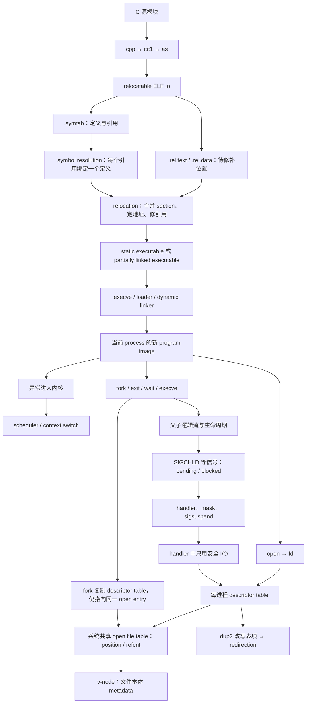


> **主线：** Linking → Exceptions / Processes → Signals → System-Level I/O
>
> **证据范围：** 本模块只综合 Lecture 13–16 的 `NOTES.md`。凡课堂口述、课件和转写不能共同确认之处，均保留为“课堂简化”“课件补充”“需回听”或“本材料未展开”，不以外部知识补齐。

## 证据与阅读约定

- [Lecture 13 NOTES：Linking](/courses/cmu-csapp-f15/lectures/013/)
- [Lecture 14 NOTES：Exceptional Control Flow: Exceptions and Processes](/courses/cmu-csapp-f15/lectures/014/)
- [Lecture 15 NOTES：Exceptional Control Flow: Signals and Nonlocal Jumps](/courses/cmu-csapp-f15/lectures/015/)
- [Lecture 16 NOTES：System-Level I/O](/courses/cmu-csapp-f15/lectures/016/)

下文用 **L13–L16** 指代上述四份笔记。跨讲连接只在两端材料都提供支撑时建立。例如，L13 把 `execve` 放在 loader / dynamic linker 的装载链上，L14 又明确说明 `execve` 在当前进程中替换 program image；因此可以把它作为“磁盘上的 executable → 运行中的 process”之桥，但不能据此补写课堂未讲的完整内核实现。

## 模块目的

本模块要回答一个连续问题：**一组源文件怎样变成可执行文件，这个文件怎样成为受内核管理的运行实例，运行实例怎样被异步事件控制，又怎样通过文件描述符持有和改变 I/O 状态？**

学完后，应能把四讲看成一条状态演化链，而不是四组孤立 API：

1. **Linking** 决定 executable 中“名字绑定到谁、字节放在哪里、引用怎样修补”。
2. **Exceptions / Processes** 决定 executable 何时成为某个 process 的 program image，以及内核怎样取得控制、切换、创建、终止和回收进程。
3. **Signals** 决定内核怎样把异步事件通知给应用，以及应用怎样在不依赖调度运气的前提下处理共享状态和等待条件。
4. **System-Level I/O** 决定进程中的小整数 fd 实际指向什么、哪些状态会被 `fork` 共享、哪些引用会被 `dup2` 改写，以及数据怎样可靠传输。

## 先修知识

- 能读简单 C：函数声明/定义、全局与局部变量、数组、指针、函数指针、`struct`、循环和条件分支。
- 能区分 source、assembly、relocatable object、executable，能读少量 x86-64 `mov`、`callq` 和寄存器参数。
- 会做小规模十六进制加法，知道 `%rip`、stack、heap、code/data 的基本角色。
- 理解 bit vector、按位与 `&`、按位取反 `~`，可把集合变化写成位状态变化。
- 知道普通函数调用/返回、系统调用进入内核、错误返回与 `errno` 的基本观念。
- 能使用 shell 命令行，认识前后台作业、标准输入/输出/错误和 `>` 重定向的表面行为。

## 四讲推进

| 讲次 | 起点问题 | 核心机制 | 留给下一讲的状态 |
|---|---|---|---|
| L13 Linking | 多个独立 `.o` 怎样成为 executable？ | symbol resolution、relocation、ELF、static/shared linking | 磁盘上可装载或待动态补全的 executable；`execve`/loader 将接手 |
| L14 Exceptions / Processes | executable 怎样执行，内核怎样介入？ | exceptions、context switch、process、`fork`、`wait`、`execve` | 并发父子进程、可保留的 PID/open files、需异步回收的后台 child |
| L15 Signals | parent 不同步等待时，怎样获知 child 终止？ | pending/blocked、handler、mask、`SIGCHLD`、`sigsuspend` | 在调度不可预测时仍有明确先行关系的进程控制；handler 受限的 I/O 需求 |
| L16 System-Level I/O | fd 背后有哪些共享状态，怎样可靠读写？ | Unix I/O、RIO、descriptor/open-file/v-node 三表、`dup2` | 可逐操作追踪的文件位置、引用计数、缓冲进度与重定向状态 |

### 三个接力点

1. **L13 → L14：`execve`。** L13 说明 loader 装入 executable 和所需 `.so`，并由 dynamic linker 完成延迟的解析/重定位；L14 说明成功 `execve` 替换当前 process 的 code/data/stack，正常不返回，但保留同一 PID 和已打开文件。
2. **L14 → L15：后台 child。** L14 说明 terminated child 在 parent 回收前是 zombie，`wait`/`waitpid` 才完成 reaping；L15 用不能同步等待后台作业的 shell 推出 `SIGCHLD` 异步通知。
3. **L15 → L16：受限 handler 与 fd 状态。** L15 说明 handler 只能调用 async-signal-safe 函数，课程安全输出最终落到 `write`；L16 解释 `write` 操作的 fd、打开项和文件位置，并说明 `fork`/`exec` 前后的描述符关系。

## 依赖地图：从 executable 构造到 I/O 状态



### 必须保持的七个不变量

1. **名字不等于地址。** `.symtab` 回答“是谁”，relocation entry 回答“哪里以后要改”；最终地址要到链接/装载阶段才能落实。
2. **program 不等于 process。** Program 是代码/文件表示；process 是其运行实例，并携带寄存器、地址空间、PID、信号状态和描述符表等运行状态。
3. **`fork` 不等于 `execve`。** `fork` 创建 child；`execve` 不创建 process，而在当前 process 中替换 program。
4. **发送不等于接收。** Signal delivery 只更新 pending 状态；内核在返回用户态前才根据 blocked mask 决定能否 receive。
5. **通知不等于计数。** 同类普通信号只有一个 pending bit；一次 `SIGCHLD` 接收只能推出“至少一个 child 发生相关事件”。
6. **fd 不等于文件。** fd 是当前进程 descriptor table 的索引；共享与否由表项是否指向同一个 open file entry 决定。
7. **一次调用不等于完成请求量。** `read`/`write` 可合法 short count；可靠循环和缓冲分别解决“完成量”与“系统调用次数”问题。

## 第一阶段：Linking，把名字和位置落实为 executable

### 1. 构建流水线与 linker 的两项工作

L13 的贯穿例子可压缩为：

```c
/* main.c */
int sum(int *a, int n);
int array[2] = {1, 2};

int main(void)
{
    return sum(array, 2);
}

/* sum.c */
int sum(int *a, int n)
{
    int i, s = 0;
    for (i = 0; i < n; i++)
        s += a[i];
    return s;
}
```

```text
main.c → cpp → cc1 → as → main.o
sum.c  → cpp → cc1 → as → sum.o
main.o + sum.o → ld → prog
```

- **Symbol resolution：** 每个 symbol reference 必须绑定到 exactly one definition。
- **Relocation：** 合并同类 sections，为 definitions 选择最终位置，再修补所有 references。

两步有严格先后：若还没决定 `sum` 引用绑定哪个 definition，就不能为该引用写入最终目标。

### 2. 符号分类与 strong / weak 推导

从当前 module `m` 看：

```text
在 m 定义，可被其他 module 引用   → global symbol
在 m 引用，由其他 module 定义     → external symbol
只在 m 内定义和引用               → local linker symbol
普通函数局部变量                  → 由 compiler 管理，不是 linker symbol
```

函数和 initialized globals 是 strong；uninitialized globals 是 weak。L13 给出的解析规则是：

```text
strong + strong              → linker error
one strong + weak(s)         → 选择 strong
weak + weak                  → 任意选择一个
```

危险来自两个 module 已经分别按各自 C 声明生成访问宽度，而 linker 主要按名字选地址。课堂最终纠错是：

```text
p1: initialized int x = 7  → strong，object 大小 4 bytes
p2: double x               → compiler 生成 8-byte write
linker 选择 p1 的 x 地址
结果：8-byte write 落在 4-byte object 上，并覆盖相邻 y
```

这是 00:25:25–00:31:09 现场来回后的最终版本；中间“幻灯片不对”的暂时改口不能替代最终纠正。由此得到 L13 的编程准则：尽量避免 globals；能加 `static` 就加；定义 global 时初始化；引用外部 global 时写 `extern`。

### 3. ELF 信息怎样支撑两步链接

| 信息 | ELF 中的位置 | 作用 |
|---|---|---|
| 机器代码 / 只读数据 | `.text` / `.rodata` | 待合并的只读内容 |
| initialized / uninitialized globals | `.data` / `.bss` | 保存初值或仅声明装载时所需空间 |
| symbol 名称、大小、位置 | `.symtab` | 支撑 symbol resolution |
| 代码/数据中的待修补引用 | `.rel.text` / `.rel.data` | 支撑 relocation |
| executable 的内存段信息 | segment header table | 指导装载时的 segment 放置 |

`.bss` 不为未初始化值占 object-file 初值空间，但运行时仍占内存。不能把“文件里省空间”推成“内存里不存在”。

### 4. 两条 relocation 的具体推导

`main.o` 中 `array` 的地址字段起初为 0：

```text
9:  bf 00 00 00 00       mov $0x0,%edi
       a: R_X86_64_32 array
```

Entry 告诉 linker：从 `.text + 0xa` 开始的 4-byte field 是 `array` 的 absolute reference。链接后该字段成为 `0x601018`。

`sum` 的 call 采用 PC-relative reference：

```text
e:  e8 00 00 00 00       callq 13 <main+0x13>
       f: R_X86_64_PC32 sum-0x4
```

链接后的课堂数值是：

```text
call instruction:          0x4004de
next instruction:          0x4004e3
patched displacement:      0x5
sum:                       0x4004e8

0x4004e8 = 0x4004e3 + 0x5
```

这里 `0x5` 是相对下一条指令的 displacement，不是 `sum` 的 absolute address；entry 中的 `-0x4` bias 与最终写入的 `0x5` 也不是同一个量。课堂没有给一般化 relocation 代数公式，本模块不补造通式。

### 5. 从 fully linked file 到装载

L13 的课堂地址空间图把 executable sections 映射到 read-only code、read/write data，并在其上方放 heap、shared-library mapped region、向下增长的 stack 与 kernel-only memory。老师明确称它为 simplification，并对 large-object allocation 原因只给猜测；不得把图当作所有 Linux 程序的完整固定布局。

动态链接时，L13 给出的概念链是：

```text
static linker
  → 在磁盘 executable 中记录 needed .so 与 relocation/symbol information
  → loader / execve 装入 executable 与 .so
  → ld-linux.so 完成剩余 symbol resolution / relocation
  → 内存中的 fully linked program
```

这正好把“构造 executable”交给下一阶段的“运行 process”。

## 第二阶段：Exceptions / Processes，让 executable 成为受控执行

### 1. 内核为什么能打断普通控制流

普通 branch/jump/call/return 只根据 program state 改变控制流，无法独立处理 timer、设备到达、非法指令或系统调用请求。L14 的一般路径是：

```text
event
  → exception number k
  → exception table[k]
  → kernel handler k
  → {重新执行 I_current；执行 I_next；终止当前程序}
```

| 类型 | 来源与意图 | 典型返回位置 | 课堂例子 |
|---|---|---|---|
| interrupt | 处理器外部、异步 | `I_next` | timer、I/O 到达 |
| trap | 当前程序有意触发 | `I_next` | system call |
| fault | 无意、可能恢复 | `I_current` 或 abort | page fault / protection fault |
| abort | 无意、不可恢复 | 不返回原程序 | illegal instruction 等 |

系统调用因此不是普通用户函数直接进入内核：wrapper 准备 system-call ID 和参数寄存器，执行 `syscall` trap，再从 `%rax` 取结果。L14 的 x86-64 课堂表为 `%rax` 放 ID/返回值，六个参数依次用 `%rdi,%rsi,%rdx,%r10,%r8,%r9`。

### 2. Process 的两项抽象与 context switch

Process 是 running program 的一个实例，不是 program 文件，也不是 processor。它给程序两项假象：

| 抽象 | 程序看到的效果 | 支撑机制 |
|---|---|---|
| logical control flow | 仿佛独占 CPU / registers | context switching |
| private address space | 仿佛独占 memory | virtual memory |

一次课堂版 context switch：

```text
process A user code
  → exception
  → kernel 保存 A registers
  → scheduler 选择 B
  → 切换 address space，恢复 B registers
  → process B 从上次暂停处继续
```

Kernel 是共享的驻留代码，不是另一个独立 process。并发按 logical-flow 生命周期是否重叠判断，不要求多核同一时刻物理并行。

### 3. `fork`：复制状态，但产生两个逻辑流

`fork` 的课堂边界是“一次调用，两处返回”：

```text
return < 0  → 失败
return = 0  → child
return > 0  → parent，值为 child PID
```

返回瞬间：

```text
child memory contents == parent memory contents
child address space    != parent address space
child PID              != parent PID
child descriptors      == parent descriptor entries 的副本
```

父子后续对普通变量的写入互不影响，但描述符副本是否共享底层位置，要到 L16 的 open file table 才能精确解释。调度顺序没有“parent 先运行”的保证。

对多次 `fork`，L14 要求画 process graph：顶点是 statement execution，边是 happens-before，任一保持所有边方向的 topological sort 才是 feasible total order。两次连续 `fork` 的进程数是 `1 → 2 → 4`；仅数输出行不够，还要检查每条逻辑流的局部顺序。

### 4. `wait` / `waitpid`：同步与回收是同一条边

Child terminate 后仍保留 exit status 和少量 OS table state，直到 parent reap；这时它是 zombie。`wait(&status)`：

- 暂停到任意一个 child 终止；
- 返回该 child PID；
- 通过 `status` 输出终止信息；
- 先用 `WIFEXITED(status)` 判断，再用 `WEXITSTATUS(status)` 取正常 exit status。

`waitpid` 可指定 child；其完整 options 和状态编码不在 L14 课堂展开。`wait` 还建立同步边：parent 中 `wait` 后面的事件不能早于被回收 child 的终止。

### 5. `execve`：替换 program，不替换 process

```c
int execve(char *filename, char *argv[], char *envp[]);
```

L14 的边界：

```text
成功：替换当前 program 的 code/data/stack，建立新 heap/stack；不返回
失败：返回 -1，旧 program 才能继续错误路径
保留：同一 process、PID、open files
课件另列：signal context；口述未展开其具体字段
```

典型结构化示例（省略 declarations 和完整错误包装）是：

```c
pid_t pid = Fork();

if (pid == 0) {
    char *myargv[] = {"/bin/ls", "-lt", "/usr/include", NULL};
    execve(myargv[0], myargv, environ);
    _exit(1);                 /* 只会走到 execve 失败路径 */
}

waitpid(pid, NULL, 0);
```

`fork` 让 parent 保留原 program；child 在两步之间可先配置自己的状态，再由 `execve` 进入新 program。这个“配置窗口”会在 L15 用于 signal mask，在 L16 用于 I/O redirection。

## 第三阶段：Signals，在不可预测调度下建立可靠控制

### 1. 从后台 child 推导异步通知

前台作业可以让 shell 同步 `waitpid`；后台作业不能阻塞 shell 的 read/evaluate 循环，却仍必须在终止后回收。于是需要：

```text
child terminates
  → kernel sends SIGCHLD to parent
  → parent receives SIGCHLD and runs handler
  → handler calls wait / waitpid
  → zombie is reaped
```

Signal 只通知事件类型和“至少发生过”，不替 parent 完成 reaping。

### 2. pending / blocked 的位推导

对 signal type `k`：

```text
deliver(k): pending[k] ← 1
receive(k): pending[k] ← 0
blocked[k] = 1: 仍可 deliver，但暂不 receive
```

内核准备返回某 process 的用户态前计算：

```text
pnb = pending & ~blocked
```

- `pnb == 0`：没有当前可接收信号，恢复下一条用户指令。
- `pnb != 0`：课堂算法选择最小非零位 `k`，让进程接收该信号并触发动作，再处理其余置位。

同类普通 signal 只有一个 pending bit：若已经是 1，再 deliver 仍是 1。因此五个 child 的终止可以折叠成较少的 handler invocations，绝不能把 handler 次数当 child 数。

### 3. Handler 是同一进程中的并发逻辑流

Handler 不是独立 process；它与 main 共享 address space 和 global state。当前处理的同类 signal 被隐式阻塞，但其他类型仍可嵌套。因此 L15 给出 G0–G5：

1. Handler 尽可能简单。
2. 只调用 async-signal-safe functions。
3. 进入时保存 `errno`，退出前恢复。
4. Main 与 handler 访问共享结构时都要阻塞相关 signals。
5. 共享 globals 使用 `volatile`；只做单次读/写的 flag 使用 `volatile sig_atomic_t`。

`volatile` 解决 compiler 可见性，不提供互斥；`sig_atomic_t` 只保证简单 flag 的单次读/写，不保证 `flag++` 或复杂结构更新安全。`printf` 可因内部 lock 被异步重入而死锁；课堂 handler 输出使用 SIO / `write`，终止使用 `_exit` 而非 `exit`。

### 4. `SIGCHLD` handler 必须按状态回收，而非按通知计数

L15 的修正版结构是：

```c
void sigchld_handler(int sig)
{
    int olderrno = errno;
    pid_t pid;

    while ((pid = wait(NULL)) > 0) {
        ccount--;
        Sio_puts("Handler reaped child ");
        Sio_putl((long)pid);
        Sio_puts("\n");
    }
    if (errno != ECHILD)
        Sio_error("wait error");
    errno = olderrno;
}
```

该代码来自课堂示例的结构化合并：一次接收后循环回收当前所有可回收 children，`ECHILD` 是该循环的正常终点。它不是对所有 `wait`/`waitpid` 用法的完整通用模板。

### 5. Job-list 竞态：局部临界区正确仍不够

错误程序分别保护了 `addjob` 和 `deletejob`，却缺少跨操作顺序：

```text
parent: Fork
child:  execve → terminate
parent: receive SIGCHLD → handler deletejob(pid)  // 尚未 add
parent: addjob(pid)                               // 留下陈旧项
```

修复不是猜 parent 会先运行，而是在 `fork` 前阻塞 `SIGCHLD`：

```text
block(SIGCHLD)，保存 prev mask
→ Fork
   ├─ child:  恢复 prev mask → execve
   └─ parent: addjob(pid) → 恢复 prev mask
→ pending SIGCHLD 此后才可被 receive
→ handler deletejob(pid)
```

这建立了 `addjob(pid) happens-before deletejob(pid)`。若在 fork 后才阻塞，child 仍可能抢先终止，窗口已经存在。

### 6. 检查—睡眠竞态与 `sigsuspend`

```c
while (!pid)
    pause();
```

若目标 signal 恰在检查 `pid == 0` 之后、进入 `pause` 之前被接收，handler 已设置 `pid`，main 却仍进入等待，可能永久睡眠。`sigsuspend` 把“临时采用 mask”和“挂起”等待合成原子操作：

```c
Sigprocmask(SIG_BLOCK, &mask, &prev);  /* mask 含 SIGCHLD */
if (Fork() == 0)
    _exit(0);

pid = 0;
while (!pid)
    Sigsuspend(&prev);

Sigprocmask(SIG_SETMASK, &prev, NULL);
```

仍必须用 `while`，因为其他 signal 的 handler 也可能使 `sigsuspend` 返回，而目标条件尚未成立。

## 第四阶段：System-Level I/O，把进程状态落到 fd 与打开项

### 1. 文件抽象与返回值边界

L16 把长度为 $m$ 的文件表示成字节序列：

$$
B_0, B_1, \ldots, B_{m-1}
$$

普通文件、设备和 socket 共享 `open/close/read/write` 的低层接口形状，但能力不完全相同；终端和 socket 不能据此被假定支持普通文件式任意 `lseek`。

```text
pathname + flags --open--> fd
read(fd, buf, n)  : file → memory，推进 current file position
write(fd, buf, n) : memory → file，推进 current file position
close(fd)         : 删除该 descriptor 的一次打开引用
```

`read` 的返回值：

| 返回值 | 含义 |
|---:|---|
| `< 0` | error |
| `= 0` | EOF |
| `> 0` | 实际读到的字节数，可能小于请求量 |

文件还剩 100 bytes、请求 200 bytes 时，第一次可返回 100，下一次才返回 0。正 short count 不等于 EOF 指示；`write` 也可合法 short write。

### 2. `rio_readn` 的循环不变量

```c
ssize_t rio_readn(int fd, void *usrbuf, size_t n)
{
    size_t nleft = n;
    ssize_t nread;
    char *bufp = usrbuf;

    while (nleft > 0) {
        if ((nread = read(fd, bufp, nleft)) < 0) {
            if (errno == EINTR)
                nread = 0;
            else
                return -1;
        }
        else if (nread == 0)
            break;
        nleft -= nread;
        bufp += nread;
    }
    return n - nleft;
}
```

始终保持：

```text
nleft = 尚未完成的字节数
bufp  = 用户缓冲区下一待填位置
已完成量 = n - nleft
```

底层正 short read 使循环继续；`EINTR` 被重试；EOF 使其返回已读量；其他错误返回 `-1`。缓冲 RIO 还通过一次大 `read` 预取数据，令内核 file position 领先于应用消费位置，因此不能在同一 fd 上任意混用彼此不知情的 RIO、unbuffered read 和标准 I/O 缓冲。

### 3. 三表模型：共享关系由箭头决定

| 层次 | 作用域 | 保存什么 |
|---|---|---|
| descriptor table | 每 process 一张 | fd 条目，指向 open file entry |
| open file table | 系统共享 | current file position、`refcnt`、打开状态，指向 v-node |
| v-node table | 系统共享 | 文件类型、大小、权限等文件本体 metadata |

三种操作的结果：

| 操作 | descriptor table | open file entry | file position |
|---|---|---|---|
| 同一路径 `open` 两次 | 两个 fd | 两个独立 entry，共同指向同一 v-node | 独立 |
| `fork` | 父子各有表的副本 | 对应条目仍指向同一 entry，`refcnt` 增加 | 共享 |
| `dup2(4,1)` | fd 1 改为 fd 4 表项的副本 | fd 1、4 指向同一 entry | 共享 |

这补足了 L14 的 `fork` 描述符语义：复制的是每进程 descriptor table，底层打开实例没有因此复制，所以父读一字节后，child 会从共享位置的下一字节继续。

### 4. `dup2` 与 redirection 的引用计数推导

对 shell child 中的 `ls > foo.txt`：

```text
open("foo.txt", ...) → 假设 fd = 4
dup2(4, 1)
  → 先解除 fd 1 原先对终端 entry 的引用
  → fd 1 复制 fd 4 的表项
  → fd 1、fd 4 同指目标 entry，refcnt = 2
close(4)
  → 只删 fd 4 的引用，refcnt = 1
execve(...)
  → 新 program 仍持有 fd 1
write(1, ...)
  → 数据进入 foo.txt
```

`dup2(oldfd,newfd)` 的方向是“让 `newfd` 访问 `oldfd` 当前访问的对象”。关闭 4 不会使 1 失效，因为它们是两条独立 descriptor references。

### 5. 接口选择必须服从执行环境和数据模型

| 场景 | 课堂首选 | 原因 |
|---|---|---|
| 日常磁盘文件 / 终端 | standard I/O | 高层、缓冲、接口丰富 |
| signal handler | Unix I/O | `write` 等低层函数在课堂安全名单中 |
| network socket | RIO | 明确处理常见 short count |
| 极少数绝对性能需求 | Unix I/O | 最低额外层，但应用承担细节 |

二进制数据可以合法包含 `0x0A` 和 `0x00`，不能交给会把它们解释为行尾或字符串结尾的 `rio_readlineb`、`fgets`、`strlen` 等接口。选接口前先判断数据模型，而不是只凭熟悉程度。

## 综合贯通：后台重定向命令的一条完整状态链

以下是把四讲已有机制合成的概念追踪，不是某一页课件给出的完整 shell 实现。设 shell 要运行一个已构建程序，并把 stdout 重定向到文件，同时不阻塞主循环：

```text
command > out &
```

1. **构建期（L13）**：各 source 分别形成 `.o`；linker 解析 symbols、执行 relocation，生成 executable，或生成留待 dynamic linker 补全的 executable。
2. **创建前（L15）**：shell 在 `fork` 前阻塞 `SIGCHLD`，保存旧 mask，避免 child 先终止而 handler 先删作业。
3. **创建（L14）**：`fork` 产生 parent/child 两条逻辑流；child 得到地址空间内容副本和 descriptor table 副本。
4. **重定向（L16）**：child `open("out",...)`，用 `dup2(fd,STDOUT_FILENO)` 改写 descriptor table，再关闭多余 fd。
5. **child 配置收尾（L15）**：child 在 `execve` 前恢复旧 signal mask，避免把 shell 的临时阻塞策略带入新 program。
6. **装载（L13 + L14）**：child 调用 `execve`；loader 装入 executable / needed `.so`，dynamic linker 完成待处理引用。成功后仍是同一 child PID，且重定向后的 fd 1 得以保留。
7. **执行与 I/O（L16）**：新 program 写 `STDOUT_FILENO`；fd 1 已指向 `out` 的 open file entry，所以字节进入文件并推进该 entry 的 position。
8. **parent 登记（L15）**：parent 在 `SIGCHLD` 仍 blocked 时 `addjob(pid)`，随后恢复旧 mask；这才允许 pending `SIGCHLD` 被接收。
9. **异步终止（L14 + L15）**：child 终止后成为尚待回收的状态；内核 deliver `SIGCHLD`。Shell 接收后运行安全 handler，循环 `wait`/`waitpid`，完成 reaping 和 `deletejob`。
10. **继续服务（L15）**：后台路径没有让 shell 同步等待，read/evaluate 主循环可继续；正确性来自 mask 和 handler 的先行关系，而不是来自 parent “通常更快”。

这一链上有四类不同的“引用”，不能混淆：source 中的 symbol reference、机器码中的 relocation field、process table 中的 parent/child 关系、descriptor table 中指向 open file entry 的引用。

## 结论边界与保留的不确定性

### L13

- Strong/weak 类型错配以 00:30:37–00:31:09 的最终纠错为准；此前现场改口是证据链的一部分。
- `R_X86_64_32` / `R_X86_64_PC32` 只按课堂两个具体例子解释；课堂没有给一般化 relocation 公式。
- Static archive 的左到右 unresolved-set 算法是课堂模型，不能无条件外推到所有 linker inputs 与实现。
- Address-space 图明确是 simplification；large-object allocation 的原因只是老师猜测。
- L13 transcript 在 01:21:22.70 结束，metadata 多出的约 10.30 秒没有可补造内容。

### L14

- `waitpid` 的完整 options、wait-status 位编码、virtual-memory 内部机制与 signal 细节未展开。
- 课件列 `execve` 保留 signal context，但口述没有解释具体字段；本模块不推导 disposition/mask 的全部规则。
- 末尾 transcript 把 external/internal 分类出现冲突；应按课件和前文采用 external interrupts、internal traps/faults，并保留“需回听”。
- Process graph 的 nested-in-children 版本被留作练习，不能写成老师已完成逐节点推导。

### L15

- 视频主体是 signals；`setjmp`/`longjmp` 的寄存器恢复、栈纪律和 `restart.c` 来自老师指定的补充课件 p.48–54，不是视频逐页讲授。
- 课堂以 pending/blocked bit vectors 解释普通信号；不外推 realtime signals、其他平台优先级或排队机制。
- `sig_atomic_t` 只覆盖简单 flag 的单次读/写；材料没有支持把复合更新视为原子。
- 正确 child-reaping 代码按课堂的 `wait` / `ECHILD` 示例保留；本模块不添加课堂未讨论的 flags。
- `while (!pid)` 与转写中一次相反口述冲突；代码、上下文与课件均支持 pid 为 0 时继续等待。

### L16

- 三表图是课程概念模型；不补写具体内核实现、缓存驻留或平台差异。
- `st_ctime` 在课件中是 “last change”，不能按口述中的 “created” 记为创建时间。
- p.49 / p.50 只被展示为练习，老师没有给最终输出；p.51 / p.52 没有对应课堂转录，不能冒充讲授内容。
- 课堂说终端/网络、标准 I/O/RIO 的选型时给的是课程规则；本模块不扩展未讲的 socket flags 或 stream 实现细节。

## 高频误解与竞态

| 错误直觉 | 正确推理 |
|---|---|
| `.o` 已经是可执行程序 | `.o` 是 relocatable object，仍需 symbol resolution 与 relocation |
| `#include` 把 library implementation 链进程序 | `#include` 在 preprocessing 展开；library code 由 linking 处理 |
| Linker 会检查同名 globals 的 C 类型 | 课堂 puzzle 证明访问宽度与被选 object 大小可能不一致 |
| `.bss` 不占文件初值空间，所以不占内存 | Loader 仍须为其建立运行时内存 |
| `0x5` 是 `sum` 的地址 | 它是相对 next `%rip` 的 displacement |
| Program 和 process 是同一对象 | Process 是 running program 的实例，另有运行状态 |
| `fork` 会在 parent/child 各调用一次 | 调用一次、两处返回 |
| Parent 一定先于 child 执行 | 调度无此保证；必须用 graph/mask 建立顺序 |
| `execve` 创建新 process | 它在当前 process 中替换 program，成功不返回 |
| `wait` 返回 exit status | 返回 child PID；status 通过指针和 macros 解释 |
| Signal send 后 handler 立即运行 | Send 只置 pending；receive 取决于 blocked mask 和内核返回用户态时机 |
| 五个 `SIGCHLD` 等于五次 handler | 同类 pending bit 会合并；一次 handler 要检查全部可回收状态 |
| Handler 是另一个 process | 它是同一 process 的并发逻辑流，共享 globals |
| `printf` 在 handler 中只是慢 | 它可能因内部 lock 的异步重入而 deadlock |
| 分别保护 `addjob` / `deletejob` 就足够 | 还需保证 add happens-before delete；在 fork 前阻塞 `SIGCHLD` |
| `while (!pid) pause()` 没有忙等，所以正确 | 检查与睡眠之间有 lost-wakeup race；使用 `sigsuspend` |
| fd 是 pathname 或文件指针 | fd 是每进程 descriptor table 的整数索引 |
| 同一路径两次 `open` 必共享位置 | 两次 `open` 产生两个 open file entries，位置独立 |
| `fork` 后 fd 的位置各自独立 | 父子表项指向同一 open file entry，位置共享 |
| `dup2(4,1)` 让 4 指向 1 | 它让 newfd 1 复制 oldfd 4 的表项 |
| `read` 少于请求量就是错误或 EOF | 正 short count 是实际完成量；0 才是 EOF 指示 |
| 两套缓冲接口可随意混用 | 各自预取且互不知情，会使逻辑位置失配 |
| 文本函数处理二进制只是性能较差 | `0x0A` / `0x00` 会被赋予终止语义，属于数据错误 |

## 掌握检查表

- [ ] 能从两个 C modules 画出 `cpp → cc1 → as → ld`，并区分 symbol resolution 与 relocation。
- [ ] 能从指定 module 视角判断 global / external / local linker symbol，且不把普通 stack local 算进去。
- [ ] 能应用 strong/weak 三条规则，并复述 8-byte write 覆盖 4-byte object 的最终纠错。
- [ ] 能在 `main.o` 中定位 `array` absolute field 与 `sum` PC-relative field，并手算 `0x4004e3 + 0x5`。
- [ ] 能解释 static executable、partially linked executable、loader 与 dynamic linker 的课堂分工。
- [ ] 能区分 interrupt / trap / fault / abort，并画出 exception handler 三种出口。
- [ ] 能用 logical flow/private address space 说明 process 两项抽象，并复述 context switch。
- [ ] 能对含 `fork` 的代码画 process graph，而不是猜测 scheduler。
- [ ] 能区分 zombie、active orphan、`wait` 返回 PID 与 status 输出。
- [ ] 能说明 `fork` 创建 process、`execve` 替换 program，并列出 PID/open files 的保留边界。
- [ ] 能从 pending/blocked 算出 `pnb`，说明 send、receive 和 non-queued semantics。
- [ ] 能审查 handler 的 `errno`、安全函数、共享结构 mask 和 flag 类型。
- [ ] 能写出 child-before-addjob 与 check-before-pause 两条精确失败交错及其修复。
- [ ] 能逐轮解释 `rio_readn` 的 `nleft`、`bufp` 与返回值。
- [ ] 能画 descriptor/open-file/v-node 三表，并分别追踪两次 `open`、`fork`、`dup2`。
- [ ] 能从 `open → dup2 → close → execve → write` 推导 shell 重定向，不把 fd 号码当成文件本体。
- [ ] 能为磁盘、signal handler、network socket 和 binary data 选择课堂推荐接口并说明边界。
- [ ] 能明确指出哪些结论来自课堂口述，哪些只来自补充课件或仍需回听。

## 15 道累计练习（含简答）

### 1. 从 source 到 executable

**题目：** `main.c` 引用 `sum`，`sum.c` 定义 `sum`。写出构建链，并说明 linker 两项工作的先后。

**简答：** 两个 `.c` 各经 `cpp → cc1 → as` 得 `.o`；先把 `sum` reference 解析到唯一 definition，再合并 sections、决定地址并修补引用，得到 executable。

### 2. 符号分类与冲突

**题目：** Module A 定义 initialized `int x=7`，Module B 以 uninitialized `double x` 使用同名符号。Linker 选谁，风险是什么？

**简答：** Initialized global 是 strong，uninitialized global 是 weak，所以选 A 的 4-byte `x`；B 已按 `double` 生成 8-byte access，可能覆盖相邻对象。

### 3. Relocation 手算

**题目：** Linked code 中 next instruction 为 `0x4004e3`，`callq` field 为 `0x5`。目标是什么？为什么不能把 `0x5` 当 absolute address？

**简答：** 目标为 `0x4004e3 + 0x5 = 0x4004e8`；该 field 是 PC-relative displacement，基准是下一条指令。

### 4. Static archive 顺序

**题目：** `libtest.o` 引用 `libmine.a` 中的 `libfun`。为什么 `gcc -L. libtest.o -lmine` 成功，而反序失败？

**简答：** 正序先把 `libfun` 加入 unresolved set，再由 archive member 解决；反序扫 archive 时尚无需求，之后才出现 unresolved reference，课堂单向扫描结束时仍未解决。

### 5. Dynamic loading 与 `execve`

**题目：** 把 L13 的 load-time dynamic linking 与 L14 的 `execve` 语义连成一条链。

**简答：** `execve` 在当前 process 中替换 program；loader 装入 executable 和 needed `.so`，`ld-linux.so` 完成剩余解析/重定位，成功后从新 program 开始且旧调用不返回。该连接是课堂概念链，不是完整内核实现说明。

### 6. Exception 分类

**题目：** 分别分类 timer 到期、`syscall`、合法地址但页面不在内存、非法指令，并写 handler 后去向。

**简答：** Timer 是 external interrupt，回 `I_next`；`syscall` 是 intentional trap，回 `I_next`；缺页是可能恢复的 fault，装页后重试 `I_current`；非法指令是 abort，不返回原程序。

### 7. 两次 `fork`

**题目：** `printf("L0"); fork(); printf("L1"); fork(); printf("Bye");` 各打印几次？为什么数量仍不足以判断某个完整输出是否可行？

**简答：** `L0/L1/Bye` 分别 1/2/4 次；候选输出还必须是 process graph 的拓扑排序，不能违反任一 logical flow 的 happens-before 边。

### 8. `fork` + `execve` 的状态

**题目：** Child 在 `fork` 后 `execve` 成功。哪些课堂状态相同或保留，哪些被替换？

**简答：** 仍是同一 child process，PID 和 open files 保留；旧 program 的 code/data/stack 被新 program 替换，并建立新 heap/stack；成功不回到旧代码。

### 9. Zombie 与 `wait`

**题目：** Child 已 `exit(7)`，parent 尚未等待。它是什么状态？`wait(&status)` 的两个输出是什么？

**简答：** Child 是未 reap 的 zombie；函数返回 child PID，`status` 接收终止编码。先检查 `WIFEXITED(status)`，再用 `WEXITSTATUS(status)` 取 7。

### 10. 计算 `pnb`

**题目：** `pending={SIGCHLD,SIGINT}`，`blocked={SIGCHLD}`。当前 `pnb` 是什么？`SIGCHLD` 是否丢失？

**简答：** `pnb={SIGINT}`；`SIGCHLD` 仍 pending，只是当前不能 receive，解除阻塞后才可处理。

### 11. 五个 children 与一次通知

**题目：** 五个 child 很快终止，parent 只接收一次 `SIGCHLD`。Handler 应做什么，为什么？

**简答：** 循环 `wait`/`waitpid` 检查并回收当前全部可回收 children；普通同类信号不排队，一次接收只保证至少一个事件发生。

### 12. Job-list 竞态

**题目：** 写出“先删后加”的最短失败交错，并给出修复顺序。

**简答：** `Fork → child terminate → handler deletejob → parent addjob`。修复为 fork 前阻塞 `SIGCHLD`；parent `addjob` 后恢复 mask，child 在 `execve` 前恢复自己的旧 mask。

### 13. Lost wakeup

**题目：** 为什么 `while (!pid) pause();` 可能永久睡眠？`sigsuspend` 改变了什么？

**简答：** 目标信号可在条件检查后、`pause` 前到达；handler 已设 `pid`，main 仍睡下。`sigsuspend` 原子地临时换 mask 并等待，消除该窗口；仍需循环防其他 signal 唤醒。

### 14. 两次 `open` 与一次 `fork`

**题目：** 同一路径 `open` 两次得到 fd 3、4，然后 `fork`。哪些 file positions 独立，哪些共享？

**简答：** fd 3 与 fd 4 起初指向两个 open file entries，彼此位置独立；fork 后 parent/child 的 fd 3 共同指向 entry 3，parent/child 的 fd 4 共同指向 entry 4，所以每一对父子别名共享各自位置。

### 15. 全链追踪：`cmd > out &`

**题目：** 按四讲顺序概述从 `cmd` 的源模块到后台执行、重定向、终止和回收。

**简答：** L13 编译/链接并在装载时完成必要动态修补；L14 shell `fork`，child `execve`；L15 fork 前阻塞 `SIGCHLD`、parent 登记后解除；L16 child 在 exec 前 `open/dup2/close`，新 program 的 fd 1 写入 `out`；child 终止后 L15 handler 收到通知并用 L14 的 `wait`/`waitpid` 回收。

## 复习顺序

1. **第一遍：只画总链。** 不看 API 细节，默画 `source → .o → executable → execve → process → signal → fd/open entry`，并说出每条箭头改变的状态。
2. **第二遍：名字与地址。** 复习 L13 的 global/external/local、strong/weak、`.symtab/.rel.*`，手算 `array` 与 `sum` 两条 relocation。
3. **第三遍：控制权。** 复习 L14 的 exception 分类、context switch、`fork` graph、zombie/`wait`、`execve` 替换边界。
4. **第四遍：异步顺序。** 复习 L15 的 pending/blocked、`pnb`、handler 安全；完整写出 child-before-addjob 和 check-before-pause 两条失败交错。
5. **第五遍：I/O 状态。** 复习 L16 的返回值、RIO invariant、三表模型；分别画两次 `open`、`fork`、`dup2(4,1)` 的箭头和 `refcnt`。
6. **第六遍：跑一条综合场景。** 从 `cmd > out &` 开始，逐步标注 program image、PID、mask、pending bit、descriptor table、open entry position 和 reaping 时点。
7. **第七遍：做 15 题但遮住答案。** 错题按“名字/地址、控制流、异步顺序、I/O 状态”四类归因，不按讲次孤立重背。
8. **最后做证据审计。** 回到四份 NOTES 的 `[需回听]`、课堂纠错、补充课件和未讲附页；能明确说出什么已确认、什么只是课堂模型、什么仍不能确定。

