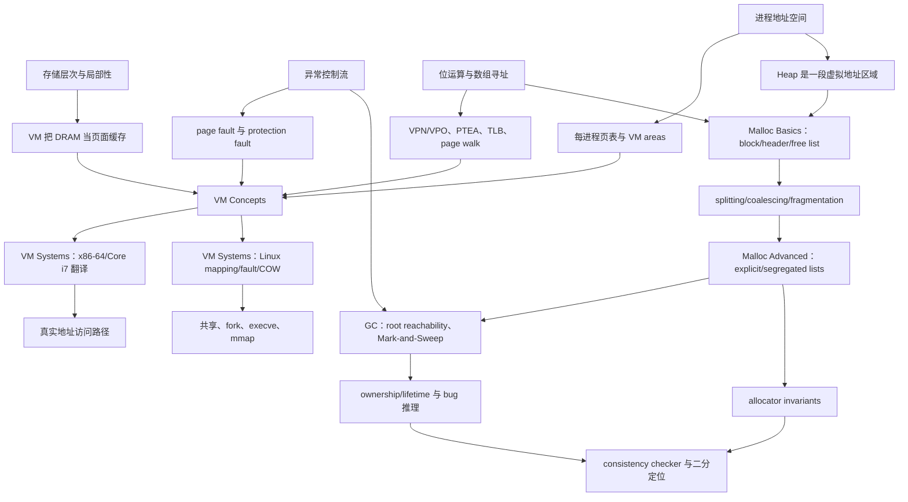


> 学习路线：**VM Concepts → VM Systems → Malloc Basics → Malloc Advanced**  
> 证据范围：本指南只重组 Lecture 17–20 的课堂笔记、对应课件摘录与笔记中明确标出的推导；不补入教材、体系结构手册或现代实现细节。

## 来源与证据约定

本模块必须与以下四份原始笔记配合使用：

1. [Lecture 17 NOTES：Virtual Memory: Concepts](/courses/cmu-csapp-f15/lectures/017/)
2. [Lecture 18 NOTES：Virtual Memory: Systems](/courses/cmu-csapp-f15/lectures/018/)
3. [Lecture 19 NOTES：Dynamic Memory Allocation: Basic Concepts](/courses/cmu-csapp-f15/lectures/019/)
4. [Lecture 20 NOTES：Dynamic Memory Allocation: Advanced Concepts](/courses/cmu-csapp-f15/lectures/020/)

本指南使用三种证据强度：

- **课堂结论**：原笔记能由口述和/或对应课件稳定核对。
- **课件补充**：页面中存在，但老师未必逐项口述；不能改写成“老师明确说过”。
- **保留不确定性**：原笔记标为 `[需回听]`、口述自我修正、ASR 噪声、课件与口述不一致，或老师明确表示“不确定”。本指南只保留可确认的最小结论。

若本指南与四份 `NOTES.md` 的证据标记发生冲突，以原笔记的时间戳、课件页和边界说明为准。

## 一、用途、边界与先修

### 1. 学习用途

这个模块要把两层看似不同的内存管理连成一条链：

1. **虚拟内存层**把 CPU 产生的虚拟地址翻译成物理地址，并借同一映射机制完成页面缓存、进程隔离、保护、共享和按需装载。
2. **动态分配层**在进程堆这一段虚拟地址空间中管理 variable-sized blocks，回答“哪段可交给应用、怎样回收、怎样减少搜索和碎片”。
3. **自动回收与错误推理层**把“谁负责释放”从应用扩展到 garbage collector，再把 allocator invariants 用于定位内存破坏。

学完后，不应只会背术语，而应能沿事件顺序解释：一个地址如何被翻译、一个缺页如何被判定和恢复、一个堆请求如何找到块、一次释放如何合并、一次错误写为何可能很晚才崩溃。

### 2. 本模块不覆盖的内容

- Lecture 17 没有可靠展开的 segmentation 精确公式。
- 笔记未确认的真实 PTE 位布局、Linux fault handler 源码、TLB 微架构和替换算法。
- Lecture 20 课件只列名但课堂未展开的 reference counting、copying/generational GC 细节。
- 任何不在四份笔记中的 allocator、GC、攻击防护或调试工具机制。

### 3. 先修知识

建议先具备：

1. **二进制与位运算**：$2^p$ 个位置需要 $p$ 位；mask、低位对齐、`base + index × element size`。
2. **存储层次**：block、tag/index/offset、hit/miss、miss penalty、相联度、write-back、局部性。
3. **异常控制流**：硬件异常进入内核 handler；可恢复异常可返回并重启 faulting instruction。
4. **进程与地址空间**：代码、数据、堆、映射区、栈、内核区域；进程具有独立上下文。
5. **链接与加载**：ELF、`.text`、`.data`、`.bss`、`execve` 的基本角色。
6. **C 指针与对象生命周期**：数组、typed pointer arithmetic、栈帧、heap object、`malloc`/`free` 接口。
7. **基本数据结构**：数组、双向链表、树和有向图；能够区分物理邻接与逻辑链接。

## 二、知识依赖图



两次“局部性”必须分开理解：数据页局部性让 working set 留在 DRAM；翻译局部性让近期 PTE/translation 留在 TLB。两次“邻接”也必须分开：页表映射连接 VA 与 PA；allocator 的物理相邻块则决定能否 coalesce。

## 三、总路线：四讲如何接起来

| 阶段 | 核心问题 | 结束时应能回答 |
| --- | --- | --- |
| VM Concepts | 为什么要翻译地址，页表怎样同时承载驻留、映射与权限 | `VA → PTE/TLB → PA` 怎样运行，何时 hit/fault |
| VM Systems | 真实硬件和 Linux 怎样使用这些抽象 | 四级 page walk、VMA fault 判定、shared/COW/`mmap` 怎样串联 |
| Malloc Basics | 应用怎样在 heap 内申请和归还 variable-sized blocks | header、placement、splitting、coalescing、fragmentation 怎样互相制约 |
| Malloc Advanced | 怎样缩小搜索、自动找垃圾并定位破坏 | explicit/seglist、Mark-and-Sweep、memory bug 与 checker 怎样推理 |

---

## 四、阶段一：VM Concepts

> 主来源：[Lecture 17 NOTES](/courses/cmu-csapp-f15/lectures/017/)

### 4.1 从物理寻址到虚拟寻址

物理寻址模型中，CPU 的有效地址可直接作为 DRAM 字节数组的偏移。虚拟寻址则在访问路径上加入 MMU：

```text
CPU 产生 VA → MMU 翻译 → PA → cache/DRAM → data 返回 CPU
```

这是一种资源虚拟化：向使用者呈现不同于物理资源的视图，并在访问入口 interpose。Lecture 17 的 `VA 4100 → PA 4` 只说明 VA 与 PA 可以不同，不能由这两个数反推页大小或真实配置。

地址空间是**地址的集合**，不是地址处数据的集合：

$$
V=\{0,1,\ldots,N-1\},\qquad N=2^n
$$

$$
P_{addr}=\{0,1,\ldots,M-1\},\qquad M=2^m
$$

通常 $N>M$，但这是课堂给出的常见关系，不是定义要求。

### 4.2 VM 的三个目的由同一机制实现

1. **缓存**：只把虚拟空间当前需要的页面放入 DRAM，把 DRAM 看作磁盘/后备对象内容的 cache。
2. **管理**：每个进程看到统一的线性 VA 布局，内核却可把页面放入任意 PP、迁移页面或让多个进程共享 PP。
3. **保护**：MMU 已经检查每次翻译，因此可同时检查 user/supervisor、read、write、execute 等权限。

“虚拟内存只是内存不够时借磁盘”遗漏了后两项，也是本模块最先要消除的误解。

### 4.3 页、驻留状态与 DRAM cache

页大小为：

$$
P=2^p\ \text{bytes}
$$

虚拟页和物理页数量为：

$$
\#VP=\frac{2^n}{2^p}=2^{n-p},\qquad
\#PP=\frac{2^m}{2^p}=2^{m-p}.
$$

虚拟页有三种概念状态：

| 状态 | 含义 | 访问后果 |
| --- | --- | --- |
| cached | 已分配且当前驻留 DRAM | page hit |
| uncached | 已分配但当前不在 DRAM | 合法访问可引发 page fault |
| unallocated | 尚未分配 | 不能简单当作“从磁盘调入” |

磁盘 miss penalty 巨大，因而课堂从同一前提出发推导出：页面较大、DRAM cache 全相联、替换可由软件作较复杂选择、写策略采用 write-back。这里是因果链，不是四条孤立事实。

### 4.4 页表、PTE 与 page fault

每个进程有自己的页表；PTE $k$ 对应 VP $k$。概念模型中：

- valid/present 表明页面是否当前驻留；
- 驻留时，PTE 给出 PPN；
- 不驻留时，其余状态可关联后备位置或合法映射；
- 页表项还可携带访问权限。

**valid=0 不是单一语义。** 它可能对应合法但不驻留、文件/磁盘后备、未分配或非法状态。Lecture 17 没有给出足以区分所有情形的真实位布局；Lecture 18 再由 Linux VM area 帮助内核判定。

无 TLB 的 page hit 路径：

```text
CPU VA → MMU 计算 PTEA → cache/DRAM 返回 PTE
       → MMU 取得 PPN、拼出 PA → cache/DRAM 返回 data
```

page fault 路径：

```text
CPU VA → MMU 读 PTE → 页面不驻留 → page-fault exception
       → kernel 选择 victim → dirty 时写回
       → 调入目标页、更新 PTE
       → 返回并重启 faulting instruction → 再次访问成为 page hit
```

恢复点是原 faulting instruction，不是下一条指令。分配虚拟区域也不等于立刻占用等量 DRAM；首次触碰页面才触发 demand paging。

### 4.5 Locality、working set 与 thrashing

令进程 $i$ 的活跃页面集合为 $WS_i$，主存可容纳 $C$ 页。课堂给出的判断是：

$$
|WS_i|<C
\Longrightarrow
\text{经历 compulsory misses 后可稳定获得良好性能}
$$

多进程时：

$$
\sum_i|WS_i|>C
\Longrightarrow
\text{thrashing：页面持续换入换出}.
$$

working set 是某一时期活跃的页，不是程序自启动以来访问过的全部页。单个进程能放下也不足以保证全系统不抖动，必须比较并发进程工作集之和。

### 4.6 映射怎样支持放置、共享和固定布局

每个进程有独立映射：

$$
MAP_i(VP)=PP.
$$

所以不同进程的同一 VPN 可映射到不同 PP；内核也可有意让两个映射指向同一 PP。Lecture 17 的共享 `libc` 例子说明：两个进程各自在自己的 VA 中看到库页，但物理内存只需一份代码页。

统一 VA 布局还让链接器面向稳定地址工作。`execve` 可先建立 ELF 区段对应的虚拟映射，页面首次被取指或读写时再按需装入。概念上的“磁盘数组”并不要求每个 VP 预占磁盘块；课堂明确给出零填充规则、文件后备和匿名页/swap 等不同来源。

### 4.7 页级保护

PTE 可包含 SUP、READ、WRITE、EXEC 一类权限。MMU 在每次访问上同时完成翻译与检查：

- 用户代码不能访问 supervisor-only 页面；
- 只读代码页不能被写；
- 不可执行数据页不能被取指。

不合法访问触发异常，而不是生成一个仍可使用的 PA。Lecture 17 把不可执行页与代码注入/ROP 的课堂背景相连，但没有展开处理器版本或完整攻击防护体系。

### 4.8 单级地址翻译

虚拟地址和物理地址拆分为：

$$
VA=[VPN\mid VPO],\qquad PA=[PPN\mid PPO].
$$

若页大小为 $2^p$ 字节：

$$
VPN=\left\lfloor\frac{VA}{2^p}\right\rfloor,
\qquad
VPO=VA\bmod2^p.
$$

PTBR/CR3 给出当前进程页表的物理基址：

$$
PTEA=PTBR+VPN\times sizeof(PTE).
$$

有效 PTE 给出 PPN，而页内偏移保持不变：

$$
PPO=VPO,
\qquad
PA=PPN\cdot2^p+VPO.
$$

地址从 $2^p-1$ 加到 $2^p$ 时，VPO 从全 1 归零并向 VPN 进位，直观说明低 $p$ 位为何是页内偏移。

### 4.9 TLB 与普通 cache 必须分层判断

TLB 是 MMU 内缓存近期 PTE/translation 的组相联硬件 cache。若有 $T=2^t$ 个 sets：

$$
VA=[TLBT\mid TLBI\mid VPO],
$$

$$
VPN=[TLBT\mid TLBI],\qquad |TLBI|=t.
$$

TLBI 选 set，TLBT 在组内判定目标 VPN；VPO 不参与 translation lookup。

三层判断彼此独立：

1. **TLB hit/miss**：翻译是否在 TLB。
2. **page hit/fault**：页面是否驻留 DRAM、访问是否合法。
3. **普通 cache hit/miss**：PTE 或目标数据对应的物理 cache line 是否命中。

因此 `TLB miss + page hit` 完全合法：MMU 从内存页表取得 valid PTE、填入 TLB，然后继续形成 PA。TLB hit 省掉的是取 PTE 的访问，不是目标数据访问。

### 4.10 单级页表规模与多级 page walk

对 $n$ 位 VA、$2^p$ 字节页、每项 $E$ 字节：

$$
\text{single-level page-table size}=2^{n-p}E.
$$

课堂参数为 48 位 VA、4 KB $=2^{12}$ B 页、8 B $=2^3$ B PTE：

$$
2^{48-12}\times2^3=2^{39}\ \text{bytes}=512\ \text{GiB}.
$$

这是单进程页表元数据大小，不是虚拟页面内容大小。

多级页表把 VPN 拆开：

$$
VA=[VPN_1\mid VPN_2\mid\cdots\mid VPN_k\mid VPO].
$$

设 $B_1=PTBR$：

$$
PTEA_i=B_i+VPN_i\times sizeof(PTE).
$$

对 $i<k$：

$$
B_{i+1}=PTE_i.\text{next-table-base}.
$$

末级：

$$
PPN=PTE_k.PPN,\qquad PA=[PPN\mid VPO].
$$

空间收益来自“整片未使用 VA 区域不创建下级表”。顶层表仍完整存在；一张下级表只要被创建，内部仍是定长数组，可能含很多 null PTE。`VPN_2` 是二级表内 index，不是二级表 pointer；二级表 base 来自一级 PTE。

### 4.11 阶段一示例与证据边界

1. **VP 3 缺页、VP 4 被选为 victim**：只用于练习异常、写回、调入、PTE 更新和 instruction restart 的顺序；具体替换算法留给操作系统课程。
2. **2K code/data + 6K gap + 栈顶一页**：课堂示例只需一张一级表和三张二级表；它说明按已用区域付费，不代表每个进程固定使用四张表。
3. **48 位 VA 的 512 GiB 单级表**：结论来自给定页大小和 PTE 大小；不要把口头“几乎一 TB”替代精确计算。
4. **segmentation 旁支**：讲师口述有停顿、自我修正和 ASR 疑点，不能据此补出精确历史地址公式。
5. **TLB 替换时的 PTE write-back**：原笔记明确标记实现细节不充分，不能提升为通用 TLB 规则。
6. **Lecture 17 最终总结页**：课件可见，但老师没有逐项口述；应标为课件总结。

---

## 五、阶段二：VM Systems

> 主来源：[Lecture 18 NOTES](/courses/cmu-csapp-f15/lectures/018/)

### 5.1 用玩具系统走完整条翻译链

课堂简化系统参数：

| 部件 | 参数 | 位切分 |
| --- | --- | --- |
| 虚拟地址 | 14 bits，64 B pages | `VPN(8) | VPO(6)` |
| 物理地址 | 12 bits | `PPN(6) | PPO(6)` |
| TLB | 16 entries，4-way，4 sets | `VPN = TLBT(6) | TLBI(2)` |
| 物理 cache | direct-mapped，16 sets，4 B blocks | `PA = CT(6) | CI(4) | CO(2)` |

#### 示例 A：`VA = 0x03D4`

1. 拆 VA：VPN=`0x0F`，VPO=`0x14`。
2. 拆 VPN：TLBI=`0x3`，TLBT=`0x03`。
3. TLB set 3 中 valid tag 命中，返回 PPN=`0x0D`。
4. PPO=VPO，形成 PA=`0x354`。
5. 拆 PA：CT=`0x0D`，CI=`0x5`，CO=`0x0`。
6. cache set 5 命中，返回 byte=`0x36`。

老师曾在 CO 上现场口误，随后明确修正为 0；最终值必须采用修正后的课堂结论。

#### 示例 B：`VA = 0x0020`

1. VPN=`0x00`，VPO=`0x20`；TLBI=0，TLBT=`0x00`。
2. set 0 中同 tag 项 valid=0，所以 **TLB miss**。
3. 页表的 VPN 0 项 valid=1，返回 PPN=`0x28`，所以 **不是 page fault**。
4. 形成 PA=`0xA20`。
5. cache 的 CO=0、CI=`0x8`、CT=`0x28`；set 8 中现有 tag=`0x24`，所以 **cache miss**。

这个例子同时证明：tag 数值相同仍需 valid；TLB miss 不等于 page fault；页表命中不保证 data-cache 命中。

### 5.2 Core i7 课堂模型中的位宽与层次

Lecture 18 给出的系统参数是：

$$
VA=VPN(36)\mid VPO(12),
$$

$$
PA=PPN(40)\mid PPO(12),\qquad PPO=VPO.
$$

4 KB 页推出 12-bit offset。L1 d-TLB 有 64 entries、4-way，即 16 sets：

$$
VPN=TLBT(32)\mid TLBI(4).
$$

课堂还给出 128-entry、4-way L1 i-TLB 和 512-entry、4-way unified L2 TLB。讲师主动撤回上一讲“没有 TLB hierarchy”的说法；复习时应采用 Lecture 18 的修正版本。

讲师对“i-TLB 为什么较大”的解释明确只是 conjecture，并表示不确定；不能把猜测写成设计定论。可确认的 unified L2 教学理由是：让 instruction/data translation 的溢出需求共享后备容量，而不必预先固定分区。

L1 d-cache 的课堂位切分为：

$$
PA=CT(40)\mid CI(6)\mid CO(6).
$$

不要因为玩具系统中 PPN 与 CT 数值/位段碰巧重合，就推导二者一般相等。PPN 标识 physical page；cache tag 由 cache 的 block/set 参数决定。

### 5.3 四级页表与 PTE 字段

36-bit VPN 被拆为四个 9-bit index：

$$
VPN=VPN_1(9)\mid VPN_2(9)\mid VPN_3(9)\mid VPN_4(9).
$$

课堂 page walk：

```text
CR3
 → L1[VPN1] 给 L2 table physical base
 → L2[VPN2] 给 L3 table physical base
 → L3[VPN3] 给 L4 table physical base
 → L4[VPN4] 给最终 PPN
 → PPN | VPO 形成 PA
```

每级有 $2^9=512$ entries；课件给出的每项覆盖范围依次为 512 GB、1 GB、2 MB、4 KB。CR3 保存第一级页表的**物理地址**。

课堂讲到的 PTE 字段包括：

| 字段 | 课堂含义与作用域 |
| --- | --- |
| P | child table/page 是否 present |
| R/W | 只读或可写；非末级项约束其可达页面 |
| U/S | user 可访问或仅 supervisor/kernel 可访问 |
| WT | 课堂解释为相关 table/page 的 write-through/write-back policy |
| A | 访问相关 table/page 时由 MMU 设置 |
| PS | 课堂按 4 KB/4 MB page-size selector 讲解，并标为特定层使用 |
| XD | 禁止从相关页面取指 |
| D | 最终页被写时设置，帮助 OS 判断 victim 是否需写回 |

课件还画出 `CD`，但讲师明确说忘记其含义；本模块不补定义。P=0 时其余位怎样编码磁盘位置也没有在本讲形成完整通用规范。

### 5.4 Virtually indexed、physically tagged 的并行路径

L1 的 `CI(6) | CO(6)` 共 12 位，完全落在不因翻译改变的 VPO/PPO 内。因此：

1. MMU 开始翻译 VA；
2. cache 同时用 VPO 中的 CI 选 set、读取候选 ways；
3. 翻译完成后，再用物理 CT 作 tag comparison。

这叫 virtually indexed、physically tagged。它不是“cache 用虚拟 tag”，也不是“完全不需要 PA”；只有选组可提前，最终 tag 仍等待物理翻译。

### 5.5 Linux 地址空间、VM areas 与 fault 判定

Linux 进程地址空间在课堂图中从低到高包括 `.text`、`.data`、`.bss`、向上增长的 heap、memory-mapped region、向下增长的 user stack，以及高地址 kernel region。图不按比例，stack 与 kernel 之间存在大空洞。

内核自身也使用虚拟地址，地址翻译不会因进入 kernel mode 而关闭。课堂描述了一片按 offset 映射 physical memory 的 kernel virtual region，使内核能经 VA 访问 DRAM。

Linux 数据结构链：

```text
task_struct
       └─ mm → mm_struct
                                   ├─ pgd → page-table root，调度时装入 CR3
                                   └─ mmap → vm_area_struct 集合
                                                                       ├─ vm_start / vm_end
                                                                       ├─ vm_prot
                                                                       ├─ vm_flags
                                                                       └─ vm_next（课堂图）
```

page-fault handler 不能看到 fault 就一律调页，而要作三类判断：

| 判断 | 结果 |
| --- | --- |
| 地址不属于任何 area | 非法地址，向进程报告 segmentation fault |
| 地址属于 area，但访问违反 `vm_prot` | protection violation，向进程报告 segmentation fault |
| 地址与权限合法，只是页面 absent | normal page fault，按 backing 调入页面并恢复 |

这解释了 Lecture 17 中 valid=0 的多义性：硬件先因翻译/权限状态进入异常，内核还要结合更高层 area 信息判断它是合法 demand fault 还是程序错误。

### 5.6 Memory mapping：backing、共享与 COW

memory mapping 是 VM area 与 disk object 的关联；object 为 area 页面提供初始内容来源，但建立 mapping 不等于立即复制整个 object。

1. **regular file-backed**：例如 executable code 页从 ELF/普通文件对应字节取得初值。
2. **anonymous backing**：课堂把它描述成概念上的全零 object；首次 fault 分配 demand-zero page，写脏后按普通 dirty page 处理。
3. **shared mapping**：不同进程可用不同 VA 映射同一 object，最终 PTE 指向同一组 physical pages。
4. **private COW**：初始共享 physical page，但 area 标为 private COW、PTE 设为 read-only；读取不复制，第一次写触发 protection fault，handler 创建 R/W 副本并重启原写指令。

COW 中的 read-only PTE 是合法写语义的触发器，不表示该逻辑区域永远不可写。内核要结合 area flag 区分“这是 COW 写”与“这是真正非法写”。

### 5.7 `fork`、`execve` 与 `mmap`

#### `fork`

`fork` 时立即复制 `mm_struct`、`vm_area_struct`s 和 page tables，但 parent/child 的 PTE 初始仍指向相同 physical data pages。两边 PTE 设 read-only、areas 设 private COW；某方首次写某页时才复制该页。

“复制页表”和“复制 data pages”是两件事。COW 延迟的是后者，而且只复制实际写到的页面。

#### `execve`

`execve` 不创建新进程；它在 current process 中释放旧 areas/page tables，建立新程序映射：

- `.text` 与 initialized `.data`：private file-backed；
- `.bss`、heap、stack：private demand-zero；
- shared-library 只读内容：可 shared file-backed；
- 每进程可写状态：需要 private/COW 语义。

设置 `RIP` 到 `.text` entry 时，主要 structures/mappings 已建立，但 code/data 尚未整体装入。第一次取指及后续数据访问才 fault in 所需页面。

#### `mmap`

课堂接口：

```c
void *mmap(void *start, int len,
                                    int prot, int flags, int fd, int offset);
```

它把 file 区间 `[offset, offset + len)` 与同长度 virtual region 关联。`start` 是 hint，真实起点以返回 pointer 为准；`MAP_ANON` 对应 demand-zero backing，`MAP_PRIVATE`/`MAP_SHARED` 决定共享语义。

课堂 `mmapcopy` 路径为：

```text
Open(argv[1]) → Fstat 得 size
→ Mmap(NULL, size, PROT_READ, MAP_PRIVATE, fd, 0)
→ Write(1, bufp, size)
```

`Write` 读取映射区时，尚未驻留的文件页按需 fault in。讲师开场曾口误说输入来自 stdin，随后明确改为 command-line file；输出 fd 1 才是 standard output。

### 5.8 阶段二证据边界

1. **48→64 位高位扩展的 ASR 数字**有识别疑点；可靠结论是课堂给出的全 0/全 1 高位规则和 user/kernel 布局。
2. **真实 area 查找结构**被讲师说成“某种 tree，可能 red-black tree”，带明确不确定措辞；不能写成已确认实现规格。
3. **PTE 的 `CD` 位**没有可靠课堂定义。
4. **多核写入顺序**只被归入 consistency model；本讲不定义具体模型规则。
5. **`mmap` 的 `start`**只是 hint；自动转写漏过一次否定词，课件和后续口述共同确认返回地址可能不同。
6. **`mmap` 原型**按 2015 课堂课件记录；本模块不拿外部接口文档改写其类型。

---

## 六、阶段三：Malloc Basics

> 主来源：[Lecture 19 NOTES](/courses/cmu-csapp-f15/lectures/019/)

### 6.1 两层分配不能混为一层

VM 管理的是虚拟页到物理页/后备对象的映射；dynamic memory allocator 管理的是进程 heap 内可交给应用的 variable-sized blocks。一次大 `malloc` 可能只先扩大可用虚拟区域，页面仍在首次触碰时按需驻留。

allocator 把 heap 维护为连续 blocks，每块是 allocated 或 free。C 的显式 allocator 要求应用调用 `malloc` 和 `free`；implicit allocator 则由 garbage collection 判断何时回收。

基础接口：

```c
void *malloc(size_t size);
void free(void *p);
```

申请 $n$ 个 `int` 时：

$$
\text{requested bytes}=n\times sizeof(int).
$$

Lecture 19 还提到 `calloc`、`realloc` 与 allocator 内部扩堆所用的 `sbrk`。本讲图示常按 word 计数，并暂把 word 当作 int-sized；真实 API 按 byte 计数，不能混用。

### 6.2 Allocator 的硬约束

1. 应用请求的大小、次数和顺序不可预测。
2. allocator 必须立即响应，不能积攒请求后重排。
3. 新块只能放入 free memory。
4. 已交给应用的块不能移动或改写，因此不能靠 compaction 随意消除碎片。
5. 返回块必须满足课堂给出的对齐要求。
6. `free(p)` 依赖 `p` 来自先前合法分配；错误指针属于应用 bug，不是分配器可自由修复的输入。

### 6.3 Throughput 与 peak utilization

给定请求序列 $R_0,R_1,\ldots,R_{n-1}$：

$$
\text{throughput}=\frac{\text{completed requests}}{\text{time}}.
$$

例如 10 秒内完成 5,000 次 `malloc` 与 5,000 次 `free`：

$$
\frac{5{,}000+5{,}000}{10}=1{,}000\ \text{operations/s}.
$$

执行完 $R_k$ 后，$P_k$ 是当前 allocated payload 总和，$H_k$ 是当前 heap size。本讲假设 heap 单调不减。peak utilization：

$$
U_k=\frac{\max_{0\le i\le k}P_i}{H_k}.
$$

分子是截至当前的 payload high-water mark，不是当前 $P_k$。对同一请求序列，分子由应用行为决定；allocator 的空间效率主要体现在它把 $H_k$ 扩大到多大。

### 6.4 Internal、external 与 false fragmentation

**Internal fragmentation** 位于 allocated block 内但不属于 payload，来源包括 header/footer、链指针、alignment padding，以及“把较大块整体交付”的策略。

**External fragmentation** 指总 free memory 足够，但没有单个连续 free block 足够大。课堂例：

$$
5+2=7\ge6,
\qquad
\max(5,2)=5<6.
$$

总共 7 words free，仍无法满足一个连续 6-word 请求。

**False fragmentation** 是物理上连续的 free memory 仍被旧 header 分成多个逻辑块。课堂例：6-word 块 split 成 4 allocated + 2 free；释放前者却不合并后：

$$
4+2=6\ge5,
\qquad
\max(4,2)=4<5.
$$

两块地址相邻却无法服务 5-word 请求。它直接推出 allocator invariant：**不得留下两个物理相邻的 free blocks**。

### 6.5 Header 解决 `free` 不带长度的问题

应用只把 payload pointer 传给 `free`。allocator 在 payload 前保存 header，记录本讲模型中的总 block size：

```text
低地址                                      高地址
+----------------+----------------------------+
| header: size   | payload + optional padding |
+----------------+----------------------------+
                                                         ^
                                                         malloc 返回的 pointer
```

4-word payload 需要 1-word header，故总块长为 5 words。`malloc` 返回 payload 起点，不返回 header 地址；`free` 可由 payload pointer 向前找到 header。

### 6.6 四种 free-block organization

| 组织 | 直接组织的对象 | 搜索尺度 |
| --- | --- | --- |
| implicit free list | 所有块由 size 隐式串起 | 全部 blocks |
| explicit free list | free block payload 中保存链指针 | free blocks |
| segregated free lists | 按 size class 分多条链 | 相关类别及更大类别 |
| 按大小排序的树 | free block 内保存树指针，以 size 为 key | 本讲此处未给统一实现复杂度 |

Lecture 19 选择 implicit list 教学，因为它最清楚地暴露 header、splitting 与 coalescing；这不表示通用 `malloc` 通常采用它。

### 6.7 对齐低位与 implicit-list header

若总块长按 8 字节对齐，size 最低 3 位恒为 0；按 16 字节对齐则最低 4 位恒为 0。因此可复用最低位保存当前块 allocation bit `a`：

$$
a=h\mathbin{\&}1,
$$

$$
size=h\mathbin{\&}(-2)
$$

（后式只对应本讲当前单状态位格式。）

implicit list 不保存 `next` pointer；读取当前 block size，便可跳到下一 header。它遍历的是所有 blocks，再跳过 allocated blocks。

课堂堆布局还使用：

- 一个 unused word 调整 payload 对齐；
- `0/1` epilogue：size=0、allocated=1，既终止遍历，也避免把堆末当成 free neighbor。

### 6.8 Placement：first、next、best 与 good fit

| 策略 | 搜索行为 | 课堂权衡 |
| --- | --- | --- |
| first fit | 每次从头找第一个足够大的块 | 较早停止；前部可能积累 splinters |
| next fit | 从上次停止处继续找 | 少重扫，但课堂引用研究说 fragmentation 可能更差 |
| best fit | 比较候选，选 leftover 最小者 | 搜索慢，通常改善 utilization |
| good fit | 只看有限范围，在已看候选中取较合适者 | 近似 best fit，避免完整扫描 |

没有脱离 workload 的“永远最佳策略”。搜索越充分通常越可能改善空间布局，却会降低 throughput。

### 6.9 Splitting 与 leftover

设选中 free block 总长为 `oldsize`，对齐后的新 allocated block 总长为 `newsize`：

$$
remainder=oldsize-newsize.
$$

课堂例中：

$$
6-4=2\ \text{words}.
$$

可以把整个 6-word 块交付，造成 2-word internal fragmentation；也可 split 为 4 allocated + 2 free。是否 split、是否要求 remainder 大于阈值，都是 policy。

### 6.10 Coalescing 与 boundary tag

从当前 header 向后找物理 successor 很容易：当前 size 给出下一 header。向前找 predecessor 却没有其 size；没有额外元数据时只能从堆首扫描。

boundary tag 在块尾复制 size/allocated word：

```text
+----------------+-------------------+----------------+
| header: size/a | payload / padding | footer: size/a |
+----------------+-------------------+----------------+
```

当前 header 前一个 word 正好是物理 predecessor 的 footer。若 footer 给出 predecessor 总长 $m$，其 header 位于当前 header 地址减 $m$。这样双向合并只检查固定数量邻接字段。

释放当前 $n$-word 块时：

| predecessor | successor | 新 free block size | 新起点 |
| --- | --- | --- | --- |
| allocated | allocated | $n$ | 当前 header |
| allocated | free | $n+m_2$ | 当前 header |
| free | allocated | $m_1+n$ | predecessor header |
| free | free | $m_1+n+m_2$ | predecessor header |

boundary tag 是 size/status 的副本，不是 predecessor pointer。

### 6.11 只给 free blocks 保留 footer

footer 会增加 internal fragmentation。课堂优化利用第二个空闲低位，在当前 header 记录 previous block 的 allocation status：

```text
高位                         低位
+-----------------------------+----+---+
| size                        | pa | a |
+-----------------------------+----+---+
```

- `pa=1`：predecessor allocated，不会向前合并，也不需要其 size，所以 allocated block 可省 footer。
- `pa=0`：predecessor free；free block 保留 footer，可读取 predecessor size 并向前合并。

优化后不是“所有 footer 都删除”，而是只删除 allocated-block footer。原笔记没有给出完整位掩码和所有状态更新代码，本模块也不自行补写。

### 6.12 三类 policy 与复杂度

1. **Placement**：选择哪一个 free block。
2. **Splitting**：是否把 leftover 变成新 free block。
3. **Coalescing**：立即合并还是延迟到搜索/阈值时合并。

若 implicit heap 中有 $B$ 个 blocks：

$$
T_{alloc}(B)=O(B),\qquad T_{free}(B)=O(1)
$$

后者以 boundary tags 和固定邻接检查为前提。线性瓶颈在 allocation search；这也是下一讲改用 explicit/segregated lists 的直接动机。

### 6.13 阶段三证据边界

1. **word-addressed heap** 是课堂画图简化；真实 `malloc` 参数仍按 bytes。
2. **`malloc(0)`/失败返回附近的口述**存在“null”与“minus 1”冲突；原笔记采用课件的 `NULL` 说明并保留需回听标记，本模块不再扩展接口规范。
3. **对齐数值**按课堂 x86/x86-64 例子记录，不推广为所有 ABI 的永恒规则。
4. **boundary-tag 初始模型与优化模型**要分开：先用每块 footer 讲机制，再推导只给 free block 留 footer。
5. **deferred coalescing 的 fragmentation threshold**是课件列项，课堂主要口述的是扫描 free list 时顺便合并。
6. **implicit list 不常用于通用 allocator**不等于 splitting 和 boundary-tag coalescing 没有一般价值。

---

## 七、阶段四：Malloc Advanced

> 主来源：[Lecture 20 NOTES](/courses/cmu-csapp-f15/lectures/020/)

### 7.1 先校准评价标尺

Lecture 20 开头重新解释并现场修正 peak utilization：

$$
U_k=\frac{\max_{0\le i\le k}P_i}{H_k}.
$$

最大值内部必须是随 $i$ 变化的 $P_i$。$\max P_i$ 是理想的 payload high-water mark，不含 metadata、padding 和 fragmentation；对同一请求序列，它不随 allocator 改变。allocator 的设计差异主要让 $H_k$ 不同。

### 7.2 Explicit free list 的块格式

implicit list 要经过所有 blocks；explicit list 只把 free blocks 组织成双向链表。空闲块的旧 payload 当前不归应用使用，因此可存放 `prev`/`next`：

```text
free block:
+--------+------+----------------------+--------+
| header | prev | next / remaining ... | footer |
+--------+------+----------------------+--------+

allocated block:
+--------+-----------------------------+ optional footer
| header | application payload/padding |
+--------+-----------------------------+
```

这里有两套不同关系：

- **physical predecessor/successor**：堆地址上相邻的块，用于判断 coalescing；它们可能 allocated，因此未必在 free list 中。
- **free-list `prev`/`next`**：逻辑链表相邻的 free blocks，地址可完全不相邻。

链指针不能取代 boundary tags，因为它们不告诉 allocator 哪个 block 在物理上紧邻当前 block。链指针也不是免费空间：header、footer、`prev`、`next` 提高 minimum block size，尤其损害小请求的 utilization。

### 7.3 Explicit-list allocation

若堆有 $B$ 个 blocks、其中 $F$ 个 free blocks：

$$
T_{implicit\ allocate}=O(B),\qquad
T_{explicit\ allocate}=O(F).
$$

找到候选 free block 后：

1. 按 placement policy 选择它；
2. 若 split，建立 allocated block 和 remainder free block；
3. 把旧 free-list node 摘除；
4. 把 remainder 按当前 insertion policy 接回链表；
5. 更新相关 header/footer 与链指针。

课堂某张图数出六次 pointer updates；这只是该图的具体操作数，不是所有边界情形的固定定律。

### 7.4 Free insertion：LIFO 与 address order

**LIFO** 总把新释放或合并后的块插到 root：插入是常数时间，最后释放的适配块最先被再利用；课堂引用的研究提示其 fragmentation 可能比地址有序更高。

**Address-ordered** 维持：

$$
addr(prev)<addr(curr)<addr(next).
$$

它通常需要搜索插入位置，但课堂引用研究提示 fragmentation 较低。该不等式是链表策略有意让逻辑顺序等于起始地址顺序；默认 explicit list 不具备此性质。

### 7.5 Explicit-list coalescing 要同时更新两种结构

释放时先由 boundary tags 判断物理邻居，再维护 free list：

| 物理邻居状态 | 合并动作 | 旧 free-list nodes |
| --- | --- | --- |
| 两侧 allocated | 不合并；释放块成为新 node | 不摘旧 node |
| 只有一侧 free | 两块合并 | 摘除一个旧邻居 node |
| 两侧 free | 三块合并 | 摘除两个旧邻居 nodes |

若采用 LIFO，结果 node 再插入 root。某些单侧合并中，合并结果的起始地址不变，理论上可把 node 留在原链位以减少操作；讲师把它明确放在“先完成简单正确实现”之后作为局部优化。

Lecture 20 的 Case 2/Case 3 口述字幕与课件页标题对哪一侧 free 存在冲突。因此应掌握“单侧合并摘一个 node”的对称结构，不应只靠编号背左/右方向。

### 7.6 工程实现顺序

讲师建议：

1. 先从简单、正确的 implicit allocator 开始；
2. 抽象 `insert_block`、`remove_block`；
3. 改成 explicit list；
4. 测量真正瓶颈；
5. 再引入 segregated lists 和局部优化。

平衡树的渐近搜索可能更好，但维护常数不一定能胜过低常数的 seglists。课堂结论是“先正确、再测量、再增量优化”，不是“永远不要用树”。

### 7.7 Segregated free lists

seglist 按 block size 分多条 explicit lists。课件示意类别为 `1-2`、`3`、`4`、`5-8`、`9-inf`；它只展示 singleton 与 range 可混合，不规定唯一分类。

请求大小 $n$ 的完整路径：

```text
确定覆盖 n 的 size class
       → 在该 list 中搜索足够大的 block m
       → 找到则 place，并按 policy split
       → remainder 按新大小重新分类
       → 当前类失败则逐级搜索更大 classes
       → 最后一类仍失败才调用 sbrk 扩堆
```

释放路径：先 coalesce，再按合并后总大小把结果放入正确 class。每个 class 内仍可选 LIFO 或 address order。

seglist 可同时改善：

- **throughput**：每次只搜索更短、更相关的链；
- **utilization**：类别先限制候选尺寸，局部 first fit 可近似全局 best fit。

split 后 remainder 可能跨 class，不能留在原链。当前 class 失败也不能立即 `sbrk`，必须先尝试更大 classes。

### 7.8 `sbrk` chunk 的时间/空间冲突

课堂把 `sbrk` 描述为常数时间但昂贵的 system call。一次申请较大 chunk 可摊销调用开销；chunk 太大又会扩大 $H_k$、压低 utilization。因此本讲只给出方向性 trade-off，没有给最优 chunk-size 公式。

free-list roots 数组也占空间；malloc lab 的课堂要求是把它放在 heap 开头，使其计入 utilization，而不是藏在评测之外。

### 7.9 从显式释放到 garbage collection

显式 allocator 由应用调用 `free`。implicit memory manager 则由 collector 识别应用以后无法再引用的 allocated block，并调用同一类释放机制。

课堂例：函数中 `malloc(128)`，唯一 pointer 是栈上局部变量；函数返回后 pointer 消失，block 仍占 heap，却不再可达，因而成为 garbage。

一般无法预测未来控制流是否会再次使用对象，但可以判断：若从所有 roots 都没有路径到达某 block，应用就无法再取得它。

### 7.10 Memory graph 与 reachability

建立有向图 $G=(V,E)$：

- node：allocated heap block；
- edge：allocated payload 中指向另一 heap block 的应用 pointer；
- root：堆外含 heap pointer 的位置，课堂例包括 stack、register，课件还列 global variables。

定义：

$$
b\ \text{reachable}
\iff
\exists r\in Roots,\ \exists\text{ path }r\leadsto b.
$$

没有 direct root edge 不等于 garbage；多跳 path 仍可让 block reachable。图中的 edges 不是 free-list `prev`/`next`，因为 GC 分析的是 allocated object graph。

### 7.11 Mark-and-Sweep

每个 block header 增加 mark bit。收集分两阶段：

1. **Mark**：从 roots 深度优先遍历，给所有 reachable blocks 置 mark。
2. **Sweep**：线性扫描 heap；marked block 清 mark 并保留，allocated/unmarked block 调用 `free`。

课堂伪代码的核心控制流：

```c
mark(p):
              if p is not a pointer: return
              if p is already marked: return
              mark p
              for each word in p:
                            mark(word)

sweep(p, end):
              while p < end:
                            if p is marked:
                                          clear mark
                            else if p is allocated:
                                          free(p)
                            p = next block by its length
```

第二个 `mark` 终止条件既避免重复工作，也防止 object graph 中的 cycle 导致无限递归。Mark 不释放对象；Sweep 才释放 allocated/unmarked blocks。

### 7.12 精确 GC 假设与 C conservative GC

简单精确算法假设：

1. pointer 与 non-pointer 可区分；
2. pointer 指向 block 起点；
3. pointer 不会通过转换等方式被隐藏。

C 不满足这些假设。课堂 conservative 方案把每个 machine word 当潜在 pointer，并用保存 allocated-block address intervals 的 balanced tree 判断候选值是否落在某个 block 内。

若普通 integer 恰落在 allocated interval：

$$
\text{integer mistaken for pointer}
\Longrightarrow
\text{block retained}.
$$

误判方向是“保留部分实际 garbage”，而不是“释放仍可达对象”。这是 conservative 的含义。

### 7.13 C 声明优先级为何属于内存安全基础

课堂规则是从变量名开始，按括号和 precedence 向外读；`()`/`[]` 高于 declarator `*`。

| 声明 | 课堂解析 |
| --- | --- |
| `int *p[13]` | 13 个 `int *` 组成的数组 |
| `int (*p)[13]` | 指向 13 个 `int` 数组的 pointer |
| `int *f()` | 返回 `int *` 的 function |
| `int (*(*x[3])())[5]` | 3 元素数组；元素是函数指针；函数返回指向 5 个 `int` 数组的指针 |

复杂 `x` 只证明机械算法可行；讲师明确不鼓励写出如此难读的实际接口。

### 7.14 内存错误要追“首次非法读写”，不只背标签

| 课堂代码模式 | 首个错误动作 | 推理链 |
| --- | --- | --- |
| `scanf("%d", val)` | 把值当可写地址传入 | 应传变量地址；callee 不知道结果写到哪里 |
| `malloc` 后直接 `y[i] += ...` | 读取未初始化 `y[i]` | `+=` 先读旧值再写；`malloc` 不保证清零 |
| `int **p; malloc(N*sizeof(int))` | 顶层 pointer array 尺寸按错类型 | 元素是 `int *`，课堂要求按 `sizeof(int *)` |
| `for (i=0; i<=N; i++)` | 访问 `p[N]` | 从 0 开始共执行 $N+1$ 次 |
| `char s[8]; gets(s)` | 输入可越过数组边界 | 接口未获得本例最大长度，形成 overflow |
| `int *p; p += sizeof(int)` | 重复按元素尺寸缩放 | typed pointer arithmetic 已自动乘 `sizeof(*p)` |
| `*size--` | 递减 pointer `size` | 结合为 `*(size--)`；意图是 `(*size)--` |
| `return &local` | 返回生命周期已结束对象地址 | stack slot 可被后续调用复用 |
| 两次 `free(x)` | 第二次在已变化 heap 上重做元数据更新 | 可能再次 coalesce、改链、破坏 allocator |
| `free(x)` 后读写 `x[i]` | use-after-free | 变量仍保存旧数值不代表 block 仍归应用 |
| `malloc` 后丢失最后 pointer | block 成为不可达但未释放 | 显式管理下形成 leak |

typed pointer arithmetic 的课堂关系：

$$
addr(p+k)=addr(p)+k\times sizeof(*p).
$$

因此课堂假设 `sizeof(int)=4` 时，`int *p; p += sizeof(int)` 移动 4 个 `int`，即 16 bytes，而不是一个 `int`。

这些错误可能不会在首次错误动作处崩溃。错误 write 可先破坏 allocator 或应用数据，之后在另一函数、另一模块、很晚的读取中才表现；segfault line 只是症状位置。

### 7.15 Consistency checker：把 invariant 变成 probe

Lecture 20 给出两个 allocator invariants：

$$
\nexists\ (b_i,b_{i+1})
\quad\text{s.t. 二者物理相邻且都 free},
$$

$$
F_{heap}=F_{free\ lists}.
$$

第二式用扫描 heap 得到的 free-block 数与扫描所有 free lists 得到的节点数作交叉检查，表达“每个 free block 都被某条 free list 管理”。

checker 正常时应保持静默，只在 invariant violation 时报告。把它插在已知正常点和最终失败点之间：

1. 中点仍正常，错误在后半；
2. 中点已违规，错误在前半；
3. 重复移动 probe，二分定位首次非法状态。

这比从最终 segfault 反向猜测更接近根因。

### 7.16 阶段四证据边界

1. **Case 2/3 的左右方向**在字幕与课件标题间冲突；保留“单侧摘一个 node”的可靠结构，不静默选边。
2. **平衡树单次更新复杂度**被 ASR 识别成不清楚的 “N-log-N”；本模块不替老师补正式复杂度。
3. **`sbrk` 数百微秒**的数量级被原笔记标为需回听；可靠结论只是 system call 昂贵，需在调用次数与 chunk 空间间权衡。
4. **reference counting、copying、generational GC**只在课件列名，课堂未展开算法。
5. **只 `free(head)` 导致部分结构 leak**、Valgrind 机制与 `MALLOC_CHECK_` 主要是课件补充，不能写成已逐行口述。
6. **复杂声明、`scanf` 与 `*size--`**有局部 ASR 噪声；课件代码和后续课堂解释支持本模块保留的最小结论。

---

## 八、跨层推理：把 VM 与 allocator 放在同一张图里

### 8.1 Virtual page 与 heap block

| 对象 | 管理者 | 粒度 | 关键元数据 | 失败/异常路径 |
| --- | --- | --- | --- | --- |
| virtual page | MMU + kernel | 固定大小 page | PTE、TLB、VM area | TLB miss、page fault、protection fault |
| heap block | user-space allocator | variable-sized block | header/footer、free-list links | 搜索失败后扩堆；错误操作可破坏元数据 |

一个 heap block 可跨一个或多个 pages；一个 page 也可包含多个 blocks。四讲没有给两者固定一一对应关系，不能把 VPN 当作 block id，也不能把 PTE 当作 malloc header。

### 8.2 两套“缓存”不能混同

- DRAM 对后备对象/磁盘页面的缓存，单位是 page。
- TLB 对 translation/PTE 的缓存，key 来自 VPN。
- 普通 L1/L2/L3 对物理地址数据的缓存，单位是 cache block。
- free list 不是硬件 cache；它是 allocator 查找可复用 heap blocks 的数据结构。

### 8.3 两套“未使用”状态不能混同

- VP unallocated/absent 由 VM mapping、PTE 和 area 语义判断。
- heap block free 表示 allocator 可重新交给应用，但相应虚拟页可能仍驻留并保持映射。
- `free` 通常不会在本课程模型中自动等同于“立即把物理页还给 OS”；四讲没有建立这样的直接等价。

### 8.4 Fault 既可能是正常机制，也可能是错误

- 合法 absent page：normal page fault，调页并 restart。
- private COW write：read-only PTE 触发 protection fault，复制后 restart。
- 地址不在 area 或权限不符：向进程报告 segmentation fault。
- allocator 内存 bug：可能仍访问一个已映射页面，因此不一定立即触发 VM fault；它可能先静默破坏另一 block 的 metadata。

判断 fault 时必须同时问“硬件看见什么 PTE 状态”和“内核/allocator 认为这段地址当前归谁”。

### 8.5 Mapping、allocation 与 reachability 是三个判断

1. **Mapped?** VA 是否属于合法 area，背后是什么 object/权限。
2. **Allocated?** heap block 是否已交给应用，还是在 free list。
3. **Reachable?** 已分配 object 是否能从 roots 经应用 pointers 到达。

一个 block 可以 mapped 且 allocated，但已 unreachable，因而是 GC 眼中的 garbage；也可以 mapped 且 free，此时 allocator 可复用；还可以逻辑上有合法 file mapping 但页面当前 absent，首次访问才 fault in。

### 8.6 统一的性能思路

四讲反复出现同一工程结构：

```text
昂贵慢路径
       → 利用局部性或分类缩小常见搜索
       → 用小型快速结构缓存/组织高频对象
       → 保留正确的慢路径
```

- page working set 驻留 DRAM，TLB 缓存常用 translations；miss 时仍有 page table/fault path。
- explicit list 排除 allocated blocks，seglist 再按 size 缩小候选；失败时仍逐级搜索并最终 `sbrk`。
- checker 不尝试从最终崩溃猜一切，而把 invariant 变成低噪声 probe，逐步缩小时间区间。

这只是对四讲共同因果结构的重组，不引入新的缓存或 allocator 算法。

---

## 九、常见误解与纠正

| 误解 | 纠正 |
| --- | --- |
| VM 只是“内存不够时借磁盘” | 课堂并列缓存、统一管理和保护；mapping 还支持共享、COW 与按需加载。 |
| 地址空间就是其中保存的数据 | 地址空间是地址集合；页面是否分配、驻留或有何 backing 是映射状态。 |
| $N>M$ 是虚拟内存定义 | 课堂只说通常如此，理论上物理空间也可大于虚拟空间。 |
| valid=0 总表示非法地址 | 也可表示合法但 absent、文件后备、未分配等；Linux handler 还要查 area/权限。 |
| TLB miss 就是 page fault | TLB miss 只表示 translation cache 未命中；内存页表仍可能给出 present PTE。 |
| page hit 就是 L1 data-cache hit | 页面驻留 DRAM 与 PTE/data cache line 是否命中是不同层的判断。 |
| TLB hit 后不再访问 memory hierarchy | 它省掉 PTE fetch；目标数据仍须按 PA 访问 cache/memory。 |
| 地址翻译会改变页内偏移 | VP/PP 等大，PPO=VPO；翻译替换的是 VPN 对应的 PPN。 |
| VPN2 指向二级表 | 上一级 PTE 给 table base；VPN2 是表内 index。 |
| 多级页表逐个压缩 null PTE | 它省掉整张未创建的下级表；已创建表仍是定长数组。 |
| kernel mode 可关闭翻译 | Lecture 18 明确说 kernel 仍产生 VA，经映射访问 physical memory。 |
| 每次 page fault 都应调入页面 | 不存在的 area 或权限违规应报告错误；只有合法 absent page 正常调入。 |
| `mmap` 返回时已复制完整文件 | 它先建立 mapping；实际访问 absent page 才按 file backing fault in。 |
| `fork` 要么完全不复制，要么复制全部内存 | 立即复制描述结构/page tables，data pages 初始共享并按写逐页 COW。 |
| `execve` 创建新进程 | 它替换 current process 的旧 VM mappings，并按需装载新程序。 |
| `malloc` 直接分配 physical pages | allocator 先管理 heap blocks；页面驻留由 VM 层按访问处理。 |
| `free` 等于立即 unmap 或归还 DRAM | 本课程的 `free` 主要把 block 归还 allocator；四讲未建立自动 unmap 等价。 |
| free 总量够就一定能满足请求 | 单个请求需要足够大的连续 block；分散小块会形成 external fragmentation。 |
| implicit free list 只经过 free blocks | 它由 size 隐式遍历全部 blocks，再跳过 allocated blocks。 |
| explicit-list `next` 是物理 successor | `next` 是链表邻居；物理 successor 由 block layout/boundary metadata 确定。 |
| explicit list 有链指针后不需 boundary tag | 链指针服务逻辑链，boundary tag 服务物理邻接 coalescing。 |
| split 总能提高利用率 | 过小 remainder 可能成为难用碎片；是否 split 是 policy。 |
| best fit 永远最好 | 它通常更充分搜索，以 throughput 换空间；整体结果依 workload。 |
| previous-allocation bit 可删除所有 footer | 只删除 allocated-block footer；free footer 仍提供 predecessor size。 |
| $U_k=P_k/H_k$ | 分子是截至 $k$ 的 $\max P_i$，即 payload high-water mark。 |
| 没有 direct root pointer 的 block 就是 garbage | 只要存在 root 出发的多跳 path，它仍 reachable。 |
| Mark 阶段负责释放 | Mark 只置位；Sweep 才释放 allocated/unmarked blocks。 |
| Conservative GC 会精确回收全部垃圾 | 普通整数可能被误认作 pointer，导致垃圾被保留。 |
| pointer 变量仍保存地址就表示对象仍有效 | `free` 后或局部对象生命周期结束后，旧地址不再代表合法 ownership。 |
| segfault 行就是根因行 | 错误 write 可早已破坏结构，崩溃只是后续读取时的症状。 |

## 十、掌握标准

### VM Concepts

- [ ] 能在 90 秒内画出 CPU、MMU、TLB、普通 cache、DRAM、backing object/disk，并标出 VA、PTE、PA、data 的方向。
- [ ] 能用同一映射机制解释 VM 的缓存、内存管理、保护三项目的。
- [ ] 给定 $n,m,p$，能算 VP/PP 数量并拆出 VPN/VPO，说明 PPO=VPO。
- [ ] 能按事件顺序复述 page hit、TLB miss + page hit、page fault 三条路径。
- [ ] 能用 working-set 条件判断课堂模型中的正常运行与 thrashing。
- [ ] 能独立推导 48-bit VA、4 KB page、8 B PTE 的 512 GiB 单级页表。
- [ ] 能逐级说明 $VPN_i$、non-leaf PTE、leaf PTE 与 VPO 的职责。

### VM Systems

- [ ] 能不看答案完成 `0x03D4` 与 `0x0020` 两道 TLB/page-table/cache 翻译。
- [ ] 能写出 Core i7 课堂模型的 `VPN(36)|VPO(12)`、四个 9-bit indices 与 `PPN(40)|PPO(12)`。
- [ ] 能解释 virtually indexed、physically tagged 为何可并行选组但仍等待 physical tag。
- [ ] 能画出 `task_struct → mm_struct → pgd/mmap → vm_area_struct`。
- [ ] 能区分非法地址、权限违规、合法 absent page 和 private-COW write fault。
- [ ] 能解释 shared mapping、private COW、`fork`、`execve` 和 `mmap` 的页面何时真正复制/装入。

### Malloc Basics

- [ ] 能区分 virtual page 与 heap block，并解释一次 `malloc` 不等于立即占同量 DRAM。
- [ ] 能正确计算 throughput 与 $U_k$，并解释分子/分母分别由谁决定。
- [ ] 能用具体布局区分 internal、external、false fragmentation。
- [ ] 能画出 header/payload/padding/footer，解释对齐低位怎样编码状态。
- [ ] 能比较 first/next/best/good fit 的搜索与碎片权衡。
- [ ] 能对任意 predecessor/successor 状态写出 coalesced size 与新 block 起点。
- [ ] 能解释 previous-allocation bit 为什么只允许省 allocated footer。

### Malloc Advanced、GC 与调试

- [ ] 能同时区分 physical predecessor/successor 和 free-list `prev`/`next`。
- [ ] 能对 explicit-list 释放说清“合并几块、摘几个 nodes、结果插到哪里”。
- [ ] 能执行 seglist 的 class lookup、split、reclassification、larger-class fallback 与 `sbrk` 路径。
- [ ] 能在 object graph 上标 roots、reachable/garbage，并手工执行 Mark 与 Sweep。
- [ ] 能说出精确 GC 的三项 pointer 假设和 conservative GC 的误判方向。
- [ ] 能从首次非法读写解释课堂中的 `sizeof`、off-by-one、pointer arithmetic、double free、use-after-free 和 leak。
- [ ] 能写出至少两个 allocator invariants，并用静默 checker 做时间区间二分。
- [ ] 能主动指出至少六处证据边界，不把 `[需回听]`、讲师猜测或 slide-only 内容说成确定口述。

---

## 十一、15 道累计练习（含答案）

下面各题按依赖递进。后题默认可以使用前题已经建立的模型。

### 题 1：地址空间与页数

某系统有 20-bit VA、18-bit PA，页大小为 $2^{10}$ B。求 VPO、VPN、PPO、PPN 位数，以及 VP/PP 数量。

**答案：**

页内有 $2^{10}$ 个 byte positions，所以 VPO=PPO=10 bits。VPN 为 $20-10=10$ bits，PPN 为 $18-10=8$ bits：

$$
\#VP=2^{10}=1024,\qquad \#PP=2^8=256.
$$

这只说明地址字段和页数，不说明任一 VP 当前是否 allocated/present。

### 题 2：完整翻译快路径

使用 Lecture 18 玩具系统，给定 `VA=0x03D4`，TLB 命中并返回 PPN=`0x0D`。求 VPN、VPO、TLBI、TLBT、PA、CT、CI、CO，并说明访问了哪些结构。

**答案：**

64 B page 给 6-bit offset：VPN=`0x0F`，VPO=`0x14`。TLB 有 4 sets，所以 TLBI 为 VPN 低 2 bits：TLBI=`0x3`，TLBT=`0x03`。PPN=`0x0D` 与 VPO 拼接：

$$
PA=0x0D\times 0x40+0x14=0x354.
$$

4 B block、16-set cache 给 CO=0、CI=`0x5`、CT=`0x0D`。路径是 `VA → TLB hit → PA → cache`；TLB hit 省掉页表访问，但没有省掉目标 cache/data 访问。

### 题 3：三层 miss 分类

`VA=0x0020` 在玩具系统中 TLB miss，页表 VPN 0 项 valid=1 且返回 PPN=`0x28`，随后 data cache miss。是否发生 page fault？最终 PA 是什么？

**答案：**

没有 page fault。TLB miss 只让 MMU 回退到内存页表；valid PTE 表示页面已驻留。VPO=`0x20`，所以：

$$
PA=0x28\times0x40+0x20=0xA20.
$$

随后 cache miss 只表示目标 physical cache line 不在该 cache；它与 page residency 独立。

### 题 4：单级页表为何不可用

用 48-bit VA、4 KB pages、8 B PTE 计算单级页表大小。再说明多级页表省空间的精确单位。

**答案：**

$$
\#PTE=2^{48-12}=2^{36},
$$

$$
size=2^{36}\times2^3=2^{39}\ \text{B}=512\ \text{GiB}.
$$

多级页表不是逐个删掉 null PTE，而是让上级 null entry 表示整片 VA region 没有下级表。顶层仍完整存在，已创建下级表仍为定长数组。

### 题 5：Working set 与 thrashing

三个并发进程的工作集分别为 100、80、90 pages，主存可容纳 250 pages。按课堂模型判断系统状态；若只看第一个进程会犯什么错？

**答案：**

$$
100+80+90=270>250.
$$

按课堂给出的条件，总工作集超过主存容量，页面会持续换入换出，指向 thrashing。只看第一个进程会误以为 $100<250$ 就足够；多进程必须比较工作集之和。

### 题 6：Fault handler 四分法

分别判断：A. 地址不在任何 VMA；B. 向只读 text area 写；C. 向 private-COW area 的 read-only page 写；D. 读取合法 file-backed area 中尚未驻留的 page。

**答案：**

- A：非法地址，向进程报告 segmentation fault。
- B：权限违规，向进程报告 protection error/segmentation fault。
- C：protection fault 是 COW 触发器；handler 复制目标页、改为可写映射并 restart write。
- D：normal page fault；按 backing file 调入页面、更新映射并 restart。

同样进入 fault handler，不代表四者都应该“调一页进来”。

### 题 7：`fork`、`execve`、`mmap` 的延迟工作

说明三者各自在调用完成时已经建立什么，哪些 data-page 工作被推迟。

**答案：**

- `fork`：复制 `mm_struct`、areas 与 page tables；data pages 初始共享，写到某页时才 COW 复制。
- `execve`：在 current process 中移除旧 mappings，建立新程序的 file/anonymous/shared/private mappings 并设置入口；code/data pages 在取指或访问时 fault in。
- `mmap`：建立 virtual region 与 file/anonymous object 的关联；文件字节在访问 absent pages 时按需进入 memory。

共同点是先建立描述与映射，再把大规模数据移动推迟到实际需要。

### 题 8：Throughput 与 peak utilization

某段执行中 $P_0=16$、$P_1=40$、$P_2=24$、$P_3=56$ bytes，$H_3=80$ bytes。另有 2 秒内完成 2,400 次 `malloc` 和 1,600 次 `free`。求 $U_3$ 与 throughput。

**答案：**

$$
U_3=\frac{\max(16,40,24,56)}{80}=\frac{56}{80}=0.7.
$$

$$
throughput=\frac{2400+1600}{2}=2000\ \text{operations/s}.
$$

不能用当前值以外的错误下标，也不能漏掉 `free` 也是一次 completed request。

### 题 9：三类 fragmentation

判断并计算：A. 一个 16-byte allocated block 只有 10-byte payload；B. free blocks 为 5 和 2 words，请求 6 words；C. 物理相邻的 4-word 与 2-word free blocks 仍有两个 headers，请求 5 words。

**答案：**

- A：6 bytes 位于 block 内但非 payload，是 internal fragmentation。
- B：总 free 为 7，但最大单块 5，小于请求 6，是 external fragmentation。
- C：总量 6 且物理连续，但逻辑边界阻碍 5-word 请求，是 false fragmentation；coalesce 后可满足。

### 题 10：Header 低位编码

在 Lecture 19 的单状态位格式中，block 总长 24 bytes、状态 allocated，header 可写成什么值？怎样恢复状态和 size？前提是什么？

**答案：**

24 为 `0x18`，最低位原为 0；allocated bit 置 1 后 header 为 `0x19`。在该单状态位模型中：

$$
a=0x19\mathbin{\&}1=1,
$$

$$
size=0x19\mathbin{\&}(-2)=0x18=24.
$$

前提是总 block size 满足对齐，使被复用低位原本恒为 0。加入 previous-allocation bit 后应使用对应格式的 mask，不能机械照搬只清一位的代码。

### 题 11：Split 后双侧合并

14-word free block 被分给一个总长 8-word 请求并 split。稍后这个 8-word block 被释放；它的 physical predecessor 是 16-word free block，successor 是刚才的 remainder。求 remainder、合并后大小与新起点。

**答案：**

$$
remainder=14-8=6.
$$

释放时两侧都 free：

$$
16+8+6=30\ \text{words}.
$$

新 free block 从 16-word predecessor 的原 header 开始，旧的两条内部边界消失。

### 题 12：Explicit-list 的两套邻接

当前 block 被释放，physical predecessor free、physical successor allocated；predecessor 在 free list 中的 `prev`/`next` 指向远处 nodes。若采用 LIFO，说明完整结构更新，且不要使用有歧义的 Case 2/3 编号。

**答案：**

1. boundary metadata 判定 predecessor 是唯一可合并的物理邻居；
2. 当前块与 predecessor 合并，新起点是 predecessor header；
3. 用 predecessor node 的 free-list `prev`/`next` 把旧 node splice out；
4. 更新合并结果的 size/status/boundary metadata；
5. 把结果 node 插入 free-list root，并修正原 root 的反向链接。

physical predecessor 决定合并；链表 `prev`/`next` 决定从哪里摘 node。二者不是同一关系。

### 题 13：Seglist 的搜索与重分类

类别为 `1-2`、`3`、`4`、`5-8`、`9-inf`。请求总长 6，`5-8` 类无可用块，`9-inf` 类找到 10-word block，并决定 split。下一步做什么？如果所有更大类都失败呢？

**答案：**

请求先查 `5-8`，失败后查更大类；10-word block 可 split 为 6-word allocated + 4-word remainder。旧 10-word node 从原 list 摘除，4-word remainder 必须进入 `4` 类，不能留在 `9-inf`。若一直到最后一类都找不到，才调用 `sbrk` 扩堆，并按所得 chunk/leftover 的实际大小重新分类。

### 题 14：Mark-and-Sweep 与保守误判

roots 只指向 A，A 指向 B；C 与 D 互相指向但没有从 roots 到它们的 path。精确 Mark-and-Sweep 会怎样处理？若一个普通整数恰落在 C 的 allocated address interval，课堂 C conservative collector 至少会怎样改变结果？

**答案：**

精确 Mark 从 root 标记 A，再标记 B；C、D 即使构成 cycle 也不可达，Sweep 会释放它们。保守 collector 可能把该整数当成指向 C 的 pointer，于是至少保留 C；继续扫描 C 的 payload 还可能沿其指针标记 D。误判方向是漏收垃圾，不是误删 reachable block。

### 题 15：跨层调试总题

考虑：

```c
int *x = malloc(N * sizeof(int));
free(x);
int *y = malloc(M * sizeof(int));
x[0]++;
free(x);
```

指出两次错误、为什么第一次错误可能不触发 page fault，以及怎样用 Lecture 20 的 checker 定位 allocator 首次被破坏的位置。

**答案：**

`x[0]++` 是 use-after-free：变量还保存旧地址，但对应 block 已不归应用，且可能已被 `y` 复用。随后 `free(x)` 是 double free，会在已经变化的 heap 上再次修改 header/footer、coalescing 和 free-list links。

第一次错误可能仍访问一个合法 mapped VA，页面也可能 present；VM 层因此未必立即 fault，但 allocator ownership 已被违反，写入可能破坏 `y` 或 allocator metadata。

checker 至少验证：

1. 不存在物理相邻的两个 free blocks；
2. 扫描 heap 与扫描 free lists 得到的 free-block 数一致。

让 checker 正常时静默，先放在已知正常点，再放到最终错误点之前；根据“正常/违规”二值结果在执行路径中二分，定位第一次 invariant violation，而不是只盯最终 segfault。

---

## 十二、推荐复习顺序

### 第 0 步：先立证据边界

先读本模块“来源与证据约定”，再浏览四份原笔记各自的待核对索引。复习中遇到讲师猜测、自我修正、ASR 冲突或 slide-only 内容时，先标记证据强度，不急于补全。

### 第一遍：严格沿四讲主线

1. **Lecture 17 / VM Concepts**：先画 CPU–MMU–PA，再学页面 cache、PTE/fault、管理/保护，最后做 TLB 与多级 page walk。
2. **Lecture 18 / VM Systems**：先手算 `0x03D4` 和 `0x0020`，再看 Core i7 四级路径；随后学 Linux areas、fault decision、mapping/COW、`fork`/`execve`/`mmap`。
3. **Lecture 19 / Malloc Basics**：先定约束和指标，再画 block/header；之后依次学 placement、splitting、false fragmentation、boundary-tag coalescing。
4. **Lecture 20 / Malloc Advanced**：先从 implicit 改 explicit，再做 seglist；然后学 reachability/Mark-and-Sweep，最后追每段 bug code 与 checker。

不要先跳到 allocator 优化或 GC；它们分别依赖 Lecture 19 的 block invariants 和前面建立的 pointer/lifetime 模型。

### 第二遍：只做四张图和四组计算

1. 图一：`VA → TLB/page table → PA → cache`。
2. 图二：`VM area → backing object → page fault decision → shared/private COW`。
3. 图三：`header | payload | footer` 与 explicit free-list `prev/next`，并同时画 physical neighbors。
4. 图四：roots、object graph、Mark、Sweep 与 conservative interval lookup。
5. 计算一：VPN/VPO、PTEA、PA、TLBI/TLBT、CT/CI/CO。
6. 计算二：512 GiB 单级页表与四级 9-bit indices。
7. 计算三：throughput、$U_k$、internal/external/false fragmentation。
8. 计算四：split remainder、四种 coalesced sizes、seglist reclassification。

### 第三遍：主动回忆与累计题

按顺序完成本模块 15 题。每错一题，只回到它所属的原始 `NOTES.md` 段落，不先看后续题答案。题 1–7 检查 VM，题 8–13 检查 allocator，题 14–15 检查 GC、ownership 与调试闭环。

### 最后一遍：口述边界

不看笔记，逐条说明以下内容为什么不能说得更确定：

1. Lecture 17 segmentation 精确公式；
2. invalid PTE 的所有真实编码；
3. TLB 替换/write-back 的具体实现；
4. i-TLB 较大的讲师猜测；
5. Linux area tree 的不确定措辞；
6. PTE `CD` 的未知含义；
7. Lecture 20 Case 2/3 左右方向冲突；
8. `sbrk` 延迟的待回听数量级；
9. slide-only GC 与调试工具细节。

能在保留这些边界的同时，完整走通 VM Concepts → VM Systems → Malloc Basics → Malloc Advanced，才算真正完成本模块。

