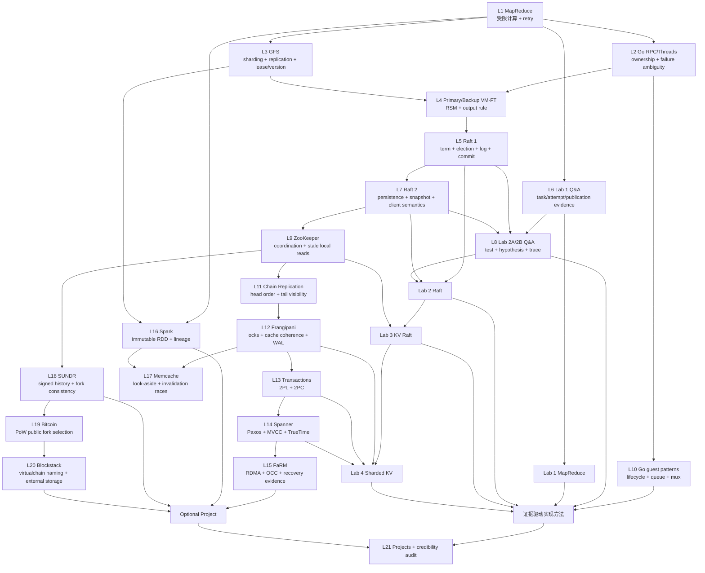

> 本文是课程归档的总入口，不是 MIT 教师审定稿，也不是 Lab 题解。所有机制、公式、范围、作业和数字只取自本地归档的 Spring 2021 课程材料；遇到课堂口误、字幕歧义、论文未说明项或教师明确表示不确定之处，本文保留不确定性，不用常识或后续版本静默补齐。

## 1. 课程身份、版本与证据来源

### 1.1 身份与时间边界

- 课程：**MIT 6.824 Distributed Systems, Spring 2021**。
- 官方归档主页：<https://nil.csail.mit.edu/6.824/2021/>；官方归档 schedule：<https://nil.csail.mit.edu/6.824/2021/schedule.html>。
- 媒体来源：Bilibili 合集 <https://www.bilibili.com/video/BV16f4y1z7kn/>，其标题、分 P 顺序和时长与 Spring 2021 schedule 对应。
- 字幕来源：<https://github.com/mayf09/6.824-2021-video-subtitles>。仓库说明英文字幕经过人工校对，中文字幕由机器翻译后人工校对；该描述证明的是字幕制作流程，不等于每一处术语、数字、否定词和画面指代都已无误。
- 本归档由 [course.json](/assets/courses/mit-6824-s21/metadata/course.json)、[source-manifest.json](/assets/courses/mit-6824-s21/metadata/source-manifest.json)、[resources-lock.json](/assets/courses/mit-6824-s21/metadata/resources-lock.json) 和本地保存的官方 schedule 共同固定版本与资源身份。

用户最初给出的 `pdos.csail.mit.edu/6.824/schedule.html` 在本项目整理时已指向 **Spring 2026**。课程论文、Lab、讲次顺序和 Question 会随学期变化，因此本项目没有把当前 2026 页面当作 2021 证据，也没有从其中补缺。版本选择依据是：媒体合集明确指向 2021，`nil.csail.mit.edu/6.824/2021/` 是带年份的归档，且本地 [官方 schedule 归档](/assets/courses/mit-6824-s21/materials/official-materials/course-pages/schedule.html) 与 manifests 锁定同一学期。这样避免把 2026 的 papers、labs 或日程混进 2021 学习路线。

### 1.2 21 个官方讲次与 22 个媒体分段

官方课程有 **Lecture 1-21**，媒体层有 **22 个 parts**。差异只来自官方 Lecture 15 `Optimistic Concurrency Control (FaRM)` 被拆成两个连续媒体：Part 15 与 Part 16。两部分共享同一 lecture note、paper、FAQ 和 Question；Part 16 是 `Lecture 15 continued`，不是 Lecture 16。真正的 Lecture 16 是 Spark。本文在课程结构中按 21 讲聚合，在回听和字幕证据中保留 22 个媒体边界。

### 1.3 双语字幕与自动笔记的证据边界

双语字幕是高价值的检索和回听入口，但不是最终规范。字幕审计已经覆盖 22/22 媒体 parts 和 21/21 官方讲次；[REVIEW_CHECKLIST.md](/courses/mit-6824-s21/review-checklist/) 中的 marker 是待复核队列，不是已确认错误。使用顺序应是：字幕/媒体笔记帮助定位，协议条件和论文数字回到官方讲义、指定 paper、Question 或 Lab 页面核验；课堂中的推测仍标为推测。

论文与课程页面的版权和许可归原作者与发布方。字幕仓库未声明 SPDX license，本项目只保留来源和归档用途，不重新授予许可。

## 2. 产物使用链

不要从 transcript 直接跳到“系统保证”。本仓库的推荐证据链是：

```text
COURSE_SUMMARY.md
  -> modules/ 模块指南
  -> readings/lecture-XX.md 阅读与官方 Question 指南
  -> lectures/.../NOTES.md 媒体讲授进程与时间戳
  -> transcript / 官方 lecture note / paper / FAQ / Question
  -> LABS.md 的实践边界
  -> REVIEW_CHECKLIST.md 的风险复核
```

| 层级 | 用途 | 不能替代什么 |
| --- | --- | --- |
| 本总指南 | 建立全课问题、依赖、计划、比较和复习门禁 | 不能替代逐篇 paper 或官方 Lab contract |
| 六份模块指南 | 把相邻 lectures 组成连续设计推理 | 不能把跨讲综合倒写成某位教师原话 |
| 21 份 reading guide | 固定 assigned range、paper/FAQ/Question、机制和证据边界 | 不能冒充论文正文；external-only 内容必须回官方入口 |
| 22 份媒体 `NOTES.md` | 恢复教师进程、板书上下文、时间戳和两个媒体的边界 | 不能凌驾于 paper、官方讲义或 Lab 页面 |
| Transcript | 搜索原始口述和定位回听 | 不能单独确认画面、公式、专名或漏掉的否定词 |
| 官方 lecture note/code | 确认课堂提纲、公式、API 和示例 | 不等于指定 paper 的全部论证 |
| Assigned paper/reading | 定义系统模型、机制、实验和限制 | 不等于课堂逐项讲过，也不自动适用于后续版本 |
| FAQ | 解释常见疑问、指出 paper 未说明项 | `guess/probably` 不能升级为事实 |
| Official Question | 训练一次精确的事件、反例或比较推理 | 不应由本指南提供可直接提交的答案 |
| [LABS.md](/courses/mit-6824-s21/labs/) | 固定 Lab 1-4 与 optional project 的官方目标、接口和门禁 | 不提供实现方案或隐藏测试推断 |
| [REVIEW_CHECKLIST.md](/courses/mit-6824-s21/review-checklist/) | 标出需回听、回看画面或重查 paper 的风险 | Marker 不等于确认 transcript/notes 错误 |

## 3. 课程核心问题与知识依赖图

### 3.1 核心问题

整门课可压缩为一个问题：

> 当机器、网络、时钟、缓存、参与者或证据都可能不可靠时，怎样让多个组件对外表现为一个可解释的系统，并清楚说明它在什么假设下保证什么、停止什么、牺牲什么？

每篇论文都在回答这组子问题：

1. **状态是什么，谁拥有它？** 是 task、file、log、object、transaction、RDD、cache entry、signed history 还是 name binding？
2. **顺序在哪里形成？** Coordinator、primary、leader、tail、lock point、timestamp、PoW chain 或 virtualchain？
3. **完成的证据是什么？** File rename、majority replication、tail apply、durable YES/COMMIT、safe time、validation、signature/hash 或 confirmations？
4. **故障后什么不能倒退？** Published file、committed log prefix、applied state、transaction outcome、snapshot、client history 或 ownership？
5. **性能来自哪条假设？** Restricted model、locality、batching、weak read、in-memory lineage、asynchronous invalidation、RDMA 或开放式 PoW？
6. **没有解决什么？** Exactly-once、Byzantine failure、availability、freshness、confidentiality、real-world identity、driver failure或跨对象 transaction？

### 3.2 全知识依赖图



## 4. 核心模型、不变量与公式

以下公式均直接来自本地 reading/module evidence；它们只在各自模型中成立。

### 4.1 Failure observation

```text
没有及时收到消息
  != 对方已停止且不会继续产生 effect
  -> 可能是 crash、delay、drop、partition、stall 或 reply loss
  -> timeout 只产生 suspicion
```

因此 safety 证明必须依赖可验证的 authority、quorum、version、durable record 或 publication boundary，而不能依赖“我等得够久”。

### 4.2 Deterministic state machine

若 primary/backup 从相同状态、以相同顺序执行相同 deterministic operation：

$$
S_P=S_B,\quad op_P=op_B
\Longrightarrow
\delta(S_P,op)=\delta(S_B,op).
$$

该式不证明 external output 已与 backup knowledge 对齐；VM-FT 仍需要 Output Rule，Raft service 仍需要 commit/apply/reply 和 duplicate handling。

### 4.3 Quorum 与 Raft

固定 $N$ 台 server 的多数派大小为：

$$
\left\lfloor\frac{N}{2}\right\rfloor+1.
$$

Raft election freshness 使用字典序：

$$
(candidate.lastLogTerm,candidate.lastLogIndex)
\ge_{lex}
(voter.lastLogTerm,voter.lastLogIndex).
$$

Leader 直接把 index $N$ 推进为 committed 的概念条件是：

$$
\left|\{i\mid matchIndex[i]\ge N\}\right|>\frac{N_{servers}}{2}
\land log[N].term=currentTerm.
$$

这里 `nextIndex` 是发送猜测，`matchIndex` 才是成功证据；previous-term entry 不能只凭“当前有多数 copies”直接套用该规则。

### 4.4 Snapshot 与 history

若 state machine 执行 `log[1..i]` 得到 $S_i$：

$$
S_i=apply(S_0,log[1..i]),
$$

则恢复材料可由完整 history 改为：

$$
snapshot_i+log[i+1..n].
$$

Snapshot 删除的是 prefix 的表示，不是 operation effects；`lastIncludedIndex/Term`、suffix relation 与 state-machine frontier 仍必须单调。

### 4.5 Serializability 与 durable ordering

Concurrent execution $E_c$ serializable，当存在 serial order $S$ 使结果相同：

$$
\exists S:\quad Outcome(E_c)=Outcome(S).
$$

Frangipani 的恢复顺序是：

$$
durable(log(op))\prec install(metadata(op))\prec release(locks(op)).
$$

2PC participant/coordinator 的关键顺序是：

$$
durable(prepared,TID,tentative\ data)\prec send(YES,TID),
$$

$$
durable(COMMIT,TID)\prec send(COMMIT,TID).
$$

### 4.6 Spanner 与 FaRM

TrueTime 返回保证包含绝对时间的区间：

$$
TT.now()=[earliest,latest].
$$

External consistency 要求非重叠 transactions 的 timestamp 顺序尊重真实时间：

$$
t_{abs}(commit_1)<t_{abs}(start_2)\Rightarrow s_1<s_2.
$$

FaRM 在 primary 上对 write-set object 的原子锁条件是：

$$
lock=0\land v_{current}=v_{read}.
$$

Version mismatch 与 active lock 分别覆盖“已完成的新版本”和“正在提交但尚未安装新版本”的冲突窗口。

### 4.7 SUNDR 与 Bitcoin

SUNDR version structures 采用 component-wise partial order：

$$
x\le y\iff\forall p,\ x[p]\le y[p].
$$

互不可比 structures 是 incompatible snapshot/fork evidence，不等于系统自动解决 fork。

Bitcoin 论文的简化追赶概率为：

$$
q_z=
\begin{cases}
1,&p\le q\\
(q/p)^z,&p>q.
\end{cases}
$$

它只在论文的 stochastic model 与 honest CPU-power assumption 下说明 confirmations 的概率风险递减；不是固定深度后的确定 finality。

## 5. 六个模块章节

### 模块一：基础、RPC 与复制

**指南：** [模块 01](/courses/mit-6824-s21/modules/01/)  
**讲次入口：** L1 [阅读](/courses/mit-6824-s21/readings/lecture-01/) / [媒体](/courses/mit-6824-s21/lectures/001/)；L2 [阅读](/courses/mit-6824-s21/readings/lecture-02/) / [媒体](/courses/mit-6824-s21/lectures/002/)；L3 [阅读](/courses/mit-6824-s21/readings/lecture-03/) / [媒体](/courses/mit-6824-s21/lectures/003/)；L4 [阅读](/courses/mit-6824-s21/readings/lecture-04/) / [媒体](/courses/mit-6824-s21/lectures/004/)。

**教师与论文推进：** 教师先用 MapReduce 暴露 partial failure、retry 和 tail latency，再用 Go concurrency/RPC 把 ambiguity 落到程序结构；GFS 说明 workload-specific storage 如何用 primary、lease、version 和 relaxed consistency；VM-FT 把复制提升为 machine-level RSM，并由 external-output 反例推出 Output Rule。

**核心概念与不变量：** task/attempt/result 分离；RPC no-reply 的四种解释；control path 与 data path；GFS lease 管 authority、version 管 epoch、record ID 管 duplicate、checksum 管 corruption；deterministic replay 仍需 external-output boundary。

**主要 tradeoff：** 受限 programming model 换自动分布；single master 换集中控制；relaxed consistency 换 aggregate throughput；machine-level transparency 换低层日志、shared-storage dependency 和 uni-processor boundary。

**Mastery gate：** 闭卷画 MapReduce、GFS、VM-FT 三条路径；对任一 timeout 列出 hidden worlds；分别解释 determinism/atomic rename、lease/version、replay/Output Rule 的职责，且不使用“系统实现 exactly once”作为结论。

### 模块二：Raft 与容错服务

**指南：** [模块 02](/courses/mit-6824-s21/modules/02/)  
**讲次入口：** L5 [阅读](/courses/mit-6824-s21/readings/lecture-05/) / [媒体](/courses/mit-6824-s21/lectures/005/)；L6 [阅读](/courses/mit-6824-s21/readings/lecture-06/) / [媒体](/courses/mit-6824-s21/lectures/006/)；L7 [阅读](/courses/mit-6824-s21/readings/lecture-07/) / [媒体](/courses/mit-6824-s21/lectures/007/)；L8 [阅读](/courses/mit-6824-s21/readings/lecture-08/) / [媒体](/courses/mit-6824-s21/lectures/008/)。

**教师与论文推进：** Raft (1) 从 two-replica dilemma 推出 majority、term、election、log、commit 和 Figure 8；Lab 1 Q&A 插入 ownership/publication 的证据方法；Raft (2) 补 persistence、snapshot 与 client semantics；Lab 2 Q&A 把协议规则变成 `test -> hypothesis -> trace -> first divergence`。

**核心概念与不变量：** safety/liveness 分离；one vote per term；Log Matching、Leader Completeness、State Machine Safety；`append -> persist -> replicate -> commit -> apply -> reply`；durable-before-ACK；snapshot 不回滚 state machine；request identity 属于 service state。

**主要 tradeoff：** strong leader 与 majority 简化 reasoning，却集中 load、让 minority 停止；current-term commit rule 更保守；full snapshot 清晰但昂贵；read-only heartbeat 保持非 timing safety，lease 更快但引入 clock assumption。

**Mastery gate：** 证明 election safety，手算 Figure 8，区分 `nextIndex/matchIndex`，画 snapshot/install/restart 三条路径，并能用一份结构化 trace 推翻至少一个关于 stale reply 或 timer 的假设。

### 模块三：协调、一致性与事务

**指南：** [模块 03](/courses/mit-6824-s21/modules/03/)  
**讲次入口：** L9 [阅读](/courses/mit-6824-s21/readings/lecture-09/) / [媒体](/courses/mit-6824-s21/lectures/009/)；L10 [阅读](/courses/mit-6824-s21/readings/lecture-10/) / [媒体](/courses/mit-6824-s21/lectures/010/)；L11 [阅读](/courses/mit-6824-s21/readings/lecture-11/) / [媒体](/courses/mit-6824-s21/lectures/011/)；L12 [阅读](/courses/mit-6824-s21/readings/lecture-12/) / [媒体](/courses/mit-6824-s21/lectures/012/)；L13 [阅读](/courses/mit-6824-s21/readings/lecture-13/) / [媒体](/courses/mit-6824-s21/lectures/013/)；L14 [阅读](/courses/mit-6824-s21/readings/lecture-14/) / [媒体](/courses/mit-6824-s21/lectures/014/)；L15 [阅读](/courses/mit-6824-s21/readings/lecture-15/) / [官方聚合](/courses/mit-6824-s21/official-lectures/lecture-15/) / [Part 1](/courses/mit-6824-s21/lectures/015/) / [Part 2](/courses/mit-6824-s21/lectures/016/)。

**教师与论文推进：** ZooKeeper 先展示可编程的弱读语义；Go guest lecture提供 lifecycle/queue/mux 的实现纪律；Chain Replication 用 head/tail 分离排序和可见性；Frangipani 组合 cache ownership、WAL 和 versioned recovery；2PL/2PC 分开 isolation 与 atomic commit；Spanner 用 Paxos、MVCC、safe time 和 TrueTime建立跨地域 external consistency；FaRM 在单数据中心 RDMA/NVRAM 条件下改用 OCC。

**核心概念与不变量：** update total order 与 session prefix；tail apply 是 CR 可见点；Frangipani `log -> install -> release`；2PL hold-to-end 与 2PC durable decision；Spanner timestamp selection 不等于 replica freshness；FaRM LOCK/VALIDATE、write-content evidence 与 commit-decision evidence分离。

**主要 tradeoff：** local reads、client recipes 与 weak freshness换扩展性；chain topology换简单 prefix repair；sticky cache ownership换 hot-write bouncing；2PL/2PC换 deadlock/blocking；TrueTime换 commit wait；OCC/RDMA换 conflict abort和特殊硬件/部署假设。

**Mastery gate：** 对同一 workload分别判断 ZooKeeper、CR、Frangipani、2PL/2PC、Spanner、FaRM 的排序点、可见点、恢复 evidence 和 non-goal；任何比较必须附 failure geography、workload 和 hardware assumptions。

### 模块四：数据处理与缓存系统

**指南：** [模块 04](/courses/mit-6824-s21/modules/04/)  
**讲次入口：** L16 [阅读](/courses/mit-6824-s21/readings/lecture-16/) / [媒体](/courses/mit-6824-s21/lectures/017/)；L17 [阅读](/courses/mit-6824-s21/readings/lecture-17/) / [媒体](/courses/mit-6824-s21/lectures/018/)。

**教师与论文推进：** Spark 从多轮 MapReduce 的稳定存储往返成本出发，以 immutable RDD、lazy transformations、lineage、narrow/wide dependency 和 checkpoint 组织 dataflow；Memcache 从 authoritative DB 与 look-aside cache 出发，随 clusters/regions 增加依次引入 invalidation、lease、Gutter、warming 和 remote marker。

**核心概念与不变量：** RDD 是 immutable partitioned recipe；dependency shape 同时决定 normal shuffle 与 recovery blast radius；cache entry 可丢但 DB 是 authority；delete 比 out-of-order update 更稳定；每条新 refill/fallback path 都要检查旧值能否越过 invalidation。

**主要 tradeoff：** in-memory reuse换 RAM/lineage/checkpoint policy；wide operator换 shuffle/barrier；cache replication换 RAM 和 invalidation targets；regional pool换 cross-cluster cost；Gutter/hold-off/marker接受概率性短暂 stale以保护 backend。

**Mastery gate：** 给一段 RDD 程序画 DAG、stages、cache/checkpoint和failure recovery；再闭卷写出 Memcache Race 1/2/3 的旧值来源、越过的边界、fix 与保证强度，不能把两种 cache 抹成同一模型。

### 模块五：去中心化信任与分叉一致性

**指南：** [模块 05](/courses/mit-6824-s21/modules/05/)  
**讲次入口：** L18 [阅读](/courses/mit-6824-s21/readings/lecture-18/) / [媒体](/courses/mit-6824-s21/lectures/019/)；L19 [阅读](/courses/mit-6824-s21/readings/lecture-19/) / [媒体](/courses/mit-6824-s21/lectures/020/)；L20 [阅读](/courses/mit-6824-s21/readings/lecture-20/) / [媒体](/courses/mit-6824-s21/lectures/021/)。

**教师与论文推进：** SUNDR 先说明逐对象 signature 不保证 history integrity，并用 logged fetch/own-last-operation 把 server 的攻击限制为不可无痕合并的 forks；Bitcoin 在开放 membership 中用 P2P dissemination、PoW 与 greatest-work valid chain选择公共历史；Blockstack 复用该 order运行 virtualchain naming state machine，把 bulk data移到外部 storage。

**核心概念与不变量：** signature管 authorization，不管 freshness；history commitment让 rollback/selective presentation留下 fork evidence；PoW只在 valid branches之间提供 resource-weighted selection；blockchain order不替代 application validity；external hash/signature不提供 data availability或 mutable freshness。

**主要 tradeoff：** fork detection不等于 fork prevention/availability；PoW换开放式 Sybil resistance与概率 finality，但付出资源和延迟；Blockstack control/data split突破链上容量，却把 availability、freshness、key management和现实身份留给其他层。

**Mastery gate：** 从一个 signed object构造 history-mixing attack，再画 SUNDR permanent fork、Bitcoin temporary fork、Blockstack control/data layers；逐项回答 authorization、order、validity、freshness、availability和key compromise由谁负责。

### 模块六：Labs、调试与项目证据

**指南：** [模块 06](/courses/mit-6824-s21/modules/06/)  
**直接课堂入口：** L6 [阅读](/courses/mit-6824-s21/readings/lecture-06/) / [媒体](/courses/mit-6824-s21/lectures/006/)；L8 [阅读](/courses/mit-6824-s21/readings/lecture-08/) / [媒体](/courses/mit-6824-s21/lectures/008/)；L21 [阅读](/courses/mit-6824-s21/readings/lecture-21/) / [媒体](/courses/mit-6824-s21/lectures/022/)。

**教师与材料推进：** Lab 1 Q&A 训练 task/attempt/publication 与等待边界；Lab 2 Q&A训练从 tester action和 observable error回溯 first divergence；Lab 1-4 逐步扩大 authority 和一致状态范围；Lecture 21 用学生项目与 AnalogicFS credibility audit训练 claim/evidence/limitation 的诚实分层。

**核心概念与不变量：** `designed != implemented != demonstrated != tested != measured != proved != deployed`；race detector是必要局部证据，不是协议证明；data possession不等于 serving authority；一次 pass/demo 只覆盖一次执行和明示设置。

**主要 tradeoff：** 更多 logging可能扰动 timing，但没有 causal trace就无法调试；更大 timeout可能掩盖 latent bug；更宽项目 scope减少完成/评估深度；更强 claim需要更明确 model、failure injection、baseline和重复测量。

**Mastery gate：** 对一个公开 failure写出 `scenario -> invariant -> first divergence -> competing hypotheses -> trace -> validation boundary`；对一个项目 claim标明状态、setup、evidence和未覆盖范围；全程不请求或泄露 Lab solution。

## 6. 官方 Lecture 1-21 总表

> 这是本文唯一的官方讲次表。顺序严格按 Spring 2021 schedule；每行给出 3-5 个可检验掌握结果。Lecture 15 的一行同时链接官方聚合与两个媒体 parts。

| # | 官方标题 | 指定 paper / preparation 与官方 Question 状态 | 本讲在课程中的角色 | 掌握结果（3-5 项） | 阅读与媒体 NOTES |
| ---: | --- | --- | --- | --- | --- |
| 1 | Introduction | MapReduce (2004)，全文；**官方无 Question** | 用 MapReduce建立全课的 partial failure、retry、distribution hiding与性能词汇 | 画 Map/shuffle/Reduce；区分 task/attempt/result；解释 determinism与atomic rename；区分throughput/latency/tail；说出single-master边界 | [阅读](/courses/mit-6824-s21/readings/lecture-01/) · [媒体](/courses/mit-6824-s21/lectures/001/) |
| 2 | RPC and Threads | Online Go tutorial、Crawler exercise、Go RPC package；tutorial正文external-only；[官方 Question](/assets/courses/mit-6824-s21/materials/official-materials/questions/02-q-gointro.html)即Crawler exercise | 把并发ownership、等待、termination和RPC failure ambiguity落到程序结构 | 区分goroutine/channel/process；为共享状态指定owner/lock；列no-reply worlds；区分at-least/at-most/exactly-once边界；审查crawler termination | [阅读](/courses/mit-6824-s21/readings/lecture-02/) · [媒体](/courses/mit-6824-s21/lectures/002/) |
| 3 | GFS | GFS (2003)，全文；[官方 Question](/assets/courses/mit-6824-s21/materials/official-materials/questions/03-q-gfs.html)：构造stale read | 展示workload-specific distributed storage、control/data path和relaxed consistency | 画client/master/chunkservers；区分lease/version/checksum/record ID；走record append retry；构造cached-metadata stale read；限定论文performance setup | [阅读](/courses/mit-6824-s21/readings/lecture-03/) · [媒体](/courses/mit-6824-s21/lectures/003/) |
| 4 | Primary-Backup Replication | VMware FT (2010)，全文；[官方 Question](/assets/courses/mit-6824-s21/materials/official-materials/questions/04-q-vm-ft.html)：partition下会否双primary | 把复制抽象为RSM，并把external output纳入failover correctness | 比较state transfer/RSM；解释deterministic replay；由counter反例推出Output Rule；用test-and-set分析partition；说出fail-stop/shared-storage/uni-processor边界 | [阅读](/courses/mit-6824-s21/readings/lecture-04/) · [媒体](/courses/mit-6824-s21/lectures/004/) |
| 5 | Fault Tolerance: Raft (1) | Extended Raft从开头读到§5末，止于§6前；[官方 Question](/assets/courses/mit-6824-s21/materials/official-materials/questions/05-q-raft.html)：Figure 7 election | 建立term、majority、election、log replication、commit和核心safety chain | 证明同term唯一leader；比较last term/index；区分append/ACK/commit/apply；解释Figure 8；列persistent/volatile state | [阅读](/courses/mit-6824-s21/readings/lecture-05/) · [媒体](/courses/mit-6824-s21/lectures/005/) |
| 6 | Lab 1 Q&A | 无paper/FAQ；围绕已提交Lab 1；[官方 Question](/assets/courses/mit-6824-s21/materials/official-materials/questions/06-q-QAlab.html)：提交自己的Lab问题 | 用Lab 1训练contract、ownership、timeout、publication和evidence-first提问 | 区分logical task/attempt；说明Map-Reduce barrier；审查file publication；把timeout写成suspicion；提出可证伪Lab问题 | [阅读](/courses/mit-6824-s21/readings/lecture-06/) · [媒体](/courses/mit-6824-s21/lectures/006/) |
| 7 | Fault Tolerance: Raft (2) | **跳过§6**，从§7读到论文结尾；[官方 Question](/assets/courses/mit-6824-s21/materials/official-materials/questions/07-q-raft2.html)：InstallSnapshot是否回滚state machine | 补齐persistence、snapshot、client semantics、read freshness与论文证据评价 | 写durable-before-ACK；区分logical index/slice offset；分析stale snapshot；解释request dedup state；区分no-op/heartbeat/lease read | [阅读](/courses/mit-6824-s21/readings/lecture-07/) · [媒体](/courses/mit-6824-s21/lectures/007/) |
| 8 | Lab 2A/2B Q&A | 无新paper/FAQ；围绕已提交Lab 2A/2B；[官方 Question](/assets/courses/mit-6824-s21/materials/official-materials/questions/08-q-QAlab.html)：提交自己的Lab问题 | 把Raft失败变成可证伪trace，而不是timeout调参 | 重建tester chronology；区分send/receive context；追踪next/matchIndex；定位first divergence；说明race-clean和一次pass的边界 | [阅读](/courses/mit-6824-s21/readings/lecture-08/) · [媒体](/courses/mit-6824-s21/lectures/008/) |
| 9 | ZooKeeper | ZooKeeper (2010)，全文；[官方 Question](/assets/courses/mit-6824-s21/materials/official-materials/questions/09-q-zookeeper.html)：simple lock与session failure | 展示linearizable updates、FIFO client order和可stale local read如何组合coordination recipes | 区分API guarantee/recipe/external effect；解释watch re-read；构造合法stale read；证明ephemeral lock mutual exclusion；限定session timeout | [阅读](/courses/mit-6824-s21/readings/lecture-09/) · [媒体](/courses/mit-6824-s21/lectures/009/) |
| 10 | Guest Lecture on Go, Russ Cox | 无paper；78页官方PDF，实质内容到p.77；[官方 Question](/assets/courses/mit-6824-s21/materials/official-materials/questions/10-q-go.html)：评价Go设计 | 提供owner goroutine、queue、scheduler、speculative client和mux的实现推理 | 为goroutine写exit reason；比较backpressure/drop/queue；画wait-for deadlock；解释register-before-send；限定timeout和race detector evidence | [阅读](/courses/mit-6824-s21/readings/lecture-10/) · [媒体](/courses/mit-6824-s21/lectures/010/) |
| 11 | Chain Replication | Chain Replication (2004)，全文；[官方 Question](/assets/courses/mit-6824-s21/materials/official-materials/questions/11-q-cr.html)：head过早回复反例 | 用head排序、tail可见和configuration control plane建立单对象strong consistency | 构造早回复非线性history；解释prefix invariant；区分head/middle/tail failure；画new-tail barrier；限定single-object/no cross-chain transaction | [阅读](/courses/mit-6824-s21/readings/lecture-11/) · [媒体](/courses/mit-6824-s21/lectures/011/) |
| 12 | Cache Consistency: Frangipani | Frangipani (1997)，全文；[官方 Question](/assets/courses/mit-6824-s21/materials/official-materials/questions/12-q-frangipani.html)：旧log为何不撤销新inode | 组合cache ownership、operation atomicity、WAL、lease和versioned recovery | 走lock handoff；区分sticky idle/release；写log-install-release顺序；应用version replay rule；区分metadata和user-data durability | [阅读](/courses/mit-6824-s21/readings/lecture-12/) · [媒体](/courses/mit-6824-s21/lectures/012/) |
| 13 | Distributed Transactions | 6.033 Ch.9仅§9.1.5、§9.1.6、§9.5.2、§9.5.3、§9.6.3，正文external-only；[官方 Question](/assets/courses/mit-6824-s21/materials/official-materials/questions/13-q-chapter9.html)：2PL何时优于Simple Locking | 把isolation/serializability与failure atomicity拆成2PL和2PC | 用outputs判断serializability；解释hold-to-end；画wait-for cycle；写prepared/commit durable顺序；推导prepared blocking | [阅读](/courses/mit-6824-s21/readings/lecture-13/) · [媒体](/courses/mit-6824-s21/lectures/013/) |
| 14 | Spanner | Spanner (2012)，全文；[官方 Question](/assets/courses/mit-6824-s21/materials/official-materials/questions/14-q-spanner.html)：大TrueTime uncertainty的影响 | 组合Paxos shards、2PL/2PC、MVCC、safe time和TrueTime建立external consistency | 区分directory/Paxos group；画RW/RO路径；解释safe-time双frontier；推导start rule/commit wait；限定WAN和clock成本 | [阅读](/courses/mit-6824-s21/readings/lecture-14/) · [媒体](/courses/mit-6824-s21/lectures/014/) |
| 15 | Optimistic Concurrency Control (FaRM) | FaRM (2015)，全文；[官方 Question](/assets/courses/mit-6824-s21/materials/official-materials/questions/15-q-farm.html)：同对象递增冲突evidence与phase | 在单数据中心、全内存、RDMA/NVRAM假设下用OCC获得strict serializability | 区分one-sided RDMA/RPC/ACK；走Figure 4；区分LOCK/VALIDATE；定位version mismatch；区分write-content/decision evidence | [阅读](/courses/mit-6824-s21/readings/lecture-15/) · [官方聚合](/courses/mit-6824-s21/official-lectures/lecture-15/) · [Part 1](/courses/mit-6824-s21/lectures/015/) · [Part 2](/courses/mit-6824-s21/lectures/016/) |
| 16 | Big Data: Spark | Spark RDD (2012)，全文；[官方 Question](/assets/courses/mit-6824-s21/materials/official-materials/questions/16-q-spark.html)：哪些应用比MapReduce更适合 | 用immutable dataflow、lineage和显式persistence优化迭代/交互计算 | 区分transformation/action/persist；判narrow/wide；解释co-partitioning；追踪partition recovery；限定driver failure和fine-grained mutable workload | [阅读](/courses/mit-6824-s21/readings/lecture-16/) · [媒体](/courses/mit-6824-s21/lectures/017/) |
| 17 | Cache Consistency: Memcached at Facebook | Memcache (2013)，全文；[官方 Question](/assets/courses/mit-6824-s21/materials/official-materials/questions/17-q-memcached.html)：为何不delete Gutter key | 展示look-aside cache扩展后出现的backend保护、invalidation和stale refill问题 | 画read/write/invalidation；解释lease双重作用；区分pool/replication/regional pool；重建三种race；限定best-effort consistency | [阅读](/courses/mit-6824-s21/readings/lecture-17/) · [媒体](/courses/mit-6824-s21/lectures/018/) |
| 18 | Fork Consistency, SUNDR | SUNDR只读Abstract、§1-§3.4，止于§4前；[官方 Question](/assets/courses/mit-6824-s21/materials/official-materials/questions/18-q-sundr.html)：只记录modify是否破坏两种consistency | 在Byzantine storage模型下区分authorization、history integrity、fork detection和availability | 构造logged-fetch attack；解释own-last-operation；区分fetch-modify/fork consistency；使用version-vector order；限定confidentiality/availability | [阅读](/courses/mit-6824-s21/readings/lecture-18/) · [媒体](/courses/mit-6824-s21/lectures/019/) |
| 19 | Peer-to-Peer: Bitcoin | Bitcoin (2008)全文 + Nielsen explainer全文；[官方 Question](/assets/courses/mit-6824-s21/materials/official-materials/questions/19-q-bitcoin.html)：如实记录购买体验 | 从合法冲突签名推进到开放网络的公共历史和概率finality | 解释signature/order分工；走P2P/PoW/validation；区分benign fork/attack；解释confirmation概率；限定SPV/key theft/现代状态 | [阅读](/courses/mit-6824-s21/readings/lecture-19/) · [媒体](/courses/mit-6824-s21/lectures/020/) |
| 20 | Blockstack | Blockstack (2016)，全文；[官方 Question](/assets/courses/mit-6824-s21/materials/official-materials/questions/20-q-blockstack.html)：unique/human-readable/decentralized为何都重要且难兼得 | 复用区块链order运行virtualchain naming，并分离control/data plane | 区分order/validity；解释preorder；比较mutable/immutable storage；限定name ownership与现实身份；解释consistency hash/SNV trust anchor | [阅读](/courses/mit-6824-s21/readings/lecture-20/) · [媒体](/courses/mit-6824-s21/lectures/021/) |
| 21 | Project Presentations | AnalogicFS全文，但FAQ确认其SCIgen来源；[官方 Question](/assets/courses/mit-6824-s21/materials/official-materials/questions/21-q-analogic.html)四选一、重在原创与证据审查 | 用荒诞paper和真实学生项目训练credibility、scope、evaluation与limitation | 审核problem/model/mechanism；检查units/baseline；区分设计到部署状态；攻击failure invariant；诚实报告unknown/未实现 | [阅读](/courses/mit-6824-s21/readings/lecture-21/) · [媒体](/courses/mit-6824-s21/lectures/022/) |

## 7. 跨课程方法

### 7.1 Failure model：先写允许的坏事

每次分析先列：crash/restart、slow/stall、drop/delay/duplicate/reorder、partition、disk corruption、clock bound failure、Byzantine server、compromised key 中哪些在范围内。随后分开：

- **Safety：** 即使不进展，也绝不能出现什么？
- **Liveness：** 在什么 connectivity、majority、timeout 或 workload 条件下最终进展？
- **Recoverability：** 修复后靠什么 durable state、snapshot、log、version 或 external evidence恢复？
- **Availability：** 故障发生期间还能服务哪些请求？

不要用“容错”覆盖四个不同问题。

### 7.2 State machines 与 logs：追踪知识阶段

对每条 operation画：

```text
accepted -> ordered -> durable -> replicated -> committed
         -> applied -> externally visible -> replied
```

不同系统可能省略或合并某些阶段，但必须说明依据。MapReduce rename、VM-FT Output Rule、Raft `commitIndex/lastApplied`、CR tail、Frangipani WAL、2PC decision、FaRM COMMIT-PRIMARY都是不同的可见性边界，不能因都叫“commit”就视为同一协议。

### 7.3 Replication 与 consistency：先问复制什么

- MapReduce复制/retry computation attempt。
- GFS复制chunks，并由lease primary排序mutation。
- VM-FT复制non-deterministic execution inputs/outcomes。
- Raft复制ordered command log。
- CR复制head产生的state changes。
- Frangipani共享Petal data，以locks/WAL协调caches。
- Spark不复制每个intermediate bytes，而保存reconstruction recipe。

复制对象、commit point和read path共同决定client-visible guarantee；“有三副本”本身不说明linearizability、exactly-once或availability。

### 7.4 Transactions 与 concurrency：三层问题分开

1. **Local synchronization：** mutex/channel/owner goroutine是否维护进程内invariant？
2. **Distributed ordering：** leader/tail/lock/timestamp是否给operations一个合法顺序？
3. **Client semantics：** completed calls/transactions是否可排成满足real-time和read-from关系的history？

2PL处理conflict order，2PC处理participants的all-or-none outcome，Raft/Paxos复制某个logical role，TrueTime连接timestamp与real time，OCC在commit时验证execute期间的reads。它们互补，不可替换。

### 7.5 Cache 与 dataflow：每增加一条快路都重做failure analysis

Spark的immutable lineage主要问“丢失后从哪里重算”；Memcache的mutable derived value还要问“旧值是否能跨write/delete重新进入”。检查步骤是：authority在哪里、cache由谁填、invalidations从何处排序、故障时回源容量是否足够、fallback是否改变freshness。

### 7.6 Trust model：signature、hash、order、validity分开

- Signature证明某key授权过，不证明最新、可用或现实身份。
- Hash承诺specific bytes/history，不强迫server返回data。
- Public order选择先后，不让invalid operation自动valid。
- Fork consistency限制无痕merge，不自动选择branch。
- PoW confirmations降低特定模型下的reversal probability，不提供绝对finality。

### 7.7 Evidence-driven debugging

统一闭环：

```text
固定最窄test scenario
  -> 写expected invariant
  -> 找first observable divergence
  -> 提出至少两个可证伪hypotheses
  -> 增加稳定trace/assertion
  -> 重跑同一test
  -> 修复后逐层扩大回归半径
```

Trace至少包含run/test、elapsed time、actor、logical ID、term/role/config/frontier、message direction、state delta和tester action。Race detector报告是局部并发证据；无报告不证明无deadlock、stale reply或协议错误。

## 8. 系统比较矩阵：不抹平假设

| 系统 | 关键部署/workload假设 | 排序点与client-visible目标 | Failure/progress边界 | 主要收益 | 明确不能推出 |
| --- | --- | --- | --- | --- | --- |
| MapReduce | 大批量、可分割、通常deterministic operators；GFS input/output | Master调度，framework按key group；稳定final files | Worker可retry；single master failure aborts job | 自动parallelism、locality、straggler backup | Exactly-once task、通用mutable computation |
| GFS | 大文件、streaming read、append-heavy、bandwidth优先 | Lease primary排chunk mutations；relaxed regions | Component failure/re-replication；manual master cut-over边界 | Aggregate storage throughput | POSIX、bank-grade consistency、无duplicate append |
| VM-FT | Fail-stop、shared storage、one backup、uni-processor VM | Primary execution；Output Rule约束外部输出 | Test-and-set防split brain；shared storage是依赖 | OS/application透明failover | Byzantine、common software bug、exactly-once packets |
| Raft | Fixed membership、non-Byzantine、deterministic RSM、majority | Leader log order；commit/apply后服务完成 | Minority停止；majority最终互通才progress | 清晰的safety chain与自动failover | Byzantine、Section 6自动包含、端到端duplicate语义 |
| ZooKeeper | 小coordination metadata、read-heavy recipes | Updates全序 + client FIFO；reads可local stale | Ensemble majority；session timeout释放ephemeral | 可组合coordination与read scaling | Full-linearizable reads、外部side-effect transaction |
| Chain Replication | Fail-stop、single-object query/update、trusted config master | Head排update，tail apply/query/reply | Current member failure先停写后reconfigure | Tail local read与prefix repair | Multi-object transaction、failure时quorum绕行 |
| Frangipani | Trusted workstations、shared Petal、低共享写engineering workload | Locks排序ownership；WAL/version恢复 | Lease expiry后recovery；late write fencing未完全解决 | Coherent shared FS与CPU随clients扩展 | Untrusted server安全、user-data whole-file durability |
| 2PL + 2PC | 可识别participants、durable protocol state | Locks形成serial order；coordinator形成global outcome | Deadlock/abort；prepared participant可blocking | General multi-record distributed atomicity | 2PC等于replication、timeout消除blocking |
| Spanner | Cross-region Paxos、TrueTime bound正确、MVCC | 2PL/2PC + timestamp；external consistency | Majority、lease、safe-time和WAN等待 | Global transactions与lock-free snapshot read | 零延迟、完美时钟、任意旧snapshot永远可读 |
| FaRM | 单数据中心、全内存、RDMA/NVRAM、低冲突 | OCC write-lock point/last read；strict serializability for commits | Precise membership/recovery；特殊power/network条件 | 极低latency/高throughput | 跨地域同等保证、execute阶段atomic snapshot、普适性能 |
| Spark RDD | Bulk coarse-grained deterministic dataflow、iterative reuse | DAG/stage order；actions触发；immutable versions | Worker partition重算；driver failure不在2012实现 | In-memory reuse与lineage recovery | Fine-grained mutable service、所有job都更快 |
| Facebook Memcache | Authoritative DB、read-heavy web、可容忍低概率短暂stale | DB commit order + async deletes/refill controls | Cache loss回源；Gutter/marker等为best effort | Backend protection与全球read scale | Linearizability、严格bounded staleness、恶意方安全 |
| SUNDR | Byzantine storage、honest client保存last state、keys/hash安全 | Signed history/version structures；fork consistency | Server可DoS/永久fork；无availability | Untrusted storage上的history-integrity detection | Confidentiality、freshness、自动fork resolution |
| Bitcoin | 开放membership、honest CPU power占优的论文模型 | Greatest-work **valid** chain；概率确认 | Temporary forks/reorg；$q<p$才有递减风险 | 开放式Sybil resistance与公共order | 绝对finality、key安全、work使invalid spend有效 |
| Blockstack | 2014-2016 chain环境、deterministic virtualchain rules、外部store | Blockchain order + virtualchain validity | Underlying/software fork；store可outage/replay | Global naming与bulk data分离 | 现实身份、mutable freshness、data availability |

比较性能时至少同时保留：年代、machines、network、replica layout、dataset/workload、conflict/read-write ratio、failure geography、metric和measurement window。否则论文数字没有可比意义。

## 9. Labs 1-4 与 Optional Project 地图

本节只总结 [LABS.md](/courses/mit-6824-s21/labs/) 的官方目标与概念门禁，不提供代码、字段布局、RPC handler、hidden test推断或可提交设计。

| 路线 | 官方目标/阶段 | 课程概念映射 | 必须能论证的不变量 | 进入下一阶段前的门禁 |
| --- | --- | --- | --- | --- |
| Lab 1 MapReduce | Coordinator/workers、Map→Reduce、10秒task timeout、并行与crash recovery | L1 task retry/atomic publication；L2 RPC/concurrency；L6 Q&A | 每个input最终有可接受Map结果；Reduce只在完整Map outputs后；final files完整；job最终退出 | 能区分logical task/attempt/result，并解释timeout不取消旧attempt |
| Lab 2A | Election与heartbeat | L4 split brain；L5 term/quorum | 每term至多一leader；higher term使旧authority失效；majority可通信时最终重选 | 窄2A tests与race重复稳定，不靠抄论文timeout |
| Lab 2B | Log replication、agreement、ordered apply | L5 Figure 2/8 | Committed prefix不被新leader覆盖；apply按index；无majority不伪commit | 能给每次commit列出majority evidence和entry term |
| Lab 2C | Persistence、crash/restart、fast backtracking | L7 durable-before-ACK | Term/vote/log承诺跨restart；stale reply不倒退progress | 重复churn/persistence tests并回归2A/2B |
| Lab 2D | Snapshot/log compaction/InstallSnapshot | L7 state-history duality | Snapshot不回滚；logical index与slice offset分离；state+snapshot原子持久 | 全Lab 2回归，准备由Lab 3继续压力测试snapshot |
| Lab 3A | Linearizable KV、retry与duplicate effect | L7 client semantics；L9 read freshness | Completed calls有尊重real time的单机顺序；同logical modification一次effect；minority不返回stale success | 能从client call追踪到commit/apply/reply，不把`Start()`当完成 |
| Lab 3B | Service snapshots/restart | L7 snapshot；L12 recovery | Snapshot覆盖KV和恢复client semantics所需state；安装不倒退 | Lab 3 + Lab 2全部回归，race/restart稳定 |
| Lab 4A | Raft-backed shard controller、numbered configurations | L9 coordination；L13 state machine determinism | 所有replicas生成相同config；historical query稳定；rebalance deterministic | 能说明config不是Raft membership change |
| Lab 4B | Shard ownership transfer、reconfiguration、snapshot/restart | L12 handoff；L13 participant order；L14 sharding context | 任一shard/config至多一个serving group；new owner状态完整；client op与config相对顺序一致 | 同一Raft通过Lab 2/3/4；能区分data possession与authority |
| Optional Project | 经批准的2-3人团队，替代Lab 4；code + 约3页write-up + presentation | 全课任选fault tolerance、dataflow、cache、trust等方向 | Problem、failure model、correctness contract、evaluation、known limits明确 | 工作量至少相当于Lab 4；proposal获批；正常/并发/failure/recovery/performance均有证据 |

当年 optional project 是 **Lab 4 的替代项**，不是 Lab 1-3 的替代，也不是 Lab 4 后的额外必做。个人 Labs 仍须独立完成，不得查看、使用或公开他人/往届答案；project团队协作不扩展到个人Lab代码。

## 10. Homework / Paper Question 工作流

### 10.1 一次完整循环

1. 从 reading guide 抄下 **assigned range** 与 evidence boundary。
2. 先读 paper/preparation，写一页：problem、model、normal path、failure path、invariant、tradeoff、unknown。
3. 在看课堂总结前独立回答 official Question：画事件、角色、版本/term或real-time关系。
4. 读 FAQ，只用于检查常见误解和paper未说明项；所有推测保留限定词。
5. 读官方 lecture note/code，再看媒体 `NOTES.md`，观察教师如何选择反例和讲授顺序。
6. 必要时回到 transcript/timecode和 [REVIEW_CHECKLIST.md](/courses/mit-6824-s21/review-checklist/) 核验术语、数字、否定词或画面依赖。
7. 重写答案：事实、推导、假设、边界分开；不把本地自测题标为official homework。
8. Lab相关讲次只把机制映射到官方接口、不变量和公开测试面，不写实现答案。

### 10.2 三个特殊状态

- **Lecture 1 无官方 Question。** MapReduce reading guide 的自测题只是本地脚手架；不能说成MIT提交项。
- **Lecture 6 与 Lecture 8 是 Lab Question。** 官方要求提交一个自己在刚完成Lab中产生的问题。合格问题包含scenario、observation、expected invariant、competing explanations和missing evidence；不是paper摘要，也不是索取代码。
- **Lecture 21 的 Question 是刻意荒诞的四选一。** AnalogicFS由SCIgen生成。作答重点是原创、维度/证据审查和明确假设，不应伪造论文不存在的精确实验数据。

## 11. 常见误解索引

| 误解 | 纠正 |
| --- | --- |
| Timeout证明对方crash | 只证明当前未及时收到消息；旧attempt/leader仍可能行动 |
| Atomic rename等于exactly-once execution | Rename只保证完整file publication；attempt可重复 |
| Replication与sharding是一回事 | 前者保留/服务同一state，后者切分capacity/work |
| GFS version等于lease | Version标epoch，lease限制ordering authority的时间 |
| Deterministic replay已保证failover一致 | Client-visible output还需Output Rule或等价边界 |
| Raft heartbeat不检查log | Empty AppendEntries仍检查previous index/term |
| Follower ACK就是commit/apply | ACK只证明本地append；commit knowledge和apply是后续阶段 |
| `nextIndex`与`matchIndex`都是真实progress | 前者是猜测，后者由成功reply支撑 |
| Previous-term entry有多数copies就一定commit | Figure 8要求current-term commit rule |
| Snapshot是压缩后的log文件 | 它是applied service state加boundary metadata |
| 收到leader snapshot就必须安装 | RPC可重排；旧snapshot不能回滚state machine |
| ZooKeeper reads都是linearizable | Updates有全序；local reads可stale但同session不倒退 |
| ZooKeeper lock使外部critical section原子 | Session expiration不回滚已发生的外部side effects |
| Chain Replication任一副本都可读 | Strong path由tail服务query；rotated chains仍有每对象tail |
| Frangipani metadata recovery等于file contents全原子 | User data不进metadata log，需`fsync`/rename选择更强保证 |
| 2PL与2PC是同一两阶段协议 | 2PL管isolation；2PC管participants的atomic outcome |
| Raft/Paxos能替代2PC | 复制logical role不等于协调不同participants的all-or-none |
| TrueTime返回精确单点时间 | 返回包含真实时间的interval；uncertainty进入等待成本 |
| FaRM execute阶段每次跨对象读取都是snapshot | 只有成功commit获得strict serializability |
| RDMA ACK表示server已执行 | 只证明远端memory write完成，目标CPU可能尚未处理 |
| Spark `persist`会立即计算 | Transformation/cache声明是lazy，action才触发 |
| Narrow/wide只影响性能 | 还决定failure后的recomputation范围 |
| Spark cache与Memcache只是同一种RAM cache | 前者依immutable lineage重算；后者面对mutable authority和refill races |
| Memcache允许eventual consistency就允许永久stale | 机制重点正是避免无界stale，同时接受低概率短暂stale |
| Signature证明latest/available/real identity | 只证明相应key授权过特定内容 |
| SUNDR fork consistency阻止fork | 它允许fork，只阻止honest branches无痕merge |
| PoW让invalid transaction变valid | Full nodes仍验证规则和signatures |
| Confirmations达到固定数后绝对不可逆 | 在论文模型中只让reversal probability下降 |
| Blockchain order自动提供application validity | Blockstack仍需virtualchain validation rules |
| Hash在链上就保证data available | External provider仍可拒绝返回bytes |
| Race detector clean证明协议正确 | 不证明deadlock、stale reply、timer、linearizability或distributed safety |
| Demo成功证明系统保证 | 只证明特定设置下的一次路径得到观察结果 |

## 12. 学习计划

### 12.1 十周完整计划

| 周 | Paper / preparation | Question 与课堂材料 | Lab概念与复核产出 |
| ---: | --- | --- | --- |
| 1 | L1 MapReduce全文；L2 Go tutorial/Crawler与RPC入口 | 完成L1本地自测；实际做L2 external exercise；读官方讲义后对照两份媒体NOTES | 画task/attempt/result、crawler ownership和RPC no-reply表；用checklist抽查术语/否定词 |
| 2 | L3 GFS；L4 VM-FT | 独立写stale-read与partition event tables，再看FAQ/NOTES | Lab 1概念：phase barrier、timeout、atomic publication；完成模块一gate |
| 3 | L5 Raft到§5；L6无paper | 做Figure 7 voter worksheet；为Lab 1写evidence-first question；读L5/L6 NOTES | Lab 2A/2B概念：term、vote、log、commit；建立trace schema |
| 4 | L7从§7到结尾并跳过§6；L8无新paper | 做InstallSnapshot chronology；为Lab 2写自己的question；读L7/L8 NOTES | Lab 2C/2D概念：persistence、snapshot、stale reply；完成模块二gate |
| 5 | L9 ZooKeeper；L10 Go PDF | 写lock/session answer；用一个具体pattern回答Go主观题；读NOTES | Lab 3概念：linearizable Get、request identity、waiter lifecycle；审查race/blocked goroutine边界 |
| 6 | L11 CR；L12 Frangipani；L13指定Chapter sections | 构造head早回反例、version replay、2PL比较；Chapter正文回官方external入口 | Lab 4概念：ownership handoff、跨participant order；三讲各写normal/failure path |
| 7 | L14 Spanner；L15 FaRM；Lecture 15两个媒体连续看 | 代入TT interval；定位FaRM LOCK version mismatch；对照官方L15聚合 | 比较2PL/2PC/TrueTime/OCC；只讨论Lab 4概念映射，不写实现 |
| 8 | L16 Spark；L17 Memcache | 画RDD DAG并回答适用应用；对Gutter题分离paper fact与推论；读NOTES | 重建narrow/wide recovery和Memcache Race 1/2/3；完成模块四gate |
| 9 | L18 SUNDR指定到§3.4；L19 Bitcoin + Nielsen；L20 Blockstack | 构造logged-fetch attack；如实记录Bitcoin体验；写three-properties论证 | 画三种fork与trust boundaries；逐项检查authorization/order/validity/freshness/availability |
| 10 | L21 AnalogicFS credibility audit；回看六模块 | 任选Question但不伪造数据；审查学生项目claim ledger；补做42问 | 用Labs/项目rubric做最终自评；按273-marker风险口径抽查所有薄弱讲次；完成总导航复习 |

每周建议循环：paper/preparation 2次，Question 1次，官方lecture note 1次，媒体NOTES/视频 1次，Lab概念/trace 1次，间隔复习与checklist核验 1次。

### 12.2 四周强化计划

| 周 | 覆盖 | 每日核心任务 | 周末门禁 |
| ---: | --- | --- | --- |
| 1 | L1-8，模块一/二，Lab 1/2概念 | 上午读paper范围；下午做Question/event trace；晚间看lecture note + media NOTES；隔日重画MapReduce/GFS/VM-FT/Raft | 闭卷证明Raft safety链；能用trace解释Lab timeout；不混§6 membership |
| 2 | L9-15，模块三，Lab 3/4概念 | 每天一至两讲；对每个系统写ordering/visibility/recovery/non-goal；Lecture 15两parts同日完成 | 手算ZooKeeper/CR/Frangipani/2PC/Spanner/FaRM关键反例；完成Question草稿 |
| 3 | L16-20，模块四/五 | 先画Spark/Memcache data paths，再画SUNDR/Bitcoin/Blockstack trust paths；逐题做evidence boundary | 能解释两类cache、三种fork和所有signature/hash/order边界 |
| 4 | L21、模块六、Labs/项目、全课复盘 | 做AnalogicFS审稿；完成42问；用review checklist抽查高风险概念；把每个Lab/project claim写成invariant + evidence | 通过mastery rubric；21讲顺序、22媒体边界、6模块、Question状态和final navigation全部可闭卷复述 |

强化计划不等于每天快速看完视频。若Question无法独立完成、无法画normal/failure path或无法说出non-goal，应降低覆盖速度并回reading guide，而不是用别的系统机制填空。

## 13. 42 组累计问答

每个概念家族恰好七题，依次覆盖解释、设计、追踪、故障、比较、阅读和Lab/证据反思。答案有意简短，目的是闭卷复述后回源扩展。

### 家族 A：Failure、RPC 与本地并发

### Q01. 【解释，L1】为什么MapReduce可以安全重试task，却不能说task exactly once？

**答：** Timeout后旧attempt可能仍运行，所以execution可重复。Deterministic output让内容等价，temporary file + atomic rename只让一个完整结果对外可见；它们稳定的是结果，不是执行次数。

### Q02. 【设计，L2】Crawler的shared-state版和owner-goroutine版共享什么不变量？

**答：** 同一URL的check-and-mark必须由一个原子authority完成，且全局termination必须同时证明没有in-flight work和不会再产生新work。Mutex或单owner只是表达方式，channel并不自动解决lifecycle。

### Q03. 【追踪，L3】构造GFS stale read必须保留哪两项关键条件？

**答：** Old client已缓存旧replica/version，且asymmetric connectivity让它仍能访问被active group排除的replica。Master在旧lease到期后建立新epoch并完成新write，old client不刷新metadata，才可能通过旧版本本地检查读到旧值。

### Q04. 【故障，L4】为什么VM-FT timeout不能防split brain？

**答：** Logging channel失联同时兼容peer crash和partition，两边都可能仍运行。Shared-storage atomic test-and-set才是唯一winner的linearization point；不能访问arbiter的一方必须等待。

### Q05. 【比较，L1/L4】MapReduce backup task与VM-FT backup有什么根本差别？

**答：** 前者复制一次computation attempt，主要缩短straggler tail；后者持续维护可接管execution state，目标是failover correctness。二者的复制对象、可见边界和故障责任不同。

### Q06. 【阅读，L10】永久slow consumer为什么没有“既不阻塞、不丢、又不增长memory”的免费方案？

**答：** Producer长期快于consumer时，有限系统必须选择backpressure、drop/coalesce或queue growth。Buffered channel只吸收有限burst，不能改变长期速率不平衡。

### Q07. 【Lab反思，L6】怎样把“Lab 1偶尔hang”改成可回答的问题？

**答：** 写明test/scenario、first observable divergence和应成立的task/phase/publication invariant，再给两个可由trace区分的hypotheses。问题应请求澄清机制或evidence，而不是索取coordinator代码。

### 家族 B：复制日志、Quorum 与恢复

### Q08. 【解释，L5】同一term为什么至多一个Raft leader？

**答：** 每个leader需要global majority，每台server每term最多投一票，任意两个majorities必相交。若有两个leader，交集server必须在同term投两票，违反持久化投票规则。

### Q09. 【设计，L7】Snapshot为什么必须保存`lastIncludedIndex/Term`？

**答：** Snapshot替代prefix history后，Raft仍要保持logical index和snapshot边界后的previous index/term检查。没有这对metadata，本地slice位置会错误地冒充协议index，也无法判断suffix relation。

### Q10. 【追踪，L5/L7】一条Raft command至少经过哪些知识阶段？

**答：** Leader本地append/persist，followers append并ACK，leader汇总majority后知道commit，entries按序apply，service确认结果后回复；followers再从leaderCommit学习commit。任一早期阶段都不能自动替代后期client evidence。

### Q11. 【故障，L7】收到InstallSnapshot何时可能危险？

**答：** 旧RPC可能在receiver已apply到更高frontier后才到达。Receiver必须比较incoming boundary与current snapshot/lastApplied/log relation；可删除uncommitted tail，但不得让state machine反映更少已执行operations。

### Q12. 【比较，L11】Chain Replication与Raft的failure progress有何不同？

**答：** CR current chain的任一member不可达都会先阻塞writes，等待configuration service reconfigure；Raft只要remaining global majority互通即可继续。CR获得简单prefix repair和tail read，Raft获得quorum绕过少数失败的progress。

### Q13. 【阅读，L12】Frangipani为什么不能只按crashed server的log顺序replay？

**答：** 同一metadata block的updates分散在不同servers的private logs。Locks先形成writer order，per-block versions把该order写入Petal/log item；recovery只在logged version大于current block version时redo。

### Q14. 【Lab反思，L8】`nextIndex`和`matchIndex`的trace应如何解释？

**答：** `nextIndex`是下一发送位置的可回退猜测，failure可调整；`matchIndex`只能由当前term/context的成功reply提高。若迟到failure让已确认progress倒退，trace应把send context、receive-time state和delta同时显示出来。

### 家族 C：一致性、协调与事务

### Q15. 【解释，L9】ZooKeeper local read可stale，为何同一session不能time travel？

**答：** Reads可观察global write order的某个prefix，但FIFO client order和session progress floor要求后续read prefix不短于之前已见位置，并能读到自己的writes。它可漏别人的later write，不能倒退。

### Q16. 【设计，L13】2PL与2PC为什么必须分成两层？

**答：** 2PL用locks建立transactions之间的serial order，解决isolation；2PC让不同participants对同一transaction all commit or all abort，解决failure atomicity。复制participant/coordinator可提高availability，但不删除atomic-commit层。

### Q17. 【追踪，L14】Spanner read-only transaction为什么既要timestamp又要safe time？

**答：** Timestamp定义要读取的历史位置；safe time证明当前replica已应用该位置前的Paxos writes，且没有更早prepared transaction仍可能提交。只有timestamp不能证明local history完整。

### Q18. 【故障，L13】Prepared participant为何不能在coordinator timeout后自行abort？

**答：** 它无法区分coordinator已durable COMMIT且只丢了通知，还是global outcome应abort。前一世界abort错误，后一世界commit错误，因此只能持锁等待可恢复decision，形成2PC blocking。

### Q19. 【比较，L14/L15】Spanner与FaRM的强事务性能为何不能直接用峰值排名？

**答：** Spanner承担cross-region Paxos、WAN、TrueTime和safe-time成本；FaRM依赖single-datacenter、aggregate RAM、RDMA/NVRAM和低冲突。Failure geography、hardware和workload不同，数字没有同一分母。

### Q20. 【阅读，L15】两个FaRM increments中，第一笔完全提交后第二笔在哪里发现冲突？

**答：** 第一笔已安装新值、增加version并解锁。第二笔在LOCK phase带旧`v_read`到primary，primary发现`v_current != v_read`并拒绝锁；`lock=1`属于第一笔尚未结束的另一interleaving。

### Q21. 【Lab反思，L9/L13】Lab 3的linearizable Get为何不能照搬ZooKeeper local read？

**答：** ZooKeeper明确允许local stale read并用session guarantees约束它；Lab 3目标是linearizable interface，minority/old leader必须有freshness evidence才能成功回复。机制应从Lab contract推导，而不是移植另一系统较弱的read semantics。

### 家族 D：Dataflow、Cache 与性能路径

### Q22. 【解释，L16】RDD lineage为什么能替代部分intermediate replication？

**答：** Immutable partition保留deterministic compute function和dependencies，丢失后可从stable input或surviving parents重算。它节省预先复制全部intermediate bytes，但long/wide lineage仍可能恢复昂贵。

### Q23. 【设计，L16】何时应persist，何时应checkpoint？

**答：** Persist服务正常执行中的跨action/iteration reuse，可只在易失memory；checkpoint写stable storage以截短最坏lineage recovery。是否值得取决于reuse、lineage length/width和重写成本，不是固定轮数。

### Q24. 【追踪，L17】Memcache Race 1的最小事件链是什么？

**答：** C1 miss并拿lease后读旧DB值，C2提交新DB值并delete，C1随后尝试set旧值。Delete撤销lease，使迟到stale set被拒绝；没有该检查，旧值会越过唯一invalidation重新进入cache。

### Q25. 【故障，L17】Gutter为什么主要是backend protection而不是cache durability？

**答：** Ordinary server failure时Gutter用小型预留pool缓存active working set，避免miss洪峰击穿DB；entries短TTL且不接ordinary invalidations，允许稍旧。它不恢复原cache state，也不覆盖whole-cluster failure。

### Q26. 【比较，L16/L17】Spark cache loss与Memcache item loss的根本差别是什么？

**答：** Spark有immutable deterministic lineage，问题主要是重算范围和性能；Memcache item由mutable authoritative DB和application refill产生，重建可与write/invalidation交错，因而还可能造成stale refill correctness问题。

### Q27. 【阅读，L1/L16】Spark支持MapReduce“不擅长”的应用，重点是不能表达还是不能高效支持？

**答：** 论文主要论证iterative/interactive reuse在多轮HDFS intermediate I/O下效率差，而RDD能保留memory/partitioning/lineage。许多任务可用MapReduce表达，但代价高；single-pass或fine-grained mutable workload是边界。

### Q28. 【Lab反思，L16/L17】评估一次cache优化前应画哪五件事？

**答：** Authority、normal hit/miss path、write/invalidation order、failure/fallback path、backend/recompute capacity。若新增copy或route，还要检查旧值能否越过publication/invalidation，以及性能数字的workload/setup。

### 家族 E：不可信参与者、分叉与证明边界

### Q29. 【解释，L18】为什么逐文件valid signatures仍不能保证filesystem integrity？

**答：** 旧版本仍有合法signature，server可replay、隐藏或混搭历史上不兼容的files。Signature证明writer authorization，不证明freshness、completeness或cross-file dependency。

### Q30. 【设计，L18】SUNDR为什么把fetch也写入signed history？

**答：** Fetch记录client已观察的history prefix。若不记录，server可让两次reads分别基于旧prefix和更新history，把早已完成的modifications伪装成发生在两次reads之间；logged fetch迫使它维持不可无痕合并的fork。

### Q31. 【追踪，L19】Bitcoin从transaction broadcast到confirmation经过什么？

**答：** Transaction经P2P传播，miners放入candidate block并寻找PoW，nodes只接受valid且未double-spent的block，后续blocks在某branch上累积work。Broadcast、入块和若干confirmations是不同状态。

### Q32. 【故障，L19】普通temporary fork为什么不必然是攻击？

**答：** 两个miners近同时找到valid block或传播延迟即可自然产生branches。Nodes暂时沿first-seen branch工作，随后选择累计work更大的valid chain；重组风险随模型和confirmation depth变化。

### Q33. 【比较，L18-L20】三讲如何分别处理fork？

**答：** SUNDR允许client histories分叉但禁止无痕merge；Bitcoin为开放网络的valid branches提供greatest-work选择和概率收敛；Blockstack复用底层order运行naming state，并用consistency hashes暴露application-rule/view fork。

### Q34. 【阅读，L20】Blockstack为什么要分control plane与data plane？

**答：** Blockchain/virtualchain只排序小型naming transitions和hashes，external stores保存large/frequent-changing values，从而绕开链上容量和延迟。代价是storage availability、mutable freshness和key management不再由链自动保证。

### Q35. 【Lab/项目反思，L20】设计“签名数据 + 公共ledger命名”系统时先问什么？

**答：** 分别问谁授权、ledger如何排序、application validity由谁检查、old signed value如何判stale、bytes由谁保证available、key丢失/被盗怎么办、name是否代表现实身份。任何一项都不能借另一项的机制代答。

### 家族 F：Labs、调试、阅读可信度与项目

### Q36. 【解释，L6】Logical task、attempt与published result为何必须分开？

**答：** Timeout可让一个logical task拥有多个重叠attempts；coordinator状态和文件可见性又是不同边界。只有分开，才能判断迟到completion、重复写和phase transition是否合法。

### Q37. 【设计，L8】一条最小Raft trace应包含哪些字段？

**答：** Run/test、elapsed time、peer、topic、local term/role、RPC direction/type、request index/term、reply result、state delta和tester disconnect/reconnect/Start action。没有receive-time context就无法判断stale reply。

### Q38. 【追踪，Lab 4】Shard handoff最值得找的first divergence是什么？

**答：** 最早违反configuration/ownership invariant的accept、reject、activation或state-transfer事件，例如旧owner失权后仍成功服务，或新owner在必要state到齐前开始服务。最终client timeout通常离root cause太远。

### Q39. 【故障，L21】AnalogicFS为什么不能作为系统机制证据？

**答：** FAQ确认其SCIgen来源，正文又缺coherent problem、components、state transitions、failure model和可复现evaluation，且units/claims互相断裂。它是credibility audit对象，不是distributed filesystem事实来源。

### Q40. 【比较，L21】`demonstrated`、`measured`与`proved`为什么不能互换？

**答：** Demo只覆盖特定设置的一次路径；measurement需要metric、unit、setup、baseline和重复runs；proof只覆盖明确specification/model内的executions。三者支持不同claim，也有不同盲区。

### Q41. 【阅读，L21】怎样审一张systems paper性能图？

**答：** 检查axes/units、变量operational definition、setup与目标deployment、baseline、公平控制、sample/variance、raw provenance，以及conclusion是否只覆盖measured workload。精确数字和漂亮图形本身不是证据。

### Q42. 【Lab/项目反思，全课】什么时候可以说“这个修复有效”？

**答：** 同一窄test和固定instrumentation先支持root-cause hypothesis，修复后重复通过且原first divergence消失，再扩大到同阶段与上游/下游回归。最终陈述仍要限定tests、failure classes和未覆盖状态空间，不能把一次green扩成证明。

## 14. Mastery Rubric

每项按 0-3 分。任何阶段若 **Correctness/Invariants**、**Failure/Recovery** 或 **Evidence** 低于 2，不应只凭一次测试或一遍阅读进入下一阶段。

| 维度 | 0：未建立 | 1：可复述 | 2：可独立验证 | 3：可迁移与审查 |
| --- | --- | --- | --- | --- |
| Provenance | 混用学期/来源 | 知道2021但说不清证据 | 能指出archive、manifest、paper/FAQ/NOTES边界 | 能发现版本漂移、external-only与推测性证据 |
| Architecture | 只记系统名 | 能画happy path | 能标control/data、state owner、authority和storage | 能比较替代架构并说明assumption变化 |
| Correctness/Invariants | 只说“一致/容错” | 能背性质名 | 能写可被counterexample推翻的不变量 | 能从local rules构成端到端history argument |
| Failure/Recovery | 把timeout当crash | 能列故障 | 能逐事件分析crash/partition/restart/duplicate | 能区分safety/liveness/availability/recoverability并设计反例 |
| Ordering/Evidence | 混用append/commit/apply | 知道有多个阶段 | 能为一次完成列出quorum/version/durable evidence | 能审查stale context、knowledge frontier和external visibility |
| Tradeoffs | 只列优点 | 知道有成本 | 每个机制都能说收益、代价和non-goal | 能在新workload/failure geography下重新选择机制 |
| Paper reading | 只看摘要/二手文 | 能复述paper | 能保持range、setup、Question和FAQ边界 | 能做credibility audit并拒绝无证据claim |
| Labs | 以pass为目标 | 知道阶段任务 | 能从official contract写invariant/trace并回归 | 能解释测试为何应通过，不泄露solution |
| Debugging | 随机改timeout/打印 | 会看日志 | 能做hypothesis-first窄验证 | 能定位first divergence并报告residual risk |
| Project evaluation | Demo即成功 | 有功能列表 | 有model、failure tests、metrics、baseline、limits | Claim ledger完整，能承认unknown并经受peer review |

### 毕业标准

- 能闭卷按顺序说出21讲的核心问题，并解释22媒体parts的唯一差异。
- 能对任一系统写出 `assumptions -> state -> order -> completion evidence -> failure behavior -> tradeoff -> non-goal`。
- 能对任一client history判断需要linearizability、serializability、fork consistency还是best-effort stale，并说明理由。
- 能把Lab 1-4看成authority范围逐层扩大，而不是四套独立代码。
- 能从一条失败trace提出并检验假设，也能从一张paper图拒绝无设置、无单位或无因果链的结论。

## 15. 字幕与复核风险

[REVIEW_CHECKLIST.md](/courses/mit-6824-s21/review-checklist/) 的精确口径如下：

- 唯一 marker 总数：**273**。
- 高优先级：**244**。
- 受影响官方讲次：**21/21**；已检查媒体 part：**22/22**。
- 分类计数：字幕术语/名称 `T=46`；数字/公式/实验歧义 `N=29`；协议/代码/API语义 `P=133`；讲义/paper/课堂口述冲突 `C=25`；证据边界/缺失画面 `E=40`。
- 分类数组为 **[46, 29, 133, 25, 40]**，总和为273。

这些 marker **不是已确认错误**。它们表示下一轮应回听原音、回看画面、核对官方讲义/paper/API，或保留课堂推测边界。高优先级也不表示结论必错，只表示该项可能影响protocol condition、failure model、invariant、实验数字、code/API或Lab概念，引用前应优先复核。

## 16. 最终导航

### 课程级入口

- [README.md](/courses/mit-6824-s21/)
- [MATERIALS.md](/courses/mit-6824-s21/materials/)
- [LABS.md](/courses/mit-6824-s21/labs/)
- [course.json](/assets/courses/mit-6824-s21/metadata/course.json)
- [source-manifest.json](/assets/courses/mit-6824-s21/metadata/source-manifest.json)
- [materials-index.json](/assets/courses/mit-6824-s21/metadata/materials-index.json)
- [resources-lock.json](/assets/courses/mit-6824-s21/metadata/resources-lock.json)
- [REVIEW_CHECKLIST.md](/courses/mit-6824-s21/review-checklist/)
- [Spring 2021 官方 schedule 归档](/assets/courses/mit-6824-s21/materials/official-materials/course-pages/schedule.html)

### 六个模块

1. [模块 01：基础、RPC 与复制](/courses/mit-6824-s21/modules/01/)
2. [模块 02：Raft 与容错服务](/courses/mit-6824-s21/modules/02/)
3. [模块 03：协调、一致性与事务](/courses/mit-6824-s21/modules/03/)
4. [模块 04：数据处理与缓存系统](/courses/mit-6824-s21/modules/04/)
5. [模块 05：去中心化信任与分叉一致性](/courses/mit-6824-s21/modules/05/)
6. [模块 06：Labs、调试与项目](/courses/mit-6824-s21/modules/06/)

### 21 份阅读指南与 Lecture 15 聚合

1. [Lecture 1 Reading](/courses/mit-6824-s21/readings/lecture-01/)
2. [Lecture 2 Reading](/courses/mit-6824-s21/readings/lecture-02/)
3. [Lecture 3 Reading](/courses/mit-6824-s21/readings/lecture-03/)
4. [Lecture 4 Reading](/courses/mit-6824-s21/readings/lecture-04/)
5. [Lecture 5 Reading](/courses/mit-6824-s21/readings/lecture-05/)
6. [Lecture 6 Reading](/courses/mit-6824-s21/readings/lecture-06/)
7. [Lecture 7 Reading](/courses/mit-6824-s21/readings/lecture-07/)
8. [Lecture 8 Reading](/courses/mit-6824-s21/readings/lecture-08/)
9. [Lecture 9 Reading](/courses/mit-6824-s21/readings/lecture-09/)
10. [Lecture 10 Reading](/courses/mit-6824-s21/readings/lecture-10/)
11. [Lecture 11 Reading](/courses/mit-6824-s21/readings/lecture-11/)
12. [Lecture 12 Reading](/courses/mit-6824-s21/readings/lecture-12/)
13. [Lecture 13 Reading](/courses/mit-6824-s21/readings/lecture-13/)
14. [Lecture 14 Reading](/courses/mit-6824-s21/readings/lecture-14/)
15. [Lecture 15 Reading](/courses/mit-6824-s21/readings/lecture-15/)
16. [Lecture 16 Reading](/courses/mit-6824-s21/readings/lecture-16/)
17. [Lecture 17 Reading](/courses/mit-6824-s21/readings/lecture-17/)
18. [Lecture 18 Reading](/courses/mit-6824-s21/readings/lecture-18/)
19. [Lecture 19 Reading](/courses/mit-6824-s21/readings/lecture-19/)
20. [Lecture 20 Reading](/courses/mit-6824-s21/readings/lecture-20/)
21. [Lecture 21 Reading](/courses/mit-6824-s21/readings/lecture-21/)

- [官方 Lecture 15 聚合](/courses/mit-6824-s21/official-lectures/lecture-15/)

### 22 个媒体 NOTES

1. [Part 01: Lecture 1 Introduction](/courses/mit-6824-s21/lectures/001/)
2. [Part 02: Lecture 2 RPC and Threads](/courses/mit-6824-s21/lectures/002/)
3. [Part 03: Lecture 3 GFS](/courses/mit-6824-s21/lectures/003/)
4. [Part 04: Lecture 4 Primary-Backup](/courses/mit-6824-s21/lectures/004/)
5. [Part 05: Lecture 5 Raft (1)](/courses/mit-6824-s21/lectures/005/)
6. [Part 06: Lecture 6 Lab 1 Q&A](/courses/mit-6824-s21/lectures/006/)
7. [Part 07: Lecture 7 Raft (2)](/courses/mit-6824-s21/lectures/007/)
8. [Part 08: Lecture 8 Lab 2A/2B Q&A](/courses/mit-6824-s21/lectures/008/)
9. [Part 09: Lecture 9 ZooKeeper](/courses/mit-6824-s21/lectures/009/)
10. [Part 10: Lecture 10 Go Guest Lecture](/courses/mit-6824-s21/lectures/010/)
11. [Part 11: Lecture 11 Chain Replication](/courses/mit-6824-s21/lectures/011/)
12. [Part 12: Lecture 12 Frangipani](/courses/mit-6824-s21/lectures/012/)
13. [Part 13: Lecture 13 Distributed Transactions](/courses/mit-6824-s21/lectures/013/)
14. [Part 14: Lecture 14 Spanner](/courses/mit-6824-s21/lectures/014/)
15. [Part 15: Lecture 15 FaRM](/courses/mit-6824-s21/lectures/015/)
16. [Part 16: Lecture 15 continued FaRM](/courses/mit-6824-s21/lectures/016/)
17. [Part 17: Lecture 16 Spark](/courses/mit-6824-s21/lectures/017/)
18. [Part 18: Lecture 17 Memcached at Facebook](/courses/mit-6824-s21/lectures/018/)
19. [Part 19: Lecture 18 SUNDR](/courses/mit-6824-s21/lectures/019/)
20. [Part 20: Lecture 19 Bitcoin](/courses/mit-6824-s21/lectures/020/)
21. [Part 21: Lecture 20 Blockstack](/courses/mit-6824-s21/lectures/021/)
22. [Part 22: Lecture 21 Project Presentations](/courses/mit-6824-s21/lectures/022/)

最终使用原则：先建立模型，再读机制；先写不变量，再插入故障；先记录证据，再下结论。任何无法回到本导航中明确来源的技术 claim，都应降级为 hypothesis、课堂推测或 unknown。
