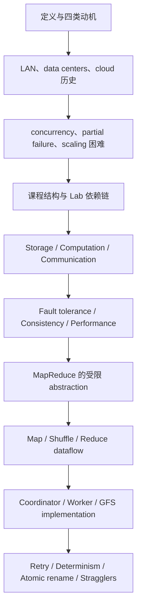

- 课程：MIT 6.824 Distributed Systems (Spring 2021)
- Lecture：1
- 视频分段：`Lecture 1 - Introduction`（Bilibili Part 1）
- transcript records：`1305`
- transcript 精确范围：首条 `00:00:00.920-00:00:02.600`；末条 `01:19:04.870-01:19:05.980`
- 笔记显示范围：`00:00:01-01:19:06`
- 分段数：`8`
- 官方文字讲义：`l01.txt`，共 `1` 个 text material page

## 学习目标

完成本讲后，应能：

1. 用课堂四要素定义 distributed system，并与 shared-memory multiprocessor 区分。
2. 解释建设 distributed systems 的四类动机：physical placement/sharing、parallelism、fault tolerance、security isolation。
3. 沿 local-area networks -> data centers -> cloud computing 复述老师给出的历史驱动力。
4. 解释 concurrency、partial failure、network partition/split brain 与性能扩展为何使系统难以设计。
5. 区分 storage、computation、communication infrastructure，并说明 distributed abstraction 的目标与边界。
6. 区分 availability、recoverability、consistency、throughput、latency 与 tail latency。
7. 画出 MapReduce 的 Map -> shuffle/group -> Reduce dataflow，并追踪 input、intermediate、output 的 storage/network path。
8. 解释 coordinator/worker、job/task、data locality、retry、determinism、atomic rename 与 backup tasks 如何共同构成课堂中的 MapReduce case study。

## 先修知识

- process、machine、network packet 的基本区别；
- function、input/output、key/value pair 与简单 sequential execution；
- concurrency 和 local disk 的直觉；
- 知道 RPC 是跨进程/机器调用的 communication abstraction 即可，本讲不要求掌握其 semantics；
- 不要求预先掌握 Raft、formal consistency models 或 GFS implementation，这些在本讲只作为后续课程或 MapReduce storage context 出现。

## 材料与证据边界

- [课程 MATERIALS 索引](/courses/mit-6824-s21/materials/)
- [计划中的 Lecture 1 阅读笔记](/courses/mit-6824-s21/readings/lecture-01/)
- 本地 transcript：`transcript.txt` / `transcript.jsonl` / `transcript.srt`
- preparation：`transcript+slides`，`8` sections，`1` material page
- 官方文字讲义：`materials/l01.txt`，所有引用统一写为 `[讲义：l01.txt p.1]`

课程级 `MATERIALS.md` 为 Lecture 1 列出 Introduction lecture note、MapReduce (2004) paper、官方 video 与 Lab 1。本文以课堂 transcript 决定 chronology；`l01.txt p.1` 只用于支持对应课堂概念。讲义或指定 paper 中未在课堂相应位置讲出的事实，不被插入课堂时间线。

## 教学主线



老师没有把 MapReduce 当作孤立算法。前半讲先建立 distributed-system goals 与 recurring tensions，后半讲再用 MapReduce 逐一展示 parallelism、communication cost、partial failure、abstraction、implementation 与 tail latency。Lab 1 则把学生放到 library implementer 的位置，让其亲自承担 application programmer 看不到的 complexity。

## 依赖图

### 概念依赖

1. **network-only interaction** 是 partial failure 与 failure ambiguity 的前提。
2. **partial failure + timeout** 导致“无响应不等于 crash”，继而导致 duplicate execution。
3. **duplicate execution** 要求 Map/Reduce 对同一 input 产生 deterministic output。
4. **duplicate Reduce attempts + shared final name** 需要 atomic publication；课堂使用 GFS atomic rename。
5. **many parallel tasks** 带来 throughput 潜力，也带来 shuffle traffic、load imbalance 与 stragglers。
6. **stragglers** 形成 tail latency；backup tasks 用额外 computation 换更快的 first completion。

### Lab 依赖

`Lab 1 MapReduce` 独立展示 computation framework；`Lab 2 Raft replication -> Lab 3 fault-tolerant key/value service -> Lab 4 sharded key/value service`。Lab 2/3 主要追求 fault tolerance，Lab 4 再用 shards 追求 parallel throughput（`00:22:27-00:24:41`）。

## 关键机制、例子与边界

| 主题 | 课堂机制/例子 | 得到什么 | 明确边界或代价 |
| --- | --- | --- | --- |
| distributed system | 多机、network packets、cooperation、service | 建立统一定义 | 不是只要联网就算；不同于 shared memory |
| parallelism | Map tasks、同时发生的 Zoom sessions | capacity/throughput 潜力 | workload 不可完全并行时不会线性扩展 |
| fault tolerance | replication、durable state、task retry | failure 时继续或修复后恢复 | communication/storage cost；coordinator 本讲不容错 |
| consistency | `Get(k)` 与 last `Put(k,v)` | 定义 concurrency/failure 下的 behavior contract | strong guarantee 需要 coordination；eventual guarantee 较弱 |
| tail latency | fan-out request、straggler | 识别 slowest participant 对 latency 的影响 | 增加 machines 不自动改善单请求 latency |
| MapReduce abstraction | programmer 只写 Map/Reduce | 隐藏 scheduling、data movement、failure | 不是 general-purpose；application 必须适配 model |
| data locality | Map 放到持有 GFS input 的 machine | 减少 input network traffic | shuffle 与 GFS output 仍可能跨网 |
| deterministic retry | same input -> same output | 允许 duplicate task attempts | 限制 function behavior |
| atomic rename | 两个 Reduce attempts 竞争 final name | 只暴露一个完整 output | 逻辑等价仍依赖 determinism |
| backup tasks | 尾部 task 多开 copies、取 first finisher | 缓解 straggler/tail latency | 消耗额外 machines |

## 误解与重点回听

- **“更多 machines 必然更快”**：只有 parallelizable work 能转化为 throughput；single-request latency 还会受 slowest participant 影响。[需回听 00:18:13] [需回听 00:42:10]
- **“无响应等于 crash”**：network partition 中 worker 可能仍运行，因此 coordinator retry 会产生 duplicate execution。[需回听 00:17:07] [需回听 01:10:29]
- **“replication 就是 sharding”**：前者在 Lab 2/3 主要服务 fault tolerance，后者在 Lab 4 以 partitioned work 提升 throughput。[需回听 00:23:42]
- **“MapReduce 接受任意程序”**：它用受限 functional/stateless model 换取 distribution hiding。[需回听 00:48:29] [需回听 00:49:55]
- **“Map/Reduce phases 完全无通信”**：各 task 可独立运行，但 shuffle 需要 reducers 从 mappers 拉取 data。[需回听 00:54:43]
- **“所有 MapReduce data 都在 GFS”**：input/output 在 GFS，Map intermediate data 在 worker local disk。[需回听 01:03:11]
- **“atomic rename 足以修复任意重复执行”**：rename 只原子发布完整文件，结果相同还依赖 deterministic functions。[需回听 01:12:40]
- **“整个 MapReduce framework 无单点 failure”**：本讲实现不处理 coordinator crash，whole job 重跑。[需回听 01:15:19]
- **字幕证据边界**：`00:53:17` 的 `c,2` 与前后及讲义的 `c,1` 冲突；`01:14:18` 的 local data “maybe” survives 与讲义按丢失后重算的提纲需区分 failure 情境，不应自行消解。[需回听 00:53:17] [需回听 01:14:18]

## 掌握标准

不看笔记时能完成以下任务，才算掌握本讲：

1. 在 60 秒内说清 distributed system 的四个定义要素和四类建设动机。
2. 画出 network partition 下两边都活着、却不能协调的 partial-failure 情境，并说明为什么 failure detector 只能 suspect。
3. 对比 availability 与 recoverability，并分别指出本讲对应的 replication 与 durable state/logging 思路。
4. 用一个 `Put`/`Get` sequence 解释 consistency contract，再说明 strong consistency、fault tolerance 与 performance 为什么互相施加成本。
5. 区分 throughput、latency、tail latency，并能解释为何 scale-out 不自动改善单请求延迟。
6. 手算三文件 word-count example，从 Map outputs 得到 `(a,2),(b,2),(c,1)`。
7. 画出 GFS input -> local Map -> local intermediate -> network shuffle -> Reduce -> GFS output，并标出 network edges。
8. 从 timeout 开始，完整推导 duplicate execution -> deterministic output -> atomic rename。
9. 解释 coordinator failure 为什么是本讲明确接受的边界，以及 backup tasks 为什么是 performance 策略而不是 correctness proof。
10. 能说出 MapReduce abstraction 的核心 tradeoff：限制 application model，换取对 scheduling、failure 和 data movement 的隐藏。

## 建议复习顺序

1. 先读第 1-2 段，建立定义、动机、历史和三类困难。
2. 快读第 3 段的课程行政内容，重点记住 Lab 2 -> 3 -> 4 的 dependency 与 replication/sharding 区别。
3. 精读第 4-5 段，做一张 fault tolerance / consistency / performance 对照表。
4. 手画第 6 段 word-count dataflow，亲自完成 grouping 与 Reduce。
5. 在第 7 段图上标出 coordinator、workers、GFS、local disk 和所有 network transfers。
6. 连续复习第 7 段末尾与第 8 段开头，口述“为什么 timeout 会产生 duplicate execution”。
7. 最后用第 8 段的 coordinator boundary 和 straggler strategy 检查自己是否能区分 correctness、availability 与 performance。

## 逐段详细课堂笔记

<div id="section-01" class="course-note-section-anchor" aria-hidden="true">&nbsp;</div>

# 第 1 段：分布式系统的定义、动机与历史起点

- 时间：`00:00:01-00:09:59`
- 证据：Lecture 1 transcript；官方文字讲义 `[讲义：l01.txt p.1]`

## 本段在整讲中的作用

本段完成整讲的第一步：先给出课程路线，再建立“什么是 distributed system、为什么要建它”的共同语言，最后开启历史背景。老师预告本讲将依次讨论定义、历史、课程结构、反复出现的主题，并用 MapReduce 作为第一个 case study；因此这里既是概念入口，也是后续 MapReduce 讨论的动机入口（`00:00:24-00:01:15`）。整讲讲义也以“定义、建设理由、困难、课程结构、主要主题、MapReduce”组织内容 `[讲义：l01.txt p.1]`。

## 教学展开

1. **先交代本讲路线。** 老师从课程 schedule 切入，说明本讲先问 distributed system 是什么，再补历史背景、课程结构和 recurring topics，最后用 MapReduce 及 Lab 1 展示这些主题（`00:00:01-00:01:25`）。
2. **从网络图景提炼定义。** 他画出 Internet、clients、servers 和内部也可能是 distributed system 的 data centers，再把定义压缩为四个要点：多台计算机、通过网络连接、只能以收发 packets 交互、共同提供某项 service（`00:01:31-00:02:58`）。这里特意与 multiprocessor 的 shared memory 交互作对比。
3. **说明分布式基础设施通常被隐藏。** 用户看到的可能只是 Zoom client，但后端是多个大型 data centers；distributed systems 构成 application infrastructure 的 backbone（`00:03:01-00:03:26`）。讲义相应强调“multiple cooperating computers”和大量 critical infrastructure 是分布式的 `[讲义：l01.txt p.1]`。
4. **依次给出四类建设动机。** 第一，连接物理分离的机器，并由此支持 data、screen、computing infrastructure 的共享（`00:03:38-00:05:13`）；第二，通过 parallelism 增加 capacity，MapReduce 和同时发生的大量 Zoom sessions 都是例子（`00:05:17-00:05:52`）；第三，通过物理分离容忍部分故障并获得 high availability（`00:05:57-00:06:20`）；第四，通过 isolation 把敏感服务放到接口狭窄的独立机器上，以缩小保护面（`00:06:24-00:07:18`）。讲义对这四点概括为 physical placement、parallelism、replication/fault tolerance 与 isolation/security `[讲义：l01.txt p.1]`。
5. **进入历史起点。** 老师把现代 distributed systems 的可辨认起点放在 1980s 的 local-area networks：MIT campus 上的 Athena workstations 与 AFS servers 是典型例子；当时 Internet 已存在，但 Internet-scale applications 主要是 DNS 和 email（`00:07:29-00:08:55`）。
6. **引出 data-center 时代。** 1980s 之后领域重要性快速上升；老师把下一阶段联系到 commercial Internet traffic、大型 websites 以及 web search、shopping 等应用（`00:08:57-00:09:58`），这一历史线将在下一段继续。

## 概念、模型与推导

### Distributed system 的课堂定义

课堂模型可写成：

`multiple computers + network-only interaction + cooperation -> service`

- **multiple computers**：不止一台机器；
- **networked**：机器通过网络相连；
- **packets only**：机器之间依赖发送和接收 packets，而不是 shared memory；
- **cooperating**：各机器不是彼此无关，而是合作交付同一 service。

这不是数学公式，而是老师在 `00:02:29-00:02:58` 给出的定义性分解；本段无数学推导。讲义用更短的“multiple cooperating computers”概括同一核心 `[讲义：l01.txt p.1]`。

### 四类动机之间的关系

- physical separation 首先解决远程连接，并派生出多用户共享；
- parallelism 把多机资源转换为 capacity；
- fault tolerance 希望局部故障不终止整体 service；
- isolation 通过分离敏感组件和收窄 interface 改善 security。

老师在本段只建立这些目标，没有声称它们可自动实现，也没有在此给出 replication protocol、consistency model 或性能公式。

## 例子与系统设计权衡

- **Zoom 前后端（`00:03:01-00:03:26`）**：服务于“抽象隐藏分布式基础设施”这一点。客户端界面简单，不代表后端不是跨多个 data centers 的复杂系统。
- **远程设备连接与共享（`00:04:12-00:05:13`）**：连接物理分离的机器带来协作能力，但服务因此依赖网络，而不再拥有 shared-memory 式交互。
- **MapReduce 与并发 Zoom sessions（`00:05:22-00:05:52`）**：前者预告 data-parallel computation，后者说明很多独立 session 也需要多机 capacity。二者都支持 parallelism 动机，但 workload 形态不同。
- **局部故障隔离（`00:05:57-00:06:20`）**：物理分离使“一部分 down、另一部分继续”成为可能；老师在这里提出目标，尚未说明如何判断故障或维持一致状态。
- **密码服务隔离（`00:06:37-00:07:16`）**：独立机器、无其他应用、窄 interface 能缩小 attack surface。权衡是 isolation 有助于 security，但本段没有说它足以保证 security。
- **Athena/AFS、DNS、email（`00:08:12-00:08:55`）**：用于对比早期 campus-scale 与 Internet-scale distributed systems，并为后来的 data centers 建立历史基线。

## 易错点与误解

- **误解：联网的多台机器就一定构成一个 distributed system。** 老师的定义还要求机器彼此合作交付某项 service（`00:02:29-00:02:58`）。
- **误解：distributed system 与 multiprocessor 的差别只是机器数量。** 本段强调交互模型不同：前者通过 packets，后者可以通过 shared memory（`00:02:39-00:02:47`）。
- **误解：用户看不到多机，就没有 distributed system。** Zoom 例子说明分布式后端常被 client abstraction 隐藏（`00:03:01-00:03:26`）。
- **误解：physical separation 只带来距离问题。** 老师也用它解释 sharing、fault isolation 与 security isolation，但这些收益仍需相应设计（`00:04:41-00:07:16`）。
- **误解：早期 Internet 已有今天这种大规模 Web 应用。** 老师明确区分 1980s 的 DNS/email 与后来兴起的大型 websites（`00:08:30-00:09:58`）。

## 掌握检查

1. **问：课堂定义 distributed system 的四个要点是什么？**  
   **答：** 多台计算机、通过网络连接、仅以 packets 收发交互、合作提供同一 service（`00:02:29-00:02:58`）。
2. **问：为什么 Zoom client 是“分布式基础设施被隐藏”的例子？**  
   **答：** 用户直接操作 client，但支撑应用的是一个或多个大型 data centers；client 隐去了后端分布式结构（`00:03:01-00:03:26`）。
3. **问：老师给出的四类建设动机是什么？**  
   **答：** 连接物理分离的机器并支持共享、以 parallelism 增加 capacity、容忍 faults 以获得 availability、以 isolation 改善 security（`00:03:50-00:07:18`；`[讲义：l01.txt p.1]`）。
4. **问：distributed system 与 multiprocessor 在本段中的关键区别是什么？**  
   **答：** distributed system 的机器靠网络 packets 交互；multiprocessor 可以通过 shared memory 交互（`00:02:39-00:02:47`）。
5. **问：老师用哪些系统代表 1980s 的历史起点？**  
   **答：** campus LAN 上的 Athena workstations/AFS servers，以及 Internet-scale 的 DNS 和 email（`00:08:12-00:08:55`；`[讲义：l01.txt p.1]`）。

## 复习与待核对项

- [需回听 00:01:54] 字幕在网络示意图中的主语缺失；复习时以老师明确说出的 clients、servers、data centers 和 networks 为准，不补画未被文字证据确认的节点。
- [需回听 00:04:34] 字幕缺词，但上下文持续解释“连接物理分离机器”是基本动机；不要把缺词扩写成新的第五类动机。
- [需回听 00:09:19] 老师口述 data-center/大型网站阶段的年代较含混；讲义写作 “late 1990s/early 2000s” `[讲义：l01.txt p.1]`，课堂 chronology 应保留两者的证据边界。
- 复习顺序：先复述四要素定义，再解释四类动机，最后用 Athena/AFS -> DNS/email -> data centers 串起本段历史线。

<div id="section-02" class="course-note-section-anchor" aria-hidden="true">&nbsp;</div>

# 第 2 段：从 data centers 到 cloud computing，以及分布式系统为何困难

- 时间：`00:10:01-00:20:01`
- 证据：Lecture 1 transcript；官方文字讲义 `[讲义：l01.txt p.1]`

## 本段在整讲中的作用

本段承接上一段尚未讲完的历史线：大型 websites 为什么推动 data centers，cloud computing 又如何把内部基础设施变成面向外部用户的服务。老师随后从“领域为何重要”转到“问题为何困难”，把 concurrency、partial failure 和难以兑现的性能潜力列为学习本课的直接理由（`00:10:01-00:19:58`）。这正对应讲义的 HISTORICAL CONTEXT、But 和 Why take this course 三组提纲 `[讲义：l01.txt p.1]`。

## 教学展开

1. **大型网站带来两种规模压力。** web search 需要 crawl 全部网页并构建 reverse index，数据和计算都无法装进一台机器；同时，大型网站要服务数以亿计的 users。大量机器被集中到 data centers 以承载这两类压力（`00:10:01-00:10:50`）。
2. **由 data centers 过渡到 cloud computing。** 在老师口述的 mid/late 2000s，customers 开始把 computation 和 data 迁到 Amazon、Google、Microsoft 等运营的数据中心，原先在 desktop/laptop 上运行的应用转而在 cloud 内运行（`00:11:06-00:12:00`）。
3. **cloud users 也开始建设大系统。** 用户不只外包日常计算，还在 cloud 上运行大型 websites 和针对大数据的 machine learning 等计算；cloud providers 因而建设可供外部用户使用的 infrastructure，以支持多机 parallelism、performance 和大量 storage（`00:12:04-00:12:45`）。
4. **解释课程为何依赖 systems papers。** 早期 data-center engineers 虽为内部需求建系统，却发表了研究论文；课程因此能从真实的大规模挑战与解决方案中学习。cloud services 公共化后，可研究、可使用的 infrastructure 又更多（`00:12:47-00:14:25`）。讲义也指出，这一领域由大型 Web sites 推动，今天仍是活跃的 research/development area `[讲义：l01.txt p.1]`。
5. **收束历史判断。** 老师以自己 1980s 从事 distributed systems 博士研究的经历作对比：当时实践多局限于 local-area clusters，如今已成为快速发展的研究与工程领域（`00:14:29-00:15:04`）。
6. **提出第一类困难：many concurrent parts。** 一项工作可能由成千上万甚至更多机器同时执行；大量 concurrent software 使 correctness reasoning 变难（`00:15:16-00:16:16`）。
7. **提出第二类困难：partial failure。** 一台机器 down 不等于整体停止；其余机器可能继续服务。更棘手的是 network partition：双方都可能仍在运行并服务 clients，却不能彼此通信，形成 split-brain syndrome（`00:16:22-00:17:41`）。
8. **提出第三类困难：性能潜力不自动兑现。** 购买更多机器只在任务可有效并行时提高 capacity；现实 workload 往往不能完全并行，所以 throughput 随机器数线性增长并不直接成立（`00:17:42-00:18:29`）。
9. **由困难导向选课理由。** 老师依次强调 hard problems/powerful solutions、现实系统广泛使用、活跃研究与 open problems，以及 labs 带来的 hands-on distributed programming 经验（`00:18:35-00:20:01`）。讲义用同样四点概括课程价值 `[讲义：l01.txt p.1]`。

## 概念、模型与推导

### 历史驱动力模型

`large datasets + many users -> many machines in data centers`

`outsourced computation/storage + users' own large workloads -> public cloud infrastructure`

这两条是课堂因果链，不是定量公式。前者解释 data centers 的兴起，后者解释 cloud providers 为什么要暴露更多 distributed infrastructure。

### Partial failure 与 split brain

- **partial failure**：系统一部分失败，其他部分仍可能运行；因此不能把“某节点无响应”简单等同于“整个系统停止”（`00:16:22-00:16:48`）。
- **network partition**：系统两部分互相不可通信，但各自可能继续计算并与 clients 交互（`00:17:07-00:17:30`）。
- **split-brain syndrome**：两边都继续行动、甚至接触相同 clients，却无法相互协调的局面（`00:17:14-00:17:34`）。

### 性能目标的限定条件

老师没有给出正式 speedup 公式，只给出条件判断：只有 workload 足够 parallelizable，增加 machines 才可能让 throughput 随之提高（`00:18:06-00:18:29`）。讲义也警告“tricky to realize performance potential” `[讲义：l01.txt p.1]`。本段无数学推导。

## 例子与系统设计权衡

- **reverse index（`00:10:05-00:10:34`）**：服务于“数据和计算都超过单机”的论证。把网页 crawl 与 indexing 分布到 data center，是规模需求推动架构变化的例子。
- **数亿 users（`00:10:39-00:10:46`）**：即使单个请求不大，同时用户数也会产生 capacity 压力。
- **cloud 上的 machine learning（`00:12:04-00:12:41`）**：用户获得大规模资源，但 cloud provider 必须提供可扩展的 compute/storage infrastructure。
- **真实 systems papers（`00:13:27-00:14:25`）**：课程选择工程论文，是因为它们记录了真实规模下的 problem、solution 与经验；老师没有在此保证旧系统仍原样使用。
- **network partition（`00:17:07-00:17:34`）**：继续服务有利于 availability，却可能产生不能协调的两套行为；本段只提出难题，还没有给出 protocol 解法。
- **加机器（`00:18:06-00:18:29`）**：潜在收益是 throughput，前提是工作可并行；不可并行部分和交互会削弱收益。讲义将这一点概括为性能潜力难以实现 `[讲义：l01.txt p.1]`。

## 易错点与误解

- **误解：data centers 只因为数据太大。** 老师给出两类压力：huge datasets 和 huge user populations（`00:10:01-00:10:46`）。
- **误解：cloud computing 只是把本地应用放到远程机器。** 本段还强调 cloud users 自己建设大型网站和大规模计算，促使 providers 提供新的用户可见基础设施（`00:12:04-00:12:45`）。
- **误解：节点无响应就能确定它已 crash。** network partition 中节点可能仍在运行；这正是 partial failure 难推理之处（`00:17:07-00:17:34`）。
- **误解：更多 machines 必然带来成比例 throughput。** 只有任务能有效 parallelize 时才可能接近这一目标（`00:18:06-00:18:29`）。
- **误解：课程只是介绍现成产品。** 老师强调 hard problems、open research questions 和通过 labs 建系统的能力（`00:18:49-00:20:01`；`[讲义：l01.txt p.1]`）。

## 掌握检查

1. **问：大型 websites 为什么促成 data centers？**  
   **答：** reverse indexing 等工作产生单机装不下的数据和算不完的计算，同时网站还要服务极多 users，因此需要大量机器（`00:10:01-00:10:46`）。
2. **问：cloud computing 对 distributed infrastructure 的需求发生了什么变化？**  
   **答：** computation/storage 被外包到 providers，用户又在 cloud 上运行自己的大型网站和大数据计算，促使 providers 提供可扩展的 compute/storage infrastructure（`00:11:23-00:12:45`）。
3. **问：partial failure 为什么比整体停机更难推理？**  
   **答：** 一部分失败或失联时，其他部分仍可能服务；在 network partition 下双方都可能继续行动，形成 split brain（`00:16:22-00:17:34`）。
4. **问：增加 machines 为什么不保证 throughput 线性增长？**  
   **答：** 只有可并行部分能从更多机器获益，现实任务常有不能完全并行或需要交互的部分（`00:18:06-00:18:29`；`[讲义：l01.txt p.1]`）。
5. **问：老师给出的四个选课理由是什么？**  
   **答：** 问题有趣且解法有力、现实系统广泛使用、研究活跃且有 open problems、labs 提供 hands-on distributed programming（`00:18:49-00:20:01`）。

## 复习与待核对项

- [需回听 00:11:18] 老师对 cloud computing 兴起年代的口述是宽泛范围，不要将其压成未经课堂确认的单一年份。
- [需回听 00:16:04] 字幕把 MapReduce 年代转成 “early 90s”，与本讲其他证据不协调；本段只保留“约 2000 machines 共同处理一项工作”的课堂论点，不用该字幕断言论文年份。
- [需回听 00:17:30] 确认 split-brain syndrome 的上下文：双方可能都活着并服务 clients，核心不是“两台机器同时坏掉”。
- 复习顺序：先画出 data centers -> cloud 的历史因果链，再分别解释 concurrency、partial failure、performance 三类困难，最后对应到四个选课理由。

<div id="section-03" class="course-note-section-anchor" aria-hidden="true">&nbsp;</div>

# 第 3 段：课程结构、Lab 依赖链与实验运行模型

- 时间：`00:20:01-00:30:01`
- 证据：Lecture 1 transcript；官方文字讲义 `[讲义：l01.txt p.1]`

## 本段在整讲中的作用

老师在完成 distributed systems 的历史与难点导入后，暂停接受提问，然后具体说明课程怎样把这些难题变成 papers、labs、project 和 exams。核心不是行政信息本身，而是建立 Lab 1 到 Lab 4 的技术依赖：MapReduce -> Raft replication -> fault-tolerant key/value service -> sharded key/value service（`00:21:01-00:24:41`）。段末通过学生提问说明 labs 如何在单机上模拟多机，这为下一段转入 infrastructure 技术内容作准备。

## 教学展开

1. **从互动方式转入课程结构。** 老师邀请学生通过 chat 或举手提问，然后说明 lectures 关注 big ideas，并经常用 paper 作为具体 case study（`00:20:24-00:21:39`）。
2. **解释 paper 预习机制。** 多数 paper 要求学生课前回答一个问题并提交自己的问题，目的在于让课堂能深入讨论，而不是现场第一次接触材料（`00:21:39-00:22:07`）。讲义同样强调课前阅读与 question/answer `[讲义：l01.txt p.1]`。
3. **按依赖顺序介绍四个 labs。** Lab 1 实现 MapReduce library；Lab 2 用 Raft 在 failures 和 partitioned networks 下实现 replication；所得 replicated state machine library 支撑 Lab 3 的 replicated key/value service；Lab 4 用多个 Lab 3 实例分别管理 shards，并根据 load 迁移 keys，以 parallelism 提高 throughput（`00:22:14-00:24:37`）。
4. **强调累积依赖的工程后果。** Labs 2、3、4 相互叠加，Lab 2 的 bug 可能直到 Lab 4 才暴露。课程公开 test cases，并用同样 tests 评分；这些 tests 会触及 corner cases，故 debugging 耗时，老师建议尽早开始（`00:24:41-00:25:58`）。
5. **说明 optional project 与 exams。** 两三人项目可替代 Lab 4，题目需与 staff 讨论确认；另有 mid-term 和 final，课程要求还包括 labs、paper questions 与课堂参与（`00:26:04-00:27:29`）。讲义对 project replacement 和两次 exams 有一致概括 `[讲义：l01.txt p.1]`。
6. **介绍 course staff。** 四位 TAs 简短介绍背景，老师同时指出 office hours 可帮助学生完成 labs（`00:27:33-00:29:01`）。
7. **回答 labs 如何模拟多机。** 实验在同一 machine 上启动许多 processes，并使用 labs 自带的 RPC library，让这些 processes 像位于不同 physical machines 上一样通信（`00:29:03-00:29:26`）。
8. **开启 Lab 4 与现实系统的比较。** 学生问 Lab 4 是否类似已有程序；老师从 key/value services（提到 Redis）开始回答，完整回答延续到下一段（`00:29:42-00:30:01`）。

## 概念、模型与推导

### Lab 技术依赖图

`Lab 1: MapReduce library`

`Lab 2: Raft replication -> replicated state machine library`

`Lab 2 + Lab 3: replicated key/value service`

`many Lab 3 instances + sharding + key movement -> Lab 4 throughput`

其中，Lab 2/3 主要把多机用于 fault tolerance；老师特别指出，按同一顺序执行的 replicas 并不会自然提供更高 performance。Lab 4 才通过 shards 的并行处理追求 throughput（`00:23:42-00:24:37`）。这与讲义列出的四个 labs 一致 `[讲义：l01.txt p.1]`。

### 单机上的分布式实验模型

`one physical machine -> many processes + RPC -> simulated separate machines`

这是实验部署模型，不代表真实 distributed systems 的所有物理条件都被复制。本段无数学公式或正式推导。

## 例子与系统设计权衡

- **paper-driven lecture（`00:21:16-00:22:07`）**：paper 提供 big idea 的落地 case；代价是学生必须课前阅读，才能把课堂时间用于更深讨论。
- **replication 与 sharding（`00:23:42-00:24:37`）**：replication 的课堂目标是 failure 下继续服务；sharding 把 key space 分开以获得 parallelism。不能把二者的主要收益混为一谈。
- **跨 lab 复用代码（`00:24:41-00:25:58`）**：复用让后续系统逐层建立，但也扩大早期 bug 的影响范围，所以 public tests 和提前 debugging 很重要。
- **optional project（`00:26:04-00:26:46`）**：自主选题换取探索空间，但项目需由 staff 控制 scope；它替代的是 Lab 4，不是全部 labs。
- **多 process + RPC（`00:29:03-00:29:26`）**：在一台机器上降低实验部署成本，同时保留 message/RPC 接口；这只是实验环境的实现选择。

## 易错点与误解

- **误解：课程有很多彼此独立的小 labs。** 老师把它们归为四个 major labs，并强调 Labs 2、3、4 层层依赖（`00:22:14-00:24:48`）。
- **误解：replication 自动增加 throughput。** 本段明确说 replicas 要按特定顺序执行，单靠 replication 不带来性能提升；Lab 4 的 sharding 才用于 parallelism（`00:23:42-00:24:26`）。
- **误解：通过当前 lab tests 就证明实现绝无 bug。** 老师说 tests 尽力覆盖 corner cases，并在发现遗漏时改进；他没有给出形式化完备性保证（`00:24:50-00:25:39`）。
- **误解：optional project 是额外必做作业。** 它是 Lab 4 的替代方案，且需两三人组队并经 staff 确认（`00:26:04-00:26:46`；`[讲义：l01.txt p.1]`）。
- **误解：labs 必须拥有多台 physical machines。** 课程用一台机器上的多个 processes 和 RPC 模拟（`00:29:03-00:29:26`）。

## 掌握检查

1. **问：为什么课程要求 paper 在 lecture 前阅读并提交问题？**  
   **答：** 让 paper 作为 big idea 的 case study，并使课堂能直接深入问题、实现和讨论（`00:21:16-00:22:07`）。
2. **问：Labs 2、3、4 的依赖关系是什么？**  
   **答：** Lab 2 产出 Raft-based replicated state machine；Lab 3 用它建 fault-tolerant key/value service；Lab 4 运行多个 Lab 3 实例并 sharding（`00:22:41-00:24:41`）。
3. **问：为什么 Lab 4 需要 sharding，而不是只增加 replicas？**  
   **答：** replicas 主要服务 fault tolerance，且要按顺序执行；shards 可并行处理不同部分，从而提高 throughput（`00:23:42-00:24:31`）。
4. **问：老师为什么反复建议尽早开始 labs？**  
   **答：** tests 会触发难复现的 corner cases，debugging 可能长时间卡在某一处；后续 lab 又依赖早期代码（`00:24:41-00:25:58`；`[讲义：l01.txt p.1]`）。
5. **问：labs 在一台机器上如何模拟 distributed system？**  
   **答：** 启动多个独立 processes，并通过实验自带的 RPC library 通信，模拟位于不同机器上的节点（`00:29:03-00:29:26`）。

## 复习与待核对项

- [需回听 00:23:07] 字幕在 replicated state machine 的解释处语序破碎；复习时抓住“Lab 2 library 被用于在多台机器复制同一 state machine”这一明确链条。
- [需回听 00:27:12] 老师口述中先出现 “6.828” 再说 “6.824”；评分细节应以课程网页为准，本笔记不从该口误推导其他课程要求。
- [需回听 00:28:45] TA 自我介绍的一小段字幕缺词，与技术主线无关，不据此补写身份信息。
- [需回听 00:29:57] Lab 4 与现实 key/value services 的回答跨越分段边界，需连同下一段开头一起复习。
- 复习顺序：先画 Lab 2 -> Lab 3 -> Lab 4 依赖，再解释 replication 与 sharding 的目标差异，最后说明单机多 process 的实验模型。

<div id="section-04" class="course-note-section-anchor" aria-hidden="true">&nbsp;</div>

# 第 4 段：Infrastructure abstractions、fault tolerance 与 consistency

- 时间：`00:30:01-00:39:58`
- 证据：Lecture 1 transcript；官方文字讲义 `[讲义：l01.txt p.1]`

## 本段在整讲中的作用

本段先收完关于 labs 的课堂问答，然后正式建立 6.824 的技术坐标系：课程研究支撑 applications 的 storage、computation、communication infrastructure，并寻找能隐藏 distribution complexity 的 abstractions。老师接着展开第一个 recurring topic：fault tolerance 的 availability 与 recoverability，以及第二个 topic：consistency contract。段末用 `Get` 是否返回最近一次 `Put` 的值留下问题，下一段将继续讨论 consistency/performance tradeoff。

## 教学展开

1. **把 Lab 4 与实践连接起来。** key/value services 是 data centers 中常见的服务，现实系统面对与 labs 相似的问题；课程会构建具有较强 semantics 的版本，Raft 也被广泛使用（`00:30:01-00:30:36`）。老师同时提醒，课程系统与实践产品仍会有差异。
2. **回答早期 bug 如何影响后续 labs。** 学生继续使用自己的代码；tests 会不断改进，但复杂实现仍可能需要重写。老师宣布新增 Q&A lectures，展示 staff solutions，供学生与自身设计比较（`00:30:49-00:32:18`）。
3. **界定课程关注面。** 课程主要研究 application 下方的 infrastructure，而非 application logic 本身。infrastructure 分三类：storage（key/value servers、file systems）、computation（MapReduce 等 frameworks）、communication（尤其 RPC 及其 semantics）（`00:32:46-00:34:35`）。讲义也把三类基础设施列为 Storage、Communication、Computation `[讲义：l01.txt p.1]`。
4. **提出 abstraction 目标。** 课程寻找 RPC、MapReduce library、key/value service 等有用 abstractions，并尽量让 distributed abstraction 看起来像熟悉的 sequential abstraction。例如，多机 storage system 希望表现得像 laptop 上的单机 file system，同时得到 replication 带来的 fault tolerance 和多机可能带来的 performance（`00:34:41-00:35:52`）。
5. **马上划定 abstraction 的边界。** 老师强调“看起来像”不等于“完全相同”；在实践中精确实现单机行为非常困难，这会反复出现（`00:35:56-00:36:02`）。
6. **拆解 fault tolerance。** availability 指 failures 存在时 system 仍能交付 service；recoverability 指 failed machine 重启后恢复 state 并重新参与系统，避免机器逐台减少直至服务消失（`00:36:07-00:37:50`）。
7. **给出两类核心技术。** replication 是 availability 的 key technique；logging、transactions 以及写 durable storage 是 recoverability 的关键，使 power failure 后数据仍能从 disk 恢复（`00:37:53-00:38:27`）。讲义也把 replicated servers 列为 fault-tolerance 的 big idea `[讲义：l01.txt p.1]`。
8. **定义 consistency。** consistency 是 server 针对 concurrency 与 failure 给 operations 的 behavior contract；理想目标接近 single sequential machine。老师用 key/value server 提问：`Get(k)` 是否返回最近一次 `Put(k,v)` 的值（`00:38:29-00:39:58`）。在单机顺序执行中答案直观，多机、并发和 failure 下则不再显然。

## 概念、模型与推导

### Infrastructure 三分法

- **Storage**：durably store data，例如 file system、key/value service；
- **Computation**：组织 distributed computation，例如 MapReduce framework；
- **Communication**：连接组件，例如 RPC，并需要说明 at-most-once、exactly-once、at-least-once 等 semantics（`00:33:47-00:34:35`）。本段只预告这些 RPC semantics，不作定义或比较。

### Abstraction 目标

`distributed implementation -> sequential-looking contract`

抽象希望隐藏机器数量、failure 与 communication 等 complexity，但老师明确保留边界：distributed system 的行为可能只“类似”单机，并非必然完全相同（`00:35:15-00:36:02`）。讲义将总目标写为“abstractions that hide the complexity of distribution” `[讲义：l01.txt p.1]`。

### Fault tolerance 的两个维度

- `availability = failures 发生时仍能 make progress / deliver service`
- `recoverability = failure 修复后恢复 state 并回到 service`

课堂把 availability 与“多个 9”联系起来，并口述 `0.999 reliability`（`00:36:50-00:37:03`）；这只是指标示例，没有在本段换算 downtime。

### Consistency contract

顺序基线：

`Put(k, v1); Put(k, v2); Get(k) -> v2`

这是一种对老师口头例子的符号化记录：在没有 concurrency 的 single machine 上，`Get` 应返回 last `Put` 的值（`00:39:15-00:39:51`）。本段尚未给出多机并发时的正式 consistency model 或证明。

## 例子与系统设计权衡

- **课程 KV service 与现实系统（`00:30:01-00:30:36`）**：labs 接近实际问题，并采用较强 semantics；权衡是教学系统不等于生产系统，后续课程会讨论为何实践可能采用不同强度的 semantics。
- **逐层复用 lab code（`00:30:49-00:32:18`）**：复用验证早期 abstraction 的可组合性，但错误结构也会传播，必要时重写是合理工程选择。
- **RPC semantics（`00:34:11-00:34:35`）**：communication abstraction 不只是“消息能发出”，还必须定义一次调用可能执行几次；具体模型留到下一讲。
- **多机 storage 看起来像单机（`00:35:15-00:36:02`）**：易用性来自 familiar contract；实现难度来自 replication、failure 与 concurrency，需要在后续课程中不断校准 abstraction boundary。
- **replication 与 durable state（`00:37:53-00:38:27`）**：前者帮助 failure 期间继续服务，后者帮助节点回来后恢复。它们处理 fault tolerance 的不同阶段，不能互相替代。
- **last Put / Get（`00:39:15-00:39:58`）**：用最简单的 sequential expectation 暴露 distributed concurrency 下 contract 不再显然的问题。

## 易错点与误解

- **误解：课程主要教 application feature development。** 课程焦点是支撑 applications 的 infrastructure（`00:32:46-00:33:24`）。
- **误解：distributed abstraction 一定与 single-machine abstraction 完全等价。** 老师只把它设为理想方向，并明确说实践中很难做到完全相同（`00:35:15-00:36:02`）。
- **误解：availability 与 recoverability 是同一个性质。** 前者问 failure 时能否继续服务，后者问修复后能否恢复 state、重新加入（`00:36:37-00:37:50`）。
- **误解：replication 足以解决所有 fault tolerance。** 老师把 replication 主要对应 availability，把 durable storage/logging/transactions 对应 recoverability（`00:37:53-00:38:27`）。
- **误解：`Get` 返回 last `Put` 在 distributed system 中天然成立。** concurrency、failure 与多机 replicas 使“last”及可见性需要 contract（`00:38:29-00:39:58`；`[讲义：l01.txt p.1]`）。

## 掌握检查

1. **问：课程把 infrastructure 分成哪三类？**  
   **答：** Storage、Computation、Communication（`00:33:20-00:34:54`；`[讲义：l01.txt p.1]`）。
2. **问：distributed abstraction 的总体目标与边界是什么？**  
   **答：** 尽量呈现熟悉的 sequential contract、隐藏 distribution complexity；但 failure、concurrency 和多机实现使其很难完全等同于单机（`00:34:57-00:36:02`）。
3. **问：availability 与 recoverability 分别回答什么问题？**  
   **答：** availability 问 failure 期间服务是否继续；recoverability 问节点修复后能否恢复 state 并重新加入（`00:36:37-00:37:50`）。
4. **问：老师分别把哪些技术对应到 availability 和 recoverability？**  
   **答：** availability 主要靠 replication；recoverability 主要靠 logging/transactions 与 durable storage（`00:37:53-00:38:27`）。
5. **问：为什么 `Get(k)` 是否返回 last `Put(k,v)` 是 consistency 问题？**  
   **答：** consistency 定义 concurrency 与 failure 下 operations 的 behavior contract；单机顺序场景直观，多机并发场景则需要明确保证（`00:38:29-00:39:58`）。

## 复习与待核对项

- [需回听 00:30:23] “strong semantics”的强度在此没有正式命名；不要提前把它等同于后续课程中的某个特定 consistency model。
- [需回听 00:34:29] 字幕写 “utmost once”，语境是 RPC 的 at-most-once / exactly-once / at-least-once；本段仅记录术语预告。
- [需回听 00:37:01] 老师口述 `0.999 reliability`，未给统计窗口或 downtime 换算，不应自行补算 service-level 指标。
- [需回听 00:39:15] `Get`/`Put` 问题在下一段继续；复习时连到下一段开头的 strong/eventual consistency 对比。
- 复习顺序：三类 infrastructure -> abstraction 目标与边界 -> availability/recoverability -> `Get`/`Put` consistency contract。

<div id="section-05" class="course-note-section-anchor" aria-hidden="true">&nbsp;</div>

# 第 5 段：Consistency/performance 权衡与 MapReduce 的设计动机

- 时间：`00:39:58-00:49:57`
- 证据：Lecture 1 transcript；官方文字讲义 `[讲义：l01.txt p.1]`

## 本段在整讲中的作用

本段先回答上一段留下的 consistency contract 问题：distributed systems 可以提供接近 sequential machine 的 strong consistency，也可以只提供较弱的 eventual consistency。老师随即把 consistency、fault tolerance 和 performance 放进同一设计空间，说明课程将反复研究其 tradeoffs。之后，他用 tail latency 和 implementation complexity 补全 recurring topics，再将这些主题集中映射到第一个 case study MapReduce：为什么它影响巨大、为何适合作为 Lab 1、以及它如何以受限 computational model 换取对 distribution 的隐藏。

## 教学展开

1. **展开 consistency spectrum。** 有的 contract 提供 strong consistency，行为近似 sequential machine；有的保证更弱，例如 eventual consistency，只承诺 `Get` 最终会看到 `Put`，不保证立即看到（`00:39:58-00:40:27`）。
2. **解释不同 contract 的原因。** strong consistency 要求 machines 彼此 communication；fault tolerance 需要复制 data，可能还要写 durable storage。这些动作都有 performance cost，因此三者很难同时做到最强（`00:40:29-00:41:24`）。
3. **给出设计实践的结论。** 现实系统会牺牲一部分 consistency 或 fault tolerance 来换 performance，形成宽广的 design spectrum（`00:41:24-00:41:38`）。讲义同样把 fault tolerance、consistency、performance 称为彼此的“enemies”，并指出存在许多 design points `[讲义：l01.txt p.1]`。
4. **区分 throughput 与 latency。** 更多 machines 可能提高 throughput；但单个 request 的 low latency 更难。当一次 Web request 需要很多 machines 参与时，一台慢机器就能拖慢整体 user experience，这被称为 tail latency（`00:41:44-00:42:38`）。
5. **补上 implementation topic。** concurrency management、RPC implementation、crashes 与多项目标组合在一起，使 distributed-system implementation 本身成为反复出现的挑战（`00:42:50-00:43:31`）。讲义将实现主题概括为 RPC、threads、concurrency control `[讲义：l01.txt p.1]`。
6. **转入 MapReduce case study。** 老师选择它，是因为它同时展示 fault tolerance、performance、tail latency 等课程主题，又非常 influential，并直接对应 Lab 1（`00:43:45-00:45:09`）。实现 library 会让此前容易忽略的问题暴露出来（`00:45:12-00:45:44`）。
7. **建立原始 workload context。** 早期 Google search 需要对 World Wide Web 构建 reverse index；这些 computations 持续数小时、处理 terabytes of data，并在很多 machines 上运行，因此某台 machine 在期间 crash 很可能发生（`00:46:04-00:47:52`）。
8. **提出设计目标。** 很多想分析已抓取网页的 Google engineers 并非 distributed-systems experts。MapReduce 希望让他们只写 Map 与 Reduce 的 sequential functions，而 framework 处理部署、load balancing、slow machines 与 crashes（`00:47:23-00:49:46`）。
9. **明确能力边界。** MapReduce 不是 general-purpose library；application 必须写成 Map/Reduce 的 functional、stateless style。这个限制正是 framework 能透明处理 distribution 的条件（`00:48:29-00:49:57`）。讲义也同时记录了“easy for non-specialist programmers”和“limits what apps can do” `[讲义：l01.txt p.1]`。

## 概念、模型与推导

### Consistency spectrum

- **strong consistency**：课堂在此用“行为接近 sequential machine”作非正式描述（`00:40:02-00:40:10`）；
- **eventual consistency**：`Get` 最终会看到某次 `Put` 的结果，但不保证立即可见（`00:40:19-00:40:27`）。

老师尚未在本讲给出形式化 history、ordering 或 consistency theorem，因此不能从这些口头描述推导具体模型边界。

### 三目标 tradeoff

`strong consistency -> more inter-machine communication -> performance cost`

`fault tolerance -> replication (+ durable writes) -> performance cost`

由此得到课堂结论：系统设计需在 consistency、fault tolerance、performance 之间选点，而不是假设三者都能无成本最大化（`00:40:29-00:41:38`；`[讲义：l01.txt p.1]`）。

### Performance 的两个维度

- **throughput**：单位时间完成的总工作量，目标是随 machines 增加而扩大；
- **latency**：单个 request 的响应时间；
- **tail latency**：当 request fan-out 到许多 machines 时，被慢节点拖长的尾部响应（`00:41:44-00:42:38`）。

本段无数学公式推导，也没有给出 percentile 定义。

### MapReduce 的 abstraction bargain

`restricted functional/stateless Map + Reduce code -> framework can hide distribution concerns`

这是课堂给出的设计交换：application programmer 放弃 general-purpose computation，换取 framework 处理多机运行、load balancing、slow workers 和 crashes（`00:48:29-00:49:57`）。

## 例子与系统设计权衡

- **eventual `Get`（`00:40:19-00:40:27`）**：较弱 guarantee 可能减少立即协调，但 programmer 必须接受 `Get` 不立刻看到最新 `Put`。
- **replication 与 durable write（`00:41:00-00:41:14`）**：提高 fault tolerance 需要传输和持久化 data；额外 communication/storage work 会消耗 performance。
- **Web request fan-out（`00:42:06-00:42:38`）**：并行调用许多 machines 可能支持复杂服务，但整体 latency 会受最慢参与者影响。
- **实现问题（`00:42:50-00:43:26`）**：RPC、concurrency、crashes 不是与高层 contract 分离的杂务；它们直接决定 consistency、fault tolerance 与 performance 能否实现。
- **Google reverse index（`00:46:04-00:47:52`）**：workload 大到必须多机且运行很久，放大了 worker crash 的概率，因而需要把 fault tolerance 做进 framework。
- **受限 programming model（`00:48:29-00:49:57`）**：限制 application expressiveness，换来 non-expert programmer 可写简单 sequential functions、framework 自动处理 distribution。

## 易错点与误解

- **误解：eventual consistency 表示 `Get` 永远可以返回任意值。** 老师只说它允许结果不立即反映 `Put`，但最终要看到该结果（`00:40:19-00:40:27`）。
- **误解：strong consistency、fault tolerance、performance 可以分别优化且互不影响。** communication、replication 和 durable writes 把三者耦合起来（`00:40:48-00:41:38`）。
- **误解：增加 machines 同时等比例改善 throughput 和 latency。** 老师把两者分开，并指出 low latency 尤其受 slowest participant 影响（`00:41:44-00:42:38`）。
- **误解：MapReduce 是把任意程序自动变成 fault-tolerant distributed program。** application 必须符合受限的 functional/stateless Map/Reduce model（`00:48:29-00:49:57`）。
- **误解：application programmer 与 MapReduce implementer 承担同样复杂度。** framework 的目标正是让前者不处理 load balance、slow machines 和 crashes；Lab 1 学生则要实现这个隐藏层（`00:45:23-00:45:44`, `00:49:25-00:49:46`）。

## 掌握检查

1. **问：strong consistency 与 eventual consistency 在本段中的非正式区别是什么？**  
   **答：** 前者尽量像 sequential machine；后者允许 `Get` 暂时看不到 `Put`，但最终会看到（`00:40:02-00:40:27`）。
2. **问：为什么 strong consistency 和 fault tolerance 都可能降低 performance？**  
   **答：** strong consistency 需要 machines 协调；fault tolerance 需要 replication，可能还要 durable writes，这些都增加 communication/storage work（`00:40:48-00:41:14`）。
3. **问：throughput 与 tail latency 分别关注什么？**  
   **答：** throughput 关注总体处理率；tail latency 关注 fan-out request 被少数慢节点拖长的响应尾部（`00:41:44-00:42:38`）。
4. **问：MapReduce 为什么适合早期 Google 的 data-analysis workload？**  
   **答：** workload 处理 terabytes、运行数小时、依赖大量 machines；framework 让非专家只写 Map/Reduce functions，并处理多机故障和调度（`00:46:04-00:49:46`）。
5. **问：MapReduce 隐藏 distribution 的代价是什么？**  
   **答：** 它不是 general-purpose；程序必须适配 functional、stateless 的 Map/Reduce computational model（`00:48:29-00:49:57`；`[讲义：l01.txt p.1]`）。

## 复习与待核对项

- [需回听 00:40:14] 字幕缺失了较弱 consistency guarantees 的一个短语；本笔记只采用随后明确举出的 eventual consistency。
- [需回听 00:43:20] 字幕末句严重破碎；可确认的课堂意思是 performance、consistency、fault tolerance 与 crashes/concurrency 共同驱动 implementation complexity。
- [需回听 00:47:15] 人名字幕只清楚给出 “Sanjay” 与 “Jeffrey Dean”；不据此补写论文作者全名或角色。
- [需回听 00:49:55] 句子跨到下一段且字幕疑似漏掉否定词；结合 `00:48:34-00:48:45` 的明确陈述，应复习为“MapReduce 不是 general-purpose，key/value service 不适合直接套用该 model”，而不是孤立解读单句。
- 复习顺序：consistency spectrum -> 三目标 tradeoff -> throughput/tail latency -> MapReduce workload -> restricted model 换取 abstraction。

<div id="section-06" class="course-note-section-anchor" aria-hidden="true">&nbsp;</div>

# 第 6 段：MapReduce 抽象数据流、word count 与 shuffle

- 时间：`00:49:57-00:59:57`
- 证据：Lecture 1 transcript；官方文字讲义 `[讲义：l01.txt p.1]`

## 本段在整讲中的作用

上一段解释了 MapReduce 为什么以受限 model 换取 distribution hiding；本段开始回答“programmer 实际写什么、数据怎样流动”。老师先画三个 input files 的 abstract view，用 word count 逐步讲清 Map、intermediate key/value pairs、shuffle/grouping 和 Reduce，再用 sorting 说明同一 model 可承载不同 workload。最后，他打开 paper 中的 pseudocode，把抽象图映射回 programmer 看到的简单 sequential code。

## 教学展开

1. **补完适用范围。** MapReduce 针对 Google 常见的 large-scale data analysis：处理大量网页或其他大数据并计算结果；application 必须适配其 computational model（`00:49:57-00:50:21`）。
2. **先画最小 abstract view。** 为便于讲解，老师只画 `f1`、`f2`、`f3` 三个 input files；每个 file 由 programmer 写的 Map function 独立处理并产生 intermediate output（`00:50:42-00:51:41`）。
3. **用 word count 定义 Map 输出。** key 是 word，value 是 `1`。示例中 `f1 -> (a,1),(b,1)`，`f2 -> (b,1)`，`f3 -> (a,1),(c,1)`；同一 word 在一份文件中多次出现，就会发出多个 `(word,1)` records（`00:51:42-00:52:54`）。讲义给出相同三文件示意 `[讲义：l01.txt p.1]`。
4. **指出 Map parallelism。** 各 Map calls 彼此独立、无 communication，可同时运行，因此支持高 throughput 与更大 dataset（`00:52:58-00:53:17`）。
5. **从 intermediate data 进入 shuffle/Reduce。** framework 按 key 聚集 values；例如 key `a` 得到 values `[1,1]`，Reduce 将它们相加得到 `(a,2)`，同理得到 `(b,2)` 与 `(c,1)`（`00:53:21-00:54:26`）。讲义把过程概括为为每个 `k2` 收集全部 `v2` 并传给 Reduce `[讲义：l01.txt p.1]`。
6. **指出昂贵环节。** Reduce functions 分组后也能彼此独立运行；主要 expensive operation 是 shuffle，因为每个 reducer 需要从所有 mappers 获取属于自己的 intermediate data，并按 key 排序/组织（`00:54:30-00:55:25`）。
7. **用 sorting 扩展理解。** input 被分片，mappers 排序各自部分并把 output 分到 `R` 个 buckets，reducers 再排序各 bucket，组合成 total sorted file。与可能压缩 intermediate data 的应用不同，sorting 中 input、intermediate、output 大小相近（`00:55:40-00:56:44`）。
8. **从图转到 pseudocode。** word-count Map 的 key 是 document name、value 是 file contents；Map 遍历 words 并 emit `(word,1)`。Reduce 接收 word 和对应的一串 `1`，遍历并求和（`00:57:57-00:59:15`）。
9. **回到 abstraction 价值。** programmer 写的是 straightforward sequential code，不直接处理 crashes 或 load balancing；这些由 MapReduce library 承担（`00:59:19-00:59:57`）。

## 概念、模型与推导

### Abstract MapReduce dataflow

```text
f1 -> Map -> (a,1) (b,1)
f2 -> Map ->       (b,1)
f3 -> Map -> (a,1)       (c,1)
             |      |      |
             |      |      +-> Reduce(c,[1])   -> (c,1)
             |      +--------> Reduce(b,[1,1]) -> (b,2)
             +---------------> Reduce(a,[1,1]) -> (a,2)
```

该图按 transcript 的 word-count example 与讲义 p.1 重写；它表达 grouping 与 sum，不额外加入实现细节。

### Programmer-visible functions

```text
Map(documentName, contents):
  for each word in contents:
    emit(word, 1)

Reduce(word, values):
  emit(word, sum(values))
```

本段的“推导”是数据流追踪：两个 `(a,1)` 被 group 为 `a -> [1,1]`，Reduce 求和得到 `(a,2)`（`00:53:31-00:54:10`）。没有复杂度分析或正确性证明。

### Parallelism 边界

- Map calls 不相互通信，因此可并行；
- grouping/shuffle 必须把同一 key 的 values 汇合；
- 分组完成后，不同 Reduce calls 可独立运行；
- 因而 communication-heavy boundary 位于 Map 与 Reduce 之间（`00:52:58-00:55:25`）。

## 例子与系统设计权衡

- **word count（`00:51:42-00:54:26`）**：极简 sequential functions 展示了 framework 如何在中间承担 grouping。expressiveness 受 model 约束，换来并行执行与分布细节隐藏。
- **大量 input files（`00:51:11-00:51:27`）**：三个文件只是 pedagogical drawing；真实规模依赖把 input 预先分成很多 files。讲义也明确 input 已被分成 `M` files `[讲义：l01.txt p.1]`。
- **shuffle（`00:54:43-00:55:25`）**：它把所有 mapper outputs 送到对应 reducers，是必要的 global data movement，也是本段认定的 expensive operation。
- **sorting（`00:55:40-00:56:44`）**：可适配 MapReduce，但 intermediate data 不缩小，意味着 shuffle 可能搬运与 input 同级的数据量；这是 workload shape 对 system cost 的影响。
- **pseudocode（`00:57:57-00:59:45`）**：programmer code 简单，是因为 crash recovery 和 load balance 已转移到 library implementer。

## 易错点与误解

- **误解：MapReduce 会接受任意 application。** 本段开头再次限定它面向可表达为 Map/Reduce 的大规模 data analysis（`00:49:57-00:50:21`）。
- **误解：一个 file 只为每个 word 发出一个 record。** word 每出现一次，Map 就 emit `(word,1)`；同一 file 内可重复出现同一 key（`00:52:06-00:52:20`）。
- **误解：Reduce 自己去任意选择输入。** framework/shuffle 先按 key 聚合来自各 Map 的 values，再把 key 和 values 交给对应 Reduce（`00:53:21-00:55:16`）。
- **误解：Map 和 Reduce phases 都完全没有 communication。** 同 phase 内 tasks 可独立，但两者之间的 shuffle 需要跨 mappers 收集 data（`00:54:30-00:55:25`）。
- **误解：Map 总会大幅压缩 data。** sorting 例子中 input、intermediate、output 大小相近（`00:56:28-00:56:44`）。

## 掌握检查

1. **问：word-count Map 与 Reduce 分别做什么？**  
   **答：** Map 对每个 word emit `(word,1)`；framework 按 word 分组，Reduce 对 values 求和并输出总次数（`00:51:42-00:54:26`）。
2. **问：Map calls 为什么能并行？**  
   **答：** 每个 call 独立处理自己的 input file，彼此没有 interaction/communication（`00:52:58-00:53:09`）。
3. **问：shuffle 为什么是本段的 expensive operation？**  
   **答：** reducer 必须从每个 mapper 获取属于自己 keys 的 outputs，并按 key 组织后才能运行（`00:54:43-00:55:25`）。
4. **问：sorting 与可压缩 workload 的 data-size 特征有什么不同？**  
   **答：** sorting 的 input、intermediate 和 output 大小大致相同；其他 workload 的 Map 可能把 intermediate state 缩得更小（`00:56:28-00:56:44`）。
5. **问：programmer 为什么可以只写简单 sequential code？**  
   **答：** MapReduce library 负责 parallel execution、load balancing 和 crash handling；programmer 只提供 Map/Reduce functions（`00:59:19-00:59:57`；`[讲义：l01.txt p.1]`）。

## 复习与待核对项

- [需回听 00:53:17] 字幕末尾写成 `a,1 c,2`，但 `00:52:50-00:52:54` 说 `c` 出现一次，`00:54:23-00:54:26` 和讲义图也输出 `(c,1)`；应视为字幕疑点。
- [需回听 00:53:21] 老师把“second step”宽泛称为 shuffle，随后才讲 Reduce；复习时区分 data movement/grouping 与 programmer-defined Reduce computation。
- [需回听 00:56:13] `R buckets` 是课堂 sorting example 的口述符号，本段没有定义 `R` 的选取方法。
- [需回听 00:57:03] 屏幕菜单操作造成短暂停顿，不包含技术步骤，不应编造成 MapReduce workflow。
- 复习顺序：手算三文件 word count -> 标出 parallel Map/Reduce -> 圈出 shuffle boundary -> 用 sorting 比较 intermediate data size -> 回到 pseudocode。

<div id="section-07" class="course-note-section-anchor" aria-hidden="true">&nbsp;</div>

# 第 7 段：Coordinator/worker 实现、GFS data locality 与任务重试入口

- 时间：`00:59:57-01:09:55`
- 证据：Lecture 1 transcript；官方文字讲义 `[讲义：l01.txt p.1]`

## 本段在整讲中的作用

本段从 programmer-visible Map/Reduce functions 下沉到 runtime implementation。老师依据 paper diagram 依次讲 user program、job scheduler、workers、master/coordinator、job/task terminology、GFS 与 intermediate files，再通过学生提问精确定位网络流量、input ownership 和 sorting responsibility。最后，他从 functional-programming 灵感过渡到 fault tolerance：coordinator 把无响应 worker 的 task 重新分配，并留下“同一 Map 是否可能执行两次”的问题给下一段。

## 教学展开

1. **从 programmer code 进入 implementation。** Map/Reduce functions 与 library link 成 binary，提交给 Google job scheduler；scheduler 找到一批 machines 并在其上启动 worker processes。课堂引用的 evaluation 规模约为 1800 machines（`01:00:15-01:01:11`）。
2. **引入 coordinator。** paper 称它 master，Lab 1 称它 coordinator。它组织 workers 并分派 Map/Reduce work（`01:01:17-01:01:32`）。讲义同样描述 one coordinator 负责 hand out tasks 和 remember progress `[讲义：l01.txt p.1]`。
3. **区分 job 与 task。** 完整 application execution 是一个 MapReduce job；一次具体 Map 或 Reduce invocation 是一个 task（`01:01:32-01:01:39`）。
4. **讲 Map phase 的落盘与报告。** coordinator 把 input file 分给 worker；worker 调用 Map，intermediate results 写在该 worker machine 的 local disk。完成后 worker 告知 coordinator task 已完成以及 results 位于何处（`01:01:47-01:02:21`）。
5. **讲 Reduce phase。** 全部 Maps 完成后，coordinator 开始分配 Reduce tasks；reducers 从各 mappers 的记录位置取回 intermediate data，按 key 排序/分组并调用 Reduce。每个 Reduce task 产生一个 output file，组合这些 files 得到 final output（`01:02:28-01:03:07`）。
6. **区分三类 storage location。** input 和 final output 位于 GFS；intermediate files 不进 GFS，而在 Map workers 的 local disks（`01:03:11-01:03:31`）。
7. **回答 remote read 与 data locality。** reducers 读取 mapper-local intermediate files 时发生 network transfer。Map input 尽量不经网络：每台 machine 同时运行 GFS process 与 MR worker，coordinator 把 Map task 放到持有相应 GFS file 的 machine 上；Map output 也写 local disk。Reduce output 写 GFS 时可能再次产生 network communication（`01:03:45-01:05:23`）。讲义将其概括为把 Map 调度到存有 input 的 GFS server、intermediate data 只跨网一次 `[讲义：l01.txt p.1]`。
8. **澄清 input partitioning responsibility。** coordinator 并不在 job 开始时负责把 raw data 切分并放到 workers；user program 的 job specification 指定已经存在于 GFS 的 input files（`01:05:29-01:06:08`）。
9. **澄清 sorting responsibility。** MapReduce library 先按 key 排序，将相同 key 的 values 合并成一组，再交给 Reduce function（`01:06:14-01:07:09`）。
10. **连接 functional programming 与 fault tolerance。** Map/Reduce 名称来自 functional-programming style（`01:07:33-01:08:03`）。随后老师说明：coordinator 若一段时间收不到 worker 完成报告，就假设 worker crash，并把同一 task 交给另一个空闲 worker（`01:08:12-01:09:32`）。段末提出 duplicate execution 是否可能。

## 概念、模型与推导

### Runtime roles

- **user program**：提供 Map/Reduce functions；
- **job scheduler**：选择 machines 并启动 workers；
- **worker**：执行具体 Map 或 Reduce task；
- **master/coordinator**：分配 tasks、跟踪完成状态和 intermediate locations；
- **job**：完整 MapReduce application execution；
- **task**：一次具体 Map 或 Reduce work item。

### 两阶段 execution 与 data placement

```text
GFS input
  -> local Map read
  -> mapper local-disk intermediate files
  -> network fetch / sort / group
  -> Reduce
  -> GFS output
```

时间顺序是所有 Maps 完成后再分配 Reduces（`01:02:28-01:03:07`）。讲义 p.1 也以 step 1 / step 2 记录该 barrier `[讲义：l01.txt p.1]`。

### Data locality 的性能推理

1. GFS 与 MR worker 共置于 machine；
2. coordinator 将 Map 放在持有 input 的 machine；
3. Map read 与 intermediate write 使用 local disk；
4. unavoidable cross-machine movement 集中在 reducers fetch intermediate outputs；
5. final output 写 GFS 时还可能跨网。

这是课堂的 qualitative network-cost reasoning，没有 bandwidth 公式。

### Failure detection 的初步模型

`no response for a timeout -> coordinator assumes crash -> same task reassigned`

这里的“assumes”很重要：老师尚未声称 coordinator 能证明 worker 已死。duplicate execution 的正确性条件在下一段展开。

## 例子与系统设计权衡

- **1800 workers（`01:00:59-01:01:08`）**：说明 framework 的目标规模；central coordinator 简化 task assignment，但本段尚未讨论其 failure。
- **local intermediate files（`01:02:03-01:03:31`）**：避免把 temporary data 先写入 global file system，减少路径；代价是 Reduce 必须知道并访问 producer machine。
- **Map data locality（`01:04:25-01:05:08`）**：把 computation 移到 data 附近，避免 input 跨网；shuffle 仍然需要 network。
- **pre-existing GFS files（`01:05:29-01:06:08`）**：job specification 选择 inputs，coordinator 负责 scheduling 而非原始数据 ingest/partitioning。
- **library sorting（`01:06:14-01:07:09`）**：programmer 的 Reduce 接口更简单，代价是 framework 必须完成按 key 的 sort/group。
- **timeout and retry（`01:08:12-01:09:32`）**：提高 worker failure 下的 progress，却可能造成同一 task 并发或重复执行；下一段处理 correctness。

## 易错点与误解

- **误解：master 与 Lab coordinator 是两个不同控制进程。** 老师说明它们是 paper 与 lab 对同一角色的不同命名（`01:01:17-01:01:23`）。
- **误解：job 与 task 同义。** job 是完整 application；每个 Map/Reduce invocation 才是 task（`01:01:32-01:01:39`）。
- **误解：所有 files 都存 GFS。** input/output 在 GFS，intermediate results 在 Map worker local disk（`01:03:11-01:03:31`）。
- **误解：coordinator 在 job 启动时把原始 data 分片。** inputs 已存在于 GFS，job specification 指定 files（`01:05:29-01:06:08`）。
- **误解：functional-programming 名称意味着任意 functional program 都自动适配 MapReduce。** 本段只说明 Map/Reduce 的灵感来源，上一段已限定 application 必须适配特定 model。
- **误解：timeout 能确定 worker crash。** 本段只说 coordinator 作出假设；失联但仍执行的情况在下一段展开（`01:08:49-01:09:52`）。

## 掌握检查

1. **问：job、task、worker、coordinator 分别是什么？**  
   **答：** job 是完整 application execution；task 是单次 Map/Reduce work；worker 执行 task；coordinator 分配并跟踪 tasks（`01:01:17-01:01:47`）。
2. **问：input、intermediate、output 分别存在哪里？**  
   **答：** input 和 output 在 GFS；intermediate files 在运行 Map 的 machine local disk（`01:02:03-01:03:31`）。
3. **问：MapReduce 如何减少 Map input 的 network traffic？**  
   **答：** 每台 machine 同时运行 GFS 和 MR worker，coordinator 尽量把 Map 放在本地存有 input 的 machine（`01:04:25-01:05:08`；`[讲义：l01.txt p.1]`）。
4. **问：shuffle 的 network traffic 在 implementation 中如何发生？**  
   **答：** Reduce worker 从所有相关 Map workers 的 local disks 远程 fetch 自己需要的 intermediate data（`01:03:45-01:04:18`）。
5. **问：coordinator 在 worker 超时后做什么，留下了什么 correctness 问题？**  
   **答：** 假设 worker crash，把同一 task 重新分配；原 worker 可能仍在运行，因而 task 可能执行两次（`01:08:12-01:09:52`）。

## 复习与待核对项

- [需回听 01:01:20] paper 用 master、lab 用 coordinator；后续笔记统一写 coordinator，引用课堂时保留同义关系。
- [需回听 01:03:03] “one output file per reduce function”在上下文中指每个 Reduce task 的 output file，不要误解为 programmer source 中只允许一个 Reduce function call。
- [需回听 01:04:25] 老师口头说此处“no network communication”，其范围是 Map 的 local input/read 与 local intermediate write；不是整个 job 无网络。
- [需回听 01:07:37] 学生对 functional programming 的概括很宽；老师确认的是命名灵感，不能扩写为所有 functional computations 都能单阶段 MapReduce。
- [需回听 01:09:01] “assume crashed”是 timeout-based suspicion，不是 failure proof；应与下一段 network partition/duplicate execution 连读。
- 复习顺序：画 roles -> 标 job/task -> 画三类 data placement -> 标 network edges -> 解释 timeout/reassignment 为什么会产生 duplicate execution。

<div id="section-08" class="course-note-section-anchor" aria-hidden="true">&nbsp;</div>

# 第 8 段：Duplicate execution、determinism、coordinator 边界与 stragglers

- 时间：`01:09:56-01:19:06`
- transcript 精确结束：`01:19:05.980`（最后一句起于 `01:19:04.870`，显示边界取 `01:19:06`）
- 证据：Lecture 1 transcript；官方文字讲义 `[讲义：l01.txt p.1]`

## 本段在整讲中的作用

本段回答上一段的核心问题：timeout 后重派 task 时，原 worker 可能只是被 network partition 隔开，并未 crash，因此同一 Map/Reduce task 可以执行两次。老师据此解释 functional/deterministic functions、Reduce output 的 atomic rename、coordinator failure 的未处理边界，以及用 backup tasks 对抗 stragglers。结尾回到整讲主旨：MapReduce application programmer 得到简单 abstraction，是因为 library implementer 承担了 distributedness；Lab 1 学生站在后者一边。

## 教学展开

1. **确认 duplicate execution 可能发生。** coordinator 未收到 worker 报告后会把 task 交给另一 worker；原 worker 可能只是与 coordinator 发生 network partition，仍在正常执行并产出 intermediate results，所以同一 Map task 可运行乃至完成两次（`01:09:56-01:10:54`）。
2. **从 retry 推导 determinism 要求。** 若 Map 是 functional/deterministic，对相同 input 重跑会得到完全相同 output；framework 便可以选择其中一次结果用于整体 computation，而不因重复执行改变语义（`01:10:54-01:11:36`）。讲义也把 pure deterministic functions 作为 re-execution correctness 的条件 `[讲义：l01.txt p.1]`。
3. **把同一逻辑扩展到 Reduce。** Reduce worker 也可能失联但继续完成，另一 worker 同时重跑同一 Reduce task；fault-tolerance 视角下 Map task 与 Reduce task 都可能重复（`01:11:43-01:12:24`）。
4. **解决两个 Reduce outputs 的发布冲突。** 两次 Reduce 先各自在 GFS 写 temporary/intermediate output file，再以 atomic rename 发布为 final name。只有一个完整文件成为最终可见结果；因为两次 deterministic computation 输出相同，哪一次“赢”不影响结果（`01:12:26-01:13:04`）。
5. **澄清 worker 的 task 与 local output。** 老师说 worker 通常一次运行一个 Map 或 Reduce task；Map result 始终写 local disk。课堂问答还提到 machine 重启后 local filesystem 中的数据“也许还在”（`01:13:08-01:14:35`），但没有在此给出可依赖的持久性 contract。
6. **明确 coordinator failure 不被容忍。** 该实现没有 coordinator recovery plan；coordinator crash 后整个 job 需重跑。原因之一是 coordinator 持有随每个 Map/Reduce completion 更新的 state，使其 fault tolerance 更复杂；设计选择是假定单台 coordinator 在一个 job 内 crash 的概率低于数千 workers 中至少一台 crash 的概率（`01:14:39-01:16:06`）。
7. **处理 slow workers。** straggler 可能来自共置 workload（如 GFS）或 hardware problems。接近 job 尾声时，coordinator 为剩余少量 tasks 启动第二或第三份 backup copy，采用最先完成的结果，以免 completion time 被最慢 worker 限制（`01:16:13-01:18:01`）。讲义也把 backup copies 作为 straggler/tail-latency 对策 `[讲义：l01.txt p.1]`。
8. **收束全讲。** Lab 1 最难的部分主要是 fault tolerance。使用 library 的 programmers 不必处理 distribution，而实现 library 的学生必须处理这些复杂性并成为相应的 expert（`01:18:09-01:18:54`）。老师在 `01:19:04.870-01:19:05.980` 结束最后一句。

## 概念、模型与推导

### Suspected failure 与 duplicate execution

```text
coordinator timeout
  -> suspect worker failure
  -> assign same task to another worker
  -> original worker may still run
  -> duplicate executions may both complete
```

关键不是“framework 故意只执行一次”，而是它必须在无法区分 crash 与 partition/slowdown 时仍能正确处理多次执行（`01:10:29-01:10:54`）。

### Deterministic retry condition

对同一 task function `F` 和同一 input `x`：

`F(x) = y`，每次重执行仍得到同一个 `y`。

这是老师从 functional program 口头推导出的 retry-safety 条件（`01:11:04-01:11:36`），不是对所有 side effects 的形式化规范。本讲义 p.1 进一步概括为 pure deterministic functions，但课堂 chronology 在此只明确强调“same input -> exactly same output”。

### Reduce output publication

```text
attempt A -> temporary GFS file --\
                                  +-> atomic rename -> final output name
attempt B -> temporary GFS file --/
```

atomic rename 防止两份 output 内容混合；determinism 保证无论哪份完整 output 获胜，逻辑结果相同（`01:12:26-01:13:04`）。

### Failure-model boundary

- worker crash/失联：重派 task；
- coordinator crash：本实现重跑 whole job；
- slow worker：发 backup copies，采用 first finisher；
- local-disk data：课堂只说重启后“maybe”仍存在，不等于建立了强 durability guarantee。

### Tail-latency mitigation

`replicate remaining task attempts -> take first completion -> avoid waiting for straggler`

这里 replication 的对象是 computation attempt，目标是 performance/tail latency；它与此前为 availability 复制 service state 的语境不同。

## 例子与系统设计权衡

- **partitioned but alive worker（`01:10:29-01:10:54`）**：快速重试有助于 progress，却引入 duplicate execution；determinism 使两者兼容。
- **deterministic Map/Reduce（`01:10:54-01:12:24`）**：限制 functions 对同一 input 的结果，换来 framework 可安全 re-execute；这是 expressiveness 与 simple recovery 的交换。
- **atomic GFS rename（`01:12:26-01:13:04`）**：允许多个 Reduce attempts 竞争发布，同时只暴露一个完整 final file；它和 deterministic output 一起维持结果稳定。
- **local intermediate files（`01:13:49-01:14:35`）**：local write 简化并提高 data path 效率，但课堂没有承诺 machine failure 后其他 workers 始终可访问这些 files。
- **non-fault-tolerant coordinator（`01:14:57-01:16:06`）**：不复制复杂 coordinator state，换来简单实现；代价是 coordinator crash 要重跑整个 job。设计依据是单 coordinator 与大量 workers 的风险数量级不同。
- **backup tasks（`01:16:39-01:18:01`）**：消耗额外 machines 重复执行，换取不被少数 stragglers 支配的 completion time。

## 易错点与误解

- **误解：coordinator timeout 证明 worker 已 crash。** partitioned worker 可能仍在运行，所以 retry 可能与原 attempt 重叠（`01:10:29-01:10:54`）。
- **误解：MapReduce 保证每个 task exactly once execution。** 本段明确允许 Map 和 Reduce tasks 执行两次，correctness 依赖 deterministic output（`01:10:54-01:12:24`）。
- **误解：atomic rename 单独保证 duplicate Reduce 正确。** rename 只解决 final-file publication；两次结果逻辑等价还依赖 determinism（`01:12:26-01:13:04`）。
- **误解：写到 local filesystem 就获得了课程定义的 recoverability。** 老师只说 machine 回来时 data 也许仍在，没有定义 failure types、retention 或远程可达性保证（`01:14:01-01:14:35`）。
- **误解：MapReduce 所有组件都 fault tolerant。** 该实现不处理 coordinator crash，whole job 必须重跑（`01:14:57-01:15:55`）。
- **误解：backup tasks 是为了修复错误 output。** 它们处理 slow workers/stragglers，目标是 tail latency；本段没有讨论 Byzantine 或 silent data corruption。

## 掌握检查

1. **问：为什么同一 Map task 可能完成两次？**  
   **答：** coordinator 把失联视为 crash 并重派 task，但原 worker 可能只被 network partition 隔开，仍继续执行（`01:10:29-01:10:54`）。
2. **问：determinism 如何使 re-execution 安全？**  
   **答：** 同一 function 对同一 input 每次产生完全相同 output，framework 使用任一 attempt 的结果都不改变 computation（`01:10:54-01:11:36`）。
3. **问：两个 Reduce attempts 同时写 final output 时如何处理？**  
   **答：** 各自先写 temporary GFS file，再 atomic rename 到 final name；只显示一个完整结果，而 deterministic outputs 相同（`01:12:26-01:13:04`）。
4. **问：coordinator crash 的处理边界是什么，为什么接受它？**  
   **答：** 本实现重跑 whole job；复制不断变化的 coordinator state 更复杂，而一个 coordinator 在 job 内 crash 被认为比大量 workers 中出现 failure 更不常见（`01:14:57-01:16:06`）。
5. **问：backup tasks 如何缓解 straggler？代价是什么？**  
   **答：** 对尾部未完成 tasks 启动额外 copies，采用 first finisher；代价是重复占用 compute resources（`01:16:39-01:18:01`；`[讲义：l01.txt p.1]`）。

## 复习与待核对项

- [需回听 01:10:43] network partition 例子证明“未响应不等于已停止”，应与第 2 段 split-brain/partial failure 一起复习。
- [需回听 01:12:40] 这里说的 intermediate file 位于 GFS、随后 atomic rename，是 Reduce 的 temporary output，不要与 Map worker 的 local intermediate data 混淆。
- [需回听 01:14:18] transcript 说 local data 在 machine 回来后“maybe”还在，而讲义 p.1 的 recovery 提纲按丢失 intermediate output 来安排重算；课堂未在此消解所有 failure 情形，应保留为 evidence boundary。
- [需回听 01:15:19] 字幕在 coordinator 回答开头破碎；明确结论来自 `01:15:19-01:15:45`：coordinator crash 未被处理，whole job 重跑。
- [需回听 01:17:19] second/third copies 是临近结束时对少量剩余 tasks 的策略，不是从 job 开始就复制每个 task。
- [需回听 01:19:05] 最后一条 transcript record 精确区间为 `01:19:04.870-01:19:05.980`；完整 transcript 结束记为 `01:19:05.980`，显示到秒为 `01:19:06`。
- 复习顺序：timeout ambiguity -> duplicate Map/Reduce -> determinism -> atomic rename -> coordinator boundary -> straggler backup -> abstraction 对 programmer/implementer 的责任转移。
