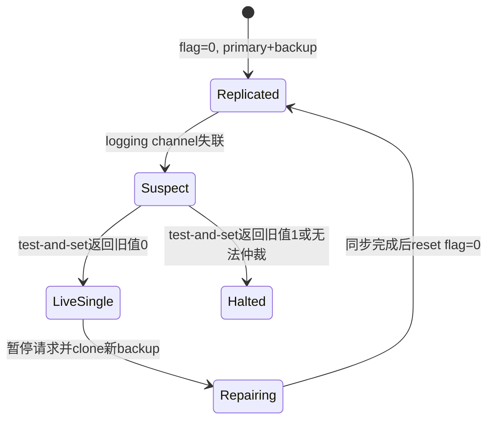

> **授课主题**：用 VMware Fault Tolerance（VMware FT）理解 primary/backup replication、replicated state machine、failure handling 与 Output Rule。  
> **课堂主体**：`00:00:03.200-01:24:59`；其后为学生 Q&A，源字幕精确结束于 `01:32:59.660`。  
> **证据原则**：section 严格按 2021 transcript 排序；2020 lecture note、paper、FAQ 与 homework 只作交叉复习/未来阅读，不反向补造课堂 chronology。

## 整讲概览

老师先限定 failure model：本课主要处理 `fail-stop`，不把共同 software bug、configuration error 或 malicious behavior 当作复制可自动解决的问题。即使只考虑 fail-stop，backup 也无法凭失联区分 primary crash 与 network partition，因此既要保持状态同步，也要避免 `split brain`。

接着课堂比较两种复制思路：

- `state transfer` 复制 checkpoint/state changes；简单直观，但状态可能很大。
- `replicated state machine (RSM)` 复制 ordered operations；网络量通常更小，但要求相同初态、相同顺序和 determinism。

VMware FT 把 RSM 放在 machine level：state 是 x86 registers 与 memory，普通 machine instructions 在两边本地执行；VMM/hypervisor 只记录可能造成 divergence 的 external events 与 non-deterministic outcomes。它换来 OS/application 无需修改的 transparency，也付出细粒度 logging、Output Rule ACK、single-core 限制和 network performance cost。

本讲最后用 increment 反例推导 `Output Rule`：primary 产生外部 output 之前，backup 必须已经收到所有 preceding log entries。这个规则防止 client 先看到新状态、failover 后又看到旧状态；它不保证 exactly-once packet delivery，cut-over 仍可能产生 duplicate response，需要 TCP/client protocol 去重或容忍。

## 十段课堂地图

| 段落 | Prompt 时间窗 | 课堂作用与主线 |
| --- | --- | --- |
| [001｜从故障模型到两个基本难题](#section-01) | `00:00:03-00:09:56` | 课程路线；fail-stop；共同原因失败；crash/partition；split brain；同步目标 |
| [002｜State transfer、RSM 与复制层级](#section-02) | `00:10:02-00:20:02` | failover 输出难题；两类复制；determinism；hybrid repair；application-level operation |
| [003｜Machine-level RSM 与透明性](#section-03) | `00:20:02-00:29:55` | registers/memory 与 x86 instructions；透明复制；硬件 lockstep 对照；VMM 截获 external event |
| [004｜I/O、storage server 与仲裁](#section-04) | `00:29:58-00:39:57` | virtual NIC；backup output suppression；shared disk；go live；atomic test-and-set；repair |
| [005｜Split brain 讨论题与课堂空档](#section-05) | `00:39:57-00:49:56` | 完全断联；图示纠正；两项 breakout 任务；明确保留无讲解空档 |
| [006｜Repair 生命周期与 divergence](#section-06) | `00:50:01-01:00:00` | VMotion clone/pause/reset；$S\to S'$；get-time、packet/timer interrupt、multicore |
| [007｜Single-core、interrupt log 与 trap](#section-07) | `01:00:00-01:09:59` | lock race；不传普通指令；instruction-number log；one-entry lag；trap-and-emulate |
| [008｜Replay 到 Output Rule](#section-08) | `01:10:00-01:19:59` | 注入 primary outcome；one epoch behind；failover catch-up；10→11 anomaly；Output Rule |
| [009｜规则后果、性能与系统边界](#section-09) | `01:19:59-01:29:58` | no-ACK retry；约 30% network reduction；application-level tradeoff；duplicate output；one backup |
| [010｜逐 packet 延迟与 failure timeout](#section-10) | `01:29:58-01:32:59.660` | 每包 forwarding/ACK；UDP；timer-derived heartbeat；timeout 数值未确认；精确源结尾 |

## 核心状态机

### 1. Replicated execution

正常状态下，两台 VM 从相同 state 出发：

$$
S_P^{(0)}=S_B^{(0)}
$$

普通 deterministic instructions 不走 logging channel，而在两端本地执行。对于第 $i$ 个确定性转移 $f_i$：

$$
S_P^{(i+1)}=f_i(S_P^{(i)})=f_i(S_B^{(i)})=S_B^{(i+1)}
$$

VM-FT 只需控制破坏上述归纳的来源：

1. packet input 与伴随 interrupt；
2. timer interrupt 的交付位置；
3. get-time 等 non-deterministic instruction 的 outcome；
4. multicore race。论文方案没有重放第 4 类，而是限制为 uniprocessor。

### 2. Logging/replay

每条关键 log entry 可整理为：

$$
entry=\langle instruction\#,\ event\ type,\ data/outcome\rangle
$$

Primary VMM 在 guest 看见 external event 前记录 instruction number，并把 event/data 发给 backup。Backup VMM 借助 CPU instruction counter 在同一 instruction point 交付 event。对 non-deterministic instruction，primary trap-and-emulate 后记录结果；backup 不重新抽样，而是把该结果注入对应 register/state。

Backup 必须 `lag one log entry`，也可理解为 `one epoch behind`。只有看到下一 event boundary，才知道当前 epoch 可安全执行到哪里；这防止 backup 越过 primary 未来才发现的 interrupt point。

### 3. Normal output 与 Output Rule

Primary 和 backup 都执行 guest 的 output instruction，但正常时：

| 角色 | VMM 对 output 的处理 |
| --- | --- |
| Primary | 等待规则满足后真实发送 |
| Backup | suppress/discard，不产生外部 effect |

Output Rule 的顺序约束是：

$$
send_P(O_k)\ \text{only after}\ ACK_B(L_k)
$$

$L_k$ 是导致 output $O_k$ 的所有 preceding log entries。由此，client 若已看到 $O_k$，backup 至少已拥有能 replay 到该状态的 log prefix。

### 4. Failure、仲裁与 repair

- 失联不能证明 peer crash；双方都可能尝试 `go live`。
- Storage/arbitration server 上的 atomic test-and-set 只允许一方把 flag 从 0 改为 1。
- Winner go live；loser terminate。若无法访问 arbitrator，则停止而不是冒险双主。
- 单机模式失去冗余。Repair 必须先暂停请求、clone/synchronize replacement backup，再 reset flag=0 并恢复双副本服务。
- 旧 primary 不在恢复后自行重新加入；课堂假设它被 terminate/cleaned up。

## 关键例证

### Increment anomaly（`01:15:41-01:18:56`）

1. 初值为 10，client 发送 `inc`。
2. Primary 执行到 11 并向 client 回复 11。
3. 若 input log 没到 backup，primary 此时 crash，backup 仍为 10。
4. Failover 后下一次 `inc` 又返回 11，而正确连续历史应返回 12。

因此 determinism 本身不够。必须让 backup receipt 发生在任何相关外部 output 之前。

### Duplicate output（`01:28:03-01:28:39`）

若 primary 在发出 response 后失败，backup catch up、go live 时可能再次发出同一 response。课堂接受这一点，因为网络模型本就允许 duplication，TCP 可按 sequence number 去重；其他 client protocol 也需保存足够状态或让重复 effect 无害。

## 性能与适用边界

- 课堂对 paper 表格的口述结论是：primary+backup 的总体表现接近 non-FT，结果令人印象深刻；但 network receiving/sending 一侧约有 30% reduction。
- 每个 input packet 都要 forward 给 backup；每个 response 都要等待 receipt ACK 满足 Output Rule。开销不是 first packet 一次性发生。
- Machine-level RSM 适合 critical、负载相对低、现有软件不便修改的服务；它以 transparency 换取细粒度同步成本。
- Application-level RSM 只复制 DB command、append/write 等高层 operation，通常能减少同步频率和流量，但必须修改 application。
- 论文方案只覆盖 one primary + one backup，并排除 multicore；多个 backups 与更一般的 fault-tolerant agreement 留给后续协议。
- Failure detector 不因单个 UDP packet loss 就判死。周期性 timer-interrupt log 同时充当 heartbeat；等待更多 signals 可减少误判，却增加 failover latency。老师没有确认具体 timeout 数值。

## 课堂材料与源文件

### 本地课堂证据

- [英文 transcript](/assets/courses/mit-6824-s21/lectures/004/transcript.txt)
- [结构化 transcript（JSONL）](/assets/courses/mit-6824-s21/lectures/004/transcript.jsonl)
- [英文 reviewed captions](/assets/courses/mit-6824-s21/lectures/004/captions.source.srt)
- [中文字幕](/assets/courses/mit-6824-s21/lectures/004/captions.additional-01.srt)
- [十段 summary input](/assets/courses/mit-6824-s21/lectures/004/summary-input.jsonl)
- [生成准备信息](/assets/courses/mit-6824-s21/lectures/004/preparation.json)
- [讲次 metadata](/assets/courses/mit-6824-s21/lectures/004/metadata.json)
- [10 个 section prompts](#lecture-notes)

### 官方/课程材料

- [本讲 lecture note 本地副本](/assets/courses/mit-6824-s21/lectures/004/materials/l-vm-ft.txt)
- [课程 MATERIALS 中的 Lecture 4 条目](/courses/mit-6824-s21/materials/#lecture-4-primary-backup-replication)
- [Lecture 4 阅读整理](/courses/mit-6824-s21/readings/lecture-04/)
- [官方归档 lecture note](/assets/courses/mit-6824-s21/materials/official-materials/lecture-notes/l-vm-ft.txt)
- [Fault-Tolerant Virtual Machines (2010)](/assets/courses/mit-6824-s21/materials/official-materials/papers/vm-ft.pdf)
- [VM-FT FAQ](/assets/courses/mit-6824-s21/materials/official-materials/faqs/vm-ft-faq.txt)
- [Paper Question / Homework](/assets/courses/mit-6824-s21/materials/official-materials/questions/04-q-vm-ft.html)
- [MIT 官方视频](https://youtu.be/gXiDmq1zDq4)
- [Bilibili Part 4](https://www.bilibili.com/video/BV16f4y1z7kn/?p=4)

## 未来阅读指南

以下材料用于课后深化，**不作为“老师在某时间点讲过”的证据**。

1. **先用 lecture note 压缩复习。** 对照 failure model、两类 replication、machine-level overview、divergence sources、interrupt handling、Output Rule、split brain 和 performance 清单；再回 section 时间戳恢复老师的真实推导顺序。
2. **读 VM-FT paper 的机制主干。** 带着三个问题阅读：[paper](/assets/courses/mit-6824-s21/materials/official-materials/papers/vm-ft.pdf) 如何定义 deterministic replay；Section 2.2 如何表述 Output Rule；课堂提到的 Section 3.1 如何组织 clone/repair。paper-only 参数或机制应另标来源。
3. **用 FAQ 核对实现疑问。** 在 [FAQ](/assets/courses/mit-6824-s21/materials/official-materials/faqs/vm-ft-faq.txt) 中查 logging channel、failover、shared storage 与限制；不要用 FAQ 的答案覆盖课堂中老师明确表示“不记得”的 timeout 数值。
4. **重做 split-brain homework。** 依据 [Question](/assets/courses/mit-6824-s21/materials/official-materials/questions/04-q-vm-ft.html)，分别枚举 primary crash、backup crash、两者间 partition、无法访问 arbitrator，证明哪些路径允许 go live、哪些必须 halt。
5. **带着 Output Rule 进入后续协议。** 继续课程 [Lecture 5: Raft (1)](/courses/mit-6824-s21/materials/#lecture-5-fault-tolerance---raft-1)，比较“output 前 backup receipt”与 replicated log commit/leader safety；这里只作为下一步问题，不预先声称两者机制等同。

## Transcript 完整性审计

| 检查项 | 结果 |
| --- | --- |
| Metadata 标称时长 | `5580.0s`（`01:33:00.000`） |
| 英文结构化 segments | `1614` |
| 第一条 segment | `start=3.2s`（`00:00:03.200`） |
| 最后一条 segment | `start=5576.87s`，`end=5579.66s` |
| 精确 transcript 终点 | `01:32:59.660` |
| 英文 SRT 终点 | `01:32:59.660` |
| 中文 SRT 终点 | `01:32:59.660` |
| Section prompts | `10`，均有对应 `notes/sections/001-010.md` |
| Material mode | `transcript+slides`；material file 仅 `l-vm-ft.txt`，1 page |

最后一条英文 segment 是未完句：“but you know I can't remember it like.” 英文与中文字幕在同一时刻结束，因此现有 source artifacts 没有可续接的后续课堂答案。视频标称终点与字幕终点相差 `0.34s`，符合尾部无语音余量，不能据此推断 transcript 缺段。

Prompt 显示的十段时间窗经过秒级取整，结构化 `summary-input.jsonl` 保留小数边界；相邻字幕之间存在自然静音间隙。笔记按 prompt 归段，并在 `010` 使用精确末时刻。Breakout 段 `00:42:08-00:49:55` 没有学术讲解，已明确保留为空档，没有用 paper-only 内容填补。

## 一页复习清单

- [ ] 能区分 fail-stop、共同 software/configuration failure 与 malicious failure。
- [ ] 能解释为什么“联系不到 primary”不能区分 crash 和 partition。
- [ ] 能比较 state transfer、RSM 及 hybrid repair。
- [ ] 能写出相同初态/同序/determinism 推出相同新状态的条件。
- [ ] 能追踪 packet 从 real NIC → primary VMM → guest → virtual NIC → external output 的路径。
- [ ] 能解释 backup output suppression 与 one-log-entry lag。
- [ ] 能说明 interrupt-number log 与 non-deterministic trap-and-emulate。
- [ ] 能用 test-and-set 的 old value 0/1 证明最多一个 go-live winner。
- [ ] 能用 10→11 反例推导 Output Rule，而不是死记定义。
- [ ] 能说明 duplicate output 为什么仍可能出现及由谁处理。
- [ ] 能解释 machine-level transparency、per-packet cost、single-core 与 one-backup limitations。
- [ ] 能明确说出课堂没有确认 failure timeout 的精确数值。

## 逐段详细课堂笔记

&nbsp;

# 001｜从故障模型到 primary/backup 的两个基本难题

> **课堂时间**：`00:00:03-00:09:56`  
> **本段证据**：英文 transcript；官方 lecture note 仅用于段末复习对照，不用于补写课堂顺序。  
> **复习标记**：`failure model`、`fail-stop`、`network partition`、`split brain`、`state synchronization`

## 本段在整讲中的作用

这是整讲的入口。老师先把 VMware FT 定位为 primary/backup replication 的具体案例，再限定本课真正打算容忍的故障，最后提出后续所有机制必须回答的两个问题：**如何判断 primary 是否真的失败**，以及**如何让 backup 始终能从 primary 停下的位置接管**。本段尚未给出 test-and-set、logging channel 或 Output Rule；它只建立这些设计出现的必要性。

## 教学展开

### 1. 先说明整讲路线：从一般问题走向 VMware FT（`00:00:03-00:02:27`）

老师把本讲称为 primary/backup replication 的 introduction，并强调这些问题会在本学期多次返回。课堂顺序是：

1. 先问 replication 能容忍哪些 failure、不能容忍哪些 failure；
2. 再提炼任何 backup scheme 都会遇到的挑战；
3. 比较 `state transfer replication` 与 `replicated state machine`（RSM）；
4. 最后以 VMware Fault Tolerance（VMware FT）把抽象问题具体化。

老师同时把 GFS、后续 Labs 2/3/4 与 RSM 联系起来，提示这不是只属于一篇论文的技巧，而是课程主线中的通用组织方式（`00:01:01-00:01:52`）。

### 2. 定义 fail-stop：工作时正确，失败时停止（`00:02:42-00:04:46`）

课堂首先限定 `fail-stop failure`：机器从“正确执行协议”直接变为“不再工作”，而不是继续运行却产生任意错误结果。这里的关键前提不是“硬件永不出错”，而是系统看到的故障外观可被抽象为停止。

老师按顺序给出三个例子：风扇故障导致过热关机；电源线被绊掉或网络线被切断；软件用 checksum 检出数据损坏后主动停止。第三个例子说明，检测机制有时可以把局部错误转化成更容易处理的 fail-stop 外观（`00:03:53-00:04:36`）。

### 3. 明确 replication 不自动解决什么（`00:04:49-00:06:09`）

接着老师用反例收紧范围：

- **logic bug**：primary 与 backup 运行同一份有缺陷的软件，往往会在同一处犯同样的错；复制错误不会修复错误。
- **configuration error**：错误配置也可能被共同采用，副本数量不能替代正确配置。
- **malicious failure**：攻击者伪造协议消息、服务器蓄意发送错误结果，不在本课程大部分内容的故障模型内。

因此，本学期此处的基本假设是：软件与配置本身正确、没有恶意参与者；重点处理 stop/fail-stop failures。

### 4. 地理相关故障取决于副本是否真正隔离（`00:06:13-00:07:03`）

老师以 earthquake 为边界案例：如果 primary 与 backup 分处不同地域，backup 可能在 primary 所在地受灾后接管；如果二者在同一 data center，整个机房消失就会同时失去两个副本。结论是：replication 的容错能力不仅取决于算法，还取决于 failure correlation 与物理部署。

### 5. 难题一：无法只凭失联区分 crash 与 partition（`00:07:07-00:08:51`）

即使只考虑 fail-stop，故障判断仍很困难。backup 观察到“联系不到 primary”时，不能断定 primary 已 crash；也可能只是网络发生 `partition`，而某些 client 仍能访问 primary。

若 backup 因此自行升级，旧 primary 又继续服务，就形成 `split brain`：两组 client 分别访问两个 primary，两个状态继续分叉，网络恢复后无法把它们当作一台连续运行的机器。老师的强约束是必须避免出现两个 primary（`00:08:13-00:08:51`）。本段只提出问题，尚未讲解仲裁方案。

### 6. 难题二：backup 必须与 primary 保持可接管的一致状态（`00:08:54-00:09:56`）

第二个挑战是 synchronization。目标不是“backup 大致有一份数据”，而是 primary 失败后，backup 能从它离开的地方继续，并让 client 看到的整体行为像一台更可靠的单机。

为此，所有 state changes 都必须到达 backup，并且按正确 order 应用。老师在本段末尾把问题推进到下一段：即便操作集合相同，non-determinism 仍可能让两个副本产生不同效果。

## 概念、符号与推导

### Fail-stop 状态模型

可把老师的口头定义记为一个二态模型：

$$
\text{correctly running} \longrightarrow \text{stopped}
$$

运行态中的指令与协议行为被假定为正确；故障后不再产生服务结果。课堂没有给出形式化公式，上式只是对口头状态转换的忠实整理，不引入额外故障语义。

### Primary/backup 的目标状态机

- 正常态：primary 对外服务，backup 保持足够新的状态。
- 可疑态：backup 无法联系 primary，但尚不能区分 primary crash 与 network partition。
- 接管目标：只有确认不会形成双主后，backup 才能成为新的 primary。
- 外部可见约束：failover 前后，client 应把系统观察为一台连续运行的 single machine。

### 本段无进一步公式推导

老师尚未定义状态转移函数、log entry 或确认协议；这些在后续段落才展开。

## 机制、权衡与易错点

- **机制边界**：replication 通过冗余应对某个副本停止，不等价于修复共同的软件 bug、配置错误或恶意行为。
- **部署权衡**：副本距离更远可降低 earthquake、全城断电等相关失败，但课堂此处没有展开网络延迟成本。
- **安全性优先**：失联时贸然接管可提高瞬时可用性，却可能制造 split brain；“联系不到”不是“对方已死”的证明。
- **同步要求**：只复制最终数据但漏操作、乱序或允许非确定性，都可能让 backup 无法无缝接管。

### 常见误解纠正

1. **误解：有两个副本就能容忍任意单点问题。** 纠正：共同 bug、共同配置和同机房相关失败可同时影响所有副本。
2. **误解：backup timeout 就证明 primary crash。** 纠正：timeout 也符合 network partition；课堂正是由此引出 split brain。
3. **误解：backup 只需定期保存一个近似快照。** 纠正：本段目标是 failover 后不让 client 看到不合预期的旧状态，后文会讨论怎样达到这一点。

## 例子与课堂提示

- `00:03:53-00:04:36` 风扇、电源线、网线和 checksum：服务于 fail-stop 的操作性定义。
- `00:04:49-00:05:35` divide-by-zero 与错误配置：服务于“复制不会消除共同原因错误”的反例。
- `00:06:24-00:06:57` earthquake/data center：服务于 failure correlation 与物理隔离。
- `00:07:48-00:08:51` primary 仍活着但网络分区：服务于 crash/partition 不可仅凭失联区分，以及 split brain 的危险。
- `00:09:14-00:09:45` backup 从中断点继续：服务于外部应观察到 single-machine behavior 的总体目标。

## 本段掌握检查

1. **什么是本讲采用的 fail-stop failure？**  
   **答：**机器工作时正确执行，发生故障时停止，不继续产生任意错误结果（`00:03:01-00:03:50`）。
2. **为什么复制同一份软件通常不能容忍 logic bug？**  
   **答：**primary 与 backup 很可能执行同一错误路径并得到同样的错误结果（`00:04:49-00:05:17`）。
3. **为什么 backup 不能因联系不到 primary 就立即接管？**  
   **答：**它无法区分 crash 与 network partition；后者可能让旧 primary 仍向部分 client 服务，从而形成 split brain（`00:07:48-00:08:46`）。
4. **本段对 failover 后外部行为提出什么要求？**  
   **答：**backup 应从 primary 停下处继续，让 client 看起来仍在和一台连续运行、但更可靠的机器交互（`00:09:14-00:09:45`）。
5. **地理复制何时才可能容忍 earthquake？**  
   **答：**副本必须物理分离；同一 data center 内的副本可能被同一灾害同时摧毁（`00:06:24-00:06:57`）。

## 复习定位与证据

- **回看时间点**：`00:03:01` fail-stop 定义；`00:07:48` crash 与 partition；`00:08:21` split brain；`00:09:14` 无缝接管目标。
- **Transcript 证据范围**：[`transcript.txt`](/assets/courses/mit-6824-s21/lectures/004/transcript.txt)，`00:00:03-00:09:56`。
- **Lecture-note 对照**：[`l-vm-ft.txt`](/assets/courses/mit-6824-s21/lectures/004/materials/l-vm-ft.txt) 中 “What kinds of failures can replication deal with?” 与 “Big Questions”。讲义把问题压缩为清单；本节教学顺序与例子仍以 2021 transcript 为准。
- **MATERIALS 条目**：课程索引中的 [Lecture 4: Primary-Backup Replication](/courses/mit-6824-s21/materials/#lecture-4-primary-backup-replication)。

## 待核对项

- `00:00:12` 字幕将 “replication” 识别成 “application”，结合上下文应为 primary/backup replication。
- `00:00:21` VMware FT paper 前有不可辨识词，不影响“以论文作案例”的课堂主线。
- prompt 的本段终点为 `00:09:56`，而 transcript 下一句从 `00:10:02` 开始；本节未越界吸收下一段的 non-determinism 解释。

&nbsp;

# 002｜State transfer、RSM 与复制层级的选择

> **课堂时间**：`00:10:02-00:20:02`  
> **本段证据**：仅英文 transcript；lecture note 只在段末作课后对照。  
> **复习标记**：`non-determinism`、`failover`、`state transfer`、`replicated state machine (RSM)`、`determinism`、`hybrid repair`

## 本段在整讲中的作用

本段承接上一节“backup 必须和 primary 同步”的目标，先补全 failover 的一般难点，再正式比较两种主流复制方法。老师最后把问题从“复制状态还是操作”推进到“在哪一层定义状态和操作”，为下一段的 machine-level VMware FT 铺路。

## 教学展开

### 1. 同步不仅要同序，还要处理 non-determinism（`00:10:02-00:10:22`）

老师从上一段末尾继续：同一个 change 若在 primary 和 backup 上产生不同效果，状态仍会分叉。因此 replicated execution 的要求不是“两个副本都执行过”，而是它们获得 identical effects。

### 2. Failover 的边界与输出不确定性（`00:10:28-00:11:59`）

primary 消失后由 backup 接管，这就是 failover。但切换点可能落在一个操作中间：primary 也许正要向 client 发 response，也许已经发出，也许尚未发出。系统必须决定能否重发，以及如何避免 client 看到矛盾结果（`00:10:43-00:10:58`）。

老师顺带指出，多 backup 或 crash-recovery 系统还要判断谁拥有 latest state；今天的单 backup 设计不会集中处理这个问题，但后续协议会处理（`00:11:17-00:11:40`）。

### 3. 方法一：state transfer（`00:12:03-00:13:15`）

在 `state transfer` 中，client 只联系 primary；primary 执行请求、改变 state，并把 checkpoint 或本次操作导致的 state changes 复制给 backup。若要保证 client 收到响应时两者已同步，那么 primary 在回复前必须把对应状态变化传过去。

这里的复制对象是“结果状态/状态增量”，不是让 backup 自己重做 client operation。

### 4. 方法二：replicated state machine（`00:13:18-00:14:53`）

`replicated state machine`，简称 `RSM`，传输的是 operation。primary 把 client operation 发给 backup，backup 也执行它并确认；primary 执行同一 operation 后再回复 client。只要两边从相同 state 出发、施加相同 change，就应到达相同新 state，failover 时 backup 才能接管。

老师强调这是基本计划，而不是自动成立的事实；之后会逐项处理使该计划失败的条件。

### 5. 带宽权衡与课程实例（`00:14:57-00:16:32`）

state transfer 的主要代价是 change 可能很大：若一个小 operation 生成 1 GB 新状态，复制这 1 GB 可能远比发送 operation 本身昂贵。RSM 常用较小的 operation 换取 backup 本地重算。

老师按顺序联系三个实例：GFS primary 发送 append/write operation，而不是先执行再发送结果；今天的 VMware FT 也采用 RSM，但 operation 是 x86 instruction；Labs 3/4 同样会发送 operations。

### 6. RSM 的决定性前提：deterministic operation（`00:16:41-00:17:43`）

学生问为什么 client 不必把结果数据再发给 backup。老师回答：若 primary 和 backup 具有相同 state，且 operation 是 deterministic，那么只传 operation 就保证生成相同 data。典型 RSM 因而要求 operations deterministic，或禁止未被控制的 non-deterministic operations。

### 7. 两种方法可以组合：先传状态建立副本，再持续传操作（`00:17:49-00:18:31`）

老师确认存在 hybrid approach：正常期间高频使用 RSM；某个副本失败后，要创建 replacement replica，通常先从现存副本复制 state，之后再恢复 operation replication。状态传输较重，但 repair 相对低频；操作复制较轻，适合稳态高频路径。

### 8. 最后把选择上移到 replication level（`00:18:48-00:20:02`）

老师开始讨论 operation 在哪一层定义。第一种可能是 application-level operation，例如 GFS 的 append/write。应用知道这些操作的 semantics，因此若在这一层实现 RSM，application 本身必须参与并被修改。本段在这里截断，下一段转向 machine-level operation。

## 概念、符号与推导

可用老师的状态叙述整理出 RSM 的核心不变量：

$$
S'_P = \delta(S_P, op), \qquad S'_B = \delta(S_B, op)
$$

若满足：

$$
S_P=S_B,\quad op_P=op_B,\quad \delta\text{ 是确定性的}
$$

则有：

$$
S'_P=S'_B
$$

其中 $S_P/S_B$ 表示 primary/backup state，$op$ 表示同一 operation，$\delta$ 是状态转移。符号是对课堂口述的整理；老师没有在黑板上给出该公式。

### 两类复制的机制差异

| 方法 | 跨副本传输 | backup 的工作 | 主要风险/成本 |
| --- | --- | --- | --- |
| State transfer | checkpoint 或 state change | 安装状态 | 状态可能很大 |
| RSM | ordered operations | 重放/执行操作 | 必须控制顺序与 non-determinism |

## 机制、权衡与易错点

- **等待点**：两类方案都隐含“reply 前先使 backup 足够新”的约束；具体 Output Rule 尚未在本段定义。
- **网络 vs 计算**：RSM 减少状态传输，却要求 backup 执行同样计算，且实现更复杂。
- **稳态 vs repair**：hybrid design 并不矛盾；state transfer 适合初始化，operation replication 适合持续同步。
- **层级选择**：application-level 能使用高层语义，但需要修改应用；machine-level 的透明性在下一段展开。

### 常见误解纠正

1. **误解：RSM 会把每条指令的执行结果都发给 backup。** 纠正：本段的一般模型传 operation；哪些 machine events 要记录稍后才具体化。
2. **误解：相同 operation 必然得到相同 state。** 纠正：还需相同初态、相同顺序和 determinism。
3. **误解：state transfer 与 RSM 必须二选一。** 纠正：新副本可先复制 state，再进入 operation stream。
4. **误解：今天已经解决多 backup 的 latest-state 选择。** 纠正：老师明确把它留给后续协议。

## 例子与课堂提示

- `00:10:43-00:10:58` reply 处于“可能已发/未发”的中间态：服务于 failover 输出语义。
- `00:15:08-00:15:28` 1 GB state change：服务于 state transfer 带宽成本。
- `00:15:41-00:16:17` GFS append/write 与 VMware FT x86 instructions：服务于 operation 粒度差异。
- `00:17:49-00:18:31` replacement replica：服务于 hybrid repair。

## 本段掌握检查

1. **State transfer 与 RSM 复制的对象分别是什么？**  
   **答：**前者复制 checkpoint/state changes，后者复制 operations 并让 backup 执行（`00:12:19-00:14:15`）。
2. **RSM 为什么要求 determinism？**  
   **答：**相同初态上的同一 operation 只有在确定性转移下才保证得到相同新状态（`00:16:47-00:17:43`）。
3. **为什么 state transfer 可能比 RSM 贵？**  
   **答：**小 operation 可能产生巨量 state change；发 operation 让 backup 重算可能更省网络（`00:15:08-00:15:28`）。
4. **两种方法如何组成 hybrid repair？**  
   **答：**先从活副本复制 state 建立 replacement，再持续传 operations（`00:17:49-00:18:31`）。
5. **Application-level RSM 的代价是什么？**  
   **答：**应用必须理解 operation semantics 并参与复制，因此需要修改应用（`00:18:48-00:20:02`）。

## 复习定位与证据

- **回看时间点**：`00:12:19` state transfer；`00:13:18` RSM；`00:16:47` determinism；`00:17:49` hybrid repair；`00:18:48` replication level。
- **Transcript**：[`transcript.txt`](/assets/courses/mit-6824-s21/lectures/004/transcript.txt)，`00:10:02-00:20:02`。
- **Lecture-note 对照（非课堂时间线证据）**：[`l-vm-ft.txt`](/assets/courses/mit-6824-s21/lectures/004/materials/l-vm-ft.txt) 的 “Two main replication approaches” 与 “At what level do we want replicas to be identical?”。
- **课程材料入口**：[MATERIALS Lecture 4](/courses/mit-6824-s21/materials/#lecture-4-primary-backup-replication)。

## 待核对项

- `00:11:24` 的 `[stage]` 很可能指 “latest state”，字幕不完整；本节仅保留可确认的“多副本需选择最新状态”。
- `00:14:38` 字幕把两种方式混在同一句中；结合前后文，老师要表达的是“不论传 state change 还是传 operation，都要保持相同状态转换”。
- 本段 prompt 明确为 transcript-only；讲义链接仅供复习交叉核对，不声称老师在该时刻照读讲义。

&nbsp;

# 003｜Machine-level RSM 与 VMware FT 的透明性

> **课堂时间**：`00:20:02-00:29:55`  
> **本段证据**：仅英文 transcript；lecture note 只在段末作课后对照。  
> **复习标记**：`application-level`、`machine-level`、`transparent replication`、`VMM/hypervisor`、`external event`、`logging channel`

## 本段在整讲中的作用

本段回答上一节留下的 replication-level 问题：VMware FT 不在应用层复制 append/write，而在 machine/instruction level 复制执行。老师先解释这一选择为何能透明支持未修改的 OS 和应用，再说明 virtualization 如何截获 interrupt 等外部事件，构成实现 machine-level RSM 的控制点。

## 教学展开

### 1. Application-level RSM 需要应用参与（`00:20:02-00:20:18`）

老师先完成上一段未说完的句子：应用知道 append/write 的 semantics，所以能在应用层组织 operation replication；代价是 application 必须修改，成为复制协议的一部分。

### 2. VMware FT 把 state 和 operation 下沉到机器层（`00:20:23-00:21:35`）

VMware FT 的 state 是 x86 registers 与 memory state，operations 是普通 machine instructions。这样，guest OS 和 application 只需照常运行指令；底层系统复制这次 execution。老师连续强调 application 无需修改、OS 也无需修改，甚至原本完全没为 fault tolerance 编写的程序也能透明复制。

### 3. 透明性立刻引出 external-event 难题（`00:21:42-00:22:13`）

普通 `add/divide/branch/call` 可由两个相同状态的副本各自执行，但 interrupt 不是单纯由当前 registers/memory 决定。若 primary 收到 interrupt，backup 必须在相应执行点收到等价事件，否则两边会分叉。老师用这个问题把“透明”从产品特性转成机制挑战。

### 4. 对比旧式硬件 lockstep 与 virtualization（`00:22:15-00:24:05`）

传统 machine-level replication 可用双/三份 processor、硬件 lockstep 和 voting 保持同步，但需要昂贵的专用硬件。VMware FT 的核心观察是：面向普通 business application，不必复制整套硬件控制逻辑，可以利用 virtual machine。

因此，本设计的“大想法”是 exploit virtualization：把复制逻辑放在应用和真实硬件之间，既控制外部事件，又保持上层透明。

### 5. Client 看到一台机器；论文系统是产品但不是当前产品的全部（`00:24:17-00:26:21`）

老师说明，VMware FT 对 client 呈现 single-machine appearance 与很强的 consistency。它是实际产品，后来版本仍存在；但当前产品可能与论文方案不同。

随后老师指出论文方案的关键 limitation：只支持 single core，无法让多线程/多应用在多个 core 上并行。老师推测后续版本可能转向 state transfer，但明确说自己不知道细节、也没有详细论文，因此课堂只研究论文中干净的 RSM 方案。这个不确定性不能写成事实结论。

### 6. 定义 VMM/hypervisor（`00:26:26-00:27:52`）

`virtual machine monitor (VMM)` 或 `hypervisor` 在一台真实 x86 hardware 上提供一个或多个 VM。课堂图主要只画一个 VM，其中运行 Linux 与 applications。VM-FT 是经过修改、加入 fault-tolerance 机制的 hypervisor。

### 7. VMM 是外部事件进入 guest 前的控制点（`00:27:58-00:29:55`）

hardware interrupt 不直接送到 Linux，而先进入 VMM；VMM 决定何时交给 guest。因此所有 external events 在 VM 观察前都可被捕获。

老师给出初步方案：network interrupt 或 timer interrupt 到达 primary VMM 后，VMM 一方面在合适时刻交给本地 application/guest，另一方面经 `logging channel` 发给结构相同的 backup computer；backup 也运行 VM-FT、相同 Linux 与相同 applications。本段到 logging-channel 架构处结束，下一段再追踪完整 packet/output 路径。

## 概念、符号与推导

### Machine-level RSM 的映射

| RSM 元素 | VMware FT 中的对应物 |
| --- | --- |
| State | x86 registers + guest memory |
| Deterministic operation | 普通 machine instruction |
| 需控制的输入 | interrupt、packet arrival、timer 等 external events |
| 复制边界 | guest OS/app 之下的 VMM/hypervisor |

### 透明性的因果链

$$
\text{VMM 截获外部事件}
\Rightarrow \text{复制事件及其交付点}
\Rightarrow \text{guest 执行保持一致}
\Rightarrow \text{OS/app 无需修改}
$$

课堂没有形式化性能或正确性证明；此链条是对老师讲解顺序的结构化整理。

## 机制、权衡与易错点

- **透明性收益**：可保护不便修改的 existing server software。
- **抽象层成本**：机器层看不到 application semantics，后面必须保守处理每个可能影响执行的低层事件。
- **硬件替代**：virtualization 避免专用 lockstep/voting hardware，但仍依赖 hypervisor 与 processor 支持。
- **论文 limitation**：single-core 规避了多核 race 的 non-determinism，牺牲并行性能。
- **证据强度**：老师对后续产品是否改用 state transfer 只作推测，不能据此解释论文机制。

### 常见误解纠正

1. **误解：VMware FT 需要修改 Linux 网络栈或业务应用。** 纠正：论文方案的卖点就是 OS 和 application 均不修改。
2. **误解：machine-level RSM 只复制 application instructions。** 纠正：guest 中 OS 与 app 都是同一机器执行的一部分；关键是复制可能导致分叉的外部事件。
3. **误解：VMM 只是资源分区工具。** 纠正：这里它还是 interrupt 在 guest 可见前的截获与调度点。
4. **误解：论文方案代表 2021 年产品实现。** 纠正：老师明确区分论文系统与后续产品，并对后者细节表示不确定。

## 例子与课堂提示

- `00:20:29-00:21:30` registers/memory 与 x86 instructions：服务于 machine-level state/operation 定义。
- `00:21:48-00:22:13` interrupt：服务于普通确定性指令之外的输入问题。
- `00:22:22-00:23:23` 双/三处理器与 hardware voting：服务于 virtualization 方案的对照。
- `00:23:34-00:24:05` business application：服务于产品目标，而非航天级任意硬件错误容忍。
- `00:27:58-00:29:20` interrupt 先到 VMM：服务于可记录、可重放 external event 的机制基础。

## 本段掌握检查

1. **VMware FT 在 machine level 把什么当 state 与 operations？**  
   **答：**state 是 x86 registers 和 memory，operations 是普通 machine instructions（`00:20:29-00:20:48`）。
2. **为什么这种层级可以做到 transparent replication？**  
   **答：**OS/app 仍只运行普通指令，复制由其下的 VMM 完成，所以两者无需修改（`00:20:52-00:21:30`）。
3. **VMM 为什么适合控制 interrupt？**  
   **答：**真实 interrupt 先进入 VMM，VMM 决定何时让 guest 看见（`00:27:58-00:28:24`）。
4. **论文方案为什么暂不支持 multi-core？**  
   **答：**课堂此时只指出 single-core limitation，具体 race 原因在后文展开（`00:25:24-00:25:43`）。
5. **老师如何限定对新版本 FT 的说法？**  
   **答：**他认为后续版本可能使用 state transfer，但明确说不了解细节，因此本课不据此展开（`00:25:45-00:26:10`）。

## 复习定位与证据

- **回看时间点**：`00:20:29` machine-level state；`00:21:13` transparent；`00:22:15` hardware lockstep 对照；`00:26:37` VMM；`00:27:58` interrupt capture；`00:29:18` logging channel。
- **Transcript**：[`transcript.txt`](/assets/courses/mit-6824-s21/lectures/004/transcript.txt)，`00:20:02-00:29:55`。
- **Lecture-note 对照（非课堂时间线证据）**：[`l-vm-ft.txt`](/assets/courses/mit-6824-s21/lectures/004/materials/l-vm-ft.txt) 的 “At what level do we want replicas to be identical?” 与 “Today's paper (VMware FT) replicates machine-level state”。
- **课程材料入口**：[MATERIALS Lecture 4](/courses/mit-6824-s21/materials/#lecture-4-primary-backup-replication)。

## 待核对项

- `00:22:58-00:23:11` 传统硬件实例名称无法从字幕可靠辨识，故只保留老师明确讲出的 duplex/triple replication 与 voting。
- `00:25:57-00:26:03` 关于后续产品使用 state transfer 是老师的推测，不是论文结论。
- 本段 prompt 没有配套课件页；lecture-note 仅作课后概念索引。

&nbsp;

# 004｜I/O 路径、storage server 与 test-and-set 仲裁

> **课堂时间**：`00:29:58-00:39:57`  
> **本段证据**：仅英文 transcript；lecture note 只在段末作课后对照。  
> **复习标记**：`virtual NIC`、`suppressed output`、`shared storage`、`go live`、`test-and-set`、`repair`

## 本段在整讲中的作用

本段把上一节的 VMM/logging-channel 架构走通：先追踪 client packet 如何进入 primary、如何在 backup 重演以及为什么 backup 不输出，再加入 storage server。老师随后利用 storage server 上的 atomic test-and-set 解决 network partition 下的双主仲裁，并说明 repair、flag reset 与完全失联时停止服务的边界。

## 教学展开

### 1. Primary 的输入与输出路径（`00:29:58-00:31:38`）

client packet 到达真实 NIC 后产生 interrupt，先由 primary VMM 接管，再交给本地 Linux。Linux 按正常方式处理请求，并把 response 写向它以为存在的 NIC；实际上这是 VMM emulated `virtual network interface card`。VMM 捕获该输出意图，再驱动真实 hardware 把 response 发给 client。

机制要点是：guest 不知道自己被复制，所有外部 I/O 都经过 VMM 可控制的边界。

### 2. Backup 重演相同输入，但抑制外部输出（`00:31:38-00:32:43`）

若两台机器从相同 state 开始，并在同一 instruction point 接收 interrupt，backup Linux 会执行相同步骤，也会尝试通过 virtual NIC 发 response。但 backup VMM 知道自己的角色，因此丢弃这个输出，不把 packet 发到真实网络。

这保证正常态只有 primary 对外产生 effect；“两边都执行”不等于“两边都服务 client”。

### 3. Storage server 作为共享远程磁盘（`00:32:47-00:34:30`）

老师在图中加入 storage server，可把它理解为两台 VM 的 hard disk。application 写文件时，Linux 将其转为经 VMM 发往远程存储的 packet。其通信形态类似 client/server traffic，区别是 storage case 由 VM 内的 Linux 主动发起。

因此 persistent state 不必分别放在两台本地磁盘上；正常时仍由 primary 的实际输出到达 storage server，backup 的重复输出被抑制。

### 4. Storage server 的第二个角色：failover arbitration（`00:34:30-00:35:42`）

storage server 还保存一个特殊 flag，用来决定 failure 后谁可成为 primary。logging channel 没有响应时，任一端无法判断对方 computer crash 还是 channel/network 失败。因此真正困难的 case 是 network partition：primary 与 backup 彼此不可达，但都可能仍能访问 storage server。

### 5. “Go live” 与 atomic test-and-set（`00:35:42-00:37:50`）

双方都可能希望 `go live`，即退回 single-server mode 并继续处理 client request。它们分别对 storage server 上初值为 0 的 flag 执行 atomic `test-and-set(1)`：

1. 第一个执行者把 flag 从 0 变为 1，并取得 old value 0；它知道自己获胜，可以 go live。
2. 第二个执行者看到 old value 1；它知道已有一方获胜，于是放弃并 terminate。

原子性使两者不可能都读到 0。这里获胜者不必是原 primary；安全条件是最终只有一个 live primary。

### 6. Repair 完成后才 reset flag（`00:37:58-00:39:10`）

学生问 flag 何时回到 0。老师先说明若失败后一直只有一台机器，第二次 failure 会让系统彻底不可用，所以必须 repair。论文系统的 repair 由人工/管理软件创建新 replica：基于现有 live VM image 复制 state，使新 backup 与 primary 同步；新 backup 完整加入 protocol 后，才 reset flag 并重新开始 logging。

### 7. 无法访问仲裁者时宁可停止（`00:39:18-00:39:57`）

若 logging channel 与通往 storage server 的网络都坏了，节点不能取得仲裁结果。系统停止处理新的 client requests，等待网络修复。这个选择牺牲 availability 来保住“最多一个 primary”的 safety；本段末尾把它称为 disaster case，并在下一段开头补完情形。

## 概念、符号与推导

### 正常复制状态机

| 角色 | Guest execution | 对外 network/storage output |
| --- | --- | --- |
| Primary | 执行输入 | VMM 真实发送 |
| Backup | 在相同指令点重演 | VMM suppress/discard |

### 仲裁 flag 状态机

$$
flag=0 \xrightarrow{\text{winner: test-and-set}} flag=1
$$

- 返回旧值 0：获得 go-live 权利。
- 返回旧值 1：已有 winner，当前 VM terminate。
- `1 -> 0`：不是自动超时；只在 replacement backup 同步完成、双副本协议准备恢复后由 repair 流程执行。

## 机制、权衡与易错点

- **Output suppression**：backup 执行同一输出指令但不造成外部 effect，维持 single-server appearance。
- **Shared storage**：避免同步两份本地 persistent disk，但把 storage availability 纳入服务依赖。
- **Test-and-set**：解决“双方都活着但彼此失联”的 split-brain 仲裁，不负责证明谁 crash。
- **Safety/availability**：无法联系 peer 又无法联系 arbitrator 时停止，是有意的保守选择。
- **Repair window**：单机 go-live 后仍可服务，但失去冗余；需尽快恢复 backup。

### 常见误解纠正

1. **误解：backup 不执行 response 路径。** 纠正：它执行，但 backup VMM 丢弃真实输出。
2. **误解：client 直接从 storage server 读取业务响应。** 纠正：本段图中 storage server 是 VM 的远程 disk 和仲裁者；普通 client 仍与服务 VM 通信。
3. **误解：test-and-set 让原 primary 永远获胜。** 纠正：任一方都可能先执行；协议只保证一个 winner。
4. **误解：flag 过一段时间自动清零。** 纠正：必须先建立并同步 replacement backup，再由 repair 流程 reset。
5. **误解：联系不到 storage server 时节点可继续服务。** 纠正：那会失去排除另一 primary 的证据，系统选择停止。

## 例子与课堂提示

- `00:30:23-00:31:32` client packet、interrupt、virtual NIC：服务于 VMM 对 I/O 的完全中介。
- `00:31:45-00:32:41` backup 也写 virtual NIC 但 VMM 丢弃：服务于 output suppression。
- `00:33:08-00:34:24` remote disk write：服务于 shared storage 的第一个角色。
- `00:35:42-00:37:44` 双方竞争 flag：服务于 atomic test-and-set 排除双主。
- `00:38:21-00:39:05` repair/create replica/reset：服务于仲裁状态的生命周期。

## 本段掌握检查

1. **为什么 backup 会执行 response 却不向 client 发 packet？**  
   **答：**两边需保持相同 execution，但 backup VMM suppresses actual output，正常态只让 primary 对外生效（`00:31:45-00:32:41`）。
2. **Storage server 在本设计中有哪两个角色？**  
   **答：**共享远程 disk，以及保存 test-and-set flag 的 failover arbitrator（`00:32:47-00:34:55`）。
3. **Atomic test-and-set 如何阻止 split brain？**  
   **答：**只有第一个调用者取得旧值 0 并 go live，后一个取得 1 后 terminate（`00:36:38-00:37:44`）。
4. **Flag 为什么不能在 winner 产生后立刻 reset？**  
   **答：**仍只有一个 live replica；必须等新 backup 已复制 state 并加入协议后才能重新允许下一轮仲裁（`00:37:58-00:39:05`）。
5. **双方都无法访问 storage server 时系统为何停止？**  
   **答：**它们无法证明自己是唯一 primary；停止牺牲 availability 以避免双主（`00:39:18-00:39:57`）。

## 复习定位与证据

- **回看时间点**：`00:30:23` input path；`00:32:25` backup output suppression；`00:32:58` shared storage；`00:35:42` partition；`00:36:38` test-and-set；`00:37:58` repair。
- **Transcript**：[`transcript.txt`](/assets/courses/mit-6824-s21/lectures/004/transcript.txt)，`00:29:58-00:39:57`。
- **Lecture-note 对照（非课堂时间线证据）**：[`l-vm-ft.txt`](/assets/courses/mit-6824-s21/lectures/004/materials/l-vm-ft.txt) 的 “Overview”、 “VMM emulates a local disk interface” 与 split-brain/test-and-set 问答。
- **课程材料入口**：[MATERIALS Lecture 4](/courses/mit-6824-s21/materials/#lecture-4-primary-backup-replication)。

## 待核对项

- `00:31:50-00:32:00` 口述的 “same time” 实质随后被限定为 same instruction point，不应理解为两台物理机 wall-clock 同时。
- `00:38:34-00:38:44` repair 的人工/监控软件主体字幕较乱；可确认的是 repair 非本段所述自动副本选举。
- 本段结尾在 `00:39:57` 截断 disaster-case 句子，下一节 `00:39:57` 从“机器仍运行但所有网络线断开”继续。

&nbsp;

# 005｜Split brain 讨论题与课堂空档

> **课堂时间**：`00:39:57-00:49:56`  
> **本段证据**：仅英文 transcript；`00:42:08-00:49:55` 为 breakout-room 活动/技术等待，不能用论文内容补写。  
> **复习标记**：`total disconnection`、`storage path`、`split brain`、`arbitration dependency`、`breakout discussion`

## 本段在整讲中的作用

这是一个以澄清图示和课堂讨论为主的过渡段。老师先补完上一节的“灾难情形”，再纠正 storage-server 箭头的误读，随后让学生围绕 split brain 与 storage server 是否承包了全部容错难题展开讨论。本段没有继续引入 VM-FT 执行机制；其作用是让学生检验上一段仲裁设计的安全性与架构边界。

## 教学展开

### 1. 补完完全断网的 failure case（`00:39:57-00:40:09`）

上一节末尾被切断的句子在这里补完：primary 和 backup 可能都仍运行，但所有 network cables 都断了。对 client 可获得的服务而言，这近似于 primary 与 backup 同时失败，因为没有通信路径可用。这里没有新的恢复机制；结论仍是系统无法安全向前推进。

### 2. 澄清谁会访问 storage server（`00:40:09-00:40:50`）

学生询问 client 是否从 storage server 读取。老师纠正：普通 client 并不直接从 storage server 读取业务数据。访问 storage server 的有两类主体：

1. VM 内的 Linux/application 把 storage server 当远程 disk；
2. VM-FT 自身访问 arbitration/test-and-set flag。

老师承认图中的绿色箭头画错了：它应沿 network 到 storage server，不是指向 client `C`。这个修正很重要，因为它区分了业务 client path 与 storage/arbitration path。

### 3. Breakout 任务一：证明不会有两个 primary（`00:40:53-00:41:29`）

老师要求学生讨论 homework question：说服自己该方案避免 `split-brain syndrome`，即不存在两个 primary 同时 go live。证明核心应来自上一节的 atomic test-and-set，而不是 timeout 本身。

### 4. Breakout 任务二：是否把全部难题都推给 storage server（`00:41:29-00:41:45`）

第二个讨论问题是 design reasonableness：表面上 storage server 提供共享 disk 和仲裁 flag，似乎“真正的 fault tolerance”都被放进 storage server。老师提示“并非如此”，但在本段中没有公布完整课堂答案；不能替老师补写后文或论文论证。

### 5. Breakout 与技术等待（`00:41:46-00:49:56`）

老师停止共享、移交 host 并安排 breakout rooms。`00:42:08` 后没有学术讲解；`00:46:19-00:47:04` 只是老师测试能否进入其他房间，`00:49:55` 开始恢复 screen sharing。此时间段应明确留白，而不是根据 paper 扩写课堂 chronology。

## 概念、符号与推导

### 两条不同的网络路径

$$
client \leftrightarrow VM\ service
$$

$$
VM/Linux\ or\ VM\text{-}FT \leftrightarrow storage\ server
$$

第一条承载业务 request/response；第二条承载远程 disk I/O 或 arbitration。课堂没有声称 client 直接访问 test-and-set flag。

### 本段无新的公式推导

split-brain 的 test-and-set 状态机已在 `004` 展开；本段要求学生自行论证其“最多一个 winner”性质。

## 机制、权衡与易错点

- **完整断联**：机器活着不等于服务可用；所有通信路径断裂时，外部行为可与机器同时失败相似。
- **职责分离**：storage server 既可承载 disk，也可承载 arbitration，但 client path 与二者不能混为一条箭头。
- **设计争议**：仲裁依赖 storage server 可能形成 availability dependency；课堂在此只提出讨论，不给最终结论。
- **证据纪律**：breakout 空档没有可观察的学生讨论内容，笔记不得假定各组得出了什么答案。

### 常见误解纠正

1. **误解：图中 client `C` 从 storage server 直接读取。** 纠正：老师明确说绿色箭头画错，client 与 storage path 不应混淆。
2. **误解：两台机器仍在运行就仍有 availability。** 纠正：若所有 network cables 都断开，系统对外无法提供服务。
3. **误解：本段已经证明 storage server 不是单点。** 纠正：老师只把它设为讨论题，未在本段给出完整答案。
4. **误解：`00:42-00:50` 可以用论文机制补齐。** 纠正：这是 breakout/等待，属于课堂 chronology 的真实空档。

## 例子与课堂提示

- `00:39:57-00:40:03` 两台机器都活着但所有网线断开：服务于“运行状态不等于可达性”。
- `00:40:09-00:40:47` 错误绿色箭头：服务于 client、guest disk I/O 与 FT arbitration 的角色区分。
- `00:41:06-00:41:29` homework question：服务于 test-and-set 的安全性自证。
- `00:41:29-00:41:39` “是否把难题推给 storage server”：服务于识别设计依赖与单点风险。

## 本段掌握检查

1. **为什么两台 VM 都运行时系统仍可能不可用？**  
   **答：**如果所有网络路径都断开，它们既无法协调也无法向外服务（`00:39:57-00:40:03`）。
2. **谁会访问 storage server？**  
   **答：**VM 内 Linux/application 用它作 disk，VM-FT 用它访问 test-and-set flag；普通 client 不直接读取它（`00:40:09-00:40:29`）。
3. **Breakout 的第一个论证目标是什么？**  
   **答：**证明 partition 下方案不会产生两个 primary，即避免 split brain（`00:41:06-00:41:29`）。
4. **为什么不能从本段断言 storage server 单点问题已解决？**  
   **答：**老师只提出“是否把容错难题移给 storage server”的讨论，未在可见课堂内容中给出结论（`00:41:29-00:41:45`）。

## 复习定位与证据

- **回看时间点**：`00:39:57` total disconnection；`00:40:17` client/path 澄清；`00:41:04` breakout prompt；`00:42:08-00:49:55` 无学术讲解。
- **Transcript**：[`transcript.txt`](/assets/courses/mit-6824-s21/lectures/004/transcript.txt)，`00:39:57-00:49:56`。
- **Lecture-note 对照（非课堂时间线证据）**：[`l-vm-ft.txt`](/assets/courses/mit-6824-s21/lectures/004/materials/l-vm-ft.txt) 的 “Does FT cope with network partition” 以及 “The disk server may be a single point of failure”。后一句属于讲义复习提示，不冒充本段老师给出的讨论答案。
- **Homework 原文入口**：[MATERIALS Lecture 4](/courses/mit-6824-s21/materials/#lecture-4-primary-backup-replication) 的 Paper Question / Homework。

## 待核对项

- `00:40:32-00:40:47` 依赖课堂图，transcript 无法重建箭头几何位置；可确认的只有老师说该箭头“不应指向 C，而应走 network”。
- Breakout rooms 内的学生讨论未被录入 transcript，故没有可归入课堂结论的内容。

&nbsp;

# 006｜Repair 生命周期与 divergence sources

> **课堂时间**：`00:50:01-01:00:00`  
> **本段证据**：仅英文 transcript；lecture note 只在段末作课后对照。  
> **复习标记**：`arbitration flag lifecycle`、`VMotion clone`、`S -> S'`、`source of divergence`、`same instruction point`、`multicore`

## 本段在整讲中的作用

Breakout 后，老师先应学生要求完整重画 flag 的生命周期，说明 go-live 后如何恢复双副本。随后课堂从 failure arbitration 转回 replicated execution 的核心：相同初态和确定性指令为何保持相同状态、哪些事件会造成 divergence。段末由学生提出 multicore race，下一节继续回答。

## 教学展开

### 1. 重新拆分 storage 与 arbitration 两个角色（`00:50:01-00:51:24`）

老师重画 primary、backup、logging channel 与 storage server，并强调 storage server 的两个角色应概念上分开：remote disk 可以换成其他挂载方式；当前必须保留的是 arbitration server 及其初值为 0 的 flag。

### 2. Partition 后只有一个 test-and-set winner（`00:51:26-00:52:07`）

primary 与 backup 彼此不可达时，两边都请求 test-and-set。得到 0 的第一方 go live，得到 1 的另一方知道自己是 second，终止 VM。此后 flag=1，系统仅有一个 replica，暂时不需要再次仲裁，但也失去冗余。

### 3. VMotion clone、暂停服务、reset flag（`00:52:12-00:53:52`）

老师引用 paper Section 3.1 描述 repair：管理员通过 VMware/VMotion UI 请求 clone primary。clone 期间停止处理 client requests，把 live primary 的 VM state 复制到新机器，建立 identical backup。只有 clone 完成、client requests 仍暂停时，系统才把 flag reset 为 0；随后 primary+backup 与 logging 恢复，重新处理请求。

严格顺序是：**单机 live（flag=1）→ 暂停请求 → clone/synchronize → reset 0 → 双机恢复服务**。提前 reset 会给尚未同步的机器参与仲裁的机会。

### 4. 回到总体正确性目标：两台机器应像一台（`00:53:58-00:55:59`）

老师把讨论拉回 architecture：client 不应以有害方式辨认出系统有两台机器。primary 与 backup 从相同 registers/memory state 出发，执行 `inc`、`dec`、`branch`、`divide` 等相同 deterministic instructions；相同 branch condition 会走向相同路径，最后得到相同 $S'$。

### 5. Non-deterministic instruction 是第一类 divergence source（`00:55:59-00:57:29`）

老师问什么会破坏上述归纳。学生回答“getting the time”。两台机器未必在相同 wall-clock 时刻执行读取时间的指令，因此可能得到不同返回值。设计必须把每个这类 non-deterministic instruction 转换成对两个副本效果相同的确定性事件。

### 6. Packet/timer interrupt 必须在同一 instruction point 交付（`00:57:33-00:59:06`）

外部 packet arrival 伴随 interrupt；timer 也产生 interrupt。如果 primary 在 instruction 1 与 2 之间处理事件，backup 也必须在同一位置处理。若 backup 稍晚进入 interrupt handler，当时 registers/memory 可能已不同，后续结果就可能分叉。因此要求不是相同 wall-clock time，而是相同 point in the instruction stream。

### 7. Multicore race 被提出为第三类 divergence source（`00:59:09-01:00:00`）

学生指出 concurrency 也会 non-deterministic，并问既然 hypervisor 控制 interrupt，是否也能控制 thread switching。老师先确认 multicore 是潜在 divergence source，并说论文方案通过禁止 multicore 来回避；完整解释跨到下一节。

## 概念、符号与推导

### Deterministic execution 的归纳

若初态相同：

$$
S_P^{(0)}=S_B^{(0)}
$$

且第 $i$ 条指令是相同的确定性转移 $f_i$，则：

$$
S_P^{(i+1)}=f_i(S_P^{(i)})=f_i(S_B^{(i)})=S_B^{(i+1)}
$$

由此逐步得到相同 $S'$。课堂以 `inc/dec/branch/divide` 口头演示这一归纳，没有写出上述形式化符号。

### Divergence-source 清单（截至本段）

1. 返回值依赖外界的 non-deterministic instruction，如 get time of day。
2. Packet/timer interrupt 的内容或交付位置不同。
3. Multicore concurrency/race；本段只提出，下一段解释。

## 机制、权衡与易错点

- **Repair consistency**：clone 是 state transfer，用于重建 RSM 的相同初态。
- **Repair downtime**：课堂描述中 clone/reset 期间停止 client processing，换取一致 checkpoint。
- **Instruction point**：事件同步基于指令序号，不是物理时钟同时。
- **透明性约束**：client 不仅不应看到双 response，也不应在 failover 后看到旧 state。
- **范围限制**：paper 通过 single-core 回避 race，而不是在本段已解决 multicore replay。

### 常见误解纠正

1. **误解：flag=1 后直接 reset 就能再复制。** 纠正：必须先 clone 出同步 backup，且 reset 时请求仍暂停。
2. **误解：相同 binary 自动保证相同 state。** 纠正：non-deterministic return、interrupt timing 与 race 都会破坏归纳。
3. **误解：“同时交付 interrupt”指 wall-clock 同时。** 纠正：老师明确要求 same instruction point。
4. **误解：线程切换本身必然造成 divergence。** 纠正：single-core 上受相同 interrupt 驱动的切换可重演；真正棘手的是 multicore race，下一节展开。

## 例子与课堂提示

- `00:52:21-00:53:38` clone/pause/reset/resume：服务于完整 repair 生命周期。
- `00:55:18-00:55:54` inc、dec、branch、divide：服务于 deterministic execution 的状态归纳。
- `00:56:35-00:57:29` get time of day：服务于 non-deterministic return value。
- `00:57:33-00:58:56` interrupt 在 instruction 1/2 之间：服务于 same instruction point。
- `00:59:09-01:00:00` concurrency 提问：服务于 single-core limitation 的引入。

## 本段掌握检查

1. **Repair 时 flag 的正确生命周期是什么？**  
   **答：**winner go live 后 flag=1；暂停请求并 clone 同步新 backup；完成后 reset 0，再恢复双副本服务（`00:52:12-00:53:38`）。
2. **相同初态与相同指令为何能得到相同 $S'$？**  
   **答：**在每条指令 deterministic 的前提下，相同输入状态经过同一转移得到相同下一状态（`00:55:14-00:55:54`）。
3. **读取时间为什么会导致 divergence？**  
   **答：**两台机器执行该指令的实际时刻可能不同，返回值因而不同（`00:56:35-00:57:22`）。
4. **Interrupt 的同步标准是什么？**  
   **答：**相同内容必须在两边同一 instruction-stream point 交付（`00:57:33-00:58:56`）。
5. **本段如何处理 multicore？**  
   **答：**只确认它是 divergence source，并指出论文禁止 multicore；机制解释跨到下一段（`00:59:09-01:00:00`）。

## 复习定位与证据

- **回看时间点**：`00:50:56` storage/arbitration 分离；`00:52:21` repair；`00:54:41` machine state；`00:55:59` divergence；`00:57:33` packet input；`00:59:09` multicore。
- **Transcript**：[`transcript.txt`](/assets/courses/mit-6824-s21/lectures/004/transcript.txt)，`00:50:01-01:00:00`。
- **Lecture-note 对照（非课堂时间线证据）**：[`l-vm-ft.txt`](/assets/courses/mit-6824-s21/lectures/004/materials/l-vm-ft.txt) 的 “What sources of divergence must FT handle?” 与 “Not multi-core races, since uniprocessor only”。
- **课程材料入口**：[MATERIALS Lecture 4](/courses/mit-6824-s21/materials/#lecture-4-primary-backup-replication)。

## 待核对项

- `00:52:34` 字幕写作 “VMware motion”，语境与 paper 指向 VMware VMotion clone。
- `00:52:46-00:53:27` 暂停 client processing 的口述有重复和转录错序；可确认的关键约束是 clone/reset 完成前不处理请求。
- 本段最后一句在 `01:00:00` 截断，multicore 的 lock-race 例子属于下一节。

&nbsp;

# 007｜Single-core 限制、interrupt log 与 non-deterministic trap

> **课堂时间**：`01:00:00-01:09:59`  
> **本段证据**：仅英文 transcript；lecture note 只在段末作课后对照。  
> **复习标记**：`multicore race`、`one-log-entry lag`、`instruction count`、`interrupt replay`、`trap-and-emulate`

## 本段在整讲中的作用

本段完成 divergence-source 分析并进入 VMware FT 的核心 replay mechanism。老师先解释为何论文排除 multicore，再纠正“logging channel 发送全部指令”的误解；随后用 instruction 100/200 说明 interrupt 如何记录和重放，并开始解释 non-deterministic instruction 的 trap-and-emulate。该机制的 backup 收尾在下一节开头。

## 教学展开

### 1. Multicore 的 lock race 不能只靠复制 interrupt 决定（`01:00:00-01:00:56`）

设两个 thread 在不同 core 上同时竞争同一 lock，primary 上会有一个 winner；要维持 RSM，backup 上必须让同一个 thread 获胜。race outcome 取决于细粒度并行 interleaving，不只是 thread-switch interrupt。重放它需要额外 machinery，论文没有处理，因而直接把 processor 限定为 uniprocessor。

### 2. Single-core 让 thread schedule 可由相同事件重演（`01:00:56-01:01:51`）

单处理器上任一时刻只有一个 computation。若 primary 因 timer/external input 切换 thread，backup 在相同 instruction point 接收相同 input，也会作相同切换。老师评价“放弃 multicore”有些保守，并说较新产品支持 multicore；但他不了解确切方案，故不讲 multicore replay 细节。

### 3. 纠正关键误解：普通 deterministic instructions 不走 logging channel（`01:02:03-01:03:02`）

学生问是否只传 application instructions、不传 Linux instructions。老师进一步纠正：`inc/dec/branch` 等普通指令根本不发送。primary 与 backup 各自已有相同 binary 和初态，会本地执行全部 guest（包括 Linux 与应用）的 deterministic instructions。logging channel 只需记录可能 divergence 的事件/结果。

### 4. Primary 记录 interrupt 的 instruction number（`01:03:11-01:04:54`）

interrupt 先进入 primary hypervisor。hypervisor 知道 guest 已执行到哪个 instruction；例子中第一个 interrupt 在 instruction 100 处发生，于是 log message 包含“在 100 处交付该 interrupt”及相关 data。之后第二个 interrupt 在 instruction 200 处发生，再发送对应 message。

每条相关 log entry 的语义可概括为：`instruction number + event type + event data`。

### 5. Backup 必须 lag one log entry（`01:05:00-01:06:20`）

backup 收到 instruction-100 entry 后先 buffer，不能立刻无限向前执行，因为它还不知道下一次 event 应在哪发生。收到 instruction-200 entry 后，它才知道可以：运行到 100、交付第一 interrupt，再继续到 200。

x86/processor 支持设置“执行 N 条 instruction 后停止并把控制交回 VMM”。VM-FT 借此让两边在同一 instruction number 接受 interrupt。为避免 backup 越过 primary 未来才发现的 event point，backup 始终落后一个 log message。

### 6. 再次确认 logging channel 的最小内容（`01:06:24-01:07:02`）

学生复述：deterministic operations 不通信，只有可能 divergence 的内容才通信。老师确认两边各自持有 Linux binary；普通 instructions 不经过 channel。这个最小日志是性能可行性的关键，不是把全部 CPU trace 发到另一台机器。

### 7. Non-deterministic instruction：primary trap、emulate、记录结果（`01:07:02-01:09:59`）

老师转向 get-time 等 non-deterministic instruction。FT 在 VM 启动前识别这些位置并使其执行时 trap 到 hypervisor。primary hypervisor：

1. 识别发生 trap 的 instruction number；
2. emulate 该 instruction；
3. 记录它对 register 等 state 的 effect/return value；
4. 把 instruction number 与 outcome 发给 backup。

示例把结果值 `221` 写入某个 register（字幕记作 `a0`）。backup 也会在相同位置 trap；学生问它是否自己重执行并校验，老师回答“不”。本段在老师开始说明 backup 如何直接采用记录值时截止，完整动作在下一节继续。

## 概念、符号与推导

### Log entry

$$
entry=\langle instruction\#,\ event\ type,\ data/outcome\rangle
$$

它不包含两台机器都能确定性执行的完整 instruction stream。

### One-entry lag 的安全理由

已知连续两条 event entries 位于 $i=100$ 与 $i=200$ 后，backup 才能安全执行区间：

$$
[100,200]
$$

若只知道 100 而未知下一 entry，backup 继续越过 200，primary 后来报告“事件应在 200 交付”时就无法回退。因此：

$$
progress_B \leq last\ known\ safe\ event\ boundary
$$

这是对课堂“lag behind one message/epoch”的机制整理。

## 机制、权衡与易错点

- **Single-core**：用限制并行性换取可重放性；不是解决了 multicore races。
- **Sparse logging**：只记录 non-deterministic points，降低 channel bandwidth。
- **Instruction-count replay**：依赖 processor 能在指定 instruction count 重新陷入 VMM。
- **Backup lag**：牺牲一点接管进度/并行度，防止越过尚未知的 event point。
- **Trap-and-emulate**：primary 产生一次真实 outcome，backup 使用相同 outcome，消除返回值差异。

### 常见误解纠正

1. **误解：channel 发送每条 x86 instruction。** 纠正：绝大多数 deterministic instructions 在两端本地执行。
2. **误解：只复制 application，不复制 Linux execution。** 纠正：整个 guest machine state/execution 被复制；只是普通指令无需传输。
3. **误解：backup 落后一条 instruction。** 纠正：落后的是一条 log message/event epoch，不是固定一条 CPU 指令。
4. **误解：backup 自己执行 get-time 后比较结果。** 纠正：老师明确否定；它应采用 primary 记录的 effect，细节跨到下一段。
5. **误解：相同 thread-switch interrupt 足以重放 multicore。** 纠正：不同 core 上的 lock race 仍可能有不同 winner。

## 例子与课堂提示

- `01:00:08-01:00:52` 两 thread 抢 lock：服务于 multicore race 的不可控 outcome。
- `01:02:24-01:02:56` inc/dec/branch 不发送：服务于 sparse logging。
- `01:03:50-01:05:27` instruction 100/200：服务于 interrupt log 与安全运行区间。
- `01:05:28-01:05:58` CPU 执行 N 条后停止：服务于 same-instruction delivery 的硬件支撑。
- `01:07:30-01:09:15` get time trap 与结果 221：服务于 non-deterministic instruction 的确定化。

## 本段掌握检查

1. **为什么论文方案排除 multicore？**  
   **答：**primary/backup 上并发 lock race 可能产生不同 winner，重放需额外 machinery（`01:00:08-01:00:52`）。
2. **Logging channel 是否发送 Linux 和 application 的普通指令？**  
   **答：**不发送；两边本地执行相同 binary，只记录 divergence points（`01:02:24-01:03:02`）。
3. **Interrupt log 至少要记录什么？**  
   **答：**instruction number、event type 和相关 data，使 backup 在同一 instruction point 交付（`01:03:50-01:04:54`）。
4. **Backup 为什么必须 lag one log entry？**  
   **答：**它要先知道下一 event boundary，才能保证不越过未来需要交付事件的位置（`01:05:00-01:06:20`）。
5. **Primary 如何处理 non-deterministic instruction？**  
   **答：**让它 trap 到 hypervisor，由 hypervisor emulate、记录 outcome 并发送给 backup（`01:07:30-01:08:48`）。

## 复习定位与证据

- **回看时间点**：`01:00:08` multicore race；`01:02:24` 不传普通指令；`01:04:14` instruction-number log；`01:05:00` one-entry lag；`01:07:30` trap-and-emulate。
- **Transcript**：[`transcript.txt`](/assets/courses/mit-6824-s21/lectures/004/transcript.txt)，`01:00:00-01:09:59`。
- **Lecture-note 对照（非课堂时间线证据）**：[`l-vm-ft.txt`](/assets/courses/mit-6824-s21/lectures/004/materials/l-vm-ft.txt) 的 “FT's handling of timer interrupts”、 “Note that the backup must lag by one log entry” 与 “Example: non-deterministic instructions”。
- **课程材料入口**：[MATERIALS Lecture 4](/courses/mit-6824-s21/materials/#lecture-4-primary-backup-replication)。

## 待核对项

- `01:01:08` 字幕的 “single [instruction]” 结合上下文应指 single processor/uniprocessor，不应直译成“单条指令”。
- `01:07:38-01:07:49` 口述像是“标记/改写 non-deterministic instruction 使其 trap”，具体二进制改写方式仅凭字幕不宜下更强结论。
- `a0` 是字幕对示意 register 的转录，x86 命名并不吻合；知识点是“记录并复制结果到相应寄存器”，不是寄存器名称。

&nbsp;

# 008｜从 replay 细节到 Output Rule

> **课堂时间**：`01:10:00-01:19:59`  
> **本段证据**：仅英文 transcript；lecture note 只在段末作课后对照。  
> **复习标记**：`inject recorded result`、`one epoch behind`、`failover catch-up`、`increment anomaly`、`Output Rule`

## 本段在整讲中的作用

本段先完成上一节的 non-deterministic instruction replay，再用“backup 会不会跑过 primary”的问答巩固 one-log-entry lag。之后老师转向外部可见一致性：即便内部重放机制正确，primary 若在 backup 收到 input 前就输出，failover 后 client 仍会观察到状态倒退。由此推导出整讲最重要的 Output Rule。

## 教学展开

### 1. Backup 不执行随机结果，而是注入 primary 的 effect（`01:10:00-01:10:51`）

承接上一段，backup VMM 知道该 non-deterministic instruction 会修改哪些 registers，于是直接把 log message 中 primary 得到的 value 写到对应位置，使 backup Linux 看到与 primary 完全相同的 effect。

老师说识别/处理这些指令属于标准 hypervisor 能力；VMware 的工程经验使其知道哪些 instructions 是 non-deterministic。课堂没有把这说成 FT 独创的 instruction virtualization。

### 2. Timer interrupt 形成周期性同步点（`01:10:52-01:11:54`）

学生问全确定性程序中 backup 能否跑得比 primary 快。老师先给直觉：两边硬件近似相同，速度大致接近；此外 Linux 周期性设置 timer interrupt，这些 interrupt 通过 logging channel 传播，可看作 recurring synchronization points。

### 3. Backup 不会越过尚未知的 interrupt：lag one message/epoch（`01:11:54-01:13:34`）

学生构造：primary 执行到 instruction 50 时遇到 timer interrupt，backup 会不会已到 60？老师否定，因为 backup 在得到下一 log message 前不会进入这段执行。

这里反复纠正单位：backup 不是落后一条 instruction，而是落后一条 message，可理解为 one epoch behind。假设相邻 log entries 划定 100 条 deterministic instructions，primary 先完成这个 epoch，backup 得到边界后才执行它。

### 4. Failover 基本情形：已记录 input、尚未给 client response（`01:13:35-01:15:38`）

client request 到 primary 后也进入 logging channel。若 primary 在 client 收到 response 前 crash，backup 先处理已收到的 log messages；在仍是 backup 时 output 被 suppress，完成 catch-up 后经 arbitration go live。client 因未收到 TCP response 而 timeout/retry，系统可以继续。

老师在讲述中短暂停下修正顺序：backup 先重放到对应点并停止，然后成为 primary；不能把 suppressed output 误写成已提前对 client 生效。

### 5. 反例：primary 已输出，但 request log 丢失（`01:15:41-01:17:15`）

老师构造核心 anomaly：

1. 初始变量为 10，client 请求 `inc`；
2. primary 执行后状态变为 11，并把 response 发给 client；
3. 对应 input message 没有成功到达 backup；
4. primary 随即失败，backup 仍保持 10；
5. failover 后再次 `inc`，client 又看到 11，而不是 12。

问题不在 deterministic instruction，而在一个外部世界已观察到的结果没有对应到 backup 可重放的 prefix；系统不再表现为一台连续机器。

### 6. 推导 Output Rule（`01:17:19-01:18:56`）

学生给出修复：primary output 前等待 backup acknowledgement。老师将其命名为 `Output Rule`：

> Primary 在产生任何外部 output 之前，必须确认 backup 已收到 logging channel 上所有 preceding messages。

backup 不必已执行 request；只要 durable/available in its log，接管前就能 catch up。于是：

- ACK 前 primary crash：client 尚未看到 response，允许 timeout/retry；
- ACK 后允许 output：backup 保证拥有导致该 output 的 input，接管时可重放到相同 state。

### 7. Output Rule 保护的是 external observation（`01:18:56-01:19:59`）

学生问 deterministic instructions 是否能消除问题。老师指出不能：client 已观察 value=11，failover 后若只能读到 10，就暴露系统并非 single machine。规则保护的不是“内部 instruction 看起来相同”，而是 external client 所见历史的连续性。本句在下一节继续。

## 概念、符号与推导

### Output Rule 的顺序约束

设 $L_k$ 为导致 output $O_k$ 的所有 preceding log entries，$ACK_B(L_k)$ 表示 backup 已确认收到它们，则：

$$
send_P(O_k)\ \text{only after}\ ACK_B(L_k)
$$

由此得到外部可见性蕴含：

$$
client\ observes\ O_k
\Rightarrow
backup\ can\ replay\ through\ L_k
$$

符号是对课堂规则的结构化表达；老师在课堂使用文字与 increment 图例，而非该公式。

### Failover 状态机

1. Backup 处于 replay/suppressed-output 状态。
2. Peer failure 后，处理所有已收到 log entries。
3. 通过 arbitration 后 go live。
4. 停止 suppression，开始作为唯一 primary 对外输出。

## 机制、权衡与易错点

- **Replay effect**：backup 采用 primary 的 non-deterministic result，不独立抽样。
- **Lag discipline**：one epoch behind 防止 backup 越过未知 event boundary。
- **Output Rule**：把外部 effect 的释放与 backup receipt 绑定，是 replicated state 与 client history 的桥梁。
- **Latency cost**：每个 output 可能进入 ACK critical path；性能影响在下一节量化讨论。
- **Receipt vs execution**：规则要求 backup 已收到 preceding log，不要求 output 前已经执行完这些 entries。

### 常见误解纠正

1. **误解：backup 重新读时间并比较。** 纠正：它直接把 primary 记录值注入对应 register。
2. **误解：backup 始终只落后一条 CPU instruction。** 纠正：它落后一条 log message/一个 event epoch，区间可包含许多 instructions。
3. **误解：determinism 足以保证 failover consistency。** 纠正：若外部 output 先于 input 的 backup receipt，client 仍可看到状态倒退。
4. **误解：Output Rule 要求 backup 已完成 operation。** 纠正：只要求已收到足以在接管前重放的 preceding messages。
5. **误解：primary failure 后 backup 立刻输出当前指令。** 纠正：先 catch up 已收 logs，再 go live，正常 backup output 一直被 suppress。

## 例子与课堂提示

- `01:10:00-01:10:12` register 注入：服务于 non-deterministic replay 的收尾。
- `01:12:14-01:13:29` instruction 50/60 与 one epoch：服务于 lag 单位纠正。
- `01:14:04-01:15:38` 已记录 request、未回复即 crash：服务于可由 retry 恢复的 case。
- `01:15:41-01:17:15` 变量 10→11、backup 仍为 10：服务于 Output Rule 反例。
- `01:17:19-01:18:56` ACK 后输出：服务于规则本体。

## 本段掌握检查

1. **Backup 如何获得 non-deterministic instruction 的结果？**  
   **答：**VMM 把 primary 记录在 log message 中的 value 写入相应 register（`01:10:00-01:10:12`）。
2. **“One epoch behind”解决什么问题？**  
   **答：**防止 backup 执行越过 primary 尚未报告的下一个 event point（`01:11:54-01:13:29`）。
3. **Increment 反例为什么破坏 single-machine behavior？**  
   **答：**client 已看到 11，但接管 backup 仍为 10，下一次 increment 又返回 11 而非 12（`01:15:41-01:17:15`）。
4. **Output Rule 的精确定义是什么？**  
   **答：**primary 对外输出前，必须确认 backup 已收到所有 preceding logging-channel messages（`01:17:46-01:18:53`）。
5. **规则要求 backup 已执行 operation 吗？**  
   **答：**不要求；已收到并能在 go-live 前 catch up 即可（`01:17:29-01:17:42`）。

## 复习定位与证据

- **回看时间点**：`01:10:00` inject result；`01:12:32` lag one message；`01:13:35` failover；`01:15:41` bad execution；`01:17:46` Output Rule。
- **Transcript**：[`transcript.txt`](/assets/courses/mit-6824-s21/lectures/004/transcript.txt)，`01:10:00-01:19:59`。
- **Lecture-note 对照（非课堂时间线证据）**：[`l-vm-ft.txt`](/assets/courses/mit-6824-s21/lectures/004/materials/l-vm-ft.txt) 的 “Example: non-deterministic instructions”、 “But wait” increment 反例与 “Solution: the Output Rule (Section 2.2)”。
- **课程材料入口**：[MATERIALS Lecture 4](/courses/mit-6824-s21/materials/#lecture-4-primary-backup-replication)。

## 待核对项

- `01:10:24-01:10:29` 对 hypervisor 预处理 non-deterministic locations 的问答末词缺失，但“由 hypervisor 完成”可确认。
- `01:14:49-01:15:38` 老师当场修正了 backup replay/go-live 的叙述；本节采用修正后的顺序。
- 本段最后一句在 `01:19:59` 与下一节连续，完整结论是 external client 观察到错误，因此需要 Output Rule。

&nbsp;

# 009｜Output Rule 的后果、性能代价与系统边界

> **课堂时间**：`01:19:59-01:29:58`  
> **本段证据**：仅英文 transcript；lecture note 只在段末作课后对照。  
> **复习标记**：`external observation`、`client retry`、`performance table`、`application-level RSM`、`duplicate output`、`single backup`

## 本段在整讲中的作用

老师先把 Output Rule 提升为课程级通用约束，随后说明未收到 ACK 时 client 与 backup 如何恢复。接着课堂总结 VMware FT 的性能：CPU/应用吞吐接近 non-FT，但 network path 因 input forwarding 与 output ACK 等待受损。正式授课结束后的问答又澄清 operation replication、透明性目标、重复 response、旧 primary 清理与单 backup 限制。

## 教学展开

### 1. Output Rule 约束的是外部世界可观察的历史（`01:19:59-01:20:36`）

老师接上上一节：出错的是 external client 会观察到不可能的旧值。因此本学期看到的 replication systems 都会有某种 Output Rule。老师预告 Raft、ZooKeeper 里即使看似可立即返回 read，也常需类似约束；这只是课程路线提示，本段没有讲授那些协议的机制。

### 2. 没有 ACK 就没有 response；client timeout/retry（`01:20:36-01:21:38`）

学生问 command 未被 backup ACK 时 client 是否重执行。老师回答依赖 client/server protocol：由于 primary 尚不能发送 response，primary 失败后 backup 接管，client 通常 timeout，并可能经 TCP 重发。重要保证是 client 不会先观察成功，再从 backup 观察旧 state。

### 3. 转入性能：干净的机制也有 machine-level 成本（`01:21:51-01:22:33`）

老师评价 VMware FT 是很干净的 state-machine replication 例子，揭示 non-determinism 与 Output Rule；随后指出 machine-instruction/interrupt 粒度会带来 performance hit。

### 4. 表中两类结果：总体接近，但网络约下降约 30%（`01:22:33-01:24:32`）

老师观察 paper Tables 1/2：一侧显示 primary+backup 相比无 backup 的 performance 很接近，连 virtualization 开销在内仍“非常 impressive”；另一侧 network receiving/sending 指标差异明显，课堂概括约 30% reduction。

原因按课堂讨论展开：每个外部 input packet 必须转发给 backup；更关键的是 primary 发送 response 前必须等 backup acknowledgement，Output Rule 把额外往返/处理放进 latency path。因此不能和无 backup 时同速处理 packets。

### 5. Application-level RSM 的性能/透明性权衡（`01:24:32-01:24:56`）

为了更高性能，系统常把 RSM 放在 application level：同步高层 operations，而不是 instruction/interrupt。代价是应用必须像 GFS 一样修改，失去 VMware FT 的通用透明性。

老师在 `01:24:56-01:25:15` 正式结束 lecture，之后留下回答问题。

### 6. Q&A：increment input 仍必须转发（`01:25:18-01:26:52`）

学生以为内存中的 10 本地 increment 不需发任何东西。老师澄清：不是传 `10 -> 11` 的 state change，而是 client 的 increment packet/input event 必须转发给 backup，并在相同 instruction point 处理。primary 的 response 被 hold，直到 backup ACK 已收到这个 input。

### 7. Q&A：目标是透明保护单机业务应用（`01:26:55-01:27:59`）

系统目标不是“帮助分发 VM workload”，而是给原本运行在单机的 business application 增加 fault tolerance。把 VM/hypervisor 作为复制边界是设计选择，因为它允许 transparent replication。

### 8. Q&A：client 可能看到 duplicate response（`01:28:03-01:28:43`）

老师明确回答“可能看到两次相同 response”。网络故障模型本来就允许 message duplication，TCP 等 protocol 会通过 sequence state 处理 duplicate。因此 Output Rule 保证不丢失已对外可见的历史，但不保证 exactly-once packet delivery。

### 9. Q&A：旧 primary 不会复活加入；方案只支持一个 backup（`01:28:43-01:29:58`）

若旧 primary 消失、backup go live 并建立新 backup，旧 primary 后来恢复，它应已被 terminate/cleaned up，不会自行重返服务。

最后，老师确认论文 scheme 针对 exactly one backup。多个 backups 会带来额外问题，留到下一次更 sophisticated protocols；本节不提前引入其解决方案。

## 概念、符号与推导

### Output Rule 的延迟路径

对每个可见 response：

$$
T_{response}
\geq
T_{input\ forwarding}+T_{backup\ receipt}+T_{ACK}
$$

这不是论文表格中的精确性能模型，而是课堂对“为什么有约 30% network reduction”的因果分解。

### 语义保证的边界

- 保证：若 client 已观察 output，接管者拥有重建该 output 之前状态的 log prefix。
- 不保证：client 永远只收到一个 physical packet/response。
- 依赖：client/network protocol 能处理 duplicate，或 duplicate effect 本身无害。

## 机制、权衡与易错点

- **Transparency vs efficiency**：machine-level 无需改应用，但复制粒度细、ACK 更频繁。
- **Application-level optimization**：高层 semantics 可减少同步量，但要修改 server。
- **Retry contract**：未 ACK 时没有 response；client 是否 retry 由上层协议决定。
- **At-least-once appearance**：failover 边界可能重复 output，需 TCP/client 去重。
- **Topology limit**：paper 只处理 primary + one backup，不可把 test-and-set 直接推广为多副本共识。

### 常见误解纠正

1. **误解：Output Rule 只解决 non-deterministic instruction。** 纠正：increment 完全 deterministic，仍会因 output 先于 backup receipt 而出错。
2. **误解：increment 要传的是内存新值 11。** 纠正：machine-level RSM 传入站 packet/event，backup 自己执行得到 11。
3. **误解：Output Rule 提供 exactly-once response。** 纠正：duplicate response 仍可能出现，TCP/client 必须容忍。
4. **误解：旧 primary 恢复后可自动作为 backup。** 纠正：课堂假设它已 terminate/cleaned；新 backup 由 repair 流程建立。
5. **误解：同一 flag 方案已覆盖任意数量 backups。** 纠正：老师明确限定一个 backup。

## 例子与课堂提示

- `01:20:11-01:20:30` Raft/ZooKeeper read 预告：服务于 Output Rule 的课程通用性，不是本讲协议细节。
- `01:20:48-01:21:31` no ACK、no response、timeout/retry：服务于 failure recovery contract。
- `01:22:38-01:24:28` Tables 1/2 与约 30%：服务于网络同步成本。
- `01:25:46-01:26:45` increment packet：服务于“传 operation/event，不传内存结果”。
- `01:28:03-01:28:39` duplicate response/TCP：服务于 Output Rule 的语义边界。

## 本段掌握检查

1. **未收到 backup ACK 时 client 会看到成功 response 吗？**  
   **答：**不会；primary 必须 hold output，失败后 client 通常 timeout/retry（`01:20:48-01:21:31`）。
2. **课堂为什么观察到 network performance 下降？**  
   **答：**input packet 要转发，response 又要等 backup ACK 满足 Output Rule（`01:23:34-01:24:28`）。
3. **Machine-level 与 application-level RSM 的核心权衡是什么？**  
   **答：**前者透明但低层同步开销高，后者可用高层语义提高性能但需修改应用（`01:24:32-01:24:51`）。
4. **Client 是否可能收到 duplicate response？**  
   **答：**可能；TCP/上层协议按本来就可能重复的网络模型进行去重或容忍（`01:28:03-01:28:39`）。
5. **论文方案支持多少 backup？**  
   **答：**一个；多 backup 的额外问题留给后续协议（`01:29:22-01:29:56`）。

## 复习定位与证据

- **回看时间点**：`01:19:59` external observation；`01:20:48` no-ACK recovery；`01:21:51` performance；`01:24:38` application-level tradeoff；`01:28:03` duplicates；`01:29:22` one-backup limit。
- **Transcript**：[`transcript.txt`](/assets/courses/mit-6824-s21/lectures/004/transcript.txt)，`01:19:59-01:29:58`。
- **Lecture-note 对照（非课堂时间线证据）**：[`l-vm-ft.txt`](/assets/courses/mit-6824-s21/lectures/004/materials/l-vm-ft.txt) 的 “The Output Rule is a big deal”、duplicate output Q&A、 “Performance (table 1)” 与 “When might FT be attractive?”。
- **课程材料入口**：[MATERIALS Lecture 4](/courses/mit-6824-s21/materials/#lecture-4-primary-backup-replication)。

## 待核对项

- `01:22:38-01:23:19` transcript 未保存老师指向表格的列名/数值，只有“接近”和“约 30% reduction”的口述可作为课堂证据；不应从 paper 擅自补全表格数字。
- `01:17:10` 上一段口误涉及 “11 instead of 10, instead of 12”；本节采用完整上下文中的正确期望值 12。
- `01:28:43` 被问及的学生姓名/指代缺失，不影响旧 primary 必须清理的答案。

&nbsp;

# 010｜逐 packet 延迟、UDP logging 与 failure timeout

> **课堂时间**：`01:29:58-01:32:59.660`  
> **本段证据**：仅英文 transcript；这是源 transcript 的精确末段与末时刻。  
> **复习标记**：`per-packet cost`、`logging ACK`、`UDP`、`timer-derived heartbeat`、`failure-detection timeout`、`uncertain parameter`

## 本段在整讲中的作用

本段是课后 Q&A 的最后三分钟，用两个性能/故障检测问题补充前一节。老师确认 Output Rule 的延迟不是首 packet 一次性成本，而是每个 input/output 都会经过复制与 ACK；随后解释 logging channel 虽使用 UDP，也不会因单个 packet 未确认就立即判定 backup 失败。结尾停在老师无法确认具体 timeout 数值的未完句，笔记必须保留这个证据边界。

## 教学展开

### 1. 延迟不是只发生在第一个 packet（`01:29:58-01:30:49`）

学生问建立“流水线”后是否只有 first packet 有 delay、后续 bandwidth 大致不变。老师否定：

- 每个 primary 收到的 packet 都要 forward 给 backup；
- 每个 response 都要等待 Output Rule satisfied；
- backup 对 logging-channel packet 的 receipt acknowledgement 位于 primary 输出前的等待路径。

因此同步成本持续存在于每个 request/response，不是一次连接建立成本。paper 讨论了如何让 ACK processing 尽量快，但不能删除这个依赖。

### 2. UDP 不等于一次丢包就判死（`01:31:10-01:31:52`）

学生注意 logging channel 使用 UDP，并猜测单个 packet 未 ACK 就会认为 backup failed、没有 retransmission。老师纠正：系统还有周期性 timer interrupts；约每十毫秒（老师用近似语气）会自然地产生多条 logging messages。单个 packet 没有 heartbeat/ACK 返回后，系统会观察多个 timer-driven messages，再决定放弃。

课堂这里的重点是 failure detection 依赖一段持续失联，而不是一次 packet loss；并未详细描述 UDP retransmission algorithm。

### 3. Heartbeat 是 timer logging 的副作用（`01:31:52-01:32:17`）

学生问 heartbeat 从哪里发出。老师回答，它们源自 timer：系统本来就需把周期性 timer interrupt 通过 logging channel 发给 backup，因此这些消息/响应同时提供 liveness signal。它不是课堂另画的一套独立 heartbeat protocol。

### 4. Timeout 数值没有在课堂得到确认（`01:32:22-01:32:59.660`）

学生追问 paper 是否说等待几秒。老师只确认会等若干 heartbeats、等一段时间，全部没有返回才停止；对于“几秒”这个具体量级，他明确说记不清，猜测可能更短，也可能确是几秒。

最后一句从 `01:32:56.870` 到 `01:32:59.660`：“but you know I can't remember it like.” 视频/transcript 在此结束。没有后续课堂答案，因此不能把 paper 参数补成老师已确认的 chronology。

## 概念、符号与推导

### 每个 response 的依赖

$$
input_P
\rightarrow log\ forwarding
\rightarrow receipt_B
\rightarrow ACK_B
\rightarrow output_P
$$

该链对每个需产生外部 output 的请求成立，而不是仅对第一包成立。

### Failure suspicion 的课堂级抽象

$$
\text{one missing packet} \not\Rightarrow \text{backup failed}
$$

$$
\text{multiple missing timer-derived liveness signals over a timeout}
\Rightarrow \text{suspect/stop and enter failure handling}
$$

老师未在本段给出精确 heartbeat count、timeout 或 retransmission 公式。

## 机制、权衡与易错点

- **持续开销**：每 packet forwarding 与每 response ACK 等待限制吞吐/延迟。
- **ACK optimization**：可缩短 receipt acknowledgement 处理，但 Output Rule 的先后关系不可跳过。
- **UDP tradeoff**：低开销 transport 需要上层面对 loss；课堂只证实不会以单次未 ACK 立即判死。
- **Failure-detection tradeoff**：等待更多 heartbeat 降低误判 packet loss 的概率，却拉长 failover detection latency。
- **证据限制**：几秒、几十毫秒等具体 timeout 参数没有被老师确认。

### 常见误解纠正

1. **误解：复制只给 first packet 增加延迟。** 纠正：每个 input 都转发，每个 response 都等待 Output Rule。
2. **误解：UDP packet 未 ACK 一次就宣告 backup failure。** 纠正：会观察多个 timer-derived heartbeat opportunities。
3. **误解：heartbeat 是与 event log 无关的独立协议。** 纠正：课堂把它解释为周期性 timer interrupt logging 的 indirect side effect。
4. **误解：老师确认 timeout 是几秒。** 纠正：他明确表示不记得确切数字。

## 例子与课堂提示

- `01:30:12-01:30:38` “是否只有 first packet 延迟”：服务于 per-packet synchronization cost。
- `01:30:49-01:31:02` 快速 ACK processing：服务于优化空间与不可删除依赖的区分。
- `01:31:10-01:31:50` UDP/单 packet 未确认：服务于 loss 与 failure suspicion 的区别。
- `01:32:00-01:32:09` timer interrupt 充当 heartbeat：服务于日志机制复用。
- `01:32:22-01:32:59.660` “几秒”追问：服务于参数证据不确定性。

## 本段掌握检查

1. **为什么 steady-state bandwidth/latency 仍受影响，而不只是 first packet？**  
   **答：**每个 input packet 都转发给 backup，每个 response 都必须等待相关 log receipt ACK（`01:30:26-01:30:58`）。
2. **使用 UDP 时，一个 packet 未确认是否立即触发 failover？**  
   **答：**否；系统会跨多个周期性 timer messages 观察持续失联（`01:31:31-01:31:50`）。
3. **Heartbeat 与 timer interrupt 的关系是什么？**  
   **答：**timer interrupt 本来就周期性写入 logging channel，其消息/回复间接提供 heartbeat（`01:32:00-01:32:09`）。
4. **课堂确认的 failure timeout 是多少？**  
   **答：**没有确认；老师只说会等若干 heartbeats，并明确表示记不清精确数值（`01:32:22-01:32:59.660`）。

## 复习定位与证据

- **回看时间点**：`01:30:26` per-packet forwarding；`01:30:36` per-response Output Rule；`01:31:10` UDP；`01:32:00` timer-derived heartbeat；`01:32:41` timeout uncertainty。
- **Transcript**：[`transcript.txt`](/assets/courses/mit-6824-s21/lectures/004/transcript.txt)，最后一条英文 segment 的 `start=5576.87`、`end=5579.66`，对应 `01:32:56.870-01:32:59.660`。
- **双语字幕完整性**：[`captions.source.srt`](/assets/courses/mit-6824-s21/lectures/004/captions.source.srt) 与 [`captions.additional-01.srt`](/assets/courses/mit-6824-s21/lectures/004/captions.additional-01.srt) 均止于 `01:32:59.660`；英文 transcript metadata 记录 `1614` segments。
- **Lecture-note 对照（非课堂时间线证据）**：[`l-vm-ft.txt`](/assets/courses/mit-6824-s21/lectures/004/materials/l-vm-ft.txt) 的 “Output Rule” 与 “Performance (table 1)”；讲义没有替代本段对 timeout 数值的课堂不确定性。
- **课程材料入口**：[MATERIALS Lecture 4](/courses/mit-6824-s21/materials/#lecture-4-primary-backup-replication)。

## 待核对项

- `01:31:35-01:31:40` “every ten milliseconds or something” 是近似口述，不应作为固定 timer period。
- `01:32:22-01:32:59.660` 学生记忆与老师猜测都不足以确定 timeout；需查 paper 时应标为 paper-only reading result，而不是课堂确认。
- 源 transcript 确实以未完句结束；没有缺失可从现有英文/中文字幕续接的后续片段。
