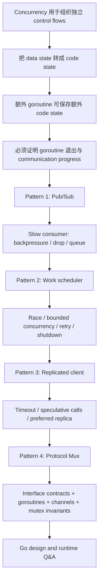

> 课程：MIT 6.824 Distributed Systems (Spring 2021)  
> 整理模式：`transcript+slides`；10 个时间段；官方 Go PDF 共 78 页  
> 正式讲授与预收集问答：00:00:00–01:13:35；现场问答正式收束：01:23:35；延伸问答覆盖至最后有声 segment 01:35:26.82

## 学习目标

完成本讲后，应能：

1. 区分 concurrency 与 parallelism，并说明本讲为何把 concurrency 当作程序结构工具，而不是加速手段。
2. 判断 state 应放在 data、program counter/call stack，还是独立 goroutine 中。
3. 从 API/interface 的并发契约推导 goroutine、channel、mutex、map 与 method 的职责边界。
4. 逐步重建四个课堂模式：publish/subscribe server、work scheduler、replicated service client、protocol multiplexer。
5. 对每个 goroutine 说明退出原因，对每次 channel communication 说明何时能 proceed，对每把 mutex 说明其保护的 invariants。
6. 分析 slow consumer、buffering、drop/coalesce、unbounded queue、retry、timeout、shutdown 和 goroutine leak 的权衡。
7. 理解课堂实际讨论的 Go values/types/interfaces/methods、slices、maps、goroutines、channels、Generics 与 runtime/GC 设计动机。

## 需要的先修知识

- Go 基本 syntax：`struct`、`map`、slice、function value、method、interface、`go`、`chan`、`select`、`defer`、`panic`。
- Thread、mutex、critical section、data race、deadlock、happens-before。
- RPC、replication、failure/timeout、producer/consumer 与 queue。
- 6.824 Lab 1 MapReduce scheduler 的背景有帮助，但本讲代码刻意抽象掉 RPC details。

## 证据与材料

- [官方 78 页 Go PDF](/assets/courses/mit-6824-s21/lectures/010/materials/10-go-lecture.pdf)：课堂代码和 hints 的最高层书面证据；pp.1–77 有内容，p.78 只有 `BLANK CODE`。
- [英文 transcript](/assets/courses/mit-6824-s21/lectures/010/transcript.txt) 与 [segment JSONL](/assets/courses/mit-6824-s21/lectures/010/transcript.jsonl)：本笔记的讲授顺序与精确结尾依据。
- [课程 MATERIALS 中的 Lecture 10](/courses/mit-6824-s21/materials/#lecture-10-guest-lecture-on-go---russ-cox)：官方视频、PDF、FAQ、Question 与字幕来源索引。
- [Lecture 10 reading evidence bundle](/courses/mit-6824-s21/readings/lecture-10/)：只汇集外部 FAQ 和 assigned Question，不是已完成学习指南，也不作为 slide 页面对齐材料。
- [Lecture 10 FAQ](/assets/courses/mit-6824-s21/materials/official-materials/faqs/go-faq.txt) 与 [Lecture 10 Question](/assets/courses/mit-6824-s21/materials/official-materials/questions/10-q-go.html)：课程网站外部资源，和课堂口述分开引用。

### 外部 Go tutorial / FAQ 边界

- **Online Go tutorial 不属于 Lecture 10 的指定材料。** 它是 Lecture 2 的 preparation，并配有 Crawler exercise 与 `net/rpc` 阅读；来源边界见 [Lecture 2 reading evidence](/assets/courses/mit-6824-s21/evidence/reading-inputs/lecture-02.md)。本讲不会用 tutorial 内容补写 Russ 没讲过的 syntax 或 API。
- **Lecture 10 FAQ 是独立课后资源。** 它解释 unused variable/import、defer、declaration syntax、OOP、trailing comma、semicolon insertion、`for`、ownership ideas 和 goroutine focus。只有当 transcript 也讲到同一话题时，笔记才将二者并列；FAQ 独有内容不冒充课堂讲授。
- **Assigned Question 是课前思考题。** 题目要求说明最喜欢 Go 的什么、原因，以及希望改变什么。它解释问答主题来源，但不是 Russ 的答案。

## 精确分段

| 节 | 时间 | 课堂角色 | 主要课件 | 详细笔记 |
| --- | --- | --- | --- | --- |
| 001 | 00:00:00–00:09:59 | 定义 concurrency；data state → code state | pp.1–17 | [第 001 节](#section-01) |
| 002 | 00:10:00–00:19:59 | Goroutine lifecycle/diagnostics；pub/sub 基线 | pp.16–26 | [第 002 节](#section-02) |
| 003 | 00:19:59–00:29:58 | Slow subscriber 策略；owner loop 与 queue helper | pp.27–34 | [第 003 节](#section-03) |
| 004 | 00:29:58–00:39:56 | 完成 pub/sub；scheduler、race、worker pool、deadlock | pp.35–54 | [第 004 节](#section-04) |
| 005 | 00:39:56–00:49:54 | Scheduler retry/shutdown；replicated client | pp.54–70 | [第 005 节](#section-05) |
| 006 | 00:49:54–00:59:53 | Protocol Mux；hints；Go 设计史问答 | pp.70–77 | [第 006 节](#section-06) |
| 007 | 00:59:53–01:09:51 | Simplicity、scheduler、GC、value layout | transcript only | [第 007 节](#section-07) |
| 008 | 01:09:51–01:19:47 | Lock invariants、reentrancy、ThreadSanitizer | 回看 pp.24–31、75 | [第 008 节](#section-08) |
| 009 | 01:19:55–01:29:51 | Slices、module paths、语言成熟与自举 | transcript only | [第 009 节](#section-09) |
| 010 | 01:29:52–01:35:27 | Generic min/max、系统生涯、长期维护、精确结尾 | pp.76–78 仅作结尾审计 | [第 010 节](#section-10) |

## 老师的教学主线



主线不是“channel 比 mutex 高级”，而是把程序状态和独立 concerns 放到最容易推理的位置。每次结构变化都由一个可观察问题驱动：难读的 state machine、无法保存 callback state、goroutine leak、slow subscriber、loop-variable race、过量 goroutines、deadlock、retry sender、timer retention、abandoned reply send 或 duplicate tag。

## Go 基础概念在本讲中的位置

### Values 与 types

- `Event`、`Msg`、`Reply`、`Args`、`Status` 是领域 types；课堂用具体 type 约束 protocol，而不是用 untyped message bag。
- `result{serverID, reply}` 把 reply value 与 provenance 一起传回，支持更新 preferred replica。
- Nested struct values 可内联为一块 memory；减少 allocations、改善 cache locality，但要求 GC 支持 interior pointers（01:06:20–01:09:34）。
- Slice 是 backing array 的 view，逻辑上编码 pointer、length、capacity；支持不复制的 subslice 与 amortized append（01:19:55–01:21:41）。
- Nil channel 是有类型的 channel zero value；send/receive 永不 proceed，可在 `select` 中动态禁用 case。

### Maps

- `map[chan<- Event]bool` 作为 subscriber set；Go 可用 map key uniqueness 表达 set，不需要课堂额外发明 set type。
- `map[chan<- Event]chan<- Event` 把真实 subscriber 映射到 helper input，从而隔离 backlog policy。
- `map[int64]chan<- Msg` 把 protocol tag 映射到 caller reply destination；mutex 保护“每个 pending tag 至多交付一次”的 invariant。

### Interfaces 与 methods

- `PubSub` interface 规定 publish ordering、subscription future scope、Cancel drain 后 close 的契约。
- `ReplicatedClient` interface 规定多个 goroutines 可 concurrent `Call`，实现必须同步 `prefer`。
- `ProtocolMux` 与 `Service` interfaces 分开 client-facing 能力和 transport 能力；method comments 明确哪些 calls 可并发、哪些必须 serialized。
- `func (s *Server) Publish`、`func (c *Client) Call`、`func (m *Mux) recvLoop` 使用 pointer receiver，共享同一 server/client/mux state。Method receiver 不替代 synchronization。
- Exported identifier 用 capitalization 表示；该 bit 在 declaration 与每个 use site 都可见（00:56:29–00:58:42）。

### Goroutines 与 channels

- Goroutine 可以承载工作，也可以承载 parser state、state ownership、serialization 或独立 concern。
- Unbuffered channel 同时 transfer value 和 rendezvous；双方必须到达匹配 operation 才能 proceed。
- Buffered channel 可做 bounded blocking queue，也可让 abandoned sender 在 receiver 返回后自行退出；capacity 必须有业务理由。
- Close 从 sender 向 receiver表示“不再发送”；应先证明不会再有 sender，之后才 close。
- Channel communication、mutex 等 synchronization 可建立 happens-before；race detector 据此判断 conflicting accesses 是否有序。

## 四个并发模式

### 1. Publish/subscribe server

**角色。** Decouple publishers 与 subscribers，同时保持所有 subscribers 一致且尊重 program order 的事件顺序。

**发展。** 先用 `mutex + subscriber map` 得到简单、强 handoff 的正确基线；随后分析 slow subscriber，选择 backpressure、drop/coalesce 或 queue；最后把 map 放入 `s.loop` 的 code state，并为每个 subscriber 启 helper 处理 backlog。

**关键 reasoning。** Cancel 不能由 receiver close channel；server 要先停止新事件、drain 已发布 backlog，再 close output。Helper 的空 queue 用 nil `sendOut` 禁用 send case，input close 后设 `in = nil` 并继续 drain。

**权衡。** Unbounded queue 保事件却无内存上限。官方 p.34 写 `for in != nil && len(q) > 0`，已核对图像确认是 slide 本身；该条件初始即退出，正确 lifecycle 需要 `in != nil || len(q) > 0`。详见 [第 003 节](#section-03)。

### 2. Work scheduler

**角色。** 将 `numTask` 个任务分配给固定或动态 servers，限制并发度、等待完成、处理失败并退出所有 goroutines。

**发展。** Buffered `idle` channel 先作为 concurrent blocking queue；closure capture outer `task` 触发 race；用 function parameter 或 `task := task` 修复。把 `<-idle` 移到 spawn 前形成 backpressure，再改成 per-server workers 从 `work` 取任务。动态 server 使 completion 从按 worker 计数改为按 task 计数。

**关键 reasoning。** Main 若先向 unbuffered `work` 发送完、后接收 `done`，会与先发 `done`、后收 `work` 的 workers 互锁。可用 `select`、独立 producer goroutine，或容量为 `numTask` 的有界 work queue 解开。Failure 时 task 回队，全部成功后才能 close work。

**权衡。** Goroutine lightweight 不等于可以按无限 backlog 创建；按 server 建 workers 更贴近 capacity。Retry 示例没有自动解决 RPC duplicate execution/idempotence。

### 3. Replicated service client

**角色。** 对等价 replicas 发起请求，优先上次成功 server，timeout 后 staggered 启动更多 attempts，返回任意 first reply。

**发展。** `prefer` 是少量共享 data，mutex 最清楚；阻塞 `callOne` 放入 goroutine，timer 与 done channel 由 `select` 竞争；每次 timeout 启动下一 replica；收到 result 后更新 preference。

**关键 reasoning。** `done` 容量为 `len(servers)`，确保 Call 返回后 losers 仍可各发送一次并退出。Timer 需 `Stop`，因为 runtime active timer list 仍持有引用。

**权衡。** Timeout 只表示尚未返回，不证明 request 未执行。Speculation 改善 availability/latency，却增加 server work；只在任一 replica reply 都可接受、调用可安全并发时成立。

### 4. Protocol multiplexer

**角色。** 让多个 concurrent Calls 共享一个不支持 concurrent Send/Recv 的 Service，并按 tag 把乱序 replies 路由回各 caller。

**发展。** `sendLoop` 独占 `Service.Send`，`recvLoop` 独占 `Recv`；Call 建立 buffered `done` 并在发送前注册 `pending[tag]`；recvLoop lookup-and-delete 后在锁外 delivery。

**关键 reasoning。** 注册必须早于发送，否则快速 reply 无 destination。Lookup 与 delete 必须同一 critical section，维护每个 active tag 至多一个 reply 的 invariant。

**权衡。** 示例未实现 transport error、timeout、cancel 与 loops shutdown；duplicate/unexpected tag 用 panic，适合可信内部演示而非完整 public RPC API。

## 课堂 hints（p.77）

1. Use the race detector, for development and even production.
2. Convert data state into code state when it makes programs clearer.
3. Convert mutexes into goroutines when it makes programs clearer.
4. Use additional goroutines to hold additional code state.
5. Use goroutines to let independent concerns run independently.
6. Consider the effect of slow goroutines.
7. Know why and when each communication will proceed.
8. Know why and when each goroutine will exit.
9. Type `Ctrl-\` to dump all goroutine stacks；live server 可看 `/debug/pprof/goroutine`。
10. Use a buffered channel as a concurrent blocking queue.
11. Think carefully before introducing unbounded queuing.
12. Close a channel to signal that no more values will be sent.
13. Stop timers you do not need；prefer `defer` for unlocking mutexes.
14. Use a mutex、`goto`，或 goroutines/channels/mutexes 的组合，只要那是最清楚的写法。

## 关键权衡

| 决策 | 获得 | 代价/前提 |
| --- | --- | --- |
| Data state → code state | 顺读 control flow、减少重复状态 | API 允许保留 stack；转换确实更清楚 |
| Mutex → owner goroutine | State ownership 明确、operations 自然串行 | 通信状态可能掩盖核心业务 state；需退出协议 |
| Buffered channel | Burst tolerance、bounded queue、sender 可脱离 receiver | Buffer 满仍阻塞；capacity 必须可解释 |
| Drop/coalesce | 有界资源与 producer progress | 业务允许丢失，最好暴露 loss signal |
| Unbounded queue | 不丢 events | 慢/离线 consumer 可耗尽内存 |
| Per-task goroutine | 每个 task control flow 直观 | Task 数大时形成 goroutine backlog |
| Per-server worker | 并发度贴近 capacity | Dynamic servers 的计数与 shutdown 更复杂 |
| Mutex for `prefer`/`pending` | 短小 invariant 清楚 | 临界区必须恢复 invariant；避免持锁阻塞通信 |
| Speculative replica calls | 降低单 replica 卡住的影响 | 重复 work、timeout 不等于 cancellation |
| Slice view | 无复制 subslice、amortized growth | Backing-array aliasing 与 retention |

## 常见误区

- **“Concurrency 就是 parallel speedup。”** 本讲的优先目标是程序清晰；quoted-string parser 没有并行机会仍受益于 code-state 思维。
- **“Go 应该只用 channels，不用 mutex。”** Russ 多次明确否定；Raft state、replica preference、Mux pending map 都可能由 mutex 最清楚地保护。
- **“Goroutine 很轻，所以数量无需边界。”** 等待中的 goroutine 仍占 stack、scheduler 与 lifecycle 成本。
- **“Close 是任一端的取消按钮。”** Close 是 sender 沿数据方向宣布 future sends 结束；反向 cancellation 应另有 channel/protocol。
- **“Buffered 就不会阻塞。”** Buffer 只提供有限 slack；满后仍需 backpressure、drop 或 queue policy。
- **“Race detector 没报告就证明无 race。”** 它只检查本次执行观察到的 accesses/interleavings。
- **“Lock 保护一个字段。”** 更准确的是保护可跨多个 fields 的 invariants；Unlock 前必须恢复它们。
- **“Slice 是 array copy。”** Slice 是 view；sub-slices 可能共享 backing memory。
- **“Generics、min/max 等是本讲当前 API 事实。”** 相关问答记录的是 2021 年计划与设计动机，不能无时间限定地改写。

## 掌握标准

达到掌握应能在不看笔记时完成以下检查：

1. 画出四个模式的 goroutines、channels、maps 和 mutexes，并标出每份 mutable state 的 owner。
2. 对 pub/sub helper 证明：空 queue 不访问 `q[0]`；close input 后 backlog 全部发送；最后只由 sender close output。
3. 对 scheduler 写出 deadlock wait-for cycle，并给出至少两种课堂修复及其资源差异。
4. 对 replicated client 解释 timer Stop、shared done、buffer size、preferred server 和 abandoned attempts。
5. 对 Mux 写出 register-before-send 与 lookup-delete invariant，说明为何 delivery 在 unlock 后进行。
6. 用 happens-before 解释 race detector，而不是只会运行 `go run -race`。
7. 说明 slice 的 `(pointer, length, capacity)` 设计如何服务 view 与 growth，以及它带来的 aliasing 边界。
8. 区分课堂 transcript、官方 PDF、Lecture 10 FAQ、Lecture 2 Online Go tutorial 与后来的 Go 版本事实。

## 推荐复习顺序

1. 先读 [第 001 节](#section-01) 和 [第 002 节](#section-02)，建立 code state、goroutine lifecycle、channel direction。
2. 连续读 [第 003 节](#section-03) 至 [第 006 节](#section-06)，按代码版本重建四个 patterns；每次改动先说 bug/constraint，再说 fix。
3. 读 [第 008 节](#section-08)，用 invariant 与 happens-before 重新审视前四节代码。
4. 最后读 [第 007 节](#section-07)、[第 009 节](#section-09)、[第 010 节](#section-10)，理解 Go design、values/types、slices、GC、Generics 与长期兼容性。
5. 用 p.77 hints 做一次反向 audit：每条 hint 在哪段代码中出现，它解决什么，何时不该使用。

## 逐段详细课堂笔记

以下 section 文件是逐段详细笔记的 canonical content；每节都包含角色、严格 chronology、概念与推导、代码 reasoning、课堂 examples、tradeoffs、misconceptions、4 组 Q&A、复习提要和待核对项。为形成单文件讲义，根笔记在总览之后按时间顺序嵌入 10 节 canonical content 的完整原文。

### 1. 00:00:00–00:09:59

[第 001 节：并发的目标与用代码表达状态](#section-01)

从 Go 面向 distributed/cloud software 的背景出发，区分 concurrency/parallelism；把 quoted-string state machine 逐步化为普通 control flow，并在 `ProcessChar` callback 边界引出 goroutine 保存额外 code state。

### 2. 00:10:00–00:19:59

[第 002 节：用 goroutine 保存状态、诊断泄漏与 pub/sub 基线](#section-02)

完成 `char/status` handshake，证明 goroutine 正常与异常退出；用 SIGQUIT 和 pprof 查 leaks；定义 pub/sub interface、channel ownership、mutex baseline 与 slow subscriber 风险。

### 3. 00:19:59–00:29:58

[第 003 节：慢订阅者策略、mutex 到 goroutine 与无界队列 helper](#section-03)

比较 backpressure、drop/coalesce、queue；把 subscriber map 交给 owner loop；构造 helper，并用 nil channel、comma-ok receive 与 close propagation 修复 queue lifecycle，同时记录 p.34 的 `&&` 课件错误。

### 4. 00:29:58–00:39:56

[第 004 节：完成 pub/sub 隔离并构造 work scheduler](#section-04)

把 helper 接回 server 后进入 scheduler：buffered idle queue、loop-variable race、capture 修复、bounded concurrency、per-server workers、dynamic servers 和首个 communication deadlock。

### 5. 00:39:56–00:49:54

[第 005 节：scheduler 进度、失败重试与 replicated client](#section-05)

用 select、独立 producer 或有界 work buffer 解 deadlock；加入 retry 与 graceful shutdown；再以 timer、speculative calls、buffered done 和 preferred replica 构造 replicated client。

### 6. 00:49:54–00:59:53

[第 006 节：protocol multiplexer、全讲 hints 与 Go 设计史问答](#section-06)

用 Service/ProtocolMux interfaces、send/recv loops、pending map 和 per-call channel 完成 RPC routing；p.77 总结 hints，随后进入 Go timeline、team、design priorities、defer、export capitalization 与 Generics 问答。

### 7. 00:59:53–01:09:51

[第 007 节：简单性、goroutine 调度与 Go 的内存布局](#section-07)

讨论 whole-system language choice、map-as-set、延后 Generics、Alef/Plan 9 scheduling、preemption、negative indexing、interior pointers、low-latency GC 与 contiguous value layout。

### 8. 01:09:51–01:19:47

[第 008 节：锁保护 invariants、函数式操作与 race detector](#section-08)

把 mutex 从“保护 data”精化为“保护 invariants”，说明 reentrant lock 的推理与重构问题；再讨论 map/filter allocation、scheduler concern separation 和 ThreadSanitizer 的 happens-before 模型。

### 9. 01:19:55–01:29:51

[第 009 节：slice 设计、module 命名与语言成熟后的约束](#section-09)

解释 slice view、length/capacity 与 amortized growth；说明 domain import path 的 ownership/security 动机；标出 01:23:35 正式收束，再记录新语言、ecosystem/tooling、compatibility 与 C-to-Go migration 的延伸问答。

### 10. 01:29:52–01:35:27

[第 010 节：Generics、系统生涯与长期软件维护](#section-10)

说明 generic `min`/`max` 的 type-expression 前提与 API 未决状态；记录 competitive programming、Plan 9、Bell Labs、Google、industrial research 和长期 production maintenance。最后有声 segment 为 01:35:26.43–01:35:26.82 的 “Thank you.”。

## 审计结论

- 分段数量：10/10；时间按 `summary-input.jsonl` 单调覆盖全部有声 transcript。
- 课堂主体 slides：pp.1–77；p.78 无实质内容。
- 已恢复 prompts 的启发式错配页码：特别是 00:20–00:52 对应 pp.27–77，而不是 prompt 中遗漏/延后的页面。
- 已核对关键 slide bug：p.34 的 `&&` 确在图像中，笔记使用符合 lifecycle 的 `||` 并显式留痕。
- 正式结束与媒体结束已分开：01:23:35 可离场；延伸答疑至 01:35:26.82。
- 外部 Online Go tutorial、Lecture 10 FAQ 和 assigned Question 均独立标识，未混入 transcript 事实。

<div id="section-01" class="course-note-section-anchor" aria-hidden="true">&nbsp;</div>

# 第 001 节：并发的目标与用代码表达状态

> 时间：00:00:00–00:09:59  
> 课堂证据：transcript；`10-go-lecture.pdf` pp.1–15  
> 讲授位置：开场、全讲方法说明，以及进入四个并发模式之前的 prologue

## 本段在整讲中的作用

Frans Kaashoek 先介绍 Russ Cox 与 Plan 9、MIT PDOS、Go 项目及 6.824 的关系。Russ 随即给出本讲目标：Go 是为 Google 所面对的分布式系统工作负载而设计的；本讲不做语言语法速成，而是通过四种常见模式展示如何设计、实现和检查 Go 并发程序，并沿途提炼可复用的 hints（00:00:00–00:02:18；[课件: 10-go-lecture.pdf p.1–2]）。

本段的核心作用是建立全讲的判断标准：并发结构首先服务于程序清晰度，而不是性能。随后用一个没有任何并行机会的字符串扫描器证明，即使一次只读一个字符，仍可借助并发式的控制流思维改善程序结构（00:02:19–00:09:59；[课件: 10-go-lecture.pdf p.3–15]）。

## 教学展开

1. **交代 Go 的问题背景。** Go 要支持 Google 当时构建的分布式系统，后来这类软件常被称为 cloud software；同一需求也使 Go 适合 6.824。Russ 将依次构造四个常见模式，而不是罗列孤立语法（00:01:23–00:02:18）。
2. **先区分 concurrency 与 parallelism。** Concurrency 是组合彼此独立执行的 control flows，使程序能够同时“应对”许多事情；parallelism 是让计算在同一时刻真正执行，使程序同时“做”许多事情。前者是程序组织，后者是执行方式。并发结构可能自然获得并行执行，但本讲关注清晰度而非加速（00:02:19–00:03:05；[课件: p.3]）。
3. **提出状态表示问题。** 设计并发程序时经常要选择把 state 放在 data 中，还是放在 code 的控制流、program counter 与 call stack 中。Russ 以匹配 C 风格 quoted string 的正则表达式为例：`/"([^"\\]|\\.)*"/`（00:03:07–00:05:02；[课件: p.4–5]）。
4. **从显式 state machine 出发。** 自动生成式实现维护整数 `state`：状态 0 等待 opening quote，状态 1 扫描普通字符或 closing quote，状态 2 消耗被 backslash 转义的字符。程序语义可行，但控制流被 `state` 数据与 `switch` 间接编码，难以直接阅读（00:05:03–00:05:40；[课件: p.6]）。
5. **逐步把 data state 转为 code state。** Russ 依次把 `readChar` 移入各个 case，把“设置 state 后回到 switch”改为 `goto`，删除落到下一 label 的冗余跳转，把唯一入口的 `state2` 内联到 backslash 分支，再把共同的 `goto state1` 提出，最后识别出 state 1 实际是普通循环（00:05:41–00:06:54；[课件: p.7–13]）。
6. **比较手写的布尔状态。** 即使初稿只用 `inEscape bool` 而不是整数状态机，同样可能重复 program counter 已表达的信息。把“是否处于 escape”改为分支中的额外一次 `readChar()` 后，代码可顺读为：验证 opening quote；循环至 closing quote；遇到 backslash 就跳过下一字符（00:06:54–00:08:10；[课件: p.13–15]）。
7. **明确 hint 的条件性。** “Convert data state into code state when it makes programs clearer.” 不是禁用状态变量的规则；只有转换确实更清楚时才采用（00:08:11–00:08:37；[课件: p.15]）。
8. **引出 goroutine 保存 code state。** callback 风格的 `ProcessChar(c rune)` 每处理一个字符就必须返回，因此本调用栈无法把 parser 状态留在 program counter 和 stack 中。Go 可以启动额外 goroutine 跑原有 `readString`，并用 `char`、`status` 两个 channel 在 push API 与 pull API 之间适配；本段在说明消息交换前结束（00:08:38–00:09:59；代码完整形态见 [课件: p.16–17]，后续讲解属于第 002 节）。

## 概念、符号与推导

- **Concurrency：** independently executing processes/control flows 的 composition；重点是 dealing with lots of things at once。
- **Parallelism：** possibly related computations 的 simultaneous execution；重点是 doing lots of things at once。
- **Data state：** 用 `state int`、`inEscape bool` 等运行时数据记录程序所处阶段。
- **Code state：** 由当前 instruction、program counter、call stack 和结构化控制流隐式记录阶段。
- **正则表达式语义：** opening quote 之后重复接受“非 quote、非 backslash 的字符”或“backslash 加任意字符”，最后接受 closing quote。课堂没有讨论 EOF、非法 Unicode 或具体 escape 合法性。
- **状态对应关系：** `state == 0` 对应函数开头；`state == 1` / `inEscape == false` 对应主循环；`state == 2` / `inEscape == true` 对应消耗 escaped character 的位置（00:07:32–00:07:49；[课件: p.15]）。

本段无数学公式推导；推导对象是等价的控制流变换。

## 代码推理

课堂最终得到的核心结构可整理为：

```go
func readString(readChar func() rune) bool {
    if readChar() != '"' {
        return false
    }

    var c rune
    for c != '"' {
        c = readChar()
        if c == '\\' {
            readChar()
        }
    }
    return true
}
```

这段代码的可读性来自控制流与语义顺序一致，而不来自少写几行：

- 函数入口承担状态 0；
- `for` 循环承担状态 1；
- backslash 分支中的第二次读取承担状态 2；
- 每个阶段只保留完成其语义所需的局部值。

Russ 明确说该版本也更快，但性能不是选择它的主要理由（00:08:11–00:08:16）。这里也不能推导出“所有 finite-state machine 都应改写为 goto/loop”；下一步的 `ProcessChar` 反例正说明 API 边界可能迫使状态显式化。

## 例子与课堂提示

- **C quoted string scanner：** 服务于“状态可以放在代码位置中”的论证，而不是教授完整 C lexer。
- **自动生成状态机：** 展示语义正确但人类难读的基线；Russ 没有否定生成器适用性。
- **`inEscape` 手写版：** 说明问题不限于夸张的整数状态机；一个看似自然的 bool 也可能重复控制流。
- **Zoom 共享故障（约 00:03:44–00:04:36）：** 只是课堂插曲，不构成 Go 技术结论；笔记不据此补充材料内容。
- **课堂 hint：** 把 data state 转为 code state 的前提是程序因此更清楚，而非机械追求“无状态”。

## 权衡与边界

- Code state 通常让正常路径更接近自然语言，但 API 若要求每步返回，显式 data state 可能不可避免。
- `goto` 在这里是推导的中间形式，帮助暴露结构；最终代码回到普通 `if`/`for`。课堂并未把 `goto` 宣布为普遍首选。
- 示例省略 EOF 与 malformed input 的完整处理，因此不能直接当作生产 lexer。
- Concurrency 与 parallelism 相关但不等价；清晰的并发分解可能在单核上运行，也可能被 runtime 并行调度。

## 易错点

- 误以为“使用 goroutine”必然是为了多核加速。Russ 在本讲开头明确排除这一目标。
- 看到 `state` 就机械删除。真正标准是该变量是否仅重复 program counter 已表达的阶段。
- 把正则中的 `\\.` 理解成只允许特定 escape。此处表示 backslash 后接任意字符，课堂刻意不分析具体 escape。
- 认为 callback API 的显式状态一定设计错误。它的返回边界会清空当前调用栈，问题在于是否能用另一 goroutine 保存所需 code state。

## 本段掌握检查

1. **问：Concurrency 和 parallelism 在本讲中分别回答什么问题？**  
   **答：** 前者回答如何组合独立 control flows、让程序同时应对多件事；后者回答如何同时执行多个计算。本讲以前者的清晰结构为目标。
2. **问：整数状态机中的三个状态如何映射到最终代码？**  
   **答：** 状态 0 是函数开头检查 quote，状态 1 是扫描循环，状态 2 是 backslash 后额外读取一个字符的分支。
3. **问：为什么 `inEscape bool` 仍可能是冗余 state？**  
   **答：** 因为“正在处理 escape”可由当前控制流位置表示；在 backslash 分支直接读取下一字符即可。
4. **问：`ProcessChar` 为什么不能直接复用同一调用栈保存 parser 状态？**  
   **答：** 每次处理一个字符后方法必须返回，program counter 和 stack 随之退出；后续会用独立 goroutine 的栈保存状态。

## 复习提要

按“并发不是并行 → state 可在 data 或 code 中 → 状态机逐步化简 → callback 边界破坏 code state → goroutine 可提供另一份 stack”复习。本段最重要的一句话是：**只在能提升清晰度时，把 data state 转为 code state。**

## 待核对项

- 00:07:16 字幕出现残缺符号，但上下文和 [课件: p.13–15] 足以确认是在比较 `inEscape` 版本与化简后的 `readString`。
- 课件 p.15 的箭头排版用于对应 `state`、`inEscape` 与程序位置；PDF 文本提取丢失部分布局，关系以口述 00:07:32–00:07:49 为准。

<div id="section-02" class="course-note-section-anchor" aria-hidden="true">&nbsp;</div>

# 第 002 节：用 goroutine 保存状态、诊断泄漏与 pub/sub 基线

> 时间：00:10:00–00:19:59  
> 课堂证据：transcript；`10-go-lecture.pdf` pp.16–26（goroutine profile 完整页在 p.20）  
> 讲授位置：prologue 收束，并进入 Pattern #1 Publish/subscribe server

## 本段在整讲中的作用

本段完成上一节留下的 `ProcessChar` 适配器：额外 goroutine 不只是并行工作单元，也能保留另一份 program counter 与 stack，从而保存 code state。Russ 随即补上这种结构的首要责任：必须知道每个 goroutine 为何、何时退出，并展示两种检查泄漏的方法。之后正式进入四个模式中的第一个 pub/sub，从 API 契约、channel 单向信息流和 mutex 基线实现开始，最后暴露 slow subscriber 问题。

## 教学展开

1. **完成双 channel 握手。** `ProcessChar` 把字符发到 `char`，再从 `status` 收到 `NeedMoreInput`、`Success` 或 `BadInput`；后台 `readString` 通过 `readChar` 先请求输入，再接收字符。原本无法留在调用者 stack 上的 parser 位置，被移到后台 goroutine 的 stack（00:10:00–00:10:34；[课件: p.16–17]）。
2. **指出 goroutine 不是免费状态容器。** 正常情况下，caller 持续调用到非 `NeedMoreInput` 状态，`readString` 返回，goroutine 结束；若 caller 因 EOF 等原因提前停止且不通知后台，goroutine 会永久阻塞，形成 leak（00:10:51–00:13:13）。课堂现场发现 slide 缺少 termination 路径，Russ 回看 p.16 的 `Success`/`BadInput` 才说明退出条件。
3. **用 stack dump 查泄漏。** 示例启动 100 个 goroutine，经 `f → g → h` 后阻塞在向无人接收的 channel 发送；Unix 上按 `Ctrl-\` 触发 `SIGQUIT`，进程退出并打印全部 goroutine stacks，可从状态 `[chan send]` 与源码行定位（00:13:26–00:14:02；[课件: p.18–19]）。
4. **在线检查运行中服务。** blank import `net/http/pprof` 注册诊断 endpoint；访问 `/debug/pprof/goroutine` 会按 stack 聚合并按数量排列，100 个相同泄漏通常出现在顶部，而且无需杀死服务（00:14:03–00:14:47；[课件: p.20]）。
5. **定义 pub/sub 目标。** Publisher 与 subscriber 不必彼此知晓；中间 server 将 `Publish(e)` 的 future events 发送给经 `Subscribe(c)` 注册的 channel。`Cancel(c)` 要等待已发布事件交付后 close `c`，以此通知 receiver 订阅真正结束（00:14:48–00:16:17；[课件: p.21–23]）。
6. **确立 channel ownership。** `chan<- Event` 表示 server 只发送。Close 也是 sender → receiver 的信号，含义是“不再发送”；receiver 不应通过 close 反向表示“不想再收”。双向协议应使用两个 channel，且两方向往往承载不同类型，例如前例的 `rune` 与 `Status`（00:16:18–00:17:04）。
7. **建立 mutex 基线。** `map[chan<- Event]bool` 作为 subscriber set；`Publish` 遍历发送，`Subscribe` 插入，`Cancel` close 后删除。三个方法都可能被多个 goroutine 调用，因此持有同一 `sync.Mutex`（00:17:05–00:17:44；[课件: p.24]）。
8. **解释 `defer Unlock` 与 `panic` 边界。** `defer s.mu.Unlock()` 紧随 `Lock()`，覆盖多 return 与 panic；但若 panic 发生时受保护状态已经不一致，解锁未必合理，因此应避免在中间态执行可能 panic 的操作。示例对重复订阅/取消未订阅使用 panic 只是简化；面向不受信任 clients 的 API 更应返回 error（00:17:45–00:19:10；[课件: p.25]）。
9. **暴露 slow subscriber。** `Publish` 持锁向所有 channel 顺序发送；任何一个 receiver 迟迟不接收，后续 subscriber、Publish、Subscribe、Cancel 都被拖住。该 lockstep 语义若被文档化且 client 可控，可以是足够简单、正确的终点；否则必须继续设计（00:19:11–00:19:59；[课件: p.26]）。

## 概念、符号与推导

- **Goroutine leak：** goroutine 永久等待无法发生的通信；runtime 不会仅因调用者不再关心它就自动终止。
- **Channel direction：** `chan<- Event` 只发送，`<-chan Event` 只接收；类型把 ownership 意图写入接口。
- **Close 语义：** sender 宣布不会再产生值，不是 receiver 的 cancellation 消息。
- **Pub/sub ordering：** interface 注释要求所有 subscriber 以相同顺序接收，且该顺序尊重 program order：若 `Publish(e1)` happens before `Publish(e2)`，则先收 `e1`（[课件: p.22]）。
- **Set 表示：** Go 没有在此处使用专门 set；`map[channel]bool` 记录 membership。

本段无数学公式推导；核心推导是通信协议与生命周期条件。

## 代码推理

状态适配器的关键握手如下（[课件: p.17]）：

```go
func (q *quoteReader) readChar() rune {
    q.status <- NeedMoreInput
    return <-q.char
}

func (q *quoteReader) ProcessChar(c rune) Status {
    q.char <- c
    return <-q.status
}
```

`ProcessChar` 只有在后台已请求字符时才能发送；后台得到字符继续运行，下一次请求或最终结果再解除 `ProcessChar` 的接收。每次通信为何能 proceed，取决于另一侧是否到达匹配操作。

Pub/sub 基线的关键临界区是：

```go
func (s *Server) Publish(e Event) {
    s.mu.Lock()
    defer s.mu.Unlock()

    for c := range s.sub {
        c <- e
    }
}
```

该实现把 subscriber map、事件顺序和取消/close 的竞争一起串行化，证明简单；代价是把任意外部 subscriber 的速度纳入持锁时间。

## 例子与课堂提示

- **100 个阻塞 goroutine：** 用数量高度重复的 stack 让 leak 可见，而不是展示复杂业务。
- **`Ctrl-\`：** 适合允许进程退出时的全量现场；`/debug/pprof/goroutine` 适合 live server。
- **Android phone-call event：** publisher 发出“拨电话”事件，dialer 订阅；真实系统还会按 event type 过滤，本讲明确把 filtering 排除在实现范围之外。
- **`defer` 代码段落：** Russ 建议 `Lock` 与紧随其后的 `defer Unlock` 形成视觉上的独立段落。

## 权衡与边界

- 额外 goroutine 能复用复杂 pull-style parser，但增加 lifecycle 与 cancellation 责任。
- Stack dump 的“阻塞”不自动等于 bug；必须结合预期退出条件判断。
- Mutex 版本具有强 handoff 属性：`Publish` 返回时，每个 subscriber 已接到值，但不保证已处理。
- Panic 适合表示可信内部 client 的 programming error；跨模块公共 API 通常应返回 error。

## 易错点

- 认为没有引用的 goroutine 会被 GC；goroutine 及其等待关系仍由 runtime 持有。
- 让 receiver close producer-owned channel；这会颠倒协议方向，并可能与发送竞争而 panic。
- 只看 map 有 mutex 就判断实现“并发良好”；持锁做 blocking send 会把所有 client 串在一起。
- 将 `defer Unlock` 当绝对规则；若受保护 invariant 尚未恢复就 panic，解锁可能暴露坏状态。

## 本段掌握检查

1. **问：后台 parser goroutine 正常退出需要 caller 满足什么条件？**  
   **答：** 持续供给字符，直到收到 `Success` 或 `BadInput`；若 caller 提前停止，还需有额外取消协议，否则后台可能泄漏。
2. **问：`Ctrl-\` 与 `/debug/pprof/goroutine` 的差别是什么？**  
   **答：** 前者触发 SIGQUIT、终止并打印全部 stacks；后者在线聚合相同 stack，不必杀进程。
3. **问：为什么 `Cancel` 最终由 server close subscriber channel？**  
   **答：** Server 是 sender；close 沿发送方向声明已发布 backlog 发送完且未来不再发送。
4. **问：mutex 版 `Publish` 的主要好处和风险是什么？**  
   **答：** 实现简单、顺序明确、返回时已 handoff；风险是一个 slow subscriber 在锁内阻塞所有操作。

## 复习提要

把本段记成三条连续责任链：**goroutine 保存 code state → 必须证明退出 → 用 stacks 查未退出者**；**channel 有 ownership → close 沿发送方向传播终止**；**mutex 基线清晰 → blocking operation 决定其扩展性边界**。

## 待核对项

- 00:11:13–00:12:35 讲者现场指出 slide 缺失结束路径，并在说明中混用了函数名；退出结论以 p.16 的 `Success`/`BadInput` 与口述修正为准。
- p.17 的提取文本将 `readChar` 返回类型写成 `int`，前后代码及 `char chan rune` 表明课堂意图是字符/rune；笔记不据此修改官方 PDF。

<div id="section-03" class="course-note-section-anchor" aria-hidden="true">&nbsp;</div>

# 第 003 节：慢订阅者策略、mutex 到 goroutine 与无界队列 helper

> 时间：00:19:59–00:29:58  
> 课堂证据：transcript；`10-go-lecture.pdf` pp.27–34（p.20 是上一例的 profile）  
> 讲授位置：Pattern #1 的扩展性分析与 helper goroutine 构造

## 本段在整讲中的作用

上一节的 mutex 版 pub/sub 在语义上正确，但 slow subscriber 会阻塞所有人。本段先穷举必须选择的三类策略，再故意选择风险最大的 unbounded queue 来展示怎样用 goroutine 隔离 concern。实现过程中又把 mutex state 转成单一 owner goroutine，并通过 nil channel、comma-ok receive 和 close propagation 修复 helper 的两个具体错误。

## 教学展开

1. **承认简单版本可能已经足够。** `Publish` 返回时事件已 hand off；若 subscriber 只会短暂落后，可要求它提供小型 buffered channel。只要容量假设成立，没必要追求更复杂结构（00:19:59–00:20:45；[课件: p.26]）。
2. **列出 slow consumer 的三种根本选择。** Producer 降速并形成 backpressure；drop/coalesce events；或保存任意多 backlog。没有一种方案免费（00:20:46–00:21:13；[课件: p.27]）。
3. **用 profiler 说明可观测丢失。** Profiling producer 与写盘/HTTP consumer 之间有 buffer；consumer 落后时，把丢失样本合并到表示 lost profile data 的条目，使结果不完整但 error rate 可见（00:21:14–00:22:39）。
4. **用 `os/signal` 说明直接 drop。** Signal handler 不能等待，runtime 尝试 non-blocking send；若 channel 未准备好就丢弃。容量至少 1 且只订阅一种 signal 时，至少能记录一次到达；重复 signal 可能合并，这与 Unix signal 语义相容（00:22:40–00:23:36）。
5. **警告 unbounded queue。** 分布式系统中的机器可能长时间慢或离线，backlog 可耗尽内存；Go channel 故意不提供 unbounded buffering。只有确知不能丢事件且能够承担边界时，才应仔细自行构造（00:23:37–00:24:35；[课件: p.27]）。
6. **先把 mutex 转成 owner goroutine。** `Server` 建立 `publish`、`subscribe`、`cancel` 三个 request channels，`s.loop` 用 `select` 串行处理。Subscriber map 成为 loop 的 local variable，其他 goroutine 无法直接访问；原公开 methods 变为 request/reply adapter（00:24:36–00:26:35；[课件: p.28–31]）。
7. **比较两种状态表达。** Owner loop 让“不可能同时修改 map”由单线程 control flow 直接保证；mutex 版则更容易一眼看出哪些字段是核心持久状态。Russ 以 Raft 为反例：leader 身份、term/log 等状态会突变，直接持锁检查和修改往往更清楚；“convert mutexes into goroutines”仍是有条件的 hint（00:26:36–00:27:42）。
8. **为每个 subscriber 增加 helper。** Main loop 只把事件交给自己创建、可控的 helper input；helper 维护 `[]Event` backlog，并独立向真实 subscriber output 发送，从而把 membership 与 slow-consumer policy 分离（00:27:43–00:28:10；[课件: p.32]）。
9. **修复空队列访问。** 初稿无条件计算 `q[0]`，空 slice 会 panic。循环先判断 `len(q)`；非空时令 `sendOut = out` 和 `next = q[0]`，空时保持 `sendOut == nil`。Nil channel 在 `select` 中永远不能 proceed，因此动态禁用 send case（00:28:11–00:28:54；[课件: p.32–33]）。
10. **修复关闭与 drain。** `e, ok := <-in` 区分值与 closed channel；`!ok` 时把 `in = nil`，避免 closed channel 永远 ready 并反复返回 zero value。循环持续到 input 已关闭且 queue 已清空，再 `close(out)`，把 termination 按顺序传播（00:28:55–00:29:58；[课件: p.34]）。

## 概念、符号与推导

- **Backpressure：** consumer 容量不足时，让 producer 的 send/blocking path 降速。
- **Drop/coalesce：** 舍弃单个事件，或把多个事件压缩成“发生过/丢了多少”的摘要。
- **Unbounded queue：** 逻辑上没有固定容量上限的 backlog；它把延迟问题转换成潜在内存耗尽。
- **Owner goroutine：** 某份 mutable state 只存在于一个 goroutine 的 local variables 中，其他 goroutine 通过 messages 请求操作。
- **Nil channel：** send/receive 永不完成；在 `select` 中可用于动态关闭一个 case。
- **Comma-ok receive：** `e, ok := <-in` 中 `ok == false` 表示 channel closed 且已无值。
- **Drain invariant：** helper 退出当且仅当 `in == nil && len(q) == 0`；退出前不得 close `out`。

本段无数学公式推导；关键是 queue 生命周期与 channel 状态的逻辑条件。

## 代码推理

修正后的 helper 结构是（[课件: p.34]）：

```go
func helper(in <-chan Event, out chan<- Event) {
    var q []Event
    for in != nil || len(q) > 0 {
        var sendOut chan<- Event
        var next Event
        if len(q) > 0 {
            sendOut = out
            next = q[0]
        }

        select {
        case e, ok := <-in:
            if !ok {
                in = nil
                break
            }
            q = append(q, e)
        case sendOut <- next:
            q = q[1:]
        }
    }
    close(out)
}
```

PDF 提取文本把循环条件显示为 `in != nil && len(q) > 0`，这会让初始空 queue 根本不进入循环，与口述“只要仍有 input **或** queue 仍有内容就继续”矛盾。课堂逻辑要求 `||`；此处保留差异为证据问题，而不是静默采用 OCR 文本。

## 例子与课堂提示

- **小 buffered subscriber channel：** 只吸收有限 burst，不解决持续落后。
- **Profiler lost-data marker：** 服务于“drop 也可以透明、可衡量”的观点。
- **`os/signal`：** 服务于“有些 producer 绝不能等待”的观点。
- **Raft：** 服务于“mutex 与 goroutine owner 没有教条优劣”；Raft 的显式 state transitions 让锁版可能更清楚。
- **Nil channel in `select`：** Go 并发控制中的重要技巧，用值状态配置可用通信分支。

## 权衡与边界

- Buffered channel 只把阻塞阈值后移；容量必须由可解释的 burst bound 支撑。
- Drop 需要业务允许，并最好提供丢失可见性；不能静默破坏 correctness-critical event stream。
- Unbounded queue 保留事件但失去资源上限；subscriber 永久离线时没有稳定态。
- Owner goroutine 强化 ownership，却可能把关键业务 state 淹没在通信状态中。
- Helper 隔离 concerns，但每个 subscription 增加 goroutine、channels 与退出协议。

## 易错点

- 把 “buffered” 等同于 “不会阻塞”；buffer 满后仍阻塞。
- 在 `select` 外无条件求值 `q[0]`；case 是否可执行不影响 operand 先被求值。
- Closed input 后继续 receive；它会立即返回 zero value，导致 busy loop 或伪事件。
- Queue 未 drain 就 close output，违反 `Cancel` 要交付已发布事件的契约。
- 把 mutex 转 goroutine 当成 Go 风格硬要求；Russ 明确允许选择更清楚的 mutex。

## 本段掌握检查

1. **问：面对任意慢 consumer，系统为什么只能在降速、丢弃、排队中选择？**  
   **答：** Producer 产生率长期高于 consumer 处理率时，差额必须影响 producer、被舍弃，或占用不断增长的存储。
2. **问：为什么 nil channel 能修复空 queue 的 send case？**  
   **答：** 对 nil channel 的 send 永不 ready，`select` 会忽略该 case，同时避免访问 `q[0]`。
3. **问：Input close 后为何设 `in = nil`？**  
   **答：** Closed channel 永远可接收；设 nil 后禁用 receive case，helper 才能专注 drain backlog。
4. **问：为什么 Raft 可能更适合 mutex state？**  
   **答：** 它频繁直接检查和改变 leader/log 等显式状态；把这些变化编码进分散 control flow 可能更难推理。

## 复习提要

复习时画出 producer、server loop、per-subscriber helper、subscriber 四层，并逐层回答：谁拥有 state、谁可能阻塞、谁 close 哪个 channel、backlog 在何处、退出条件是什么。

## 待核对项

- Prompt 003 只附上 p.20，是启发式页面对齐遗漏；本段口述与 PDF 实际演进对应 p.27–34。
- 已核对课件图像 p.34：slide 确实写 `for in != nil && len(q) > 0`，不是 OCR 错误。它会因初始 `q` 为空而立即退出，也无法表达“input 已关闭后继续 drain queue”；可运行且符合口述意图的条件应为 `in != nil || len(q) > 0`。本笔记代码采用 `||`，并将 `&&` 保留为官方课件错误记录。
- 00:22:12 的 profiler synthetic function 名在字幕中不清晰；课堂结论是“明确计入丢失样本”，不据此断言确切 symbol spelling。

<div id="section-04" class="course-note-section-anchor" aria-hidden="true">&nbsp;</div>

# 第 004 节：完成 pub/sub 隔离并构造 work scheduler

> 时间：00:29:58–00:39:56  
> 课堂证据：transcript；`10-go-lecture.pdf` pp.35–54  
> 讲授位置：Pattern #1 收束；Pattern #2 Work scheduler 的固定 server、动态 server 与 deadlock

## 本段在整讲中的作用

本段先把上一节的 helper 接回 pub/sub server，显示 goroutine 如何成为 concern boundary。随后以 Lab 1 MapReduce scheduler 为背景，从最短实现逐步加入 race 检测、闭包变量修复、并发度约束、完成等待和动态 server；每一步都由一个可观察的错误或资源问题推动，而不是直接给最终答案。

## 教学展开

1. **接入 helper。** Subscription map 从 `map[subscriber]bool` 改为 `map[subscriber]helperChannel`。Subscribe 时创建 helper channel 与 goroutine；Publish 只向 helper 发送；Cancel close helper input，让 helper drain 后 close subscriber output（00:29:58–00:30:31；[课件: p.35–36]）。
2. **确认 concern separation。** Membership/order 仍在 `s.loop`；slow-client policy 全在 helper。要把 unbounded queue 换成 drop 或 bounded policy，不必改 main loop。Hint 是让 independent concerns 在独立 goroutines 中独立运行（00:30:32–00:31:11；[课件: p.36]）。
3. **定义 scheduler API。** `Schedule(servers []string, numTask int, call func(srv string, task int))` 接受固定 server 列表、task 数量和抽象执行函数；`call` 可想象为 RPC，但本讲先忽略 RPC 细节（00:31:12–00:31:47；[课件: p.37–38]）。
4. **把 buffered channel 当 synchronized blocking queue。** `idle` 容量等于 server 数量，初始装入全部 server；receive 取走可用 server，send 放回。每个 task 启动 goroutine，等待 server、执行、归还（00:31:48–00:32:44；[课件: p.39–40]）。
5. **发现 loop-variable race。** Closure 引用同一个 `task` 变量；新 goroutine 执行前外层 loop 可能已 `task++`。`go run -race` 报出一边读、一边写及创建位置。Russ 建议开发期使用 race detector，Google 甚至让少量 production canary traffic 跑 race build（00:32:45–00:33:27；[课件: p.41]）。
6. **演示两种 capture 修复。** 一是把 `task` 作为 goroutine function 参数，在原 goroutine 中求值并复制；参数仍命名 `task`，避免 body 误用 outer variable。二是在 loop body 写 `task := task` 建立每次 iteration 的新 binding，再让 closure capture 它（00:33:28–00:35:13；[课件: p.42–46]）。这是 2021 课堂所用 Go 语义。
7. **发现过量 goroutine 与未等待完成。** 若有百万 tasks、五个 servers，初稿会创建百万 goroutines，其中绝大多数只在 `<-idle` 等待，而且 `Schedule` 创建后直接返回。把 `<-idle` 移到 goroutine 外，outer loop 获得 server 后才启动 task，使并发 goroutine 数受 server 数限制，并形成 backpressure（00:35:14–00:36:18；[课件: p.47–48]）。
8. **用资源回收计数完成。** 分发完后再从 `idle` 接收 `len(servers)` 次；能取回所有 server 说明所有 in-flight calls 已归还 server，即全部结束（00:36:19–00:36:34；[课件: p.49–50]）。
9. **改为 per-server workers。** 与其每 task 一个 goroutine，不如每 server 一个 `runTasks` goroutine。`work chan int` 传递 tasks；worker `range work`，channel close 时退出；`done` 统计 worker 结束（00:36:35–00:38:14；[课件: p.51]）。
10. **支持动态 server。** `servers` 改为 channel；独立 goroutine 持续接收新 server 并启动 worker，使 task producer 与 server discovery 同时推进。因 server 总数未知，`done` 从“每 worker 一次”改为“每 task 一次”，主流程等待 `numTask` 个 completion（00:38:15–00:39:20；[课件: p.52–53]）。
11. **暴露 deadlock。** Main goroutine 还在向 unbuffered `work` 发送，workers 做完旧 task 后都阻塞向 unbuffered `done` 报告；main 尚未进入 receive-done loop，双方互等。Runtime stack dump 把 main 标为 channel send，worker 也标为 channel send（00:39:21–00:39:56；[课件: p.54]）。

## 概念、符号与推导

- **Blocking queue：** Buffered channel 同时提供有限容量、同步和等待，不需要另写 queue mutex/condition variable。
- **Closure capture：** Closure 捕获 variable binding，不是自动冻结启动时的 value；课堂采用参数复制或 body 内 shadowing。
- **Backpressure placement：** 把 `<-idle` 放在 spawn 前，使 producer 只有在 capacity 可用时继续。
- **Worker pool：** 固定或动态 workers 从共享 `work` channel 竞争任务；每个 task 只被一个 receiver 取走。
- **Completion accounting：** 动态 worker 数未知时，按已知的 task 总数计数比按 worker 计数稳定。
- **Deadlock cycle：** main 等待某 worker receive `work`；每个 worker 等待 main receive `done`，没有 runnable participant 能打破环。

本段无数学公式推导。资源上界是：把 idle receive 移出 goroutine 后，在执行 task 的 goroutine 数不超过 `len(servers)`。

## 代码推理

课堂所示的 capture-safe、受 server capacity 限制的版本核心为：

```go
for task := 0; task < numTask; task++ {
    task := task
    srv := <-idle
    go func() {
        call(srv, task)
        idle <- srv
    }()
}

for range servers {
    <-idle
}
```

最后的等待写法在 PDF 是按 `len(servers)` 计数；这里的示意 `range servers` 只表达“每个初始 server 取回一次”，实际固定 slice 版本应使用计数 loop。

Per-server 结构则把 work identity 与 server identity 分开：

```go
runTasks := func(srv string) {
    for task := range work {
        call(srv, task)
        done <- true
    }
}
```

Dynamic-server 版本一旦把 completion send 放进每个 iteration，就必须让 task sending 与 done receiving 能并行，否则两个 unbuffered channels 形成等待环。

## 例子与课堂提示

- **Lab 1 MapReduce：** Scheduler 模式来自学生已经实现过的作业，但课堂 abstraction 省略实际 RPC 和失败处理。
- **`go run -race` 输出：** 直接指出 read/write 地址、goroutine 与创建栈，用于把“可能拿错 task”变成可复现证据。
- **Million tasks / five servers：** 说明 lightweight 不等于 unlimited；等待型 goroutine 仍占 stack 与调度资源。
- **Runtime deadlock report：** 所有 goroutine 阻塞时，Go 报 `fatal error: all goroutines are asleep` 并给 stacks，服务于通信进度推理。

## 权衡与边界

- Per-task goroutine 直观，但 task 数巨大时产生无意义等待；per-server worker 数更接近真实 capacity。
- Pulling server before spawn 提供有界并发，但 outer producer 会阻塞；这是有意 backpressure。
- 以 server 回收作为 barrier 很简洁，但只适用于固定、已知、每次必归还的资源集合。
- Dynamic server discovery 解耦扩容，却使 worker 数与 shutdown 更难统计，因此转而按 task completion 计数。

## 易错点

- 修复参数名为 `task2` 后，function body 仍误用 outer `task`；p.42–43 专门展示了这个 “OOPS”。
- 只修 race 不修 lifecycle；程序仍可能过量 spawn 或提前返回。
- 认为 goroutine lightweight 就可以按无限 backlog 创建；Russ 把这与 unbounded queue 视为同类风险。
- 逐段看两个 channel 都有人收发就忽略全局顺序；deadlock 来自 main 先完成所有 sends、之后才 receives。

## 本段掌握检查

1. **问：`task := task` 在 2021 课堂代码中解决了什么？**  
   **答：** 每次 loop body 建立新的 binding，使 closure 不再与 outer loop 的后续 `task++` 竞争。
2. **问：为何把 `<-idle` 移到 `go func` 外会限制并发度？**  
   **答：** Main 必须先取得一个 idle server 才能 spawn；同时可被取走的 server 最多是 server 总数。
3. **问：动态 server 模式为何按 task 而非 server 计数完成？**  
   **答：** Server 可随时加入，总数未知；`numTask` 已知且每个成功 task 恰好报告一次。
4. **问：末尾 deadlock 的等待环是什么？**  
   **答：** Main 阻塞发送新 work；所有 workers 阻塞发送旧 task 的 done；main 尚未开始接收 done。

## 复习提要

沿版本演进复习：**idle queue → closure race → capture copy → spawn 前取 capacity → barrier → per-server workers → dynamic servers → per-task done → deadlock**。每一步都回答一个具体问题，不要只背最终代码。

## 待核对项

- Prompt 004 标为 transcript-only，但本时间段与官方 PDF p.35–54 明确对应；这是 prepare 阶段页面对齐遗漏，页码按课堂口述和 PDF 代码演进补回。
- p.53 的 PDF 文本提取保留了旧代码与新代码叠层，具体 completion placement 以 00:38:47–00:39:20 口述为准。
- Go 后续版本调整过 loop variable 语义；本节严格记录 Spring 2021 课堂与当时代码，不把后来的语言变化倒写进讲授内容。

<div id="section-05" class="course-note-section-anchor" aria-hidden="true">&nbsp;</div>

# 第 005 节：scheduler 进度、失败重试与 replicated client

> 时间：00:39:56–00:49:54  
> 课堂证据：transcript；`10-go-lecture.pdf` pp.54–70  
> 讲授位置：Pattern #2 收束；Pattern #3 完整展开；Pattern #4 开题

## 本段在整讲中的作用

本段从 scheduler deadlock 的现场继续，比较三种恢复进度的方法，并扩展到 RPC failure、retry 和 graceful shutdown。随后切换到 replicated service client：用 goroutine 与 timer 把“调用没有显式 error”的接口转化为可超时、可并发试探多个 replicas 的客户端。两部分由同一问题连接：必须明确每次通信何时会 proceed、每个 goroutine 如何退出。

## 教学展开

1. **复述 deadlock。** Main goroutine 阻塞向 `work` 发下一 task；workers 阻塞向 `done` 报告上一 task 完成；main 只有发完全部 work 才开始接收 done，因此无人能前进（00:39:56–00:40:08；[课件: p.54]）。
2. **比较三种修复。** 可写一个 `select` 同时尝试 send-work 和 receive-done（[课件: p.55]）；更清楚的是把 task-sending loop 放进独立 goroutine，使 main 立即进入 completion loop（[课件: p.56]）；最简单的是把 `work` buffer 设为 `numTask`，所有 task IDs 先入队而不阻塞（00:40:09–00:41:12；[课件: p.57–58]）。
3. **解释有界 buffer 的资源理由。** 每 task 启 goroutine 可能花数 KB；在 channel 中保存一个 task integer 约一个机器字。若 `numTask` 已知，容量等于任务数是明确有界，不是此前警告的真正 unbounded queue（00:40:41–00:41:12）。
4. **加入 RPC failure/retry。** `call` 改为返回 `bool`。成功时向 `done` 报告；失败时把 task 放回 FIFO `work` queue，通常会被另一 server 取得。该结构自然表达 retry，不需要新增中央状态机（00:41:13–00:42:01；[课件: p.59–61]）。
5. **调整 close 顺序。** Workers 失败时也会向 `work` 发送，所以不能在初始 tasks 入队后立刻 close；必须先收到 `numTask` 个成功 completion，确保不会再 retry，之后才 close `work`（00:42:02–00:42:20；[课件: p.60–61]）。
6. **拒绝强杀 goroutine。** 任意终止可能发生在持锁或协议中途，使其他 goroutine 永久等答复。应显式通知，让 worker 在一致点清理并返回。这里 close `work` 使 worker 的 `range` 结束（00:42:21–00:42:56）。
7. **关闭 server-discovery loop。** 监听动态 `servers` 的 goroutine 也需退出；增加 `exit` channel，loop 的 `select` 同时等待新 server 或退出通知（00:42:57–00:43:23；[课件: p.62]）。
8. **定义 Pattern #3。** `ReplicatedClient.Init` 接受 replicas 与 `callOne`；并发安全的 `Call(args)` 自行选择可用 server，优先复用上次成功者（00:43:24–00:44:14；[课件: p.63–64]）。
9. **选择 mutex 保存极小共享状态。** 跨 Call 唯一需要共享的是 `prefer int`；Russ 明确说若 mutex 最清楚就使用 mutex，不必因 Go 强调 channels 而回避（00:44:15–00:44:40；[课件: p.65]）。
10. **把阻塞调用放到 goroutine 后面。** `callOne` 只返回 `Reply`，无显式 error；客户端把“太久”视为失败。启动 goroutine 调用 server，并 `select` 等 `done` 或 timer channel（00:44:41–00:45:31；[课件: p.66–67]）。
11. **停止不再需要的 timer。** 即使 Call 很快返回，timer 仍被 runtime active timer list 引用，不能立即 GC；`defer t.Stop()` 移除它，避免高频短调用积累大量尚未触发的 timers（00:45:32–00:46:03，答疑延伸至 00:47:24–00:48:37）。
12. **轮流启动 replicas，并接受任意先返回者。** 每次 timeout 后 reset timer 并启动下一 server；所有 goroutines 共享 `done`，因此较早启动但较晚返回的 replica 仍可胜出。若所有 server 都已启动，就不再 timeout，直接等首个 reply（00:46:04–00:46:57；[课件: p.68]）。
13. **为 abandoned sends 留 buffer。** `done` 容量为 `len(servers)`；Call 取一个 reply 返回后，其余 goroutines 仍能发送并退出，channel 随后由 GC 回收。否则 losers 会永久阻塞（00:46:58–00:47:23）。
14. **恢复 preference。** 持锁读取 `prefer`，按 offset 环绕遍历 server IDs；收到 result 后持锁更新成功 server。Russ 用 `goto Done` 跳出 `select` 所在 loop，强调若它最清楚就可以使用（00:48:39–00:49:17；[课件: p.69]）。
15. **开题 Pattern #4。** Protocol multiplexer 是 RPC 系统的逻辑核心，下一节解释如何把并发 Call 与单路 Send/Recv 连接起来（00:49:18–00:49:54；[课件: p.70]）。

## 概念、符号与推导

- **Bounded eager queue：** `make(chan int, numTask)` 的上限由已知 tasks 数确定，确保初始分发不与 completion 报告互锁。
- **Retry invariant：** 每个 task 在成功前要么正在某 worker 执行，要么在 `work` queue；只有成功才增加 done count。
- **Graceful shutdown：** 先证明不再有 sender，再 close channel；接收方通过 range 结束而退出。
- **Speculative request：** Timeout 后保留旧 attempt，同时启动新 replica；任何 first reply 都可完成 Call。
- **Preferred replica：** `prefer` 只是性能/局部性 hint，不改变“任一 replica reply 可接受”的前提。
- **Result type：** `{serverID int; reply Reply}` 同时携带业务值与更新 preference 所需 provenance。

本段无数学公式推导。最多启动 `len(servers)` 个 attempts，故 `done` 容量设为该值可让每个 attempt 至多发送一次后退出。

## 代码推理

Failure-aware worker 的状态转移是：

```go
for task := range work {
    if call(srv, task) {
        done <- true
    } else {
        work <- task
    }
}
```

这里 close 必须在收到全部成功后：失败路径仍是 producer。强行提前 close 会导致 `send on closed channel`。

Replicated Call 的核心不是“每个 server 各等一秒”，而是 staggered starts + shared completion：

```go
done := make(chan result, len(c.servers))
for off := 0; off < len(c.servers); off++ {
    id := (prefer + off) % len(c.servers)
    go func(id int) {
        done <- result{id, c.callOne(c.servers[id], args)}
    }(id)

    select {
    case r := <-done:
        return r.reply
    case <-timer.C:
        timer.Reset(timeout)
    }
}
return (<-done).reply
```

实际课堂最终版还在返回前更新 `c.prefer`，并以 mutex 保护；示意代码省略该段只是突出通信进度。

## 例子与课堂提示

- **Separate sender goroutine vs full-size buffer：** 两者都可解除 deadlock；前者强调 concerns 独立，后者利用已知有限输入更简单。
- **Failed task 回队尾：** FIFO 使它更可能交给不同 server，但课堂没有证明公平性或排除同一 server 再取。
- **Timer GC 问答：** Runtime 自己持有 active timer reference，因此普通 reachability GC 无法判断用户已放弃。
- **`goto Done`：** 服务于从多层控制结构跳到统一 preference update；不是无条件推荐 goto。

## 权衡与边界

- 容量 `numTask` 以每 task 一个 integer 换取简单进度证明；task 数极大时仍应重新评估内存。
- Retry 示例假设失败可安全重试；没有讨论 RPC 是否幂等、duplicate execution 或 exactly-once，这些不能从课堂代码自动获得。
- Timeout 是 failure detector heuristic；慢 replica 可能仍成功，故旧 attempt 不被取消。
- Buffered `done` 避免 goroutine leak，但 losers 的 replies 会被丢弃；仅当调用任一 replica 等价时成立。
- `prefer` 使用 mutex 而非 owner goroutine，体现“选最清楚机制”的总原则。

## 易错点

- 初始 work 发完就 close，忽略 worker 的 retry send。
- 收到第一个 reply 后让其他 goroutine 向 unbuffered channel 永久发送。
- 认为 timer variable 离开 scope 就能立即 GC；runtime timer queue 仍引用它。
- 把 goroutine 当作可安全 kill 的 thread；任意终止破坏锁与通信协议。
- 假设 timeout 意味请求未执行；课堂只把它当“当前还没回”的信号。

## 本段掌握检查

1. **问：为什么把 `work` buffer 设为 `numTask` 能解除当前 deadlock？**  
   **答：** 初始 sends 都能完成，main 能进入 receive-done loop，workers 的 completion sends 因而有接收者。
2. **问：Retry 版本为何必须把 `close(work)` 移到全部成功之后？**  
   **答：** 失败 workers 仍可能发送 task 回 `work`；全部成功后才可证明没有未来 sender。
3. **问：Replicated Call 的 `done` 为什么要有 `len(servers)` 容量？**  
   **答：** Call 返回后每个其余 attempt 仍可能各发送一次；足够容量让它们不依赖 receiver 也能退出。
4. **问：为什么 `prefer` 用 mutex 并不违背本讲？**  
   **答：** 它是很小、直接的共享 state，mutex 最清楚；Russ 的 hints 从来不是“channels everywhere”。

## 复习提要

用两个生命周期证明串联本段：Scheduler 中“谁最后向 `work` 发送，决定何时 close”；Replicated client 中“Call 返回后谁还会向 `done` 发送，决定 buffer 多大”。

## 待核对项

- 00:40:54 对 goroutine 内存大小和 integer 的字节数是讲者用于数量级比较的口述，不应当作所有 Go 版本/架构的 ABI 保证。
- p.59–60 的叠层代码仍显示旧的无条件 `done <- true`，最终 retry 逻辑以 p.61 和口述为准。
- Timer API 行为严格记录 2021 课堂；后续 Go 版本的 timer 实现变化不属于本讲证据。

<div id="section-06" class="course-note-section-anchor" aria-hidden="true">&nbsp;</div>

# 第 006 节：protocol multiplexer、全讲 hints 与 Go 设计史问答

> 时间：00:49:54–00:59:53  
> 课堂证据：transcript；`10-go-lecture.pdf` pp.70–77  
> 讲授位置：Pattern #4 完整实现；00:52:23 后进入预收集学生问答

## 本段在整讲中的作用

Protocol multiplexer 把前三个模式汇总到一个 RPC 核心：interface 规定并发契约，method 将每次 Call 的局部状态注册到 map，专用 goroutines 串行化非并发安全的 Send/Recv，mutex 保护跨 goroutine 的 pending invariant，channel 把 reply 路由给正确 caller。00:52:05 后 Russ 总结全部 hints；00:52:55 起话题明确转为 Go 项目与语言设计问答，本节将两部分分开记录。

## 教学展开

### A. Pattern #4：Protocol multiplexer

1. **明确匹配责任。** Service 能从 request/reply `Msg` 读出唯一 `tag`，能 Send 任意 request、Recv 任意 reply，但 Send/Recv 自身不匹配；Mux 负责按相同 tag 关联（00:49:54–00:50:20；[课件: p.70–71]）。
2. **按 interface 写并发约束。** `ProtocolMux.Call` 可被多个 goroutines 并发调用；`Service.ReadTag` 也可并发；`Service.Send` 不得自身并发，`Recv` 也不得自身并发。这些注释决定实现结构，而非实现后补文档（[课件: p.71]）。
3. **建立 state 与 owner。** `Mux` 保存 `srv Service`、`send chan Msg`、`pending map[int64]chan<- Msg` 和保护 pending 的 mutex；`Init` 启动一个 `sendLoop`、一个 `recvLoop`（00:50:21–00:50:47；[课件: p.72]）。
4. **用 goroutine 串行化 Send。** 所有 Calls 把 request 发到 `m.send`，只有 `sendLoop` 调 `srv.Send`，所以底层 Service 不必处理 concurrent Send（00:50:48–00:51:08；[课件: p.73]）。
5. **Recv 后按 tag dispatch。** `recvLoop` 每次只调一个 `Recv`，读 tag，持锁从 `pending` 找到并删除 destination channel，再解锁并发送 reply；找不到 tag 表示 unexpected reply，示例 panic（00:51:09–00:51:35；[课件: p.74]）。
6. **Call 先注册再发送。** Call 读 request tag，创建自己的 buffered `done`，持锁检查 duplicate tag 并插入 map，之后将 request 发给 sendLoop，最后 `<-done` 等回复（00:51:36–00:52:04；[课件: p.75]）。注册先于发送，避免 reply 快速返回却尚无路由项。
7. **提炼组合原则。** Russ 强调这段 Go 代码比过去的 C 实现简单；最终 hint 不是只用某一种 primitive，而是当它最清楚时把 goroutines、channels 和 mutexes 一起用（[课件: p.75]）。

### B. Hints 总结与设计问答

8. **汇总全讲。** p.77 将 race detector、data/code state、goroutine ownership/lifecycle、slow goroutine、channel close/buffering、timer、defer、mutex/goto 等规则集中列出。它们都是带条件的 design hints（00:52:05–00:52:24；[课件: p.76–77]）。
9. **Go 时间线与团队。** 讨论始于 2007-09；Russ 2008-08 全职加入；2009-11 open-source launch；Go 1 原计划 2011-10，实际 2012-03；截至 2021 已 13.5 年。最初约 5 人，两年做出可用于 production 的 prototype；当时 Google 约 50 名专职人员，另有大量外部 contributors（00:52:55–00:54:22）。
10. **设计优先级。** 首先解决 Google 的 distributed/cloud software，其次服务大量 programmers 共用大型 codebase；核心组在把 feature 放进语言前追求广泛共识，慢决策换取长期稳定和组合一致性（00:54:23–00:56:08）。
11. **`defer` 的扩散。** Go 为 panic/recover 需要引入 defer，后来成为 `defer mu.Unlock()` 等常用 idiom；Swift 已采用类似特性，当时 C++ 也有 proposal（00:56:09–00:56:28）。
12. **以 capitalization 表达 export。** C++ 的区域式 `public:`/`private:` 要向上查找；Java 每个 member 都写 modifier 太冗长；Python underscore convention 默认仍偏公开。Go 选择首字母大写即 exported，虽初看不美观，却让 declaration 和每个 use site 都携带 visibility bit（00:56:29–00:58:42）。
13. **Generics 的 2021 状态。** 当时目标为 Go 1.18；Russ 期待 generic `min`/`max`，因为此前必须选单一 numeric type 或复制一组函数（00:58:43–00:59:22）。这是课堂当时的计划，不应写成当前版本新闻。
14. **进入“何时 Go 不是最佳工具”问题。** Russ 以 OEIS backend 开题：即使某部分数学运算可能更适合别的语言，为避免跨语言 shell/interoperation，整个服务仍可能选 Go；具体说明延续到第 007 节（00:59:23–00:59:53）。

## 概念、符号与推导

- **Interface：** 这里不是 class hierarchy，而是一组 method contracts。`ProtocolMux` 规定 client-facing `Init`/`Call`；`Service` 规定 Mux 所需的 `ReadTag`/`Send`/`Recv` 能力。
- **Method receiver：** `func (m *Mux) Call(...)` 在 `*Mux` 上操作共享 service 与 pending state；pointer receiver 让各 Calls 看到同一 map/mutex。
- **Type information：** `chan Msg`、`chan<- Msg`、`map[int64]chan<- Msg` 分别表达双向 channel、只发送 destination、tag-to-destination mapping；channel direction 是编译期约束。
- **Pending invariant：** 每个 active tag 最多对应一个 reply destination；Recv 取走 entry 后，后续同 tag reply 不再合法。
- **Visibility：** Identifier capitalization 把 exported/unexported 状态编码进名字，而不是独立 modifier。

本段无数学公式推导；路由关系可写为 `pending[tag] = done`，reply 到达后执行一次 lookup-and-delete。

## 代码推理

Call 的顺序必须是 register → send → wait：

```go
func (m *Mux) Call(args Msg) Msg {
    tag := m.srv.ReadTag(args)
    done := make(chan Msg, 1)

    m.mu.Lock()
    if m.pending[tag] != nil {
        m.mu.Unlock()
        panic("mux: duplicate call tag")
    }
    m.pending[tag] = done
    m.mu.Unlock()

    m.send <- args
    return <-done
}
```

Recv loop 在锁内只操作 map，在锁外向 caller channel 发送：

```go
reply := m.srv.Recv()
tag := m.srv.ReadTag(reply)

m.mu.Lock()
done := m.pending[tag]
delete(m.pending, tag)
m.mu.Unlock()

if done == nil {
    panic("unexpected reply")
}
done <- reply
```

这样既保持 lookup/delete 原子性，又不在持锁时执行可能阻塞的 delivery。

## 例子与课堂提示

- **RPC logical core：** 多个 callers 共用一条传输，tag 把乱序 replies 送回各自 waiter。
- **C 实现对比：** Russ 仅作经验判断“过去写 C 版本糟糕得多”，没有展开 C 数据结构，不能补写。
- **Export capitalization：** 重点不是少打字，而是 reading code 时立即知道其他 package 是否可访问该 symbol。
- **Go team history：** 用于说明语言成熟需要生态、工具和长期维护，并非四个并发模式的技术前提。

## 权衡与边界

- Dedicated send/recv goroutines 简化底层 Service，但它们的退出、transport error 和 shutdown 未在示例中实现。
- Duplicate/unexpected tag 以 panic 处理，仍是假设可信内部系统；production RPC 通常需 error/cancellation policy。
- `pending` 只在 map 操作时持锁，体现 mutex 适合短小 invariant；通信本身由 channels/goroutines 负责。
- Capitalization 让 visibility 醒目，但也把命名样式纳入 API compatibility。
- 设计共识带来稳定，也使 Generics 等大型 feature 推进多年。

## 易错点

- 先发送 request、后注册 pending；快速 reply 可能成为 unexpected reply。
- 持锁向 `done` 发送；慢 caller 会扩大临界区，并阻止其他 reply dispatch。
- 把 interface 当成拥有实现/字段的 class；课堂代码只依赖 method set 与并发约束。
- 认为 Go 排斥 mutex；Mux 正是 goroutine、channel、mutex 混合使用。
- 把 2021 对 Go 1.18 的计划当成无时间限定的当前状态。

## 本段掌握检查

1. **问：Mux 为什么需要独立 sendLoop 和 recvLoop？**  
   **答：** 允许多个 Call 并发，同时保证底层 `Service.Send` 不与自身并发、`Recv` 不与自身并发。
2. **问：为什么 recvLoop 要在 unlock 前 delete pending entry？**  
   **答：** Lookup 与“该 tag 已消费”必须作为同一 invariant transition，防止重复 reply 或并发取消再次取得同一 destination。
3. **问：`map[int64]chan<- Msg` 的类型分别表达什么？**  
   **答：** `int64` 是 tag；value 是 recvLoop 只可发送 reply 的 caller destination channel。
4. **问：Capitalization 相比 `public` modifier 的主要阅读优势是什么？**  
   **答：** 每个 identifier use site 都直接显示是否 exported，不必跳回 declaration 或向上查区域 modifier。

## 复习提要

先复述 Mux 的三条路径：Call 注册、sendLoop 串行发送、recvLoop 按 tag 删除并投递；再用 p.77 检查每条路径的 goroutine exit、communication progress、mutex invariant 与 channel ownership。

## 待核对项

- PDF p.74 使用 `m.srv.Tag(reply)`，p.71 interface 名为 `ReadTag`，口述说“pull the tag out”；笔记按 interface 统一写 `ReadTag`，保留官方 slide 命名不一致。
- Prompt 006 标为 transcript-only，但 00:49:54–00:52:24 明确对应 PDF p.70–77；页码按官方 PDF 实际顺序恢复。
- 00:53:17 对 Go 1 原计划日期的口述立即自我修正；本节保留“原计划 2011-10，实际 2012-03”。

<div id="section-07" class="course-note-section-anchor" aria-hidden="true">&nbsp;</div>

# 第 007 节：简单性、goroutine 调度与 Go 的内存布局

> 时间：00:59:53–01:09:51  
> 课堂证据：transcript only；本时间段没有新的 slide 讲授  
> 讲授位置：预收集学生问答继续

## 本段在整讲中的作用

本段离开四个并发模式，回答“Go 为什么这样设计”。它把语言表面的省略与系统目标联系起来：map 兼任 set、Generics 延后、goroutines 从 Plan 9/Alef 经验中保留轻量性却拒绝隐式串行假设、negative indexing 因会掩盖 bug 而舍弃、struct value 的内联布局则以更复杂 GC 换取 allocation 数与 cache locality。

## 教学展开

1. **完成“并非最佳语言仍使用 Go”的例子。** OEIS backend 用 Go 做大整数与复杂数学，并非 Go 对该数学最理想，而是 shell out 到数学语言和跨语言 integration 太麻烦。工程中的一致性与互操作成本会改变局部最优（00:59:53–01:00:22）。
2. **澄清 simplicity 不是单纯删除 features。** Set 与 map 极接近，可用 value 为 empty/boolean 的 map 表示；Generics 不是因程序员不需要，而是 2007 年 Java Generics rollout 的问题让团队确信仓促设计会出错。许多程序可先在无 Generics 下完成，积累真实需求并咨询专家后再加入更合适的设计（01:00:23–01:01:39）。
3. **回顾 Plan 9/Alef。** Alef 有 channels、`select` 和类似 goroutine 的 tasks，但无 GC；tasks 固定到某个 OS thread，只在 channel operation 时 cooperative reschedule。同一 thread 上的 tasks 因“不会同时运行”而无锁改共享结构，短小程序方便，半年后却很难记住隐含 sharing assumptions（01:01:40–01:03:07）。
4. **说明 Go 的并发模型。** Go 从一开始就把 goroutines 视为独立、可能 preempt 的执行单元；共享数据必须显式用 locks，或用 channels 通信/协调。不能依赖“这些 goroutines 恰好同 thread，因此不并发”（01:03:08–01:03:27）。
5. **区分早期实现与语言模型。** 最早只有进入 runtime 才是 preemption point，后来 function entry 可 preempt；tight loop 仍可能延迟 stop-the-world GC。近几个 release 才借助向 threads 精确投递 Unix signals 改善 preemption latency，但程序模型始终不允许控制 preemption 时机（01:03:28–01:04:30）。
6. **定位 scheduler 源码。** Goroutine runtime 像建在 host OS 之上的小 OS；Russ 建议先学 6.828/xv6，再从 Go runtime 的 `proc.go` 开始追代码（01:04:31–01:05:17）。
7. **拒绝 negative indexing。** `x[-1]` 取最后元素很优雅，但 loop 的 off-by-one 使 `i == -1` 时，本应立即报错的 `x[i]` 静默读到另一端，掩盖 bug；收益不足以接受该 failure mode（01:05:18–01:06:19）。
8. **指出最难实现的是 GC。** Go 允许 struct 直接包含其他 values，形成一块连续 memory，并允许取 interior field address；GC 因此要从指向 allocation 中部的 pointer 找回 object，这不同于 Java/Lisp 常见对象模型（01:06:20–01:07:16）。
9. **低延迟优先。** Network requests 不能容忍约 200 ms 的全停顿；团队希望 GC 与 Go program 在不同 cores 并发工作，最终需要 GC 专家实现低延迟 collector（01:07:17–01:07:55）。
10. **解释 inline values 的收益。** 一个含五个 sub-values 的 struct 可只 allocation 一次，降低与 object count 近似相关的 GC load；连续布局也利用 CPU cache line locality。Gerrit 的 Java 实现难以紧凑表示 20-byte hash，额外 object/pointer overhead 会累积（01:07:56–01:09:34）。
11. **开始 automatic parallelization 问题。** 标准 Go toolchain 不自动并行化 loops；GCC/LLVM 的 Go frontends 可能继承其优化，但 Google 主要 workload 是大量 servers/requests，不是大向量数学。回答在下一节开头收束（01:09:35–01:09:51）。

## 概念、符号与推导

- **Map as set：** Key 表示 membership；value 可是 `bool` 或 zero-size/empty value。课堂表达的是语义复用，没有比较两种 value type 的具体内存占用。
- **Cooperative scheduling：** Task 只在约定操作让出；容易产生依赖调度细节的无锁 sharing。
- **Preemptive model：** 程序不能假定运行到主动 yield 才被切走；共享访问必须同步。
- **Value layout：** Nested struct values 可内联在 enclosing struct 的同一 allocation 中，而不必各自成为 heap object。
- **Interior pointer：** Pointer 可指向 allocation 内某 field；collector 必须仍保持整个 owning object 存活。
- **GC pressure：** Russ 口述其 load 与 allocation object 数量相关；减少 objects 可降低 tracing/metadata 工作。
- **Cache locality：** 连续 values 更可能随同一 cache line 载入，减少 scattered pointer chasing。

本段无数学公式推导；性能关系均为定性工程解释，未给 benchmark 数字。

## 代码推理

Map 表示 set 的课堂思路可写为：

```go
seen := make(map[string]bool)
seen["server-1"] = true
if seen["server-1"] {
    // member of the set
}
```

它不是额外的 set API，而是复用 map 的 key uniqueness 与 lookup。

Struct value 布局的语义对比可用类型关系说明：

```go
type Hash [20]byte

type Entry struct {
    ID   Hash
    Next int64
}
```

课堂观点是 `ID` value 可内联进 `Entry` 的一块 memory；笔记不据此承诺 field padding、escape analysis 或 heap/stack placement。

## 例子与课堂提示

- **OEIS：** 说明语言选择是 whole-system tradeoff，而非每个函数单独选理论最佳语言。
- **Java Generics rollout：** 是 Go 团队延后 feature 的历史风险参照，不是对所有 Generics 的否定。
- **Alef tasks：** 展示依赖 cooperative scheduling 的 hidden invariant 为什么不适合多人、长期代码库。
- **`x[-1]`：** 展示局部便利可能降低 bug detectability。
- **Gerrit 20-byte hash：** 展示 memory representation 会影响实际 server efficiency。

## 权衡与边界

- Map 可表达 set，但专用 set API 可能有不同 ergonomics；Russ 只说明为何当时不另加 built-in set。
- Preemption 实现逐年增强，不改变程序必须按可能并发来写的模型。
- Programmer 获得紧凑 layout 与 interior pointers，runtime 则承担更复杂 GC。
- 低 latency collector 利用多核，但消耗与 application 同时运行的 CPU resources；课堂没有展开 throughput tradeoff。
- Negative indexing 的拒绝优先 fail-fast，而不是追求 Python 风格简洁。

## 易错点

- 把“Go 简单”理解成“开发者不需要高级能力”；Russ 的标准是成熟、可组合且值得长期成本。
- 依赖当前 scheduler 碰巧不 preempt 来避免 lock；语言模型不允许这种推理。
- 把 nested struct 一定放 stack；课堂只说 representation 可为同一 contiguous allocation，不等于 placement 保证。
- 认为 interior pointer 只需标记 field；GC 必须识别并保活完整 allocation。
- 把 standard Go toolchain 的“不自动 loop parallelization”误写成所有 Go compiler 都绝无相关优化。

## 本段掌握检查

1. **问：为什么 Go 初期没有 Generics 不能简单归因于追求少 features？**  
   **答：** 团队认为需求真实，但 2007 年缺少足够把握，宁可先积累程序经验，避免锁定糟糕设计。
2. **问：Alef 的 cooperative tasks 为什么会造成长期维护风险？**  
   **答：** 无锁共享的正确性依赖 tasks 与 threads 的隐含绑定和 yield points，后来维护者很难恢复这些假设。
3. **问：Go 为什么不支持 `x[-1]`？**  
   **答：** 它会把常见 off-by-one 从立即 bounds error 变成合法但错误的另一端访问。
4. **问：Inline struct values 同时带来哪两类收益？**  
   **答：** 减少 allocations/GC object load，并提高连续访问的 cache locality；代价是 GC 要支持 interior pointers。

## 复习提要

按三组设计交换复习：**少 feature ↔ 等待成熟设计**；**轻量 goroutine ↔ 不允许依赖隐式串行**；**可控 value layout ↔ 更复杂但低延迟的 GC**。

## 待核对项

- 01:09:02 附近 Gerrit 示例的字幕把 hash 类型转写不清；上下文只足以确认是“20-byte hash value”的布局问题，不推定具体 Git 类型名。
- 本段 prompt 附带了与时间不匹配的旧 pub/sub slides；这里按 transcript 标记为 transcript only，不把错配页作为问答证据。

<div id="section-08" class="course-note-section-anchor" aria-hidden="true">&nbsp;</div>

# 第 008 节：锁保护 invariants、函数式操作与 race detector

> 时间：01:09:51–01:19:47  
> 课堂证据：transcript；回看 `10-go-lecture.pdf` pp.24–31、p.75 作为锁代码上下文  
> 讲授位置：预收集问答结束，随后是现场问答

## 本段在整讲中的作用

本段先完成 automatic parallelization 的回答，再回看 pub/sub 与 Mux 代码，把“mutex protects data”提升为更精确的“mutex protects invariants”。这一表述解释了临界区边界，也解释 Go 为什么没有 reentrant mutex。随后的现场问答把该推理应用到 map/filter 的 allocation、scheduler deadlock 的 goroutine 分解，以及 race detector 的 happens-before 检测机制。

## 教学展开

1. **收束 automatic parallelization。** 标准 Go toolchain 不以自动并行化 vector-like loops 为主要目标；Google 更常见的是许多 servers/requests 独立工作，而非大规模数值向量计算，因此这类优化优先级较低（01:09:51–01:10:11）。
2. **把 lock 与 invariant 绑定。** 课堂此前说 `mu` protects map 只是简写。更准确地说，lock 保护一组关于 data 的 invariants，以及那些依赖或暂时破坏 invariants 的 operations（01:10:12–01:10:50；回看 [课件: p.24–31、p.75]）。
3. **解释 Lock/Unlock 契约。** `Lock` 后可假设受保护 invariants 成立；临界区内可暂时破坏它们；`Unlock` 表示不再需要这些 assumptions，并且已恢复 invariants，下一位 holder 可安全使用（01:10:51–01:11:08）。
4. **用 Mux pending map 具体化。** Invariant 是每个 registered pending channel 至多接收一个 reply。Recv loop 必须在同一临界区读取 `done` 并 delete tag；若 lookup 与 delete 之间 unlock/relock，其他 cancel/recv operation 可观察到中间态或取得同一 channel（01:11:09–01:12:02；[课件: p.74–75]）。
5. **反对 reentrant locks。** Non-reentrant `Lock` 返回时，可知这是新取得锁，invariants 已由上一 holder 恢复。Reentrant `Lock` 可能只是同一 call stack 再次进入；外层 holder 也许正处于 invariant 被暂时破坏的中间态，内层无法知道可依赖什么（01:12:03–01:12:35）。
6. **说明重构风险。** 依赖 reentrancy 的 helper 若后来为了 timeout 等原因移到新 goroutine/stack，第二次 Lock 不再被视为 same owner，而会真实阻塞等待外层；外层又等待 helper 完成，于是 deadlock。Reentrant locking 与把 code 移到新 goroutine 的重构根本不相容（01:12:36–01:13:35）。
7. **现场问题：为什么 Go 少用 map/filter/list comprehension。** 直接 loop 是现有可表达方式；pipeline 如 map → filter → map 可能遍历三次并创建三个 intermediate allocations，而一个 loop 可一次完成、减少 GC load。2021 年此前又无法静态表达通用函数 type；Russ 预计 Generics 后会出现 `slices.Map`、`Filter`、`Unique` 类库（01:13:47–01:15:26）。
8. **现场问题：为什么要让 concerns 在不同 goroutines 中运行。** Russ 重讲 scheduler deadlock：发 work 的顺序 loop 若与收 done 的 loop 同属 main goroutine，前者阻塞时后者永远到不了；把 producer loop 移到独立 goroutine 后，main 能接收 done，使 workers 和 producer 交替推进（01:15:29–01:17:43）。
9. **现场问题：Go race detector 如何工作。** Go 使用 LLVM ThreadSanitizer 的组件，而不链接整个 LLVM。Instrumentation 为 memory addresses 映射额外 shadow/metadata memory，记录最近 read/write participant；channel communication 等 synchronization events 建立 goroutines 间的 happens-before edges（01:17:44–01:18:40）。
10. **定义 dynamic race。** 同一位置的 read/write 若通过 happens-before chain 排序则可接受；若不存在这样的顺序连接，则 detector 报 race。2021 口述的 slowdown 约 10x，有时 10–20x；Russ 认为用于 tests 或少量 canary traffic 值得（01:18:41–01:19:32）。
11. **确认名称。** 工具叫 ThreadSanitizer，属于 LLVM/Clang 项目；本段在 01:19:44 左右结束（01:19:32–01:19:47）。

## 概念、符号与推导

- **Invariant：** 在公开 synchronization boundaries 上必须成立、后续 operations 可依赖的 data 关系。
- **Critical section：** 从 Lock 到恢复 invariants 并 Unlock 的区域；边界由需要哪些 assumptions 决定，不只是“访问了哪个 field”。
- **Reentrant lock：** 同一 execution stack 再次获取已持有锁时成功；Go `sync.Mutex` 不提供该 ownership 语义。
- **Happens-before：** Synchronization 建立的先后关系；race detector 用它判断 conflicting memory accesses 是否有序。
- **Shadow metadata：** 与 application address 对应的额外状态，用于追踪 recent accesses 和 synchronization history。
- **Functional pipeline tradeoff：** 抽象组合更简洁，但 eager intermediate slices 会增加 passes 和 allocations；课堂没有否定 future generic helpers。

本段无数学公式推导。Race 判据可概括为：同一 location 的 conflicting accesses 至少一个是 write，且二者之间没有 happens-before ordering。

## 代码推理

Mux 必须把 lookup 和 delete 放进同一临界区：

```go
m.mu.Lock()
done := m.pending[tag]
delete(m.pending, tag)
m.mu.Unlock()
```

这段临界区结束时恢复的 invariant 是：该 tag 若已选择 destination，就不再留在 pending。之后向 `done` 发送无需持 map lock。

将三步 functional pipeline 融合为一轮 loop 的课堂理由可表示为：

```go
out := make([]Result, 0, len(in))
for _, value := range in {
    mapped := firstMap(value)
    if keep(mapped) {
        out = append(out, secondMap(mapped))
    }
}
```

这只是解释 allocation/pass tradeoff；Russ 也预计 Generics 后通用 slice operations 会自然出现，并未要求永远手写 loop。

## 例子与课堂提示

- **Pending map + hypothetical Cancel：** 用于证明 lock 的对象是“每个 waiter 至多一 reply”这一 invariant，而不只是 map 本身。
- **Timeout refactor：** 将 helper 移到新 goroutine，暴露 reentrant assumption 对 stack identity 的依赖。
- **Map/filter/map：** 用于解释 2021 年 Go 的类型表达能力与 GC 成本，不是语言审美定论。
- **Scheduler deadlock 重讲：** 回答“为何不在同一 thread 直接 call”时，强调 independently proceeding，而非 CPU parallel speedup。
- **Production canary race build：** 小流量换 runtime overhead，以获得测试难覆盖 interleavings 的证据。

## 权衡与边界

- 短临界区不是唯一目标；更重要的是 unlock 时 invariant 已恢复。为缩短锁而拆开原子 transition 会破坏 correctness。
- Non-reentrant locks 迫使调用图明确 ownership，减少隐式前置条件，但调用者需避免持锁调用再次 Lock 的 path。
- Fused loop 减少 eager garbage，却可能牺牲 composability；Generics 可改善 type expression，但不自动消除 intermediate allocations。
- Dynamic race detector 只观察实际执行路径；一次无报告不证明所有 interleavings 无 race。
- 约 10x slowdown 是课堂时代和 workload 的经验值，不是固定保证。

## 易错点

- 把 lock 仅理解为“保护某变量”，却不写明变量间必须维持的关系。
- 为减少持锁时间，在 lookup/delete 中间解锁，暴露 broken invariant。
- 认为 reentrant lock 更方便且没有代价；它使内层 Lock 后的 assumptions 不确定，并妨碍 goroutine 重构。
- 把 channel communication 只看成传值；它同时可建立 happens-before synchronization。
- 把 race detector 当静态证明器；它是 instrumented runtime detector。

## 本段掌握检查

1. **问：为什么说 mutex protects invariants 比 protects data 更准确？**  
   **答：** 临界区允许暂时修改多个 data 并破坏关系；Unlock 的关键是恢复所有其他 goroutine 依赖的关系。
2. **问：Mux lookup 与 delete 为什么不能中间 unlock？**  
   **答：** 另一个 operation 可能在 tag 仍注册时取得同一 destination，违反每个 pending call 最多一 reply。
3. **问：Reentrant lock 为什么使内层代码难推理？**  
   **答：** 内层 Lock 可能没有真正新取得锁，外层可能尚未恢复 invariant，因此 Lock 返回不再意味着 invariant 成立。
4. **问：ThreadSanitizer 何时把 read/write 判为 race？**  
   **答：** 它们冲突且没有 synchronization 建立的 happens-before chain 将二者排序时。

## 复习提要

把本段压缩成一句检查法：**每次 Lock 后列出可假设的 invariants，每次 Unlock 前证明它们恢复；再用 race detector 检查实际执行是否存在未被 happens-before 排序的冲突访问。**

## 待核对项

- Prompt 008 错配了 p.24–54 的早期 slides；本段只有 01:10:21 回看旧锁代码，因此仅把 p.24–31、p.75 作为上下文，不声称这些页面此时首次讲授。
- 01:18:37 字幕将 “happens-before edge” 转写成复数残句；概念由前后完整解释确认。
- 对未来 `slices` package 的命名是 Russ 在 2021 年的预测，不能当作本讲当时已经存在的 API。

<div id="section-09" class="course-note-section-anchor" aria-hidden="true">&nbsp;</div>

# 第 009 节：slice 设计、module 命名与语言成熟后的约束

> 时间：01:19:55–01:29:51  
> 课堂证据：transcript；对齐官方材料：[课件: 10-go-lecture.pdf]（本时间段为 Q&A，不虚构逐页展示）；01:23:35 为课程主持人的正式收束，01:24:00 后为自愿延伸问答  
> 讲授位置：现场问答；正式课程结束与课后延伸的边界

## 本段在整讲中的作用

本段补齐用户最容易在 Go 基础上困惑的 value/type 主题：slice 为什么是 array 的 view，为什么同时带 length 与 capacity；随后从 import path 解释 module ownership 与供应链边界。01:23:35 Frans 正式感谢讲者并允许学生离开，Russ 说明会提供新版 PDF；其后延伸问答讨论何时值得创建新语言、生态工具的重要性、语言成熟后 compatibility 成本、Go compiler/runtime 的自举迁移和 feature prioritization。

## 教学展开

### A. 正式课程结束前的问答

1. **Slice 是高效 array view。** Quicksort/mergesort 等算法需要把 array 的一半传给递归处理；C 传 pointer-to-first-element 加 element count，slice 将该 idiom 安全、惯用地编码进语言（01:19:55–01:20:31）。
2. **Slice 也编码 growable array。** 高效 append 不应每加一个 element 就 realloc；C 通常维护 base pointer、used length、allocated length。Go slice 对应 pointer/length/capacity，使增长成本 amortized（01:20:32–01:21:06）。
3. **与 C++ vector 比较。** Vector 因 ownership 与 underlying memory 紧密绑定，取得“只看后半段”的 sub-vector view 较困难；slice 把 view 与 backing array 关系作为常用 value abstraction，同时保持 memory efficiency 与 safety（01:21:07–01:21:41）。
4. **Module/import path 使用 domain ownership。** Russ 不想运营中央 registry，也不想让所有人争抢 `db` 等 short name。Domain prefix 把 namespace 管理去中心化，并让 `go` tool 从对应 source-control host 获取 code（01:21:42–01:22:39）。
5. **用 Maven registry race 说明风险。** 多 registries 共享 short names 时，package author 若漏传一处，攻击者可上传同名恶意 package；若 resolver 取先响应者，就产生 dependency confusion/race。Domain names 明确 ownership，减少此类歧义（01:22:40–01:23:28）。
6. **正式收束。** 01:23:35 Frans 暂停问答，说明需要离开的学生可以离开，并感谢 Russ；期望这些 patterns 帮助学生写出更好的 Go 程序。Russ 回应并愿意继续答疑（01:23:35–01:24:03）。
7. **材料版本声明。** 学生指出课程网站上的 slides 与现场不完全一致；Russ 承诺给 Frans 新 PDF（01:24:04–01:24:17）。这解释了为何应以本目录 78-page official PDF 与 transcript 交叉核对，而非旧版 syllabus slides。

### B. 自愿延伸问答

8. **何时应该创造新语言。** Russ 的第一答案是“几乎从来不是最佳解”。当时 Google 有数千 programmers 共用 C++ codebase、incremental compilation 极慢；threads 生态不可靠，软件依赖 event callbacks，四核机器常跑四个独立进程，现实痛点足以支持尝试（01:24:18–01:25:38）。
9. **语言之外的系统。** 成功不仅靠 syntax/type features，还靠 ecosystem 与 `go` command 等 tooling。只关注 language 本体会漏掉 adoption、build、dependency 和维护基础设施（01:25:39–01:26:14）。
10. **成熟项目难以改变。** 早期世界上所有 Go code 只有几百 files，团队可修改 `*chan int`/map 的 pointer-like syntax，并用 regex 一次迁移全部代码；成熟后约有一到两百万 programmers，不能做 backward-incompatible changes，新 feature 也影响大量 users（01:26:15–01:27:51）。
11. **Go 实现迁到 Go。** 原 compiler/runtime 用 C；团队写了只针对自家 C dialect 的 translator，保留代码中的历史知识，迁为 Go 加少量 assembly。这降低 contributor 必须精通 C 的门槛，让 Go users 更容易参与实现（01:27:52–01:28:45）。
12. **Feature priority。** 语言长期基本 frozen；为 Generics 前的 change machinery 做准备，近年加入 numeric literals 中 underscore 等小变化。新增 feature 应避免与其他 features 奇怪干扰，必须对 Go 目标 workload，尤其 distributed systems，产生广泛重要价值（01:28:46–01:29:51）。

## 概念、符号与推导

- **Array value：** 固定长度 sequence；课堂重点不在 assignment copying 细节，而在 slice 作为其 view。
- **Slice value：** 逻辑上包含指向 backing array 的位置、当前 length 与 capacity；多个 slices 可 view 同一 storage。
- **Length：** 当前可索引 element 数；**capacity：** 从 slice 起点到底层已分配区域末端可用于增长的范围。
- **Amortized growth：** 容量不足时较大步扩容，避免每个 append 都 realloc；课堂未给具体 growth factor。
- **Import/module path：** 使用 domain component 分配 global namespace ownership，而非由单一 registry 发放短名。
- **Backward compatibility：** 成熟语言 feature 的成本包括迁移、tooling、ecosystem 和 millions of existing users，不只是 parser/compiler 修改。
- **Self-hosting migration：** 将 compiler/runtime 主体从 C 转到 Go，同时保留少量 assembly。

本段无数学公式推导。Slice 的抽象三元组可写作 `(pointer, length, capacity)`，这是课堂的 C idiom 对应，不是要求程序员直接操作 descriptor fields。

## 代码推理

Slice view 的课堂用例可表示为：

```go
func sortBoth(values []int) {
    middle := len(values) / 2
    sort.Ints(values[:middle])
    sort.Ints(values[middle:])
}
```

两个 subslices 不复制全部 elements，而是 view 原 backing array 的不同区域。它们修改 elements 时会影响共享 storage；课堂没有在此处展开 aliasing hazards，因此不能把“view”误写为 immutable copy。

Growable sequence 使用 `append`：

```go
values = append(values, next)
```

若 capacity 足够，可复用 backing array；不足时可分配新 array 并返回新的 slice value，所以必须接住 `append` 的结果。最后一句是 slice abstraction 的直接使用要求，但课堂本段主要解释设计动机，未逐行演示 append code。

## 例子与课堂提示

- **Quicksort/mergesort halves：** 说明 sub-slice view 比复制 sub-array 更符合算法需求。
- **C pointer + length + allocated length：** 说明 slice 不是任意新结构，而是把成熟的高效 idioms 类型化。
- **Short package name `db`：** 说明 global registry 命名争夺。
- **Maven multi-registry：** 说明 identity 不明确可能成为供应链 security 问题。
- **删除 `*chan` 语法：** 说明小生态里全量迁移容易，稳定语言里 compatibility 成为第一约束。

## 权衡与边界

- Slice view 避免 copy 并提高效率，但产生 backing-array aliasing 与 retention；课堂本段只讲收益，未系统讲陷阱。
- Capacity 支持 amortized append，但 runtime 的具体 growth policy 不是语言语义承诺。
- Domain-based import path 去中心化 ownership，却依赖 domain/source availability；后来的 module proxy/checksum 机制不在本讲证据中。
- 新语言只有在现有技术、工具和组织痛点足够大时才可能值得；即使如此，生态建设通常比 language core 更耗时。
- Self-hosting 扩大 contributor pool，但 translator 必须保留旧实现 knowledge，不能简单重写丢失历史原因。

## 易错点

- 把 slice 当独立 array copy；它通常 view backing array，sub-slices 可能 alias。
- 只记 length 不记 capacity；append efficiency 与是否需要 reallocation 依赖 capacity。
- 把 domain import path 理解成必须由 Google 中央 registry 分配；设计动机恰是 decentralization。
- 认为语言 feature 实现完成就可发布；成熟生态中的 compatibility/tooling 成本更大。
- 忽略 01:23:35 正式收束，误把之后职业与项目史答疑当作四个 patterns 的主体。

## 本段掌握检查

1. **问：Slice 为什么同时需要 length 与 capacity？**  
   **答：** Length 表示当前 view 中可用 elements；capacity 表示可在原 allocation 上增长到何处，以便 amortize append。
2. **问：Slice 作为 view 帮助 sort 的方式是什么？**  
   **答：** 可用两个 subslices 引用原 array 的两半，无需复制，递归函数仍接收统一 `[]T` type。
3. **问：Domain-prefixed import path 解决哪两个设计问题？**  
   **答：** 分散 global name ownership，避免 short-name 抢占；也让工具直接定位外部 source host，无需 Go 团队运营单一 registry。
4. **问：为什么成熟后的 Go 难以像早期那样改语法？**  
   **答：** 代码、users 和 tooling 已极大扩张，backward compatibility 与生态迁移成本远高于 compiler patch 本身。

## 复习提要

本段按两个“三元组”复习：Slice 的 **pointer/length/capacity**；语言成功的 **language/ecosystem/tooling**。前者解释 value representation，后者解释为何创建和改变语言都很昂贵。

## 待核对项

- Prompt 009 错配 p.32–75 的课堂主体 slides；本时间段实际为 Q&A，没有新 slide 逐页讲授，故不虚构页码。
- 01:23:35 是主持人口头 formal wrap-up，媒体继续到 01:35:26；本笔记同时保留课程边界与音频边界。
- `append` 结果必须接收是 Go slice 的必要语义说明，但 transcript 本段未显式说出这句；已明确标为由所讲 abstraction 推出的使用要求，不冒充逐字口述。

<div id="section-10" class="course-note-section-anchor" aria-hidden="true">&nbsp;</div>

# 第 010 节：Generics、系统生涯与长期软件维护

> 时间：01:29:52–01:35:27  
> 课堂证据：transcript；`10-go-lecture.pdf` pp.76–77 是此前正式总结，p.78 仅为 `BLANK CODE`  
> 讲授位置：正式课程结束后的自愿延伸问答；覆盖媒体最后一个有声 segment

## 本段在整讲中的作用

最后一段不再引入并发模式，而是收束 Generics 对 type expression 的价值，并回答 Russ 从 competitive programming、Plan 9/MIT 到 Google systems work 的个人路径。它为整讲添加长期工程视角：语言项目既要实现 core algorithms，也要让生产系统稳定运行十年甚至二十年。最后一个有声 segment 是 01:35:26.43–01:35:26.82 的 “Thank you.”，本节据此覆盖精确结尾。

## 教学展开

1. **为什么没有通用 `min`/`max`。** Generics 前只能为 `int` 等各 type 取不同函数名，或复制一组 API；有 type parameters 后，可对所有支持 `<` 的 types 表达一个 generic function（01:29:52–01:30:23）。
2. **讨论 API 放置。** Russ 一度倾向把 `min`/`max` 做成与 `print` 类似的 built-ins；学生指出 `math` 已有 floating-point `Min`，而该 package 很大程度沿袭 C `math.h`，因此通用函数放置仍需解决。关键阻碍不是实现算法，而是 Generics 前无法表达其 type（01:30:24–01:31:11）。
3. **Competitive programming 与 systems。** Russ 参加 USACO 的年代竞赛没有后来那样要求全职掌握复杂算法；他从一开始更偏 systems，竞赛是 side activity，并非后来从算法“转行”系统（01:31:12–01:32:23）。
4. **语言实现仍需要 algorithms。** 新语言需要高质量通用 sort 等 core library；Russ 当月仍在研究排序算法，因此竞赛/算法背景并非无关，只是工作类型不同（01:32:24–01:33:14）。
5. **从学术到工业 systems。** 在 New Jersey 靠近 Bell Labs 长大，使他高中/大学参与 Plan 9；原计划 graduate school 后回 Bell Labs，但 dot-com crash 前后 Bell Labs 衰退。Google 当时积极招聘 systems PhDs，并在 Spanner、Bigtable、Chubby 等方向做有吸引力的分布式系统工作（01:33:15–01:34:20）。
6. **Industrial research 的位置。** Russ 当时也考虑 Microsoft Research 等机构；工业中仍可研究，但此类实验室后来更少。它是 academia 之外的另一条路径，不是简单的普通 product engineering（01:34:21–01:34:48）。
7. **长期维护与 paper 生命周期不同。** 工业 systems 更在意系统 100% 可用并支持十年以上；paper 完成后可以放下，而 production program 要持续负责。Russ 仍会编辑二十年前写、后来带入 Go 的 source files，并感叹已维护同一程序二十年（01:34:49–01:35:25）。
8. **精确结尾。** Transcript 最后一个 segment：`[01:35:26.43, 01:35:26.82] Thank you.`。Metadata 媒体总时长为 5727.0 秒，即约 01:35:27；余下不足一秒无有声内容。

## 概念、符号与推导

- **Generic constraint：** 通用 `min` 需要把“type 支持 `<`”表达在 type system 中；课堂只描述目标，没有给 2021 proposal 的具体 syntax。
- **Built-in vs package API：** Built-in 全局可用；package function 需命名空间。已有 floating-point `math.Min` 造成命名/泛化设计问题。
- **Core library algorithm：** Language ecosystem 仍需 sort 等通用、可靠实现，连接算法知识与系统工程。
- **Long-term maintenance：** Correctness 不只是在 demo/paper 中工作，还包括 compatibility、availability、support 与多年演进。

本段无数学公式推导，也没有课堂代码演示。

## 代码推理

Russ 只说明通用 `min` 需要“所有支持 less-than 的 types”这一 type constraint；课堂没有展示确切 Generics syntax。因此本节不伪造 2021 proposal code，也不以后来的 Go syntax 倒写讲义。

从 API reasoning 看，Generics 的作用不是让 `min` 算法变复杂，而是让一个 implementation 的 input/output types 可被静态表达，并避免 `minInt`、`minFloat` 等重复命名与复制。

## 例子与课堂提示

- **`math.Min` 与 C `math.h`：** 展示早期 library history 会限制后来通用 API 的命名空间。
- **USACO：** 用来说明兴趣路径并非线性“竞赛 → systems”；竞赛强度也随时代变化。
- **Sort implementation：** 说明语言/runtime 工程仍包含经典算法工作。
- **Bell Labs、Plan 9、Google：** 展示地点、机构兴衰和行业机会共同塑造 career path。
- **二十年前的 source files：** 把“稳定、兼容、长期支持”从抽象设计原则落到维护者日常。

## 权衡与边界

- Built-in `min`/`max` 易用，但扩大永久语言 surface；package API 更可演进，却受既有命名影响。课堂没有给最终决定。
- Generics 解决 type expression 与复用，不自动保证 API 设计正确或 implementation 高效。
- Competitive programming skills 可用于 core algorithms，但 distributed systems 工作还要求 concurrency、reliability、tooling 与长期维护。
- 工业研究更贴近 production longevity；academia 的 paper cycle 更允许项目结束。Russ 表达的是个人经验，不应普遍化为所有岗位。

## 易错点

- 把课堂预测的 `min`/`max` 放置写成已决定 API；Russ 明确说仍要 figure it out。
- 用当前 Go Generics syntax 重构 2021 对话，混淆历史证据。
- 把 USACO 视为 Russ 进入 systems 的主要跳板；他明确说 systems 一直是主兴趣。
- 把 01:23:35 当媒体结束；正式环节虽结束，后续延伸答疑到 01:35:26 仍属 transcript，必须覆盖。
- 把 p.78 `BLANK CODE` 当课堂技术结论；它没有实质讲授内容。

## 本段掌握检查

1. **问：Generics 前为什么难提供一个通用 `min`？**  
   **答：** Type system 无法为“任意支持 `<` 的 type”表达统一签名，只能选某一 type 或复制多套函数。
2. **问：为什么 `math.Min` 使通用 API 放置更复杂？**  
   **答：** `math` 已有沿袭 C math library 的 floating-point 名称，直接复用会与更广泛 generic semantics 冲突。
3. **问：Russ 如何描述 competitive programming 与 systems 的关系？**  
   **答：** Systems 始终是主兴趣，竞赛是 side activity；但语言 core library 的 sort 等工作仍会用到算法背景。
4. **问：工业 systems 与 paper work 的差异在本段如何体现？**  
   **答：** 前者要持续保证可用、兼容并维护十年以上；paper 完成后通常更容易把项目放下。

## 复习提要

最后用两条线收束全讲：技术线是 **type system 要先能表达能力，API 才能稳定加入**；职业线是 **系统价值不仅在创造，也在让代码可靠运行并维护几十年**。

## 待核对项

- 01:30:30 字幕把 “built-ins” 转写为 “buildings”；结合 `print` 与语言上下文可确认讲者指 built-ins。
- 01:32:37 的排序算法名称字幕不清，故只记录“研究排序算法”，不猜测具体 algorithm。
- 01:33:53 关于 Google 招聘的动词字幕缺失，不影响“Google 当时招聘 systems PhDs”的上下文结论。
- 精确结束以 `transcript.jsonl` 最后 segment 01:35:26.43–01:35:26.82 和 metadata 5727.0 秒为准；p.78 仅 `BLANK CODE`。
