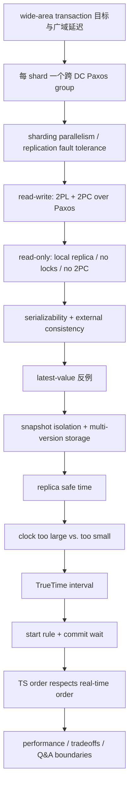

- 课程：MIT 6.824 Distributed Systems (Spring 2021)
- Lecture：14
- 视频分段：`Lecture 14 - Spanner`（Bilibili Part 14）
- transcript records：`1441`
- 笔记显示范围：`00:00:00-01:37:04`
- 分段数：`10`
- 官方文字讲义：`l-spanner.txt`，共 `1` 个 text material page
- 课堂空档：`00:47:21-00:53:43` 为 breakout/音频间隔，不制造讲解内容

## 学习目标

完成本讲后，应能：

1. 画出“database sharded across servers，每个 shard 由跨 data center Paxos group replication”的高层组织，并区分 sharding、replication、majority progress 与 replica locality。
2. 按老师顺序复述 read-write transaction 的 2PL + 2PC over Paxos 路径，解释普通 leader-local lock table、prepared state 和 replicated TC decision 的不同 durability 边界。
3. 解释 read-only transaction 为什么能绕过 locks、2PC 和 wide-area communication，以及这样做留下的 stale replica 与 consistent multi-record read 问题。
4. 用 `T1/T2/T3` 反例证明“每次读取 latest committed value”不能保证整个 transaction serializable。
5. 运用 timestamped multi-version storage 计算 `T3@15` 对 `T1@10`、`T2@20` 的 snapshot reads。
6. 解释 replica safe time 为什么既要越过 read timestamp，又要等待较早的 prepared-but-uncommitted transactions 决议。
7. 区分 serializability 与 external consistency，并用 real-time precedence 写出后者的课堂条件。
8. 说明 clock timestamp 偏大为何主要增加等待、偏小为何会让后开始 read-only transaction 漏掉已完成 writes。
9. 写出 `TT.now()=[earliest,latest]`、start rule 与 commit-wait condition，并证明 `finish(T1)<start(T2)` 推出 `TS1<TS2`。
10. 评价 Spanner 的性能与设计 tradeoff：read-write 的 WAN/locking/2PC/Paxos/commit-wait 成本，read-only 的 versions/safe-time/clock infrastructure 成本，以及 cross-shard ACID abstraction 的收益。

## 先修知识

- Paxos/Raft replicated state machine、leader、majority 和 leader lease 的基本直觉；
- Lab 3 中 replicated key/value service 的读写路径，以及 sharding 与 replication 的区别；
- Lecture 13 的 two-phase locking、two-phase commit、prepared state、coordinator failure 与 write-ahead logging；
- transaction、ACID、serializability、linearizability 和 real-time order 的基本含义；
- wall-clock time、network delay、oscillator drift 与 timestamp 的基础直觉；
- 不要求预先掌握 TrueTime implementation、Spanner schema-change protocol 或完整 paper 细节，本讲只深入选定主线。

## 材料与证据边界

- [课程 MATERIALS 索引](/courses/mit-6824-s21/materials/)
- [Lecture 14 reading evidence bundle](/assets/courses/mit-6824-s21/evidence/reading-inputs/lecture-14.md)
- [Spanner (2012) 指定论文](/assets/courses/mit-6824-s21/materials/official-materials/papers/spanner.pdf)
- [本讲官方文字讲义](/assets/courses/mit-6824-s21/lectures/014/materials/l-spanner.txt)
- 本地 transcript：`transcript.txt` / `transcript.jsonl` / `transcript.srt`
- preparation：`transcript+slides`，`10` sections，`1` material page

课堂 chronology 以 transcript 为准。Prompt 只把 `l-spanner.txt p.1` 对齐到第 1 段，第 2–10 段均标为 transcript-only，因此详细笔记不为这些段虚构讲义页码。讲义中的 F1 motivating use case 在第 1 段单列为材料补充；paper Section 4.2.3 的 schema-change 内容只在主讲结束后的第 10 段问答出现，教师明确说主讲没有覆盖，故标为 paper-only extension。Reading evidence bundle 是归档证据，不是假定已经完成的 reading guide。

## 教学主线



老师采用“先给强 abstraction，再拆 transaction 类型”的顺序。Read-write path 复用上一讲的 locks/2PC，并用 Paxos replication 提高 participants 与 TC 的可用性；read-only path 则先消除广域 coordination，再逐层补回 correctness：single snapshot、replica completeness、global timestamp order、real-time order。TrueTime 不是孤立的时钟技巧，而是最后一环：它把不可消除的 uncertainty 变成 start timestamp 的保守选择和 commit wait 的显式延迟。

## 核心概念与依赖关系

1. **Sharding -> parallelism**：不相交 shards 上的 transactions 可并行，提高 aggregate throughput。
2. **Replication -> fault tolerance/locality**：每个 shard 的 replicas 跨 data centers 组成 Paxos group；majority 可容忍慢/失效少数派，local replica 靠近 backend client。
3. **2PL -> read-write serial order**：leader lock table 阻止 conflicts 穿插；prepare 前普通 locks 不复制，leader failure 可导致 abort。
4. **2PC + Paxos -> cross-shard atomicity 与 durable decision**：prepared participant state 和 TC decision 经各自 Paxos groups 复制，降低单机 coordinator/participant failure 的 blocking 风险。
5. **No locks/no 2PC -> fast read-only**：read-only 不阻塞 read-write，也避免 WAN round trips；代价是不能再借 lock path 获取一致性。
6. **One transaction timestamp + multi-version storage -> consistent snapshot**：同一 read-only transaction 的所有 reads 选同一历史位置。
7. **Timestamp-ordered replication + safe time -> local replica completeness**：read 前确认 timestamp frontier 已越过目标，并解决较早 pending prepares。
8. **Snapshot timestamp order -> serializable read-only view**：transaction 看到所有 lower-TS writes、看不到 higher-TS writes。
9. **TrueTime bounds + start rule -> timestamp 不偏小**：取 `latest` 防止把 transaction 放到 actual past。
10. **Commit wait -> real-time handoff**：read-write 返回前等待 `TS < now.earliest`，使严格后开始 transaction 必取更大 timestamp，得到 external consistency。

## 关键推导、例子与结论边界

| 主题 | 课堂例子/规则 | 得到什么 | 边界或代价 |
| --- | --- | --- | --- |
| 广域组织 | `a-m`、`n-z` 各为一个跨 A/B/C data centers 的 Paxos group | sharding parallelism + replicated fault tolerance | majority 仍需 WAN communication；不是零延迟 |
| Read-write | `x=x-1, y=y+1` 跨 shards bank transfer | 2PL serial order + 2PC atomic decision | locks、WAN Paxos/2PC、leader failure abort、约百毫秒 latency |
| Latest-value bad plan | `T3` 的 `Rx` 在 `T2` 前、`Ry` 在 `T2` 后 | 证明 individual freshness 不等于 transaction snapshot | 必须选择一个统一 serial point |
| Snapshot read | `T1@10, T3@15, T2@20` | `T3` 对 `x,y` 都读 `@10` versions | multi-version storage/GC；replica 可能尚未完整 |
| Safe time | read `@15` 前观察 `write >15`，并 resolve prepares `<15` | local replica 可证明历史完整 | idle/lagging replica 可能等待 |
| Clock error | 后开始 `T3` 实际在 15 却取得 `TS=9` | 漏掉 `@10` write，违反 external consistency | 偏大通常正确但慢；偏小危险 |
| TrueTime | `TT.now()=[earliest,latest]` | 显式暴露 bounded uncertainty | interval 越宽，等待越长 |
| Start rule | `TS=TT.now().latest` | timestamp 不早于 actual time | 可能选到 future |
| Commit wait | 等待 `TS<TT.now().earliest` | commit 返回时 TS 已在 real past | read-write 增加 uncertainty latency |
| External consistency proof | `T2@10` commit wait 后，严格后开始 `T3` 取如 12 | `finish(T2)<start(T3) => TS2<TS3` | concurrent transactions 可任选合法 order |
| Schema change | future timestamp + 未完成时 block | paper-only atomic future transition 直觉 | 主讲未覆盖；future margin/protocol 未确认 |

性能数字均保留老师的证据边界：课堂据 Tables 3/6 说 read-only 约 `5-10 ms`、约快 `10x`，cross-USA/read-write 约 `100 ms` 或 hundreds of milliseconds。它们是讲课中的量级与配置相关结果，不是所有 Spanner 部署的常数。`100 ms -> 10/s` 只描述单串行 dependency chain 的直觉；many clients 与 many shards 可提供更高 aggregate throughput。

## 易错点与待复核项

- **“Sharding 就是 replication”**：sharding 分割数据以并行；replication 复制同一 shard 以容错/locality。[需回听 00:07:44]
- **“所有 locks 都经 Paxos 复制”**：普通 leader-local lock table 不复制；prepare 后恢复 2PC 所需 state 才复制。[需回听 00:17:33] [需回听 00:24:04]
- **“Replicated TC 消灭了 2PC 一切 blocking”**：它提高 availability、缓解单 coordinator crash，不移除 locks、WAN delay 或所有 partition 情况。[需回听 00:19:04]
- **“Read latest committed 就一定最一致”**：一次 transaction 的多次 reads 可来自不同 commits，破坏 serializability。[需回听 00:30:34]
- **“读旧版本必然 stale/错误”**：若 transaction timestamp 在 concurrent write 前，旧版本正是合法 snapshot。[需回听 00:35:53]
- **“Snapshot isolation 单独完成 external consistency”**：snapshot 给统一 timestamp view；safe time 证明 replica 完整，TrueTime rules 才把 timestamp order 与 real time 绑定。[需回听 00:37:11] [需回听 01:20:15]
- **“看到新版本就可以忽略 read timestamp”**：`T3@9` 即使所在 replica 已有 `x@10`，仍会按 snapshot rule 读更旧版本，从而暴露错误 timestamp。[需回听 00:59:04]
- **“TrueTime 返回完美同步的一个时间”**：它返回 guaranteed interval；正确性依赖 bounds，性能依赖 interval 足够小。[需回听 01:05:08]
- **“Commit wait 等待 data replication”**：它等待 chosen TS 进入 real past；replica completeness 由 Paxos/safe time 处理。[需回听 01:28:45]
- **“Read-write 中的 reads 也走 nearest-replica lock-free path”**：它们去 participant/Paxos leader 获取 locks，read 本身不写入 Paxos log。[需回听 01:23:33]
- **“Overlapping transactions 必须按 wall-clock 微小先后排序”**：若没有 finish-before-start edge，external consistency 允许任一 consistent total order。[需回听 01:27:17]
- **“Schema-change 是本讲主线的一部分”**：教师明确没有讲 Section 4.2.3；第 10 段只是 paper-only 课后问答。[需回听 01:33:55]
- **字幕/板书编号**：多个例子中 `T1/T2/T3` 有口头纠正；应以不变的 real-time relation 和 timestamps 为准。[需回听 00:55:01] [需回听 01:13:56]
- **Commit-wait 板书纠正**：正确条件采用老师修正后的 `TS < now.earliest`。[需回听 01:09:50] [需回听 01:10:11]

## 掌握标准

不看笔记时能完成以下任务，才算掌握本讲：

1. 在图上同时标出 shards、Paxos groups、data centers、leaders、local replicas 与 backend clients，并逐项解释其目的。
2. 从 client `Rx/Ry` 开始，完整画出 participant prepare、Paxos replication、TC decision、decision propagation 与 unlock。
3. 说明 prepare 前 leader crash 与 prepare 后 peer failure 为什么有不同结果。
4. 用三笔 transaction 构造 latest-committed bad plan，并证明没有合法 serial order。
5. 给定 timestamped versions，手算任意 read-only snapshot 应返回哪些 values。
6. 解释 safe time 的两个等待条件，特别是 prepared-but-uncommitted transaction 为什么不能忽略。
7. 精确说出 external consistency 的 finish-before-start condition，并区分 concurrent case。
8. 从 `T3` 的 timestamp 过大/过小分别推出 performance/correctness 后果。
9. 写出 TrueTime containment guarantee、start rule 与 commit-wait inequality，不混淆 `earliest` 和 `latest`。
10. 用不等式证明 commit wait 后严格后开始 transaction 的 timestamp 更大，并说明这如何变成“看到全部 prior writes”。
11. 比较 read-write 与 read-only latency path，指出每项 optimization 对应的 correctness replacement 和 remaining wait。
12. 把 schema-change future timestamp 作为 paper-only extension 复述，并明确哪些 margin/protocol details 仍需查 paper。

## 建议复习顺序

1. 先读第 1–3 段，画出 deployment 与完整 read-write 2PL/2PC-over-Paxos sequence。
2. 精读第 3–5 段，连续推导 read-only fast path -> correctness goal -> latest-value failure -> snapshot -> safe time。
3. 手算第 4 段 `T1@10/T3@15/T2@20`，再用第 6 段 `T3@9` 解释为什么 timestamp 必须尊重 real time。
4. 只背三行核心规则：`earliest <= true_time <= latest`、`TS=latest`、commit 前等 `TS<earliest`。
5. 重画第 7–8 段 `T2@10 -> commit wait -> T3@12`，口头完成 external-consistency proof。
6. 用第 9 段问答检查边界：leader read 是否 Paxos replicated、strictly-after 与 concurrent 如何区分、commit wait 与 safe time 各证明什么。
7. 最后读第 10 段，并在标题旁写“paper-only / main lecture did not cover”，防止复习时混入主讲证据。

## 逐段详细课堂笔记

<div id="section-01" class="course-note-section-anchor" aria-hidden="true">&nbsp;</div>

# 第 1 段：Spanner 的目标、广域组织与设计动机

- 时间：`00:00:00-00:09:57`
- 证据：Lecture 14 transcript；官方文字讲义 `[讲义：l-spanner.txt p.1]`

## 本段在整讲中的作用

本段先回答“为什么在 6.824 学 Spanner”，再搭出后续所有机制依赖的系统图景。老师把问题定为：数据跨 shard、跨 data center 放置时，仍向程序员提供具有 ACID semantics、atomicity 与 serializability 的 wide-area transactions；困难则来自跨地域通信的物理延迟（`00:00:23-00:01:25`）。随后他预告两条不同路径：read-write transaction 走 two-phase locking（2PL）与 two-phase commit（2PC），参与者是 Paxos groups；read-only transaction 则借 snapshot isolation 与 synchronized clocks 获得低延迟（`00:01:29-00:03:05`）。

本段后半画出“每个 shard 一个跨 data center 的 Paxos group”的组织结构，依次解释 replication、sharding、majority 和 local replica 各自解决什么问题（`00:05:37-00:09:57`）。这为下一段的三个挑战以及完整 read-write transaction 协议提供实体和术语。

## 教学展开

1. **从真实系统与核心能力开场。** Spanner 论文发表于 2012 年，但系统仍在使用和持续开发；它最有吸引力的能力，是对分散在多台 server、多个 data center 乃至全球不同地点的数据直接运行 transaction，并获得 all-or-nothing writes 与 serializability（`00:00:06-00:01:05`）。
2. **先指出成本来自物理距离。** 跨美国或跨洲 packet 往返需要数十毫秒，因此难点不是能否表达 transaction，而是能否高效实现。老师据此区分：read-write transaction 确实昂贵，而系统重点优化常见的 read-only transaction（`00:01:10-00:01:43`）。
3. **预告两类协议。** read-write 使用上讲的 2PC 与 2PL，并把 participant 做成 Paxos group；read-only 可以在任一 data center 执行，论文 Table 6 显示其延迟约比 read-write 低一个数量级。read-only 的两个关键词是 snapshot isolation 和 synchronized clocks，后者必须显式处理 drift/error margin，也就是后面 TrueTime 的问题（`00:01:44-00:03:05`；`[讲义：l-spanner.txt p.1]`）。
4. **说明系统的现实用途。** 老师说 Spanner 既在 Google 内部广泛使用，也作为 cloud service 提供；Gmail 的部分系统可能经由 Spanner（`00:03:10-00:03:31`）。
5. **插入课程安排并限定本讲范围。** 老师说明 long weekend 对 Lecture/Lab 4A 安排的调整（`00:03:33-00:04:23`），然后强调 Spanner 论文组件多、交互复杂，本讲不会完整覆盖论文，而会聚焦在 6.824 语境中最重要、最容易形成机制主线的部分（`00:04:29-00:05:32`）。
6. **画出三个 data center 的简化组织。** 假设 A、B、C 三个 data centers；一个包含某段 rows/keys（如 `a-m`）的 shard 在三地各有 replica，这些 replicas 组成一个 Paxos group。把它类比为 Lab 3 的 replicated key/value store，只是三个 peers 不在同一台机器附近，而在不同 data centers（`00:05:37-00:07:42`）。
7. **加入第二个 shard，解释 sharding 与 replication 的分工。** `a-m` 和 `n-z` 分属两个 shard，每个 shard 有自己的 Paxos group。多个 shards 让访问不相交 shards 的 transactions 可以并行，提高总 throughput；每个 shard 内的 Paxos replication 则用于复制状态与容错（`00:07:44-00:08:54`）。
8. **解释 majority 与 locality。** Paxos/Raft 只需 majority 即可推进，所以一个慢或失效的远端 replica 不一定拖住系统，并允许一个 data center 整体失效；同时，靠近某服务 backend 的 replica 可以为该服务提供本地访问。老师在本段结尾把目标停在“Spanner client 使用 nearby replica”，下一段继续说明 local read（`00:08:54-00:09:57`）。

## 概念、符号与推导

### 课堂组织模型

```text
shard S = 某段 rows / key range
Paxos group(S) = {S 在 data center A、B、C 的 replicas}
database = shard S1 + shard S2 + ...
```

- **Replication**：同一 shard 的副本跨 data centers 组成一个 Paxos group，主要提供 fault tolerance 与 geographic locality（`00:06:15-00:07:04`）。
- **Sharding**：不同 key ranges 属于不同 shards；不相交 shards 上的工作可以并行，主要提高 aggregate throughput（`00:07:44-00:08:43`）。
- **Majority progress**：Paxos 不必等待所有 replicas，慢节点或一个失效 data center 可被少数派容错（`00:08:54-00:09:36`）。本段没有推导 quorum intersection，只使用先前课程已建立的 Paxos/Raft 直觉。
- **Client**：这里的 Spanner client 是调用数据库的 backend server，而不是最终用户浏览器；这个定义在下一段被老师进一步澄清。

本段无数学公式推导。性能只给出数量级：广域通信为 tens of milliseconds；Table 6 中 read-only transaction 约为 read-write transaction 的 `10x` 快（`00:01:17-00:02:28`）。

## 例子与课堂提示

- **跨 shard 的全球 transaction（`00:00:43-00:01:05`）**：服务于 programming abstraction。程序员得到 ACID/serializable transaction，而不必手工协调数据所在 server 和 data center。
- **美国东西岸或跨洲 packet（`00:01:17-00:01:25`）**：服务于性能下界。speed of light 让广域 round trips 无法像机房内通信一样便宜，因此后续要消除 read-only path 上的跨地域消息。
- **Lab 3 类比（`00:07:04-00:07:40`）**：服务于 Paxos group 的理解。课堂允许把 Paxos 当成已有 Raft-replicated KV group 来思考，但这不是说 Paxos 与 Raft 的所有协议细节相同。
- **`a-m` / `n-z`（`00:07:44-00:08:43`）**：服务于区分 sharding 和 replication。两个 key ranges 是两个独立 Paxos groups；前者带来 parallelism，后者让每个 range 跨站点容错。
- **易错点：不能把“majority 可推进”理解为广域延迟消失。** 它只允许不等待最慢少数派；形成多数派仍要通信（`00:08:54-00:09:36`）。
- **易错点：本讲并非完整 Spanner paper 导读。** 老师明确只聚焦若干关键机制（`00:04:29-00:05:32`）。

**材料补充，非本段课堂口述：** 官方讲义写明 motivating use case 是 Google F1 advertising database，原来分散在 MySQL/BigTable shards，需要更好的 synchronous replication、更灵活的 sharding 与 cross-shard transactions；它还说 workload 由 read-only transactions 主导 `[讲义：l-spanner.txt p.1]`。这些事实支持“为何优化 read-only”，但 transcript 在本段没有讲 F1，故不并入老师的课堂时间线。指定 paper 与其他 reading 资源见 [课程 MATERIALS 的 Lecture 14 条目](/courses/mit-6824-s21/materials/) 和 [Lecture 14 reading evidence bundle](/assets/courses/mit-6824-s21/evidence/reading-inputs/lecture-14.md)。

## 本段掌握检查

1. **问：老师认为 Spanner 最重要的 programming abstraction 是什么？**  
   **答：** 对跨 server、跨 shard、跨 data center 的数据提供 ACID、atomic、serializable wide-area transactions（`00:00:23-00:01:05`）。
2. **问：read-write 与 read-only transaction 的课堂主路径分别是什么？**  
   **答：** read-write 使用 2PL + 2PC，participant 是 Paxos group；read-only 使用 snapshot isolation 和 synchronized clocks，目标是在本地快速读取（`00:01:29-00:03:05`）。
3. **问：为什么同时需要 sharding 和 replication？**  
   **答：** sharding 让不相交数据上的工作并行、提高 throughput；每个 shard 的跨站点 replication 提供 fault tolerance/locality（`00:06:15-00:08:54`）。
4. **问：Paxos majority 在这个广域布局中带来哪两项课堂收益？**  
   **答：** 可容忍一个 data center 失效，也可避免最慢远端少数派成为每次操作的必等对象（`00:09:00-00:09:36`）。
5. **问：讲义中的 F1 能否当作本段老师已讲的例子？**  
   **答：** 不能。F1 出现在讲义而不在本段 transcript，应标为材料补充 `[讲义：l-spanner.txt p.1]`。

## 待核对项

- [需回听 00:00:27] 字幕把核心能力标为 `[wide-area] transactions`；讲义明确写 “wide-area distributed transactions”，笔记据两者保留 wide-area，但不据此扩写更多能力。
- [需回听 00:02:54] 字幕在 clocks 后缺词；上下文明确是 clock drift/error margin，后续段落再正式定义 TrueTime interval。
- [需回听 00:07:18] 字幕写成 “Raft writes”；老师在 Spanner 组织图上用 Lab 3/Raft 作概念类比，系统本身此处讲的是 Paxos group。
- [需回听 00:09:36] 末句字幕为 `[through] slowness`；可确定含义是 majority 让慢 replica 不一定阻塞进展，但不补写更强保证。

<div id="section-02" class="course-note-section-anchor" aria-hidden="true">&nbsp;</div>

# 第 2 段：三个挑战与 read-write transaction 的前半程

- 时间：`00:09:57-00:19:49`
- 证据：Lecture 14 transcript；本片段为 transcript-only，不引用讲义页码

## 本段在整讲中的作用

本段承接上一段的跨 data center 布局，先澄清 local replica 服务的“client”是 Google service 的 backend server，再把本讲问题压缩成三个挑战：local read 仍要新鲜、transaction 要跨 shards、所有 transaction 要 serializable 且满足更强的 real-time consistency（`00:09:57-00:12:45`）。随后老师按预告顺序先展开 read-write transaction：client library 协调一次跨 shard bank transfer，向 shard leader 读取并加锁，把 write 暂存在 client，最后选择一个 replicated transaction coordinator（TC）开始 2PC（`00:12:53-00:19:49`）。

## 教学展开

1. **先把“local”落实到部署位置。** Replica 通常靠近使用它的 backend client；read-only transaction 将能由 local replica 执行，不与其他 data centers 通信。这里的 client 不是最终 Gmail 用户，而是同一或邻近 data center 中调用 Spanner 的 Gmail backend server（`00:09:57-00:10:44`）。
2. **列出挑战一：local replica 不能返回 stale result。** 老师希望 read-only transaction 不联系其他 server，却仍看到应看到的 latest write。与课堂此前谈过的 ZooKeeper 弱化某些 consistency guarantees 不同，Spanner 追求 linearizability 一类、甚至更强的 transaction-level property（`00:11:01-00:12:05`）。
3. **列出挑战二：支持 cross-shard transaction。** Bank transfer 的 source account 与 destination account 可能属于不同 shards，但系统仍应提供 ACID semantics（`00:12:11-00:12:35`）。
4. **列出挑战三：read-only/read-write 都必须 serializable。** 老师补充目标比 ordinary serializability 更强，稍后会命名为 external consistency（`00:12:37-00:12:45`）。
5. **确定讲解顺序。** read-write 使用上讲的 2PL + 2PC；老师先讲它，再重点讲如何高效执行 read-only。为看清 read-write 主体，他暂时省略 timestamp，因为 ordering 主要由 locks 完成；timestamp 后来是为 read-only interaction 加入的调整（`00:12:53-00:15:22`）。
6. **建立 client、Shard A、Shard B 的简化图。** Client 上运行 transaction library/manager，负责 orchestrate transaction。例子从 `x` 所在 Shard A 扣 1，向 `y` 所在 Shard B 加 1，是一次 cross-shard transfer（`00:13:49-00:15:55`）。
7. **读取阶段先到 shard leader 并拿 locks。** Client 读取 `x`、`y` 时，相应 shard leader 的 lock table 以 TID 记录相关 records 的 ownership。图上一个 shard 实际代表由多个 peers 构成的 Paxos group；后续的 writes 会进入 Paxos log（`00:16:01-00:17:27`）。
8. **区分 volatile lock table 与 replicated state。** 普通 read locks/lock table 只存在 Paxos leader，不经 Paxos replication；leader 在 transaction prepare 前失败会丢失 locks，transaction 必须 abort/restart。这样设计是为了让 transactional read 更快（`00:17:33-00:18:04`）。
9. **Client 私存 writes，提交时引入 TC。** 拿到 values 与 locks 后，client 本地计算 `x-1`、`y+1`，直到 commit 才把 transaction 交给选出的 TC。TC 本身也是跨 data centers 的 Paxos group；replicating coordinator 的目的，是避免普通 2PC 中 coordinator failure 让 prepared participants 长时间持锁等待（`00:18:06-00:19:49`）。

## 概念、符号与推导

### 三个课堂挑战

```text
local replica read + strong freshness
cross-shard ACID transaction
serializability + stronger real-time requirement
```

### Read-write transaction 的前半程

```text
TID := unique transaction identity
Rx@ShardA -> leader lock table[x] := TID
Ry@ShardB -> leader lock table[y] := TID
client computes x' = x - 1, y' = y + 1
client -> replicated TC: commit(TID, writes)
```

- **2PL** 在本段先表现为读取 records 时获得 locks，直到 transaction 决策后才会释放；完整 release 时机在下一段说明。
- **2PC** 在本段只建立 coordinator 与 participants；prepare/decision 两阶段在下一段展开。
- **Paxos group per shard**：图中 Shard A/B 都不是单机，而是 replicated group；read-write transactional read 发给其 leader（`00:16:33-00:17:27`）。
- **TC replication**：把 coordinator state 放进 Paxos group，降低单 coordinator crash 导致 2PC blocking 的风险（`00:19:04-00:19:37`）。这不是说 2PC 不再有任何 blocking 或 availability cost。

本段没有新的数学公式；`x' = x - 1`、`y' = y + 1` 是课堂 bank-transfer state update（`00:15:27-00:15:55`）。

## 例子与课堂提示

- **Gmail backend vs. end user（`00:10:22-00:10:44`）**：用于纠正“client 就是浏览器/手机用户”的误解。Spanner 的直接 client 是服务端 application process。
- **跨 shard bank transfer（`00:12:21-00:12:35`；`00:14:28-00:15:55`）**：用于同时展示 atomicity、cross-shard coordination 和 lock coverage；若 `x`、`y` 更新不能共同 commit，账户总额会不一致。
- **先省略 timestamps（`00:14:49-00:15:22`）**：是老师的教学简化，不表示 read-write 最终完全没有 commit timestamp。后续 TrueTime 规则会在 commit start 为其选 timestamp。
- **Leader-local lock table（`00:17:33-00:18:04`）**：用 availability 换 fast reads。prepare 前 leader crash 会让 transaction abort，而不是从另一个 replica 无损继续。
- **Replicated TC（`00:19:04-00:19:37`）**：针对上一讲的 2PC coordinator failure。Paxos 提高 TC 可用性，使 prepared participants 更可能获得最终 decision。
- **易错点：transactional read 并不是本讲后面所说的 lock-free read-only transaction。** 这里的 read 属于 read-write transaction，必须经 shard leader 获取 lock。

## 本段掌握检查

1. **问：本讲列出的三个核心挑战是什么？**  
   **答：** local replica read 仍要正确/新鲜、transaction 可跨 shards、read-only/read-write 都要 serializable 并满足更强 real-time property（`00:11:01-00:12:45`）。
2. **问：Spanner 图中的 client 指谁？**  
   **答：** 调用 Spanner 的 backend server，例如 data center 中的 Gmail server，不是最终用户（`00:10:22-00:10:44`）。
3. **问：为什么普通 lock table 不复制？代价是什么？**  
   **答：** 为避免每次 transactional read 都走 Paxos、降低延迟；代价是 prepare 前 leader failure 丢 lock，transaction abort/restart（`00:17:33-00:18:04`）。
4. **问：client 在 commit 前如何处理 writes？**  
   **答：** 先读取并锁住 records，在本地计算/保存 updates，commit 时才交给 Spanner/TC（`00:18:06-00:18:42`）。
5. **问：为什么 TC 是 Paxos group？**  
   **答：** 提高 coordinator availability，减少 coordinator crash 后 prepared participants 持锁阻塞等待的情形（`00:19:04-00:19:37`）。

## 待核对项

- [需回听 00:12:02] 老师说 Spanner 追求比 linearizability “stronger”的 property；后文把 external consistency 解释为 transaction-level real-time order、并说与 linearizability 很相似。不要把此处单句扩成未经课堂定义的新 consistency hierarchy。
- [需回听 00:15:36] 字幕先后出现 “adding 1 to x” 与 “subtracting 1 dollar from x”；后续明确是从 `x` 扣 1、向 `y` 加 1，笔记采用完整例子的方向。
- [需回听 00:16:59] 字幕写 “when executing read-only transaction” 后又说请求到 Paxos leader；上下文是 read-write transaction 的 read phase，且 `01:23:33-01:24:06` 问答再次确认这类 read 到 leader。笔记据上下文标为 transactional read。
- [需回听 00:18:34] 字幕缺词；可以确认 client 私存 writes 并在完成后提交，不能据缺词补写具体 client buffer 实现。

<div id="section-03" class="course-note-section-anchor" aria-hidden="true">&nbsp;</div>

# 第 3 段：2PC over Paxos 完成与 read-only correctness 目标

- 时间：`00:19:50-00:29:47`
- 证据：Lecture 14 transcript；本片段为 transcript-only，不引用讲义页码

## 本段在整讲中的作用

本段完成 read-write transaction 的 commit path：participants 把 prepared state 经 Paxos durable replication，TC 经自己的 Paxos group 记录 commit/abort decision，participants 再记录 decision 并释放 locks（`00:19:50-00:23:10`）。老师随后用问答精确划开“不复制整个 lock table”与“prepare 后复制 2PC 所需 lock/state”的边界（`00:24:04-00:24:46`）。

后半段转入全讲重点 read-only transaction：通过 local replica、no locks、no 2PC 消除广域 round trips，但仍要求 serializability 和 external consistency（`00:24:50-00:29:47`）。因此本段把“快在哪里”与“必须保持什么 correctness”同时立住，为下一段的错误方案和 snapshot isolation 做准备。

## 教学展开

1. **Participants 进入 prepared state。** TC 把 `x`、`y` updates 发给相关 shard leaders；leaders 已持有或升级 locks，并用 write-ahead logging 准备 changes，而不是立即对外完成 transaction（`00:19:50-00:20:35`）。
2. **把 prepare 变成 fault-tolerant state。** Participant 一旦答应 prepared，就必须在 failure/recovery 后记得承诺、locks 和 updates，因此 shard leader 发起 Paxos write，把 transaction/2PC state 复制到 group peers，成功后才向 TC 回答 prepared（`00:20:35-00:21:43`）。
3. **TC 形成实际 commit point。** 收到参与者肯定答复后，TC 决定 commit；因为 failure 后 participant 可能回来询问结果，TC 必须先把 decision 写进自己的 Paxos group。老师明确：TC durable 记录 committed 的时刻是 actual commit point（`00:21:49-00:22:48`）。
4. **传播 decision、清理并解锁。** TC 通知 participants/client；participants 记录 TC decision，随后释放 locks，TC 和 shards 之后可清理 transaction state（`00:22:50-00:23:10`）。
5. **总结与上一讲的差别。** 核心仍是 2PL + 2PC，但 participant 和 TC 都是 replicated Paxos groups，所以比单机 participants/coordinator 更 highly available。老师允许在这讲的概念层面把 Paxos 类比成 Raft，因为 Spanner 早于 Raft（`00:22:19-00:23:59`）。
6. **通过问答精确限定 replicated locks。** 普通、尚未 prepare 的 lock table state 不复制；prepare 时，完成 2PC 所需的 held locks/state 才经 Paxos 复制。若 leader 在 prepare 前丢失 locks，participant 告诉 TC 无法继续，transaction abort（`00:24:04-00:24:46`）。
7. **转向常见的 read-only transaction。** 为追求低延迟，它从 local shards/replicas 读取，不持 locks，不运行 2PC，也不需要 transaction manager；所以不会阻塞 read-write transaction，且不用跨 data center 联系 Paxos leader（`00:24:50-00:26:36`）。
8. **给出性能量级。** 老师据 paper Tables 3/6 说 read-only 约比 read-write 快 `10x`：read-write 约 hundreds of milliseconds，read-only 约 `5-10 ms`。解释是前者含 long-distance communication，后者的通信留在 local data center（`00:26:38-00:27:04`）。
9. **定义 correctness 第一层：serializability。** Read-only transaction 必须在某个 serial order 中“夹在”read-write transactions 之间；对一个多写 transaction，只能看到全部 writes 或一个都不看到，不能看到 partial effects（`00:27:13-00:28:07`）。
10. **定义第二层：external consistency。** 若 `T2` 在 real time 上于 `T1` committed 之后开始，则 `T2` 必须看到 `T1` 的 writes。老师把它描述为 serializability 加 real-time requirement，和 linearizability 很相似；区别在本讲语境中是 external consistency 针对整个 transaction，而此前 linearizability 常按 individual reads/writes 讲（`00:28:08-00:29:47`）。

## 概念、符号与推导

### 2PC over Paxos 的课堂状态链

```text
participant leaders:
  acquire/promote locks
  -> Paxos-log PREPARED(TID, locks, updates)
  -> vote YES

TC Paxos group:
  collect votes
  -> Paxos-log DECISION(TID, COMMIT|ABORT)  # actual decision/commit point
  -> notify participants/client

participants:
  Paxos-log decision
  -> release locks
```

- **2PL 提供 serializability**：对 read/write records 的 locks 阻止冲突操作穿插。
- **2PC 提供 cross-shard atomic decision**：所有 participants 按同一 commit/abort decision 收尾。
- **Paxos replication 提高 2PC state availability**：prepared participant state 和 coordinator decision 可在成员 failure 后恢复。
- **External consistency 的课堂条件**：

```text
if real_finish(T1) < real_start(T2), then T2 observes all writes(T1)
```

它在 serializability 上增加 real-time order constraint（`00:28:25-00:29:16`）。本段尚未推导如何实现，后续由 timestamp ordering、TrueTime 和 commit wait 完成。

## 例子与课堂提示

- **Prepared 是“big moment”（`00:20:35-00:21:18`）**：participant 已承诺 transaction，故不能只把状态留在易失 memory；否则 recovery 后可能忘掉 held lock/update，破坏 atomicity。
- **Paxos 与 Raft 类比（`00:22:19-00:22:34`）**：用于把新论文映射到已学 replicated state machine。它是本讲抽象层面的替换，不是协议逐字段等价。
- **Lock replication 问答（`00:24:04-00:24:46`）**：纠正常见误解。不是每次 read lock 都复制；只有进入 prepared state 后，2PC recovery 所需 state 才复制。
- **Read-only performance（`00:25:19-00:27:04`）**：三个被消掉的成本是远端 replica/Paxos communication、locks、2PC。代价是 correctness 不能再依靠 lock path，必须另建 snapshot/time machinery。
- **Read-only “夹在”两笔 read-write transactions 间（`00:27:27-00:28:03`）**：用于理解 serializability。一个 snapshot 必须对应单一 serial point，不能从不同 commits 拼接 records。
- **External consistency（`00:28:25-00:29:47`）**：为 programmer 提供贴近 real-time intuition 的强保证；只有 genuinely concurrent transactions 才有重排自由。

## 本段掌握检查

1. **问：participant 在什么时候、为什么复制 lock-related state？**  
   **答：** 进入 prepared 时复制 2PC recovery 所需 locks/updates/state，因为它已作出承诺，failure 后必须恢复；普通 prepare 前 lock table 不复制（`00:20:35-00:21:33`；`00:24:04-00:24:46`）。
2. **问：课堂所指 actual commit point 在哪里？**  
   **答：** TC 把 commit decision durable 地写入其 Paxos group 时（`00:21:49-00:22:48`）。
3. **问：read-only transaction 为什么可以快一个数量级？**  
   **答：** 从 local replica 读、无 locks、无 2PC/transaction manager，避免 wide-area messages；课堂给出约 `5-10 ms` 对比 read-write 的约百毫秒（`00:24:50-00:27:04`）。
4. **问：serializability 对一次读取多个 records 的 read-only transaction 要求什么？**  
   **答：** 它必须对应某个 serial point，对同一 read-write transaction 的 writes 要么全见、要么全不见（`00:27:27-00:28:03`）。
5. **问：external consistency 比 ordinary serializability 多什么约束？**  
   **答：** 尊重 real-time precedence：若 `T1` commit 完成后 `T2` 才开始，`T2` 必须看到 `T1` 的全部 writes（`00:28:25-00:29:16`）。

## 待核对项

- [需回听 00:19:50] 字幕说把 `x and y` updates 同时发给 Shard A、又发给 Shard B；按前段例子应是各 record 发给相关 shard。笔记保留“发送给相关 shard leaders”，不猜测老师板书箭头。
- [需回听 00:21:23] 字幕为 `[push] Paxos write`；可确认 shard leader 发起 Paxos write 复制 prepared state，动词不影响机制。
- [需回听 00:23:10] “at the point of commit and the participants release their locks” 的精确先后在口述中压缩；笔记只写 decision 传播后收尾并释放，不声称每个 participant 与 TC commit point 同时解锁。
- [需回听 00:25:44] 字幕先说 “read-write transactions can block the read-write transactions”，老师立即改述为 read-only 不会 block read-write；笔记采用其自我纠正后的表述。
- [需回听 00:28:03] 句尾缺失；前文足以确认 read-only 对每笔 read-write 的 writes 必须 all-or-none。

<div id="section-04" class="course-note-section-anchor" aria-hidden="true">&nbsp;</div>

# 第 4 段：latest-value 反例与 snapshot isolation

- 时间：`00:29:47-00:39:47`
- 证据：Lecture 14 transcript；本片段为 transcript-only，不引用讲义页码

## 本段在整讲中的作用

本段从 external consistency 的 correctness goal 转向实现。老师先故意提出“每次都读 latest committed value”的 bad plan，再用两个 transfer writes 与一个跨时段 read-only transaction 证明它会拼出不属于任何 serial order 的结果（`00:30:19-00:32:30`）。随后引入 snapshot isolation：为 transaction 分配 timestamp、保留每个 record 的多版本，并让 read-only 的所有 reads 在同一 timestamp 选版本（`00:32:39-00:37:49`）。

这个机制先解决“一次 transaction 内多次读要属于同一 snapshot”，但段末学生马上指出 local replica 可能尚未收到较早 write。老师据此引出 safe time，并先给出 Paxos writes 按 timestamp order 传播这一前提（`00:37:57-00:39:47`）。

## 教学展开

1. **再次确认 external consistency 是强而好用的目标。** 老师说可先把它与 linearizability 按相同直觉理解，因为二者都让 programmer 按 real-time reasoning（`00:29:47-00:30:09`）。
2. **提出看似合理的 bad plan。** 若后开始的 transaction 必须看到先 commit 的 writes，那么每次 read 都取 latest committed value 似乎能避免 stale data（`00:30:19-00:30:55`）。
3. **用时间交错击穿 bad plan。** `T1` 写 `x,y` 并 commit；read-only `T3` 先读 `x`；之后 `T2` 写 `x,y` 并 commit；延迟的 `T3` 再读 `y`。latest-value rule 会让 `Rx` 取自 `T1`、`Ry` 取自 `T2`，所以 `T3` 看到不同 transactions 的部分状态，不能放入一致 serial order（`00:30:58-00:32:30`）。
4. **引入 snapshot isolation（SI）。** 老师先把它作为 standard local-database idea 讲清，再处理 wide-area complication。每个 transaction 得到 timestamp：read-write 在 commit 开始时取，read-only 在 transaction start 时取；系统按 timestamp order 解释 execution（`00:32:39-00:34:09`）。
5. **引入 multi-version storage。** Replica 不只存 key 的当前 value，而为每次 update 保留带 timestamp 的版本，因而可以询问 `x` 在 time 10 或 time 20 的 value，也就是“回到过去”读取（`00:34:09-00:34:55`）。
6. **重算三笔 transaction。** `T1@10` 写 `x,y`，`T2@20` 写 `x,y`，read-only `T3@15` 先后读 `x,y`。两次 read 都以 15 为 timestamp，均选 timestamp 15 之前的最新版本，即 `T1@10` 的 versions；即使实际 `Ry` 发生在 `T2` commit 后，也不能看到 `T2@20`（`00:34:58-00:37:11`）。
7. **得到 timestamp serial order。** 所有 operations 在逻辑上按 global timestamp order 排序。Replica 可以保存如 `x=9@10`、`x=8@20`；收到 read at 15 时选不晚于该 snapshot 的最新 version（`00:37:11-00:37:49`）。
8. **学生指出 local replica lag。** 若 `x` 有三个 Paxos replicas，read-only 为快而访问任一本地 follower，它可能还没收到 `@10` write。老师认可这是下一问题，并把解决方案命名为 safe time（`00:37:57-00:39:10`）。
9. **给出 safe time 的排序前提。** Paxos/Raft sends/applies writes in timestamp order；与 Lab 3 中抽象 counter/log index 类似，这里 global timestamp 本身承担 write order（`00:39:13-00:39:47`）。下一段说明何时 replica 可宣布某 timestamp 已安全。

## 概念、符号与推导

### Bad plan 的反例

```text
real time ->
T1: Wx Wy C
T3:          Rx ---------------- Ry
T2:                 Wx Wy C

latest committed per read:
  Rx <- T1
  Ry <- T2
```

不存在一个 serial order 同时解释 `T3` 对 `x` 看到 T1、对 `y` 看到 T2 的混合 snapshot。

### Snapshot read rule

令 read-only transaction 的 timestamp 为 `ts(T3)`，record `k` 的 versions 为 `(value_i, ts_i)`。课堂规则可写为：

```text
read(k, ts) = value of the committed version with greatest ts_i < ts
```

老师口述为“latest write preceding its timestamp”（`00:36:13-00:37:49`）。边界是否严格 `<` 或允许 `<=` 本段未专门讨论；例子 timestamps 均不相等，笔记不额外裁决 equal-timestamp tie。

### 三笔 transaction

```text
T1 @ 10: Wx Wy C      -> x=9@10, y=11@10
T3 @ 15:      Rx ... Ry
T2 @ 20:          Wx Wy C -> x=8@20, y=12@20

T3 reads x@10 and y@10
logical order: T1 -> T3 -> T2
```

所有 read 使用同一 `ts(T3)=15`，因此 actual wall-clock interleaving 不改变 snapshot。

## 例子与课堂提示

- **“Read latest committed” 反例（`00:30:34-00:32:30`）**：用于区分 freshness of each individual read 与 consistency of the whole transaction。每次单读都“最新”仍可能组成不一致整体。
- **Multi-version storage（`00:34:09-00:34:55`）**：以额外 storage/version management 换取按历史 timestamp 读取。它使 delayed `Ry` 仍能取旧 version，而不是被 actual execution time 推到新 snapshot。
- **`T1@10, T3@15, T2@20`（`00:35:03-00:37:49`）**：服务于 snapshot timestamp order。重要的是 `T3` 两次 read 都在 15，而不是每次读取时重新取 wall-clock time。
- **Local follower question（`00:37:57-00:39:10`）**：指出 SI 本身还不足以判断 replica 是否已有完整历史；需要 safe time 证明“不会再漏掉 timestamp 前的 write”。
- **易错点：旧值不一定 stale/incorrect。** 若 `T2` 与 `T3` genuinely concurrent，external consistency 允许把 `T3` 排在 `T2` 前；按 `T3@15` 读旧版本正是正确 serial snapshot。
- **易错点：snapshot isolation 不等于“读当前值并缓存”。** 它依赖统一 transaction timestamp 和每个 key 的 timestamped versions。

## 本段掌握检查

1. **问：为什么每次读 latest committed value 仍可能不 serializable？**  
   **答：** 一次跨时段 read-only transaction 可能先从 `T1` 读 `x`，再从后来 commit 的 `T2` 读 `y`，拼出不对应任何单一 serial point 的结果（`00:30:58-00:32:30`）。
2. **问：read-write 与 read-only 的 timestamp 在课堂简化中何时取？**  
   **答：** read-write 在 commit 开始时，read-only 在 transaction start 时（`00:33:14-00:33:49`）。
3. **问：`T3@15` 面对 `T1@10` 与 `T2@20` 时读哪些 versions？**  
   **答：** `x,y` 都读 `T1@10` 的 versions，逻辑顺序为 `T1 -> T3 -> T2`（`00:35:03-00:37:49`）。
4. **问：为什么同一 transaction 的第二次 read 发生在 `T2` commit 后也不能读 `T2`？**  
   **答：** 所有 reads 固定在 transaction timestamp 15；`T2@20` 属于 snapshot 之后（`00:36:39-00:37:11`）。
5. **问：SI 后还剩下什么 local-read 问题？**  
   **答：** Local replica 可能尚未收到 timestamp 小于 read timestamp 的 write；safe time 必须先证明其历史足够完整（`00:37:57-00:39:47`）。

## 待核对项

- [需回听 00:31:25] `T1/T2/T3` 的口述与字幕有一次编号错乱；结合完整时序，笔记固定为 `T1` 先 commit、`T3` read-only 跨越 `T2`、`T2` 中途 commit。
- [需回听 00:31:58] 字幕对第二次 read 的来源文字含混；根据 `Rx` 在 T2 前、`Ry` 在 T2 后以及老师结论，应分别来自 T1、T2。
- [需回听 00:36:08] 老师口述 “T2 runs at 15” 应为图中的 read-only `T3`；笔记按其前后定义记为 `T3@15`。
- [需回听 00:37:11] 老师说 “linearizability or serializability”；本段示例直接证明的是 single-snapshot serial order。External consistency 还需后续 TrueTime rules，故不在此声称 SI 单独完成全部证明。

<div id="section-05" class="course-note-section-anchor" aria-hidden="true">&nbsp;</div>

# 第 5 段：replica safe time 与错误 timestamp 的两种后果

- 时间：`00:39:47-00:47:21`
- 证据：Lecture 14 transcript；本片段为 transcript-only，不引用讲义页码

## 本段在整讲中的作用

上一段的 snapshot isolation 假设 replica 已拥有 read timestamp 之前的完整 version history。本段补上 local replica safety rule：读 `@15` 前必须确认不会再出现遗漏的 `<15` write，并等待所有可能落在 read timestamp 前的 prepared-but-uncommitted transactions 决议（`00:39:47-00:41:41`）。老师强调这套 correctness guarantee 作用于整个 cross-shard transaction，而不是每个 shard 各自降低标准（`00:41:47-00:42:32`）。

然后课堂进入 Spanner 的核心时间问题：若各机器 clock 不完全同步，read-only timestamp 偏大只是等待更久，偏小却可能越过一个现实中已经完成的 transaction、违反 external consistency（`00:42:37-00:46:34`）。本段以 breakout question 暂停，答案与 TrueTime motivation 在下一段继续。

## 教学展开

1. **定义 read 前的 safe-time gate。** 若要在 local replica 执行 `read x @15`，replica 先等待看到一个 timestamp `>15` 的 Paxos write。因为 writes 按 timestamp order 到达，看到更大的 timestamp 后，便知道 `<15` 的 writes 已全部经过，不会再迟到（`00:39:47-00:40:23`）。
2. **解释常见 workload 下的 latency。** Read 可能等到下一次 write 才越过 safe time；busy server 持续有 writes 时，这个等待可能很短或几乎没有（`00:40:27-00:40:46`）。这是一项 workload-dependent 性能判断，不是零等待保证。
3. **加入 prepared-but-uncommitted exception。** 真实规则还要检查 prepared transactions。若某 transaction 在 timestamp 14 prepare，却尚未把最终 committed value 写入 key/value store，read at 15 不能直接返回；所有 prepare timestamp 早于 read timestamp 的 transactions 都必须先得到 commit/abort resolution（`00:40:52-00:41:41`）。
4. **确认 guarantee 跨 shards。** 学生问是否各 shard 分开考虑。老师回答 individual read 虽落在 local shard/replica，correctness 是 transaction-level；各 reads 都遵守规则，才得到跨 shards 的一致 transaction snapshot（`00:41:47-00:42:32`）。
5. **转入全局 timestamp 可比性。** 若 transaction 被赋值 15，所有 participants 必须按同一个 global order 理解该 timestamp；否则 snapshot order 无从成立。老师说这一问题尤其影响 read-only，因为 read-write 的 order 主要由 locks/2PL 建立（`00:42:37-00:44:05`）。
6. **分析 timestamp 偏大。** 假设 read-only 本应取 15，却取 18/25。它在 safe-time gate 等待更高 timestamp 的 write 更久；若 transaction 与邻近 writes concurrent，排前排后皆可，所以老师结论是 correctness 不坏，但 performance 下降（`00:44:09-00:45:49`）。
7. **提出 timestamp 偏小的 breakout question。** 假设 machine 给 `T3` 返回 9 而不是应有的 10/15，老师让学生推导 potential failure（`00:45:55-00:46:34`）。录制随后进入 breakout/音频间隔，下一段从 `00:53:43` 回来给答案。

## 概念、符号与推导

### Simplified replica safe-time rule

设 read timestamp 为 `r`，replica 已按 timestamp order 接收 Paxos writes：

```text
serve read@r only after:
  observed some applied/known Paxos write with timestamp > r
  AND resolved every prepared transaction whose timestamp < r
```

第一项证明 timestamp frontier 已越过 `r`；第二项防止一个早已 prepare、尚未 materialize final value 的 transaction 在 read 返回后补入 snapshot（`00:39:47-00:41:41`）。这是老师为理解 paper 给出的简化规则，不应替代论文中更完整的 safe-time definition。

### Clock error case split

```text
assigned_ts > correct_ts
  -> replica safe time may lag assigned_ts
  -> wait longer
  -> correctness retained, latency increases

assigned_ts < correct_ts
  -> snapshot may be placed before an already completed transaction
  -> may miss its writes
  -> external consistency at risk
```

本段只完整推导第一种，第二种作为 breakout question 留到下一段。

## 例子与课堂提示

- **`read x @15` 等待 `write >15`（`00:39:53-00:40:23`）**：服务于“知道没有遗漏的旧 write”。这不是要求返回那个较新 write，而是用它作为 ordered stream 已越过 15 的证据；实际 read 仍选 snapshot `@15` 的 version。
- **Busy server（`00:40:27-00:40:36`）**：解释 safe-time wait 为什么通常可能便宜。若 shard 不忙，等待不能凭空消失；课堂此处没有展开无后续 write 时的完整实现。
- **Prepare at 14, read at 15（`00:40:52-00:41:41`）**：纠正“只看已 applied committed versions 就够”的误解。Pending transaction 的 timestamp 已落在 snapshot 前，必须先知道它最终是否属于该 snapshot。
- **Cross-shard question（`00:41:47-00:42:32`）**：每个 read 在自己的 local replica 上过 gate，但目标是整个 transaction 的 serial/external consistency。
- **Clock too large（`00:44:33-00:45:49`）**：展示 conservative timestamp 的 tradeoff。选得偏未来不会漏旧 write，却扩大 safe-time waiting。
- **Clock too small（`00:45:55-00:46:34`）**：是本讲关键危险。它可能选择太旧 version；下一段用 concrete transaction 证明违反 real-time order。

## 本段掌握检查

1. **问：为什么看到 `write timestamp >15` 后可安全读 snapshot 15？**  
   **答：** Paxos writes 按 timestamp order 传播；frontier 已越过 15，说明更早 writes 不会再迟到（`00:39:47-00:40:23`）。
2. **问：为什么还要等待 prepared-but-uncommitted transaction？**  
   **答：** 它的 timestamp 可能早于 read timestamp，最终 commit 后理应属于 snapshot；未决前无法选正确 version（`00:40:52-00:41:41`）。
3. **问：safe-time checks 是只保证单 shard consistency 吗？**  
   **答：** 不是；checks 在各 local replicas 执行，但目标是跨 shards 的 transaction-level consistency（`00:41:47-00:42:32`）。
4. **问：read-only timestamp 偏大会怎样？**  
   **答：** 通常要等 replica safe time 追得更远，增加 latency；课堂结论是不会因此直接破坏 correctness（`00:44:23-00:45:49`）。
5. **问：为什么 timestamp 偏小更危险？**  
   **答：** 它可能把现实中后开始的 read-only transaction 排到已完成 write transaction 之前，读取旧 version；下一段完成此证明。

## 待核对项

- [需回听 00:40:01] 课堂简化说“等到看到 timestamp 大于 15 的 write”；完整 Spanner safe time 机制还涉及 Paxos safe time 和 transaction-manager safe time。本文只记录本段实际讲法，不补入 paper-only implementation。
- [需回听 00:41:19] 老师说 prepared transaction “timestamp 14”，但 read-write timestamp 的精确选择点稍后用 TrueTime start rule 解释；这里把 14 当作已分配的 transaction timestamp 示例。
- [需回听 00:42:24] 字幕为 “extremely consistent”，结合问题与全讲目标应是跨 shard transaction-level correctness；不据该词创造新的 consistency 名称。
- [需回听 00:43:47] 老师说 clock issue “only matters really for read-only transactions”；后续 read-write 也执行 start rule 与 commit wait 来保证和 read-only 的 external order。应理解为 read-write 内部 serial order 主要靠 locks，而非说 clocks 对整体协议完全无关。
- [需回听 00:47:18] 本段尾部是 breakout 前的音频噪声，`00:47:21-00:53:43` 无课堂内容；下一段从 breakout 返回处继续，不制造缺失讲解。

<div id="section-06" class="course-note-section-anchor" aria-hidden="true">&nbsp;</div>

# 第 6 段：timestamp 偏小的错误与物理时钟来源

- 时间：`00:53:43-01:03:38`
- 证据：Lecture 14 transcript；本片段为 transcript-only，不引用讲义页码

## 本段在整讲中的作用

本段从 breakout 回来，完成上一段留下的反例：read-only transaction 实际在一个 write transaction commit 后开始，却因慢 clock 获得更小 timestamp，就会按 multi-version rule 主动选择旧版本，违反 external consistency（`00:54:04-00:56:27`）。老师反复澄清：即使 local replica 已保存新版本，也不能越过 transaction 的 snapshot timestamp 去读它（`00:57:04-00:59:37`）。

确认危险后，课堂转向“能否让全球机器的 clock 完美同步”。答案是否定的：oscillator drift、时间分发与网络延迟都会留下误差。老师介绍 atomic clocks、GPS 与 data-center time masters 的高层组织，并把误差记作 `ε`，为下一段的 TrueTime interval 做物理背景（`00:59:43-01:03:38`）。

## 教学展开

1. **恢复 breakout question。** Read-write transaction 的 serial order 主要由 2PL/locks 建立；read-only 不加锁，所以 snapshot timestamp 至关重要。Timestamp 偏大主要拖慢，问题是偏小会怎样（`00:54:04-00:54:51`）。
2. **给出偏小的 concrete failure。** `T3` 在 real time 15 开始，位于先前 transaction `T1/T2@10` commit 之后，按 external consistency 必须看到该 write；若错误 clock 给 `T3` 分配 9，它会读取 `@10` 之前的 `x` version。老师将结论明确为 break external consistency（`00:54:58-00:56:27`）。
3. **澄清 timestamp 由 read-only transaction start 决定。** 不必纠结具体哪台 coordinator/machine：`T3` 开始时请求当前时间，并把返回值作为整笔 read-only transaction 的 timestamp。若 local clock 不同步，真实时间已过 10 仍可能返回 9（`00:57:04-00:58:58`）。
4. **澄清“replica 已有新版本”也不能补救。** Replica 可能已经有 `x@10`，但 `T3@9` 的 snapshot rule 要求取 9 之前的 version，因此仍会跳过 `@10`。问题不是 data 缺失，而是 transaction 被放进了错误的 logical order（`00:59:04-00:59:37`）。
5. **承认 perfect synchronization 不可能。** Machine clocks 依赖 oscillators；其 frequency 不完全准确，持续运行会 drift。更好的 atomic clocks 有更稳定 oscillators，但仍需周期性与 common global time 重新同步（`00:59:43-01:01:25`）。
6. **介绍 GPS/time-master 高层结构。** GPS broadcasts time；老师根据论文高层描述推测每个 data center 有一个或少数 atomic-clock/time masters，普通 servers 周期性向 nearby master 校时，不同 data centers 的 masters 借 GPS 对齐（`01:01:25-01:02:11`）。他明确说 paper 没有详述整个 TrueTime system，故这里不是完整 implementation specification。
7. **给误差命名。** Clocks 很接近但不相等，误差用 `ε` 表示；老师据 paper 末尾 table 说可能从 few microseconds 到 few milliseconds。因此 operating system 返回的 current time 也可能相对 true time 偏若干微秒或毫秒（`01:02:11-01:02:53`）。
8. **把 network delay 纳入估计问题。** 学生问 time-master message travel time。老师说 local time library 大概会跟踪 normal/average send/receive delay 来修正小误差（`01:02:55-01:03:38`）；具体 outlier 与故障处理在下一段继续。

## 概念、符号与推导

### External-consistency failure

```text
real time:
  T1 @10: Wx=2 C
                  T3 starts and reads x

required:
  finish(T1) < start(T3) => T3 must observe x=2

bad local clock:
  ts(T3) = 9
  snapshot read chooses latest version before 9
  => misses x@10=2
  => violates external consistency
```

### Clock error

- `ε`：老师用来表示 machine clock 相对 true time 的 error/margin（`01:02:14-01:02:48`）。本段未给严格公式，也未确认 `ε` 是单侧误差还是 interval 半宽。
- **Drift**：local oscillator frequency 偏离理想频率，误差随离开 reference synchronization 的时间积累。
- **Synchronization**：servers 周期性向 time master 对齐；masters 使用 GPS/atomic-clock references。Network delay 使精确校时不可能，必须估计并保留不确定性。

本段的核心推导不是“把 clock 变得完美”，而是证明系统必须显式面对 bounded uncertainty；下一段 TrueTime 以 interval 暴露该 uncertainty。

## 例子与课堂提示

- **`T3` 真实在 15、却得到 9（`00:55:57-00:56:27`）**：服务于 external consistency 的 real-time component。若只有 serializability，可能仍能把 `T3` 排早；external consistency 禁止把已完成 transaction 后才开始的 `T3` 排到它之前。
- **Replica 已有 `x@10`（`00:59:04-00:59:29`）**：服务于区分 replication lag 与 timestamp error。前者是 data availability 问题，后者会让正确执行 snapshot rule 仍读错历史位置。
- **Ordinary oscillator vs. atomic clock（`01:00:21-01:01:08`）**：更精确 hardware 降低 drift，不消灭 drift，也不能消灭 time-distribution delay。
- **GPS + time masters（`01:01:25-01:02:11`）**：是老师的高层解释。其目的不是让所有 clocks 返回同一 scalar，而是把 uncertainty 压小到 protocol 可接受范围。
- **Few microseconds to few milliseconds（`01:02:14-01:02:53`）**：误差越小，后续 commit wait/safe-time wait 越短；本段只建立量级，下一段说明等待规则。
- **易错点：read-write transaction 也会被赋 commit timestamp。** 老师说 clocks “主要”对 read-only 关键，是因为 read-write 内部 ordering 由 locks 保障；整体 external order 仍需 read-write 配合 TrueTime start/commit-wait rules。

## 本段掌握检查

1. **问：为什么 `T3@9` 会违反 external consistency？**  
   **答：** `T3` 在 real time 上于 `T1@10` commit 后开始，却按 timestamp 9 读取 `@10` 之前的旧 version，未看到先完成 transaction 的 write（`00:55:57-00:56:27`）。
2. **问：local replica 已有 `x@10` 为什么仍不能返回它？**  
   **答：** Snapshot read 必须服从 `T3@9`；返回 `@10` 会越过该 transaction 的 timestamp，而返回旧值则暴露 timestamp 分配错误（`00:59:04-00:59:29`）。
3. **问：perfect clock synchronization 为什么不现实？**  
   **答：** Oscillators 会 drift，且通过网络/GPS/time masters 分发 reference time 有可变 delay 与故障（`00:59:43-01:03:38`）。
4. **问：atomic clocks 在课堂高层描述中解决什么、不解决什么？**  
   **答：** 更稳定 oscillator 减小 drift；仍需周期校时，且不能消除网络分发 uncertainty（`01:00:35-01:02:11`）。
5. **问：`ε` 在本段表示什么量级？**  
   **答：** Clock 相对 true time 的 error/margin，老师引用的量级从 few microseconds 到 few milliseconds；严格 interval 定义在下一段（`01:02:14-01:02:53`）。

## 待核对项

- [需回听 00:55:01] 老师纠正板书中的 `T1/T2/T3` 编号；笔记只依赖不变关系：一个 read-only transaction 在一个 `@10` write transaction commit 后开始，却错误获得 `@9`。
- [需回听 00:55:28] 学生先回答 “break serializability”，老师最终明确说 break external consistency。由于 real-time precedence 是反例关键，笔记采用老师最终结论。
- [需回听 00:57:31] 问答中 “future/past” 说法交错；可确认的机制是 transaction 按自身 timestamp 选 version，不以 replica 是否已有较新 version 为准。
- [需回听 01:01:43] 老师明确 paper 没详述 TrueTime implementation，并多次使用 “looks like/maybe”。每 data center 的 master 数量和普通 server 同步细节只能记作课堂推测，不能升级为确定论文事实。
- [需回听 01:02:25] Error 的具体范围由老师口述 “paper end table”；本文不把它绑定到未核验 table/figure 编号。

<div id="section-07" class="course-note-section-anchor" aria-hidden="true">&nbsp;</div>

# 第 7 段：TrueTime interval、start rule 与 commit wait

- 时间：`01:03:39-01:13:35`
- 证据：Lecture 14 transcript；本片段为 transcript-only，不引用讲义页码

## 本段在整讲中的作用

本段给出 Spanner 时间方案的核心接口和两条协议规则。老师先补充 network-delay outlier、坏 oscillator 与 NTP 类比，然后从“不可能返回精确 scalar time”转向 TrueTime interval：`TT.now()` 返回 `[earliest, latest]`，并保证真实时间位于区间内（`01:03:39-01:07:33`）。

接着他修改 transaction protocol：start rule 取区间的 `latest` 作为 timestamp；read-write transaction 在对外完成 commit 前执行 commit wait，直到原 timestamp 小于新的 `TT.now().earliest`（`01:07:35-01:10:32`）。最后用 `T1`、`T2` 的 write example 开始证明规则如何跨越 uncertainty；完整证明在下一段收束。

## 教学展开

1. **完成 time synchronization 的工程背景。** Time library 要修正常见 message delay，拒绝 network outliers，也要应对 oscillator 失效。老师说论文未详述，猜测会采用类似 NTP 的 techniques（`01:03:39-01:04:20`）。
2. **用 NTP 作精度对比。** Ordinary computers 用 NTP 对齐 global time，也有 delay estimation/outlier mechanisms；但老师认为其 margins 没有 TrueTime 小，直觉量级可到 milliseconds 或十 milliseconds，主要受 round-trip time 影响（`01:04:24-01:05:03`）。
3. **拒绝 scalar timestamp，暴露 interval。** Clock 不完美同步，TrueTime 返回 absolute/true time 的 best estimate 加 error margin；形式上 current time 具有 `earliest` 和 `latest` 两个端点，并保证 actual true time 在其中（`01:05:08-01:07:03`）。
4. **解释 interval width。** 不同 machine 的 uncertainty 可是 microseconds，也可能是 multiple/ten milliseconds。学生问 interval 是 `ε` 还是 `2ε`；老师没有给稳定的严格回答，只说它表达 margin estimate，某些协议细节看起来接近 `2ε`（`01:06:15-01:07:33`）。
5. **Start rule：取 `latest`。** Transaction 请求 current time 得到 interval，timestamp 选择右端点 `latest`。这样 chosen timestamp 保证不早于 actual true time。Read-only 在 transaction start 应用；read-write 在 commit 开始时应用（`01:07:35-01:09:12`）。
6. **Commit-wait rule：等待 chosen timestamp 成为过去。** Read-write 在完成 commit 前反复读 TrueTime，直到先前分配的 `TS` 小于当前 interval 的 `earliest`。此时 `TS` 必定小于 actual true time。老师在 `01:09:50` 发现板书/notes 有误，并于 `01:10:11` 给出修正规则（`01:09:13-01:10:32`）。
7. **开始三 transaction example。** `T1` 先写 `x=1` 并在 true time 1 附近 commit；`T2` 随后写 `x=2`。`T2` 开始 prepare/commit 时请求 TrueTime，可能得到宽区间 `[1,10]`，按 start rule 选择 `TS(T2)=10`（`01:10:38-01:12:41`）。
8. **解释为什么选未来端。** Actual time 只知道在 `[1,10]` 内，取 10 确保 timestamp 不会落到过去 transaction 之前。代价是 10 可能还在 actual future；到真正 commit point 时 TC 因而必须等待（`01:12:12-01:13:07`）。
9. **开始执行 commit wait。** TC 持续调用 `TT.now()`，目标是看到新的 interval whose `earliest > 10`；本段在它仍轮询 interval 的位置结束（`01:13:13-01:13:35`）。

## 概念、符号与推导

### TrueTime API 的课堂抽象

```text
TT.now() = [earliest, latest]
guarantee: earliest <= true_time <= latest
```

### Start rule

```text
TS(transaction) = TT.now().latest

read-only: choose at transaction start
read-write: choose when commit begins
```

因为 `true_time <= latest`，所选 timestamp 不会偏小到 actual time 之前。这解决上一段最危险的 low timestamp direction，但可能选到未来。

### Commit wait

```text
before exposing read-write commit completion:
  wait until TS < TT.now().earliest
```

由 `TT.now().earliest <= true_time`，若 `TS < earliest`，则 `TS < true_time`，所以 chosen commit timestamp 已确定成为过去。

### Example 的前半

```text
T1: Wx=1 ... C near true time 1
T2: Wx=2 P
    at commit start: TT.now() = [1,10]
    TS(T2) = 10
    wait until a later TT.now().earliest > 10
```

下一段加入 `T3` 并完成 `finish(T2) < start(T3) => TS(T2) < TS(T3)` 的证明。

## 例子与课堂提示

- **NTP 类比（`01:04:24-01:05:03`）**：服务于理解 TrueTime 不是“发现完美 clock”，而是 time-distribution system 估计误差。老师对具体 mechanisms 使用推测语气，应保留证据边界。
- **2pm interval（`01:06:15-01:07:03`）**：服务于 interval semantics。端点不是两种可任选的时间，而是 actual time 的 guaranteed lower/upper bounds。
- **取 `latest`（`01:08:08-01:09:12`）**：是 conservative choice。它消除 timestamp too small 的 correctness risk，却把 uncertainty 转化为等待成本。
- **板书自我纠正（`01:09:50-01:10:26`）**：正确 commit-wait condition 是 `TS < now.earliest`，不是仅等待某个估计值或 `latest` 越过 TS。
- **`[1,10]` 取 10（`01:11:33-01:13:07`）**：区间很宽时，commit wait 也可能明显。Small uncertainty 直接关系到 performance。
- **易错点：commit wait 不是等待 Paxos replication。** 它发生在 timestamp/real-time uncertainty 上；2PC/Paxos 的网络与日志等待是另一类成本。

## 本段掌握检查

1. **问：TrueTime 与普通 scalar clock API 的关键差异是什么？**  
   **答：** 它返回 `[earliest, latest]` 并保证 actual true time 位于其中，显式暴露 uncertainty（`01:05:08-01:07:03`）。
2. **问：start rule 为什么取 `latest`？**  
   **答：** `latest` 保证不小于 actual time，可避免 read-only transaction 获得过小 timestamp 而漏掉先完成 writes（`01:08:08-01:09:12`）。
3. **问：read-only 与 read-write 何时应用 start rule？**  
   **答：** Read-only 在 transaction start；read-write 在 commit begins（`01:08:45-01:09:00`）。
4. **问：commit wait 的精确课堂条件是什么？**  
   **答：** 等到 transaction 的 `TS < TT.now().earliest`，此时 TS 已确定早于 actual true time（`01:09:13-01:10:26`）。
5. **问：`TT.now()=[1,10]` 时为何 `T2` 选 10，并付出什么代价？**  
   **答：** 选 10 防止 timestamp 偏小；10 可能尚在 future，所以 commit 要等待 earliest 越过 10（`01:11:33-01:13:34`）。

## 待核对项

- [需回听 01:03:39] 老师对 outlier rejection、oscillator failure handling 使用 “clearly/guess/seems” 混合表述，并说 paper 未详述；本文不把类似 NTP 的处理写成已核验 Spanner implementation。
- [需回听 01:04:49] NTP 的 “milliseconds to ten milliseconds” 是老师给的 intuition，不作为普遍 NTP bound。
- [需回听 01:07:04] 学生问 interval 是 `ε` 还是 `2ε`，老师未给确定 definition。笔记只保留 `[earliest,latest]` containment guarantee，不自行定义宽度。
- [需回听 01:09:50] 老师明确说 notes 写错；正确规则以 `01:10:11-01:10:26` 的 `TS < now.earliest` 为准。
- [需回听 01:11:33] 老师把 prepare 与 commit beginning 靠近描述；笔记只按其简化 example 记录取 timestamp 的阶段，不补写 paper 中 coordinator/participant timestamp negotiation 细节。

<div id="section-08" class="course-note-section-anchor" aria-hidden="true">&nbsp;</div>

# 第 8 段：commit-wait 证明闭环与全讲总结

- 时间：`01:13:35-01:23:32`
- 证据：Lecture 14 transcript；本片段为 transcript-only，不引用讲义页码

## 本段在整讲中的作用

本段完成 TrueTime example 和 external-consistency 证明。`T2` 选择 timestamp 10 后，TC 等到 `TT.now().earliest > 10` 才允许 commit 对外完成；若 `T3` 确实在这之后开始，它取得的 interval 右端点必大于 10，因此 `TS(T3) > TS(T2)` 并读到 `x=2`（`01:13:35-01:15:46`）。

随后老师用问答重新划分职责：read-write 内部 reads/ordering 由 shard leaders、locks 和 2PL 处理；timestamps/intervals 最关键的是 lock-free read-only 与 read-write 的相对顺序（`01:15:57-01:19:02`）。`01:19:12` 起是正式总结：2PL+2PC 支撑强大的跨 shard read-write，snapshot versions+safe time+TrueTime 支撑 fast local read-only，代价分别是广域 latency、safe-time wait 和 commit wait。`01:22:16` 主讲结束，末尾学生开始追问 transactional read 的路径。

## 教学展开

1. **完成 `T2` commit wait。** TC 持续读 TrueTime；只要 interval 的 earliest 仍是 7/9 等不大于 10，就继续等待。看到 `earliest >10` 后，才知道 actual time 已越过 10，于是 transaction 可以安全 commit/return（`01:13:35-01:13:56`）。
2. **引入严格后开始的 `T3`。** 假设 `T3` 在 `T2` commit 完成后才开始，并要读 `x`。它调用 TrueTime，例子返回 `[10,12]`，按 start rule 选 `TS(T3)=12`（`01:14:06-01:15:10`）。
3. **得到 external order。** `T2` 的 commit wait 已保证 commit 完成发生在 actual time >10；`T3` 之后才开始，其 `latest=12` 因而大于 `TS(T2)=10`。Multi-version read at 12 会看到 `T2` 写的 `x=2`（`01:15:10-01:15:46`）。Uncertainty 带来一点 delay；clock 越 precise，delay 越小。
4. **回应 read-write transaction 内部 read 的问题。** 若 `T2` 在 commit 前还读 `y`，它走 shard master/leader，先取 read lock，再由 client 执行逻辑；2PL/locks 给 read-write operations 建立 global order，并非把每个内部 read 当作 lock-free snapshot read（`01:15:57-01:18:02`）。
5. **重申 commit phase 边界。** Client 先做 reads/computation 并持有涉及 records 的 locks，之后请求 TC commit，TC 再运行 2PC（`01:18:14-01:19:02`）。
6. **总结 read-write 路径。** Read-write 通过 2PC + 2PL 得到 cross-shard atomicity/serial order；它们需要广域 coordination，所以并不快（`01:19:12-01:19:43`）。
7. **总结 read-only 路径。** Read-only 只联系 local replica；snapshot isolation 为每个 data item 保留 timestamped versions，transaction 可在统一 timestamp “读过去”。Safe-time rule 确保 replica 已完整到该 timestamp（`01:19:43-01:20:24`）。
8. **总结 external consistency 的新增部分。** Snapshot order 给出 serializable view；Spanner 还要 real-time component，所以用 globally comparable timestamps。Perfect synchronization 不可得，TrueTime intervals、start rule 与 commit wait 把 uncertainty 转为有界等待（`01:20:15-01:21:15`）。
9. **总结 performance/tradeoff。** 老师据 Table 6 说 read-write 约 `100 ms`，粗略对应单条串行链每秒约 10 次；read-only 快得多。但 slow read-write 换来的是跨多 shards、跨全球 replicated data 的 ACID abstraction，对 programmer 很强大便利（`01:21:15-01:22:04`）。系统仍可依靠 many clients/shards 获得 aggregate parallelism，不能把单 transaction latency 倒数直接当作整个系统 throughput ceiling。
10. **主讲结束并进入问答。** 老师于 `01:22:16` 结束 Spanner 主线并提示 Lab 3B/long weekend；`01:22:51` 学生开始问 commit 前 `Rx/Ry` 是否读 nearest replica、是否联系 TC，答案延续到下一段（`01:22:16-01:23:32`）。

## 概念、符号与推导

### External-consistency proof sketch

```text
TS(T2) = 10
commit wait: return C2 only after 10 < TT.now().earliest

assume C2 happens before start(T3)
at start(T3): TT.now() = [10,12]
start rule: TS(T3) = 12

therefore TS(T2) < TS(T3)
snapshot read at 12 includes T2's x@10=2
```

更一般地：

```text
finish(T1) < start(T2)
commit_wait(T1) ensures TS1 < real_time_at_finish(T1)
start_rule(T2) ensures real_time_at_start(T2) <= TS2
therefore TS1 < TS2
```

### 机制职责表

| 机制 | 主要职责 | 可能等待/成本 |
| --- | --- | --- |
| 2PL | read-write conflict order / serializability | lock contention |
| 2PC over Paxos | cross-shard atomic decision + durable/highly available state | WAN/Paxos round trips |
| Multi-version snapshot | read-only 所有 reads 位于同一 timestamp | version storage/GC |
| Replica safe time | 确认 local replica 在 read timestamp 前历史完整 | catch-up/pending transaction wait |
| TrueTime start rule | timestamp 不偏小 | 可能选在 actual future |
| Commit wait | commit 返回时 TS 已成为过去 | 至少承担 uncertainty wait |

## 例子与课堂提示

- **`T2@10` 后 `T3@12`（`01:13:35-01:15:34`）**：这不是依赖两台 machines 恰好显示相同 time，而是依赖 interval bounds 和两个 protocol rules 形成不等式。
- **Read-write 内部 `Ry`（`01:15:57-01:18:02`）**：服务于区分 transaction types。只要 transaction 有 writes，它的 reads 也进入 locking path，不享受 pure read-only 的任意 local-replica fast path。
- **约 `100 ms`（`01:21:25-01:21:39`）**：老师用其说明单 transaction latency 较高。`100 ms -> 10/s` 是一条依赖串行执行的粗略直觉；系统通过 sharding/concurrent clients 可有更高 aggregate throughput。
- **Programmer tradeoff（`01:21:42-01:22:04`）**：wide-area read-write 虽慢，却把 cross-shard ACID coordination 封装为 transaction abstraction。
- **易错点：snapshot isolation 单独不自动给 external consistency。** 它提供 timestamped consistent snapshot；timestamps 与 real time 的顺序还依赖 TrueTime rules。
- **易错点：TrueTime 不让所有 operations 免费。** Read-only 可能等 safe time，read-write commit 可能等 uncertainty，WAN 2PC/Paxos 仍昂贵。

## 本段掌握检查

1. **问：commit wait 如何保证 `T2@10` 返回时 10 已在过去？**  
   **答：** TC 等到新的 `TT.now().earliest >10`；actual time 至少不小于 earliest，所以必然已越过 10（`01:13:35-01:13:56`）。
2. **问：为什么严格在 `T2` 完成后开始的 `T3` 不会也选 10？**  
   **答：** `T2` 返回前 actual time 已越过 10；之后 `T3` 的 interval 必含当前 actual time，取 `latest` 必大于 10（`01:14:06-01:15:34`）。
3. **问：read-write transaction 中的 read 为何不走 pure read-only fast path？**  
   **答：** 它要在 shard leader 获取 locks，由 2PL 与该 transaction 的 writes 一起排序（`01:17:12-01:18:46`）。
4. **问：snapshot、safe time、TrueTime 各解决什么不同问题？**  
   **答：** Snapshot 统一 transaction 的 version point；safe time 证明 local replica 历史完整；TrueTime rules 让 timestamp order 尊重 real-time precedence（`01:19:43-01:21:15`）。
5. **问：Spanner 的主要性能 tradeoff 是什么？**  
   **答：** Cross-shard read-write 要付 2PL/2PC/Paxos/WAN 与 commit-wait 成本；常见 read-only 则以 versions、safe time 和 accurate clocks 换取 local lock-free low latency（`01:19:12-01:22:04`）。

## 待核对项

- [需回听 01:13:56] 老师口述 “any transaction that now runs after T3” 与图中编号不一致；证明关系是后续 `T3` 在 `T2` commit 后开始，笔记按完整 example 统一编号。
- [需回听 01:14:45] Example interval 说为 `[10,12]`，其 earliest 与 prior TS 相等；关键是 actual start 在 commit return 后且 start rule 取 latest 12。本文不从端点相等推导额外 tie rule。
- [需回听 01:17:43] “most recent read value” 的具体 leader-read protocol未展开；这里只确认 read-write path 经 leader/locks，下一段问答再确认 read 本身不写入 Paxos log。
- [需回听 01:19:54] 老师说 snapshot isolation “really gives us serializability”；这里限定为本讲所讨论的 read-only consistent snapshot 与 read-write timestamp order，不扩写为对任意 SI write-conflict workload 的普遍定理。
- [需回听 01:21:30] `100 ms -> 10 transactions/s` 是单串行 transaction stream 的课堂直觉，不能当成 sharded Spanner 集群的总 throughput benchmark。

<div id="section-09" class="course-note-section-anchor" aria-hidden="true">&nbsp;</div>

# 第 9 段：课后问答中的 leader read、lease 与并发边界

- 时间：`01:23:33-01:33:32`
- 证据：Lecture 14 transcript；本片段为 transcript-only，不引用讲义页码

## 本段在整讲中的作用

本段是主讲结束后的 clarification Q&A，不引入新的主机制，而是用边界问题检验前面协议。第一组问答确认 read-write transaction 的 commit 前 reads 发给 participant/Paxos leader，但 read 本身不通过 Paxos replication；leader lease 用于避免 network partition 中同时出现两个有效 leaders（`01:23:33-01:24:42`）。

第二组围绕 TrueTime interval：若 `T3` 严格在 `T2` commit 后开始，commit wait 使二者不可能拿到相同 boundary timestamp；若两者 genuinely concurrent，则 external consistency/serializability 允许任一 total order（`01:24:45-01:28:15`）。最后学生追问 commit wait 的必要性，老师重申它把 “commit 已返回” 与 “commit TS 已在 real past” 绑定，从而让后开始 transaction 必见先前 writes（`01:28:19-01:33:32`）。

## 教学展开

1. **回答 transactional read 的路径。** Commit 前 `Rx/Ry` 去 participant/Paxos leader。学生把它类比 Lab 3 并问 read 是否也 replicated；老师纠正：read 不需要进入 Paxos protocol/log，但必须经 leader，因为 leader 知道 latest write 并管理 lock table（`01:23:33-01:24:06`）。
2. **处理 partitioned old leader 的疑问。** 学生担心隔离节点仍自认 leader 并返回 stale data。老师先说不清楚具体处理，随后在提醒下指出 leader leases 使同一 lease period 内不会有另一个 leader（`01:24:10-01:24:42`）。这段是课堂即时回忆，详细 lease proof 未展开。
3. **讨论“相同 timestamp”反例。** 学生把 `T2` interval 上界改成 12，并问后开始 `T3` 也选 12 会怎样。老师说若 `T2` 选 `TS=12`，它必须等到 earliest 已越过 12（例说至少 13）才 commit；严格之后开始的 `T3` 不可能得到只到 12 的 interval，它会取更大的 latest，如 14（`01:24:45-01:26:54`）。
4. **区分 strict precedence 与 true concurrency。** 若 `T3` 的 read 与 `T2` commit 大致同时发生、`T3` 并非在 commit 完成后才开始，则二者 concurrent；serialization 可把 `T3` 放在 `T2` 前或后，两种都符合 real-time constraint（`01:27:03-01:28:15`）。具体读到新旧值取决于最终被选择的合法 order/snapshot。
5. **再次说明 commit wait 的循环。** Transaction 反复调用 clock，直到返回 interval 的 earliest 大于其 chosen timestamp；不是 retry 整笔 database transaction（`01:28:19-01:28:44`）。
6. **澄清 timestamp frontier 与 visibility。** 问答试图确认当 `TS=12` 且后来 interval 为 `[13,20]` 时，是否可见 `<=12` 的 changes。老师回答 yes；结合前讲，这还依赖 Paxos timestamp order、safe time 和 pending transactions resolution，不是 TrueTime interval 单独复制 data（`01:28:45-01:30:27`）。
7. **解释没有 commit wait 会失去什么。** 学生认为 versions 已有 timestamp，似乎只需选 timestamp。老师强调 external consistency 观察的是 commit completion：若不等 timestamp 真正成为过去就返回，随后开始的 `T3` 可能获得不大于 `T2` 的 timestamp，并在 logical order 中落到 `T2` 前；那它就无法保证观察 `T2` writes（`01:30:33-01:33:15`）。
8. **收束 formal intuition。** External consistency 不仅要求 timestamp 数值递增，还要求 transactions 按这些 timestamps 执行/读取 versions；因此 `finish(T1)<start(T2)` 最终意味着 `TS1<TS2` 且 `T2` 观察 `T1` 的全部 writes（`01:32:16-01:33:32`）。

## 概念、符号与推导

### Transactional read path

```text
read inside read-write transaction:
  client -> participant Paxos leader
  leader acquires/checks lock and reads current state
  read operation itself is not replicated through Paxos
```

### Strictly-after case

```text
TS(T2) = 12
T2 returns only after TT.now().earliest > 12

if start(T3) occurs after that return:
  true_time_at_start(T3) > 12
  TT.now().latest >= true_time_at_start(T3)
  TS(T3) = latest > 12
```

所以严格 real-time precedence 排除了 `TS(T2)=TS(T3)=12` 这一设置。

### Concurrent case

```text
start(T3) < finish(T2) and intervals overlap
=> no real-time precedence edge T2 -> T3
=> serial order may be T3,T2 or T2,T3
```

仍必须选择一个一致 total order，不能让同一 `T3` 的不同 reads 分别落在两侧。

## 例子与课堂提示

- **Leader read 不等于 Paxos write（`01:23:33-01:24:06`）**：经过 leader 是为 locks/latest leader state；只有 writes 与 durable prepare/decision state 才需要 Paxos replication。
- **Leader lease（`01:24:10-01:24:42`）**：服务于排除 simultaneous valid leaders。老师没有在这里证明 lease disjointness，也没有展开 clock/partition failure details。
- **`T2@12`、后继 `T3@14`（`01:25:32-01:26:54`）**：服务于证明 commit wait 把 uncertain timestamp 与 real-time handoff 分开。
- **Concurrent commit/read（`01:27:03-01:28:15`）**：external consistency 不规定 overlapping transactions 的唯一先后；它只要求最终结果对应某个合法 total order。
- **Commit wait 不是 data catch-up（`01:28:19-01:30:27`）**：clock interval 证明时间关系；replica 是否完整仍由 safe time/replication state 判断。
- **易错点：版本化本身不够。** 若 timestamps 不尊重 finish/start real time，系统可以一致地读一个 snapshot，却仍违反 external consistency。

## 本段掌握检查

1. **问：read-write transaction 的 read 是否进入 Paxos log？**  
   **答：** 不进入；它发给 Paxos leader，由 leader 结合 current state/lock table 服务（`01:23:33-01:24:06`）。
2. **问：课堂用什么机制解释不会同时有两个有效 leaders？**  
   **答：** Time-bounded leader leases；同一期间内 lease 应互斥（`01:24:10-01:24:42`）。
3. **问：若 `T2@12` commit 后 `T3` 才严格开始，为什么 `T3` 不能也取 12？**  
   **答：** `T2` 返回前 earliest 已越过 12；之后 actual time 已大于 12，`T3` 取 interval latest 必更大（`01:25:32-01:26:54`）。
4. **问：若 `T2` 与 `T3` concurrent，允许什么结果？**  
   **答：** 可把 `T3` serialize 在 `T2` 前或后，因不存在完成先于开始的 real-time edge；但整笔 `T3` 必须处在同一侧（`01:27:03-01:28:15`）。
5. **问：为什么 multi-version storage 不能替代 commit wait？**  
   **答：** Versions 只实现给定 timestamp 的 snapshot；commit wait 才保证已返回 transaction 的 timestamp 真正在后继 transaction 开始前成为过去（`01:30:33-01:33:15`）。

## 待核对项

- [需回听 01:24:19] 老师先说不清楚 partitioned leader case，后经提醒说 leases make it impossible。笔记只记录课堂结论，不把它当作完整 failure proof。
- [需回听 01:25:17] 学生多次把 12/2 说混；笔记采用最终明确 scenario：`T2` 选择 12，等 earliest 大于 12，后开始 `T3` 选择如 14。
- [需回听 01:28:09] 学生说 concurrent 时读到什么“取决于 replica 是否有 commit”，老师简短回答 yes；结合前文仍必须满足 safe time 与 transaction timestamp，不能解读为任意 stale read 都合法。
- [需回听 01:29:05] 问题把 TrueTime 与 Paxos-group visibility 混在一起；`TT.now().earliest > TS` 只证明 TS 已在过去，data completeness 还要 safe-time conditions。
- [需回听 01:30:52] 老师说 “at commit time, you really start updating the database” 是简化口述；前面 prepare 已记录 proposed changes。本文不据此重写 2PC state machine。

<div id="section-10" class="course-note-section-anchor" aria-hidden="true">&nbsp;</div>

# 第 10 段：paper-only schema-change transaction 问答

- 时间：`01:33:40-01:37:04`
- 证据：Lecture 14 transcript；本片段为 transcript-only，不引用讲义页码
- 边界：教师明确说主讲没有讲 Section 4.2.3；以下是课后围绕 paper 的补充问答，不并入本讲核心机制时间线

## 本段在整讲中的作用

本段发生在主讲结束后的最后问答。学生询问 paper Section 4.2.3 的 schema-change transactions，老师首先明确：“I didn't talk about it at all”（`01:33:47-01:33:57`）。因此本段的功能不是延伸先前课堂证明，而是把 multi-version timestamp 的一个 paper use case 单独记录：schema change 选择 sufficiently far future timestamp，让既有 transactions 继续按旧 schema/version 运行；当时间推进到该 timestamp 而 migration 尚未完成时，系统必须阻塞相关 transactions，避免读到不完整 change（`01:34:14-01:36:57`）。

**Paper-only facts separate：** schema-change 的 future timestamp、atomic visibility 与可能 blocking 均来自这段对 paper Section 4.2.3 的课后讨论；老师多次以 “I guess/probably/hope” 表达不确定，不能当作本讲已完整教授或证明的 protocol。

## 教学展开

1. **学生指出来源范围。** 问题明确来自 paper Section 4.2.3；老师回答本讲完全没有覆盖该节，先邀请学生说明 confusion，再给自己的理解（`01:33:47-01:34:13`）。
2. **定义 schema change。** 例子是给 table 添加或删除 column，改变 database layout；老师说这类 operation 一般昂贵（`01:34:14-01:34:31`）。
3. **说明 future timestamp 的直觉。** 为保持 atomicity，schema-change transaction 选择远晚于 current time 的 timestamp。当前 transactions 继续用现有 version/schema，而 migration 在未来 version 上准备，暂不影响正在运行的 work（`01:34:31-01:34:56`）。
4. **解释为何“足够远”重要。** Migration 需要通信和执行时间；wall time 会逐渐接近预定 timestamp。若 migration 尚未完成而 ordinary transaction 的 timestamp 已追上该点，继续运行可能遇到未完成的 schema state（`01:34:56-01:35:23`）。
5. **给出 safety fallback：block。** 老师说到达 migration timestamp 附近时，read-write、read-only 或一般 transaction 必须停住，直到 migration 完成；这样 new values/schema 才在预定 timestamp 原子可见（`01:35:23-01:35:44`）。
6. **确认旧 reads 的服务方式。** 在 future timestamp 到来前，reads 仍可从 current/local replicas 的旧 versions 得到服务；即使 replica 已接收 future-version write，也不会让较早 timestamp 的 read 看到它（`01:35:47-01:36:16`）。
7. **总结为 multi-version 的调度技巧。** 学生称这是把 work schedule 到 future 的“cool trick”，老师同意。至于如何选择具体 future point，老师没有确定答案，只说大概有某种 margin；若选得不够远，系统为避免 incorrect result 就只能 block（`01:36:17-01:36:57`）。
8. **讲次结束。** 最后道谢并于 `01:37:04` 结束有声内容，覆盖 transcript 最后一条 segment（`01:37:01-01:37:04`）。

## 概念、符号与推导

### 课后 paper-only 直觉模型

```text
now ---------------- schema_change_TS (future) ---------------->

before schema_change_TS:
  ordinary transactions use old schema/version
  migration prepares future-version state

at/after schema_change_TS:
  if migration complete -> expose new schema atomically
  if migration incomplete -> block transactions until complete
```

### 与主讲机制的联系

- **Multi-version storage** 允许同一 database 在不同 timestamps 关联不同 versions/layout state。
- **Globally meaningful timestamps** 让 distributed replicas/transactions 对 schema transition point 有共同 order。
- **Blocking fallback** 把“future point 估得不够远”的风险转化为 availability/latency cost，而不是返回混合 schema 的 incorrect result。

本段没有给出具体 future-time selection formula、migration protocol、Paxos/2PC message sequence 或 proof。老师也没有确认 margin 的数值或计算方法。

## 例子与课堂提示

- **Add/delete column（`01:34:14-01:34:27`）**：用于定义 schema change 是 database layout change，而不是普通 row update。
- **Far-future version（`01:34:31-01:34:56`）**：让 ongoing transactions 继续读旧 version，给 distributed migration 留准备窗口。
- **Time catches up（`01:34:56-01:35:44`）**：说明 future scheduling 不是免费 correctness。若工作没做完，必须阻塞，代价体现在 latency/availability。
- **Replica 已看见 future write（`01:35:47-01:36:16`）**：multi-version timestamp 防止较早 transaction 提前看到未来 schema，和主讲 snapshot read 的“不能越过自己的 timestamp”是同一原则。
- **易错点：far future 不是预测精确 commit completion。** 课堂直觉是选择足够宽裕的 future timestamp，并以 blocking 作为未按时完成的 safety fallback。
- **易错点：本段不是主讲已证明内容。** 老师明确未讲 paper Section 4.2.3，且没有给完整实现；复习主线时应放在 TrueTime/versions 之后作为 paper extension。

## 本段掌握检查

1. **问：老师是否在主讲中覆盖了 schema-change transactions？**  
   **答：** 没有；他在课后明确说没有讲 Section 4.2.3，本段只是回答 paper question（`01:33:47-01:33:57`）。
2. **问：课堂问答如何定义 schema change？**  
   **答：** 如 add/delete table column，改变 database layout，通常成本较高（`01:34:14-01:34:31`）。
3. **问：为什么为 schema change 选择 future timestamp？**  
   **答：** 让当前 transactions 继续使用旧 version，同时 distributed migration 准备在共同 future point 原子切换（`01:34:31-01:34:56`）。
4. **问：若 migration 在 future timestamp 到来时仍未完成怎么办？**  
   **答：** Block 相关 transactions，直到 migration 完成，以避免 mixed/incorrect schema results（`01:35:23-01:35:44`；`01:36:38-01:36:57`）。
5. **问：本段没有回答哪个重要工程问题？**  
   **答：** 如何计算“足够远”的 timestamp/margin，以及完整 migration/coordination protocol；老师只给推测性直觉（`01:36:17-01:36:57`）。

## 待核对项

- [需回听 01:33:55] 教师明确 “I didn't talk about it at all”；所有 schema-change 内容必须保持为课后 paper-only 补充，不能写成前 9 段主讲的一环。
- [需回听 01:34:34] “run at a timestamp well beyond current time” 是清楚的高层机制，但问答没有给 paper 的 exact rule/notation。
- [需回听 01:34:44] 字幕为 “version [memory]”；结合 multi-version 上下文可确认在谈 versioned state，但具体名词不足以确认。
- [需回听 01:35:23] 老师说 “any transaction basically have to stop” 是口头概括；影响范围、锁与等待条件需回到 paper Section 4.2.3 核验。
- [需回听 01:36:11] “local replicas from at all” 字幕损坏；可确认的结论是较早 timestamp reads 继续使用 current/old versions，不补写 replica routing details。
- [需回听 01:36:33] 老师对 future point 的选择说 “probably some ... or something”，关键信息缺失；不得补造 margin 算法。
