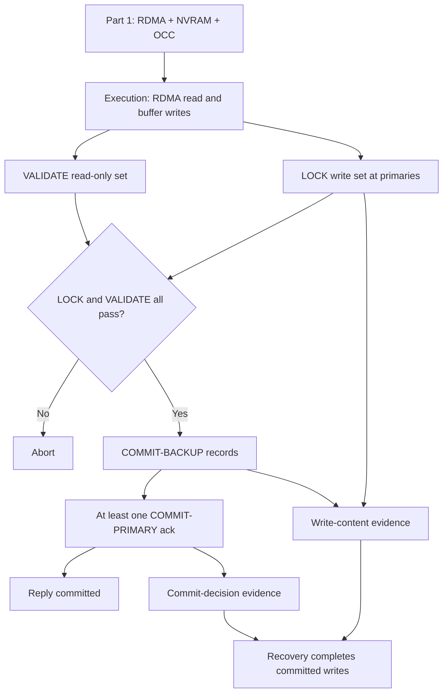

> **讲次身份与范围**：这是 **MIT 6.824 Spring 2021 官方 Lecture 15** 的第二个视频分段，不是 Lecture 16。part 1 已讲 FaRM 的 NVRAM/RDMA 设计、OCC、Figure 4 无故障 commit protocol 及第一个 strict serializability 例子；本文件只覆盖续段 [00:00:04-00:27:57]：协议复习、第二个 validation 例子、fault-tolerance evidence、设计边界，以及向 Spark 的过渡。Spark 的实质教学不在本文件范围内。
>
> **材料入口**：[课程 MATERIALS 的 Lecture 15 条目](/courses/mit-6824-s21/materials/#lecture-15-optimistic-concurrency-control-farm) · [Lecture 15 阅读输入](/assets/courses/mit-6824-s21/evidence/reading-inputs/lecture-15.md) · [FaRM paper](/assets/courses/mit-6824-s21/materials/official-materials/papers/farm-2015.pdf) · [FAQ](/assets/courses/mit-6824-s21/materials/official-materials/faqs/farm-faq.txt) · [Paper Question](/assets/courses/mit-6824-s21/materials/official-materials/questions/15-q-farm.html) · [本讲共享课堂讲义](/assets/courses/mit-6824-s21/lectures/016/materials/l-farm.txt)

## 学习目标

学完本续段后，应能：

1. 按顺序复述 FaRM 的 execution、LOCK、VALIDATE、COMMIT-BACKUP、COMMIT-PRIMARY，并区分哪些操作只用 one-sided RDMA、哪些仍需 server CPU 处理。[00:01:15-00:06:32]
2. 用 $T_1: x=0\Rightarrow y=1$、$T_2: y=0\Rightarrow x=1$ 的交叉条件写解释 lock bit 与 version validation 如何排除 $(x,y)=(1,1)$。[00:07:34-00:12:35]
3. 说明 read-only transaction 为什么没有 LOCK/log write，以及课堂对“是否总需要 validation”的回答边界。[00:12:40-00:18:34]
4. 区分“更新内容的记录”和“commit decision 的记录”，解释为什么 TC 回复 success 前的 records 足以在允许的 replica failure 后恢复已提交事务。[00:19:01-00:23:30]
5. 从 few conflicts、in-memory capacity、datacenter-local replication 和 specialized hardware 四方面判断 FaRM 的适用范围。[00:23:32-00:26:35]

## 需要的先修知识

- **来自 Lecture 13 的 transactions/2PC 基础**：atomic commit、Transaction Coordinator、commit/abort，以及“回复客户端后不能反悔”的安全性直觉。
- **来自 Lecture 14 的比较背景**：Spanner 面向 geographic replication；本讲只借它界定 FaRM 的 datacenter-local 目标，不重讲 TrueTime。
- **来自 Lecture 15 part 1 的直接前置**：sharding 与 primary/backup replication，NVRAM，kernel bypass，one-sided RDMA，OCC，OID、version/lock bit，对 write set 取锁、对 read set 做 validation，以及第一个并发增量例子。
- **阅读入口**：先看 [MATERIALS Lecture 15](/courses/mit-6824-s21/materials/#lecture-15-optimistic-concurrency-control-farm) 确认同一官方讲次的两个视频分段，再结合 [Lecture 15 阅读输入](/assets/courses/mit-6824-s21/evidence/reading-inputs/lecture-15.md) 与 [FaRM paper](/assets/courses/mit-6824-s21/materials/official-materials/papers/farm-2015.pdf)。课堂笔记以 transcript 为主，paper 不用于补写教师未讲的恢复细节。

## 老师的教学主线

1. [00:00:27-00:01:12] 明确这是 FaRM 收尾：先复习 part 1 的无故障 transaction protocol，再检查一个 validation 关键例子，最后讨论 fault tolerance。
2. [00:01:15-00:06:32] 按 Figure 4 复盘 execution $\rightarrow$ LOCK/VALIDATE $\rightarrow$ COMMIT-BACKUP $\rightarrow$ COMMIT-PRIMARY，强调 one-sided RDMA validation 与需 server 处理的 lock log 之别。
3. [00:07:34-00:12:35] 构造交叉条件写：两个事务都读到 0，但 $T_1$ 对 $y$ 的 lock bit 会让 $T_2$ 验证失败，因此非法的 $(1,1)$ 不会出现。
4. [00:12:40-00:18:57] 借问答拆出 read-only fast path，并诚实保留“纯读与 mixed workload 下 validation 是否必要”这一现场未完全推导的问题；以账户余额汇总说明纯读事务的实际用途。
5. [00:19:01-00:23:30] 从“已报告 committed 的 writes 不得丢失”出发，逐阶段盘点 records，再用 commit point 后 crash、$B_2$ 失败的排程建立恢复证据充足性的直觉。
6. [00:23:32-00:26:35] 总结 FaRM 很快，但依赖 few conflicts、数据全在内存、同数据中心复制和特殊硬件。
7. [00:26:35-00:27:57] 结束 FaRM 与三讲 transaction 单元，只引出下一主题 Spark，不在本笔记展开。

## 核心概念与依赖关系

- **OCC 与 one-sided RDMA**：execution read 和只读对象 VALIDATE 可以不让目标 server CPU 参与；写对象的 LOCK 虽以 RDMA append log 发出，primary 仍必须检查 version/lock bit 并设置锁。[00:02:09-00:04:47]
- **LOCK 与 VALIDATE 的依赖**：write set 要锁定，read-only set 只复查；二者全成功才作 commit decision。lock bit 让 VALIDATE 能在新值尚未安装、version 尚未增加时看见并发 writer。[00:10:23-00:12:20]
- **Read-only fast path**：没有 write set 就没有 LOCK、object write 或 log append，只剩 one-sided RDMA execution reads 与 validation reads。[00:13:06-00:14:24]
- **恢复证据的互补性**：LOCK/COMMIT-BACKUP 保存“写什么”，COMMIT-PRIMARY 保存“决定 commit”。前者单独不足以判定 commit；后者与 surviving write information 合并，才支持 recovery 保留已确认事务。[00:20:22-00:23:17]
- **性能与边界的因果链**：OCC 避免读路径 server participation，但以冲突时 abort 为代价；RAM 避免慢存储路径，但限制容量；RDMA 提高吞吐，却引入硬件和部署要求。[00:23:41-00:26:35]

## 关键推导、例子与结论边界

### Validation 排除非法状态

初始 $(x,y)=(0,0)$：

$$T_1: R(x_0);\ \text{if }x=0\text{ then }W(y_1)$$
$$T_2: R(y_0);\ \text{if }y=0\text{ then }W(x_1)$$

串行执行只能得到 $(0,1)$ 或 $(1,0)$。并发时，课堂选择 $T_1$ 先 $L(y)$、再 $V(x)$，随后 $T_2$ 执行 $L(x)$、$V(y)$；$T_2$ 在 $y$ 上看到 $T_1$ 设置的 lock bit，因此 abort，无法与 $T_1$ 同时 commit。[00:07:34-00:12:35] 这是解释机制的经典测试，不是 strict serializability 的完整证明。[00:18:38-00:18:57]

### Commit point 后 crash 的恢复直觉

回复 application 之前，课堂确认：primaries 已有 LOCK records，相关 backups 已有 COMMIT-BACKUP records，并至少有一个 primary acknowledgement 了 COMMIT-PRIMARY。[00:20:22-00:21:34] 即使紧接着 crash 且 $B_2$ 失败，surviving COMMIT-PRIMARY 仍证明 decision，其他 surviving records 仍描述 writes；在每 shard 仅一个 replica failure 的假设下，recovery process 有足够 pieces 完成事务。[00:21:34-00:23:17]

结论边界：教师没有讲完整 recovery algorithm，也没有证明所有 crash combinations；这里只建立协议为何可能满足“回复 committed 后不丢 writes”的关键直觉。[00:23:01-00:23:17]

### FaRM 的适用边界

- **Few conflicts**：冲突多会造成 OCC abort，benchmark 高性能不保证任意 workload。[00:23:41-00:24:50]
- **Data fits in memory**：容量不足要增加 machines/RAM，否则需采用能访问更大 persistent storage 的数据库。[00:24:50-00:25:24]
- **Replication within one data center**：不面向 Spanner 式跨数据中心持续可用目标。[00:25:24-00:26:04]
- **Specialized hardware**：依赖 UPS/供电保护及 RDMA NIC；课堂把这些称为 fancy/exotic hardware。[00:26:04-00:26:35]

## 易错点与待复核项

- **不要把两个视频当成两讲。** part 15 和 part 16 都属于官方 Lecture 15；本文件从 part 1 的无故障协议讨论续接，只到 Spark 的过渡句为止。
- **不要把 RDMA append 等同于无需 server。** VALIDATE read 可以完全 one-sided；LOCK record 虽由 RDMA 写入，primary 仍需轮询、检查并设置 lock。[00:03:29-00:04:47]
- **不要只看 version。** 并发 writer 可能已设置 lock bit、尚未递增 version；VALIDATE 必须同时检查两者。[00:11:52-00:12:15]
- **不要把 LOCK 当成 commit decision。** LOCK 含更新内容，却写在最终决定之前；COMMIT-PRIMARY 才提供已提交证据。[00:20:33-00:20:52]
- **不要过度推广示例。** 交叉条件写不是完整 correctness proof，commit-point crash 也不是完整 recovery protocol。[00:18:38-00:18:57] [00:23:01-00:23:17]
- **[需回听 00:12:23]** transcript 漏了否定语义；依据上下文，教师结论是 $T_1,T_2$ 不会都 commit。
- **[需回听 00:15:32-00:17:56]** blind write 问答有缺词和重叠，教师暂停作答；不补写结论。
- **[需回听 00:21:59-00:22:25]** crash 例子中的 record 指代较口语化，完整位置关系需对照原视频 Figure 4。
- **[需回听 00:26:15-00:26:23]** UPS 句子缺词；只保留“供电保护是硬件条件”的最小结论。

## 掌握标准

达到掌握应能在不看笔记时完成以下任务：

1. 画出 FaRM transaction 从 execution 到回复 success 的阶段图，并为每一步标出 read set/write set、primary/backup、one-sided RDMA 与 server participation。
2. 对任意给定的 $L/V/C$ 交错，同时检查 version 和 lock bit，判断 transaction commit 还是 abort；能解释本讲为何禁止 $(1,1)$。
3. 回答“read-only 为什么快”和“为什么课堂没有断言所有情况下 validation 都可省略”，并复述教师保留未决的 blind-write 问题。
4. 在 $P_1/P_2/B_1/B_2$ 图上区分 write-content evidence 与 commit-decision evidence，解释回复 success 后恢复所需的最小课堂直觉。
5. 面对一个 workload/deployment，按 conflicts、memory size、failure geography、hardware 四项判断 FaRM 是否匹配，而不是只引用高吞吐数字。
6. 准确说出范围边界：本笔记属于官方 Lecture 15 part 2，FaRM 于 [00:26:35] 收束，Spark 在 [00:27:40-00:27:57] 仅被引出。

## 复习顺序

1. 先读本文件“老师的教学主线”，确认 part 1/part 2 与 FaRM/Spark 的边界。
2. 回看 [00:01:15-00:06:32]，在纸上重画 Figure 4 的五阶段和 primary/backup records。
3. 独立推演 [00:07:34-00:12:35] 的 $T_1/T_2$ 时间线，再用 section 002 的掌握检查核对。
4. 阅读 [00:12:40-00:18:34] 的课堂 Q&A，特别区分“全为只读事务”与 mixed workload；保留教师没有完成的 blind-write 问题。
5. 回看 [00:19:01-00:23:30]，做一张两列表：左列 commit/write records，右列它们在 recovery 中证明什么。
6. 最后用 [00:23:32-00:26:35] 的四个限制做适用性复盘，并从 [MATERIALS Lecture 15](/courses/mit-6824-s21/materials/#lecture-15-optimistic-concurrency-control-farm) 进入 paper、FAQ 和 Question 做强化阅读。

## 全部详细 Section Notes

&nbsp;

# Lecture 15 continued: FaRM pt. 2（00:00:04-00:10:01）

## 本段在整讲中的作用

这是 **MIT 6.824 Spring 2021 官方 Lecture 15** 的续段，而不是新的 Lecture 16。课程视频把同一讲拆成了两个文件：part 1 已经介绍 FaRM 的硬件前提、one-sided RDMA、Optimistic Concurrency Control（OCC），并在无故障假设下走过 transaction execution/commit protocol 和第一个 strict serializability 例子；本段从这些结论继续。[00:00:27-00:01:12] 教师明确说本次先“finish off” FaRM：先复习无故障事务协议，再用第二个经典例子检查 serializability，之后才讨论 fault tolerance。

本段的实际任务有两层：先把 part 1 的 Figure 4 协议重新装回工作记忆 [00:01:15-00:06:48]，再建立第二个并发执行例子并说明什么结果会违反 serializability [00:07:34-00:10:01]。它不重新展开 part 1 已讲过的 NVRAM、kernel bypass 或 FaRM/Spanner 全面对比。

证据入口：[课程材料索引](/courses/mit-6824-s21/materials/#lecture-15-optimistic-concurrency-control-farm)、[Lecture 15 阅读输入](/assets/courses/mit-6824-s21/evidence/reading-inputs/lecture-15.md)、[课堂讲义 l-farm.txt](/assets/courses/mit-6824-s21/lectures/016/materials/l-farm.txt)。本段所用讲义是 Lecture 15 的共享讲义第 1 页。

## 教学展开

1. **声明续讲计划。** [00:00:27-00:01:12] 教师先界定今天视频中的两个主题：完成 FaRM，然后讲 Spark。FaRM 部分会接着 part 1 的无故障事务执行，增加一个 serializability 例子，并建立 fault tolerance 的直觉。本文件只覆盖前者，不把后续 Spark 当作 FaRM 内容。
2. **复习 execution phase。** [00:01:15-00:02:04] 应用先从三个不同 shard 读取三个 object，其中两个随后被修改。每个 shard 有一个 backup，因此图中的部署以一份 primary 加一份 backup 容忍一次失败。execution phase 只形成读取结果、version number 和本地缓冲的更新；应用决定提交后，才进入 commit phase。
3. **复习 LOCK。** [00:02:09-00:04:47] Transaction Coordinator（TC）把修改对象对应的 lock record 追加到各 primary 的日志。记录含 object identifier（OID）、读取时的 version number 和 new value。对象头是一个 64-bit 值，高位是 lock bit，其余位保存 version。primary 必须处理日志：仅当版本未变且尚未被别的事务锁住时取锁并回复成功。教师对比两种 RDMA 路径：validation 的 one-sided RDMA read 不需要目标 server CPU；向日志追加是 RDMA write，但 server 仍要轮询并处理该记录。
4. **复习 read validation。** [00:03:19-00:04:47] 只读但未修改的对象不走 LOCK，而由 TC 再做一次 one-sided RDMA read，检查 version 和 lock bit。图中的虚线表示这种不打断 server computation 的操作。
5. **复习 COMMIT-BACKUP 与 COMMIT-PRIMARY。** [00:04:51-00:06:32] LOCK 和 VALIDATE 都成功后，TC 先把包含 OID、version 和 new value 的 COMMIT-BACKUP record 发给每个修改对象的 backup。所有 backup 确认保存副本后，TC 再向 primary 写 COMMIT-PRIMARY record；一旦收到至少一个 NIC acknowledgement，便可向应用报告 transaction committed。这里先回顾顺序，fault tolerance 的理由留到后两段。
6. **课堂澄清图示。** [00:06:51-00:07:26] 学生问图中的 rectangle 表示什么，教师回答它表示 object。这个短问答排除了把方框误读成 shard 或 log record 的可能。
7. **建立第二个 serializability 测试。** [00:07:34-00:09:37] part 1 的例子没有 read-only object，因此 validation 没发挥作用；新例子刻意让它成为关键。初始 $x=0,y=0$，事务定义为：$T_1$ 读取 $x$，若 $x=0$ 则写 $y=1$；$T_2$ 读取 $y$，若 $y=0$ 则写 $x=1$。
8. **先枚举串行结果，再进入并发时间线。** [00:08:44-00:10:01] 若 $T_1$、$T_2$ 串行执行，先执行者会阻止后执行者满足条件，因此可得到 $(x,y)=(0,1)$ 或 $(1,0)$，但不能得到 $(1,1)$。教师强调该例不是完整 proof，而是检查 protocol 的经典棘手案例。随后令两个事务并发，在 execution phase 都读到 version 0，为下一段分析 LOCK/VALIDATE 交错做准备。

## 概念、符号与推导

- **Transaction Coordinator（TC）**：执行应用 transaction code，并驱动 commit protocol 的一方。本段图中 TC 跨多个 shard 读取、锁定、验证和写日志。[00:01:15-00:06:32]
- **对象版本字。** 课堂口述为 64-bit number：最高位为 lock bit，其余位为 version number。LOCK 要同时验证旧版本并设置 lock bit；VALIDATE 要检查版本是否仍相同且 lock bit 未置位。[00:02:38-00:03:01] [00:03:19-00:04:47]
- **写集与只读集采用不同路径。** 写集中的对象产生 LOCK record，并需要 primary CPU 处理；只读对象通过 one-sided RDMA read 做 VALIDATE，不获取锁。[00:02:09-00:04:47]
- **无故障提交顺序。** 课堂复习的依赖链为：

  $$\text{EXECUTE} \rightarrow \text{LOCK} \rightarrow \text{VALIDATE} \rightarrow \text{COMMIT-BACKUP} \rightarrow \text{COMMIT-PRIMARY}$$

  这是讲解顺序的摘要；教师说明 LOCK 与 VALIDATE 成功后才作 commit decision，再先通知 backups、后通知 primaries。[00:04:51-00:06:32]
- **经典测试的状态推导。** 初值为 $(0,0)$：
  - $T_1;T_2$：$T_1$ 写 $y=1$，随后 $T_2$ 的条件 $y=0$ 不成立，结果 $(0,1)$。
  - $T_2;T_1$：$T_2$ 写 $x=1$，随后 $T_1$ 的条件 $x=0$ 不成立，结果 $(1,0)$。
  - 因而两个事务都依据旧值写入所产生的 $(1,1)$ 无法对应上述任一串行次序，违反 serializability。[00:08:25-00:09:37]

本段没有形式化 serializability proof；教师明确把该例定位为理解 protocol 的测试，而非证明。[00:08:08-00:08:20]

## 例子与课堂提示

- **三个 shard、三个读取、两个写入。** [00:01:25-00:02:04] 该图服务于区分 read set 与 write set：两个被修改对象需要 LOCK，第三个只读对象只需 VALIDATE。
- **实线/虚线的操作差异。** [00:03:29-00:04:47] 虚线 one-sided RDMA validation 不唤醒目标 CPU；写入 incoming log 虽同样可由 RDMA 完成，primary 仍必须处理 lock record。易错点是把“RDMA write”误解为整个 LOCK 都不需 server participation。
- **方框表示 object。** [00:07:12-00:07:22] 这是课堂直接问答，不应把图中 rectangle 当成 server、shard 或事务。
- **$x/y$ 交叉条件写。** [00:08:25-00:09:37] 这个例子专门暴露 validation 是否真的阻止两个事务同时依据陈旧读值提交。教师提醒：通过一个关键例子只能增加正确性的直觉，不能替代 proof。
- **边界提示。** 本段只复习 Figure 4 在无故障时的执行，不在此处声称恢复协议已经得到证明；fault tolerance 从 [00:19:01] 后才成为主线。

## 本段掌握检查

1. **为什么本视频仍属于 Lecture 15，而不是 Lecture 16？**
   - 参考答案：教师开场说先完成 FaRM、再讲 Spark；课程材料索引也把 part 15 和 part 16 都列在官方 Lecture 15 下。本段内容直接延续 part 1 的 Figure 4 与 serializability 讨论。[00:00:27-00:01:12]
2. **LOCK record 包含什么，primary 如何决定是否成功取锁？**
   - 参考答案：包含 OID、transaction 读取时的 version number 和 new value；primary 检查当前 version 未变且 lock bit 未设置，成功时设置 lock 并回复，否则拒绝。[00:02:09-00:04:38]
3. **LOCK 和 VALIDATE 为什么不是同一个步骤？**
   - 参考答案：LOCK 针对 write set，需要设置锁并由 primary 处理；VALIDATE 针对只读对象，只用 one-sided RDMA 重读 version/lock bit，不设置锁。[00:03:19-00:04:47]
4. **为什么 $(x,y)=(1,1)$ 是第二个例子中的非法结果？**
   - 参考答案：任一串行顺序都会让后执行事务看到另一个变量已是 1，从而不写；所以 $(1,1)$ 不能映射到 $T_1;T_2$ 或 $T_2;T_1$。[00:08:25-00:09:37]
5. **本段是否已经证明 FaRM 严格可串行化？**
   - 参考答案：没有。教师明确说该经典例子有助于理解，但不是 proof；具体并发交错在下一段继续。[00:08:08-00:08:20]

## 待核对项

- [00:00:38] 英文 transcript 的 “we were more FaRM” 语法残缺；结合后句只能确认教师在回顾此前 FaRM 内容，不据此扩写。
- [00:05:55] transcript 有 `[]` 缺词。上下文可确认 primary 此时拥有更新信息但尚不能仅凭该记录判断事务已 commit；缺词不影响本段协议顺序。
- 讲义把 Figure 4 的 LOCK、VALIDATE、COMMIT-BACKUP、COMMIT-PRIMARY 都写在同一页；视频画面本身未单独归档，因此这里引用共享的 [l-farm.txt p.1](/assets/courses/mit-6824-s21/lectures/016/materials/l-farm.txt)，不虚构 slide 编号或切换时间。

&nbsp;

# Lecture 15 continued: FaRM pt. 2（00:10:04-00:20:03）

## 本段在整讲中的作用

本段接续 [00:09:39-00:10:01] 已建立的并发时间线，完成第二个 strict serializability 测试：它说明 VALIDATE 如何检测 read-write conflict，并借学生问答进一步澄清 read-only transaction 的快速路径与 validation 的必要性。随后教师在 [00:19:01] 把主线从 concurrency control 转向 fault tolerance，提出“已经向应用报告 committed 后发生 crash”这一恢复底线。

边界上，这仍是同一官方 Lecture 15 的 FaRM part 2。part 1 已讲第一个没有只读验证对象的例子；本段专门补上 validation 发挥决定性作用的交叉条件写，不重讲 OCC 的硬件动机。根据 prompt，本段是 transcript-only：不得把共享讲义内容描述成此时精确展示的课件页面。

## 教学展开

1. **让 $T_1$ 先进入 commit phase。** [00:10:04-00:11:15] 两个事务此前都读到 version 0。$T_1$ 将写 $y$，所以先对 $y$ 成功取锁并设置 lock bit；它只读 $x$，因此重读 $x$ 做 VALIDATE。此时 $x$ 的 version 仍是 0 且未被锁，故 $T_1$ 的验证成功，可以继续走向 commit。
2. **让 $T_2$ 在其后交错。** [00:11:20-00:12:20] $T_2$ 将写 $x$，先对 $x$ 取锁；由于它读取但不修改 $y$，接着验证 $y$。虽然 $y$ 的 version number 可能尚未增加，$T_1$ 已经设置 $y$ 的 lock bit，因此 $T_2$ 的 VALIDATE 失败并 abort。
3. **从例子得出局部结论。** [00:12:20-00:12:35] 两个事务不能都 commit，所以不会产生 serializability 禁止的 $(x,y)=(1,1)$。这里 transcript 口述有一句缺少否定词；结合前后“validation will fail”“T2 will abort”和最终总结，正确课堂结论是“不可能两者都提交”。
4. **问答：纯读事务走什么路径？** [00:12:40-00:14:31] 学生问 read operation 是否可以 lock-free。教师回到协议图，删去所有 write object：纯读事务在 execution phase 用 one-sided RDMA 读取，在 validation phase 再用 one-sided RDMA 棒验版本；它不取锁、不写对象、不追加 log record。LOCK 与 VALIDATE 分开，正是为了让 read-only transaction 完全没有 LOCK step，这也是 FaRM 高性能的来源之一。
5. **追问：纯读事务为何还要第二次验证？** [00:14:33-00:17:56] 学生质疑读取后立即验证似乎多余。教师先指出并发 writer 可能修改对象；学生进一步提出“原子读取两个值”时中间被另一事务改写的情形。教师承认：若系统中只有 read-only transactions，validation 肯定不必要；对于 mixed workload 的精确反例，他当场没有完整推导，要求把具体时间线画清楚后再回答。
6. **区分交叉条件写与 blind write。** [00:16:33-00:17:56] 教师回指 $T_1/T_2$：当前例子里 validation 至关重要。学生把 $T_2$ 改成无条件执行 $x=1$，即 blind write，并追问它若在 $T_1$ 验证后发生会怎样。教师没有现场给出完整答案，暂停该问题；笔记不能替教师补结论。
7. **问答：纯读事务的实际用途。** [00:18:02-00:18:34] 教师以 TPC-C、TATP workloads 为背景，举出“汇总一组账户余额”的事务：读取许多 account，但不写入。这说明 read-only transaction 不是只为协议构造的特殊情况。
8. **收束 concurrency control。** [00:18:38-00:19:01] 教师再次限定证据强度：这个 tricky example 显示 FaRM 能取得 strict serializability，但不是完整 proof。
9. **提出 fault-tolerance 的关键挑战。** [00:19:01-00:20:03] 教师不会深入恢复协议全部细节，只建立直觉。核心要求是：系统一旦告诉 application 某 transaction committed，即使随后 crash，也必须保留该事务，不能丢失它的 writes。下一段将从各 replica 留下的 records 检查是否有足够恢复证据。

## 概念、符号与推导

- **关键交错。** 课堂选择的顺序可写为：

  $$T_1: R(x_0) \rightarrow L(y) \rightarrow V(x) \rightarrow C(y)$$
  $$T_2: R(y_0) \rightarrow L(x) \rightarrow V(y) \rightarrow \text{abort}$$

  其中 $R$ 为 execution read，$L$ 为 write-set LOCK，$V$ 为 read-set VALIDATE，$C$ 为 commit。$T_1$ 的 $L(y)$ 先设置 lock bit，因此 $T_2$ 的 $V(y)$ 即使看到相同 version number，也因 lock bit 已置位而失败。[00:10:23-00:12:20]
- **VALIDATE 的判定。** 对只读对象，验证成功需要“当前 version 与 execution read 时一致”且“lock bit 未设置”。两项任一失败均 abort；本例命中第二项。[00:11:36-00:12:15]
- **Read-only transaction 快速路径。**

  $$\text{one-sided RDMA reads} \rightarrow \text{one-sided RDMA validation}$$

  不包含 LOCK、object write 或 log append。[00:13:06-00:14:24]
- **只读环境与 mixed workload 的区别。** 教师确认如果所有并发事务都只读，则不会有事务修改对象，二次 validation 不必要；一旦与写事务混合，需要检查能否读到无法对应某个串行快照的多个对象值。[00:14:49-00:16:20] 后一判断在课堂上只作为可能情形提出，没有完成形式化推导。
- **Fault-tolerance safety requirement。** 若 application 已收到 commit success，则恢复后必须保留该事务全部 writes：

  $$\text{reported committed} \Rightarrow \text{writes survive allowed failures}$$

  [00:19:32-00:20:03]

本段没有完整 correctness proof，也没有展开 recovery algorithm；教师只验证一个并发例子并提出下一段要检查的持久性条件。

## 例子与课堂提示

- **版本未变也可能验证失败。** [00:11:52-00:12:15] 本例最重要的提示是不能只比较 version：另一个 transaction 已经锁住对象、尚未安装新值时，lock bit 就是冲突证据。
- **Read-only 不等于只读一个 object。** [00:13:06-00:14:24] 纯读事务仍可能读多个 shard 上的对象，并需要 validation 来检查组合读取；它的优势是全程 one-sided RDMA，而不是省略 commit correctness 检查。
- **账户余额汇总。** [00:18:02-00:18:34] 该 workload 例子服务于解释纯读事务的现实用途，而不是宣称 TPC-C/TATP 的所有事务都只读。
- **教师保留意见。** [00:15:46-00:17:56] 对“验证后发生 blind write”的具体排程，教师明确表示需要重画时间线、课后再回到问题。应保留这一未决状态，不能凭外部知识代答。
- **易错表述。** [00:12:23-00:12:35] transcript 写成 “it is the case that T1 and T2 both commit”，但这与前一句 $T_2$ abort、非法结果说明和 [00:18:38-00:18:57] 总结冲突；此处显然漏录了否定语义，应按“不能都 commit”理解并列入核对。

## 本段掌握检查

1. **为什么 $T_2$ 的 $V(y)$ 会失败，即使 $y$ 的 version 可能仍是 0？**
   - 参考答案：$T_1$ 已通过 $L(y)$ 设置 lock bit；VALIDATE 同时检查 version 与 lock bit，见锁即失败。[00:11:20-00:12:20]
2. **纯读 FaRM transaction 会执行哪些网络操作，又省略哪些操作？**
   - 参考答案：execution 与 validation 都用 one-sided RDMA reads；不取锁、不写对象、不追加 log record。[00:13:06-00:14:24]
3. **为什么教师没有把该例称为 strict serializability proof？**
   - 参考答案：它只覆盖一个经典 tricky interleaving，能解释 validation 的作用，却没有穷尽所有事务和失败排程。[00:18:38-00:18:57]
4. **课堂给出的 read-only transaction 用例是什么？**
   - 参考答案：读取一组账户并计算余额汇总；读很多 account，但不写。[00:18:02-00:18:34]
5. **fault tolerance 讨论从什么不变量开始？**
   - 参考答案：一旦 application 被告知 transaction committed，之后即使 crash，系统也不能丢失该 transaction 的 writes。[00:19:32-00:20:03]

## 待核对项

- [00:12:23-00:12:35] transcript 缺少关键否定词。上下文支持“$T_1$ 和 $T_2$ 不会同时 commit”，建议回听原音确认原句。
- [00:15:32-00:17:56] 多处 `[]` 和问答重叠使学生提出的 blind-write 排程不够清楚；教师也明确没有完成回答。该问题保持未决，不从论文补写课堂结论。
- 本段 prompt 标记为 transcript-only。虽然同讲共享 [l-farm.txt](/assets/courses/mit-6824-s21/lectures/016/materials/l-farm.txt)，本段不声称某个时间点展示了该讲义的特定文字或图。

&nbsp;

# Lecture 15 continued: FaRM pt. 2（00:20:03-00:27:57）

## 本段在整讲中的作用

本段完成同一官方 Lecture 15 的 FaRM 内容。它接续上一段提出的恢复不变量，通过“刚向应用报告 commit 就 crash”的最坏排程，检查 LOCK、COMMIT-BACKUP 与至少一条 COMMIT-PRIMARY 是否留下足够 evidence；随后按课堂顺序总结 FaRM 的性能来源和适用边界。教师在 [00:26:55-00:27:40] 宣布三讲 transaction 单元结束，[00:27:40-00:27:57] 只把 Spark 作为本次剩余时间及后续讲次的新主题引出。因此本 section 到此截止，不整理 Spark 内容。

材料边界：prompt 将本段标为 transcript-only。共享讲义 [l-farm.txt](/assets/courses/mit-6824-s21/lectures/016/materials/l-farm.txt) 的 fault-tolerance 与 limitations 条目可供交叉核对，但不能据此宣称本段展示了特定 slide。

## 教学展开

1. **重申不能丢已确认的写。** [00:20:03-00:20:22] 如果 TC 已向 application 报告 transaction committed，crash 后就不能丢掉该 transaction 的任何 writes。教师重新看 Figure 4 的每一步，询问系统在 commit point 前留下了什么。
2. **盘点 LOCK 后的证据。** [00:20:22-00:20:56] 修改对象所在的 primaries $P_1,P_2$ 各有 lock record，其中描述 OID/version/new value 等 update information；但 LOCK 本身发生在最终 commit decision 之前，所以它不能单独证明 transaction committed。
3. **盘点 COMMIT-BACKUP 后的证据。** [00:20:56-00:21:13] 经过 COMMIT-BACKUP，$B_1,B_2$ 都拥有描述对应 writes 的 commit-backup records。更新内容因此已复制到各修改 shard 的 backup。
4. **确认回复应用前至少一条 commit decision。** [00:21:13-00:21:34] TC 在向 application 报告成功之前，已经收到至少一个 primary NIC 对 COMMIT-PRIMARY 的 acknowledgement。例中假设 $P_1$ 有 commit record；这条只含 transaction identity/decision 的记录为“已经 commit”提供证据。
5. **构造 commit point 后立即 crash 的最坏情况。** [00:21:34-00:22:30] 系统容忍每个 shard 一次失败。假设 $B_2$ 失败，因而丢失它的 COMMIT-BACKUP；$P_2$ 可能尚未收到/保存 COMMIT-PRIMARY。与此同时，已 acknowledgement 的 $P_1$ 保有 commit record，$B_1$ 保有对应写信息，另一 shard 的 $P_2$ 仍有先前 LOCK 中的更新信息。教师用这个排程检查在允许的失败数内，commit decision 与写内容是否仍可拼回。
6. **建立恢复直觉。** [00:22:30-00:23:30] surviving commit record 证明 transaction 已提交，surviving primary/backup records 保存 writes；new coordinator/recovery process 可以检查事务留下的 pieces，决定完成而非丢弃它。教师明确说真正 recovery protocol 很复杂，本讲只论证“留下了足够 pieces”的直觉，不展开算法细节。
7. **总结优势与第一个限制：冲突必须少。** [00:23:32-00:24:50] FaRM 的亮点是每秒执行大量 transactions。它为了 one-sided RDMA 和较少 server involvement 使用 OCC；若 workload 冲突多，就会频繁 abort，性能优势下降。课堂提到两个常见 transaction benchmarks 上表现很好，但不把 benchmark 结果外推成任意 workload 的保证。
8. **第二个限制：数据必须放入内存。** [00:24:50-00:25:24] 数据库变大时需要购买更多机器以增加总内存；若数据过大且不扩机器，就不能使用这种设计，而要回到能在更大 persistent storage 上读写的传统数据库。
9. **第三个限制：仅数据中心内复制。** [00:25:24-00:26:04] FaRM 的 replication 只在同一 data center 内，这与 Spanner 的跨数据中心 synchronous replication 目标不同。Spanner 面向某些 data center 下线时仍要继续服务的应用；FaRM 不以这种 geo-distributed survivability 为目标。
10. **第四个限制：特殊硬件。** [00:26:04-00:26:35] 教师列出用于完整断电场景的 UPS/供电保护，以及获得高性能所依赖的 RDMA NICs，并把它们概括为较 fancy/exotic 的硬件要求。
11. **划定课程单元边界。** [00:26:35-00:27:57] 教师结束 FaRM，也结束连续三讲的 transaction 主题，并回顾课程已见到多种 fault-tolerant storage designs，其中包括 transactions 这种强 programming abstraction。接下来转向与 storage systems 不同的主题，首个是 Spark；此处只是过渡句，不属于 FaRM 教学内容。

## 概念、符号与推导

- **两类恢复证据。** 课堂把 surviving information 分成：
  - **更新内容**：LOCK/COMMIT-BACKUP records 描述 transaction 对对象的 writes；
  - **提交决定**：COMMIT-PRIMARY record 表明相应 transaction id 已 commit。
  只有更新内容而没有 decision，不能从 LOCK 单独推出 commit；有 decision 且各 shard 的更新信息在允许失败后仍有副本，recovery 才能完成已确认事务。[00:20:22-00:23:17]
- **一副本备份的失败假设。** 图中每个 shard 是 primary/backup 两份，因此讨论的是每个 shard 最多损失一份 replica 后，仍至少有一份 surviving evidence。[00:21:42-00:22:30]
- **commit-response 前置条件。** 课堂例子的顺序为：

  $$\text{LOCK all primaries} \rightarrow \text{COMMIT-BACKUP all backups} \rightarrow \text{ack of at least one COMMIT-PRIMARY} \rightarrow \text{reply success}$$

  这确保回复 success 时，写内容已分布到相关 replicas，并且至少有一处持久记录 commit decision。[00:20:22-00:21:34]
- **OCC 的性能条件。**

  $$\text{few conflicts} \Rightarrow \text{few validation/lock aborts} \Rightarrow \text{high useful throughput}$$

  这是课堂给出的定性关系，不是数量公式；冲突多时 OCC 的 optimistic assumption 不成立，abort 成本上升。[00:23:41-00:24:50]
- **内存容量边界。** FaRM 要求 data fit in aggregate memory；扩容量依赖增加 machines/RAM，而不是把本设计直接降级为磁盘数据库。[00:24:50-00:25:24]

本段无额外形式化公式推导。恢复部分是 evidence sufficiency 的示例，不是完整 recovery protocol proof。

## 例子与课堂提示

- **$B_2$ 在 commit point 后失败。** [00:21:34-00:22:30] 这个选择服务于检验最危险的情况：丢掉一个 backup 上的 COMMIT-BACKUP，同时并非所有 primaries 都已有 COMMIT-PRIMARY。仍存的 commit decision 与 writes 使 recovery 有据可依。
- **LOCK 不是 commit 证明。** [00:20:33-00:20:52] 事务可能在 validation 后 commit，也可能 abort；因此看到更新信息不等于能判定最终决定。这是理解 recovery evidence 时最容易混淆的一点。
- **复杂恢复协议被有意省略。** [00:23:01-00:23:17] 教师只要求建立“pieces 足够”的直觉。不能把本例扩写成 leader election、record collection 或 replay 的完整实现。
- **FaRM/Spanner 比较只针对目标。** [00:25:24-00:26:04] FaRM 的 datacenter-local replication 与 Spanner 的 geographic replication 服务于不同故障范围；不是简单判定谁更好。
- **UPS 字幕疑点。** [00:26:15-00:26:23] transcript 说 “this UPS, [] UPS”。共享讲义更具体地描述每个 rack 的 batteries、断电通知和把 RAM 写入 SSD；本段只能确认教师把 UPS/供电保护列为应对完整断电的硬件条件，不补写缺词。

## 本段掌握检查

1. **为什么 primary 上只有 LOCK record 还不能证明事务 committed？**
   - 参考答案：LOCK 在最终 commit decision 前写入，只描述待更新内容；事务之后仍可能因 validation/lock failure 而 abort。[00:20:22-00:20:56]
2. **TC 向应用回复 success 前，课堂确认了哪些记录已经存在？**
   - 参考答案：相关 primaries 有 LOCK records，所有相关 backups 有 COMMIT-BACKUP records，并且至少一个 primary 已 acknowledgement COMMIT-PRIMARY。[00:20:22-00:21:34]
3. **在 $B_2$ 失败的例子中，recovery 为什么仍能认定并保留 transaction？**
   - 参考答案：$P_1$ 的 commit record 保留最终决定，surviving primary/backup records 保留各写的信息；在每 shard 只失败一个 replica 的假设下，new coordinator 有足够 pieces 完成事务。[00:21:34-00:23:17]
4. **FaRM 高性能依赖哪四类边界？**
   - 参考答案：workload 冲突少、数据能放入总内存、只要求 data-center-local replication，以及可使用 UPS/供电保护与 RDMA NIC 等特殊硬件。[00:23:41-00:26:35]
5. **FaRM 在本视频何时正式结束，后面的 Spark 是否属于本笔记范围？**
   - 参考答案：[00:26:35] 教师结束 FaRM；[00:26:55-00:27:40] 收束 transaction/storage 单元；[00:27:40-00:27:57] 仅引出 Spark。Spark 不属于本 FaRM part 2 笔记范围。

## 待核对项

- [00:21:59-00:22:25] transcript 对 $B_2/P_1/B_1$ 的指代有口语重复，且未保存视频中的完整图。依据可确认的最小结论是：允许每 shard 一个 replica failure 时，至少一个 COMMIT-PRIMARY decision 和各写的 surviving information 足以驱动恢复；更细的 record 位置需结合原视频 Figure 4 回看。
- [00:22:40] transcript 将 commit record 描述为 “just what the tid that's committed”，应理解为记录 committed transaction id（TID），具体 record schema 未在本段展开。
- [00:26:15-00:26:23] UPS 相关句子有 `[]` 缺词；共享讲义支持供电保护/NVRAM 的总体背景，但不能据此恢复教师原句。
- [00:27:51-00:27:57] 已覆盖 transcript 最后有声内容，仅为 Spark 过渡；没有把下一主题的知识点混入 FaRM。
