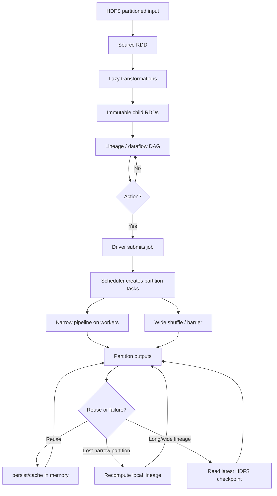

> **讲次身份与范围**：这是 MIT 6.824 Spring 2021 官方 Lecture 16，视频分段为 Part 17，覆盖 [00:00:00-01:18:48]。教师在 [00:54:42-00:55:19] 结束正式讲课，之后为课后 Q&A；其中 [01:01:16-01:04:59] 回答的是上一讲 FaRM recovery，已作为跨讲插曲隔离，不并入 Spark 主线。
>
> **证据与材料入口**：[课程 MATERIALS 的 Lecture 16 条目](/courses/mit-6824-s21/materials/#lecture-16-big-data---spark) · [Spark paper](/assets/courses/mit-6824-s21/materials/official-materials/papers/zaharia-spark.pdf) · [FAQ](/assets/courses/mit-6824-s21/materials/official-materials/faqs/spark-faq.txt) · [Paper Question](/assets/courses/mit-6824-s21/materials/official-materials/questions/16-q-spark.html) · [课堂讲义](/assets/courses/mit-6824-s21/lectures/017/materials/l-spark.txt) · [英文 transcript](/assets/courses/mit-6824-s21/lectures/017/transcript.txt)。课堂 chronology 以 transcript 为主；只见于 paper/讲义的事实单独标注，不补写成教师口述。

## 学习目标

学完本讲后，应能：

1. 解释 RDD 为什么是 partitioned、read-only/immutable、lazily evaluated 的 distributed dataset，并准确区分 transformation 与 action。[00:05:19-00:09:08]
2. 从 driver 构建 lineage、scheduler 按 partition 发 task、workers 执行 pipeline 的顺序，说明 Spark computation 何时真正开始。[00:12:19-00:20:07]
3. 用 partition-level dependency 和 communication/shuffle 判断 narrow 与 wide，说明相同 hash partitioning 为什么能让 `join` 像 narrow operation 一样局部执行。[00:20:16-00:23:46] [00:46:32-00:49:35]
4. 比较 memory `persist/cache`、lineage recomputation 与 HDFS checkpoint，解释 worker failure 在 narrow/wide dependencies 下的不同恢复代价。[00:23:50-00:35:02]
5. 按 `join -> flatMap -> reduceByKey -> new ranks` 推演一轮 PageRank，并解释 iterative workload 为何比多轮 MapReduce 更能受益于内存复用。[00:35:29-00:46:32]
6. 评价 Spark 的收益与边界：完整 dataflow 给 scheduler 优化空间，但 wide shuffle/barrier、cache capacity、checkpoint I/O 与长 lineage recovery 都有成本；driver failure 在本讲没有得到确定答案。[00:49:52-00:57:37]

## 需要的先修知识

- **Lecture 1 / Lab 1 的 MapReduce**：map、shuffle、reduce、partition 与 worker task；本讲不断用“每轮中间结果落盘再读”对比 Spark dataflow。
- **HDFS/GFS 基础**：输入文件已分成 partitions，checkpoint 写到稳定的 distributed file system；本讲不重讲 replication protocol。
- **Functional programming 最小直觉**：immutable input、deterministic transformation、由相同输入重跑得到相同输出。
- **Keyed data operations**：按 key 的 `join`、`group/reduce` 与 hash partition；课堂会从 PageRank 例子现场展开。
- **阅读顺序**：先从 [MATERIALS Lecture 16](/courses/mit-6824-s21/materials/#lecture-16-big-data---spark) 进入 [Spark paper](/assets/courses/mit-6824-s21/materials/official-materials/papers/zaharia-spark.pdf) 和 [FAQ](/assets/courses/mit-6824-s21/materials/official-materials/faqs/spark-faq.txt)，再用本笔记核对教师实际强调的 programming model、execution strategy 和 fault tolerance。

## 老师的教学主线

1. [00:00:00-00:05:19] 从 MapReduce/Hadoop 与 Lab 1 出发，说明 Spark 广泛用于 datacenter/data-science workloads，尤其善于 iterative applications；到 2021 年虽常用 DataFrame，课堂仍以 RDD 解释核心思想。
2. [00:05:19-00:14:23] 用交互式日志过滤建立 RDD：HDFS 文件映射成 partitioned `lines`，transformation 只生成 immutable RDD/lineage，`count`、`collect` 等 action 才触发 lazy computation；`persist` 也不是 action。
3. [00:14:25-00:26:31] 由 action 进入执行：driver/lineage/scheduler/workers 按 partition 运行 pipeline；局部 transformation 是 narrow，跨 partitions 汇集通常是 wide。初始 partition 来自 HDFS，后续可由 Spark partitioner 重排。
4. [00:26:35-00:35:29] worker crash 丢失 memory partition 后，scheduler 依靠 deterministic transformations 沿 lineage 重算；narrow 可局部恢复，wide 可能放大重算范围，HDFS checkpoint 用 I/O 成本缩短恢复路径。
5. [00:35:29-00:49:52] 用 PageRank 展示 iterative computation：静态 `links` 被多轮复用，`ranks` 每轮生成新 RDD；`join`、`flatMap`、`reduceByKey` 形成下一轮 ranks。相同 hash partitioning 可 co-locate 等 key records，避免 join 的完整 shuffle/barrier。
6. [00:49:52-00:55:19] 建议长迭代周期性 checkpoint，区分 partition parallelism 与 pipeline overlap；总结 Spark 以 functional transformations 构成完整 dataflow，换来 memory reuse、scheduler optimization、表达力与性能。
7. [00:55:21-01:18:48] 课后问答补充 checkpoint frequency、driver failure 未知边界、hash partition mechanics、paper 的 narrow/wide 定义争议、batch pipeline 与 DAG/RDD/transformation 术语；[01:01:16-01:04:59] 的 FaRM recovery 问答单独隔离。

## 核心概念与依赖关系

- **Programming model**：transformation 生成新 RDD 并扩展 lineage；action 才物化结果。RDD immutability 与 deterministic transformations 让 lineage 同时成为 execution recipe 和 recovery recipe。[00:07:00-00:09:08] [00:28:44-00:29:34]
- **Execution model**：driver 承载应用并构建 lineage；scheduler 将 partition task 分给 workers。partitions 通常多于 workers，以便 load balance；narrow transformations 可在同一 partition pipeline 中连续处理 batches。[00:12:19-00:20:07]
- **Narrow/wide dependency**：paper 定义约束 parent partition fan-out；课堂性能直觉是 narrow 不需跨机通信，wide 通常需 shuffle/barrier。co-partitioned join 表明“一 child 只读一 parent”的简写并不可靠。[00:20:16-00:23:46] [01:05:28-01:10:51]
- **Reuse 与 recovery**：普通 `persist/cache` 把已算 RDD 留在 memory，解决重复读取/重算；checkpoint 把完整 RDD 写入 HDFS，解决 failure 后 lineage 过长或 wide recomputation amplification。[00:23:50-00:35:02]
- **PageRank 的迭代优势**：`links` 是巨大静态图，适合跨轮缓存；每轮新 ranks 可直接从上一轮 memory result 继续，而 MapReduce 风格每轮需写回并重读 file system。[00:35:29-00:46:32]

## 关键推导、例子与结论边界

### PageRank 一轮数据流

对 source page $u$，当前 rank 为 $R_t(u)$、out-degree 为 $d(u)$，课堂明确推演每条出边 contribution：

$$c_t(u\rightarrow v)=\frac{R_t(u)}{d(u)}$$

然后按 destination key 汇总：

$$C_t(v)=\sum_{u\to v}\frac{R_t(u)}{d(u)}$$

三页例中 U1 从自身和 U3 收到：

$$C_t(U_1)=\frac{R_t(U_1)}{2}+R_t(U_3)$$

课堂在 [00:40:33-00:43:51] 明确讲了 `join`、rank division、`flatMap` contributions 与 `reduceByKey` sum。完整讲义还写出 $R_{t+1}(v)=0.15+0.85C_t(v)$，并解释 85% 跟随链接、15% 随机访问；这两个常数在对应 transcript 中未被明确口述，故只作为 [l-spark.txt](/assets/courses/mit-6824-s21/lectures/017/materials/l-spark.txt) 的材料事实，不倒灌进课堂推演。

### Co-partitioned join

若 `links` 和 `ranks` 使用一致 mapping，例如：

$$p(k)=h(k)\bmod N$$

相同 key $k$ 的两边 records 落到同一 partition/machine。于是 output partition $i$ 可从 `links[P_i]` 与 `ranks[P_i]` 本地 join，无需全量 network shuffle。[00:47:24-00:49:35] [00:57:44-01:00:54] 这也解释了为什么 logical operator 名称不能单独决定 physical dependency cost。

### Fault recovery 与 checkpoint 权衡

worker 丢失 narrow output 时，只需重跑相关局部 lineage；wide output 可能依赖多个 upstream partitions，导致一个 failure 触发大量重算。[00:26:35-00:33:07] checkpoint 将恢复起点前移，但不是免费操作：

$$\text{总成本} \approx \text{正常 checkpoint I/O} + \text{failure 时预期重算成本}$$

课堂只给出定性优化与 PageRank “也许每 10 轮”示例，没有推导通用最优间隔。[00:49:52-00:50:11] [00:55:21-00:57:03]

### 结论边界

- 本讲 fault tolerance 针对 worker crash、memory/partition loss；driver crash 后 graph/scheduler 如何恢复，教师明确回答“不知道”。[00:57:07-00:57:37]
- paper 的 narrow 定义与课堂“一对一”简写在 many-to-one/co-partitioned join 上发生争论；可安全掌握的是 parent fan-out 定义和“无需 network communication”的运行直觉，不能声称课堂完成了形式化统一。[01:05:28-01:10:51]
- [01:01:16-01:04:59] 讨论的是 FaRM commit evidence 与 $f+1$ replicas，不是 Spark checkpoint；两种 recovery 不可混用。

## 课堂评价与设计权衡

- **相比 MapReduce 的收益**：多步 dataflow 直接连接 transformations，减少每轮写/读 GFS/HDFS；iterative workloads 能重用 memory 中的静态和动态数据。[00:01:39-00:03:05] [00:44:01-00:46:32]
- **Wide dependency 的代价**：需要跨 partitions 聚合时会产生 network communication、shuffle 与 barrier；已有 co-partitioning 可避免部分 shuffle，但不能消除最终 `collect` 的全局汇集。[00:20:16-00:23:46] [00:46:32-00:52:00]
- **Cache 的代价**：`persist` 只应服务于有价值的 reuse；memory 有限，教师对精确 eviction/spill 策略保持不确定。[00:33:21-00:35:02]
- **Checkpoint 的代价**：写完整 RDD 到 HDFS 会拖慢正常运行，但减少 failure 后重算；RDD 越大，越不能盲目高频 checkpoint。[00:55:21-00:57:03]
- **表达力与可优化性**：完整 lineage 让 scheduler 看到数据流和 partition layout，因此可做 pipeline、locality 与 co-partition optimization；这比孤立 MapReduce jobs 更 expressive。[00:52:10-00:54:02]

## 只见于论文或讲义的补充事实

以下内容来自 [课堂讲义 l-spark.txt](/assets/courses/mit-6824-s21/lectures/017/materials/l-spark.txt) 或指定 paper，不作为 transcript 中对应时段的直接口述：

- 完整 Scala 示例先对输入做 `distinct()`、`groupByKey()`、`cache()`，循环十次后 `collect()`；讲义给出的本地运行结果是 U1 rank 最高。
- PageRank 用户模型为 85% 跟随当前页链接、15% 随机访问；代码更新为 `0.15 + 0.85 * contributionSum`。
- 讲义明确把 `distinct`、`groupByKey`、`join`、`reduceByKey` 列为通常需要把相同 key 聚到一起的 wide operations，并描述 upstream buckets、downstream fetch 与 barrier。
- 讲义的限制列表是 bulk-data batch processing、all records treated similarly、functional transformations、没有 in-place modification。课堂明确讲过 immutable functional model，但没有在讲末逐项口述这份完整 limitations 清单。

## 整讲掌握问答

1. **为什么创建 RDD、调用 transformation 或 `persist` 都不等于已经计算？**
   - 参考答案：这些操作只构建 lineage 或声明缓存意图；`count`、`collect` 等 action 才让 driver/scheduler 启动 job。[00:06:21-00:09:08] [00:14:14-00:17:01]
2. **Lineage 为什么既支持调度又支持 fault recovery？**
   - 参考答案：它完整记录从 source 到目标 RDD 的 deterministic transformation recipe；scheduler 用它安排 stages/tasks，partition 丢失时用相同输入重放得到相同输出。[00:12:57-00:17:01] [00:28:44-00:33:07]
3. **何时依赖会带来 shuffle/barrier，何时 join 可以局部执行？**
   - 参考答案：结果需重新聚集多个 partitions/keys 时通常 wide；两边已按相同 key/hash co-partition 时，相等 keys 同机，join 可逐对应 partition 执行。[00:20:16-00:23:46] [00:47:24-00:49:35]
4. **`persist` 与 checkpoint 的目标有何不同？**
   - 参考答案：`persist` 在 memory 中保留 RDD 以加速正常复用；checkpoint 写 HDFS，以限制 failure 后沿 lineage 的重算距离。[00:23:50-00:25:23] [00:32:14-00:34:06]
5. **为什么 PageRank 是 Spark 优于多轮 MapReduce 的代表例？**
   - 参考答案：它反复 join 静态 `links` 与动态 `ranks`；Spark 缓存 `links` 并让每轮 ranks 留在 memory，MapReduce 风格则每轮都需 file-system round trip。[00:35:29-00:46:32]
6. **本讲哪些结论必须保留不确定性？**
   - 参考答案：普通 cache 的精确 eviction/spill 策略、driver crash recovery、paper narrow 定义与课堂 many-to-one 简写的统一都没有得到确定完整答案。[00:34:12-00:35:02] [00:57:07-00:57:37] [01:05:28-01:10:51]

## 易错点与待复核项

- **不要把 RDD variable 当成已装入 driver 的数据。** 它代表 partitioned dataset 及其 recipe，action 前通常未 materialize。[00:06:21-00:09:08]
- **不要把 `persist` 当 action。** 它只影响未来 materialization 的保存策略。[00:10:46-00:14:23]
- **不要把所有 `join` 永久分类为 wide。** 是否需要 network shuffle 取决于 partitioner；co-partitioned join 可 local 执行。[00:46:32-00:49:35]
- **不要把 ordinary memory persist 与 reliable HDFS checkpoint 混为一谈。** 前者主要为 reuse，后者主要为 recovery bound。[00:32:14-00:34:06]
- **不要把循环画成 lineage cycle。** 每轮创建新的 ranks/contribs RDD，DAG 只是随 iteration 展开变长。[00:45:16-00:45:49]
- **不要把 wide/narrow 称为 partitions。** 它们是 dependencies；简化的 RDD-level 箭头又隐藏了 partition fan-in/fan-out。[01:15:28-01:18:00]
- **[需回听 00:15:31-00:16:27]** 日志分析示例源码未归档在 prompt，教师还混用了 `collect`/count；下一段明确纠正为 `count`。
- **[需核对历史 API]** 教师两次说 `persist` 的 `RELIABLE` flag，并带 “I think” 语气；具体版本接口不能仅凭 transcript 定论。
- **[讨论未决 01:05:28-01:10:51]** narrow dependency 的 paper 字面定义、many-to-one 与课堂“一对一”简写没有完全统一。

## 掌握标准

达到掌握应能在不看笔记时完成：

1. 给一段 RDD code 标出 source、transformations、actions、persist/checkpoint，并画出无 cycle 的 lineage DAG。
2. 给一个 partition dependency 图，分别用 paper parent fan-out 定义和 network communication 直觉判断 narrow/wide，并说明二者何时需要谨慎区分。
3. 画出 driver、scheduler、workers、HDFS partitions，解释 partitions 多于 workers、task dispatch、partition parallelism 与 batch pipeline。
4. 对 narrow loss、wide loss、存在/不存在 checkpoint 四种情况，指出最小 recomputation scope 和主要成本。
5. 手算三页 PageRank 一轮 contributions，并说明 `links` cache、new ranks、co-partitioned join 与最终 `collect` 的作用。
6. 对“Spark 一定比 MapReduce 快”“所有 join 都 wide”“driver crash 也靠 lineage 自动恢复”等断言给出基于课堂证据的反驳或边界。

## 复习顺序

1. 先读“老师的教学主线”，把正式主讲 [00:00:00-00:55:19] 与课后 Q&A 分开。
2. 回看 Sections 001–002，在纸上画 `lines -> errors -> hdfs -> time -> action`，标出 lazy、persist、driver、scheduler 与两类 parallelism。
3. 回看 Sections 003–004，做一张 narrow/wide、persist/checkpoint、normal reuse/failure recovery 的对照表。
4. 回看 Section 005，手算 U1/U2/U3 的 join、contributions 与 reduce；再用讲义补上 0.15/0.85，但明确标记其材料来源。
5. 回看 Section 006，解释 hash co-partition 与 checkpoint interval tradeoff，并记住 driver failure 是课堂未知项。
6. 最后读 Sections 007–008：隔离 FaRM 插曲，按 paper fan-out、communication、co-partitioned many-to-one 三个角度复盘 dependency 争议和 DAG 术语。
7. 回到 [MATERIALS Lecture 16](/courses/mit-6824-s21/materials/#lecture-16-big-data---spark)，用 [Paper Question](/assets/courses/mit-6824-s21/materials/official-materials/questions/16-q-spark.html) 检查能否回答“Spark 能很好支持哪些 MapReduce/Hadoop 不擅长的 applications”。

## 全部详细 Section Notes

&nbsp;

# Lecture 16: Big Data - Spark（00:00:00-00:09:53）

## 本段在整讲中的作用

本段从学期初的 MapReduce 与 Lab 1 接回大数据计算，回答“为什么还要看 Spark”，随后用最简单的交互式日志过滤例子建立 RDD programming model。[00:00:00-00:05:48] 教师把 Spark 定位为 Hadoop/MapReduce 的后继：它服务于需要很多机器处理海量数据的 datacenter/data-science computation，尤其适合由多轮计算组成的 iterative applications，因为中间结果可以留在内存中复用。[00:00:20-00:03:05]

接着，教师先交代 2012 年论文与 2021 年生态的边界：Spark 已不只支持 Scala，论文中的 RDD 接口也逐渐让位于 DataFrame；但他把 DataFrame 解释成带显式列的 RDD，并说明本讲仍用 RDD 讲核心思想。[00:03:43-00:04:28] 最后，本段进入第一个例子，依次引出 partitioned RDD、lazy evaluation、transformation、action、immutability 与 pipeline；实际 pipeline 的完整解释延续到下一段。[00:05:19-00:09:53]

证据入口：[课程材料索引](/courses/mit-6824-s21/materials/#lecture-16-big-data---spark)、[Spark 指定论文](/assets/courses/mit-6824-s21/materials/official-materials/papers/zaharia-spark.pdf)、[FAQ](/assets/courses/mit-6824-s21/materials/official-materials/faqs/spark-faq.txt)、[Paper Question](/assets/courses/mit-6824-s21/materials/official-materials/questions/16-q-spark.html)、[本讲课堂讲义](/assets/courses/mit-6824-s21/lectures/017/materials/l-spark.txt)。课堂事实以 transcript 为主；下文明确标成“讲义补充”的内容不冒充本时段口述。

## 教学展开

1. **从 MapReduce 回到大数据计算。** [00:00:00-00:00:39] 教师先提醒学生学期初讲过并在 Lab 1 实现过 MapReduce，再把 Hadoop 称为 MapReduce 的开源实现，把 Spark 非正式地称为其后继。
2. **说明 Spark 的使用场景与影响。** [00:00:39-00:01:39] Spark 面向数据量大、单次计算需要大量机器的 data-science workloads；教师提到 Databricks 对 Spark 的商业化以及 Apache Spark 的开源生态，并强调项目已经广泛使用。
3. **解释相对 MapReduce 的关键动机。** [00:01:39-00:03:05] 如果应用需要一轮 MapReduce 接一轮 MapReduce，Spark 可以把 intermediate results 留在 memory，并为这种复用提供 programming support，因此更适合 iterative applications。中间 [00:01:57-00:02:36] 是外部程序崩溃造成的课堂中断，不属于技术论证。
4. **与上一讲只作有限连接。** [00:03:09-00:03:38] 教师说 Spark 与 FaRM 几乎没有实质联系；唯一相似点是都强调 in-memory computation。FaRM 让数据库驻留内存，本讲则让 data-science dataset/computation 利用内存。
5. **区分论文接口与当时实践。** [00:03:43-00:04:28] 论文发表于 2012 年；到本课时 Spark 已有多种语言前端，RDD 也“slightly deprecated”并被 DataFrame 取代。教师为本讲采用简化视角：DataFrame 可看作有 explicit columns 的 RDD，RDD 的核心思想仍适用，所以后续统一讲 RDD。
6. **以研究影响补充选题理由。** [00:04:46-00:05:08] Spark 被广泛使用；主要作者 Matei Zaharia 的相关博士论文获得 ACM doctoral thesis award。教师把这种现实影响称为博士论文中很少见的成功。
7. **选择从例子进入 programming model。** [00:05:19-00:06:21] 教师认为通过例子最容易理解 RDD，于是从一个可以在 workstation/laptop 上交互输入 Spark 命令的简单程序开始。
8. **创建代表 HDFS 文件的 `lines` RDD。** [00:06:21-00:07:20] `lines` 表示存放在 HDFS 中、已被切成多个 partition 的文件，例如前一百万条记录在一个 partition、下一百万条在另一个。输入创建命令时并不读取和处理全部数据，只创建一个 RDD object；教师称其为 lazy computation。
9. **把 RDD API 分成 actions 与 transformations。** [00:07:25-00:08:27] `count`、`collect` 等 action 会触发此前积累的 computation；transformation 则从一个 RDD 生成另一个 RDD。每个 RDD 都是 read-only/immutable，不能原地修改，只能产生新 RDD。
10. **用 `filter` 建立第二个 RDD。** [00:08:32-00:09:08] 在 `lines` 上执行 filter，描述如何选出以 `ERROR` 开头的行并形成 `errors` RDD；此时仍未实际处理数据，只增加了一段 recipe/dataflow/lineage graph 描述。
11. **开始解释 pipeline。** [00:09:22-00:09:53] 教师转向未来 action 触发后的运行方式：第一步读取某个 partition 的一批 records，处理后立刻交给下一步 filter。该解释在片段末被截断，下一节继续说明各 transformation 如何重叠推进。

## 概念、符号与推导

- **RDD（Resilient Distributed Dataset）**：本段把它表现为由若干 partition 构成的只读、不可变数据集对象；源 RDD 可以代表 HDFS 上的分区文件。[00:06:21-00:07:20] [00:08:10-00:08:27]
- **Partition**：数据集的分片。教师用连续记录范围举例，说明一个大文件可分布在多个 partition 中；本段尚未展开 partition 与 worker 的调度关系。[00:06:31-00:06:53]
- **Lazy evaluation**：创建 `lines` 或经 `filter` 创建 `errors` 时，只记录计算描述，不马上扫描输入；真正执行被推迟到 action。[00:07:00-00:07:20] [00:08:32-00:09:08]
- **Transformation**：输入一个或多个既有 RDD、产生新 RDD 的操作。本段实例是 `filter`；immutability 意味着它不能修改 `lines`，只能描述新的 `errors`。[00:08:10-00:09:01]
- **Action**：触发已累积计算并产生对用户可见结果的操作；本段点名 `count` 与 `collect`。[00:07:47-00:08:04]
- **Lineage/dataflow recipe**：由 transformation 累积出的计算说明。本段例子目前是线性的 `lines -> filter -> errors`；执行图、分叉和 fault recovery 后续再讲。[00:09:01-00:09:08]
- **Pipeline 起点**：action 最终触发时，记录可以从前一 transformation 流向下一 transformation，而不是每一步都先把完整中间结果落盘。本段只讲到第一批 records 被交给 filter，完整结论在下一节。[00:09:22-00:09:53]

本段无公式推导。

**讲义/论文材料补充，非本时段口述：** [课堂讲义](/assets/courses/mit-6824-s21/lectures/017/materials/l-spark.txt) 预告全讲有 programming model、execution strategy、fault tolerance 三条主线，并给出完整 Spark PageRank 程序、85% 跟随链接/15% 随机访问的用户模型、wide dependency 的 shuffle 实现与 batch-processing 限制。这些内容在本段 transcript 中尚未展开，因此不用于补写本段课堂顺序；将在对应后续时段出现时再纳入主线。

## 例子与课堂提示

- **多轮 MapReduce。** [00:02:42-00:03:05] “一轮接一轮”的描述服务于 iterative workload 动机：Spark 的优势不只是换 API，而是避免每轮都从慢速持久存储重新开始。
- **FaRM 对比。** [00:03:09-00:03:38] 教师主动限制类比，只保留“都利用内存”这一点。易错点是据此声称 Spark 与 FaRM 使用相同的 transaction、replication 或 failure model；课堂没有这样说。
- **DataFrame 的课堂简化。** [00:03:43-00:04:28] “带显式列的 RDD”是教师为本讲采用的理解模型，不是完整 DataFrame API 或 optimizer 定义。
- **日志过滤。** [00:06:21-00:09:08] `lines` 表示 HDFS 文件，`errors = lines.filter(...)` 选出以 `ERROR` 开头的行。这个例子同时服务于 partition、immutability、transformation 与 laziness 四个概念。
- **不要把变量绑定当成数据已装入 driver。** [00:07:00-00:07:20] 创建 `lines` 后“nothing really happens”；对象代表如何得到分布式数据，而不是已经把全文件内容复制到本地变量。
- **课堂中断。** [00:01:57-00:02:36] 外部程序崩溃只造成约半分钟停顿，不应被解释为 Spark fault-tolerance 演示。

## 本段掌握检查

1. **教师为什么把 Spark 视为 MapReduce/Hadoop 的后继？**
   - 参考答案：Spark 面向同类大规模 datacenter computation，但能表达更广的 dataflow，尤其能把 iterative application 的中间结果留在内存中复用。[00:00:20-00:03:05]
2. **输入创建 `lines` RDD 的命令后，为什么还没有真正读取全部文件？**
   - 参考答案：Spark 采用 lazy evaluation；该命令只创建代表 HDFS 分区文件的 RDD object 和计算描述，直到 action 才执行。[00:06:21-00:07:20]
3. **Transformation 与 action 的区别是什么？**
   - 参考答案：transformation 从已有 RDD 描述一个新 RDD；action（如 `count`、`collect`）触发此前积累的计算并取得结果。[00:07:37-00:08:19]
4. **为什么 `filter` 不会修改 `lines`？**
   - 参考答案：RDD 是 read-only/immutable；`filter` 生成新的 `errors` RDD。[00:08:10-00:09:01]
5. **本段已经完整解释 pipeline、wide dependency 与 fault recovery 了吗？**
   - 参考答案：没有。本段只讲到第一批 records 从读取阶段交给 filter；其余机制在后续片段展开。[00:09:22-00:09:53]

## 待核对项

- [00:01:57-00:02:36] transcript 记录了 “external crash” 和恢复课堂工具的停顿；无法确认具体崩溃的软件，不作技术归因。
- [00:04:10-00:04:19] “column, is RDD with explicit columns” 语句不完整；这里只保留教师明确表达的简化类比，不据此扩写 DataFrame 内部实现。
- [00:09:04-00:09:08] transcript 将术语转成 “iterative graph”；结合后续课堂用语应为 lineage graph/dataflow graph，但本处保留同义解释并标注证据边界。
- 本段提示词附带的是覆盖整讲的 [l-spark.txt](/assets/courses/mit-6824-s21/lectures/017/materials/l-spark.txt)，不是按 00:00:00-00:09:53 切分的独立课件页；其后半内容只作“讲义补充”，未混入本段口述。

&nbsp;

# Lecture 16: Big Data - Spark（00:09:54-00:19:53）

## 本段在整讲中的作用

本段从上一节未讲完的 `lines -> filter -> errors` 接着解释 transformation pipeline，然后用 `persist` 和两个 action 说明“描述计算”与“执行计算”的分界。[00:09:54-00:17:01] 教师随后把单机交互式代码放回集群架构：driver 保存 lineage graph，scheduler 把针对 partition 的 task 交给 workers，HDFS 保存分区输入；这样为下一节区分 narrow/wide dependency 建立执行图。[00:17:13-00:19:53]

本段还通过课堂问答澄清三组容易混淆的概念：partition 间并行与 pipeline 内并行、lineage 与 transaction log、`persist` 与 action。[00:12:06-00:14:23] 它的核心结论是：transformation 和 `persist` 都只扩充计算计划或缓存意图，只有 `count`/`collect` 一类 action 才触发集群执行。

证据入口：[课程材料索引](/courses/mit-6824-s21/materials/#lecture-16-big-data---spark)、[Spark 指定论文](/assets/courses/mit-6824-s21/materials/official-materials/papers/zaharia-spark.pdf)、[本讲课堂讲义](/assets/courses/mit-6824-s21/lectures/017/materials/l-spark.txt)。本提示词标明 transcript-only；以下课堂顺序不从论文或讲义补写。

## 教学展开

1. **完成 filter pipeline 的解释。** [00:09:54-00:10:39] 第二阶段对第一阶段送来的 records 执行 filter，形成只含 `ERROR` 行的新 RDD；与此同时，第一阶段继续从文件系统取下一批 records 并送给第二阶段。更多 transformation 接入后，各步骤以 pipeline 方式重叠推进。
2. **用 `persist` 表示缓存意图。** [00:10:46-00:12:00] 对 `errors` 调用 `persist`，要求 Spark 在该 RDD 真正算出后把副本留在 memory，供后续 computation 重用，避免再次从 HDFS 读取并重建。这是 Spark 相比一项 MapReduce job 结束后再读文件的性能优势。
3. **澄清两类并行。** [00:12:06-00:12:53] 学生问 P1、P2 的 error records 是否并行提取。教师回答：scheduler 把每个 partition 对应的 task 发给 workers，所以存在 partition 之间的并行；pipeline 中相邻处理步骤也重叠推进。
4. **比较 lineage 与 transaction log。** [00:12:57-00:13:47] 先前课程中的 log 是严格线性的；当前简单 lineage 也恰好是线性，但后续可出现 fork，即一个阶段依赖多个 RDD。二者相似处是从起始状态依次应用 deterministic operations 可得到确定结果，但结构和用途并不相同。
5. **暂缓 `join`/`sort`。** [00:13:52-00:14:10] 学生指出 filter 可逐 partition 做，而 join、sort 更复杂；教师承诺稍后讨论，没有在此处提前给结论。
6. **确认 `persist` 不触发执行。** [00:14:14-00:14:23] `persist` 后仍然“nothing has been computed”；目前所有语句仍是 descriptions。
7. **由 action 触发两条 computation。** [00:14:25-00:14:58] 教师展示两个命令：一个含 `count`，另一个含 `collect`，两者都会真正运行。展示两条命令的目的，是说明已持久化的 `errors` 可以被复用。
8. **画出 action 前的 lineage。** [00:15:01-00:16:33] 从 `lines` 经第一个 filter 得到 `errors`；再 filter 出含 `HDFS` 的记录，形成教师临时命名为 `hdfs` 的匿名 RDD；然后 `map` 把一行分成三段并取第三段，形成临时命名为 `time` 的 RDD；最后 action 统计/取得结果。
9. **说明按下回车后的控制流。** [00:16:34-00:17:01] action 到来后，Spark 才通知 scheduler 有 job 需要执行；描述 task 的依据就是已经构建的 lineage graph。
10. **建立 driver/worker/HDFS 图。** [00:17:13-00:18:39] 用户输入程序的一端是 driver，集群有一组 workers；HDFS 中的 `lines` 文件已分成 P1、P2 等 partitions。通常 partitions 多于 workers，以便在 partition 大小不均时做 load balance，避免某些 worker 过早空闲。scheduler 持有 lineage 信息，worker 向它领取要处理的 partition/task。
11. **把局部 pipeline 复制到各 partition。** [00:18:39-00:19:53] 每个 worker 针对一个 partition 运行从输入到 `time` 的处理链；等所有 `time` partitions 产生后，scheduler 才能进入最终 action。本段在 action 聚合前结束，下一节立即完成这一步并引出 wide dependency。

## 概念、符号与推导

- **Pipeline parallelism**：前一 transformation 处理下一批 records 时，后一 transformation 可以处理上一批 records；这是分批流动，不代表所有 transformation 对同一条 record 同时执行。[00:09:54-00:10:39]
- **Partition parallelism**：不同 workers 可同时处理不同 partitions；每个 task 与某个 partition 相关。[00:12:19-00:12:48]
- **`persist`**：声明某 RDD 计算出来后应留在 memory 供复用；调用本身不是 action，不立即计算。[00:10:46-00:12:00] [00:14:14-00:14:23]
- **Lineage graph**：从源 RDD 到派生 RDD 的 transformation dependency graph，是 scheduler 执行 job 的 recipe。它可分叉，不等同于严格线性的 transaction log。[00:12:57-00:13:47] [00:15:01-00:17:01]
- **Driver**：用户运行/输入 Spark program 并构造 lineage graph 的一端；本段没有讨论 driver failure。[00:17:22-00:18:21]
- **Task、worker 与 scheduler**：scheduler 根据 lineage 为 partition 安排 task；worker 领取并执行 task。partitions 多于 workers 为动态分配和 load balance 留出空间。[00:12:19-00:12:48] [00:17:56-00:18:39]

本段无公式推导。

**论文/讲义边界：** 本段提示词没有附课件页。课堂讲义另有 driver 编译 Java bytecode 并发送给 workers 等实现描述，但 transcript 在本时段只明确讲了 driver 中的用户程序、scheduler 的 lineage 信息和 worker 领 task，故不把 bytecode 细节写成课堂口述事实。

## 例子与课堂提示

- **`errors.persist` 的复用。** [00:10:46-00:12:00] 这个例子服务于 cache 的收益：后续两个 action 共用 `errors`，不必各自从 `lines` 重做第一层 filter。
- **P1/P2 问答。** [00:12:06-00:12:53] 用来区分“横向”的 partition parallelism 与处理链中的 pipeline parallelism。
- **Lineage 不是事务日志。** [00:12:57-00:13:47] 两者都能重放 deterministic operations，但 lineage 可以 fork；不要因当前图是直线就把二者等同。
- **匿名 RDD 命名。** [00:15:31-00:16:16] `hdfs` 和 `time` 是教师为画图临时取的名字，不是原程序显式变量名。
- **Action 名称口误。** [00:16:16-00:16:27] 教师口述将最终 operation 说成 `collect`，又描述为计数；[00:20:05-00:20:07] 下一节明确纠正此图实际是 `count`。本节不据口误发明 API 行为。

## 本段掌握检查

1. **`persist` 为什么能加速复用，却不立即执行？**
   - 参考答案：它只声明在 action 触发并算出该 RDD 后保留结果；action 才启动 computation。[00:10:46-00:12:00] [00:14:14-00:14:23]
2. **课堂说的两类并行分别是什么？**
   - 参考答案：多个 workers 并行处理不同 partitions，以及相邻 transformations 对不同批次 records 的 pipeline 重叠。[00:12:19-00:12:48]
3. **Lineage 与 transaction log 的关键差别是什么？**
   - 参考答案：log 严格线性，lineage 可 fork 并表达多个 RDD dependency；相似点只是 deterministic replay 可重建结果。[00:12:57-00:13:47]
4. **`lines -> errors -> hdfs -> time` 中哪些名字是教师临时补的？**
   - 参考答案：后一个 filter 与 map 产生的匿名 RDD 被临时称为 `hdfs` 和 `time`。[00:15:31-00:16:16]
5. **为什么 partitions 通常多于 workers？**
   - 参考答案：partition 大小或耗时可能不均；更多较小 task 便于调度器做 load balance，减少 worker idle。[00:17:56-00:18:09]

## 待核对项

- [00:10:57] `persist` 对应的源码行在 transcript 中缺失，只能从教师解释确认其语义。
- [00:15:31-00:16:27] 课堂画图所依据的示例代码没有出现在本地 prompt 文本中；`HDFS` filter、split 第三段和 action 的关系仅按口述记录。
- [00:16:16-00:16:27] 教师混用 `collect` 与“counts up”；下一段 [00:20:05-00:20:07] 自我纠正为 `count`。
- [00:18:28] transcript 的 `[exercising]` 不通顺；这里只确认 driver 执行/承载 Spark program，不补写缺词。

&nbsp;

# Lecture 16: Big Data - Spark（00:19:53-00:29:52）

## 本段在整讲中的作用

本段先完成上一节 action 的执行图，再用“是否需要跨 partition communication”区分 wide 与 narrow dependencies。[00:19:53-00:23:46] 随后的问答把这个区分连接到 `persist`、HDFS checkpoint 和 partitioner；最后，教师把执行模型转向 fault tolerance：worker crash 会丢失 memory 中的 partition，但 functional、deterministic transformations 使 scheduler 可以沿 lineage 重算。[00:23:50-00:29:52]

这一段有一处必须保留的证据边界：学生引用 paper 对 narrow dependency 的精确定义并质疑教师的 many-to-one 解释，教师没有当场解决，而是暂缓到课后继续讨论。[00:21:28-00:23:26] 因此本节记录课堂的操作性判断“wide 通常需要 communication，narrow 可 local 执行”，但不把现场未决的形式化措辞伪装成已经达成一致。

证据入口：[课程材料索引](/courses/mit-6824-s21/materials/#lecture-16-big-data---spark)、[Spark 指定论文](/assets/courses/mit-6824-s21/materials/official-materials/papers/zaharia-spark.pdf)、[FAQ](/assets/courses/mit-6824-s21/materials/official-materials/faqs/spark-faq.txt)、[本讲课堂讲义](/assets/courses/mit-6824-s21/lectures/017/materials/l-spark.txt)。本提示词为 transcript-only；paper 定义争议只按课堂问答记录。

## 教学展开

1. **完成最终 action。** [00:19:53-00:20:07] 所有 `time` partitions 就绪后，action 从各 partition 取回信息并完成加总。教师先说 `collect`，随即纠正图中实际 action 是 `count`。
2. **用 MapReduce 类比引出 wide dependency。** [00:20:16-00:20:39] 这一动作类似 map 后经过 shuffle 再 reduce：结果依赖多个 partitions，因此论文称之为 wide dependency。
3. **对比 narrow dependency。** [00:20:39-00:21:21] 前面的逐 partition transformation 只需对应 parent partition 即可产生 child partition，能在本地运行、不需机器间 communication。wide dependency 则可能需要从多台机器的 parent RDD partitions 收集信息，所以一般更昂贵。
4. **学生追问 paper 的精确定义。** [00:21:28-00:23:26] 学生引用“每个 parent RDD partition 至多被一个 child RDD partition 使用”，指出这并没有限制一个 child 使用多少 parents。教师起初把 child 依赖多个 parents 判为 wide，但学生认为方向相反；双方未在此处解决，决定稍后回来。
5. **保留本阶段的操作性结论。** [00:23:26-00:23:46] 教师暂时总结：依赖分为 wide 与 narrow；wide 会从 parent partitions 汇集信息，因而涉及 communication。
6. **解释不调用 `errors.persist` 的后果。** [00:23:50-00:24:23] 第二次 computation 会从初始文件重新运行并重建 `errors`，而不是自动复用上一次的派生结果。
7. **区分内存 persist 与 HDFS checkpoint。** [00:24:25-00:25:23] 学生拿 MapReduce local intermediate files 作比较。教师回答本例默认 flow 留在 memory；`persist` 可带一个他记得叫 `RELIABLE` 的 flag，把数据写到 HDFS，形成 checkpoint。这个接口名带有教师现场不确定语气。
8. **说明初始 partition 与重新分区。** [00:25:27-00:26:31] `lines` 的初始 partitions 由 HDFS 文件布局定义；Spark 之后也可重新 partition，例如用 hash partition，程序员还可提供 partitioner abstraction。教师同时提醒源文件可能由旁路 logging system 分片生成。
9. **把问题切到 worker fault tolerance。** [00:26:35-00:28:16] 本讲关注 worker crash，而不是 Lab 2/3 或 Paxos 中以 stable storage/replication 保存服务状态的故障模型。worker crash 会丢 memory 和正在算出的 partition；后续计算若依赖它，就必须 reread 或 recompute。
10. **由 scheduler 重跑丢失的 partition。** [00:28:21-00:28:44] scheduler 发现 worker 不再回应后，在其他执行资源上重跑该 partition 对应的 stage；基本思路与 MapReduce 重跑 map/reduce task 相似。
11. **解释重算为什么可行。** [00:28:44-00:29:34] transformations 是 functional、deterministic operations：输入 RDD 产生输出 RDD；从相同输入重启一串 transformations，会得到相同输出 partition，因此 lineage 是恢复 recipe。
12. **引出难点但不提前回答。** [00:29:38-00:29:52] 学生问这是否也是 RDD immutable 的原因，教师只作简短肯定且句子被截断；随后指出 narrow case 容易，wide dependencies 的失败恢复才是 tricky case，留给下一节。

## 概念、符号与推导

- **Narrow dependency（课堂操作性解释）**：产生某个 child partition 所需的数据可由局部 parent partition 提供，因此 transformation chain 可在同一 worker 上推进，无需 inter-machine communication。[00:20:39-00:21:13]
- **Wide dependency（课堂操作性解释）**：产生结果需要来自多个 parent partitions 的信息，通常必须跨机器收集/shuffle，并形成同步边界。[00:20:16-00:21:21] 本段以最终 `count` 聚合为例。
- **Paper 定义的现场争议**：学生引用 narrow 为“a partition of the parent RDD is used by at most one partition of the child RDD”。这是从 parent partition 的 fan-out 定义，而不是简单说“child 只依赖一个 parent”。教师在本时段没有完成形式化澄清。[00:21:28-00:23:26]
- **`persist` 与 checkpoint**：课堂把普通 `persist` 解释为内存复用，把带 `RELIABLE` 标志的形式解释为写入 HDFS 的 checkpoint。[00:24:25-00:25:23] 后续 [00:33:21-00:34:06] 再次明确二者差别。
- **Functional/deterministic transformation**：同一输入与同一 transformation sequence 产生同一输出，使丢失 partition 可沿 lineage 重建。[00:28:44-00:29:29]
- **本讲 failure model**：worker crash 后 memory/computation state 丢失；scheduler 通过重新安排 computation 恢复派生数据，而不是为每个内存 partition 做同步 replica。[00:26:48-00:28:44]

本段无公式推导。

**论文事实分离：** paper 的窄依赖定义是按 parent partition 是否会被多个 child partitions 使用来分类；课堂学生正是引用这一措辞提出疑问。[00:21:28-00:23:26] 本节不以讲义中的简化“narrow = independent partitions”覆盖 paper 原文，也不在教师尚未答完时自行裁定 many-to-one 情形；课后问答在 Section 007 继续。

## 例子与课堂提示

- **`count` 类比 MapReduce。** [00:19:53-00:20:39] 先局部处理，再从所有 partitions 汇总，服务于 wide dependency 的第一直觉。
- **没有 `persist` 就重算。** [00:23:50-00:24:23] 易错点是认为 Spark 会默认保留所有派生 RDD；课堂明确说第二个 computation 会从 source file 重建 `errors`。
- **初始 partition 与 Spark partitioner。** [00:25:27-00:26:31] HDFS 决定源文件初始布局，但 Spark/programmer 可在后续 stage 中重新分区。二者不是互斥答案。
- **与 Paxos/Raft 式 fault tolerance 的边界。** [00:27:40-00:28:16] 本讲先容忍 computation worker 丢失，再靠 deterministic recomputation 恢复；不要把它表述为 replicated state machine 自动接管。
- **Immutability 问答未完成。** [00:29:38-00:29:48] 教师倾向于认可 immutability 与可重算有关，但没有给完整因果证明。

## 本段掌握检查

1. **课堂上 narrow 与 wide 的主要运行差别是什么？**
   - 参考答案：narrow 可以对局部 parent partition 运行，不需跨机器通信；wide 要从多个 partitions 汇集信息，通常需要 communication/shuffle。[00:20:39-00:21:21]
2. **为什么不能把“narrow 就是一对一”当成本时段已严格证明的定义？**
   - 参考答案：学生指出 paper 定义约束的是 parent 的 fan-out，而教师的 child-parent 解释存在方向疑问；双方在本段暂缓讨论。[00:21:28-00:23:26]
3. **不调用 `errors.persist` 时，第二个 action 如何取得 `errors`？**
   - 参考答案：从起始文件沿 lineage 重新执行 filter，而不是复用已丢弃结果。[00:23:50-00:24:23]
4. **普通 persist 与课堂所称 `RELIABLE` checkpoint 有什么差别？**
   - 参考答案：前者为内存复用，后者把 RDD 写到稳定的 HDFS，以便从持久副本恢复。[00:24:25-00:25:23]
5. **worker crash 后为什么可以重新生成 partition？**
   - 参考答案：scheduler 有 lineage，transformations 是 functional/deterministic；从相同输入重跑会得到相同输出。[00:28:21-00:29:29]

## 待核对项

- [00:21:28-00:23:26] narrow dependency 的形式化定义争议在本时段没有解决；不能删去学生的反例方向，也不能把教师最初回答视为最终定论。
- [00:24:54] “the whole flow is in memory” 是针对课堂示例的概括；不据此声称所有 Spark storage level 或 shuffle implementation 都只用 memory。
- [00:25:11-00:25:23] 教师说 “I think it's called reliable”；具体历史 API/flag 名需要查 paper 或对应版本文档，本节只记录课堂说法。
- [00:29:38-00:29:48] 关于 immutability 的回答句子不完整，只保留“也有关系”的最低强度结论。

&nbsp;

# Lecture 16: Big Data - Spark（00:29:52-00:39:52）

## 本段在整讲中的作用

本段先完成 fault-tolerance 主线：narrow dependency 丢一个 partition 时可局部重算，wide dependency 却可能把恢复需求向多个 parent partitions 扩散；checkpoint 以写 HDFS 的成本截断 lineage。[00:29:52-00:35:11] 教师由此收束 RDD、execution、fault tolerance 三项基础，再转入 PageRank，准备以 iterative workload 评价 Spark 最擅长的场景。[00:35:14-00:39:52]

本段还明确区分普通内存 `persist` 和稳定存储 checkpoint，并保留 memory pressure/unpersist 问答中的不确定性。[00:33:21-00:35:02] PageRank 在本节只完成问题背景、图结构输入与初始 ranks；`join`、contribution、`reduceByKey` 的算法展开从下一节开始。

证据入口：[课程材料索引](/courses/mit-6824-s21/materials/#lecture-16-big-data---spark)、[Spark 指定论文](/assets/courses/mit-6824-s21/materials/official-materials/papers/zaharia-spark.pdf)、[本讲课堂讲义](/assets/courses/mit-6824-s21/lectures/017/materials/l-spark.txt)。本提示词为 transcript-only；讲义中的完整 Scala 程序不用于填补尚未口述的步骤。

## 教学展开

1. **把窄依赖恢复作为基线。** [00:29:52-00:30:01] 对 narrow dependency，丢失 partition 的恢复与 MapReduce 重跑相似；真正棘手的是 wide dependency。
2. **构造 wide failure。** [00:30:13-00:31:40] 假设某 stage（例如 join）要从多个 workers 的 parent partitions 收集信息并生成一个 RDD；之后的 map 等 transformation 又依赖它。若承载该结果 partition 的 worker crash，要重建它就需要其他 workers 的 parent data。
3. **说明 recomputation amplification。** [00:31:40-00:32:09] 一个 worker/partition 的失败可能迫使许多未失败的 partitions 也重算。部分重算可并行，但总体代价可能很高。
4. **用 checkpoint 截断 lineage。** [00:32:14-00:33:07] 程序员可选择不愿从头重算的 RDD，把它 checkpoint/persist 到 stable storage。恢复时从 checkpoint 读取各 partition 结果，只重跑 checkpoint 之后的 lineage；这就是课堂对 wide dependency fault tolerance 的回答。
5. **区分 memory persist 与 reliable checkpoint。** [00:33:21-00:34:06] 普通 `persist` 意味着把 RDD 留在 memory 供后续 computation 复用；checkpoint 或课堂所称 `RELIABLE` flag 意味着把完整 RDD 写到持久、稳定的 HDFS。
6. **讨论缓存释放但保留不确定性。** [00:34:12-00:35:02] 学生问能否 unpersist。教师推测可以，并说空间不足时 Spark 可能把 RDD spill 到 HDFS 或移除，但明确指出 paper 对策略“slightly vague”；driver/用户 computation 结束后，这些内存 RDD 会消失。
7. **收束 Spark 的三条基础主线。** [00:35:14-00:35:29] 教师确认已经讲过 RDD 是什么、execution 如何运行、fault tolerance 如何工作。
8. **以 iterative PageRank 展示 Spark 的优势。** [00:35:29-00:37:11] PageRank 根据网页之间的链接关系赋予网页 importance/weight；教师用它解释早期 Google 如何把来自更重要网页的搜索结果排在更前。重点不是搜索史，而是 PageRank 有 iterative computation structure。
9. **强调 PageRank 代码仍是 lazy recipe。** [00:37:27-00:38:12] Scala 各行先描述如何计算；只有末尾 `ranks.collect` 才让 cluster 按先前的 execution pattern 真正运行。教师将逐行解释，以显示 Spark 为何适合 iteration。
10. **定义 `links` RDD。** [00:38:16-00:39:33] `links` 表示网页有向图：U1 指向 U1、U3；U2 指向 U2、U3；U3 指向 U1。小例只有三个 pages，现实 web crawl 会有十亿级网页，因而文件巨大并被 partition。
11. **定义初始 `ranks` RDD。** [00:39:35-00:39:52] `ranks` 为每个网页保存当前 rank，初始令 U1、U2、U3 的值都是 1.0；下一节从这个状态进入迭代。

## 概念、符号与推导

- **Recomputation amplification**：wide child partition 依赖多个 upstream partitions；下游结果丢失时，恢复可能要求多个 upstream branches 一起重算，即使对应 workers 本身没有失败。[00:30:13-00:32:09]
- **Checkpoint**：把完整 RDD materialize 到 stable HDFS，恢复时将它作为新的 lineage 起点。[00:32:14-00:34:06]
- **Persist/cache 与 checkpoint 的目标不同**：前者优化正常执行中的 reuse，后者限制失败后的 recomputation distance；内存副本随 worker/driver 生命周期丢失，而 HDFS checkpoint 是稳定恢复点。[00:33:21-00:35:02]
- **PageRank 状态表示**：课堂把 links 写成 source page 到 outgoing URLs 的映射，把 ranks 写成 page 到当前 scalar rank 的映射。初始为：

  $$R_0(U_1)=R_0(U_2)=R_0(U_3)=1.0$$

  这是课堂初始化值，不是归一化概率分布。[00:39:35-00:39:52]
- **Lazy iteration recipe**：循环中的 transformation 先扩展 lineage；最终 `collect` 才触发实际迭代执行。[00:37:27-00:37:59]

**论文/讲义边界：** [课堂讲义](/assets/courses/mit-6824-s21/lectures/017/materials/l-spark.txt) 进一步给出 PageRank 的 $0.15+0.85\times$ 更新、十轮运行结果和“用户 85% 跟随链接、15% 随机访问”的解释，但本段 transcript 尚未口述这些数字；因此这里只记录图、初值与 lazy execution，数字模型留作材料事实，不混入本段教师 chronology。

## 例子与课堂提示

- **Join 后 worker crash。** [00:30:13-00:32:09] 该图服务于说明 fault blast radius：恢复一个 child partition 可能需要所有相关 parent partitions，而不是只重跑失败 worker 的最后一步。
- **Checkpoint 不是免费缓存。** [00:32:14-00:34:06] 它把完整 RDD 写到 HDFS，获得稳定恢复点的同时产生 I/O；checkpoint frequency 的权衡在 Section 006 课后问答详细讨论。
- **Unpersist 问答。** [00:34:12-00:35:02] 教师使用 “I presume” 并说 paper 对 eviction plan 模糊，所以不能把现场猜测写成精确 Spark memory-management policy。
- **三网页 PageRank。** [00:35:53-00:39:52] 小图用于让后续 join、outgoing contribution 和 reduce 可手工追踪；规模对比提醒真实 `links` 是分布式大文件。
- **初值 1.0。** [00:39:35-00:39:52] 这是实现示例的初始化，不应因“PageRank 可解释为概率”就自行把三项除以 3。

## 本段掌握检查

1. **为什么 wide dependency 下一个 worker failure 可能触发多个 partitions 重算？**
   - 参考答案：丢失的 child partition 依赖多个 upstream partitions；若没有稳定副本，就必须沿 lineage 重新生成这些输入。[00:30:13-00:32:09]
2. **Checkpoint 如何缩短恢复路径？**
   - 参考答案：把完整 RDD 写入 HDFS；恢复从最近 checkpoint 读取，只重算其后的 transformations。[00:32:14-00:33:07]
3. **普通 `persist` 和 checkpoint 分别解决什么问题？**
   - 参考答案：普通 `persist` 在 memory 中保留结果以加速 reuse；checkpoint 在 stable HDFS 中保留结果以限制 failure recomputation。[00:33:21-00:34:06]
4. **PageRank 例中 `links` 与 `ranks` 各表示什么？**
   - 参考答案：`links` 是网页到 outgoing URLs 的图结构；`ranks` 是网页到当前 rank 的映射，初值均为 1.0。[00:38:16-00:39:52]
5. **展示 Scala PageRank 代码时，何时真正开始集群计算？**
   - 参考答案：前面各行只构建 recipe；末尾 `ranks.collect` action 才触发执行。[00:37:27-00:37:59]

## 待核对项

- [00:33:21-00:34:06] 课堂继续沿用 `RELIABLE` flag 说法；实际历史 API 名称需对照指定版本，不在本笔记中擅自校正。
- [00:34:30-00:34:48] unpersist/spill/eviction 回答含 “I presume” 和 “might”；只能视为教师现场推测，不能写成确定策略。
- [00:38:34-00:39:13] 教师边画图边自我纠正遗漏链接；最终采用与后续计算一致的边：U1->{U1,U3}、U2->{U2,U3}、U3->{U1}。
- 本段提示词为 transcript-only；PageRank 的 0.15/0.85 公式只见共享讲义，不提前归入本段口述。

&nbsp;

# Lecture 16: Big Data - Spark（00:39:52-00:49:52）

## 本段在整讲中的作用

本段从 `links` 图和全 1.0 的初始 `ranks` 接着逐行执行一次 PageRank iteration：先按 page key 做 `join`，再由 `flatMap` 把 source rank 平分给 outgoing URLs，最后用 `reduceByKey` 汇总每个 destination 的 contributions，产生下一轮 `ranks`。[00:39:52-00:43:51] 这个具体推演让 RDD/transformation 不再只是接口名，并为后半段评价 iterative workload 的内存复用收益提供证据。

随后教师把代码转换成 lineage graph，说明循环不是图中的 cycle，而是每轮追加新的 RDD/transformation chain；`links` 因跨轮复用而 persist。[00:44:01-00:46:32] 最后，课堂从概念上的 wide `join` 过渡到 hash co-partition optimization：若 `links` 与 `ranks` 按相同 key/hash 布局，同 key 数据已在同一机器，scheduler 可把 join 像 narrow dependency 一样执行，避免完整 shuffle/barrier。[00:46:32-00:49:35]

证据入口：[课程材料索引](/courses/mit-6824-s21/materials/#lecture-16-big-data---spark)、[Spark 指定论文](/assets/courses/mit-6824-s21/materials/official-materials/papers/zaharia-spark.pdf)、[本讲课堂讲义](/assets/courses/mit-6824-s21/lectures/017/materials/l-spark.txt)。本提示词为 transcript-only；下文只在单独材料边界中列出讲义公式。

## 教学展开

1. **确认初始状态和复用对象。** [00:39:52-00:40:29] U1、U2、U3 的 rank 初值都为 1.0；`links` 像前面的 `errors` 一样 persist 在 memory。程序随后描述多轮 iteration，每轮产生新的 `ranks` RDD。
2. **按 key join `links` 与 `ranks`。** [00:40:33-00:41:38] 每一页的 outgoing link list 与该页当前 rank 合并。例如 U1 对应 `{U1,U3}` 和 $R_1$；U3 对应 `{U1}` 和 $R_3$。join 的含义是按相同 page key 合并两个 datasets。
3. **用 `flatMap` 分发 contribution。** [00:41:40-00:42:47] 对每个 source page，把其 rank 除以 outgoing URL 数量，再为每条 outgoing edge 生成 destination-keyed record。U1 有两条出边，因此向 U1 和 U3 各贡献 $R_1/2$；所有这类记录组成 `contribs` RDD。
4. **用 `reduceByKey` 汇总 destination。** [00:42:53-00:43:43] 将相同 destination key 的 contributions 聚在一起并求和。U1 收到自身的 $R_1/2$ 和 U3 的 $R_3/1$，所以该轮聚合值为 $R_1/2+R_3$。对每个 page 重复此过程，得到与旧 `ranks` 同形状的新 `ranks` RDD。[00:43:43-00:43:51]
5. **评价 Spark 相对 MapReduce 的迭代路径。** [00:44:01-00:44:40] 若用多轮 MapReduce，每轮末尾要把结果写入 file system，下一轮再读；Spark 让每轮结果留在 memory，下一轮直接取用，同时所有 rounds 共用 `links`。
6. **观察动态增长的 lineage graph。** [00:44:46-00:45:49] 循环每迭代一次，就把新的 transformation/RDD chain 追加到 lineage；图随 iteration count 增长。这里表达的是展开后的 DAG，不是回到旧 `ranks` 节点的 cycle。
7. **强调 `links` cache 的规模收益。** [00:45:56-00:46:32] `links` 只创建并持久化一次，之后每轮复用。真实 web graph 很大，若采用 MapReduce 风格反复读取，代价显著。
8. **先把 join 识别为概念上的 wide dependency。** [00:46:32-00:47:16] `contribs` 要结合 `links` 与 `ranks` 的 partitions，因此通常可能发生 network communication。
9. **引入相同 hash partitioning。** [00:47:24-00:48:40] 程序员可让两个 RDD 都按 page key 使用相同 hash partitioner。于是 U1 在 `links` 和 `ranks` 中都落到同一机器；U2、U3 同理。这是教师称为 database literature 中的标准优化。
10. **将 co-partitioned join 局部化。** [00:48:46-00:49:35] 求 U1/P1 的 join 只需读取 `links` 的 P1 与 `ranks` 的 P1，无需把全体 partitions 重新跨网搬运。scheduler 看到相同 hash partitioning 后，可免去 complete barrier，把概念上的 wide join 按 narrow-like local operation 执行。
11. **重新引出长 lineage 的 failure cost。** [00:49:39-00:49:52] 即使正常执行已经优化，machine failure 仍可能要求重跑多轮；教师在片段末转向定期 checkpoint，下一节继续。

## 概念、符号与推导

- **PageRank iteration 的课堂数据流**：

  $$\texttt{links.join(ranks)} \rightarrow \texttt{flatMap} \rightarrow \texttt{contribs.reduceByKey(sum)} \rightarrow \texttt{new ranks}$$

  `join` 将 source 的 outgoing URLs 与当前 rank 配对；`flatMap` 产生 destination-keyed contribution；`reduceByKey` 按 destination 求和。[00:40:33-00:43:51]
- **单条 contribution**：若 source page $u$ 的当前 rank 为 $R(u)$、out-degree 为 $d(u)$，课堂明确执行的分发为：

  $$c(u\rightarrow v)=\frac{R(u)}{d(u)}$$

  对 U1 而言 $d(U_1)=2$，所以分别向 U1、U3 贡献 $R_1/2$。[00:41:40-00:42:34]
- **U1 的汇总示例**：U1 的 incoming sources 是 U1 与 U3，故本轮汇总 contribution 为：

  $$C(U_1)=\frac{R_1}{2}+\frac{R_3}{1}$$

  [00:42:53-00:43:29]
- **Iteration 展开成 DAG**：代码变量名 `ranks` 被重新绑定，但每轮生成新 RDD；lineage 追加新 nodes/edges，不形成依赖 cycle。[00:45:16-00:45:49]
- **Co-partitioning 条件**：两个 keyed RDD 使用相同 key、相同 hash function 和一致 partition mapping，使相等 keys 的 records co-located；join 可逐对应 partition 执行。[00:47:24-00:49:35]

**讲义/论文材料补充，非本时段明确口述：** [课堂讲义](/assets/courses/mit-6824-s21/lectures/017/materials/l-spark.txt) 的完整代码在 contribution sum 后还有 `mapValues(0.15 + 0.85 * _)`，即

$$R_{t+1}(v)=0.15+0.85\sum_{u\to v}\frac{R_t(u)}{d(u)}$$

讲义将 0.85/0.15 解释为跟随链接与随机访问的用户模型。本段 transcript 只明确讲了 contribution division、sum 和“computed into a final value”，没有口述两个常数，因此该公式仅作为 paper/讲义事实与课堂推演分列，不据此改写教师顺序。

## 例子与课堂提示

- **U1 contribution。** [00:41:40-00:43:29] 同时说明 `flatMap` 为什么能一条 source record 产生多条输出，以及 `reduceByKey` 为什么必须把相同 destination 聚到一起。
- **新 `ranks` 的形状不变。** [00:43:43-00:43:51] 每轮仍是 page-to-rank RDD，但它是新对象；不要因变量名相同误解为 in-place mutation。
- **MapReduce 磁盘往返。** [00:44:12-00:44:40] 教师的性能评价依赖 iterative workload：每轮写/读 file system 与 memory handoff 对比，而不是声称 Spark 的每种 workload 都必然更快。
- **Join 的分类取决于 physical partitioning。** [00:46:32-00:49:35] 逻辑上 join 需要两边同 key records，通常 wide；若已经 co-partitioned，就可局部执行。易错点是把 `join` 永久贴成 wide 或永久贴成 narrow。
- **Lineage 图会增长。** [00:45:16-00:45:49] 循环次数越多，恢复路径可能越长；这直接服务于下一节的周期性 checkpoint。

## 本段掌握检查

1. **一次 PageRank iteration 中 `join`、`flatMap`、`reduceByKey` 各做什么？**
   - 参考答案：join 合并每页的 outgoing links 和当前 rank；flatMap 按出度分发 destination contributions；reduceByKey 按 destination 求和并形成新 ranks。[00:40:33-00:43:51]
2. **为什么 U1 收到 $R_1/2+R_3$？**
   - 参考答案：U1 有两条出边，向自身贡献 $R_1/2$；U3 只有一条出边且指向 U1，贡献 $R_3/1$。[00:41:40-00:43:29]
3. **循环为什么没有让 lineage graph 成为有向环？**
   - 参考答案：每轮创建新的 `contribs` 和 `ranks` RDD，变量重绑定到新节点；依赖只从旧轮指向新轮。[00:45:16-00:45:49]
4. **`links` 为什么值得 persist？**
   - 参考答案：它是巨大的静态 web graph，每轮都会复用；缓存避免每次从 file system 重建。[00:40:05-00:40:43] [00:45:56-00:46:32]
5. **何时 join 可以不做全量 shuffle？**
   - 参考答案：两边 keyed RDD 已用相同 hash partitioning，让相同 key 的 records co-located；scheduler 可逐对应 partition join。[00:47:24-00:49:35]

## 待核对项

- [00:40:58-00:41:14] 教师边画 U1 tuple 边自我纠正，transcript 把 outgoing list 写得混乱；依据前后图，U1 的 links 是 U1、U3。
- [00:42:00] 教师口头称输出为 “triples”，但示意实际服务于 destination-keyed `(URL, contribution)` records；不据字幕词形扩写数据类型。
- [00:45:19-00:45:27] lineage graph 的形容词缺失；只保留“随 iterations 增长”的可确认结论。
- 0.15/0.85 更新仅见共享 [l-spark.txt](/assets/courses/mit-6824-s21/lectures/017/materials/l-spark.txt)，未在本段 transcript 明确口述，已单列为材料事实。

&nbsp;

# Lecture 16: Big Data - Spark（00:49:52-00:59:50）

## 本段在整讲中的作用

本段先把 PageRank 的 performance/fault-tolerance 评价收束：`links` 每轮复用并 persist，`ranks_t`/`contribs_t` 每轮是新 RDD；为了避免 failure 后从 iteration 0 重算，可周期性 checkpoint。[00:49:52-00:51:01] 教师随后明确两类 parallelism、最终 `collect` 的 wide 汇集，并总结 Spark 的核心价值是让 scheduler 看到完整 dataflow，从而结合 partition parallelism、pipeline、co-partition optimization 和 memory reuse。[00:51:03-00:54:42]

[00:54:42-00:55:19] 是正式讲课结束与 Lab 4B 提醒；之后进入课后 Q&A。本段 Q&A 先讨论 checkpoint frequency 的 cost/recovery tradeoff 和 driver failure 的未知边界，再重新展开 hash partition 的 mechanics，直至 00:59:50。[00:55:21-00:59:50] 因此本节同时承担“主讲总结”和“第一个课后补充”，二者在下文分开标记。

证据入口：[课程材料索引](/courses/mit-6824-s21/materials/#lecture-16-big-data---spark)、[Spark 指定论文](/assets/courses/mit-6824-s21/materials/official-materials/papers/zaharia-spark.pdf)、[FAQ](/assets/courses/mit-6824-s21/materials/official-materials/faqs/spark-faq.txt)、[本讲课堂讲义](/assets/courses/mit-6824-s21/lectures/017/materials/l-spark.txt)。

## 教学展开

1. **建议周期性 checkpoint。** [00:49:52-00:50:11] 真实 PageRank 可能每 10 iterations 把状态 checkpoint 一次，避免 machine failure 后沿长 lineage 一直重算到起点。
2. **澄清哪些 RDD 被 persist。** [00:50:17-00:51:01] 程序明确 persist 的是跨轮复用的 `links`；每一轮的 `ranks_1`、`ranks_2` 等是不同新 RDD，普通 intermediate RDD 并未全都 persist。可以偶尔把 ranks 写到 HDFS 作为恢复点。
3. **澄清两类 parallelism。** [00:51:03-00:51:30] 不同 partitions 的 `contribs` 可以并行计算；图中纵向 chain 表示 pipeline/stage progression。教师概括为 stage/pipeline 方面的并行和不同 partitions 之间的并行。
4. **定位最终 wide action。** [00:51:45-00:52:00] 在 co-partition optimization 后的课堂图里，末尾 `collect` 是需要从所有 partitions 取结果的 wide 汇集点。
5. **总结 scheduler 的 optimization room。** [00:52:10-00:52:45] computation 被表达成 lineage/dataflow 后，scheduler 能利用 hash partitioning 等布局信息；系统还获得大量 parallelism 和 RDD in-memory reuse。这些机制共同提升 performance，也让程序能表达更复杂的 computation。
6. **正式总结 RDD 模型。** [00:52:52-00:54:02] RDD 由 functional transformations 生成，并组成 lineage/dataflow graph；全局图支持 reuse 和 scheduler optimization，比单个 MapReduce 更 expressive，且大量数据留在 memory 带来性能收益。
7. **给出可操作的试用建议并结束主讲。** [00:54:15-00:55:19] 学生可下载 Spark 本地试用，或在 Databricks cluster 上运行；教师对比 FaRM 不易直接试验。随后提醒 Lab 4B 设计较难，不要太晚开始，并宣布本日课程结束。
8. **课后 Q&A：checkpoint 的优化目标。** [00:55:21-00:56:18] checkpoint 本身耗时，failure 后 reexecution 也耗时。不 checkpoint 会从头重算；checkpoint 太频繁则大量时间花在写 checkpoint。目标是在正常执行开销与预期重算代价之间选择间隔。
9. **课后 Q&A：checkpoint size 影响频率。** [00:56:18-00:57:03] 小 checkpoint 可以更频繁；PageRank 的 checkpoint 每个网页一条 record，体积很大，所以教师仍以每 10 iterations 为示例，而不是给固定最优值。
10. **课后 Q&A：driver failure 未在课堂解决。** [00:57:07-00:57:37] 教师确认 driver 在 client/application 一侧，但坦言不知道 driver crash 后 scheduler/graph 如何容错或是否能 reconnect。因此本讲的 fault-tolerance 结论只可靠覆盖 worker/partition recovery。
11. **课后 Q&A：展开 hash partition。** [00:57:44-00:59:50] 对两个有相同 key space 的 datasets，分别用同一个 hash function 把 records 映射到多个 partitions/machines；相等 keys 的 records 因而落在同一 machine。例子将 dataset 1/2 对应为 `links`/`ranks`，下一节继续说明本地 join。

## 概念、符号与推导

- **PageRank persistence policy（课堂示例）**：静态 `links` 每轮复用，适合 memory persist；动态 `ranks_t` 每轮新建，可按间隔把某一轮写入 HDFS checkpoint。[00:49:52-00:51:01]
- **Checkpoint interval tradeoff**：课堂没有给概率模型或闭式最优解，只给因果关系：

  $$\text{总成本} \approx \text{正常 checkpoint 写入成本} + \text{failure 时预期 reexecution 成本}$$

  频率提高时第一项上升、第二项下降；频率降低时相反。[00:55:41-00:56:24]
- **两类 parallelism**：同一 logical stage 在不同 partitions/workers 上并行，以及相邻 transformations 对不同 record batches 的 pipeline overlap。[00:51:03-00:51:30]
- **Hash partition mapping**：对 key $k$，两个 datasets 都使用同一 partition function，例如：

  $$p(k)=h(k)\bmod N$$

  课堂口述的是“hash key 决定 partition”；取模写法只是该描述的记号化，不代表教师指定了具体 hash algorithm。[00:58:15-00:59:50]
- **Fault-tolerance scope**：本讲完成的是 worker memory/partition loss 后的 lineage recomputation 与 checkpoint；driver failure 行为被教师明确标为未知。[00:57:07-00:57:37]

**论文/讲义材料补充，非课堂实验测量：** [课堂讲义](/assets/courses/mit-6824-s21/lectures/017/materials/l-spark.txt) 将 Spark 的性能关键总结为 transformation 之间不落 GFS、复用 memory 中数据，并将限制概括为 bulk-data batch processing、records 采用统一 functional transformation、不能 in-place modify。transcript 主讲明确覆盖前两项性能理由与 immutable functional model，但没有在总结时逐条口述这份 limitations 列表；故完整限制只作为材料事实，不冒充教师在 [00:52:52-00:54:02] 的原话。

## 例子与课堂提示

- **每 10 轮 checkpoint。** [00:49:52-00:50:11] 这是 PageRank 的经验示例，不是 Spark 固定默认值，也不是课堂推导出的全局 optimum。
- **不要 persist 一切。** [00:50:17-00:51:01] `links` 因高复用而缓存；每轮 intermediate RDD 都缓存会占据大量 memory，课堂没有提出这种策略。
- **最终 `collect`。** [00:51:45-00:52:00] 即便中间 join 因 co-partitioning 避免 shuffle，把全部结果交给调用端仍要从所有 partitions 汇集。
- **可试用性对比。** [00:54:15-00:54:42] 教师用 Spark/Databricks 可直接运行来说明系统成熟与可访问，不是性能实验结果。
- **Driver crash。** [00:57:07-00:57:37] 必须保留“不知道”的回答；不能从 worker recovery 自行推出 driver 自动 failover。
- **Hash partition 不是 sort。** [00:58:15-00:59:50] 它按 hash bucket 放置相等 keys，目标是 co-location，不要求 key 的全序排列。

## 本段掌握检查

1. **PageRank 中为什么 persist `links`，而不是默认 persist 每轮所有 RDD？**
   - 参考答案：`links` 是巨大且每轮复用的静态图；各轮 ranks/contribs 是新 RDD，只有为恢复选定的轮次才值得 checkpoint。[00:49:52-00:51:01]
2. **Checkpoint 太频繁和太稀疏各有什么代价？**
   - 参考答案：太频繁会把正常运行时间花在写 HDFS；太稀疏会在 failure 后重算更长 lineage。[00:55:41-00:56:24]
3. **教师总结 Spark 性能与表达力的关键是什么？**
   - 参考答案：functional transformations 形成完整 dataflow，scheduler 可优化布局/调度；数据可在 memory 中跨 transformation 和 iteration 复用。[00:52:10-00:54:02]
4. **本讲是否给出 driver crash 的确定恢复机制？**
   - 参考答案：没有。教师确认 driver 在 client side，但明确说不知道 crash 后如何处理。[00:57:07-00:57:37]
5. **Hash partitioning 为什么为 join 做准备？**
   - 参考答案：两个 datasets 使用相同 hash function，等 key records 会落到同一 partition/machine，可在本地配对。[00:57:44-00:59:50]

## 待核对项

- [00:50:17-00:50:34] 师生在 “persist/no persist” 上快速自我纠正；最终明确只有 `links` 调用了普通 persist，intermediate ranks 可偶尔 checkpoint。
- [00:51:16-00:51:26] 教师对“stage parallelism”的措辞较口语化；结合后续 [01:11:47-01:14:06]，更准确的区分是 partition parallelism 与 transformation pipeline overlap。
- [00:57:25-00:57:37] transcript 缺失 scheduler 持有什么的词；教师结论仍是不了解 driver fault tolerance，不能补写机制。
- [00:54:54-00:55:07] Lab 4B 提醒属于课程管理信息，不属于 Spark 机制，但按时间顺序保留在主讲结束处。

&nbsp;

# Lecture 16: Big Data - Spark（00:59:50-01:09:50）

## 本段在整讲中的作用

本段是课后 Q&A。前一分钟完成 hash co-partitioned join：两个 datasets 用相同 hash function 后，相等 keys 位于同一 machine，因此逐 partition join 不需 inter-machine communication。[00:59:50-01:00:54] 接着 [01:01:16-01:04:59] 学生转问上一讲 FaRM 的 recovery；这是跨讲内容，必须与 Spark 主线隔离。最后 [01:05:16-01:09:50] 回到 Spark paper 对 narrow/wide dependency 的精确定义争议，教师与学生借 Figure/Table 3 画 parent/child partitions，但直到片段末仍带有现场修正和未完全统一的措辞。

本段的价值不是提供一个比 paper 更简洁的形式定义，而是暴露三种层次：paper 按 parent partition 的 fan-out 分类，课堂常用“是否需要 communication”判断执行代价，co-partitioned join 又说明一个 child 可读取两个同机 parents 而无需 network shuffle。[01:05:28-01:09:50] 因此笔记严格记录各说法的来源和争议，不把讨论抹平成不准确的“一对一”规则。

证据入口：[课程材料索引](/courses/mit-6824-s21/materials/#lecture-16-big-data---spark)、[Spark 指定论文](/assets/courses/mit-6824-s21/materials/official-materials/papers/zaharia-spark.pdf)、[FaRM 指定论文](/assets/courses/mit-6824-s21/materials/official-materials/papers/farm-2015.pdf)、[本讲课堂讲义](/assets/courses/mit-6824-s21/lectures/017/materials/l-spark.txt)。FaRM 链接仅服务于本段跨讲答疑，不属于 Lecture 16 核心学习目标。

## 教学展开

1. **完成 hash partition 的 join 结论。** [00:59:50-01:00:20] `links` 和 `ranks` 等两个 datasets 用相同 hash function 和 key space 分区后，对应 partitions 已包含两边所有相等 keys；每台 machine 可做 local join，不必与其他 machines communication。
2. **学生复述为 bucketing。** [01:00:20-01:00:32] 学生确认这不是 sort，而是把 objects 按 bucket 放到同一 machine 以避免通信；教师认可。
3. **确认相同 hash 的条件。** [01:00:35-01:00:54] 两边对相同 keys 使用相同 hash function，才保证需 join 的 records 落到相同位置。
4. **转场到未解决的 dependency 问题。** [01:00:56-01:01:10] 先前提问的学生要回到 narrow/wide 定义；教师准备打开 paper，但另一位学生先插入 FaRM 问题。
5. **跨讲 FaRM Q&A：recovery process 而非重新询问旧 coordinator。** [01:01:16-01:02:43] failure 后 recovery process 检查系统中的 logs、COMMIT-BACKUP records 与 commit record，依据留下的 evidence 决定 transaction commit/abort；安全目标是 coordinator 已向 application 报告 committed 后，系统必须留下足够证据确保 recovery 仍会 commit。
6. **跨讲 FaRM Q&A：primary/backup failure。** [01:02:44-01:04:27] primary failure 时可依据 surviving backup records 继续；backup failure 时 surviving commit/log/update evidence 仍可支持完成。教师把 recovery process 近似看作执行收尾的一方，但说不一定显式 promote 新 primary。
7. **跨讲 FaRM Q&A：failure bound。** [01:04:30-01:04:59] 每 shard 有 $f+1$ replicas，可容忍至多 $f$ failures；图中 $f=1$，所以每 shard 至少要剩一台机器。此处结束跨讲内容。
8. **回到 Spark paper 的 narrow 定义。** [01:05:16-01:06:13] 双方打开 paper 第 6 页 Table 3 下方段落，读出 narrow dependency：parent RDD 的每个 partition 至多被 child RDD 的一个 partition 使用。教师先画 map 的 parent partition 到 child partition 作为 narrow 例。
9. **学生提出 many-to-one 情形。** [01:06:13-01:07:37] 学生指出上述定义不要求 child 只读取一个 parent partition，尤其 co-partitioned join 的 child partition 可读取两个 RDD 的对应 partitions。教师承认 hash partition 能让原本概念上的 wide join 按 narrow 方式执行。
10. **讨论 operator metadata 与图形判定。** [01:07:37-01:08:36] 教师一度怀疑 paper 句子有 typo，随后退回操作层：程序员/operation implementation 要标明 dependency 类型，Table 3 列出各 transformation 的分类。双方没有在这里证明所有边界情形。
11. **比较 fan-out 图并现场修正。** [01:08:40-01:09:50] 教师补画多个 child partitions，最终把一个 parent 被多个 children 使用的右侧图判为 wide；同时又说 collect/多 parent partitions 汇集为 wide，并暂时把 narrow 概括为 one-to-one。该概括与学生提出的 co-partitioned many-to-one 仍存在张力，下一节开头继续收束为“narrow means no communication”。

## 概念、符号与推导

- **Paper 的 narrow dependency 定义（课堂引用）**：parent RDD 的每个 partition 至多被 child RDD 的一个 partition 使用。[01:05:28-01:05:43] 形式化写作：

  $$\forall p\in P_{parent},\quad \left|\{c\in P_{child}: c\text{ depends on }p\}\right|\le 1$$

  它限制 parent partition 的 fan-out；不直接限制一个 child partition 可依赖多少个 parents。
- **Wide dependency 的典型 fan-out**：一个 parent partition 的 records 会被多个 downstream child partitions 使用，例如按 key shuffle 时，一个 upstream partition 可能向多个 buckets 输出。[01:08:58-01:09:25]
- **Co-partitioned join 的边界例**：一个 output partition 可以读取 `links[P_i]` 与 `ranks[P_i]` 两个 parent partitions，但它们已 co-located，不需要跨机 shuffle。[01:06:13-01:07:37] 这正是学生反对“narrow 必须一 parent 对一 child”的理由。
- **课堂运行直觉**：教师最终倾向用“narrow means no communication”作为判断目标。[01:09:51，延续到下一节] 该直觉解释 performance，但不是对 paper fan-out 定义的完整替代证明。
- **FaRM failure bound（跨讲）**：

  $$\text{replicas per shard}=f+1,\qquad \text{tolerated failures}\le f$$

  图中 $f=1$，每 shard 至少保留一个 replica。[01:04:30-01:04:56]

**Paper-only 事实分离：** 本段确实打开 paper 并直接读定义，因此上述 fan-out 句子属于课堂引用 paper 的内容；但 paper Table 3 的完整 operator classification、dependency interface 细节与 scheduler algorithm 并未逐项口述。本节不从论文补齐这些内容。FaRM recovery facts 由现场问答口述，但属于 Lecture 15 回顾，不并入 Spark 核心结论。

## 例子与课堂提示

- **Hash bucket 不是排序。** [01:00:20-01:00:32] 相同 key co-location 是 join 优化所需条件，不要求 partitions 之间有全局 key order。
- **跨讲边界。** [01:01:16-01:04:59] 这约四分钟全部在回答 FaRM transaction recovery，不是 Spark checkpoint、lineage 或 worker recovery；两种“recovery”不可混写。
- **Many-to-one 反例。** [01:06:13-01:07:37] co-partitioned join 显示一个 child partition 读取两个对应 parent partitions 仍可无网络 communication，因此“一 child 只依赖一 parent”不是可靠的通用简写。
- **现场图有自我纠正。** [01:08:58-01:09:25] 教师先后说 narrow/wide 并修正口误；应以最终 fan-out 图和 paper 原句为证据，不以某个瞬时标签为定论。
- **Operator 声明 dependency type。** [01:08:25-01:08:36] lineage 图的单根箭头外观不足以判定 physical dependency；transformation implementation/metadata 才告诉 scheduler 如何切 stage。

## 本段掌握检查

1. **为什么相同 hash partitioning 能让 join 无需跨机通信？**
   - 参考答案：两边相同 key records 落到同一 partition/machine，每台机器拥有该 key 在两个 datasets 中的全部对应 records，可 local join。[00:59:50-01:00:54]
2. **Paper 对 narrow dependency 的课堂引用约束的是哪一方向？**
   - 参考答案：约束每个 parent partition 至多被一个 child partition 使用，即 parent fan-out；没有直接说 child 只能读一个 parent。[01:05:28-01:06:38]
3. **Co-partitioned join 为什么是“一对一”简写的反例？**
   - 参考答案：一个 child output partition 可读取两个 RDD 的对应 parent partitions，但它们同机且不需 shuffle。[01:06:13-01:07:37]
4. **本段 FaRM recovery 与 Spark recovery 有什么范围差别？**
   - 参考答案：FaRM 问答讨论 transaction commit evidence 与 replicas；Spark 主线讨论 worker 丢失派生 partition 后沿 lineage 重算/checkpoint。[01:01:16-01:04:59]
5. **为什么不能只看 lineage 图上的箭头数量判定 wide/narrow？**
   - 参考答案：依赖类型还取决于 partition mapping 和 operator metadata；相同图形的 join 可因 co-partitioning 局部化。[01:07:29-01:08:36]

## 待核对项

- [01:01:16-01:04:59] FaRM 问答 transcript 有多处 `[]` 缺词，且是上一讲内容；这里只保留 commit evidence、recovery process 与 $f+1$ failure bound 的明确口述。
- [01:07:57-01:08:06] 教师说 “I think there's a typo” 后又不确定；不能据此断言 Spark paper 确有 typo。
- [01:08:58-01:09:25] 画图时 narrow/wide 标签有口误和即时修正；本节优先记录 paper 原句、fan-out 图和 co-partitioned join 反例。
- [01:09:46-01:09:50] “narrow is only one-to-one” 与前述 many-to-one co-partitioned join 有张力；下一节继续保留这场未完全形式化解决的讨论。

&nbsp;

# Lecture 16: Big Data - Spark（01:09:51-01:18:48）

## 本段在整讲中的作用

这是整段视频最后的课后 Q&A。开头先用运行直觉暂时收束窄/宽定义争议：教师把 narrow 概括为“不需要 communication”，学生仍指出按 paper 字面 many-to-one 似乎可算 narrow，双方承认措辞容易令人困惑。[01:09:51-01:10:51] 接着短暂评价阅读难度后，课堂回到 pipeline parallelism，教师用 batch records 解释同一 stage 内 transformations 如何流水推进。[01:11:33-01:14:15]

最后一位学生从实际 Spark 经验追问 DAG/RDD/task terminology。教师画图澄清：RDD 是由 partitions 组成的数据集节点，RDD 之间的箭头是 transformations；wide/narrow 修饰的是 dependencies，而不是 partitions。[01:14:24-01:17:34] 他还警告，仅看 lineage 图上单根箭头无法可靠判断 dependency 类型；若要深入 scheduler 如何构造/执行 DAG，可查 scheduler 与 Zaharia thesis。[01:17:34-01:18:48]

证据入口：[课程材料索引](/courses/mit-6824-s21/materials/#lecture-16-big-data---spark)、[Spark 指定论文](/assets/courses/mit-6824-s21/materials/official-materials/papers/zaharia-spark.pdf)、[本讲课堂讲义](/assets/courses/mit-6824-s21/lectures/017/materials/l-spark.txt)。本提示词为 transcript-only，推荐 thesis 的话只按教师口述记录，不虚构本地 thesis 文件。

## 教学展开

1. **用“无需通信”收束 narrow 的运行直觉。** [01:09:51-01:10:08] 教师说 narrow means no communication；学生接受这一操作性理解。
2. **保留 many-to-one 的字面争议。** [01:10:08-01:10:51] 学生再次指出，按 paper 的 parent fan-out 定义，多个 parents 汇到一个 child 仍可能满足 narrow 条件；教师认为实现意图会把需通信的情形视为 wide，同时承认 paper 文字可能让人困惑。双方没有给新的形式化证明。
3. **短暂评价论文阅读难度。** [01:10:52-01:11:30] 学生认为 Spark paper 比 FaRM 容易；教师说 FaRM 与 Spanner 是本学期较 heavy-duty 的 papers，后续论文可能 moving pieces 更少。这是课程阅读建议，不是 Spark 机制。
4. **回到 stage/pipeline 问题。** [01:11:33-01:12:25] 学生追问不同 partitions 与 stage 内部如何并行。教师找到 lineage 图，指出从源到 `collect` 的一段 transformations 可形成 stage，scheduler 在 workers/partitions 上运行该 stage。
5. **解释 partition-level parallelism。** [01:12:25-01:12:55] 多个 workers 同时针对不同 partitions 执行相同 stage，形成跨 partitions 的 parallelism。
6. **解释 transformation pipeline。** [01:12:55-01:14:06] 在一个 stage 内，第一 filter 读取前 $n$ 条 records 并输出一批，下一 filter 处理这批时，第一 filter 继续读下一批。各 transformations 并非对同一批 truly concurrent，而是不同 batches 处在 pipeline 的不同位置。
7. **确认 batch processing 语境。** [01:13:54-01:14:15] 学生把它联系到 batch；教师确认 data 以 batches 传递，每个 stage 的 pipeline 处理这些 batches。
8. **从实际使用经验提出 DAG 术语问题。** [01:14:24-01:15:28] 学生说 Spark 会构造 directed acyclic graph of tasks，并尝试把 wide/narrow 称为 partitions；教师首先纠正术语应为 dependencies。
9. **区分 RDD nodes、partitions 与 transformation edges。** [01:15:41-01:17:14] 教师画出多个 RDD，每个 RDD 内有多个 partitions；RDD 之间的箭头代表 transformations，每次 transformation 创建另一个 RDD。这些节点/边构成 Spark job 的 lineage/DAG 表示。
10. **说明 dependency 类型不由箭头外观决定。** [01:17:16-01:18:00] 某些 arrows/dependencies 是 narrow，另一些是 wide；简单 lineage 图未画出每个 partition 的真实 fan-in/fan-out，因此看见单箭头不能认定 narrow，末尾 `collect` 就必须从所有 partitions 汇集。
11. **给出深入 scheduler 的阅读方向。** [01:18:03-01:18:48] 学生问 Spark 如何构造 DAG；教师建议研究 scheduler，并先查 Matei Zaharia 的 thesis 中相关章节。视频在回答尚未完全结束时截止，因此没有进一步 algorithm details。

## 概念、符号与推导

- **RDD node**：一个 logical distributed dataset，由多个 partitions 组成。[01:16:15-01:16:33]
- **Transformation edge**：从 parent RDD 产生 child RDD 的计算关系；每次 transformation 生成新 RDD，而不是原地改旧 RDD。[01:16:35-01:17:14]
- **Dependency classification**：wide/narrow 描述 RDD partitions 之间的 dependency，不是 partition 自身的类型。[01:15:28-01:15:36] physical partition mapping 决定是否要跨机 shuffle。
- **DAG/lineage**：RDD nodes 加 transformation/dependency edges 构成 directed acyclic computation graph；循环通过创建每轮新 RDD 展开，因此仍 acyclic。[01:15:12-01:17:14，结合主讲 [00:45:16-00:45:49]]
- **Pipeline batch progression**：若每批含 $n$ 条 records，时刻 $t$ 可由 transformation $T_2$ 处理 batch $b$，同时 $T_1$ 读取/处理 batch $b+1$。这是不同 batches 的 overlap，不是同一 transformation 的 stateful in-place update。[01:12:55-01:14:06]

本段无新的算法公式推导。

**论文/讲义边界：** 教师只建议去 thesis 查 scheduler，没有在视频末尾讲 DAG scheduler 的 stage-construction algorithm。paper/讲义中的 Figure 2/3、preferred locations、task dispatch 或 shuffle 细节不能据此补进本段回答。课堂可确认的最低结论只有：scheduler 使用 dependency/partition information，wide boundaries 影响 stages，图的简化箭头不足以判型。

## 例子与课堂提示

- **“Narrow means no communication”。** [01:09:51-01:10:51] 这是实用直觉，不应替换 paper 的 fan-out 定义；co-partitioned join 说明一个 child 可有多个同机 parent inputs。
- **两层 parallelism。** [01:12:25-01:14:06] 不同 workers 处理不同 partitions；同一 partition 的 transformation chain 对不同 batches 做 pipeline overlap。易错点是把二者都笼统称为“stages 同时运行”。
- **Wide/narrow dependencies，不是 partitions。** [01:15:28-01:15:36] 这是教师直接纠正的术语点。
- **单箭头不代表 narrow。** [01:17:16-01:18:00] lineage 图常把 RDD 级 dependency 画成一条边，隐藏 partition-level fan-in/fan-out；最终 `collect` 虽看起来也是一条边，执行上仍需全局汇集。
- **视频截止边界。** [01:18:34-01:18:48] 教师推荐 thesis 后，回答在句中结束；不能虚构其后给出的具体章节或 scheduler 算法。

## 本段掌握检查

1. **为什么 wide/narrow 应称为 dependencies 而不是 partitions？**
   - 参考答案：它描述 parent/child RDD partitions 之间的数据依赖与通信模式；partition 只是 RDD 的数据分片。[01:15:28-01:16:33]
2. **RDD、partition、transformation 在 DAG 中分别对应什么？**
   - 参考答案：RDD 是 logical dataset node，内部含多个 partitions；transformation 是从 parent RDD 到新 child RDD 的 edge/operation。[01:16:15-01:17:14]
3. **Pipeline parallelism 如何处理 batches？**
   - 参考答案：后一 transformation 处理前一批 records 时，前一 transformation 继续处理下一批；不同 pipeline steps 对不同 batches 重叠。[01:12:55-01:14:06]
4. **为什么不能从 lineage 图的一条箭头判断它是 narrow？**
   - 参考答案：RDD-level 图隐藏 partition-level fan-in/fan-out 和 partitioner；例如 `collect` 图上简单，实际要汇集所有 partitions。[01:17:16-01:18:00]
5. **教师对深入了解 DAG 构造给了什么建议？**
   - 参考答案：研究 Spark scheduler，并查 Matei Zaharia thesis 的相关内容；本讲没有继续给 algorithm details。[01:18:03-01:18:48]

## 待核对项

- [01:10:08-01:10:49] many-to-one 是否按 paper 字面算 narrow 的讨论仍未完全解决；本节并列 paper fan-out 定义与“无需通信”运行直觉，不擅自裁决所有 topology。
- [01:11:33-01:11:47] 学生问题开头有缺词，依据教师回答只能确认其追问 partition parallelism 与 pipeline parallelism。
- [01:12:20-01:12:36] 教师把从 lineage 到 collect 的一段称为 stage；不据此声称每个 transformation 都单独是 stage。
- [01:18:34-01:18:48] thesis 名称/章节在 transcript 中缺失，视频又在回答中截止；只保留“先看 Zaharia thesis 的 scheduler 部分”这一建议。
