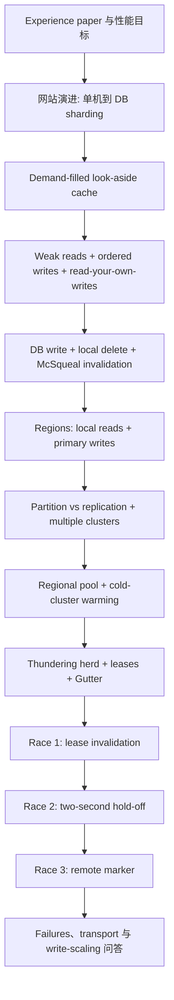

- 课程：MIT 6.824 Distributed Systems (Spring 2021)
- Lecture：17
- 视频分段：`Part 18 - Lecture 17 - Cache Consistency - Memcached at Facebook`
- transcript records：`1646`
- transcript 精确范围：首条 `00:00:00.210-00:00:03.450`；末条 `01:44:13.380-01:44:14.100`
- 笔记显示范围：`00:00:00-01:44:14`
- 正式讲授结束：约 `01:26:03`；其后为延伸问答，仍完整覆盖到 transcript 末条
- 分段数：`11`
- 官方文字讲义：`l-memcached.txt`，共 `1` 个 text material page

## 学习目标

完成本讲后，应能：

1. 沿老师的网站演进顺序解释 single machine、stateless frontends、database sharding 与 cache layer 分别解决哪个瓶颈。
2. 说明 cache 在 Facebook 架构中的首要 operational role 是保护 DB、支撑总体 throughput，而不只是降低 user-visible latency。
3. 画出 demand-filled look-aside cache 的 read/write path，并区分 writer local invalidation 与 McSqueal async invalidation。
4. 准确描述本讲 consistency contract：DB orders writes、reads 可短暂 stale、writer 应 read its own writes，同时不能出现没有时间上界的 stale value。
5. 比较 partition 与 replication 对 capacity、hot keys、RAM、connections 和 network bisection bandwidth 的影响。
6. 解释 multiple clusters、regional pool、cold-cluster warming、leases、Gutter 与 remote marker 各自解决的性能或一致性问题。
7. 从事件时序推导三个 races：ordinary stale set、cold-cluster stale fill、secondary-region read-your-own-writes failure，并说出各自修复。
8. 区分课堂明确机制、官方讲义对论文的补充、reading-question 推测和老师在课后明确标注的 speculation。
9. 解释 UDP/TCP、mcrouter、batching 与 many-to-many connection state 的工程取舍，同时不把讲义补充误写成课堂口述。
10. 用本讲结论说明 performance optimization 为什么会增加数据路径，继而制造新的 consistency/failure corner cases。

## 先修知识

- key/value operations、hash table、cache hit/miss 与 database transaction 的基本概念；
- sharding/partition 与 replication 的区别；
- primary/backup、asynchronous log replication 与 linearizability/eventual consistency 的直觉；
- 知道 two-phase commit 可协调 cross-shard transaction 即可，本讲不展开其协议；
- 知道 consistent hashing 用 key 选择 server 即可，本讲不讲 ring、virtual nodes 或重映射证明；
- Lecture 9 ZooKeeper 与 Lecture 14 Spanner 只用于 consistency/性能类比，不要求在本讲重新推导。

## 材料、链接与证据边界

- [课程 MATERIALS 索引](/courses/mit-6824-s21/materials/)
- [官方课堂讲义](/assets/courses/mit-6824-s21/lectures/018/materials/l-memcached.txt)
- [指定论文：Scaling Memcache at Facebook (NSDI 2013)](/assets/courses/mit-6824-s21/materials/official-materials/papers/memcache-fb.pdf)
- [论文 FAQ](/assets/courses/mit-6824-s21/materials/official-materials/faqs/memcache-faq.txt)
- [Paper Question](/assets/courses/mit-6824-s21/materials/official-materials/questions/17-q-memcached.html)
- [英文 transcript](/assets/courses/mit-6824-s21/lectures/018/transcript.txt)
- [结构化 transcript](/assets/courses/mit-6824-s21/lectures/018/transcript.jsonl)
- [MIT 官方视频](https://youtu.be/eYZg0YJtFEE)
- [课程归档视频 Part 18](https://www.bilibili.com/video/BV16f4y1z7kn/?p=18)

本讲 preparation 为 `transcript+slides`：`1646` transcript records、`11` sections、`1` 页官方文字讲义。课堂 chronology 由 reviewed English transcript 决定；`l-memcached.txt p.1` 用于核验提纲和补充 paper facts。论文、FAQ 与 Question 是独立学习资源，不按页混入课堂时间线。老师明确说 paper 没精确回答 Gutter invalidation question，因此相关原因只能标作课堂推测。

## 教学主线



老师的组织顺序刻意先 performance、后 consistency。cache 的 stale-data 问题不是孤立附录，而是 performance path 的直接产物：regions 增加异步副本，clusters 增加 cache copies，cold warming 增加 warm-to-cold copy path，Gutter 增加 failure fallback path，application-controlled refill 又让旧 DB result 可能跨过 invalidation。三个 race 正是在这些路径上逐一出现。

## 架构与控制路径

### Demand-filled look-aside

```text
read(k):
    v = memcache.get(k)
    if v is nil:
        rows = DB.select(...)
        v = application_transform(rows)
        memcache.set(k, v)
    return v

write(k, new_state):
    primary_DB.transaction(new_state)
    local_memcache.delete(k)
    # McSqueal later invalidates other possible cache copies
```

cache 是 look-aside，因为 application 显式选择何时查 cache、何时查 DB、怎样把 records 转换为 cached value。它是 demand-filled，因为只有实际 miss 的 key 才被计算和填入。DB 是 authoritative storage；memcached entry 可以 eviction 或重建，也可能是 HTML、多个 rows 的聚合等 derived value。

### Region、cluster 与 pools

- **Region**：完整 data-center deployment，包含 frontends、多个 memcache clusters 和 sharded DB replica。课堂架构中 west 为 primary region，east 为 secondary。
- **Cluster**：region 内一组 frontends 和一整套 sharded memcached servers。users 被分配到 clusters；clusters 的 cache contents 独立 demand-fill，不做正式 cache-to-cache replication。
- **Regional pool**：多个 clusters 共享，长期存 less-popular objects，避免冷门数据在每个 cluster 重复占 RAM。
- **Gutter pool**：少量 fallback memcached machines，仅在 ordinary server failure 到 repair/replacement 的过渡期吸收 active working set。

### Consistency contract

1. primary DB transactions 为 writes 建立 order；
2. ordinary reads 不保证 latest write，可短暂落后；
3. staleness 应有实际短界，不能因 stale set 长期卡住旧值；
4. writer 紧接着读取应看到自己的 write；
5. failure 和 cross-region async replication 会让上述目标需要 lease、hold-off、remote marker 等补丁。

## 关键机制与性能/一致性取舍

| 机制 | 直接目标 | 收益 | 代价或新风险 |
| --- | --- | --- | --- |
| DB sharding | database parallelism | aggregate throughput/capacity | cross-shard query/transaction 困难 |
| look-aside cache | offload reads | memcached 高吞吐，保护 DB | DB/cache 可失同步；client refill races |
| invalidation 而非 update | 避免乱序 cache writes | 使用 off-the-shelf DB/cache API | miss 后要重新查询和计算 |
| multiple regions | local read latency、完整副本 | users 读附近 cache/DB | writes 去 primary；async replication 扩大 staleness window |
| partition memcache | distinct-data capacity | memory-efficient parallelism | hot key 仍受单 server 限制，client fan-out |
| replicate clusters | hot-key throughput、较小 network domain | popular key 多 copies，减少每 client server set | 重复占 RAM，更多 invalidation targets |
| regional pool | 冷门对象去重 | 释放 per-cluster RAM | application 要决定 popularity/placement |
| warm-to-cold lazy copy | 新 cluster 上线保护 DB | 把 cold misses 转移给 warm cache | 引入 Race 2 stale fill |
| lease | thundering-herd suppression | 一个 client refresh DB | token lifecycle 增加状态 |
| lease invalidation | Race 1 consistency | delete 后拒绝迟到 stale set | cache 必须检查 fill permission |
| two-second hold-off | Race 2 consistency | cold delete 后拒绝 warm 旧值 | 依赖传播时间假设，只适合 warm-up |
| Gutter | cache-server failure protection | failure working set 只首次查 DB | 小 pool 不接 ordinary invalidation，可能短暂 stale |
| remote marker | secondary writer RYOW | stale secondary miss 改读 primary | remote read latency、额外 metadata/path |

## 三个 race 的统一复盘

### Race 1：ordinary stale set

```text
C1 get(k) miss + lease L; C1 reads DB -> v1
C2 writes DB -> v2; C2 delete(k) -> invalidates L
C1 set(k, v1, L) -> rejected
```

没有 lease invalidation 时，C1 的旧 `v1` 会在唯一一次 delete 之后重新进入 cache，直到 eviction 或下次 write 才可能消失。

### Race 2：cold cluster stale fill

```text
C1 writes DB -> v2; cold.delete(k)
C2 cold.get(k) miss
C2 warm.get(k) -> stale v1
C2 cold.set(k, v1) -> rejected by two-second hold-off
```

这里旧数据不是直接来自 DB，而来自为保护 DB 而增加的 warm cluster copy path。hold-off 是工程时间窗，不是形式化复制完成证明。

### Race 3：secondary-region writer miss

```text
C1 in secondary: primary_DB.write(k, v2) completes
C1 local delete + mark remote
C1 local get(k) -> remote -> read primary -> v2
secondary DB catches up -> clear remote marker
```

若没有 remote marker，local cache miss 会读尚未追上 primary 的 secondary DB，使 writer 看不到自己的 write。

## 论文与讲义补充事实

本节与课堂时间线分开。以下内容来自官方讲义对指定论文的归纳，其中有些未被老师在对应 transcript 中完整讲出；它们不能冒充课堂口述或现场演示。

1. **论文没有具体列出 cache object schema。** 讲义只给出可能例子，如 `userID -> friend list`、`postID -> text`、`URL -> likes`，并强调 cached values 常由 DB queries 派生。这些例子是讲义推测，不是论文确认的数据模型 `[讲义：l-memcached.txt p.1]`。
2. **讲义的容量算例。** 若 ordinary miss rate 为 `1%`，新 cold second cluster 分走一半 operations，DB miss load 可从约 `1%` 升到约 `50%`，即约 `50x` spike。课堂 transcript 只口述 half users 导致约 50% misses，没有口述 `1%` 基线。
3. **mcrouter。** 官方讲义指出 many clients × many memcached servers 会形成近似 `n^2` connection state；mcrouter 可减少直接连接数，并把多个 requests 批进 packet，降低 per-packet interrupt/overhead。课堂主体未展开 mcrouter，所以这里只作为 paper/lecture-note fact。
4. **UDP/TCP 分工。** 讲义归纳 client `get()` 可用 UDP 减少 connection state，`set()` 使用 TCP 以获得可靠有序交付。课后问答只讨论一般 transport tradeoff，没有完整确认每个 implementation detail。
5. **DB push-values alternative。** 讲义提出“由 DB 向 cache 推新值”的替代，并列出三项障碍：DB 通常不会计算 application-derived cache value；会增加 read-your-own-writes delay；DB 不知道哪些 keys 被缓存，可能推送大量无用 values。讲义以 PNUTS 作为 primary-updates-all-copies 的另一种路线。
6. **Gutter Question 的答案边界。** 讲义与课堂都把 doubled delete traffic、small Gutter overload 作为猜测；老师明确说 paper 没精确回答。因此本文不把该解释写成论文证明的设计理由。
7. **延伸 reference。** 官方讲义末尾提供 [CacheLib OSDI 2020 paper](https://cs.cmu.edu/~beckmann/publications/papers/2020.osdi.cachelib.pdf)，用于继续研究 cache infrastructure；它不是本讲指定论文，也未进入课堂 chronology。

## 易错点与重点回听

- **“cache 主要是为了更低 latency”**：老师反复强调系统若没有 cache，DB 会被巨大 read load 压垮；首要意义是 throughput survival。[需回听 00:14:50] [需回听 00:52:47]
- **“eventual consistency 等于可以永久 stale”**：应用容忍短暂落后，但 Race 1/2 的旧值可能没有时间上界，因此必须修复。[需回听 00:17:43] [需回听 01:15:20]
- **“writer 直接把新 value 写 cache”**：durable write 去 DB，writer local action 是 delete；直接 update 会有 out-of-order stale overwrite。[需回听 00:28:53] [需回听 00:29:50]
- **“McSqueal 与 writer delete 重复无用”**：writer delete 服务 local read-your-own-writes，McSqueal 服务其他 possible cache replicas。[需回听 00:32:38] [需回听 01:27:53]
- **“partition 与 replication 都增加同一种 capacity”**：partition 增加 distinct key capacity；replication 增加 hot-key service copies，却重复占 RAM。[需回听 00:42:48] [需回听 00:45:20]
- **“cluster 越大越好”**：更大 cluster 增加 connection state、fan-out、incast 与 network bisection demand，且不解决单 hot key。[需回听 00:46:06] [需回听 00:48:57]
- **“regional pool 与 Gutter 是同一类备用 cache”**：前者长期保存冷门 objects；后者只在 server failure 期间临时保护 DB。[需回听 00:50:36] [需回听 01:01:05]
- **“lease 只解决 thundering herd”**：它还通过 delete-invalidates-lease 拒绝 Race 1 的 stale set。[需回听 00:57:29] [需回听 01:13:45]
- **“two-second hold-off 是强保证”**：它依赖传播通常在两秒内完成，只用于 cold warm-up。[需回听 01:19:52]
- **“remote marker 保存新值”**：它只改变 miss routing，让 secondary client 暂时读 primary。[需回听 01:23:08]
- **“Gutter lease corner case 已被课堂解决”**：老师明确说不知道，只作推测。[需回听 01:33:46] [需回听 01:34:20]
- **“all writes 的未来 scaling 已由论文给出”**：按 shards 分配 regional primaries 是老师的 speculation。[需回听 01:40:34]
- **“Spanner 精确 TPS 是 100 或 10”**：该数字来自即席含糊回忆，不能当 paper fact。[需回听 01:41:40]

## 整讲掌握检查 Q&A

1. **问：为什么加入 cache，而不继续细分 DB？**  
   **答：** 继续 sharding 增加 cross-shard transaction/query 难度；read-heavy workload 可由简单内存 cache 承担，使 DB 主要处理 writes，同时避免 DB 成为每秒十亿级请求瓶颈。
2. **问：look-aside 与 transparent cache 的关键差异是什么？**  
   **答：** application 显式查 cache、查 DB、计算并填 value；cache 不理解 DB schema，也不自动位于 DB path 中。
3. **问：为什么采用 invalidation 而不是 update cache？**  
   **答：** 多 client sets 可与 DB write order 不同，旧 set 能覆盖新 set。版本化 update 需要修改 DB/cache；delete 使用现成 transaction log 与 memcached API 更简单。
4. **问：本讲 consistency contract 有多强？**  
   **答：** 不要求 linearizable reads；DB orders writes，reads 可短暂 stale，但希望 writer read its own writes，且避免没有上界的 stale values。
5. **问：为什么一个 frontend 会访问许多 memcached servers？**  
   **答：** keys 在 cluster 内 sharded，一个 page 需要几十到几百个 keys；frontend 必须按 key hash 并行 fan-out。
6. **问：multiple clusters 为什么同时帮助 hot keys 和 network？**  
   **答：** popular key 可在每 cluster 各有一份，clients 分散读取；每 frontend 只面对本 cluster 的 server set，降低 connections、incast 和 bisection bandwidth domain。
7. **问：regional pool 怎样修复 replication 的 RAM 缺点？**  
   **答：** application 把 less-popular objects 放入 region-shared pool，不在每个 cluster 复制，从而给 hot objects 留更多 RAM。
8. **问：新 cluster 为什么从 warm cluster copy，而不直接查 DB？**  
   **答：** cold cluster 初始 miss rate 极高，直接回源会压垮 DB；现有 cache 更能承受额外 load。
9. **问：lease 怎样同时服务 performance 与 consistency？**  
   **答：** 它只让一个 miss client refresh DB，抑制 thundering herd；writer delete 又会撤销 lease，使迟到的旧 fill 被拒绝。
10. **问：Gutter 怎样保护 DB，又牺牲了什么？**  
    **答：** ordinary server failure 后，active key 只在第一次 Gutter miss 时查询 DB，随后命中 Gutter；小 pool 不接持续 invalidation，可能容忍短暂 stale，原因是课堂推测而非 paper 明答。
11. **问：三个 races 的旧数据分别来自哪里？**  
    **答：** Race 1 来自 client 先前读到的 DB value；Race 2 来自尚未更新的 warm cluster；Race 3 来自尚未追上 primary 的 secondary DB。
12. **问：三个 fixes 分别是什么？**  
    **答：** delete invalidates lease；cold delete 后 two-second hold-off；secondary local delete 设置 remote marker 并临时读 primary。
13. **问：为什么 clusters 之间无需正式 cache replication？**  
    **答：** DB 是 authoritative storage；各 cluster 独立 demand-fill，DB/McSqueal 的 invalidations 使 copies 最终失效，而不是把 cache value 相互复制。
14. **问：课堂如何评价 UDP 与 TCP？**  
    **答：** TCP 给 reliability/ordering 但 many connections 有 state overhead；UDP 减少连接压力但需应用承担丢失、乱序或补充 transport logic。
15. **问：本讲最一般的系统设计教训是什么？**  
    **答：** cache 是 throughput 生存机制；partition 与 replication 要灵活组合；互不知情的 storage layers 很难补一致性，每增加一条性能/failure path 都应重新检查 ordering races。

## 掌握标准

不看笔记时能完成以下任务，才算掌握本讲：

1. 在 90 秒内复述网站从单机到 memcache 的四步演进及每步下一个 bottleneck。
2. 画出 look-aside read hit、miss/refill、write/local delete、McSqueal async delete 四条路径。
3. 用自己的例子说明为什么 cached value 可能是 application-derived，而不是 DB row 原样复制。
4. 对比 partition、cluster replication、regional pool，并分别说明 capacity、hot-key throughput 与 RAM tradeoff。
5. 从 many-key page request 推导 parallel fan-out、incast 与较小 cluster 的网络收益。
6. 计算 cold second cluster 为什么会造成大 miss spike，并解释 warm-to-cold copy 为什么保护 DB。
7. 逐事件画出 thundering herd 与 lease suppression。
8. 不看图写出 Race 1/2/3 的完整时序，明确旧 value 的来源、越过的 invalidation 和 fix。
9. 区分 region、cluster、regional pool、Gutter，不混淆生命周期与 authoritative source。
10. 给每个课后 corner case标注“课堂明确”“老师推测”或“老师未知”，不把 speculation 写成 protocol guarantee。

## 建议复习顺序

1. 先读第 1-3 段，画网站 evolution 与 look-aside read/write path。
2. 连读第 4-5 段，先证明 update scheme race，再做 partition/replication 对照表。
3. 精读第 6-7 段，用“如何保护 DB”统一 regional pool、cold warming、lease 与 Gutter。
4. 连续复习第 8-9 段，亲手画三条 race timelines，不只背 fix 名称。
5. 读第 10-11 段时给每句话标证据强度，特别注意 Gutter leases、replacement remapping、regional primaries 与 Spanner TPS。
6. 最后回到“论文与讲义补充事实”，补 mcrouter、UDP/TCP、batching 与 DB-push alternative，并保持它们与课堂 chronology 分离。

## 逐段详细课堂笔记

<div id="section-01" class="course-note-section-anchor" aria-hidden="true">&nbsp;</div>

# 第 1 段：论文定位与网站从单机走向 sharding

- 时间：`00:00:00-00:09:50`
- 证据：Lecture 17 transcript
- 材料模式：transcript-only；本段不引用讲义内容

## 本段在整讲中的作用

本段先解释为什么课程要读 Facebook 2013 年的 Memcache 论文，再从普通网站的扩展过程建立性能问题。老师把论文定位为 experience paper：重点不是发明全新的算法，而是展示如何用 MySQL、memcached 等 off-the-shelf components 支撑每秒十亿级请求。整讲将先谈 performance，再谈由性能设计引出的 consistency 问题（`00:00:19-00:03:35`）。

随后老师沿网站架构的实际演进讲到前三步：单机、多个 stateless frontends 共享一个数据库、数据库 sharding。这个顺序为下一段“为什么不能只继续切数据库，而要加 cache”建立前提。

## 教学展开

1. **先给论文定性。** Memcache 架构仍被大型网站广泛采用；这篇论文报告的是实践经验，而不是以新概念为主要贡献（`00:00:00-00:00:45`）。
2. **提炼三个阅读角度。** 第一，用标准开源组件组合出极高吞吐；第二，系统始终在 performance 与 consistency 之间取舍；第三，在一开始没有把 consistency 作为强目标后，后续补加一致性措施并不容易（`00:00:51-00:03:06`）。
3. **说明应用不追求 linearizability。** Facebook 的 news feed、新闻等内容落后几秒通常不影响人类用户，因此系统由 performance 驱动，只增加应用真正需要的 consistency；这比此前课程中的 external consistency 或 linearizability 弱（`00:01:31-00:02:44`）。
4. **交代授课顺序。** 老师明确先讲 performance，因为它决定架构；后半再分析 consistency（`00:03:28-00:03:35`）。
5. **网站演进第 1 步：单机。** 一台机器运行 Apache 一类 web server、PHP/Python application framework 和 MySQL。数据库提供 persistent storage、transactions、SQL query 与 crash recovery；小规模网站用这一结构足够（`00:03:50-00:05:32`）。
6. **网站演进第 2 步：扩 frontend。** 用户增加后，application computation 先吃满 CPU。因为持久状态都在数据库，web frontend 可以保持 stateless，于是增加 frontend machines 即可分摊计算（`00:05:41-00:07:19`）。
7. **解释 stateless 的收益。** 任一 frontend 可接任意请求；frontend crash 不涉及数据恢复；所有 frontend 都从同一数据库看到最新写入，因此这一步没有额外 cache-consistency 问题（`00:07:08-00:07:43`）。
8. **识别下一个瓶颈。** 老师以简单 MySQL setup 约每秒十万次简单读、数千次写作为数量级示意；再加 frontend 已无助于数据库瓶颈（`00:07:55-00:08:24`）。
9. **网站演进第 3 步：sharding。** 数据库表/行按 key range 分到多台机器，frontend 根据 key 选择 shard。这样可获得 database parallelism，本段在这里结束（`00:08:27-00:09:46`）。

## 概念、符号与推导

### Experience paper

课堂定义强调“报告真实系统的建设与运行经验”，而非以新算法为中心。评价它时既可以质疑具体 design choices，也必须解释其实际规模和成功（`00:00:19-00:03:15`）。

### 一致性目标

- **Linearizability / external consistency**：老师用作此前强一致系统的对照；本段不重新形式化定义。
- **允许短暂 staleness**：读到稍旧的 news feed 可接受。
- **不能由此推出毫无 consistency contract**：后续仍要满足有限陈旧和 read-your-own-writes 等应用需求。

### 扩展链条

`single machine -> stateless frontend replication -> database sharding`

- 第一步把 web、application、DB 放在一机；
- 第二步复制无状态计算层，状态仍集中在 DB；
- 第三步按 key partition 数据，让多个 DB shards 并行服务。

本段无公式推导。`100,000 reads/s` 与“数千 writes/s”是老师用于说明单机 MySQL 数量级的口述估计，不是性能上界或论文测量结论。

## 例子与课堂提示

- **news feed 落后几秒（`00:02:25-00:02:44`）**：服务于“应用语义决定 consistency 强度”；不能把用户容忍短暂陈旧误写成系统保证任意陈旧。
- **Apache + PHP/Python + MySQL（`00:04:19-00:05:20`）**：展示 off-the-shelf website 起点，并说明 DB 同时承担状态、query、transactions 与 recovery。
- **增加 stateless frontends（`00:06:24-00:07:43`）**：展示易扩展的计算层；收益来自状态未随 frontend 复制。
- **按 `1-40`、`40-70`、`70-100` 分 shard（`00:09:08-00:09:42`）**：说明 frontend 必须由 key 路由到正确数据库。
- **易错点：sharding 不是 replication。** 本段把 key ranges 分开以增加并行吞吐，没有说每个 shard 都保存全量副本。

## 本段掌握检查

1. **问：老师为什么把这篇论文称为 experience paper？**  
   **答：** 它主要报告用标准组件构建并扩展真实超大规模系统的经验，而不是以提出新算法为主要目标（`00:00:19-00:00:45`）。
2. **问：performance 与 consistency 在本讲中是什么关系？**  
   **答：** performance 是设计驱动力；系统不追求 linearizability，但必须补上应用可用所需的一致性措施，而这些措施并不容易（`00:01:31-00:03:35`）。
3. **问：为什么 frontend 可以直接横向扩展？**  
   **答：** frontend 无持久状态，所有状态和 concurrency control 都在共享数据库中；机器故障后无需恢复 frontend data（`00:06:24-00:07:43`）。
4. **问：数据库 sharding 怎样带来吞吐？**  
   **答：** 不同 key ranges 位于不同数据库，frontend 按 key 路由，使不同 shards 能并行处理请求（`00:08:27-00:09:46`）。
5. **问：本段是否声称 Facebook 的读可以永久陈旧？**  
   **答：** 没有。老师只说应用可容忍短暂陈旧，并预告后面仍需讨论 consistency（`00:02:25-00:03:06`）。

## 待核对项

- [需回听 00:00:13] 字幕缺失网站主语；不据此补写具体公司或产品。
- [需回听 00:00:45] “a billion”与“multiple billion requests per second”是课堂口述数量级；若用于论文精确指标，应回到论文表格核验。
- [需回听 00:02:56] 字幕语法破碎；课堂明确意思是后补 consistency measures 困难，不扩写未说出的事故细节。
- [需回听 00:08:03] MySQL 吞吐为教师估算示例，不作为通用 benchmark。
- 复习顺序：论文定位 -> 应用 consistency 需求 -> 单机 -> stateless frontends -> DB sharding。

<div id="section-02" class="course-note-section-anchor" aria-hidden="true">&nbsp;</div>

# 第 2 段：从 database sharding 到 demand-filled cache

- 时间：`00:09:56-00:19:54`
- 证据：Lecture 17 transcript；官方讲义 `[讲义：l-memcached.txt p.1]`
- 材料模式：transcript+lecture note

## 本段在整讲中的作用

本段接着上一段的 database sharding，先说明 sharding 的吞吐收益与 cross-shard 代价，再引出第四步架构：用 cache 承担 read-heavy workload，让数据库主要处理 writes。老师随即把 cache 的双重角色说清楚：它既提供高吞吐，也必须保护数据库不被 misses 或 cache failure 压垮。最后定义 Facebook 所需的弱 consistency 边界，为下一段 read-your-own-writes、look-aside 与 invalidation 铺路。

## 教学展开

1. **收束 sharding 的收益。** 请求分散到不同 shards 后，总吞吐可近似来自每机吞吐乘以机器数，前提是负载确实分散（`00:09:56-00:10:14`）。
2. **指出 sharding 的结构性代价。** 跨 shard transaction 需要把相关 keys 共置，或采用 two-phase commit；继续细切会增加 cross-shard 操作的概率（`00:10:18-00:11:13`）。
3. **改变扩展方向。** 与其让数据库继续承担所有 reads，不如把 reads offload 到 cache，让 DB 更集中于 writes（`00:11:13-00:11:38`）。
4. **建立 cache layer。** 系统仍有许多 frontends 与 sharded storage，旁边增加多个 cache servers。单个进程称为 `memcached` daemon，整个集合称为 `memcache`（`00:12:00-00:12:53`）。
5. **讲 demand-filled read path。** frontend 先读 cache；hit 直接返回，miss 才读 storage，然后把结果放入 cache。writes 直接去 storage（`00:12:58-00:13:26`）。
6. **解释为什么有效。** Facebook workload 以读 posts、timelines、pictures、news 为主；memcached 本质上是简单的 in-memory hash table，因此单机可提供远高于数据库的操作吞吐（`00:13:36-00:14:44`）。
7. **提出两个主要挑战。** 一是 DB 与 cache 可能不一致；二是 cache failures/misses 可能把十亿级请求压力转移给无法承受的 DB（`00:14:50-00:16:12`）。因此 cache 不只是降低 user-visible latency，更是数据库的 load shield。
8. **用问答回看 stateless frontend。** frontend 没有要复制的持久数据，任何一个 failure 都不需要 state repair；一旦加入 cache，系统才开始拥有数据库之外的数据副本与 consistency 问题（`00:16:40-00:17:41`）。
9. **定义目标 consistency。** 系统不追求 linearizability。数据库为 writes 提供一致 total order；reads 可以短暂落后，Facebook 的页面、friend lists、status 等允许一两秒甚至数百毫秒的延迟可见（`00:17:43-00:19:49`）。
10. **留下一个例外。** 老师在段末指出这一弱保证有一个重要例外；具体是 read-your-own-writes，下一段开头才完整说明（`00:19:39-00:19:54`）。

## 概念、符号与推导

### Demand-filled look-aside 的基本读路径

讲义把课堂路径写为：

```text
v = get(k)
if v is nil:
    v = fetch_from_DB(k)
    set(k, v)
return v
```

这里是 **demand-filled**：只有实际访问且 miss 的 key 才从 DB 拉取并进入 cache。`memcache` 不自动拦截 DB 请求，application 负责这条路径；其完整 look-aside 含义在下一段展开 `[讲义：l-memcached.txt p.1]`。

### Consistency contract 的课堂边界

- writes：由 DB transaction path 排序；
- reads：不保证读到 latest write；
- 允许：短暂 staleness；
- 不允许据此推断：无限期 staleness；
- 例外目标：writer 应读到自己的 write，下一段详述。

### 粗略容量推理

老师用“单 DB 约十万简单 reads/s”对比“系统要达到十亿级 operations/s”，说明单靠 DB 不可能吸收全部读流量。讲义将二者概括为约 `10,000x` 的数量级差距，并列出 memcached 约百万级 get/put 每秒的示意 `[讲义：l-memcached.txt p.1]`。这些是课堂/讲义的容量直觉，不是本段推导出的严格性能公式。

## 例子与课堂提示

- **cross-shard transaction（`00:10:18-00:10:48`）**：服务于“不能无限细分 DB”的论点；2PC 是可能方案，不代表 Facebook 此处一定对所有请求使用它。
- **posts、timelines、pictures、news（`00:13:47-00:14:05`）**：说明 read-heavy application 为何适合 cache。
- **Lab 3 hash table 类比（`00:14:23-00:14:44`）**：说明 memcached server 的核心可以很简单；老师只补充可能需要 locks/concurrency，并未把它等同于 Lab 3 的完整 semantics。
- **cache failure 冲击 DB（`00:15:36-00:16:12`）**：揭示 cache 的首要 operational role 是保护数据库，而不只是减少 latency。
- **profile picture 延迟一两秒（`00:19:13-00:19:36`）**：说明人类用户容忍短暂陈旧；“一两秒”是应用直觉，不是所有 key 的硬 SLA。

## 本段掌握检查

1. **问：为什么不能只继续把数据库切成更多 shards？**  
   **答：** shards 越细，相关数据跨 shard 的机会越大，transaction/query 可能需要共置设计或 2PC（`00:10:18-00:11:13`）。
2. **问：demand-filled cache 的 miss path 是什么？**  
   **答：** frontend 先 `get(k)`；miss 后读 DB，再把处理后的值 `set(k,v)` 到 cache（`00:12:58-00:13:26`；`[讲义：l-memcached.txt p.1]`）。
3. **问：cache 在本系统中的两个主要角色是什么？**  
   **答：** 用内存服务 read-heavy workload 以获得高吞吐，并屏蔽 DB、避免巨大读负载直接落到 storage（`00:13:36-00:16:12`）。
4. **问：加入 cache 后新增的两个挑战是什么？**  
   **答：** DB/cache consistency，以及 miss/failure 时 DB overload（`00:14:50-00:16:12`）。
5. **问：Facebook 的 read consistency 目标与 write ordering 如何不同？**  
   **答：** writes 由 DB 排成一致顺序；reads 可短暂落后，不要求 linearizability，但后续还有 read-your-own-writes 例外（`00:17:43-00:19:54`）。

## 待核对项

- [需回听 00:09:56] 字幕称“most request ... two different shards”语义不稳；本笔记只保留明确的 shard parallelism，不断言多数请求必跨两个 shards。
- [需回听 00:14:36] cache 内锁与 concurrency 的字幕缺词，不补写具体锁策略。
- [需回听 00:17:50] `eventual consistency` 被老师称为 vague term；不要把本段口述提升为形式化模型定义。
- **讲义/课堂边界：** 讲义列出具体百万级 memcached 吞吐与 cache 约快 DB 十倍；课堂本段只明确“dirt simple”与十亿级总负载。精确数字属于讲义提纲/论文阅读背景，不冒充本段口述测量。
- 复习顺序：sharding 代价 -> offload reads -> cache 双重角色 -> weak reads / ordered writes -> read-your-own-writes 悬念。

<div id="section-03" class="course-note-section-anchor" aria-hidden="true">&nbsp;</div>

# 第 3 段：read-your-own-writes、look-aside 与双重 invalidation

- 时间：`00:19:54-00:29:47`
- 证据：Lecture 17 transcript
- 材料模式：transcript-only；Figure 2 仅按老师口述记录

## 本段在整讲中的作用

本段补完上一段留下的 consistency 例外：尽管一般读可短暂陈旧，writer 紧接着读取同一 key 时应看到自己的更新，即 read-your-own-writes。老师随后把 Facebook 的 demand-filled look-aside cache 读写路径完整画出，并解释为何采用 invalidation 而不是由 cache/DB 透明协作。段末学生提出“写完为何不直接 set 新值”，由此开启下一段对 update scheme 乱序风险的分析。

## 教学展开

1. **补上 consistency 目标。** client 更新 `k` 后立即再读 `k`，最好观察到自己的 write；这一保证仍比课程前面的强一致模型弱，老师把它类比为有些像 ZooKeeper 风格的 client contract（`00:19:54-00:20:40`）。
2. **选择 cache invalidation。** frontend write 首先进入 MySQL；旁边的 Squeal/McSqueal 观察 transaction log，发现 key 被修改后向相应 cache 发 `delete(k)`（`00:20:48-00:22:20`）。
3. **依靠下一次 read refill。** 被删除后，后续 `get(k)` miss；client 重新从 DB 读数据，再把结果放回 cache（`00:22:20-00:22:44`）。这就是 demand-filled invalidation/refill 循环。
4. **解释 look-aside。** cache 不位于 DB 的透明数据路径中，也不知道 DB schema。application 读 DB 后可以把 record 转为 HTML，或聚合多个 records，再把派生值写入 cache（`00:22:48-00:24:07`）。因此 cache 中的 value 不一定等于某条 DB row 的字节拷贝。
5. **按 Figure 2 走 read path。** web server 一次可能请求 20 到 100 个 keys，并行联系多个 memcached servers；命中的值直接使用，nil keys 触发 SQL `SELECT`，application 处理结果后再 `set`（`00:24:15-00:26:19`）。
6. **按 Figure 2 走 write path。** application 把 post/picture 等 update 作为普通 DB transaction 同步提交（`00:26:22-00:27:31`）。
7. **区分两条 invalidation path。** Squeal 从 transaction log 异步传播 invalidation；writer 不等它完成，而是在 DB transaction 成功后立即删除自己 local cache 中的 `k`（`00:26:50-00:27:50`）。
8. **说明 local delete 的唯一直接目的。** writer 随后 `get(k)` 时 local cache miss，只能重新读 DB，因此实现 read-your-own-writes。对其他 clients，稍后到达的 Squeal invalidation 已足够（`00:27:50-00:28:48`）。
9. **提出 update-vs-delete 问题。** 学生问为何不在 delete 后立即 `set` 新值。老师称之为 update scheme，并指出它需要 DB、cache、client 协作；具体 race 延续到下一段（`00:28:53-00:29:47`）。

## 概念、符号与推导

### Read-your-own-writes

课堂所需的 client-scoped contract：

```text
C1: write_DB(k, v2) completes
C1: delete_local_cache(k)
C1: get(k) -> miss -> read_DB(k) -> v2
```

关键前提是 DB write 同步完成后才执行 local `delete(k)`。跨 region 时 local DB replica 可能仍旧陈旧，这一前提会失效；老师在后续 Race 3 用 remote marker 处理。

### Demand-filled look-aside cache

```text
read(k):
    v = cache.get(k)
    if v is nil:
        rows = DB.select(...)
        v = application_transform(rows)
        cache.set(k, v)
    return v

write(k, new_state):
    DB.transaction(new_state)
    cache.delete(k)          # writer's local cluster
    # Squeal later invalidates other possible cached copies
```

- **look-aside**：application 显式访问 cache 与 DB；cache 不透明代理 DB。
- **demand-filled**：miss 才计算并填入 value。
- **invalidation**：write 删除旧 cache entry，而不是把新 value 推给所有 cache。

本段没有数学公式推导；以上是对老师口述控制流的结构化记录。

## 例子与课堂提示

- **HTML/聚合结果（`00:23:07-00:23:48`）**：说明 application 为什么必须控制 cache value；DB/Squeal 通常只知道 records 被改动，不一定能生成缓存的派生对象。
- **一次取 20–100 keys（`00:24:47-00:25:36`）**：说明请求 fan-out；后面会由此产生许多 connections 与 incast congestion。
- **添加 post 或 picture（`00:26:22-00:26:50`）**：服务于 write path 说明；真正持久状态始终先写 DB。
- **双重 invalidation（`00:27:19-00:28:48`）**：local client delete 追求 read-your-own-writes，Squeal delete 负责其他 cache copies；二者作用范围和时间不同。
- **易错点：cache 不是 authoritative storage。** 真实数据在 DB，cache miss 可以重建；不能把 `set(k,v)` 当作持久 write。

## 本段掌握检查

1. **问：read-your-own-writes 在本讲中具体要求什么？**  
   **答：** client 更新 `k` 并成功返回后，紧接着读同一 `k` 应看到该更新（`00:19:54-00:20:28`）。
2. **问：为什么称为 look-aside cache？**  
   **答：** application 分别控制 cache 与 DB，miss 时自行查询、转换并填充；cache 不透明地夹在二者之间（`00:22:48-00:24:07`）。
3. **问：read hit、read miss、write 的路径分别是什么？**  
   **答：** hit 从 cache 返回；miss 从 DB `SELECT`、处理后 `set`；write 同步更新 DB，再 local `delete`，并由 Squeal 异步 invalidation（`00:24:15-00:28:48`）。
4. **问：writer 为什么还要主动 delete，不能只等 Squeal？**  
   **答：** Squeal 异步到达；local delete 让 writer 的下一次读立即 miss 并回 DB，从而读到自己的 write（`00:27:19-00:28:48`）。
5. **问：为什么 DB 不能简单把 row 新值直接写进 cache？**  
   **答：** 本段已说明 cache value 常由 application 转换或聚合而来；完整的 update-scheme 代价和 race 在下一段继续（`00:22:48-00:24:07`）。

## 待核对项

- [需回听 00:20:36] 与 ZooKeeper contract 的类比只是一句口头提示，不应据此声称两者提供相同 consistency model。
- [需回听 00:21:40] 字幕写作 `squeal`；官方讲义和论文语境为 `McSqueal`。正文首次并列写作 Squeal/McSqueal，避免把字幕拼写当成独立组件。
- [需回听 00:27:19] 字幕一度像是 writer 等待 invalidation，但后文明确说明 Squeal 异步、writer 不等待；本笔记采用完整上下文。
- [需回听 00:29:36] update-scheme race 在分段边界中断，需与第 4 段开头连续复习。
- 复习顺序：read-your-own-writes -> McSqueal invalidation -> look-aside read -> write/local delete -> update-scheme 悬念。

<div id="section-04" class="course-note-section-anchor" aria-hidden="true">&nbsp;</div>

# 第 4 段：为何 delete 优于 update，以及 region replication

- 时间：`00:29:50-00:39:49`
- 证据：Lecture 17 transcript
- 材料模式：transcript-only；板书与 region 图仅按老师口述记录

## 本段在整讲中的作用

本段先回答上一段“写后为何不直接 update cache”的问题：多个 client 的 cache sets 可能乱序到达，使旧值覆盖新值并长期驻留。老师据此解释 Facebook 选择 invalidation，是为了用现成 MySQL 与 memcached 的标准接口避开跨层 ordering protocol。随后他从单 cluster 扩展到完整 data center replicas（regions），说明跨 region replication 如何以更低 read latency 换取更大 staleness window，并把 local writer invalidation 与 McSqueal 的全局传播区分开。

## 教学展开

1. **构造 update-scheme 反例。** 初始 cache 中 `k=0`。C1 把 `k=1` 写入 DB 后延迟；C2 随后把 `k=2` 写入 DB，并先 `set(k,2)` 到 cache；C1 的迟到 `set(k,1)` 又覆盖了 2（`00:29:50-00:30:46`）。
2. **指出严重性。** cache 此时长期保存 stale `k=1`，之后所有 `get(k)` 都可能看到旧值，直到另一操作把它删除或替换（`00:30:44-00:31:08`）。这不是仅持续几毫秒的允许 staleness。
3. **讨论可行但未采用的修复。** DB 可以给 updates 分配 timestamps/sequence numbers，memcached 拒绝 out-of-order update；但这要求修改 MySQL 并让 DB/cache 协同（`00:31:10-00:31:37`）。
4. **解释 invalidation 的工程选择。** McSqueal 只需旁路读取标准 transaction log，并调用 memcached 已支持的 `delete`；这符合 off-the-shelf components 目标（`00:31:37-00:32:05`）。
5. **预告 leases。** 类似 stale-value race 还会发生在 reader refill 与 writer invalidation 之间；后面可只在 memcached 内利用 token/lease 拒绝 stale set，无需改 DB（`00:32:09-00:32:35`）。
6. **回答为何仍需 McSqueal。** writer 只删除 local cache，但 cache data 将存在多个 replicas；McSqueal 必须把 invalidation 传播到所有可能缓存该 key 的副本（`00:32:38-00:33:19`）。
7. **进入 Facebook-specific architecture。** 论文写作时至少有 west/east 两个 data centers，称为 regions；每个 region 都有 frontends、memcache layer 与 sharded databases（`00:33:25-00:35:31`）。
8. **建立 primary/backup write path。** west 是 primary，east 是 backup/secondary。无论 client 位于哪里，writes 都去 primary DB；primary transaction log 异步复制到 secondary DB，并触发相应 cache invalidations（`00:35:31-00:36:52`）。
9. **解释 region replication 的性能目的。** east-coast users 可以从附近的 east frontend、memcache 或 DB replica 读，获得较低 RTT 与 local-read latency；代价是 log replication 与 invalidation 异步，east data/cache 更可能短暂落后（`00:37:01-00:38:09`）。
10. **用问答澄清 local invalidation。** east client 完成 primary write 后仍立即删除 east local cache，以支持自己的下一次读；非本地 copies 则依赖 McSqueal（`00:38:15-00:38:57`）。
11. **引出 fan-out。** key 在 memcached servers 间 sharded；一个 page 需要很多 keys，因此一个 frontend 会并行访问许多 servers。下一段继续说明 key routing 与性能后果（`00:39:00-00:39:49`）。

## 概念、符号与推导

### Out-of-order update race

```text
DB/cache 初始值：k = 0
C1: DB.write(k, 1) -------- delayed cache set --------> cache.set(k, 1)
C2:        DB.write(k, 2) -> cache.set(k, 2)
结果：C1 的迟到 set 覆盖新值，cache 最终为 k = 1
```

即使 DB 正确地把 writes 排成 `1 -> 2`，独立 cache update path 也可能按 `2 -> 1` 到达。若要采用 update scheme，必须把 DB order 携带到 cache，并让 cache 检查版本。Facebook 此处改用 `delete(k)`，让下次 read 从 DB refill。

### Region 数据路径

```text
secondary-region client write
    -> primary-region DB transaction
    -> async log replication -> secondary DB
    -> McSqueal invalidations -> possible cache copies

writer after commit
    -> delete(k) in local cluster
```

本段无数学公式推导；核心是比较两条独立异步路径的 ordering 与 latency。

## 例子与课堂提示

- **`k=0 -> 1 -> 2` 反例（`00:29:50-00:31:08`）**：证明“写后顺手 set”并不天然正确；DB ordering 不能自动约束 cache message order。
- **timestamp/sequence number（`00:31:10-00:31:37`）**：说明 update scheme 不是理论上不可行，而是会破坏“不改现成组件”的工程目标。
- **McSqueal 旁路 transaction log（`00:31:47-00:32:05`）**：以简单集成换取 invalidation，而非跨层 value replication。
- **west/east regions（`00:34:04-00:38:09`）**：replication 改善 geographically local reads，但异步传播扩大 stale-read 风险。
- **易错点：east DB 不是 cache。** 它是完整 secondary database replica；memcache 是另一层 demand-filled 副本。

## 本段掌握检查

1. **问：直接 update cache 为什么可能留下永久 stale value？**  
   **答：** DB writes 有序，但不同 clients 的 cache sets 可乱序；旧 write 的迟到 set 能覆盖新 value，之后没有对应 delete 清除它（`00:29:50-00:31:08`）。
2. **问：sequence numbers 能怎样修复，代价是什么？**  
   **答：** DB 给 updates 编号，cache 拒绝旧编号；代价是 DB/cache 协作和 MySQL modifications（`00:31:10-00:31:37`）。
3. **问：writer local delete 与 McSqueal invalidation 分别负责什么？**  
   **答：** local delete 尽快支持 writer 的 read-your-own-writes；McSqueal 从 DB log 向所有可能 replicas 传播 invalidation（`00:32:38-00:33:19`；`00:38:15-00:38:57`）。
4. **问：regions 为什么提升 read performance？**  
   **答：** users 可读地理上接近的 local cache/DB replica，降低 RTT；writes 仍去 primary（`00:35:31-00:38:09`）。
5. **问：region replication 引入什么 consistency 代价？**  
   **答：** DB log 和 invalidations 异步传播，secondary region 可能短暂落后（`00:37:48-00:38:09`）。

## 待核对项

- [需回听 00:30:12] 板书中 `x`/`k` 混用；本笔记统一用 `k` 表示 cache key，不改变 race 顺序。
- [需回听 00:32:43] 字幕仍写 `squeal`；对应组件按官方语境记为 McSqueal。
- [需回听 00:36:38] 老师把 log transfer/apply 与 invalidation 均联系到 Squeal，具体 process decomposition 应以论文 Figure 6 为准。
- [需回听 00:38:32] 学生问答有省略；明确结论是 secondary-region writer 在 local cache 做 delete。
- 复习顺序：update race -> versioned update 的代价 -> invalidation -> regions -> local read/primary write。

<div id="section-05" class="course-note-section-anchor" aria-hidden="true">&nbsp;</div>

# 第 5 段：consistent hashing、partition 与 cluster replication

- 时间：`00:39:50-00:49:46`
- 证据：Lecture 17 transcript
- 材料模式：transcript-only

## 本段在整讲中的作用

本段承接“一个 frontend 会访问很多 memcached servers”，先明确同一 key 通常由 consistent hashing 路由到同一 server，再澄清 write、replication 与 invalidation 的同步性。随后老师退一步总结获得性能的两种基本办法：partition keys 与 replicate data/clients，并解释 Facebook 为什么不能只把单个 memcache cluster 越做越大，而要在一个 region 内复制多个完整 clusters。段末把 many-key parallel fetch 与 incast congestion 连起来。

## 教学展开

1. **澄清 key routing。** frontend 很可能会访问 cluster 中每个 memcached，但给定 key 总是按 consistent hashing 选择相应 server；server failure/reconfiguration 时映射才可能变化（`00:39:50-00:40:19`）。
2. **暂存 failure consistency 问题。** 学生指出 server failure 后转到别处可能破坏 read-your-own-writes；老师说后面会逐一讨论这些 races（`00:40:26-00:40:52`）。
3. **澄清 write 时序。** client 同步完成 primary DB write，之后删除 local cache；异步的是跨 region DB replication 和 McSqueal invalidation，不是 primary write 本身（`00:41:02-00:42:10`）。
4. **识别 secondary-read race。** secondary-region client 写 primary、删 local cache、马上读 local secondary DB 时，replica 可能尚未更新。老师再次把修复留到后面的 consistency 部分（`00:42:13-00:42:42`）。
5. **抽象两种扩展策略。** partition/shard 把 keys 分给不同 machines；replication 把同一 data 放到多个 machines，并把 clients/load 分散过去（`00:42:48-00:45:14`）。
6. **分析 partition。** 优点是增加 aggregate memory capacity 和 independent parallel access；缺点是一个 extremely hot key 仍只落在一个 server，无法靠增加其他 shards 分担（`00:43:10-00:44:45`）。
7. **分析 replication。** hot key 在多个 replicas 上可并行服务；但相同 data 多存几份，不会按机器数增加 distinct cached data capacity（`00:44:46-00:45:58`）。
8. **解释单个 cluster 继续变大的限制。** 更多 memcached servers 意味着每个 frontend 连接更多 servers；TCP connection state 增加，hot-key bottleneck 仍在（`00:46:06-00:47:17`）。
9. **引入 region 内多个 clusters。** 每个 cluster 是一套 frontends 加一套完整 memcache shards；users/load-balanced requests 被分到不同 clusters，因此热门 key 可在每个 cluster 各有一份（`00:47:17-00:48:39`）。
10. **连接到 incast。** 单 request 可能并行取几十到几百、甚至课堂举例 500 个 keys；大量 replies 同时抵达 frontend，使 switch/NIC queues 溢出并丢包。限制 cluster 大小、减少单 frontend 对话 servers 数量，可以降低 incast（`00:48:39-00:49:46`）。

## 概念、符号与推导

### Partition 与 replication

| 策略 | 分配对象 | 主要收益 | 主要代价 |
| --- | --- | --- | --- |
| partition | keys 分散到 servers | distinct-data capacity、parallelism | hot key 仍受单 server 限制；client fan-out |
| replication | 同一 cached data 存多份，clients 分散 | hot-key throughput、较少 client/server fan-out | 重复占 RAM，不等量增加 distinct capacity |

### Consistent hashing

课堂只使用其路由性质：`server = hash(k)`，同一配置下给定 `k` 去同一 memcached；server set 变化时部分 key mapping 会改变（`00:40:00-00:40:19`）。本段没有讲 consistent-hashing ring、virtual nodes 或重映射比例，不能自行补入。

### Incast 因果链

`one page -> many keys -> parallel requests -> synchronized replies -> queue/buffer overflow -> packet loss`

并行 fetch 是为了避免串行 latency；它同时把网络瓶颈集中到 requesting frontend。多个较小 clusters 让每个 frontend 只需面对本 cluster 的 memcached set。

本段无数学公式推导。

## 例子与课堂提示

- **热门人物 timeline（`00:43:59-00:44:40`）**：说明 key popularity skew；加 unrelated shards 不会帮助保存 hot key 的那台 server。
- **west/east 两份 data（`00:45:27-00:45:58`）**：展示 replication 提升并行读服务，却没有翻倍 distinct cache capacity。
- **many open TCP connections（`00:46:34-00:47:17`）**：说明单 cluster 变大不仅是 memory 问题，也增加 per-frontend/per-server connection state。
- **20–500 key fan-out（`00:48:57-00:49:40`）**：服务于 incast 推导；具体 key 数随请求而变，不是固定协议常数。
- **易错点：cluster 不是一个 memcached daemon。** cluster 是完整 memcache server set 及其 clients 的部署单元；给定 key 在 cluster 内仍由某一 shard 保存。

## 本段掌握检查

1. **问：给定 key 如何找到 memcached server？**  
   **答：** client 用 consistent hashing 选择 server；配置稳定时同一 key 去同一 server（`00:40:00-00:40:19`）。
2. **问：primary write、DB replication、cache invalidation 哪些同步？**  
   **答：** primary DB write 对 client 同步完成；跨 region replication 与 McSqueal invalidation 异步（`00:41:21-00:42:10`）。
3. **问：partition 为什么解决不了 hot key？**  
   **答：** hot key 仍只在一个 shard/server 上，增加其他 servers 只扩大 key-space capacity（`00:43:10-00:44:45`）。
4. **问：多个 clusters 如何帮助 popular keys？**  
   **答：** 每 cluster 可 demand-fill 一份该 key，users 分散到 clusters，使 reads 由多台 servers 承担（`00:47:17-00:48:39`）。
5. **问：incast 是怎样产生的？**  
   **答：** frontend 并行请求很多 key，许多 cache replies 同时回到同一接收端，可能填满网络/NIC queues 并丢包（`00:48:57-00:49:46`）。

## 待核对项

- [需回听 00:40:36] server failure 对 read-your-own-writes 的具体路径在第 10 段课后问答中只得到推测性回答，不能在本段提前下结论。
- [需回听 00:41:10] 学生把“read storage”与 cache path 混在一起；老师随后明确是 write DB、delete cache、下次 miss 再读 storage。
- [需回听 00:44:19] 字幕把 server 数量说得含混；论点只依赖“每 region/cluster 中 hot key 的 copies 有限”。
- [需回听 00:48:16] cluster 的图示包括 frontend 与 memcache layer；论文术语的严格定义应与 Section 4 对照。
- 复习顺序：consistent hashing -> write timing -> partition vs replication -> multiple clusters -> incast。

<div id="section-06" class="course-note-section-anchor" aria-hidden="true">&nbsp;</div>

# 第 6 段：regional pool、cold cluster 与 thundering herd

- 时间：`00:49:47-00:59:41`
- 证据：Lecture 17 transcript
- 材料模式：transcript-only

## 本段在整讲中的作用

本段继续评估 region 内多 cluster replication 的代价，并给出三个围绕“保护数据库”的性能机制。第一，用 regional pool 避免低热度 objects 在每个 cluster 浪费 RAM；第二，cold cluster 从 warm cluster lazy-copy，避免上线时把 misses 倾倒给 DB；第三，用 lease 把热门 key 失效后的 thundering herd 压缩为一个 DB refresher。老师同时明确，cold warming 与 lease 虽为 performance 服务，却会再引入 consistency races，后半讲将返回这些问题。

## 教学展开

1. **补完 network 收益。** 多个较小 clusters 降低 incast 与网络压力；网络只需在 cluster 内提供足够 bisection bandwidth，而不是支撑一个超大 uniform-access fabric（`00:49:47-00:50:16`）。
2. **指出 replication 的 RAM 浪费。** unpopular keys 在每个 cluster 各存一份，却没有足够请求来利用这些 copies（`00:50:17-00:50:36`）。
3. **引入 regional pool。** application 可把 less-popular keys 放入一个由多个 clusters 共享的 regional pool，而非每 cluster 复制。这样释放 cluster RAM 给更热门 objects（`00:50:36-00:52:06`）。
4. **澄清 cluster 与 capacity。** 每 cluster 有自己的 frontend/memcache，users 在 clusters 间 load balance。复制本身不增加 distinct-data capacity；regional pool 通过消除冷门项重复，间接腾出容量（`00:51:18-00:52:14`）。
5. **重申不无限增加 shards。** clusters 保持受控大小，避免增加每 client 的 shards/fan-out 与 incast；这是相对“单 cluster 不断长大”的选择（`00:52:14-00:52:40`）。
6. **把后续问题统一为 DB protection。** 系统对外支撑十亿级请求，但 sharded DB 仍无法承受 cache-scale traffic，因此任何上线、失效或故障流程都不能制造大规模 DB miss spike（`00:52:47-00:54:00`）。
7. **构造 cold-cluster 问题。** 新 cluster 初始 hit rate 为 0。若把一半 users 切过去，约 50% 请求将 miss 并打到 DB，足以让 storage fall over（`00:54:04-00:55:07`）。
8. **用 warm cluster 填充 cold cluster。** cold miss 先去 existing warm cluster；warm hit 的 value 被 set 到 cold cluster。这样增加旧 cache 的 load，而不是把数量级更大的压力交给 DB（`00:55:12-00:56:05`）。
9. **定义 thundering herd。** 单个 write/delete 使 popular key 消失；许多 frontends 同时 `get` 得到 nil，若全都 `SELECT` DB，就形成重复 load spike（`00:56:10-00:57:26`）。
10. **用 lease 限流。** 第一个 miss client 从 memcached 得到 lease，即 refresh permission；其他 miss clients 得到 retry response，等待几毫秒并带退避重试。通常第一个 client 已从 DB 取值并 `set`，后续 retry 命中（`00:57:29-00:59:05`）。
11. **指出 lease 的双重用途。** 此处 lease 解决 performance/thundering herd；稍后同一 token 还用于 consistency，拒绝 stale set（`00:59:18-00:59:41`）。

## 概念、符号与推导

### Regional pool

`popular objects -> replicated in per-cluster memcache`

`unpopular objects -> one region-shared pool`

由 application 决定对象放置。tradeoff 是少复制冷门数据以节省 RAM，同时保留热门数据的多副本吞吐。

### Cold-cluster warming

```text
cold.get(k) -> miss
warm.get(k) -> hit v
cold.set(k, v)
```

它是 lazy copy，不是一次性全量同步。老师的课堂例子是从 1 个 cluster 增至 2 个并迁移一半 users，导致 cold side 初始约 50% 总请求 miss。官方讲义另给“正常 miss rate 1% 时，相当于约 50x DB spike”的算例；本段 transcript 未口述 `1%`，因此该比例属于讲义/论文阅读事实，不混入课堂时间线。

### Lease-based request serialization

```text
first miss  -> lease -> read DB -> set(k, v, lease)
later misses -> retry-later -> backoff -> get(k) again
```

lease 不是长期分布式锁。此处它是 memcached 对单 key refresh 的短期 permission，使同一 miss wave 只有一个 client 读 DB。

本段无数学公式推导。

## 例子与课堂提示

- **unpopular key 多份闲置（`00:50:17-00:51:10`）**：说明 replication 与 memory efficiency 冲突，regional pool 是按 popularity 选择 partition/replication 的折中。
- **新 cluster 分走一半 users（`00:54:46-00:55:07`）**：直观展示 0% hit rate 如何变成 DB overload，而非普通 warm-up latency。
- **better cache load than DB load（`00:55:25-00:56:05`）**：现有 cluster 可以承受额外读取，比让 DB 承受 cold misses 更可控。
- **single delete, many misses（`00:56:48-00:57:26`）**：thundering herd 不需要“很多同时 writes”；一个热门 key invalidation 就足够触发。
- **lease 两个角色（`00:59:18-00:59:41`）**：performance role 与 consistency role 必须区分；第 8 段才讲后者。

## 本段掌握检查

1. **问：regional pool 为什么存在？**  
   **答：** 冷门 objects 无需在每 cluster 各存一份；共享 pool 减少 RAM duplication，腾出空间给热门 objects（`00:50:17-00:52:06`）。
2. **问：为什么 cold cluster 不能直接从 DB 自然 warm up？**  
   **答：** 初始所有 accesses 都 miss，大量请求会突然转向容量远低于 cache layer 的 DB（`00:54:04-00:55:07`）。
3. **问：cold cluster 实际怎样 warm up？**  
   **答：** local miss 后先读 existing warm cluster，命中值再 set 到 cold cluster；只有 warm 也 miss 才需要 DB（`00:55:12-00:56:05`）。
4. **问：thundering herd 怎样由一个 write 触发？**  
   **答：** popular key 被 delete 后，许多 clients 同时 miss；若都查 DB，就产生重复爆发流量（`00:56:48-00:57:26`）。
5. **问：lease 如何保护 DB？**  
   **答：** 只允许第一个 miss client refresh，其他 clients 延后重试并期望随后 cache hit（`00:57:29-00:59:05`）。

## 待核对项

- [需回听 00:49:56] 字幕写 `bi section bandwidth`，术语应为 `bisection bandwidth`。
- [需回听 00:50:25] 老师口述“stored in multiple regions”可能是口误；上下文在讨论一个 region 内的 multiple clusters，正文按上下文记为 per-cluster replication。
- [需回听 00:51:46] “capacity”在问答中先被否定、后被限定；准确结论是 replication 不增加 distinct capacity，regional pool 去重后可间接释放一些容量。
- [需回听 00:58:39] 字幕写 `binary backup`，语境应为某种 backoff；未确认具体算法，不写成 binary exponential backoff 的既定事实。
- **讲义/课堂边界：** 正常 miss rate `1%`、cold second cluster 导致约 `50x` DB spike 来自 `[讲义：l-memcached.txt p.1]`，不是本段口述数字。
- 复习顺序：regional pool -> DB protection -> cold warm-up -> thundering herd -> lease 双重角色。

<div id="section-07" class="course-note-section-anchor" aria-hidden="true">&nbsp;</div>

# 第 7 段：memcached failure、Gutter 与 reading question

- 时间：`00:59:46-01:09:45`
- 证据：Lecture 17 transcript
- 材料模式：transcript-only

## 本段在整讲中的作用

本段完成 performance 部分的最后一个主要 failure mechanism：单个或少量 memcached server failures 不能让所有 misses 直接落到 DB，也不能简单压到另一个正常 shard，因此 Facebook 准备一个小型 Gutter pool 作为短暂过渡缓存。老师随后把“为什么不向 Gutter 发 invalidation”作为当天 reading question；breakout 前后只给出推测性讨论，并明确论文没有精确回答。这一证据边界很重要：Gutter 的运行路径是课堂事实，不发 delete 的原因是课堂推断。

## 教学展开

1. **限定 failure scope。** 老师不讨论整个 data center 或全部 memcache 同时失败，而先考虑少量 memcached servers failure（`00:59:46-01:00:30`）。
2. **识别直接后果。** failed server 上的 keys 全部变成 misses；若 clients 直接查 DB，cache failure 会转化为 storage overload（`01:00:30-01:01:03`）。
3. **引入 Gutter pool。** 系统保留少量 memcached machines，专门在正常 server failure 后临时接流量；它不是 ordinary per-cluster pool，也不是存冷门 objects 的 regional pool（`01:01:05-01:01:30`）。
4. **走一次 failure miss path。** normal `get` 无响应/失败后，client 查 Gutter；首次 Gutter miss 仍需 `SELECT` DB，并把结果放入 Gutter；后续相同 key requests 就由 Gutter 回答（`01:01:33-01:02:05`）。
5. **强调过渡性质。** Gutter 只覆盖故障 server 被恢复或替换前的几分钟级窗口；repair/reconfiguration 完成后，load 回到正常 memcached（`01:01:21-01:02:18`）。
6. **提出 reading question。** Gutter 中不做 ordinary delete，McSqueal invalidation 也不发送到 Gutter。老师问这样设计的原因是什么（`01:02:24-01:02:44`）。
7. **进入 breakout。** 学生可讨论 Gutter invalidation 或论文其他部分；`01:02:57-01:09:03` 基本是 breakout 空档，没有技术讲授。
8. **恢复课堂并设定证据边界。** 老师明确说 paper 没有精确回答，邀请学生 speculate（`01:09:03-01:09:24`）。
9. **提出第一部分推测。** Gutter machines 很少；若所有 writes/deletes 都额外打到 Gutter，会给小 pool 很大压力（`01:09:28-01:09:45`）。完整推测在下一段继续。

## 概念、符号与推导

### Gutter failure path

```text
normal memcached.get(k) -> failure
Gutter.get(k) -> miss
DB.select(k) -> v
Gutter.set(k, v)
later requests -> Gutter hit
repair normal server -> route returns to normal pool
```

### Gutter 与 regional pool

| Pool | 触发条件 | 主要目的 | 生命周期/流量 |
| --- | --- | --- | --- |
| regional pool | application 判断 object 不热门 | 避免跨 clusters 重复缓存冷门 objects | 正常长期流量 |
| Gutter pool | normal memcached failure | 在 repair 期间吸收 failure misses、保护 DB | 临时 fallback 流量 |

### 负载推理

Gutter 不消除某 key 的第一次 DB read；它把“每个 client 都去 DB”变成“首次填充去 DB，随后从 Gutter 命中”。因此它是 failure-period demand-filled cache，而不是 DB replica。

本段无公式推导。

## 例子与课堂提示

- **少量 server failure（`01:00:09-01:00:30`）**：明确 Gutter 机制讨论的 failure model；不能据此声称它解决整 region outage。
- **首次 miss 后复用（`01:01:43-01:02:05`）**：说明小 pool 也能屏蔽 repeated DB reads，因为只缓存故障 shards 的活跃 working set。
- **几分钟 repair window（`01:01:21-01:02:18`）**：说明 Gutter 的容量规划基于短暂过渡，而不是替代完整 cluster。
- **reading question（`01:02:25-01:09:45`）**：训练从 performance tradeoff 推测设计原因；答案必须标为推测，因为 paper 未明确说明。
- **易错点：Gutter 不是将 key 永久重新分片。** 正常 server 恢复/替换后，流量回归正常 memcache。

## 本段掌握检查

1. **问：memcached server failure 为什么会威胁 DB？**  
   **答：** 该 server 的许多 cached keys 同时不可用，大量 client misses 可能直接变成 DB reads（`01:00:30-01:01:03`）。
2. **问：Gutter 怎样降低 failure 期间的 DB load？**  
   **答：** 第一次 Gutter miss 从 DB 填充，后续 requests 命中 Gutter，不再重复查询 DB（`01:01:33-01:02:05`）。
3. **问：Gutter 为什么只需小 pool？**  
   **答：** 它只处理少量 failures 的临时 active working set，并在 normal server repair/replacement 后退出路径（`01:01:05-01:02:18`）。
4. **问：Gutter 与 regional pool 的用途有何不同？**  
   **答：** regional pool 长期存低热度 objects 以节省 RAM；Gutter 仅在 normal cache failure 时作过渡 fallback。
5. **问：论文是否明确解释了为何不 invalidating Gutter？**  
   **答：** 老师明确说没有；课堂只推测小 pool 承受不了每次 write 带来的额外 invalidation（`01:09:13-01:09:45`）。

## 待核对项

- [需回听 01:00:09] 开头学生发言字幕破碎；老师随后明确把范围限定为 a handful of server failures。
- [需回听 01:01:33] repair 时长只被描述为 minutes or a little more，不应写成硬性恢复 SLA。
- [需回听 01:02:30] “do not do a delete from Gutter”是课堂陈述；其准确 protocol scope 应以论文 Section 4.4 为准。
- [需回听 01:09:42] 分段在学生推测中结束，必须连读第 8 段开头才得到完整 load/double-traffic 解释。
- 复习顺序：failure misses -> Gutter first-fill -> temporary repair bridge -> no-invalidation reading question -> 事实与推测边界。

<div id="section-08" class="course-note-section-anchor" aria-hidden="true">&nbsp;</div>

# 第 8 段：Gutter 取舍与 Race 1 stale set

- 时间：`01:09:46-01:19:31`
- 证据：Lecture 17 transcript
- 材料模式：transcript-only

## 本段在整讲中的作用

本段先完成 reading question 的课堂推测：若每次 write 都额外 invalidating 小型 Gutter，不但会把 delete traffic 近乎翻倍，还会把所有 key 的 invalidations 集中到少量机器。随后老师明确结束 performance 部分，转向由高性能设计引出的三个 consistency races。第一个是 ordinary cluster 中的 stale set：reader 从 DB 读到旧值后迟到 `set`，跨过 writer 已完成的 `delete`，使 stale value 长期留在 cache。修复复用 lease：delete 同时 invalidates lease，迟到 set 因 token 无效而被拒绝。段末开始构造 cold-cluster Race 2。

## 教学展开

1. **完成 Gutter 推测。** 若 Gutter 也接收每次 write 的 delete，write path 会多一次请求；Gutter machines 很少，所有 possible keys 的 invalidations 都集中到它（`01:09:46-01:10:20`）。
2. **强调这只是工程解释。** 老师用 “I think that's the reason” 收束：Gutter 仅用于 failed server 到 replacement server 的短暂过渡，不值得承担持续 delete traffic（`01:10:03-01:10:28`）。
3. **从 performance 转到 consistency。** 老师说论文还有更多 performance 内容，但课堂接下来分析三种由高性能路径产生的 races（`01:10:32-01:11:05`）。
4. **构造 Race 1 的第一步。** 普通 single region/cluster 中，C1 `get(k)` miss，获得 lease，并从 DB 读到旧值 `v1`，但尚未 `set`（`01:11:05-01:11:40`）。
5. **插入 concurrent write。** C2 把 DB 中 `k` 更新为 `v2`。老师先误画成 `put(k,v2)`，随后更正为真正协议：C2 在 DB write 后执行 `delete(k)`（`01:11:40-01:13:50`）。
6. **暴露 stale set。** 如果 C1 随后仍把此前读到的 `v1` 放入 cache，它会发生在 C2 delete 之后，导致 stale value 长期驻留，直到 key 下次再被写（`01:12:00-01:12:29`；更正后的完整顺序见 `01:13:45-01:14:34`）。
7. **复用 lease 修复。** C1 的 miss lease 随 `delete(k)` 被 invalidated；C1 后续 `put(k,v1,lease)` 携带无效 token，memcached 拒绝它（`01:12:43-01:14:34`）。
8. **连接 lease 的两个角色。** 同一机制此前将 thundering herd 限制为一个 refresher；现在又保证 refresh permission 没有跨过 newer write，从而解决 stale set（`01:14:42-01:14:58`）。
9. **澄清 consistency 违反。** 没有 lease invalidation 时，系统可能长时间甚至一直不显示 `v2`，超过“只允许短暂 staleness”的应用 contract（`01:15:01-01:16:03`）。老师承认“go back in time”未必是最准确措辞，核心是新值长期不可见。
10. **开始 Race 2。** cold cluster 中初始 `k=v1`；C1 写 DB 为新值并 delete cold cache；C2 cold miss 后从尚未更新的 warm cluster 读到 `v1`，再 `put(k,v1)` 回 cold cluster，重现永久 stale value（`01:16:03-01:18:07`）。
11. **留下修复问题。** 学生讨论两个 clients 是否位于不同 cold clusters；老师指出这不影响 race，本段结束时尚未给出 two-second hold-off（`01:18:07-01:19:31`）。

## 概念、符号与推导

### Race 1：stale set

```text
cache: k missing; DB: k = v1
C1: get(k) -> miss + lease L
C1: DB.read(k) -> v1
    C2: DB.write(k, v2)
    C2: cache.delete(k) -> invalidates L
C1: cache.set(k, v1, L) -> rejected
```

若最后一步不检查 lease，`v1` 会在 delete 之后重新进入 cache，且没有后续 invalidation 保证将它清除。lease 的 consistency 含义是把 fill permission 绑定到“自该 miss 后没有更晚 delete”的 cache state。

### Race 2 前半

```text
cold: k missing; warm: k = v1
C1: primary DB.write(k, v2); cold.delete(k)
C2: cold.get(k) -> miss
C2: warm.get(k) -> v1
C2: cold.set(k, v1)  # delete 后回填旧值
```

普通 lease 只观察 cold cache 的 delete/fill ordering；warm cluster 中旧 `v1` 的跨 cluster copy path 需要另一种 hold-off，下一段给出。

本段无数学公式推导。

## 例子与课堂提示

- **Gutter delete traffic（`01:09:46-01:10:28`）**：展示 performance 与 consistency 的明确取舍；少发 invalidation 保护小 pool，但 Gutter value 可能 stale。
- **老师现场纠正 `put` 为 `delete`（`01:13:23-01:13:50`）**：复习时必须使用实际 invalidation protocol，不能保留板书口误。
- **stale 不只是“稍旧”（`01:15:20-01:16:03`）**：Race 1 的问题是没有后续事件保证清除，可能无限期超出应用容忍窗口。
- **lease 双重用途（`01:14:42-01:14:58`）**：thundering herd 是 performance；stale-set rejection 是 consistency。
- **cold/warm 复制（`01:16:18-01:18:07`）**：说明保护 DB 的 warm-up optimization 新建了一条跨 cache 数据路径，因而制造新的 ordering race。

## 本段掌握检查

1. **问：课堂为什么推测 Gutter 不接收 invalidations？**  
   **答：** 它很小且只临时使用；每次 write 都多发 delete 会增加总 traffic，并把大量 invalidations 集中到少量 Gutter machines（`01:09:46-01:10:28`）。
2. **问：Race 1 的永久 stale value 怎样产生？**  
   **答：** C1 miss 后读到旧 `v1`；C2 写 `v2` 并 delete；C1 在 delete 之后迟到 set `v1`（`01:11:05-01:14:34`）。
3. **问：delete 怎样与 lease 配合修复 Race 1？**  
   **答：** delete invalidates C1 的 lease，memcached 在 C1 set 时检查 token 并拒绝 stale fill（`01:13:45-01:14:34`）。
4. **问：lease 的 performance 和 consistency 角色分别是什么？**  
   **答：** performance 上只准一个 miss client 查 DB；consistency 上让 newer delete 撤销旧 reader 的 fill permission（`01:14:42-01:14:58`）。
5. **问：Race 2 为什么由 cold warming 引入？**  
   **答：** cold miss 不直接读 DB，而从可能仍旧陈旧的 warm cluster 复制 value；该 set 可能发生在 cold delete 之后（`01:16:18-01:18:07`）。

## 待核对项

- [需回听 01:09:54] 学生提到“不 invalidating 也保护 DB”的一句语义不完整；课堂最终解释聚焦 Gutter load 和 doubled delete traffic。
- [需回听 01:11:50] 老师最初误说 C2 `put(k,v2)`，在 `01:13:23-01:13:50` 明确纠正为 `delete(k)`；正文采用纠正后的时序。
- [需回听 01:15:21] “go back in time”被老师自己修正为不够准确；准确 failure 是 `v2` 长期不被观察。
- [需回听 01:18:47] 两 clients 是否属于同一 cold cluster 对老师所画 race 不重要，不据此补写部署限制。
- 复习顺序：Gutter tradeoff -> performance/consistency 转场 -> Race 1 timeline -> lease invalidation -> Race 2 timeline。

<div id="section-09" class="course-note-section-anchor" aria-hidden="true">&nbsp;</div>

# 第 9 段：cold-cluster hold-off、remote marker 与课堂总结

- 时间：`01:19:52-01:29:51`
- 证据：Lecture 17 transcript
- 材料模式：transcript-only

## 本段在整讲中的作用

本段完成后两个 consistency races。Race 2 用 cold cluster 专用的 two-second hold-off 拒绝 delete 后过早到来的 sets，给 DB/invalidation path 时间让 warm source 更新；Race 3 用 remote marker 修复 secondary-region writer 的 read-your-own-writes：local miss 不能读尚未追上 primary 的 secondary DB，而要临时远程读 primary。老师随后正式总结本讲的 capacity、partition/replication 与 cache consistency 结论，并在课后问答中解释 remote marker 的用户可见动机和 invalidation scope。

## 教学展开

1. **给出 Race 2 修复。** cold cluster 对被 delete 的 key 设置 two-second hold-off；期间任何 `set(k,...)` 都被拒绝，所以从 warm cluster 拿回的旧 `v1` 无法在 delete 后重新进入 cold cache（`01:19:52-01:20:31`）。
2. **限制机制生命周期。** hold-off 只在 cluster warm-up 的数小时阶段使用；cluster warm 后停止。设计假设两秒足够 write/invalidation 传播，使 warm source 不再返回旧值（`01:20:32-01:21:05`）。
3. **构造 Race 3。** C1 位于 secondary/backup region，却把 `k=v2` 写到 primary DB；write 完成后 C1 删除 local cache。若它立即 `get(k)`，local miss 会去 secondary DB，但 async replication 尚未送达，所以只能读到 `v1`（`01:21:09-01:23:07`）。
4. **指出 contract 违反。** C1 是 writer，却在 write 返回后看不到自己的 `v2`；这直接违反 read-your-own-writes，而不只是允许的其他-client staleness（`01:22:27-01:23:07`）。
5. **引入 remote marker。** secondary-region local delete 不只让 key missing，还把它标记为 `remote`。随后 `get` 从 local memcache 得到 remote indication，client 改去 primary region 读（`01:23:08-01:23:55`）。
6. **清除 marker。** secondary DB 收到 primary update 后，系统可以移除 remote marker；此后 miss 再读 local secondary DB 已安全（`01:23:59-01:24:24`）。
7. **正式总结 capacity。** cache 对每秒十亿级 operations 至关重要；partition/sharding 提供 capacity 与 parallelism，replication 适合分担 hot keys（`01:24:28-01:25:15`）。
8. **正式总结 consistency。** 即使目标很弱，DB/cache 是互不知情的 layers，性能优化又增加数据路径，因此需要 leases、hold-off、remote marker 等近似 ad hoc techniques；这比表面看起来困难（`01:25:16-01:26:03`）。
9. **解释 remote marker 的产品需求。** 学生问为何不接受 stale read。老师用用户刚把内容加到 timeline、刷新后却看不到为例，说明 read-your-own-writes 是直接可见的 UX requirement（`01:26:22-01:27:20`）。
10. **澄清 invalidation scope。** writer 只 invalidates 自己 local region/cluster；McSqueal 负责非本地传播（`01:27:22-01:28:14`）。
11. **澄清 clusters。** region 内 server 属于某个 cluster，每个 cluster 是一份 cache replica；随后学生问论文中的 “existing ... infrastructure”，老师明确不知道其精确所指（`01:28:17-01:29:43`）。

## 概念、符号与推导

### Race 2 修复：two-second hold-off

```text
cold.delete(k) at time t
cold rejects set(k, *) during [t, t + 2 seconds]
```

这是时间假设，不是证明：两秒被认为足够让 relevant update/invalidation 传播到 warm side。它只用于 warm-up，避免把长期 write availability 都绑定到 fixed delay。

### Race 3：secondary-region stale read

```text
secondary client C1:
    primary_DB.write(k, v2) completes
    local_cache.delete_and_mark_remote(k)
    local_cache.get(k) -> remote
    read primary_DB -> v2

later:
    primary update reaches secondary_DB
    clear remote marker
    future misses may read secondary_DB
```

### 三个 races 的共同结构

1. 新 write 已在 authoritative primary DB 生效；
2. 某条独立 read/refill path 仍可获得旧 value；
3. 如果旧 value 在 invalidation 后重新进入 cache，或 writer 被引到 stale DB replica，应用 contract 被破坏；
4. fix 在具体 path 上增加 permission、delay 或 routing metadata。

本段无数学公式推导。

## 例子与课堂提示

- **two seconds（`01:19:52-01:21:05`）**：是工程 hold-off 与传播时间假设，不是 clock-synchronization protocol，也不保证所有故障下复制必在两秒完成。
- **timeline refresh（`01:26:48-01:27:14`）**：说明 read-your-own-writes 虽弱，却直接影响用户是否认为 write 丢失。
- **local writer delete vs McSqueal（`01:27:53-01:28:14`）**：再次区分快速 client-scoped guarantee 与 system-wide async invalidation。
- **paper phrase 无法解释（`01:29:02-01:29:43`）**：老师明确说不知道；笔记不应用外部猜测填补。
- **易错点：remote marker 不是 cached value `v2`。** 它是 routing metadata，告诉 miss path 暂时去 primary 取 authoritative value。

## 本段掌握检查

1. **问：two-second hold-off 怎样修复 cold-cluster race？**  
   **答：** cold delete 后两秒拒绝 sets，使从尚未更新的 warm cluster 取回的旧值不能跨过 delete 回填（`01:19:52-01:20:31`）。
2. **问：为什么 hold-off 只在 warm-up 使用？**  
   **答：** race 来自 cold miss 到 warm cluster 的临时 copy path；cluster warm 后不再需要该路径和额外拒绝窗口（`01:20:32-01:20:48`）。
3. **问：Race 3 怎样违反 read-your-own-writes？**  
   **答：** secondary client 的 write 已在 primary 完成，但 local cache miss 后读 secondary DB，replica 尚未收到 `v2`，所以 writer 看到 `v1`（`01:21:37-01:23:07`）。
4. **问：remote marker 如何修复？**  
   **答：** local cache 返回 remote indication，让 client 临时读 primary；secondary DB 追上后再清 marker（`01:23:08-01:24:24`）。
5. **问：老师最后怎样概括 partition 与 replication？**  
   **答：** partition/sharding 提供总 capacity 和 parallelism；replication 让 hot keys 在多 machines 上分担 reads（`01:24:28-01:25:15`）。

## 待核对项

- [需回听 01:20:53] 字幕说 write 传播到 “cold database”，上下文应是 relevant backup/warm-side data path；不据此发明名为 cold database 的组件。
- [需回听 01:22:35] 字幕把 write 描述为 “still on the way to ... primary”，但前文明确 primary write 已完成；实际未完成的是向 secondary 的 async propagation。
- [需回听 01:24:06] remote marker 的精确清除者/消息路径口述含糊；可靠边界是 secondary data 追上后可清除。
- [需回听 01:29:18] `existing marcher infrastructure` 转录不清，老师也说无法确认；不补写专有系统名。
- 复习顺序：Race 2 hold-off -> Race 3 timeline -> remote marker -> lecture summary -> UX motivation。

<div id="section-10" class="course-note-section-anchor" aria-hidden="true">&nbsp;</div>

# 第 10 段：课后 failure corner cases、UDP/TCP 与 cluster independence

- 时间：`01:29:51-01:39:49`
- 证据：Lecture 17 transcript
- 材料模式：transcript-only；本段是正式结课后的延伸问答

## 本段在整讲中的作用

老师已在上一段 `01:26:03` 正式结束主体讲授，本段属于课后延伸问答。学生追问 memcached failure 下的 read-your-own-writes、Gutter concurrent fills、UDP/TCP transport、cluster 之间是否存在正式 replication，以及这种架构是否只是不断叠加 layers。老师对能由架构直接回答的部分给出澄清，对 Gutter lease corner cases 明确表示 paper 未描述、自己只是在推测。该段因此主要训练如何划分已知 mechanism、reasonable hypothesis 与 unknown。

## 教学展开

1. **追问 failed memcached 后的 writer read。** 学生把路径说成 client “writes to memcached”，老师按实际架构回答：normal get 无响应后大概会去 Gutter；首次 Gutter miss 再读 DB，因此可能看到 completed write（`01:29:51-01:31:31`）。
2. **标注推测。** 老师使用 “I think / probably”；他还说 paper 没清楚解释 replacement machine 加入时的细节，只推测 consistent hashing 会重新移动 key assignments（`01:31:07-01:31:45`）。
3. **澄清 cluster failure routing。** clusters self-contained；某 cluster 的 memcached request failure 后，client 去 Gutter，而不是随意转到另一个 ordinary cluster（`01:31:52-01:32:17`）。
4. **讨论并发 Gutter fills。** 学生构造两个 clusters 同时 failure、先后从 DB 读不同版本并向 Gutter set 的 race。老师认为 lease 可能有帮助，并推测 replacement server 不认识旧 lease 时会拒绝 set（`01:32:21-01:34:18`）。
5. **明确未知。** 被问 Gutter 如何管理 leases，老师直接回答不知道；继续追问时也拒绝未经思考给出确定设计（`01:34:20-01:34:43`）。
6. **讨论 UDP get / TCP write。** 老师说工程上通常偏好 TCP 的 reliability 与 ordering，但大量 inbound/outbound connections 有 state overhead；遇到这一规模问题时，某些系统转向 UDP，甚至在 UDP 上自建 reliable transport（`01:34:49-01:36:11`）。
7. **用 QUIC 作课堂类比。** 学生提到 QUIC，老师认可它是“在 UDP 上实现更多 transport features”的例子；这不是说 Facebook memcache 使用 QUIC（`01:35:46-01:36:11`）。
8. **澄清 cluster independence。** region 内 multiple cache clusters 之间没有 formal cache-to-cache replication；它们共享同一个 authoritative storage，users 分配到 clusters，各 cluster 独立 demand-fill（`01:36:25-01:37:22`）。
9. **解释一致性来源。** writes 都通过 DB 排序，storage/McSqueal 向每 cluster 发 invalidations；leases 在 cluster 内控制 refill，而不是在 clusters 间复制 cache state（`01:37:22-01:37:58`）。
10. **评价“不断加 layer”的架构。** 老师认为 designers 采取 pragmatic approach：遇到真实 scaling problem 就解决，并以很少额外 mechanisms 配合 off-the-shelf components 达到极高性能（`01:38:03-01:39:14`）。
11. **指出研究空间。** 研究者也会重新设计 DB/cache integration，以减少 inconsistency；但老师说他所知替代方案还不能达到同样十亿级 operations/s（`01:39:14-01:39:49`）。

## 概念、符号与推导

### 证据强度分层

- **课堂明确：** clusters self-contained；writes 去 DB；cluster caches 不互相正式复制；DB path 发 invalidations。
- **老师推测：** failed normal server 后 writer 经 Gutter miss 读 DB，可能保持 read-your-own-writes；consistent hashing 参与 replacement remapping；leases 也许解决某些 Gutter races。
- **老师明确未知：** Gutter 内 lease management 的完整机制与构造出的 corner case。

### Transport tradeoff

| Transport | 课堂强调的收益 | 课堂强调的代价 |
| --- | --- | --- |
| TCP | reliability、ordering、成熟 transport features | many connections 需要较多 per-connection state |
| UDP | 减少 connection-state 压力，适合简单 request/response | 不自带可靠、有序交付，应用可能需补机制 |

本段没有介绍 mcrouter，也没有讲它的 batching/routing algorithm；这些只出现在官方讲义提纲，应在整讲 NOTES 的“论文/讲义补充事实”中单列，不能冒充本段口述。

本段无数学公式推导。

## 例子与课堂提示

- **failed server -> Gutter -> DB（`01:31:07-01:31:31`）**：是老师基于前述 design 的推测，不应写成 paper-guaranteed failure semantics。
- **replacement server 不认识 lease（`01:33:46-01:34:18`）**：用于解释旧 set 可能被拒绝，但老师随即说明自己在 speculate。
- **QUIC（`01:35:46-01:35:56`）**：只是 transport design 类比，不是 Memcache component。
- **cluster independence（`01:36:51-01:37:58`）**：cache copies 的内容可能不同；共同 DB ordering 与 invalidations 提供松散协调。
- **pragmatic layering（`01:38:49-01:39:45`）**：系统成功来自针对实际 bottleneck 的机制组合；代价是 DB/cache consistency 仍成为研究问题。

## 本段掌握检查

1. **问：本段对 failed-server read-your-own-writes 给出确定保证了吗？**  
   **答：** 没有。老师推测 client 经 Gutter miss 读 DB，但明确使用不确定措辞（`01:31:07-01:31:45`）。
2. **问：老师是否知道 Gutter 的完整 lease protocol？**  
   **答：** 不知道；他只说 leases 可能帮助某些 race，并明确拒绝把推测当答案（`01:33:46-01:34:43`）。
3. **问：为什么 reads 可能使用 UDP 而 writes/sets 更偏向 TCP？**  
   **答：** 大量 TCP connections 有 state overhead；UDP 减轻连接压力，但 reliable/ordered operations 更需要 TCP 或额外协议（`01:34:49-01:36:11`）。
4. **问：cache clusters 之间是否直接复制 entries？**  
   **答：** 不进行 formal cache-to-cache replication；clusters 独立 demand-fill，共享 DB write order 和 invalidations（`01:36:25-01:37:58`）。
5. **问：老师怎样评价这套 layered design？**  
   **答：** 它很 pragmatic，以少量机制和现成组件解决实际瓶颈并获得极高性能，但也留下跨层 consistency 研究问题（`01:38:49-01:39:45`）。

## 待核对项

- [需回听 01:30:49] 学生说 “writes to memcached” 与实际 write path 不符；真实 durable write 去 DB，memcached 接收的是 fill `set`。
- [需回听 01:31:37] replacement/remapping 细节 paper 未充分描述；consistent-hashing 解释是老师推测。
- [需回听 01:33:50] lease 对 Gutter concurrent-fill race 的作用未被确认，不能升级为正式解决方案。
- [需回听 01:35:56] UDP sequence numbers 等具体协议细节来自学生提问，老师没有完整确认 Facebook 实现。
- [需回听 01:39:35] “任何替代方案都达不到十亿 ops/s”是老师当时的经验判断，不是系统性 benchmark survey。
- 复习顺序：failure path 的已知/未知 -> Gutter race -> UDP/TCP tradeoff -> cluster independence -> pragmatic design。

<div id="section-11" class="course-note-section-anchor" aria-hidden="true">&nbsp;</div>

# 第 11 段：跨 region write scaling、Spanner 对比与 Race 1 复盘

- 时间：`01:39:51-01:44:14`
- 证据：Lecture 17 transcript
- 材料模式：transcript-only；本段是课后最后问答

## 本段在整讲中的作用

本段是课后问答的尾声，也是精确覆盖 transcript 终点的最后一段。学生先追问 all writes hitting primary 的扩展上限；老师把多 region primaries 按 user shards 分配作为可能方向，但反复标注为自己的推测，并用 Spanner 说明 consensus 可以提供更强协调、却有明显 write-throughput cost。最后另一位学生要求重讲 Race 1，老师再次强调真正的问题不是普通短暂陈旧，而是 `delete` 后旧 `v1` 被迟到 `put` 放回 cache，使所有后续 readers（甚至 writer C2）都持续读错。

## 教学展开

1. **确认层级结构。** 每个 region 内有多个 clusters；跨 region 是完整 infrastructure replicas，而 region 内 clusters 是面向不同 client groups 的 cache replicas（`01:39:51-01:40:18`）。
2. **提出 primary write bottleneck。** 学生问如果所有 writes 都命中一个 primary storage，应怎样继续 scale（`01:40:20-01:40:32`）。
3. **区分论文事实与推测。** 老师说 Facebook 还有其他关于 scalable write propagation 的论文；他猜测可按 users/shards 划分，让不同 regions 分别成为不同 shards 的 primary，但明确说 “I'm speculating here”（`01:40:34-01:41:24`）。
4. **讨论 consensus alternative。** 学生问 storage layers 间使用 consensus 是否合理；老师说可以，Spanner 就采用强协调思路（`01:41:28-01:41:39`）。
5. **指出 performance price。** 老师让学生回忆 Spanner 表格中的 transactions/s，课堂只得到模糊的约百级、write 可能更低的回忆；明确结论是 write transactions 相比 Memcache 的目标很慢（`01:41:40-01:42:04`）。
6. **重新构造 Race 1。** C1 已从 DB 读到旧 `v1` 但尚未填 cache；C2 把正确 DB value 更新为 `v2` 并 delete cache；C1 的迟到 `put(k,v1)` 插在 delete 之后（`01:42:12-01:43:43`）。
7. **强调“永久”含义。** cache 不是永久存储，所以老师给 permanent 加引号；但在没有下一次 write/delete 前，所有后续 `get(k)` 都返回 1 而非 2，staleness 没有短时间上界（`01:42:55-01:43:55`）。
8. **连接到 read-your-own-writes。** 连 C2 自己随后读取也会看到旧值，结果尤其反直觉（`01:43:55-01:44:00`）。
9. **以网站演进收尾。** 学生说开头的 architecture evolution 很有帮助；老师回应后课程结束，最后有声内容到 `01:44:13` 左右（`01:44:04-01:44:14`）。

## 概念、符号与推导

### Write scaling 的课堂状态

```text
论文课堂主架构：all writes -> one primary region -> async secondary replication

老师推测的进一步方向：
user/key shards -> different primary regions -> each region primary for a subset
```

第二条不是本论文已确认设计，也不是本讲给出的 protocol；它只是老师回答“下一步会怎么做”时的 design intuition。

### Consensus tradeoff

课堂对比只建立定性关系：

`stronger cross-storage coordination -> lower write throughput / higher cost`

老师提到 Spanner 作为可采用 consensus 的系统，但没有在本段可靠给出精确 benchmark。不能把字幕中的 `100` 或 `10` 直接写成经过核验的 Spanner 指标。

### Race 1 最终时序

```text
C1: miss + read DB -> v1
    C2: DB.write(k, v2)
    C2: cache.delete(k)
C1: cache.put(k, v1)   # late stale fill
all later get(k) -> v1, not v2
```

修复仍是第 8 段的 lease invalidation：C2 delete 撤销 C1 fill permission。

本段无数学公式推导。

## 例子与课堂提示

- **different regional primaries per shard（`01:40:59-01:41:24`）**：是老师的 architecture proposal，不是论文中已经实现的 mechanism。
- **Spanner（`01:41:28-01:42:04`）**：用于说明 consensus 与 strong storage semantics 可能付出 throughput 代价；精确数字不可从含糊回忆中引用。
- **`v1` wedged after delete（`01:42:42-01:43:47`）**：是 Race 1 最直观表述；迟到旧 fill 越过了唯一一次 invalidation。
- **C2 也读回旧值（`01:43:47-01:44:00`）**：同时破坏有限 staleness 直觉与 writer experience。
- **易错点：primary DB 本身仍保存 `v2`。** 错误在 cache refill ordering，不是 DB write ordering 失败。

## 本段掌握检查

1. **问：all-writes-to-primary 的下一步扩展方案在课堂中是事实吗？**  
   **答：** 不是。老师推测可按 user shards 让不同 regions 担任 primary，并明确标注为 speculation（`01:40:34-01:41:24`）。
2. **问：为什么提到 Spanner？**  
   **答：** 说明 storage replicas 间可以用 consensus 获得更强协调，但 write performance 会付出代价（`01:41:28-01:42:04`）。
3. **问：本段能否可靠引用 Spanner 的精确 TPS？**  
   **答：** 不能。师生都在回忆表格，数字含糊；只能保留定性性能对比。
4. **问：Race 1 中 DB 与 cache 最终分别是什么值？**  
   **答：** DB 已是正确的 `v2`，cache 却被 C1 的迟到 `put` 写回旧 `v1`（`01:42:32-01:43:47`）。
5. **问：为什么称为近似 permanent stale value？**  
   **答：** 没有后续 invalidation 保证清除 `v1`；在 key 再次被写或 eviction 前，所有 gets 都可能持续返回旧值（`01:43:07-01:43:55`）。

## 待核对项

- [需回听 01:40:50] 老师提到约 2015 年的另一个 Facebook system/paper，但字幕缺失名称；不补写论文名。
- [需回听 01:41:55] Spanner TPS 数字是课堂即席回忆且相互修正；不得作为精确 paper fact。
- [需回听 01:43:09] 字幕写 `permanent business`，上下文明确为带引号的 `permanent staleness`。
- **精确结束：** 本段覆盖提示给定 `01:39:51-01:44:14`；最后技术结论在 `01:44:00` 前完成，`01:44:04-01:44:13` 为学生反馈与告别，没有遗漏新的机制。
- 复习顺序：region hierarchy -> primary write bottleneck -> speculation/consensus tradeoff -> Race 1 replay -> exact end。
