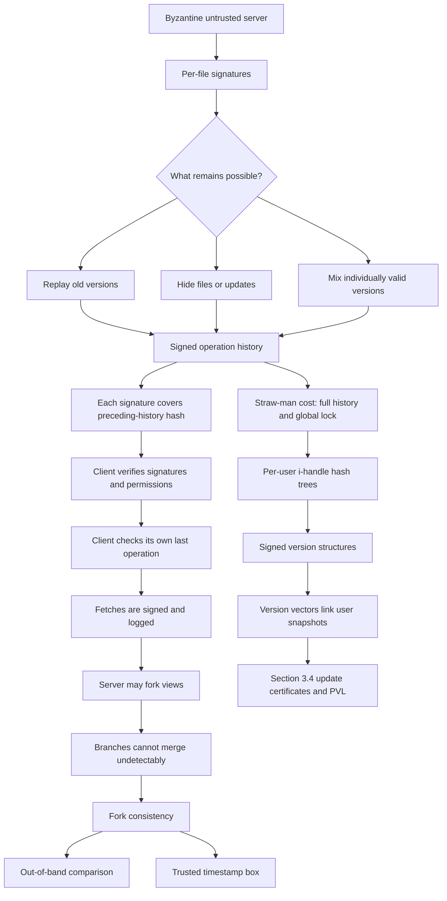

> **讲次身份与范围**：这是 **MIT 6.824 Spring 2021 官方 Lecture 18**，视频主体覆盖 [00:00:01-01:23:31]，课后 Q&A 延续到最后有声 transcript [01:30:58]。课堂从 decentralized systems 与 Byzantine server 出发，经 Zoobar 反例、逐文件签名失败、signed operation log、logged fetch、fork consistency 与 fork detection，最后用 per-user i-handle、hash tree 和 signed version structures 说明 SUNDR 如何压缩概念日志。
>
> **指定阅读边界**：官方 schedule 要求阅读 [SUNDR (2004)](/assets/courses/mit-6824-s21/materials/official-materials/papers/li-sundr.pdf) **until Section 3.4**。本笔记把 Section 3.1 straw-man、Section 3.2 fork consistency implications、Section 3.3 Serialized SUNDR 与 Section 3.4 Concurrent SUNDR 都纳入 reading guide；课堂没有逐步教授 3.4 的 update certificates/VSL/PVL 算法，因此相关内容明确标为 paper evidence，不冒充 transcript。Section 4 及之后不属于本讲 assigned reading range。
>
> **材料入口**：[课程 MATERIALS 的 Lecture 18 条目](/courses/mit-6824-s21/materials/#lecture-18-fork-consistency-sundr) · [Lecture 18 阅读输入](/assets/courses/mit-6824-s21/evidence/reading-inputs/lecture-18.md) · [SUNDR paper](/assets/courses/mit-6824-s21/materials/official-materials/papers/li-sundr.pdf) · [FAQ](/assets/courses/mit-6824-s21/materials/official-materials/faqs/sundr-faq.txt) · [Paper Question](/assets/courses/mit-6824-s21/materials/official-materials/questions/18-q-sundr.html) · [本讲共享课堂讲义](/assets/courses/mit-6824-s21/lectures/019/materials/l-sundr.txt) · [官方 schedule](/assets/courses/mit-6824-s21/materials/official-materials/course-pages/schedule.html)

## 学习目标

学完本讲后，应能：

1. 区分 crash-fault 与 Byzantine threat model，说明 untrusted server 能任意回复 RPC、隐藏/回放状态并与 compromised users 串通，但不能伪造 honest users 的 signatures。[00:00:18-00:09:08]
2. 用 Zoobar 的 `auth.py`/`bank.py` 例子解释：逐文件 authenticity 不等于 filesystem integrity；server 即使不改任何字节，也能通过 selective version presentation 制造危险组合。[00:14:03-00:27:19]
3. 按顺序复述 Section 3.1 straw-man client：下载 history、验证 latest signatures/permissions、确认 own last operation、重放 filesystem、执行 fetch/modify、追加并签名、上传 history。[00:27:19-00:42:38]
4. 推导为什么 signature 必须覆盖 preceding history，以及为什么 fetch/read 也必须进入 log；能重演“先旧 `auth.py`、后新 `bank.py`”的 stale-prefix attack。[00:29:56-01:08:09]
5. 准确定义 fork consistency：server 可从共同 prefix 制造多个一致 worlds，但 divergent signed histories 不能无痕 merge；能用 prefix comparison 与 trusted timestamp box 说明检测方法及歧义。[01:08:19-01:16:40]
6. 解释 i-handle、i-table、inode/data-block hashes、version vector 与 signed version structure 如何把全历史承诺压缩成 per-user snapshot commitments。[01:16:52-01:22:12]
7. 说清保证边界与性能权衡：SUNDR 聚焦 integrity，不保证 confidentiality/availability；fork 不能被纯协议阻止，只能留下不可抹除证据；straw-man 简单但昂贵，hash trees/version structures 更紧凑，concurrency 又引入 update certificates、PVL 与 conflict handling。[01:22:17-01:29:35]

## 需要的先修知识

- **来自此前课程的 consistency/failure model**：理解 linearizability、external consistency、crash failure 与 network partition；本讲解释为何完全 Byzantine server 下不能直接要求同样保证。
- **来自 Frangipani 的结构背景**：clients 通过共享 block storage 实现 network file system；SUNDR 沿用“client 实现文件系统、server 近似 block store”的形状，但不再信任 server。[00:05:53-00:10:34]
- **密码学最小前提**：digital signature 由 private key 生成、由 public key 验证；collision-resistant hash 把任意前缀或树状数据压缩成 commitment。课堂不讲 key distribution 的完整 PKI。
- **日志与 replay**：此前课程已用 operation log 推理 state 与 recovery；SUNDR 把相同抽象带入 Byzantine setting，并让 signature 承诺当前 entry 及其全部前缀。[00:27:19-00:28:38]
- **阅读顺序**：先从 [MATERIALS Lecture 18](/courses/mit-6824-s21/materials/#lecture-18-fork-consistency-sundr) 进入 paper、FAQ 与 Question；paper 只读到 Section 3.4。Section 3.4 是 reading guide 内容，不能把它与教师在最后几分钟讲的 Serialized SUNDR 直觉混成一段课堂推导。

## 老师的教学主线

1. [00:00:18-00:05:32] 从单一机构控制的协议转向 decentralized systems，建立 Byzantine participants 与 signing/hashing 的课程背景，并说明 SUNDR 的价值在技术思想而非广泛直接部署。
2. [00:05:53-00:13:49] 建立 untrusted network file server 场景，区分 confidentiality/integrity/availability，聚焦 source repository integrity 与 Debian compromise 的现实恢复成本。
3. [00:14:03-00:20:50] 构造 Zoobar：A 更新认证，B 接入 TechCash，C 部署；server 可注入任意代码，也可只隐藏 A 的改动，给出“每个文件都合法、组合却危险”的核心反例。
4. [00:20:52-00:27:19] 尝试 per-file signatures，依次发现 filename substitution、rollback/stale version、selective version、missing file 和 directory/permission integrity 问题，由失败推出需要全局 history。
5. [00:27:19-00:42:38] 构造 signed operation log；signature 覆盖 preceding-history hash，client 验证 signatures/owners、检查 own last entry、重放 state、追加 fetch/modify 并上传。方案易推理但无限增长且全局串行。
6. [00:42:07-01:08:09] 回答为什么 fetch 也要记录：不记 fetch 时，server 可先给旧 prefix、再给 full log，把早已完成的 A/B modifications 伪装成并发；记 fetch 后，own-last-entry 与 hash chain 迫使 server 形成永久独立 branch。
7. [01:08:19-01:16:40] 正式定义 fork consistency：server 能 fork、不能 merge。clients 可 out-of-band 比较 histories；互不为 prefix 即检测到 fork。trusted timestamp box 提供共同 branch 证据，但缺 update 仍可能是 failure、partition 或 attack。
8. [01:16:52-01:22:12] 优化完整日志：按 owner/user 划分 filesystem state，以 i-handle/hash tree 承诺每个 snapshot，再用 signed version structures 与 version vectors 把 users 的最新状态联系起来。
9. [01:22:17-01:29:35] 总结并在课后 Q&A 澄清 Merkle tree、running hash、4 KiB block 的局部 rehash、signing 成本，以及 version vectors 仍只提供 fork consistency。
10. [01:29:49-01:30:58] 以 Debian compromise 的冻结、backup comparison、合法性审计和 rollback 回扣现实动机，结束视频。

## 核心概念与依赖关系

- **Threat model 决定 guarantee 上限**：完全恶意 server 可以拒绝响应、隐藏某个 client 的操作或维护多个 worlds；cryptography 只能阻止伪造 honest-user authorization 与无痕改写已签 history，不能强迫 server 提供 availability 或最新 state。
- **逐文件 authenticity 到 history integrity**：签名 data/filename 能证明 writer 与对象身份，却不能证明 freshness、目录完整、跨文件一致性或 happened-before。signed history 把这些关系转化为不可篡改的 prefix commitment。
- **Modify 与 fetch 的共同作用**：modify 记录 state transition；fetch 记录 client 已观察哪个 prefix。若 fetch 不入 history，server 可在后续假装 updates 与 read 并发。
- **Hash chain 与 own-last-entry 互补**：hash-linked signatures 禁止在旧 history 中间插删；own-last-entry 禁止对同一 client 回滚。二者合起来不消灭 fork，而是让 fork 之后无法 merge。
- **Fork consistency 与检测**：每个 branch 内仍有一致 history；clients 一旦比较出 incompatible prefixes，或看到彼此后续 operations，就能检测 attack。检测不等于自动 resolution。
- **Snapshot optimization**：i-handle 是 per-principal i-table 的 hash-tree root，version structure 对 i-handle 与 version vector 签名。它把“我看见哪些 users 的哪些 versions”压缩成可比较 state，而不必每次重传全部 operation history。

## 关键推导、例子与结论边界

### 逐文件签名为何不够

最初草案是：

$$\operatorname{Sig}_{SK_A}(\text{filename},\text{data})$$

它能阻止 server 把任意 bytes 冒充 A 写出的 `auth.py`，却不能阻止 server 返回 A 过去签过的旧版本。于是以下两份各自合法的内容仍可被组合：

$$\texttt{auth.py}_{old}+\texttt{bank.py}_{new}.$$

该组合破坏了课堂建立的依赖：

$$\texttt{bank.py@TechCash}\Rightarrow\texttt{auth.py@MIT\ certificates}.$$

同理，单文件 signature 无法证明某个 filename 必须存在于 directory，也无法证明 server 没有漏掉 latest update。[00:20:52-00:27:19]

### Signed history 如何阻止 cherry-picking

把第 $i$ 条 record 抽象为：

$$e_i=(op_i,u_i,H(e_0\Vert\cdots\Vert e_{i-1}),\operatorname{Sig}_{SK_{u_i}}(op_i,H(prefix_{i-1}))).$$

若 B 的 `mod(bank.py)` 签名承诺 $H(prefix\Vert mod_A(auth.py))$，server 删除 A 而保留 B 时，client 计算出的 prefix hash 改变；除非伪造 B 的 signature 或制造 hash collision，否则 verification 失败。[00:29:56-00:35:44]

### 不记录 fetch 的 stale-prefix attack

真实 history 在 C 读取前已经是：

$$P\rightarrow mod_A(auth.py)\rightarrow mod_B(bank.py).$$

若 fetch 不入 log，server 可以分别返回：

$$fetch_C(auth.py)\Leftarrow P,$$

$$fetch_C(bank.py)\Leftarrow P,mod_A(auth.py),mod_B(bank.py).$$

两个 views 都是合法 prefix，C 却先安装旧 `auth.py`、后安装新 `bank.py`。由于第一次 read 没有 signed evidence，server 可把 A/B updates 伪装成发生在两次 reads 之间。[00:49:54-01:01:13]

### 记录 fetch 后为何只剩 fork

第一次 read 后，C 签下：

$$L_C=P\Vert fetch_C(auth.py).$$

以后 C 只接受包含该 last operation 的 history。server 不能再直接给原 update branch

$$L_{AB}=P\Vert mod_A(auth.py)\Vert mod_B(bank.py),$$

也不能把 $fetch_C$ 插入 A/B 之前，因为修改 preceding history 会使 A/B 原 signatures 失效。server 唯一剩余办法是让 $L_C$ 与 $L_{AB}$ 各自继续增长，形成不可合并的 forks。[01:03:32-01:12:54]

### Fork detection 的 prefix 判据

clients out-of-band 比较各自 histories $L_A,L_B$：

$$L_A\preceq L_B\ \lor\ L_B\preceq L_A$$

可能只是观察时间不同；若

$$L_A\npreceq L_B\ \land\ L_B\npreceq L_A,$$

则 histories incompatible，fork 已被检测。timestamp box 通过可信 key 每几秒写文件，让所有看见其 updates 的 clients 共享 branch evidence；看不到 update 仍无法区分 box/network failure、server suppression 与 fork。[01:13:38-01:15:56]

### i-handle 与 version structure

per-user snapshot 的 commitment chain 是：

$$h_u=H(\text{i-table root})\rightarrow H(\text{inode})\rightarrow H(\text{data block}).$$

Version structure 可简写为：

$$VS_u=\operatorname{Sig}_{SK_u}(h_u,V_u).$$

Zoobar 顺序中：

$$VS_A=\operatorname{Sig}_A(h_A',\{A:1,B:0,C:0\}),$$

$$VS_B=\operatorname{Sig}_B(h_B',\{A:1,B:1,C:0\}).$$

$VS_B$ 的 $A:1$ 证明 B 修改 `bank.py` 时已看见 A version 1。server 若给出 B 的新版 snapshot，就必须同时满足它所引用的 A version；否则 version structures 不完整或不兼容。[01:16:52-01:22:12]

paper Section 3.3 形式化比较为：

$$x\le y\iff\forall p,\ x[p]\le y[p].$$

Serialized SUNDR 要求 VSL 与新 structure 在该偏序下 total ordered；$x\nleq y$ 且 $y\nleq x$ 是 incompatible fork evidence。

### Section 3.4 reading guide

Section 3.3 仍依赖 global lock：每个 client 等前一个 version vector 完成。assigned Section 3.4 用 signed **update certificate** 在取得 VSL 前预声明 fetch/modify；server 返回 **VSL** 与尚未进入 VSL 的 **pending version list (PVL)**。client 检查 VSL、PVL 中 unsigned forthcoming structures 与自己的新 structure 是否 total ordered，并处理：

- **read-after-write conflict**：fetch 与 pending modification 冲突时，等待相关 version structure commit 后再向 application 返回。
- **write-after-write conflict**：多个 pending operations 修改同一 group i-table 时，合并 deltas，并在新 version structure 中承诺 PVL references，防止 server 提前丢 pending update 后由别的 client “洗白”。
- **并发收益**：无冲突 operations 不必全局停顿；只有读正在被写的文件或共享 i-table modifications 等冲突需要额外等待/合并。

这些是 [assigned paper Section 3.4](/assets/courses/mit-6824-s21/evidence/reading-inputs/lecture-18.md) 的 reading evidence。课堂 transcript 只讲到“per-user snapshots 之间有协议维持一致”，没有逐步推演 update certificate/PVL 算法。[01:16:52-01:22:12]

## 限制、性能与权衡

- **Integrity 而非 confidentiality/availability**：SUNDR 让 unauthorized modification 与 incompatible histories 可检测，但文件内容可以是公开的；完全恶意 server 仍可拒绝服务、丢包或让 client 永远停在旧 fork。[00:10:41-00:11:18]
- **Fork 可发生，不能被纯 client-server protocol 阻止**：没有 on-line trusted party 或 client-to-client communication 时，server 可维护多个 worlds。保证是 fork 不可无痕 merge，并在 clients 后续接触时留下强证据。[01:09:50-01:13:15]
- **检测不等于 resolution**：out-of-band comparison/timestamp box 可暴露 fork，仍要决定选择哪支、怎样协调 divergent application state。课堂把通用 fork settlement 留给 Bitcoin；不把 paper Section 4 的 discussion 写进 assigned range。[01:15:56-01:16:40]
- **Straw-man 易证明但不可扩展**：每次 operation 传输完整 history、验证 signatures、从 beginning of time replay、上传全 log，还通过 global lock 串行 clients；bandwidth、storage、computation 与 waiting 都随系统增长。[00:40:38-00:41:29]
- **只验每个 user 的 latest signature**：latest signer 必须先验证自己接受的 history，因此其承诺可传递覆盖 earlier operations；这减少 signature checks，但依赖 honest client 正确执行验证。
- **Hash tree 让 snapshot 紧凑**：修改一个 4096-byte block，只需重算该 block 及到 i-handle root 的路径，其他 branches 可复用。hashing 通常较便宜，digital signing 更昂贵。[01:23:36-01:27:09]
- **Version structures 以元数据换取历史压缩**：每个 structure 携带跨 principals 的 version vector；它避免传完整 operation log，却要维护、传输和比较 VSL，并在 principals 增多时承担 vector metadata。
- **Serialized 与 concurrent 的复杂度交换**：global lock 给出清晰 total order，却限制并发。Section 3.4 的 update certificates/PVL 允许非冲突并发，但增加 pending-state validation、read-after-write waiting、write-after-write merge 与 malicious omission 防护。
- **Compromised users 的权限边界**：server 与 compromised user 可合法签署该 user 有权写的任意 state；SUNDR 只能保护 honest principals 不受未授权伪造，并保持 honest histories 的 fork property。

## 易错点与待复核项

- **不要把 SUNDR 说成防止 server compromise。** 它假设 compromise 已经发生，并让 clients 检测 integrity/consistency violation。
- **不要把 signature verification 等同于 freshness。** 旧版本的 signature 仍有效；freshness/ordering 需要 history commitment、own-last-entry 和 version structures。
- **不要漏掉 fetch。** fetch 不改 file contents，却把 client 已见 prefix 变成 signed fact；不记录就会破坏 fetch-modify consistency，并使 server 可伪造 read/update 并发。
- **不要说 fork consistency 禁止 fork。** 它允许 server 分叉 views，只禁止分叉后无痕 merge，并确保后续 cross-fork contact 可检测。
- **不同 latest entry 不自动证明 fork。** 一条 history 可能只是另一条的较旧 prefix；互不为 prefix 才是 incompatible evidence。
- **Timestamp box 不是不可信 server 写的 wall-clock 字段。** 它是拥有可信 key、周期性执行 signed filesystem update 的独立 trusted participant。
- **不要把 straw-man 当最终 SUNDR 实现。** 它是 Section 3.1 的 conceptual design；课堂随后用 hash trees、per-user snapshots 与 version structures 压缩它。
- **不要把 Section 3.4 冒充课堂逐步讲授。** update certificates、VSL/PVL 与 conflict algorithms 来自 assigned reading；课堂只给了优化方向和 Serialized SUNDR 的核心直觉。
- **[需回听 00:10:26-00:10:30]** “clients are not trusted” 口述容易过度推广；共享讲义与机制实际允许 compromised users，但仍假设 honest users 的 signatures 不可伪造。
- **[需回听 01:13:17-01:13:21]** transcript 把 Zoobar 识别为 Zookeeper；上下文仍是 `auth.py`/`bank.py` 场景。
- **[需回听 01:20:25-01:20:33]** version handle/vector/structure 术语在口述中混用；论文结构是 signed version structure 包含 i-handle 与 version vector。
- **[需回听 01:28:08-01:28:26]** transcript 漏否定语义；上下文结论始终是 divergent forks **cannot** merge undetectably。

## 掌握标准

达到掌握应能在不看笔记时完成以下任务：

1. 画出 untrusted block server、clients、users/keys 的 trust boundary，并列出 server 能做与 cryptography 阻止它做的行为。
2. 从 Zoobar 依赖出发，分别攻击 `Sig(data)`、`Sig(filename,data)` 与“不记录 fetch”的方案，指出每次攻击利用的是 identity、freshness、omission 还是 happened-before 缺口。
3. 写出 straw-man client 的完整步骤，并解释 signatures/permissions、own-last-operation 与 replay 各自检查什么。
4. 在纸上画出 $P$、$L_C$、$L_{AB}$ 三条 histories，证明 logged fetch 为什么把 server 的剩余能力收窄为 permanent fork。
5. 给定两条 client histories，判断是合法 prefix lag 还是 fork；再说明 out-of-band comparison 与 timestamp box 分别能提供什么证据。
6. 从 changed data block 沿 inode/i-table 画到 i-handle，并写出 A/B 的 Zoobar version vectors，解释 B 的 $A:1$ 如何绑定跨文件依赖。
7. 对照 Section 3.1、3.3、3.4，列出 full history/global lock、snapshot/version vector、update certificate/PVL 各自解决的问题与引入的成本。
8. 准确说出范围边界：视频主讲到 [01:23:31]，后续是 Q&A；assigned paper 到 Section 3.4，Section 4 以后不在 reading guide。

## 复习顺序

1. 先读本文件“老师的教学主线”，确认 threat model、Zoobar、straw-man、fork consistency、optimized structures 的严格先后关系。
2. 回看 [00:14:03-00:27:19]，用一张两列表区分“单文件 signature 能证明什么”和“filesystem integrity 还缺什么”。
3. 重画 [00:27:19-00:42:38] 的 signed log 与 client workflow，给每个步骤标出攻击对象。
4. 独立推演 [00:49:54-01:08:09] 的 without-fetch/with-fetch 两条排程，直到能不用术语也解释为什么 read 必须签名。
5. 用 [01:09:50-01:16:40] 练习三组 histories：相同、prefix-related、incompatible；分别判断是否能证明 fork。
6. 阅读 [01:16:52-01:29:35]，从 4 KiB block 画到 i-handle，再用 A/B vectors 复现跨用户一致性检查。
7. 最后按 [Lecture 18 reading input](/assets/courses/mit-6824-s21/evidence/reading-inputs/lecture-18.md) 阅读 paper Sections 3.1-3.4：把课堂 straw-man 映射到 3.1、检测意义映射到 3.2、version structures 映射到 3.3、update certificates/PVL 映射到 3.4，并完成 [Paper Question](/assets/courses/mit-6824-s21/materials/official-materials/questions/18-q-sundr.html)。

## 全部详细 Section Notes

以下内容按 10 个 transcript 片段完整展开；独立文件位于 [notes/sections/001.md](#section-01) 至 [notes/sections/010.md](#section-10)。

&nbsp;

# Lecture 18: Fork Consistency, SUNDR（00:00:01-00:09:57）

## 本段在整讲中的作用

本段开启 6.824 最后一个主题：decentralized systems。此前课程讨论 Raft、Frangipani 等系统时，默认参与协议的机器由同一机构控制并按规则行动；从本讲起，教师改用没有单一可信权威、参与者可能是 Byzantine adversary 的模型。[00:00:18-00:03:04] 这一步把课程从传统分布式系统推进到 distributed systems 与 security 的交叉地带，并为后续三篇论文中的 signing、hashing 和 fork 问题建立威胁模型。[00:03:04-00:03:49]

随后教师说明为什么研究并未被广泛直接部署的 SUNDR：价值不在某个现成文件系统产品，而在 signed log 等可迁移技术；相似思想会出现在 Git、Bitcoin、cryptographic ledger 和受 SUNDR 直接影响的 Keybase 中。[00:03:53-00:05:32] 最后把抽象主题落到网络文件系统：与 Frangipani 类似，由多个 client 访问集中存储，但 SUNDR 假定 file server 可被 adversary 完全控制，并让 client 实现文件系统逻辑。[00:05:53-00:09:57]

证据入口：[课程 MATERIALS 的 Lecture 18 条目](/courses/mit-6824-s21/materials/#lecture-18-fork-consistency-sundr) · [Lecture 18 阅读输入](/assets/courses/mit-6824-s21/evidence/reading-inputs/lecture-18.md) · [本讲共享课堂讲义](/assets/courses/mit-6824-s21/lectures/019/materials/l-sundr.txt)。本片段没有独立课件页，只依据 transcript 整理。

## 教学展开

1. **从单一信任域转向去中心化系统。** [00:00:18-00:01:23] 教师宣布新主题是 decentralized systems：系统没有一个控制全局的单一 authority。接下来的三个系统/三篇论文都在这个设定中，而此前多数系统的机器与服务器由同一机构控制。
2. **引入 Byzantine participants。** [00:01:23-00:02:16] 去中心化系统更难，因为参与者可能有时遵守协议、有时不遵守；应把他们视为会为了自身利益欺骗其他参与者的 adversaries。
3. **对比此前协议推理。** [00:02:16-00:03:04] 在 Raft 等协议中可以假设每个参与者按规则发送消息；Byzantine participant 却可编造消息、打乱发送顺序并主动破坏目标性质。设计者因此必须枚举 adversary 能做什么，而不能只分析 crash 或丢包。
4. **说明密码学在新主题中的角色。** [00:03:04-00:03:49] 该主题位于 distributed systems 与 security 的交叉处。signing、hashing 等 security/cryptography 技术将成为系统继续取得正确性保证的关键。SUNDR 也在 6.858 中讲授，但本课聚焦 distributed-systems 视角。
5. **解释为什么学习 SUNDR。** [00:03:53-00:05:32] 教师明确说，据其所知，除 6.858 的实验实现外，没有系统直接实现 SUNDR；研究它是因为 signed log 等概念非常强，后来反复出现在 Git、Bitcoin、其他 cryptographic ledgers 和 Keybase 中。
6. **建立网络文件系统场景。** [00:05:53-00:06:46] 系统有 file server 和通过网络访问它的 clients。一个 client 可创建文件 $f$，另一个 client 可读取 $f$；该目标与 Frangipani 的 consistent network file system 相似。
7. **把 server 放入强 Byzantine 威胁模型。** [00:06:46-00:09:08] 与 Frangipani 的可信环境不同，adversary 对 file server 有完整控制：可伪造或任意回复 RPC、接管机器，也可通过软件漏洞、弱管理员密码、物理入侵、贿赂 operator 或与 malicious client 串通获得控制。教师用这些现实路径说明 Byzantine model 虽强，却统一覆盖多种攻击。
8. **缩小 server 职责。** [00:09:10-00:09:57] SUNDR 不让 server 承担完整文件系统语义；server 尽量简单，近似带少量额外功能的 block device，集中保存 blocks。client 通过 block reads/writes 构造自己的文件系统视图并执行文件操作。本段在该 client-side file-system 设计处结束，信任边界与安全目标在下一段继续。

## 概念、符号与推导

- **Decentralized system**：没有单一 authority 控制所有参与者的系统。[00:00:45-00:01:23]
- **Byzantine participant / Byzantine server**：可偏离协议并由 adversary 控制的参与者；本场景允许 server 任意构造 RPC 行为，而不只是在 crash 后停止响应。[00:01:31-00:02:58] [00:06:50-00:07:36]
- **威胁模型的覆盖关系**：软件漏洞、弱密码、物理入侵、恶意或被贿赂的 operator、与恶意 client 串通，都可抽象为 adversary 完全控制 file server。[00:07:36-00:09:08]
- **密码学工具的定位**：signing 与 hashing 不是本段要推导的算法，而是后续在不可信参与者下约束可伪造事实的基础。[00:03:16-00:03:49]
- **系统职责划分**：server 保存 blocks；clients 读取/写入 blocks，并在本地实现 create/read 等文件系统操作。[00:09:10-00:09:57]

本段无公式推导。教师尚未在本片段给出签名格式、hash chain、fork consistency 的正式性质或 SUNDR protocol；这些内容不能从本段提前补入。

## 例子与课堂提示

- **Raft 对比。** [00:02:16-00:02:47] 该对比服务于澄清 failure model：此前可假定参与者遵守协议，Byzantine 场景则必须考虑主动编造和重排消息。
- **SUNDR 没有广泛直接部署。** [00:03:53-00:05:20] 教师主动回答“是否有人使用 SUNDR”：直接实现很少，但思想影响广。学习重点应放在 signed-log technique，而不是把论文当作主流产品说明书。
- **Git、Bitcoin、Keybase。** [00:04:40-00:05:28] 这些名称用来说明技术迁移范围；本段只建立关联，没有讲它们各自的协议，不能据此把后续课程内容倒填到 SUNDR。
- **Frangipani 类比。** [00:06:00-00:06:50] 两者都有 clients 与集中存储，并让 client 参与文件系统构造；关键差别是 SUNDR 后续必须在更强的不可信服务器模型下建立 integrity。
- **现实攻击路径。** [00:07:40-00:09:08] 漏洞、弱密码、物理入侵和贿赂不是四种独立协议故障，而是说明“server fully compromised”这一统一模型为何有现实意义。

## 本段掌握检查

1. **本讲为什么从 Raft 式推理转向 Byzantine model？**
   - 参考答案：去中心化系统没有单一可信 authority，参与者可能主动偏离协议；设计者必须考虑伪造、乱序和欺骗行为，而不能假设所有参与者守规矩。[00:00:45-00:02:58]
2. **为什么 SUNDR 没有被广泛直接实现，课程仍然研究它？**
   - 参考答案：因为 signed log 等设计思想很强，并在 Git、Bitcoin、cryptographic ledgers 和 Keybase 等系统中重现或产生影响。[00:03:53-00:05:28]
3. **本讲场景中的 file server 能被 adversary 控制到什么程度？**
   - 参考答案：adversary 可完全控制 server，包括任意回复或编造 RPC，并可通过漏洞、凭据、物理访问、operator 或恶意 client 获得这种能力。[00:06:50-00:09:08]
4. **SUNDR 在本段如何划分 server 与 client 的职责？**
   - 参考答案：server 尽量只是集中 block store；client 通过 block reads/writes 构造文件系统视图并实现文件操作。[00:09:10-00:09:57]
5. **本段是否已经给出 fork consistency 的定义？**
   - 参考答案：没有。本段只建立 decentralized/Byzantine 背景与文件系统场景，fork consistency 后面才展开。

## 待核对项

- [00:02:51-00:02:54] transcript 有 `[]` 缺词；上下文只能确认 adversary 试图破坏协议目标性质，不补写具体宾语。
- [00:03:25] transcript 有 `[] progress`，不影响“signing/hashing 是关键工具”的最小结论。
- [00:09:10-00:09:39] “SUNDR [place]” 与 “almost like Pedal” 可能是自动字幕误识；结合上下文仅保留“server 尽量简单、近似 block device”的讲解，不据此断言具体实现名称。
- 本片段没有课件材料；未虚构 PPT 页码、图号或 paper Section 内容。

&nbsp;

# Lecture 18: Fork Consistency, SUNDR（00:09:58-00:19:56）

## 本段在整讲中的作用

上一段把 SUNDR 定位为“client 实现文件系统、server 近似 block store”的网络文件系统，并把 server 放入完全 Byzantine 的威胁模型。本段继续澄清信任边界与安全目标：课堂口述一度说 clients 不可信，但随后真正采用的机制允许 malicious/compromised users，只要求未被攻破用户的 private key 不能被伪造；共享讲义也明确 server 可与 compromised users 串通，但不能伪造 honest users 的 signatures。[00:09:58-00:10:34]

教师随后从 confidentiality、integrity、availability 中选定 integrity，借软件源码仓库与 2003 年 Debian 入侵说明这不是抽象风险。[00:10:41-00:13:49] Zoobar 例子进一步把目标收紧：不仅要阻止 server 注入任意代码，还要阻止 server 从各自合法的文件版本中挑选出从未作为一致状态存在过的危险组合。[00:14:03-00:19:40] 这正是后续从“逐文件签名”升级到 signed history/fork consistency 的动机。

证据入口：[课程 MATERIALS 的 Lecture 18 条目](/courses/mit-6824-s21/materials/#lecture-18-fork-consistency-sundr) · [Lecture 18 阅读输入](/assets/courses/mit-6824-s21/evidence/reading-inputs/lecture-18.md) · [本讲共享课堂讲义](/assets/courses/mit-6824-s21/lectures/019/materials/l-sundr.txt)。共享讲义对应 Setting、Potential goals 和 Zoobar scenario；本片段没有独立页码变化证据。

## 教学展开

1. **完成 client/server 职责对比。** [00:09:58-00:10:34] client 从 blocks 构造自己的文件系统视图并执行 create/read 等操作。教师再次类比 Frangipani，但强调本场景的 server 不可信；client 也不能被笼统视为同一可信机构的一部分。
2. **区分三类安全目标。** [00:10:41-00:11:18] 教师聚焦 integrity：系统结构必须正确，非法数据修改应被检测。它不同于 confidentiality，后者防止他人读取内容；数据是否公开不是本讲核心。共享讲义还列出 availability，但课堂此段没有把它作为论文目标展开。
3. **用源码仓库说明 integrity 风险。** [00:11:21-00:12:41] 多名 developer 共享存有项目源码的服务器。若 attacker 接管 repository server、植入 trapdoor，并让被修改的软件进入部署，便可能借后门控制大量下游机器。
4. **说明真实事故与恢复成本。** [00:12:43-00:13:49] 教师引用 2003 年 Debian development cluster compromise：团队冻结开发数日，人工区分哪些源码仍正确、哪些可能被 attacker 改过；又提到 Ubuntu/Canonical 的相似入侵，时间口述不确定。重点是 compromise 后缺少可信历史会让恢复极其痛苦。
5. **建立 Zoobar 协作场景。** [00:14:03-00:16:57] 虚拟银行 Zoobar 有 `auth.py` 与 `bank.py`。developer A 修改 `auth.py`，用 MIT certificates/Kerberos credentials 可靠识别用户；developer B 修改 `bank.py`，接入真实 TechCash；developer C 把源码安装并面向 MIT community 部署。B 的改动只有在 A 的认证改动同时存在时才勉强合理。
6. **分析明显攻击。** [00:17:01-00:18:20] Byzantine server 可以给 C 任意 attacker-provided code，例如删除 `auth.py` 中的 certificate 检查。C 若没有完整性证据，无法确认拿到的确实是 A、B 产生的内容。
7. **分析更隐蔽的组合攻击。** [00:18:20-00:19:40] server 也可以不给任何文件注入新字节，而只呈现新版 `bank.py`、隐藏新版 `auth.py`。这样 TechCash 已接入，但登录者仍未被可靠认证。每个文件可能都曾由合法开发者写出，组合却不安全，也更难发现。教师指出，论文中更微妙的问题主要由第二种攻击揭示。

## 概念、符号与推导

- **Confidentiality**：防止 adversary 读取文件内容；本讲不以此为重点。[00:11:01-00:11:07]
- **Integrity**：让 client 能检测非法修改，并确认文件系统结构与状态组合没有被 server 篡改。[00:10:55-00:11:18]
- **Availability**：共享讲义定义为 adversary 不能阻止 clients 访问文件，但教师在本片段没有声称 SUNDR 能约束一个完全控制 server 的 adversary 持续拒绝服务。
- **Zoobar 的跨文件依赖**：

  $$\texttt{bank.py@TechCash} \Rightarrow \texttt{auth.py@MIT\ certificates}$$

  这不是课堂中的形式化公式，而是例子的安全前提摘要。若 server 给出新版 `bank.py` 与旧版 `auth.py`，单个文件均可能是真实历史版本，整体却违反该依赖。[00:15:11-00:16:44] [00:18:20-00:19:21]
- **威胁边界**：server 可 Byzantine，甚至与 compromised users 串通；后续 cryptographic guarantee 依赖 honest users 的 private keys 未泄露。课堂此段没有建立 key distribution protocol。

本段无协议公式推导；它建立的是安全目标和反例，不是 SUNDR protocol 本身。

## 例子与课堂提示

- **Debian 2003。** [00:12:43-00:13:18] 该例服务于说明完整性事故的恢复难题：server compromise 后，仅恢复备份并不足以自动判断哪些中间提交是合法的。
- **Ubuntu/Canonical。** [00:13:18-00:13:45] 教师只说 2018 或 2019 左右且明确记不清，因此笔记不固定具体年份，也不扩写课堂未讲的事故细节。
- **Zoobar/TechCash。** [00:14:03-00:16:57] 这个刻意夸张的例子把两个开发者的改动设计成有顺序依赖，以便暴露“每个文件分别合法”仍不足以保证整体安全。
- **任意代码与 selective presentation。** [00:17:17-00:19:21] 前者是 unauthorized modification，后者不需要修改任何签名字节，只需隐藏或回放合法版本。后续方案必须同时应对两者。
- **易错点：integrity 不等于 confidentiality。** 文件内容公开并不妨碍系统要求“谁写了什么、哪些版本一起出现”可验证。

## 本段掌握检查

1. **本讲为何聚焦 integrity，而不是 confidentiality？**
   - 参考答案：目标是检测非法修改并验证文件系统状态正确；源码是否对 adversary 可读不是核心。[00:10:41-00:11:18]
2. **Debian 例子说明 compromise 后最困难的工作是什么？**
   - 参考答案：需要冻结开发并人工判断 repository 中哪些修改合法、哪些由 attacker 引入。[00:12:43-00:13:18]
3. **Zoobar 中 A、B、C 各做什么？**
   - 参考答案：A 给 `auth.py` 加 MIT 身份认证，B 让 `bank.py` 接入 TechCash，C 打包并部署系统。[00:14:56-00:16:57]
4. **为什么新版 `bank.py` 配旧版 `auth.py` 比任意代码注入更微妙？**
   - 参考答案：server 不必伪造任何文件，只需选择性隐藏 A 的合法改动；两个单独合法的版本形成从未被开发者认可的危险整体。[00:18:20-00:19:40]
5. **SUNDR 是否在本段承诺 availability？**
   - 参考答案：没有。共享讲义列出它作为潜在目标，但本讲与论文聚焦 integrity；完全恶意 server 仍可拒绝服务。

## 待核对项

- [00:10:26-00:10:30] 口述“clients are not trusted”容易被误读为所有 client keys 都可伪造；共享讲义与后续机制限定为 server 可和 compromised users 串通，但 honest users 的 signatures 不可伪造。
- [00:12:26] transcript 有 `[]`，只保留 attacker 修改源码并传播部署的结论。
- [00:13:21-00:13:29] 教师明确不确定 Ubuntu/Canonical 事件发生在 2018 还是 2019；不据此断言年份。
- [00:15:29] 教师并列说 Kerberos tickets/certificates；这里只保留 MIT credentials 的语义，不判断具体部署协议。

&nbsp;

# Lecture 18: Fork Consistency, SUNDR（00:19:57-00:29:56）

## 本段在整讲中的作用

本段从 Zoobar 的跨文件依赖进入方案设计。教师先补充前提：A、B 会协调工作并在完成后通知 C，因此实际历史中两项改动确实应该一起部署；问题不是 C 猜不到业务逻辑，而是 Byzantine server 能否把既有的先后事实伪装成别的历史。[00:19:57-00:20:50]

随后采用典型的“先做一个会失败的简单设计”路线：逐文件签名能阻止 server 直接改字节，却不能证明文件名、freshness、目录成员或多个文件版本的一致组合。[00:20:52-00:27:14] 由失败点推导出 SUNDR 的核心概念模型：把 filesystem state 看成用户操作日志的结果，且每条 signature 不仅覆盖当前 operation，还承诺此前 history。[00:27:19-00:29:56]

证据入口：[课程 MATERIALS 的 Lecture 18 条目](/courses/mit-6824-s21/materials/#lecture-18-fork-consistency-sundr) · [Lecture 18 阅读输入](/assets/courses/mit-6824-s21/evidence/reading-inputs/lecture-18.md) · [本讲共享课堂讲义](/assets/courses/mit-6824-s21/lectures/019/materials/l-sundr.txt)。对应共享讲义中的 Naive design、What could a malicious server do 和 Big idea in SUNDR。

## 教学展开

1. **确认 Zoobar 的协作前提。** [00:19:57-00:20:50] A、B 是紧密协作的团队，预先分工，并在两项改动完成后通知 C 部署。因此“只部署一半”不是正常并发的预期结果。
2. **提出 naive per-file signature。** [00:20:52-00:22:45] 每个修改者对文件内容签名。A 写 `auth.py` 时生成 signature；C 下载后用 A 的 public key 验证。暂时假设每个 user 都有 public/private key pair、private key 保密、所有 clients 知道 public key 属于谁。教师把 key distribution 留给 6.858，不在此展开。
3. **验证它能阻止直接篡改。** [00:22:45-00:23:44] 若 server 修改 `auth.py` 的 data，原 signature 与新 data 不匹配，C 会拒绝。只要 adversary 不能伪造 A 的 signature，这一类 attack 被挡住。
4. **发现文件替换攻击。** [00:23:47-00:24:38] 当前 signature 只覆盖 data，未绑定 filename，server 可把另一份已签名文件冒充 `auth.py`。把 filename 一并签入可修补这一点，但仍未解决历史问题。
5. **发现 stale/selective-version 攻击。** [00:24:42-00:26:14] server 可返回旧内容，或对不同文件任意选取历史版本。因为文件“分别被认证、彼此没有关联”，C 无法判断拿到的是一致 filesystem snapshot。具体地，旧 `auth.py` 与新 `bank.py` 的 signatures 都可通过，却重现危险组合。
6. **发现 omission 攻击。** [00:26:17-00:27:14] server 还可以谎称某文件不存在。单文件 signatures 只能证明“返回的对象是谁写的”，不能证明目录完整、没有漏文件，也不能决定哪个版本是 latest。
7. **归纳更完整的需求。** [00:26:47-00:27:19] 方案必须把文件、目录及目录内容联系起来，确定 consistent versions 与 latest state，并处理 permissions；逐对象 authenticity 不是完整 filesystem integrity。
8. **提出 signed log。** [00:27:19-00:28:38] SUNDR 的概念性大想法是 signed log of operations。日志把复杂 filesystem state 归约为一串操作；签名既覆盖当前 entry，也覆盖 preceding entries。教师把它与此前用 log 推理 failure recovery/correctness 的方法相连，只是这里进入 Byzantine context。
9. **写出 Zoobar 日志骨架。** [00:28:39-00:29:56] 依次出现 A 的 `mod(auth.py)`、B 的 `mod(bank.py)`，以及 C 对 `auth.py`、`bank.py` 的 fetch；每项都由执行该操作的 user 签名。教师特意指出 reads/fetches 也在 log 中，原因稍后解释。

## 概念、符号与推导

- **逐文件签名草案**：

  $$\operatorname{Sig}_{SK_A}(\text{data})$$

  C 用 $PK_A$ 验证。它证明持有 $SK_A$ 的一方签过 `data`，却尚未证明 data 属于哪个 filename、是不是 latest、是否与其他文件版本一致。[00:21:13-00:25:28]
- **绑定文件名的局部修补**：可改为 $\operatorname{Sig}_{SK_A}(\text{filename},\text{data})$，从而阻止把另一文件冒充 `auth.py`；教师随即说明这不解决 stale/selective history。[00:24:01-00:24:38]
- **Signed log entry 的概念形式**：

  $$e_i=(\text{operation}_i,\text{user}_i,\operatorname{Sig}_{SK_i}(e_i,\text{history}_{<i}))$$

  这是对课堂口述的结构化记法，不是教师写出的 wire format。关键是 signature 承诺当前 operation 与全部 preceding operations。[00:27:47-00:28:17]
- **概念日志顺序**：

  $$A:\operatorname{mod}(auth.py) \rightarrow B:\operatorname{mod}(bank.py) \rightarrow C:\operatorname{fetch}(auth.py) \rightarrow C:\operatorname{fetch}(bank.py)$$

  本段只列出 entries；client 如何验证与为什么记录 fetch 在后续片段展开。[00:28:39-00:29:56]

## 例子与课堂提示

- **先协调再部署。** [00:20:25-00:20:50] 该补充排除“C 本来就允许只拿一项改动”的解释，使后续一致性目标有明确真实历史。
- **签名通过不等于状态正确。** 旧版文件的 signature 仍然有效；signature 检查 authenticity，不自动提供 freshness 或 cross-file consistency。
- **另一文件冒充 `auth.py`。** [00:23:55-00:24:35] 该反例服务于说明 signature 必须绑定对象身份，但教师把它定位为容易修补的局部漏洞。
- **server 声称文件不存在。** [00:26:17-00:26:42] absence 没有可供 client 验证的单文件 signature，因此目录结构也必须纳入完整性保护。
- **log 是概念模型，不等同于最终实现。** [00:27:31-00:27:43] 教师明确说论文没有直接实现这个完整日志，而是更间接地实现同类性质；不能把 straw-man 当作最终 SUNDR 数据路径。

## 本段掌握检查

1. **逐文件 signature 能阻止什么？**
   - 参考答案：能阻止 server 在不知道 writer private key 时任意修改已签名 data。[00:22:56-00:23:44]
2. **为什么把 filename 签进去仍不够？**
   - 参考答案：它只能阻止文件替换；server 仍可回放旧版本、选择性组合不同历史版本或谎称文件不存在。[00:24:25-00:26:42]
3. **旧 `auth.py` 与新 `bank.py` 为什么都能通过 naive verification？**
   - 参考答案：两份内容都可能由合法 writer 分别签过，per-file signatures 没有表达它们在 history 中的依赖关系。[00:24:45-00:26:14]
4. **signed log 相比逐文件签名增加了什么承诺？**
   - 参考答案：每个 entry 的 signature 还覆盖此前 history，使后续合法操作承诺自己看见的前缀。[00:27:47-00:28:38]
5. **为什么 C 的 fetches 也被画进日志？**
   - 参考答案：本段尚未证明原因，只明确它们确实在概念日志中；后续将用无 fetch log 的攻击解释必要性。[00:29:21-00:29:56]

## 待核对项

- [00:21:33-00:21:43] transcript 把签名/公钥措辞混在一起；密码学上应由 A 的 private key 签名、用 A 的 public key 验证，课堂后文也采用这一假设。
- [00:23:37] “without actually being attack” 字幕残缺；上下文结论是篡改会被 signature verification 检测。
- [00:27:31-00:27:43] 教师只说最终实现是更间接的方案，本段不能据此补写 version structures。
- [00:29:44-00:29:53] “singed” 是 signed 的字幕误写。

&nbsp;

# Lecture 18: Fork Consistency, SUNDR（00:29:56-00:39:56）

## 本段在整讲中的作用

上一段刚画出包含 modify 与 fetch 的概念日志。本段解释这个 straw-man 的两项关键安全机制：每条 signature 通过 preceding-log hash 承诺完整前缀；client 不仅验证所有用户的 signatures，还确认自己的 last operation 仍在 history 中。[00:29:56-00:38:40] 前者阻止从已签 history 中间 cherry-pick entries，后者阻止 server 把同一 client 回滚到它已经见过的过去。

在该片段末尾，教师开始列出 client protocol：验证、检查自身最后操作、重放 history 构造 filesystem state，随后才会执行并记录新操作。[00:35:51-00:39:56] 它对应 paper Section 3.1 的 straw-man，是用来推理 fork consistency 的概念基线，不是最终高效实现。

证据入口：[课程 MATERIALS 的 Lecture 18 条目](/courses/mit-6824-s21/materials/#lecture-18-fork-consistency-sundr) · [Lecture 18 阅读输入](/assets/courses/mit-6824-s21/evidence/reading-inputs/lecture-18.md) · [本讲共享课堂讲义](/assets/courses/mit-6824-s21/lectures/019/materials/l-sundr.txt)。本片段主要依据 transcript；期间 Zoom/screen-sharing 中断，不把中断内容视为协议步骤。

## 教学展开

1. **强调 signature 覆盖整个前缀。** [00:29:56-00:30:24] log record 中的 signature 不只覆盖当前 record，也覆盖此前所有 records。这是 signed history 区别于独立 operation signatures 的核心。
2. **课堂连接中断后重申机制。** [00:30:24-00:33:21] Zoom 与画面短暂掉线；恢复后教师再次从同一点开始，没有在中断期间引入新协议内容。
3. **用 cryptographic hash 压缩 preceding log。** [00:33:21-00:34:50] A 写 `mod(auth.py)` 时，entry 可包含 preceding log 的 cryptographic hash，并由 A 的 signature 覆盖。B 的后续 entry 同样承诺它之前的完整 history。
4. **推导不能保留 B 而删除 A。** [00:34:50-00:35:44] C 若看到 B 的 entry，server 不能删除 B 之前 A 的 modification；否则 C 重新计算的 preceding-history hash 与 B 签名中的承诺不一致，verification 失败。因此 server 不能从中间任意删 entry。
5. **client 第一步：检查 signatures。** [00:35:47-00:36:14] C 获取 log 后先验证 log 中的 signatures，确保每个 accepted operation 确实由相应 user 授权。
6. **确定使用哪个 public key。** [00:36:14-00:37:29] 简化设定下，只有 file owner 可修改文件，client 用 owner 的 public key 验证 `mod(file)`。若别人冒充 owner，signature 不会通过。groups 暂时忽略。
7. **说明 filesystem 兼作 key-distribution structure。** [00:37:29-00:37:58] SUNDR 把 public-key information 放入受文件系统完整性保护的结构：创建 file/directory 时指定 owner，所有 clients 预先知道 root owner 的 public key，再沿受验证的目录/权限关系确认其他 keys。教师认为这一点聪明，但明确不展开，课程继续聚焦 consistency。
8. **client 第二步：检查自己的 last entry。** [00:38:01-00:39:32] client 确认自己上一次 operation 仍在服务器返回的 history 中。这可防止 server 把该 client 回滚到它已经见过的旧 state；server 未来仍可能展示不同 extension，甚至发起 fork，但不能让 client 忘掉自己的已签前缀。
9. **client 第三步：重建 filesystem。** [00:39:32-00:39:56] client 验证成功后从 history 应用 modifications，在本地构造 filesystem tree。片段在新 operation 的执行步骤刚开始时结束。

## 概念、符号与推导

- **Hash-linked signed entry**：可把第 $i$ 条 entry 概括为

  $$e_i=(op_i,u_i,H(e_0\Vert\cdots\Vert e_{i-1}),\operatorname{Sig}_{SK_{u_i}}(op_i,H(prefix_{i-1})))$$

  这是课堂机制的抽象表示，不是论文 wire format。collision-resistant hash 压缩前缀，signature 绑定 operation 与该 hash。[00:33:21-00:34:50]
- **不可 cherry-pick 的推导**：若 B 的 entry 原先承诺 $H(prefix\Vert e_A)$，server 删除 $e_A$ 后 client 计算 $H(prefix)$；除非伪造 B 的 signature 或制造 hash collision，否则两者不相等，故验证失败。[00:34:50-00:35:44]
- **Authorized writer check**：验证 `mod(f)` 时使用 owner$(f)$ 的 public key；若 signing user 无权限，client 拒绝 operation。[00:36:14-00:37:26]
- **Client monotonicity**：client 保存/识别自己的 last signed operation $e_c$，以后只接受包含 $e_c$ 的 history。该检查阻止对这个 client 的 rollback，但不能迫使 server 显示其他 clients 尚未进入该前缀的 operations。[00:38:01-00:39:32]
- **本段 client 流程（尚未完成全部步骤）**：

  $$\text{download history}\rightarrow\text{verify signatures/permissions}\rightarrow\text{find own last op}\rightarrow\text{replay state}$$

  append/sign/upload 在下一片段完成。

## 例子与课堂提示

- **删除 A、保留 B。** [00:34:50-00:35:44] 这是 hash chain 的最小测试：B 的 signature 间接证明 A 在其 history 中，而不只是证明 B 修改过 `bank.py`。
- **owner public key。** [00:36:41-00:37:26] 课堂为简化忽略 group permissions；不能把“只有 owner 能写”推广成完整 Unix permission model。
- **文件系统兼任 public-key distribution。** [00:37:29-00:37:58] 这是受保护目录树带来的设计效果，但教师主动将细节留给 security 课程。
- **last-entry check 的边界。** [00:38:13-00:39:27] 它防 rollback，不防 server 在某个共同前缀后把 clients 分开；学生提问促使教师提前指出 fork attack 仍可能发生。
- **Zoom 中断。** [00:30:24-00:34:38] 期间只有连接与 screen sharing 排障，不应整理成 SUNDR protocol 内容。

## 本段掌握检查

1. **为什么 B 的 signature 能保护它之前 A 的 operation？**
   - 参考答案：B 签名覆盖 preceding log 的 hash；删除 A 会改变该 hash，使 B 的 signature verification 失败。[00:33:21-00:35:15]
2. **client 用谁的 public key 验证文件修改？**
   - 参考答案：简化模型下用 file owner 的 public key，并检查 signing user 有修改权限。[00:36:14-00:37:26]
3. **client 为什么必须确认自己的 last operation 仍在 log？**
   - 参考答案：否则 server 可返回该 client 已见状态之前的旧 history，把它 rollback。[00:38:01-00:38:40]
4. **last-operation check 能否阻止所有 fork？**
   - 参考答案：不能。它只保证 client 不回到自己的已签 history 之前；server 仍可在共同前缀后给不同 clients 不同 extensions。[00:39:05-00:39:27]
5. **本段结束时 client protocol 走到哪里？**
   - 参考答案：已下载并验证 history、确认 own last entry、重放 modifications 构造 filesystem；执行并上传新 operation 在下一段完成。

## 待核对项

- [00:30:24-00:34:38] 网络与屏幕共享中断导致讲解重复；正文按实际恢复后的顺序合并重复结论，没有假定中断处存在缺失教学。
- [00:37:33-00:37:49] public-key infrastructure 的口述有重复；共享讲义给出 root owner key 与 owner-on-create 的最小链条，教师未讲证书格式。
- [00:38:29-00:38:36] transcript 主语混乱；上下文明确为 C 检查自己的 previous/last operation，而不是检查 A 的最后操作。
- [00:39:35] “constructive file system” 应是 construct the file system 的字幕误识。

&nbsp;

# Lecture 18: Fork Consistency, SUNDR（00:39:56-00:49:54）

## 本段在整讲中的作用

上一段已经给出 straw-man client 的前三步：下载并验证完整 history、确认自己的 last operation 仍在其中、重放 history 构造 filesystem。本段补完协议：client 执行单个 fetch/modify，把这次 operation 追加并签名，再把新 history 上传给 server。[00:39:56-00:40:38] 至此 paper Section 3.1 的概念基线完整成立。

教师随即强调它在性能上“完全不实际”：每次 operation 都下载、验证、重放并上传从系统诞生以来的完整 history。[00:40:38-00:41:54] 但它提供了一个易于推理的 security specification，后面可以检查高效实现是否保持同样性质。接着课堂转入 reading question：为什么不改变文件状态的 fetch/read 也必须签名并进入 log？[00:42:07-00:49:54]

证据入口：[课程 MATERIALS 的 Lecture 18 条目](/courses/mit-6824-s21/materials/#lecture-18-fork-consistency-sundr) · [Lecture 18 阅读输入](/assets/courses/mit-6824-s21/evidence/reading-inputs/lecture-18.md) · [Paper Question](/assets/courses/mit-6824-s21/materials/official-materials/questions/18-q-sundr.html) · [本讲共享课堂讲义](/assets/courses/mit-6824-s21/lectures/019/materials/l-sundr.txt)。本节后半段含约五分钟 breakout room，期间没有可整理的教学内容。

## 教学展开

1. **执行并记录 C 的 fetch。** [00:39:56-00:40:25] C 从重建的 filesystem 读取 `auth.py` 后，不只把内容交给 application，还创建一条 `fetch(auth.py)` log entry，并用自己的 key 签名。
2. **上传更新后的 history。** [00:40:25-00:40:38] client 把包含新 entry 的 log 上传给 file server。结合上一段，完整顺序是 download、validate、replay、perform operation、append/sign、upload；straw-man 还通过 global lock 让其他 clients 等待。
3. **明确 straw-man 不可实用。** [00:40:38-00:41:29] 每次 operation 都需传输完整 history、验证它、从头重建 filesystem，最后再上传整个 log；随着历史增长，bandwidth、signature checking 和 replay cost 都持续增加。
4. **保留概念方案的价值。** [00:41:19-00:41:54] 虽然性能荒谬，但它让设计者先理解在 Byzantine server 下为何仍可能获得 security，再检查论文的间接、高效实现是否保留同一性质。教师还预告 Bitcoin 确实会维护从最初开始的 signed log，说明该思想并非纯理论。
5. **提出 reading question。** [00:42:07-00:42:41] fetch/read 不改变 filesystem state，直觉上似乎只需记录 modify。教师指出这正是当天的 assigned question，要求解释为什么 fetches 也必须进入 log。
6. **进入 breakout room。** [00:42:41-00:49:19] 学生分组讨论约五分钟；transcript 没有小组内容，因此不能补写讨论结论。
7. **收集第一个回答。** [00:49:19-00:49:54] 回到课堂后，学生提出：若 read-only client 从不写 fetch entry，它不会执行此前关于 own-last-entry 的持续约束，server 可能对它“给任何东西”或让它回到过去。教师认为方向正确，但要求下一段把攻击说得更精确。

## 概念、符号与推导

- **Straw-man client protocol**：

  $$\begin{aligned}
  &1.\ \text{acquire global lock and download history}\\
  &2.\ \text{verify latest signatures/permissions and own last operation}\\
  &3.\ \text{replay modifies to construct filesystem state}\\
  &4.\ \text{perform one fetch or modify}\\
  &5.\ \text{append signed operation, upload history, release lock}
  \end{aligned}$$

  前三步来自上一片段，本段完成第 4、5 步。[00:39:56-00:40:38]
- **增长代价**：若 history 有 $n$ 条 operations，概念方案每次操作要处理整个 $n$ 长度 history；教师未给 Big-O 公式，但明确 bandwidth、验证与 replay 都随全部历史增长。[00:40:56-00:41:16]
- **Fetch 的状态作用**：fetch 不改变 file contents，却改变“该 client 已经观察过哪个 history prefix”这一可验证事实。若不记录，server 无需在未来 history 中保留这次观察。[00:42:07-00:42:38] [00:49:41-00:49:54]

本段没有 fork attack 的完整推导；只提出问题并给出 read-only client 缺少历史锚点的初步答案，具体排程在下一段完成。

## 例子与课堂提示

- **C 读取 `auth.py` 后仍写 log。** [00:39:56-00:40:25] 该动作服务于把“read happened”变成 C 签过、以后不可被 server 擦除的事实，而不是修改 `auth.py` 内容。
- **从 beginning of time 重放。** [00:40:56-00:41:16] 教师反复用这句话强调 straw-man 代价；实际 SUNDR 不应被误解为每次真的重建全部历史。
- **Bitcoin 预告。** [00:41:31-00:41:47] 这里只说明完整 signed log 在其他系统中可能被实际维护，不展开 Bitcoin 的共识或 fork resolution。
- **Breakout room 是证据空白。** [00:42:41-00:49:19] transcript 没有学生讨论，笔记不能把随后标准答案倒填成小组实际发言。
- **read-only 不等于无安全状态。** 即使 application 只读，client 对所见 prefix 的承诺仍是防止 server 重写操作相对顺序的关键。

## 本段掌握检查

1. **straw-man client 在构造 filesystem 后还做哪三件事？**
   - 参考答案：执行 fetch/modify，把 operation 追加并签名，再上传更新后的 history（并释放 global lock）。[00:39:56-00:40:38]
2. **为什么该方案性能上不实际？**
   - 参考答案：每次 operation 都要下载、检查、从头重放并上传完整历史；history 永久增长。[00:40:38-00:41:29]
3. **既然不实用，为什么还讲 straw-man？**
   - 参考答案：它是容易推理的 security 基线，可用于判断后续高效设计是否保持同样性质。[00:41:19-00:41:29]
4. **fetch 不修改文件，为什么可能仍需进入 log？**
   - 参考答案：它记录 client 已观察某个 history prefix；没有这条 signed fact，server 未来可把该 read 伪装成发生在别的历史位置。完整攻击在下一段展开。
5. **本段 breakout room 得出了什么可核实结论？**
   - 参考答案：transcript 没有小组内容；只可确认回到课堂后的初步回答是 read-only client 若不记 fetch，可能被 server 回滚或欺骗。[00:49:19-00:49:54]

## 待核对项

- [00:40:38] “imcompletely in practical” 是字幕错误；上下文明确为 completely impractical。
- [00:42:41-00:49:19] breakout room 无 transcript，不能声称学生讨论了哪些具体 attack。
- [00:49:41-00:49:54] 学生把 read-only client 说成 “read-only server”，后续语境明确讨论的是只做 fetch 的 client。
- 本节提到 Bitcoin 仅为预告；不补写下一讲的协议或结论。

&nbsp;

# Lecture 18: Fork Consistency, SUNDR（00:49:54-00:59:54）

## 本段在整讲中的作用

本段回答 official Paper Question 的第一半：假设只记录 modify、不记录 fetch，malicious server 如何破坏 fetch-modify consistency。教师用两次单文件读取构造精确排程：C 第一次拿到 A/B 修改之前的 valid prefix 并安装旧 `auth.py`，第二次拿到包含 A/B 修改的完整 valid log 并安装新 `bank.py`。[00:50:16-00:53:55]

攻击的关键不是伪造 signature 或删除 history 中间项，而是在两个请求中返回两个都自洽、且一个是另一个前缀的 histories。因为第一次 fetch 没有留下 signed entry，第二次 history 不需要包含“C 已经基于旧前缀读过 `auth.py`”这一事实，server 因而能把 A/B 的修改伪装成与 C 的读取并发。[00:53:23-00:55:21] 后半段问答澄清 fetch/modify interface 与攻击为何真实影响 application。

证据入口：[课程 MATERIALS 的 Lecture 18 条目](/courses/mit-6824-s21/materials/#lecture-18-fork-consistency-sundr) · [Lecture 18 阅读输入](/assets/courses/mit-6824-s21/evidence/reading-inputs/lecture-18.md) · [Paper Question](/assets/courses/mit-6824-s21/materials/official-materials/questions/18-q-sundr.html) · [本讲共享课堂讲义](/assets/courses/mit-6824-s21/lectures/019/materials/l-sundr.txt)。

## 教学展开

1. **把初步回答具体化。** [00:49:54-00:50:25] 教师确认只做 reads 而不留下 log entries 的 client 缺少 previous-operation check 的保护，但要求通过 Zoobar 排程说明这会怎样破坏 consistency。
2. **第一次 fetch 返回旧 prefix。** [00:50:25-00:51:55] 真实 server history 已含 A 对 `auth.py` 和 B 对 `bank.py` 的 modifications。C 请求 `auth.py` 时，server 只返回排除这两项的旧 prefix。它本身 signatures 都有效，C 又没有先前 operation 需要找，因此接受并把旧 `auth.py` 交给 application 安装。
3. **第二次 fetch 返回完整 log。** [00:51:58-00:53:09] C 随后请求 `bank.py`，server 这次返回含 A/B modifications 的完整 history。因为上一 fetch 没有被记录，C 看不到任何与自身历史冲突之处，于是重建新版 filesystem 并把新 `bank.py` 交给 application。
4. **得到危险混合状态。** [00:53:09-00:53:55] application 已先安装旧 `auth.py`，后安装新 `bank.py`。从 C 可验证的 history 看，server 可声称 A/B modifications 恰好与两次 reads 并发；但站在真实时间线外部，教师知道修改其实早已完成。
5. **澄清 server 只能返回 prefix。** [00:54:14-00:55:21] 学生问 client 是否总取整个 tree。教师回答 server 确实返回 log；hash-linked signatures 阻止它删除中间 entry，但一个合法 prefix 本身仍完全一致。第一次给 prefix、第二次给 whole log 都能通过当前检查。
6. **澄清 fetch/modify interface。** [00:55:23-00:57:45] protocol operation `fetch` 指对单个 file 的 read（也可包括 directory/status 类 read）；client 每次仍取 log、检查 signatures、确认 last operation、重放 filesystem，再读取目标 file。`modify` 也针对具体 filesystem changes，每项修改有 log entry。教师承认 “fetch” 一词同时被口语化用于“从 server 获取 log”，容易混淆。
7. **回应“这是不是合法并发”。** [00:57:48-00:59:54] 学生指出从 C 视角，A/B 可能真的在两次 reads 间修改。教师承认表面上如此，但真实执行中 A/B 早已完成；server 正利用缺失的 fetch record 重排 happened-before。结果不是抽象问题：第一次 `auth.py` 已返回并安装，第二次才返回新版 `bank.py`。

## 概念、符号与推导

- **真实 history**：设 A/B 的 updates 在 C 开始前已完成：

  $$P \rightarrow A:\operatorname{mod}(auth.py) \rightarrow B:\operatorname{mod}(bank.py)$$

- **server 给 C 的两次 view**：

  $$\begin{aligned}
  C:\operatorname{fetch}(auth.py)&\Leftarrow P\\
  C:\operatorname{fetch}(bank.py)&\Leftarrow P,A:\operatorname{mod}(auth.py),B:\operatorname{mod}(bank.py)
  \end{aligned}$$

  两者均是签名有效的 prefix/history；若 fetch 不入 log，第二个 view 不需要包含第一次 read。[00:50:25-00:53:05]
- **破坏的性质**：真实 happened-before 要求 A/B modifications 对后续 C fetch 可见；server 却把它们伪装为发生在两次 fetch 之间，造成旧认证与新资金逻辑同时部署。这破坏 fetch-modify consistency。[00:53:23-00:53:55]
- **合法 prefix 与中间删除的区别**：server 不能从 signed chain 中间删 A 但保留 B；却可以截断尾部，返回某个完整 prefix，因为 prefix 内 signatures 与 hashes 仍一致。[00:54:45-00:55:21]
- **Fetch 的两个口语含义**：protocol `fetch(file)` 是 file read；“fetch the log” 是从 server 下载 history。二者不能混为一项 RPC 语义。[00:55:23-00:57:36]

## 例子与课堂提示

- **先安装、后发现新 history。** [00:58:42-00:59:54] application 已经消费第一次 read，client 不能靠第二次看到新版 `auth.py` 自动撤销先前安装；因此攻击不是简单的 cache refresh 问题。
- **server 无需修改 log。** 它只在不同请求返回不同长度的合法 prefix，说明 cryptographic authenticity 本身不能提供真实-time freshness。
- **C 不知道业务依赖。** 本协议目标不能依赖每个 reader 理解 `auth.py` 和 `bank.py` 必须同步；否则 filesystem consistency 会退化为 application-specific 猜测。
- **每次 fetch 仍验证 whole log。** [00:56:17-00:56:48] 问题不在 client 偷懒，而在可验证 history 没记录第一次 read。
- **易错点：合法并发解释。** 在没有 fetch evidence 时，C 无法区分“修改真的并发”与“server 隐藏早已发生的修改”；这正是攻击成立的原因，而不是反驳。

## 本段掌握检查

1. **第一次请求时 server 给 C 什么，为什么能通过？**
   - 参考答案：给 A/B 修改之前的完整合法 prefix；其 signatures 自洽，且 C 没有已记录的 previous fetch 要求出现。[00:50:25-00:51:55]
2. **第二次请求为什么可以给 full log？**
   - 参考答案：第一次 fetch 没入 log，所以 full log 不缺 C 的任何 signed operation；A/B entries 也都合法。[00:51:58-00:53:05]
3. **最终 application 得到什么危险组合？**
   - 参考答案：先安装旧 `auth.py`，再安装接入 TechCash 的新 `bank.py`。[00:53:09-00:53:23]
4. **server 是否删除或伪造了中间 log entry？**
   - 参考答案：没有。它先返回一个合法 prefix，后返回完整 history；hash chain 允许截断尾部，但不允许从中间 cherry-pick。[00:54:45-00:55:21]
5. **为什么不能把攻击解释为普通并发后就不管？**
   - 参考答案：真实时间线中 A/B 已在 C reads 前完成；缺少 fetch record 让 server 能伪造 happened-before，而 application 已消费不一致的两个结果。[00:57:48-00:59:54]

## 待核对项

- [00:49:54-00:50:14] 学生继续把只读一方称为 server；根据完整上下文应为只做 fetch 的 client。
- [00:55:43-00:57:36] “fetch” 同时指 protocol file read 与下载 log，教师现场承认一词两用；正文已显式区分。
- [00:57:07-00:57:12] directory/status 的例举字幕残缺，只保留 read-like operations 的范围。
- 本段在 [00:59:54] 截止于学生提出 client 看到新 A modification 后是否应重读 A；教师完整回答在下一节，未提前补入。

&nbsp;

# Lecture 18: Fork Consistency, SUNDR（00:59:54-01:09:50）

## 本段在整讲中的作用

本段先收束上一节的质疑：C 不应依赖 application-specific knowledge 去猜 `auth.py` 与 `bank.py` 必须同步；协议应从 operation history 本身区分真实先后与伪装并发。[00:59:54-01:01:13] 教师随后重跑相同攻击，但这次 C 的第一次 fetch 被追加、签名并上传。第二次 history 若要被 C 接受，就必须包含该 fetch；而 A/B 的既有 signatures 又阻止 server 把 fetch 插到它们之前。[01:03:32-01:07:44]

由此得到关键边界：server 仍可永远只向 C 展示旧 prefix，并让 C 在该 prefix 上继续签名；但它不能日后把这个分支与包含 A/B updates 的分支无痕合并。这就是从“logged reads”通向 fork consistency 的桥梁。本段末尾开始正式抽象 fork consistency，但完整定义与检测方式在下一节展开。[01:08:19-01:09:50]

证据入口：[课程 MATERIALS 的 Lecture 18 条目](/courses/mit-6824-s21/materials/#lecture-18-fork-consistency-sundr) · [Lecture 18 阅读输入](/assets/courses/mit-6824-s21/evidence/reading-inputs/lecture-18.md) · [Paper Question](/assets/courses/mit-6824-s21/materials/official-materials/questions/18-q-sundr.html) · [本讲共享课堂讲义](/assets/courses/mit-6824-s21/lectures/019/materials/l-sundr.txt)。

## 教学展开

1. **拒绝依赖 C 的业务知识。** [00:59:54-01:01:13] 学生建议 C 看到 A 有新 modification 后重读 `auth.py`。教师指出 C 未必知道 A/B 应同步；只有先与 A、B out-of-band 沟通过才可能知道。协议问题是让 C 判断 modifications 真实发生在 reads 前，还是 server 假装它们并发。
2. **暂缓 timestamp 建议。** [01:01:18-01:01:22] 聊天中有人提议给一切加 timestamp。教师要求稍后再谈；本段此处没有采用普通 wall-clock timestamp 作为解决方案。
3. **画面中断后回到 with-fetches 排程。** [01:01:25-01:03:32] screen sharing 短暂故障；恢复后教师从 C fetch `auth.py` 重讲，没有在中断期增加新机制。
4. **C 在旧 prefix 上记录 read。** [01:03:32-01:04:43] server 仍可在第一次请求只发旧 prefix。C 验证并构造旧 filesystem、返回旧 `auth.py`，但现在还会把 `fetch_C(auth.py)` 追加到该 prefix，签名并上传。
5. **第二次 history 必须含 C 的 fetch。** [01:04:43-01:05:59] C 请求 `bank.py` 时会检查自己的 last operation。若 server 发送包含 A/B modifications 却不含 C fetch 的原 full log，C 会拒绝，因为它刚签过的 fetch 消失了。
6. **server 不能把 fetch 插回 A/B 之前。** [01:05:59-01:07:44] server 也不能把 C fetch 插入旧 history 与 A/B entries 之间，再继续沿原 full log：A/B 的 signatures 已覆盖各自 preceding entries，改变前缀会使 signatures 失效。学生提出插在 A 与 B 之间，教师同样指出 B 的 signature 已承诺紧随 A 的原前缀。
7. **澄清正确 history 没有问题。** [01:07:50-01:08:09] 若 C 第一次就看到包含 A/B modifications 的 history，再在其后追加 fetch，一切正确；限制只针对 server 试图把真实先后改写为并发。
8. **引入 fork consistency。** [01:08:19-01:09:26] 教师暂不接受学生提前索要定义，而是先总结：server 不能任意修改 log，只能隐藏 suffix、向不同 clients 展示不同 histories。传统 linearizability/external consistency 在完全不可信 server 且无其他通信的条件下不可得；论文因此提出 fork consistency。
9. **开始抽象示意。** [01:09:31-01:09:50] 教师画 client A、server S 与 entries A/B/C/D/E 的抽象 log，为下一节说明两个相互隔离的 worlds 做准备。

## 概念、符号与推导

- **记录第一次 read 后的分支**：

  $$L_C=P\Vert \operatorname{fetch}_C(auth.py)$$

  C 签名后，以后的可接受 history 必须包含 $L_C$。[01:03:52-01:05:47]
- **真实 update 分支**：

  $$L_{AB}=P\Vert \operatorname{mod}_A(auth.py)\Vert \operatorname{mod}_B(bank.py)$$

  若 server 先让 C 签 $L_C$，之后不能直接给 $L_{AB}$，因为缺 C 的 last operation。[01:04:52-01:05:59]
- **不能 splice/merge**：试图构造

  $$P\Vert \operatorname{fetch}_C(auth.py)\Vert \operatorname{mod}_A(auth.py)\Vert \operatorname{mod}_B(bank.py)$$

  会改变 A/B entries 所签的 preceding-history hashes；无相应 private keys 时，server 不能修复 signatures。[01:05:59-01:07:44]
- **剩余攻击能力**：server 可让 $L_C$ 与 $L_{AB}$ 分别继续增长，向不同 clients 展示各自一致的 extensions；它不能把两条 divergent signed histories 再合并。这一性质在本段只被引出，完整 fork consistency 定义在下一节。
- **传统一致性边界**：教师断言此设定无法要求此前课程中的 linearizability/external consistency，因为 server 可永久隐藏 operations；可争取的是一旦分叉就不能无痕重新汇合。[01:08:44-01:09:26]

## 例子与课堂提示

- **C 是否应重读 A。** [00:59:54-01:01:13] 该提问服务于区分 application workaround 与 filesystem guarantee；SUNDR 不能要求每个 client 理解所有跨文件业务依赖。
- **普通 timestamp 未被采用。** [01:01:18-01:01:22] 教师只说稍后讨论。后续的 timestamp box 是受信任 participant 的周期性 signed update，不等于给 server 数据加一个不可信时间字段。
- **fetch 插在 A/B 中间也不行。** [01:06:43-01:07:44] 每条 signature 覆盖完整前缀，所以任何插入都会让其后的第一条旧 signature 失效。
- **画面故障不是 Byzantine protocol event。** 教师拿故障开玩笑，但它只是 Zoom 排障，不能作为系统行为证据。
- **logged fetch 不迫使 server 显示 updates。** 它只让 server 在隐藏 updates 后必须维持独立 branch；availability 与 immediate freshness 仍未得到保证。

## 本段掌握检查

1. **为什么不能要求 C 看到 B 更新后自行重读 A？**
   - 参考答案：C 未必知道两文件的业务依赖；协议应从 history 保证一致性，而不是依赖 out-of-band application knowledge。[00:59:54-01:01:13]
2. **C 第一次 fetch 入 log 后，第二次为什么会拒绝原 full log？**
   - 参考答案：原 full log 不含 C 刚签名的 last fetch，违反 own-last-operation check。[01:04:43-01:05:59]
3. **server 为什么不能把 C fetch 插到 A/B modifications 前面？**
   - 参考答案：插入会改变 A 及随后 B 所签的 preceding-history hash；server 不能伪造新的 signatures。[01:05:59-01:07:44]
4. **记录 fetch 后 server 还可以做什么？**
   - 参考答案：可以继续向 C 隐藏 A/B updates，让 C 在旧 prefix 上形成独立 branch；但不能把该 branch 与 update branch 无痕合并。
5. **本段给出的 fork consistency 完整定义是什么？**
   - 参考答案：本段只引出“不同 clients 可见不同 log，分叉后不可合并”；完整示意和检测在下一节。[01:08:19-01:09:50]

## 待核对项

- [01:01:25-01:03:22] screen sharing 中断，教学恢复后从相同例子继续；未假定中断期间存在缺失机制。
- [01:04:13-01:04:20] transcript 说 “constructs file system using A and B”，但该次 server 返回的是排除 A/B 新 modifications 的 prefix；正文按完整上下文写为旧 filesystem。
- [01:05:19-01:06:14] 多处代词与语序残缺；由 own-last-entry check 与 hash-prefix signatures 可确定拒绝/不能插入的结论。
- [01:09:42-01:09:50] 抽象 log 的 entry labels 与 client A 同名，容易混淆；本节只记录教师开始画图，不提前解释下一段各 label 的身份。

&nbsp;

# Lecture 18: Fork Consistency, SUNDR（01:09:50-01:19:50）

## 本段在整讲中的作用

上一段已经证明，signed history 允许 server 隐藏 suffix，却不允许把 client 已签的 divergent histories 再拼回一起。本段正式把这一边界命名为 fork consistency：malicious server 可以从共同前缀制造多个各自自洽的 worlds，但分叉后不能无痕 merge。[01:09:50-01:13:09] 教师进一步解释为什么在 clients 只通过该 server 通信时很难要求更强，以及如何借 out-of-band communication 或 trusted timestamp box 检测 fork。[01:13:15-01:16:40]

最后三分钟从概念 straw-man 转向论文的高效实现：完整 log 易于推理却无限增长，SUNDR 改为维护 per-user filesystem snapshot 的紧凑承诺；i-handle 通过 hash tree 覆盖 i-table、inode 与 data blocks，version vectors 再把不同 users 的 snapshots 联系起来。[01:16:52-01:19:50] 这是 paper Section 3.3 Serialized SUNDR 的课堂入口。

证据入口：[课程 MATERIALS 的 Lecture 18 条目](/courses/mit-6824-s21/materials/#lecture-18-fork-consistency-sundr) · [Lecture 18 阅读输入](/assets/courses/mit-6824-s21/evidence/reading-inputs/lecture-18.md) · [SUNDR paper](/assets/courses/mit-6824-s21/materials/official-materials/papers/li-sundr.pdf) · [本讲共享课堂讲义](/assets/courses/mit-6824-s21/lectures/019/materials/l-sundr.txt)。

## 教学展开

1. **给不同 clients 不同 worlds。** [01:09:50-01:11:08] server 可从共同 log prefix 复制出两条 history：A 只看见在自己 branch 上的后续 entries，B 只看见另一个 branch 上的 B1/B2 等 entries。每个 client 的 view 单独看都一致，因为它不知道被隐藏的另一支。
2. **用 split brain 类比。** [01:11:08-01:11:44] server 是 clients 唯一共享的通信点，因此能把 A、B 严格隔离，像 split brain 的两侧；两个世界都可继续接受各自用户的合法 signed operations。
3. **解释“能 fork、不能 merge”。** [01:11:50-01:12:54] server 随时可以复制共同 prefix 并分叉，但不能过一段时间后 splice 两支。两边的新 entries 已分别签下不同 preceding histories，合并会使 signatures/hashes 不再匹配。
4. **给出 fork consistency 的课堂定义与强度边界。** [01:13:02-01:13:15] 在所有 client communication 都经由 S 的设定下，这是系统能提供的最好保证。分叉前大家共享 fetch-modify-consistent prefix；分叉后每支内部仍一致，而跨支 operations 被永久隔离，除非暴露攻击。
5. **说明对 Zoobar 的意义。** [01:13:15-01:13:38] server 可以给出不含 A/B 两项更新的旧 world，也可以给出同时包含两项更新的新 world；不能在一个可接受 history 中只抽出依赖链的一半。字幕把应用名识别为 Zookeeper，语境仍是前述 Zoobar。
6. **方法一：out-of-band 比较。** [01:13:38-01:14:55] A、B 绕过 server 交换各自看见的 latest log entry/history。答案不同不一定表示 fork，因为一方 view 可能只是另一方的较旧 prefix；只有两边 histories 互不为 prefix 时，才证明 fork。
7. **方法二：trusted timestamp box。** [01:14:55-01:15:56] 一台不受 adversary 控制的机器每几秒更新 filesystem 中的时间文件。client 若持续看见这些 signed updates，就知道自己在 timestamp box 所在 branch；所有看见同一更新序列的 clients 因而彼此处于兼容 view。若更新缺失，只能说明 timestamp source 故障/断连、server 丢弃其流量或 client 已在另一 fork，不能单凭缺失区分原因。
8. **区分 fork detection 与 fork resolution。** [01:15:56-01:16:40] 教师预告 Bitcoin 会选择继续哪条 fork；SUNDR 此处主要提供检测手段，没有在课堂中给出通用自动 resolution。这个差异留到下一讲。
9. **从 log 转向 snapshots。** [01:16:52-01:17:58] straw-man 的全历史 log 是本讲最重要的概念视图，却不实际。SUNDR 维护 snapshot-like current state，并按 user 分区；每个 user 签自己可写部分的 snapshot，再用协议保证各 snapshots 一致。
10. **引入 i-handle 与 version vector。** [01:18:00-01:19:50] user i-handle 是 i-table hash tree 的 root commitment，间接覆盖该 user 的 inodes 与 file data blocks。改一个 block 时沿路径重算 hashes，得到新的 i-handle。为了跨 users 维持一致性，version vector 为每个 user 记录已知 modification count；其具体例子在下一节完成。

## 概念、符号与推导

- **Fork consistency 的 history 形式**：设共同前缀为 $P$，server 可形成

  $$L_A=P\Vert A_1\Vert A_2,\qquad L_B=P\Vert B_1\Vert B_2$$

  每条 branch 内部 signatures 有效；一旦 $L_A$、$L_B$ 在 $P$ 后分歧，server 不能构造同时包含两支旧 signatures 的单一 extension。[01:10:01-01:12:54]
- **不能 merge 的原因**：$A_2$ 的 signature 承诺 $H(P\Vert A_1)$，$B_2$ 承诺 $H(P\Vert B_1)$。把 entries 换序或拼接会改变至少一条已签 prefix；除非 signature forgery/hash collision，否则 client 会检测。
- **Out-of-band 检测准则**：若 $L_A\preceq L_B$ 或 $L_B\preceq L_A$，可能只是观察时刻不同；若

  $$L_A\npreceq L_B\ \land\ L_B\npreceq L_A,$$

  两条 histories 不兼容，已发生 fork。[01:14:12-01:14:46]
- **i-handle 的覆盖链**：

  $$h_{user}=H(\text{i-table root})\rightarrow H(\text{inode})\rightarrow H(\text{data block})$$

  实际为 hash tree/B+-tree root；修改 data block 会沿路径改变 inode/i-table root，从而产生新 i-handle。[01:18:15-01:19:10]
- **Version vector 的初始含义**：每个分量记录相应 user 已执行/已知的 modification count；它将 per-user i-handles 绑定为一个可比较的 cross-user state。[01:19:17-01:19:50]

## 例子与课堂提示

- **Split brain。** [01:11:08-01:11:44] 类比服务于理解两个 clients 各自看到完整世界；但这里不是普通网络 partition，因为 malicious server 主动选择并维持不同 signed histories。
- **不同 latest entry 不一定是 fork。** [01:14:12-01:14:34] A 可能比 B 晚读取，因此其 history 合法地更长；必须比较 prefix relation，而不只比较 entry 是否相同。
- **Timestamp box 不是普通 timestamp 字段。** 它是持有可信 key、周期性执行 filesystem update 的 designated user/machine；server 自己填写的时间没有额外可信度。
- **看到 timestamp updates 的传递性。** 所有看到同一 box updates 的 clients 都在与该 box 兼容的 branch，因此彼此兼容；看不到则产生 fork-or-failure ambiguity。
- **Snapshots 不抹去安全 history。** [01:16:52-01:17:58] 优化目标是用 signed compact state 保留同类承诺，而不是放弃 fork consistency。

## 本段掌握检查

1. **fork consistency 允许 malicious server 做什么，又禁止什么？**
   - 参考答案：允许从共同 prefix 给不同 clients 不同、各自一致的 extensions；禁止 divergent branches 之后无痕 merge。[01:09:50-01:13:09]
2. **A、B 比较 latest histories 时，什么情况能证明 fork？**
   - 参考答案：两条 history 互不为对方的 prefix；若一条是另一条的 prefix，可能只是读取时刻不同。[01:14:12-01:14:46]
3. **timestamp box 提供什么证据，缺少 update 又意味着什么？**
   - 参考答案：看到周期性 trusted updates 说明 client 与 box 同 branch；缺失可能是 box/网络故障、server 阻断或 fork，不能单独区分。
4. **为什么 fork detection 不等于 fork resolution？**
   - 参考答案：检测只证明 views 已分歧；选择哪支继续、如何合并 application state 是另一个问题，课堂留给后续系统讨论。[01:15:56-01:16:40]
5. **i-handle 为什么能代表 user 的 filesystem snapshot？**
   - 参考答案：它是覆盖 i-table、inode 和 data blocks 的 hash tree root；任何被覆盖内容变化都会沿路径改变 root hash。[01:18:10-01:19:10]

## 待核对项

- [01:13:17-01:13:21] transcript 把 Zoobar 识别为 Zookeeper；上下文仍是 `auth.py`/`bank.py` 的 Zoobar 场景。
- [01:14:18-01:14:34] 教师口述“latest entry”时实际判据依赖各自 history/prefix commitment，不应只比较裸 entry 文本。
- [01:15:00-01:15:56] timestamp box 的 failure/fork ambiguity 来自共享课堂讲义；transcript 本段只完整口述“持续更新时间文件”和同 branch 直觉。
- [01:17:11] “other systems like going” 是字幕残缺；结合前文只能确认有些其他系统确实维护完整 log，不猜具体名称。

&nbsp;

# Lecture 18: Fork Consistency, SUNDR（01:19:50-01:29:48）

## 本段在整讲中的作用

上一段刚引入 per-user i-handle 与 version vector。本段用 Zoobar 顺序完成 Serialized SUNDR 的核心推导：A 的 signed version structure 记录自己的新 i-handle 和 vector $(A=1,B=0,C=0)$；B 在看见 A 后签 $(1,1,0)$；C 取得 users 的 latest version structures 后，只有在拿到 B 所依赖的 A version 时，才能接受包含新 `bank.py` 的 state。[01:19:50-01:22:12]

教师随后结束正式讲授，总结 Byzantine/decentralized 背景、signed logs 和 fork consistency，并把 Bitcoin 留给下一讲。[01:22:17-01:23:31] 课后问答又澄清 i-handle 是 Merkle/hash tree、hash chain 可增量验证、4 KiB block 修改只需沿路径重算、signing 通常比 hashing 贵，以及 version vectors 仍然只提供 fork consistency。[01:23:36-01:29:35] 这些问答给出了性能与保证边界。

证据入口：[课程 MATERIALS 的 Lecture 18 条目](/courses/mit-6824-s21/materials/#lecture-18-fork-consistency-sundr) · [Lecture 18 阅读输入](/assets/courses/mit-6824-s21/evidence/reading-inputs/lecture-18.md) · [SUNDR paper](/assets/courses/mit-6824-s21/materials/official-materials/papers/li-sundr.pdf) · [SUNDR FAQ](/assets/courses/mit-6824-s21/materials/official-materials/faqs/sundr-faq.txt) · [本讲共享课堂讲义](/assets/courses/mit-6824-s21/lectures/019/materials/l-sundr.txt)。

## 教学展开

1. **完成 A 的 version structure。** [01:19:50-01:20:09] A 修改 `auth.py` 后得到新 i-handle；version vector 为每个 user 保存 modification count，因此 A 分量为 1，B、C 为 0。i-handle 与 vector 整体由 A 签名。
2. **B 把看见 A 的事实写入自己的 structure。** [01:20:10-01:20:44] B 修改 `bank.py`，生成自己的新 i-handle，并在 vector 中保留 A=1、把 B 增到 1、C 保持 0，然后签名。B 的 state 因而承诺其 modification 建立在看见 A version 1 的 world 上。
3. **C 下载并比较 users 的 latest structures。** [01:20:45-01:21:23] C 执行 read 时从 server 取得各 user 的 version structures。B 的 vector 已包含 A 的 operation，因此在该串行情形下它代表更后的 state；C 据此读取 `auth.py` 与 `bank.py`。
4. **阻止只给 `bank.py`、不给 `auth.py`。** [01:21:24-01:22:12] 若 server 给 C 新 `bank.py`，就必须给出 B 的 signed structure；其中明确引用 A version 1。server 若没有相应 A structure/i-handle，依赖不完整；若给旧 A/B combinations，则 vectors 不再形成一致的 total order，暴露 fork。version structures 因而压缩了 signed-log 的跨用户前缀承诺。
5. **正式总结课程。** [01:22:17-01:23:31] decentralized systems 中没有单一机构作为 trust source，必须处理 Byzantine participants。signed log 是约束 malicious server 的强工具；下一讲 Bitcoin 将继续讨论 fork 如何产生与解决。教师在 [01:23:24] 结束主讲，之后为自愿 Q&A。
6. **确认 Merkle/hash tree。** [01:23:36-01:24:11] 学生问 B+ tree data structure 与 Merkle tree 的关系；教师回答 SUNDR 使用的就是 Merkle-style hash tree，B+ tree 节点通过 hashes 形成可验证 root。
7. **解释 log hash verification。** [01:24:12-01:26:08] 若从零开始，client 需按顺序计算 running hash 并验证 entries/signatures；实际系统可记住已验证前缀，从 checkpoint/known hash 继续。概念上全历史验证昂贵，但不必每次重新拼接所有 bytes。
8. **解释局部 rehash 成本。** [01:26:11-01:27:09] leaf 是一个 4096-byte block。修改部分文件时，只重算受影响 block，然后沿 hash tree 路径更新到 user i-handle；其他 branches 不变。论文还有优化。教师判断 hashing 通常不贵，digital signing 更昂贵。
9. **重申 version-vector 保证边界。** [01:27:18-01:28:50] 学生问 server 为何不能返回旧 state 加旧 vector。教师回答：可以，那就是 fork；version vectors/SUNDR 只保证 fork consistency。server 可构造多个 worlds，却不能把它们 undetectably merge。检测后可以选择某支继续，但 SUNDR 没有课堂中展开的自动通用 resolution。
10. **澄清 timestamp box 信任。** [01:28:51-01:29:35] 教师说 SUNDR 提议 timestamp box 等检测/选定基准的方法；box 是会 append/update 的 trusted server/machine，不受 adversary 控制。

## 概念、符号与推导

- **Version structure（VS）**：课堂简化为

  $$VS_u=\operatorname{Sig}_{SK_u}(h_u,V_u)$$

  其中 $h_u$ 是 user $u$ 的 i-handle，$V_u[p]$ 是对 principal/user $p$ 已知的 version count。论文还允许 group i-handles；课堂主例忽略 groups。[01:19:50-01:20:44]
- **Zoobar version sequence**：

  $$VS_A=\operatorname{Sig}_A(h_A',\{A:1,B:0,C:0\})$$

  $$VS_B=\operatorname{Sig}_B(h_B',\{A:1,B:1,C:0\})$$

  $VS_B$ 的 $A:1$ 表示 B 写 `bank.py` 时已看见 A 的 `auth.py` update。[01:19:50-01:20:44]
- **一致性比较**：对 structures $x,y$，reading guide/paper 定义

  $$x\le y\iff \forall p,\ x[p]\le y[p].$$

  Serialized SUNDR 要求 client 检查 VSL 与新 structure 在该偏序下 total ordered；若 $x\nleq y$ 且 $y\nleq x$，两者 incompatible，表示 fork evidence。该形式定义来自 assigned paper Section 3.3，课堂用“latest/includes all A operations”直观解释。[01:20:45-01:22:12]
- **Hash tree 更新**：对 4096-byte changed block，重算 leaf hash 和从 leaf 到 root/i-handle 的路径；未受影响 branches 可复用。[01:26:19-01:27:09]
- **验证成本权衡**：running hash 可增量维护，client 可记住已验证 prefix；hashing 相对便宜，public-key signing 更贵。教师未提供具体 throughput/latency 数字。[01:24:35-01:27:09]
- **Concurrent SUNDR 阅读边界**：official assignment 是 paper **through Section 3.4**。3.4 以 signed update certificates 在取得 VSL 前预声明 fetch/modify，server 返回 VSL 与 pending version list（PVL），clients 检查 total order 和 read-after-write/write-after-write conflicts，使非冲突 operations 可并发。课堂没有逐步教授 3.4；这些内容应作为 reading guide，而非冒充 transcript 讲授。

## 例子与课堂提示

- **B 的 vector 必须带 A=1。** 这是压缩版 hash-chain linkage：若 B 的新 `bank.py` 依赖其所见 A state，server 不能把 B structure 与不存在的 A version 1 配对。
- **旧 state + 旧 vector 仍可能返回。** [01:27:18-01:27:39] 这说明 version vector 不提供 guaranteed freshness；client 被留在旧 branch 时只能获得 fork consistency。
- **Merkle tree 与 B+ tree 不冲突。** [01:23:36-01:24:11] B+ tree 描述索引形状，child hashes/root commitment 提供 Merkle-style integrity。
- **全历史模型与增量实现。** [01:24:12-01:26:08] 安全推理可从 genesis 开始；实际 client 记住验证过的 state，避免每次从零做重复工作。
- **Hashing 与 signing。** [01:26:33-01:27:09] 局部修改只更新一条 hash path；教师明确说 signing 更贵，因此减少 signatures/只查每 user latest structure 是重要优化方向。

## 本段掌握检查

1. **A、B 的 version vectors 分别是什么，B 的 A=1 表示什么？**
   - 参考答案：A 为 `{A:1,B:0,C:0}`，B 为 `{A:1,B:1,C:0}`；B 的 A=1 表示 B 修改时已看见 A version 1。[01:19:50-01:20:44]
2. **server 为什么不能只给 C 新 `bank.py` 而隐藏新 `auth.py`？**
   - 参考答案：新 `bank.py` 的 B structure 承诺 A=1；缺失对应 A structure/i-handle 会使依赖不完整，使用不兼容 structures 则暴露 fork。[01:21:24-01:22:12]
3. **i-handle 更新为何不必重哈希全部文件？**
   - 参考答案：只重算 changed 4 KiB block 以及从该 leaf 到 root 的 hash path，其他 branches 不变。[01:26:19-01:27:09]
4. **version vectors 能否阻止 server 永远返回旧 state？**
   - 参考答案：不能；server 可把 client 留在旧 fork，但分叉后不能无痕 merge，跨 branch 接触会检测不兼容。[01:27:18-01:28:26]
5. **assigned Section 3.4 相比 Serialized SUNDR 解决什么问题？**
   - 参考答案：取消所有 operations 经 global lock 严格串行的保守限制，用 update certificates、VSL/PVL 与 conflict checks 允许非冲突操作并发；课堂没有逐步展开其完整算法。

## 待核对项

- [01:20:25-01:20:33] transcript 把 version structure/handle/vector 术语混用；论文结构是 signed version structure 包含 i-handle 与 version vector。
- [01:21:24-01:22:12] 教师的口语例子只直观说明“B 包含 A”；total-order 判据来自 assigned paper Section 3.3，已明确标注为 reading evidence。
- [01:23:36-01:24:11] 教师把数据结构称作 Merkle tree；论文具体把 i-table 存为 child hashes 组成的 B+-tree，两种描述指结构形状与完整性机制的不同侧面。
- [01:28:27-01:28:50] transcript 疑似漏掉 “cannot”：“can emerge the world back together undetectably” 应依上下文理解为 cannot merge undetectably。
- Section 3.4 是官方 assigned reading 终点；本节不补写 Section 4 的 attack resolution 或后续 implementation/evaluation。

&nbsp;

# Lecture 18: Fork Consistency, SUNDR（01:29:49-01:30:58）

## 本段在整讲中的作用

正式讲授已在上一段结束，本段是最后一个课后问答。学生要求教师重述开场的 2003 Debian compromise；教师只解释实际后果与恢复流程，不再引入 SUNDR protocol。[01:29:49-01:30:52] 它以现实事故回扣本讲动机：当 development machines/repository 失陷后，团队必须停止开发、对照 backups 审计修改并回滚不合法 changes，代价很高。

证据入口：[课程 MATERIALS 的 Lecture 18 条目](/courses/mit-6824-s21/materials/#lecture-18-fork-consistency-sundr) · [Lecture 18 阅读输入](/assets/courses/mit-6824-s21/evidence/reading-inputs/lecture-18.md) · [SUNDR paper](/assets/courses/mit-6824-s21/materials/official-materials/papers/li-sundr.pdf) · [本讲共享课堂讲义](/assets/courses/mit-6824-s21/lectures/019/materials/l-sundr.txt)。本段没有课件材料或新的论文机制。

## 教学展开

1. **重述 compromise 对象。** [01:29:49-01:30:05] 2003 年 Debian Linux 的 source repository/development machines 被 attacker 入侵并修改 files。
2. **说明供应链风险。** [01:30:05-01:30:17] 若被污染的 distribution 继续发布，之后取得 Debian 的用户可能拿到 compromised system；风险会从 repository 扩散到下游机器。
3. **冻结开发与分发。** [01:30:18-01:30:24] 团队发现入侵后停止进一步 development，并暂停/延后 distributions，避免在未知状态上继续产生或传播 changes。
4. **从 backups 做人工审计。** [01:30:24-01:30:42] 管理者取回 backups，把备份文件与当前 repository 比较，逐项确认哪些 changes 合法，并 rollback 不合法修改。
5. **结束课程。** [01:30:42-01:30:58] 教师与学生共同确认这是严重且现实中偶尔发生的问题，随后互相致谢，视频结束。

## 概念、符号与推导

- **事后恢复链条**：

  $$\text{detect compromise}\rightarrow\text{freeze development/distribution}\rightarrow\text{compare backups}\rightarrow\text{validate changes}\rightarrow\text{rollback illegitimate changes}$$

  这是事件响应流程的课堂摘要，不是 SUNDR protocol。[01:30:18-01:30:42]
- **与本讲 integrity 目标的联系**：传统 server compromise 后需要人工判断 repository state；SUNDR 的目标是让 clients 在日常 operations 中用 cryptographic evidence 检测 unauthorized modification/inconsistent history，从而减少对 server integrity 的信任。

本段无公式推导，也没有新增 fork consistency、version structure 或 performance 结论。

## 例子与课堂提示

- **Debian 2003 是 supply-chain integrity 例子。** [01:29:49-01:30:17] 受影响的不只是 repository server，本应从它分发的软件也可能把 compromise 带给众多用户。
- **Backups 不是自动证明。** [01:30:24-01:30:38] 团队仍需将 backup 与当前 files 比较，并判断每项 change 是否 legitimate；备份提供参考点，不自动恢复可信 history。
- **冻结的原因。** 在影响范围不明时继续开发会把合法新改动与 attacker changes 混在一起，也可能继续发出污染 distribution。
- **范围提示。** 本段只复述事故，没有声称 Debian 实际部署 SUNDR，也没有给出论文实验或生产 adoption 证据。

## 本段掌握检查

1. **Debian 事件中被 compromise 的是什么？**
   - 参考答案：承载 source repository/development 的机器，attacker 能修改其中 files。[01:29:49-01:30:05]
2. **团队发现后为什么停止 development/distribution？**
   - 参考答案：repository 的可信状态不明，继续工作或发布可能混入并传播 attacker changes。[01:30:18-01:30:24]
3. **backups 在恢复中如何使用？**
   - 参考答案：与当前 files 比较，帮助逐项判断 changes 是否 legitimate，并回滚不合法修改。[01:30:24-01:30:42]
4. **本段是否新增了 SUNDR protocol 机制？**
   - 参考答案：没有；它是课后现实案例回顾，用来强化 integrity 动机。

## 待核对项

- [01:29:51-01:29:58] “source repo or develop machines” 口述含糊；只保留 source repository/development machines 被入侵的共同语义。
- [01:30:20-01:30:24] “defer to distributions” 字幕不自然；上下文可确认发现后暂停/延后发布，不推断具体发布流程。
- [01:30:38-01:30:42] “Rollback and rollback” 是口语重复；结论为回滚不合法 changes。
- 本段已覆盖最后有声 transcript [01:30:58]，无遗漏后续教学。
