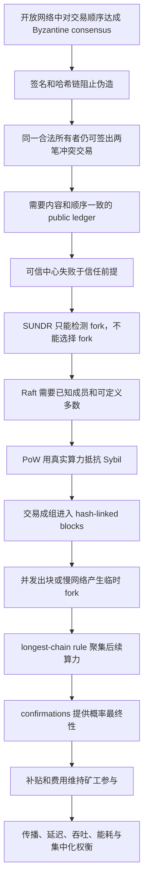

> 课程：MIT 6.824 Distributed Systems (Spring 2021)  
> 整理模式：`transcript+slides`；9 个时间段；教师讲义 `l-bitcoin.txt` 共 1 页  
> 目录保留 Bilibili 元数据中的来源拼写；笔记标题和正文统一使用正确的 **Peer-to-Peer**  
> 正式讲授总结结束于 `01:16:16`；课后 paper Q&A 覆盖至最后有声 segment `01:22:38.34`

## 学习目标

完成本讲后，应能够：

1. 解释签名和哈希引用能阻止伪造却不能单独阻止 double spending（双花）的原因。
2. 用 `T6 -> T7 -> T8` 重建简化交易链，并说明公钥、前驱交易哈希和上一所有者签名的职责。
3. 说明 public ledger 为什么必须同时统一交易内容和顺序，以及可信中心、SUNDR 和 Raft 为什么不满足开放 Bitcoin 网络的约束。
4. 描述 block 的简化结构、nonce 搜索、difficulty target 和 Proof of Work（PoW）如何把投票权从可伪造身份绑定到真实算力。
5. 从并发出块和网络延迟推导临时 fork，再从 longest-chain rule 推导概率收敛和 confirmations 的风险含义。
6. 分析诚实算力占优这一安全前提，以及 majority hash power 能做什么、不能做什么。
7. 解释 block subsidy、transaction fee、halving、mining pool、专用硬件和低延迟传播如何共同塑造激励与集中化风险。
8. 说明 Peer-to-Peer flooding 在交易/区块传播中的作用，并分析区块间隔、区块大小、吞吐、确认延迟、带宽、存储、能耗和 fork 率之间的权衡。
9. 区分临时 block fork、soft fork 和 hard fork，并区分完整历史、当前 UTXO 状态及空间压缩的用途。

## 需要的先修知识

- 公钥密码学、数字签名、cryptographic hash、preimage resistance 和 collision resistance 的基本直觉。
- 分布式日志、状态机复制、Raft 中已知成员集合与 majority/quorum。
- 上一讲 SUNDR 的 signed log、fork consistency 及恶意服务器隔离客户的模型。
- 网络延迟、partition、gossip/flooding、概率试验和期望值。
- Byzantine participant 与 Sybil attack 的基本概念。

## 证据与材料

### 课堂主证据

- [英文 transcript](/assets/courses/mit-6824-s21/lectures/020/transcript.txt)、[segment JSONL](/assets/courses/mit-6824-s21/lectures/020/transcript.jsonl) 与 [字幕](/assets/courses/mit-6824-s21/lectures/020/transcript.srt)：本笔记的教师顺序、课堂问答和精确时间边界依据。
- [教师讲义 l-bitcoin.txt](/assets/courses/mit-6824-s21/lectures/020/materials/l-bitcoin.txt)：与第 1 段对齐的官方 lecture note，并包含若干课堂未逐项展开的验证清单、攻击问题和系统弱点。
- [课程元数据](/assets/courses/mit-6824-s21/lectures/020/metadata.json)：官方视频、论文、summary、FAQ、Question 和字幕来源索引。
- [Bilibili 课程视频](https://www.bilibili.com/video/BV16f4y1z7kn/?p=20) 与 [MIT 官方视频镜像](https://youtu.be/yB6m8EjAqPU)：回听与画面核对入口。

### Paper reading：论文原文

- [Bitcoin: A Peer-to-Peer Electronic Cash System](/assets/courses/mit-6824-s21/materials/official-materials/papers/bitcoin.pdf)，Satoshi Nakamoto, 2008，是本讲指定 primary source。
- 阅读时优先跟踪：交易签名链如何定义所有权；timestamp server 与 hash chain；PoW 如何决定历史；network steps 如何传播交易和区块；incentive；disk-space reclaim；simplified payment verification；攻击者追赶概率。
- 论文中的概率分析和 Merkle tree 细节是原文证据。课堂只定性讲了“确认越深，较弱攻击者越难追上”，没有完整推导论文公式；不得把论文细节倒写成老师逐字讲授。

### Summary reading：二手解释

- [Michael Nielsen: How the Bitcoin protocol actually works](/assets/courses/mit-6824-s21/materials/official-materials/readings/how-the-bitcoin-protocol-actually-works) 是独立的 explanatory summary，不是 Nakamoto 论文，也不是课堂 transcript。
- 可用它建立从数字签名到交易广播、区块和挖矿的直觉，再回到论文核对正式协议；引用作者主张、公式或协议边界时应以 paper 为准。
- 本笔记不会把 summary 独有例子、术语或解释冒充教师课堂内容。

### 其他课程资源

- [Bitcoin FAQ](/assets/courses/mit-6824-s21/materials/official-materials/faqs/bitcoin-faq.txt)：课程网站的独立课后 FAQ。
- [Lecture 19 Question](/assets/courses/mit-6824-s21/materials/official-materials/questions/19-q-bitcoin.html)：指定思考题，不等同于课堂答案。
- [课程源 lecture note](/assets/courses/mit-6824-s21/materials/official-materials/lecture-notes/l-bitcoin.txt)：本讲本地材料副本的来源文件。

## 精确分段

| 节 | 时间 | 教师推进角色 | 材料模式 | 详细笔记 |
| --- | --- | --- | --- | --- |
| 001 | 00:00:04-00:10:00 | 开放 Byzantine 共识动机；威胁分类；签名交易结构 | transcript + `l-bitcoin.txt` | [第 001 节](#section-01) |
| 002 | 00:10:00-00:20:00 | 完成交易验证；构造双花；提出公共有序账本和可信中心 | transcript only | [第 002 节](#section-02) |
| 003 | 00:20:00-00:29:59 | 排除 SUNDR/Raft；开放成员与 Sybil；引入 PoW | transcript only | [第 003 节](#section-03) |
| 004 | 00:29:59-00:39:59 | PoS 对照；block 结构；nonce、target 与约十分钟出块 | transcript only | [第 004 节](#section-04) |
| 005 | 00:39:59-00:49:56 | 难度共识；本地交易池；候选块与矿工切换循环 | transcript only | [第 005 节](#section-05) |
| 006 | 00:49:57-00:59:53 | 临时 fork；最长链收敛；双花情形与 confirmations | transcript only | [第 006 节](#section-06) |
| 007 | 01:00:03-01:10:01 | 区块补贴、费用、矿池；传播间隔与吞吐权衡 | transcript only | [第 007 节](#section-07) |
| 008 | 01:10:03-01:20:03 | 协议升级、soft/hard fork；总结；PoS 与存储问答 | transcript only | [第 008 节](#section-08) |
| 009 | 01:20:04-01:22:38 | 课后 paper Q&A：历史压缩、UTXO 状态与完整验证 | transcript only | [第 009 节](#section-09) |

输入分段之间存在原 transcript 的静音小间隔，例如 `00:49:56-00:49:57` 与 `00:59:53-01:00:03`；9 段按 `summary-input.jsonl` 的实际边界记录，最大结束时间覆盖最后有声 segment。

## 老师的教学主线



老师的实际顺序不是先罗列 blockchain 组件，而是先证明问题为什么存在：

1. 数字签名只能证明“Y 授权了这笔交易”，不能证明“Y 没有再授权一笔花同一输入的交易”。[00:10:45-00:15:36]
2. 防双花需要完整且有序的公共历史；先出现的消费有效，后出现的冲突消费无效。[00:15:45-00:17:59]
3. 可信服务器、SUNDR 和 Raft 分别在共同信任、分叉收敛和成员定义上不满足开放系统约束。[00:18:36-00:26:00]
4. PoW 让日志追加权与难伪造的真实计算资源绑定；block 再把昂贵工作摊给多笔交易。[00:26:26-00:38:17]
5. PoW 不消灭 fork；未来 blocks 把工作聚集到更长分支，确认深度才逐步降低回滚概率。[00:50:11-00:57:18]
6. 该安全循环需要矿工有经济动机，也受传播、吞吐、存储、能耗、软件一致性和治理约束。[00:59:16-01:16:05]

## 核心概念与依赖关系

### 交易、账本与所有权

简化交易写作：

$$T_i=(\operatorname{pub}(newOwner),\operatorname{hash}(T_{i-1}),\operatorname{sig}_{oldOwner}(T_i))$$

- `pub(newOwner)` 指定下一位能控制这笔输出的人。
- `hash(T_{i-1})` 把当前交易绑定到被消费的前驱交易。
- `sig(oldOwner)` 证明上一所有者授权当前转移。
- “余额”不是独立账户字段，而可理解为某私钥能控制的 unspent transaction outputs 集合。

签名链建立 authorization，但双花判定依赖全局有序历史。`Y -> Z` 与 `Y -> Q` 可以都拥有正确签名；只有公共账本能一致决定哪个先消费 `T7`。

### 区块、哈希链与 PoW

课堂简化区块：

$$B_i=(\operatorname{hash}(B_{i-1}),\ transactions,\ nonce,\ timestamp)$$

有效 PoW 要求：

$$H(B_i)<target$$

课堂等价直觉是哈希有足够多前导零。矿工改变 nonce 进行独立随机试验；生成需要大量尝试，验证只需一次重算。前驱哈希使旧块修改扩散为后续所有块的 PoW 重做问题。

### Fork、最长链与确认

```text
             B7'  [Y -> Z]
            /
B5 -> B6
            \
             B7'' [Y -> Q] -> B8 -> B9
```

- 两个矿工同时成功或网络传播慢，会产生两个都满足规则的后继。
- 节点先沿先看到的分支工作；看到更长分支后切换。
- 被放弃分支上的独有交易会回到未确认状态或消失，应用必须容忍 reorganization。
- 高价值交易等待更多 confirmations，因为攻击支从更深落后位置追上的概率更低。
- 核心前提是诚实总算力占优；若攻击者控制多数算力，它能建立更长 fork、双花、撤销自己的付款或 censor 交易，但仍不能没有私钥就签走别人的币。

### Peer-to-Peer dissemination

- 每个 peer 只与少量其他 peers 建立 TCP 连接，形成 mesh overlay；交易和新区块通过逐跳 forwarding/flooding 扩散。[课件: l-bitcoin.txt p.1]
- 各节点的 transaction pool 是本地视图，不保证完全相同。矿工独立挑选交易，获胜候选才决定本块内容。[00:42:36-00:47:13] [00:58:00-00:59:07]
- 出块间隔必须给区块传播留时间。过短间隔或过大区块都会让更多矿工在未知最新块时继续旧工作，提高 stale block/fork 概率。
- Flooding 简单且去中心化，但重复发送占带宽，也给 DoS 和扩展性带来压力。

### 激励和安全预算

$$R_{miner}=block\ subsidy+\sum transaction\ fees$$

区块补贴按协议减半，长期预期由费用维持挖矿。激励带来算力，也推动 ASIC、mining pool 和高速网络军备竞赛；这些优化提升单个矿工竞争力，却可能造成能耗与控制权集中。

## 关键推导、例子与结论边界

### 双花为何是排序问题

`T8` 与 `T8'` 都引用 `T7` 且都由 Y 签名。Z 只看 `T8`、Q 只看 `T8'` 时，局部检查无法分辨冲突。若所有人同意 `T8` 在先，则 `T8'` 因输入已花费而无效。因此系统真正需要共识的是 transaction log 的内容和 total order，而不是某个签名本身。[00:13:27-00:18:12]

### PoW 为何比“每节点一票”适合开放成员

Raft 的多数依赖已知集合 $M$，quorum 是 $\lfloor |M|/2\rfloor+1$；Bitcoin 没有可靠成员名单，攻击者还可生成许多身份。PoW 用实际 hash attempts 加权获胜概率，使新增名字不能免费增加票权。代价是资源浪费，而且算力所有权仍可集中。[00:24:20-00:29:31]

### 最长链为何能从临时 fork 收敛

若较多算力先看到 `B7'`，它更可能先产生后继；即使两边算力接近，随机挖矿的高方差也通常会让一支先领先。节点一旦切到领先支，更多算力又强化该支。这是正反馈式概率收敛，不是同步回合中的确定性投票。[00:50:11-00:53:31] [课件: l-bitcoin.txt p.1]

### 确认数不是魔法常数

等待 5-6 blocks 是课堂对高价值交易的经验例子，不是所有应用统一的安全证明。风险还取决于攻击算力、网络条件、商品可逆性和可承受损失。零确认可用于低风险场景，但不具有入块后的同等保证。[00:32:44-00:33:24] [00:55:14-00:57:18]

### 传播和吞吐的结构性权衡

$$throughput\approx\frac{transactions\ per\ block}{average\ block\ interval}$$

缩短 interval 或增大 block 可提高表面容量，却让传播占 interval 的比例上升、fork 更频繁，并提高带宽、存储和独立验证成本。十分钟既造成支付等待，也是给 Peer-to-Peer flooding 留出的稳定性预算。[01:07:43-01:10:01]

### 内容边界

- 本讲以 UTXO 风格简化交易解释所有权，但没有教授完整 Bitcoin Script、多输入/多输出、找零或交易选择策略。
- 本讲没有完整推导 Nakamoto paper 的攻击者追赶概率，也没有给出精确 timestamp、difficulty retarget 或 peer discovery 规则。
- PoS 只作为对照和课后问答出现；真实 leader/committee/randomness 协议被明确称为复杂，本讲没有教授具体 PoS 实现。[01:16:44-01:18:15]
- 最后一段是 paper Q&A，不属于老师正式主线总结；`UTXO set` 是对老师“当前未花费状态索引”描述的规范术语，不是 transcript 原词。[01:20:04-01:22:38]

## 教师讲义补充：不要冒充课堂口述

以下内容出现在 `l-bitcoin.txt` p.1，但 transcript 没有逐项完整展开。它们适合作为课件复习清单，不应改写成老师在视频中按此顺序讲过。

### 节点验证清单

- 收到新 transaction：检查没有其他已接受交易消费同一前驱输出；检查签名与前驱交易中的公钥匹配；通过后放入本地候选池。
- 收到新 block：检查哈希满足难度、前驱 block 存在、块内全部交易有效；若它形成更长有效链，则切换当前链。
- 收款人 Z：检查 `Y -> Z` 已进入 block、目标公钥/地址确为 Z，并根据风险等待若干后续 blocks。[课件: l-bitcoin.txt p.1]

### 攻击能力边界

- 修改链中间的旧 block 会破坏下一块的前驱哈希；要让修改历史被接受，攻击者必须重做后续工作并追上公共链。
- 多数算力攻击者可以制造最长 fork，从而 double-spend、un-spend 自己的交易或阻止某些交易进入链。
- 多数算力不能替代别人的私钥签名，因此不能直接把他人的未花费输出转给自己。
- 讲义还提到 selfish mining：矿池暂时隐藏新区块，等待公共链追近后再发布，试图让自己的私有分支获胜。课堂 transcript 未展开该攻击过程。[课件: l-bitcoin.txt p.1]

### 讲义列出的系统弱点

- 新 currency 与 payment system 被绑在一起，经济价值与安全激励互相依赖。
- 确认至少约十分钟，高置信度可能等待约一小时。
- Flooding 和有限 block size 限制性能，也可成为攻击面。
- PoW 消耗大量计算与电力；mining pool 和专用硬件推动集中化。
- 交易并非强匿名，公开账本可追踪；但非法用途又可能招致法律反应。
- 用户保护 private key 很困难，密钥盗窃不由最长链解决。
- 存储可借助当前未花费状态和 Merkle tree 思路优化，但全历史同步与独立验证仍有成本。[课件: l-bitcoin.txt p.1]

## 易错点与待核对项

- **签名合法不等于未双花**：授权与全局唯一消费是两项不同检查。[00:13:27-00:17:29]
- **fork 不自动表示攻击**：并发出块和普通网络延迟就会制造临时分叉。[00:50:11-00:51:39]
- **最长链不是立即终局**：切链会撤销旧分支独有交易；确认只是降低概率。[00:51:39-00:57:18]
- **PoW 不是每身份一票**：概率按真实算力加权；矿池会让控制权集中。[01:02:34-01:04:06]
- **全网十分钟不等于单机十分钟**：它是大量独立尝试的最早成功时间，并由难度调节长期平均。[01:04:06-01:05:12]
- **交易集合不先共识**：各 miner 从本地池选交易，获胜块才决定内容。[00:58:00-00:59:07]
- **正常 fork 与 hard fork 不同**：前者共享有效性规则，后者对什么是有效块都不一致。[01:10:03-01:12:57]
- [需回听 00:02:04] `pseudo-anonymous` 应指作者 pseudonymous，不是交易匿名性。
- [需回听 00:08:29] 字幕写 `sha1`，教师讲义只写一般 `hash`；本讲不依赖具体算法。
- [需回听 00:42:22] 老师不记得精确 timestamp 检查规则，不能从口述补出具体窗口。
- [需回听 00:47:50] 难度调整周期数字被字幕破坏，只保留“周期性、由共同历史确定”。
- [需回听 00:56:31] “impossible” 应按上下文理解为概率极低，而非绝对不可能。
- [需回听 01:09:33] 吞吐数值口述与可靠量级不一致；保留结构性公式，不采纳该数值。
- [需回听 01:11:00] 字幕 `soft work` 是 `soft fork`，但课堂没有给严格兼容性定义。
- [需回听 01:22:11] 压缩状态与完整验证的最后一句指代含混，不补写未讲的 Merkle pruning 算法。

## 掌握标准

- 能画出 `T6 -> T7 -> T8`，逐字段解释验证，并构造 `T8/T8'` 双花反例。
- 能用一句前提和一个反例分别说明可信中心、SUNDR 和 Raft 为什么不是开放 Bitcoin 网络的完整答案。
- 能写出简化 block 字段及 $H(B)<target$，说明生成昂贵、验证便宜和 nonce 搜索的随机性。
- 能从两个并发 `B7` 开始，追踪节点如何保留 fork、沿先见支挖矿、看到更长支后切换，并处理旧支交易。
- 能说明 confirmations 的风险含义与诚实算力占优前提，不把 6 confirmations 说成绝对最终性。
- 能区分攻击者有多数算力与偷到私钥的能力：前者可重组/censor，后者才可签走特定所有者的币。
- 能完整叙述交易和区块从一个 peer 经 mesh flooding 传播、进入本地 pool、被 miner 选入候选块并最终获胜的路径。
- 能用区块大小、间隔、传播时间和 fork 率解释吞吐权衡，并指出 PoW 的能耗与 mining pool 集中化代价。
- 能区分 paper、secondary summary、教师讲义和 transcript 的证据层级。

## 综合复习问答

1. **问：为什么数字签名解决伪造却没有解决双花？**  
   **答：** 签名证明所有者授权某一笔交易；所有者可以对两个消费同一输入的交易都合法签名。只有共同有序账本能判定哪个先消费。
2. **问：Bitcoin 的共识对象是什么？**  
   **答：** 从开始以来交易的公共有序日志，实际以哈希链接的 blocks 表示；对日志一致就能对当前状态一致。
3. **问：PoW 如何处理 Sybil 问题？**  
   **答：** 追加机会按可验证计算工作加权，而不是按可廉价伪造的节点身份计票。
4. **问：两个有效新区块同时出现时，协议为何不立即判一个无效？**  
   **答：** 两块可能都满足 PoW 和交易规则；节点要观察未来哪一支获得更多后续工作，再按最长链切换。
5. **问：为什么 confirmations 越多通常越安全？**  
   **答：** 攻击者必须从更深的落后位置生成并超过诚实链；在攻击算力较小的前提下，成功概率随深度下降。
6. **问：多数算力能否直接偷走任意用户的币？**  
   **答：** 不能伪造该用户签名；它能重组历史、双花自己的币或 censor 交易。
7. **问：交易经 flooding 到达所有节点后，节点是否先投票决定本块交易集合？**  
   **答：** 否。每个 miner 基于本地 pool 构造候选；最先完成有效 PoW 的候选决定本块集合。
8. **问：矿工为什么愿意消耗资源？**  
   **答：** 成功块带来 block subsidy 和 transaction fees；这一激励也造成 ASIC、矿池、能耗和集中化。
9. **问：为什么不能同时把 block interval 极短、block size 极大？**  
   **答：** 区块传播会占更大比例，更多 miner 在旧头上继续工作，fork 增多；带宽、验证和存储门槛也上升。
10. **问：paper 与 Michael Nielsen summary 应如何使用？**  
    **答：** Summary 用于建立直觉，paper 是协议与作者主张的 primary source；教师是否讲过某内容仍以 transcript 和 lecture note 为证据。

## 复习顺序

1. 先读第 1、2 节，手写 `T7/T8/T8'`，确认自己能解释“签名合法但双花仍成立”。
2. 读第 3 节，用三列表分别写可信中心、SUNDR、Raft 的可用能力和失败前提。
3. 读第 4、5 节，画出 block 字段和 miner 循环，再解释难度为何无需中央发布、交易池为何只是本地视图。
4. 读第 6 节，从同高 fork 手算节点选择和交易回滚，分别给拿铁与汽车制定确认策略。
5. 读第 7 节，把激励、总算力、矿池、专用硬件、传播速度、区块大小和 fork 率连成因果图。
6. 读第 8、9 节，区分协议规则 fork 与普通 block fork，再区分完整历史、UTXO 当前状态和 snapshot。
7. 单独阅读 [paper](/assets/courses/mit-6824-s21/materials/official-materials/papers/bitcoin.pdf)，对照课堂没有完整推导的概率、安全和存储章节。
8. 再读 [summary](/assets/courses/mit-6824-s21/materials/official-materials/readings/how-the-bitcoin-protocol-actually-works) 检查直觉，但遇到定义差异回到 paper。
9. 最后不看笔记回答“综合复习问答”，并用 [教师讲义](/assets/courses/mit-6824-s21/lectures/020/materials/l-bitcoin.txt) 的 validation checks 和 weak points 作查漏清单。

## 证据与完整性审计

- 分段输入：`summary-input.jsonl` 共 9 条，起点 `3.55` 秒，终点 `4958.34` 秒；按实际有声 segment 切分。
- 转录输入：`metadata.json` 记录 1,343 个 transcript segments；本笔记最大时间标记覆盖 `01:22:38.34`。
- 讲义输入：`preparation.json` 记录 1 个材料页，来自 `l-bitcoin.txt`；只有第 001 段提示直接附带该页。
- 输出结构：`notes/sections/001.md` 至 `009.md` 均含固定六节、3-5 组问答、时间证据与待核对项。
- 阅读边界：paper 与 summary 使用独立标题和链接；summary 不作为论文原文或教师口述证据。
- 最终门禁应验证：9 个 section 严格 UTF-8；根文件严格 UTF-8；每个 section 在根文件中按顺序完整出现一次；Markdown 围栏/数学块成对；所有相对链接目标存在；无冲突标记和 NUL 字节。

## 逐段详细课堂笔记


### 1. `00:00:03-00:10:00`

<!-- BEGIN EMBEDDED SECTION 001 -->

<div id="section-01" class="course-note-section-anchor" aria-hidden="true">&nbsp;</div>

# 第 1 段：问题边界与签名交易

> 时间范围：`00:00:04-00:10:00`
>
> 证据范围：本段 transcript 与教师讲义 `l-bitcoin.txt` p.1。目录沿用来源标题拼写，笔记正文统一使用正确拼写 **Peer-to-Peer**。

## 本段在整讲中的作用

老师先说明为什么在分布式系统课中研究 Bitcoin：它在参与者身份和数量都未知、节点可自由加入退出且可能 Byzantine（拜占庭式作恶）的开放系统中，对交易顺序达成共识。[00:00:11-00:01:07] 它与上一讲 SUNDR 都使用带签名的操作日志并允许出现 fork（分叉），但 Bitcoin 的目标不是永久检测并隔离分叉，而是在去中心化环境中让参与者最终选择同一条分支。[00:01:14-00:01:46] 随后老师把金融安全问题分成伪造、双花和私钥盗窃，并从最容易处理的伪造入手，建立后续“双花为何不能只靠签名解决”的交易模型。[00:03:01-00:09:57] [课件: l-bitcoin.txt p.1]

## 教学展开

1. **限定课程视角** [00:00:11-00:02:43]：Bitcoin 还有金融、政策和加密货币等许多议题，但本讲只聚焦分布式系统问题，即开放 Byzantine 环境中的交易排序共识。老师指出这篇 2008 年论文并非通常的学术出版物，作者使用化名；无论对加密货币价值判断如何，其系统实践成功值得研究。
2. **列出三类威胁** [00:03:01-00:05:53]：outright forgery（凭空伪造）可由数字签名较直接地约束；double spending（双花）是论文主要解决的问题；theft（盗窃私钥）在现实中很严重，但不是这套共识机制擅长解决的对象。课堂前提是底层密码学正确且私钥没有泄露。
3. **简化交易记录** [00:06:06-00:07:57]：一条交易包含新所有者的公钥 `pub(user1)`、该币上一笔交易的哈希 `hash(prev)`，以及上一所有者使用私钥生成的签名 `sig(user2)`。老师明确省略真实 Bitcoin 的金额、多输入/多输出和脚本语言，以保留共识分析所需的最小结构。[课件: l-bitcoin.txt p.1]
4. **解释“币”是什么** [00:08:15-00:09:57]：系统中并不存在脱离交易记录的实体硬币；所谓币的身份可理解为其最近交易的哈希。若 X 曾拥有该币，`T7 = pub(Y), hash(T6), sig(X)` 就把控制权转给 Y。Y 的余额可理解为由 Y 掌握对应私钥的一组未花费交易输出，而不是账户里单独存放的一枚对象。[课件: l-bitcoin.txt p.1]

## 概念、符号与推导

- **Byzantine participant**：可能任意偏离协议、恶意或与他人合谋的参与者。[00:00:41-00:01:00]
- **公开账本（public ledger）**：本段先把它作为目标提出；后续要解决所有节点如何对交易内容和次序取得一致。[00:04:46-00:05:07]
- **简化交易**：

  $$T_i=(\operatorname{pub}(newOwner),\operatorname{hash}(T_{i-1}),\operatorname{sig}_{oldOwner}(T_i))$$

  签名覆盖整条新交易；上一条交易中的公钥用于验证当前签名。[00:06:30-00:07:28]
- **所有权链**：`T6 -> T7` 的哈希引用证明 `T7` 指向哪一笔先前交易，`sig(X)` 证明控制 `T6` 的 X 授权转给 Y。该链能阻止不知道 X 私钥的人伪造这次转移，但尚未证明 Y 没有把同一 `T7` 再引用一次。
- **前提边界**：签名方案只在私钥保密与密码学原语不可破坏的前提下成立；共识不能把被盗私钥与合法所有者区分开。[00:04:01-00:04:21] [00:05:14-00:05:53]

## 例子与课堂提示

- **SUNDR 对照** [00:01:14-00:01:39]：两者都把操作放入签名日志，也都承认网络中可能形成分叉；对照服务于后续关键差异，即 Bitcoin 如何让开放网络从分叉中收敛。
- **X、Y 的交易链** [00:08:34-00:09:57]：`T6` 记录 X 先前获得币，`T7` 通过 `pub(Y)`、`hash(T6)`、`sig(X)` 把它交给 Y。这个例子把抽象字段映射为所有权转移。
- **易错点**：哈希引用提供防篡改关联，签名提供授权；两者都不等于“这笔输入此前从未被花费”。判断后者需要完整且有序的公共历史。

## 本段掌握检查

1. **问：为什么 Bitcoin 对本课程有意义？**  
   **答：** 它在身份和成员数未知的开放 Peer-to-Peer 网络中，容忍 Byzantine 参与者并对交易顺序形成共识。[00:00:17-00:01:07]
2. **问：三类安全挑战中，本讲重点是哪一个？**  
   **答：** 双花；伪造主要由签名约束，私钥盗窃虽严重但不是本讲共识机制的核心。[00:03:01-00:05:53]
3. **问：`T7 = pub(Y), hash(T6), sig(X)` 各字段做什么？**  
   **答：** `pub(Y)` 指定新所有者，`hash(T6)` 指向该币上一笔交易，`sig(X)` 表明上一所有者 X 授权这次转移。[00:08:34-00:09:57]
4. **问：为什么说 Bitcoin 中“只有交易，没有独立的币对象”？**  
   **答：** 所有权由连续交易及当前未花费输出表示；币的身份可视为最近一次交易的哈希。[课件: l-bitcoin.txt p.1]

## 待核对项

- [需回听 00:02:04] 字幕为 `pseudo-anonymous`；结合语境，老师是在说论文作者 Satoshi Nakamoto 使用化名（pseudonymous），不是在此评价交易匿名性。
- [需回听 00:08:29] 口述字幕写成 `sha1`，教师讲义只写一般性的 `hash`；Bitcoin 使用的具体哈希细节不是本段教学重点，正文保留为“哈希”。
- 讲义例子写买 hamburger，课堂口述后续使用 latte；两者服务于同一交易验证例子，不构成机制差异。[课件: l-bitcoin.txt p.1]

<!-- END EMBEDDED SECTION 001 -->

### 2. `00:10:00-00:19:59`

<!-- BEGIN EMBEDDED SECTION 002 -->

<div id="section-02" class="course-note-section-anchor" aria-hidden="true">&nbsp;</div>

# 第 2 段：从签名验证到双花与公共有序账本

> 时间范围：`00:10:00-00:20:00`
>
> 证据范围：本段仅依据 transcript；本分段提示没有附带课件材料。相关符号沿用上一段教师讲义中的简化交易模型。

## 本段在整讲中的作用

上一段说明签名交易如何传递所有权，本段先完成收款人 Z 的验证步骤，再用两个都能通过密码学检查的交易构造双花反例。由此老师把问题从“交易是否由所有者签署”提升为“所有人是否看到相同且有序的交易历史”，并引出 Nakamoto consensus。最后，他开始检验第一个候选方案：由可信服务器维护日志。[00:10:00-00:20:00]

## 教学展开

1. **Z 验证 Y 的付款** [00:10:00-00:12:06]：Y 创建 `T8 = pub(Z), hash(T7), sig(Y)`。Z 重算 `T7` 的哈希，确认 `T8` 引用的是这笔历史交易；再取出 `T7` 中 Y 的公钥，验证覆盖整个 `T8` 的签名。两项检查通过后，Z 才交付拿铁。
2. **重申私钥假设** [00:12:13-00:12:54]：验证只能证明签名者掌握 Y 的私钥。若私钥泄露，攻击者也能生成同样有效的签名；共识机制不能恢复“现实中的本人”这一身份。
3. **构造双花** [00:13:27-00:15:36]：Y 不只生成付给 Z 的 `T8`，还生成付给 Q 的 `T8'`；两者都引用 `hash(T7)`，也都由 Y 合法签名。Z 与 Q 若彼此不知道另一笔交易，各自的哈希和签名检查都会通过，于是 Y 获得两杯拿铁。
4. **提出完整有序日志** [00:15:45-00:17:59]：日志必须收录从开始以来的全部交易及其顺序。若 `T8` 先于 `T8'`，Z 接受 `T8`；Q 扫描历史时发现 `T7` 已由 `T8` 花费，拒绝 `T8'`。关键不只是“发布交易”，而是每个参与者对相同槽位中的相同内容、哈希和签名达成一致。
5. **转化为共识问题** [00:18:04-00:18:29]：如何在不可信开放环境中建立上述日志，就是本讲所谓 Nakamoto consensus 要解决的问题。老师先不直接给答案，而是用失败方案揭示约束。
6. **设计 1：可信服务器** [00:18:36-00:20:00]：所有客户把交易交给服务器 S，由 S 排序并维护日志；必要时可用 Raft 复制 S 来容错。该方案技术上简单，但其前提是全球参与者同意信任同一个中心，正好违背 Bitcoin 的去中心化目标。

## 概念、符号与推导

- **交易验证**：
  1. 检查 $\operatorname{hash}(T7)$ 是否等于 `T8` 中保存的前驱哈希；
  2. 用 `T7` 中的 $\operatorname{pub}(Y)$ 验证 $\operatorname{sig}_Y(T8)$；
  3. 还必须检查被引用的输出在公共历史中尚未花费。
- **双花反例**：

  $$T8=(\operatorname{pub}(Z),\operatorname{hash}(T7),\operatorname{sig}_Y(T8))$$

  $$T8'=(\operatorname{pub}(Q),\operatorname{hash}(T7),\operatorname{sig}_Y(T8'))$$

  两条交易单独看都合法，但不能同时进入有效历史，因为它们消费同一前驱 `T7`。[00:13:46-00:15:28]
- **有序账本的判定规则**：第一次消费 `T7` 的交易有效；后续再次引用同一未花费输出的交易无效。若各节点看到的先后顺序不同，它们会给出不同判定。
- **安全目标**：一致内容 + 一致顺序 + 已发布历史不可随意撤销。签名只解决授权，不自动提供这三个性质。

## 例子与课堂提示

- **两家拿铁店** [00:14:46-00:15:35]：Z 和 Q 都能独立验证签名，却都不知道另一笔付款，说明局部密码学有效性不足以防双花。
- **可信服务器 S** [00:18:46-00:19:57]：用于区分“复制一个已被信任的排序服务”和“在无人被预先信任时决定排序”。Raft 可提高前者的可用性，但不能创造全球信任。
- **易错点**：`T8'` 不是伪造交易。它确实由 Y 签名，问题是 Y 对同一输入给出了互斥的两个后继。

## 本段掌握检查

1. **问：Z 验证 `T8` 时需要哪两项密码学检查？**  
   **答：** 重算并匹配 `T7` 的哈希，再用 `T7` 中 Y 的公钥验证 Y 对整个 `T8` 的签名。[00:10:45-00:11:49]
2. **问：为什么 `T8` 和 `T8'` 都能通过验证？**  
   **答：** 它们都正确引用 `T7`，也都由合法所有者 Y 签名；若验证者看不到完整历史，就不知道另一条已经消费同一输入。[00:13:46-00:15:28]
3. **问：公共日志必须额外提供什么信息？**  
   **答：** 全部交易的共同内容与共同顺序，使节点一致认定哪次消费在先，并拒绝后续双花。[00:15:45-00:17:59]
4. **问：为什么用 Raft 复制可信服务器仍不是 Bitcoin 的答案？**  
   **答：** Raft 可复制一个已被共同信任的服务，却没有解决开放参与者为何信任该中心的问题。[00:18:36-00:20:00]

## 待核对项

- [需回听 00:13:49] 字幕一度说 Z 创建两条记录，老师立即纠正为 Y；双花发起者是 Y。
- 本段提示标明“仅 transcript”，因此没有添加 `l-bitcoin.txt` 页码引用；符号只作为上一段已定义模型的延续。

<!-- END EMBEDDED SECTION 002 -->

### 3. `00:19:59-00:29:59`

<!-- BEGIN EMBEDDED SECTION 003 -->

<div id="section-03" class="course-note-section-anchor" aria-hidden="true">&nbsp;</div>

# 第 3 段：为何 SUNDR 与 Raft 不够，以及 PoW 的入口

> 时间范围：`00:20:00-00:29:59`
>
> 证据范围：本段仅依据 transcript；本分段提示没有附带课件材料。

## 本段在整讲中的作用

老师继续用反例排除两条熟悉路线：SUNDR 能检测分叉却允许不可信服务器永久维持不同世界；Raft 需要已知成员集合才能定义多数。排除之后，问题被精确定位为：开放 Peer-to-Peer 网络不能按可伪造的“身份数”投票，必须把追加日志的权力绑定到真实稀缺资源。Proof of Work（工作量证明，PoW）由此登场。[00:20:00-00:29:59]

## 教学展开

1. **可信中心不满足目标** [00:20:00-00:20:34]：如果全世界不能同意信任某一政府或服务器，中心化日志虽容易实现，也不适用于去中心化系统。
2. **设计 2：SUNDR 式不可信服务器** [00:20:36-00:22:39]：客户读取、签名并追加日志，服务器只转发日志。但恶意服务器可把共同前缀分成两支，一支含 `T8`，另一支含 `T8'`，并长期隔离 Z 与 Q。两个世界内部都自洽，Y 仍能双花。
3. **从检测分叉推进到选择分叉** [00:22:39-00:22:58]：当前问题不是证明“发生过 fork”，而是让不可信客户最终选择同一支。这正是 Bitcoin 相对 SUNDR 新增的目标。
4. **设计 3：Peer-to-Peer 网络** [00:23:02-00:24:04]：用相互连接的 peers 替换服务器。客户创建的交易在网络中传播，每个节点维护日志。去中心化载体建立后，仍需解决交易顺序。
5. **为何不能直接套 Raft** [00:24:20-00:26:00]：已知 5 个节点时，多数是 3，收到 3 票即可提交某槽位；但 Bitcoin 节点可随时加入退出，没有成员名单，节点总数和多数门槛都无从定义。开放系统也允许一个实体伪造许多身份，即 Sybil 问题。
6. **PoW 规则** [00:26:26-00:28:57]：节点必须先完成昂贵计算才能获得追加下一条日志记录的机会；第一个解出谜题者决定下一项。解答易验证但需要真实机器与计算时间，其他身份不能低成本复制这份资源支出。
7. **立即承认代价并对照 PoS** [00:28:57-00:29:59]：PoW 会大量耗能。老师简短引出 Proof of Stake（权益证明，PoS）作为另一类按持有权益分配决策权的方案，下一段继续说明，但本讲仍研究 Bitcoin 的 PoW。

## 概念、符号与推导

- **Fork consistency 与收敛的区别**：SUNDR 保证客户一旦在分叉后重逢便能发现不一致，但服务器可以让分叉长期存在；Bitcoin 还要给出从多个分支中选择一个公共历史的机制。
- **Raft 多数的前提**：成员集合 $M$ 已知，才可定义 quorum 大小 $\lfloor |M|/2\rfloor+1$。Bitcoin 中 $M$ 未知且动态，所以“多数身份”不是可执行规则。[00:24:46-00:25:54]
- **Sybil resistance（抗女巫攻击）**：IP 地址或节点名字可低成本伪造；PoW 把影响力近似绑定到可测量的算力投入，而不是身份数量。[00:27:26-00:28:35]
- **PoW 的初步规则**：

  $$\text{first valid puzzle solution} \Rightarrow \text{right to propose the next log entry}$$

  本段只给直觉，具体谜题和区块结构在下一段定义。
- **结论边界**：PoW 证明有人消耗了计算资源，不证明该人诚实；安全性还依赖诚实算力最终占优和最长链规则。

## 例子与课堂提示

- **两支 SUNDR 日志** [00:21:24-00:22:35]：共同前缀之后分别出现 `T8` 与 `T8'`，用于说明“可检测分叉”不等于“能自动合并或选择分叉”。
- **5 节点中的 3 票** [00:24:46-00:25:03]：用于展示封闭成员系统为何能精确定义多数，并反衬开放系统缺少分母。
- **唯一 IP 地址反例** [00:28:25-00:28:35]：网络身份并不构成可信稀缺资源；真实计算成本更难伪造。
- **易错点**：老师不是说 Raft 不能排序，而是说它依赖 Bitcoin 不具备的固定或可管理成员配置。

## 本段掌握检查

1. **问：SUNDR 式方案为什么仍允许双花？**  
   **答：** 恶意服务器可永久给 Z 和 Q 展示不同分支，使两边各自只看到一笔合法消费。[00:20:36-00:22:39]
2. **问：Bitcoin 比 SUNDR 多解决哪一步？**  
   **答：** 不仅容忍或检测 fork，还让去中心化参与者最终选择同一分支。[00:22:39-00:22:58]
3. **问：为什么开放网络中不能直接按节点数取多数？**  
   **答：** 成员名单和总数未知且动态，身份还可被一方批量伪造，因此多数的分母与投票权都不可靠。[00:24:20-00:26:00]
4. **问：PoW 的核心直觉是什么？**  
   **答：** 追加权必须用真实、昂贵但容易验证的计算工作换取，使伪造许多身份不能线性增加影响力。[00:26:26-00:28:57]

## 待核对项

- [需回听 00:25:33] 字幕将 `undefined` 识别得不清楚；语境明确是“开放系统中的 majority 无法定义”。
- [需回听 00:27:53] 老师以“约一个 CPU 月”给出直觉性工作量，后续又以全网并行约十分钟出块说明；该数值是课堂简化，不应理解为每个实际区块固定消耗一个 CPU 月。

<!-- END EMBEDDED SECTION 003 -->

### 4. `00:29:59-00:39:58`

<!-- BEGIN EMBEDDED SECTION 004 -->

<div id="section-04" class="course-note-section-anchor" aria-hidden="true">&nbsp;</div>

# 第 4 段：从 PoS 对照到区块级 PoW

> 时间范围：`00:29:59-00:39:59`
>
> 证据范围：本段仅依据 transcript；本分段提示没有附带课件材料。

## 本段在整讲中的作用

上一段只给出“用真实计算决定谁追加日志”的直觉。本段先用 PoS 作短暂对照，再回答两个落实问题：谜题解答为何不能被别人改名复用，以及为什么要把多笔交易组成 block（区块）后再做一次 PoW。老师随后定义 block 的字段、哈希目标和 nonce 搜索，解释全网并行下约十分钟出块以及传播时间与分叉概率之间的权衡。[00:29:59-00:39:59]

## 教学展开

1. **PoS 对照后回到 Bitcoin** [00:29:59-00:30:46]：老师用“持有 3% 权益，大致获得 3% 日志决策机会”描述 PoS 的高层直觉；它避免计算密集谜题。但 Bitcoin 使用 PoW，因此本讲不展开 PoS 协议细节。
2. **解答绑定候选内容** [00:30:55-00:31:56]：学生问服务器 B 能否复制 A 对条目 `e1` 的解答并改名。老师确认不能，因为 B 想发布的 `e2` 改变了谜题输入；解答与候选日志内容绑定。这个性质仍不足以单独保证一致，但可用于后续选择分叉。
3. **网络分区与确认等待** [00:32:02-00:33:29]：持久分区期间，两边可能接受冲突支付。网络恢复后才会通过后续区块分出更长一支；高价值收款应等待约 5–6 个后续区块，即课堂所说约一小时，以降低交付后回滚风险。
4. **为什么按区块工作** [00:33:41-00:34:05]：若每笔交易各做一次昂贵 PoW，吞吐量会极低；因此系统把许多交易聚成一个 block，对整个 block 做一次 PoW。
5. **定义区块链** [00:34:10-00:36:16]：日志是区块序列。每个 block 包含上一 block 的哈希、交易集合、nonce 和 timestamp；矿工收集交易、求解谜题、广播区块，其他节点验证 PoW、交易与哈希引用后接受它。
6. **定义哈希谜题** [00:36:23-00:38:17]：miner（矿工）不断改变 nonce 并计算整个 block 的哈希，直到结果有协议要求的 $N$ 个前导零；等价地，哈希数值低于难度目标。单次尝试便宜且成功概率小，寻找时间具有高方差，不是固定工作量。
7. **全网并行与约十分钟目标** [00:38:22-00:39:59]：大量矿工并行尝试，谁先碰到有效 nonce 谁广播新区块。协议调整难度，使全网第一个成功者的平均时间约十分钟。间隔还要给约 1 MB 的区块足够时间扩散，否则多个矿工在彼此不知情时同时出块，分叉会更频繁。

## 概念、符号与推导

- **区块简化结构**：

  $$B_i=(\operatorname{hash}(B_{i-1}),\ transactions,\ nonce,\ timestamp)$$

- **PoW 有效性条件**：

  $$H(B_i)<target$$

  课堂用等价直觉表示为：

  $$H(B_i)\text{ 具有至少 }N\text{ 个前导零}$$

- **nonce**：矿工可反复改变的字段。由于哈希输出近似不可预测，每次 nonce 尝试相当于一次独立、成功概率很小的抽样。[00:37:18-00:37:50]
- **哈希链防篡改**：`hash(B_{i-1})` 把当前区块绑定到前驱；修改旧区块会使后继引用失效，并迫使攻击者重做后续 PoW。
- **吞吐与稳定性权衡**：区块批处理摊薄 PoW 成本；较长出块间隔给 flooding（洪泛传播）留时间、减少偶然 fork，但增加确认延迟。

## 例子与课堂提示

- **A 的 `e1` 与 B 的 `e2`** [00:30:55-00:31:35]：用于说明有效解不能脱离候选内容复用；更改交易或身份会改变哈希输入。
- **网络分区后的交付** [00:32:02-00:33:24]：用于说明 Bitcoin 的确认是概率性的，商家必须把等待深度与商品价值匹配。
- **每交易一次 PoW 的反例** [00:33:41-00:34:05]：说明 block 是性能批处理单位，也是竞争日志后继的单位。
- **易错点**：“平均十分钟”不保证每块十分钟，单次搜索可能很快也可能很慢。

## 本段掌握检查

1. **问：为什么 A 的 PoW 解不能直接用于 B 的不同条目？**  
   **答：** 谜题输入包含候选内容；从 `e1` 改为 `e2` 会改变哈希，原 nonce 不再保证满足目标。[00:30:55-00:31:35]
2. **问：为什么对 block 而不是每笔交易做 PoW？**  
   **答：** block 批量容纳交易，能把昂贵工作摊到多笔交易上，避免单笔 PoW 限制吞吐。[00:33:41-00:34:05]
3. **问：一个简化区块包含哪些字段？**  
   **答：** 前一区块哈希、交易集合、nonce 和 timestamp。[00:34:52-00:35:39]
4. **问：十分钟间隔体现什么权衡？**  
   **答：** 它在确认延迟与网络传播时间之间取舍；给区块充分传播时间可降低并发出块造成的 fork。[00:38:43-00:39:47]

## 待核对项

- [需回听 00:35:44] 老师把区块大小近似说成 1 MB；这是课堂高层近似，不作为精确协议上限。
- [需回听 00:38:25] 节点和矿工数量为老师当时的口头估计，不是协议常量，也不用于笔记中的安全推导。

<!-- END EMBEDDED SECTION 004 -->

### 5. `00:39:58-00:49:55`

<!-- BEGIN EMBEDDED SECTION 005 -->

<div id="section-05" class="course-note-section-anchor" aria-hidden="true">&nbsp;</div>

# 第 5 段：难度共识、交易池与挖矿循环

> 时间范围：`00:39:59-00:49:56`
>
> 证据范围：本段仅依据 transcript；本分段提示没有附带课件材料。

## 本段在整讲中的作用

本段把上一段的静态区块图变成节点实际执行的循环。课堂问答先说明所有节点如何从共同链上确定同一难度并廉价拒绝假解，再追踪矿工从本地 transaction pool（交易池）取交易、构造候选块、收到竞争块后切换工作的过程。最后老师指出，共识还依赖节点运行兼容的验证规则，为后文协议升级与分叉埋下伏笔。[00:39:59-00:49:56]

## 教学展开

1. **难度不是各节点自行设定** [00:39:59-00:41:38]：$N$ 属于共同协议，并会周期性变化。节点从已达成共识的链上时间戳计算同一确定性函数：若区块产生过快，难度上调。提交低于要求的工作量会被每个正确节点拒绝。
2. **验证便宜，伪造昂贵** [00:41:43-00:42:01]：攻击者可用错误解洪泛形成 DoS 压力，但节点只需计算一次哈希即可快速淘汰明显无效的候选；这体现 PoW 的不对称成本。
3. **时间戳边界** [00:42:03-00:42:29]：成功矿工写入 timestamp，但不能任意撒谎，因为节点会检查其合理范围。老师明确承认自己不记得精确校验规则，因此这里只保留高层结论，不补写协议细节。
4. **候选块与新交易** [00:42:36-00:44:40]：假设 `B5` 已知，矿工在候选 `B6` 上搜索 nonce；搜索期间到达的新交易放入本地缓冲区。若矿工 I 赢得 `B6`，它立即从池中选交易构造 `B7` 候选并开始新一轮哈希。
5. **收到别人新区块时切换** [00:44:42-00:46:11]：若别人在 I 之前找到 `B7`，I 停止旧候选，切到该新区块之上；删除其中已确认交易，把剩余交易用于新的候选块。改变交易会改变区块哈希，因此候选确定后不能无成本沿用旧搜索结果。
6. **交易池是本地视图** [00:46:16-00:47:13]：每个节点从相连 peers 接收交易，维护自己的 pool，并按本地策略选择候选交易。用户无需直接告诉每一个节点，只需发送给若干 peers，由网络 flooding 转发。
7. **难度周期调整与软件一致性** [00:47:18-00:49:56]：难度并非每块随意改变，而是在既定区间后根据公共历史调整。节点必须遵守相同验证规则；软件 bug 或后门会破坏安全。现实中存在多个实现，但多数 wallets/peers 运行标准化版本，核心实现通过开源维护与审查演进。

## 概念、符号与推导

- **确定性难度函数**：

  $$D_{next}=f(\text{agreed chain history and timestamps})$$

  只要节点同意输入链并运行相同规则，就会得到相同的下一难度。[00:40:36-00:41:14]
- **验证成本不对称**：生成有效块需尝试大量 nonce；验证只需重算候选块哈希并比较 target。
- **本地交易池（mempool）**：尚未进入已接受链、但节点认为有效的候选交易集合。不同节点因传播延迟和策略不同，不保证池内容完全相同。[00:46:37-00:47:13]
- **矿工循环**：接收/验证交易 -> 放入本地池 -> 选择交易并构造候选块 -> 搜索 nonce -> 自己成功则广播；收到别人更合适的新头则重组候选并继续。
- **内容绑定**：改变交易集合、前驱哈希、时间戳或 nonce 都会改变 $H(B)$，旧候选上的哈希尝试不能作为新候选的证明。

## 例子与课堂提示

- **错误解洪泛** [00:41:43-00:42:01]：说明 PoW 不消除网络 DoS，但让错误工作的协议级判定很便宜。
- **`B5 -> B6 -> B7` 挖矿循环** [00:42:57-00:44:56]：把“新区块每十分钟产生”展开成交易池更新与矿工切换的具体状态变化。
- **笔记本挖矿** [00:46:16-00:46:33]：老师判断普通笔记本可能永远没有利润，用于强调获胜概率按实际算力而非节点身份均分。
- **易错点**：网络没有先对“本块装哪些交易”投票；每个矿工独立选交易，最终获胜候选决定本块内容。

## 本段掌握检查

1. **问：没有中央服务器时，节点如何得到相同难度？**  
   **答：** 它们在共同链历史上运行协议规定的确定性调整函数。[00:40:36-00:41:14]
2. **问：为什么错误 PoW 解容易拒绝？**  
   **答：** 验证者只需重算一次区块哈希并检查是否低于 target，不必重复矿工的大量搜索。[00:41:43-00:42:01]
3. **问：矿工收到别人先挖出的新区块后做什么？**  
   **答：** 停止旧候选，切到新区块之上，移除已包含的交易，并用池中剩余交易构造下一候选。[00:44:42-00:44:56]
4. **问：所有节点的 transaction pool 是否相同？**  
   **答：** 不保证。它是节点根据已收到交易和本地选择规则维护的本地集合。[00:46:37-00:47:13]

## 待核对项

- [需回听 00:42:22] 老师对 timestamp 可接受窗口的口述不完整，并明确说不记得精确规则；不应从该句推导具体“十分钟窗口”。
- [需回听 00:47:50] 自动字幕破坏了难度调整周期的具体数字；课堂只可靠支持“周期性而非每块调整”，正文未补数字。
- [需回听 00:49:16] 老师口头说“多数节点运行正确代码”，而本讲主要安全权重是算力；此处应理解为实现与规则兼容性的高层回答，不把它当作按节点数多数的正式安全条件。

<!-- END EMBEDDED SECTION 005 -->

### 6. `00:49:56-00:59:53`

<!-- BEGIN EMBEDDED SECTION 006 -->

<div id="section-06" class="course-note-section-anchor" aria-hidden="true">&nbsp;</div>

# 第 6 段：最长链、确认数与双花概率

> 时间范围：`00:49:57-00:59:53`
>
> 证据范围：本段仅依据 transcript；本分段提示没有附带课件材料。

## 本段在整讲中的作用

前面已经规定谁有资格提出新区块，本段处理即使 PoW 有效仍不可避免的 fork。老师先解释并发出块和网络延迟如何制造两条合法分支，再给出“先沿先看到的分支工作，看到更长分支就切换”的收敛规则。随后他把该规则用于双花攻击，推导出 confirmations（确认数）为何只能提供随深度增长的概率保证，而不是立即终局性。[00:49:57-00:59:53]

## 教学展开

1. **合法区块仍会分叉** [00:50:11-00:51:39]：在共同前缀 `B5 -> B6` 后，两个矿工可能几乎同时找到有效 nonce，或第二个矿工因网络慢而尚未收到第一个区块，于是产生不同的 `B7'` 与 `B7''`。两块可能分别包含 `Y -> Z` 与 `Y -> Q`。
2. **最长链规则** [00:51:39-00:52:30]：节点先保留分叉，继续在先看到的块上挖矿；当某一支被 `B8` 延长而成为更长链时，节点切到该支并沿它继续工作。被放弃分支上独有的交易会从当前公共历史中消失。
3. **时间戳不是裁决者** [00:52:44-00:53:31]：学生问能否按 miner 写入的发现时间直接判断。老师强调真正裁决来自未来区块把哪一支延长，时间戳不能替代后续累计工作所形成的证据。
4. **双花情形一：同一批 peers 看见两笔** [00:53:34-00:54:18]：正确节点发现 `Y -> Z` 和 `Y -> Q` 花费同一输入，会接受先看到的一笔并拒绝另一笔；正确 miner 不会把两笔同时装进有效块。
5. **双花情形二：冲突交易被分区传播** [00:54:24-00:55:14]：Y 把 `Y -> Z` 发给一组 peers，把 `Y -> Q` 发给另一组；两个 miner 可能各自只见一笔，于是在 fork 两侧各放一笔。此时每个块局部都可能有效。
6. **确认深度推导** [00:55:14-00:57:18]：Z 不应看见包含自己的块就立刻交付高价值商品，而应等待其后增加 5–6 个块。若诚实总算力大于攻击者，攻击支从落后多块追上并超过主链的概率随确认深度降低；拿铁可承担较小等待，汽车应等待更高置信度。
7. **谜题无需中央分发** [00:57:26-00:57:54]：每个 miner 都从区块内容、共同前驱和协议难度自行得到同一个谜题；系统只需传播交易、区块和由历史确定的难度。
8. **获胜 miner 决定本块内容** [00:58:00-00:59:11]：网络并不预先对交易集合达成一致。各 miner 从本地池选交易，谁先完成有效 PoW，谁的候选集合就成为新区块，并与前序区块一起形成顺序。
9. **转入激励问题** [00:59:16-00:59:53]：PoW 要求昂贵资源，若没有回报就没人愿意长期提供算力；下一段解释协议如何激励 miner。

## 概念、符号与推导

- **临时分叉**：

  ```text
             B7'  (Y -> Z)
            /
  B5 -> B6
            \
             B7'' (Y -> Q) -> B8
  ```

  当下支更长时，正确节点切到下支；上支独有交易不再被视为已确认。[00:50:25-00:52:30]
- **最长链规则**：课堂采用“更长链”表述来近似“获得更多 PoW 支持的链”。在本讲简化模型中，每块难度相同，因此块数更多对应累计工作更多。
- **确认数**：某交易所在块之后又接上的区块数量。每增加一块，攻击者要追赶的诚实工作通常增加，交易被重组出去的概率下降。
- **核心安全前提**：

  $$q < p$$

  其中 $q$ 是攻击算力比例，$p$ 是诚实算力比例。课堂没有完整推导追赶概率公式，只给出“落后越深，较弱攻击者越难超过”的定性结论。[00:56:02-00:56:48]
- **最终性边界**：Bitcoin 提供 probabilistic finality（概率最终性），并不保证某笔刚入块的交易永不回滚。

## 例子与课堂提示

- **同时找到 nonce 与慢网络** [00:51:07-00:51:39]：两种原因都可产生正常、非恶意的 fork；因此“看见 fork”本身不证明有人攻击。
- **拿铁与汽车** [00:55:34-00:57:18]：说明确认策略取决于损失风险。低价值即时商品可能少等，高价值不可逆交付应等更多块。
- **学生的 gossip 误解** [00:58:00-00:59:07]：交易虽经 gossip/flooding 传播，但所有节点无需先同意一个候选块；获胜 miner 选择本块交易。
- **易错点**：最长链切换会使旧分支独有交易“出现后消失”，应用不能把第一次观察当作永久提交。

## 本段掌握检查

1. **问：哪两类正常事件会造成合法 fork？**  
   **答：** 两个 miner 几乎同时找到 nonce，或网络传播慢到第二个 miner 出块时仍不知道第一个块。[00:51:07-00:51:39]
2. **问：节点看到两条同长分支时和看到一条更长分支时分别做什么？**  
   **答：** 同长时通常沿先看到的分支工作并保留另一支；一支变长后切到更长支。[00:51:39-00:52:30]
3. **问：为什么高价值收款要等待多个 confirmations？**  
   **答：** 在攻击者算力较少的前提下，攻击分支落后越深，追上并重组掉付款的概率越低。[00:55:14-00:57:18]
4. **问：谁决定一个获胜区块包含哪些交易？**  
   **答：** 找到有效 PoW 的 miner 从自己的交易池选择；网络在验证并接受该区块后才共同采用其内容。[00:58:21-00:59:07]

## 待核对项

- [需回听 00:56:31] 字幕在 `impossible` 与 `unlikely` 间摇摆；结合老师后续措辞和论文性质，应记为概率随深度降低，而非绝对不可能。
- 课堂统一说“longest chain”；在难度会变化的完整协议里通常比较累计工作。本段按课堂简化模型使用“最长链”，不扩展协议实现细节。

<!-- END EMBEDDED SECTION 006 -->

### 7. `01:00:02-01:10:00`

<!-- BEGIN EMBEDDED SECTION 007 -->

<div id="section-07" class="course-note-section-anchor" aria-hidden="true">&nbsp;</div>

# 第 7 段：矿工激励、算力军备与传播吞吐权衡

> 时间范围：`01:00:03-01:10:01`
>
> 证据范围：本段仅依据 transcript；本分段提示没有附带课件材料。

## 本段在整讲中的作用

最长链安全依赖持续存在的诚实算力，本段回答“谁为这些计算买单”。老师从区块首笔奖励交易和交易费讲到减半、矿池、专用硬件和低延迟网络，说明协议激励会反过来塑造算力集中与能耗。最后他从十分钟间隔和区块大小推导传播稳定性、确认延迟和吞吐量之间的工程权衡。[01:00:03-01:10:01]

## 教学展开

1. **区块奖励** [01:00:03-01:01:13]：矿工在区块第一笔交易中写入自己的公钥，从协议预留的新币奖励中领取报酬。老师以 2021 年当时的 `6.25 BTC` 为例。这笔特殊交易通常称 coinbase transaction（币基交易）。
2. **减半与交易费** [01:01:13-01:02:32]：区块补贴每 210,000 个区块减半，最终趋近于最小单位并停止新增；长期安全预算预期转向每笔交易附带的 fee，由成功 miner 收取。课堂强调当时矿工收入已经同时包含补贴和费用。
3. **军备竞赛与矿池** [01:02:34-01:04:06]：普通 laptop 的哈希率无法与专业 miner 竞争。矿工组成 pool（矿池），汇总算力并按贡献分享收益，把偶然获胜的高方差收入变成较平稳的收入流；但大型矿池也形成算力集中风险。
4. **澄清“CPU 月”与十分钟** [01:04:06-01:05:39]：单个低算力参与者的期望等待可能很长，但大量 miner 并行尝试，最早成功者的全网期望约十分钟。搜索是随机过程，可能很快命中，也可能长时间没有结果。
5. **激励不足的系统风险** [01:05:48-01:06:59]：若币价和费用不足以覆盖挖矿成本，矿工退出会削弱网络；费用上升虽可恢复激励，却提高用户成本。老师明确不预测这一经济均衡，只指出补贴结束后系统预期依赖费用。
6. **专用硬件和高速连接** [01:07:04-01:07:36]：矿工使用专门哈希硬件提高每秒尝试次数，并用高速、多连接网络更快广播获胜块，减少自己的块被竞争分支淘汰的风险。
7. **十分钟的传播权衡** [01:07:43-01:08:51]：出块间隔要显著长于区块 flooding 全网所需时间。若新区块尚未传播开，其他 miner 又找到块，偶然 fork 增多；延长间隔降低 fork，却让用户等待更久。
8. **区块大小限制吞吐** [01:08:58-01:10:01]：固定大小的 block 每约十分钟才产生一次，所以最大吞吐受“每块容纳交易数 / 出块间隔”限制。扩大 block 可装更多交易，但传播更慢、带宽和存储成本更高，也会加剧 fork 与参与门槛。

## 概念、符号与推导

- **矿工收入**：

  $$R_{miner}=block\ subsidy+\sum transaction\ fees$$

  课堂数值 `6.25 BTC` 是 2021 年状态，不是永久协议常量。[01:00:49-01:02:25]
- **补贴减半**：每 210,000 blocks，subsidy 减半。老师把最终转向费用描述为未来安全激励来源。[01:01:13-01:02:09]
- **矿池的方差作用**：参与者单独挖矿时长期期望收益可能相同但兑现极不稳定；聚合算力并分账可以降低个体收益方差，不会凭空增加全网奖励。
- **全网出块时间**：若各次哈希近似独立，更多总哈希率会提高单位时间成功概率；协议通过难度调整把长期平均拉回目标间隔。
- **吞吐上界的课堂关系**：

  $$throughput \approx \frac{transactions\ per\ block}{average\ block\ interval}$$

- **权衡链**：更短间隔或更大区块可提高及时性/容量，但传播相对变慢 -> 同时出块更多 -> fork 率上升 -> 安全和去中心化压力增大。

## 例子与课堂提示

- **普通 laptop 几乎赚不到钱** [01:02:45-01:03:00]：用于说明“每个身份机会均等”是错误理解，获胜概率取决于算力。
- **矿池平滑收益** [01:03:13-01:03:44]：用于区分期望收益与收益方差，也提醒合作组织会造成控制权集中。
- **币价下跌问答** [01:05:48-01:06:48]：揭示安全并非只由密码学保证，还要有足够经济激励让算力留在网络。
- **易错点**：十分钟是全网平均目标，不是每台机器的固定解题时间，也不是每块的截止时间。

## 本段掌握检查

1. **问：矿工收入由哪两部分组成？**  
   **答：** 协议区块补贴与该区块内交易支付的 fees。[01:00:03-01:02:25]
2. **问：矿池主要解决矿工的什么问题？**  
   **答：** 汇总算力后共享偶发奖励，降低个体收入方差；代价是算力可能集中到少数 pool。[01:03:05-01:04:06]
3. **问：为什么单机期望很久而全网仍约十分钟出块？**  
   **答：** 大量 miner 独立并行抽样，系统取最早成功者；难度再按总算力调整长期平均。[01:04:06-01:05:12]
4. **问：缩短区块间隔有什么直接代价？**  
   **答：** 相对传播时间变长，更多 miner 会在不知最新块时并发出块，从而提高 fork 率。[01:07:58-01:08:51]
5. **问：为什么不能只靠增大区块无限提高吞吐？**  
   **答：** 大块需要更多带宽、传播和验证时间，增加分叉概率并提高节点参与成本。[01:08:58-01:10:01]

## 待核对项

- [需回听 01:02:11] 字幕在说明交易费另一作用时缺词；正文只保留可确认的“矿工收取费用”。
- [需回听 01:03:52] “三个最大矿池超过 50%”是老师当时的口头观察，随时间变化，不作为协议不变量。
- [需回听 01:09:33] 口述字幕似乎声称吞吐达到“thousands per second”，与 Bitcoin 的常见量级及教师讲义“区块大小限制吞吐”的主旨不一致。正文只保留可由课堂推导的关系式，不采纳该数值。

<!-- END EMBEDDED SECTION 007 -->

### 8. `01:10:03-01:20:03`

<!-- BEGIN EMBEDDED SECTION 008 -->

<div id="section-08" class="course-note-section-anchor" aria-hidden="true">&nbsp;</div>

# 第 8 段：协议升级、课程总结与 PoS 追问

> 时间范围：`01:10:03-01:20:03`
>
> 证据范围：本段仅依据 transcript；本分段提示没有附带课件材料。

## 本段在整讲中的作用

老师把共识从“选择交易历史”扩展到“升级验证规则”：确定性参数调整可由既有链自动计算，不兼容软件变化则可能造成 soft fork 或 hard fork。完成课程总结后，课后问答把 PoS 与全节点存储带回讨论，并由学生引用论文中的磁盘回收段落，为最后一段的状态压缩问题作铺垫。[01:10:03-01:20:03]

## 教学展开

1. **协议变化也需要共识** [01:10:03-01:10:57]：像难度这样由既有日志确定性计算的参数，所有兼容节点可从相同历史得到相同结果；这种变化不需要某个中心逐节点通知。
2. **软件版本与 soft fork** [01:11:00-01:11:38]：当新旧软件使用不同但具有一定兼容性的规则，网络可能暂时分叉；老师高层描述为参与者最终围绕获得采用的新规则收敛。本段没有严格给出 soft fork 的形式定义。
3. **hard fork 与区块大小争议** [01:11:45-01:12:41]：若新格式不被旧软件接受，两套规则会维护不同 blockchain，客户端必须选择所属分支。老师以区块大小争议及 Bitcoin Cash 为例，说明社会层面的无法协调会固化为两条链。
4. **硬分叉后的资产问答** [01:12:50-01:14:09]：两条链共享 fork 前前缀，因此旧状态会出现在两边；学生补充其经济效果更像资产拆分，不等于凭空让总价值翻倍。老师接受该解释，但没有展开 replay protection 等协议细节。
5. **教师总结** [01:14:19-01:16:16]：本讲解决的是开放分布式系统中潜在 Byzantine 参与者之间的共识；共识对象是从开始以来排序全部交易的 public ledger，它用于计算公钥控制的余额并防双花；PoW 决定谁能延长 blockchain。
6. **课后 PoS 问答** [01:16:44-01:18:15]：老师再次给出“影响力与 stake 成比例”的直觉，并补充现实 PoS 协议往往包含周期 leader、committee election 和随机性，远比简单比例描述复杂。本讲未教授具体 PoS 算法。
7. **矿工是否需要完整日志** [01:18:26-01:18:52]：要独立验证交易，矿工/全节点需要足够的历史或可验证状态；老师认为在合理计算机上保存数 GB 量级日志可行。
8. **与课程无关的实验问题** [01:18:59-01:19:39]：学生询问是否讲解 Lab 3/4 设计，老师建议到 office hours 讨论。本段不把它列入 Bitcoin 知识链。
9. **引出论文中的磁盘空间回收** [01:19:45-01:20:03]：学生引用 paper：当最新交易埋在足够多区块下后，较早的已花费交易可丢弃以节省空间；完整回答在下一段。

## 概念、符号与推导

- **确定性协议参数**：相同已确认日志 $L$ 与相同规则 $f$ 给出相同参数 $f(L)$；这利用了公共日志作为所有节点共同输入。[01:10:32-01:10:52]
- **soft fork（课堂边界）**：本段只说明新旧规则可能临时形成分支并发生采用竞争，没有给出“旧节点是否接受新块”的严格兼容性定义。
- **hard fork**：不兼容规则让某些节点永久拒绝另一组节点认为有效的区块，因此出现两套持续演化的链与状态。[01:11:45-01:12:57]
- **课堂最终依赖链**：

  ```text
  签名授权
    -> 仍可能双花
    -> 公共有序账本
    -> 开放成员无法按身份取多数
    -> PoW 选择区块提议者
    -> 最长链从临时 fork 中收敛
    -> confirmations 提供概率最终性
  ```
- **结论边界**：PoW 决定谁有机会延长链，不自动解决私钥盗窃、软件后门、协议治理或所有经济激励问题。

## 例子与课堂提示

- **区块大小引发 Bitcoin Cash hard fork** [01:11:57-01:14:04]：用于说明技术参数背后也需要社区协调；规则不兼容时，最长链规则不能让运行不同有效性定义的节点自动合并。
- **课程结束后的 PoS 追问** [01:16:44-01:18:15]：提醒“持币比例等于决策比例”只是直觉，真实协议还需 leader/committee 和随机化来对抗攻击。
- **日志大小问答** [01:18:26-01:18:52]：用于引出验证能力与存储成本的权衡，下一段区分完整历史与紧凑当前状态。
- **易错点**：正常的临时 block fork 与规则不兼容造成的 hard fork 不是同一现象；前者可在共同规则下由后续工作收敛，后者的双方连“什么是有效块”都不同。

## 本段掌握检查

1. **问：为什么难度调整不需要中央服务器发布？**  
   **答：** 所有兼容节点可在共同链历史上运行同一确定性函数，得到相同结果。[01:10:32-01:10:52]
2. **问：hard fork 的根本原因是什么？**  
   **答：** 新旧节点采用不兼容的有效性规则，导致一方接受的链可能被另一方永久拒绝。[01:11:45-01:12:57]
3. **问：教师在正式总结中如何概括 Bitcoin 共识？**  
   **答：** 在开放 Byzantine 环境中对排序全部交易的公共账本达成共识，并用 PoW 决定谁能延长链，以防双花。[01:14:19-01:16:05]
4. **问：为什么本讲对 PoS 的描述不能当作完整算法？**  
   **答：** 老师只给权益比例直觉，并明确说实际协议还涉及 leader、committee、随机化等复杂机制。[01:16:44-01:18:15]

## 待核对项

- [需回听 01:11:00] 字幕写作 `soft work`，语境是 `soft fork`；老师的高层说明不够严格，正文保留证据边界。
- [需回听 01:13:21] 关于 hard fork 后能否“双花”的师生表述混合了两条链内的有效性与跨链资产复制；正文只保留共同前缀和两套状态这一可靠结论。
- [需回听 01:17:59] 字幕把 PoS 随机化目的识别为“so that the attacker can win”；语义应是降低攻击者操纵或预测选择过程的能力。

<!-- END EMBEDDED SECTION 008 -->

### 9. `01:20:03-01:22:38`

<!-- BEGIN EMBEDDED SECTION 009 -->

<div id="section-09" class="course-note-section-anchor" aria-hidden="true">&nbsp;</div>

# 第 9 段：论文问答中的历史压缩与验证状态

> 时间范围：`01:20:04-01:22:38`
>
> 证据范围：本段仅依据 transcript；本分段提示没有附带课件材料。问题直接引用 Bitcoin paper 的磁盘空间回收段落。

## 本段在整讲中的作用

正式讲授已在上一段结束，本段是课后 paper Q&A。学生追问：论文一方面描述完整 blockchain，另一方面又说足够深的已花费交易可丢弃，这两者是否冲突。老师借此区分“完整审计历史”与“验证当前交易所需的紧凑状态”，把本讲从逻辑账本延伸到存储和验证权衡。[01:20:04-01:22:38]

## 教学展开

1. **学生提出表面矛盾** [01:20:04-01:20:24]：论文说较旧的 spent transactions 可在足够确认后丢弃以节省磁盘，但学生理解 blockchain 应永久保存全部交易，因此询问实践中为何能删除。
2. **老师给出 snapshot 直觉** [01:20:29-01:21:00]：节点不必在每次判断时保留和扫描每枚币的全部逐笔历史；可以计算某时刻所有当前价值/余额的 snapshot，只保留继续验证所需的最后未花费状态。
3. **验证不应每次重放全链** [01:21:07-01:21:27]：从 genesis 开始扫描所有交易会很慢，实际节点建立紧凑索引，记录每个仍未花费输出的最新状态。这一思想对应 UTXO set（未花费交易输出集合）。
4. **完整历史仍由节点复制** [01:21:27-01:22:02]：需要时可以下载完整日志；保存历史的节点能从开始重放全部交易，重新计算当前余额/UTXO 状态。全历史与派生快照承担不同用途。
5. **删除边界** [01:22:03-01:22:23]：只有当前状态不足以独立证明所有过去交易如何发生；若要从零完整验证历史，就需要历史数据或相应的密码学承诺。老师最后一句口述较含混，但明确区分了空间压缩与完整验证能力。

## 概念、符号与推导

- **完整历史**：从 genesis 起的交易和区块记录，可通过重放独立重建当前状态。
- **UTXO set**：当前仍可被合法后续交易消费的输出集合。验证新交易时，节点主要检查输入是否存在于该集合、签名是否匹配，并在接受后删除已花费输入、加入新输出。
- **状态派生关系**：

  $$UTXO_{current}=Replay(all\ valid\ transactions\ in\ chain\ order)$$

- **snapshot/compaction 权衡**：保存派生状态可加速日常验证并减少热数据；保存完整历史则支持从 genesis 独立审计和重建。课堂没有给出 Merkle tree pruning 的具体算法。
- **确认前提**：论文所说可处理旧 spent transactions 的前提是相关状态已埋在足够多后续块下，重组风险已足够低；“足够”仍是概率判断。

## 例子与课堂提示

- **每次扫描全链的反例** [01:21:10-01:21:20]：说明逻辑上存在完整日志，不代表验证每笔交易都要线性扫描全部历史。
- **从全历史重建余额** [01:21:27-01:21:43]：用于说明 snapshot/UTXO 是派生数据；只要完整历史仍可获得，索引丢失后可以重新计算。
- **易错点**：交易日志、区块头、UTXO 当前状态和钱包余额不是同一个数据结构；压缩其中一种不等于系统完全忘记历史。

## 本段掌握检查

1. **问：为什么验证新交易不必每次从 genesis 扫描全链？**  
   **答：** 节点可维护当前未花费输出的紧凑索引，直接检查输入是否仍可消费。[01:21:07-01:21:27]
2. **问：UTXO set 与完整 blockchain 是什么关系？**  
   **答：** UTXO set 是按链顺序重放有效交易得到的当前派生状态；完整链记录其演化历史。
3. **问：保存 snapshot 的主要收益与代价是什么？**  
   **答：** 收益是更快验证和更低活跃存储；代价是单靠 snapshot 不能从头审计所有历史，需要完整数据或可验证承诺。[01:20:29-01:22:23]
4. **问：旧交易被足够多区块覆盖后“可丢弃”是否意味着所有节点都必须删除？**  
   **答：** 否。它说明存在空间回收方式；仍可有节点保存完整历史，供下载、审计与状态重建。[01:21:27-01:22:02]

## 待核对项

- [需回听 01:20:47] 字幕将老师所说对象识别为“last one”；结合上下文应是当前未花费输出/最新有效状态，但课堂没有使用 `UTXO set` 术语，正文将其标为对应概念而非逐字引语。
- [需回听 01:22:11] 老师最后关于“这不足以验证交易”所指的数据结构不够清楚；可能在区分仅保留哈希承诺与保留可验证历史。正文不据此补写论文的 Merkle tree 细节。

<!-- END EMBEDDED SECTION 009 -->
