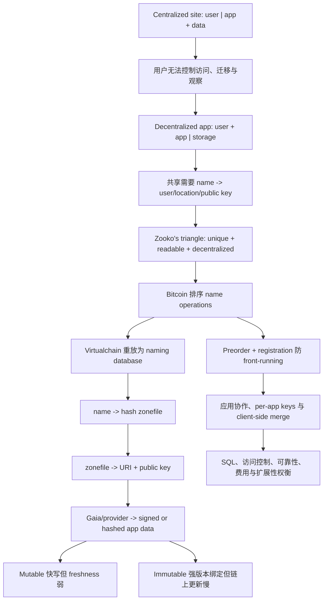

> 课程：MIT 6.824 Distributed Systems (Spring 2021)  
> 整理模式：`transcript+slides`；9 个时间段；教师讲义 `l-blockstack.txt` 共 1 页  
> 正式 lecture conclusion 结束于 `01:22:09`；Blockstack/ledger 课后问答覆盖至最后有声 segment `01:29:40.62`

## 学习目标

完成本讲后，应能够：

1. 解释 centralized website 为什么便于编程，却使用户数据受应用 UI、访问规则和服务方观察能力控制。
2. 画出 decentralized application 的 `user + app | storage` 边界，并说明 general-purpose storage、sharing、signature 和 encryption 的职责。
3. 从协作应用对用户、数据位置和 public key 的需求，推导 naming/PKI 为什么是 Blockstack 的核心。
4. 用 email address、random public key 和 contact list 解释 Zooko's triangle 的 unique、human-readable、decentralized 三项性质。
5. 说明 Bitcoin 中有序的 name operations、first-valid-claim-wins 和 deterministic replay 如何形成 globally consistent naming state。
6. 描述 virtualchain、zonefile、routing/Atlas、Gaia/storage provider 的逐层解析路径，并区分 content hash 与 signature 的保护对象。
7. 比较 mutable 与 immutable storage：前者快速但不能仅靠签名证明 freshness，后者精确绑定版本但更新要进入慢速 blockchain path。
8. 解释 preorder/registration 两阶段注册如何阻止 front-running，以及为什么低熵人类名字的 commitment 需要 nonce 等随机成分。
9. 分析系统继承的 consensus/fork 风险、Namecoin 51% 风险、链外 availability、private-key loss/theft、provider rollback 和恶意 app 等失败边界。
10. 评价 Blockstack 在 blockchain latency/throughput、ledger bootstrap、SQL/query expressiveness、访问控制、费用、PoW 能耗、用户付费和 global-name 价值上的权衡。

## 需要的先修知识

- Lecture 18 SUNDR：signed logs、Byzantine server、fork consistency，以及 cryptography 不能强迫 untrusted storage 提供 availability/freshness 的边界。
- Lecture 19 Bitcoin：transaction/block order、Proof of Work、temporary fork、longest-chain convergence、confirmations 和 51% attack。
- Lab 3/Raft：ordered operation log 经过 deterministic state-machine replay 形成一致 database。
- Public-key cryptography：private/public key、digital signature、encryption、collision-resistant hash 和 content-addressed verification。
- Storage/database：file-system-like API、SQL query/index、replication、URI、mutable object、immutable object 和 version number。

## 材料、链接与证据边界

### 课堂主证据

- [课程 MATERIALS 的 Lecture 20 条目](/courses/mit-6824-s21/materials/#lecture-20-blockstack)：本讲官方 paper、FAQ、Question、lecture note 和视频的课程级入口。
- [Lecture 20 阅读输入](/assets/courses/mit-6824-s21/evidence/reading-inputs/lecture-20.md)：由归档 paper/FAQ/Question 等生成的 evidence bundle，不是课堂 chronology，也不是完成版学习指南。
- [英文 transcript](/assets/courses/mit-6824-s21/lectures/021/transcript.txt)、[segment JSONL](/assets/courses/mit-6824-s21/lectures/021/transcript.jsonl) 与 [字幕](/assets/courses/mit-6824-s21/lectures/021/transcript.srt)：教师顺序、课堂问答和精确时间边界的主要依据。
- [教师讲义 l-blockstack.txt](/assets/courses/mit-6824-s21/lectures/021/materials/l-blockstack.txt)：官方一页 lecture note；只有第 001 段 prompt 直接附带该页，根笔记将其余内容单列为讲义补充，不伪装成对应时间段口述。
- [课程元数据](/assets/courses/mit-6824-s21/lectures/021/metadata.json)：视频、字幕、paper、FAQ、Question 与材料来源索引。
- [MIT 官方视频](https://youtu.be/DnyBPxo3B6I) 与 [课程归档视频 Part 21](https://www.bilibili.com/video/BV16f4y1z7kn/?p=21)：回听和画面核对入口。

### Paper reading：论文原文

- [Blockstack: A Global Naming and Storage System Secured by Blockchains](/assets/courses/mit-6824-s21/materials/official-materials/papers/blockstack-atc16.pdf)，Muneeb Ali、Jude Nelson、Ryan Shea、Michael J. Freedman，USENIX ATC 2016，是本讲 assigned paper。
- 阅读时优先跟踪：Namecoin production experience；blockchain limitations；virtualchain；control/data plane separation；name operations；Atlas/routing；storage；cross-chain migration；security、reliability 和 bootstrap tradeoffs。
- 论文的部署数字、merged mining 分析、checkpoint/skip lists 和迁链框架属于 paper evidence。课堂没有逐项教授这些机制，不得倒写成教师按相同顺序讲过。

### FAQ、Question 与课程讲义

- [Blockstack FAQ](/assets/courses/mit-6824-s21/materials/official-materials/faqs/blockstack-faq.txt)：课程网站的独立课后 FAQ，不等同于课堂回答。
- [Lecture 20 Question](/assets/courses/mit-6824-s21/materials/official-materials/questions/20-q-blockstack.html)：要求解释 unique、human-readable、decentralized 为何重要以及为何难以同时取得。
- [课程源 lecture note](/assets/courses/mit-6824-s21/materials/official-materials/lecture-notes/l-blockstack.txt)：本地 [材料副本](/assets/courses/mit-6824-s21/lectures/021/materials/l-blockstack.txt) 的来源文件。
- 本讲没有独立 secondary-summary reading；不要把 [Lecture 20 阅读输入](/assets/courses/mit-6824-s21/evidence/reading-inputs/lecture-20.md) 误称为论文原文或外部 summary。

## 精确分段

| 节 | 时间 | 教师推进角色 | 材料模式 | 详细笔记 |
| --- | --- | --- | --- | --- |
| 001 | 00:00:00-00:09:59 | 课程递进；集中式网站架构、成功原因与用户控制问题 | transcript + `l-blockstack.txt` | [第 001 节](#section-01) |
| 002 | 00:09:59-00:19:59 | 应用/存储分离；共享 todo；SQL、竞价与密钥管理挑战 | transcript only | [第 002 节](#section-02) |
| 003 | 00:19:59-00:29:56 | 架构问答；name→user/location/key；PKI 与 Zooko's triangle | transcript only | [第 003 节](#section-03) |
| 004 | 00:29:57-00:39:56 | Bitcoin name operations；first claim；replay；语义缺口与链上限制 | transcript only | [第 004 节](#section-04) |
| 005 | 00:39:56-00:49:54 | throughput/bootstrap 问题；virtualchain；zonefile 与链外数据路径 | transcript only | [第 005 节](#section-05) |
| 006 | 00:49:54-00:59:51 | mutable/immutable storage；integrity、authenticity、freshness；注册开端 | transcript only | [第 006 节](#section-06) |
| 007 | 00:59:54-01:09:53 | preorder/registration 防抢注；per-app keys；协作路径与 SQL 对照 | transcript only | [第 007 节](#section-07) |
| 008 | 01:09:53-01:19:51 | Keybase、加密共享、扩展性、冗余、费用与换链讨论 | transcript only | [第 008 节](#section-08) |
| 009 | 01:19:51-01:29:40.62 | 正式结论；课后 Namecoin 安全、URI、命名价值与 ledger checkpoint 问答 | transcript only | [第 009 节](#section-09) |

输入分段之间存在原 transcript 的静音小间隔，例如 `00:29:56.42-00:29:56.75` 与 `00:59:51.34-00:59:54.24`。表格按 `summary-input.jsonl` 的实际边界记录；第 009 节 prompt 显示到 `01:29:41`，最后有声 segment 实际结束于 `01:29:40.62`。

## 老师的教学主线



老师不是先罗列 Blockstack 组件，而是沿问题逐步逼出结构：

1. 集中式网站把 app 与 data 放在同一控制域，易开发却使用户只能接受网站 UI、规则和数据观察。[00:03:07-00:10:38]
2. 把 app 放到用户控制侧、storage 变成通用服务，可支持应用替换和 encryption，但失去集中 SQL、可信拍卖逻辑和简单 key recovery。[00:10:56-00:22:40]
3. 多用户协作必须可靠地标识用户、定位数据并得到 public key，因此 naming/PKI 成为基础依赖。[00:22:52-00:25:47]
4. Blockchain 的 consensus order 让 first valid name claim 可全局一致，virtualchain 再像 Lab 3 state machine 一样从 log 派生 naming database。[00:29:57-00:35:20]
5. Bitcoin 只适合小、低频、需要全局顺序的控制记录；zonefile 与 application data 必须外置，形成多层指针和验证链。[00:38:04-00:52:45]
6. 外置带来 mutable freshness、availability、replication、provider trust 和 programmer convenience 问题；cryptography 解决其中一部分，不提供完整答案。[00:53:05-01:19:51]
7. 正式总结肯定用户控制数据与 decentralized global naming 的探索价值，课后又用 Namecoin 51% 风险和 ledger growth 强调底层共识与长期运维不能忽略。[01:21:39-01:29:40]

## 核心架构与数据路径

### 集中式与去中心化边界

```text
centralized:
  browser/user | site application + site database

decentralized:
  user + chosen application | general-purpose storage providers
                              ^ naming/PKI locates and authenticates data
```

新边界让用户可选择 app、provider、sharing 和 encryption；代价是 application 必须自己处理跨用户数据发现、认证、版本、合并与 provider failure，而不能把一切交给同一 SQL database。

### Name operation 到应用数据

```text
Bitcoin blockchain
  -> virtualchain filters and validates Blockstack operations
  -> naming state: name -> H(zonefile)
  -> routing/Atlas returns candidate zonefile
  -> client verifies H(zonefile)
  -> zonefile entry: app key -> URI + public key [+ H(data)]
  -> Gaia/storage abstraction selects S3, Google Drive, etc.
  -> client fetches data and verifies signature or content hash
```

- **Bitcoin** 只建立 operation order 与 confirmations；它不解释 Blockstack name semantics。
- **Virtualchain/Blockstack nodes** 用相同 validation rules 重放链上 operations，过滤 duplicate/invalid creations，派生 current naming state。
- **Zonefile** 是小型间接层，使链上只存 hash。其内容可广泛复制；hash 允许从不可信来源取回并验证。
- **Atlas/routing** 负责按 content hash 找到 zonefile；知道 hash 不等于知道 location。
- **Gaia/storage layer** 用统一 API 隐藏 S3、Google Drive 等 backends，保存用户 application data；provider 仍可拒绝服务、丢数据或观察 access metadata。
- **Application** 在 client/user 控制侧完成 lookup、fetch、signature/version checks 和数据组合。

### Name creation

课堂简化的 commit-reveal：

$$c=H(name,nonce,\ldots)$$

```text
preorder(c)
  -> wait for confirmations
registration(name, nonce, owner binding, H(zonefile))
  -> virtualchain checks matching prior commitment
  -> first valid registration establishes ownership
```

直接广播 `name` 会让 miner/network observer front-run；裸 `H(name)` 又会被 dictionary attack，因此 commitment 必须加入随机或其他不可预测参数。教师讲义还列出 registration fee/burn address 和 owner public key；课堂没有逐字段核实 wire format。

## Naming、consensus 与 fork

### Zooko's triangle 的课堂结论

| 方案 | Unique/global | Human-readable | Decentralized |
| --- | --- | --- | --- |
| Email address | 是 | 是 | 否 |
| Random public key | 是（高概率） | 否 | 是 |
| Personal contact list | 否（只在本地语境唯一） | 是 | 是 |
| Blockchain name claim | first-valid-claim 给出 | 允许普通 string | 继承开放 blockchain |

取得三项不等于解决 identity：`6.824` 可读且全局唯一，却不说明它现实中属于哪门课或哪个人；用户仍需发现并验证对方的 Blockstack name。课堂也承认 public key + local contact list 可能更自然，因此 global uniqueness 的价值是设计问题，不是已证明的公理。[00:35:23-00:36:56] [01:25:47-01:26:57]

### State-machine replay

$$NamingState=Replay(Filter_{Blockstack}(BitcoinLog))$$

这与 Lab 3 的核心形状相同：consensus log 决定 operation order，deterministic application code 计算 state。区别是 Bitcoin 面向开放、成员未知的 Byzantine 网络，Blockstack 不控制其 leader election 或 block production。

### Fork 与安全继承

- 普通 concurrent mining/network delay 可制造 temporary Bitcoin fork；未稳定的 name preorder、registration 或 update 可能随 chain reorganization 回滚。
- 等待更多 confirmations 降低回滚概率，不产生绝对 finality。Blockstack 没有独立于底层 chain 的 fork-resolution protocol。
- 若攻击者控制底层 chain 多数 work capacity，可通过更长 fork 影响 name-operation order、回滚或 censor 上层 operations；不能因此伪造没有 private key 的 owner signature。
- Namecoin 的小 mining base 曾出现单一 miner/pool 超过 50% capacity 的课堂案例，因此 Blockstack 迁到更广泛、更难 overtaking 的 Bitcoin。[01:23:25-01:24:34]
- 改用另一 blockchain 理论上保留上层 state-machine 思路，但迁移 cutoff、state commitment、client upgrade 和规则兼容仍可能要求 coordination 或 protocol fork。

## Storage、security 与 failure 边界

### Mutable 与 immutable

| 模式 | Zonefile 记录 | 收益 | 代价 |
| --- | --- | --- | --- |
| Mutable | `URI + public key` | 应用文件可频繁原地更新，不走 Bitcoin | 签名只证明 writer；provider 可 replay 旧签名版本 |
| Immutable | `URI/public key + H(data)` | 精确验证被承诺的 content/version | 内容变更要改 zonefile hash，再发布链上 operation |

Version number 只在客户端知道更高版本时检测 rollback。第一次读取或没有外部 latest-version knowledge 时，合法 signature + version number 仍不能证明 provider 没有隐藏更新。老师在课堂明确承认 freshness 没有被基本方案完整解决。[00:54:37-00:55:19]

### 四类性质不能混淆

1. **Integrity**：content hash 检查返回 bytes 是否匹配共识 commitment。
2. **Authenticity**：signature 检查数据是否由对应 private-key holder 签署。
3. **Freshness**：证明这是最新写入；mutable path 仅靠 signature 做不到。
4. **Availability/durability**：对象是否仍被保存并可读取；需要 provider 和 replication，hash/signature 不能强迫 server 响应。

### Private keys 与 app trust

- 教师讲义说 master private key 不离开用户设备，由 Blockstack Browser 持有并受 passphrase 保护；普通 apps 获得 per-app private keys。
- Per-app keys 限制单个 app compromise 的影响，却让同一用户的不同 apps 共享数据更困难；这正是 isolation 与 interoperability 的冲突。
- Private key 丢失可能导致永久失去数据或名字控制，密钥被盗则攻击者看起来就是合法 owner。Blockchain consensus 不提供自然的 password reset。
- App 虽运行在用户控制的设备上，仍可能由 Facebook 等 vendor 编写并 snoop；“client-side” 不自动意味着软件可信。

### Encryption 与 sharing

课堂给出的 group lockbox 直觉：

$$C=Enc_{K_g}(data),\qquad L_i=Enc_{pk_i}(K_g)$$

大型 data 只用 group key 加密一次，各成员只取得一个面向自身 public key 的 envelope。它减少重复加密，却没有消除 group membership、revocation、key rotation、lost keys 和 metadata leakage 的复杂度；老师也明确未核实这是否就是 Blockstack 实际 format。

## Performance 与工程权衡

| 设计选择 | 解决什么 | 新代价/失败面 |
| --- | --- | --- |
| 复用 Bitcoin | 使用已有高安全预算和 global order | 小 records、慢 confirmations、低 throughput、fee、PoW 能耗 |
| Virtualchain | 无需修改 Bitcoin 就解释新 state machine | 必须扫描/过滤底层 history；状态继承底层 forks |
| 链上仅存 hashes/state transitions | 最小化昂贵 writes | 链外对象 discovery、replication、freshness 另行解决 |
| Zonefile indirection | 一次链上 binding 服务多个 app entries | 改 URI/key 仍需慢速链上 update；zonefile 必须可获得 |
| Gaia/provider abstraction | bulk data 快写，隐藏 provider API | provider 仍能删、延迟、观察访问；一致语义受 backend 差异影响 |
| User-owned storage | app switching、跨 app data、端到端 encryption | 数据格式可能不兼容；用户要选 provider、付费和管理 keys |
| Per-app keys | 降低 app compromise blast radius | 同一用户跨 app cooperation 变困难 |
| User-level sharding | 常见局部 sharing 可分散负载 | global index、ranking、SQL join、sealed bids 很难 |
| Preorder + registration | 防 name front-running | 两笔 transactions、两轮等待、更多 fee 与 UX 延迟 |
| Widely replicated zonefiles | 小 metadata availability | bulk mutable data 仍由用户/provider 负责 |

Ever-growing ledger 使新 node bootstrap 随历史增长。课堂只提出 snapshot/checkpoint 的类比并承认可能需要 fork；paper 的 checkpoint/skip-list 方案放在下一节，不冒充课堂已完整教授。[00:40:52-00:41:45] [01:27:00-01:29:23]

## 教师讲义补充：不要冒充课堂口述

以下来自 `l-blockstack.txt` p.1。它是整讲官方提纲，其中若干名称和问题未在 transcript 对应时间段逐项展开。

### 组件正式名称

- **Blockstack Browser / blockstack.js**：运行在 client side，连接 browser/application 与 naming/storage layers。
- **Blockstack servers / virtualchain**：读取 Bitcoin chain，解释 naming records，维护 `name -> public key + zone hash` database，并服务 naming RPCs。
- **Atlas servers**：保存由 content hash 标识的 zone records；所有 servers 保留完整小型 database，可看作替 Bitcoin transactions 承载较大 zone metadata。
- **Gaia servers**：为每个 end user 提供 key/value storage，后端可为 Amazon S3、Dropbox 等；profile 保存 user public key、per-app public keys，其他 files 保存 app data。

课堂主要用 `routing layer`、Blockstack storage/file-system layer、S3 和 Google Drive 解释这些职责；不能把每个正式组件名都写成老师在架构图讲解时逐字使用。

### Name creation 与存储检查问题

- 讲义把 preorder 写为 registration fee 到 burn address 加 `hash(name)`，registration 写为 `name + owner public key + hash(zonefile)`；实际 commitment 还需防 dictionary attack 的随机参数，课堂没有核实 wire format。
- 讲义要求思考：重复注册、并发注册、攻击者改变 `name -> key`、Blockstack server 改绑定。课堂答案的共同基础是 Bitcoin order、operation signatures 和 deterministic validation，而不是相信某台 Blockstack server。
- 讲义要求分别检查：怎样从 name/key 找数据；怎样验证 Gaia 返回正确 bytes；怎样知道 latest version；Gaia 怎样授权 write/delete；怎样对 owner、单个他人或 6.824 students 加密。课堂只完整回答了其中一部分，并明确保留 freshness/access-control format 不确定性。

### 讨论问题

- Decentralized naming 是否比 centralized but secure naming 更值得采用；Certificate Transparency 只能揭示不一致，不能像 mining/order 一样统一“谁先注册”。
- Cryptocurrency fee 对 spam resistance 和 open-blockchain incentives 可能关键；讲义据此质疑没有 cryptocurrency 的开放 chain 是否可持续。
- Programmer convenience、SQL、global indices、vote counts、front-page ranking、sealed bids、group revocation 都是 client-only app 的困难。
- Privacy 仍受 provider access metadata、malicious app、key management 和 freshness/availability trust 影响；用户控制仍受跨 app format incompatibility 和付费意愿影响。

这些问题是教师讲义的 discussion checklist，不等于课堂对每项给出确定答案。

## Paper-only：论文证据，不并入课堂时间线

本节只用于阅读 assigned paper。以下事实来自 [Blockstack paper](/assets/courses/mit-6824-s21/materials/official-materials/papers/blockstack-atc16.pdf) 及 [Lecture 20 阅读输入](/assets/courses/mit-6824-s21/evidence/reading-inputs/lecture-20.md)，不声称老师在视频中逐项讲授。

1. **Production scale**：论文报告在 Namecoin 上注册/更新超过 `33,000` 个 entries、发送超过 `200,000` 笔 transactions；Blockstack production PKI 当时服务约 `55,000` users。这些是 2016 paper 的部署数据，不是 2021 课堂 benchmark。
2. **Namecoin anomalies**：论文分析 network reliability 与 security，报告单一 miner 曾连续数月拥有明显超过 51% compute power，并指出 merged mining 在实践中没有保证多个小 chains 都安全。
3. **Largest secure blockchain 原则**：作者根据 Namecoin 广播问题、维护活跃度与经济激励，主张 blockchain-based services 应尽量复用最大、最安全的 chain，而不是为每个应用启动小 chain。
4. **Control/data plane separation**：论文把 minimal metadata、data hashes 和 state transitions 放 blockchain，把 bulk storage 放 external datastores；课堂讲了这一机制，但没有按 paper contribution 列表展开。
5. **Fast bootstrap**：论文称 Blockstack 使用 checkpointing 和 skip lists 限制新 node 初始 audit 的 blocks。课堂只提出 ledger scan 问题和课后 checkpoint 直觉，没有教授 skip-list protocol。
6. **Virtualchain contribution**：论文将 virtualchain 描述为在 production blockchain 上承载 arbitrary state machines、无需对底层 chain 做 consensus-breaking change 的逻辑层。
7. **Cross-chain migration**：论文给出底层 blockchain failure 时的 migration framework，并报告从 Namecoin 到 Bitcoin 的生产迁移。课堂只说系统已换过一次 chain、原则上可再换，没有教授 framework。
8. **结论边界**：paper 的 claims 基于当时的 implementation、network conditions 和 threat observations；不能把它们推广成所有 blockchains、现代 Stacks/Blockstack 版本或所有 decentralized applications 的当前保证。

## 易错点与待核对项

- **用户控制 data 不等于 provider 不重要**：provider 仍负责保存和响应，也能观察 access pattern；encryption/hash 不能提供 availability。[00:10:56-00:12:00] [01:15:59-01:17:25]
- **Global uniqueness 不等于 real identity**：first claim 统一 string binding，不证明现实中的“Robert Morris”是谁，也不自动完成 name discovery。[00:35:23-00:36:56]
- **Bitcoin 不理解 Blockstack operations**：它只签名、排序和保存 metadata；virtualchain 才解释 name creation/update rules。[00:43:19-00:45:57]
- **Hash 不负责 finding**：routing/Atlas 找候选 zonefile，hash 只让 client 验证候选内容。[00:52:20-00:52:45]
- **Signature 不等于 freshness**：旧版本也可正确签名；version number 没有 latest-version knowledge 时仍不足。[00:54:37-00:55:19]
- **First claim wins 不是任意 bytes 最早就赢**：operation 还要通过 preorder、registration、ownership/signature 和 state-machine validity checks。
- **Preorder 裸 hash 不安全**：human-readable names 可枚举，需要 nonce/salt 等输入防 dictionary attack。[01:01:32-01:01:58]
- **Per-app keys 是 isolation tradeoff**：降低 master-key 暴露，却阻碍同一用户的 apps 共享数据。[01:04:01-01:04:20] [课件: l-blockstack.txt p.1]
- **去中心化不自动更快**：链上 writes 更慢，链外 user sharding 只对局部访问可能有利；课堂没有给 scalability benchmark。[01:13:42-01:15:23]
- **51% power 不能伪造任意签名**：多数算力影响 ledger order/reorganization/censorship，不替代用户 private key。[01:23:25-01:24:34]
- [需回听 00:43:55] transcript 拼作 `OP_RETRUN`，正文使用正确的 `OP_RETURN`。
- [需回听 00:50:17] immutable hash 被口述成保证 latest；更精确的边界是“保证匹配当前共识记录所承诺的具体版本”。
- [需回听 00:55:38] 字幕称用 public key 签名；实际 private key 签名、public key 验证。
- [需回听 01:28:44-01:29:07] block headers、最后 transaction/current state 的口述混合，不据此补写完整 pruning/SPV 算法。

## 掌握标准

- 能从集中式架构的优点出发，而不是只列缺点，说明 Blockstack 为什么选择分离 app 与 user data。
- 能画出 todo-list 从 U1 安全获知 U2 name 到 lookup、zonefile、URI/key、fetch、verify、merge 的完整路径。
- 能用三组 two-of-three 例子解释 Zooko's triangle，并指出 global name 到 real identity 的剩余缺口。
- 能写出 `NamingState = Replay(Filter(BitcoinLog))`，说明 Bitcoin order 与 virtualchain validation 的分工。
- 能解释 temporary fork、confirmations 与 51% attack 怎样影响上层 name operations，同时不声称可伪造 user signatures。
- 能区分 zonefile hash、data hash、signature、version number、replication 分别提供什么、不提供什么。
- 能比较 mutable/immutable storage，并构造 storage provider replay 合法旧版本的反例。
- 能从 front-running 攻击推导 commit-reveal，再从 dictionary attack 推导 nonce 的必要性。
- 能分析 chain records、latency、throughput、ledger bootstrap、SQL/global query、密钥、fees、energy、privacy 和 app trust 的系统权衡。
- 能把 transcript/lecture note、assigned paper、FAQ、Question 和 reading input 保持为不同证据层级。

## 综合复习问答

1. **问：为什么 centralized website 一直很成功，Blockstack 仍想改变它？**  
   **答：** App 与 DB 同域让 SQL、部署、调试、性能、可靠性和收入模式都简单；但用户只能通过网站 UI/规则访问自己的数据，也难阻止观察、转售或规则变化。
2. **问：decentralized application 的决定性边界是什么？**  
   **答：** 用户选择 application 并控制它可访问的数据/provider；app 不必物理运行在 laptop，但 storage 不再被唯一 app server 私有控制。
3. **问：为什么 naming 同时服务 location 与 security？**  
   **答：** Name 要定位用户数据，也要取得可信 public key；否则不可信 storage 可返回伪造数据或替换验证 key。
4. **问：Blockstack 怎样同时取得 Zooko's triangle 三项？**  
   **答：** Human-readable string 作为 name，Bitcoin 给 operations 排序，first valid claim 决定唯一 owner，开放 consensus 避免单一中央分配者。
5. **问：virtualchain 与 Bitcoin 各自做什么？**  
   **答：** Bitcoin 提供有序、受 confirmations 保护的 bytes log；virtualchain 过滤 Blockstack records、验证 operation rules 并重放成 naming database。
6. **问：客户端怎样从 name 找到并验证 todo data？**  
   **答：** 由 name 得 `H(zonefile)`，routing/Atlas 返回 zonefile 并验 hash；从中读 URI/public key，经 Gaia/provider 取 data，再验 signature 或 content hash。
7. **问：为什么 mutable signed file 仍可能不安全？**  
   **答：** Provider 可返回所有者过去合法签署的旧版本；signature 证明作者，不证明 freshness，version number 也需要外部最新版本知识。
8. **问：两阶段 name registration 防什么？**  
   **答：** 先提交带随机成分的 hidden commitment，稳定后再 reveal，阻止观察未确认明文 name 的 attacker 抢先提交；nonce 防 common-name dictionary attack。
9. **问：Blockstack 从 Namecoin 迁到 Bitcoin 揭示什么原则？**  
   **答：** 上层安全继承底层 chain 的实际资源分布；小 chain 即使协议去中心化，也可能因单一 miner 超过 50% 而容易重组。
10. **问：这套架构最根本的 tradeoff 是什么？**  
    **答：** 用用户控制、app portability 和 end-to-end cryptography 换取更复杂的编程、密钥、sharing、freshness、availability、费用和跨用户查询问题。

## 复习顺序

1. 先读第 1、2 节，对照画出 `user | app + data` 与 `user + app | storage`，同时写出 centralized baseline 的工程优点。
2. 读第 3、4 节，用 email/public key/contact list 重建 Zooko's triangle，再用两条冲突 name claims 手算 first-valid-claim-wins。
3. 读第 5 节，不看笔记画出 `Bitcoin -> virtualchain -> zonefile -> URI/key -> provider data`，逐箭头标注谁负责 finding、ordering 和 verification。
4. 读第 6 节，为 mutable 与 immutable 各构造一次 update，说明何时必须发 Bitcoin transaction，并解释 stale signed response。
5. 读第 7 节，从 `google.com` front-running 推导 preorder/registration，再解释 nonce；随后完整复述 U1/U2 todo collaboration。
6. 读第 8、9 节，把 Keybase/global naming、group encryption、user sharding、replication、fees、PoW 和换链列成收益/代价表。
7. 单独阅读 [assigned paper](/assets/courses/mit-6824-s21/materials/official-materials/papers/blockstack-atc16.pdf)，重点核对课堂未详讲的 Namecoin production evidence、virtualchain contribution、checkpoint/skip lists 和 migration framework。
8. 用 [FAQ](/assets/courses/mit-6824-s21/materials/official-materials/faqs/blockstack-faq.txt) 与 [Paper Question](/assets/courses/mit-6824-s21/materials/official-materials/questions/20-q-blockstack.html) 检查误区；从 [MATERIALS Lecture 20](/courses/mit-6824-s21/materials/#lecture-20-blockstack) 返回完整资源入口。
9. 最后不看笔记回答“综合复习问答”，并用 [Lecture 20 阅读输入](/assets/courses/mit-6824-s21/evidence/reading-inputs/lecture-20.md) 检查 paper-only facts 是否被错误写成课堂口述。

## 证据与完整性审计

- 分段输入：`summary-input.jsonl` 共 9 条，起点 `0.12` 秒，终点 `5380.62` 秒；覆盖最后有声 segment。
- 转录输入：`metadata.json` 记录 `1,427` 个 transcript segments；本笔记最大时间标记覆盖 `01:29:40.62`。
- 讲义输入：`preparation.json` 记录 `1` 个材料页，来自 `l-blockstack.txt`；只有第 001 段 prompt 直接附带该页。
- 输出结构：`notes/sections/001.md` 至 `009.md` 各含固定六节、5 组问答、时间证据与待核对项。
- 教学边界：正式 lecture conclusion 到 `01:22:09`；项目 logistics 与课后 Blockstack/ledger Q&A 在第 009 节明确分隔。
- 阅读边界：assigned paper、FAQ、Question、lecture note 和 reading input 分别链接；paper-only facts 不冒充 transcript chronology。
- 最终门禁验证：9 个 section 与根文件严格 UTF-8；每个 section 在根文件中按顺序完整出现一次；Markdown fences/数学块成对；所有本地相对链接目标存在；无冲突标记和 NUL byte；文件最后一行覆盖最后有声 segment 后的结束说明。

## 逐段详细课堂笔记

### 1. `00:00:00-00:09:59`

<!-- BEGIN EMBEDDED SECTION 001 -->

<div id="section-01" class="course-note-section-anchor" aria-hidden="true">&nbsp;</div>

# 第 1 段：从集中式网站到用户控制的数据

> 时间范围：`00:00:00-00:09:59`
>
> 证据范围：本段 transcript 与教师讲义 `l-blockstack.txt` p.1。教师讲义是整讲提纲；本段只采用与当前时间范围一致的开场、集中式网站和去中心化应用动机。

## 本段在整讲中的作用

老师把本讲放在课程最后三讲的递进中：SUNDR 讨论 signed log（签名日志），Bitcoin 讨论不可信、可能 Byzantine（拜占庭式作恶）的参与者如何形成共识；Blockstack 再向上走一层，研究如何把 blockchain 的性质用于 cryptocurrency 之外的完整 decentralized applications（去中心化应用）。[00:00:26-00:01:43] 随后老师没有直接介绍 Blockstack 组件，而是先画典型集中式网站，说明真正要改变的是应用、数据和用户之间的所有权边界：传统网站把 application code 与 database 放在服务方一侧，用户只能通过网站给出的 UI 接触自己的数据。[00:03:07-00:09:59] [课件: l-blockstack.txt p.1]

## 教学展开

1. **定位最后一次 paper discussion** [00:00:07-00:00:40]：本周还剩本讲和项目展示；本讲指定阅读是 Blockstack，主题是以用户而非网站控制数据的方式构造 decentralized applications。
2. **连接 SUNDR 与 Bitcoin** [00:01:10-00:01:43]：前两讲分别提供 signed logs 和开放 Byzantine 环境中的 consensus（共识）背景；今天的问题是怎样在这些机制之上构造非货币应用。
3. **说明愿景并非新发明** [00:01:47-00:02:46]：早期 Peer-to-Peer applications、Keybase、Solid 等都探索过类似方向。Bitcoin 的成功重新激发了兴趣，因为 blockchain 可以被用于货币之外的记录；Blockstack 是有真实实现、用户和应用的案例，其关键挑战是 naming（命名）。[课件: l-blockstack.txt p.1]
4. **画出集中式网站边界** [00:03:07-00:05:38]：浏览器通过 Internet 访问网站的 web servers；服务器运行 application code，并通过内部 API 操作 database。用户看见的是 HTML/UI，服务方则同时控制程序和数据。
5. **承认集中式架构的成功原因** [00:05:41-00:07:46]：应用与数据放在同一管理域，程序员可使用针对应用设计的数据库 schema、SQL query、index 和权限机制；部署、调试、性能、可靠性及收入模式也都已有成熟方案。老师强调去中心化方案必须与一个“很好用”的基线比较，而不是与明显失败的架构比较。[课件: l-blockstack.txt p.1]
6. **列出用户侧问题** [00:07:48-00:09:59]：blog post、Gmail、Piazza、Reddit comment、photo、calendar、medical record 等往往是用户产生的数据，但用户只能使用网站指定的 UI；网站可以改变访问规则、分析或出售信息，员工也可能越权查看。设计症结是主要接口位于“用户”和“application + data”之间，HTML 偏向展示，不是让用户拥有、迁移和复用数据的通用接口。[课件: l-blockstack.txt p.1]

## 概念、符号与推导

- **Centralized website（集中式网站）**：服务方控制 web server、application code 和 database；用户通过服务方定义的 UI/API 使用数据。
- **Decentralized application（去中心化应用）**：本讲的工作定义是系统让用户保留对数据的控制，而不是让某个网站拥有数据。[00:00:54-00:01:09]
- **控制边界**：集中式架构可概括为 `user | app + data`。这条边界让服务方容易编程，却使用户的数据访问依赖应用提供的界面和规则。
- **课程递进**：`signed log -> decentralized consensus -> complete decentralized application`。Blockstack 并不是重新教授 Bitcoin，而是把上一讲的有序、抗 Byzantine 日志当作命名基础。
- **本段无公式推导**。老师使用架构图和接口边界作设计推导，没有给出数学公式。

## 例子与课堂提示

- **Gmail、Piazza 与 Reddit comments** [00:06:09-00:06:58]：这些例子说明“用户生成”不等于“用户控制”；数据格式、导出能力和访问规则仍由网站决定。
- **网站按广告获利** [00:09:59 附近]：服务方可根据用户数据选择广告，说明集中式收入模型与数据观察能力相互强化。该例服务于 privacy（隐私）与控制权动机，不等于所有集中式网站都会滥用数据。
- **HTML 作为边界的局限** [课件: l-blockstack.txt p.1]：HTML 很适合交付 UI，却通常不是通用的数据管理接口；它难以支持用户自由切换应用、跨应用组合数据或自行备份。
- **易错点**：老师没有说集中式网站在工程上失败。相反，他反复强调它容易编程、易于演化，并已在性能、可靠性和商业模式上取得成功；去中心化的价值主张必须承担由此产生的额外复杂度。

## 本段掌握检查

1. **问：本讲与 SUNDR、Bitcoin 两讲怎样衔接？**  
   **答：** SUNDR 提供 signed log 背景，Bitcoin 展示开放 Byzantine 共识；Blockstack 研究怎样利用这类机制构造非货币的完整去中心化应用。[00:01:10-00:01:43]
2. **问：老师如何定义本讲语境中的 decentralized application？**  
   **答：** 用户保持对自己数据的控制，网站或应用不再同时拥有程序与数据。[00:00:54-00:01:09]
3. **问：集中式网站为何容易开发？**  
   **答：** application code 与 database 位于同一管理域，可使用应用专用 schema、SQL、索引、权限、部署和调试工具。[00:05:41-00:07:46]
4. **问：集中式架构的核心设计问题是什么？**  
   **答：** 主要接口把用户与“应用 + 数据”隔开；用户只能通过服务方的 UI 和规则接触本应属于自己的数据。[00:07:48-00:09:59]
5. **问：Blockstack 为什么在课程中值得研究？**  
   **答：** 它是已有实现、用户和应用的真实系统，并尝试把 blockchain 用于 decentralized naming 与应用数据控制，而非仅用于 cryptocurrency。[00:02:07-00:02:46]

## 待核对项

- [需回听 00:01:18] 字幕把前讲内容转写为 `logs and signing or sign log`；结合课程顺序与语境，应理解为 SUNDR 的 signed logs，不扩写为课堂未说的具体协议性质。
- [需回听 00:02:20] 字幕中的项目名不稳定；正文只保留 transcript 和教师讲义都明确支持的 Keybase、Solid 与早期 Peer-to-Peer applications。
- 本段在 `00:09:59` 处切断一句关于网站利用数据获利的话；其后续内容归入第 2 段，避免跨分段重写。

<!-- END EMBEDDED SECTION 001 -->

### 2. `00:09:59-00:19:59`

<!-- BEGIN EMBEDDED SECTION 002 -->

<div id="section-02" class="course-note-section-anchor" aria-hidden="true">&nbsp;</div>

# 第 2 段：应用与存储分离及其技术代价

> 时间范围：`00:09:59-00:19:59`
>
> 证据范围：本段仅依据 transcript；本分段提示没有附带课件材料。教师讲义中的同主题内容不作为本段新增口述证据。

## 本段在整讲中的作用

承接上一段集中式网站对数据的控制，老师先完成 privacy（隐私）问题，再把系统边界改画为 `user + application | storage`：storage provider 只提供通用存储，应用由用户选择并读取多个用户的数据。[00:09:59-00:15:42] 随后他立即检验这幅架构图的代价，区分商业挑战与本讲关心的技术挑战，并从弱于 SQL 的 storage API、跨用户数据分散、保密竞价和 private-key management 推到本讲的核心：naming。[00:15:46-00:19:59]

## 教学展开

1. **完成集中式网站的问题清单** [00:09:59-00:10:38]：网站可能基于用户数据投放广告、进行观察，恶意员工也可能越权查看。数据一旦交给网站，用户几乎无法控制这些行为，因此需要不同的系统设计范式。
2. **引入纯 storage providers** [00:10:56-00:12:00]：Internet/cloud 仍然存在，但 provider 不运行应用逻辑，只像 Google Drive 或 Amazon S3 一样保存 bytes。用户选择数据放在哪里，并可加密数据，使 provider 不能读取内容。
3. **把 application 放到用户控制侧** [00:12:04-00:13:42]：U1、U2 可运行不同应用版本；应用通过统一、general-purpose storage API 读取自己的数据和获授权的他人数据。主要接口由 `user | app + data` 移到 `user + app | data`。
4. **说明 storage API 的要求** [00:13:47-00:13:56]：接口要足够通用，支持 todo list、photo viewer、Twitter clone 等不同应用，还要按 permissions 支持用户之间和应用之间的 sharing。
5. **用共享 todo list 走一遍读路径** [00:13:59-00:15:00]：U1 得知 U2 的 todo-list 名称后下载 U2 的文件，检查 signature 以确认数据确由 U2 写入，再与 U1 的列表组合成共同 UI。服务端只有通用存储，没有应用专属 server。
6. **总结所得控制权** [00:15:21-00:15:42]：数据不再从属于特定网站；用户决定谁和哪些 applications 可访问数据。老师把这些性质称为 desirable，但没有把方案描述为无代价。
7. **区分商业与技术挑战** [00:15:46-00:16:31]：收入模式、采用率和开发者激励属于 business side，本讲不展开；余下重点是技术限制。
8. **指出通用存储弱于集中式数据库** [00:16:43-00:18:27]：file-system-like API 不如 SQL 强大，数据分散在多个 storage servers，应用难以对所有用户数据运行任意 query、index 或 aggregate。
9. **指出可信计算与密钥管理难题** [00:18:32-00:19:34]：eBay 式 sealed bids 需要某个实体或协议读取 bids、决定赢家，却不能提前向竞标者泄露内容；用户丢失 private key 会失去数据，密钥被盗则攻击者可访问数据。
10. **落到 naming** [00:19:34-00:19:59]：这些困难普遍存在于 decentralized application infrastructure；Blockstack 也面对它们，但本讲主要沿 naming 展开。

## 概念、符号与推导

- **Storage provider**：只提供持久化和读写接口，不运行 application-specific code；用户负责选择 provider、授权和可能的 encryption。
- **General-purpose storage API**：多个应用共享的通用数据接口，必须支持跨用户、跨应用 sharing 和 permissions；其通用性意味着它通常没有应用专用 SQL database 的表达力。
- **架构边界变化**：

  ```text
  centralized:    user | application + database
  decentralized:  user + application | general-purpose storage
  ```

- **真实性与保密性不同**：signature 用来验证 U2 写过文件；encryption 用来限制谁能看文件。二者不能互相替代。
- **控制条件**：应用不必物理运行在 laptop 上；关键是用户选择运行哪个 application，以及该应用可访问哪个 storage provider。这个限定在下一段问答中会被明确说出。
- **本段无公式推导**。老师通过架构边界、API 能力和反例作机制分析。

## 例子与课堂提示

- **不同 photo viewers** [00:12:23-00:12:51]：U1、U2 可以用不同 UI 处理共享照片，说明 application 不再与唯一网站绑定。
- **共享 todo list** [00:13:59-00:15:00]：用于展示没有应用服务器时的基本协作：各用户写自己的数据，另一方读取、验签并在客户端合并。
- **Twitter clone** [00:13:21-00:13:34]：应用从不同用户处取回 tweets 后集成显示，暴露跨用户扫描和排序将比中央数据库困难。
- **eBay bids** [00:18:32-00:18:59]：用于说明有些逻辑既需要看到所有秘密输入，又不能把秘密交给任一参与者控制的 client；单纯“数据归用户”不能自动实现这种可信计算。
- **易错点**：storage provider 不可信并不等于它可以不可靠。加密可防读内容，签名可防伪造，但数据删除、旧版本返回和可用性需要另外处理。

## 本段掌握检查

1. **问：去中心化架构把主要接口边界移到了哪里？**  
   **答：** 移到用户控制的 application 与 general-purpose storage 之间，即 `user + app | data`。[00:12:59-00:13:42]
2. **问：共享 todo list 如何确认 U2 的数据是真的？**  
   **答：** U1 下载 U2 的文件，并用 U2 的 public key 检查 signature，再与自己的列表合并。[00:14:19-00:14:50]
3. **问：为什么 storage API 不能简单等同于 SQL？**  
   **答：** 它必须跨应用、跨 provider 通用，且数据分散，无法自然地对全部用户数据运行集中式任意查询。[00:16:43-00:18:27]
4. **问：sealed-bid auction 为什么难以仅靠用户侧应用实现？**  
   **答：** 决策逻辑需要看到 bids 来选赢家，又不能把其他人的 bids 暴露给运行在竞标者控制下的应用，需要可信方或额外协议。[00:18:32-00:18:59]
5. **问：本讲为何在众多挑战中聚焦 naming？**  
   **答：** 协作应用必须可靠地找到用户、数据和 public key；Blockstack 把这项基础设施作为核心设计问题。[00:19:28-00:19:59]

## 待核对项

- [需回听 00:11:23] 字幕在 storage provider 描述处缺词；上下文只支持“保存数据的通用服务”，正文不补写具体内部结构。
- [需回听 00:17:11-00:17:44] 课堂发生屏幕/白板切换，口述短暂停顿；不构成新的设计步骤。
- [需回听 00:19:04] 字幕把 key-management 情境转写得不完整；可确认的两种后果是丢失 private key 后无法取回数据，以及密钥被盗后攻击者获得访问能力。

<!-- END EMBEDDED SECTION 002 -->

### 3. `00:19:59-00:29:56`

<!-- BEGIN EMBEDDED SECTION 003 -->

<div id="section-03" class="course-note-section-anchor" aria-hidden="true">&nbsp;</div>

# 第 3 段：Naming、PKI 与 Zooko's triangle

> 时间范围：`00:19:59-00:29:56`
>
> 证据范围：本段仅依据 transcript；本分段提示没有附带课件材料。课堂问答先完成上一段架构澄清，之后才正式进入 naming。

## 本段在整讲中的作用

老师先用三组学生问题收紧 decentralized application 的定义：保密竞价为何需要额外信任、不同用户为何可以选择不同 app、app 是否必须运行在本机。[00:20:03-00:22:40] 在这些边界清楚后，他从共享 todo list 的三个需要逐步推出 naming infrastructure：名字要指向用户、数据位置和 public key。随后用 Zooko's triangle 把目标精确为 unique/global、human-readable、decentralized 三项，并通过 email address、random public key 和 contact list 证明常见方案通常只能得到其中两项。[00:22:52-00:29:56]

## 教学展开

1. **澄清 sealed bids** [00:20:03-00:21:04]：运行在 U1 控制下的 app 若直接取得 U2 的 bid，U1 可修改 app 并提前看到秘密。要公平选出赢家，需要 trusted party 或能实现同等性质的 protocol。
2. **澄清 app 可替换性** [00:21:07-00:21:53]：老师以 Vim 与 Emacs 类比，说明 U1、U2 可以选择不同程序操作相同种类的数据；传统 Twitter 网站通常只提供网站决定的应用行为。
3. **澄清“用户控制”而非“必须本地执行”** [00:21:55-00:22:40]：app 原则上可运行在 Internet 上；决定性条件是用户选择 app，并决定它可访问哪些 storage providers 和数据。
4. **从协作需求引出名字** [00:22:52-00:24:29]：共享 todo list 时，U1 必须能指明 U2、定位 U2 的数据，并取得 U2 的 public key 以验证不可信 storage 返回的数据。这形成三类映射：`name -> user`、`name -> data location`、`name -> public key`。
5. **命名 public-key infrastructure** [00:24:40-00:25:47]：名字到 key 的可靠映射称为 PKI（public key infrastructure）。老师列举 DNSSEC、Web certificates 和 Kerberos 所在的相关基础设施背景，指出 Blockstack 的特色是试图提供 decentralized PKI。
6. **提出三项 naming 目标** [00:25:51-00:26:55]：general-purpose naming 希望名字 globally unique、human-readable 且 decentralized。论文认为任取两项较容易，同时取得三项困难。
7. **检验 email address** [00:27:00-00:27:31]：email address unique 且 human-readable，但依赖域名和组织管理，不满足此处的完全 decentralized 目标。
8. **检验 random public key** [00:27:33-00:28:21]：随机 key 以高概率 unique，任何人都能 decentralized 地生成，但不适合人类记忆。老师把它连接到 Lab 3 的随机 clerk IDs。
9. **检验 contact list** [00:28:23-00:29:45]：个人通讯录中的 `John` human-readable 且每个人可独立命名，但我的 John 与你的 John 可指向不同人，因此不 globally unique。
10. **留下下一段问题** [00:29:49-00:29:56]：常见系统都停在 two out of three；论文声称 Blockstack 得到了三项，下一段解释它怎样借助 blockchain 达成。

## 概念、符号与推导

- **Naming 的三种职责**：识别交互对象、找到其数据、找到验证/加密所需的 public key。这三者必须可靠连接，否则 storage 可替换 URI、数据或 key。
- **PKI（public key infrastructure）**：可靠建立 `name -> public key` 绑定的基础设施。课堂把它作为 decentralized applications 的关键依赖，而不是只用于 TLS certificates。
- **Zooko's triangle**：

  | 性质 | 课堂含义 |
  | --- | --- |
  | Unique / global | 同一名字对所有人解析为同一对象 |
  | Human-readable | 人能记住、交流和识别名字 |
  | Decentralized | 不依赖一个中央命名分配者 |

- **三组 two-of-three**：`email = unique + readable`；`random public key = unique + decentralized`；`contact list = readable + decentralized`。
- **本段无公式推导**。老师以分类表和反例说明三性质之间的张力。

## 例子与课堂提示

- **Vim 与 Emacs** [00:21:26-00:21:37]：强调 app choice 与 data ownership 分离；例子不表示真实 Blockstack 数据格式天然兼容任意 editor。
- **Twitter 只有一个网站行为** [00:21:38-00:21:51]：用来对照用户不能自由替换控制相同数据的客户端逻辑。
- **Lab 3 clerk IDs** [00:28:14-00:28:21]：说明随机值可在无协调情况下以高概率避免碰撞，但可读性很差。
- **两份 contact lists 的 John** [00:28:45-00:29:34]：说明本地语境能赋予可读名字意义，却不能把同一 string 变成全球唯一 identity。
- **易错点**：globally unique name 只保证所有人对记录的解析一致，不证明该名字背后是现实世界中的哪一个人。老师在下一段会专门指出这个缺口。

## 本段掌握检查

1. **问：decentralized app 是否必须运行在用户 laptop 上？**  
   **答：** 不必须；它可以运行在别处，但用户必须能选择 app，并控制该 app 对 storage 的访问。[00:22:11-00:22:40]
2. **问：名字在共享应用中承担哪三项职责？**  
   **答：** 标识用户、定位该用户的数据，以及取得验证数据真实性所需的 public key。[00:23:08-00:24:29]
3. **问：Zooko's triangle 的三项性质是什么？**  
   **答：** globally unique、human-readable 和 decentralized。[00:26:02-00:26:55]
4. **问：为什么 random public key 只满足两项？**  
   **答：** 它可无协调地产生并以高概率唯一，但长随机值不 human-readable。[00:27:33-00:28:21]
5. **问：个人 contact list 为什么不是 global naming system？**  
   **答：** 每个人可独立使用可读名字，但相同名字在不同通讯录中可能指向不同对象。[00:28:45-00:29:34]

## 待核对项

- [需回听 00:25:08-00:25:23] 老师把 DNSSEC、Web certificate infrastructure 与 Kerberos 并列为 PKI 相关例子；Kerberos 通常以对称密钥和 KDC 为核心，正文只保留课堂的宽泛基础设施对照，不据此给出严格分类。
- [需回听 00:26:09-00:26:24] 字幕将 unique name 的例子识别为 `John`/`Joe` 不稳定；不影响“每个名字全局指向同一对象”的定义。
- [需回听 00:28:35-00:28:45] 学生先提出 Peer-to-Peer file sharing，老师改用更简单的 contact list；正文按老师最终例子记录。

<!-- END EMBEDDED SECTION 003 -->

### 4. `00:29:57-00:39:56`

<!-- BEGIN EMBEDDED SECTION 004 -->

<div id="section-04" class="course-note-section-anchor" aria-hidden="true">&nbsp;</div>

# 第 4 段：以 Bitcoin 日志分配全局名字

> 时间范围：`00:29:57-00:39:56`
>
> 证据范围：本段仅依据 transcript；本分段提示没有附带课件材料。课堂将核心方法归因于 Namecoin，Blockstack 采用并迁移了这一思路。

## 本段在整讲中的作用

上一段留下“怎样同时取得 unique、human-readable、decentralized”这一问题。本段给出第一个核心答案：把 name-claim operations（名字声明操作）嵌入已有 blockchain 的有序交易日志，按 first valid claim wins 解释记录；所有节点从同一 consensus order 重放操作，就得到相同 naming database。[00:29:57-00:35:20] 老师随后主动收缩结论：这种机制解决的是名字分配与全局解析一致性，不解决名字的现实含义或如何发现某人的名字。[00:35:23-00:36:56] 最后他转向复用 Bitcoin 的工程限制，为下一段的分层架构做铺垫。[00:38:04-00:39:56]

## 教学展开

1. **承认方案来源** [00:29:57-00:30:40]：Blockstack 利用 blockchain 获得三项命名性质；老师说明这一基本 approach 最早来自 Namecoin，Blockstack 是采用者而非原始发明者。
2. **选择已有 Bitcoin chain** [00:30:40-00:31:17]：理论上可用其他 blockchain，但课堂以 Bitcoin 为具体底层。miners 持续把 transactions 加入一条有 consensus order 的链。
3. **把 name record 放进 transaction metadata** [00:31:19-00:31:56]：特殊 transaction 的 metadata 携带 name record，例如名字 `6.824` 和稍后解释的 zonefile hash。Bitcoin 本身只把它当作被签名、被排序的数据。
4. **定义 first claim wins** [00:31:56-00:32:39]：同一名字若出现多次，链上最早的有效声明取得名字，后来的重复创建被忽略。顺序由 Bitcoin consensus 决定，不由 Blockstack server 私下决定。
5. **从 log 重建 database** [00:32:42-00:33:50]：Blockstack node 从链起点扫描，筛出 naming operations，按顺序执行有效操作并建立当前 `name -> record` 状态。老师把它类比 Lab 3：Raft 给出 operation log，state machine 重放 log 得到 database；这里只是共识层换成 Nakamoto consensus。
6. **逐项检验 Zooko's triangle** [00:34:02-00:35:20]：first claim wins 给出 uniqueness；Bitcoin 的开放 consensus 提供 decentralization；记录中的 string 可以 human-readable。Namecoin 首先展示了这种三项组合。
7. **限定“名字有意义”的结论** [00:35:23-00:36:56]：`6.824` 是可读 string，却不说明它是课程号、零件号还是某个人；一个全球名字也不自动证明背后的 real-world identity。系统还没有回答“怎样知道你的 Blockstack name”或“怎样确认该名字就是你”。
8. **回答 Namecoin 实现问题** [00:37:02-00:37:50]：Namecoin 运行独立 blockchain，专门用于 naming，并有费用等额外规则；课堂到此只抽取其有序 claim 机制，没有展开所有 pragmatic details。
9. **开始列复用 blockchain 的限制** [00:38:04-00:39:56]：transaction metadata 可容纳小 name/value binding，却不能容纳 todo list；writes 要等待 blocks 和 confirmations，可能接近一小时，因此不能把高频应用数据直接写链上。

## 概念、符号与推导

- **Name operation**：编码在 blockchain transaction metadata 中、由上层 Blockstack interpreter 识别的名字状态操作。
- **First valid claim wins**：若有序日志中首个有效操作声明名字 $n$，后续冲突创建不改变所有者。可写成课堂机制的抽象状态转移：

  $$Apply(Create(n,r),S)=\begin{cases}S[n\mapsto r],&n\notin S\\S,&n\in S\end{cases}$$

  该记法是对老师口述规则的形式化整理，不是课件公式。
- **State-machine replay**：

  $$NamingState=Replay(Filter_{Blockstack}(BitcoinLog))$$

  每个正确 node 使用相同 chain order 和 validation rules，应得到相同 state。
- **共识依赖**：Blockstack 的 naming uniqueness 继承底层 chain 对 operation order 的共识；它没有独立运行 Raft，也不靠某台 Blockstack server 指定赢家。
- **语义边界**：global uniqueness 是 string 到 record 的一致绑定，不是 string 到现实身份的认证。

## 例子与课堂提示

- **两次声明 `6.824`** [00:31:45-00:32:39]：用于说明日志顺序怎样解决冲突；第二条并非从链上消失，而是被上层 naming rules 判为无效创建。
- **Lab 3/Raft 类比** [00:33:14-00:33:50]：共同点是从 ordered operation log 构造 deterministic state；不同点是 ordering mechanism，一个由 Raft replica group 提供，一个由 Bitcoin/Nakamoto consensus 提供。
- **`6.824` 到底表示什么** [00:35:23-00:35:48]：反例说明 human-readable 只关乎可读，不自动提供语义、发现或 identity proof。
- **todo list 不上链** [00:38:42-00:39:55]：用 data-size limit 与 confirmation latency 说明 blockchain 适合低频控制记录，不适合高频、大对象应用数据。
- **易错点**：课堂在此用“first one wins”作简化；真实 name creation 还需要 preorder/registration、签名、费用和有效性检查，第 6、7 段才展开，不能把任意最早 bytes 当作有效所有权声明。

## 本段掌握检查

1. **问：Blockstack 如何利用 Bitcoin 得到 globally unique names？**  
   **答：** 把 name claims 放入 Bitcoin 的有序日志，并按首个有效声明获胜解释冲突；所有节点重放同一顺序。[00:31:09-00:33:08]
2. **问：这一方案为何类似 Lab 3？**  
   **答：** 两者都把有序 operations 交给 deterministic state machine 重放成 database；区别是共识由 Bitcoin 而非 Raft 提供。[00:33:14-00:33:50]
3. **问：三项 naming 性质分别由什么给出？**  
   **答：** first claim wins 给 uniqueness，Bitcoin consensus 给 decentralization，允许普通 string 作为名字给 human readability。[00:34:02-00:35:20]
4. **问：全球唯一的 `6.824` 为什么仍不证明现实身份？**  
   **答：** 系统只统一该 string 对应的链上 record；它不说明谁在现实中控制该名字，也不告诉用户怎样发现正确名字。[00:35:23-00:36:56]
5. **问：为什么不能把 todo list 直接存入 Bitcoin？**  
   **答：** transaction metadata 很小、写入吞吐低且稳定确认慢，高频更新会受容量与约一小时确认等待限制。[00:38:42-00:39:56]

## 待核对项

- [需回听 00:30:44] 字幕出现 `Bitcoin blockstack`；结合上下文明确是 `Bitcoin blockchain`。
- [需回听 00:31:25] 老师把可携带上层数据的字段泛称 metadata；下一段明确说 `OP_RETURN`。正文不从本段补出 wire-format 字节限制。
- [需回听 00:37:16-00:37:39] Namecoin 费用规则的口述不完整；正文只记录“独立 chain、专门 naming、存在费用与额外规则”。
- [需回听 00:39:32] `cannot be forked off anymore` 应理解为等待更多 confirmations 后回滚概率降低，不是绝对不可能发生 fork。

<!-- END EMBEDDED SECTION 004 -->

### 5. `00:39:56-00:49:54`

<!-- BEGIN EMBEDDED SECTION 005 -->

<div id="section-05" class="course-note-section-anchor" aria-hidden="true">&nbsp;</div>

# 第 5 段：Virtualchain、zonefile 与链外数据路径

> 时间范围：`00:39:56-00:49:54`
>
> 证据范围：本段仅依据 transcript；本分段提示没有附带课件材料。教师在口述中称其为 `virtual chain layer`、`routing layer` 和 Blockstack storage/file-system layer；Atlas、Gaia 名称留给根笔记中的教师讲义补充。

## 本段在整讲中的作用

上一段已经证明 blockchain 能给 name claims 排序，但也暴露了记录小、写入慢的问题。本段先补齐 low throughput 和 ever-growing ledger 两项限制，然后给出 Blockstack 的核心分层：Bitcoin 只承载少量 naming metadata；virtualchain 从 Bitcoin blocks 过滤并解释 Blockstack operations，建立 `name -> zonefile hash` database；客户端凭 hash 从 routing layer 取得小 zonefile，再由其中的 URI 与 public key 去普通 storage provider 取应用数据并验签。[00:39:56-00:49:54] 这条 indirection（间接寻址）把低频、需要全局共识的控制状态留在链上，把大而频繁的数据留在链外。

## 教学展开

1. **补充 blockchain throughput 限制** [00:39:56-00:40:49]：除了单条 record 很小、confirmation 慢，Bitcoin 每秒只能处理少量 transactions。若每次 file operation 都走 blockchain，就无法形成高带宽 general-purpose application infrastructure。
2. **指出 ledger bootstrap 成本** [00:40:52-00:41:45]：新 Blockstack node 若从 Bitcoin genesis 扫描全部 transactions 才能重建 naming database，会花很久；更浪费的是，大部分 Bitcoin transactions 与 Blockstack 完全无关。老师明确说本讲不深入该 paper 问题。
3. **确定设计目标：最小化 blockchain 使用** [00:41:45-00:42:32]：为了 fast writes 和较高 bandwidth，系统不能把所有数据放链上；复杂架构图就是对这些限制的回答。
4. **从 Bitcoin 底层开始读图** [00:42:39-00:43:26]：底层 chain 包含大量普通 Bitcoin transactions，只有少数 blocks 中有 Blockstack-specific transactions。
5. **Virtualchain 过滤并解释 operations** [00:43:26-00:45:57]：Blockstack nodes 扫描 chain，找出 `OP_RETURN` 中的上层 operation，按 naming rules 执行，构造 `name x -> hash(zonefile)` database；重复创建等 invalid operations 被过滤。更新 zonefile 时会出现同一名字的后续合法 operation。
6. **说明链上更新为何要少** [00:45:03-00:45:34]：每次改 `hash(zonefile)` 都需要发布新的 Bitcoin transaction，既慢又要付费，因此 zonefile 应保持小而稳定。
7. **按 content hash 取得 zonefile** [00:46:02-00:46:32]：zonefile 可从任意来源返回；客户端重新计算其 hash，与通过 Bitcoin/virtualchain 得到的值比较。匹配即可确认拿到的是该名字当前链上承诺的 zonefile，而无需信任返回它的 server。
8. **从 zonefile 跳到应用文件** [00:46:33-00:48:25]：zonefile 像另一张小表，为 `todo` 等 well-known application key 保存 URI；mutable entry 还带 public key。U2 查名字 x、取 zonefile、验证 hash、读取 todo URI 和 x 的 public key、下载 todo file，再用 key 检查 file signature。
9. **回答 zonefile 丢失问题** [00:48:29-00:49:06]：学生指出链外对象不像 blockchain 数据那样天然保留。老师说 zonefiles 很小，会由 Blockstack core 广泛复制，因此可把完整 zonefile set 复制到许多节点。
10. **把 bulk data 交给多个 providers** [00:49:06-00:49:54]：todo file 可同时存到 S3、Google Drive 等 provider；Blockstack storage layer 的职责是为这些不同 backends 提供统一 API，而不是把全部应用数据复制进 blockchain。

## 概念、符号与推导

- **Control plane / data plane 分离**：课堂没有在本段反复使用这对术语，但机制清楚：链上保存全局有序的小型控制绑定，链外保存 zonefile 和 bulk application data。
- **Virtualchain**：解释底层 blockchain 中与 Blockstack 有关的 operations，并把它们重放为独立 naming state machine；Bitcoin 不理解 `CreateName` 或 `UpdateName` 的业务语义。
- **核心解析链**：

  ```text
  Bitcoin blocks
    -> filter/validate Blockstack OP_RETURN operations
    -> virtualchain database: name -> H(zonefile)
    -> routing layer returns zonefile
    -> verify H(zonefile)
    -> zonefile: app key -> URI + public key
    -> storage provider returns signed app data
  ```

- **Content-addressed verification**：若链上可信状态给出 $h=H(z)$，客户端接受候选 zonefile $z'$ 的条件是 $H(z')=h$。server 可拒绝服务，却不能在 hash assumption 下无声替换内容。
- **Application-data authenticity**：zonefile 的 hash 保护 zonefile；zonefile 中的 public key 再验证应用文件 signature。两层验证对象不同。
- **Fork 继承**：virtualchain state 取决于客户端当前接受的 Bitcoin chain。底层若发生临时 reorganization，尚未稳定的 name operation 也可能回滚；本段没有另造独立 finality protocol。

## 例子与课堂提示

- **从 genesis 扫描无关 Bitcoin transactions** [00:40:52-00:41:45]：用于说明复用大链带来的 bootstrap 成本；老师只点到为止，没有在课堂教授 paper 的 checkpoint/skip-list 方案。
- **`x -> hash(zonefile)`** [00:43:50-00:45:11]：最小链上 binding 既让全网同意 x 当前指向哪个 zonefile，又不要求把 zonefile 或应用数据塞入 transaction。
- **todo entry** [00:46:46-00:48:25]：把 abstract indirection 具体化为 name、zonefile hash、URI、public key、signed todo file 的逐跳查找。
- **S3 + Google Drive** [00:49:13-00:49:25]：说明 availability/replication 是用户和 storage layer 的责任；hash/signature 解决 integrity，不自动解决保存副本。
- **易错点**：知道 content hash 只允许验证返回内容，不能仅凭 hash 猜出文件位置。下一段 routing-layer 问答才明确“谁负责找到拥有该 hash 的对象”。

## 本段掌握检查

1. **问：Blockstack 为什么不把应用数据直接放进 Bitcoin？**  
   **答：** 单条数据受限、writes 和 confirmations 慢、throughput 低，而且全链持续增长；高频 bulk data 必须放链外。[00:39:56-00:41:45]
2. **问：virtualchain layer 做什么？**  
   **答：** 从 Bitcoin chain 过滤 Blockstack operations、按规则验证并重放，得到 `name -> zonefile hash` database。[00:43:26-00:45:57]
3. **问：客户端为什么不必信任返回 zonefile 的 server？**  
   **答：** 它从共识链派生出预期 hash，可对返回文件重算 hash；不匹配就拒绝。[00:46:02-00:46:32]
4. **问：zonefile 中的 public key 保护什么？**  
   **答：** 它用于检查 URI 所取应用文件的 signature，确认文件由名字所有者对应的 key 签署。[00:47:05-00:48:05]
5. **问：链外存储如何改善性能，又失去什么？**  
   **答：** 普通 provider 支持更大、更频繁的读写；但 availability、replication 和 freshness 不再由 blockchain 自动保证。[00:48:29-00:49:54]

## 待核对项

- [需回听 00:40:16] 字幕缺失具体 blockchain 名称；上下文是上一讲 Bitcoin 的低 transaction throughput，正文不采用未经回听的精确 TPS 数字。
- [需回听 00:43:55] transcript 拼作 `OP_RETRUN`；正确字段名为 `OP_RETURN`。
- [需回听 00:45:44] 教师口述 `virtual chain layer`；论文系统名为 `virtualchain`。正文同时保留概念和正式拼写。
- [需回听 00:48:57] zonefile 大小的口述大约是几 KB，字幕不稳定；正文只使用“小、可广泛复制”的课堂结论。

<!-- END EMBEDDED SECTION 005 -->

### 6. `00:49:54-00:59:51`

<!-- BEGIN EMBEDDED SECTION 006 -->

<div id="section-06" class="course-note-section-anchor" aria-hidden="true">&nbsp;</div>

# 第 6 段：Mutable/immutable storage 与 freshness 缺口

> 时间范围：`00:49:54-00:59:51`
>
> 证据范围：本段仅依据 transcript；本分段提示没有附带课件材料。老师对 version number、URI 数量和实际 access-control format 多次明确表示不确定，正文保留这些知识边界。

## 本段在整讲中的作用

上一段建立 `name -> zonefile hash -> URI/public key -> application file` 的查找链，本段集中回答链外存储最关键的 tradeoff：immutable entry 可以把 data hash 纳入共识路径、精确识别版本，但每次变化都要更新 zonefile 和 blockchain；mutable entry 只固定 URI 与 public key，可快速原地更新并验签，却不能仅靠签名保证读到 latest version。[00:49:54-00:55:19] 老师用连续问答明确 integrity、authenticity、freshness 和 availability 是四个不同性质，然后开始介绍 two-transaction name creation。[00:55:22-00:59:51]

## 教学展开

1. **介绍 immutable entry** [00:49:54-00:50:45]：该 entry 除 name/URI/public key 外还包含 file content hash，因此 hash 精确绑定某个版本。客户端能验证拿到的是该 immutable object。
2. **指出 immutable update 的链上成本** [00:50:50-00:51:03]：file hash 改变会使 zonefile 改变，进而需要发布新的 `name -> new hash(zonefile)` Bitcoin operation；写入重新受底层 latency 和 fee 约束。
3. **重申一般 mutable data 不逐次上链** [00:51:11-00:52:13]：用户 x 更新 todo file 时，name、zonefile URI 和 public key 都可保持不变；因此绝大多数 application operations 绕过 blockchain，链上只需小 name/zonefile-hash record。
4. **回答“只有 hash 怎样找 zonefile”** [00:52:20-00:52:45]：客户端把目标 hash 交给 routing layer；返回源不重要，因为客户端可重算 hash。Routing 负责 discovery，hash 负责 validation。
5. **区分 zonefile update 与 todo update** [00:53:05-00:54:03]：学生担心任何 file change 都会改变 hash。老师说明普通 mutable todo update 不改 zonefile；只有 URI、key 或其他 zonefile 内容变化才必须走 blockchain。
6. **明确 mutable/immutable 两种选择** [00:54:08-00:54:32]：不变数据适合记录 content hash；高频 mutable data 不应把每个内容 hash 放进 zonefile，而应保留稳定 URI 和 verification key。
7. **把 authenticity 与 freshness 分开** [00:54:37-00:55:19]：public key 可验证 todo file 确由 x 签署，但旧版本也可能有合法 signature。Version numbers 可以帮助检测已见版本的 rollback，却不能在没有额外可信渠道时证明当前返回的一定是 x 的最新写入；老师明确说 paper 没有详细解决这一点。
8. **说明 mutable write/read 位置** [00:55:22-00:56:13]：x 的 application 更新 URI 对应的 todo file 并签名；U2 从 x 的 zonefile 得到 URI，随后取回文件并验签。写应用数据不等同于写 routing metadata。
9. **保留 zonefile format 不确定性** [00:56:18-00:56:34]：学生问一个 name 是否只能有一个 URI；老师表示需要查看 source code 和具体 format，课堂不作结论。
10. **回答伪造 zonefile/public key 攻击** [00:56:42-00:57:38]：攻击者可以生成自己的 key 和任意 zonefile，但伪造 zonefile 的 hash 不会等于 Bitcoin naming record 中 x 所绑定的 hash；客户端只接受通过链上 commitment 验证的版本。
11. **宣布 big picture 已完整** [00:57:45-00:58:08]：老师称这一分层查找和验证路径是全系统最重要的部分，后续细节服务于理解边界。
12. **开始 two-phase name creation** [00:58:19-00:59:51]：用户要有 bitcoin 支付 miner inclusion；每个名字先发 preorder transaction，隐藏 actual name、只放 name hash，再发 registration transaction 揭示 name 并带 zonefile hash。为什么需要两步留到下一段回答。

## 概念、符号与推导

- **Immutable storage entry**：绑定具体 content hash。其验证链可写为：

  $$name\rightarrow H(zonefile)\rightarrow H(data)$$

  任一内容变化都会产生新 hash，并最终要求新的链上 zonefile commitment。
- **Mutable storage entry**：保持 `URI + public key`，数据可在 URI 处更新。验证条件是 signature 有效：

  $$Verify(pk_x,data,signature)=true$$

  这证明“掌握对应 private key 的主体签过该 data”，不证明“它是最新 data”。
- **Rollback detection 边界**：若客户端记得最高 version $v_{seen}$，收到 $v<v_{seen}$ 可检测 rollback；若收到 $v=v_{seen}$ 或客户端从未见过更高版本，它无法据此证明不存在更新版本。
- **四项独立性质**：content hash 支持 integrity；signature 支持 writer authenticity；replication/provider 支持 availability；latest-version/freshness 需要 version knowledge 或其他可信机制。
- **Name creation 初步记录**：课堂本段只给 `preorder: H(name,...)` 与 `registration: name + H(zonefile)` 的简化轮廓；nonce/owner key 等完整字段不能从本段 transcript 确定。

## 例子与课堂提示

- **频繁变化的 todo file** [00:53:37-00:55:19]：对照 mutable 与 immutable。若每次 todo edit 都进入 hash chain，安全承诺强但速度退化；固定 URI 可快写，却暴露 stale read 问题。
- **“我自己造一对 key”攻击** [00:56:42-00:57:38]：说明 public key 若没有可信 naming commitment 就毫无身份意义；真正防替换的是 Bitcoin 排序、name ownership 与 zonefile hash 的组合。
- **Routing 与 verification 分工** [00:52:20-00:52:45]：routing layer 可以不可信地返回候选对象；content hash 让客户端验证。找不到对象仍会失败，因此 integrity 不等于 availability。
- **Name registration 要付 bitcoin** [00:58:25-00:58:47]：用户支付的直接原因是让 miner 愿意把 transaction 包含进 ledger；教师讲义还列 name fee/burn address，但本段口述没有展开其定价。
- **易错点**：signature 不能阻止 storage provider replay 一个由 x 正确签过的旧版本；version number 也只有在客户端掌握更新版本信息时才能揭示 rollback。

## 本段掌握检查

1. **问：immutable entry 为什么能精确验证数据版本？**  
   **答：** zonefile 包含该版本的 content hash，客户端重算即可验证；不同内容会产生不同 hash。[00:49:54-00:50:45]
2. **问：为什么 mutable todo update 不需要 Bitcoin transaction？**  
   **答：** zonefile 中稳定的 URI 和 public key 不变，只替换 URI 处的签名数据。[00:53:37-00:54:03]
3. **问：有效 signature 为什么仍不能证明 freshness？**  
   **答：** 旧版本也由所有者合法签署；provider 可以 replay 旧数据，除非客户端另有最新 version knowledge。[00:54:37-00:55:19]
4. **问：攻击者为何不能替 x 换一个 public key？**  
   **答：** 伪造 zonefile 无法匹配 x 在共识 naming state 中绑定的 zonefile hash；客户端会拒绝 hash 不匹配的版本。[00:56:42-00:57:38]
5. **问：preorder 与 registration 在本段分别公开什么？**  
   **答：** preorder 先公开经处理的 name hash 而隐藏 actual name；registration 后续揭示 name 并发布 zonefile hash。[00:58:47-00:59:41]

## 待核对项

- [需回听 00:50:17-00:50:45] 老师把 immutable hash 与“latest version”连用；严格说 hash 只标识被承诺的特定版本，是否最新取决于当前 naming state。正文按其后续解释限定结论。
- [需回听 00:55:38] 字幕写应用“using the public key”签名；实际签名使用 private key、验证使用 public key。正文按密码学角色纠正，但保留为待回听项。
- [需回听 00:56:18-00:56:34] 一个 zonefile name 可有几个 URI，老师明确“不知道”；不补写实现细节。
- [需回听 00:59:29] registration transaction 的口述字段有断裂；正文只保留明确可听出的 actual name 与 zonefile hash，owner public key 见教师讲义补充。

<!-- END EMBEDDED SECTION 006 -->

### 7. `00:59:54-01:09:53`

<!-- BEGIN EMBEDDED SECTION 007 -->

<div id="section-07" class="course-note-section-anchor" aria-hidden="true">&nbsp;</div>

# 第 7 段：两阶段注册、防抢注与协作应用重放

> 时间范围：`00:59:54-01:09:53`
>
> 证据范围：本段仅依据 transcript；本分段提示没有附带课件材料。前半完成 name creation，后半重新走一遍 U1/U2 todo-list 路径，并进入开放讨论。

## 本段在整讲中的作用

本段先回答为什么注册名字需要 preorder 和 registration 两笔 transactions：若直接广播明文名字，观察 mempool 的 attacker/miner 可以提高自己的 transaction 优先级，抢先获得 first-claim-wins 的名字；commit-then-reveal 先把带随机成分的 hash 纳入稳定 chain，再揭示名字，从而约束 front-running。[00:59:54-01:02:11] 随后老师用完整 todo-list read path 把 naming、zonefile、per-app key、storage abstraction 和 signature 串回应用，并把“机制可行”与“像 SQL 一样好写”明确区分。[01:02:23-01:09:53]

## 教学展开

1. **定义 front-running** [00:59:54-01:01:03]：用户若直接广播注册 `google.com` 的 transaction，在它尚未入块时，miner 或 network observer 可复制名字并让自己的 transaction 先入链；first claim wins 反而会把名字授予抢跑者。
2. **用 preorder 锁定先手** [01:01:03-01:01:28]：用户先提交隐藏名字的 commitment，等待若干 blocks 使其稳定，再发 registration 揭示名字。后来者在看到明文时已经无法制造更早的对应 commitment。
3. **回答 dictionary attack** [01:01:32-01:02:11]：学生指出 `H(google.com)` 可预计算。老师同意实际 commitment 不能只是裸 name hash，必须包含 nonce 或其他参数，否则攻击者可做 dictionary lookup；他再次说明机制来自 Namecoin。
4. **回到两个用户的协作应用** [01:02:23-01:03:29]：U1 与 U2 分别运行 todo app，先通过某种安全方式获知对方的 Blockstack name。老师强调 naming system 不自动完成现实身份到名字的初始交换。
5. **U1 解析 U2** [01:03:34-01:04:47]：U1 lookup U2 name，取得并验证 zonefile，找到 todo entry 的 URI 和 public key，通过 Blockstack file-system abstraction 从实际 provider 取回文件，再验证 signature 和可能的 version information。
6. **说明 per-app keys** [01:04:01-01:04:20]：用户不应让所有 apps 使用 master private key；若单一 master key 被窃，所有数据都受影响。系统倾向给每个 application 独立 private/public key。
7. **双方周期性合并数据** [01:04:47-01:05:25]：U2 对 U1 做同样查找；一方更新自己的 file 后，另一方 app 定期重新读取，将两个用户的 items 合并为协作 UI。
8. **与 centralized SQL 路径对照** [01:05:31-01:06:43]：中央网站把 U1/U2 rows 放在同一 database，一条 SQL query 就能组合。去中心化版本需要 name exchange、lookup、zonefile、provider access、signature/version checks 和 client merge，机制显著更多。
9. **把可编程性列为 sticking point** [01:06:37-01:07:28]：老师把本讲定位为开放设计讨论，而非“一个难题只有一个正确答案”；关键问题是怎样让 decentralized apps 像 centralized apps 一样容易编写。
10. **回答为何不能直接给全球数据加 relational API** [01:07:32-01:08:41]：数据归不同用户、分散在不同 providers，无法对全球对象做一个普通 `SELECT`，也不能把所有数据下载到单机。研究可以构造 linked-data/scalable database infrastructure，但课堂指出 Blockstack 本身不提供这种能力。
11. **开始与 Web of Trust/Keybase 比较** [01:08:48-01:09:53]：学生问 decentralized PKI 的额外价值。老师先指出 group names、group public keys 和成员管理都复杂，并说 Keybase 是较成熟的 Web-of-Trust 方向；具体差异留到下一段。

## 概念、符号与推导

- **Commit-reveal / two-phase registration**：课堂简化协议为：

  $$c=H(name,nonce,\ldots)$$

  1. preorder transaction 发布 $c$；
  2. 等待足够 confirmations；
  3. registration transaction 揭示 `name`、`nonce` 及关联记录；
  4. virtualchain 检查 reveal 与先前 commitment 匹配并按顺序执行。

- **防护目标**：preorder 不让 observer 在第一次广播时知道 exact name；reveal 时，原注册者已有更早 commitment。它不负责证明该名字在现实世界属于谁。
- **Nonce 的必要性**：human-readable names 熵低，裸 $H(name)$ 易被 dictionary attack；随机 salt/nonce 让 observer 不能只枚举常见名字匹配 commitment。老师未给完整 wire format。
- **Per-app key isolation**：master private key 不交给普通 app；每个 app 使用派生或独立 key，把 compromise blast radius 限制在该 app 的 storage scope。
- **协作读取依赖链**：`secure name exchange -> name lookup -> zonefile -> app URI/key -> fetch -> verify -> merge`。任一步失败都可能影响 correctness 或 availability。

## 例子与课堂提示

- **抢注 `google.com`** [01:00:34-01:01:03]：把 front-running 具体化：未确认 transaction 是公开候选，不是秘密提交；miner 还可能控制 inclusion/order。
- **预计算 `H(google.com)`** [01:01:32-01:01:58]：学生反例迫使课堂补出 nonce/额外参数，说明“hash 隐藏名字”只有在输入不可枚举时才成立。
- **中央 SQL query 对照** [01:05:47-01:06:27]：集中式 database 可直接 join U1/U2 data；去中心化 ownership 让跨 provider query 和 global index 成为新问题。
- **全球 `SELECT` 的反例** [01:07:32-01:08:13]：若数据散布所有用户 provider，既无法要求每个 provider 加入单次 ACID query，也不能先下载全球数据。
- **易错点**：两个用户“知道彼此名字”是外部启动条件。Global uniqueness 只保证 lookup 一致，不保证 U1 最初安全获得的 string 真属于他想找的 U2。

## 本段掌握检查

1. **问：直接广播明文 name registration 会产生什么攻击？**  
   **答：** observer 可复制名字并让自己的 transaction 先入链，在 first-claim-wins 规则下抢走名字。[00:59:54-01:01:03]
2. **问：为什么 preorder 不能只保存 `H(name)`？**  
   **答：** 可读名字空间小，攻击者能预计算 dictionary；commitment 需加入 nonce 或其他不可预测参数。[01:01:32-01:01:58]
3. **问：U1 读取 U2 todo list 要经过哪些关键步骤？**  
   **答：** 安全获知 U2 name、解析 zonefile、取 todo URI/key、从 storage 取文件、验签/检查版本，再与本地数据合并。[01:03:14-01:04:56]
4. **问：为什么使用 per-app private keys？**  
   **答：** 避免把 master key 暴露给每个 app，并限制某个 app 或 key 被攻破后的影响范围。[01:04:01-01:04:20]
5. **问：去中心化协作为何比中央 SQL 更难写？**  
   **答：** 数据跨用户和 providers 分散，程序必须显式处理命名、发现、鉴权、版本与客户端合并，不能直接对单一 database 查询。[01:05:31-01:08:41]

## 待核对项

- [需回听 01:00:02] 字幕为 `go from front problem`；正确术语是 front-running problem。
- [需回听 01:01:22] 老师说把名字 `burn` into blockchain，语义是先前 commitment 已稳定记录；不要与 registration fee 的 burn address 混为一谈。
- [需回听 01:04:14] 字幕在 `Blockstack`/`blockchain` 之间摇摆；上下文是 Blockstack 的 per-application keys。
- [需回听 01:09:36-01:09:47] group key/name 的最后一句跨入下一段且转写破碎；正文只保留“群组表示与成员管理复杂”，不补协议。

<!-- END EMBEDDED SECTION 007 -->

### 8. `01:09:53-01:19:51`

<!-- BEGIN EMBEDDED SECTION 008 -->

<div id="section-08" class="course-note-section-anchor" aria-hidden="true">&nbsp;</div>

# 第 8 段：PKI、加密共享、扩展性与费用讨论

> 时间范围：`01:09:53-01:19:51`
>
> 证据范围：本段仅依据 transcript；本分段提示没有附带课件材料。本段以开放讨论为主，老师多次说明对 Blockstack 的具体 access-control format、性能上限和经济模型没有确定答案。

## 本段在整讲中的作用

核心机制讲完后，老师不再追加新组件，而是用学生问题检验设计是否兑现最初愿景。讨论先比较 Blockstack global naming 与 Keybase/Web of Trust 的 local naming，再从“用户决定谁能看数据”追问到 encryption、group keys 和 revocation 复杂度；之后审视 decentralized storage 的 scalability、replication responsibility、registration fee 和底层 blockchain 可替换性。[01:09:53-01:19:51] 本段的结论不是系统已经解决所有问题，而是 uniqueness、用户级 sharding 和可迁移 ledger 各有吸引力，同时 programmer convenience、freshness、key management、费用和 PoW 能耗仍是实质代价。

## 教学展开

1. **完成 Keybase/Web of Trust 对照** [01:09:53-01:11:23]：老师肯定 Keybase 是成熟且广泛使用的 decentralized PKI 方向，但说它不追求同一 string 的 global uniqueness；我通讯录中的 `John` 与你的 `John` 可映射不同 keys。Keybase 可把完整 name tree 的 Merkle root 发布到 blockchain 以帮助审计，却不因此变成 Blockstack 式全球命名。
2. **回答用户如何限制读者** [01:11:30-01:12:19]：一种做法是分别用 U1、U2 的 public keys 加密可解密材料，使只有相应 private-key holders 能访问。老师明确说不确定 Blockstack 的实际实现是否正是如此。
3. **用 group key/lockbox 降低重复加密** [01:12:26-01:13:24]：数据本体只用 group key 加密一次；lockbox 保存 group key，再分别面向各成员 public key 加密。成员先解开 lockbox，再解数据。老师把它作为已有设计模式，而非声称已核实 Blockstack wire format。
4. **讨论 performance/scalability** [01:13:42-01:15:23]：老师不作确定预测。Centralized systems 自身扩展到 millions of users 也很难，但已有更多大规模部署证据；decentralized architecture 可看作按用户 shard，若 U1 只与十人共享，局部工作可能不大，也不一定需要集中 data-center cache。
5. **给出谨慎态度** [01:15:28-01:15:36]：老师认为 decentralized design 很有吸引力，若能成功会很有价值，但这不是实测的 scalability guarantee。
6. **讨论 mutable data redundancy** [01:15:59-01:17:25]：用户要为自己的数据安排副本，例如同时使用 Google Drive 和 S3，或者依赖 S3 内部 replication；Blockstack storage layer 可协助，但 storage capacity 和 provider relationship 最终由用户负责。Zonefiles 小，可广泛复制。
7. **讨论 name registration cost** [01:17:58-01:19:11]：学生认为为命名付费浪费。老师指出开放 blockchain 要激励 miners，普通 DNS name 也收费；但他不知道具体 economics，并承认 Bitcoin PoW 的整体方式昂贵且耗电。
8. **讨论替换底层 ledger** [01:19:11-01:19:51]：学生提出 Proof of Stake。老师说论文主张上层设计对具体 blockchain 依赖较少，Blockstack 已从 Namecoin 迁到 Bitcoin，因此原则上可再次切换；课堂没有给出实际 PoS migration protocol。

## 概念、符号与推导

- **Global naming 与 Web of Trust**：Blockstack 让同一 name string 对全网解析一致；Web of Trust 可 decentralized 地建立 key relationships，却允许每个用户持有不同本地名称语境。
- **Merkle-root anchoring**：课堂说 Keybase 偶尔把完整 name tree 的 hash 发布到 blockchain，用来帮助检查服务没有对历史做手脚；这个 audit commitment 不自动提供 Blockstack 的 first-claim-wins global namespace。
- **Envelope encryption / lockbox**：可抽象为：

  $$C=Enc_{K_g}(data)$$

  $$L_i=Enc_{pk_i}(K_g)$$

  数据只加密一次；每个授权成员 $i$ 获得一个可用自己 private key 解开的 group-key envelope。成员增删、key rotation 和 revocation 仍需额外协议。
- **User sharding**：每个用户的数据天然位于自己的 storage scope，应用只访问有关用户。它可能分散 load，但跨大量用户的 global ranking/query 会丢失这种局部性。
- **安全与可用性边界**：加密防 provider 阅读、signature/hash 防无声伪造；provider 仍可观察访问 metadata、拒绝服务、删除数据或返回旧版本。用户安排 replication 并不解决 freshness proof。
- **Ledger abstraction**：上层依赖的是有序、可验证的 operation log；更换具体 blockchain 在概念上可行，但迁移时如何选择 cutoff、转移 state 并让 clients 升级不是本段所教内容。

## 例子与课堂提示

- **两个不同的 John** [01:10:24-01:10:49]：再次说明 decentralized local names 不等于 globally unique names，也引出“global uniqueness 是否值得付出 blockchain 成本”的问题。
- **Group lockbox** [01:12:34-01:13:05]：说明给 6.824 全班共享数据时不必把大型 data 重复加密 $N$ 次，但 membership change 仍会引出 key distribution 和 revocation。
- **只与十个用户共享** [01:14:24-01:14:46]：老师用局部 fan-out 说明按用户 shard 可能扩展；它不是 benchmark，也不能推广到 Reddit front-page ranking 等全局 workload。
- **Google Drive + S3** [01:16:34-01:17:15]：用于把 durability 责任从 naming blockchain 区分出来。Provider 本身可有可靠 replication，但用户仍信任其保存和返回数据。
- **DNS 也收费** [01:18:35-01:18:58]：用于说明“付费命名”并非 blockchain 独有；它没有证明 Blockstack registration 在成本、spam resistance 或公平性上优于 DNS。

## 本段掌握检查

1. **问：Blockstack 相比 Web of Trust 主要多追求什么？**  
   **答：** 同一 human-readable name 对所有参与者有一致、globally unique 的解析，而非每个人维护不同本地别名。[01:10:18-01:11:04]
2. **问：group lockbox 怎样避免为每人重复加密大文件？**  
   **答：** 用一个 group key 加密 data，只把 group key 分别用各成员 public key 封装。[01:12:26-01:13:05]
3. **问：为什么“按用户 shard”可能有扩展性优势？**  
   **答：** 每个 client 只访问相关用户的小范围数据和 provider，不必把全部用户数据集中到一套 server/cache；全局查询则仍困难。[01:14:24-01:14:57]
4. **问：谁负责 mutable application data 的 redundancy？**  
   **答：** 用户及其选择的 storage services；可复制到多个 providers，也可依赖 provider 内部 replication。[01:15:59-01:17:15]
5. **问：Blockstack 能否直接换成 Proof-of-Stake chain？**  
   **答：** 老师说论文主张上层对具体 chain 不强绑定，并以 Namecoin 到 Bitcoin 的迁移支持这一点；课堂没有给出无缝替换的实现或安全证明。[01:19:11-01:19:51]

## 待核对项

- [需回听 01:11:04-01:11:19] Keybase 发布 Merkle tree hash 的频率和具体 blockchain 未被可靠转写；正文只保留“偶尔发布 commitment 以便审计”的口述范围。
- [需回听 01:11:51-01:13:24] 老师多次说不确定 Blockstack 实际 access-control 实现；正文将 per-recipient encryption 和 lockbox 标为可行设计，而非系统已验证事实。
- [需回听 01:19:11] 字幕为 `stake-of-work ledgers`，上下文随后明确纠正为 Proof of Stake 对照 Proof of Work。
- [需回听 01:19:34-01:19:51] “可轻易换链”是论文主张的课堂转述；不能据此推断 migration 没有 coordination、fork 或 state-transfer 风险。

<!-- END EMBEDDED SECTION 008 -->

### 9. `01:19:51-01:29:40.62`

<!-- BEGIN EMBEDDED SECTION 009 -->

<div id="section-09" class="course-note-section-anchor" aria-hidden="true">&nbsp;</div>

# 第 9 段：正式结论与课后安全、存储问答

> 时间范围：`01:19:51-01:29:41`
>
> 证据范围：本段仅依据 transcript；本分段提示没有附带课件材料。正式 lecture conclusion 结束于 `01:22:09`；`01:22:24` 起先是项目展示安排，`01:23:25` 起才恢复 Blockstack/ledger 课后问答，覆盖最后有声 segment `01:29:40.62`。

## 本段在整讲中的作用

本段先收束底层 chain 可替换性和 name-history 问题，随后老师正式总结：本讲展示用户拥有数据的 decentralized design，并以 Blockstack 说明怎样取得 global、unique、human-readable names。[01:19:51-01:22:09] 课后问答再从失败与长期运行角度补三条边界：Blockstack 离开 Namecoin 是因为小 chain 的集中算力/51% 风险；统一 storage layer 隐藏 S3/Google Drive 差异；global uniqueness 的价值仍可争辩，ever-growing ledger 则可能借 snapshot/checkpoint 缩短 bootstrap，但需要 protocol change/fork 与可验证状态承诺。[01:23:25-01:29:40]

## 教学展开

1. **完成换链主张** [01:19:51 附近]：Blockstack 的 naming state machine 依赖底层有序 ledger，而非某一条 chain 的全部应用语义，因此论文认为可以迁移到另一 blockchain。课堂不进一步证明迁移正确性。
2. **回答 name history 保存什么** [01:20:10-01:20:45]：学生指着 Blockstack database 的多版本记录提问。老师推测这些条目对应 zonefile 的 successive updates/version history，但明确说不百分之百确定。
3. **正式结束并回到课程目标** [01:21:09-01:22:09]：老师宣布下次是八个 project teams 的展示；本讲目标是讨论让用户拥有数据的 decentralized designs，并看 Blockstack 如何实现 global、unique、human-readable naming。这里是正式 lecture end。
4. **项目展示 logistics** [01:22:24-01:23:21]：学生问演示还是 slides；老师建议少量 slides 加简短 demo，以说明做了什么、为什么有趣。这段属于课程安排，不是 Blockstack 机制。
5. **课后问答：为何复用 Bitcoin** [01:23:25-01:24:43]：Blockstack 早期运行在专用 Namecoin ledger 上，但观察到 miner pools 中有单一实体掌握超过 50% work capacity 的风险。为降低被 adversary overtaking 的可能，团队迁到使用更广、总算力更大的 Bitcoin chain。
6. **课后问答：URI 怎样统一 provider** [01:24:45-01:25:45]：zonefile 中 URI 由 Blockstack file-system/storage layer 解释，该层有 S3、Google Drive 等 backend adapters；application writer 使用统一 naming/API，不必直接处理每个 provider 的协议差异。
7. **课后问答：三角形是否真的需要第三项** [01:25:47-01:26:57]：学生认为 client 可把不可读 identifier 显示成人类可读本地名字。老师重申常见方案多为 two-of-three，也承认“global uniqueness 是否重要、`6.824` 到底意味着什么”是完全合理的质疑。
8. **课后问答：ledger 百年增长** [01:27:00-01:28:21]：老师不预测百年规模，但提出类似 Raft snapshot 的 checkpoint：把 current state 做成 snapshot，把其 hash 放进 ledger，广泛复制 checkpoint，新节点从那里继续 replay。要让所有 clients 接受截断点，可能需要 protocol change 或 fork。
9. **讨论存储优化边界** [01:28:29-01:29:23]：老师说 Bitcoin transaction rate 本身较低，且可用只保留必要最新状态、block headers 等思路降低存储/验证成本；这段口述把多种优化压在一起，不能据此断言 headers alone 足以完整重建所有 application state。
10. **覆盖最后有声 segment** [01:29:36-01:29:40]：老师结束当天课程并道别；媒体余下约三秒没有新的教学内容。

## 概念、符号与推导

- **Underlying-chain security inheritance**：Blockstack name order 的抗篡改能力上限受底层 blockchain 控制。小 chain 若单一 miner/pool 超过 50% compute capacity，攻击成本降低，可通过更长历史影响上层 name operations。
- **51% capability 边界**：课堂只说攻击者原则上可控制 ledger 历史/顺序；它不能仅凭算力伪造未掌握的 user private key。上层仍应验证 operation signatures。
- **Provider abstraction**：zonefile URI 不是要求 app 直接理解每个 vendor；Blockstack storage/file-system layer 把统一 operation 映射到 S3、Google Drive 等 backend。
- **Global uniqueness 是设计选择**：它便于把名字口头传给别人、阅读 ACL、让全网解析一致；代价是稀缺 namespace、registration fee、blockchain consensus，以及名字与现实 identity 之间仍缺 discovery/verification。
- **Checkpoint 设想**：若 $S_k=Replay(L_0\ldots L_k)$，可把 $H(S_k)$ 纳入后续 ledger，并让新 node 从可验证的 $S_k$ 开始重放。课堂没有给出 checkpoint producer trust、availability、proof format 或 fork-upgrade 细节。
- **Consensus/fork 关系**：ordinary Bitcoin forks 可暂时改变未稳定 operation order；Namecoin 的低算力增加恶意重组风险；协议为接受 checkpoint 而改变规则又可能需要 governance-level fork。这是三种不同层次，不应混称。

## 例子与课堂提示

- **Namecoin 单一矿工超过 50%** [01:23:49-01:24:34]：解释“为什么不启动自己的 naming blockchain”。开放链只有在足够广泛的 mining/security budget 下才难以重写；decentralized protocol 并不保证实际资源分布去中心化。
- **S3 与 Google Drive adapters** [01:24:45-01:25:39]：说明统一 API 的价值是 portability；它不能抹去 provider 在 durability、latency、pricing 和 observation 上的差异。
- **Client-side human label** [01:25:47-01:26:57]：学生反例说明可以用 public key + local contact name 绕开 global readable namespace；老师承认这是质疑 Blockstack 核心价值的有效角度。
- **Raft snapshot 类比** [01:27:31-01:28:21]：服务于 ledger compaction/bootstrapping，而不是说 Blockstack 已在课堂实现该方案。让所有 nodes 接受 checkpoint 仍涉及共识规则。
- **易错点**：正式结论后的问答仍是课程录音证据，但不是老师在主线中按计划展开的 paper design。项目展示 logistics 也不应混入 Blockstack 总结。

## 本段掌握检查

1. **问：老师正式结束本讲时强调了哪两个目标？**  
   **答：** 用户拥有数据的 decentralized application design，以及 Blockstack 提供 global、unique、human-readable naming 的方法。[01:21:39-01:22:09]
2. **问：Blockstack 为什么从 Namecoin 转向 Bitcoin？**  
   **答：** Namecoin mining 较小且出现单一 miner/pool 超过 50% compute capacity 的安全风险；Bitcoin 更广泛、更难被 adversary overtaking。[01:23:25-01:24:34]
3. **问：统一 Blockstack URI/storage layer 解决什么？**  
   **答：** 把应用的统一读写接口映射到 S3、Google Drive 等不同 backends，减少 application writer 对 provider-specific API 的依赖。[01:24:45-01:25:39]
4. **问：老师如何回应“global unique readable name 可能没必要”？**  
   **答：** 他重申三角形和 common two-of-three 例子，同时承认 `6.824` 的现实含义与 global uniqueness 的价值可以合理质疑。[01:25:47-01:26:57]
5. **问：checkpoint 如何缓解 ever-growing ledger，代价是什么？**  
   **答：** 保存 current-state snapshot、把 hash 锚定进 ledger并从其后 replay，可跳过早期日志；但 checkpoint 信任/复制和全网接受规则可能要求 protocol change 或 fork。[01:27:31-01:28:21]

## 待核对项

- [需回听 01:20:29-01:20:45] name history 是否真的保留 zonefile 内容或只保留 update metadata，老师明确不确定；正文不补实现细节。
- [需回听 01:21:41] 正式总结有一处字幕缺失；可确认主题是 decentralized design 让用户拥有数据，不恢复缺词原句。
- [需回听 01:24:12-01:24:25] 字幕把主体泛称 `miner pools`；reading evidence 支持 Namecoin 曾有单一 miner 超过 51%，正文保留课堂层面的集中算力风险。
- [需回听 01:28:44-01:29:07] 老师把“只留每枚 coin 的最后 transaction”和“只留 block headers”连续表述，技术指代含混；正文不据此声称 header-only node 可完整验证或重建全部 UTXO/name state。
- 最后有声 transcript segment 截止 `01:29:40.62`，prompt 的显示范围到 `01:29:41`；两者没有遗漏新的教学内容。

<!-- END EMBEDDED SECTION 009 -->

笔记结束：已覆盖最后有声 transcript segment 至 `01:29:40.62`；其后无新的教学内容。
