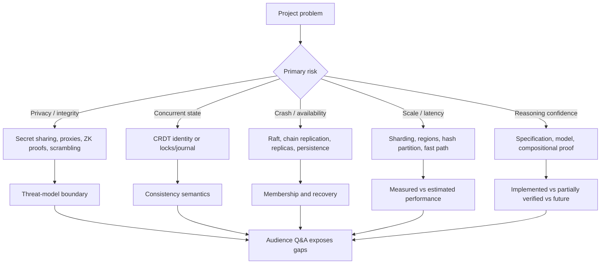

> **整理模式**：`transcript-only`。本讲有 1923 条 community-reviewed English transcript segments，没有用于时间对齐的 slides/materials；所有项目名称、机制、demo、evaluation、limitations 与 audience Q&A 均以 transcript 为证据，不从外部资料补写项目 claims。
>
> **精确范围**：第一条有声内容从 `00:00:09.730` 开始；最后一条 segment id `1922` 结束于 `5879.44` 秒，即 `01:37:59.440`，内容为停止录制。第 10 段 prompt 的 `01:37:59` 是显示舍入。
>
> **材料入口**：[MATERIALS Lecture 21](/courses/mit-6824-s21/materials/#lecture-21-project-presentations) · [Lecture 21 reading guide](/courses/mit-6824-s21/readings/lecture-21/) · [Lecture 21 reading input](/assets/courses/mit-6824-s21/evidence/reading-inputs/lecture-21.md) · [AnalogicFS experience paper](/assets/courses/mit-6824-s21/materials/official-materials/papers/katabi-analogicfs.pdf) · [FAQ](/assets/courses/mit-6824-s21/materials/official-materials/faqs/analogicfs-faq.txt) · [Question](/assets/courses/mit-6824-s21/materials/official-materials/questions/21-q-analogic.html) · [英文 transcript](/assets/courses/mit-6824-s21/lectures/022/transcript.txt)。AnalogicFS 资源是官方指定阅读，不是八组 project presentations 的 slide/source evidence。
>
> **复习标记**：`[核心]` 表示应能复述的设计链；`[权衡]` 表示性能、可用性、安全性或开发复杂度的交换；`[未实现]` 表示 presentation 中提出但未完成的能力；`[边界]` 表示 threat model、实验条件或结论限制；`[需回听]` 表示字幕不足以确认的名称或措辞。

## 学习目标

学完本讲后，应能：

1. 按八个项目的实际出现顺序，分别说明其 problem、architecture、mechanism、demo/evaluation、limitations 与 Q&A，不把相邻 presentation 的机制混用。
2. **[核心]** 用 $n,k$ threshold、share persistence 与 aggregate reconstruction 解释 distributed private electronic voting，并指出它只处理 fail-stop/passive observation、假设 participants honest。[00:00:24-00:10:04] [01:33:12-01:35:02]
3. **[核心]** 解释 `Sys` 如何逐层组合 additive secret sharing、encrypted forwarding proxies、zero-knowledge proofs、replication 与 hash-partitioned proof checking，并区分完整设计与 non-replicated/non-parallel demo。[00:10:40-00:21:05]
4. **[核心]** 用 LSEQ variable-length keys、AVL tree 与 grow-only deletion set 解释 BukaDocs 的 eventual consistency，并评价 all-to-all propagation、burst convergence 与 trustworthy-client 假设。[00:21:22-00:32:39]
5. **[边界]** 解释 eggscrambler 的 commutative-encryption/scramble rounds、Raft state replication 与 membership changes，同时指出 $n-1$ collusion、round barrier 和 minority partition 的 anonymity/liveness 限制。[00:32:42-00:44:03]
6. **[核心]** 说明 9P global namespace 与 uniform operations 为什么允许 interface-level chain replication，并严格区分 demonstrated removal/reconfiguration 与尚未完成的 replica addition。[00:44:03-00:57:52]
7. **[核心]** 从 `KVClerk` client specification、Single-decree Paxos 的 exact knowledge、Monotone Paxos 的 lower-bound knowledge与 log-prefix order，复述 modular verification 的 compositional argument，并指出 Raft verification 是 future work。[00:57:54-01:10:30]
8. **[核心]** 解释 simple distributed file system 如何组合 Raft-replicated journal、distributed locks/leases 与 server-side filesystem，评价 whole-file flush demo、RAM capacity、inode/interface 与 testing limitations。[01:10:51-01:19:11]
9. **[权衡]** 解释 Pinguino 的 region-worker mapping、coordinator/backup、worker replicas 与 `sendFastMove`/`sendStableMove`，并识别 partition healing/fencing 未被完整解决。[01:19:13-01:33:00]
10. 保留课程收官：malicious voting 回访、教师感谢学生与 TAs、final 提醒、最后一次 class meeting，以及未公布细节的 exam logistics。[01:33:00-01:37:59.440]

## 需要的先修知识

- **Secret sharing 与最小密码学直觉**：知道 shares 可隐藏 individual value、threshold 可重构；本讲把 Shamir/additive sharing 当 black box，不要求补有限域或插值算法。
- **Lecture 2 的 RPC/failure model**：timeout、retry、acknowledgement、crash/restart、持久化与 network partition，用于分析 voting、BukaDocs、eggscrambler、9P 与 Pinguino。
- **Raft labs**：replicated state machine、leader、majority、configuration change 与 log；多个项目直接复用 Lab Raft，但用途不同。
- **Eventual consistency 与 operation identity**：理解不同 peers 可乱序收消息，但在收到同一 operation set 后收敛；用于 BukaDocs CRDT。
- **Filesystems**：block、inode、journal/WAL、file descriptor、cache、POSIX-like API；本讲不补讲完整 on-disk layout。
- **Formal methods 最小直觉**：specification、model、proof、linearizability 与 client abstraction；verification 项目会说明 proof 为什么仍依赖正确 spec/model。
- **Sharding/control plane**：region/shard 到 worker/server 的 mapping、load balancing 与 failover，用于 modular KV 和 Pinguino。
- 官方 [Lecture 21 reading guide](/courses/mit-6824-s21/readings/lecture-21/) 讨论 AnalogicFS 指定阅读；它与 presentation transcript 是两条证据路径，复习时不要把 paper 的虚构/讽刺 claims 倒灌进学生项目。

## 老师的教学主线

本讲没有一位教师连续推导同一系统，而是八组学生按“动机 -> 设计 -> 机制 -> demo/evaluation -> Q&A”轮流展示；以下顺序就是录制顺序：

1. **Distributed Private Electronic Voting** [`00:00:10-00:10:09`]：单 counter 的 identity-vote 泄露 -> 多 counters 的 crash tolerance/privacy regression -> Shamir threshold aggregation -> persistence/retry -> 5-voter demo -> failure testing、无性能数字。
2. **Sys Private Analytics** [`00:10:11-00:21:05`]：direct aggregation 泄露 -> secret shares 隐藏 input -> proxies 解除 identity-index -> ZK proof 拒 bad input -> replication/parallel design -> incomplete demo -> reliability/performance/proof testing Q&A。
3. **BukaDocs** [`00:21:22-00:32:39`]：RPC order inconsistency -> CRDT/LSEQ globally unique keys -> deletion set -> clients/servers 全持状态 -> 3-client demo -> scaling/convergence 与 Google Docs Q&A。
4. **eggscrambler** [`00:32:42-00:44:03`]：MIT Confessions censorship/traffic observation -> commutative encryption -> encrypt/scramble/decrypt rounds -> Raft state/order/configuration -> join demo -> deployment、partition 与 collusion Q&A。
5. **Fault Tolerance at the 9P Interface** [`00:44:03-00:57:52`]：serverless communication difficulty -> Plan 9 single-system image -> uniform namespace -> S3/file demo -> chain-replicated unmodified services -> crash demo -> replication choice、membership 与 overhead Q&A。
6. **Modular Verification for Distributed Systems** [`00:57:54-01:10:30`]：testing nondeterminism -> spec/model caveats -> compositional client specs -> sharded KV -> partially verified Single-decree Paxos -> Monotone Paxos/log prefix -> Raft future work -> Dafny、implementation 与无性能数字 Q&A。
7. **Simple Distributed File System** [`01:10:51-01:19:11`]：self-hosted storage -> Raft journal + locks/leases + server filesystem -> POSIX-like API -> serial/concurrent demo -> limitations -> layered tests -> stronger-than-POSIX discussion。
8. **Pinguino Game Framework** [`01:19:13-01:33:00`]：central bottleneck/failure -> region workers -> coordinator/backup + replicas -> fast/stable moves -> toy demo -> future room movement/load balancing -> atomicity/partition/API Q&A。
9. **Cross-project revisit and course close** [`01:33:00-01:37:59.440`]：第一组承认 malicious voting 未处理；教师感谢学生与 TAs、祝 final 顺利、宣布最后一次 class meeting；exam logistics 尚未分享，最后停止录制。

## 核心概念与依赖关系



### 同名机制在不同项目中的职责

| Mechanism | Project | 具体职责 | 不应误解为 |
| --- | --- | --- | --- |
| Secret sharing | Voting | 只重构 aggregate tally，隐藏 individual vote | 防 malicious voter |
| Secret sharing + ZK | Sys | 隐藏 input 并证明 well formed | 当前 demo 已 replicated/parallel |
| Raft | eggscrambler | 复制 round state、排序 scramble、改 membership | 直接提供 anonymity |
| Chain replication | 9P | 复制 uniform 9P operations | 唯一可用 replication scheme |
| Separation logic | Verification | 为 client/component 写 compositional specs | proof 自动覆盖错误 model |
| Raft journal | Simple DFS | 复制 write-ahead state、支持 crash atomicity | 高性能 filesystem |
| Replicas | Pinguino | stable move durability 与 worker failover | 已解决 coordinator split brain |

### 全讲反复出现的证据分层

```text
proposed architecture
  != implemented prototype
  != demonstrated path
  != measured result
  != estimated scale-out
  != proven guarantee
```

本讲最重要的阅读方法不是记住更多系统名，而是为每一 claim 标出它属于哪一层。`Sys` 的 replication/parallelism、verification 的 Raft proof、Pinguino 的 load balancing 都是 design/future work；BukaDocs 的 32 s 与 9P 的 overhead 则各自受测试环境限制。[00:15:33-00:20:08] [00:30:13-00:31:34] [00:56:33-00:57:15] [01:07:31-01:10:22] [01:27:44-01:28:28]

## 关键推导、例子与结论边界

### Threshold aggregation

Voting 中 $n$ 是 counters/shares 总数，$k$ 是重构门限；少于 $k$ shares 不泄露原 vote，至少 $k$ 个 aggregate shares 可重构 tally，故口述 crash budget 为：

$$f_{crash}=n-k$$

若 voter $i$ 的 vote 为 $v_i$、发给 counter $j$ 的 share 为 $s_{i,j}$，counter 先形成 $S_j=\sum_i s_{i,j}$，再从至少 $k$ 个 $S_j$ 重构 $\sum_i v_i$。[00:03:38-00:06:56] **[边界]** 本讲末确认没有验证 malicious voter 是否向不同 counters 发一致合法 shares。[01:33:12-01:35:02]

### Privacy knowledge split

`Sys` 的 proxy 看到 identity/timing，server 看到 statistic index/sum/timing；encrypted shares 让任一单方不能把 identity 与 index 直接关联。ZK proof 只揭示 input well formed，不揭示 value。[00:13:05-00:15:31] **[边界]** Proxy-server collusion、timing leakage 与 unreplicated server crash 都仍在结论边界内。[00:13:41-00:14:19] [00:17:54-00:18:35]

### LSEQ 与 tombstone state

BukaDocs 将 character 放入 variable-length-key ordered structure，并把 deleted keys 加入 grow-only deletion set：

$$State=(AVLTree\langle key,character\rangle,DeletionSet\langle key\rangle)$$

所有 peers 最终收到相同 operation set 后按 key 排序、屏蔽 tombstones，得到同一 visible document。[00:23:10-00:26:03] **[边界]** 长期 metadata/key growth、garbage collection 与 Byzantine clients 未评估。

### eggscrambler 的 anonymity-set 反例

如果 adversary 控制 $n-1$ participants 并知道自己的 messages，final anonymous list 中剩余 message 可归给唯一 honest participant。Raft 保证 state/order 不会增加 honest anonymity set。[00:41:34-00:43:54] **[边界]** 所有 minority partitions 都无 majority 时，round 会停到 configuration 可安全缩小。[00:40:44-00:41:26]

### Interface-level replication

9P 项目把 `Read/Write/Remove/Stat/...` 作为统一 operation stream，在 service 前复制，而不修改 memfs/durable-storage service。[00:50:57-00:54:11] Demo 证明一条 write 可从另一 replica read，kill 一节点后 configuration 缩小并继续；**[未实现]** 启动后 adding replica。[00:55:32-00:55:44]

### Monotonic knowledge 到 replicated log

Single-decree Paxos 的 knowledge 是未来 committed value 与当前 exact value 相同：

$$commit(v)\Rightarrow \forall v'_{future},\ v'=v$$

Monotone Paxos 放宽为 $v\preceq v'$；当 values 是 logs 且 $l_1\preceq l_2$ 表示 $l_1$ 是 $l_2$ 的 prefix，未来 log 只能追加。[01:04:38-01:06:45] **[未实现]** Naive code 每 RPC 发 full log；optimized Raft-like verification 是 future work。[01:06:45-01:10:22]

### Atomic whole-file flush 与 fast/stable move

Simple DFS 的 concurrent demo 观察到两个 whole-file copies 中一个完整获胜，而非 bytes 混合；这是 journal/block atomicity 的演示，不是全面 POSIX proof。[01:14:58-01:18:47]

Pinguino 则把 completion contract 分成：

$$complete_{stable}(m)\Rightarrow stored(m,r_1)\land stored(m,r_2)$$

Fast move 没有该等待保证，以降低 latency。[01:24:28-01:27:34] **[边界]** Partition 两侧 coordinator/backup、same-room rehosting 与 healing recency 没有完整 fencing/version protocol。[01:30:24-01:32:02]

### Evaluation ledger

| Project | Transcript 中的 evaluation/demo | 主要限制 |
| --- | --- | --- |
| Voting | 5 voters、3 counters、$k=2$，crash 1 counter 后 winner 仍为 1 | 无 performance numbers；honest participants |
| Sys | 1000 honest simulated clients；client 数 ms/数 KB；4-core 约 1000 q/s | 22k q/s 是估算；demo 未 replication/parallel |
| BukaDocs | 3000 edits 约 3 s；19000 parallel edits 约 32 s | localhost/one machine；无 variance/hardware details |
| eggscrambler | 2 participants round + 新 Raft instance join 后 3-party round | Honest-participant anonymity；无性能评估 |
| 9P | S3 file write；5 memfs replicas，kill 1 后继续 | 不支持 add replica；overhead 仅定性 |
| Verification | Case-study specs 与 naive full-log implementation | Partial/in-progress proofs；无性能 numbers |
| Simple DFS | Serial read-after-write + concurrent atomic flush | RAM-backed、single root、direct inodes、stress incomplete |
| Pinguino | Movement fast path、chat stable path、inject lag | 无数值；room movement/load balancing future |

## 易错点与待核对项

- **[边界] 不要把 privacy 当 integrity。** Voting 隐藏 share 不防 inconsistent/malicious shares；Sys 正是额外用 ZK proof 处理 well-formedness。[00:14:22-00:15:31] [01:33:12-01:35:02]
- **[边界] 不要把 replication 当 anonymity。** eggscrambler 的 Raft 管 state/order/membership；commutative encryption 与 scrambling 才承担 unlinking，而且仍受 collusion 限制。
- **[边界] 不要把 eventual consistency 当立即 durability。** BukaDocs client 离线时未发 edits 只留本机，回来后才传播。[00:28:24-00:28:44]
- **[未实现] 不要把 slide architecture 写成 prototype capability。** `Sys` server replication/parallel checking、9P add replica、verification Raft proof、Pinguino room movement/load balancing 均未完成。
- **[权衡] 不要跨环境外推数字。** BukaDocs 在 localhost one-machine；Sys 22k q/s 是同 data-center extrapolation；9P 只说当前 benchmark overhead 不多；Simple DFS 与 verification 没性能数据。
- **[边界] 不要把 Simple DFS 的 `Write` 当标准 POSIX partial write。** Presenter 描述的是 flush buffered whole-file copy，Q&A 还指出 consistency target 可能强于 POSIX。[01:13:50-01:14:18] [01:18:03-01:18:47]
- **[边界] Pinguino partition safety 未闭合。** “backup 暂代、healing 选 newer replica”没有 term/fencing/version/merge 细节，观众的 same-room divergence 反例未被完整消除。[01:30:24-01:32:02]
- **[需回听]** `Sys`、BukaDocs、eggscrambler、Pinguino 的拼写来自字幕；simple distributed file system 的正式 team/system name缺失，不猜名称。
- **[需回听]** Section 001 的 COVID/electronic-voting 引句、Section 003 的 LSEQ key notation、Section 006 的 9P interface verb、Section 007 的 slide proof notation 与 Section 010 的 exam-logistics 句子均有字幕损坏；逐项见对应 [section notes](#lecture-notes)。
- **[证据隔离]** [AnalogicFS paper](/assets/courses/mit-6824-s21/materials/official-materials/papers/katabi-analogicfs.pdf)、FAQ、Question 属于官方 Lecture 21 reading；transcript presentations 没有讨论该 paper，不能用它填补项目 slide 或实验细节。
- **[结尾审计]** Transcript 最后一条是 `01:37:59.440` 停止录制；课程正式收官在 `01:36:21`，之后仍有 exam logistics 与互相致谢，不可提前截断。

## 掌握标准

达到掌握，应能不看笔记完成：

1. 画一张八项目 chronology 表，每项各用一句话写 problem、mechanism、demo/evaluation 与最重要 limitation。
2. 比较 voting 与 `Sys`：都用 secret sharing，但前者只假设 honest input，后者为何需要 identity-index unlinking 与 ZK well-formedness proof。
3. 给一个并发 collaborative edit，使用 globally unique key 与 deletion set 推演 BukaDocs 收敛，并说明全量 propagation 的 scaling cost。
4. 对 eggscrambler 构造 $n-1$ collusion 与 no-majority partition，分别判断 anonymity 和 liveness。
5. 画出 9P replication layer 的位置，解释为什么 removal demo 不等于支持 stateful replica addition。
6. 从 exact Paxos knowledge 推到 monotonic lower bound，再用 prefix order 推到 log replication，并准确标记哪些 implementation/proof 已完成。
7. 对 Simple DFS 的 serial/concurrent demo，分别写出观察到的 consistency/atomicity 与不能推出的 POSIX/performance claims。
8. 为 game actions 选择 fast/stable move，并分析 worker crash、coordinator partition 与 healing 时哪些性质有证据、哪些仍未知。
9. 将每个性能数字标注为 measured、estimated 或 absent，并写出 environment/assumption。
10. 复述课程 wrap-up 与 exact transcript endpoint，确认没有遗漏 malicious-voting revisit、TAs/final/last-class remarks 与 exam-logistics tail。

## 复习顺序

1. **第一遍：按 presentation 走。** 读“老师的教学主线”，只记八个项目的边界与 handoff，不先混合相似机制。
2. **第二遍：privacy/integrity 线。** 复习 [Section 001](#section-01)、[Section 002](#section-02)、[Section 004](#section-04)、[Section 005](#section-05) 与 [Section 010](#section-10)，对比 secret sharing、proxies、ZK、scrambling 与 threat models。
3. **第三遍：consistency/replication 线。** 复习 [Section 003](#section-03)、[Section 006](#section-06)、[Section 008](#section-08)、[Section 009](#section-09)，画出 CRDT、chain、Raft journal 与 fast/stable replicas 的不同职责。
4. **第四遍：proof 与 evidence 线。** 复习 [Section 007](#section-07)，再用全讲 evaluation ledger 给每个 claim 标 `implemented/demo/measured/estimated/future/proved`。
5. **第五遍：只做 Q&A。** 回看每段末尾，特别回答 BukaDocs localhost 外推、eggscrambler collusion、9P add replica、Simple DFS stronger-than-POSIX、Pinguino split brain 与 malicious voting。
6. **最后审计：** 从 `01:33:00` 回看到 `01:37:59.440`，确认技术回访与课程收官都在；再从 [MATERIALS Lecture 21](/courses/mit-6824-s21/materials/#lecture-21-project-presentations) 进入 [reading guide](/courses/mit-6824-s21/readings/lecture-21/)，并明确标注 reading 与 presentation 的证据边界。

## 逐段详细课堂笔记

<div id="section-01" class="course-note-section-anchor" aria-hidden="true">&nbsp;</div>

# 第 1 段：Distributed Private Electronic Voting

> 时间范围：`00:00:10-00:10:09`
>
> 证据范围：仅本段 transcript；本讲没有用于时间对齐的课件材料。系统名、参数、演示结果与问答结论均按口述记录，不补写密码学协议细节。

## 本段在整讲中的作用

本段是 Project Presentations 的第一组展示。Felipe 与 Caralina 从疫情限制下的选举动机出发，把问题收窄为“怎样在允许服务器崩溃的同时保持选票隐私”，随后依次给出单一计票器的泄露点、多计票器的可用性收益、Shamir Secret Sharing 的门限隐私、分布式求和流程、持久化与重试机制、现场演示及观众问答。[00:00:24-00:10:04]

这不是一套面向真实选举的完整安全方案。展示者明确假设 voters 与 vote counters 都按协议行动，只处理 fail-stop failures；Byzantine/malicious voting 在本段不属于已解决问题。该边界在整讲末尾还会被重新追问。[00:01:44-00:02:12] [00:05:42-00:05:55]

证据与课程资源入口：[Lecture 21 材料索引](/courses/mit-6824-s21/materials/#lecture-21-project-presentations)、[本讲 transcript](/assets/courses/mit-6824-s21/lectures/022/transcript.txt)。MATERIALS 中的 AnalogicFS paper、FAQ 与 Question 是本讲指定阅读入口，但不是本项目陈述的证据。

## 教学展开

1. **提出隐私电子投票问题。** 展示者以疫情限制下仍需举行选举为背景，询问 electronic voting 如何工作，并把项目焦点限定为 voter privacy，即不让个体选票与身份被关联。[00:00:24-00:00:59]
2. **先画出单一计票器模型。** Voters 把选票送给一个 vote counter；计票器解密、检查每人最多投一次并计算 winner。为了去重，vote 必须以某种方式和 voter 关联，这恰好形成隐私风险。[00:00:59-00:01:42]
3. **定义威胁模型。** Attacker 可以制造 fail-stop server crashes，但不能让服务器任意 Byzantine misbehave；它还可以被动监视一个 vote counter。后者能利用服务器上 voter-vote linkage 去匿名化选票。[00:01:44-00:02:32]
4. **用多个 counters 处理崩溃。** 每个 voter 把 vote 发给所有 counters，各 counter 独立计算结果。只要一个 counter 存活就能得到 winner，因此理论上可承受 $n-1$ 个 counter crashes；但任何一个 counter 被监视就可能泄露所有 votes，隐私反而更差。[00:02:34-00:03:37]
5. **把 Shamir Secret Sharing 作为门限黑盒。** Vote 是 $0$ 或 $1$；以参数 $n,k$ 生成 $n$ 个 shares。少于 $k$ 个 shares 不泄露原 vote，至少 $k$ 个 shares 可重构。展示者明确没有讲 Shamir 的内部算法。[00:03:38-00:04:24]
6. **把门限秘密共享嵌入计票。** 每个 voter 把不同 share 发给各 counter；counter 收齐 voter shares 后，对自己收到的 shares 求和，再把该 sum share 发给其他 counters。单个 sum share 看似随机，不暴露其所含个体 vote。[00:04:30-00:05:08]
7. **只重构总和。** Counter 收到至少 $k$ 个 sum shares 后重构所有 votes 的总和；总和大于 voters 数量一半则 winner 为 1，小于一半则 winner 为 0。本段没有说明平票处理。[00:05:14-00:05:38]
8. **补充运行假设与恢复机制。** Voters/counters 必须 well behaved；RPC 周期性重发直到 acknowledgement；voter 必须持久化同一次 share computation 的 vote 与 shares，重启后不能重新随机生成；只需 $k$ 个 counters，故可容忍 $n-k$ 个 counter crashes。[00:05:42-00:06:56]
9. **演示门限容错。** Demo 使用 5 voters、3 vote counters、$k=2$。第一次得到 sum 3、winner 1；crash 一个 counter 后仍由两个存活 counters 得到 winner 1。[00:07:00-00:07:44]
10. **用问答界定评估。** 团队测试了不同 voter/counter 数量、voter failures、server failures 与不可靠网络，但没有 performance numbers；课程知识主要用于 failure persistence、server failure、network retry，而非扩展密码学本身。[00:08:12-00:10:04]

## 概念、符号与推导

### 门限与故障预算

- $n$：vote counters/share 总数。
- $k$：重构 vote 或 aggregate sum 所需的最少 shares 数。
- 隐私门限：至多 $k-1$ 个 shares 不给出原 vote 信息，这是展示者对 Shamir black box 的口述保证。[00:03:38-00:04:24]
- 可用性门限：至少 $k$ 个 counters 存活才能重构总和，所以展示者给出的 crash tolerance 为：

$$f_{crash}=n-k$$

[00:06:42-00:06:56]

### 聚合流程

设 voter $i$ 的二元 vote 为 $v_i\in\{0,1\}$，其发给 counter $j$ 的 share 记作 $s_{i,j}$。每个 counter 对本地 shares 求和：

$$S_j=\sum_i s_{i,j}$$

至少 $k$ 个 $S_j$ 经 Shamir reconstruction 得到：

$$V=\sum_i v_i$$

展示者随后使用多数阈值：$V>N/2$ 时 winner 为 1，$V<N/2$ 时 winner 为 0。[00:04:30-00:05:38] 这里的线性求和是对口述流程的符号化；本段没有给出有限域、插值、多项式或模数细节。

### 正确性所依赖的状态

```text
voter chooses one vote/share set
  -> persists vote and all generated shares
  -> retries the same shares until acknowledged
  -> counters sum compatible shares
  -> any k counters reconstruct one aggregate
```

若 voter crash 后重新生成另一组 shares，不同 counters 可能持有来自不同 polynomial/share computation 的片段，展示者称这会破坏正确求和。因此“重发相同逻辑 vote”还不够，必须重发同一次生成的 shares。[00:06:17-00:06:42]

## 例子与课堂提示

- **单计票器去重。** “每人最多一次”要求把 vote 与 voter 联系起来，用于展示 eligibility/duplicate prevention 与 privacy 的直接张力。[00:01:08-00:01:42]
- **复制并不自动带来隐私。** 把完整 vote 发给更多 counters 增强 fail-stop availability，却把被动监视任一节点都变成泄露点；这是本项目从普通 replication 转向 secret sharing 的关键反例。[00:02:34-00:03:37]
- **5 voters、3 counters、$k=2$。** Demo 中一个 counter crash 后仍有两个 shares，正好满足 threshold；它验证的是演示配置的功能与 fail-stop 路径，不是大规模性能。[00:07:09-00:07:44]
- **测试范围不等于性能评估。** 团队称 failure/configuration test suite 较完整，但明确没有 performance numbers；笔记不能据此声称系统可扩展到真实选举。[00:08:12-00:08:56]
- **课程迁移。** 团队从 cryptography-class idea 出发，把关注点从纯 security 转到 voter/counter crash、network unreliability 与 persistence，体现 6.824 的 failure-model 视角。[00:09:13-00:10:04]

## 本段掌握检查

1. **问：为什么简单复制 vote counters 会同时提高可用性并降低隐私？**  
   **答：** 只要一个 counter 存活就能计票，但每个 counter 都持有可关联 voter 的完整 vote，监视任一 counter 即可去匿名化。[00:02:34-00:03:37]
2. **问：$n,k$ 在项目中各表示什么，可容忍多少 counter crashes？**  
   **答：** $n$ 是 shares/counters 总数，$k$ 是重构阈值；至少 $k$ 个存活，因此容忍 $n-k$ 个 fail-stop crashes。[00:03:58-00:04:24] [00:06:42-00:06:56]
3. **问：为什么 counters 可以相加 shares 后只重构总票数？**  
   **答：** 每个 counter 先对收到的 voter shares 求和；至少 $k$ 个 sum shares 再经 Shamir black box 重构 aggregate，而单个 share/sum share 不泄露个体 vote。[00:04:30-00:05:32]
4. **问：voter 重启后为何不能重新生成 shares？**  
   **答：** Counters 可能混用两次生成的不同 share sets，无法重构一致总和；voter 必须持久化并重发原 shares。[00:06:17-00:06:42]
5. **问：本项目的安全结论为何不能直接推广到真实选举？**  
   **答：** 它假设 voters/counters 按协议行动，只处理 fail-stop failures，没有解决 Byzantine/malicious voting，也没有给出性能评估。[00:01:44-00:02:12] [00:05:42-00:05:55] [00:08:12-00:08:40]

## 待核对项

- [需回听 00:00:42-00:00:50] 字幕把 COVID 识别为 “covert”，并漏掉 electronic/online 一词；上下文只能确认疫情限制引出电子投票问题。
- [需回听 00:04:03-00:04:12] 字幕说 “n part” 且语法损坏；按随后 $k-1$/$k$ 说明记为 $n$ shares，不补 Shamir 实现。
- [需回听 00:05:42-00:05:55] “parts sum to what they say” 附近损坏；可确定的是 voters 与 counters well behaved、只处理 fail-stop。
- [需回听 00:09:31-00:09:36] 字幕把 cryptography class 中的来源识别成 “[pizza]”；不猜原协议或作业名。
- 本段没有课件材料；所有结构图、符号化公式均只重述 transcript 的口述机制，不代表现场 slide 内容。

<div id="section-02" class="course-note-section-anchor" aria-hidden="true">&nbsp;</div>

# 第 2 段：Sys 隐私聚合分析

> 时间范围：`00:10:11-00:20:10`
>
> 证据范围：仅本段 transcript。`Sys` 是字幕记录的系统名；设计目标、已实现范围和估算性能分开记录。

## 本段在整讲中的作用

本段结束第一组并进入 Kevin 的 private analytics 项目 `Sys`。它延续上一组的 secret-sharing 主题，但把问题从二元选票改为隐私统计聚合，并将故障模型扩展到 malicious clients 与 servers：先隐藏 individual input，再解除 identity-index 关联，再验证匿名输入合法性，最后讨论 server replication 与 proof-checking parallelism。[00:10:11-00:16:21]

展示的核心价值在于逐层暴露“修复一个泄露面会打开另一个攻击面”：secret sharing 隐藏 input，却仍泄露 identity-index；proxies 解除关联，却让 malicious client 可借匿名性提交超大值；zero-knowledge proof 约束输入，却仍需 replication 处理 server crash。现场实现只包含 non-replicated、non-parallel 版本，不能把后两项设计当作已完成。[00:12:09-00:17:37]

证据入口：[Lecture 21 材料索引](/courses/mit-6824-s21/materials/#lecture-21-project-presentations)、[本讲 transcript](/assets/courses/mit-6824-s21/lectures/022/transcript.txt)。

## 教学展开

1. **定义目标与威胁升级。** `Sys` 收集 aggregate statistics，同时保护 privacy；Kevin 希望展示 clients 与 servers 都可能 Byzantine 时如何组合 multiparty computation、zero-knowledge proofs 与 broadcast。[00:10:40-00:11:22]
2. **建立最小 sum service。** Aggregation server 保存 key-value store：key 是 statistic index，value 是 sums tuple；client 带 identity、要增加的 index 与 private input。直接发送会同时泄露三者。[00:11:27-00:12:06]
3. **以两个 non-colluding servers 隐藏 input。** Client 将 input secret-share 给 servers；各 server 只保存 local shares，之后合并 local key-value stores 才重构 global sums。只要至少一个 server honest，单个 input 不泄露，但 servers 仍看到 identity 与 index。[00:12:09-00:12:59]
4. **以 encryption、broadcast 与 forwarding proxies 解除 identity-index 关联。** 每个 server 有 public key；client 加密相应 share，broadcast 给 proxies，再由 proxy 转发到目标 server。Proxy 看到 client identity/timing，server 看到 index/sum/timing；只要 proxy 与 server 不同时被攻破，二者无法拼出 identity-index linkage。[00:13:05-00:14:21]
5. **识别匿名滥用。** 若合法 inputs 应为 0/1，malicious client 可秘密提交十亿并扭曲 sum。匿名性使 server 不能靠识别 client 来阻止它。[00:14:22-00:14:43]
6. **用 zero-knowledge proof 验证 well-formed input。** Client 对 shares 生成 proof；servers 交互检查 shares 是否重构为合法输入，而 proof 不泄露输入本身。于是原隐私属性保留，同时 bad input 被拒绝。[00:14:45-00:15:31]
7. **再处理 server crash。** 两个 servers 都在线才能重构 global store；设计提议用 Raft-style 或 primary-backup replication，但尚未实现。[00:15:33-00:15:52]
8. **给出 throughput 设计。** Proof checking 被视为可能 bottleneck；proxies 对 inputs 做 hash partition，server workers 并行检查，再以 reduce-like step 合并 intermediate key-value stores。[00:15:53-00:16:21]
9. **明确 demo 边界。** Kevin 明说没有在截止日前完成全部设计，只演示 non-replicated、non-parallel Rust 版本：2 servers、2 proxies、1000 honest simulated clients；servers 验 proof 后更新 local stores，最终合并得到 sums。[00:16:23-00:17:37]
10. **问答量化现状。** Proxy 广播在两个 proxies 中可容忍一个失败；任一 unreplicated server 失败则无法重构。已实现函数仅 sums，additive sharing 可支持 linear functions；client 生成 shares/proofs 为数毫秒、数 KB，4-core server 约 1000 queries/s，22,000 queries/s 是 20-way parallelization 的估算且未计跨数据中心 latency。[00:17:54-00:20:08]

## 概念、符号与推导

### 逐层泄露面

| 设计层 | Proxy 可见 | Server 可见 | 尚存风险 |
| --- | --- | --- | --- |
| 直接单 server | 无 proxy | identity、index、input | 全部泄露 |
| secret sharing | 无 proxy | identity、index、aggregate sums | identity-index linkage |
| encrypted shares + proxies | identity、timing | index、sum、timing | proxy-server collusion；malicious input |
| 再加 ZK proof | 同上 | 同上及 well-formed verdict | server crash；已知 timing leakage |

[00:11:27-00:15:31]

若 client input 为 $x_i$，两个 additive shares 可抽象为 $x_i^{(1)}+x_i^{(2)}=x_i$；server $j$ 计算 $S^{(j)}=\sum_i x_i^{(j)}$，合并后：

$$S^{(1)}+S^{(2)}=\sum_i x_i$$

这只符号化 Kevin 对 additive secret sharing 与 sums 的描述；本段没有给出模数、proof statement 或 MPC protocol 细节。[00:12:09-00:12:42] [00:18:42-00:19:07]

### 性能数字的证据等级

- **Observed/口述测试：** 生成 shares/proofs 少于数毫秒；bandwidth 数 KB；4 cores 上约 1000 queries/s。[00:19:15-00:19:53]
- **Estimated：** 每个 logical machine 并行到 20 servers 时接近 22,000 queries/s。[00:19:53-00:20:03]
- **限制：** 测试在同一 data center，未计 latency；完整 replication/parallel implementation 未展示。[00:16:23-00:16:32] [00:20:03-00:20:08]

## 例子与课堂提示

- **0/1 中混入十亿。** 用于说明 privacy 与 integrity 不是同一属性；输入越匿名，越需要不揭示输入的 validity proof。[00:14:22-00:14:43]
- **1000 honest clients demo。** 展示 proof generation/verification 与 aggregation happy path，不展示 bad proof rejection、server failure 或 hash-partition parallelism。[00:16:53-00:17:37]
- **Proxy 与 server 的 split knowledge。** 这是 unlinkability 的关键，而非声称任何单方什么都看不到；两端都保留 timing information。[00:13:41-00:14:19]
- **“Sums 覆盖 90%”是 presenter 的实践判断。** 它不是测量结果，也不证明任意 nonlinear analytics 已支持。[00:18:42-00:19:07]

## 本段掌握检查

1. **问：secret sharing 后为什么仍需要 proxies？**  
   **答：** Servers 虽看不到 individual input，仍同时看到 client identity 与 statistic index；encrypted shares 经 proxies 转发可拆开这条关联。[00:12:43-00:14:19]
2. **问：zero-knowledge proof 在这里证明什么、隐藏什么？**  
   **答：** 证明 shares 能重构为 well-formed input，同时不泄露该 input 的实际值。[00:14:45-00:15:16]
3. **问：当前实现能容忍哪些故障？**  
   **答：** 两 proxies 中一台失败仍可因 broadcast 到达 server；任一未复制 server 失败会阻止数据重构。[00:17:54-00:18:35]
4. **问：哪些架构元素只是提议而未在 demo 中完成？**  
   **答：** Server replication 与 proof-checking/hash-partition parallelism；demo 是 non-replicated、non-parallel 版本。[00:15:33-00:16:32]
5. **问：为什么不能直接引用 22,000 queries/s 作为实测吞吐？**  
   **答：** 这是基于 20-way parallelization 的估算；实际只口述 4 cores 约 1000 queries/s，且同 data center 测试未计 latency。[00:19:35-00:20:08]

## 待核对项

- [需回听 00:10:44] 系统名字幕为 `Sys`，发音/拼写可能另有设计；没有 slides 可核验，故保留字幕拼写。
- [需回听 00:12:20-00:12:27] “signature” 应是 share 的误识别；上下文是 secret sharing。
- [需回听 00:13:43] “properties” 应是 proxies 的误识别。
- [需回听 00:19:47-00:20:03] 4-core 吞吐与 20-way 估算带有 “I think/probably” 语气，应作为近似值。
- 本段没有课件材料，不补 proof protocol、finite-field 参数或部署拓扑。

<div id="section-03" class="course-note-section-anchor" aria-hidden="true">&nbsp;</div>

# 第 3 段：Sys 收尾与 BukaDocs 协同编辑器

> 时间范围：`00:20:12-00:30:10`
>
> 证据范围：仅本段 transcript。本段前一分钟是 `Sys` Q&A，随后进入 BukaDocs；两项目严格分开。

## 本段在整讲中的作用

本段先用实现与测试问答收束 `Sys`：zero-knowledge proof 由 finite-field operations 按论文实现，可通过恶意 client 提交 bad proof 的 simulation 检查 rejection。[00:20:12-00:21:05] 随后 Shannen、Nik、Johan 展示 BukaDocs，一个以 LSEQ CRDT、AVL tree 与 grow-only deletion set 实现的 distributed collaborative editor，目标是在 RPC 到达顺序不一致时仍达到 eventual consistency。[00:21:22-00:30:07]

BukaDocs 的结构不是 Raft leader serialization：clients 与 servers 都维护文档状态，operations 具有 globally unique variable-length keys，servers 将 updates 传播给所有 peers。其收益是较少 coordination；代价是全量传播、收敛延迟，以及项目对 trustworthy clients 的假设。[00:21:47-00:29:59]

证据入口：[Lecture 21 材料索引](/courses/mit-6824-s21/materials/#lecture-21-project-presentations)、[本讲 transcript](/assets/courses/mit-6824-s21/lectures/022/transcript.txt)。

## 教学展开

1. **补充 `Sys` proof implementation。** Kevin 称实现主要是 finite-field operations，找到相应 library 后按 paper 步骤实现；测试可让 simulated malicious clients 提交 bad proofs，观察 servers 拒绝。[00:20:12-00:21:05]
2. **提出 collaborative consistency 问题。** 不同 peers 以不同顺序收到 RPCs 可能形成不同文档状态；BukaDocs 用 CRDT 让每个 operation globally unique，以最终收敛缓解这个问题。[00:21:33-00:23:03]
3. **用 turtle 增删解释 operation identity。** 不同用户各自添加的 turtle 是不同元素；删除 green turtle 不会误删另一用户的 golden turtle，因为 remove 指向唯一 operation/element identity。[00:22:27-00:23:03]
4. **选择 LSEQ sequence CRDT。** LSEQ 给每个 character 一个位于 START/END 之间的 variable-length key；要在相邻 keys 间插入时扩展 key depth，从而始终能找到中间 key。[00:23:10-00:24:19]
5. **说明 LSEQ 收益与原删除要求。** 它以少量 coordination 达到 eventual consistency，且有减缓 key length growth 的优化；原删除机制依赖 causal delivery 与 exactly-once delivery，团队不想实现其依赖链。[00:24:22-00:24:49]
6. **替换为 grow-only deletion set。** 删除字符不是从 sequence identity 中抹除，而是把对应 keys 加入 deletion set。例中删除 key 4 与 7 后，可见状态只剩 START、END 与 key 7,2 的感叹号。[00:24:49-00:25:07]
7. **给出服务架构。** 多 clients、多 servers；client 一次只连一台 server，失败时持续 retry。两类节点都维护 character AVL tree 与 deletion set。[00:25:15-00:25:49]
8. **给出 update 路径。** Client 发 insertion/deletion；server 更新并持久化本地 tree/set，把 update 转发给其他 servers 与 clients，最后向发起 client 返回 success。[00:25:50-00:26:03]
9. **演示多人编辑。** 三个不同 clients 同时输入并能编辑彼此文本；demo 只显示最终 UI 行为，没有逐 RPC 展示乱序或故障恢复。[00:26:08-00:27:13]
10. **问答补充来源与 client failure。** 项目源于课程问答 Google Doc 无法承受超过 75 人同时输入；状态在所有 clients/servers 上，client failure 时未发出的 edits 留在本地，重连后再发送并最终收敛。Clients 被假定 fully trustworthy。[00:27:22-00:28:47]
11. **解释 LSEQ 选择与部署。** 团队称 LSEQ 是较早找到且核心 variable-length-key logic 实现后剩余工作较少的方案；demo 有 3 servers 与 3 clients，每 client 连自己的 server。多 servers 同时服务 scaling 与 fault tolerance，但需向所有 servers 发 RPC，收敛时间会增长。[00:28:50-00:30:07]

## 概念、符号与推导

### LSEQ ordering

```text
START(0) < h(4) < i(7) < END(8)
                     |
                     + insert ! at key (7,2), between 7 and 8
```

Transcript 使用 `4`、`7`、`7 2`、`8` 说明 variable-length keys；这里用 tuple `(7,2)` 表示口述的二级 key，但不补 LSEQ radix、allocation strategy 或 site identifier。[00:23:42-00:24:19]

### 文档状态

可把项目口述状态记为：

$$State=(AVLTree\langle key,character\rangle,DeletionSet\langle key\rangle)$$

呈现字符需满足其 key 不在 deletion set。Deletion set 是 grow-only，因此 tombstones 不被移除；本段没有说明 garbage collection、metadata 上界或长期 key growth 测量。[00:24:36-00:25:07] [00:25:34-00:25:49]

### 收敛前提

所有 peers 最终收到相同 globally unique insert/delete operations 后，可按 key 排序并屏蔽 deletion set 中元素，得到相同 visible document。团队的 message layer 负责“让每个人得到所有 messages”；本段没有证明 Byzantine client、永久丢包或重复消息下的完整 CRDT 性质。[00:21:47-00:23:03] [00:29:17-00:29:22]

## 例子与课堂提示

- **Golden/green turtle。** 展示 value 相同或操作类型相似不等于 identity 相同；remove 必须指向具体 globally unique element。[00:22:27-00:23:03]
- **`a,c` 并发插入 `b,d`。** 用于说明不同 editors 的操作最终都应形成 `a,b,c,d`，而不是依赖同一 RPC arrival order。[00:23:20-00:23:42]
- **Google Docs 超过 75 人。** 这是团队观察到的项目动机，不是受控 benchmark；不能据此断言 Google Docs 的架构上限。[00:27:31-00:27:55]
- **Client 离线 edits。** 未送达 server 的 edits 不会立即对外可见；rejoin 后才传播并收敛，说明 eventual consistency 不等于实时 durability。[00:28:24-00:28:44]

## 本段掌握检查

1. **问：BukaDocs 如何避免不同 RPC arrival order 导致永久分歧？**  
   **答：** 每个 insert/delete 指向 globally unique CRDT element/key；peers 最终收到同一操作集合后按 LSEQ ordering 与 deletion set 得到同一状态。[00:21:47-00:23:03]
2. **问：为什么采用 grow-only deletion set？**  
   **答：** 团队不想实现原 LSEQ 删除所依赖的 causal 与 exactly-once delivery，于是以永久记录 deleted keys 的更简单办法屏蔽字符。[00:24:36-00:25:07]
3. **问：client crash 时哪些 edits 可能暂时不可见？**  
   **答：** 尚未送达任一 server 的本地 edits；client 回来后可发送，系统再达到 eventual consistency。[00:28:24-00:28:44]
4. **问：server 处理一个 edit 的口述顺序是什么？**  
   **答：** 更新并持久化本地 AVL tree/deletion set，转发给其他 servers/clients，再向发起 client 回 success。[00:25:50-00:26:03]
5. **问：增加 servers 的主要 tradeoff 是什么？**  
   **答：** 可分担 client request load，并提供一定 fault-tolerance 意图；但每台 server 要把 RPC 发给所有其他 servers，收敛更慢。[00:29:25-00:30:07]

## 待核对项

- [需回听 00:20:31-00:20:35] 字幕 `[finite] field` 与 `[file] library`；前者高度符合上下文，后者只记为 finite-field library，不确定具体库。
- [需回听 00:21:34] 项目名按字幕写作 `BukaDocs`；没有 slide 文件核验大小写。
- [需回听 00:24:06-00:24:15] `7 2` 的具体 LSEQ key notation 未展示；笔记用 `(7,2)` 只作口述层级的可读表示。
- [需回听 00:27:31] “talk the class over IP” 字幕损坏；只保留 turtle 是团队/课程 mascot。
- 本段无课件，未补 CRDT/LSEQ 论文中的 causal semantics 或复杂度。

<div id="section-04" class="course-note-section-anchor" aria-hidden="true">&nbsp;</div>

# 第 4 段：BukaDocs 评估收尾与 eggscrambler

> 时间范围：`00:30:13-00:40:11`
>
> 证据范围：仅本段 transcript。前 2 分 29 秒属于 BukaDocs Q&A；`00:32:42` 后才进入 eggscrambler。

## 本段在整讲中的作用

本段先量化 BukaDocs 的 convergence：localhost 条件下，3000 edits 通常约 3 秒收敛，19000 个并行 edits 约 32 秒；随后团队把 Google Docs 是否采用类似方案归因于 operational transform、成本与实际 workload，但答案带有明确猜测语气。[00:30:13-00:32:39]

第二部分展示 `eggscrambler`，一个用 commutative encryption 与 multi-party scrambling 实现 anonymous broadcast 的系统。它以 MIT Confessions 的 censorship 与 traffic observation 为动机，用 Raft 复制 protocol state、串行协调 scramble order，并演示动态加入新 Raft participant；本段末进入部署角色 Q&A。[00:32:42-00:40:11]

证据入口：[Lecture 21 材料索引](/courses/mit-6824-s21/materials/#lecture-21-project-presentations)、[本讲 transcript](/assets/courses/mit-6824-s21/lectures/022/transcript.txt)。

## 教学展开

1. **报告 BukaDocs 的轻负载结果。** 5 clients、5 servers、约 3000 requests 时 3 秒内达到 eventual consistency；所有 RPC 都在一台 localhost machine 上，因此网络很快但 computation 也争用同机，团队称真实硬件影响方向不确定。[00:30:13-00:30:46]
2. **报告 burst load。** 100 clients、5 servers 下，19000 edits 全部并行发送约 32 秒收敛；3000 edits 约 3 秒。该结果说明 convergence latency 随一次性并发 edits 增长，不等于 steady-state throughput 测量。[00:30:54-00:31:39]
3. **回答 Google Docs 对比。** 团队认为 Google Docs 使用 operational transform，但不确定其 parallelization；随后猜测额外 server power/cost 与“100 人同时编辑一文档”不常见，使工程投入不划算。[00:31:43-00:32:39]
4. **提出 eggscrambler 的匿名广播问题。** MIT Confessions admin 可能 censor message，还可能结合 Google/MIT Wi-Fi traffic 找到 sender。目标被定义为：向所有 users broadcast messages，而不揭示每条 message 的来源。[00:32:42-00:34:13]
5. **选择 decentralized cryptographic protocol。** Commutative encryption 被称为必要条件，否则 decryption order 会暴露 sender identity。[00:34:21-00:34:32]
6. **给出三阶段 protocol。** Participants join；每条 message 在 encrypt phase 被每个 participant 加密一次；scramble phase 中每人重排 messages 提供 anonymity；最后 decrypt 得到所有 messages 的 list，不再带 identity linkage。[00:34:37-00:35:02]
7. **声明 honesty 边界。** 所有 participants honest 时可得到 anonymity；malicious user 可能推断 sender，团队认为某些此类行为可检测但没有在本段证明，并提到 mix-nets/DC-nets 是其他方案。[00:35:08-00:35:27]
8. **定义 application interface。** Application client 发 `Start` 开启 broadcast round；service 向参与者收集 messages、运行 protocol，并把 anonymized result 返回 participants 或发布。[00:35:35-00:36:14]
9. **复用 Lab Raft。** Protocol 是 replicated state machine；Raft 复制 state，并以 test-and-set 协调每个 participant 按单一顺序 scramble。State Machine Server 应用 agreed updates，State Machine Client 观察 state 并采取推进 protocol 的 action，再联系 leader 提交更新。[00:36:16-00:37:24]
10. **加入 configuration changes。** Add/remove RPC 允许新 participant 加入后续 rounds，也能在 failure 后移除节点；因为 round 需要所有当前 participants active，故 membership change 服务于下一 round 的活性。[00:37:25-00:37:48]
11. **演示网络运行与加入。** 两台电脑先加入同一 configuration 并完成一 round；再加入第三个新 Raft instance，追上 state 后三方完成下一 round，展示 network broadcast 与 dynamic join。[00:38:06-00:39:30]
12. **开始澄清角色。** 观众问 application 与 Raft state-machine client 是否必须是不同 devices，以及 client abstraction 的部署意义；完整回答跨到下一段。[00:39:40-00:40:11]

## 概念、符号与推导

### BukaDocs evaluation table

| Clients | Servers | Parallel edits/requests | Convergence | 环境 |
| ---: | ---: | ---: | ---: | --- |
| 5 | 5 | 约 3000 | 约 3 s | localhost / one machine |
| 100 | 5 | 19000 | 约 32 s | 全部并行发送 |
| 100 | 5 | 3000 | 约 3 s | 同一组口述测试 |

[00:30:13-00:31:34] Transcript 没有给 repeated runs、variance、hardware 或 network topology，因此这些是 demo-team measurements，不构成一般 scalability curve。

### eggscrambler round

```text
join configuration
  -> collect one message per participant
  -> every participant encrypts every message once
  -> participants scramble/reorder in Raft-coordinated order
  -> decrypt final list
  -> publish list without sender mapping
```

[00:34:21-00:35:02] [00:35:35-00:37:24]

Commutativity 的口述要求可写成：对不同 participants 的 encryption $E_i,E_j$，应用顺序不改变可最终处理的密文，即 $E_i(E_j(m))=E_j(E_i(m))$。本段没有给 cryptosystem、keys 或安全证明，故只保留这一机制层关系。

### Raft 的两个职责

1. 复制 broadcast protocol state，避免单实例 state loss。
2. 对 scramble turn 做 test-and-set/ordering，防止多个 participants 同时推进同一阶段。

Raft 本身不产生 anonymity；anonymity 来自 everyone-encrypts 与 reorder，且依赖 threat model。[00:36:16-00:37:24]

## 例子与课堂提示

- **MIT Confessions。** 把 censorship 与 sender deanonymization 分开：匿名广播既要让 message 被共同发布，也要隐藏 origin。[00:33:02-00:34:13]
- **One-machine BukaDocs benchmark。** Fast localhost RPC 与共享 CPU 同时存在，团队明确拒绝直接外推真实集群。[00:30:26-00:30:46]
- **新 Raft instance catch-up。** Demo 展示 membership join 后追上 state 并参加下一 round；没有展示 join 正在进行的 round。[00:38:55-00:39:22]
- **Honest participant 假设。** “Malicious behavior 可检测”在本段只是团队 belief，没有机制或 experiment 支撑，不应写成保证。[00:35:08-00:35:25]

## 本段掌握检查

1. **问：BukaDocs 的 19000-edit 结果测的是什么？**  
   **答：** 100 clients、5 servers 一次并行发送 19000 edits 后达到 eventual consistency 约需 32 秒；不是稳态吞吐或真实多机 WAN 结果。[00:30:54-00:31:34]
2. **问：eggscrambler 如何定义 anonymous broadcasting？**  
   **答：** 向所有 users 广播 message list，同时不暴露每条 message 来自谁。[00:33:56-00:34:13]
3. **问：为什么需要 commutative encryption？**  
   **答：** 团队称若解密必须按可识别的相反顺序进行，order 会泄露原 sender；commutativity 允许多方加密而不把 identity 固定在解密顺序上。[00:34:21-00:34:32]
4. **问：Raft 在 eggscrambler 中做哪两件事？**  
   **答：** 复制 protocol state，并用有序 test-and-set 协调 participants 逐个 scramble。[00:36:16-00:37:24]
5. **问：dynamic configuration change 为什么主要影响后续 round？**  
   **答：** 当前 round 要求所有当前 participants active；failure 后先移除节点，下一 broadcast round 才能在新 configuration 中继续。[00:37:25-00:37:48]

## 待核对项

- [需回听 00:32:52-00:32:58] Presenter/team names 按字幕为 Arvid、Arman、Wendy；项目名按 `eggscrambler` 记录。
- [需回听 00:34:30-00:34:32] 字幕写 “description order”，上下文应为 decryption order。
- [需回听 00:34:43-00:34:49] encrypt phase 句法损坏；只能确认每条 message 被所有 participants 各加密一次。
- [需回听 00:35:15-00:35:21] malicious action “detectable” 后有缺词，不能补具体 detection mechanism。
- [需回听 00:36:57] “agreed [] state” 有缺词；按 Raft agreed state 处理，不补 linearizability claim。
- 本段无课件，不复原 demo slide 或 cryptographic construction。

<div id="section-05" class="course-note-section-anchor" aria-hidden="true">&nbsp;</div>

# 第 5 段：eggscrambler 边界与 9P 统一接口

> 时间范围：`00:40:11-00:50:09`
>
> 证据范围：仅本段 transcript。`00:40:11-00:44:03` 为 eggscrambler Q&A；`00:44:03` 后进入 Ariel 的 9P fault-tolerance 项目。

## 本段在整讲中的作用

本段通过观众追问把 eggscrambler 的部署抽象、partition liveness 与 anonymity threat model 说清：State Machine Client 主要是实现抽象，可与 server 视为一个部署单元；无法形成 majority 时 round 会停；协议不防 $n-1$ participants 合谋识别最后一人。[00:40:11-00:44:03]

随后 Ariel 提出“在 9P interface 上免费获得 fault tolerance”的项目。前半先解释 serverless functions 因缺乏 rich communication primitives 而难以组合，再借 Plan 9/9P 的 global hierarchical namespace 与 uniform file-like operations，把 S3、memory filesystem、scheduler 等异构服务统一为 `Read/Write/Remove/Stat` 等少量操作。Fault-tolerance 机制与演示延续到下一段。[00:44:03-00:50:09]

证据入口：[Lecture 21 材料索引](/courses/mit-6824-s21/materials/#lecture-21-project-presentations)、[本讲 transcript](/assets/courses/mit-6824-s21/lectures/022/transcript.txt)。

## 教学展开

1. **澄清 eggscrambler client role。** 展示者说 State Machine Client 主要是便于组织 implementation 的 abstraction；概念上可把 server 与该 client 看成一个 server-side unit，并非必须是独立物理设备。[00:40:11-00:40:39]
2. **回答 partition 下的 round progress。** 一轮需要 peers 收到其他 $n-1$ peers 的 messages。若各 partition 都不是 majority，round 会一直卡住；形成 majority 后，节点会对无响应成员提交 remove-server RPC，让 configuration 缩小并继续。[00:40:44-00:41:26]
3. **暴露 anonymity set 攻击。** Demo 中一人控制两条 messages，便能推断第三条来自另一人。团队承认若一方控制除一个 participant 外的全部 identities，就能识别最后一人的 message。[00:41:34-00:42:21]
4. **明确 threat model。** 当前假设 participants honest，不主动获取不公平优势；主要 attacker 是观察 network traffic 的外部者。团队认为 Byzantine participants 可能让 protocol 显式失败，但对这一点也表示不完全确定。[00:42:21-00:43:11]
5. **给出 collusion 下限。** 对控制 $n-1$ participants 的攻击，当前系统不会检测；展示者称至少两个 honest people 才可能避免该特定推断，但没有给形式化 anonymity proof。[00:43:12-00:43:54]
6. **切换到 9P 项目。** Ariel 将目标描述为在 9P interface 处提供“fault tolerance for free”，即通过统一接口复制 service，而非逐个修改其业务代码。[00:44:03-00:44:30]
7. **先解释 serverless 理想。** AWS Lambda/GCP Cloud Functions 让开发者写小型 stateless functions，由 provider 负责 scaling 与 infrastructure management；理论上 operator 提高 utilization，developer 不必为 load spikes 预留 VMs。[00:44:34-00:45:30]
8. **指出 serverless 组合困难。** Stateless functions 缺 rich communication primitives，不能直接互通；应用只好自建 endpoints 或借 S3 等 storage 通信，导致低效、开发复杂，data-center resources 仍被 local namespaces 分割。[00:45:34-00:46:50]
9. **引入 Plan 9 single-system image。** Application 不关心 function/service 跑在哪台机器；data-center resources 暴露为一个 global hierarchical namespace，services 以 uniform filesystem-like interface 通信，不需 custom RPCs。[00:46:51-00:47:51]
10. **展示 namespace 组成。** Root 下可注册 S3 service、in-memory filesystem、scheduler；团队实现了类似 ZooKeeper 的 top-level configuration service、scheduler 与多个 9P servers。[00:47:52-00:48:48]
11. **把异构资源降为 canonical operations。** S3 connector 也作为 9P server 暴露；clients 统一使用 `Read`、`Write`、`Remove`、`Stat` 等小集合 operations。[00:48:49-00:49:28]
12. **开始 demo。** 9P namespace 可 mount 到 Linux；Ariel 展示已挂载 services 并进入 S3 namespace，能把 bucket keys 当作 files 查看。实际写入跨到下一段。[00:49:29-00:50:09]

## 概念、符号与推导

### eggscrambler liveness 与 anonymity

- **Round barrier：** 每个 participant 等待其余 $n-1$ participants 的 inputs/actions，故 configuration 中一个永久失联节点会阻塞 round。[00:40:44-00:40:50]
- **Membership recovery：** Raft majority 可同意 remove unresponsive servers，之后在缩小的 configuration 中前进；没有 majority 时不能安全更新 membership。[00:41:02-00:41:26]
- **Anonymity-set size：** 若 adversary 控制 $n-1$ participants 并知道自己的 $n-1$ messages，剩余 message 可直接归给唯一 honest participant。Scrambling 不能创造额外 honest senders。[00:41:34-00:43:38]

### 9P abstraction boundary

```text
application
  -> global hierarchical namespace
      -> /s3/...       -> S3 adapter/server
      -> /memfs/...    -> in-memory filesystem
      -> /sched/...    -> scheduler
  -> same small 9P operation set: Read / Write / Remove / Stat / ...
```

[00:46:51-00:49:28]

本段没有公式推导。9P 的价值主张是把“服务在哪里、使用何种 custom SDK/RPC”藏到 namespace server 后；下一段才说明如何利用这一统一 operation stream 做 replication。

## 例子与课堂提示

- **Everyone is minority。** 这不是“每个 partition 都可继续”的 AP 行为；没有 majority 时 round 停住，直到 membership 能被多数派改变。[00:41:02-00:41:26]
- **一人发两条、另一人发一条。** Demo 偶然暴露 anonymity set 的组合推断：即使 cryptography 没被破解，参与者控制关系也能泄露 sender。[00:41:34-00:42:21]
- **S3 作为 files。** 用于说明 uniform interface：应用不调用 AWS-specific library，而经 namespace 对 key/value 做 file operations；写入结果在下一段演示。[00:48:49-00:50:09]
- **“For free”是接口复用意义。** 它不表示 fault tolerance 无 runtime cost，也不表示任意 service semantics 都自动适合 replication；当前段只提出目标。[00:44:22-00:44:30]

## 本段掌握检查

1. **问：eggscrambler 在什么 partition 状态下会一直卡住？**  
   **答：** 没有任何 partition 拥有 majority、因此不能完成 Raft membership change 时；round 又要求所有当前 peers active。[00:40:44-00:41:26]
2. **问：为什么 $n-1$ colluding participants 能识别最后一人的 message？**  
   **答：** 他们知道自己提交的所有 messages，从匿名 list 中排除后只剩唯一 honest participant 的 message。[00:41:34-00:43:38]
3. **问：当前 eggscrambler threat model 主要防谁？**  
   **答：** 防观察 network traffic 的外部 attacker，并假设 protocol participants honest；不保证抵抗参与者合谋或任意 Byzantine 行为。[00:42:21-00:43:38]
4. **问：9P 项目认为现有 serverless composition 的痛点是什么？**  
   **答：** Stateless functions 缺少直接、rich communication primitives，开发者需自建 endpoints 或借 storage 通信，增加复杂度与低效。[00:45:34-00:46:50]
5. **问：Plan 9/9P 如何改变 application 对异构服务的视图？**  
   **答：** 把服务放进单一 hierarchical namespace，并通过少量 filesystem-like operations 访问，使 application 不必知道硬件位置或 custom RPC API。[00:46:51-00:49:28]

## 待核对项

- [需回听 00:42:21-00:43:11] Byzantine participant 回答多处字幕损坏；只能确认团队假设 honest clients，并对“恶意时是否显式失败”缺乏完全把握。
- [需回听 00:43:38-00:43:49] “two honest people” 的具体 detection logic 未解释，不补协议保证。
- [需回听 00:44:14-00:44:18] Ariel 的合作者姓名缺失。
- [需回听 00:46:39-00:46:50] Local namespaces 描述有缺词；可确认资源被分割且难以跨 namespace 分享。
- [需回听 00:48:16-00:48:19] 第三个 service 名字幕截为 `sched`，按随后内容记作 scheduler。
- 本段无课件，不推断现场 namespace tree 的完整路径或 Plan 9 历史实现细节。

<div id="section-06" class="course-note-section-anchor" aria-hidden="true">&nbsp;</div>

# 第 6 段：9P 接口复制与 Modular Verification 动机

> 时间范围：`00:50:09-01:00:09`
>
> 证据范围：仅本段 transcript。`00:50:09-00:57:52` 完成 9P 项目；`00:57:54` 后进入 modular verification。

## 本段在整讲中的作用

本段把上一节的 9P uniform interface 转化为具体 fault-tolerance seam：拦截/复制相同 9P operations，以 chain replication 让未修改的 services 获得 replicas。Demo 先把 S3 key 当 file 写入，再用 5 个 memory-filesystem replicas 展示跨 replica read 与 crash 后自动移除；Q&A 明确 chain replication 只是简便起点、dynamic add 尚未完成、benchmark 只表明当前 scheduler overhead 不大。[00:50:09-00:57:52]

随后新 presenter 转向 modular verification：distributed nondeterminism 难以穷尽测试，formal verification 能证明模型性质，但 specification 写错或 model 漏掉真实 execution 时，证明仍无效。相较 IronFleet、Verdi，项目关注 reusable component specifications 与 client-side logic；具体方法和案例在下一段展开。[00:57:54-01:00:09]

证据入口：[Lecture 21 材料索引](/courses/mit-6824-s21/materials/#lecture-21-project-presentations)、[本讲 transcript](/assets/courses/mit-6824-s21/lectures/022/transcript.txt)。

## 教学展开

1. **完成 S3 file-interface demo。** Ariel 通过 shell/file operation 创建并写入 key `test456`，S3 bucket 随后出现该 key；应用不需调用 AWS custom library。[00:50:09-00:50:50]
2. **提出统一接口的复制机会。** 所有 9P services 共享 well-defined operation set、没有 custom RPCs；若在该 interface 复制 operations 到多个 service instances，就可在不修改 service code 的情况下复制服务。[00:50:57-00:51:29]
3. **说明已实现架构。** 使用 chain replication；`named` 充当类似 ZooKeeper 的 configuration service。团队未修改业务服务便复制了 in-memory filesystem 与暴露本机 durable storage 的 service。[00:51:29-00:52:00]
4. **演示五 replicas。** Replicas 在 Linux 9P namespace 的 `memfs-replica` 位置注册；写第一 replica 后从最后一 replica 读出同一 string，展示 operation 已沿 chain 生效。[00:52:08-00:53:15]
5. **演示 crash/reconfiguration。** Kill 一个 replica 后 namespace 只剩四个；随后仍可写新 string。Presenter 总结 service 自动 reconfigure，而 memfs 本身无需修改，其他实现 9P interface 的 services 理论上也可 plug in。[00:53:15-00:54:11]
6. **解释为何选 chain replication。** 它只是简单 starting point，没有 fundamental necessity；底层也可换成 Raft 等 replication scheme。[00:54:33-00:55:25]
7. **暴露 membership 限制。** 当前不支持启动后自动 adding additional replicas，这是 work in progress。Demo 的“从五个缩到四个”不能被写成支持双向 dynamic membership。[00:55:32-00:55:44]
8. **讨论 transport 与性能。** Clients/services 当前经 TCP 通信。团队 benchmark 过基于 9P 的 scheduler，当前未见大量 overhead，但承认不同 service type 与 oversubscription 可能改变 tradeoff。[00:55:56-00:57:15]
9. **切换到 verification。** 新 presenter 以 6.824 labs 的经验说明 concurrency 与 network failures 制造大量 nondeterminism，exhaustive testing 很难排除 corner cases；verification 通过 mathematical model 与 theorem 提供另一条 correctness 路线。[00:57:54-00:58:54]
10. **先限定 verification 能力。** Formal proofs 工作量大；specification 必须表达真正想要的性质，model 必须覆盖现实 execution。任一写错，theorem 对真实系统都无用。[00:58:54-00:59:34]
11. **指出 prior-work gap。** IronFleet、Verdi 等验证实际 distributed implementations，但较少关注 modularity 与 reusable component specifications；presenter 认为真实系统正是由 key-value、lock、ZooKeeper 等 building blocks 组合而成。[00:59:35-01:00:09]

## 概念、符号与推导

### Interface-level replication

```text
client 9P operation
  -> replication layer
      -> replica 1 -> replica 2 -> ... -> replica n   (chain)
  -> unmodified 9P service implementation at each replica
```

[00:50:57-00:51:53]

- **Uniform operation stream** 是复用 replication layer 的前提。
- **Configuration service `named`** 记录/暴露 replicas，角色被类比为 ZooKeeper。[00:51:40-00:51:47]
- **Observed failure path** 是移除 crashed replica 并继续；本段没有给 consistency model、read/write endpoint rule、state transfer protocol 或 simultaneous-failure threshold。

### Verification validity chain

$$Real\ executions\subseteq Model\ executions$$

且 specification 必须表达 intended property，模型上的 proof 才能对 real system claim 有意义。[00:59:05-00:59:34] 这是对 presenter 口述条件的集合化表达；课堂没有写该公式。

```text
wrong specification -> prove the wrong property
incomplete model     -> proof omits a real execution
correct proof alone  -> not a silver bullet
```

## 例子与课堂提示

- **Write first replica, read last replica。** 证明 demo 中 chain 内状态传播，不单独证明 crash linearizability 或任意 service semantics。[00:52:45-00:53:15]
- **Kill 1 of 5。** 展示 namespace/reconfiguration 的 removal path；没有显示 replacement replica catching up。[00:53:15-00:54:11]
- **Chain replication 可替换。** “Fault tolerance at interface” 与“必须 chain replication”是两个不同命题；presenter 明确后者只是实现选择。[00:54:48-00:55:25]
- **Verification 的双重假设。** Proof 不会自动修复错误 spec 或漏建模的 network behavior，这是 presenter 在介绍成果前主动给出的结论边界。[00:58:54-00:59:34]

## 本段掌握检查

1. **问：9P uniform interface 为什么能降低复制每种 service 的工作量？**  
   **答：** Replication layer 只需复制共同的 9P operation stream，各 service 不再实现各自的 replication RPC/path。[00:50:57-00:51:29]
2. **问：demo 实际证明了哪两个行为？**  
   **答：** 写一个 replica 后可从另一个读到同一数据；kill 一 replica 后 configuration 缩小且服务仍接受写入。[00:52:33-00:54:07]
3. **问：当前 membership 能力有什么不对称？**  
   **答：** 展示了 failure 后移除，但启动后新增 replica 尚未支持。[00:53:33-00:54:07] [00:55:32-00:55:44]
4. **问：为什么 verification 不能仅凭 theorem 就声称真实系统无 bug？**  
   **答：** Specification 可能表达错目标，model 也可能漏掉真实 execution；proof 只保证所建模型上的所写性质。[00:58:54-00:59:34]
5. **问：modular verification 相对 IronFleet/Verdi 想补什么？**  
   **答：** 为 reusable components 与 client systems 给出可组合 specifications，使复杂系统的证明能像代码一样由 building blocks 组合。[00:59:35-01:00:09]

## 待核对项

- [需回听 00:51:10] 字幕 `[slice] this 9P interface` 可能是 splice/interpose；可确认含义是从 uniform interface 截获并复制 operations。
- [需回听 00:51:40] Configuration service 名按字幕为 `named`，没有 slides 可核验大小写或实现来源。
- [需回听 00:53:49-00:54:06] Crash 后第二次 write 的 terminal output 字幕不完整；只记录 presenter 对成功 reconfiguration 的口述总结。
- [需回听 00:56:25-00:56:33] “traditional [] interfaces” 缺词；回答明确当前使用 TCP。
- [需回听 00:58:25] 技术形容词缺失；不补 presenter 对 lab difficulty 的原措辞。
- 本段无课件，不补 chain-replication consistency theorem 或 benchmark 数字。

<div id="section-07" class="course-note-section-anchor" aria-hidden="true">&nbsp;</div>

# 第 7 段：Compositional Verification、KVClerk 与 Monotone Paxos

> 时间范围：`01:00:09-01:10:05`
>
> 证据范围：仅本段 transcript。Single-decree Paxos 是“implemented and partially verified”；Raft verification 是 future work，不能互换。

## 本段在整讲中的作用

本段完整展开 modular verification 项目的 thesis：分布式系统由 key-value services、locks、ZooKeeper 等 components 组合，reasoning 也应利用同样的 compositionality。项目用 concurrent separation logic 为 client-facing API 写简单 specification，先验证类似 Lab 4 但无 replication 的 sharded key-value system，再从 partially verified Single-decree Paxos 抽象出 `Monotone Paxos`，以 prefix order 解释 log replication，最终把直接验证 Raft 作为 future work。[01:00:09-01:08:22]

问答补充了工具入口与实现现状：Dafny 被推荐为轻量起点；团队实现了发送 full log 的 Monotone-Paxos-style log replication，但未优化、会随 log 增长而变慢，proof reasoning 仍在进行。[01:08:36-01:10:05]

证据入口：[Lecture 21 材料索引](/courses/mit-6824-s21/materials/#lecture-21-project-presentations)、[本讲 transcript](/assets/courses/mit-6824-s21/lectures/022/transcript.txt)。

## 教学展开

1. **提出 compositional thesis。** 复杂系统把 KV、lock、ZooKeeper 等 building blocks 与新代码组合；verification 也应为 components 提供 reusable specs，并进一步证明 client systems，而不仅是 server implementation。[01:00:09-01:00:54]
2. **选择 concurrent separation logic。** Presenter 将其称为对 concurrent programs 进行 compositional reasoning 的方法，并说近年已用于 reasoning about real code。[01:00:54-01:01:09]
3. **建立 sharded KV case。** Keys 静态分 shards，shards 可在 servers 间移动；类似 Lab 4，但没有 Raft/replication且纯内存。Coordinator 指挥 shard movement 与 rebalance。[01:01:10-01:01:43]
4. **把 proof boundary 放在 `KVClerk`。** Client object 暴露 `Put`、`Get`、`ConditionalPut`，目标是证明 linearizable key-value service。Spec 隐藏 clerk 刷新 shard ownership、重试 servers 等分布式细节。[01:01:44-01:03:31]
5. **口述 Hoare-style behavior。** 若 `Put(k,v)` 前 key $k$ 为 $w$，结束后为 $v$；若 `Get(k)` 前 $k$ 为 $v$，则返回 $v$ 且知识保持。简单 spec 正是 abstraction 成功的目标。[01:02:19-01:03:31]
6. **转向最简单 fault-tolerant protocol。** Sharded KV 本身不 replicated，于是团队实现并 partially verify Single-decree Paxos，把它视为只决定一个 value 的 Write-Once Register；Raft/Multi-Paxos 则持续追加 log。[01:03:35-01:04:37]
7. **提炼 irrevocable knowledge。** Commit value 后，观察者知道未来任何 committed value 都与当前值相同，这是 Single-decree Paxos spec/proof 的关键知识。[01:04:38-01:04:56]
8. **推广为 Monotone Paxos。** Commit 不再给出 exact value，而给出 lower bound：若当前 commit 15，则未来观察到的 committed value 至少为 15；value type 必须定义“更大”。Replicas 可读取 latest committed value 并提高它。[01:04:57-01:06:01]
9. **用 prefix partial order 得到 log replication。** Values 取所有 logs，若 $l_1$ 是 $l_2$ 的 prefix，则 $l_2$ 更大；commit knowledge 变成“已知某 prefix，未来只会追加”，正是 replicated log 的核心形态。[01:06:02-01:06:45]
10. **暴露 naive protocol 成本。** Single-decree Paxos 每 RPC 带 full value；直接推广后每 RPC 带 full log，log 越长越不可用。只传 suffix 等一系列优化后会越来越像 Raft。[01:06:45-01:07:30]
11. **限定成果与 future work。** 团队希望用 Monotone Paxos idea 直接验证 Raft-like system，避免更复杂的 state-machine-style correctness argument；这是希望而非已经完成的 Raft proof。Takeaway 是 reasoning 应与 modular code 一样 compositional。[01:07:31-01:08:22]
12. **回答入门与实现问题。** Dafny 是可写 real code 的简单起点；verification 目前仍偏 academic。Presenter 实现了直接的 Monotone log replication，所有 RPC 发 full log，长时间运行会很慢，团队正在 reasoning about it。[01:08:36-01:10:05]

## 概念、符号与推导

### Client-facing specifications

以 presenter 的口述可写为简化 Hoare triples：

$$\{KV(k)=w\}\ Put(k,v)\ \{KV(k)=v\}$$

$$\{KV(k)=v\}\ r\leftarrow Get(k)\ \{r=v\land KV(k)=v\}$$

[01:02:19-01:03:09]

这些式子表达理想ized key-value mapping；真实 `KVClerk` 可能多次联系 shard servers、刷新 ownership。Spec 的目标正是让 client proof 不重复这些内部细节。[01:03:09-01:03:31]

### 从 exact agreement 到 monotonic knowledge

Single-decree Paxos：

$$commit(v)\Rightarrow \forall future\ committed\ v',\ v'=v$$

Monotone Paxos：

$$commit(v)\Rightarrow \forall future\ committed\ v',\ v\preceq v'$$

[01:04:38-01:05:45]

对 logs 选择 prefix order：

$$l_1\preceq l_2\iff l_1\text{ is a prefix of }l_2$$

于是已 commit 的 log prefix 永不被未来 log 改写，只能扩展。[01:06:02-01:06:45] 这是 presenter 的概念推导，不是本段展示的完整 Paxos/Raft proof。

### 完成度矩阵

| 对象 | Implementation | Verification |
| --- | --- | --- |
| Sharded in-memory KV + `KVClerk` | 已作为 case study 描述 | 已证明 client-level linearizable spec（按 presenter 口述） |
| Single-decree Paxos | 已实现 | partially verified |
| Monotone log replication | 已实现 naive full-log RPC 版本 | 正在 reasoning |
| Raft-like optimized system | future direction | future work |

[01:03:35-01:04:37] [01:07:31-01:08:05] [01:09:25-01:10:05]

## 例子与课堂提示

- **Lab 4 without Raft。** 用熟悉架构隔离 compositional client proof 问题；不能因为“类似 Lab 4”就补入 replicated shard groups。[01:01:10-01:01:43]
- **Commit 15。** 用数字全序解释 lower-bound knowledge：未来可见 16、20，但不能回到 14；实际 abstraction 还允许更一般 order。[01:05:20-01:05:45]
- **Prefix-ordered logs。** 把“更大”换成“包含旧 log 为 prefix”，从而让 monotonic value 变为 append-only log。[01:06:02-01:06:45]
- **Full log in every RPC。** 这是用于解释如何从简单 proof idea 走向 Raft optimizations 的反例；不是可部署性能方案。[01:06:45-01:07:30]
- **Dafny recommendation。** 它是 presenter 对入门者的建议，不是本项目使用工具的明确声明。[01:08:36-01:09:18]

## 本段掌握检查

1. **问：为什么 `KVClerk` specification 刻意写得像普通单机 map？**  
   **答：** 为 client 隐藏 shard movement、ownership refresh 与多次 server RPC，让上层 proof 只依赖简单 API contract。[01:01:44-01:03:31]
2. **问：Single-decree Paxos 与 Monotone Paxos 的 knowledge 有何差别？**  
   **答：** 前者 commit 后知道未来 committed value 完全相同；后者只知道未来 value 不低于当前 lower bound。[01:04:38-01:05:45]
3. **问：Monotone Paxos 如何映射到 log replication？**  
   **答：** 把 value 设为 log，把“更大”定义为 prefix extension；未来 committed logs 只能在已知 prefix 后追加。[01:06:02-01:06:45]
4. **问：naive implementation 为什么会越来越慢？**  
   **答：** 每个 RPC 都发送整个持续增长的 log，而旧 prefix 在各方已 commit 后仍被重复传输。[01:06:45-01:07:18]
5. **问：本段是否已经完成 Raft verification？**  
   **答：** 没有。已 partially verify Single-decree Paxos，并实现/研究 naive Monotone log replication；用该思路直接验证 Raft-like system 是 future work。[01:04:28-01:04:37] [01:07:31-01:08:05]

## 待核对项

- [需回听 01:00:39-01:00:46] Prior work 对 server-side behavior 的描述有缺词；保留其“不显式证明 client programs”的对比。
- [需回听 01:02:35-01:02:59] Slide 上的 separation-logic notation 未归档，公式仅按口述重建，不声称逐字符还原。
- [需回听 01:04:10] 字幕缺失 Single-decree Paxos 与 Multi-Paxos 的具体关系词；只保留“一次决定 vs replicated log”对比。
- [需回听 01:07:53-01:07:58] “correctness argued” 句法损坏；可确认目标是以 compositional idea 简化 Raft reasoning。
- [需回听 01:09:57-01:10:05] 性能问题在本段末被截断，回答见下一段。
- 本段无课件，不补 separation-logic proof rules、Paxos phases 或 Raft protocol details。

<div id="section-08" class="course-note-section-anchor" aria-hidden="true">&nbsp;</div>

# 第 8 段：Verification 收尾、Simple Distributed File System 与 Pinguino 开场

> 时间范围：`01:10:06-01:20:06`
>
> 证据范围：仅本段 transcript。`01:10:06-01:10:36` 收束 verification；`01:10:51-01:19:11` 是未在 transcript 中给出正式系统名的 simple distributed file system；之后进入 Pinguino 动机。

## 本段在整讲中的作用

本段首先补齐 modular verification 的性能边界：现有代码未优化、没有性能数字，presenter 推测很慢，不能把“理论上应接近 Raft”当作测量结论。[01:10:06-01:10:22]

主体是一个 self-hosted、Raft-based simple distributed file system。团队用 server-side filesystem、replicated data-mode journal、distributed locks/leases 与小型 block cache 提供强 consistency 和 crash recovery，并以串行 read-after-write 与并发 whole-file flush demo 展示 atomicity。Q&A 暴露其性能未测、RAM-backed blocks、single root、direct inodes、弱 POSIX interface、有限 stress testing 与意外强于 POSIX 的语义。[01:10:51-01:19:11]

最后一分种切到 `Pinguino`：它试图把多人游戏逻辑从单一 bottleneck/failure point 拆到多个 workers，并同时考虑 fault tolerance 与 move latency。[01:19:13-01:20:06]

证据入口：[Lecture 21 材料索引](/courses/mit-6824-s21/materials/#lecture-21-project-presentations)、[本讲 transcript](/assets/courses/mit-6824-s21/lectures/022/transcript.txt)。

## 教学展开

1. **回答 verification 性能问题。** Presenter 说当前 code 不适合实际运行、未优化、没有 performance numbers；“ought to be as performant as Raft”只是预期，他不确定且猜测当前很慢。[01:10:06-01:10:22]
2. **提出 private self-hosted file storage。** 新团队希望用户不依赖 cloud company，在 commodity hardware 上自托管且 fault-tolerant；架构类似 Frangipani，但用 Raft 而非 Petal，filesystem 位于 servers 而非 clients。[01:10:51-01:11:28]
3. **列出容量参数与现实约束。** Block size 4096 bytes，maximum file size 2 MB，theoretical disk capacity 32 GB；实际数据受 RAM 限制。Servers/clients 增多会提高同一 file 上的 lock contention，降低 performance。[01:11:29-01:12:00]
4. **明确优化目标。** 团队重 availability 与 crash recovery，未测 performance，并认为基于 Raft 的实现可能很慢。[01:12:04-01:12:19]
5. **声明 consistency target。** 团队称提供 POSIX consistency：successful write 后，从任何位置读取已写 bytes 应返回该 data；后续 overwrite 对其他 readers 可见。[01:12:23-01:12:51]
6. **用 replicated data-mode journal 实现 atomic writes。** Block layer 内有由 Raft replicated 的 write-ahead log，目标是在 crash 下保证 write atomicity 与上层 consistency。[01:12:53-01:13:10]
7. **用 distributed locking 支持 cache。** Servers 对 blocks 颁发 locks/leases，保证 mutually exclusive access；cache 很小，后续 Q&A 说明 size 为 1。[01:13:12-01:13:21] [01:18:52-01:19:02]
8. **提供 POSIX-like API。** `Open`、`Close`、`Read`、`Write` 操作 file descriptors；但 `Write` 不是普通 POSIX partial write，而是 flush client 的 buffered file copy 再写新 data，语义需与名称区分。[01:13:28-01:14:18]
9. **演示串行一致性。** Left console 打开 `tt` 并写入，right console 随后读取相同内容，符合其 read-after-write target。[01:14:21-01:14:52]
10. **演示并发 whole-file flush。** 两 consoles 同时从 offset 0 flush 各自 local copy；两 transactions 占 log 不同部分，最终 left transaction 赢。结果是一个完整版本覆盖另一个，而不是 bytes 混合，展示 atomicity。[01:14:58-01:15:35]
11. **列出 limitations。** 只有 one root directory；blocks 当前在 RAM，未来应落 disk但 write amplification 可能很差；只有 direct inode blocks；缺 indirect inodes；client interface 需要 FUSE 或更完整 POSIX compliance。[01:15:49-01:16:39]
12. **说明测试层次。** 每层通过 mock lower layers 做近似 unit tests，再做 integration tests/五个 partition cases；尝试 stress testing 但因时间限制不完全成功。团队没有 performance numbers，只表示“pretty sure” correctness。[01:16:48-01:17:44]
13. **Q&A 修正 consistency 表述。** 观众指出目标可能比 POSIX 要求更强；团队承认是意外结果，归因于 block writes 都 atomic 与 journal。Concurrent writes 可互相覆盖，但不会留下混合/脏结果；为避免 delayed behavior，不 aggressive cache，block cache size 为 1。[01:18:03-01:19:02]
14. **进入 Pinguino 动机。** 小型 game developer 若把所有 multiplayer game logic 放在 central server，会遇到 request bottleneck 与 single failure point；具体 framework 从下一段开始。[01:19:13-01:20:06]

## 概念、符号与推导

### File-system stack

```text
POSIX-like client API: Open / Close / Read / Write
  -> server-side filesystem
      -> distributed lock + lease
      -> tiny block cache (size 1 in Q&A)
      -> data-mode journal / write-ahead log
          -> Raft replication
              -> RAM-backed blocks in current implementation
```

[01:12:23-01:14:18] [01:15:49-01:16:28] [01:18:30-01:19:02]

### 容量参数

- Block size：4096 bytes。
- Maximum file size：2 MB。
- Theoretical disk capacity：32 GB。
- Actual capacity：受 available RAM 限制，因为 current blocks 不持久化到 disk。[01:11:29-01:11:46] [01:16:03-01:16:17]

Transcript 没有给 inode addressing calculation，不能从 4096 bytes 与 2 MB 自行反推 direct-block count。

### Concurrent flush semantics

两个 clients 持有 file copies $F_1,F_2$ 并并发 flush。Demo 观察到 log 中两 transactions 均运行，但最终 state 是一个完整 transaction winner：

$$Final(F)\in\{F_1,F_2\},\qquad Final(F)\neq mix(F_1,F_2)$$

[01:14:58-01:15:35] [01:18:30-01:18:47]

这表达 observed atomic whole-file overwrite，不证明所有 POSIX operations linearizable，也不证明 presenter 的“stronger than POSIX”适用于未演示 paths。

## 例子与课堂提示

- **Frangipani 对比。** 只保留 presenter 明说的两个差异：Raft 取代 Petal、filesystem 在 servers；不补 Frangipani paper 的其他架构。[01:11:21-01:11:28]
- **Two-console demo。** 第一部分验证 serial read-after-write，第二部分验证 concurrent whole-file flush 选出完整 winner；两种行为不要混成一般 benchmark。[01:14:21-01:15:35]
- **“POSIX consistency”被现场修正。** Team 最初使用该标签，Q&A 指出实际 target 略强；笔记保留争议，不替团队选择标准术语。[01:12:23-01:12:51] [01:18:03-01:18:43]
- **测试不等于 verification。** Team 使用 mocks、integration partitions 与不完整 stress tests，最后的 “correct verified” 是口语表达，不是 formal verification 证据。[01:16:48-01:17:44]
- **Pinguino 的起点。** Central game server 同时是 scaling bottleneck 和 failure point，下一段的 region/worker 分片正针对这两点。[01:19:22-01:20:06]

## 本段掌握检查

1. **问：simple distributed file system 与 Frangipani 的口述差异是什么？**  
   **答：** 使用 Raft 而不是 Petal，filesystem 放在 servers 而不是 clients。[01:11:21-01:11:28]
2. **问：journal、Raft 与 locks 各负责什么？**  
   **答：** Journal/WAL 组织 atomic writes，Raft 复制 journal/block-layer state，distributed locks/leases 控制 blocks 的 mutually exclusive access。[01:12:53-01:13:21]
3. **问：为什么当前 32 GB capacity 只是 theoretical？**  
   **答：** Blocks 当前存在 RAM，实际容量受机器剩余 memory 限制。[01:11:37-01:11:46] [01:16:03-01:16:10]
4. **问：并发 demo 证明了什么、不证明什么？**  
   **答：** 两个 whole-file flush 最终得到一个完整 winner，没有混合写；不证明全部 POSIX semantics 或系统性能。[01:14:58-01:15:35]
5. **问：已知 limitations 有哪些？**  
   **答：** Single root、RAM-backed blocks、write amplification 风险、只有 direct inodes、缺 FUSE/完整 POSIX interface、性能未测且 stress test 不完整。[01:15:49-01:17:44]

## 待核对项

- [需回听 01:10:55-01:11:00] Team/system name 被字幕漏失；不从 “PP2” 猜正式项目名，正文用 simple distributed file system。
- [需回听 01:12:29] Team 口述 `POSIX consistency`，但后续观众说性质略强；保留双方说法。
- [需回听 01:13:50-01:14:18] `Write` API 解释有自我纠正，具体 buffer/append semantics 不够清楚；只记录 whole-file-copy flush 差异。
- [需回听 01:17:20-01:17:27] 字幕把 test scenarios 识别成 “partitions”；可能指 test partitions/cases，不补具体故障拓扑。
- [需回听 01:17:44] “correct verified here” 不清晰，不解释为 formal verification。
- [需回听 01:19:38] Game example 字幕 “chat penguin” 可能是 Club Penguin；正式系统名在下一段为 Pinguino。
- 本段无课件，不补 file-system on-disk layout 或 Raft implementation details。

<div id="section-09" class="course-note-section-anchor" aria-hidden="true">&nbsp;</div>

# 第 9 段：Pinguino 的 Region 分片、双副本与 Fast/Stable Move

> 时间范围：`01:20:07-01:30:05`
>
> 证据范围：仅本段 transcript。架构、developer API、demo、future work 与 partition Q&A 开场按 presentation 顺序记录。

## 本段在整讲中的作用

本段完整介绍最后一个项目 `Pinguino`，一个 fault-tolerant multiplayer game framework。它按 game region 把玩家请求分给 workers，以 coordinator 保存 region-worker/player/replica mappings，并给每个 worker 两个 replicas、给 coordinator 一个 backup。Developer 可用 `sendFastMove` 与 `sendStableMove` 明确选择 latency 或 durability；demo 用移动与聊天展示两类 move 的不同等待路径。[01:20:07-01:27:34]

展示随后把跨 room movement 与 dynamic load balancing 列为 future work，并进入 atomicity 与 coordinator partition Q&A。网络分区的回答在本段末中断，必须与下一段合读，且最终并未形成清晰、可证明的 split-brain protocol。[01:27:44-01:30:05]

证据入口：[Lecture 21 材料索引](/courses/mit-6824-s21/materials/#lecture-21-project-presentations)、[本讲 transcript](/assets/courses/mit-6824-s21/lectures/022/transcript.txt)。

## 教学展开

1. **从 central-server bottleneck 转向 distributed workers。** Pinguino 把 game logic 分给多个 workers；worker failure 时需把 logic 与 players 转移到其他 workers，同时避免让每个 move 因 replication 等待过久。[01:20:07-01:20:50]
2. **用 room/region 建立分片单位。** Club Penguin 中玩家只与同 room 的 users/objects 交互，因此请求无需都到中心；每个 region 分配 worker，低流量 regions 可由同一 worker 处理，mapping 不要求一对一。[01:20:59-01:22:09]
3. **引入 coordinator 保存 control-plane state。** 它追踪 region-to-worker、worker-to-replica、players 等 relations；workers 的 game requests 留在 data plane，不经 coordinator。[01:22:11-01:23:25]
4. **复制 worker 与 coordinator。** 每个 worker 有两个 replicas；coordinator 也有 backup。Mapping changes 先送 coordinator backup，再视为处理完成。Coordinator 还发 heartbeats 检测 workers。[01:22:28-01:23:29]
5. **处理 worker failure 与 overload。** Coordinator 重分配 failed worker 上的 players；由于它掌握 region mapping，也可迁移 region 做一定 load balancing。[01:23:33-01:23:54]
6. **把 game 抽象为 state machine。** Developer 的 move 分两类，以 API 显式选择 latency/fault-tolerance tradeoff。[01:23:56-01:24:27]
7. **定义 `sendFastMove`。** Worker 尽快处理并向 replicas 发送，但不保证在对玩家可见/完成前已稳定复制；worker crash 后该 move 可能丢失。[01:24:28-01:24:39] [01:25:21-01:25:23]
8. **定义 `sendStableMove`。** 用于 critical logic/transactions；完成前保证 move 已存到两个 replicas，故原 worker failure、player 转移后，新 worker 能重构包含该 transaction 的 state。[01:24:39-01:25:21]
9. **用 toy game 映射 API。** Move struct 由 developer 定义；toy frontend 有 position move 与 chat message。位置变化是 fast move，因为频繁且偶尔丢失可接受；chat 是 stable move，避免重要消息消失。[01:25:26-01:26:24]
10. **演示 replication timing。** Penguin movement 先作为 fast move 处理并异步发给 worker 1/2 replicas；chat stable move 要等 replicas 确认。正常网络不明显，注入 lag 后 stable move 花更久。[01:26:26-01:27:34]
11. **列出 future work。** 当前 player 加入时固定在一个 room；未来希望由 coordinator 加载目标 region state、让 player 切换 worker。Region-based worker load balancing 也尚未实现，非一对一 mapping 是为此预留。[01:27:44-01:28:28]
12. **回答 move atomicity。** Presenter 称 actions sequentially processed；单个 move 通常只改若干 variables，并先获取这些 variables 的 locks。[01:28:44-01:29:15]
13. **开始 coordinator partition 问题。** 观众设定 primary coordinator 与一组 replicas、backup 与另一组 replicas 被网络分割。第一位回答者说 workers 通常只找 primary，primary down 才提升 backup；回答在“partition 下隔离 workers”处中断，下一段继续并出现补充/修正。[01:29:16-01:30:05]

## 概念、符号与推导

### Control plane 与 data plane

```text
coordinator <-> coordinator backup
    | mappings + heartbeats + reassignment
    |
    +-- region A -> worker 0 -> replica 1, replica 2
    +-- region B -> worker 3 -> replica 4, replica 5

player in region A -> worker 0 directly for game moves
```

[01:21:26-01:23:29]

“每个 worker 有 two replicas”按口述可能表示两个额外 copies；demo 说 worker 0 的 move replicated to worker 1 and 2、形成 two copies，计数措辞有歧义，不能断言总副本数为 2 还是 3。[01:22:31-01:22:37] [01:26:45-01:27:00]

### API contract 对比

| API | Completion/visibility path | Failure tradeoff | Toy use |
| --- | --- | --- | --- |
| `sendFastMove` | 先本地处理，再尽快发 replicas | 低 latency；crash 时可能丢 recent move | position movement |
| `sendStableMove` | 等 move 存在两个 replicas | latency 较高；transfer 后可恢复 | chat / transaction-like change |

[01:24:28-01:26:24]

可把 stable completion 条件按口述写为：

$$complete_{stable}(m)\Rightarrow stored(m,r_1)\land stored(m,r_2)$$

Fast move 没有这一 completion guarantee。本段没有给 quorum、ack protocol、versioning 或 replica recovery algorithm。

### Atomic move

单个 move 在处理前锁住它修改的 variables，并 sequentially processed。[01:28:44-01:29:15] 这只支持 presenter 对单 move atomicity 的回答，不能推出跨 workers/regions transaction atomicity。

## 例子与课堂提示

- **Club Penguin rooms。** Region 是 locality 与 failure/reassignment unit；低流量 rooms 可 co-locate，说明 mapping 为 many-regions-to-one-worker。[01:20:59-01:22:09]
- **Purchase transaction。** 用于 stable move：扣钱后必须在 failover 后仍获得 item。它是 API 动机，不是 demo 中已实现的 payment system。[01:24:39-01:25:21]
- **Position vs chat。** Team 认为 movement 高频、偶失可容忍，chat 不应随机消失；这是 toy policy，developer 可为不同 game 定义不同 Move types。[01:25:26-01:26:24]
- **Injected lag。** 展示 stable move 等 replication 的 latency effect；没有给数值、distribution 或 fast/stable 对照图。[01:27:14-01:27:34]
- **Future load balancing。** Coordinator 能追踪/迁移 mapping 的架构能力已经描述，但自动 region load balancing 尚未实现。[01:23:33-01:23:54] [01:28:12-01:28:28]

## 本段掌握检查

1. **问：为什么 Pinguino 按 region 分配 workers？**  
   **答：** 玩家主要与同 region 的 users/objects 交互，局部请求可独立处理，避免全部 game logic 经过一个 central server。[01:20:59-01:21:47]
2. **问：coordinator 保存什么、不处理什么？**  
   **答：** 保存 region-worker、worker-replica、player mappings并做 heartbeat/reassignment；普通 player moves 直接由对应 worker 处理。[01:22:11-01:23:29]
3. **问：`sendFastMove` 与 `sendStableMove` 的 completion guarantee 有何不同？**  
   **答：** Fast 优先本地低延迟，不保证 crash 前稳定复制；stable 完成前保证存到两个 replicas，可由新 worker 恢复。[01:24:28-01:25:23]
4. **问：demo 如何让两类 move 的差异可见？**  
   **答：** Movement 用 fast path，chat 用 stable path；注入 network lag 后 chat 要等 replica storage，因此耗时更长。[01:26:40-01:27:34]
5. **问：哪些功能仍是 future work？**  
   **答：** Player 跨 rooms/regions 切换，以及按 region 动态做 worker load balancing。[01:27:44-01:28:28]

## 待核对项

- [需回听 01:20:46] 系统名按字幕为 `Pinguino`，保留该拼写。
- [需回听 01:22:31-01:22:37] “workers will have two replicate each” 与 demo 的 worker 0 -> worker 1/2 copies 使总副本计数有歧义。
- [需回听 01:25:53-01:26:04] Position-move struct 名缺失；只记为 position movement，不猜 API type。
- [需回听 01:26:57-01:27:00] “so we have two copies” 可能不计 primary；不自行统一 replica terminology。
- [需回听 01:29:38-01:30:05] 第一位回答者对 partition/failover 的表述不完整，需与 Section 010 的补充回答合读。
- 本段无课件，不补 coordinator election、replica protocol 或 game-state serialization。

<div id="section-10" class="course-note-section-anchor" aria-hidden="true">&nbsp;</div>

# 第 10 段：Pinguino Partition Q&A、Voting 安全回访与课程收官

> 时间范围：`01:30:05-01:37:59`
>
> 证据范围：仅本段 transcript。Machine-readable transcript 最后一条 segment 结束于 `01:37:59.440`；prompt 的 `01:37:59` 是显示级边界。

## 本段在整讲中的作用

本段先继续 Pinguino 的 coordinator partition Q&A。团队希望 partition 两侧的 workers 继续为 players 提供局部游戏，但对 backup coordinator 是否会造成同一 room 两边 diverge 的回答含糊，并依赖“players 无法联系旧 worker”“healing 时优先 newer replicas”等未完整定义规则；因此只能作为设计讨论，不能整理成已证明 reconciliation protocol。[01:30:05-01:32:02]

随后 API 问答再次确认 fast/stable move 是为了展示 latency/durability choice。[01:32:09-01:32:52] Presentations 宣布结束后，观众回访第一组 distributed election 的 malicious shares 问题；团队承认没有处理 malicious voting，并只把 public ledger/zero-knowledge proofs 作为放弃的 idea。[01:33:00-01:35:02]

最后是 6.824 本学期正式收官：教师感谢学生在另一学期 COVID 远程环境下参与、感谢 TAs 帮助调试 labs、祝 final 顺利，并说明这是最后一次 class meeting。录制继续保留了一段 exam logistics 未定与师生互相致谢，最终在 `01:37:59.440` 停止。[01:35:04-01:37:59.440]

证据入口：[Lecture 21 材料索引](/courses/mit-6824-s21/materials/#lecture-21-project-presentations)、[本讲 transcript](/assets/courses/mit-6824-s21/lectures/022/transcript.txt)、[Lecture 21 指定阅读](/assets/courses/mit-6824-s21/materials/official-materials/papers/katabi-analogicfs.pdf)、[FAQ](/assets/courses/mit-6824-s21/materials/official-materials/faqs/analogicfs-faq.txt)、[Question](/assets/courses/mit-6824-s21/materials/official-materials/questions/21-q-analogic.html)。后三者是课程资源，不是本段项目 claims 的证据。

## 教学展开

1. **继续 Pinguino partition 回答。** 隔离 worker 仍可继续处理 player 直接发给它的 moves，但涉及 region/game-global state changes 的 coordination 暂时不能处理。[01:30:05-01:30:23]
2. **补充 backup coordinator 行为。** 第二位 presenter 说 backup 在 partition 中会为它能联系的 workers 充当 coordinator，让这些 regions 继续运行；partition healing 后把 data 交给 original coordinator，由后者 local resolve。[01:30:24-01:31:00]
3. **观众指出 split-brain 风险。** 若 backup 为另一侧失联 rooms 建 active replicas，同一 room 可能在两侧有 hosts 并 divergence。团队回答每 room 属于一个 worker、失联 replicas 会被 abandoned，但后续又说 replicas 会被 move，解释并不清楚。[01:31:02-01:31:50]
4. **给出 tentative healing rule。** Presenter 称 players 也无法联系 partition 另一侧旧 worker，因此那些 moves 不处理；healing 后优先 more recent replicas。没有说明如何定义 recency、冲突检测或两侧都接收 players 时如何处理。[01:31:47-01:32:02]
5. **解释 API 的示范选择。** Team 想给 developer 两种 distinct moves；stable 应少用在 transactions 等可接受更久等待且不能丢的操作。Toy frontend 用 chat 只是最容易展示；position movement 高频，必须 fast。[01:32:09-01:32:52]
6. **宣布 presentations 结束。** 教师感谢各组，随后允许再问第一组 election 项目。[01:33:00-01:33:11]
7. **提出 inconsistent/malicious vote shares。** 观众问 voter 是否能在不同 counters 提交互相不一致的 votes/shares，即使 colluding voters 让 aggregate 不变，行为本身仍违反 protocol，系统是否检查。[01:33:12-01:34:04]
8. **团队承认 voting 安全缺口。** 他们没有处理 malicious voting，且明确说这对 real-world system 很重要；项目 scope 主要放在 distributed-systems failures。[01:34:04-01:34:38]
9. **只提出未采用的安全方向。** Team 曾考虑 public ledger 与 zero-knowledge proofs，用于证明提交内容相加一致/符合声明，但因复杂度没有实现。不能把它写成第一组方案组件。[01:34:38-01:35:02]
10. **正式课程收官。** 教师感谢学生在 COVID semester 的邮件与课堂参与，希望未来线下见面；感谢 TAs 找 bugs、帮助完成 labs；祝 final 顺利，希望大家学到东西且享受课程，并宣布 6.824 class meetings 到此结束。[01:35:04-01:36:21]
11. **保留录制后的 logistics。** 一名学生问 exam logistics；教师说仍在处理、有 plan 但未执行也未分享 details，只确认考试会发生。[01:36:40-01:37:15]
12. **最后互相致谢并停录。** 学生感谢课程/TAs，教师感谢积极提问与参与；最后一句是 “let's stop the recording”，segment 实际结束于 `01:37:59.440`。[01:37:20-01:37:59.440]

## 概念、符号与推导

### Pinguino partition 中已说清与未说清的部分

| 项目 | Transcript 可确认 | Transcript 未定义 |
| --- | --- | --- |
| Local availability | Player 可继续联系同侧 worker 处理部分 moves | 哪些 move 在缺 coordinator 时严格允许 |
| Backup role | 可为可联系 workers 暂代 coordinator | Primary/backup 的 fencing、term、election |
| Room ownership | Presenter 声称一 room 只属一 worker | Re-replication 后如何保持唯一 owner |
| Healing | Backup data 交 original coordinator；口述优先 newer replica | Recency/version 定义、merge/conflict algorithm |

[01:30:05-01:32:02]

因此本段不能推出 partition safety。尤其观众提出的“两侧都 host 同一 room 并 diverge”没有得到完整 protocol-level rebuttal。

### Voting 的 integrity gap

第一组只要求 voter/counters well behaved。若 voter 对不同 counters 发送不一致 shares，则“各 counter 持有同一次 share computation”这一前提被破坏；本段确认没有 malicious-voter check。[01:33:12-01:34:38]

```text
implemented scope: fail-stop + passive observation + honest participants
not implemented: proof that one voter submitted mutually consistent valid shares
considered only: public ledger + zero-knowledge proofs
```

[01:34:04-01:35:02]

本段无新的公式推导。

## 例子与课堂提示

- **Same room on both partition sides。** 观众用具体 divergence 场景检验 architecture；团队的回答暴露 coordinator backup 缺少清晰 fencing/reconciliation story。[01:31:02-01:32:02]
- **Chat 只是 stable-move demo vehicle。** API 的真正目标是把 rare critical transaction 与 frequent latency-sensitive move 区分；不要把“所有 chat 必须 replicated twice”推广成框架固定 policy。[01:32:09-01:32:52]
- **Election aggregate 不变仍可 malicious。** 观众指出最终 tally 恰好相同不代表每个 voter 行为合法，强调 output correctness 与 protocol integrity 的区别。[01:33:12-01:34:04]
- **Course wrap-up 不是技术 claim。** 教师的感谢、TAs、final 与 last class meeting 是课程身份的重要结尾，应保留但不混入任何项目评价。[01:35:04-01:36:21]
- **Exam details 未公布。** Transcript 只确认 logistics 正在处理且 plan 未分享；不补日期、形式或政策。[01:36:40-01:37:15]

## 本段掌握检查

1. **问：Pinguino partition Q&A 中最大未解决问题是什么？**  
   **答：** Backup coordinator 暂代后如何避免同 room 在两侧重新托管并 diverge，以及 healing 时如何通过 version/fencing 安全 reconcile，均未完整说明。[01:30:24-01:32:02]
2. **问：为什么 chat 与 movement 不能理解为框架硬编码的语义？**  
   **答：** 它们只是 toy frontend 对 stable/fast API 的示范；developer 根据 game criticality 与 latency 自己分类 moves。[01:32:09-01:32:52]
3. **问：第一组 voting 项目在 malicious participants 上的结论是什么？**  
   **答：** 没有处理 malicious voting；团队承认真实投票需要，并只提到未实现的 ledger/ZK-proof 方向。[01:34:04-01:35:02]
4. **问：本讲如何正式结束 6.824？**  
   **答：** 教师感谢学生与 TAs、祝 final 顺利、希望学生有所得并享受课程，宣布这是最后一次 class meeting。[01:35:04-01:36:21]
5. **问：录制最后是否公布了 exam logistics？**  
   **答：** 没有；教师只说仍在处理，有 plan 但尚未执行或分享 details。[01:36:40-01:37:15]

## 待核对项

- [需回听 01:30:05-01:30:23] “region/game state changes will be processed yet” 字幕缺否定词；上下文表明 coordinator 相关 changes 暂不能处理。
- [需回听 01:31:24-01:32:02] Room ownership、replica abandonment/movement 与 “more recent replica” 回答互有张力；不整理成确定算法。
- [需回听 01:33:12-01:34:04] Election 攻击例的 “vote factor” 等词损坏；可确认问题是对不同 counters 提交不一致内容且缺 validation。
- [需回听 01:34:46-01:34:56] Public-ledger/ZK-proof idea 的具体 statement 不清楚，只记为 consistency/well-formedness 方向。
- [需回听 01:37:03-01:37:17] Exam logistics 中一条学生说明严重损坏；不补具体 accommodation/request。
- Prompt 标为 `01:37:59`；`transcript.jsonl` 最后一条 id `1922` 实际结束于 `5879.44` 秒，即 `01:37:59.440`，内容为停止录制。这是显示舍入，不是尾部缺失。
- 本段无课件；课程指定 AnalogicFS reading/FAQ/Question 仅作资源链接，未用于补写 presentation 内容。
