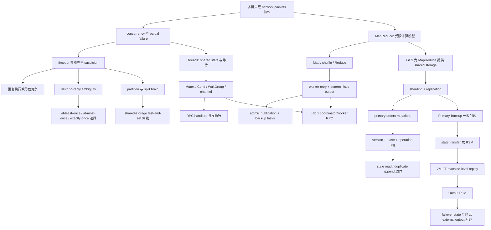

> 覆盖 MIT 6.824 Spring 2021 Lecture 1–4：Introduction → RPC and Threads → GFS → Primary-Backup Replication。本文只综合本课程归档中的课堂笔记、指定阅读、FAQ、Questions 与 Lab 材料；不引入外部事实。

## 1. 模块定位与证据规则

这四讲组成一条连续的设计推理，而不是四个互不相干的主题：

1. **Introduction / MapReduce** 先说明为什么要把工作放到多台机器上，以及多机带来的 concurrency、partial failure、communication cost 与 tail latency。
2. **RPC and Threads** 把“多件事同时发生”和“跨机器调用”落到程序结构：谁拥有状态、谁等待谁、无 reply 到底意味着什么。
3. **GFS** 把计算框架依赖的 storage 做成大规模 replicated service，并展示 primary、version、lease 与 relaxed consistency 的具体取舍。
4. **Primary-Backup / VM-FT** 把复制抽象为 state transfer 或 replicated state machine（RSM），再追问 failover 后已经发生的外部输出能否与 backup state 保持一致。

### 1.1 证据标签

本文使用以下标签区分证据强度：

- **[课堂]**：来自 Lecture `NOTES.md`，按 transcript chronology 整理；可沿笔记时间戳回听。
- **[论文]**：来自该讲指定 paper 的本地阅读指南及归档 PDF。
- **[FAQ]**：来自课程归档 FAQ；它可解释论文疑点，但不冒充课堂原话。
- **[Question]**：来自官方 schedule 归档的当讲提交题。
- **[Lab]**：来自官方 Lab 页面或课程级中文实验路线。

同一结论若跨越标签，必须分别看待。例如，Lecture 3 课堂确认“master 等旧 lease 到期再建立新 primary”的安全方向；paper reading 还给出 `60 seconds` 初始 lease 等实现参数。前者是课堂机制，后者是论文事实，不能混写为同一层证据。

### 1.2 总入口与一手归档

- [课程材料总索引](/courses/mit-6824-s21/materials/)
- [Spring 2021 官方课程安排归档](/assets/courses/mit-6824-s21/materials/official-materials/course-pages/schedule.html)
- [Labs 中文实践路线](/courses/mit-6824-s21/labs/)
- [Lab 1: MapReduce 官方页](/assets/courses/mit-6824-s21/materials/official-materials/labs/lab-mr.html)

| 讲次 | 课堂笔记 | 阅读指南 | 指定材料 | FAQ / Question |
| --- | --- | --- | --- | --- |
| Lecture 1 | [Introduction NOTES](/courses/mit-6824-s21/lectures/001/) | [MapReduce 阅读指南](/courses/mit-6824-s21/readings/lecture-01/) | [MapReduce paper](/assets/courses/mit-6824-s21/materials/official-materials/papers/mapreduce.pdf)、[课堂讲义](/assets/courses/mit-6824-s21/materials/official-materials/lecture-notes/l01.txt) | 官方 schedule 未列 Question，也无单独 FAQ |
| Lecture 2 | [RPC and Threads NOTES](/courses/mit-6824-s21/lectures/002/) | [Go / Crawler / RPC 阅读指南](/courses/mit-6824-s21/readings/lecture-02/) | [RPC 讲义](/assets/courses/mit-6824-s21/materials/official-materials/lecture-notes/l-rpc.txt)、[crawler.go](/assets/courses/mit-6824-s21/materials/official-materials/lecture-notes/crawler.go)、[kv.go](/assets/courses/mit-6824-s21/materials/official-materials/lecture-notes/kv.go) | [Go FAQ](/assets/courses/mit-6824-s21/materials/official-materials/faqs/tour-faq.txt)、[Question](/assets/courses/mit-6824-s21/materials/official-materials/questions/02-q-gointro.html) |
| Lecture 3 | [GFS NOTES](/courses/mit-6824-s21/lectures/003/) | [GFS 阅读指南](/courses/mit-6824-s21/readings/lecture-03/) | [GFS paper](/assets/courses/mit-6824-s21/materials/official-materials/papers/gfs.pdf)、[课堂讲义](/assets/courses/mit-6824-s21/materials/official-materials/lecture-notes/l-gfs.txt) | [GFS FAQ](/assets/courses/mit-6824-s21/materials/official-materials/faqs/gfs-faq.txt)、[Question](/assets/courses/mit-6824-s21/materials/official-materials/questions/03-q-gfs.html) |
| Lecture 4 | [Primary-Backup NOTES](/courses/mit-6824-s21/lectures/004/) | [VM-FT 阅读指南](/courses/mit-6824-s21/readings/lecture-04/) | [VM-FT paper](/assets/courses/mit-6824-s21/materials/official-materials/papers/vm-ft.pdf)、[课堂讲义](/assets/courses/mit-6824-s21/materials/official-materials/lecture-notes/l-vm-ft.txt) | [VM-FT FAQ](/assets/courses/mit-6824-s21/materials/official-materials/faqs/vm-ft-faq.txt)、[Question](/assets/courses/mit-6824-s21/materials/official-materials/questions/04-q-vm-ft.html) |

## 2. 先修知识与学习产出

### 2.1 先修知识

进入本模块前，应能解释：

- process、thread/goroutine、machine、network packet 与 local disk 的区别；
- function call、key/value、file offset、log、checkpoint 与 cache 的基本含义；
- sequential execution、concurrency、race condition 与 critical section 的直觉；
- durability 与“进程重启后状态仍可恢复”的区别；
- throughput 是总体处理率，latency 是单次请求耗时；
- Go 中 goroutine、channel、`sync.Mutex`、`sync.Cond`、`sync.WaitGroup` 的基本用途。

不要求预先掌握 Raft、形式化 consistency model、Byzantine fault tolerance 或现代 VMware/GFS 后继系统。本模块只使用 Lecture 1–4 已给出的概念边界。

### 2.2 完成本模块后的产出

学习者应能独立完成五种产出：

1. 画出 MapReduce、GFS 与 VM-FT 的组件图，并区分 control、data、log 与 external-output path。
2. 从 timeout 或断连开始，列出系统无法观察到的事实，而不是把“无响应”直接写成 crash。
3. 对每个 case study 写出 safety、liveness/availability、performance 与明确不保证的性质。
4. 把 Lecture 2 的 concurrency/RPC 规则落到 Lab 1 coordinator/worker 的共享状态、任务生命周期与重试语义。
5. 用同一套词汇比较 computation retry、storage replication 与 machine-level replicated execution。

## 3. 跨讲依赖图



### 3.1 三条必须说清的依赖

1. **MapReduce → GFS**：Map input 与 final Reduce output 位于 distributed file system；Map intermediate output 位于 worker local disk。不了解这一区分，就无法解释 data locality、shuffle、worker failure 后为何只重跑某些结果，以及 GFS aggregate throughput 为什么重要。
2. **Threads/RPC → Lab 1**：coordinator 的 RPC handlers 会并发访问调度状态；worker timeout 又会制造多个 attempts。不了解锁、owner、termination 与 no-reply ambiguity，就会把任务表和文件发布做成两个彼此矛盾的协议。
3. **GFS → Primary-Backup**：GFS 已使用 primary 来统一 mutation order、用 lease 限制角色有效期；Lecture 4 再把问题一般化为 replica state、operation order、non-determinism、split brain 与 external output。

## 4. Failure model 的演化

四讲不是不断“增加更多故障类型”，而是逐步暴露同一故障在不同 abstraction layer 的后果。

| 阶段 | 被建模的故障/不确定性 | 本地可观察事实 | 关键机制 | 明确边界 |
| --- | --- | --- | --- | --- |
| Introduction / MapReduce | worker crash、slow/stalled worker、network partition、coordinator crash | timeout 或 ping failure，只能说明当前没有及时响应 | task re-execution、determinism、atomic rename、backup task | coordinator crash 时整项 job abort/retry；不是 exactly-once execution |
| Threads / RPC | goroutine race/deadlock/leak；request/reply 丢失；server crash | `Call()` 返回 error 不能说明 handler 是否执行 | lock/ownership/wait protocol；retry；XID/duplicate filtering 的 at-most-once 思路 | Go RPC 不自动把网络调用变成 exactly once；duplicate state 若不 durable，crash 后会丢失 |
| GFS | component failure、disk corruption、stale replica、partition、master crash | master、client、chunkserver 各自只看到局部 connectivity、cache 与 version | replication、checksum、operation log/checkpoint、primary、version、lease | relaxed consistency；record append 可 duplicate；cached metadata 可形成 stale read；原论文 master cut-over 有人工边界 |
| VM-FT | fail-stop primary/backup failure、logging-channel partition、execution non-determinism | heartbeat/traffic timeout 仍只产生 suspicion | deterministic replay、Output Rule、shared-storage test-and-set、repair | common software/configuration bug、malicious/Byzantine failure不在保证内；输出仍可能丢失或重复；论文方案为 one backup、uni-processor VM |

### 4.1 从 failure ambiguity 到协议约束

统一推理模板如下：

```text
observation: 没有及时收到消息
  != proof: 对方已经停止且不会继续产生 effect
  -> old attempt/old primary 可能仍在运行
  -> duplicate execution 或 split brain 成为可能
  -> 协议必须约束 publication、role authority 或 external output
```

- MapReduce 约束的是 **哪个完整 task result 被发布**。
- RPC semantics 约束的是 **一个 logical request 可能执行几次**。
- GFS 约束的是 **哪个 primary epoch 可以排列 mutation，以及 client 可能读到哪个 replica**。
- VM-FT 约束的是 **哪个 VM 可以 go live，以及哪些 output 可以先于 backup knowledge 对外出现**。

## 5. Lecture 1：Introduction → MapReduce

### 5.1 分布式系统的工作定义

**[课堂]** 一个 distributed system 由多台计算机组成，经网络收发 packets 交互，彼此合作提供同一 service。它不同于 shared-memory multiprocessor：跨机组件没有共同内存，也不能从一次本地 load 判断远端状态。

建设多机系统的四类动机是：

1. 连接物理分离的机器，并共享 data、display 或 computation；
2. 用 parallelism 增加 capacity/throughput；
3. 用物理冗余与 replication 获得 fault tolerance；
4. 用 isolation 和更窄的 interface 缩小 security exposure。

这些目标会互相施加成本。Replication 增加通信与 storage work；stronger consistency 需要更多 coordination；增加机器只在 workload 可并行时提高 throughput，而 fan-out request 还可能被最慢参与者拖入 tail latency。

### 5.2 Infrastructure、abstraction 与评价维度

课程把 application 下方的 infrastructure 分成：

- **Storage**：file system、key/value service；
- **Computation**：MapReduce 等 distributed computation framework；
- **Communication**：RPC 及其调用 semantics。

Abstraction 的目标是让 distributed implementation 尽量呈现熟悉的 sequential-looking contract，但不能假设它与单机完全等价。评价时至少分开：

- **availability**：failure 正发生时是否仍可交付 service；
- **recoverability**：节点修复后是否能恢复 state 并重新加入；
- **consistency**：concurrency/failure 下 operations 的行为契约；
- **throughput**：单位时间完成多少工作；
- **latency / tail latency**：一次请求，尤其最慢一部分请求，需要多久。

### 5.3 MapReduce programming model

**[论文]** 用户提供两个受限函数：

```text
Map(k1, v1) -> list(k2, v2)
Reduce(k2, list(v2)) -> list(v2)
```

Framework 承担 partition、scheduling、data movement、failure recovery 与 load balancing：

```text
GFS input splits
  -> M map tasks
  -> intermediate key/value pairs partitioned into R local regions
  -> reducers fetch their partition from every map worker
  -> sort/group by intermediate key
  -> R reduce tasks
  -> R final files in global file system
```

Word count 中，Map 对每个 word 发出 `(word, 1)`，framework 把同 key 的 values 聚合，Reduce 求和。Map tasks 可独立运行；Reduce invocations 在分组后也可独立运行；**shuffle** 是跨越两者的 network-heavy boundary。

### 5.4 Roles、storage path 与 barrier

| 角色/数据 | 位置与职责 | Failure 后的后果 |
| --- | --- | --- |
| Master/coordinator | 保存 task 的 `idle / in-progress / completed` 状态、worker 与 completed map regions 的 location/size | single master failure 使论文实现 abort job |
| Input split | GFS | 可由其他 worker 重新读取 |
| Map intermediate regions | map worker local disk | worker failure 后，即使 map task 曾完成也要重跑 |
| Reduce final output | global file system | 完成并发布后不因原 worker failure 自动重跑 |
| Map→Reduce barrier | 先取得完整 map outputs，再让 reducers 得到完整 partition | 防止 Reduce 基于不完整 input 得出 final output |

Data locality 尽量把 Map 放到持有 input replica 的机器或附近 switch，从而减少 input network traffic；它不消除 shuffle 与 replicated final output 的网络成本。

### 5.5 Retry correctness：不是 exactly once

**[课堂+论文]** Timeout 只让 master 决定“应该再试一次”，不证明旧 worker 已停止。因此同一 logical task 可以同时有多个 attempts。

对于 deterministic `Map`/`Reduce`：

1. 相同 input 的 attempts 产生相同内容；
2. master 只接受一个 completed map location set；
3. Reduce attempt 先写 private temporary file；
4. atomic rename 把某个完整 attempt 发布到 final name；
5. 多个 attempts 竞争同一 final name 时，外部只看到一个完整且逻辑等价的结果。

这里有两个不可交换的条件：

- **determinism** 保证多个 attempts 的内容逻辑等价；
- **atomic publication** 保证不会观察到 half-written final file。

若 operators non-deterministic，不同 reduce partitions 可能读取同一 map task 的不同 executions；每个 partition 仍可能对应某个 sequential execution，但所有 partitions 不保证共同对应同一个 sequential run。

### 5.6 Performance mechanisms 与代价

| 机制 | 针对的问题 | 收益 | 代价/边界 |
| --- | --- | --- | --- |
| Fine-grained tasks，且 $M,R$ 大于 workers | load imbalance、failure redistribution | dynamic scheduling 更灵活 | master 做 $O(M+R)$ decisions，并保存 $O(MR)$ pair metadata |
| Data locality | input network bandwidth | 从本地 replica 读 input | shuffle/output 仍需网络 |
| Combiner | 大量可局部合并的 intermediate records | 减少 shuffle bytes | 只有不改变 application semantics 时才适用 |
| Backup tasks | job 尾部的 straggler | 取 first finisher，缩短 completion tail | 消耗额外 compute；不是 correctness proof |
| Single master | 简化 scheduling 与 metadata | 集中决策 | 论文实现中 master failure aborts job |

**[论文，历史环境]** 阅读指南记录了约 `1800` machines 的 2004 evaluation：约 `1 TB` sort 正常运行 `891 s`，禁用 backup tasks 后为 `1283 s`，增加 `44%`；故意杀死 `1746` workers 中的 `200` 个后为 `933 s`。这些数字只说明论文当时 setup 下 locality、retry 与 straggler strategy 的效果，不能外推到当前 hardware。

### 5.7 本讲的核心结论

MapReduce 的价值不是发明 `Map` 或 `Reduce` 函数，而是用受限、functional、stateless 的 programming model 换取 framework 对 parallelization、scheduling、failure 与 communication 的隐藏。限制越明确，runtime 越能安全地 re-execute；它也因此不适合任意 communication pattern 或 mutable shared state。

## 6. Lecture 2：RPC and Threads

### 6.1 Goroutine execution model

**[课堂]** 每个 thread/goroutine 有自己的 program counter、stack 与 registers；同一 process 内的 goroutines 共享 address space。Go runtime 可在一个 goroutine 因 network I/O blocked 时运行其他 goroutines，也可在多个 cores 上并行运行 runnable goroutines。

引入并发的三类理由是：

1. 重叠 network waits，获得 I/O concurrency；
2. 利用 multiple cores 提高 throughput；
3. 用 background goroutine 表达 periodic activity。

Goroutine lightweight 但不是 free；更重要的是，启动 goroutine 不等于自动解决 lifecycle。Main/function 可能过早返回，也可能留下永远 block 的 goroutine。

### 6.2 三类并发风险

#### Race

`n = n + 1` 可能被分解为 load、increment、store。两个 goroutines 都先 load `0`，最终都 store `1`，于是两个 increment 只得到 `1`。高级语言的一条 statement 不自动 atomic；labs 应使用 race detector，但“无 race 报告”仍不证明 protocol、locking order 或 termination 正确。

#### Coordination

一个 goroutine 经常必须等待另一个 goroutine产生结果、完成工作或改变 predicate。等待必须说明：

- 谁更新 predicate；
- 谁拥有或保护 predicate；
- waiter 何时睡眠、何时被唤醒；
- 被唤醒后为何仍要重新检查；
- 全局何时再也不会产生新 work。

#### Deadlock 与 leak

等待形成环时没有参与者能 progress。Unbuffered channel send 没有 receiver 会 block；若 consumer 提前停止接收，剩余 producers 可永久 block，形成 goroutine leak。短程序因 process 退出可能掩盖这一问题，long-running service 不会。

### 6.3 四种同步工具的职责

| 工具 | 适合表达 | 必须保持的不变量 | 常见误用 |
| --- | --- | --- | --- |
| `sync.Mutex` | 多 goroutines 共享 mutable state | 每条访问路径遵守同一 lock-data convention | 只给部分访问加锁；在慢 network I/O 期间持锁 |
| `sync.Cond` | 某个 shared predicate 可能改变 | 持 associated mutex 检查；`Wait()` release/sleep/reacquire；醒后 loop 重查 | 把通知当作 predicate 已成立；脱离 lock 读 state |
| `sync.WaitGroup` | 等一组已启动 activities 完成 | 每次 `Add(1)` 对应一次 `Done()` | 用它替代“动态 work 是否还会产生”的完整协议 |
| Channel | 在 goroutines 间传 value/ownership 并同步 | sender/receiver 生命周期配对；明确 close/termination | 认为 channel thread-safe 就不会 deadlock；停止 receive 后留下 senders |

老师不主张 channels 与 locks 教条式二选一。Communication-centered design 可优先 channel；自然共享 table/state 时可用 lock/condition variable。关键不是语法，而是谁拥有 invariant。

### 6.4 Crawler：同一问题的三种结构

Crawler 的共同目标是：从 start URL 覆盖 reachable graph、每个 URL 只 fetch once、让慢 `Fetch` 并发、并在所有动态产生的工作完成后退出。

#### Serial baseline

先 check `fetched[url]`，未见则立即 mark，再执行 `Fetch` 并递归 child URLs。它能处理 cycles 与 duplicate links，但一次只做一个 network fetch。

#### Mutex + recursive WaitGroup

- 在同一个 critical section 中执行 check-and-mark，保证只有一个 goroutine 获得 first-fetch 权利；
- lock 只覆盖 map access，不覆盖慢 `Fetch`；
- 每个 child goroutine 启动前 `Add(1)`，结束时 `Done()`，parent `Wait()`；
- loop variable 通过 function argument 固定当前 value，避免 closure 稍后读取已变化的变量。

#### Coordinator + channel

- coordinator 是唯一读写 `fetched` map 的 goroutine，因此无需给 map 加锁；
- workers 并行执行 expensive `Fetch`，再把新 URLs 交回 coordinator；
- coordinator 还必须维护 outstanding work，不能在某一时刻 channel 暂空就误判全局完成。

这正是 Lab 1 的结构预演：single coordinator 串行管理 metadata，不妨碍 workers 并行执行昂贵工作。

### 6.5 RPC abstraction 的 normal path

RPC 让 client code 具有 local-call 外观，但底层仍是 network protocol：

```text
client Call(method, args, reply)
  -> client stub marshals method + args
  -> network request
  -> server dispatches handler
  -> handler computes service result
  -> server marshals reply
  -> network reply
  -> client unmarshals into reply
```

Toy KV server 暴露了两个不能被 abstraction 隐藏的事实：

1. Server RPC handlers 通常在 concurrent goroutines 中执行，共享 map 仍要 lock 或采用单 owner。
2. `Call()` error 与正常 reply 内的 service error 属于不同层：前者表示没有可靠获得 RPC reply，后者表示调用链完成并返回了 service-level result。

### 6.6 No reply 的四种解释

Client 没收到 reply 时，至少要保留这些可能性：

1. request 尚未到 server；
2. server 收到 request，但执行前 crash；
3. server 已执行 operation，但 reply 前 crash；
4. server 已执行并发送 reply，但 reply 在网络中丢失。

因此 timeout/error 既不能证明“没有执行”，也不能证明“已经执行”。RPC 隐藏 marshalling，不消除 distributed failure ambiguity。

### 6.7 RPC semantics

| 语义 | 基本机制 | 可能执行次数 | 代价/边界 |
| --- | --- | ---: | --- |
| At-least-once | client 在无 reply 时 retry | 一次或多次 | non-idempotent operation 可能重复 effect |
| At-most-once | logical request 带 XID；server 记录 seen requests/cached reply，过滤 duplicate | 零次或一次 | server crash 后若表不持久化，旧 duplicate 可再次执行；还要清理旧记录 |
| Exactly-once | 既要 retry 保证不漏，又要 duplicate state 跨 failure 保持可靠 | 目标为一次 | 需要 durable/fault-tolerant protocol state；普通 RPC library 不自动提供 |

**[课堂]** Go RPC library 的一次 `Call()` 不自动 resend。Application 自行 retry 后，必须自己定义 logical request identity、duplicate effect 与 failure recovery。

这与 MapReduce 的区别很关键：MapReduce 并没有让 task exactly once；它让重复 deterministic attempts 的最终文件效果稳定。RPC 则直接面对 application operation 是否可安全重复。

## 7. Lecture 3：GFS

### 7.1 从 MapReduce workload 推导 storage design

**[论文]** GFS 的 design point 建立在归档论文的 workload assumptions 上：commodity component failure 常见；files 通常很大；主要是 large streaming reads、少量 small random reads；writes 以 large sequential append 为主，random overwrite 少；多 clients 需要 concurrent append；high sustained bandwidth 比 low latency 更重要。

这些不是任意 distributed file system 的普遍定律。它们解释了 GFS 为什么：

- 使用 `64 MB` chunks；
- 让 client 直接访问 chunkservers；
- 提供 record append 与 relaxed consistency；
- 接受 application library 对 duplicate/padding/fragments 做补偿；
- 不把无修改承载普通 POSIX applications 作为目标。

### 7.2 Architecture：control path 与 data path

```text
metadata/control:
client -> single master -> chunk handle + replica locations + version

data:
client <-> selected chunkserver
```

- **Master**：保存 namespace、file-to-chunk mapping，并管理 lease、placement、migration、garbage collection 与 re-replication。
- **Chunkserver**：把 chunk 作为 local Linux file 保存，通过 handle/byte range 提供 read/write。
- **Client library**：用 filename/offset 查询 metadata，缓存后直接访问 chunkserver。
- **Chunk**：固定 `64 MB`，用 unique handle 标识，默认三份 replicas。

Single master 集中全局 control，但 bulk data 绕过 master，因此许多 mappers 可同时从不同 disks 读 input。**[课堂，历史环境]** 老师用论文时代约 `30 MB/s` 单盘与超过 `10,000 MB/s` aggregate read 的数量级说明“并行磁盘吞吐”目标；这不是现代硬件基准。

### 7.3 Master durable state 与 reconstructed state

| Master state | 是否持久化 | 理由 |
| --- | --- | --- |
| Namespace、`filename -> chunk handles[]` | 是，经 operation log/checkpoint | 已回复成功的 create/mapping 不能在 crash 后消失 |
| Chunk version | 是 | 必须识别先上线但错过新 epoch 的 stale replica |
| Chunk locations | 否，startup 时询问 chunkservers 重建 | chunkservers 最清楚本地实际持有哪些 chunks |
| Current primary/secondaries、lease | 课堂归为可重建状态 | role 可在恢复后重新建立 |

Mutation 在 log 持久化后才向 client 回复。Checkpoint 缩短恢复路径，但不替代 log：恢复时加载 latest complete checkpoint，再 replay log tail。

### 7.4 Read path 与 cache tradeoff

1. Client 向 master 发送 filename 与 offset。
2. Master 返回对应 chunk handle、replica list 与 version。
3. Client cache metadata，选择较近 replica。
4. Chunkserver 检查 version 后返回 data。

收益是减轻 single master 的 CPU/network load，并改善 network locality；风险是 client 继续持有旧 list/version。Version check 可识别许多 stale replica，但不能消除“old client 与 stale replica 恰好共享同一旧 version”的窗口。

### 7.5 Mutation：data flow 不等于 mutation order

1. Master 给某 replica lease，它成为 primary；授予新 lease 时更新 chunk version。
2. Client 先把 data pipeline 到所有 replicas 的 temporary buffer。
3. Client 再向 primary 发 mutation command。
4. Primary 验证 lease/version，选择 serial order 或 append offset，本地应用。
5. Primary 命令 secondaries 按同一 order/offset 应用。
6. 全部成功才返回 success；任一失败向 client 返回 error，client 可从头 retry。

Data pipeline 优化 bytes 的传播路径；primary 负责 operation ordering。Bytes 已到 replica memory 不代表 mutation 已成功或已按共同顺序应用。

### 7.6 Record append：at-least-once contract

Record append 中 client 不指定 offset，由 primary 选择。成功时，一个完整 record 至少一次作为连续 bytes 出现在某处；failure + retry 可能留下 padding、fragment 或 duplicate whole record。因此 application library：

- 用 checksum/magic 识别 corruption、padding 或 invalid fragment；
- 用 unique record ID 识别 duplicate；
- 对 duplicate-sensitive processing 做 filtering。

Checksum 与 unique ID 不能互换：前者回答“bytes 是否有效”，后者回答“这是不是同一个 logical record 的再次出现”。

### 7.7 Consistency vocabulary

**[论文]** GFS 区分：

- **consistent**：无论 client 读哪个 replica，都看到相同 data；
- **defined**：region consistent，且内容完整对应某次 mutation；
- **consistent but undefined**：replicas 一致，但并发 mutation 的结果不对应单一完整 write；
- **inconsistent**：不同 replicas/reads 可能看到不同 data。

Successful mutation without concurrent writers 产生 defined region；concurrent successful writes 可产生 consistent but undefined region；failed mutation 可留下 inconsistent region。Namespace mutations 由 single master、namespace locks 与 operation log 排序；data mutation 由 lease primary 排序，并用 version 排除错过 epoch 的 replica。

### 7.8 Stale read 的完整事件链

官方 Question 要求描述 client 读到 stale data 的事件序列。课程材料支持的构造是：

```text
1. C_old 向 master 查询 chunk，并缓存 {handle, S2, version 10}。
2. S2 与 master/active replica group 失联，但 C_old 仍能访问 S2。
3. 旧 lease 到期后，master 在活动组建立新 primary epoch，version 变为 11。
4. C_new 在 version 11 的 active replicas 上完成 write。
5. C_old 不重新查询 master，仍向 S2 发 version 10 的 read。
6. S2 自己也是 version 10，local version check 通过。
7. C_old 得到旧 data。
```

必要条件有两个：client cached old metadata，以及 asymmetric connectivity 让 old client 仍能访问已被 active group 排除的 replica。这个场景说明 version 有作用但不是绝对 freshness proof。

### 7.9 Lease 如何阻止 two primaries

Master 联系不到 old primary 时，不能立刻把“失联”解释为 crash。它必须等待 old lease expiry；old primary 到期后拒绝新 writes；此后 master 才可授予新 primary lease。Lease 把角色 authority 变成有明确到期边界的权利。

Version 与 lease 的职责不同：

- **lease**：限制谁在何时拥有 ordering authority；
- **version**：标记 replica 是否错过新的 mutation epoch；
- **operation log/checkpoint**：恢复 master 的 durable metadata history；
- **checksum**：检测单份 copy 的 data corruption。

### 7.10 Tradeoffs 与历史 evaluation

| 设计 | 收益 | 代价/限制 |
| --- | --- | --- |
| Single master | placement、namespace、lease 决策简单 | metadata/failover pressure；原论文 cut-over 有 human intervention |
| `64 MB` chunks | 少 metadata、少 master interaction、适合 streaming I/O | small-file hot spot 与低并行度 |
| Direct client-chunkserver path | aggregate throughput 随 disks 扩展 | client metadata cache 形成 stale window |
| Relaxed consistency | 简化 append-oriented workload，提高持续吞吐 | holes、duplicates、stale/inconsistent reads 需 application compensation |
| Record append | 多 producers 不必外部协调 offset | at-least-once、padding/duplicate、offset 由 GFS 选 |
| Replication + re-replication | component failure 后保留 data/恢复冗余 | write traffic 与 background recovery cost |

**[论文，历史 setup]** `16` readers 的 aggregate read 为 `94 MB/s`，约为 setup 中 `125 MB/s` link limit 的 `75%`；`16` clients 写不同 files 时 aggregate write 为 `35 MB/s`；同 file concurrent append 从单 client `6.0 MB/s` 到 `16` clients `4.8 MB/s`。这些数据验证的是当时目标 workload，不证明 GFS 适合 low-latency、small-file 或任意 application。

## 8. Lecture 4：Primary-Backup Replication → VM-FT

### 8.1 Failure scope

**[课堂+论文]** 本讲主要处理 fail-stop：副本工作时正确，失败时停止，不继续产生任意错误 externally visible action。复制不自动处理：

- primary 与 backup 共有的 software logic bug；
- 两边采用的同一错误 configuration；
- compromised/malicious hypervisor 或 Byzantine behavior；
- 同一 data center 等共同 failure domain 同时消灭两个副本。

只考虑 fail-stop 仍不简单，因为 backup 失去 primary 消息时无法区分 crash 与 network partition。若两边都继续服务，就形成 split brain。

### 8.2 State transfer 与 RSM

| 方法 | 复制对象 | Backup 行为 | 主要 tradeoff |
| --- | --- | --- | --- |
| State transfer | checkpoint 或 state changes | 安装结果 state | 简单直观，但小 operation 可能造成巨大 state transfer |
| Replicated state machine | ordered operations/inputs | 从同一 state 本地重放 | 通常省 bandwidth，但必须控制 order 与 non-determinism |
| Hybrid repair | 先 state transfer，再持续复制 operations | 先建立 replacement，再跟随 log | heavy transfer 放在低频 repair，light operations 用于 steady state |

RSM 的核心条件可写为：

$$
S_P=S_B,\quad op_P=op_B,\quad \delta\text{ deterministic}
\Longrightarrow \delta(S_P,op)=\delta(S_B,op)
$$

相同 operation 不足以推出相同 state；还需要相同初态、相同顺序与 deterministic transition。

### 8.3 VMware FT 的复制层级

VM-FT 在 machine level 实现 RSM：

- state 是 x86 registers 与 guest memory；
- deterministic operations 是普通 machine instructions；
- guest OS 与 application 无需修改；
- VMM/hypervisor 截获 guest 可见之前的 external events 与 non-deterministic outcomes。

普通 deterministic instructions 在 primary/backup 本地执行，不逐条走 logging channel。需要记录的是可能让执行分叉的内容：network input、interrupt 的 exact instruction point、timer/get-time/cycle-counter 等 non-deterministic outcome。Backup 在相同 instruction point 注入同一 event/result。

论文方案限制为 uni-processor VM，因为 multi-core shared-memory races 会产生高频 non-determinism。Machine-level transparency 的收益是保护 existing software；代价是系统缺少 application semantics，只能在低层细粒度记录和协调。

### 8.4 Input、execution 与 output suppression

```text
external input
  -> primary VMM captures event/outcome
  -> primary guest executes
  -> log entry travels over logging channel
  -> backup VMM injects same event at same instruction point
  -> backup guest executes same path

primary guest output -> primary VMM -> external world（规则满足后）
backup guest output  -> backup VMM -> suppress/discard
```

Backup 也执行 output instruction，才能保持 identical execution；但 backup VMM 丢弃真实 external effect，使正常状态下只有 primary 对外出现。

### 8.5 Deterministic replay 为什么仍不够

考虑 counter 初值为 `10`：

1. Client 发出 `inc`。
2. Primary 执行到 `11` 并向 client 回复 `11`。
3. 若导致该状态的 input log 尚未到 backup，primary crash。
4. Backup 仍为 `10`，go live 后下一次 `inc` 又返回 `11`。

两台机器各自都可 deterministic，但 client 已见的 output 与 failover state 矛盾。问题不是“相同 input 会不会产生相同 state”，而是 backup 是否已经拥有足以重放到 client 已观察状态的 log prefix。

### 8.6 Output Requirement 与 Output Rule

**[论文]** Output Requirement 要求 backup 接管后的 execution 与 primary 已发送到 external world 的 outputs 一致。对应的 Output Rule 是：primary 在 backup 收到并确认与该 output 相关的 log entry 之前，不得把该 output 发向 external world。

顺序可写为：

```text
backup receives relevant log
  -> backup ACK
  -> primary releases external output
```

规则只 delay external output，不要求 primary guest 整体停止。Backup 只需已经收到 log，不必在 ACK 时已经执行到 output point；failover 时它先 replay remaining received logs，再 go live。

### 8.7 Partition、test-and-set 与 go-live

VM-FT 使用 shared storage 上的 atomic test-and-set flag 仲裁：

1. Logging channel 失联，primary/backup 都只能 suspect 对方 failure。
2. 想 go live 的一方对初值 `0` 的 flag 执行 atomic `test-and-set(1)`。
3. 取得旧值 `0` 的一方获胜并 go live。
4. 取得旧值 `1` 的一方知道已有 winner，必须 halt/terminate。
5. 无法访问 shared storage 的一方不能证明自己唯一，必须等待而非冒险服务。

Atomic operation 是 exclusivity 的 linearization point；heartbeat/timeout 只负责触发 suspicion，不负责证明谁 dead。Winner 不要求一定是原 primary，安全目标是最多一个 live primary。

### 8.8 Repair lifecycle

Failure 后只剩一个 live VM，系统暂时没有冗余。Modified VMotion 从 live VM clone replacement backup，建立 logging/replay mode；新 backup 完整同步并加入协议后，才 reset arbitration flag 并恢复双副本状态。若单机期间再次失败，服务将不可用，因此 repair 不是外围运维，而是 fault-tolerance lifecycle 的组成部分。

### 8.9 Exactly-once output 仍不保证

Output Rule 保证“client 已见 output 时，backup 至少收到相关 log”，但 backup 无法知道 primary 是在最后一个 output 发送前还是发送后 crash。Failover 时最后 packet 仍可能 lost 或 duplicate；论文依赖 TCP sequence handling、idempotent disk I/O 或 application protocol 容忍/过滤，而没有声称 exactly-once packet delivery。

### 8.10 Performance 与限制

| 机制/选择 | 收益 | 成本/限制 |
| --- | --- | --- |
| Machine-level replay | OS/application transparent | low-level logging、I/O race handling、缺少 application semantics |
| Output Rule | failover state 与已见 output 对齐 | logging ACK 进入 output critical path |
| One primary + one backup | protocol 与管理简单 | failure 后短暂无冗余，不能直接承受第二次 failure |
| Shared storage | disk state 可共享，也可作为 arbiter | shared storage 成为系统依赖 |
| Uni-processor VM | 避免 multicore race replay | 放弃 multi-core parallel throughput |
| Automatic replacement | 数分钟量级恢复冗余 | clone、placement 与 flow control 需要 cluster management |

**[论文，历史 setup]** 归档 evaluation 中 representative workloads 的 FT/non-FT performance 为 `0.94–0.99`，logging bandwidth 低于 `20 Mbits/s`；但 network receive workload 更容易压满 logging channel，因为 incoming packet data 必须复制给 backup。该结果只属于论文 setup，不等于所有 workloads 的普遍 overhead。

## 9. 三个 case study 的机制对照

| 维度 | MapReduce | GFS | VM-FT |
| --- | --- | --- | --- |
| 被复制/重做的对象 | task attempt | chunk data + ordered mutation | machine execution 的 non-deterministic inputs/outcomes |
| 中央角色 | master/coordinator 调度 tasks | master 管 metadata/lease，chunk primary 排 mutation | primary VM 对外服务，backup replay |
| 重复来源 | timeout、worker crash、straggler backup | failed append + client retry | failover 时不知道最后 output 是否已发送 |
| 处理重复 | deterministic result + atomic file publication | unique record ID/filtering；checksum 另管 corruption | TCP/idempotent I/O/application protocol；不保证 exactly once |
| 角色冲突处理 | master 只接受一个 task completion/output name | lease expiry 后才能授予新 primary；version 标记 epoch | shared-storage atomic test-and-set 选唯一 go-live winner |
| 外部可见边界 | final output rename | mutation success、read from chosen replica | Output Rule 约束 external output release |
| 性能主要目标 | parallel batch throughput + tail completion | many-client aggregate storage throughput | transparent failover 且控制 steady-state overhead |
| 明确牺牲 | general-purpose programming model、master HA | POSIX-like/general consistency、small-file/latency design | multicore、无 shared-storage independence、application-level efficiency |

### 9.1 不能混淆的四组概念

1. **Backup task ≠ replicated service**：前者复制 computation attempt 以缩短 straggler tail；后者维持可接管 state。
2. **Atomic rename ≠ exactly-once execution**：rename 只发布一个完整 file；旧 attempt 可能确实执行过。
3. **Version ≠ lease**：version 标记 replica epoch；lease 限制 primary authority 的时间范围。
4. **Deterministic replay ≠ external consistency**：前者保证相同输入得到相同执行；Output Rule 才把 backup knowledge 与已见 output 连接起来。

## 10. 官方 Paper Questions

### 10.1 Lecture 1

官方 schedule 未为 Lecture 1 列出 Paper Question。阅读指南中的 MapReduce 自测题属于本地学习脚手架，不能标成 MIT official submission。

### 10.2 Lecture 2

**[Question]** 当讲指定内容不是 paper，而是完成 Online Go tutorial 的 Crawler exercise，并查看 Lab 1 将使用的 Go RPC package。归档没有 tutorial 正文，因此本文不补造 exercise starter code、当前页面顺序或标准答案。可核验的准备目标是：coverage、deduplication、termination、blocked goroutine、shared-state ownership 与 race freedom。

### 10.3 Lecture 3

**[Question]** 描述一个 GFS client 读到 stale data 的事件序列。

合格回答必须明确：old client 先 cache metadata；某 replica 与 active group 失联但仍可被 old client 访问；master 在旧 lease 到期后建立新 version/primary；新 write 在 active replicas 完成；old client 不查 master，携旧 version 访问 stale replica；两边 version 相同使 local check 通过。只写“replica 没同步”不足以说明 read 为什么会成功。

### 10.4 Lecture 4

**[Question]** Primary 与 backup 落入不同 network partitions 时，backup 是否可能也成为 primary，导致 two primaries？

合格回答应枚举 logging channel 与 shared-storage reachability：两边都能访问 storage 时，atomic test-and-set 只允许一个 winner；只有一边能访问时，只有可仲裁的一边可能 go live；两边都不能访问时都应等待。Timeout 只触发 suspicion，不能证明 exclusivity。

## 11. Lab 1：MapReduce 的直接关系

### 11.1 来源与边界

- [Lab 1 官方页](/assets/courses/mit-6824-s21/materials/official-materials/labs/lab-mr.html)
- [Labs 中文实践路线中的 Lab 1](/courses/mit-6824-s21/labs/)
- [Lecture 1 NOTES](/courses/mit-6824-s21/lectures/001/)
- [Lecture 2 NOTES](/courses/mit-6824-s21/lectures/002/)

本节说明 lectures 如何约束实验思考，不提供可提交 implementation、隐藏测试推断或学生答案。

### 11.2 Lecture 1 提供的 protocol contract

Lab 1 实现一个 coordinator 与多个 workers，经 RPC 协作完成 Map→Reduce：

- 每个 input file 对应一个 Map task；
- Map intermediate keys 按 `nReduce` 分区；
- 所有 Map task 产生可用结果后，Reduce 才能依赖完整 partition；
- 第 `X` 个 Reduce task 发布 `mr-out-X`；
- worker 长时间未完成时，coordinator 可重新分配；官方 Lab 以 `10 seconds` 为 task timeout；
- 同一 task 多 attempts 时，不得暴露 partial file 或让迟到 attempt 破坏 final result；
- `Done()` 只在整个 job 完成时成立。

Lecture 1 解释了“为什么”：timeout 不证明 worker 已停止，所以 re-assignment 制造 duplicate attempts；deterministic application output 与 temporary-file/atomic-rename publication 共同提供稳定结果。

### 11.3 Lecture 2 提供的 implementation discipline

Coordinator RPC handlers 会并发执行，因此调度表不是普通 sequential map。实现前必须写清：

- 哪个 lock 或 owner 保护 task state、attempt state 与 phase transition；
- handler 是否在持锁时执行 file/network I/O；
- worker 取不到可运行 task 时如何等待，避免 busy-spin；
- completion reply 迟到时，coordinator 如何依据当前 logical task/attempt state 判断是否接受；
- goroutine、worker process 与 coordinator 何时退出；
- RPC failure 时 worker/coordinator 能确认什么，不能确认什么。

这不是要求把 exactly-once RPC 做进 Lab 1，而是要求让调度协议在 duplicate/late messages 下仍有一致状态转换。

### 11.4 实验前的最小状态机

在写 code 前，应能画出：

```text
Map phase:
idle -> in-progress(attempt A) -> completed
               |
               +-- timeout -> in-progress(attempt B)

Reduce phase:
only after every Map task has an accepted usable output

Job:
Map phase -> Reduce phase -> done
```

并回答：A 超时后仍完成怎么办；B 先完成后 A 又报告怎么办；worker 在写 temporary file 时 crash 怎么办；final name 何时可见；coordinator 如何避免两个 handlers 同时把 phase 向前推进。

### 11.5 官方公开验证面

课程级 Lab 路线列出的公开检查包括 word count、indexer output、Map parallelism、Reduce parallelism 与 worker crash recovery。实验还应始终用 race detector，并避免并发运行会共享 socket/current directory 的多个测试实例。

这些 tests 检查 observable behavior，不替代自己的 invariants。一次通过不证明没有 timing bug；反过来，修复 race 也不等于 phase、retry、termination 与 file publication 已正确。

## 12. 证据边界与不应推导的内容

1. 本模块没有使用外部网页正文或现代产品资料。所有技术事实均可回到上面的本地课程归档。
2. Lecture 2 的 Online Go tutorial 是 external-only；本地只有 Question 与 FAQ，因此本文不声称 tutorial 当前具体 API、starter code 或页面顺序。
3. Lecture 1 没有官方 Paper Question，也没有单独 FAQ；自测题不得伪装成官方作业。
4. Lecture 3 课堂对某些 recovery/reconfiguration 流程明确使用推测性语言；本文只把 lease expiry、version、read/append 主路径写成确定机制，不把课堂猜测扩成 protocol fact。
5. GFS、MapReduce 与 VM-FT 的 performance numbers 都绑定论文的历史 hardware/workload setup，只能用于理解设计目标和瓶颈，不能外推到当前系统。
6. GFS 的 relaxed consistency 是 workload-specific design point，不等于“distributed storage 都只能弱一致”；课堂也未在此给出完整形式化 consistency taxonomy。
7. VM-FT paper 的方案不代表后续 VMware 产品实现；课堂对后续版本的说法明确有不确定性。
8. Output Rule 不等于 exactly-once output；test-and-set 不等于 failure detector；lease 不等于可靠时钟模型的完整证明。
9. Lab 1 在单机多进程环境中模拟 distributed components；这保留 RPC/process boundaries，但不等于复制所有真实物理网络条件。
10. 本模块止于 Lecture 4。Raft、majority quorum、linearizability 的正式机制属于后续 lectures，不能倒灌为本模块已建立的结论。

## 13. Mastery Gates

每个 gate 都要求闭卷产出；“读懂了”不算通过。

### Gate 0：词汇与路径

**任务：** 在一张纸上定义 process/thread/machine、availability/recoverability、throughput/latency、replication/sharding、control/data path。

**通过条件：** 每组定义都能给出本模块中的一个反例。例如 replication 不自动提高 throughput；data path 不一定经过 control-plane master。

### Gate 1：MapReduce correctness

**任务：** 画出 GFS input、Map worker local intermediate、shuffle、Reduce final output，并加入一个 timeout 后的 duplicate attempt。

**通过条件：** 能分别说明 determinism 与 atomic rename 的职责；能解释 completed map 与 completed reduce 在 worker failure 后为何不同；能把 backup task 归为 performance mechanism。

### Gate 2：Concurrency 与 RPC ambiguity

**任务：** 对 crawler 写出 shared-state 版和 coordinator-owner 版 invariants；再列出 no reply 的四种事件。

**通过条件：** 能正确描述 `Cond.Wait()` 的 release/sleep/reacquire；能解释 at-least-once、at-most-once 与 exactly-once 的状态成本；不会把 `Call()` error 写成“server 没执行”。

### Gate 3：GFS protocol trace

**任务：** 闭卷画 client/master/chunkservers，分别走 read 与 record append，并构造 stale-read Question。

**通过条件：** 能区分 durable/reconstructed master state、data pipeline/mutation order、lease/version/checksum/record ID；能说明 relaxed consistency 与 target workload 的交换。

### Gate 4：VM-FT safety

**任务：** 从 counter `10 -> 11` 反例推导 Output Rule，并枚举 partition 时 shared-storage reachability cases。

**通过条件：** 能说明 deterministic replay 为何不够；能用 atomic test-and-set 的 old value 证明最多一个 winner；能说出 duplicate output 与 common-cause failure 的边界。

### Gate 5：跨讲综合

**任务：** 不看表格，用五分钟比较 MapReduce、GFS、VM-FT 的复制对象、重复来源、publication/output boundary、role authority 与性能目标，再用两分钟说明它们如何约束 Lab 1。

**通过条件：** 全程不使用“系统保证 exactly once”作为偷懒结论；每个系统至少说出一个明确不保证的性质与一个证据来源。

## 14. 十五道累计 Q&A

### 累计题 1：为什么 network-only interaction 会改变 failure reasoning？

**答：** 跨机组件只能观察消息是否按时到达，不能读取远端内存确认状态。没有消息同时符合 request 丢失、远端尚未执行、执行后 crash、reply 丢失和 network partition。因此 timeout 只能产生 suspicion；MapReduce 可能重试旧 task，RPC 可能重发 logical request，GFS/VM-FT 则必须限制 old primary 是否仍有权产生 effect。

### 累计题 2：Throughput、latency 与 tail latency 为什么必须分开？

**答：** 增加 workers/disks 可让许多独立工作并行，提高总体 throughput；单个 request 若 fan-out 到很多参与者，其 completion 受最慢者影响。MapReduce backup tasks 针对 job tail 的 straggler，不是 correctness；GFS 主要优化 many-client aggregate bandwidth，不以 single-operation low latency 为首要目标。

### 累计题 3：MapReduce 的 abstraction bargain 是什么？

**答：** Application programmer 把 computation 写成受限、functional、通常 deterministic 的 Map/Reduce functions，放弃任意 shared mutable state 与 communication pattern；framework 因而能自动 partition、schedule、move data、retry、load balance 并处理 straggler。限制不是附带缺陷，而是自动分布与 re-execution 的前提。

### 累计题 4：Timeout 后两个 Reduce attempts 都完成，为什么 final result 仍可稳定？

**答：** Timeout 不取消旧 attempt，因此两者可同时完成。每个 attempt 先写 private temporary file，再 atomic rename 到 final name；外部只看到一个完整 file。若 Reduce deterministic，两个完整 files 逻辑等价。Rename 解决 partial publication，determinism 解决内容等价；两者缺一不可。

### 累计题 5：为什么 completed map task 可能重跑，而 completed reduce task 通常不用？

**答：** Map intermediate output 位于 worker local disk；worker failure 会让其 location 不再可读，所以 master 重新执行该 Map。Reduce final output 已发布到 global file system，不依赖原 worker local disk，因此原 worker failure 不自动使结果消失。

### 累计题 6：Crawler 的 check-and-mark 为什么必须 atomic？

**答：** 若 check 与 mark 分开，两个 goroutines 可同时看到 `fetched[url] == false`，随后都 fetch 同一 URL。Mutex 版把二者放在同一 critical section；channel 版让 coordinator 独占 `fetched` map。两者实现形式不同，但都保证 first-fetch authority 只有一个 owner。

### 累计题 7：`sync.Cond.Wait()` 的正确使用协议是什么？

**答：** Waiter 先持 associated mutex，在 loop 中检查 shared predicate；不满足时调用 `Wait()`，它原子地释放 lock 并 sleep，醒来返回前重新取得 lock；随后再次检查 predicate。Notification 只表示状态可能改变，不保证 waiter 重新持锁时条件仍成立。

### 累计题 8：RPC 没有 reply 时，为什么 retry 会改变 semantics？

**答：** 原调用可能根本未到，也可能已经产生 effect 但 reply 丢失。Retry 提高最终执行概率，却可能重复 non-idempotent effect，形成 at-least-once。加入 XID 与 duplicate table 可做 at-most-once，但 table crash 后仍需 durable/replicated；否则旧 request 可能再次执行。Exactly-once 不是普通 `Call()` 自动提供的属性。

### 累计题 9：GFS single master 为什么既是简化又不是 bulk-data bottleneck？

**答：** Master 集中 namespace、mapping、placement、lease 等 control decisions，简化全局协调；client 只向它取 handle/locations/version，并缓存后直接访问 chunkservers。Bulk data 不经过 master，所以 aggregate data throughput 可来自许多 disks；代价是 metadata scale、cache freshness 与 master recovery pressure。

### 累计题 10：GFS record append failure 为什么会产生 duplicate？

**答：** Client 把 data 发到 replicas 后，primary/某些 secondaries 可能已经 append，但某个 secondary failure 使整体返回 error。Client 无法从 error 知道哪些 replicas 已应用，于是从头 retry；未失败 replicas 可能再次 append 完整 record。GFS 提供 at-least-once style contract，由 record ID 识别 duplicate，checksum/magic 识别 invalid bytes/fragments。

### 累计题 11：GFS stale-read Question 的最小因果链是什么？

**答：** Old client 先 cache `{replica S2, version 10}`；S2 后来与 master/active group 失联，但 old client 仍能访问；master 等旧 lease 到期后建立 version 11 的 active epoch，新 client 完成 write；old client 不刷新 metadata，仍以 version 10 请求 S2；S2 自身也是 version 10，检查通过并返回旧 data。删掉 cache 或 asymmetric reachability，构造就不成立。

### 累计题 12：Lease 与 version 如何协作，又为何不能互相替代？

**答：** Lease 给 primary 一个有期限的 ordering authority；master 在旧 lease 可能有效时不能任命新 primary，从而限制 two primaries。Version 标记 mutation epoch，识别错过新 lease/updates 的 stale replica。Lease 管“谁现在能排序”，version 管“这份副本属于哪个 epoch”；只有 version 不能让 old primary 到期，只有 lease也不能识别后来重新上线的 stale data。

### 累计题 13：State transfer 与 RSM 怎样选择和组合？

**答：** State transfer 发送 checkpoint/state changes，backup 直接安装，适合建立 replacement，但状态可能很大。RSM 发送 ordered operations，backup 本地执行，steady state bandwidth 通常更低，但要求相同初态、同序与 determinism。实际可先 state transfer clone 新副本，再持续传 operations，形成 hybrid repair。

### 累计题 14：VM-FT 的 Output Rule 为什么是 deterministic replay 之外的必要条件？

**答：** Determinism 只保证 backup 在拥有同一 inputs 时会到达同一 state；它不保证 backup 已收到 primary 产生 client-visible output 所依赖的 inputs。Output Rule 强制 backup receipt/ACK 先于 primary external output，因而 client 已见 output 时，backup 至少拥有可 replay 到相应状态的 log prefix。

### 累计题 15：MapReduce、GFS、VM-FT 如何用不同方式处理“重复与唯一性”？

**答：** MapReduce 接受 task 多次执行，用 deterministic content 与 atomic final-file publication 获得稳定结果；GFS record append 接受 at-least-once record，用 application record ID/filtering 处理 duplicate，并用 checksum 另管 corruption；VM-FT 用 test-and-set 保证唯一 go-live primary、用 Output Rule 对齐已见 output，但最后 packet 仍可能 lost/duplicate。三者都没有简单宣称“执行 exactly once”。

## 15. 累计复习计划

### 第 1 轮：建立路径（约 4 次学习单元）

1. **Introduction / MapReduce：** 先读 Lecture 1 NOTES 的学习目标、依赖图与 MapReduce sections，再读 reading guide 的 architecture、failure semantics 与 tradeoffs。闭卷完成 Gate 1。
2. **Threads / RPC：** 先手算 lost update，再画 crawler 的两种 concurrent ownership；最后列 no-reply outcomes 与三种 semantics。闭卷完成 Gate 2。
3. **GFS：** 先画 architecture，再默写 durable/reconstructed state，连续走 read、append、stale-read 与 lease timeline。闭卷完成 Gate 3。
4. **VM-FT：** 先比较 state transfer/RSM，再走 deterministic replay、counter anomaly、Output Rule、partition arbitration 与 repair。闭卷完成 Gate 4。

### 第 2 轮：按 failure 重组，而不是按 lecture 重读

建立一张四列表：`observation`、`hidden possibilities`、`unsafe action`、`mechanism`。至少填入：

- worker timeout → old attempt 仍运行 → duplicate final write → temporary file + atomic rename；
- RPC error → operation 可能已执行 → blind retry duplicate → XID/idempotence/durable duplicate state；
- master-primary 失联 → old primary 仍可达 → two mutation orderers → lease expiry；
- logging-channel 失联 → peer 仍服务 → split brain → atomic test-and-set；
- primary output 后 crash → backup 缺 preceding log → state rollback → Output Rule。

### 第 3 轮：Lab 1 投影

只看 [Lab 1 官方页](/assets/courses/mit-6824-s21/materials/official-materials/labs/lab-mr.html) 与 [Lab 路线](/courses/mit-6824-s21/labs/)，为 coordinator 写出 task/phase state machine、lock ownership、RPC uncertainty、file publication 与 termination checklist。不要写 implementation code，先用 Lecture 1/2 的 invariants 找出每个 transition 的证据。

### 间隔回顾

- **下一次复习：** 闭卷回答累计题 1–8，并重画 MapReduce/RPC 两图。
- **第二次复习：** 闭卷回答累计题 9–15，并重画 GFS/VM-FT 两图。
- **最终复习：** 随机选择一个 timeout、partition 或 crash，只改变一个 event，完整追踪 local observation、hidden state、safety risk、liveness choice、performance cost 与 evidence label。

最终标准不是记住所有名词，而是看到“无响应、重试、复制、接管、发布”时，能立即追问：**谁知道什么、谁仍可能行动、哪个 effect 已对外可见、协议用什么单一边界阻止矛盾历史？**
