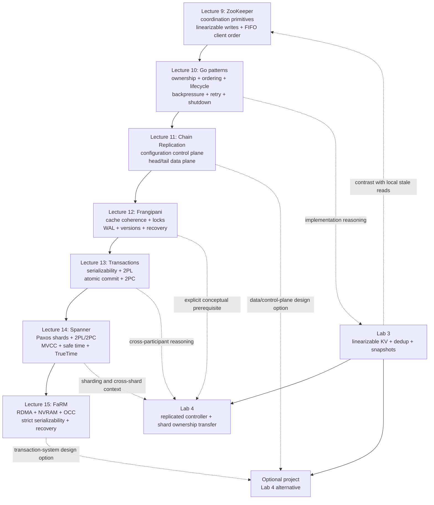

> 本模块严格保留课程顺序：**ZooKeeper -> Go guest patterns -> Chain Replication -> Frangipani -> distributed transactions -> Spanner -> FaRM**。内容只综合官方 Lecture 9-15 的媒体笔记、Lecture 15 官方聚合笔记、readings 09-15、`MATERIALS.md` 与 `LABS.md`；不使用外部事实补齐课堂或论文没有支持的结论。

## 证据来源

### 课程级入口

- [MATERIALS.md](/courses/mit-6824-s21/materials/)：确认官方讲次、视频分段、讲义、论文、FAQ、Question 与 Lab 映射。
- [LABS.md](/courses/mit-6824-s21/labs/)：只用于 Lab 3、Lab 4 与 optional project 的官方目标、依赖、正确性边界和关系说明。

### 课堂媒体与官方讲次

1. [Lecture 9：ZooKeeper](/courses/mit-6824-s21/lectures/009/)
2. [Lecture 10：Guest Lecture on Go](/courses/mit-6824-s21/lectures/010/)
3. [Lecture 11：Chain Replication](/courses/mit-6824-s21/lectures/011/)
4. [Lecture 12：Frangipani](/courses/mit-6824-s21/lectures/012/)
5. [Lecture 13：Distributed Transactions](/courses/mit-6824-s21/lectures/013/)
6. [Lecture 14：Spanner](/courses/mit-6824-s21/lectures/014/)
7. [Lecture 15 Part 1：FaRM](/courses/mit-6824-s21/lectures/015/)
8. [Lecture 15 Part 2：FaRM continued](/courses/mit-6824-s21/lectures/016/)
9. [官方 Lecture 15 聚合笔记](/courses/mit-6824-s21/official-lectures/lecture-15/)

Lecture 15 的 Part 15 与 Part 16 是同一官方讲次。Part 16 在完成 FaRM 的 validation、fault-tolerance evidence 与适用边界后才引出 Spark；它不是 Lecture 16。

### 指定阅读、FAQ 与 Question

1. [Reading 09：ZooKeeper](/courses/mit-6824-s21/readings/lecture-09/)
2. [Reading 10：Go Guest Lecture](/courses/mit-6824-s21/readings/lecture-10/)
3. [Reading 11：Chain Replication](/courses/mit-6824-s21/readings/lecture-11/)
4. [Reading 12：Frangipani](/courses/mit-6824-s21/readings/lecture-12/)
5. [Reading 13：Distributed Transactions](/courses/mit-6824-s21/readings/lecture-13/)
6. [Reading 14：Spanner](/courses/mit-6824-s21/readings/lecture-14/)
7. [Reading 15：FaRM](/courses/mit-6824-s21/readings/lecture-15/)

Reading 10 没有 assigned paper，指定材料是官方 Go guest-lecture PDF；Reading 13 的 Chapter 9 正文在仓库中是 external-only，因此本模块不转述无法在本地核验的章节细节。Lecture 11 没有归档 FAQ。其余 reading guide 会明确区分论文、FAQ、Question 与课堂事实。

## 证据使用规则

1. **课堂 chronology 与老师实际强调的边界**以对应媒体 `NOTES.md` 为准。
2. **论文机制、evaluation、FAQ 和官方 Question**以对应 `readings/lecture-XX.md` 为准，不倒写成课堂已经逐项讲过。
3. **Lecture 15 跨两个媒体的统一进程**以 [官方聚合笔记](/courses/mit-6824-s21/official-lectures/lecture-15/) 为总入口；需要精确分段时回到 Part 1/Part 2。
4. **Lab 关系**只引用 [LABS.md](/courses/mit-6824-s21/labs/) 明确给出的任务与先修关系；概念连接不等于 lab protocol、实现提示或题解。
5. 材料中出现 `[需回听]`、教师现场未完成的推导、FAQ 的 `probably/likely/guess` 或论文没有说明的实现细节，本模块保留为边界，不升级成事实。
6. 数字只在能同时保留 workload、replica layout、hardware 或课堂估算条件时使用；不把 benchmark 变成通用 SLA。

---

## 模块用途

这七讲形成一条逐步加约束的主线：

1. ZooKeeper 先问：怎样把常见 coordination 从应用中抽离，并用弱于 full linearizability 的 read semantics 换取扩展性？
2. Go guest lecture 再问：实现这些系统时，怎样让 goroutine、channel、mutex、queue、timeout、retry 与 shutdown 的局部 contracts 可推理？
3. Chain Replication 把 consensus-backed configuration 与大状态 data plane 分离，并用 head/tail 路径建立单对象 strong consistency。
4. Frangipani 把问题扩展到共享缓存、多个 metadata blocks、锁交接与 crash recovery。
5. Distributed Transactions 把 isolation/serializability 与 failure atomicity 拆成 2PL 和 2PC 两个正交问题。
6. Spanner 在跨 shard、跨 data center 的 Paxos groups 上组合 2PL、2PC、多版本、safe time 与 TrueTime，提供 external consistency。
7. FaRM 在单数据中心、全内存、RDMA 与低冲突条件下改用 OCC，减少正常读路径的远端 CPU 参与，同时保留 strict serializability 和恢复证据。

完成本模块后，应能对任一机制回答：它协调谁、在哪个点排序、复制什么、允许什么 stale state、何时等待或 abort、failure 后依赖什么 durable evidence，以及它有意没有解决什么。

## 依赖图



实线表示课堂概念的推进或官方 Lab 路线中的直接依赖；虚线表示 [LABS.md](/courses/mit-6824-s21/labs/) 明确列出的概念深化，或 project 选题可借鉴的设计方向。它们不表示 Lab 4 要实现 Chain Replication、Spanner 或 FaRM。

---

## 一、ZooKeeper：协调服务与可编程的弱读语义

来源：[Lecture 9 NOTES](/courses/mit-6824-s21/lectures/009/) · [Reading 09](/courses/mit-6824-s21/readings/lecture-09/) · [MATERIALS Lecture 9](/courses/mit-6824-s21/materials/#lecture-9-zookeeper)

### 1. 问题与架构

ZooKeeper 把 membership、leader identity、configuration、locks、barriers 等反复出现的 coordination metadata 放进一个 replicated znode tree。底层原子广播负责修改操作的全序复制；service layer 定义 regular/ephemeral/sequential znodes、versioned updates、sessions、watches 与 `sync`。

它不是 general-purpose bulk data store。核心分层是：

```text
ordered and replicated ZooKeeper API
  -> client-side coordination recipe
  -> application-specific invariant and external side effects
```

第一层由 ZooKeeper 保证；第二层需要正确组合；第三层不会因为“拿到 ZooKeeper lock”自动成为 transaction。

### 2. 一致性模型

ZooKeeper 的关键交换不是“有一致性”与“无一致性”，而是：

- updates/writes 被排入尊重 precedence 的 total order；
- 同一 client 的 operations 保持 FIFO order；
- reads 可在当前 replica 本地执行，因此可能漏掉其他 clients 已完成的较新 write；
- 同一 session 的 reads 观察 non-decreasing write-log prefixes；
- client 能 read its own writes；
- 需要更强 freshness 时可使用 `sync`，但不应把它误写成所有 reads 默认经过的路径。

若全局 write order 为 $W=(w_1,w_2,\ldots,w_n)$，同一 session 的 successive reads 对应的 prefix 长度满足：

$$
k_{i+1}\ge k_i.
$$

`zxid` 在课堂中用于解释 server migration 时的 minimum progress floor；它不是 exact snapshot ID，也不是“全局最新”的证明。老师明确把这一部分限定为 rough implementation intuition，而不是 Zab specification。

### 3. Coordination primitives

| Primitive | 能支持什么 | 必须保留的边界 |
| --- | --- | --- |
| Ephemeral znode | session-bound membership、lock marker | 删除发生在 session termination/expiration，不是 crash 瞬间 |
| Sequential znode | 建立可比较的 contender order | 需要读取 children、处理重试和删除 race |
| One-shot watch | 状态变化后唤醒 client | 不是 event log；event 可合并，收到后要 re-read/re-register |
| Versioned `setData` | stale read 后 conditional update | version mismatch 导致 retry，不是 multi-object transaction |
| `ready` marker | 把多项 configuration writes 组合成 publication protocol | 依赖 write order、watch、restart discipline；不是通用 snapshot |
| `sync` | 在需要时加强当前连接的 freshness | 会进入较慢路径，不能维持所有 local reads 的扩展优势 |

`ready` pattern 的核心顺序是：

```text
delete(ready)
write configuration znodes
create(ready)
```

若 reader 看见本轮新 `ready`，non-decreasing prefix 保证后续 reads 不退回 preceding configuration writes 之前；若它先看见旧 marker，watch 会暴露跨 configuration boundary 的 change，reader 必须丢弃 partial result 并 restart。

### 4. Lock 的收益与边界

Simple lock 依赖 linearizable `create(ephemeral)` 保证同一路径只有一个创建者成功；owner session 失效后 ephemeral node 被删除。Sequential predecessor watch 把所有 contenders 同时唤醒的 herd effect 改为主要唤醒下一位。

但 mutual exclusion 不等于 critical-section transaction：partitioned owner 可能已执行一部分外部 side effects，session 过期后新 owner 接管时仍会看到中间状态。ZooKeeper lock 更适合 leader election、cleanup 或允许 duplicate execution 的 soft lock；外部操作仍需 idempotence、publication protocol 或真正 transaction machinery。

### 5. 性能交换

异步 clients、pipelining 与 batching 提高 saturated write throughput；local replica reads 让 aggregate read capacity 随 replicas 增加。代价是 programmer 必须理解 stale reads、session order、watch restart 与 `sync`。更多 replicas 可能增加 read capacity，却也增加 write coordination cost。

---

## 二、Go Guest Patterns：把协议不变量放进可推理的并发结构

来源：[Lecture 10 NOTES](/courses/mit-6824-s21/lectures/010/) · [Reading 10](/courses/mit-6824-s21/readings/lecture-10/) · [MATERIALS Lecture 10](/courses/mit-6824-s21/materials/#lecture-10-guest-lecture-on-go---russ-cox)

Lecture 10 不是一个 distributed consistency system，也没有 assigned paper。它提供的是实现本模块其余系统时反复需要的局部 reasoning patterns。

### 1. 总原则

- Concurrency 是组织独立 control flows；parallelism 才是同时执行计算。
- State 可以放在 data、program counter/call stack 或 owner goroutine 中；判断标准是哪个表达最清楚。
- Mutex 保护 invariant，不只是某一个 field；unlock 前必须恢复跨字段关系。
- Channel 同时传递 value 与建立 synchronization order，但不会自动提供 distributed exactly-once、fairness 或 linearizability。
- 每个 goroutine 都必须有 normal/error/cancel exit reason；每次 communication 都必须能解释何时 proceed。

### 2. 四个 guest patterns

| Pattern | 局部 contract | 主要 tradeoff |
| --- | --- | --- |
| Publish/subscribe | 所有 subscribers 观察同一、尊重 program order 的 event sequence | slow consumer 迫使系统在 backpressure、drop/coalesce、bounded/unbounded queue 中选择 |
| Work scheduler | unfinished task 要么 queued，要么由一个 worker 持有；success completion 恰好计数一次 | bounded concurrency、retry 与 shutdown 比“每 task 一个 goroutine”更难，但资源可控 |
| Replicated client | preferred replica 先试，timeout 后 speculative attempts，first acceptable reply 完成 | timeout 不是 cancellation；旧 attempt 可能执行，side effects 需要额外语义 |
| Protocol multiplexer | register destination before send；reply lookup/delete 原子；每 tag 至多 delivery 一次 | transport error、timeout、cancel 与 shutdown 仍需补全 |

### 3. Slow path 与资源边界

面对永久 slow consumer，不存在免费方案：

```text
backpressure -> producer 等待
drop/coalesce -> 业务接受 loss，最好暴露 loss signal
queue -> 选择明确 bound；unbounded queue 可耗尽 memory
```

Buffered channel 只提供有限 slack。它满时仍会阻塞；capacity 必须对应 workload 或 lifecycle 理由。

### 4. Retry、timeout 与 duplicate

Replicated-client pattern 特别重要，因为它揭示了本模块多个协议的共同边界：

- timeout 只说明 reply 尚未到达，不证明 request 没有执行；
- retry 可改善 availability，却可能重复 server work；
- caller 返回后，losing attempts 仍必须能退出，不能永久阻塞在无人接收的 reply send；
- exactly-once illusion 需要 request identity、deduplication、idempotence或更高层 transaction，不能从 goroutine/channel 本身得到。

### 5. 与后续系统的连接

ZooKeeper watch helper、Chain Replication client retry、Frangipani revoke/recovery、2PC participant blocking、Spanner safe-time wait 和 FaRM log polling 都可用同一组问题审计：谁拥有 state、谁可阻塞谁、queue 是否有界、timeout 是否改变协议事实、旧 goroutine/RPC 是否仍能产生 effect、关闭前是否已证明没有 future sender。

---

## 三、Chain Replication：configuration control plane 与 head/tail data plane

来源：[Lecture 11 NOTES](/courses/mit-6824-s21/lectures/011/) · [Reading 11](/courses/mit-6824-s21/readings/lecture-11/) · [MATERIALS Lecture 11](/courses/mit-6824-s21/materials/#lecture-11-chain-replication)

### 1. 架构位置

Chain Replication 不负责自己决定合法 membership。它属于：

```text
consensus-backed master/configuration service
  -> selects one legal chain and head/tail
  -> Chain Replication moves and exposes object state
```

Configuration service 是 safety boundary：successor 不能只凭 local timeout 自行晋升，否则 crash 与 partition 不可区分，可能产生 two heads/split brain。

### 2. 正常路径与 commit point

```text
update: client -> head -> ... -> tail -> client reply
query:  client -----------------> tail -> client reply
```

Head 对 updates 排序，reliable FIFO links 保持该 order，各 replicas 依次应用；tail 既应用 completed update，又串行处理 query。因此 **tail application 是 commit/visibility point**。

若 head 在 next-server ACK 后过早 reply，update 可能尚未到 tail。一个严格后开始的 tail query 会返回旧值，产生无需任何 failure 的 non-linearizable history。由 tail reply 消除了这个窗口。

### 3. Failure cases

设 progress 呈 prefix 结构：head 最长，tail 最短。

| Failure | Reconfiguration 后的动作 | 为什么不丢 completed update |
| --- | --- | --- |
| Head | successor 成为新 head；仅旧 head 拥有的 suffix 可消失 | suffix 未到 tail，因此不可能已合法 reply |
| Middle | predecessor 连接 successor，并重发 successor 缺失的 suffix | paper 用 `Sent`/ACK bookkeeping 精确跟踪 in-flight updates |
| Tail | predecessor 成为新 tail | 任何旧 tail 已有 update 都先经过 predecessor |

Recovery shape 简洁不等于 failure 时持续可用。Current chain 的任一 member unreachable 都会先阻塞 writes，直到 master 完成 reconfiguration；这与 quorum system 在仍有 majority 时绕过少数失败的 progress 条件不同。

### 4. 加入新 tail

旧 tail 在继续服务时向 replacement 复制 base state，并记录 copy 期间的 ordered delta。New tail 追平前不能服务；base copy 完成后发送 delta，建立 serving barrier，再切换 tail。持续 writes 不要求停止世界，但要求新 tail 在暴露 reads 前拥有完整 committed prefix。

### 5. Scope 与多链边界

指定论文的 storage interface 是单对象 query/update，不提供 multi-object indivisible transaction。Rotated multiple chains 可让不同 shards 的 tail 分布到不同 servers，从而在负载均匀时扩展 reads；它不是“同一对象可向任意 replica 读”，也没有自动建立 cross-chain global transaction order。

### 6. 与 Raft 的非扁平比较

| 维度 | Chain Replication | Raft/RSM 路径 |
| --- | --- | --- |
| Client load | head 接 writes，tail 接 reads/replies | 通常由 leader 集中处理或协调 |
| Dissemination | head fan-out 为 1，逐跳传播 | leader 向 peers 复制 |
| Read | tail 单机本地 query | Lab 3 的简单方案让 read 进 log；优化也需 freshness proof |
| Single request latency | 穿过整条 chain | 取决于 majority path |
| Failure progress | 任一 current member 失败先停写并 reconfigure | remaining majority 可继续 |
| Large-state repair | base copy + ordered delta | snapshot/log catch-up |

这些差异来自不同 topology 与 progress rule，不能把“tail read 快”推广成 CR 在所有指标上优于 quorum replication。

---

## 四、Frangipani：cache coherence、锁、日志与恢复

来源：[Lecture 12 NOTES](/courses/mit-6824-s21/lectures/012/) · [Reading 12](/courses/mit-6824-s21/readings/lecture-12/) · [MATERIALS Lecture 12](/courses/mit-6824-s21/materials/#lecture-12-cache-consistency---frangipani)

### 1. 架构与 workload

Frangipani 把 file-system logic 与 write-back cache 放在 trusted workstations/servers，共享层是 Petal virtual disk，另有 distributed lock service。增加 workstation 同时增加 workload 与 file-system CPU capacity。设计优化的 common case 是 private-file locality、偶尔共享，而不是持续 multi-writer hot file。

```text
applications / Unix system calls
  -> Frangipani server: file-system logic + cache + private shared log
  -> distributed lock service
  -> Petal shared replicated virtual disk
```

任何 Frangipani server 能直接接触 shared blocks，因此 trusted server/software 是系统假设；这与传统把不可信 client 隔离在 file server 外的架构不同。

### 2. Locks 同时做 coherence 与 operation atomicity

Lock transfer 的关键顺序是：

```text
new owner requests lock
  -> old owner receives revoke
  -> old owner finishes current file-system operation
  -> force log and flush dirty state to Petal
  -> old owner releases lock
  -> lock service grants new owner
  -> new owner reads current state from Petal
```

同一套 locks 有两项职责：

1. **Reveal writes for coherence**：old owner flush-before-release，new owner grant-after-release。
2. **Conceal partial operations for atomicity**：`create`、`rename` 等多 metadata operation 持有所需 locks 到 operation boundary，pending revoke 不能切开它。

`busy -> idle` 是 local release；sticky idle lock 仍由该 workstation 持有，cache 仍 valid。只有 revoke path 的 external release 才把 ownership 交回 lock service。

### 3. Lock 粒度、deadlock 与 contention

`create(d/f)` 可能同时修改 directory inode、new inode、allocation metadata 等，因此会取得多把 locks。Frangipani 要求按固定全局顺序 acquire，避免 circular wait；课堂对具体是否按 inode number 使用保留语气。

Sticky locks 让 uncontended repeated access 无 RPC；频繁 shared writes 则产生 revoke/flush/grant 和 cache bouncing。Lock 机制正确并不表示目标 workload 下总是快。

### 4. Write-ahead logging 与 durability boundary

核心顺序是：

$$
durable(log(op))\prec install(metadata(op))\prec release(locks(op)).
$$

- Log-first 让 partial home-block install 可 redo。
- Install-before-release 让 next owner 不会越过尚未公开的 metadata。
- 每个 server 有独立 redo log，但 logs 存在 shared Petal 上，使 survivor 能替 crashed server recovery。
- Recovery 只接受 complete-record prefix；torn suffix 被丢弃。丢失 recent operation suffix 是 durability loss，不是执行半条 metadata operation。

Frangipani log 保护 metadata，不记录普通 user file contents。这样避免大 data 近似双写；代价是 crash 后 recent file content 可能 none/some/all 落盘。Application 需要更强 durability 时使用 `fsync`/`sync`，需要 whole-file replace 时可用 temporary file + atomic rename。Metadata consistency 不能被写成 whole-file data atomicity。

### 5. Versioned recovery

Per-server logs 使同一 metadata block 的 successive updates 分散在不同 logs。Recovery 对 log update $u$ 使用：

$$
replay(u)\iff v_{log}(u)>v_{Petal}(block).
$$

`<` 表示 Petal 已有 newer update，`=` 表示该 update 已安装，二者都跳过；只有 `>` 才 redo。Locks 先序列化 conflicting writers，versions 再把该 order 编码进 block/log item。只看某个 private log 的 local sequence 不足以比较不同 servers 对同一 inode 的先后。

### 6. Lease 与 failure boundary

Lock owner unreachable 后，lock service 等 lease expiry，再让 recovery daemon replay shared log，最后才 reassign locks。原因是 old owner 可能只与 lock service partition，却仍能访问 Petal。

Lease expiry 也不是绝对 fencing 所有已发出的 storage writes。课堂与 reading 都保留 late old write 超过 lease margin 后到达 Petal 的困难边界，并只提出 lower-layer freshness/timestamp check 的方向，没有给出完整 protocol/proof。

---

## 五、Distributed Transactions：把 isolation 与 atomic commit 分开

来源：[Lecture 13 NOTES](/courses/mit-6824-s21/lectures/013/) · [Reading 13](/courses/mit-6824-s21/readings/lecture-13/) · [MATERIALS Lecture 13](/courses/mit-6824-s21/materials/#lecture-13-distributed-transactions)

### 1. ACID 的课堂边界

| 属性 | 本讲使用的含义 | 本模块中的主要机制 |
| --- | --- | --- |
| Atomic | crash/recovery 下 transaction writes all-or-none | atomic commit / 2PC + durable protocol state |
| Consistent | application/database invariants | 不由 2PL/2PC 自动创造；课堂不展开 |
| Isolated | concurrent transactions 不观察 intermediate result | serializability + concurrency control |
| Durable | committed result 跨 crash 保留 | WAL、replication、durable decision |

课堂现场先把 concurrent visibility 误称 Atomic，随后明确纠正为 Isolation；本模块采用纠正后的术语。

### 2. Serializability 与 real time

Concurrent execution $E_c$ 合法，当且仅当存在一个 serial order $S$，使 outputs 与 database changes 都相同：

$$
\exists S:\quad Outcome(E_c)=Outcome(S).
$$

只比较 final database state 不够；audit output 若混合 transfer 前后的 values，execution 仍不可串行化。

本讲所述 serializability 不要求 serial order 遵守 wall-clock precedence；linearizability/strict serializability/external consistency 还加入 non-overlapping operations 或 transactions 的 real-time order。不要因它们都寻找 serial explanation 就把定义抹平。

### 3. Pessimistic 与 optimistic concurrency control

| 路线 | 何时处理 conflict | Conflict 代价 |
| --- | --- | --- |
| Pessimistic | 使用 record 前取得 lock | 等待；可能形成 deadlock，随后 abort victim |
| Optimistic | 先执行，commit 时验证 reads/writes | validation failure 后 abort/retry，已完成工作浪费 |

Lecture 13 只建立 OCC 对照；具体协议在 FaRM 展开。

### 4. Two-Phase Locking

课堂采用两条规则：

1. Transaction 第一次 read/write record 前 acquire lock。
2. 已取得 locks 保持到 commit 或 abort。

Early release 会让另一个 transaction 观察 tentative/partial state；若第一个 transaction 随后 abort，还会暴露从未成为 committed state 的 value。

本讲把 transaction 开始前一次取得全部 locks 称为 Simple Locking，把按实际 execution 增量取得并 hold-to-end 称为 2PL。后者可避免为 rare branch 提前锁住不一定访问的 record，从而提高部分 workload 的 concurrency；代价是相反 acquisition order 可形成 wait-for cycle。系统可 timeout 近似检测，或构建 wait-for graph 检测 cycle，再 abort 一名 victim、撤销 tentative effects并释放 locks。

### 5. Two-Phase Commit

2PC 解决的不是 serializability，而是不同 participants 对同一 distributed transaction 的 atomic outcome：

```text
tentative work + locks
  -> PREPARE(TID)
  -> participant durable YES or NO
  -> all YES: coordinator durable COMMIT
  -> COMMIT/ABORT notification
  -> install/discard + unlock + ACK
```

关键 durable-before-send 关系是：

$$
durable(prepared,TID,tentative\ data)\prec send(YES,TID),
$$

$$
durable(COMMIT,TID)\prec send(COMMIT,TID).
$$

Lecture 13 尾部还确认 participant 应 durable 地记住 `NO/ABORT(TID)`，因为 NO message 也可能丢失，restart 后不能改变 vote。

### 6. Prepared blocking

Participant 一旦回复 YES，就不能 unilateral abort。它无法区分：

```text
World 1: coordinator 已 durable COMMIT，其他 participant 已 commit，decision message 只是延迟
World 2: 另一 participant NO，或 coordinator 尚未形成 COMMIT
```

World 1 中 abort 错，World 2 中 commit 错；本地没有 safe decision，只能持锁 query/wait coordinator。短 timeout 不能消除这一信息边界。

### 7. Raft 与 2PC 的职责边界

Raft/Paxos 让 replicas 执行同一 logical service 的相同工作，并以 majority 提高 availability；2PC 让所有 logical participants 对不同 data/actions 作同一 global commit/abort decision。可以用 Raft group 实现 coordinator 和每个 participant，再在 groups 之间运行 2PC；replication 提高 decision service 的 availability，却不把“所有 participants 同意”改成“多数 participants 同意”。

---

## 六、Spanner：Paxos shards、快照、safe time 与 TrueTime

来源：[Lecture 14 NOTES](/courses/mit-6824-s21/lectures/014/) · [Reading 14](/courses/mit-6824-s21/readings/lecture-14/) · [MATERIALS Lecture 14](/courses/mit-6824-s21/materials/#lecture-14-spanner)

### 1. 系统组织

Spanner 把 key space sharding 到多个 groups，每个 shard/tablet 由跨 zones/data centers 的 Paxos group 复制：

- sharding 提供 capacity 与不相交数据上的 parallelism；
- replication 提供 fault tolerance 与 geographic locality；
- majority progress 允许不等待最慢少数派，但不能消除 forming majority 的 WAN delay；
- client 可接近某个 replica，但 replica locality 本身不证明 read 足够新。

### 2. Read-write transaction

跨多个 Paxos groups 的 read-write transaction 组合：

```text
participant leaders acquire 2PL locks
  -> client buffers writes
  -> participants Paxos-log PREPARED state
  -> replicated coordinator chooses decision/timestamp
  -> coordinator Paxos-log COMMIT
  -> commit wait
  -> participants apply at same timestamp and release locks
```

普通 leader-local lock table 不为每次 read 复制；prepare 前 leader failure 可让 transaction abort/restart。Participant 一旦 prepared，恢复所需 locks/updates/state 才必须通过 Paxos 复制。Replicated coordinator 缓解 single-coordinator failure blocking，却没有消除 2PC、locks、WAN latency 或 partition cost。

### 3. Read-only fast path

Read-only transaction 必须预先声明无 writes，才能：

- 不取得 read locks；
- 不运行 2PC；
- 为整笔 transaction 选择一个 timestamp；
- 在任何 $t\le t_{safe}$ 的 sufficiently fresh replica 上读历史 versions。

“每次读 latest committed value”不够：一次 long read-only transaction 可能先从 $T_1$ 读 `x`，再从后来 commit 的 $T_2$ 读 `y`，拼出没有 serial point 的混合结果。Multi-version storage 让所有 reads 固定到同一 snapshot timestamp。

若 $T_1@10$、read-only $T_3@15$、$T_2@20$，则 $T_3$ 对所有 keys 都选择 15 之前的最新 committed version，因此逻辑顺序为 $T_1\rightarrow T_3\rightarrow T_2$，即使第二次 physical read 发生在 $T_2$ commit 之后。

### 4. Safe time

Replica 只有在目标 timestamp 不超过 safe frontier 时才能服务 snapshot read：

$$
t_{safe}=\min(t^{Paxos}_{safe},t^{TM}_{safe}).
$$

- $t^{Paxos}_{safe}$ 证明 Paxos writes 已按 timestamp order 应用到该 frontier。
- $t^{TM}_{safe}$ 处理更早 prepared-but-uncommitted transactions；它们的最终 outcome 未决，可能仍应属于 snapshot。

课堂用“先观察 ordered stream 已越过 read timestamp，并 resolve earlier prepares”建立直觉；论文还给出 fine-grained safe time 与 idle-group progress 机制。Commit wait 与 safe time 不能混淆：前者把 transaction timestamp 放进 completion 的真实过去，后者证明某个 replica 的版本历史已足够完整。

### 5. TrueTime 与 external consistency

TrueTime 返回一个保证包含 absolute time 的 interval：

$$
TT.now()=[earliest,latest].
$$

Correctness 依赖 bound 包含真实时间；performance 取决于 interval 足够窄。Read-write timestamp assignment 的核心规则是：

1. **Start rule**：coordinator 选择 $s_i\ge TT.now().latest$。
2. **Commit wait**：在 `TT.after(s_i)` 为真之前，不向 client 暴露 transaction 已完成；课堂等价写法是等待 $s_i<TT.now().earliest$。

因此若 $T_1$ 已完成后 $T_2$ 才开始：

$$
t_{abs}(commit_1)<t_{abs}(start_2)\Rightarrow s_1<s_2.
$$

Timestamp order 尊重 non-overlapping transactions 的 real-time precedence，这就是本讲 external consistency 的核心。Overlapping transactions 没有 finish-before-start edge，可选择符合结果的任一合法 order。

### 6. Clock uncertainty tradeoff

- Timestamp 偏大或 interval 很宽，在 bound 仍正确时主要造成 commit-wait/safe-time waiting 增长，伤害 latency/throughput。
- Timestamp 偏小则可能把现实中后开始的 transaction 放到已完成 write 之前，读取旧 version，破坏 external consistency。
- Atomic clocks/GPS/time masters 属于 TrueTime infrastructure；它们减小并界定 uncertainty，不把系统变成拥有完美 scalar clock。

### 7. 成本边界

Read-write path 支付 WAN Paxos、2PL、2PC、prepared state 与 commit wait；read-only path用 multi-version storage、timestamp selection、safe-time bookkeeping 和可能的等待，换取 no locks/no 2PC/nearby replica reads。它们是两条不同 protocol path，不是同一 transaction 根据运行中是否碰巧写入而自由切换。

---

## 七、FaRM：RDMA 驱动的 OCC 与数据中心内事务

来源：[Lecture 15 Part 1](/courses/mit-6824-s21/lectures/015/) · [Lecture 15 Part 2](/courses/mit-6824-s21/lectures/016/) · [官方 Lecture 15](/courses/mit-6824-s21/official-lectures/lecture-15/) · [Reading 15](/courses/mit-6824-s21/readings/lecture-15/) · [MATERIALS Lecture 15](/courses/mit-6824-s21/materials/#lecture-15-optimistic-concurrency-control-farm)

### 1. 比较口径与系统边界

FaRM 是单数据中心 research prototype；Spanner 承担跨地域同步复制与 data-center failure geography。二者都使用 sharding、replication 与 distributed transactions，但目标、failure scope、hardware 与 workload 不同，不能按峰值 throughput 做无条件排名。

FaRM 的高性能依赖：

- data fits in aggregate RAM；
- region primary/backups 位于一个 data center；
- UPS/Local Energy Storage 在 power failure path 把 DRAM image 写到 SSD；
- kernel bypass、polling 与 RDMA NIC；
- workload 冲突较少，transaction 相对短；
- application 能遵守 execute 期间可能看到 temporary cross-object inconsistency 的 contract。

### 2. Architecture 与 RDMA boundary

Address space 被切成约 `2 GB` regions，每个 region 有 primary 和 backups。CM/ZooKeeper 管 region-to-replica configuration，不参与每个 object transaction 的 fast path。Object OID 是 region identity + offset，不是固定机器地址；object 64-bit header 包含 lock bit 与 logical version。

One-sided RDMA 由目标 NIC 直接访问 RAM，不运行目标 CPU。RDMA-based RPC 只是把 request 写进 message queue，目标 polling thread 仍需处理。Hardware ACK 只证明 bytes 已进入授权的 remote memory/NVRAM log，不证明 server application 已消费 record，也不证明 object in-place value 已更新。

### 3. 为什么采用 OCC

传统 read-before-lock 要求 remote server code 和等待，破坏 one-sided read fast path。FaRM 因而在 Execute phase 无锁读取 committed object/version，把 writes 缓存在 coordinator；commit 时才集中发现 conflicts。

FaRM 只对成功 committed transactions 承诺 strict serializability。Execute 期间跨 objects 的 reads 不保证已经构成 atomic snapshot；不能通过 validation 的 transaction 必须 abort，application 不能在 commit/abort 前把暂时不一致当作最终事实。

### 4. Figure 4 正常路径

```text
EXECUTE
  -> LOCK(write set at primaries)
  -> VALIDATE(read-but-not-written set)
  -> COMMIT-BACKUP(all relevant backups ACK)
  -> COMMIT-PRIMARY(at least one primary ACK before client success)
  -> TRUNCATE(lazy cleanup)
```

#### LOCK

Coordinator 向 write-set primaries 的 incoming logs 写 LOCK records。Primary CPU 原子检查：

$$
lock=0\land v_{current}=v_{read}.
$$

成功则设置 lock bit；失败则整个 transaction abort。它不等待已有 lock，因为 buffered new value 已基于旧输入，等待不会让计算自动变正确。

#### VALIDATE

Coordinator 对 read-but-not-written objects 重读 header，检查相同 version 且 lock bit 未设置。默认可用 one-sided RDMA；论文在同一 primary 上对象较多时允许 RPC tradeoff。Lock bit 不能省略：writer 可能已取锁、尚未安装 value 或增加 version。

#### COMMIT-BACKUP / COMMIT-PRIMARY

LOCK/VALIDATE 全通过后，coordinator 先把完整 update payload 写到所有相关 backups 的 non-volatile logs，并等待全部 hardware ACKs；再向 primaries 写 transaction-level COMMIT-PRIMARY。至少一个 primary ACK 后才可向 application 报 committed。Primary 后台安装 values、增加 versions、清 locks；TRUNCATE 可 lazy 执行。

### 5. Correctness examples

两个 transactions 都读 `x=0, version=0` 并递增：

- loser 若在 winner 持锁时进入 LOCK，会看见 `lock=1` 并 abort；
- 若题目规定 winner 已完全提交，object 已解锁但 version 增加，loser 在 LOCK phase 看见 version mismatch 并 abort；
- loser retry 后必须重新读取新 value/version。

交叉条件写：

$$
T_1:R(x=0);\ if\ x=0\ then\ W(y=1),
$$

$$
T_2:R(y=0);\ if\ y=0\ then\ W(x=1).
$$

若 $T_1$ 已锁 $y$，$T_2$ validation $y$ 时即使 version 尚未变化，也会看到 lock bit 并 abort，避免不可串行化的 $(1,1)$。课堂明确把这两个例子作为机制直觉，不是完整 proof。

论文给出的 serialization points 是：committed read-write transaction 在取得全部 write locks 时，committed read-only transaction 在最后一次 read 时。它们位于 start 与 completion 之间，因此 non-overlapping transactions 的 real-time order得到保留。

### 6. Read-only path

纯读 transaction 没有 write set，所以不执行 LOCK、object write 或 log append；它由一轮 one-sided RDMA execution reads 加一轮 validation reads 组成。课堂确认全系统若只有 read-only transactions，可不需要第二轮 validation；对于 mixed workload/blind-write 的现场追问，教师没有完成推导，本模块不补结论。

### 7. Recovery evidence 与完整协议边界

Client success 前有两类互补 evidence：

- LOCK/COMMIT-BACKUP records 描述“写什么”；
- 至少一条 COMMIT-PRIMARY 描述“已经决定 commit”。

LOCK record 单独不能证明 commit，因为它产生在 validation 与最终 decision 之前。Part 2 只用 commit-point crash 说明，在每 shard 允许一个 replica failure 的课堂例子中，surviving decision 与各 write 的 surviving information 足以让 recovery 完成已确认 transaction。

完整 recovery、precise membership、configuration change、lock recovery、foreground restart 与 background re-replication 来自论文 reading，不是课堂逐步讲授的 algorithm。One-sided NIC 不检查 application lease，因此论文需要 precise membership：新 configuration 生效后，clients 不再向 removed machines 发 RDMA，并忽略其 result/ACK。

---

## 跨系统比较：相同词汇，不同职责

### 1. 主比较表

| 系统/讲次 | 优化对象 | 排序或协调点 | Client-visible guarantee | Replication/恢复形态 | 有意保留的代价或非目标 |
| --- | --- | --- | --- | --- | --- |
| ZooKeeper | coordination metadata、read-heavy workload | update log + session FIFO + watch/version recipes | linearizable updates；session reads 可 stale 但不倒退 | atomic broadcast + local reads；session expiration 清 ephemeral | 不是 full-linearizable read API，不是外部 side-effect transaction |
| Go patterns | concurrent program clarity 与 lifecycle | mutex invariant、owner goroutine、channel/tag order | 仅局部 ordering/progress contracts | 不是 replication system | timeout/retry 不提供 exactly-once；queue/slow consumer policy必须显式选择 |
| Chain Replication | single-object storage throughput 与简单 repair | head orders updates；tail serializes completed updates/queries | per-object strong consistency/linearizability | ordered chain + master reconfiguration + base/delta copy | current member failure 先阻塞 writes；不提供 multi-object transaction |
| Frangipani | trusted engineering workload 的 shared file system/cache | distributed locks order ownership；WAL/versions order recovery | coherent shared FS；metadata operation atomicity | Petal shared storage + per-server logs + recovery daemon | hot shared writes cache-bounce；user data 不获 metadata log 的 atomicity |
| 2PL + 2PC | generic multi-record/multi-participant transaction | locks form serial order；coordinator forms global outcome | serializability + failure atomicity | protocol logging；可把 roles 再用 Raft/Paxos 复制 | deadlock/abort；prepared participant blocking |
| Spanner | cross-shard、cross-datacenter transactions | 2PL/2PC/Paxos；snapshot timestamp；TrueTime real-time order | external consistency；lock-free read-only snapshots | Paxos group per shard + replicated coordinator + versions/safe time | WAN latency、commit wait、safe-time wait、version/clock infrastructure |
| FaRM | datacenter-local low-latency transactions | OCC write locks + validation；primary/backup commit records | strict serializability for committed transactions | primary/backup NVRAM logs + recovery/precise membership | low-conflict、all-memory、RDMA/power hardware、datacenter-local scope |

### 2. “Lock”不能扁平化

| 名称 | 锁住什么 | Failure 后的含义 |
| --- | --- | --- |
| ZooKeeper lock | znode recipe 表达的 coordination ownership | session expiry 释放 marker；不能回滚外部 partial effects |
| Frangipani lock | inode/file-system object cache ownership与 operation boundary | lease expiry 后先 recovery，再 reassign；配合 WAL/versions |
| 2PL lock | transaction record 的 read/write conflict order | hold 到 commit/abort；deadlock 时可 abort victim |
| Spanner lock | participant leader 上的 read-write transaction state | ordinary locks 不全复制；prepared state 才 Paxos replicated |
| FaRM lock bit | object write-set 在 OCC commit window 的短锁 | conflict 不等待而 abort；version/lock evidence参与恢复与验证 |

### 3. “Version/clock”不能扁平化

- ZooKeeper `zxid` 是 ordered-update progress intuition，不是 wall-clock snapshot。
- Frangipani per-block version 用于 recovery 跳过 stale/already-installed metadata update。
- FaRM per-object version 用于 OCC conflict detection，不是 TrueTime。
- Spanner transaction timestamp 选择 multi-version snapshot position；TrueTime interval与 commit wait把 timestamp order绑定到 real time。

### 4. Replication 与 transaction 不能互相替代

- Replication 让同一 logical service/state 在 failures 下保留并提高 availability。
- Concurrency control 决定多个 transactions 能否对应合法 serial order。
- Atomic commit 决定不同 participants 是否 all commit or all abort。
- Clock/time protocol决定 global timestamp order是否尊重 real-time precedence。

Spanner 同时需要 Paxos、2PL、2PC、versions、safe time 与 TrueTime，因为这些组件回答不同问题。FaRM 同时需要 primary/backup logs、OCC、commit records 与 precise membership，理由相同。

---

## 官方 Questions 与 FAQ 复习边界

### Lecture 9：ZooKeeper

**Question focus：** 两个 clients 为什么不能同时取得同一路径的 simple lock；ZooKeeper 怎样判定 owner session 已失败并转交 lock。

答题应区分 linearizable ephemeral `create` 的 mutual exclusion、`exists(..., watch)` 的 no-lost-wakeup race、session timeout/expiration 与外部 critical-section side effects。FAQ 明确把 async numbering、duplicate retry、client write 后 local read 的精确实现保留为论文未完整解释的问题，不能自行补成 Zab 细节。

### Lecture 10：Go Guest Lecture

**Question focus：** 选择自己最喜欢的 Go design choice，说明机制、收益、tradeoff，以及希望改变什么。

这不是 paper question。答案应落到 PDF 的具体 pattern，例如 goroutine lifecycle、channel direction、mutex invariant、bounded queue 或 tooling，而不是只写“简洁”。FAQ 的 declaration/OOP/semicolon/ownership 等内容是独立课后资源，不应冒充四个课堂 patterns。

### Lecture 11：Chain Replication

**Question focus：** 若 head 在 next-server ACK 后、tail 尚未应用前就 reply，构造 non-linearizable execution。

最小 schedule 是 `H -> M -> T`：update 已到 H/M 并返回成功，严格后开始的 query 到 T，T 返回旧值。矛盾来自 real-time precedence。课程归档没有 Lecture 11 FAQ；client dedup、stale routing 或其他实现疑问应保留 paper/lecture boundary。

### Lecture 12：Frangipani

**Question focus：** S1 的旧 inode log record 为什么不会在 recovery 时撤销 S2 的 newer modification。

答案必须先用 lock handoff建立 writer order，再比较 old log item version 与 Petal current block version；`<` 跳过 stale update，`=` 表示已安装，`>` 才 replay。FAQ 中关于 larger log、Petal internal log 等 `guess/probably` 不能升级为 paper mechanism。

### Lecture 13：Distributed Transactions

**Question focus：** 构造 2PL 比 Simple Locking 性能更高的具体情形。

应画出 conditional/late record access 的 lock timeline，指出 Simple Locking 提前阻塞哪个 contender，而 2PL 在 branch 未执行时避免取得该 lock；同时承认 incremental acquisition 的 deadlock、detection、abort/retry 代价。Chapter 9 正文不在本地，精确定义需回官方入口核对；FAQ extensions 不进入课堂 chronology。

### Lecture 14：Spanner

**Question focus：** `TT.now()` interval 包含真实时间但 uncertainty 很大时，系统受什么影响。

只要 bound 正确，首先是 performance 问题：start rule 可选到较远 future timestamp，commit wait 要更久，read-only timestamp 也可能等待 replica safe time 追上。具体答案应代入 `earliest/latest` 与等待 predicate，而不是只写“clock 不准会错误”。

### Lecture 15：FaRM

**Question focus：** 两笔 transaction 同时读同一初值并递增；第一笔完全提交后，第二笔在哪里、凭什么 abort。

题目指定第一笔已完全提交，所以 object 已解锁且 logical version 增加。第二笔在 **LOCK phase** 把旧 `v_read` 交给 primary，primary 观察 `v_current != v_read` 并拒绝 lock。若第一笔仍持锁，证据会是 lock bit，但那是另一 interleaving，不能替代题目指定答案。

---

## Lab 3、Lab 4 与 Project 关系

来源：[LABS.md](/courses/mit-6824-s21/labs/)

### 1. Lab 3：Fault-tolerant Key/Value Service

官方目标是 linearizable `Get/Put/Append`、retry 下的 at-most-once effect、leader change、snapshot 与 restart。简单官方路径让 `Get` 也进入 Raft log；因此 Lecture 9 的直接关系是对照：

```text
Lab 3: full client-visible linearizability，Get 也需 freshness proof
ZooKeeper: linearizable updates + FIFO session order，local reads 可 stale
```

这不是让 Lab 3 模仿 ZooKeeper local reads，而是帮助解释为什么 minority/stale server 不能直接对 Lab 3 `Get` 返回成功。Go guest patterns 提供 implementation reasoning：request identity、waiter lifecycle、bounded goroutines、timeout ambiguity、channel close 与 no-deadlock；它们不提供可提交实现。

### 2. Lab 4：Sharded Key/Value Service

[LABS.md](/courses/mit-6824-s21/labs/) 明确把以下内容列为概念深化：

- Frangipani：ownership handoff、configuration/lock order、迁移期间旧 owner 与新 owner 的可见性边界。
- Distributed Transactions：跨 participants 的 ordering 与 failure；不替代 Lab 4 官方 protocol requirements。
- Spanner：sharding、replicated groups 与 cross-shard system context；同样不规定 Lab 4 实现。

Lab 4 自身的官方核心仍是：replicated shard controller、numbered configurations、每 shard 至多一个 serving group、client operation 与 reconfiguration 的一致相对顺序、迁移 KV + duplicate state、snapshot/restart。Chain Replication 的 control/data-plane split可帮助比较架构，但 [LABS.md](/courses/mit-6824-s21/labs/) 没有要求把 shard group 实现为 chain。FaRM OCC 也不是 Lab 4 的替代协议。

### 3. Optional Project

Project 是 Lab 4 的替代项，不是 Lab 1-3 的替代项。官方方向包括 cross-shard transactions、coherent cache、high-performance Raft、RDMA/DPDK、non-volatile memory、weak-consistency application complexity 等；本模块可用于写 proposal 的四个必要边界：

```text
workload and deployment
failure model
correctness contract
evaluation and known limits
```

选择 ZooKeeper recipe、Chain Replication、Frangipani coherence、Spanner timing 或 FaRM OCC 作为灵感时，必须说明哪些机制由团队实现、哪些依赖现有 service/library，以及系统没有继承原论文的哪些 assumptions。Project evaluation 仍需覆盖正常路径、并发、failure、recovery 与 performance。

### 4. 学术诚信边界

本模块只讨论公开机制、不变量、failure schedules 与比较维度。Lab 3/4 的 request table、wait-channel、snapshot payload、lock layout、migration state machine 等具体实现选择仍由练习者独立推导；不得把概念材料改写成可直接提交的 lab solution。

---

## 掌握标准

### Architecture

- [ ] 能按课程顺序画出七讲的 components、control path、data path 与 ownership boundary。
- [ ] 能区分 ZooKeeper coordination kernel、CR master/data plane、Frangipani lock/Petal layers、Spanner Paxos groups 与 FaRM CM/regions。
- [ ] 能解释新增 replica、shard、workstation 或 participant 分别增加 capacity、fault tolerance 还是 coordination cost。

### Consistency 与 ordering

- [ ] 能构造 ZooKeeper 合法 stale read 与非法 session time-travel history。
- [ ] 能证明 CR head 早回的 real-time contradiction，并限定为 per-object scope。
- [ ] 能用 outputs + database changes 判断 transaction serializability，不只看 final state。
- [ ] 能区分 serializability、strict serializability/external consistency 与 linearizable updates + FIFO reads。
- [ ] 能解释 Spanner snapshot timestamp、safe time 与 commit wait 分别证明什么。

### Coordination、locking 与 OCC

- [ ] 能区分 znode lock、Frangipani ownership lock、2PL lock、Spanner prepared lock 与 FaRM object lock bit。
- [ ] 能解释 ZooKeeper lock mutual exclusion为何不等于 external critical-section atomicity。
- [ ] 能写出 2PL 两条规则、early-release anomaly、wait-for cycle 与 abort victim。
- [ ] 能从 one-sided RDMA 的约束推导 FaRM 为什么 execute 无锁、commit 时 LOCK/VALIDATE。
- [ ] 能用 version mismatch 与 lock bit 分别定位 FaRM 两类 conflict evidence。

### Replication、failure 与 recovery

- [ ] 能逐 case 解释 CR head/middle/tail failure 与 new-tail serving barrier。
- [ ] 能写出 Frangipani `log -> install -> release` 和 versioned replay rule，并区分 metadata/data guarantees。
- [ ] 能写出 2PC participant/coordinator durable-before-send rules，并从 indistinguishable worlds 推导 blocking。
- [ ] 能解释 Paxos/Raft replication为何提高 role availability但不替代 2PC。
- [ ] 能区分 FaRM write-content evidence、commit-decision evidence、object installation 与 client success。

### Evidence discipline

- [ ] 能为一项结论标注它来自课堂、paper、FAQ、Question、LABS，还是仍需回听。
- [ ] 能在引用 performance 数字时同时说出 workload、machines/replicas、hardware、conflict 与 geography。
- [ ] 能指出每个系统至少一个 non-goal 或 evidence boundary，而不是把强项写成普适保证。

---

## 21 组累积问答

### 1. 为什么 ZooKeeper 的 local read 可以 stale，却不能让同一 session 倒退？

**答：** Writes 有全局 total order；一次 local read 可观察该 order 的某个 prefix。FIFO client order、read-your-own-writes 与 progress floor要求同一 session 后续 read 的 prefix 不短于此前观察点。它可漏掉其他 clients 的 later writes，但不能退回自己已见或自己已写的位置之前。

### 2. `ready` marker 为什么仍需要 watch 与 restart？

**答：** Reader 可能先观察到旧 `ready`，随后 writer 删除 marker 并更新多个 znodes；单看 marker 存在不能排除跨版本混读。Watch 暴露 configuration boundary，notification 到达后 reader 必须丢弃 partial result、重新 read 并重新注册，而不是把 watch 当作完整 change log。

### 3. ZooKeeper simple lock 为什么既能 mutual exclusion，又不能保证 critical section atomic？

**答：** Linearizable ephemeral `create` 让同一路径只有一个成功 owner；session expiration 可删除 marker并让下一位取得锁。但旧 owner 在 partition/expiration 前可能已经修改外部 systems 的一部分，删除 znode不会回滚这些 effects，所以新 owner仍可能看到中间状态。

### 4. Go guest lecture 为什么把 goroutine lifecycle 放在 distributed-systems correctness 之前？

**答：** 协议实现依赖本地 goroutines、queues、timers 和 channels；若某个 sender 永久阻塞、owner loop 无法退出或 close 时仍有 future sender，分布式 protocol即使纸面正确也不能 progress。每个 goroutine 的 exit reason和每次 communication 的 proceed reason是更底层的 obligation。

### 5. 永久 slow consumer 为什么只能在 backpressure、loss 与 queue growth 中选择？

**答：** Producer 长期快于 consumer 时，有限系统不可能同时保证 producer永不等待、event 一个不丢、memory 永不增长。Buffered channel只能吸收 burst；长期差速最终必须减慢 producer、drop/coalesce，或承担明确/无限 backlog。

### 6. Replicated-client timeout 为什么不能被当成 cancellation 或 exactly-once evidence？

**答：** Timeout 只表示 caller尚未看到 reply；旧 request可能正在执行、已经执行但 reply丢失，或稍后仍会完成。Speculative retry增加并行 work，side effects必须依赖 idempotence、request identity/deduplication或 transaction protocol。

### 7. Chain Replication 为什么让 tail 而不是 head 回复 update？

**答：** Queries只在 tail执行。只有 tail应用 update后，write才进入 query可见的 history。若 head提前回复，严格后开始的 tail query可在传播窗口读旧值，违反 linearizability；tail reply把 completion与visibility对齐。

### 8. CR 的 failure repair 为什么简单，却不能说 failure 下“持续可用”？

**答：** Chain prefix结构把 repair压成 head删未提交 suffix、middle重发缺失 suffix、tail由 predecessor接任三类。但 current chain的每个 member都在 write path上，任一不可达都会阻塞 writes，必须等待 master reconfiguration；这不同于仍有 majority时继续提交的 quorum system。

### 9. Rotated multiple chains 为什么不是任意副本读，也不自动支持跨链 transaction？

**答：** 每个 object/shard仍固定映射到一条 ordered chain，read必须去该 chain当前 tail。旋转只是把不同 shards的 tail load分散到不同 servers；各 chain之间没有由此获得一个 global serial order或 multi-object atomic commit。

### 10. Frangipani 的同一把 lock 怎样同时服务 coherence 与 atomicity？

**答：** Handoff前 old owner flush dirty state再 release，使 new owner从 Petal读到最新值，这是 coherence；operation执行期间保持相关 locks并延迟 pending revoke，使其他 workstation看不到 create/rename的 partial metadata，这是 operation atomicity。Crash后仍需 WAL recovery，lock本身不能补齐已写一半的 blocks。

### 11. 为什么 Frangipani recovery 必须同时依赖 locks、WAL 与 per-block versions？

**答：** Locks先序列化 conflicting writers，WAL在 home install前保存完整 redo operation，versions把跨多个 private logs的对象先后编码到 Petal/log item。Recovery据 current block version跳过 stale或已安装 record，只 replay newer update；任何单一组件都不足以覆盖全部问题。

### 12. Frangipani 为什么能保证 metadata consistency，却不保证 recent user file contents whole-file atomic？

**答：** Redo log记录 file-system metadata operations，不记录普通 file contents，以避免大 data近似写两遍。Crash后 metadata可恢复到完整 operation prefix，但 recent content blocks可能 none/some/all落盘；application用 `fsync`选择 durability，用 temp + atomic rename组合 whole-file replace。

### 13. 2PL 的第二条“hold until commit/abort”为什么必要，又带来什么代价？

**答：** 提前释放会让其他 transaction读到 partial/tentative state，甚至依赖一个随后 abort的 value。Hold-to-end建立 serial order，却延长 lock duration；按需 acquisition又可能让不同 transactions以相反顺序取得 locks，形成 deadlock并触发 detection、abort和 retry。

### 14. Prepared participant 为什么不能在 coordinator timeout 后自行 abort？

**答：** 它无法区分 coordinator已 durable COMMIT并通知其他 participants、decision message仅延迟，还是另一 participant投 NO、global outcome应 abort。前一世界自行 abort会破坏 atomicity，后一世界自行 commit也会破坏；因此只能持锁等待可恢复 decision。

### 15. 为什么用 Raft/Paxos 复制 coordinator 和 participants 仍不能替代 2PC？

**答：** Replication解决同一 logical role的 state在 replica failure后仍可用，progress条件是该 group多数；2PC协调不同 participants完成 transaction不同部分，commit要求所有 logical participants的合法 YES。复制每个 role提高 availability，但 global all-or-none decision仍需 atomic-commit layer。

### 16. Spanner 的 read-write 与 read-only transaction 为什么必须是两条明确路径？

**答：** Read-write在 participant leaders取得2PL locks，跨 groups运行2PC并Paxos复制 prepared/decision state；read-only必须预声明无 writes，才能固定一个 snapshot timestamp、跳过 locks/2PC并访问 sufficiently fresh replica。运行中再变成 writer会破坏 fast path赖以成立的 assumptions。

### 17. Snapshot timestamp 已统一后，为什么 Spanner read仍要等 safe time？

**答：** Timestamp决定“要读哪个历史位置”，不证明本地 replica已经拥有该位置前的完整 history。Replica还要确认 Paxos apply frontier已越过目标，并且没有更早 prepared transaction的 outcome未决；否则稍后可能出现本应属于 snapshot的 committed version。

### 18. TrueTime start rule 与 commit wait 怎样共同产生 external consistency？

**答：** Start rule选 $s\ge latest$，避免 timestamp落在真实时间之前；commit wait直到 $s<earliest$ 才返回，使完成时 chosen timestamp已经在真实过去。若 $T_1$ 完成后 $T_2$才开始，则真实时间链推出 $s_1<s_2$，timestamp serial order尊重 real-time precedence。

### 19. FaRM 为什么采用 OCC，LOCK 与 VALIDATE 又为什么分开？

**答：** One-sided RDMA read不运行远端 CPU，read-before-lock会失去主要 fast path。FaRM先无锁读取并本地缓冲写；commit时 write set必须由 primary原子检查version/lock并加锁，read-but-not-written set只需one-sided重读header。分开后把server participation集中到 writers。

### 20. FaRM 为什么先写所有 COMMIT-BACKUP，再写 COMMIT-PRIMARY？

**答：** 前者让每个相关 backup保存完整 update payload；全部 ACK后，允许的 primary/backup failure仍不会丢 write content。后者留下 transaction-level commit decision；至少一条 ACK后才能回复 client。只有 content没有decision不能证明 commit，只有decision没有各 write data也无法恢复。

### 21. 面对一个新的 sharded transaction system，应按什么顺序选择本模块中的机制？

**答：** 先写 workload、deployment、failure geography和client-visible correctness；再决定 control/data-plane ownership与replication；然后分别选择 concurrency control、atomic commit、read freshness/snapshot、clock或logical version、recovery evidence与retry/dedup；最后评估 conflict、WAN、memory、hardware、queue和blocking成本。不能先挑“ZooKeeper/CR/2PC/TrueTime/OCC”名字，再假设原系统的保证会自动随实现移植。

---

## 推荐复习顺序

1. **先定词义。** 重读本模块“跨系统比较”，闭卷区分 linearizable updates、serializability、external consistency、strict serializability、coordination lock、2PL lock 与 OCC lock bit。
2. **ZooKeeper。** 画 write-prefix、session migration、`ready`/watch/restart和 simple/sequential lock；特别写出允许 stale 与禁止倒退的两条 history。
3. **Go patterns。** 对 pub/sub、scheduler、replicated client、mux分别标 state owner、blocking edge、queue bound、retry ambiguity与exit reason。
4. **Chain Replication。** 画 head/tail正常路径，先完成 head-early-reply反例，再逐个插入 head/middle/tail failure与new-tail copy barrier。
5. **Frangipani。** 连续走 `request -> revoke -> force log -> flush -> release -> grant`，再写 `log -> install -> release` 与 version replay rule。
6. **Distributed Transactions。** 用 transfer/audit先判serializable outcomes，再画2PL early-release/deadlock，最后默写2PC正常路径与两个 durable-before-send关系。
7. **Spanner read-write。** 把participant locks、Paxos PREPARE、replicated coordinator decision、commit wait放在一张图上，标出普通locks与prepared state的复制边界。
8. **Spanner read-only。** 先击穿“每次读latest”方案，再手算 `T1@10/T3@15/T2@20`，最后分开解释safe time与TrueTime proof。
9. **FaRM Part 1 + Part 2。** 从RDMA/NVRAM assumptions进入Figure 4，分别推演same-object increment与cross-conditional-write，再把content evidence和decision evidence分栏。
10. **Paper Questions/FAQ。** 按本模块七个Question focus逐题写event sequence、evidence字段、首次失败phase和non-goal；对FAQ的猜测/未说明项显式标注来源。
11. **Lab mapping。** 用Lab 3的linearizable Get对照ZooKeeper local read，用Lab 4的single-owner shard transition复查Frangipani/transactions/Spanner概念，但不把论文protocol写成lab实现。
12. **最终闭卷审计。** 对七讲各写一行：`optimized common case | correctness contract | coordination point | failure evidence | principal cost | non-goal`。任何一项写不出，就回到对应lecture和reading，而不是用另一系统的机制填空。
