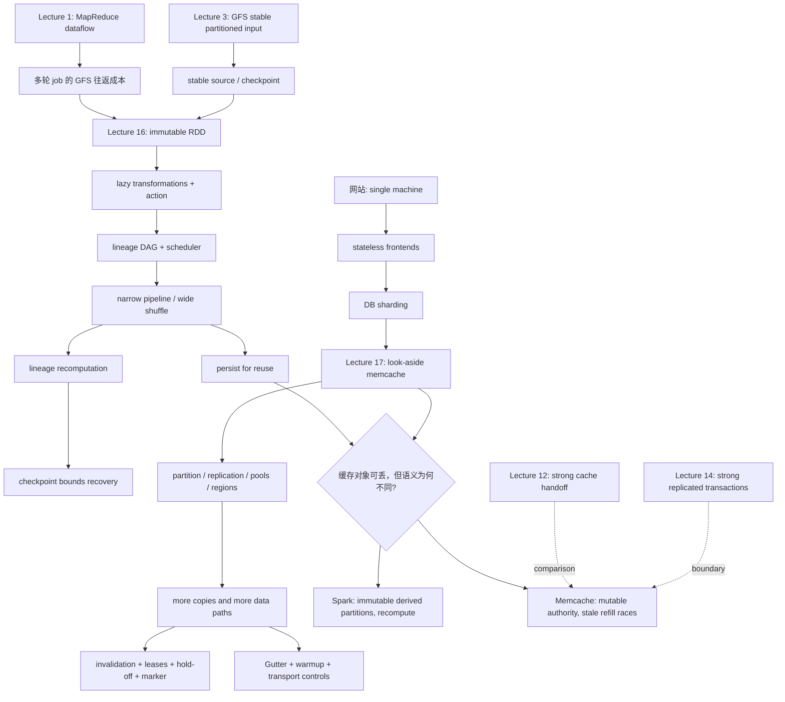

> 对应课程：MIT 6.824 Distributed Systems, Spring 2021  
> 教学顺序：Lecture 16 / Media Part 017, Spark → Lecture 17 / Media Part 018, Memcached at Facebook  
> 核心进阶：先理解 Spark 如何用 immutable RDD、完整 dataflow 与 lineage 把“中间数据留在内存”；再理解 Facebook 如何把 mutable database-derived objects 放入 look-aside cache，并承担 invalidation、staleness、扩展与故障路径的工程代价。  
> 证据边界：只使用本课程归档的 Lectures 16-17 视频/课堂笔记、readings 16-17、指定论文、FAQ、官方课堂讲义、Paper Questions、`MATERIALS.md` 与下列相关先修笔记。现代 Spark、现代 Facebook 架构或一般缓存常识若不在这些材料中，不补写进本模块。

## 如何使用本模块

这两讲不应被学成“两个都用了 RAM 的系统”。它们共享的问题是：怎样避免慢速后端或稳定存储成为吞吐瓶颈；但二者选择了不同的数据模型：

```text
Spark
  immutable partitioned data
  + deterministic transformations
  + complete lineage
  -> cache 可丢，按 recipe 重算
  -> 主要难题是 dataflow、shuffle、恢复范围与 checkpoint 成本

Memcache at Facebook
  mutable authoritative DB
  + application-derived cache values
  + independent cache copies
  -> cache 可丢，但旧值可能越过 write/invalidation 再进入 cache
  -> 主要难题是 refill/invalidation ordering、短暂陈旧、后端保护与运行路径爆炸
```

建议先完整掌握 Spark，再进入 Memcached。若直接从“缓存能加速”跳到 leases、Gutter 和 remote marker，会看见许多孤立补丁，却看不见它们分别修复哪一条新增数据路径。

证据标记约定：

- `[L16 时间]`：Lecture 16 视频/课堂笔记中的 Spark 讲授。
- `[L17 时间]`：Lecture 17 视频/课堂笔记中的 Memcached 讲授。
- `[Spark paper §x]`、`[Memcache paper §x]`：指定论文中的机制或实验；不冒充课堂原话。
- `[讲义]`：官方 `l-spark.txt` 或 `l-memcached.txt` 的补充事实。
- `[FAQ]`：官方 FAQ 对边界或常见问题的澄清。
- 性能数字只描述论文的机器、数据集、workload 与测量窗口，不外推为普遍上限。

## 一、证据导航

### 1. Lecture 16：Big Data - Spark

- [课程 MATERIALS：Lecture 16](/courses/mit-6824-s21/materials/#lecture-16-big-data---spark)
- [Reading 16：Spark 论文阅读指南](/courses/mit-6824-s21/readings/lecture-16/)
- [指定论文：Resilient Distributed Datasets](/assets/courses/mit-6824-s21/materials/official-materials/papers/zaharia-spark.pdf)
- [官方 FAQ](/assets/courses/mit-6824-s21/materials/official-materials/faqs/spark-faq.txt)
- [Paper Question](/assets/courses/mit-6824-s21/materials/official-materials/questions/16-q-spark.html)
- [官方课堂讲义：l-spark.txt](/assets/courses/mit-6824-s21/materials/official-materials/lecture-notes/l-spark.txt)
- [Lecture 16 聚合课堂笔记](/courses/mit-6824-s21/lectures/017/)
- [Lecture 16 transcript](/assets/courses/mit-6824-s21/lectures/017/transcript.txt)
- [Media Part 017](https://www.bilibili.com/video/BV16f4y1z7kn/?p=17)；[MIT 官方视频](https://youtu.be/qXb5rDGqFdc)

逐段课堂笔记：

[001](/courses/mit-6824-s21/lectures/017/#section-01) · [002](/courses/mit-6824-s21/lectures/017/#section-02) · [003](/courses/mit-6824-s21/lectures/017/#section-03) · [004](/courses/mit-6824-s21/lectures/017/#section-04) · [005](/courses/mit-6824-s21/lectures/017/#section-05) · [006](/courses/mit-6824-s21/lectures/017/#section-06) · [007](/courses/mit-6824-s21/lectures/017/#section-07) · [008](/courses/mit-6824-s21/lectures/017/#section-08)

### 2. Lecture 17：Cache Consistency - Memcached at Facebook

- [课程 MATERIALS：Lecture 17](/courses/mit-6824-s21/materials/#lecture-17-cache-consistency---memcached-at-facebook)
- [Reading 17：Memcache 论文阅读指南](/courses/mit-6824-s21/readings/lecture-17/)
- [指定论文：Scaling Memcache at Facebook](/assets/courses/mit-6824-s21/materials/official-materials/papers/memcache-fb.pdf)
- [官方 FAQ](/assets/courses/mit-6824-s21/materials/official-materials/faqs/memcache-faq.txt)
- [Paper Question](/assets/courses/mit-6824-s21/materials/official-materials/questions/17-q-memcached.html)
- [官方课堂讲义：l-memcached.txt](/assets/courses/mit-6824-s21/materials/official-materials/lecture-notes/l-memcached.txt)
- [Lecture 17 聚合课堂笔记](/courses/mit-6824-s21/lectures/018/)
- [Lecture 17 transcript](/assets/courses/mit-6824-s21/lectures/018/transcript.txt)
- [Media Part 018](https://www.bilibili.com/video/BV16f4y1z7kn/?p=18)；[MIT 官方视频](https://youtu.be/eYZg0YJtFEE)

逐段课堂笔记：

[001](/courses/mit-6824-s21/lectures/018/#section-01) · [002](/courses/mit-6824-s21/lectures/018/#section-02) · [003](/courses/mit-6824-s21/lectures/018/#section-03) · [004](/courses/mit-6824-s21/lectures/018/#section-04) · [005](/courses/mit-6824-s21/lectures/018/#section-05) · [006](/courses/mit-6824-s21/lectures/018/#section-06) · [007](/courses/mit-6824-s21/lectures/018/#section-07) · [008](/courses/mit-6824-s21/lectures/018/#section-08) · [009](/courses/mit-6824-s21/lectures/018/#section-09) · [010](/courses/mit-6824-s21/lectures/018/#section-10) · [011](/courses/mit-6824-s21/lectures/018/#section-11)

### 3. 相关先修笔记

- [Lecture 1：Introduction / MapReduce](/courses/mit-6824-s21/lectures/001/)：Map → shuffle/group → Reduce、coordinator/worker、deterministic retry、GFS input/output、stragglers。
- [Lecture 3：GFS](/courses/mit-6824-s21/lectures/003/)：Spark source/checkpoint 所依赖的稳定分布式存储直觉，以及 partition、replication、primary ordering、retry 的边界。
- [Lecture 12：Frangipani cache consistency](/courses/mit-6824-s21/lectures/012/)：以 lock transfer、flush-before-release 获得 strong cache coherence；用于对照 Memcache 的弱读语义与 invalidation 路径。
- [Lecture 14：Spanner](/courses/mit-6824-s21/lectures/014/)：sharding 与 replication 的分工、跨地域 replica lag、strong transaction/snapshot 路径；用于界定 Facebook 没有追求的 consistency 强度。

## 二、总依赖图：从 dataflow 到 cache consistency



依赖图中的关键转折是：Spark 的 RDD cache 不是一个被 online writers 原地更新的共享状态；Memcache entry 则是 mutable DB state 的派生副本，而且 application、DB、McSqueal、多个 clusters/regions 可能沿不同路径接触同一 key。前者首先问“丢了怎样重算”，后者还必须问“旧值是否能在唯一一次 delete 之后重新进入并长期存活”。

---

## 第一篇：Spark 的完整 dataflow 与 lineage

## 三、为什么 MapReduce 之后还需要 RDD

MapReduce 已经处理 task placement、shuffle、retry 和 failure，但一个多轮 computation 往往把一轮结果写入 replicated distributed file system，下一轮再读取。指定论文把代价归纳为 replication、disk/network I/O、serialization/deserialization 和多轮 job setup。Iterative algorithms 与反复查询同一中间结果的 interactive analysis 因此最受影响。[Spark paper §1；Reading 16 §2]

Spark 的回答不是“自动缓存所有东西”，而是给程序一个可引用、可指定 persistence/partitioning、可从 derivation 重建的 distributed-memory abstraction：RDD。

### 3.1 RDD 的最小定义

RDD 是 read-only、partitioned collection of records，只能由 stable storage 或其他 RDD 经 deterministic transformations 生成。[Spark paper §2.1]

```text
stable input / parent RDDs
    + partitions
    + deterministic compute function
    + dependencies / partitioner metadata
    -> child RDD
```

由此得到三条核心性质：

1. **Immutable**：transformation 不修改 parent，而是创建 child；循环中变量可重新指向新的 `ranks`，旧 RDD 本身不变。
2. **Lazy**：transformation 主要扩展 lineage；`count`、`collect`、`save` 等 action 才触发实际 computation。
3. **Reconstructible**：系统保留足够 metadata，使丢失 partition 可从 stable input 或 surviving/materialized parents 重算。

RDD 不是 database transaction，也不提供 fine-grained mutable shared state。它正是通过 coarse-grained functional update 避开该类 consistency protocol。[Spark paper §2.4；Reading 16 §3.3]

### 3.2 Transformation、action 与 `persist`

```text
lines = HDFS source RDD
errors = lines.filter(...)
errors.persist()                 # 声明未来物化后保留
result = errors.map(...).count() # action 触发执行
```

- `filter`、`map`、`join`、`reduceByKey` 等 transformation 创建新 RDD/依赖。
- `count`、`collect` 等 action 请求结果并启动 job。
- `persist/cache` 只声明 storage policy，不是 action；若 RDD 尚未被 action 需要，它仍未计算。[L16 00:06:21-00:17:01]
- 若不 `persist`，后续 action 可能按 lineage 从 source 重建该派生 RDD；Spark 不默认永久保存所有 intermediate data。[L16 00:23:50-00:24:23]

## 四、Execution：driver、scheduler、partition 与 dataflow

Driver 运行 user program 并构建 lineage DAG。Action 到来后，scheduler 从 target 反向检查 dependencies，按 partition 生成 tasks，交给 workers；HDFS source 已经 partitioned，后续 RDD 也可由 Spark/programmer 的 partitioner 重新布局。[L16 00:16:34-00:20:07]

```text
driver: user code -> lineage DAG -> stages/tasks
                              |
                              v
HDFS partitions -> workers execute partition tasks -> action result
```

Partitions 通常多于 workers，使 scheduler 能在 partition 耗时不均或 failure 后重新分配工作，改善 load balance。这里有两类并行：

- **Partition parallelism**：不同 workers 同时处理不同 partitions。
- **Pipeline overlap**：相邻 narrow transformations 对不同 batches/records 重叠执行，而不必让每步完整 materialize 后再开始下一步。[L16 00:09:54-00:12:53]

### 4.1 Narrow 与 wide dependencies

论文按 parent partition 的 fan-out 定义 dependency：

- **Narrow**：每个 parent partition 最多被一个 child partition 使用。可把一串 transformations 放在同一 stage/local pipeline 中；failure 通常只沿相关 partitions 重算。
- **Wide**：一个 parent partition 可能被多个 child partitions 使用，常见实现需要按 key 分桶、跨 worker fetch、shuffle/materialization 与 barrier。未 co-partition 的 `groupByKey`、`reduceByKey`、`join` 是典型例子。[Spark paper §3-§5]

课堂曾用“一个 child 依赖一个 parent”作简写，学生指出这与 paper 的 parent-fan-out 方向不完全相同；课后讨论也没有把 every many-to-one case 简化成单一形式定义。稳妥结论是同时保留：

1. Paper 的 partition-level fan-out 定义。
2. 运行时是否需要 inter-machine communication/shuffle 的直觉。
3. Co-partitioned join 说明 logical operator 名称不足以唯一决定 physical cost。[L16 00:20:16-00:23:46；01:05:28-01:10:51]

### 4.2 Co-partitioning 为什么重要

若 `links` 与 `ranks` 使用一致 mapping：

$$
p(k)=h(k)\bmod N,
$$

相同 key 的 records 会进入两边对应 partition。于是 output partition $i$ 可从 `links[P_i]` 与 `ranks[P_i]` local join，不必为 join 再做完整 reshuffle/barrier。[L16 00:47:24-00:49:35]

Paper 的 PageRank 实验把该机制与性能对应起来：54 GB Wikipedia dump、10 iterations 中，仅 in-memory storage 在 30 nodes 上得到 `2.4x`，保持 iterations 间 partitioning 后为 `7.4x`。这不是通用 Spark 倍数，而是 partitioner metadata 能避免重复 shuffle 的 workload-specific 证据。[Spark paper §6.2；Reading 16 §9.2]

## 五、PageRank：从代码展开 immutable iteration

课堂按以下顺序推演一轮：

```text
links.join(ranks)
  -> flatMap outgoing contributions
  -> reduceByKey(sum by destination)
  -> new ranks RDD
```

若 source page $u$ 的当前 rank 为 $R_t(u)$、out-degree 为 $d(u)$，对每条 $u\to v$：

$$
c_t(u\to v)=\frac{R_t(u)}{d(u)}.
$$

目的页 $v$ 收到：

$$
C_t(v)=\sum_{u\to v}\frac{R_t(u)}{d(u)}.
$$

三页例中，U1 从自身和 U3 收到：

$$
C_t(U_1)=\frac{R_t(U_1)}{2}+R_t(U_3).
$$

课堂 transcript 明确讲到 join、division、flatMap 与 reduce sum。[L16 00:40:33-00:43:51] 官方讲义的完整代码再应用：

$$
R_{t+1}(v)=0.15+0.85C_t(v),
$$

并把 `0.85/0.15` 解释为跟随链接/随机访问；这两个常数属于讲义与 paper 补充，不冒充该时段逐字口述。[讲义]

PageRank 的关键不是公式本身，而是数据生命周期：

- 巨大的静态 `links` 跨轮复用，适合 `cache/persist`。
- `ranks_t`、`contribs_t` 每轮都是新 RDD；变量重绑定不等于 in-place mutation。
- 循环让 lineage DAG 逐轮展开变长，不形成 cycle。
- 最终 `collect` 才触发整个 recipe；它也形成全局汇集，不能因前面 co-partitioned 就假定全程无 wide cost。[L16 00:35:29-00:52:00]

## 六、Spark 的 cache、failure 与 checkpoint

### 6.1 三个不同对象

| 对象 | 主要目的 | 丢失后的路径 | 主要成本/边界 |
| --- | --- | --- | --- |
| Memory `persist/cache` | 正常执行中的 reuse | 沿 lineage 重算 | 占 RAM；可能 eviction/serialization/spill；不是 durable guarantee |
| Lineage metadata | 描述 execution 与 reconstruction recipe | 从 stable/surviving parents 重放 | Long/wide graph 会扩大恢复工作；依赖 deterministic computation |
| HDFS checkpoint | 截短 failure 后恢复路径 | 从最近稳定 RDD 继续重算 | 写完整 RDD 的 storage/network I/O；频率是 policy 问题 |

### 6.2 Worker failure 的恢复范围

```text
lost partition
  -> scheduler examines dependencies
  -> find surviving/materialized parent or stable source
  -> rerun deterministic transformations elsewhere
  -> reconstruct required output
```

- Narrow path 通常只重算对应 ancestors，可把多个 lost partitions 分散到 workers。
- Wide/shuffle path 的一个下游 loss 可能需要多个 upstream partitions/buckets，产生 recomputation amplification。
- Long iterative lineage 即使逻辑上可重算，也可能在操作上太慢，因此适合 periodic checkpoint。[L16 00:26:35-00:35:02]

课堂用 PageRank “也许每 10 轮”说明权衡，但没有推导通用最优 checkpoint interval。[L16 00:49:52-00:50:11；00:55:21-00:57:03]

### 6.3 运行与边界

- Paper 的 75-node、100 GB k-means failure experiment 中，普通 iteration 约 `58 s`，第 6 轮 kill 一台 machine 后为 `80 s`，下一轮回到 `58 s`；它支持 partial reconstruction，不证明所有 wide lineage 都恢复很快。[Spark paper §6.4]
- 2012 paper implementation 不容忍 scheduler/driver failure；Lecture 16 对 driver crash recovery 也明确回答未知。不能把 worker recovery 推广成 control-plane high availability。[L16 00:57:07-00:57:37]
- Nondeterministic user function 若依赖未被 lineage 捕获的外部变化，不能自动获得同一 logical replay。
- RDD 适合 bulk-data batch、coarse-grained transformations；不适合 asynchronous fine-grained shared mutable state。Single-pass scan/aggregate 若没有 intermediate reuse，也不具有 RDD in-memory reuse 的独特优势。[Spark paper §2.4；FAQ]

---

## 第二篇：从 RDD cache 转向 Facebook look-aside cache

## 七、同是 cache，为什么问题突然变了

| 维度 | Spark persisted RDD | Facebook memcache entry |
| --- | --- | --- |
| Authority | Stable input + lineage recipe | MySQL/other backend |
| Data model | Immutable partitioned records | Application-derived key/value object |
| 更新方式 | Transformation 创建新 RDD | DB transaction 修改 authoritative state；cache delete/refill |
| Cache writer | Scheduler/worker 物化确定的 RDD partition | 多个 application clients 可在 miss 后 `set` |
| 普通丢失 | 重算 partition，影响性能/恢复时间 | 回源重建，影响 latency 与 DB load |
| 特有正确性风险 | Nondeterminism、driver boundary、wide recovery | 旧 DB/warm replica result 越过 invalidation，再填回 cache |
| 主要 coordination | Stage/shuffle/barrier、task scheduling | DB order、delete stream、lease token、marker 与 routing |
| 扩展单位 | Partitions、workers、stages | Servers、pools、clusters、regions、DB replicas |
| Stable cut | HDFS checkpoint | DB commit/log；cache 本身不作为 truth |

共同点只有“derived data 可重建、RAM 服务复用”。不能因此推出：

- Spark `persist` 需要 McSqueal 式 invalidation；RDD 没有原地 online write path。
- Memcache 可以只靠 lineage 恢复；它没有记录 application-derived value 的完整 deterministic RDD recipe。
- HDFS checkpoint 等于 cache consistency；checkpoint 约束 recovery distance，不排序 DB/cache write/refill。
- Memcache delete 等于 RDD eviction；delete 还承载 freshness/RYOW 路径，而普通 RDD eviction 主要改变重算成本。

---

## 第三篇：Memcached at Facebook 的扩展与一致性

## 八、从网站扩展史推导 cache 的 operational role

Lecture 17 按性能瓶颈推进架构，而不是先列机制：[L17 00:03:50-00:16:12]

```text
1. web/application/DB on one machine
   -> application CPU bottleneck
2. many stateless frontends + one shared DB
   -> DB bottleneck
3. DB sharding by key
   -> parallel throughput, but cross-shard queries/transactions become hard
4. many frontends + memcache for reads + sharded DBs for durable writes
   -> high read throughput, but consistency and miss amplification appear
```

Cache 的首要 operational role 是保护 DB、维持总体 throughput；降低 user-visible latency 只是收益之一。若 cache failure/cold start 把巨大 read load 直接推给 DB，系统会从 cache 故障放大成 backend/cascading failure。[L17 00:14:50-00:16:12；00:52:47]

### 8.1 Demand-filled look-aside path

```text
read(k):
    v = memcache.get(k)
    if v is nil:
        rows = DB.select(...)
        v = application_transform(rows)
        memcache.set(k, v)
    return v

write(k, new_state):
    primary_DB.transaction(new_state)
    local_memcache.delete(k)
    # McSqueal later invalidates other possible cache copies
```

它是 **look-aside**，因为 application 显式查 cache、查 DB、转换并填充；cache 不理解 DB schema。它是 **demand-filled**，因为只有实际 miss 的 key 被重建。Cached value 可以是 HTML 或多个 rows 的聚合，不必是 DB row 的字节复制。[L17 00:22:48-00:26:19]

Authority invariant 是：durable write 先提交 backend；普通 cache item 可 eviction/delete，并能从 backend 重建。Cache item 丢失通常改变 load/latency，不改变 durable truth。

### 8.2 为什么 delete，不直接 update

若多个 clients 在 DB write 后把 value `set` 到 cache，cache 的 arrival order 可能不同于 DB transaction order，迟到旧 set 会覆盖新值。Delete 是幂等的，且让下一 read 从 authoritative backend refill；代价是 miss/recomputation。[L17 00:28:53-00:32:34]

两条 invalidation path 不能混淆：

- **Writer local delete**：DB write 完成后立即删除 writer 所在 local cluster 的 key，使其下一 read miss，服务 read-your-own-writes。
- **McSqueal async invalidation**：读取 committed DB log，把 deletes 传播到其他可能缓存该 key 的 clusters/regions；它服务其他 copies，不要求 writer 同步等待全部完成。[L17 00:26:50-00:28:48；01:27:53]

### 8.3 Consistency contract

本讲没有承诺 linearizable reads 或严格 bounded staleness。材料支持的工程目标是：

1. Primary DB transactions 为 writes 建立 order。
2. Ordinary reads 可短暂 stale，应用/人类用户通常可容忍。
3. 不能让旧值因 missed delete 或 stale refill 无时间上界地驻留。
4. Writer 紧随其后的 read 应尽量看到自己的 write。
5. Replica lag、marker eviction、delete delay 等仍留下 rare inconsistency；这些机制是 best-effort engineering，不是形式化强一致证明。[Memcache paper §2、§5、§7.3；FAQ]

## 九、扩展：partition、replication、clusters 与 regions

### 9.1 Partition 与 replication 是两种不同并行策略

| 选择 | 分割什么 | 主要收益 | 代价/不解决的问题 |
| --- | --- | --- | --- |
| Partition cache keys | 把不同 keys 放到不同 servers | Distinct-data capacity；RAM 效率高 | Hot key 仍压在一个 owner；frontend 要 fan-out 到许多 servers |
| Replicate cache dataset/cluster | 把 clients 分散到多份 cache copies | Hot-key service capacity；较小 connection/network domain | 重复占 RAM；invalidation targets 增多 |

Facebook 在一个 region 内使用多个 frontend/memcache clusters。每个 cluster 是一整套 sharded cache servers；users/clients 分散到 clusters，同一 popular key 因而可在多个 clusters 各有一份。相比把一个 cluster 无限做大，这还能限制 client server set、incast 与 network bisection demand。[L17 00:42:48-00:50:36]

### 9.2 Regional pool 修复 replication 的 RAM 代价

Less-popular/large objects 若在每个 cluster 各复制一份会浪费 RAM。Regional pool 由多个 clusters 共享，让此类对象每 region 保留较少 copies，为热门对象腾出 per-cluster memory。代价是 cross-cluster latency/bandwidth、较少 serving replicas，以及 application 必须决定 placement/popularity；论文没有给自动 optimal partitioner。[Memcache paper §4.2]

### 9.3 Region 与跨地域复制

每个 region 含 frontends、memcache clusters 与 sharded DB replica；课堂架构中一个 primary region 接受 writes，secondary regions 通过 MySQL async log replication 追赶。Local cache/DB 降低 read RTT，但 write 要去 primary，replica lag 扩大 staleness window。[L17 00:34:36-00:42:18]

跨 region invalidation 不能简单早于 data apply：若先删 secondary cache，而 local replica DB 尚为旧值，下一 miss 会从旧 DB refill 并长期缓存。论文让 replica-side log path 在 apply/commit 后传播 delete，以保持实际的 data-before-invalidation 顺序。[Memcache paper §5]

## 十、网络与运行扩展

一次 page request 可能需要几十、数百个 keys，frontend 必须并行 fan-out；否则串行 RTT 过大，但同时 replies 又会造成 incast、queueing 与 tail latency。[L17 00:24:15-00:25:36；00:46:06-00:48:57]

论文/讲义给出的运行选择是：

- Client 按 key 选择 server，并 batch/multiget 可并行的 requests。
- `get` 可走 UDP direct path，减少 many-clients × many-servers 的 TCP connection state；sequence numbers 检测 dropped/late/out-of-order packets，错误可按 miss 处理，但 overload 时不盲目 refill。
- `set/delete` 经本机 mcrouter 的 TCP path，以获得可靠有序交付确认。
- mcrouter 聚合 connections 与 packets，减少近似 $n^2$ 的 connection state 和 per-packet overhead。
- Client sliding window 在并行度与 incast 之间调节；论文只证明存在 workload-specific operating point，没有通用固定 window。[Memcache paper §3.1；Reading 17 §4]

课堂主体没有完整逐项口述上述 transport implementation；它们是 paper/官方讲义事实。不能缩写成“UDP 总比 TCP 快”或“所有 memcache operations 都走 mcrouter”。

## 十一、保护 DB：cold start、leases 与 Gutter

### 11.1 Cold-cluster warming

新/恢复 cluster 的 hit rate 近零。若普通 miss rate 约 `1%`，让一个 cold second cluster 分走约一半 operations，DB miss load 可从约 `1%` 跳到约 `50%`，形成约 `50x` 的讲义算例。系统先从 warm cluster lazy copy 到 cold cluster，把压力留在 cache tier，而不是 DB。[讲义；L17 00:53:37-00:56:32]

这条额外 copy path 会引入 Race 2；因此 warming 是“保护 DB”的性能机制，也是新的 consistency 风险源。

### 11.2 Lease：同一状态同时服务 load 与 consistency

Cache miss 可返回与 key 绑定的 lease token。通常只有一个 client 获得填充许可，其他 clients 稍后 retry：

```text
many clients miss(k)
  -> one client gets lease and reads DB
  -> others retry after a short delay
  -> first accepted set fills cache
  -> retries hit
```

这抑制 thundering herd。Delete 还会撤销 outstanding lease，使持有旧 DB value 的迟到 client 无法 `set`，因而 lease 同时修复 Race 1。[Memcache paper §3.2.1]

论文对一组 herd-prone keys 的一周观察中，peak DB query rate 从无 leases 的 `17K/s` 降至 `1.3K/s`。该数字绑定论文 workload，不是所有 key 的固定降幅。

### 11.3 Gutter：小规模 cache failure 的临时 shield

Ordinary memcached server/network failure 若直接变成 DB misses，可能级联。约占 cluster `1%` 的 Gutter pool 只在 ordinary server 不可达时使用：

```text
ordinary get timeout
  -> retry Gutter
  -> Gutter miss: query DB and insert short-lived value
  -> later requests may hit until ordinary server is repaired
```

Gutter 不把 failed keys 直接 rehash 到正常 servers，避免 hot key 把新 owner 一并压垮。它的 entries 快速过期，ordinary invalidations 不持续发往 Gutter，因此以短暂 stale 换 backend protection。[Memcache paper §3.3]

Gutter 只处理少数 servers 的 failure；whole-cluster outage 依赖其他 clusters 的 capacity。课堂对“为什么 writers 不 delete Gutter”明确是推测，paper 没给精确答案，不能把 doubled delete traffic/small-pool overload 说成已证明原因。[L17 01:33:46-01:34:20]

## 十二、三个 consistency races：新增路径如何制造旧值

### 12.1 Race 1：ordinary stale set

```text
C1: get(k) -> miss + lease L
C1: read DB -> v1, then pauses
C2: write DB -> v2
C2/McSqueal: delete(k) -> revoke L
C1: set(k, v1, L) -> rejected
```

没有 lease invalidation，C1 的旧 `v1` 会在唯一一次 delete 之后重新进入 cache，直到 eviction 或下一 write，形成无上界 stale。Fix 是 delete 撤销 lease，cache 拒绝迟到 stale set。[L17 01:10:40-01:16:16]

### 12.2 Race 2：cold cluster 从 warm cluster 回填旧值

```text
C1: write DB -> v2
C1: cold.delete(k)
C2: cold.get(k) -> miss
C2: warm.get(k) -> stale v1
C2: cold.set(k, v1) -> rejected during hold-off
```

旧值来自 warm cache，不是本轮直接 DB read。Cold delete 后的 two-second hold-off 暂时拒绝 add/set，让 invalidation 大概率先传播到 warm cluster；若 warm copy 被拒，client 回 DB。论文承认 delete 可能超过两秒，因此这不是严格保证，只在 warm-up path 使用。[Memcache paper §4.3；L17 01:16:16-01:20:40]

### 12.3 Race 3：secondary-region writer 读不到自己的 write

```text
C1 in secondary: write primary DB -> v2
C1: local delete(k) + set remote marker r_k
C1: local get(k) -> miss and sees r_k
C1: read primary DB -> v2
secondary DB catches up -> invalidation clears k and r_k
```

没有 marker，local miss 会读仍为 `v1` 的 secondary DB。Remote marker 不保存新 value，只改变 miss routing，临时强制读 primary。它用额外 metadata/cross-region latency降低 stale-read probability；marker eviction 与 concurrent modification 仍可能破坏该目标，paper 将其描述为 rare，而非不可能。[Memcache paper §5；L17 01:20:40-01:25:04]

三个 race 的统一检查法：

1. 旧值从哪里来？DB read、warm cache，还是 lagging replica DB？
2. 哪一次 write/delete 已经发生？
3. 哪条延迟路径让旧值越过它？
4. Fix 拒绝的是 stale fill、暂缓的是 fill，还是改变 source routing？
5. Fix 是严格 ordering，还是依赖时间窗/低概率假设？

## 十三、系统级比较：性能、故障与一致性

| 问题 | Spark RDD | Memcache at Facebook |
| --- | --- | --- |
| 慢后端 | 多轮 GFS/HDFS round trip | MySQL read capacity |
| 并行结构 | Partitions/tasks/stages | Key shards/servers/clusters/regions |
| 全局通信 | Wide shuffle/barrier | Multi-key fan-out、invalidation broadcast、cross-region write/read |
| Reuse | Persist selected RDDs | Demand-filled cached objects |
| Load spike | Recompute/shuffle/checkpoint I/O | Miss/herd/cold cluster/cache failure 冲击 DB |
| 故障恢复 | Deterministic lineage replay | Backend refill、Gutter、other clusters、delete replay |
| Correctness hinge | Immutability + deterministic recipe | DB write order + invalidation/refill race control |
| Stable mechanism | HDFS source/checkpoint | DB transaction/commit log + replica apply |
| 主要局部优化 | Narrow pipeline、data locality、co-partition join | Client batching、cluster replica、regional pool、local reads |
| 主要代价 | RAM、shuffle、long/wide recovery、driver boundary | RAM duplication、connections/incast、staleness、many special paths |

从 operations 角度，两篇论文都拒绝“只增加机器即可”的答案：

- Spark 多 partitions 有助 load balance，但 wide edge 仍产生 all-to-all data movement/barrier；cache capacity 和 checkpoint policy 需要管理。
- Memcache 多 servers 增加 key capacity，但 hot key、fan-out、incast 和 connection state 仍可能恶化；因此还要组合 replication、smaller clusters、regional pool、mcrouter 与 batching。
- Spark worker failure 可通过重算吸收，但 wide lineage 决定 blast radius。
- Memcache server failure 可通过 refill 吸收，但 DB 容量决定 failure 是否级联；Gutter 的主要价值是隔离 backend，而非恢复 cache durability。
- 每增加一条优化路径，都要重新检查 failure 和 ordering：Spark 检查 stage/recovery graph；Memcache 检查旧值能否跨过 invalidation。

## 十四、论文、FAQ 与课程问题

### 14.1 Spark paper

[Resilient Distributed Datasets: A Fault-Tolerant Abstraction for In-Memory Cluster Computing](/assets/courses/mit-6824-s21/materials/official-materials/papers/zaharia-spark.pdf) 的阅读主线：

1. §1：Iterative/interactive reuse 相对 MapReduce 的缺口。
2. §2：RDD abstraction、persistence、partitioning 与不适用 workload。
3. §3-§5：RDD representation、scheduler、narrow/wide dependency、lineage/checkpoint recovery。
4. §6：Logistic regression、k-means、PageRank、interactive query 与 failure experiments。
5. §7：与 MapReduce、Dryad、Pregel、databases/mutable stores 的边界。

论文数据应按 workload 解释：logistic regression 后续 iterations 可比 Hadoop 快 `25.3x`，compute-heavy k-means 只有 `1.9x-3.2x`；这说明减少 I/O/framework overhead 的相对收益取决于 computation-to-data ratio。[Spark paper §6.1]

**Course Question：** Spark 能很好支持哪些 MapReduce/Hadoop 不能很好支持的 applications？

作答时应把 “cannot support” 拆成“不能表达”与“不能高效支持”，画出同一 workload 在多轮 GFS intermediate files 与 RDD persistence/lineage 下的 data path，并给 single-pass 或 fine-grained mutable workload 作为边界。不要只写“Spark 在内存所以更快”。

### 14.2 Memcache paper

[Scaling Memcache at Facebook](/assets/courses/mit-6824-s21/materials/official-materials/papers/memcache-fb.pdf) 的阅读主线：

1. §2：Look-aside cache、authority、delete/refill 与 workload。
2. §3：Single-cluster network path、leases、pools、replication 与 Gutter。
3. §4：Region 内 multiple clusters、regional pool、cold-cluster warmup。
4. §5：Multi-region database replication、invalidation ordering 与 remote marker。
5. §6-§7：Single-server improvements、production measurements 与 consistency/availability tradeoff。

**Course Question：** §3.3 暗示 writer 会删除 ordinary memcached key，却不删除对应 Gutter key。为什么让 writers 删除 Gutter keys 可能是坏主意？

本模块不把课堂推测包装成标准答案。应从 Gutter 约 `1%`、只服务 small outage、任意 failed key 都可能映入、entry 快速过期、目标是保护 DB 这些 paper facts出发，分别分析 freshness 收益、delete traffic/routing、working-set reuse 和 backend load，再明确哪些只是推论。

### 14.3 FAQ 使用方式

- [Spark FAQ](/assets/courses/mit-6824-s21/materials/official-materials/faqs/spark-faq.txt)：重点核对 RDD immutability/lineage、MapReduce 的合理边界、hash co-partitioning，以及 modern Spark 更常用 DataFrame 的历史背景；不要把现代 API 倒灌进 2012 paper。
- [Memcache FAQ](/assets/courses/mit-6824-s21/materials/official-materials/faqs/memcache-faq.txt)：重点核对“容忍短暂 stale”与“拒绝无界 stale”的差别、leases 的双重作用、mcrouter/UDP/TCP 不同路径、regional pool 与 Gutter 的区别。
- FAQ 是澄清材料，不替代 paper experiments，也不改变课堂 chronology。

## 十五、易错点、误解与证据边界

### Spark

1. **“RDD variable 中已经装了全部数据。”** 错；action 前通常只是 distributed dataset handle 与 recipe。
2. **“`persist` 会立即计算。”** 错；它声明未来物化后的保留策略。
3. **“所有 join 都是 wide。”** 错；co-partitioned parents 可让 join local/narrow-like。
4. **“Narrow 就是 child 只依赖一个 parent。”** 不够精确；paper 定义约束 parent partition fan-out，课堂该措辞存在未完全解决的争论。
5. **“循环使 lineage 成环。”** 错；每轮创建新 RDD，DAG 展开变长。
6. **“Cache 与 checkpoint 相同。”** 错；前者偏正常 reuse，后者用 stable storage 限制 failure recovery distance。
7. **“Lineage 让所有 failure 都很便宜。”** 错；wide/long lineage 可扩大恢复，driver failure 也不是本讲已解决项。
8. **“Spark 总比 MapReduce 快。”** 错；single-pass、input-I/O dominated 或 compute-heavy workload 的收益不同。

### Memcache

9. **“Cache 主要只是减少 latency。”** 错；课堂首先强调保护 DB、维持 throughput survival。
10. **“Cache item 是 DB row 的透明副本。”** 错；application 可生成 HTML/聚合 derived value。
11. **“Writer 应直接 set 新值。”** 不成立；client sets 可乱序，旧值可能覆盖新值。
12. **“Eventual consistency 意味着永久 stale 也可以。”** 错；系统投入 leases/hold-off/marker 正是为了避免长时间或无界 stale。
13. **“Partition 与 replication 增加同一种 capacity。”** 错；前者增加 distinct-key capacity，后者增加 hot-key serving copies但重复占 RAM。
14. **“Regional pool 与 Gutter 都是备用 cache。”** 错；前者长期存放少复制对象，后者只在 ordinary server failure 期间临时保护 DB。
15. **“Lease 只抑制 herd。”** 错；delete revocation 还拒绝 stale set。
16. **“Two-second hold-off 是严格时限保证。”** 错；它依赖传播通常足够快，只用于 warm-up，paper 接受 rare inconsistency。
17. **“Remote marker 保存新 value。”** 错；它只让 miss 暂时路由到 primary。
18. **“所有 transport 都走同一路径。”** 错；paper/讲义区分 UDP get direct path 与 TCP mcrouter state-changing path。

### 跨讲边界

19. **不要把 RDD cache consistency 与 Frangipani coherence 等同。** Frangipani 用 lock ownership、flush-before-release 让 mutable cached blocks 强一致交接；RDD 通过 immutable versions 避开 in-place writer coherence。
20. **不要把 Memcache 的 DB transactions 等同于 Spanner external consistency。** Lecture 17 只借强系统作对照，Facebook reads 明确允许短暂 stale，remote marker 也有 eviction/concurrency 边界。
21. **不要把 Spark checkpoint 与 DB commit log 等同。** 前者保存派生 RDD 以缩短重算；后者决定 authoritative writes，并为 committed invalidation 提供 durable ordering/replay source。
22. **不要把论文数字当现代固定规格。** 两篇论文分别来自 2012/2013 年的特定实验与 production 环境。

## 十六、掌握门槛

### Gate 1：Dataflow literacy

给一段 RDD code，必须能标出 source RDD、transformations、actions、persist/checkpoint、每轮新 RDD，并画出无 cycle lineage。若把 `cache()` 标成 action，未通过。

### Gate 2：Partition reasoning

给 partition dependency 图，必须能分别按 paper fan-out 与 physical communication 判断 narrow/wide，指出 stage boundary、shuffle/barrier，并说明相同 partitioner 如何改变 join cost。若只按 operator 名称贴标签，未通过。

### Gate 3：Failure scope

必须能对 narrow loss、wide loss、memory cache loss、存在 checkpoint 四种情况画出最小可证恢复路径，并明确 driver failure 是本讲边界。若回答“都只重算失败 partition”，未通过。

### Gate 4：Cache authority and paths

必须能画出 look-aside read hit/miss/refill、DB write/local delete、McSqueal async delete，并指出哪个对象 authoritative、哪个 value 可能由 application 派生。若把 memcache `set` 当 durable write，未通过。

### Gate 5：Scaling choices

必须能在给定 hot-key、large-cold-object、cold-cluster、single-server failure 场景中，分别解释 partition、cluster replication、regional pool、warmup、Gutter 的收益与代价。若用“加 server”作为统一答案，未通过。

### Gate 6：Race reconstruction

不看笔记写出 Race 1/2/3 的 event order，标出旧值来源、越过的 invalidation、fix 及其保证强度。若只背 lease/hold-off/marker 三个名词，未通过。

### Gate 7：Evidence discipline

看到一个结论时，能标记为课堂明确、paper/讲义补充、FAQ 澄清、课堂推测或未知。必须保留 Spark driver recovery、Gutter invalidation 原因、two-second window、remote-marker eviction 等边界。

## 十七、12 组累计问答

### Q1. 为什么 Spark 不是“MapReduce 加一个普通 cache”？

**答：** RDD 把 partition、dependency、compute function、preferred location/partitioner 与 persistence 暴露为统一 abstraction；scheduler 能看到完整 lineage，做 pipeline、stage、locality、shuffle 与 reconstruction。普通跨 jobs cache 不能自动给出这套 execution/recovery recipe。[Spark paper §2-§5]

### Q2. 为什么 transformation、`persist` 与 action 必须严格区分？

**答：** Transformation 扩展 lineage，`persist` 声明未来 materialization 的保存策略，action 才请求结果并触发 scheduler。若混淆，就无法判断何时发生 I/O、何时产生 cache partition、失败时从哪里重算。[L16 00:06:21-00:17:01]

### Q3. Narrow/wide 为什么同时影响正常性能和故障恢复？

**答：** Narrow edge 可在 local partition pipeline，且 loss 通常只沿对应 ancestors 重算；wide edge 需要 shuffle/barrier/materialization，一个 downstream loss 可能牵涉多个 upstream buckets/partitions。因此同一 dependency shape 同时决定 network cost 与 recovery blast radius。[Spark paper §4-§5]

### Q4. PageRank 中最值得 cache 的对象是什么，为什么？

**答：** 巨大、静态、跨所有 iterations 复用的 `links`；每轮 `ranks`/`contribs` 是新 RDD。Co-partitioned `links`/`ranks` 还能减少 join shuffle。Long ranks lineage 则可能周期性 checkpoint，以正常 I/O 换 failure 后较短重算。[L16 00:35:29-00:50:11]

### Q5. Spark memory cache 丢失与 Facebook memcache item 丢失有什么共同点和根本差别？

**答：** 共同点是 derived data 可重建，丢失先表现为性能成本。根本差别是 Spark partition 有 immutable deterministic lineage；Facebook item 由 mutable authoritative DB 和 application refill 产生，重建过程可与 concurrent write/invalidation 交错，因而还会产生 stale set 一致性问题。

### Q6. 为什么 Facebook 加 cache 后，系统不再只是一个读优化？

**答：** 正常读流量远超过 DB 可承受范围，cache 成为 backend load shield。Cold start、herd 或 server failure 若把 misses 集中推回 DB，会造成级联风险，所以 warmup、leases、Gutter 都首先是 operational survival mechanisms。[L17 00:14:50-00:16:12；00:52:47-01:05:18]

### Q7. 为什么 write path 是 DB commit 后 delete，而不是直接 update cache？

**答：** DB 是 authority，application clients 的 cache updates 可能以不同于 DB writes 的顺序到达，迟到旧 set 可覆盖新值。Delete 幂等，并迫使下一 miss 从 authority 重建；writer local delete 还服务 read-your-own-writes，McSqueal delete 则覆盖其他 copies。[L17 00:26:22-00:32:38]

### Q8. Partition、cluster replication 与 regional pool 各解决什么？

**答：** Partition 增加 distinct-key/RAM capacity；cluster replication 增加 popular-key serving copies并缩小 network domain，但重复 RAM；regional pool 把 less-popular/large objects 从每 cluster 一份改为 region 共享，节省 RAM但付出 cross-cluster access 和较少 replicas。[Memcache paper §3.2.3、§4.2]

### Q9. Lease 为什么是一项跨 performance/correctness 的机制？

**答：** 它限制同一 miss window 中谁可回源/填充，压低 thundering-herd DB load；同时 delete 撤销 outstanding token，拒绝在 write 后迟到的旧 value `set`，修复 ordinary stale-set race。[Memcache paper §3.2.1]

### Q10. Cold warming 与 Gutter 都保护 DB，为什么不能混为一谈？

**答：** Warming 面向 whole new/recovered cluster 的近零 hit rate，通过 warm-to-cold lazy copy 建立 cache，并引入 two-second hold-off race fix；Gutter 面向少数 ordinary servers 的临时 failure，用小型 idle pool承接 active working set、短 TTL 且不收 ordinary invalidations，接受短暂 stale。它们的规模、生命周期和 consistency path 不同。

### Q11. 三个 Memcache races 可以怎样统一，而 fix 又为何不同？

**答：** 三者都让旧值在 write/delete 后重新进入读路径：Race 1 旧值来自先前 DB read，lease revocation 拒绝迟到 set；Race 2 来自 warm cache，hold-off 暂停 cold fill；Race 3 来自 lagging secondary DB，remote marker 改读 primary。旧值来源和路径不同，所以不能用同一 fix 替代。[L17 01:10:40-01:25:04]

### Q12. 两讲合起来最重要的 operations 判断是什么？

**答：** 每项性能优化都改变 data path，并把成本移到另一处。Spark 的 memory reuse/complete DAG 换来 shuffle、RAM policy、long-lineage recovery 与 driver boundary；Memcache 的 copies/local reads/failure fallback 换来 invalidation targets、fan-out/incast、replica lag和新的 refill races。评价方案必须同时画 normal path、failure path、authority、ordering point 与恢复/回源容量，不能只比较 hit latency。

## 十八、复习顺序

1. 先读本模块“总依赖图”，回看 [Lecture 1 MapReduce](/courses/mit-6824-s21/lectures/001/) 的 Map/shuffle/Reduce 与 [Lecture 3 GFS](/courses/mit-6824-s21/lectures/003/) 的 stable partitioned storage，只复习 Spark 直接依赖的部分。
2. 阅读 [Reading 16](/courses/mit-6824-s21/readings/lecture-16/) §2-§7，并配合 Lecture 16 sections [001](/courses/mit-6824-s21/lectures/017/#section-01)-[004](/courses/mit-6824-s21/lectures/017/#section-04)，画 `source -> transformations -> action`、driver/workers、narrow/wide 与 worker recovery。
3. 手算本模块 PageRank 一轮；再读 Lecture 16 sections [005](/courses/mit-6824-s21/lectures/017/#section-05)-[008](/courses/mit-6824-s21/lectures/017/#section-08)，分别标出课堂事实、讲义公式、checkpoint 示例和 Q&A 未决项。
4. 阅读 Spark paper §2、§4-§6；用实验条件解释 `25.3x`、`2.4x/7.4x`、`58s/80s`，并回答“机制怎样导致该结果”，不要背数字。
5. 只读本模块第七节比较表，再进入 Lecture 17。先确保能说出：RDD cache 主要面对 recomputation，look-aside cache 还面对 concurrent refill/invalidation ordering。
6. 阅读 [Reading 17](/courses/mit-6824-s21/readings/lecture-17/) §2-§5，并配合 Lecture 17 sections [001](/courses/mit-6824-s21/lectures/018/#section-01)-[005](/courses/mit-6824-s21/lectures/018/#section-05)，画网站演进、look-aside read/write、consistency contract、partition/replication。
7. 阅读 Lecture 17 sections [006](/courses/mit-6824-s21/lectures/018/#section-06)-[007](/courses/mit-6824-s21/lectures/018/#section-07)，用“保护 DB”统一 regional pool、cold warming、leases、Gutter与网络控制。
8. 连续阅读 Lecture 17 sections [008](/courses/mit-6824-s21/lectures/018/#section-08)-[011](/courses/mit-6824-s21/lectures/018/#section-11)，不看答案亲手写 Race 1/2/3 timeline，并给每个 corner case 标注 paper fact、课堂推测或未知。
9. 回看 [Lecture 12 Frangipani](/courses/mit-6824-s21/lectures/012/) 与 [Lecture 14 Spanner](/courses/mit-6824-s21/lectures/014/)，只做边界比较：strong coherence/transactions 要付哪些 coordination cost，Facebook 又明确放弃了哪些保证。
10. 最后阅读两份 FAQ 和 Paper Questions，完成七个 mastery gates，再闭卷回答 12 组累计问答。若不能画出 data/invalidations/failure path，就回到图和事件顺序，而不是继续背机制名称。
