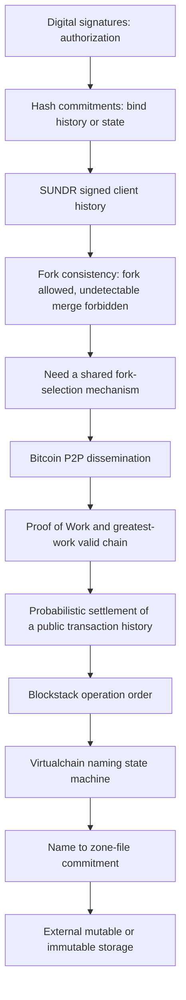

> **范围**：MIT 6.824 Spring 2021 Lectures 18-20，严格按 **SUNDR -> Bitcoin -> Blockstack** 学习。三讲共同追问：当参与者或基础设施不完全可信时，系统如何把授权、历史、分叉选择与数据验证拆成可检查的机制？

## 学习目标

完成本模块后，应能：

1. 定义 SUNDR 的 fetch-modify consistency 与 fork consistency，解释为什么 untrusted storage 可隐藏或分叉 client history，却不能在不被检测的情况下合并已经分歧的 honest-client histories。
2. 推演 SUNDR straw-man 中 signed history、own-last-operation check 与 logged fetch 的作用，并区分 full-history 说明模型、serialized SUNDR 和 concurrent SUNDR。
3. 解释 Bitcoin 论文中的 signatures、Peer-to-Peer broadcast、blocks、Proof of Work 和 greatest-work chain rule 如何共同处理 double spending 与临时 forks。
4. 说明 Bitcoin confirmations 是依赖 honest CPU-power majority 假设的概率保证，不是确定性 finality；区分 history ordering、transaction validity 与 private-key authorization。
5. 解释 Blockstack 如何把 Bitcoin 的全局顺序用作 naming control plane，把 bulk values 放在 routing/storage data plane，并分析 mutable/immutable storage 的 authenticity、freshness、latency 与 availability 权衡。
6. 比较三套系统面对 fork 的不同目标：SUNDR 留下不可抹除的分叉证据，Bitcoin 选择累计工作更大的公共历史，Blockstack 在该历史之上重放应用级 naming state machine。

## 证据边界与来源

本模块只使用课程归档中的指定 readings、官方 lecture notes、FAQs、Paper Questions 和 Lectures 18-20 media。链接入口如下：

| 讲次 | Media / 课堂证据 | 指定阅读 | 官方辅助材料 |
| --- | --- | --- | --- |
| 18 SUNDR | [Part 019](https://www.bilibili.com/video/BV16f4y1z7kn/?p=19)；[课堂 NOTES](/courses/mit-6824-s21/lectures/019/)；[transcript](/assets/courses/mit-6824-s21/lectures/019/transcript.txt) | [Lecture 18 reading guide](/courses/mit-6824-s21/readings/lecture-18/)；[SUNDR paper](/assets/courses/mit-6824-s21/materials/official-materials/papers/li-sundr.pdf)，指定范围为 Abstract、Sections 1-3.4 | [lecture note](/assets/courses/mit-6824-s21/materials/official-materials/lecture-notes/l-sundr.txt)；[FAQ](/assets/courses/mit-6824-s21/materials/official-materials/faqs/sundr-faq.txt)；[Question](/assets/courses/mit-6824-s21/materials/official-materials/questions/18-q-sundr.html) |
| 19 Bitcoin | [Part 020](https://www.bilibili.com/video/BV16f4y1z7kn/?p=20)；[课堂 NOTES](/courses/mit-6824-s21/lectures/020/)；[transcript](/assets/courses/mit-6824-s21/lectures/020/transcript.txt) | [Lecture 19 reading guide](/courses/mit-6824-s21/readings/lecture-19/)；[Bitcoin paper](/assets/courses/mit-6824-s21/materials/official-materials/papers/bitcoin.pdf)；[assigned Nielsen summary](/assets/courses/mit-6824-s21/materials/official-materials/readings/how-the-bitcoin-protocol-actually-works) | [lecture note](/assets/courses/mit-6824-s21/materials/official-materials/lecture-notes/l-bitcoin.txt)；[FAQ](/assets/courses/mit-6824-s21/materials/official-materials/faqs/bitcoin-faq.txt)；[Question](/assets/courses/mit-6824-s21/materials/official-materials/questions/19-q-bitcoin.html) |
| 20 Blockstack | [Part 021](https://www.bilibili.com/video/BV16f4y1z7kn/?p=21)；[summary input](/assets/courses/mit-6824-s21/lectures/021/summary-input.jsonl)；[transcript](/assets/courses/mit-6824-s21/lectures/021/transcript.txt) | [Lecture 20 reading guide](/courses/mit-6824-s21/readings/lecture-20/)；[Blockstack paper](/assets/courses/mit-6824-s21/materials/official-materials/papers/blockstack-atc16.pdf) | [lecture note](/assets/courses/mit-6824-s21/materials/official-materials/lecture-notes/l-blockstack.txt)；[FAQ](/assets/courses/mit-6824-s21/materials/official-materials/faqs/blockstack-faq.txt)；[Question](/assets/courses/mit-6824-s21/materials/official-materials/questions/20-q-blockstack.html) |

总索引见 [MATERIALS](/courses/mit-6824-s21/materials/#lecture-18-fork-consistency-sundr)。Lecture 20 没有聚合 `NOTES.md`，因此本模块不虚构该文件或其中的课堂顺序。

证据使用规则：

- **SUNDR**：协议与 guarantee 只取指定的 Sections 1-3.4。Section 4 以后关于 implementation、performance 和 evaluation 的内容不进入本模块。课堂只逐步讲到 straw-man 与 serialized design 的核心直觉；update certificates、VSL/PVL 和 conflict handling 标为 **paper evidence**。
- **Bitcoin**：2008 paper 是协议、安全假设和公式的 primary source；Nielsen summary 只用于设计直觉。课堂简化了 transaction/block format，也没有逐步推导 Section 11 的全部概率计算。本模块不把 FAQ 的时点数字、后续协议变化或当前市场状态写成原论文事实。
- **Blockstack**：paper 描述 2014-2016 年 Namecoin deployment 与 Blockstack v0.10；其中数量、吞吐、费用和实现结果都只是论文时点证据。FAQ 中关于 Certificate Transparency、用户体验和开发难度的教师判断只作为讨论材料，不冒充论文证明。
- **共同边界**：signature 不自动提供 freshness，hash 不自动提供 availability，blockchain order 不自动提供 application validity。所有 cryptographic claims 都依赖论文陈述的 key、signature 和 collision-resistance 假设。

## 依赖图



先修依赖不能倒置：没有 signature，无法判断谁授权 operation；没有 history/state commitment，旧的合法 signature 可被 replay；SUNDR 说明 fork evidence 后，Bitcoin 才回答开放网络如何聚集到一支；Blockstack 再把该公共顺序用于 naming，而不把 bulk storage 本身放入共识。

---

## Lecture 18：SUNDR

### 1. Untrusted storage 与 client history

SUNDR 提供 remote network file-system interface，但把 server 视为 Byzantine：server 可返回旧数据、隐藏 updates、重排或分叉不同 clients 的 views、与 compromised users 串通，也可拒绝服务。它不能在没有 private key 时伪造 honest user's signature。Honest client 必须按 protocol 验证 signatures、permissions、hashes 和 version/history relations，并保存自己最后接受的 operation/version；user 换 client 时也要携带这份小而关键的 state。（[paper Sections 1-3](/assets/courses/mit-6824-s21/materials/official-materials/papers/li-sundr.pdf)，[reading guide Sections 2-3](/courses/mit-6824-s21/readings/lecture-18/#2-settingtrust-boundary-与目标)）

目标必须拆开：

- **Integrity / consistency detection**：发现 unauthorized modifications 或与已签 commitments 不兼容的 histories。
- **Confidentiality**：不由 assigned SUNDR protocol 提供；server 可读文件内容。
- **Availability**：不提供；恶意 server 可不回复、隐藏 update 或永久隔离 clients。
- **Compromised key**：若 user key 被盗，协议不能把 thief 的 valid signature 与 owner 的 valid signature 区分开。

课堂 Zoobar 例子说明逐文件 authenticity 为什么不等于 filesystem integrity。旧 `auth.py` 和新 `bank.py` 都可能有合法 signatures，但 server 把它们组合起来会破坏“新 bank code 依赖新 authentication code”的历史关系。把 filename 签入只能阻止 object substitution，不能阻止 replay、omission 或跨文件混搭。（[Lecture 18 NOTES](/courses/mit-6824-s21/lectures/019/#逐文件签名为何不够)）

### 2. Fetch-modify consistency 与 fork consistency

诚实 server 下，SUNDR 追求 **fetch-modify consistency**：fetch 应反映所有 happens-before 它的 authorized modifications。这里是论文定义的 high-level fetch/modify consistency，不能扩大成“所有 Unix system calls 都 linearizable”。

恶意 server 下，SUNDR 追求 **fork consistency**：若 client A 接受了 B 的某次 modification，那么至少到该 modification 为止，A 和 B 必须共享同一条 fetch-modify-consistent history。Server 可在共同 prefix 后分叉 views，但一旦 honest users 签下 incompatible commitments，branches 不能在不触发检查失败的情况下重新合并。

```text
                     A2 -> A3 -> ...
common prefix -> A1 /
                   \
                     B2 -> B3 -> ...

允许：server 永久维护不同 branches
禁止：让 A、B 无察觉地重新接受包含双方 fork 后 operations 的单一 history
```

因此 fork consistency 不是 freshness、availability 或自动 resolution。两名 users out-of-band 比较 histories 时，若一条是另一条的 prefix，只能说明观察时间不同；若互不为 prefix，才是 fork evidence。Trusted timestamp box 或 client-to-client communication 可缩短隔离窗口，但引入 trusted online participant 或以暂停访问牺牲 availability。（[paper Section 3.2](/assets/courses/mit-6824-s21/materials/official-materials/papers/li-sundr.pdf)，[FAQ](/assets/courses/mit-6824-s21/materials/official-materials/faqs/sundr-faq.txt)）

### 3. Straw-man：为什么 fetch 也必须签名

Section 3.1 的 straw-man 用 untrusted global lock 串行 operations，并保存完整 signed operation history。每条 record 可抽象为：

$$
e_i=(op_i,u_i,H(e_0\Vert\cdots\Vert e_{i-1}),Sig_{u_i}(op_i,H(prefix_{i-1}))).
$$

Client 每次：取得 lock，下载 history，验证 latest signatures/permissions，确认自己的 previous operation 仍在 history 中，replay filesystem，执行 fetch/modify，append 并签署新的 prefix commitment，再上传 history。Preceding-history hash 防止 server 从中间删除或改写 record；own-last-operation check 防止 server 把同一 user 回滚到其已经签过的过去。

**Logged fetch 是 history safety state，不是 file-content update。** 假设真实 update branch 已是：

```text
P -> A modifies auth.py -> B modifies bank.py
```

若只记录 modify，server 可让 C 第一次 fetch 从 `P` 得到旧 `auth.py`，第二次 fetch 从完整 branch 得到新 `bank.py`。每次返回的都是有合法 signatures 的 prefix；因为第一次 read 没留下 commitment，server 可把已完成的 A/B updates 伪装成发生在两次 reads 之间。

若第一次 fetch 也签入 log，C 留下 `P -> C fetches auth.py`。C 以后要求 history 包含这条 own-last-operation；A/B branch 不含它，而把它插到 A/B 之前又会改变后续 signed prefix。Server 只能维护两个不可无痕合并的 branches。该推导同时解释 fetch-modify consistency 与 fork consistency，不能只用一句“防 rollback”替代。（[Paper Question](/assets/courses/mit-6824-s21/materials/official-materials/questions/18-q-sundr.html)，[课堂推导](/courses/mit-6824-s21/lectures/019/#不记录-fetch-的-stale-prefix-attack)）

### 4. 从完整 history 到 signed snapshots

Straw-man 是故意低效的说明模型，不是最终 implementation：每次 operation 都传输、验证和 replay 无限增长的 history，而且 global lock 串行所有 clients。

**Serialized SUNDR（paper Section 3.3）** 用 content-addressed blocks、per-principal i-tables 和 hash-tree root **i-handle** 承诺 snapshot。User 签署的 version structure 包含 i-handle、相关 group i-handles、各 principal 的 version numbers 和 signature。Version structure list（VSL）中的 entries 按 component-wise order 比较：

$$
x\le y\iff\forall p,\ x[p]\le y[p].
$$

正常 serialized history 要求 structures 可 total order；若 $x\nleq y$ 且 $y\nleq x$，它们承诺 incompatible snapshots。Version vector 同时记录跨-principal dependency，例如 B 的 structure 含 `A:1`，就不能把 B 的 state 与 A version 0 组合起来。

**Concurrent SUNDR（paper Section 3.4）** 在 client 取得 VSL 前先签 update certificate；server 同时返回 VSL 和 pending version list（PVL）。无冲突 operations 可并行；fetch 遇到 pending write 要等 writer commit 后再向 application 返回，共享 group i-table 的 concurrent writes 要合并 deltas，并在 version structure 中承诺 pending references，避免 server 丢掉尚未 commit 的 operation。

这段并发算法来自 assigned paper，不是课堂逐步推演。它以更复杂的 pending-state validation 和 conflict handling，换掉全局 lock 对无关 operations 的串行化。（[reading guide Sections 7-9](/courses/mit-6824-s21/readings/lecture-18/#7-33-serialized-sundr由历史转为-signed-snapshots)）

### 5. SUNDR 保证检查

| 检查/机制 | 能建立的事实 | 不能建立的事实 |
| --- | --- | --- |
| User signature | Operation 由对应 key 授权 | Data 是 latest；key 未被盗 |
| Preceding-history hash | 已签 prefix 不能无痕插删改 | Server 必须展示未知 suffix |
| Own-last-operation | 同一 user 的 accepted history 单调延伸 | 不同 users 自动共享最新 view |
| Logged fetch | Client 观察过的 prefix 成为 commitment | Fetch 改变 file contents |
| Fork consistency | Divergent honest histories 不能无痕 merge | Fork 不发生；fork 自动解决 |
| i-handle/version vector | 紧凑承诺 snapshot 和跨-user dependencies | Confidentiality 或 availability |

### 6. Paper Question

> Secure Untrusted Data Repository (SUNDR) In the simple straw-man, both fetch and modify operations are placed in the log and signed. Suppose an alternate design that only signs and logs modify operations. Does this allow a malicious server to break fetch-modify consistency or fork consistency? Why or why not?

作答时分别判断两个 consistency properties；至少构造两个有 dependency 的 files 和一个分两次 fetch 的 client；检查攻击不需要伪造 signature 或制造 hash collision；最后加入 logged fetch，指出 own-last-operation 与后续 prefix signatures 在哪一步迫使 histories 分叉。不要把两种 consistency 合成一个 yes/no。（[官方 Question](/assets/courses/mit-6824-s21/materials/official-materials/questions/18-q-sundr.html)）

---

## Lecture 19：Bitcoin

### 1. 从“检测 fork”到“选择公共 history”

SUNDR 能约束恶意 storage 对 client histories 的分叉方式，却没有让彼此隔离的 clients 自动选出共同 branch。Bitcoin 论文研究另一问题：开放 Peer-to-Peer network 没有可信 mint 或已知 membership，participants 仍要对 transactions 的 public order 达成足够稳定的一致。

Digital signature 只证明 owner 授权 transfer。Owner 可以对两个引用同一 prior output 的 transfers 都合法签名：

```text
T_prev -> T_pay_Bob
       -> T_pay_Charlie
```

因此 double spending 是 **publishing and ordering** 问题。Nodes 必须看到 public history，并按其中先被接受的 spend 判断后续冲突 spend 无效。Signature 提供 authorization；ledger order 提供 unique spend decision。（[Bitcoin paper Sections 1-2](/assets/courses/mit-6824-s21/materials/official-materials/papers/bitcoin.pdf)，[FAQ](/assets/courses/mit-6824-s21/materials/official-materials/faqs/bitcoin-faq.txt)）

### 2. Peer-to-Peer protocol 与 Proof of Work

Paper Section 5 的 network steps 是：

1. New transactions broadcast to nodes。
2. 每个 node 把收到的 transactions 收入自己的 candidate block。
3. Nodes 为 candidate block 寻找 Proof of Work。
4. 找到 work 后向 peers broadcast block。
5. Nodes 只在 block 中 transactions valid 且未 double-spent 时接受它。
6. Nodes 在其后继续工作，以此表达对该 block 的 acceptance。

课堂把传播具体化为 mesh 上的逐跳 flooding：每个 peer 只连少量 peers，transactions/blocks 经 forwarding 扩散；各 node 的 local transaction pool 不必相同，winning valid block 才决定该高度纳入的 ordered contents。（[Lecture 19 NOTES](/courses/mit-6824-s21/lectures/020/#peer-to-peer-dissemination)）

Block 把 previous block hash、transaction commitment 和 nonce/work-related fields 绑定在一起。改旧 block 会改变其 hash并破坏 descendants 的 previous-hash links；攻击者若要让改写 branch 获胜，必须重做该 block 后的 work 并超过 public branch。

PoW 寻找满足 difficulty target 的 nonce。生成需要许多 trials，验证便宜。它在开放成员系统中把 representation 近似绑定到 CPU work，而不是可廉价制造的 identity 或 IP 数量。Paper 称 nodes 选择 longest chain，准确的 invariant 是选择 **累计 Proof of Work 最大的 valid chain**；work 不会使 invalid transaction 变 valid。（[paper Sections 3-5](/assets/courses/mit-6824-s21/materials/official-materials/papers/bitcoin.pdf)）

### 3. Fork、greatest-work rule 与 confirmations

两个 nodes 近同时找到 valid next block，或 network delay 让 miners 尚未看到另一块，就会产生 ordinary temporary fork。这不自动表示攻击。Nodes 暂时在 first-seen branch 上工作并保留另一支；当一支积累更多 work 时，nodes 切换到它。

切链意味着旧 branch 独有 transactions 不再 confirmed；未与 winning branch 冲突的 transaction 可能以后重新入块。Application 因而必须区分：已 broadcast、进入某 block、已有若干 descendants。

Recipient 等待 $z$ 个后续 blocks，是用 latency 换较低 reversal probability。Paper Section 11 设 honest network 找到 next block 的概率为 $p$，attacker 为 $q$，其追平概率的简化结果为：

$$
q_z=
\begin{cases}
1,&p\le q\\
(q/p)^z,&p>q.
\end{cases}
$$

所以 confirmations 不是固定数量后的绝对 finality。结论依赖 honest nodes collectively control more CPU power than cooperating attackers、hash/signature assumptions 和 paper 的 stochastic model；当 $p\le q$ 时，增加 $z$ 不恢复同一安全结论。课堂定性讲 confirmations，完整概率推导属于 paper evidence。（[reading guide Sections 5 and 9](/courses/mit-6824-s21/readings/lecture-19/#5-network-protocolfork-与概率最终性)）

### 4. Validity、安全和存储边界

- **Majority work 不替代 signature**：attacker 可尝试重组 recent history、double-spend 自己的 payment 或 censor transactions，但不能在没有 victim private key 时签走 victim's outputs。
- **Private-key theft 是另一 failure**：协议无法区分 thief 与 owner 产生的 valid signatures。
- **Merkle branch 只证明 inclusion**：它把 transaction 连到某 block root；还要检查 header chain/work 与 transaction validity，才能判断其在 accepted history 中的地位。
- **SPV 改变 trust assumption**：SPV client 保存 greatest-work header chain 并索取 Merkle branch，不自行验证完整 transaction history；以较小 storage/verification 换更强的 network/honest-node assumption。
- **Public keys 不等于 confidentiality/anonymity**：paper 提出 key rotation 的 privacy heuristic，也指出 multi-input linkage；assigned summary 警告 public history 可被回溯关联。本模块不作更广泛或当前状态主张。

Paper 的 block subsidy 与 transaction fees 用来解释 miners 为什么投入 work；这是 incentive argument，不是“所有参与者必然诚实”的证明。PoW 还带来 computation/energy cost，传播与 block interval/size 又在 throughput、latency、bandwidth、independent validation cost 和 fork rate 之间形成权衡。这里只保留 paper、lecture 和 FAQ 支持的设计关系，不加入课程外的 cryptocurrency claims。（[paper Sections 6-10](/assets/courses/mit-6824-s21/materials/official-materials/papers/bitcoin.pdf)，[lecture note](/assets/courses/mit-6824-s21/materials/official-materials/lecture-notes/l-bitcoin.txt)）

### 5. Bitcoin 保证检查

| 检查/机制 | 能建立的事实 | 不能建立的事实 |
| --- | --- | --- |
| Transaction signature | Prior owner 授权 transfer | Owner 没有签冲突 spend |
| Public block order | 哪个 spend 在 accepted history 中先出现 | History 立即不可逆 |
| Transaction validation | Block contents 遵守节点规则 | Miner 因做 work 可绕过规则 |
| PoW + greatest-work valid chain | 给 competing valid histories 一个开放式选择规则 | Deterministic finality；attacker 永远追不上 |
| Confirmations | 在 $q<p$ 模型下逐步降低 reversal probability | 固定深度后风险为零 |
| Merkle proof / SPV | Compact inclusion 与 header-chain evidence | Full-node 等价的独立验证 |

### 6. Paper Question

> Bitcoin Try to buy something with Bitcoin. It may help to cooperate with some 6.824 class-mates, and it may help to start a few days early. If you decide to give up, that's OK. Briefly describe your experience.

这是 experiential assignment，不能由 paper 虚构答案。记录实际尝试的步骤和 observations，并区分 wallet/service/policy 层与 paper protocol 层；不要提交 private key、seed phrase 或不必要的身份与 transaction metadata。失败也可以如实说明停在哪一步。（[官方 Question](/assets/courses/mit-6824-s21/materials/official-materials/questions/19-q-bitcoin.html)）

---

## Lecture 20：Blockstack

### 1. 从公共 history 到 global naming

Blockstack 需要同时提供：

1. **Unique**：conforming replicas 对同一 global name 选择同一 owner；
2. **Human-readable**：names 可被人记忆和传递；
3. **Decentralized**：没有 central trusted registry 或 single point of failure。

难点是开放 namespace 中的冲突顺序：两人 claim 同一 readable name 时，系统必须给所有 replicas 同一 winner。Central hierarchy 易给 total order 却不 decentralized；random public key/content hash 可 unique+decentralized 却不可读；local contact alias 可 readable+decentralized，却不 global unique。Blockstack 借 underlying blockchain 给 operations 排序，再由 virtualchain rules 决定 first valid registration 与后续 ownership state。（[Blockstack paper Sections 1-2](/assets/courses/mit-6824-s21/materials/official-materials/papers/blockstack-atc16.pdf)，[Paper Question](/assets/courses/mit-6824-s21/materials/official-materials/questions/20-q-blockstack.html)）

Protocol name ownership只证明某 key 按规则控制该 string，不证明该 key holder 的 real-world identity。`rtm@mit.edu` 这样的 readable string 不能仅凭 first registration 证明现实中的人或机构。（[FAQ PKI discussion](/assets/courses/mit-6824-s21/materials/official-materials/faqs/blockstack-faq.txt)）

### 2. Namecoin lessons 与 architecture

Paper 先报告 Namecoin production experience：majority mining concentration、network reliability/transaction exclusion、consensus-breaking upgrade friction 和 merged-mining subset participation，都说明 naming security 继承 underlying chain 的 security、reliability 与 governance constraints。论文由此选择当时 attack cost 更高、维护更活跃的 Bitcoin chain，并避免修改 Bitcoin consensus rules。以上是 2014-2016 deployment evidence，不是 2026 状态。（[paper Section 3](/assets/courses/mit-6824-s21/materials/official-materials/papers/blockstack-atc16.pdf)）

Blockstack 把系统分成四层：

| Plane | Layer | 职责 |
| --- | --- | --- |
| Control | Blockchain | 排序 Blockstack operations，对底层 history 达成 consensus |
| Control | Virtualchain | 解析 metadata，验证 operation，重放 naming state machine |
| Data | Routing | 保存 zone files，把 name 指向 URI/hash；control plane 承诺 zone-file hash |
| Data | Storage | 在 S3、IPFS、Syndicate 等 external stores 保存 bulk values，由 signatures/hashes 验证 |

Bitcoin nodes 只验证 raw transactions，不理解 naming semantics。Blockstack nodes 从同一 accepted blockchain history 提取 candidate operations，按 deterministic virtualchain rules 过滤 invalid ones，再执行 `PREORDER -> REGISTER -> UPDATE/RENEW/TRANSFER/REVOKE/EXPIRE` 等 transitions。Blockchain 提供 order；virtualchain 提供 application validity。若 Blockstack software versions 使用不兼容 rules，即使底层 Bitcoin history 相同，application state 也可能 fork。（[paper Sections 4.2-4.4](/assets/courses/mit-6824-s21/materials/official-materials/papers/blockstack-atc16.pdf)）

### 3. Naming 与 storage 的关键权衡

Control/data separation 的核心 invariant 是：

```text
accepted blockchain history + deterministic virtualchain rules
    -> name owner and zone-file hash

zone-file commitment + owner key/hash checks
    -> externally stored value can be verified
```

它把 slow, fee-limited global order 留给 small naming transitions/hashes，把 large or frequently changing values 放到 external storage。收益是 arbitrary-size data、多 backend 和不必每次 data write 都走 blockchain；代价是 blockchain 不能强迫 provider 返回 bytes，也不自动证明 mutable response 是 latest。

**Mutable storage**：zone file 给 data URI，value 由 owner's key 签名。Update 只需 sign/upload，不发 blockchain transaction，latency 取决于 storage backend；但 old value 的 signature 仍有效，所以 provider 可 replay stale data，client 还需要 versioning policy。

**Immutable storage**：zone file 同时承诺 `hash(data)`。Client 可验证 exact version，但每次 data change 都要更新 zone-file hash并提交 underlying blockchain transaction，因此 write 回到较慢、付费的 control-plane path。

| 性质 | 主要机制 | 仍未解决的边界 |
| --- | --- | --- |
| Ownership/order | Blockchain order + virtualchain validation | Underlying-chain reorg；software-rule fork |
| Authenticity/integrity | Owner signature；zone/data hash | Stolen key；malicious app 可签坏数据 |
| Freshness | Immutable hash binding 或 mutable version policy | Mutable store 可 replay old signed value |
| Availability/durability | External provider/replication | On-chain hash 不能提供 missing bytes |
| Real-world identity | 课程未给出完整机制 | Name ownership 不证明现实身份 |

### 4. Preorder、consistency hash 与 SNV

直接 broadcast desired readable name 会暴露它，observer/miner 可抢先提交。Blockstack 先 PREORDER commitment，再 reveal/register；commitment 不能只是容易字典枚举的裸 `hash(name)`。本模块不从课堂简化口述推断论文未完整给出的 wire fields。

Blockstack consistency hash 让 nodes 比较 virtualchain history/state，并支持 Simplified Name Verification（SNV）：

$$
CH(h)=hash(V_h+P_h),
$$

其中 $P_h$ 包含按 powers of two 回看的 previous consistency hashes，形成 skip-list-like commitment。Consistency hash 不阻止所有 fork；它使 software-rule/view divergence 留下可比较 evidence，并支持 logarithmic historical proof links。

Fast bootstrap 可使用 untrusted state snapshot 加一个 **trusted authentic** $CH(h)$ 验证结果，再从该 height 继续。它把 trust 移到 checkpoint authenticity，而不是消灭 trust。SNV 也不提供 storage bytes 的 availability、mutable data freshness 或 real-world identity truth。（[paper Section 4.5](/assets/courses/mit-6824-s21/materials/official-materials/papers/blockstack-atc16.pdf)，[FAQ consistency hash](/assets/courses/mit-6824-s21/materials/official-materials/faqs/blockstack-faq.txt)）

### 5. 应用与开发边界

课堂比较 traditional app+database 与 user-controlled app+general storage。Blockstack 形状有利于 user control、provider/app portability 和 client-side encryption，但 key/value storage 缺少 SQL/global queries；shared encryption、revocation、site-owned/public aggregate data、server-side secrets 和 auction-style hidden inputs 都更难。Client-side execution 也不意味着 app code 可信：app 能读取的 data 仍可能被 app 泄露。（[lecture note](/assets/courses/mit-6824-s21/materials/official-materials/lecture-notes/l-blockstack.txt)，[FAQ developer discussion](/assets/courses/mit-6824-s21/materials/official-materials/faqs/blockstack-faq.txt)）

Paper 的 S3 I/O、SNV bootstrap、Namecoin anomalies 和 migration measurements 支持特定 implementation/deployment claims，不能证明 decentralized applications 整体与 centralized sites 一样快、可用、私密或易开发。

### 6. Blockstack 保证检查

| 检查/机制 | 能建立的事实 | 不能建立的事实 |
| --- | --- | --- |
| Underlying blockchain | Raw operation 的共享顺序 | Blockstack operation 有效 |
| Virtualchain replay | 按特定 rules 得到 naming state | 不同 software rules 永不分叉 |
| Preorder/register | 减少公开 desired name 后的抢先注册 | 证明 registrant 的现实身份 |
| Zone-file hash | Routing record 与 control-plane commitment 一致 | URI 一定可访问 |
| Mutable data signature | Value 由 owner key 签署 | Response 是 latest |
| Immutable data hash | Response 是 committed exact version | Fast/off-chain update |
| Consistency hash/SNV | 比较/验证 virtualchain history | 无 trust anchor 的 universal bootstrap |

### 7. Paper Question

> Why is it important that Blockstack names be unique, human-readable, and decentralized? Why is providing all three properties hard?

作答时分别定义三项属性，给出缺失每项时的 concrete failure，再用 central hierarchy、random key/content hash 和 local aliases 构造 two-of-three examples。最后把 conflict order 映射到 underlying blockchain、virtualchain first-valid registration、preorder 与 fee，并明确 protocol ownership 不等于 real-world identity。（[官方 Question](/assets/courses/mit-6824-s21/materials/official-materials/questions/20-q-blockstack.html)）

---

## 三讲比较矩阵

| 维度 | SUNDR | Bitcoin | Blockstack |
| --- | --- | --- | --- |
| 核心对象 | Remote filesystem 的 client-observed history/state | Public transaction history | Global name ownership/state + external values |
| 不可信方 | Byzantine storage server，可与 compromised users 串通 | 开放 P2P participants 与 cooperating attacker | Underlying chain participants、Blockstack peers、routing/storage providers |
| 身份/授权 | Per-user signatures 与 filesystem permissions | Prior-owner transaction signatures | Name-owner key/address 与 signed updates/data |
| History commitment | Signed operation prefix；i-handle/version structures | Previous-block hashes + transaction commitment + PoW | Underlying blockchain order + consistency hashes |
| Fork 目标 | Fork 可发生；honest histories 不可无痕 merge | Competing valid branches按累计 work 选择并概率收敛 | 借底层 chain order；检测 virtualchain software/view forks |
| Membership | Known users/keys in filesystem context | Open membership；PoW 抵抗按 identity 计票的 Sybil | Blockstack rules 跑在开放 underlying chain 之上 |
| Freshness | Own-last-operation 阻止 self rollback；不保证看见未知 update | Confirmations 降低 recent history reversal risk | Mutable data 需 version policy；immutable hash 绑定 exact version |
| Availability | 恶意 server 可拒绝服务 | Paper network 假定足够传播/诚实 work；不作一般 availability guarantee | External store 可 outage；on-chain hash 不能返回 data |
| 一致性强度 | Fetch-modify consistency（honest server）；fork consistency（malicious server） | 依 honest CPU majority 的 probabilistic common history | Deterministic state machine relative to accepted chain/rules；可有应用层 fork |
| 主要扩展代价 | Full history/global lock，或 version/PVL metadata complexity | PoW resource cost、propagation/latency/throughput tradeoff | Slow/fee-limited control changes；storage freshness/availability 与 developer complexity |
| 不能推出 | Confidentiality、availability、automatic fork resolution | Absolute finality、key safety、work 可使 invalid spend 有效 | Real-world identity、data availability、mutable freshness、app correctness |

## 跨讲推导

1. **SUNDR 建立“历史本身是安全状态”**：只签 object 不够；client 必须承诺自己看见的 prefix，才能把 rollback/selective presentation 变成不可合并 fork。
2. **Bitcoin 增加公共 fork selection**：double spend 显示合法 signatures 仍会冲突；P2P dissemination 让候选 histories 可见，PoW 与 greatest-work valid-chain rule 让开放参与者有共同选择准则。
3. **Blockstack 复用 order 而不复用 storage model**：它不为 naming 新造小链，而把 Blockstack operations 放进 underlying chain，再以 virtualchain 解释；bulk data 留在外部，以 signatures/hashes 验证。
4. **每一步都保留前一步的边界**：Bitcoin common history 不保护 wallet key；Blockstack blockchain binding 不提供 storage availability；SUNDR/Blockstack 的 signatures 都不能让 old signed data 自动变 stale-invalid。

## FAQ

### 1. SUNDR 为什么不能直接让 clients 永远看到同一 view？

完全恶意 server 可把互不通信的 users 隔离。B 若不知道 A 曾上线更新，就无法区分“server 隐藏 A update”与“A 从未更新”。SUNDR 把能力上限设为 fork 后不能无痕 merge；加强保证需要 trusted online state 或 client-to-client evidence。（[SUNDR paper Section 3.2](/assets/courses/mit-6824-s21/materials/official-materials/papers/li-sundr.pdf)）

### 2. Fetch 不改数据，为什么还要进入 signed history？

因为它改变 client 的安全状态：记录 client 已观察哪个 prefix。没有该 record，server 可让相继 reads 分别基于旧 prefix 和新 history，并把已经完成的 updates 伪装成发生在 reads 之间。（[SUNDR Question](/assets/courses/mit-6824-s21/materials/official-materials/questions/18-q-sundr.html)）

### 3. SUNDR fork 与 Bitcoin fork 是同一概念吗？

两者都是共同 prefix 后出现 incompatible histories，但处理目标不同。SUNDR 允许恶意 server 永久隔离 branches，只保证不能无痕 merge；Bitcoin 的 ordinary fork 可由并发出块/传播延迟自然产生，nodes 用累计 work 选择 branch，获得概率收敛。

### 4. Bitcoin 为什么不能只靠 signatures？

Owner 可对两个冲突 spends 都正确签名。Signature 回答“谁授权”，public ordered history 回答“哪个 spend 先被 accepted”。（[Bitcoin FAQ](/assets/courses/mit-6824-s21/materials/official-materials/faqs/bitcoin-faq.txt)）

### 5. PoW 是否让 miner 的 block 自动有效？

否。Nodes 仍检查 transactions valid 且未 double-spent。PoW 在 valid competing histories 之间提供 work-weighted branch selection；它不覆盖 application validity 或 signature rules。（[Bitcoin paper Section 5](/assets/courses/mit-6824-s21/materials/official-materials/papers/bitcoin.pdf)）

### 6. Confirmations 何时“足够”？

课程材料不给 universal threshold。等待深度是 latency/risk policy；风险依 attacker work share、paper assumptions、transaction value 与 goods reversibility。固定数字不是 deterministic theorem。（[Lecture 19 reading guide](/courses/mit-6824-s21/readings/lecture-19/#5-network-protocolfork-与概率最终性)）

### 7. 为什么 Blockstack 不把所有 data 都放进 blockchain？

Global consensus path slow、capacity/fee constrained。Control/data separation 让 chain 只排序 naming transitions 和 hashes，bulk values 可快速写入多种 stores；代价是 external availability 与 mutable freshness 要另行处理。（[Blockstack paper Section 4.2](/assets/courses/mit-6824-s21/materials/official-materials/papers/blockstack-atc16.pdf)）

### 8. Mutable data 已有 owner signature，provider replay 旧值为什么仍能通过？

Signature 证明 owner 曾签过该 value，不证明它是 latest。Reader 需要 version policy；或改用 immutable hash binding，但那会让每次更新重新走 blockchain path。（[Blockstack paper Section 4.3.4](/assets/courses/mit-6824-s21/materials/official-materials/papers/blockstack-atc16.pdf)）

### 9. Blockstack name 是否证明现实身份？

否。它证明某 key 按 protocol 获得 string ownership。如何确认该 key holder 就是目标 person/email/organization 仍是 PKI/key-discovery 问题。（[Blockstack FAQ](/assets/courses/mit-6824-s21/materials/official-materials/faqs/blockstack-faq.txt)）

### 10. Consistency hash 是否阻止 Blockstack software fork？

否。它承诺并帮助比较 virtualchain histories，使不一致可检测并支持 SNV；不同 validation rules 或 versions 仍可能产生分叉。（[Blockstack FAQ](/assets/courses/mit-6824-s21/materials/official-materials/faqs/blockstack-faq.txt)）

## Mastery Gates

### Gate 1：SUNDR history reasoning

通过标准：不看笔记画出 `P`、A/B modify branch 和 C fetch branch；逐步解释为什么只签 modify 会让 stale-prefix attack 通过，为什么 logged fetch + own-last-operation 把攻击限制为 permanent fork；再用一句话区分 fetch-modify consistency 与 fork consistency。

### Gate 2：Bitcoin protocol reasoning

通过标准：从两笔正确签名的 conflicting spends 开始，写出 transaction broadcast、candidate block、PoW、block validation、temporary fork、greatest-work switch 和 confirmations 的完整路径；明确指出 honest CPU majority assumption，以及 majority work 能做和不能做的各一项行为。

### Gate 3：Blockstack layering reasoning

通过标准：从两个 users claim 同一 name 开始，追踪 PREORDER/REGISTER、underlying blockchain order、virtualchain validation、zone-file hash 和 external read；分别说明 mutable 与 immutable update path，并对 authenticity、freshness、availability 各给出机制和失败例。

### Gate 4：Cumulative comparison

通过标准：面对一个“签名数据放在不可信 store，并用公共 ledger 管理 human-readable names”的新系统，能先问 trust boundary、history commitment、fork rule、validity rule、freshness、availability 和 key compromise 七个问题；答案中不把三讲的保证相互借用。

## 15 组累计问答

1. **问：为什么 valid per-file signatures 仍可能形成 invalid filesystem state？**  
   **答：** Server 可 replay old signed versions、隐藏文件或混合各自合法但历史上不兼容的 versions；signature 只证明 writer authorization，不证明 freshness、completeness 或 cross-file dependency。

2. **问：SUNDR own-last-operation check 的精确作用是什么？**  
   **答：** 它要求 user 的下一次 accepted history 包含自己上次签过的 operation，从而防止对该 user 的 rollback；它不能强迫 server 展示其他 users 尚未被该 user 知道的 updates。

3. **问：Fork consistency 禁止什么、允许什么？**  
   **答：** 它禁止已经分歧的 honest-client histories 无检测地重新合并；允许 malicious server 分叉、隐藏 updates、永久隔离 branches 或拒绝服务。

4. **问：为什么 logged fetch 能改变 server 的攻击空间？**  
   **答：** 它把“client 已看见 prefix P”变成 signed commitment；后续 history 必须延伸该 record，无法再把另一个早已签好的 update branch伪装成同一连续 history。

5. **问：Serialized 与 concurrent SUNDR 各解决 straw-man 的什么成本？**  
   **答：** Serialized SUNDR 用 hash-tree snapshots/version structures 代替 full-history transfer/replay；concurrent SUNDR 再用 update certificates 和 PVL 允许无冲突 operations 并行，但增加 pending-state validation 和 conflict handling。

6. **问：为什么 transaction signature 不能单独防 double spending？**  
   **答：** Owner 可正确签署两笔消费同一 prior output 的 transactions；需要共同 ordered history 决定哪笔先消费并使另一笔冲突。

7. **问：Peer-to-Peer flooding 与 block consensus 分别负责什么？**  
   **答：** Flooding 让 transactions/blocks 逐跳传播，且每个 node 的 local pool 可不同；valid winning block 及其 chain position才决定 accepted ordered contents。

8. **问：PoW 如何应对开放 membership 的 Sybil 问题？**  
   **答：** 它按可验证 computation 而不是 identity 数量分配找到 next block 的机会；创建更多名字不能免费增加 work share。

9. **问：为什么 ordinary Bitcoin fork 不一定是攻击？**  
   **答：** Network delay 或 miners 近同时找到 valid blocks 就会自然产生 temporary branches；后续累计 work 通常使 nodes 聚集到一支。

10. **问：Confirmations 提供什么形式的 finality？**  
    **答：** 在 attacker work share 小于 honest share 的 paper model 下，更多 descendants 使追赶概率下降；它是 probabilistic risk reduction，不是固定深度后的绝对不可逆。

11. **问：Majority work 为什么仍不能直接花 victim's output？**  
    **答：** Nodes 仍验证 transaction signatures；work 可帮助重组/censor 或 double-spend attacker's own payment，却不能生成 victim private key 所需的 authorization。

12. **问：Blockstack 为什么需要 blockchain 和 virtualchain 两层？**  
    **答：** Underlying blockchain 给 raw operations 一个共享顺序；virtualchain 解释 metadata、检查 naming-specific validity 并执行 state transitions。底层 miners 不理解 Blockstack semantics。

13. **问：Blockstack control/data split 得到了什么，又失去了什么？**  
    **答：** 它让 bulk data 大而可快写、backend 可替换；但 external store 的 availability 和 mutable response freshness 不由 blockchain 自动保证。

14. **问：Mutable 与 immutable Blockstack storage 的核心交换是什么？**  
    **答：** Mutable value 只需 owner sign/upload，快但 old signed value 可 replay；immutable mode 以 on-chain-linked hash 绑定 exact version，freshness assurance 更强但 update 慢且要走 transaction path。

15. **问：三讲对 fork 的答案如何串联？**  
    **答：** SUNDR 让 client-specific forks 不可无痕 merge；Bitcoin 用 P2P PoW history在开放网络选择累计工作更大的 valid branch；Blockstack 复用该 order 重放 naming state，并用 consistency hashes 暴露自身 rule/view forks。

## Review Plan

### Pass 1：建立三条最小链

1. SUNDR：`per-file signature -> signed history -> logged fetch -> permanent fork`。
2. Bitcoin：`signed conflicting spends -> P2P publication -> PoW blocks -> greatest-work valid chain -> confirmations`。
3. Blockstack：`name conflict -> blockchain order -> virtualchain state -> zone-file commitment -> external storage`。

每条链都写一列“mechanism proves”与一列“does not prove”。

### Pass 2：重做三道 Paper Questions

先独立完成 [SUNDR Question](/assets/courses/mit-6824-s21/materials/official-materials/questions/18-q-sundr.html) 的两种 consistency 判断；再如实记录 [Bitcoin experiential Question](/assets/courses/mit-6824-s21/materials/official-materials/questions/19-q-bitcoin.html)，不虚构经历；最后用 three two-of-three examples 回答 [Blockstack Question](/assets/courses/mit-6824-s21/materials/official-materials/questions/20-q-blockstack.html)。

### Pass 3：画 fork 与 layer diagrams

画一张 SUNDR permanent fork、一张 Bitcoin temporary fork 和一张 Blockstack control/data architecture。对每张图标出 trust boundary、signed/hashed commitment、branch rule、freshness source 与 availability failure。

### Pass 4：闭卷过 Gates

依次完成四个 Mastery Gates，再回答 15 组累计问答。任何答案若出现“signature 所以 latest”“blockchain 所以 available”“six confirmations 所以 irreversible”或“name owner 所以现实身份已验证”，回到对应 evidence section 重做。

### Pass 5：Source audit

最后按 [MATERIALS](/courses/mit-6824-s21/materials/#lecture-18-fork-consistency-sundr) 顺序核对 Lectures 18-20：SUNDR 不越过 Section 3.4；Bitcoin 区分 paper、Nielsen summary、lecture 和 FAQ；Blockstack 把 deployment numbers 视为 2014-2016 evidence。删除任何无法落回这些课程来源的 cryptocurrency claim。
