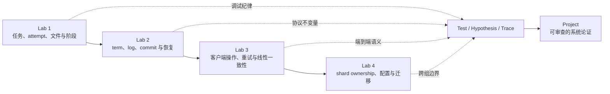

> **定位**：这是一份方法论模块，不是 Lab 题解。它综合 Lab 1-4 的概念递进、Lecture 6/8 的 Q&A、Lecture 21 的项目展示与阅读审计，以及课程归档的官方 Lab/Project 页面。本文不提供可提交代码、RPC handler 结构、状态字段清单、timer 参数、文件命名方案或隐藏测试推断。
>
> **核心问题**：面对一个并发、崩溃、消息丢失和重试交织的系统，怎样用 test、hypothesis、invariant 与 trace 建立可证伪的解释；又怎样把同样的证据纪律用于课程项目的设计、评估和展示？

## 1. 来源、证据层级与使用边界

### 1.1 核心课堂与阅读

- [Lecture 6: Lab 1 Q&A NOTES](/courses/mit-6824-s21/lectures/006/) 与 [reading 06](/courses/mit-6824-s21/readings/lecture-06/)：任务生命周期、阶段屏障、文件发布、等待、超时重发、本地同步与 RPC 边界。
- [Lecture 8: Lab 2A/2B Q&A NOTES](/courses/mit-6824-s21/lectures/008/) 与 [reading 08](/courses/mit-6824-s21/readings/lecture-08/)：`test -> hypothesis -> trace` 调试闭环、结构化日志、锁与阻塞边界、迟到 reply、协议不变量和 race detector 的证据范围。
- [Lecture 21: Project Presentations NOTES](/courses/mit-6824-s21/lectures/022/) 与 [reading 21](/courses/mit-6824-s21/readings/lecture-21/)：项目 problem/mechanism/evaluation/limitation 的拆分，以及对不可信论文、演示和性能 claim 的证据审计。
- [LABS.md](/courses/mit-6824-s21/labs/)：Lab 1-4 的官方实践路线、阶段门禁、测试边界和 optional project 定位。

### 1.2 官方归档入口

- [Lab guidance](/assets/courses/mit-6824-s21/materials/official-materials/labs/guidance.html)
- [Collaboration policy](/assets/courses/mit-6824-s21/materials/official-materials/labs/collab.html)
- [Lab 1: MapReduce](/assets/courses/mit-6824-s21/materials/official-materials/labs/lab-mr.html)
- [Lab 2: Raft](/assets/courses/mit-6824-s21/materials/official-materials/labs/lab-raft.html)
- [Lab 3: Fault-tolerant Key/Value Service](/assets/courses/mit-6824-s21/materials/official-materials/labs/lab-kvraft.html)
- [Lab 4: Sharded Key/Value Service](/assets/courses/mit-6824-s21/materials/official-materials/labs/lab-shard.html)
- [Optional final project](/assets/courses/mit-6824-s21/materials/official-materials/project/project.html)

归档的 Lab 4 与 Project 页面页眉写着 Spring 2020，但链接和本仓库的课程时间线对应 Spring 2021。涉及当年日期时以 [LABS.md](/courses/mit-6824-s21/labs/) 汇总的 Spring 2021 schedule 为准；本模块关注长期有效的方法与要求，不把历史日期当作今天的截止时间。

### 1.3 证据层级

本模块按以下顺序解释材料：

1. **官方 contract**：Lab/Project 页面明确要求的接口、性质、测试面和提交物。
2. **课堂方法**：Q&A 中用于推理、调试和评审的步骤；课堂展示的个人结构不是唯一答案。
3. **学生项目证据**：presentation 中明确展示、测量或承认的内容。
4. **推导与反思**：从前三层抽出的通用方法，必须保留 assumptions 与适用边界。

下列词不能互换：

```text
proposed != implemented != demonstrated != tested
         != measured != proved != deployed
```

一次 demo 可以证明“这条演示路径在这次运行中出现了某个结果”；它不能自动证明 failure coverage、性能上限、线性一致性、安全性或生产可用性。一次测试通过也只是没有被该次测试反驳，不是协议正确性的完整证明。

## 2. 协作政策与非题解边界

[官方 collaboration policy](/assets/courses/mit-6824-s21/materials/official-materials/labs/collab.html) 要求每位学生独立编写提交的 Lab 代码，不得查看他人当前或往年解答；可以讨论概念，但不得查看、使用或复制彼此代码，也不得公开发布 Lab 解答。公开 GitHub 仓库默认可见，因此个人 Lab 仓库应保持私有。

本模块允许并鼓励讨论：

- 官方接口、测试场景、failure model 与 consistency contract；
- protocol invariant、trace 字段、可证伪 hypothesis 和实验设计；
- 某个现象可能属于 race、deadlock、stale reply、错误 ownership 或错误 evidence 的分类；
- 项目的 problem、threat model、evaluation method、限制和展示方式。

本模块明确不提供或索取：

- 可直接提交的实现、伪代码骨架或字段/handler 配方；
- 他人仓库、往年答案、完整日志加源码的逐行修复；
- 从测试器反推隐藏答案、绕过 grader 或只为 pass 而设计的特殊路径；
- “标准 timer”“唯一锁布局”“正确 RPC 数量”等脱离个人设计的答案。

Optional project 是经批准的 2-3 人团队协作；个人 Labs 的独立完成政策并未因此取消。项目页说明课程项目代码和 write-up 会在学期结束后发布，这不构成公开个人 Lab 解答的许可。

## 3. 一条贯穿 Lab 1-4 的概念主线

四个 Labs 不是四个孤立系统，而是在逐层扩大“必须保持一致的事实”范围：



### 3.1 Lab 1：先区分 logical work、execution attempt 与 published result

[Lab 1 官方页](/assets/courses/mit-6824-s21/materials/official-materials/labs/lab-mr.html) 的系统由 coordinator 与并行 workers 组成。它第一次迫使学习者处理三种不同事实：

- **Logical task**：Map 或 Reduce 工作本身的身份。
- **Execution attempt**：某个 worker 对该任务的一次尝试；超时重发后可有重叠 attempts。
- **Published result**：后续阶段或最终用户能安全观察的完整文件结果。

Lecture 6 把设计审查顺序组织为：通信意图、coordinator state、worker/data flow、阶段屏障、等待、timeout/reissue、同步与退出。真正应迁移到后续 Labs 的不是某份课堂方案，而是以下问题：

- 谁拥有 assignment/completion 的权威状态？
- “当前无工作”和“全局完成”是否被混为一谈？
- timeout 是 failure suspicion 还是 failure fact？
- duplicate attempt 出现时，哪个结果可见，何时可见？
- Map 已全部 assigned 是否被误当成已全部 completed？

Lab 1 的核心进步是：**正确性不只在内存状态中，也跨越 RPC 与文件可见性边界。**

### 3.2 Lab 2：从任务调度升级为复制协议状态

[Lab 2 官方页](/assets/courses/mit-6824-s21/materials/official-materials/labs/lab-raft.html) 把 Raft 作为后续服务使用的模块。概念递进为：

- **2A**：term、role、vote 与 election/heartbeat 的时序关系；
- **2B**：log prefix、replication evidence、commit 与 ordered apply；
- **2C**：协议状态跨 crash/restart 的持久化，以及在不可靠网络下反复验证旧假设；
- **2D**：snapshot 与 logical log index，使 service state、Raft state 与被裁剪历史仍保持同一进度含义。

Lecture 8 的关键贡献是把 protocol debugging 明确化：mutex 只能串行化本地访问，不能判断网络 reply 是否仍然适用；RPC 往返期间 term、role、log 和 peer progress 都可能变化。因而典型推理形状是：

$$
\text{capture context}
\rightarrow \text{external wait}
\rightarrow \text{reacquire local state}
\rightarrow \text{revalidate context}
$$

这里不是规定代码结构，而是指出任何实现都必须回答：跨越一个未知时长的外部边界后，哪些 assumptions 可能已失效？

### 3.3 Lab 3：协议内部 agreement 还不等于客户端语义

[Lab 3 官方页](/assets/courses/mit-6824-s21/materials/official-materials/labs/lab-kvraft.html) 在 Raft 之上增加 Clerk、KV service 与 `Get/Put/Append`。现在要维护的不只是 replicas 的 log，还包括客户端可见语义：

- `Start()` 接受请求不等于 operation 已 committed 或 applied；
- client timeout 后重试不等于原 operation 从未生效；
- leader 的本地主观身份不等于它仍能取得 majority；
- log index 是协议位置，不天然等于某个 RPC handler 最终应成功回复；
- snapshot 必须覆盖恢复客户端语义所需的 service state，而不只是 key/value data 的表面副本。

Lab 3 的核心进步是：**把协议 evidence 转化为 linearizable client result，并在 reply 丢失与 leader change 下保持 logical operation identity。**

### 3.4 Lab 4：从单一复制组升级为跨配置 ownership

[Lab 4 官方页](/assets/courses/mit-6824-s21/materials/official-materials/labs/lab-shard.html) 加入 shard controller、多个 Raft replica groups、configuration history 与 shard migration。现在必须解释：

- 哪个 configuration 定义当前 ownership？
- 同一组内，client operation 与 reconfiguration 的相对顺序是什么？
- 旧 owner 何时失去服务资格，新 owner 何时获得资格？
- 迁移的是只有 key/value data，还是完整的客户端语义状态？
- 两组互相迁移、RPC delay、restart 或 controller 不可用时，等待关系会不会闭环？
- “configuration” 是 shard-to-group assignment，不是 Raft membership change。

Lab 4 的核心进步是：**正确性跨越两个独立复制组；数据搬到新位置之前，必须先论证 authority 怎样唯一转移。**

## 4. Lab-to-Lecture Map

这张表以 [LABS.md](/courses/mit-6824-s21/labs/) 的路线为骨架。Lecture 6、8、21 是本模块的直接证据；其余讲次是对应 Lab 的概念回看入口。

| Lab / project | 主要课堂连接 | 应提取的方法，不是答案 | 关键 source |
| --- | --- | --- | --- |
| Lab 1 MapReduce | Lecture 1 MapReduce；Lecture 2 RPC/Threads；Lecture 6 Q&A | 数据流、失败歧义、task/attempt、阶段屏障、文件发布、等待与 control-plane 边界 | [Lab 1](/assets/courses/mit-6824-s21/materials/official-materials/labs/lab-mr.html) · [Lecture 6](/courses/mit-6824-s21/lectures/006/) |
| Lab 2 Raft | Lecture 4 Primary-Backup；Lecture 5/7 Raft；Lecture 8 Q&A | majority、term/log invariant、stale context、commit/apply、持久化、snapshot、结构化 trace | [Lab 2](/assets/courses/mit-6824-s21/materials/official-materials/labs/lab-raft.html) · [Lecture 8](/courses/mit-6824-s21/lectures/008/) |
| Lab 3 KV Raft | Lecture 5/7 Raft；Lecture 9 ZooKeeper | 从 agreement 到 linearizability、客户端 retry、duplicate effect、read freshness、service/Raft snapshot 边界 | [Lab 3](/assets/courses/mit-6824-s21/materials/official-materials/labs/lab-kvraft.html) · [LABS.md](/courses/mit-6824-s21/labs/) |
| Lab 4 Sharded KV | Lecture 12 Frangipani；Lecture 13 Transactions；Lecture 14 Spanner | ownership handoff、配置顺序、跨组等待、迁移状态完整性、sharding 与 control plane | [Lab 4](/assets/courses/mit-6824-s21/materials/official-materials/labs/lab-shard.html) · [LABS.md](/courses/mit-6824-s21/labs/) |
| Optional project | Lecture 21 presentations；reading 21 credibility audit | problem/model/invariant/failure/evaluation 的完整论证；严格区分设计、实现、演示、测量与证明 | [Project](/assets/courses/mit-6824-s21/materials/official-materials/project/project.html) · [Lecture 21](/courses/mit-6824-s21/lectures/022/) |

### 建议的横向复习

- **RPC 与 failure ambiguity**：Lecture 2 -> Lab 1 timeout -> Lab 3 client retry -> Lab 4 shard transfer。
- **Replicated order**：Lecture 5/7 -> Lab 2 log -> Lab 3 service operations -> Lab 4 configuration transitions。
- **Ownership**：Lab 1 task assignment -> Lab 2 leader authority -> Lab 3 reply authority -> Lab 4 shard owner。
- **State transfer**：Lab 1 published files -> Lab 2 snapshot -> Lab 3 service snapshot -> Lab 4 shard migration。
- **Evidence**：Lecture 6 basic logs -> Lecture 8 structured protocol trace -> Lecture 21 evaluation ledger。

## 5. Protocol Invariants：先写“必须为真”，再谈故障

Invariant 不是某个字段名或某段代码，而是所有允许执行中都必须维持的性质。下面是审查方向，不是实现清单。

| 层级 | 候选 invariant | 最容易混淆的邻近事实 | 可观察证据 |
| --- | --- | --- | --- |
| Lab 1 phase | Reduce 只能依赖完整、已发布的全部 Map outputs | Map tasks 已分配完 | assignment/completion/publication 时间线 |
| Lab 1 retry | 超时重发不应暴露 partial 或互相破坏的最终结果 | timeout 证明原 worker 已死 | attempt identity、文件发布与迟到 completion |
| Lab 2 election | authority 必须绑定正确 term 与合法 majority evidence | 某 peer 本地自称 leader | vote chronology、term/role transition、network event |
| Lab 2 log | committed history 不因迟到消息或新 leader 而倒退 | logs 暂时不同 | request/reply context、prefix、commit/apply frontier |
| Lab 2 apply | state machine 按 committed log order 前进 | RPC completion order | commit 与 apply 的单调时间线 |
| Lab 3 operation | completed calls 可排成尊重 real-time precedence 的单机顺序 | Raft 接受了 command | client call interval、commit、apply、reply |
| Lab 3 retry | 一个 logical modifying call 即使重试也只有一次 effect | 只发送了一次 RPC | stable operation identity 与 apply history |
| Lab 4 ownership | 任一 shard/configuration 边界上至多一个 group 成功服务 | 两组都保存 shard data | config order、old/new owner acceptance trace |
| Lab 4 migration | 新 owner 开始服务时已有恢复客户端语义所需的完整 state | key/value map 已到达 | data、metadata、configuration 与 activation evidence |
| Project claim | 每个 guarantee 都带 mechanism、assumption 与 evidence | demo 看起来成功 | claim ledger、failure injection、measurement setup |

写 invariant 时，优先使用可被反例推翻的句子：

> 对每个已完成的客户端调用，都存在一个位于调用与返回之间的线性化位置，并且所有调用可组成一个尊重 real-time precedence 的顺序。

这比“系统是强一致的”更有用，因为它告诉你需要记录 call interval、operation identity、apply 与 reply。

## 6. 调试工作流：Test -> Hypothesis -> Trace -> Narrower Error

[Lab guidance](/assets/courses/mit-6824-s21/materials/official-materials/labs/guidance.html) 把 fault、latent error、masked error 与 observable error 分开，并建议从测试暴露的 observable error 向后缩短 latent interval。Lecture 8 将其落实为可反复执行的工作流。

### Step 1：固定一个最窄失败场景

记录 test 名、run ID、是否启用 race detector、参与节点、network/crash action 和最终 observable error。先追一个失败，不把多个 test 的现象混在一起。

### Step 2：重建 tester 实际做了什么

测试名称只是提示。阅读公开测试如何启动节点、断开连接、提交操作、等待条件和判定失败。把 tester action 也放入 trace；否则协议事件缺少外部因果标记。

### Step 3：写 expected invariant

不要先写“某函数可能有 bug”。先写场景中哪条性质必须持续成立，例如：

- 当前阶段尚未满足 dependency barrier；
- 旧 term reply 不应改变新 term authority；
- completed client call 必须已有可解释的 committed/applied effect；
- shard owner 转移时不应出现两个成功服务者。

### Step 4：找 first observable divergence

最终 timeout 往往离 fault 很远。找到 trace 中最早一个已经能证明 state 与 invariant 不一致的事件。它可能仍不是 fault，但把 latent interval 缩短了。

### Step 5：提出至少两个 competing hypotheses

每个 hypothesis 都要带 disconfirming check：

| Hypothesis | 若为真，trace 应看到 | 能推翻它的证据 |
| --- | --- | --- |
| Event 从未发送 | 发送者没有对应 send event | 稳定 request ID 的 send 已存在 |
| Event 发送但被过期解释 | reply context 与处理时 state 不匹配 | 处理时 context 仍与发送时一致 |
| Progress 被阻塞 | 某等待边界没有解除事件 | 解除事件已发生且消费者已运行 |
| State 在 crash 后缺失 | restart state 缺少必要 frontier | 恢复 trace 显示 frontier 完整且一致 |

### Step 6：增加最小、稳定的 instrumentation

新增日志或 assertion 的目标是让怀疑的 latent error 更早成为 observable error。避免每次 run 改一种 print；固定 instrumentation 才能比较偶发失败。

### Step 7：重跑同一个窄测试

- Hypothesis 被推翻：保留证据，换下一个解释。
- Hypothesis 被支持：继续向前找导致该错误状态的最近原因。
- Fix 后仍失败：判断是旧 fault 未修复，还是原先被 mask 的下一 fault 暴露。

### Step 8：修复后扩展验证半径

先重复当前 test，再跑同阶段 tests，最后回归依赖它的后续 Labs。Lab 4 仍使用同一 Raft，因此 Lab 4 的局部修改不能以破坏 Lab 2/3 为代价。

### Step 9：记录结论边界

写下“这个 test/trace 反驳了什么、尚未覆盖什么”。这一步把 debugging result 转化为可用于项目报告的 evidence statement。

## 7. Trace 设计：记录因果，不只记录函数入口

一行一个事件，字段稳定，原始日志全量保留，再按 topic 或 peer 过滤。建议的最小 schema：

| Field | 用途 |
| --- | --- |
| run / test ID | 防止混合不同 execution |
| elapsed time | 对齐 timeout、delay、partition 与恢复 |
| actor | coordinator、worker、peer、clerk、group、controller |
| topic | task、timer、vote、log、commit、apply、snapshot、config、migration、test |
| logical ID | task、attempt、RPC、operation、log index、config、shard |
| local context | term、role、phase、configuration、ownership、frontier |
| direction / peer | send、receive、reply、drop、retry 的另一端 |
| state delta | 事件前后真正改变了什么 |
| reason / evidence | 哪条规则允许这次 transition |

三个审计问题：

1. **能否从结果向前追到第一个错误 transition？**
2. **能否区分 logical operation 与 transport attempt？**
3. **能否看出处理 reply 时的 state，而不只有发送时的 state？**

日志的颜色、列布局和 pretty printer 只是认知辅助。Lecture 8 的展示强调先保存 raw events，再选择视图；过滤后的漂亮图不是新的正确性证据。

## 8. Race Detector：必须使用，但不要让它承担协议证明

[官方 guidance](/assets/courses/mit-6824-s21/materials/official-materials/labs/guidance.html) 要求使用 Go race detector 并修复它报告的 races。Lecture 6/8 同时强调它的证据边界。

### 它能支持什么

- 在本次动态执行中发现未正确同步的共享内存访问；
- 指向冲突 access 的 goroutine 与 stack，帮助定位本地 concurrency fault；
- 暴露日志、timer lifecycle、map/slice alias、测试 glue 等非协议核心代码的 race。

### 它不能证明什么

- 没有报告不等于所有 interleavings 都 race-free；只说明本次执行未检测到。
- Race-free 不等于没有 deadlock、livelock、lost wakeup 或错误锁粒度。
- Race-free 不等于 stale RPC reply 被正确过滤。
- Race-free 不等于 Raft safety/liveness、linearizability 或 shard ownership 正确。
- Data race 的位置不一定就是最终 observable protocol error 的全部原因。

### 正确使用姿势

1. 平时就保持 `-race`，不要只在最后一次运行开启。
2. 修复所有报告，而不是把某些共享 boolean 称作 “benign race”。
3. 对一组共同构成 invariant 的字段采用统一同步推理，避免各自 race-free 却读出不存在的组合。
4. Race clean 后继续做 protocol trace、failure injection 和 repeated runs。

## 9. 常见反模式与替代问题

| 反模式 | 为什么不够 | 应改问 |
| --- | --- | --- |
| “把 timeout 调大后过了” | 可能只改变错误 interleaving 的概率 | 哪条状态 transition 首次变错，timeout 只是何时暴露它？ |
| “测试偶尔通过” | 并发时序可能 mask fault | 失败与成功 run 的 first divergence 在哪里？ |
| “race detector 没报” | 不覆盖协议语义和未执行路径 | 哪条 invariant 由哪组 trace evidence 支持？ |
| “peer 说自己是 leader” | local role 不等于 majority authority | 它的 term/context 与多数 evidence 是什么？ |
| “日志最后相同” | 不证明 commit/apply 顺序或客户端回复正确 | 哪些 calls 完成，何时 commit/apply/reply？ |
| “数据已复制” | 不证明新 owner 有服务 authority | configuration 与 activation 顺序是什么？ |
| “demo 成功” | 不覆盖 failure、scale 或 adversary | demo 精确覆盖哪条 path，哪些 claim 仍未测？ |
| “用了 Raft，所以容错” | Raft 只覆盖被正确建模和接入的状态 | 哪些 state/operations 真正经过 Raft，外围 failure 如何处理？ |

## 10. Optional Project：官方要求与方法门禁

[Project 页面](/assets/courses/mit-6824-s21/materials/official-materials/project/project.html) 说明 final project 与 Lab 4 二选一；它不是 Lab 1-3 的替代，也不是完成 Lab 4 后额外必做。

### 10.1 官方要求

- **预先批准**：项目 idea 必须事先得到 course staff approval。
- **团队规模**：2-3 名 6.824 学生组队；个人 Labs 仍独立完成。
- **主题与工作量**：与课程核心主题紧密相关，例如 fault tolerance；投入至少相当于 Lab 4。
- **Proposal**：少于一页，明确 group members、problem、plan，以及团队具体要 design and implement 的内容。
- **Execution**：实际设计并构建系统，而不只是写调研报告或包装现有项目。
- **Write-up 与 code**：提交 code 和约 3 页 design/implementation 文档，使读者理解解决的问题与代码职责。
- **Presentation**：最后一讲进行短 presentation/demo。

官方列出的想法只是 starting points，不是已批准的题目或标准设计。选择高性能 Raft、CRDT editor、跨 shard transactions、file service、dataflow、geo-replication 等方向，都仍需自己定义 problem、failure model、correctness property 与可执行 evaluation。

### 10.2 Proposal 门禁

在提交 proposal 前，应能回答：

- 谁是 user，什么 workload 暴露现有缺口？
- 哪类 failures 或 adversary 在范围内，哪些明确不处理？
- 系统对外承诺什么 consistency、availability、privacy 或 performance property？
- 最小可运行 vertical slice 是什么？
- 哪些 component 自研，哪些 library/system 复用，复用边界是什么？
- 哪个核心 risk 若失败会推翻项目价值？最早何时验证？
- 工作量为何至少相当于 Lab 4，而不是功能列表看起来很长？

## 11. Project Evaluation Checklist

这份 checklist 同时适用于 proposal review、midpoint review、final write-up 和 presentation rehearsal。

### Problem 与 model

- [ ] Problem 有具体 user/workload、baseline 和 success criterion。
- [ ] Components、state ownership、interfaces 与 request path 能画成一张图。
- [ ] Failure/threat model 明确 crash、restart、drop、reorder、partition、slow node 或 Byzantine 中哪些在范围内。
- [ ] 至少一条核心 safety invariant 和一条 progress condition 可被反例检验。

### Mechanism 与实现状态

- [ ] 每个重要 mechanism 都能连接到它要维持的 property。
- [ ] 清楚标注 designed、implemented、demonstrated、tested、measured、proved、future。
- [ ] 第三方 dependency 的 guarantee 与项目自己的 guarantee 分开。
- [ ] Demo path 不是唯一被实现的 happy path，或已明确承认该限制。

### Tests 与 failure evidence

- [ ] 有 deterministic unit/contract tests，也有 concurrency/failure scenarios。
- [ ] Failure injection 覆盖 crash、message loss/delay、partition、restart 或 adversarial input 中适用的部分。
- [ ] 每个失败 test 都能映射到 hypothesis、invariant 与 trace fields。
- [ ] Race detector、repeated runs 和资源生命周期检查纳入日常流程。
- [ ] 测试通过的范围与尚未测试的状态空间分别记录。

### Performance evaluation

- [ ] Metric 有单位，且直接对应项目 claim。
- [ ] Setup 记录 hardware、software revision、node/network topology、dataset/workload 和 run count。
- [ ] Baseline 公平，变量一次只改变一个主要因素。
- [ ] 报告分布、variance 或至少多次运行，而不只给最佳数字。
- [ ] 区分 measured value、estimated scale-out 与 aspirational target。
- [ ] 结论只覆盖测过的环境，不从 localhost demo 外推 production scale。

### Report 与 presentation

- [ ] 用 problem -> model -> mechanism -> evidence -> limitation 的顺序讲述。
- [ ] Demo 前先说明它将验证哪条 claim，demo 后说明不能推出什么。
- [ ] 数字旁边保留 workload、环境和单位。
- [ ] 主动展示一个失败或边界案例，而不只展示 happy path。
- [ ] Audience question 若击中未知边界，明确回答“未实现/未测/不在 threat model”，不临时扩大 guarantee。
- [ ] Collaboration、third-party code、发布范围和个人 Lab 隔离符合政策。

## 12. Lecture 21：Presentation Lessons 与 Evidence Boundaries

[Lecture 21 NOTES](/courses/mit-6824-s21/lectures/022/) 中八组项目最值得学习的不是具体选题，而是 claim 怎样被 Q&A 限定。

### 12.1 Privacy 不等于 integrity

Distributed voting 用 threshold sharing 隐藏 individual vote，但末尾 Q&A 明确 malicious voter 不在已解决范围。`Sys` 因而进一步讨论 well-formed input proof。方法论结论是：每个 security adjective 都要拆成 adversary、可见信息、允许行为与未处理攻击。

### 12.2 Replication 不等于目标性质本身

eggscrambler 用 Raft 管 state/order/membership，但 anonymity 来自 encryption/scrambling，仍受 collusion 限制。Simple DFS 使用 Raft journal，也不能仅凭 “uses Raft” 推出完整 POSIX、性能或恢复保证。

### 12.3 Eventual consistency 必须附传播与信任前提

BukaDocs 的 CRDT 收敛依赖 peers 最终收到同一 operation set，并假设 clients trustworthy。localhost 的 convergence 数字不能脱离 single-machine 环境外推。

### 12.4 Reconfiguration demo 不能替代完整 membership story

9P 项目展示了节点移除后继续服务，但 replica addition 尚未完成。Pinguino 的 partition/healing Q&A 暴露 same-room ownership 与 fencing 未闭合。展示一个方向的 reconfiguration 不等于双向、并发、失败恢复都已解决。

### 12.5 Proof 只对 specification 与 model 内的 execution 有效

Modular verification 项目强调 compositional proof 的价值，也承认错误 specification 或遗漏现实 execution 会使 theorem 失去目标意义。`proved` 必须附 proof object、model scope 与 implementation correspondence。

### 12.6 Demo、measurement 与 estimate 分开

Lecture 21 的项目分别出现了 demo-only、localhost measurement、data-center estimate、无 performance numbers 和 future work。可信 presentation 应使用 ledger：

| Claim | Status | Evidence | Boundary |
| --- | --- | --- | --- |
| 功能路径 | demonstrated | demo trace / output | 单次配置与输入 |
| 故障恢复 | tested | injected failure runs | 覆盖的 failure classes |
| 吞吐/延迟 | measured | setup + repeated metrics | hardware/workload |
| 扩展目标 | estimated | model/extrapolation | 未实测 assumptions |
| 正确性 | argued/proved | invariant/proof/tests | model 与 state space |

### 12.7 Reading 21 的额外警告

[Reading 21](/courses/mit-6824-s21/readings/lecture-21/) 通过 AnalogicFS 的 SCIgen 来源训练 credibility audit：术语密度、熟悉作者名、图表、精确数字和单位都不能替代 coherent problem、mechanism 与 reproducible evidence。任何 claim 进入学习笔记前，都应满足：source 定义清楚、机制或证据支持、assumptions 与边界仍附着。

## 13. Mastery Criteria

达到本模块的掌握，不以记住某份实现为标准，而以能否独立完成以下工作为准。

### A. Lab progression

- [ ] 用自己的话解释 Lab 1-4 每一层新增了哪一种“一致事实”。
- [ ] 区分 task/attempt/result、append/commit/apply、RPC request/logical operation、data possession/serving authority。
- [ ] 画出 Lab 4 中 controller、replica groups、client 与 shard transfer 的责任边界，不写实现代码。

### B. Debugging discipline

- [ ] 从一个失败 test 写出 scenario、expected invariant、first divergence 和两个可证伪 hypotheses。
- [ ] 设计稳定 trace schema，使 tester action、RPC context、state delta 与 logical identity 可关联。
- [ ] 解释为什么加大 timeout、单次 pass、最终 logs 相同和 race-clean 都不是充分证明。
- [ ] 在 external wait 前后列出必须重新验证的 assumptions。

### C. Protocol reasoning

- [ ] 为 election、log commit、client retry 与 shard handoff 各写一条 safety invariant。
- [ ] 为无 majority、slow worker、partitioned client 与迁移中的 shard 判断允许停止什么、绝不能发生什么。
- [ ] 区分 local synchronization、distributed message ordering 与 client-visible consistency 三层问题。

### D. Project evidence

- [ ] 把一个项目 claim 标成 designed/implemented/demonstrated/tested/measured/proved/deployed 之一。
- [ ] 为一项性能数字补齐 metric、unit、setup、baseline、runs 与 boundary。
- [ ] 在 presentation Q&A 中承认 threat model、未实现能力和未知结果，不把 design 扩大成 guarantee。
- [ ] 依据 collaboration policy 判断某种讨论、代码分享或公开发布是否合规。

## 14. Reflective Q&A（15 题）

这些问题要求写 evidence 与 reasoning，不要求实现答案。

### 1. 为什么 Lab 1 的 timeout 不能证明 worker 已 crash？

**答：** Coordinator 只观察到在指定时间内没有 completion；crash、stall、slow execution、消息延迟或 completion 丢失都可能产生同一现象。Timeout 支持 suspicion 与 reissue 决策，但不能把原 attempt 从历史中删除；trace 仍应跟踪迟到 completion 和文件发布。

### 2. “所有 Map tasks 已发出”与“可以开始 Reduce”之间缺少什么证据？

**答：** 缺少每个 logical Map task 都已有完整、可接受且已发布输出的证据。Assignment 是 control-plane event，dependency barrier 需要 completion/publication event；二者混淆会让下游读取不完整输入。

### 3. 一个无 data race 的 coordinator 为什么仍可能 deadlock？

**答：** Race freedom 只约束冲突内存访问；若持有共享状态锁等待 RPC、channel 或另一个必须取得该锁才能产生的事件，仍可形成等待环。需要画 wait-for relation，而不是只看 race detector。

### 4. 为什么 Lecture 8 要把 tester 的 disconnect/reconnect 也写入 trace？

**答：** Network action 是协议行为改变的外部原因。若 trace 只有 peer 内部事件，就无法判断 election、无法 commit 或重新追赶发生在怎样的 connectivity 场景，也无法检验 majority assumption。

### 5. Mutex 已经串行处理 reply，为什么还要检查 reply freshness？

**答：** Mutex 只保证 reply handlers 不同时修改本地状态。RPC 在网络中等待时，term、role、log 或 peer progress 已可能改变；旧 reply 即使被串行处理，仍可能属于过期 context。互斥不是语义有效性证明。

### 6. “最后所有 Raft logs 一样”为什么不能证明 Lab 2B 正确？

**答：** 最终相同没有说明 entry 何时被认为 committed、是否遵守 current context、是否按序 apply，也没有说明客户端是否过早收到结果。临时错误也可能后来被覆盖而成为 masked error。

### 7. `Start()` 返回 leader 判断后，Lab 3 还要建立哪些 evidence？

**答：** 至少要区分本地接受、agreement/commit、state-machine apply 与 RPC reply。调用期间还可能 leader change 或同一位置出现不同 context；客户端完成语义必须建立在最终可解释的 committed/applied operation 上，而不是一次主观 role check。

### 8. Client 重试为何把 transport attempt 与 logical operation 区分开？

**答：** Reply 丢失时，同一 logical call 会产生多个 RPC attempts；原 attempt 可能已经生效。若每次 transport 都被当成新 operation，修改可能重复执行。调试 trace 应有稳定 logical ID 和独立 attempt/RPC ID。

### 9. Lab 4 中两个 groups 都保存一份 shard data，为什么不必然违反正确性？

**答：** 数据副本存在与服务 authority 不同。旧 owner 可暂存迁移后的数据；关键 invariant 是谁能对当前 configuration 成功服务，以及新 owner 激活前是否获得完整状态。仅检查磁盘或内存里有几份数据会错过 ownership 问题。

### 10. Shard migration 中最值得追踪的 first divergence 是什么类型？

**答：** 通常不是最终 client timeout，而是最早一个与 configuration/ownership invariant 不符的 acceptance、rejection、activation 或 state-transfer event。例如旧 owner 在已失去 authority 后成功服务，或新 owner 在必要状态到齐前成功服务。

### 11. 为什么“调大 timeout 后稳定”应产生新 hypothesis，而不是直接成为 fix？

**答：** 它只表明 failure 对 timing 敏感。可能是 protocol 需要合理时间，也可能是 timer leak、错误 reset、锁等待或 stale event 被更低概率触发。下一步应比较固定 instrumentation 下不同 run 的 first divergence。

### 12. Race detector 报告一处 race 时，怎样把它接入协议调试而不越界推断？

**答：** 先修复并验证冲突访问，再用 trace 判断该 race 是否导致观察到的 invariant violation。报告提供 local concurrency fault 的强证据，但不自动解释最终 distributed symptom，也不证明修复后协议完整正确。

### 13. Lecture 21 中为什么“未实现”是高质量信息？

**答：** 它阻止读者把 architecture slide 或 future plan 当作 prototype guarantee。明确未实现的 replication、parallelism、membership path 或 proof 让 evaluation 只覆盖真实系统，也为下一步实验划定目标。

### 14. 一个 project demo 应怎样陈述证据边界？

**答：** Demo 前声明它验证的具体 claim、配置和输入；demo 后记录 observed result，并列出未覆盖的 failures、scale、adversary 与长期行为。不能从一次成功运行推导 production availability 或一般性能。

### 15. 怎样提出一个合规且有技术价值的 Lab 问题？

**答：** 给出公开 test/scenario、自己的 observation、expected invariant、两个仍无法区分的 hypotheses，以及希望澄清的 mechanism/tradeoff。不要贴完整实现、索要 handler 代码、引用他人解答或要求“怎样通过全部 tests”。[Reading 06](/courses/mit-6824-s21/readings/lecture-06/) 与 [Reading 08](/courses/mit-6824-s21/readings/lecture-08/) 都给出了这种 question framing。

## 15. Study Plan（10 次，每次 60-90 分钟）

### Session 1：边界与路线

**阅读**：[LABS.md](/courses/mit-6824-s21/labs/)、[collaboration policy](/assets/courses/mit-6824-s21/materials/official-materials/labs/collab.html)、本模块第 1-4 节。  
**产出**：一页 Lab 1-4 progression 图；分别写出每个 Lab 新增的 authority/state boundary。  
**门禁**：能解释为什么本模块不是题解，以及团队 project 与个人 Lab 的协作边界。

### Session 2：Lab 1 的 task/file lifecycle

**阅读**：[Lecture 6 NOTES](/courses/mit-6824-s21/lectures/006/)、[Reading 06](/courses/mit-6824-s21/readings/lecture-06/)、[Lab 1](/assets/courses/mit-6824-s21/materials/official-materials/labs/lab-mr.html)。  
**产出**：画一条 `assignment -> attempt -> publication -> completion -> phase transition` 时间线；列出 timeout 后的 competing explanations。  
**门禁**：不借助代码区分 logical task、attempt 和 published result。

### Session 3：调试科学与 trace 基础

**阅读**：[Lab guidance](/assets/courses/mit-6824-s21/materials/official-materials/labs/guidance.html) 的 formal debugging 部分、本模块第 6-9 节。  
**产出**：为一个假想 MapReduce hang 写 scenario、first divergence、两个 hypotheses 与 trace schema。  
**门禁**：每个 hypothesis 都有可推翻它的 evidence。

### Session 4：Lab 2A/2B 的 protocol trace

**阅读**：[Lecture 8 NOTES](/courses/mit-6824-s21/lectures/008/)、[Reading 08](/courses/mit-6824-s21/readings/lecture-08/)、[Lab 2](/assets/courses/mit-6824-s21/materials/official-materials/labs/lab-raft.html) 的 introduction/2A/2B。  
**产出**：一张包含 test action、term/role、RPC context、commit/apply 的 trace 字段表。  
**门禁**：能解释 local lock、network freshness 与 protocol invariant 的不同职责。

### Session 5：Persistence、snapshot 与恢复证据

**阅读**：[Lab 2](/assets/courses/mit-6824-s21/materials/official-materials/labs/lab-raft.html) 的 2C/2D、[LABS.md](/courses/mit-6824-s21/labs/) 的 Lab 2 路线。  
**产出**：列出 crash 前、persisted state、restart state、snapshot point 与后续 apply 的 evidence chain。  
**门禁**：能指出“内存看起来正确”为什么不足以解释 restart。

### Session 6：从 Raft 到 client semantics

**阅读**：[Lab 3](/assets/courses/mit-6824-s21/materials/official-materials/labs/lab-kvraft.html)、[LABS.md](/courses/mit-6824-s21/labs/) 的 Lab 3 路线。  
**产出**：画 `client call -> RPC attempts -> Raft -> apply -> reply`，标出 logical identity 与可能丢失的 reply。  
**门禁**：能区分 accepted、committed、applied、completed 四个状态。

### Session 7：Reconfiguration 与 ownership

**阅读**：[Lab 4](/assets/courses/mit-6824-s21/materials/official-materials/labs/lab-shard.html)、[LABS.md](/courses/mit-6824-s21/labs/) 的 Lab 4 路线。  
**产出**：写一条 shard handoff safety invariant、一条 progress condition，以及一个 partition/restart 反例。  
**门禁**：能区分 data possession、configuration membership 与 serving authority。

### Session 8：Project requirements 与 proposal review

**阅读**：[Project page](/assets/courses/mit-6824-s21/materials/official-materials/project/project.html)、本模块第 10-11 节。  
**产出**：为一个虚构题目写半页 evidence-oriented proposal outline，只写 problem/model/property/risk/evaluation，不写实现方案。  
**门禁**：每项功能都能映射到一个可测试 property，且 scope 至少有一个明确“不做”。

### Session 9：Presentation evidence audit

**阅读**：[Lecture 21 NOTES](/courses/mit-6824-s21/lectures/022/) 的总览/evaluation ledger、[Reading 21](/courses/mit-6824-s21/readings/lecture-21/)。  
**产出**：任选两个项目，为每个 claim 标注 demonstrated/measured/estimated/future，并写最重要 limitation。  
**门禁**：不把 privacy 与 integrity、replication 与目标性质、demo 与 general guarantee 混为一谈。

### Session 10：综合演练

**任务**：选择一个公开 failure scenario，完成 `test -> invariant -> first divergence -> hypotheses -> trace -> evidence boundary`；再把它压缩成 5 分钟 project-style presentation。  
**产出**：一页 trace、一页 claim ledger、一页 limitations。  
**最终门禁**：用第 13 节 mastery criteria 自评；任何不能用 source、trace、test 或明确 assumption 支撑的结论，降级为 hypothesis 或 unknown。

## 16. 最终速查

遇到失败时：

```text
先固定 test scenario
再写 expected invariant
找 first observable divergence
提出可证伪 hypothesis
用稳定 trace 检验
修复后先重跑同一 test
最后扩大回归范围
```

评审项目时：

```text
problem -> model -> invariant -> mechanism -> implementation status
        -> test/failure evidence -> measurement setup -> limitation
```

两条主线最终是同一件事：**不要让结论跑在证据前面。**
