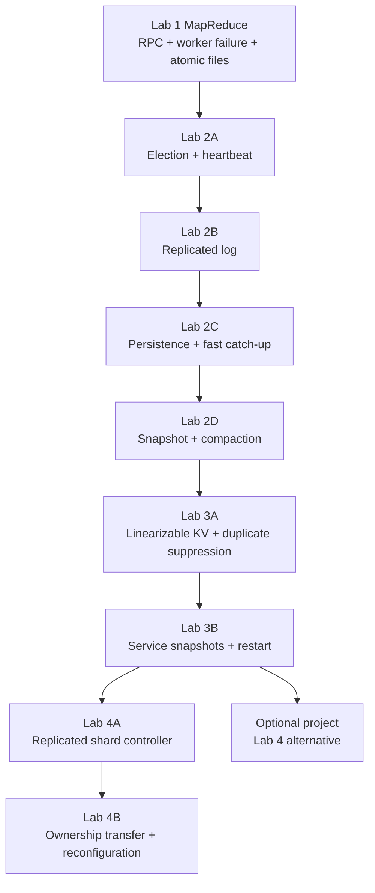

> 本文是 Spring 2021 课程实验的学习路线，不是题解。它只整理归档官方页面明确给出的目标、架构、接口、阶段、测试、正确性条件和调试建议；不提供实现代码、任务答案、隐藏测试推断、可直接提交的设计，亦不引用或复制学生提交。

## 使用边界与材料入口

开始前先打开以下课程级材料：

- [课程材料总索引](/courses/mit-6824-s21/materials/)
- [Spring 2021 官方课程安排归档](/assets/courses/mit-6824-s21/materials/official-materials/course-pages/schedule.html)
- [课程 General Information](/assets/courses/mit-6824-s21/materials/official-materials/course-pages/general.html)
- [Lab collaboration policy](/assets/courses/mit-6824-s21/materials/official-materials/labs/collab.html)
- [Lab guidance](/assets/courses/mit-6824-s21/materials/official-materials/labs/guidance.html)
- [Go setup](/assets/courses/mit-6824-s21/materials/official-materials/labs/go.html)
- [Lab 1: MapReduce](/assets/courses/mit-6824-s21/materials/official-materials/labs/lab-mr.html)
- [Lab 2: Raft](/assets/courses/mit-6824-s21/materials/official-materials/labs/lab-raft.html)
- [Lab 3: KV Raft](/assets/courses/mit-6824-s21/materials/official-materials/labs/lab-kvraft.html)
- [Lab 4: Sharded KV](/assets/courses/mit-6824-s21/materials/official-materials/labs/lab-shard.html)
- [Optional final project](/assets/courses/mit-6824-s21/materials/official-materials/project/project.html)

本文用三类标签严格区分内容：

- **官方必做**：官方 lab 页明确列为任务、规则、接口或完成条件的内容。
- **官方提示**：官方 lab 页或 guidance 页公开给出的方向与调试建议；它们不是额外提交项。
- **No-credit challenge**：官方明确说明不计分的挑战，不应与必做部分混在一起。

### 学术诚信

官方要求每位学生独立完成所有提交代码，除课程发放的代码外必须由本人编写；不得查看任何人的当前解答，也不得查看往年解答。可以讨论作业概念，但不得查看、使用或互相复制代码。不要公开发布实验代码；GitHub 仓库默认公开，课程建议使用私有仓库。完整原文见 [General Information 的 Collaboration policy](/assets/courses/mit-6824-s21/materials/official-materials/course-pages/general.html) 与 [Lab collaboration policy](/assets/courses/mit-6824-s21/materials/official-materials/labs/collab.html)。

这意味着学习时可以讨论协议不变量、公开接口、失败模型和官方测试名称，但不应交换实现片段、日志中反推出的隐藏答案或可提交仓库。

### 2021 历史时间线

以下日期来自 [Spring 2021 schedule](/assets/courses/mit-6824-s21/materials/official-materials/course-pages/schedule.html)，仅用于理解当年课程节奏，今天练习不再构成截止日期。官方还说明 Lab 1、2、3、4A 的累计迟交额度当年最多为 72 小时；Lab 4B 和 project 不可使用 late hours。

| 阶段 | 2021 历史截止时间（ET） | 当年节奏 |
| --- | --- | --- |
| Lab 1 | 2 月 26 日 23:59 | Lecture 1 分配，约 10 天 |
| Lab 2A | 3 月 5 日 23:59 | leader election |
| Lab 2B | 3 月 12 日 23:59 | log replication |
| Lab 2C | 3 月 19 日 23:59 | persistence |
| Lab 2D | 3 月 26 日 23:59 | snapshots/log compaction |
| Project proposal（若选 project） | 4 月 2 日 23:59 | 需事先获教师批准 |
| Lab 3A | 4 月 9 日 23:59 | KV service without snapshots |
| Lab 3B | 4 月 16 日 23:59 | KV service with snapshots |
| Lab 4A | 4 月 23 日 23:59 | shard controller |
| Lab 4B / Project code + report | 5 月 14 日 23:59 | 二选一终期路线 |
| Project presentation | 5 月 20 日课堂 | Spring 2021 最后一讲 |

归档中的 [Lab 4 页面](/assets/courses/mit-6824-s21/materials/official-materials/labs/lab-shard.html) 和 [Project 页面](/assets/courses/mit-6824-s21/materials/official-materials/project/project.html) 页眉仍写 “Spring 2020”，但链接指向 2021 hand-in/Piazza；本文因此用 2021 schedule 确认日期，并把这两个页面作为当期归档任务说明，不把页眉版本差异静默抹去。

## 通用练习方法

### 开始前

- 完成 [Go setup](/assets/courses/mit-6824-s21/materials/official-materials/labs/go.html) 和 Online Go tutorial；熟悉 goroutine、RPC、mutex、condition variable/channel、序列化和 race detector。
- 从课程发放的 `6.824-golabs-2021` 仓库开始，并在每个阶段前获取当时最新 skeleton。只修改该 lab 页面允许修改的文件，最终必须能与原始测试及支持代码一起工作。
- 先读对应 lab 页全文，再读指定论文范围；不要只依据博客或旧学期实现。Lab 2 页面特别提醒，外部 Raft 指南的旧版 Lab 2D 策略可能已经过时。
- 为每个阶段写一张“接口、持久状态、易失状态、不变量、失败时允许停止什么、绝不能发生什么”的纸面清单，再开始实现。

### 官方调试流程

[Lab guidance](/assets/courses/mit-6824-s21/materials/official-materials/labs/guidance.html) 强调这些实验代码量不一定大，但并发、崩溃和不可靠网络使细节非常重要；应分多次练习，不要在截止前夜开始。

1. 先把测试报告的第一个 observable error 定为当前锚点。
2. 提出一个关于其最近原因的可证伪假设。
3. 在消息收发、term/index、角色变化、commit/apply、snapshot/configuration 边界加入结构化日志或断言，使 latent error 更早暴露。
4. 运行相同测试验证假设；若假设错误就更换假设，若正确就继续向前追到首个错误状态。
5. 日志尽量一行一个事件，包含 server、term、role、index 等上下文；用稳定 topic/格式方便筛选。
6. 始终用 race detector，修复所有 data races；但“无 race 报告”不等于锁策略、协议或 deadlock 正确。
7. 不要靠反复调整 timeout 掩盖协议 bug。官方把 timeout tweaking 明确列为最后手段。
8. 偶发失败时保存完整 trace，多次重复同一个窄测试；不要并发启动会共享 socket/临时目录的测试实例。

## Lab 1：MapReduce

**官方页：** [Lab 1: MapReduce](/assets/courses/mit-6824-s21/materials/official-materials/labs/lab-mr.html)  
**历史截止：** 2021-02-26 23:59 ET  
**官方难度：** moderate/hard

### 先修材料

- [Lecture 1 NOTES](/courses/mit-6824-s21/lectures/001/)：Map → shuffle/group → Reduce、coordinator/worker、retry、determinism、atomic rename、straggler。
- [Lecture 1 reading guide](/courses/mit-6824-s21/readings/lecture-01/) 与 [MapReduce paper](/assets/courses/mit-6824-s21/materials/official-materials/papers/mapreduce.pdf)。
- [Lecture 2 NOTES](/courses/mit-6824-s21/lectures/002/)：goroutine、RPC、race、锁、等待、失败歧义。
- [Lecture 2 reading guide](/courses/mit-6824-s21/readings/lecture-02/)；并复习官方提供的 RPC/crawler 示例入口，见 [MATERIALS](/courses/mit-6824-s21/materials/#lecture-2-rpc-and-threads)。

### 官方目标与架构

目标是实现一个分布式 MapReduce：一个 coordinator 和一个或多个并行 worker 通过 RPC 协作。每个输入文件对应一个 Map task；Map 的中间键值按 `nReduce` 分桶，Reduce task 消费相应桶并产生最终文件。实验在单机多进程上运行，但 worker 共享当前目录中的文件系统。

Coordinator 负责分配任务、推动 Map → Reduce → 完成的阶段，并在 worker 长时间未完成时重新分配任务。官方规定本实验以 10 秒作为任务超时。由于 coordinator 无法可靠区分 worker crash、stall 和 slow execution，重新分配可能造成同一任务存在多个 attempt；系统必须避免客户端或后续阶段观察到半写文件或错误最终结果。

### Supplied interfaces 与文件边界

- 已提供顺序基线 `main/mrsequential.go`、应用插件 `mrapps/wc.go` 与 `mrapps/indexer.go`。
- 不修改入口 `main/mrcoordinator.go` 与 `main/mrworker.go`。
- **官方必做修改面：** `mr/coordinator.go`、`mr/worker.go`、`mr/rpc.go`。
- `MakeCoordinator()` 接收输入文件和 `nReduce`；`Done()` 必须只在整个 job 完成时返回 true。
- Worker 通过 RPC 获取任务，调用运行时加载的 `Map`/`Reduce` application functions，并读写约定文件。
- 第 `X` 个 Reduce task 必须输出 `mr-out-X`；每行按官方要求的 key/value 格式输出。
- 中间 Map 输出位于共享当前目录，并能按 Map task 与 Reduce partition 被后续 Reduce task 找到。

### 官方必做进展

1. **建立顺序 oracle。** 运行 `mrsequential.go`，理解输入 split、Map output、shuffle 分组与最终 `mr-out-0`。
2. **先通一条 Map RPC 路径。** Worker 能请求任务，coordinator 能给出尚未开始的 Map task，worker 能读取输入并调用 application Map。
3. **完成 Map partition 与中间文件契约。** 所有 Map task 可并行；每个 key 只进入其对应 Reduce partition；所有 Map 完成前不启动依赖完整输入的 Reduce 阶段。
4. **完成 Reduce 与最终输出契约。** Reduce tasks 可并行，输出文件名、行格式及 sorted union 与顺序实现一致。
5. **补齐失败恢复与生命周期。** 10 秒后可重新发放未完成 task；迟到 attempt 不得破坏正确输出；job 完成后 coordinator 与 workers 都能退出。
6. **最后检查并发正确性。** Coordinator 的 RPC handlers 会并发执行，所有共享调度状态都必须有一致的同步规则。

### 测试与命令

在 `src/main` 中使用官方命令：

```text
go build -race -buildmode=plugin ../mrapps/wc.go
go run -race mrcoordinator.go pg-*.txt
go run -race mrworker.go wc.so
bash test-mr.sh
bash test-mr-many.sh N
```

`test-mr.sh` 的公开检查面包括：word count、indexer 输出正确；Map tasks 并行；Reduce tasks 并行；worker 在 task 中 crash 后能够恢复。测试进程位于 `mr-tmp`；失败时可暂时让脚本在首个失败处退出后检查文件。不要并行运行多个 `test-mr.sh`，因为 coordinator 会复用同一 socket。

### 正确性与故障清单

- [ ] 每个输入 split 的 Map work 最终至少有一个完整、可接受的结果。
- [ ] Reduce 只在全部 Map task 已有可用输出后开始。
- [ ] 相同 key 始终映射到同一个 Reduce partition。
- [ ] `mr-out-X` 只包含第 `X` 个 Reduce task 的完整输出，格式与顺序实现兼容。
- [ ] 并行 attempts、worker crash 或 coordinator 的重复发放不会暴露 partial file。
- [ ] 无故障且 worker 正常完成时，不无意义地创建额外 backup tasks。
- [ ] Coordinator 调度状态无 data race；等待任务的 worker 不 busy-spin。
- [ ] 所有 task 完成后 `Done()` 成立，coordinator 与 workers 可终止。

### 官方提示，不是额外要求

- 可借鉴 `mrsequential.go` 的文件读取、排序与输出方式；application functions 由 Go plugin 在运行时加载，修改 `mr/` 后通常要重建 plugin。
- 官方建议可用类似 `mr-X-Y` 的中间文件命名，并建议使用结构化编码保存中间键值；具体实现选择仍由练习者负责。
- Coordinator 是并发 RPC server，需保护共享状态。等待可采用周期查询或协调原语，但必须避免无休止空转。
- 使用临时文件完成写入，再以原子 rename 发布，可避免 crash 时观察到半写结果。
- `mrapps/crash.go` 可用于故障练习。RPC 注册时关于 `Done` signature 的已知警告可按官方页面说明忽略。

### No-credit challenges

- 自己实现一个 MapReduce application，例如论文中的 Distributed Grep。
- 把 coordinator/workers 放到不同机器，通过 TCP/IP RPC 和共享存储运行。

## Lab 2：Raft（2A–2D）

**官方页：** [Lab 2: Raft](/assets/courses/mit-6824-s21/materials/official-materials/labs/lab-raft.html)  
**历史截止：** 2A 3 月 5 日；2B 3 月 12 日；2C 3 月 19 日；2D 3 月 26 日，均为 23:59 ET。

### 总目标、架构与接口

这一实验实现 replicated state machine protocol。每个 service replica 内嵌一个 Raft peer；peers 只通过 `labrpc` RPC 交换状态，不得借助共享 Go 变量或文件通信。Raft 把 client commands 排成带 index 的 log；entry committed 后通过 `applyCh` 发送 `ApplyMsg` 给 tester 或上层 service。只要多数节点存活且互通，系统应继续推进；无多数时可以停止推进，但通信恢复后应继续。

在 `raft/raft.go` 中保持以下公开契约：

- `Make(peers, me, persister, applyCh)`：创建 peer 并恢复可用持久状态。
- `Start(command)`：立即返回 index、term、是否自认为 leader，不等待 agreement 完成。
- `GetState()`：返回当前 term 与本地 leader 判断。
- `ApplyMsg` / `applyCh`：只把新 committed entry 或 snapshot 按接口交给 service/tester。
- `Kill()` / `killed()`：测试永久关闭实例时，后台循环应能够停止。
- 2D 新增 service/Raft 边界：`Snapshot(index, snapshot)`、`CondInstallSnapshot(lastIncludedTerm, lastIncludedIndex, snapshot)`，以及 peer-to-peer `InstallSnapshot` RPC。

核心安全目标来自 [extended Raft paper](/assets/courses/mit-6824-s21/materials/official-materials/papers/raft-extended.pdf) Figure 2。实验实现论文的大部分内容，包括 crash/restart persistence 与 snapshots，但不实现 Section 6 cluster membership changes。

### 先修材料

- [Lecture 3 GFS NOTES](/courses/mit-6824-s21/lectures/003/) 与 [reading guide](/courses/mit-6824-s21/readings/lecture-03/)：replication、primary、version、lease、stale state。
- [Lecture 4 Primary-Backup NOTES](/courses/mit-6824-s21/lectures/004/) 与 [reading guide](/courses/mit-6824-s21/readings/lecture-04/)：fail-stop、partition/split brain、RSM、external output。
- [Lecture 5 Raft (1) NOTES](/courses/mit-6824-s21/lectures/005/) 与 [reading guide](/courses/mit-6824-s21/readings/lecture-05/)：majority、election、replicate/commit/apply、log divergence。
- [Lecture 7 Raft (2) NOTES](/courses/mit-6824-s21/lectures/007/) 与 [reading guide](/courses/mit-6824-s21/readings/lecture-07/)：log catch-up、current-term commit、persistence、snapshots、linearizability。
- 2A–2C 重点重读论文 Figure 2 与 Section 5；2D 重读 Section 7。课程 schedule 为 Lecture 5 指定到 Section 5，为 Lecture 7 指定 Section 7 至结尾但排除 Section 6。

### 2A：Leader election 与 heartbeat

**官方必做：** 实现 leader election 与空 `AppendEntries` heartbeat。稳定网络中应有一个 leader；leader 未失败时保持；leader crash 或双向包丢失后，只要多数互通，应在 5 秒内选出新 leader。Leader heartbeat 不得超过每秒 10 次。

**公开协议面：** `RequestVote` args/reply 与 handler、发送 RPC 的 helper；`AppendEntries` args/reply 与 handler；角色、`currentTerm`、`votedFor`、election timer；`GetState()`。

**测试：**

```text
go test -run 2A -race
```

**正确性检查：**

- [ ] 每个 term 最多一个 leader；同一 peer 每 term 最多投一票。
- [ ] 收到更高 term 时按 Figure 2 更新 term 并回到 follower。
- [ ] 合法 leader traffic 重置 election timeout；timeout 随机化以减少 split vote。
- [ ] Heartbeat 频率满足测试上限，election timeout 又能容纳多轮 split vote 并在 5 秒目标内恢复。
- [ ] RPC 可见 struct 字段可被编码；不要忽略 `labgob` 关于小写字段的警告。
- [ ] 所有后台循环尊重 `killed()`，无 data race、deadlock 或无等待自旋。

**官方提示：** 先只关注 Figure 2 中与 election 有关的 state、RequestVote、server rules 和 heartbeat；使用 sleep 驱动的后台 loop 比 `time.Timer`/`time.Ticker` 更容易正确管理。论文的 150–300ms timeout 不能原样照搬，因为 tester 将 heartbeat 限制为 10 次/秒；需在约束内选择合理范围，而不是用 timeout 掩盖逻辑错误。

### 2B：Log replication

**官方必做：** 实现 leader/follower 追加新 entries，使 commands 在多数派上 agreement，并通过 `applyCh` 按序交付。实现 Section 5.4.1 的 election restriction。

**进展顺序：**

1. 先让 `Start()` 与 basic agreement 测试工作。
2. 完成带 entries 的 `AppendEntries`，验证前驱 index/term，处理冲突后缀并修复落后 follower。
3. 依据多数成功证据推进 commit，再按 index 顺序 apply；区分“follower 已 append”“leader 已知 committed”“follower 已知 committed”。
4. 完成 leader change、partitioned leader rejoin、快速修复错误 follower log，并控制 RPC count/bytes。

**测试：**

```text
go test -run 2B -race
time go test -run 2B
```

公开测试覆盖 basic agreement、RPC byte count、follower disconnect、失去多数时不 agreement、并发 `Start()`、partitioned leader rejoin、快速回退错误日志和 RPC 数量上限。

**正确性检查：**

- [ ] Leader append、follower 接受、majority commit 与 apply 的顺序明确。
- [ ] 不把 uncommitted entry 当成 client-visible committed state。
- [ ] Future leader 的 log freshness 规则保护已 committed prefix。
- [ ] 旧 leader 重入时不会让已提交历史倒退。
- [ ] 循环使用 condition、channel 或短 sleep 等待，不持续占满 CPU。
- [ ] 频繁重复 election 时先检查 timer reset 与 leader 当选后是否立即广播，而不是放宽测试时间。

**官方提示：** 从 `TestBasicAgree2B` 开始；失败时阅读 `config.go` 和 `test_test.go` 以理解公开 tester 如何使用 Raft API。官方示例建议 2B wall time 约一分钟、CPU time 约数秒；明显偏高时检查空转、过长等待、RPC timeout 和 RPC 风暴。

### 2C：Persistence 与快速回退

**官方必做：** 把 Figure 2 指定的 persistent state 编码到 `Persister`，实现 `persist()` 与 `readPersist()`；每次 persistent state 改变时先保存，再对外形成依赖该状态的成功。使用 `ReadRaftState()` / `SaveRaftState()`。此外实现比逐 entry 回退更快的 log backtracking。

**测试：**

```text
go test -run 2C -race
for i in {0..10}; do go test; done
```

公开测试加入 basic/more persistence、partition + crash/restart、Figure 8、unreliable agreement 与 churn。随机故障可能让有 bug 的实现偶尔通过，因此官方要求多次运行，并同时回归 2A/2B。

**正确性检查：**

- [ ] `currentTerm`、`votedFor`、log 等论文指定状态跨重启保存；恢复后角色可从 follower 开始。
- [ ] 状态变化在发送依赖它的成功 reply/ACK 之前 durable。
- [ ] RPC request 或 reply 丢失、server 重启、反复 partition/churn 不会丢失 committed history。
- [ ] Previous-term entry 的 commit 规则符合 Figure 8/current-term 限制。
- [ ] Log conflict 信息支持跳跃回退，避免逐项产生不合理 RPC/byte 开销。
- [ ] 2C 暴露的 2A/2B bug 回到原不变量修复，且旧测试继续通过。

**官方提示：** 快速回退参考 extended paper 第 7–8 页灰线附近，但论文没有给出全部实现细节；结合 Raft lectures 理解其安全边界。2C 此时还不要求丢弃旧 log，那是 2D。

### 2D：Snapshot 与 log compaction

**官方必做：** 让 service 定期保存自身 snapshot，并允许 Raft 丢弃 snapshot 覆盖的 log prefix。实现 `Snapshot`、`CondInstallSnapshot`、peer-to-peer `InstallSnapshot`，修改所有日志索引逻辑以支持被裁剪的前缀，并将 Raft state 与 snapshot 原子保存到 persister。2D 完成条件是 2D 和全部 Lab 2 tests 通过；Lab 3 会更深入压力测试 snapshot。

**架构边界：**

- Service 调用 `Snapshot(index, bytes)`，声明 snapshot 包含至 index 的全部应用状态。
- Leader 对落后到已裁剪 prefix 之前的 follower 发送一个完整 `InstallSnapshot` RPC。
- Follower 通过 `ApplyMsg`/`applyCh` 把 snapshot 交给 service；service 与 Raft 按给定接口协调是否安装。
- 旧 snapshot 不得让 state machine 回到已经处理过的更早状态。

**测试：**

```text
go test -run 2D -race
go test -race
```

**正确性检查：**

- [ ] Snapshot 覆盖的 logical index/term 在裁剪后仍可用于 `AppendEntries` 前驱检查。
- [ ] Logical log index 不再等同于本地 slice position；所有边界条件统一使用明确的 base/offset 语义。
- [ ] 被裁剪 entry 不留可达引用，Go GC 能释放内存。
- [ ] Snapshot 与对应 Raft state 使用 `SaveStateAndSnapshot()` 一起持久化。
- [ ] Leader 发现 follower 所需 entry 已裁剪时发送 snapshot，而不是永远回退/重试 entries。
- [ ] 过期 snapshot 被拒绝或通过等价结构保证永不回滚 state machine。
- [ ] Snapshot 后仍保留并正确复制 snapshot point 之后的有效 log suffix。

**官方提示：** 一个 `InstallSnapshot` RPC 发送整个 snapshot，不实现 Figure 13 的 offset/chunking。官方给出的 Lab 2 全套合理量级约为 8 分钟 wall time、1.5 分钟 CPU time。

### Lab 2 阶段门禁

每完成一部分先稳定通过该部分，再运行所有已完成部分；不能把 2D 当成只需新测试通过。所有 Lab 2/3/4 的全套 tests 总计不得超过 600 秒，任何单个 test 不得超过 120 秒（官方 Lab 2 页的 grading constraint）。

## Lab 3：Fault-tolerant Key/Value Service

**官方页：** [Lab 3: KV Raft](/assets/courses/mit-6824-s21/materials/official-materials/labs/lab-kvraft.html)  
**历史截止：** 3A 2021-04-09；3B 2021-04-16，均为 23:59 ET。  
**前置门禁：** Lab 2 A–D 稳定通过。

### 目标、架构与接口

每个 KV server 内嵌一个 Raft peer；servers 不直接通信，只通过 Raft 复制 operation order。Client 只通过 `Clerk` 调用 `Put(key,value)`、`Append(key,arg)`、`Get(key)`。`Put` 替换值，`Append` 追加；不存在的 key 上 `Get` 返回空字符串，`Append` 等价于首次 `Put`。

目标是 linearizability：非并发调用表现得像单副本按顺序执行；并发调用的结果必须存在一个单机顺序，且该顺序尊重 real-time precedence。只要多数 server 存活且互通，服务应继续；minority 或旧 leader 不得返回 stale success。

Skeleton 位于 `src/kvraft`；官方修改面是 `client.go`、`server.go`，必要时 `common.go`。Supplied/required boundary 包括 `Clerk` 的 Put/Append/Get、server 的 `PutAppend()`/`Get()` RPC handlers、`StartKVServer()`、operation 描述和 Raft `Start()`/`applyCh`。

### 先修材料

- [Lecture 5 Raft (1) NOTES](/courses/mit-6824-s21/lectures/005/) 与 [Lecture 7 Raft (2) NOTES](/courses/mit-6824-s21/lectures/007/)。
- [Lecture 5 reading guide](/courses/mit-6824-s21/readings/lecture-05/)、[Lecture 7 reading guide](/courses/mit-6824-s21/readings/lecture-07/) 与 [extended Raft paper](/assets/courses/mit-6824-s21/materials/official-materials/papers/raft-extended.pdf)，重点复习 Sections 7、8。
- [Lecture 9 ZooKeeper NOTES](/courses/mit-6824-s21/lectures/009/) 与 [reading guide](/courses/mit-6824-s21/readings/lecture-09/)：linearizable writes/local reads 的对照有助于理解为何本 lab 的 Get 也需要 freshness 证明。

### 3A：无 snapshot 的 KV service

**官方必做进展：**

1. **先过 one client、无故障路径。** Clerk 能找到 leader；handler 把 Put/Append/Get 描述成 operation 交给 `Start()`；所有 servers 从 `applyCh` 按序执行；原 handler 在确认自己的 operation committed 后回复。
2. **加入并发与 linearizable Get。** 不从无法证明处于多数派的 server 返回 stale value。官方给出的简单方案是把 Get 也放入 Raft log；无需实现 Section 8 的 read-only optimization。
3. **处理 leader change。** Handler 必须识别 `Start()` 后失去 leadership、同 index 出现不同 operation 或 term 改变等未成功情形，使 Clerk 能继续尝试。
4. **处理重试与 duplicate。** Leader 可能在 commit 后、reply 前失败；Clerk 重发时同一 logical Put/Append 仍只能执行一次。请求要有稳定、唯一身份，server 的 duplicate state 必须与 operation order 一起维护。
5. **控制资源。** Duplicate detection state 应及时释放；官方允许假设一个 Clerk 同时只发一个 call。Clerk 可优先尝试上次成功 leader，避免每次全量搜索。

**测试：**

```text
cd src/kvraft
go test -run 3A -race
```

公开测试覆盖 one/many clients、速度、不可靠网络、同 key 并发 append、majority/minority progress、partition heal、restart 及这些条件的组合。

**正确性与并发清单：**

- [ ] 所有已完成 calls 可排成尊重 real time 的单一顺序。
- [ ] Get 不从 minority/stale state 返回成功；Put/Append/Get 的可见顺序一致。
- [ ] 同一 logical Put/Append 在 reply 丢失与跨 term retry 后只执行一次。
- [ ] `Start()` 返回不等于 operation 已 committed；reply 必须等 commit、apply 和结果确认。
- [ ] Apply loop 始终消费 `applyCh`，不与 RPC handler 或 Raft 形成 deadlock。
- [ ] Index/term/operation identity 的等待与通知没有串台、永久泄漏或错误唤醒。
- [ ] Minority 允许等待，但 partition heal 后请求能完成。
- [ ] Race detector clean；锁内不进行会形成循环等待的 Raft/channel 操作。

**官方提示：** 从开始就设计同步关系；“race-free”不足以证明无 deadlock。若旧 leader 被单独 partition，它可能长期不知道新 leader；同 partition 的 client 也无法联系多数派，因此等待到网络恢复是允许的。

### 3B：带 snapshot 的 KV service

**官方必做：** `StartKVServer()` 接收 `maxraftstate`。当持久 Raft state 接近该字节阈值时，KV service 应把足以重建应用状态的 snapshot 交给 Raft；`maxraftstate == -1` 时无需 snapshot。Server restart 时从 persister 读取 snapshot 并恢复，随后继续处理 Raft tail。

**测试：**

```text
go test -run 3B -race
go test -run TestSnapshotSize
go test -race
```

官方要求 3B、3A 与全部 Lab 2 tests 继续通过。公开 3B tests 包括 InstallSnapshot、合理 snapshot size、性能，以及 snapshots 与 restart、unreliable network、partition、many clients 的组合。官方给出的合理量级是 Lab 3 全套约 400 秒 wall time/700 秒 CPU time，`TestSnapshotSize` 少于 20 秒 wall time。

**正确性清单：**

- [ ] Snapshot 包含 KV database 以及跨 checkpoint 检测 duplicate 所需的全部 service state。
- [ ] Snapshot 的 struct fields 可被编码；读取后恢复出的状态与对应 last applied point 一致。
- [ ] 触发 snapshot 的阈值不会让 Raft state 长期越过 `maxraftstate`，也不会每个 entry 都产生无意义 snapshot。
- [ ] Restart 使用 snapshot + 后续 log 恢复，不重复或跳过 client operation。
- [ ] InstallSnapshot 与并发 apply 不让 service state 倒退。
- [ ] Lab 3 暴露的 Raft snapshot bug 修复后，Lab 2 全套仍通过。

### Lab 3 官方提示边界

官方只规定行为与接口，并没有指定 request-ID 表、wait-channel、snapshot payload 或锁布局的唯一实现。练习时应从 linearizability、at-most-once effect、commit/apply boundary 和恢复不变量推导自己的设计，而不是寻找可复制答案。

## Lab 4：Sharded Key/Value Service

**官方页：** [Lab 4: Sharded KV](/assets/courses/mit-6824-s21/materials/official-materials/labs/lab-shard.html)  
**历史截止：** 4A 2021-04-23；4B 2021-05-14，均为 23:59 ET。  
**终期选择：** 当年可做 Lab 4，或经批准完成 optional project。  
**前置门禁：** 同一份 Raft implementation 必须同时服务 Lab 3 KV、shard controller 和 shardkv；Lab 4 grading 会重跑 Lab 2/3 tests。

### 总体架构与正确性目标

Key space 被分成固定数量 shards，多组 replica groups 并行服务不同 shards。每组由若干固定成员组成，组内用 Raft 复制本组状态；组成员集合不在本 lab 中改变。全局唯一的 shard controller 也是一个 Raft-backed fault-tolerant service，维护带编号的 configurations，即 shard → GID 与 GID → server names 的映射。

Clients 查询 controller 确定 key 当前所属 group；groups 也查询 controller 发现新 configuration。Reconfiguration 时，旧组和新组通过 RPC 迁移 shard data。所有组内 replicas 必须一致决定 client operation 位于 configuration change 之前还是之后，并保证任意时刻至多一个 group 为某 shard 提供服务。这里的 configuration 不是 Raft Section 6 membership change；本 lab 不实现后者。

系统仍需为 `Clerk.Get/Put/Append` 提供 linearizable interface，即使 client operations 与 configuration changes 并发。某 shard 只要求在其 replica group 有多数可互通、且该组能联系 shard controller 多数时推进。Clients、servers、groups 之间只能通过 RPC 交互，不得共享 Go 变量或文件。

### 先修材料

- Lab 2 全部协议与 Lab 3 的 linearizability、duplicate detection、snapshot。
- [Lecture 12 Frangipani NOTES](/courses/mit-6824-s21/lectures/012/) 与 [reading guide](/courses/mit-6824-s21/readings/lecture-12/)：ownership handoff、configuration/lock order、迁移期间旧 owner 与新 owner 的可见性边界。
- [Lecture 13 Distributed Transactions NOTES](/courses/mit-6824-s21/lectures/013/) 与 [reading guide](/courses/mit-6824-s21/readings/lecture-13/)：跨参与者顺序与失败；这是深化材料，不替代 Lab 4 官方协议要求。
- [Lecture 14 Spanner NOTES](/courses/mit-6824-s21/lectures/014/) 与 [reading guide](/courses/mit-6824-s21/readings/lecture-14/)：sharding、replicated groups 与跨 shard 系统背景；同样只作概念深化。

### 4A：Shard controller

**Supplied/required interface：** `src/shardctrler/common.go` 定义 `Join`、`Leave`、`Move`、`Query`。官方修改 `shardctrler/server.go` 与 `client.go`，并用 Raft 提供 fault tolerance。

**官方必做语义：**

- `Join`：加入一批非零 GID 及 server names；允许已 Leave 的 GID 之后重新 Join。创建新 configuration，尽量平均分 shard，并在达到平衡时移动尽量少的 shards。
- `Leave`：移除给定 GIDs，把其 shards 分配给剩余 groups；同样要求尽量平衡、尽量少迁移。
- `Move`：创建新 configuration，把指定 shard 指定给目标 GID；后续 Join/Leave 的 rebalance 可能撤销人工 Move。
- `Query(num)`：返回指定历史 configuration；`-1` 或超过最大编号时返回最新。`Query(-1)` 必须反映该请求前已经完成的 Join/Leave/Move。
- Configuration 0 无 groups，全部 shards 指向无效 GID 0；之后每次变更编号递增。

**测试：**

```text
cd src/shardctrler
go test -race
```

公开 tests 检查 basic join/leave、historical query、Move、concurrent changes、single/multi-group rebalance、minimal transfers，以及不同 servers 上 configuration 一致。

**正确性清单：**

- [ ] 所有 controller replicas 对同一 ordered operation 生成完全相同的 configuration。
- [ ] Rebalance deterministic；不能依赖 Go map 的随机迭代顺序。
- [ ] 新 configuration 深拷贝 maps/slices，不与历史 configuration 共享可变引用。
- [ ] Join/Leave 同时满足 balance 与 minimal movement 的公开要求。
- [ ] Query 可读取历史且不会被后续 mutation 改写。
- [ ] 尽管 4A tests 不直接检查，仍实现 duplicate request detection；4B 会在 unreliable network 下使用 controller。

**官方提示：** 可从精简的 kvraft server 结构开始，但不能复制他人解答。Race detector 可发现并发访问错误，不能替代 deterministic state-machine 检查。

### 4B：Sharded KV server

**Supplied/required boundary：** 修改 `shardkv/client.go`、`common.go`、`server.go`。`key2shard()` 决定 key 的 shard；controller `Config` 给出 group server names；`StartServer()` 提供 `make_end()`，用于把 server name 转为 `labrpc.ClientEnd`。

**官方必做进展：**

1. **Static shards。** 先通过首个测试：只有一次 shard assignment，整体结构接近 Lab 3，但 server 只接受当前 group 拥有的 keys。
2. **发现 configuration。** Server 周期查询 controller；官方 tests 期望大约每 100ms poll，一般更频繁可接受，明显更慢可能失败。Configuration 必须按编号逐个、有序处理。
3. **拒绝错误 owner。** Group 不拥有 key 对应 shard 时返回 `ErrWrongGroup`；该判断必须与并发 reconfiguration 保持一致。
4. **迁移 shard。** 旧 group 失去 shard 后立即停止接受该 shard 的新 requests，并通过 RPC 提供数据；新 group 收到上一 owner 的 shard state 前不得服务该 shard。
5. **把 reconfiguration 纳入组内一致顺序。** Client Put/Append/Get 与 configuration transition 的先后必须由组内所有 replicas 一致观察，避免一部分 replicas 接受而另一部分拒绝。
6. **迁移完整语义状态。** 除 key/value data 外，at-most-once/duplicate detection 所需状态也必须随 shard 移动。
7. **处理 failures 与 snapshots。** 在 minority dead/slow、controller 可达、多次 configuration、restart、unreliable RPC 和 snapshot 组合下保持 linearizability 与最终 progress。

**测试：**

```text
cd src/shardkv
go test -race

go test raft/...
go test kvraft/...
go test shardctrler/...
go test shardkv/...
```

必做公开 tests 截止到但不包括 challenge tests：static shards；join/leave；snapshots；server 漏过 configuration；并发 Put 与 configuration；restart；多组 unreliable cases。最终必须使用同一 Raft 通过全部 Lab 2、3、4 tests。

**故障、并发与正确性清单：**

- [ ] 对每个 shard/configuration，任意时刻至多一个 group 返回成功服务。
- [ ] 所有 group replicas 对 client operation 与 reconfiguration 的相对顺序一致。
- [ ] Lost shard 立即停止服务；gained shard 只有在必要 state 到齐后开始服务。
- [ ] Configurations 按编号一次处理一个，不跳跃造成来源不明的 shard。
- [ ] `ErrWrongGroup` 不错误推进 client sequence/duplicate state；client 刷新 configuration 后仍重试同一 logical request。
- [ ] Duplicate detection state 随 shard 迁移，reply 丢失和跨 group retry 不造成二次 effect。
- [ ] RPC reply 中的 map、放入 Raft entry 的 map/slice 采用独立副本，避免 RPC encoder、Raft persistence 与 service mutation 并发访问。
- [ ] 两组需要双向迁移时不形成 RPC/锁/等待环。
- [ ] Minority server slow/dead 不阻止有多数的 group 服务其 shards；controller 无多数时不伪造新 configuration。
- [ ] Snapshot/restart 恢复当前 configuration、shard ownership、迁移状态、KV data 与 duplicate state。
- [ ] Controller 不由 shardkv server 自行调用 `Join()`；tester/administrator 负责 membership changes。

**官方提示：** 可以在失去 ownership 后继续保存旧 shard data，必做部分不要求立即删除；但绝不能继续服务。迁移 RPC 中可发送完整 map，reply 必须复制共享 map。若把 map/slice 放入 Raft log，service apply 后也要避免保存与 Raft 仍共享的可变引用。配置切换中双方互等是常见 deadlock 来源。

### No-credit challenges

这些测试可能出现在示例总输出中，但官方明确不计分，不能把它们误写成 4B 必做：

1. **Challenge 1：旧 shard 垃圾回收。** Group 只把已失去的 shard 保存到迁移绝对必要的时间，并在原 group 全部 crash/restart 时仍正确；对应 `TestChallenge1Delete`。
2. **Challenge 2A：不受影响 shard 持续服务。** Configuration transition 未完成时，未迁移 shards 仍可处理 client operations；对应 `TestChallenge2Unaffected`。
3. **Challenge 2B：部分迁移即服务。** 新 group 收到某个 shard 后立即服务它，不必等待同次 configuration 的其他 shards；对应 `TestChallenge2Partial`。

## Optional Final Project

**官方页：** [6.824 Project](/assets/courses/mit-6824-s21/materials/official-materials/project/project.html)  
**2021 schedule：** proposal 4 月 2 日 23:59；code + report 5 月 14 日 23:59；5 月 20 日课堂展示。  
**定位：** 这是 Lab 4 的替代项，不是 Lab 1–3 的替代项，也不是 Lab 4 之后的额外必做。

### 官方必做

- 组成 2–3 人团队；个人 labs 仍须遵守独立完成政策。
- 选题与 6.824 核心主题紧密相关，例如 fault tolerance，工作量至少相当于 Lab 4。
- 在 proposal deadline 前提交少于一页的 proposal：成员、问题、解决思路、明确要设计和实现的内容；必须事先获得课程 staff 批准。
- 完成系统设计与实现；提交代码与约 3 页 design/implementation write-up。
- 在最后一讲做短 presentation/demo。官方说明课程结束后会公开 project write-ups/code，因此团队应确认发布范围与当年政策；个人 lab code 仍不得公开。

### 官方给出的选题方向

官方页面列出的是启发，不是预先批准的任务答案：重实现课程论文系统；高性能 Raft；fault-tolerant/decentralized application；cross-shard transactions；FlumeJava/Spark/Naiad 风格 dataflow；asynchronous replication；file synchronization；coherent cache；CRDT editor；fault-tolerant/sharded file service；DSM；distributed block store；geo-replicated storage；RDMA/DPDK；non-volatile memory；更易组合的 fault-tolerance framework；弱一致性对应用复杂度的影响；兼顾 batch 与 online processing 的系统等。

### Project 练习门禁

- [ ] 问题陈述能被具体 workload、failure model 与 correctness property 验证。
- [ ] Proposal 明确哪些内容由团队自行设计实现，哪些依赖现有系统或 library。
- [ ] 工作量与 Lab 4 相当，且不是把已有学生项目/课程解答换皮。
- [ ] Evaluation 包含正常路径、并发、失败、恢复和性能，而不只演示 happy path。
- [ ] Write-up 解释 architecture、接口、关键不变量、失败边界、实验结果与已知限制。
- [ ] 团队协作仅适用于 project；不得把团队代码或往届代码带回个人 labs。

## 跨 Lab 依赖图



依赖不只是代码复用：

- Lab 1 建立 RPC failure ambiguity、duplicate attempts、并发调度和原子发布的直觉。
- Lab 2 把“单 coordinator/primary”升级为多数派复制的 ordered log；2A 的 term/timer bug 会在 2C churn 才暴露，2B 的 index bug 会在 2D compaction 才暴露。
- Lab 3 把 Raft safety 转化为 client-visible linearizability、retry 与 at-most-once effect；2D snapshot 接口在 3B 才受到真实 service state 压力。
- Lab 4A 复用 Lab 3 的 replicated service 模式，但增加 deterministic configuration state machine。
- Lab 4B 把一个 Raft group 内的顺序扩展到跨 group ownership transfer；它同时依赖 Lab 3 duplicate/snapshot state 和 Lab 2 的稳定 Raft。
- Project 与 Lab 4 二选一，但仍应建立在 Lab 1–3 的 failure、replication、consistency 与评测能力之上。

## Mastery Rubric

每项按 0–3 分自评。任何阶段若 **Correctness** 或 **Failure/Concurrency** 低于 2，不应只凭一次 `PASS` 进入下一 Lab。

| 维度 | 0：未建立 | 1：可复述 | 2：可独立验证 | 3：可解释与迁移 |
| --- | --- | --- | --- | --- |
| Architecture | 说不清组件和数据流 | 能画 happy path | 能标出控制/数据路径、ownership 与层间边界 | 能比较替代架构及其 failure/performance tradeoff |
| Interfaces | 依赖实现细节猜调用 | 知道主要 API 名称 | 能说明每个参数、返回、异步通知和持久边界 | 能从接口推导合法/非法时序而不泄露实现答案 |
| Correctness | 只看输出样例 | 能说“应该一致” | 能写出 MapReduce 文件契约、Raft safety、KV linearizability、shard single-owner 不变量 | 能用反例 history/trace 证明错误设计为何失败 |
| Failure/Concurrency | 把 timeout 当 crash | 知道会丢包/重试 | 能分析 crash、partition、restart、duplicate、race、deadlock 与 delayed RPC | 能区分 safety/liveness，并设计最小实验定位首个错误状态 |
| Persistence/Snapshot | 不理解重启状态 | 知道要保存数据 | 能列出 durable-before-reply、snapshot coverage、tail replay 与 no-rollback 条件 | 能跨 Raft/service/shard migration 审计恢复完整性 |
| Testing | 只跑一次全套 | 会运行分阶段命令 | 会用 `-race`、重复窄测试、性能/RPC 指标与回归门禁 | 能从 tester contract 设计额外黑盒故障场景而不推测隐藏答案 |
| Debugging | 随机改 timeout | 会打印日志 | 从 observable error 反向提出假设、加 instrumentation 并复现 | 能把日志变成因果时间线，定位 invariant 首次被破坏的位置 |
| Academic integrity | 查找/交换解答 | 知道政策 | 全程只使用官方 skeleton、公开材料与本人设计，仓库私有 | 能在讨论/协作中清楚划出概念交流与代码/答案共享边界 |

### 最终毕业检查

- **Lab 1：** 能解释为何 retry 会产生 duplicate attempts，如何保证最终文件完整且并行测试与 crash test 都成立。
- **Lab 2：** 能从 Figure 2/majority 推导 election、log matching、commit、persistence 与 snapshot safety，并稳定通过 2A–2D race tests。
- **Lab 3：** 能给出任意 client history 的 linearizability 论证，解释 reply loss 下的 exactly-once illusion 与 snapshot 恢复边界。
- **Lab 4：** 能对任一 shard/configuration 指出唯一合法 owner、迁移数据与 duplicate state 的来源，以及并发 operation 应落在切换前还是后。
- **Project：** 若走 project 路线，能用明确 failure model、correctness contract 与 evaluation 证明系统做到了什么，也诚实说明没有做到什么。

完成路线的标准不是“偶尔全绿”，而是：可以从官方接口与不变量解释每个公开测试为什么应通过；在 race、unreliable network、partition、restart 和 reconfiguration 下多次运行仍稳定；修复后始终回归所有上游 labs。
