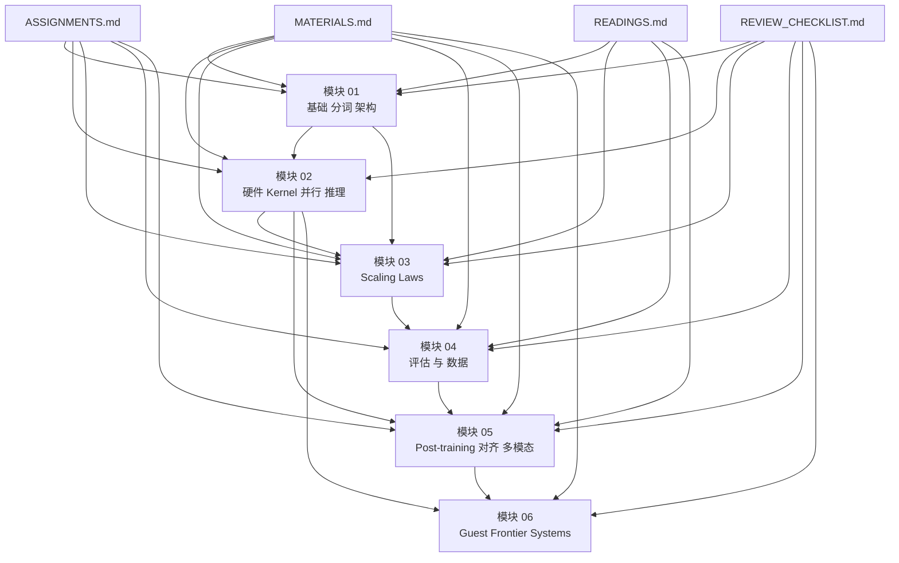

> 站点保留 428 项完整资源索引；讲义、作业 handout 与 transcript 提供站内归档，大体积论文和仓库快照通过官方来源访问。

本文只基于本课程目录中的归档证据整理，核心入口包括 [course.json](/assets/courses/stanford-cs336-s26/metadata/course.json)、[source-manifest.json](/assets/courses/stanford-cs336-s26/metadata/source-manifest.json)、[MATERIALS.md](/courses/stanford-cs336-s26/materials/)、[ASSIGNMENTS.md](/courses/stanford-cs336-s26/assignments/)、[READINGS.md](/courses/stanford-cs336-s26/readings/)、[REVIEW_CHECKLIST.md](/courses/stanford-cs336-s26/review-checklist/) 与六份模块总线文档。凡是根笔记、模块文档或复核清单明确标成 `[需回听]`、`transcript-only` 或 `source gap` 的地方，本文都保留边界，不补写外部事实，不把不确定口述包装成确定课程结论。

## 课程身份与证据范围

| 项目 | 基于仓库可确认的信息 | 证据 |
| --- | --- | --- |
| 课程名 | Stanford CS336 Language Modeling from Scratch (Spring 2026) | [course.json](/assets/courses/stanford-cs336-s26/metadata/course.json)、[source-manifest.json](/assets/courses/stanford-cs336-s26/metadata/source-manifest.json) |
| 课程主轴 | 从分词、架构、系统、scaling、数据到 post-training 与多模态，围绕“固定资源下训练/服务更好的语言模型”展开 | [source-manifest.json](/assets/courses/stanford-cs336-s26/metadata/source-manifest.json)、六份 [modules](/courses/stanford-cs336-s26/#course-outline-title) 文档 |
| 课表规模 | 官方 schedule 共 19 讲 | [source-manifest.json](/assets/courses/stanford-cs336-s26/metadata/source-manifest.json)、[MATERIALS.md](/courses/stanford-cs336-s26/materials/) |
| 本地可学材料 | Lecture 1-17 有录像与材料；Lecture 19 为 transcript-only；Lecture 18 为已文档化 source gap | [source-manifest.json](/assets/courses/stanford-cs336-s26/metadata/source-manifest.json)、[MATERIALS.md](/courses/stanford-cs336-s26/materials/)、[REVIEW_CHECKLIST.md](/courses/stanford-cs336-s26/review-checklist/) |
| 作业规模 | 5 个作业，覆盖 basics、systems、scaling、data、alignment | [ASSIGNMENTS.md](/courses/stanford-cs336-s26/assignments/) |
| 阅读池规模 | 182 个唯一 paper 资源，另有 99 个 other readings；它们是引用池，不等于全部被正式布置 | [READINGS.md](/courses/stanford-cs336-s26/readings/) |
| 复核风险 | 已汇总 91 个唯一待回听项，覆盖 7/18 个有媒体讲次；Lecture 18 不在待回听队列，而是独立 source gap | [REVIEW_CHECKLIST.md](/courses/stanford-cs336-s26/review-checklist/) |

### 本课到底在教什么

如果只压缩成一句话，这门课不是“热点产品导览”，而是把语言模型开发拆成六条能互相约束的工程链路：

1. 输入接口与基础架构。
2. 单卡硬件、kernel、多卡训练与推理系统。
3. 规模外推与配方迁移。
4. 评估目标如何反过来定义数据。
5. post-training 如何把 base model 变成可控助手。
6. 前沿 serving 观察如何继续反推 kernel 与 architecture。

### 证据层级

| 证据层级 | 代表内容 | 在本文中的使用规则 |
| --- | --- | --- |
| 可执行 Python 讲义证据 | Lecture 01/02/06/07/10/12/13/14/17 的代码型课堂材料，经模块文档与根笔记整理后可定位到方法、定义与公式 | 可用于引用接口、估算式、系统流程与课堂定义 |
| PDF 课件证据 | Lecture 03/04/05/08/09/11/15/16 的 PDF 课件，经模块文档与根笔记整理后给出页码级论点 | 可用于引用现代默认项、scaling 方法、SFT/RLHF/RLVR 主线与架构比较 |
| transcript-only 根笔记证据 | Lecture 19 只有根笔记，无配套课件或代码 | 只能引用已整理出的主线、方法与 `[需回听]` 边界 |
| source gap | Lecture 18 Daniel Selsam | 只能明确标记缺口，不能补写内容 |

## 如何使用本目录里的材料

| 你要解决的问题 | 先读什么 | 再读什么 | 为什么这样读 |
| --- | --- | --- | --- |
| 我要先弄清课程边界与课表 | [course.json](/assets/courses/stanford-cs336-s26/metadata/course.json) | [source-manifest.json](/assets/courses/stanford-cs336-s26/metadata/source-manifest.json)、[MATERIALS.md](/courses/stanford-cs336-s26/materials/) | 先锁定 19 讲课表、材料状态与 source gap |
| 我要按主题系统学习 | 六份模块文档 | 再回到对应讲次根笔记 | 模块先给总线，根笔记再给细节与 `[需回听]` |
| 我要规划作业学习 | [ASSIGNMENTS.md](/courses/stanford-cs336-s26/assignments/) | 对应模块文档、再查相关讲次根笔记 | 作业边界与 AI 规范先于实现细节 |
| 我要安排阅读路线 | [READINGS.md](/courses/stanford-cs336-s26/readings/) | 对应模块文档 | 182 篇 paper 是引用池，不是默认必读清单 |
| 我要做复盘与查漏补缺 | [REVIEW_CHECKLIST.md](/courses/stanford-cs336-s26/review-checklist/) | 回到相关模块与根笔记 | 先看风险点，再决定回听或重读 |

推荐的全课使用顺序是：先读 [course.json](/assets/courses/stanford-cs336-s26/metadata/course.json) 和 [source-manifest.json](/assets/courses/stanford-cs336-s26/metadata/source-manifest.json) 锁定课表与材料状态，再按六个模块推进；需要做作业时优先读 [ASSIGNMENTS.md](/courses/stanford-cs336-s26/assignments/) 的边界说明；需要扩展阅读时把 [READINGS.md](/courses/stanford-cs336-s26/readings/) 当引用导航，不要把 182 篇都误认成“课程必须完成”的 reading list。

## 模块依赖图

## 六模块学习路线

| 模块 | 覆盖范围 | 学完后应形成的能力 | 入口 |
| --- | --- | --- | --- |
| 模块 01 | Lecture 01-04，课程 framing、tokenization、现代 Transformer 默认项、attention alternatives、MoE | 能把 tokenizer、架构默认值、长上下文与稀疏参数化看成同一条效率链 | [模块 01：基础、分词与架构](/courses/stanford-cs336-s26/modules/01/) |
| 模块 02 | Lecture 05-08 与 10，GPU/TPU、Triton、并行训练、推理系统 | 能从 memory hierarchy 推到 kernel，再从 kernel 推到 collectives、ZeRO/FSDP、KV cache 与 serving bottleneck | [模块 02：硬件、Kernel、并行与推理](/courses/stanford-cs336-s26/modules/02/) |
| 模块 03 | Lecture 09 与 11，scaling laws、IsoFLOP、WSD、muP、超参数迁移 | 能把 scaling laws 当成训练前决策工具，而不是训练后作图工作 | [模块 03：Scaling Laws](/courses/stanford-cs336-s26/modules/03/) |
| 模块 04 | Lecture 12-14，评估、数据来源、过滤、去重、混配、synthetic data | 能从“要优化什么”一路追到“什么数据值得进训练管线” | [模块 04：评估与数据](/courses/stanford-cs336-s26/modules/04/) |
| 模块 05 | Lecture 15-17，SFT、RLHF、RLVR、reasoning RL、多模态 | 能比较 style/capability、偏好奖励/可验证奖励、连续视觉编码/统一离散 token 两条路线 | [模块 05：后训练、对齐与多模态](/courses/stanford-cs336-s26/modules/05/) |
| 模块 06 | Lecture 18-19，已知 source gap 与 frontier serving systems | 能严格区分“没有来源不能总结”和“只有 transcript 只能谨慎使用”的两种边界 | [模块 06：Guest / Frontier Systems](/courses/stanford-cs336-s26/modules/06/) |

## 官方课表索引

下表严格按 [source-manifest.json](/assets/courses/stanford-cs336-s26/metadata/source-manifest.json) 的 `scheduled_lectures` 顺序列出 19 讲。每个已存在根笔记的 scheduled lecture 在“根笔记”列只出现一次链接；Lecture 18 明确保留 source gap，不给出伪造链接或伪造摘要。

| 讲次 | 日期 | 主题 | 根笔记 | 本讲用途 | 先修要求 | 掌握目标 |
| --- | --- | --- | --- | --- | --- | --- |
| 1 | Mon March 30 | Overview, tokenization | [L01 NOTES](/courses/stanford-cs336-s26/lectures/001/) | 给整门课定下 efficiency framing，并把 tokenizer 作为模型输入接口问题引入 | Transformer 粗略概念、Unicode/UTF-8 直觉 | 能解释课程目标、round-trip、compression ratio 与 BPE 折中 |
| 2 | Wed April 1 | PyTorch (einops), resource accounting (FLOPs, memory, arithmetic intensity) | [L02 NOTES](/courses/stanford-cs336-s26/lectures/002/) | 把 tensor、dtype、FLOPs、memory、roofline 变成全课通用工程语言 | 线性代数、PyTorch、反向传播直觉 | 能估算内存、`2BDK`、`6ND` 与 memory-bound/compute-bound 分界 |
| 3 | Mon April 6 | Architectures, hyperparameters | [L03 NOTES](/courses/stanford-cs336-s26/lectures/003/) | 讲清现代 Transformer 默认项与安全起步超参数 | 原版 Transformer、基本推理流程 | 能说明 prenorm、RMSNorm、GLU、RoPE、GQA 与默认比例关系 |
| 4 | Wed April 8 | Attention alternatives and mixture of experts | [L04 NOTES](/courses/stanford-cs336-s26/lectures/004/) | 在标准主干之外给出长上下文与稀疏参数化两条扩展路线 | L02 资源核算、L03 主干默认项 | 能区分 attention alternatives 的降本逻辑与 MoE 的参数扩张逻辑 |
| 5 | Mon April 13 | GPUs, TPUs | [L05 NOTES](/courses/stanford-cs336-s26/lectures/005/) | 建立 SM、warp、memory hierarchy、roofline 与 tile 直觉 | 矩阵乘法、basic hardware intuition | 能用 memory hierarchy 解释为什么 tile、fusion、低精度重要 |
| 6 | Wed April 15 | Kernels, Triton | [L06 NOTES](/courses/stanford-cs336-s26/lectures/006/) | 把 hardware intuition 下沉到 benchmark-profile-kernel loop | L05 的 roofline 与 local reuse 直觉 | 能描述 Triton kernel 的 block/mask/load-compute-store 模板 |
| 7 | Mon April 20 | Parallelism | [L07 NOTES](/courses/stanford-cs336-s26/lectures/007/) | 从 collectives 与 topology 切入 data/tensor/pipeline parallel | 训练状态账本、L05-L06 的系统词汇 | 能解释 all-gather、reduce-scatter、all-reduce 与基本并行映射；保留相关 `[需回听]` |
| 8 | Wed April 22 | Parallelism | [L08 NOTES](/courses/stanford-cs336-s26/lectures/008/) | 补齐 ZeRO/FSDP、SP/CP/EP 和现实部署组合规则 | L07 collectives 与并行原型 | 能应用“先 fit，再用 DP 吃满剩余 GPU”的组合原则 |
| 9 | Mon April 27 | Scaling laws | [L09 NOTES](/courses/stanford-cs336-s26/lectures/009/) | 建立 log-log、intercept/slope、critical batch、IsoFLOP 基础对象 | loss/perplexity、幂律图像直觉 | 能解释 scaling law 为什么是训练前决策工具 |
| 10 | Wed April 29 | Inference | [L10 NOTES](/courses/stanford-cs336-s26/lectures/010/) | 把 KV cache、generation intensity、quantization、speculative decoding 拉回系统主线 | L02 roofline、L07-L08 并行系统基础 | 能区分 prefill/decode 瓶颈与 memory-bound generation；保留 `[需回听]` |
| 11 | Mon May 4 | Scaling laws | [L11 NOTES](/courses/stanford-cs336-s26/lectures/011/) | 进入 WSD、muP、DeepSeek/StepFun recipe 与超参数迁移 | L09 基础 scaling objects | 能比较“稳定化路线”与“直接拟合路线”，并知道本讲有较多 `[需回听]` |
| 12 | Wed May 6 | Evaluation | [L12 NOTES](/courses/stanford-cs336-s26/lectures/012/) | 先定义什么叫“好模型”，再比较 perplexity、exam、chat、agent eval | 语言模型概率视角、few-shot/CoT 基本概念 | 能说明 metric、benchmark、validity 与 contamination 的关系 |
| 13 | Mon May 11 | Data (sources, datasets) | [L13 NOTES](/courses/stanford-cs336-s26/lectures/013/) | 讲清 live service 到 usable corpus 的来源链与合规边界 | L12 的目标定义与评估意识 | 能比较 crawl/dump、许可、fair use 与代表性语料路线 |
| 14 | Wed May 13 | Data (filtering, deduplication, mixing, synthetic data) | [L14 NOTES](/courses/stanford-cs336-s26/lectures/014/) | 进入 transformation、filtering、dedup、mixing 与 synthetic data | L13 来源 landscape、集合与概率直觉 | 能比较 exact/near dedup、mixing 与 post-training synthetic data，并保留 `[需回听]` |
| 15 | Mon May 18 | Mid/post-training (SFT/RLHF) | [L15 NOTES](/courses/stanford-cs336-s26/lectures/015/) | 把强 base model 变成可控助手：SFT、偏好数据、PPO、DPO | base model、instruction following、基础 RL 直觉 | 能解释 style/knowledge/safety/midtraining 四个控制点与 RLHF 风险；保留 `[需回听]` |
| 16 | Wed May 20 | Post-training - RLVR | [L16 NOTES](/courses/stanford-cs336-s26/lectures/016/) | 从偏好奖励转向可验证奖励与 reasoning RL | L15 的 SFT/RLHF 框架 | 能说明 RLHF 到 RLVR 的动机、GRPO 的便利与偏差 |
| 17 | Wed May 27 | Alignment - multimodality | [L17 NOTES](/courses/stanford-cs336-s26/lectures/017/) | 将“对齐”扩展到多模态输入、VLM 结构与统一 token 路线 | Transformer embedding、ViT、对比学习直觉 | 能比较 CLIP/SigLIP、encoder-projector-LLM 与统一离散 token 路线 |
| 18 | Mon June 1 | Guest lecture: Daniel Selsam | 无；source gap | 只确认该讲在官方 schedule 中存在，但当前仓库无录像、材料或 transcript | 无可验证先修范围 | 只能明确承认缺口，不能代填任何主题、结论或讲者观点 |
| 19 | Wed June 3 | Guest lecture: Dan Fu | [L19 NOTES](/courses/stanford-cs336-s26/lectures/018/) | 把 serving、KV cache、prefill/decode、Megakernel、Parcae 串成 frontier systems 视角 | inference、KV cache、并行系统、动态系统直觉 | 能解释 inference engine 如何反推 kernel 与 architecture，并保留 transcript-only 与 `[需回听]` 边界 |

## 核心公式与方法速查

下表只保留模块文档明确支持的公式、关系和方法；没有被模块整理明确支持的口头内容，不在这里写成“课程定理”。

| 主题 | 公式或方法 | 证据类型 | 入口 | 用法提醒 |
| --- | --- | --- | --- | --- |
| 分词压缩率 | $\text{compression ratio}=\frac{\text{UTF-8 字节数}}{\text{token 数}}$ | 可执行代码讲义证据 | [模块 01](/courses/stanford-cs336-s26/modules/01/) | 用来解释 byte-level 与 BPE 的序列长度差异 |
| tensor 内存 | $\text{memory}=\text{元素个数}\times\text{每元素字节数}$ | 可执行代码讲义证据 | [模块 01](/courses/stanford-cs336-s26/modules/01/)、[模块 02](/courses/stanford-cs336-s26/modules/02/) | 是参数、梯度、optimizer state、activation 账本的底座 |
| 线性层 FLOPs | $\text{FLOPs}\approx 2BDK$ | 可执行代码讲义证据 | [模块 01](/courses/stanford-cs336-s26/modules/01/) | 是后续 MFU 与训练步估算的第一块砖 |
| 训练步粗估 | $\text{training step FLOPs}\approx 6ND$ | 可执行代码讲义证据 | [模块 01](/courses/stanford-cs336-s26/modules/01/) | 是课堂粗估；长上下文 attention 平方项会让近似变差 |
| Roofline 判断 | $\text{arithmetic intensity}=\frac{\text{FLOPs}}{\text{bytes}}$；与 accelerator intensity 比较以判定 memory-bound 或 compute-bound | 可执行代码讲义证据 | [模块 02](/courses/stanford-cs336-s26/modules/02/) | 用于解释为什么 kernel 优化常先减少数据搬运 |
| 现代默认项 | prenorm / RMSNorm / GLU / RoPE / GQA | PDF 课件证据 | [模块 01](/courses/stanford-cs336-s26/modules/01/) | 这是“现代起步配置”，不是永恒唯一正确答案 |
| perplexity | $\left(1/p(D)\right)^{1/\lvert D\rvert}$；条件困惑度只对 response 部分计量 | 可执行代码讲义证据 | [模块 04](/courses/stanford-cs336-s26/modules/04/) | 适合做统一 LM 指标，但不等于所有任务能力 |
| ELO 胜率模型 | $p(A\text{ 胜 }B)=\frac{1}{1+10^{(\mathrm{ELO}_B-\mathrm{ELO}_A)/400}}$ | 可执行代码讲义证据 | [模块 04](/courses/stanford-cs336-s26/modules/04/) | 便于 pairwise ranking，但会带入 judge bias 与分布偏差 |
| 数据缩放 toy model | $\mathbb E[(\hat\mu-\mu)^2]=\sigma^2/n$；$\log(\text{Error})=-\log n+2\log\sigma$；非参数直觉可近似按 $n^{-1/d}$ | PDF 课件证据 | [模块 03](/courses/stanford-cs336-s26/modules/03/) | 用来理解幂律为何不神秘，而不是直接证明 LM 必然如此 |
| critical batch | $E=S\times B$；$B_{\text{crit}}\approx E_{\min}/S_{\min}$ | PDF 课件证据 | [模块 03](/courses/stanford-cs336-s26/modules/03/) | 只保留课堂支持的结构，不补写未明确给出的闭式解 |
| WSD | warmup + stable + decay，其中 decay 常约占 10%-20% | PDF 课件证据 | [模块 03](/courses/stanford-cs336-s26/modules/03/) | 用于降低 Chinchilla 式 sweep 的重训成本 |
| muP 不变量 | A1：初始化激活保持 $\Theta(1)$；A2：一次梯度更新后的激活变化保持 $\Theta(1)$ | PDF 课件证据 | [模块 03](/courses/stanford-cs336-s26/modules/03/) | 用于理解“稳定化路线”为何能迁移学习率 |
| RLHF 流程 | SFT 模型采样候选回答，偏好标注后训练 reward model 或直接做 DPO/PPO 类优化 | PDF 课件证据 | [模块 05](/courses/stanford-cs336-s26/modules/05/) | 关键不是流程图，而是 style、knowledge、safety、annotator 边界 |
| RLVR/GRPO | 同 prompt 多次采样，用组内 reward 的标准化信号驱动策略更新 | PDF 课件证据 | [模块 05](/courses/stanford-cs336-s26/modules/05/) | 方便，但长度归一化与标准差归一化都可能引入偏差 |
| Prefill/Decode 分治 | prefill 更 compute-bound，decode 更 memory-bandwidth-bound | transcript-only 根笔记证据 | [模块 06](/courses/stanford-cs336-s26/modules/06/) | 这是 frontier serving 的组织原理，不是单纯部署细节 |
| Cache-aware routing / Megakernel / Parcae | 冷热请求分流、跨操作融合、稳定化 looped architecture | transcript-only 根笔记证据 | [模块 06](/courses/stanford-cs336-s26/modules/06/) | 只能按 transcript 支持的力度使用，并保留 `[需回听]` |

## 四张对比表

### 1. 模型主干对比

| 维度 | 课程支持的现代默认 | 主要收益 | 仍活跃的不确定区 |
| --- | --- | --- | --- |
| norm | non-residual norm，常见 prenorm；RMSNorm 常替代 LayerNorm | 更稳的残差流与更低 runtime overhead | 何时加第二个 norm、何时做 soft-capping/QK norm |
| FFN | GLU 系门控常作为默认 | 改善表达与训练经验表现 | 精确比例与特殊任务配方仍会变 |
| 位置编码 | RoPE 成为强默认 | 相对位置信息与长上下文兼容性更好 | p-RoPE 与更长上下文扩展仍在变化 |
| attention 头组织 | 训练期可保留多头，推理期更偏向 GQA | 降低 KV cache 成本 | 混合 local/global、长上下文结构仍是活跃区 |

### 2. 系统路径对比

| 路径 | 核心对象 | 主要瓶颈 | 课程强调的决策 |
| --- | --- | --- | --- |
| 单卡训练 | matmul、activation、optimizer state | HBM 带宽与 local reuse | 先做 resource accounting，再做 kernel-level 优化 |
| 多卡训练 | collectives、梯度/参数/状态切分 | 通信拓扑与状态放置 | 先 fit 模型，再用 DP 吃满剩余 GPU |
| 推理服务 | prefill、decode、KV cache、continuous batching | decode 的 memory-bound 行为与缓存冷热 | 把 prefill/decode 视作不同 workload，不混为一谈 |
| frontier serving | cache-aware routing、Megakernel、fault tolerance | 低概率 bug 放大、kernel 空转、路由失配 | 系统观察可以直接催生新 kernel 与新 architecture |

### 3. 数据路线对比

| 路线 | 课程关注点 | 优势 | 主要风险 |
| --- | --- | --- | --- |
| crawl / dump 来源 | Common Crawl、Wikipedia、GitHub、arXiv、Project Gutenberg、Stack Exchange 等 | 规模大、来源多样 | 许可、ToS、版权、live service 与 trainable corpus 的断层 |
| rule-based filtering | 明确阈值、快速实现 | 可解释、可控 | 容易过度简化“好数据”的定义 |
| model-based filtering | 用模型近似质量判断 | 更细粒度、更接近目标能力 | 目标漂移与潜在偏见 |
| dedup / mixing / synthetic | 降低重复浪费、控制分布、增强任务性 | 更贴近 compute-optimal 和能力目标 | 阈值、顺序、合成比例都可能引入新偏差；相关讲次保留 `[需回听]` |

### 4. Post-training 路线对比

| 路线 | 训练对象 | 能解决什么 | 主要边界 |
| --- | --- | --- | --- |
| SFT | demonstration data | 抽取已有行为、控制 style、初步 instruction following | 不适合强灌模型本不掌握的 tail knowledge |
| RLHF | preference data + reward model 或 DPO/PPO | 优化 helpfulness、style、偏好一致性 | reward overoptimization、mode collapse、annotator 偏差 |
| RLVR | verifiable reward | reasoning、代码、数学等更可验证任务 | reward 仍可能被 exploit，GRPO 也并非无偏 |
| 多模态对齐 | image/text 等跨模态表示与后训练 | 扩展输入接口与任务范围 | 统一表示、细节保真、系统成本仍在变化 |

## 作业映射与 AI 使用边界

[ASSIGNMENTS.md](/courses/stanford-cs336-s26/assignments/) 已经明确：本文档只做路线规划与边界说明，不提供作业解法、隐藏测试推断、可提交实现、伪代码或写作答案。合规求助方式只限概念解释、报错解读、你自己代码的审阅式反馈，以及基于可见测试与不变量的调试建议。

| 作业 | manifest 节点 | 对应模块 | 你应该补什么课内能力 | AI 边界 |
| --- | --- | --- | --- | --- |
| Assignment 1: Basics | L01 发布，L06 截止 | 模块 01 | tokenizer、基础训练接口、BPE 与现代 Transformer 起步配置 | 不能索要 tokenizer/模型实现；只能讨论概念、报错与测试思路 |
| Assignment 2: Systems | L06 发布，L10 截止 | 模块 02 | GPU/TPU、Triton、并行训练、profiling、推理瓶颈 | 不能索要 kernel、DDP、并行切分或优化器实现 |
| Assignment 3: Scaling | L10 发布，L12 截止 | 模块 03 | controlled experiments、IsoFLOP、recipe transfer、记录规范 | 不能让 AI 代写 scaling recipe、实验结论或 writeup |
| Assignment 4: Data | L12 发布，L16 截止 | 模块 04 | filtering、deduplication、mixing、离线数据管线与评估目标一致性 | 不能索要过滤器实现、阈值答案、去重算法答案或 writeup |
| Assignment 5: Alignment and Reasoning RL | L16 发布，L19 截止 | 模块 05 | SFT/RLHF/RLVR 的对象、偏差、reward 设计与 reasoning 训练接口 | 不能索要对齐/RL 训练代码、伪代码或可提交写作答案 |

## 182 篇论文的阅读路线

[READINGS.md](/courses/stanford-cs336-s26/readings/) 明确写清了两件事：

1. 这份索引直接来自 `source-manifest.json` 与 `resources-lock.json`。
2. `paper` 表示课程材料实际引用到的 paper/technical report 资源，不自动等于“老师正式布置你必须全部读完的必读论文”。

因此，正确做法不是“硬读 182 篇”，而是用它们搭一条由浅入深的路线。

| 阶段 | 目标 | 该从 `READINGS.md` 抓什么 |
| --- | --- | --- |
| 第 1 阶段 | 建立课程总线 | 先看 Lecture 01 与 Lecture 02 的引用池，理解为什么一门课会同时触及 tokenization、optimizer、roofline、scaling 与现代模型报告 |
| 第 2 阶段 | 打牢系统主线 | 再看 Lecture 05、Lecture 10 的 paper/reading 入口，把 hardware、inference、KV cache、quantization、speculative decoding 串起来 |
| 第 3 阶段 | 做好 scaling 直觉 | 用 Lecture 09 与 Lecture 11 对应的缩放资料理解为什么小模型外推需要 recipe，而不是只靠一条曲线 |
| 第 4 阶段 | 建立评估与数据闭环 | 进入 Lecture 12-14 的引用池，区分 benchmark、validity、data source、filtering、dedup、mixing 的不同角色 |
| 第 5 阶段 | 进入 post-training | 再看 Lecture 15-17 的引用池，比较 SFT、RLHF、RLVR 与 multimodal alignment |
| 第 6 阶段 | 把 frontier 内容收尾 | Lecture 19 当前不是 paper-rich 路线，而是 transcript-only 系统视角；这里更适合回到模块 06 复盘，而不是强行扩读外部材料 |

如果只想抓“高回报阅读”，优先顺序应是：先按模块读，再用 [READINGS.md](/courses/stanford-cs336-s26/readings/) 找该模块被反复引用的 paper，而不是先从 182 篇列表盲读。Lecture 01 引用最广，Lecture 12-14 承担评估与数据的扩展，Lecture 17 把多模态与统一系统接口补上；这些比“把所有标题过一遍”更接近课程真实学习路径。

## 复核风险与 `[需回听]` 地图

[REVIEW_CHECKLIST.md](/courses/stanford-cs336-s26/review-checklist/) 给出的全课风险概况是：唯一待回听项 91 个，覆盖 7/18 个有媒体讲次；优先级顺序是“公式/符号/数值 > 代码或课件差异 > 论文/术语/名称 > 一般语义”。Lecture 18 不属于待回听队列，而是单独的 source gap。

| 风险区 | 为什么高风险 | 你该怎么处理 |
| --- | --- | --- |
| Lecture 01 | 多个与口头 framing、toy code 细节、tokenization 例子相关的 `[需回听]` | 保留 efficiency framing 与 BPE 主线，但不要把 tie-breaking、pre-tokenization 细节写死 |
| Lecture 07 | collectives 与并行示意中的个别术语/代词存在 `[需回听]` | 用并行原语和组合原则学习，不追逐每一句口头措辞 |
| Lecture 10 | inference 相关口头术语、比例表达、speculative decoding 口述过快 | 先抓 prefill/decode 与 KV cache 主线，再回听局部术语 |
| Lecture 11 | scaling laws 现代 recipe 部分有多处 `[需回听]` | 先掌握两条路线与 supported formulas，再把模糊句子留在模糊区 |
| Lecture 14 | data mixing 与 synthetic data 段落存在 `[需回听]` | 只把课堂已明确支持的 transformation/filtering/dedup/mixing 链条写成确定结论 |
| Lecture 15 | 论文名、数据量级、案例口语化转述较多 | 更重视控制点、流程与风险，不要把个别论文名或数值写死 |
| Lecture 19 | 全讲 transcript-only，且有多处专名、硬件名、传闻类 `[需回听]` | 只保留 inference engine、KV cache、Megakernel、Parcae 的主线，不向外推事实 |

## 两套复习计划

### 完整复习计划

1. 用 [course.json](/assets/courses/stanford-cs336-s26/metadata/course.json) 和 [source-manifest.json](/assets/courses/stanford-cs336-s26/metadata/source-manifest.json) 先把 19 讲顺序、材料状态、作业发布时间再过一遍。
2. 按模块 01 到 06 顺序读六份模块文档，先拿总线，再回到各讲细节。
3. 结合上面的“官方课表索引”，逐讲检查自己能否说出用途、先修与掌握目标。
4. 再读 [MATERIALS.md](/courses/stanford-cs336-s26/materials/)，把“可执行代码证据”“PDF 课件证据”“transcript-only”三种证据层级分清。
5. 对作业相关内容，回到 [ASSIGNMENTS.md](/courses/stanford-cs336-s26/assignments/) 复核 AI 边界，避免把学习笔记直接滑向作业解法。
6. 对阅读扩展，只按当前正在学的模块回查 [READINGS.md](/courses/stanford-cs336-s26/readings/)，不要一次性摊开 182 篇。
7. 最后以 [REVIEW_CHECKLIST.md](/courses/stanford-cs336-s26/review-checklist/) 为准，优先处理所有带 `[需回听]` 的高风险讲次。
8. 收尾时重新看 Lecture 18 与 Lecture 19：前者确认 source gap，后者确认 transcript-only 边界。

### 加速复习计划

1. 先读模块 01、02、03，抓住 tokenizer-architecture-systems-scaling 的主干。
2. 再读模块 04、05，把评估、数据、post-training 串回主干。
3. 只用“官方课表索引”过 19 讲，确保每讲能说出一句用途和一句掌握目标。
4. 只回看 [REVIEW_CHECKLIST.md](/courses/stanford-cs336-s26/review-checklist/) 中的高风险讲次：L01、L07、L10、L11、L14、L15、L19。
5. 最后用 [ASSIGNMENTS.md](/courses/stanford-cs336-s26/assignments/) 和 [READINGS.md](/courses/stanford-cs336-s26/readings/) 重新校准“什么是学习资源，什么不是作业答案”。

## 综合练习与简答要点

下列 24 题按八个主题分布。每题后的“答案要点”都只压缩到课程证据明确支持的力度。

| # | 类别 | 题目 | 答案要点 |
| --- | --- | --- | --- |
| 1 | 实现推理 | 为什么 Lecture 01 不把 tokenizer 当成纯文本预处理步骤？ | 因为课程把 tokenization 放进 efficiency framing：token 长度、词表大小、可逆性都会影响序列成本与后续 attention 开销。 |
| 2 | 实现推理 | 为什么 Lecture 02 把 data、parameters、gradients、optimizer state、activations 都统一视作 tensor？ | 因为统一对象后才能在同一语言里核算 memory、dtype、FLOPs 与放置策略。 |
| 3 | 实现推理 | 为什么现代主干常把 GLU 与 `d_ff` 比例一起讨论？ | 因为门控会改变 FFN 结构与参数/算力配比，所以超参数默认值要跟着架构一起调。 |
| 4 | 推导 | 用一句话解释 compression ratio 的课程作用。 | 它把“原始 UTF-8 文本有多长”转成“模型最终要处理多少 token”的成本指标。 |
| 5 | 推导 | `6ND` 的核心来源是什么？ | 课堂近似是 forward 约 `2ND`，backward 约是 forward 的两倍，因此整步约 `6ND`。 |
| 6 | 推导 | 为什么 critical batch 需要同时看 $E$、$S$ 与 $B$？ | 因为 batch 不是孤立超参数，它是在样本量、步数和目标 loss 之间折中的系统-优化联合变量。 |
| 7 | 系统取舍 | 为什么课程反复强调 roofline 而不只是峰值 FLOPs？ | 因为很多真实 workload 先受 memory bandwidth 约束，单看 FLOPs 会误判优化方向。 |
| 8 | 系统取舍 | 为什么 ZeRO/FSDP 与 tensor/pipeline parallel 不是互斥关系？ | 因为它们切分的是不同对象与不同瓶颈，现实训练常需要组合而不是二选一。 |
| 9 | 系统取舍 | 为什么 Lecture 19 要把 prefill 与 decode 分开看？ | 因为两者瓶颈不同：prefill 更 compute-bound，decode 更 memory-bound，混看会掩盖最重要的优化对象。 |
| 10 | Scaling | intercept 与 slope 的区分为什么重要？ | 因为它区分“常数项收益”与“规模继续放大后仍保留的收益速度”。 |
| 11 | Scaling | 为什么老师偏爱 IsoFLOP 而不是只看 lower envelope？ | 因为 IsoFLOP 更容易在固定预算下看到完整 trade-off，而不是只看结果包络。 |
| 12 | Scaling | WSD 的真正价值是什么？ | 它让数据长度 sweep 不必每次从头整段重训，从而降低 scaling study 成本。 |
| 13 | 数据 | 为什么 Lecture 13 先强调 live service 不等于可训练语料？ | 因为训练数据要先经过 crawl/dump、许可边界与转换处理，不能把在线服务直接等同于模型看到的文本。 |
| 14 | 数据 | 为什么 filtering 之前先要想评估目标？ | 因为“什么是高质量数据”不是抽象常数，而是由你想保住的能力目标反向定义。 |
| 15 | 数据 | 为什么 dedup 和 mixing 不只是清洗细节？ | 因为它们直接决定 token 预算怎样被分配，进而影响 compute-optimal 和能力分布。 |
| 16 | 评估 | perplexity 为什么既重要又不够？ | 它是统一 LM 指标，但会平均惩罚所有 token，未必对应你真正关心的少数关键能力。 |
| 17 | 评估 | exam benchmark 的主要优点是什么？ | 学科范围、评分规则和难度控制都更清楚，适合做可重复比较。 |
| 18 | 评估 | 开放式 benchmark 为什么更接近现实却更难解释？ | 因为 user distribution、style、judge bias、sycophancy 与 correctness 会混在一起。 |
| 19 | Post-training | 为什么课程说 SFT 更像“抽取已有行为”而不是“凭空灌入新知识”？ | 因为课堂结论是强 base model 已有潜能，SFT 最擅长 steering 与抽取，而非创造模型本无的 tail knowledge。 |
| 20 | Post-training | DPO 相对 PPO 的课程定位是什么？ | 不是“永远更好”，而是更简单、经常够用的 RLHF 近似路线。 |
| 21 | Post-training | 为什么 RLVR 并不意味着“奖励已经完全可靠”？ | 因为可验证奖励仍可能被 exploit，GRPO 也有长度归一化与标准差归一化带来的偏差。 |
| 22 | 多模态 | CLIP/SigLIP 在课程里的角色是什么？ | 它们提供把视觉内容映射到语言模型可用语义表示的关键桥梁。 |
| 23 | 多模态 | 为什么统一离散 token 路线和连续编码器路线都值得比较？ | 因为它们在统一性、细节保真、系统复杂度与可扩展性上取舍不同。 |
| 24 | 多模态 / Frontier | 为什么课程把多模态与 frontier systems 都放在“对齐/系统控制”的延长线上？ | 因为问题不只是“看得见更多输入”，而是怎样让接口、缓存、路由、训练目标和行为控制一起工作。 |

## 掌握度 rubric

| 水平 | 你应做到的事 |
| --- | --- |
| 入门 | 能按顺序说出六个模块和 19 讲大纲，并知道 Lecture 18 是 source gap、Lecture 19 是 transcript-only |
| 合格 | 能解释 tokenizer、resource accounting、modern Transformer defaults、parallelism、scaling、evaluation/data、SFT/RLHF/RLVR、多模态各自解决什么问题 |
| 熟练 | 能把四张对比表串成一条因果链：模型默认项如何牵动系统成本，评估如何反过来牵动数据，post-training 如何在既有 base model 上继续控制行为 |
| 掌握 | 能在不越出证据边界的前提下，自行指出哪些结论来自代码讲义、哪些来自 PDF 课件、哪些只来自 transcript-only，且能主动保留 `[需回听]` 与 source gap |

## 收尾提醒

这门课最容易犯的错误有三个。第一，把模块割裂成“分词课、系统课、数据课、对齐课”，却看不到它们都在为同一个效率与控制问题服务。第二，把 [READINGS.md](/courses/stanford-cs336-s26/readings/) 的 182 篇 paper 误当成“全部正式必读”，反而失去课程路线。第三，在 Lecture 11、14、15、19 这类高风险讲次上，把 `[需回听]` 或 transcript-only 内容写成确定事实。

真正可靠的学习姿势是：先尊重 [source-manifest.json](/assets/courses/stanford-cs336-s26/metadata/source-manifest.json) 的课表与材料状态，再用模块文档搭总线，用 [ASSIGNMENTS.md](/courses/stanford-cs336-s26/assignments/) 守住作业边界，用 [READINGS.md](/courses/stanford-cs336-s26/readings/) 做扩展，用 [REVIEW_CHECKLIST.md](/courses/stanford-cs336-s26/review-checklist/) 收尾查漏。Lecture 18 只能被记录为缺口，Lecture 19 只能被当作 transcript-only 的 frontier systems 讲次使用。
