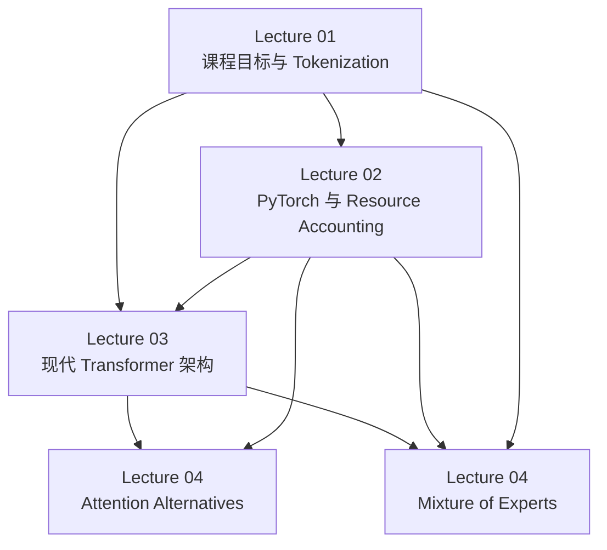

本模块只基于以下四个讲次目录根部的 `NOTES.md` 以及这些笔记里已经明确引用的代码/PDF 材料整理，不补充任何外部事实，不替课堂口述补全未出现的公式或实现细节。

- Lecture 01： [Overview, tokenization](/courses/stanford-cs336-s26/lectures/001/)
  代码材料： [lecture_01.py](/assets/courses/stanford-cs336-s26/materials/official-materials/lectures/lecture_01.py)
- Lecture 02： [PyTorch, resource accounting](/courses/stanford-cs336-s26/lectures/002/)
  代码材料： [lecture_02.py](/assets/courses/stanford-cs336-s26/materials/official-materials/lectures/lecture_02.py)
- Lecture 03： [Architectures, hyperparameters](/courses/stanford-cs336-s26/lectures/003/)
  课件材料： [lecture_03.pdf](/assets/courses/stanford-cs336-s26/materials/official-materials/lectures/lecture_03.pdf)
- Lecture 04： [Attention alternatives and mixture of experts](/courses/stanford-cs336-s26/lectures/004/)
  课件材料： [lecture_04.pdf](/assets/courses/stanford-cs336-s26/materials/official-materials/lectures/lecture_04.pdf)

## 模块目的

这一模块的目标不是把“大模型所有知识”一次讲完，而是先建立一条能贯穿后续课程的基础链条：

1. 把整门课统一到“固定资源下训练最好模型”的效率视角。
2. 理解 tokenizer 为什么仍然是当前模型体系中的关键接口，以及 BPE 为什么是现实折中。
3. 把 PyTorch tensor、dtype、FLOPs、memory、roofline 变成可手算、可估算、可调试的工程语言。
4. 明确现代 Transformer 的主干共识、超参数默认值、稳定性危险区，以及这些设计为何与系统效率耦合。
5. 看到两条现代扩展路线：为长上下文降成本的 attention alternatives，与为“参数更多但 FLOPs 不同比增长”服务的 MoE。

## 先修要求

- 线性代数基础：向量、矩阵、矩阵乘法、维度匹配。
- 对 Transformer 的最基本认识：attention、FFN、残差、归一化、位置编码。
- 对训练流程有粗略概念：forward、backward、optimizer step。
- 对 GPU 有最低限度认识：存在峰值算力与内存带宽两个约束。
- 对 Unicode 字符串和 UTF-8 字节序列有基本直觉。

## 证据边界

### 本模块可以直接引用的证据

- 四个讲次根部 `NOTES.md` 中明确写出的课堂结论、时间戳、口头公式、易错点、待核对项。
- Lecture 01 与 Lecture 02 笔记中明确标记的 `[代码: lecture_01.py ...]`、`[代码: lecture_02.py ...]`。
- Lecture 03 与 Lecture 04 笔记中明确标记的 `[课件: lecture_03.pdf ...]`、`[课件: lecture_04.pdf ...]`。

### 本模块不做的事

- 不补写笔记中没有出现的论文结论。
- 不把 `[需回听]` 的内容伪装成已确定事实。
- 不把课件或代码中未被笔记明确引用的细节当作已证实结论。
- 不把课堂里的“经验默认值”写成普适定理。

## 讲次推进与相对链接

| 顺序 | 讲次 | 主题推进 | 主要证据 |
| --- | --- | --- | --- |
| 1 | [Lecture 01 Notes](/courses/stanford-cs336-s26/lectures/001/) | 课程总问题、效率视角、tokenization 接口与 BPE 起点 | [lecture_01.py](/assets/courses/stanford-cs336-s26/materials/official-materials/lectures/lecture_01.py) |
| 2 | [Lecture 02 Notes](/courses/stanford-cs336-s26/lectures/002/) | tensor、dtype、einops、FLOPs、MFU、roofline、训练内存权衡 | [lecture_02.py](/assets/courses/stanford-cs336-s26/materials/official-materials/lectures/lecture_02.py) |
| 3 | [Lecture 03 Notes](/courses/stanford-cs336-s26/lectures/003/) | 现代 Transformer 默认项、超参数默认值、稳定性与推理约束 | [lecture_03.pdf](/assets/courses/stanford-cs336-s26/materials/official-materials/lectures/lecture_03.pdf) |
| 4 | [Lecture 04 Notes](/courses/stanford-cs336-s26/lectures/004/) | attention alternatives 与 MoE：长上下文成本和稀疏参数化 | [lecture_04.pdf](/assets/courses/stanford-cs336-s26/materials/official-materials/lectures/lecture_04.pdf) |

## 依赖图



## 模块总主线

四讲可以压缩成一条连续链：

- Lecture 01 先定义目标：在固定资源下训练最好模型，[00:10:01]、[00:11:03]、[01:02:54] 到 [01:03:21] 把 tokenization、systems、scaling、data、alignment 全部收束到 efficiency 视角。
- Lecture 01 后半段再定义输入接口：模型不直接吃字符串，而是吃 token 序列，因此必须先解决 encode/decode、round-trip、compression ratio、词表大小与序列长度之间的张力。[01:05:21] 到 [01:18:59]，[代码: lecture_01.py p.15] 到 [代码: lecture_01.py p.31]
- Lecture 02 把“效率”进一步机械化：任何训练对象都是 tensor，可以按 dtype、元素数和操作形状核算 memory 与 FLOPs；随后用 arithmetic intensity 和 roofline 解释为什么有的算子受 compute 限制，有的受 bandwidth 限制。[代码: lecture_02.py p.4] 到 [代码: lecture_02.py p.30]
- Lecture 03 则回答：如果已经知道资源约束，现代 Transformer 本体该怎样设默认值。这里出现了现代主干的共识项，如 non-residual norm、RMSNorm、GLU、RoPE，以及若干经验超参数比率。[课件: lecture_03.pdf p.10]、[课件: lecture_03.pdf p.15]、[课件: lecture_03.pdf p.23]、[课件: lecture_03.pdf p.35]、[课件: lecture_03.pdf p.37] 到 [课件: lecture_03.pdf p.44]
- Lecture 04 再把问题推到“标准 Transformer 不够时怎么办”：一条路是改 attention，降低长上下文成本；另一条路是改 MLP，借 MoE 在近似不同比增加 FLOPs 的情况下扩参数。[课件: lecture_04.pdf p.4] 到 [课件: lecture_04.pdf p.60]

## Lecture 01：总问题、tokenization 与 BPE

### 这一讲在模块中的作用

Lecture 01 负责两件事：

1. 先把课程所有模块统一成“资源固定时最大化效率”的问题。
2. 再给出 tokenization 这一接口层的现实答案与边界条件。

### 核心时间线

- [00:02:18] 到 [00:10:01]：为什么坚持 from scratch，以及为什么工业化并不让课程失去意义。
- [00:10:01] 到 [00:18:26]：给定数据和算力预算，能造出的最好模型是什么；课程整体 framing 是 efficiency。[代码: lecture_01.py p.4][代码: lecture_01.py p.5]
- [00:27:42] 到 [00:29:18]：basics 单元的入口，tokenization 被定义为“模型操作的原子是什么”。
- [01:05:21] 到 [01:07:56]：tokenizer 的 encode/decode、round-trip 与 compression ratio。
- [01:08:29] 到 [01:11:47]：character、byte、word 三种朴素方案及其失败点。
- [01:11:58] 到 [01:18:59]：BPE 的训练、编码、toy example、作业边界。[代码: lecture_01.py p.15] 到 [代码: lecture_01.py p.31]

### 课堂支持的机制与公式

#### 1. 课程统一目标

- 在 [00:11:03]，课程总体目标被表述为：给定数据与算力预算，求可训练出的最佳模型。
- 在 [01:02:54] 到 [01:03:21]，老师把 tokenization、systems、scaling laws、data filtering 都重述成效率问题。

#### 2. tokenizer 接口

- `encode: 字符串 -> token 索引序列`
- `decode: token 索引序列 -> 字符串`
- round-trip 必须成立：[01:05:45]、[01:07:00]

#### 3. compression ratio

在 [01:07:25] 定义：

$$
\text{compression ratio} = \frac{\text{UTF-8 字节数}}{\text{token 数}}
$$

课堂例子给出 `20 / 8 = 2.5 bytes per token`。[01:07:25]

#### 4. 三种朴素 tokenizer 的问题

- character-level：能 round-trip，但词表巨大且稀有字符多，压缩率差。[01:08:29]
- byte-level：词表固定为 `0..255`，可逆，但 compression ratio = 1，序列太长。[01:09:42] 到 [01:10:26]，[代码: lecture_01.py p.17]
- word-level：token 语义自然，但词表可能极大甚至无界，并引出 OOV/UNK 问题。[01:10:45] 到 [01:11:47]，[代码: lecture_01.py p.28]

#### 5. BPE 的课堂算法

根据 [01:12:55] 到 [01:15:22]，以及 [代码: lecture_01.py p.18]、[代码: lecture_01.py p.19]、[代码: lecture_01.py p.20]、[代码: lecture_01.py p.30]、[代码: lecture_01.py p.31]：

1. 初始 token 是字节。
2. 统计相邻 token pair 的频次。
3. 选最高频 pair。
4. 分配新 token id，例如 `256 + i`。
5. 用 merge 把所有该 pair 替换为新 token。
6. 重复，直到达到所需词表规模或停止条件。

课堂 toy example 是 `the cat in the hat`，其中新 token `256` 表示高频 pair `th`。[01:13:20] 到 [01:14:24]

### 比较与失败模式

#### tokenizer 方案对比

| 方案 | 优点 | 失败模式 | 课堂边界 |
| --- | --- | --- | --- |
| character-level | 可逆 | 词表大、字符稀有、压缩率差 | 不是现实最佳解 |
| byte-level | 词表固定、稳妥可逆 | `compression ratio = 1`，序列过长 | [代码: lecture_01.py p.17] |
| word-level | token 语义自然 | OOV/UNK、词表可能无界 | [代码: lecture_01.py p.28] |
| BPE | 词表大小与压缩率折中 | 课堂实现完整但慢；仍是 heuristic | [代码: lecture_01.py p.20][代码: lecture_01.py p.29] |

#### 本讲明确保留的结论边界

- BPE 是“相当有效、数据驱动的 heuristic”，不是从第一性原理推出的唯一正确方案。[01:17:29]
- 老师仍希望未来不必教 tokenizer，但任何替代方案至少要满足两条性质：
  1. 模型在序列的某种 chunk/abstraction 上运算。
  2. chunk 必须是可变的，以支持 adaptive computation。[01:17:53]，[代码: lecture_01.py p.15]

### 代码证据边界

- 可以直接引用：ByteTokenizer、word tokenizer 示意、BPE 的 merge/encode 相关实现与页面标记。[代码: lecture_01.py p.17] 到 [代码: lecture_01.py p.31]
- 不应补写：tie-breaking、更快实现、pre-tokenization 的具体规则，只能保留课堂已经明确说出的“作业会要求更快、支持 special tokens、使用 pre-tokenization”。[01:16:07][需回听 01:17:04]

### 本讲复习标记

- 关键时间戳： [00:11:03]、[01:05:21]、[01:07:25]、[01:12:55]、[01:17:53]
- 关键材料： [lecture_01.py](/assets/courses/stanford-cs336-s26/materials/official-materials/lectures/lecture_01.py)
- `[需回听 01:13:58]` 最高频 pair 并列时 toy code 的 tie-breaking 只作口头说明。
- `[需回听 01:17:04]` pre-tokenization 的 chunking 细节不应外推。

### Lecture 01 掌握标准

- 能解释课程为什么把 tokenization 放进效率视角，而不是把它当作孤立文本预处理。
- 能写出 tokenizer 的 encode/decode/round-trip 要求。
- 能解释 compression ratio 与 attention 序列长度的关系。
- 能比较 character、byte、word、BPE 的取舍。
- 能口述 BPE 的训练步骤与 toy example 的核心变化。

## Lecture 02：PyTorch、resource accounting 与 roofline

### 这一讲在模块中的作用

Lecture 02 把 Lecture 01 的“效率 framing”落到可估算的机械层面。其关键贡献是：把训练中的对象统一成 tensor，并把内存、FLOPs、吞吐、瓶颈、训练步代价、显存权衡全部用统一语言表达出来。

### 核心时间线

- [00:01:20] 到 [00:03:43]：本讲的两个餐巾纸问题，多久能训完、显存能装多大模型。[代码: lecture_02.py p.3]
- [00:04:43] 到 [00:15:05]：tensor、dtype、mixed precision、CPU/GPU 放置。[代码: lecture_02.py p.4] 到 [代码: lecture_02.py p.6]
- [00:18:03] 到 [00:29:07]：einops 的 einsum、reduce、rearrange 作为维度语义语言。[代码: lecture_02.py p.7] 到 [代码: lecture_02.py p.11]
- [00:30:50] 到 [00:39:20]：线性层 FLOPs、benchmark、MFU。[代码: lecture_02.py p.12]
- [00:40:28] 到 [00:56:57]：arithmetic intensity、memory-bound、compute-bound、roofline。[代码: lecture_02.py p.13] 到 [代码: lecture_02.py p.19]
- [01:00:16] 到 [01:06:47]：backward = 2 × forward，训练步约 `6ND`。[代码: lecture_02.py p.21]
- [01:10:01] 到 [01:17:21]：参数、梯度、optimizer state、activation 内存，以及 gradient accumulation / activation checkpointing。[代码: lecture_02.py p.25]、[代码: lecture_02.py p.28]、[代码: lecture_02.py p.29]、[代码: lecture_02.py p.30]

### 课堂支持的机制与公式

#### 1. tensor memory

课堂基底公式是：

$$
\text{memory} = \text{元素个数} \times \text{每元素字节数}
$$

对应说明见 [代码: lecture_02.py p.5]。

#### 2. dtype 与 mixed precision

- fp32：稳定，但贵。[00:05:33] 到 [00:08:04]
- fp16：省内存、通常更快，但动态范围差，`1e-8` 可能下溢到 `0`。[00:08:06] 到 [00:10:03]
- bf16：总位数与 fp16 相同，但动态范围接近 fp32，是常见 sweet spot。[00:10:03] 到 [00:11:58]
- mixed precision：参数、activation、gradient 常用 bf16，optimizer state 常保留 fp32。[00:11:49] 到 [00:13:06]

#### 3. 线性层 forward FLOPs

对 $x \in \mathbb{R}^{B\times D}$ 与 $w \in \mathbb{R}^{D\times K}$：

$$
\text{FLOPs} \approx 2BDK
$$

也可以写成：

$$
2 \times \text{数据点数} \times \text{参数量}
$$

对应 [00:31:43] 到 [00:34:46]，[代码: lecture_02.py p.12]

#### 4. 训练一步 FLOPs

在 [01:05:05] 到 [01:06:19]，以及 [代码: lecture_02.py p.21]：

- backward 需要输入梯度与参数梯度两次 matmul。
- 因此单层 `backward ≈ 2 × forward`。
- 推广后：

$$
\text{forward} \approx 2ND
$$

$$
\text{backward} \approx 4ND
$$

$$
\text{training step} \approx 6ND
$$

这里 `N` 是参数量，`D` 是数据点数或 token 数量级；长上下文 Transformer 中注意力平方项会让该近似失真。[01:06:24] 到 [01:06:47]

#### 5. arithmetic intensity 与 roofline

在 [00:45:56] 到 [00:56:57]，以及 [代码: lecture_02.py p.14]、[代码: lecture_02.py p.19]：

$$
\text{arithmetic intensity} = \frac{\text{FLOPs}}{\text{bytes}}
$$

$$
\text{accelerator intensity} = \frac{\text{硬件 FLOP/s}}{\text{bytes/s}}
$$

- 若 `arithmetic intensity < accelerator intensity`，则 memory-bound。
- 若 `arithmetic intensity > accelerator intensity`，则 compute-bound。

#### 6. benchmark 与 MFU

在 [00:34:46] 到 [00:39:20]：

$$
\text{actual FLOP/s} = \frac{\text{逻辑 FLOPs}}{\text{实测 wall-clock time}}
$$

$$
\text{MFU} = \frac{\text{actual FLOP/s}}{\text{promised FLOP/s}}
$$

课堂明确提醒 GPU benchmark 前后要 `cuda synchronize`，否则异步执行会造成假快结果。

#### 7. 内存分类

根据 [01:10:01] 到 [01:17:21] 与 [代码: lecture_02.py p.25]：

- 参数内存：`2 × num_parameters` bytes，按 bf16 计。
- 梯度内存：`2 × num_parameters` bytes，按 bf16 计。
- AdaGrad state：`4 × num_parameters` bytes，按 fp32 计。
- Adam state：`8 × num_parameters` bytes，按 fp32 计。
- activation 内存：`2 × B × D × L` bytes，按 bf16 计。

#### 8. 显存权衡

- gradient accumulation：大 batch 切成多个 micro-batch，等效大 batch 不变，但单次 activation memory 下降。[代码: lecture_02.py p.28]
- activation checkpointing：用重算换显存。[代码: lecture_02.py p.29][代码: lecture_02.py p.30]
- 课堂给出的 checkpoint 频率直觉：
  - 全存：memory $O(L)$
  - 全不存：重算代价约 $O(L^2)$
  - 每隔 $\sqrt{L}$ 层存一次：memory 与额外重算都约 $O(\sqrt{L})$

### 比较与失败模式

#### 常见误解

- 把 FLOPs 和 FLOP/s 混为一谈。
- 以为 memory 只影响“装不装得下”，忽略 bandwidth 对吞吐的约束。
- 以为算式更复杂就一定更慢；如果都 memory-bound，不一定成立。
- 忽略 optimizer state，只盯参数和梯度。
- 机械套用 `6ND`，却忘记长上下文注意力平方项可能变重要。

#### 课堂支持的对比结论

| 对象 | 典型结论 |
| --- | --- |
| ReLU / GELU 等逐点算子 | 常 memory-bound |
| dot product / matrix-vector | 常 memory-bound |
| 大矩阵乘法 | 常更接近 compute-bound |
| Transformer 训练 | 更像大矩阵乘法主导 |
| Transformer 解码 | 更像 matrix-vector，因此偏 memory-bound |

### 代码证据边界

- 可以直接引用：tensor、dtype、einops、FLOPs、optimizer state、checkpoint 的课堂代码页编号。[代码: lecture_02.py p.4] 到 [代码: lecture_02.py p.30]
- 不应补写：H100 或 B200 规格表的更多细节、课外 GPU 知识、未在笔记中稳定给出的数值修正。

### 本讲复习标记

- 关键时间戳： [00:31:43]、[00:45:56]、[01:05:05]、[01:10:24]、[01:13:20]
- 关键材料： [lecture_02.py](/assets/courses/stanford-cs336-s26/materials/official-materials/lectures/lecture_02.py)
- `[需回听]` H100 例题与若干现场口头修正，不能把瞬时口误当成最终数字。

### Lecture 02 掌握标准

- 能独立估一个 tensor、线性层、训练步的大致 FLOPs 和内存。
- 能解释 bf16 为何在训练里常被偏好于 fp16。
- 能从算术强度判断一个工作负载更偏 memory-bound 还是 compute-bound。
- 能解释 `6ND` 从哪里来，以及它什么时候会失真。
- 能根据显存瓶颈区分何时更优先考虑 gradient accumulation，何时更优先考虑 activation checkpointing。

## Lecture 03：现代 Transformer 默认项、超参数与稳定性

### 这一讲在模块中的作用

Lecture 03 解决的问题是：在 Lecture 02 已经明确资源约束之后，现代 Transformer 的主干应当怎样选默认项。课程给出的答案不是“唯一真理”，而是一套来自大量模型报告的高可信经验汇总。

### 核心时间线

- [00:00:06] 到 [00:02:57]：本讲方法论是“看很多模型报告”，以及 A1 对应的现代 Transformer 变体。[课件: lecture_03.pdf p.2][课件: lecture_03.pdf p.3][课件: lecture_03.pdf p.4]
- [00:07:30] 到 [00:20:04]：norm 放置、pre-norm / non-residual norm、RMSNorm、去 bias。[课件: lecture_03.pdf p.10] 到 [课件: lecture_03.pdf p.19]
- [00:20:15] 到 [00:30:03]：GLU 与 parallel block 的经验结论。[课件: lecture_03.pdf p.20] 到 [课件: lecture_03.pdf p.29]
- [00:30:03] 到 [00:38:54]：RoPE 的相对位置目标与二维旋转实现。[课件: lecture_03.pdf p.30] 到 [课件: lecture_03.pdf p.35]
- [00:43:40] 到 [01:04:04]：超参数默认值：`d_ff / d_model`、head 维度、深宽比、regularization、词表等。[课件: lecture_03.pdf p.37] 到 [课件: lecture_03.pdf p.51]
- [01:05:02] 到 [01:29:08]：softmax 稳定性、QK norm、soft-capping、KV cache、GQA、长上下文 attention 混合。[课件: lecture_03.pdf p.54] 到 [课件: lecture_03.pdf p.65]

### 课堂支持的机制与公式

#### 1. non-residual norm / pre-norm

- 核心结论：不要把 norm 放进残差主干；“keep your residual stream clean”。[00:10:39] 到 [00:12:44]，[课件: lecture_03.pdf p.12]
- 边界：并不意味着只能 pre-norm，也可以有 non-residual post-norm 与 double norm 变体。[00:12:46] 到 [00:13:55]，[课件: lecture_03.pdf p.13]

#### 2. RMSNorm 与去 bias

- RMSNorm 只做 RMS 缩放，不减均值，也不带 bias。[00:14:15] 到 [00:14:27]，[课件: lecture_03.pdf p.14]
- 课堂动机更偏 runtime 与数据搬运，而不是只看 FLOPs。[00:14:47] 到 [00:17:33]，[课件: lecture_03.pdf p.15][课件: lecture_03.pdf p.16]

#### 3. GLU

课堂给出的结构化形式包括：[课件: lecture_03.pdf p.21] 到 [课件: lecture_03.pdf p.23]

- 普通 ReLU FFN：

$$
FF(x) = \max(0, xW_1)W_2
$$

- GeLU FFN：

$$
FF(x) = GELU(xW_1)W_2
$$

- ReGLU：

$$
FF_{ReGLU}(x) = (\max(0, xW_1) \otimes xV)W_2
$$

- GeGLU / SwiGLU 沿用同一门控结构，只是把激活换成 GeLU 或 Swish。[课件: lecture_03.pdf p.23]

#### 4. GLU 对超参数的反作用

由于门控多一个矩阵，为保持参数量近似不变，`d_ff` 常做 `2/3` 修正：[00:24:16] 到 [00:24:58]，[课件: lecture_03.pdf p.23]

$$
d_{ff} \approx \frac{8}{3} d_{model}
$$

这是课堂给出的常见经验值之一。

#### 5. RoPE 的目标式

Lecture 03 把 RoPE 的关键目标写成：[00:33:31] 到 [00:33:47]，[课件: lecture_03.pdf p.31]

$$
\langle f(x,i), f(y,j) \rangle = g(x,y,i-j)
$$

也就是交互只依赖相对位置差，而不依赖绝对位置本身。

课堂说明高维实现并不是任意高维整体旋转，而是把坐标两两配对，做二维旋转，并使用不同频率覆盖近邻与长程关系。[00:36:00] 到 [00:37:36]，[课件: lecture_03.pdf p.33]

#### 6. 三条经验性超参数默认

Lecture 03 明确给出的经验关系包括：[课件: lecture_03.pdf p.37]、[课件: lecture_03.pdf p.38]、[课件: lecture_03.pdf p.42]、[课件: lecture_03.pdf p.44]

$$
d_{ff} = 4d_{model}
$$

$$
\text{GLU 下常改为约 } \frac{8}{3}d_{model}
$$

$$
num\_heads \times head\_dim \approx d_{model}
$$

$$
\frac{d_{model}}{n_{layers}} \approx 100
$$

课堂反复强调：这些是“安全默认值”，不是数学定理。[00:47:55] 到 [00:49:57]

### attention、推理与稳定性边界

- softmax 是危险区；输出 softmax 的 z-loss、attention softmax 的 QK norm 与 soft-capping，都是围绕数值稳定性展开。[课件: lecture_03.pdf p.54] 到 [课件: lecture_03.pdf p.56]
- 训练/prefill 与生成推理不同；KV cache 使得 K/V 头压缩变得重要，因此 GQA 比 MQA 更符合现实折中。[课件: lecture_03.pdf p.58] 到 [课件: lecture_03.pdf p.63]
- 长上下文仍是活跃创新区，full/local 交替 attention 被作为当代主线之一。[课件: lecture_03.pdf p.64][课件: lecture_03.pdf p.65]

### 比较与失败模式

#### 课堂支持的对比

| 设计面 | 现代主流倾向 | 失败模式或边界 |
| --- | --- | --- |
| norm 放置 | non-residual norm，通常 pre-norm | post-norm 更不稳；但 non-residual post-norm 仍存在 |
| norm 类型 | RMSNorm | 若只用 FLOPs 解释其收益会误判 |
| FFN 激活 | 门控 GLU 家族常见 | GLU 不是逻辑必需，非 GLU 仍能工作 |
| 位置编码 | RoPE | 仍有 p-RoPE 等局部变体；不代表位置问题已终结 |
| parallel blocks | 有系统好处 | 近年不够主流，可能损失表示能力 |
| 超参数默认 | 宽可用盆地 | 安全默认值不等于放之四海皆准 |

#### 本讲明确指出的易错点

- 不要把 prenorm 理解成唯一可能形式。
- 不要把 RMSNorm 的收益简化成“FLOPs 更少”。
- 不要把 GLU 看成绝对必要条件。
- 不要把 regularization 在 LM 里简单理解成“防过拟合”；weight decay 常更像优化干预。[00:59:55] 到 [01:03:19]

### PDF 证据边界

- 可以直接引用：被笔记明确标出的课件页码与课堂口述逻辑。[课件: lecture_03.pdf p.2] 到 [课件: lecture_03.pdf p.65]
- 不应补写：OCR 不稳的公式细节、作者名修正、Gemma 4 等口述术语的课外含义。

### 本讲复习标记

- 关键时间戳： [00:07:30]、[00:14:47]、[00:24:16]、[00:33:31]、[00:47:55]
- 关键材料： [lecture_03.pdf](/assets/courses/stanford-cs336-s26/materials/official-materials/lectures/lecture_03.pdf)
- `[需回听]` RMSNorm 的 OCR 公式、作者名与若干 Gemma 4 口述术语不能自行精修为课外版本。

### Lecture 03 掌握标准

- 能解释为什么现代模型要把 norm 移出残差主干。
- 能说明 RMSNorm、去 bias 与 runtime/数据搬运的关系。
- 能写出 GLU 的基本门控结构，并解释为何 `d_ff` 要做 `2/3` 修正。
- 能口述 RoPE 的目标式与二维旋转直觉。
- 能记住三条常用超参数默认，并明确它们只是经验起点。

## Lecture 04：attention alternatives 与 MoE

### 这一讲在模块中的作用

Lecture 04 回答的是“标准 dense Transformer 再往前扩，最先撞到什么墙”。课堂给出两条答案：

1. 上下文一长，attention 成本会主导，所以需要 attention alternatives。
2. 想让参数更多但不想 FLOPs 等比例增长，就需要 MoE。

### 核心时间线

- [00:01:33] 到 [00:09:50]：长上下文动机、flash attention 与 linear attention 起点。[课件: lecture_04.pdf p.2] 到 [课件: lecture_04.pdf p.5]
- [00:10:01] 到 [00:19:57]：Minimax M1、Mamba-2、gated delta net、hybrid ratio 的经验边界。[课件: lecture_04.pdf p.6] 到 [课件: lecture_04.pdf p.11]
- [00:22:54] 到 [00:29:07]：DSA 作为另一条稀疏 attention 路线。
- [00:34:23] 到 [00:49:53]：MoE 的动机、expert parallel、token-level routing、设计空间。[课件: lecture_04.pdf p.14] 到 [课件: lecture_04.pdf p.26]
- [00:49:53] 到 [01:09:48]：TopK routing、shared experts、load balancing、DeepSeek / OlMoE 对比。[课件: lecture_04.pdf p.36] 到 [课件: lecture_04.pdf p.43]
- [01:09:51] 到 [01:26:16]：system issues、router stability、fine-tuning overfit、upcycling、DeepSeek v1/v2/v3、MLA、MTP。[课件: lecture_04.pdf p.48] 到 [课件: lecture_04.pdf p.60]

### 课堂支持的机制与公式

#### 1. linear attention 的起点

在 [00:05:47] 到 [00:07:54]：

```text
Attn(Q, K, V) = ρ(QK^T)V
若暂时把 ρ 视为恒等：
QK^TV = Q(K^TV)
```

这一步的关键不是“完全等价于 softmax attention”，而是先去掉 softmax，再用矩阵乘法结合律把依赖从 `n^2` 改成和 `d_k`、`d_v` 更相关的线性项。[课件: lecture_04.pdf p.4]

#### 2. 递推 duality

在 [00:07:54] 到 [00:09:50]：

```text
S_t = S_{t-1} + k_t v_t^T
y_t = q_t^T S_t
```

课堂结论是：线性 attention 可以同时有并行训练形式和递推推理形式。[课件: lecture_04.pdf p.5]

#### 3. Mamba-2 的课堂解释框架

在 [00:11:12] 到 [00:14:16]：

```text
S_t = γ_t S_{t-1} + k_t v_t^T
y_t = q_t^T S_t + v_t^T D
γ_t = f(x_t)
```

要点是 `γ_t` 只依赖输入，不依赖状态，因此 duality 仍保住。[课件: lecture_04.pdf p.7]

#### 4. gated delta net

在 [00:14:16] 到 [00:18:21]：

```text
S_t = γ_t (I - β_t k_t k_t^T) S_{t-1} + β_t k_t v_t^T
y_t = q_t^T S_t
γ_t = f(x_t), β_t = f(x_t)
```

课堂解释里：

- `β_t = 0` 可视为 no-input gate。
- `I - β_t k_t k_t^T` 近似“擦除当前 key 方向旧信息”的直觉，但老师明确说这只是近似解释，不是严格投影证明。[课件: lecture_04.pdf p.9]

#### 5. DSA 的课堂机制

根据 [00:22:54] 到 [00:29:07]：

1. 用轻量 indexer 看全上下文。
2. 通过 `qk`、`ReLU`、`TopK` 等步骤选出少量候选位置。
3. 只在候选子集上做 full attention。

课堂明确给出边界：DSA 不是严格线性时间，因为 indexer 仍要看全体 token；它的收益在于把“重”的 full attention 缩到小子集上。

#### 6. MoE 的最小心智模型

在 [00:34:23] 到 [00:36:50]：

```text
Dense FFN -> Many FFNs + Router
总参数增加
单次只激活少量 experts
因此 FLOPs 不随总参数线性增加
```

这是 Lecture 04 的总结构。

#### 7. TopK routing

在 [00:49:53] 到 [00:54:21]：

```text
输入 u
-> 轻量 router 计算每个 expert 的分数
-> 对分数做 softmax / TopK
-> 选中的 gates 控制 experts 激活
-> expert 输出与残差一起形成层输出
```

课堂边界：router 往往非常朴素，通常只是内积或小线性映射，不是高层语义专家系统。

#### 8. balancing loss

在 [01:03:13] 到 [01:07:53]：

- `F_i`：dispatch 到 expert `i` 的 token 比例。
- `P_i`：router 分给 expert `i` 的概率质量。

课堂不强调死记公式，而强调梯度方向：热门 expert 会在 balancing loss 下受到更强的“下压”，以抑制 rich-get-richer。[课件: lecture_04.pdf p.40]

### 比较与失败模式

#### attention alternatives 的对比

| 路线 | 核心想法 | 课堂支持的收益 | 失败模式或边界 |
| --- | --- | --- | --- |
| local/global hybrid | 减少 full attention 频率 | 比纯全局更省 | 对超长上下文可能不够 |
| flash attention | 不改大 O，优化常数与内存搬运 | 吞吐提升显著 | 不是架构替代 |
| linear attention | 去 softmax 后重排 | 训练并行、推理递推 | 真正有损的是去掉 softmax 这一步 |
| Mamba-2 / gated delta net | 在线性递推上加输入依赖门控 | 保留 duality，同时增强状态更新能力 | hybrid ratio 太高时性能下降 |
| DSA | 先粗筛，再对子集做 full attention | 长上下文损失小、扩展性更好 | 不严格线性，indexer 仍看全局 |

#### MoE 的对比与失败模式

| 设计点 | 课堂结论 | 失败模式 |
| --- | --- | --- |
| learned TopK routing | 主流现实共识 | 不平衡会 collapse / starvation |
| hash routing | 能作为 baseline | 通常不如 learned TopK |
| RL routing | 理论上自然 | 梯度方差大、随机性强、工程复杂 |
| shared experts | 在 DeepSeek 里常有效 | 在 OlMoE 里不构成无条件共识 |
| expert parallel | 增加并行维度 | 伴随通信瓶颈 |
| sparse MoE fine-tuning | 参数容量大 | 小数据微调容易过拟合 |

#### 本讲明确指出的关键失败模式

- 把 linear attention 的并行形式与递推形式等价，误读成“它与 full softmax attention 等价”。不是，真正有损的是去掉 `ρ`/softmax 那一步。[00:20:42] 到 [00:21:36]
- 以为 experts 会自然变成“医学专家”“法律专家”。课堂明确说大多只是输入模式偏好。[01:10:20] 到 [01:11:03]
- 把 balancing loss 当装饰。OlMoE 消融表明去掉后会出现 expert collapse。[01:07:53] 到 [01:09:48]
- 忽略 router softmax 的数值稳定性。router 常用 Float32，必要时加 z-loss。[01:16:36] 到 [01:18:11]
- 忽略稀疏 MoE 的微调过拟合风险。小数据下常更适合只微调 attention 或非-MoE MLP。[01:18:11] 到 [01:19:40]

### PDF 证据边界

- 可以直接引用：linear attention 起点、Mamba-2 / gated delta net 的课堂公式、DeepSeek 系列与 balancing 的课件页码。[课件: lecture_04.pdf p.4] 到 [课件: lecture_04.pdf p.60]
- 不应补写：DSA 更完整公式、shared expert 必然有效的更强结论、DeepSeek MLA 与 MTP 的课外细节。

### 本讲复习标记

- 关键时间戳： [00:05:47]、[00:11:12]、[00:22:54]、[00:49:53]、[01:03:13]、[01:16:36]
- 关键材料： [lecture_04.pdf](/assets/courses/stanford-cs336-s26/materials/official-materials/lectures/lecture_04.pdf)
- `[需回听]` DSA indexer 的更完整公式细节、若干 shared expert 并行化问答、MLA 与 KV cache 兼容性的口头细节。

### Lecture 04 掌握标准

- 能写出 linear attention 的重排式与递推式。
- 能解释 Mamba-2 与 gated delta net 为什么仍保留 duality。
- 能说明 DSA 为什么有效、为什么又不严格线性。
- 能描述 MoE 的最小结构、TopK routing 流程与 balancing 的必要性。
- 能说清 expert parallel、router instability 与 fine-tuning overfit 这三个系统/训练风险。

## 跨讲整合：从 tokenizer 到现代架构

### 一条贯穿四讲的因果链

1. Lecture 01 先定义“模型实际上操作 token 序列”，所以分词策略会直接影响序列长度、词表大小与后续 attention 成本。
2. Lecture 02 把“序列长度和模型形状的代价”翻译成 memory、FLOPs、MFU 与 roofline。
3. Lecture 03 在这个代价框架上解释现代 Transformer 为什么偏好某些默认项：更稳定的残差流、更少搬运的 RMSNorm、更高效的门控 FFN、推理友好的 K/V 头压缩。
4. Lecture 04 则处理标准 Transformer 的两个极限：
   - 上下文过长时，dense attention 成本过高。
   - 参数继续扩时，dense FFN 的 FLOPs 成本过高。

### 这一模块真正要形成的能力

- 不是孤立背诵 tokenization、PyTorch、RoPE、MoE 这些名词。
- 而是看到：
  - 输入抽象方式会影响序列长度；
  - 序列长度会影响 attention 与显存；
  - 显存与 bandwidth 会反过来约束架构默认值；
  - 架构默认值与训练稳定性又决定 scaling 与部署能否走通。

## 模块级复习标记

### 必看锚点

- Lecture 01：[01:05:21]、[01:07:25]、[01:12:55]、[01:17:53]
- Lecture 02：[00:31:43]、[00:45:56]、[01:05:05]、[01:13:20]
- Lecture 03：[00:10:39]、[00:24:16]、[00:33:31]、[00:47:55]
- Lecture 04：[00:05:47]、[00:14:16]、[00:49:53]、[01:03:13]、[01:16:36]

### 高风险误区

- 把 tokenizer 当成“纯历史包袱”。
- 把 FLOPs 当成 runtime 的全部。
- 把现代 Transformer 默认值当成数学真理而不是安全经验起点。
- 把 linear attention 的 duality 误解成与 softmax attention 等价。
- 把 MoE 的难点只理解为“多几个 FFN”，忽略 load balancing、通信和 router 稳定性。

### `[需回听]` 汇总

- `[需回听 00:05:59]` Lecture 01 中 FLOPs 比例变化出处与年份。
- `[需回听 00:12:54]` Lecture 01 中 Adam/attention 相关 ASR 误识。
- `[需回听 01:17:04]` Lecture 01 中 pre-tokenization 的口头细节。
- `[需回听]` Lecture 02 中 H100 数字口头修正与若干 benchmark 数值瞬时口误。
- `[需回听]` Lecture 03 中 RMSNorm OCR 公式、作者名、Gemma 4 若干术语。
- `[需回听]` Lecture 04 中 DSA indexer 公式、shared expert 并行化与 MLA/KV cache 兼容性细节。

## 模块掌握标准

学完本模块，至少应能做到：

1. 从字符串到 token，再到 attention 成本，说明 tokenizer 为什么会影响整个模型设计。
2. 用 tensor、dtype、FLOPs、bytes、MFU、roofline 解释一个训练/推理工作负载的主要瓶颈。
3. 说清现代 Transformer 为什么偏好 non-residual norm、RMSNorm、GLU、RoPE。
4. 在不查资料的情况下写出 `2BDK`、`6ND`、`arithmetic intensity`、RoPE 目标式、linear attention 重排式与递推式。
5. 用“表达力、稳定性、效率”三角，比较标准 Transformer、attention alternatives 与 MoE。

## 12 个累进练习

### 1. 为什么这四讲没有把 tokenization、systems、architecture、MoE 当成四门互不相关的课？

答：因为课堂反复把它们统一成“固定资源下最大化效率”的同一个目标；tokenization 影响序列长度，systems 量化代价，architecture 决定默认设计，MoE/attention alternatives 处理扩展极限。

### 2. tokenizer 至少必须满足什么条件？

答：必须支持 `encode` 与 `decode`，并保证 round-trip 成立。[01:05:45][01:07:00]

### 3. 为什么 byte-level tokenizer 虽然稳妥，却仍不是课堂偏好的最终方案？

答：因为它的 `compression ratio = 1`，序列太长，后续 attention 成本高。[01:10:26]

### 4. BPE 相比 character/byte/word 三类方案到底折中了什么？

答：它在词表大小与压缩率之间折中；高频字节序列可合并成单 token，稀有序列保留成更细单位，因此既可逆，又不必接受 byte-level 的超长序列或 word-level 的 OOV/UNK 问题。[01:12:28] 到 [01:15:08]

### 5. 为什么 Lecture 02 把一切都改写成 tensor？

答：因为 data、parameters、gradients、optimizer state、activations 都是 tensor；只要对象统一，memory 与 FLOPs 才能统一核算。[代码: lecture_02.py p.4]

### 6. `2BDK` 和 `6ND` 之间是什么关系？

答：`2BDK` 是单个线性层 forward 的 matmul FLOPs；把参数量视角推广后得到 `2 × 数据点数 × 参数量`，再加上 backward 两份同量级 matmul，就得到训练步约 `6ND`。[代码: lecture_02.py p.12][代码: lecture_02.py p.21]

### 7. 为什么 GELU 不一定比 ReLU 慢很多？

答：课堂给出的关键原因是两者都可能仍处在 memory-bound 区域，瓶颈在数据搬运而不是多出的算术操作。[00:47:43] 到 [00:49:41]

### 8. 现代 Transformer 为什么把 norm 移出残差主干？

答：为了“keep your residual stream clean”，让前向信号和反向梯度更容易沿残差通路传播，从而减轻 gradient spikes、提高深层训练稳定性。[00:10:39] 到 [00:13:26]

### 9. 为什么 GLU 往往要把 `d_ff` 缩到原来的 `2/3` 左右？

答：因为门控结构多了一个矩阵；若不缩小 `d_ff`，参数量会明显增加，失去与普通 FFN 的可比性。[00:24:16] 到 [00:24:58]

### 10. RoPE 相比“把位置向量加到 embedding 上”想保住的核心性质是什么？

答：它希望 token 交互只依赖相对位置差，即 `<f(x,i), f(y,j)> = g(x,y,i-j)`，避免绝对位置交叉项主导表示。[00:33:31] 到 [00:38:54]

### 11. linear attention 的性能损失到底来自哪里？

答：来自更早一步把 `ρ`/softmax 去掉、把 full attention 线性化；线性 attention 的并行形式与递推形式之间的互换本身是精确等价的。[00:20:42] 到 [00:21:36]

### 12. MoE 为什么不是“多放几个专家就行”这么简单？

答：因为训练时也必须保持稀疏，否则 FLOPs 优势消失；同时还会出现 TopK 不可导、expert collapse、通信瓶颈、router softmax 稳定性、小数据微调过拟合等问题，所以必须配 balancing、expert parallel 和稳定性技巧一起设计。[00:42:34] 到 [00:49:53]，[01:03:13] 到 [01:19:40]

## 建议复习顺序

1. 先复习 Lecture 01 的总 framing 与 tokenizer 接口：先把“为什么这门课的一切都在谈效率”理顺，再看 tokenization 不是孤立预处理而是模型输入接口。
2. 再复习 Lecture 01 的 tokenization 对比与 BPE：先记 character/byte/word 为什么都不满意，再记 BPE 为什么成为现实折中。
3. 然后复习 Lecture 02 的四个核心公式：tensor memory、`2BDK`、`6ND`、`arithmetic intensity`。
4. 再看 Lecture 03 的现代默认项：先 norm，再 GLU，再 RoPE，最后超参数默认值与稳定性技巧。
5. 最后复习 Lecture 04：先 attention alternatives，再 MoE。原因是 MoE 的 many-FFN + sparse routing 直觉，建立在前面已经理解 FFN、attention 成本和系统约束之上。

## 一页式结论

- Lecture 01 说清“模型先吃 token，不直接吃字符串”；因此 tokenizer 的抽象方式会影响序列长度、词表大小和后续全部计算。
- Lecture 02 说清“训练中的一切都能按 tensor、bytes、FLOPs 来估”；不做 resource accounting，就无法判断真正瓶颈。
- Lecture 03 说清“现代 Transformer 改动其实集中在少数高价值默认项上”；关键不是追求花哨，而是兼顾稳定性、表达力与 runtime。
- Lecture 04 说清“继续扩展时，两堵墙最硬”：attention 的长上下文成本，以及 dense FFN 的参数扩展成本；对应的现实主线就是 attention alternatives 与 MoE。
