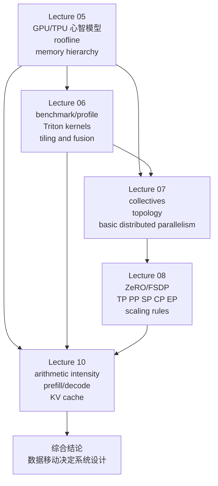

## 模块定位

这个模块把课程从“单卡硬件直觉”推进到“单卡 kernel 设计”，再推进到“多卡并行训练”，最后落到“在线推理系统”。它回答的是同一条主线：当算力增长快于数据搬运能力时，系统设计为什么会越来越像一门“减少错误位置的数据移动”的学问，而不是单纯堆 FLOPs。[Lecture 05, 00:25:32-00:26:43; 课件: lecture_05.pdf p.25][Lecture 06, 00:22:09-00:22:31][Lecture 07, 00:01:13-00:03:16; 代码: lecture_07.py p.2][Lecture 10, 00:34:58-00:39:34]

本模块只基于以下五份课程笔记整理，不引入外部资料、不补写未在这些笔记中明确出现的实现细节：

1. [Lecture 05 NOTES](/courses/stanford-cs336-s26/lectures/005/)
2. [Lecture 06 NOTES](/courses/stanford-cs336-s26/lectures/006/)
3. [Lecture 07 NOTES](/courses/stanford-cs336-s26/lectures/007/)
4. [Lecture 08 NOTES](/courses/stanford-cs336-s26/lectures/008/)
5. [Lecture 10 NOTES](/courses/stanford-cs336-s26/lectures/010/)

## 学习目的

完成本模块后，你应当能把以下四件事连成一条因果链，而不是当成彼此独立的技巧清单：

1. 用 GPU/TPU 的层级结构解释为什么 roofline、arithmetic intensity 和 memory hierarchy 是后续一切优化的根。[Lecture 05, 00:10:22-00:12:35][Lecture 05, 00:31:11-00:32:54]
2. 用 Triton 的 block 视角解释 kernel fusion、row-wise reduction、tiling 与 shared memory 复用是怎么落到代码里的。[Lecture 06, 00:39:57-00:49:56][Lecture 06, 01:12:41-01:18:31]
3. 用 collective、链路层次与状态账本解释 data parallel、ZeRO/FSDP、tensor parallel、pipeline parallel、sequence/context/expert parallel 为什么各自适合不同硬件和瓶颈。[Lecture 07, 00:10:02-00:20:00][Lecture 08, 00:12:01-01:09:57]
4. 用 prefill/decode、KV cache、memory-bound generation attention、speculative sampling、continuous batching、paged attention 解释现代 LLM inference 为什么是独立系统问题。[Lecture 10, 00:07:07-00:08:21][Lecture 10, 00:29:54-00:39:53][Lecture 10, 01:11:44-01:25:06]

## 先修要求

1. 你需要已经知道矩阵乘法、softmax、attention、MLP 的基本数学对象，否则后文只能记概念名词，无法建立可迁移心智模型。[Lecture 05, 学习目标与先修知识][Lecture 06, 需要的先修知识]
2. 你需要接受一个简单但会反复出现的工程判断：正确性抽象和性能抽象不是同一层。PyTorch/Triton/PTX 可以帮你写对，但真正的快慢受 SM、warp、bank、HBM、互连拓扑等硬件事实控制。[Lecture 06, 00:07:05-00:08:26][Lecture 06, 01:22:13-01:24:18]
3. 你需要熟悉训练态的参数、梯度、optimizer state 与激活的区别，因为 Lecture 07-08 的并行方案本质上都在重分配这些对象的放置位置和同步方式。[Lecture 07, 00:03:17-00:04:12][Lecture 08, 00:14:07-00:16:49]

## 精确学习推进顺序

按下面顺序学习，不要跳读。这个顺序本身就是课程论证的一部分。

1. [Lecture 05 NOTES](/courses/stanford-cs336-s26/lectures/005/)
目的：先建立 SM、warp、shared/global memory、roofline、control divergence、low precision、fusion、recomputation、coalescing、tiling 这套单卡词汇表，再看 FlashAttention 如何把这些词汇组合成算法。[Lecture 05, 00:03:19-00:04:10][Lecture 05, 01:12:06-01:17:12]
2. [Lecture 06 NOTES](/courses/stanford-cs336-s26/lectures/006/)
目的：把上一讲的高层性能直觉下沉到 benchmark/profile/Triton kernel，学会从 element-wise 走到 row reduction，再走到 matmul tiling 与简单 fusion。[Lecture 06, 老师的教学主线][Lecture 06, 00:57:16-00:58:05]
3. [Lecture 07 NOTES](/courses/stanford-cs336-s26/lectures/007/)
目的：把“单卡上的远端数据”推广成“多卡/多节点上的远端数据”，先掌握 collectives、拓扑与 `torch.distributed` 骨架，再建立 data/tensor/pipeline parallel 的第一版模型。[Lecture 07, 老师的教学主线][Lecture 07, 00:23:22-00:29:59]
4. [Lecture 08 NOTES](/courses/stanford-cs336-s26/lectures/008/)
目的：在并行训练层面补上 ZeRO/FSDP、activation memory、sequence/context/expert parallel 与现实配置启发式，把“怎么 fit 模型、怎么吃掉剩余 GPU”讲透。[Lecture 08, 老师的教学主线][Lecture 08, 01:03:19-01:07:58]
5. [Lecture 10 NOTES](/courses/stanford-cs336-s26/lectures/010/)
目的：回到单模型执行，但现在对象变成在线服务与自回归 decode。你需要用前四讲已经建立的 memory 视角解释 inference bottleneck、KV cache、压缩机制与动态批处理系统。[Lecture 10, 老师的教学主线][Lecture 10, 01:23:46-01:25:06]

## 依赖图

## 一条总主线

这五讲虽然表面上分别在讲硬件、kernel、分布式训练和推理，但真正贯穿始终的是同一个判断：

1. 单卡上，compute 增长快于 memory bandwidth，所以首先要尊重 memory hierarchy，而不是只盯 FLOPs。[Lecture 05, 00:25:32-00:26:43]
2. kernel 层面，越快的实现越像“更少次 HBM 往返、更高局部复用、更少 branch 浪费”的实现。[Lecture 06, 00:31:48-00:35:28][Lecture 06, 01:14:44-01:18:31]
3. 多卡上，HBM 的“远端”被扩展成另一张 GPU、另一个 node、另一个 pod，所以并行训练实质上是在不同层级上安排复制、切分与通信。[Lecture 07, 00:01:13-00:03:16][Lecture 08, 00:01:18-00:03:49]
4. 推理里，自回归 generation 让 attention arithmetic intensity 退化到小于 1，因此 decode 的主矛盾变成 memory-bound 的 KV cache 访问与系统调度。[Lecture 10, 00:30:22-00:31:25][Lecture 10, 00:39:53-00:45:49]

## 第一部分：硬件层级与 Roofline

### 1.1 必须先记住的硬件对象

Lecture 05 要你先分清三类对象，而不是把它们混成“GPU 很快”这一句空话：

1. 计算组织：SM、thread、block、warp。[Lecture 05, 00:13:25-00:15:41]
2. 存储层级：register、shared/L1、L2、global/HBM、host memory。[Lecture 05, 00:10:22-00:12:35][Lecture 05, 00:15:48-00:17:18]
3. 执行约束：SIMT，尤其是 warp 内锁步执行这一事实。[Lecture 05, 00:13:25-00:15:41]

后面所有术语都依赖这三组对象。例如“共享内存复用”不是抽象好词，而是指“让 block 落在单个 SM 上，然后多次使用该 SM 上可编程的 shared memory”。“coalesced access”也不是泛指顺序访问，而是指 warp 内线程的 global memory 访问落到同一 burst section 内。[Lecture 05, 00:52:52-00:57:44]

### 1.2 GPU 与 TPU 的共性和边界

在本模块允许的证据里，GPU 与 TPU 的高层共性是：都围绕快 matmul 单元、快本地内存和慢大内存组织，因此都应当被理解成“为了矩阵乘法优化的层级化加速器”。[Lecture 05, 00:17:18-00:23:51]

但边界也很重要：

1. GPU 更像“更多、更小、更灵活”的单元集合；TPU 更像“更大、更少、更偏大 matmul”的单元集合。[Lecture 05, 00:20:53-00:22:23]
2. Lecture 08 进一步把差异推进到网络拓扑：TPU 更偏规则 mesh/toroidal mesh；GPU 集群更像分层 all-to-all/fat tree，更适合不规则通信，例如 MoE token routing。[Lecture 08, 00:04:22-00:06:25]

### 1.3 Roofline、arithmetic intensity 与判断顺序

Lecture 05 明确要求你先问“这个工作负载在 roofline 的哪一侧”。顺序是：

1. 先判断 memory-bound 还是 compute-bound。[Lecture 05, 00:31:11-00:32:54]
2. 如果在左侧 memory-bound 区，优先减少 memory movement，提高 operational intensity。[Lecture 05, 00:31:11-00:32:54]
3. 如果在右侧 compute-bound 区，再谈把算力单元喂满。[Lecture 05, 00:31:11-00:32:12]

这一步决定了后面为什么会出现 seemingly 反常的建议：例如低精度的第一收益是少搬字节，不是先谈数值分析；recomputation 的收益是“多算少存”；FlashAttention 的胜负手也不是“注意力数学定义变了”，而是 “HBM 访问方式被改写了”。[Lecture 05, 00:34:57-00:37:08][Lecture 05, 00:50:13-00:52:37][Lecture 05, 01:12:06-01:17:12]

### 1.4 第一批 failure modes

这里最常见的误判来自把不同层的问题混在一起：

| 误判 | 为什么错 | 证据 |
| --- | --- | --- |
| “shared memory 就是 global memory 的小号版本” | shared memory 是 SM 上的可编程本地存储，global/HBM 在芯片外，物理位置、速度、编程方式都不同 | [Lecture 05, 00:10:22-00:12:35][Lecture 05, 00:12:54-00:13:13] |
| “32 的倍数更快”是神秘经验法则 | 真实原因是 burst、warp、tile、alignment、SM 波次，而不是数字本身有魔法 | [Lecture 05, 01:06:17-01:09:17][Lecture 05, 01:17:15-01:18:29] |
| “occupancy 越高越好” | Lecture 06 明确说 thread coarsening 可能以更低 occupancy 换更高吞吐 | [Lecture 06, 00:11:14-00:12:47] |

## 第二部分：从优化词汇到 kernel 设计

### 2.1 六类单卡优化手段

Lecture 05 第二部分给出六个关键词，但它们不是并列记忆项，而是六种减少浪费的方式：

1. control divergence：减少 warp 内分支空转。[Lecture 05, 00:32:58-00:34:44]
2. low precision：减少 bytes，常先从 matmul 获得最大收益。[Lecture 05, 00:34:57-00:37:08][Lecture 05, 00:44:21-00:45:21]
3. operator fusion：把多次 HBM 往返变成一次读、一次写。[Lecture 05, 00:47:44-00:49:55]
4. recomputation：用算力换存储，把 activation 读写压力降下来。[Lecture 05, 00:50:13-00:52:37]
5. memory coalescing：让 warp 访问模式匹配 burst/line 粒度。[Lecture 05, 00:52:52-00:57:44]
6. tiling：把数据先搬到 shared memory，本地复用，再写回 HBM。[Lecture 05, 00:57:51-01:03:56]

这六个词在 Lecture 06 里会重新出现，但名字可能变成 benchmark/profile、kernel fusion、row-wise reduction 或 matmul tiling。你需要看到它们说的是同一件事的不同层级表述。

### 2.2 Triton 的最小编程模板

Lecture 06 的价值不是教 API，而是把 kernel 设计压缩成一个反复复用的模板：

1. 在 Python 侧决定 grid/block 形状并准备 output tensor。[Lecture 06, 00:39:57-00:42:17]
2. 在 kernel 内先认出“我是谁”，也就是 `pid`、起始 offset 和负责的数据区间。[Lecture 06, 00:43:10-00:44:34]
3. 用 mask 处理边界不整除问题。[Lecture 06, 00:44:40-00:45:07]
4. 执行 read -> compute -> store。[Lecture 06, 00:45:11-00:46:03]

这个模板足够抽象，能覆盖 GeLU、softmax、row-sum 和 matmul。[Lecture 06, 00:49:56-00:50:37][Lecture 06, 01:23:50-01:24:15]

### 2.3 benchmark/profile 为什么要放在写 kernel 前面

Lecture 06 的方法论非常明确：`benchmark/profile -> 修改 -> benchmark/profile`。[Lecture 06, 00:21:49-00:22:31]

原因有三个：

1. benchmark 回答“总共多快”。[Lecture 06, 00:22:36-00:23:21]
2. profiler 回答“慢在什么 kernel，底层实际跑了什么”。[Lecture 06, 00:26:25-00:30:02]
3. 高层语义相同不代表底层 kernel 数量相同。GeLU 的 naive / built-in / compiled 对比就是证据：真正拉开差距的是 kernel fusion 与 HBM 往返次数，不是数学定义不同。[Lecture 06, 00:31:48-00:35:28]

### 2.4 kernel fusion 的最直接证据

Lecture 05 用 `sin^2(x) + cos^2(x)`，Lecture 06 用 GeLU。两讲其实在证明同一件事：

1. 高层表达式若分裂成多个 primitive，各自独立启动 kernel，就会把中间结果写回 HBM，再被后续 kernel 重新读入。[Lecture 05, 00:47:44-00:49:55][Lecture 06, 00:32:19-00:33:49]
2. fused kernel 能把“一次读入、本地做完、多步组合、一次写回”作为标准形态。[Lecture 05, 00:47:44-00:49:55][Lecture 06, 00:34:21-00:35:28]

这也是为什么 matmul 后面顺手接 ReLU 被老师当成几乎“白送”的优化。[Lecture 06, 01:11:53-01:12:38][Lecture 06, 01:18:37-01:18:54]

### 2.5 tiling 的三级理解

你至少要能在三个层级上解释 tiling：

1. 直观层：别每次乘加都回 HBM 取数，先把 tile 放进 shared memory。[Lecture 05, 00:57:51-01:00:18]
2. 定量层：naive `N x N` matmul 中，每个输入元素从 global memory 读 `N` 次；tile 大小为 `T` 时降到 `N/T` 次，全局访问减少 `T` 倍。[Lecture 05, 01:00:18-01:00:58]
3. 实现层：一个输出 tile 对应一个 block；block 沿 `K` 方向循环载入 `A` tile 与 `B` tile，累加到 accumulator，扫完整个 `K` 后再写回。[Lecture 06, 01:19:55-01:21:47]

### 2.6 softmax、row-sum、matmul 为什么必须按这个顺序学

Lecture 06 后半段的 progression 不是随意排的：

1. GeLU 只需要 element-wise 模板。[Lecture 06, 00:39:57-00:49:56]
2. softmax 让你第一次处理 row-wise reduction，但前提是一整行 fit in block。[Lecture 06, 00:58:06-01:04:29]
3. row-sum 解决“row 不 fit in block”的情况，引入同一个 block 对多个 tiles 的显式循环。[Lecture 06, 01:05:24-01:10:48]
4. matmul 则把这个思想推广到二维输出 tile 和沿 `K` 方向的局部累积。[Lecture 06, 01:12:41-01:21:47]

如果你跳过 row-sum 直接看 matmul，很容易只记住索引技巧，而没抓住真正复用的对象是 tile 而不是整块矩阵。

### 2.7 第二批 failure modes

| 误判 | 为什么错 | 证据 |
| --- | --- | --- |
| “Triton 就是在 GPU 上执行 Python” | Triton 是高层 DSL，会被 lower 成 PTX 之类更底层代码；`tl.load` 不是解释器式调用 | [Lecture 06, 00:47:44-00:49:56][Lecture 06, 00:50:41-00:55:07] |
| “softmax 只是 element-wise” | softmax 至少包含 row-wise max、sum 和 normalize，因此是否 fit in block 决定实现形态 | [Lecture 06, 00:58:06-01:04:29][Lecture 06, 01:05:24-01:09:54] |
| “tile 就是 block” | GeLU 切出来的是独立 blocks；row-sum 与 matmul 里，tiles 可能是同一 block 内循环处理的局部片段 | [Lecture 06, 01:10:57-01:11:38] |

## 第三部分：从单卡 memory hierarchy 到多卡通信 hierarchy

### 3.1 先学 collectives，再学并行策略

Lecture 07 的逻辑是正确的：如果你不先掌握 collective 词汇，后面的 data/tensor/pipeline parallel 只会变成图形记忆。

必须掌握的最小集合：

1. gather 与 all-gather。[Lecture 07, 00:10:02-00:13:43]
2. reduce-scatter 与 all-reduce，以及 `all-reduce = reduce-scatter + all-gather` 这个等价分解。[Lecture 07, 00:13:43-00:16:41][Lecture 08, 00:03:14-00:04:36]
3. all-to-all，尤其是它为什么适合 MoE 的 token routing。[Lecture 07, 00:16:48-00:19:44]

这不是通信 API 背诵，而是对象迁移：在 data parallel 里，这些对象是梯度；在 tensor parallel 里，这些对象是激活或 partial sums；在 MoE 里，它们变成 token dispatch。

### 3.2 通信原语必须落在真实拓扑上

Lecture 07 和 Lecture 08 合在一起，给出一个非常重要的层级观：

1. 单机内的快互连，如 NVLink/NVSwitch，比跨节点网络快很多，但仍慢于本地 HBM。[Lecture 07, 00:23:52-00:24:23]
2. 跨 node 常见是 InfiniBand，更外层可能是 Ethernet 或 RoCE。[Lecture 07, 00:24:56-00:29:35]
3. TPU mesh 与 GPU 分层网络的不同，会反过来影响哪种并行方式适合在哪个域内展开。[Lecture 08, 00:04:22-00:06:25]

因此并行策略不是“哪种理论上最好”，而是“哪种在当前链路层次上最值得付通信成本”。

### 3.3 data parallel 到 ZeRO/FSDP 的推进顺序

Lecture 07 给了 data parallel 的第一版：每个 rank 处理本地 batch，再 all-reduce 梯度。[Lecture 07, 00:55:34-01:02:32]

Lecture 08 进一步把它推进成明确的三步节奏：

1. naive DDP：计算扩展好，但每卡都复制完整参数、梯度和状态，显存缩放很差。[Lecture 08, 00:12:01-00:15:05]
2. ZeRO stage 1/2：先切 optimizer state，再切 gradients；通信账本与 all-reduce 近似等价，因此老师称其为 free 或 almost free 的内存收益。[Lecture 08, 00:15:05-00:20:02][Lecture 08, 00:20:02-00:24:57]
3. ZeRO stage 3 / FSDP：参数、梯度、optimizer state 都分片，forward/backward 按层 all-gather，算完立刻释放，并尽量 overlap communication/computation。[Lecture 08, 00:20:26-00:26:10]

这条推进线的意义在于：课程不是在告诉你某个“终极策略”，而是在按对象大小和生命周期，逐步让更多状态从“全复制”变成“按需 materialize”。

### 3.4 tensor parallel 与 pipeline parallel 是互补，不是竞争

Lecture 07 与 Lecture 08 给出的互补关系很清楚：

| 维度 | tensor parallel | pipeline parallel |
| --- | --- | --- |
| 切分对象 | 宽度、矩阵、局部 partial sums | 深度、层、stage 间激活流 |
| 主要通信 | 高频 activation-sized collectives | point-to-point activation / partial gradient |
| 好处 | 没有 pipeline bubble，网络够快时利用率高 | 内存省，适合慢链路 |
| 代价 | 极吃快互连，跨 node 性能差 | 有 bubble，需要 micro-batch 和调度 |
| 推荐部署 | 单机 NVLink 域内 | 跨 node 或更慢链路 |

证据见 [Lecture 07, 01:09:53-01:17:58]、[Lecture 08, 00:31:54-00:45:04]。

### 3.5 sequence/context/expert parallel 的真实地位

这三者都不是“额外补充术语”，而是前面方法在新瓶颈上的自然延伸：

1. sequence parallel：TP 不能切掉的 pointwise activation 还会残留约 `10sbh` 的线性底噪，于是把这些 activation 沿 sequence axis 再切一次，需要时 all-gather，再 reduce-scatter 回去。老师把它明确类比成“激活版 FSDP”。[Lecture 08, 00:49:58-00:51:45]
2. context parallel：把更长上下文沿上下文维切到不同加速器，在长上下文阶段成为额外维度。[Lecture 08, 01:00:58-01:01:51]
3. expert parallel：对 MoE，不再强行切 dense matmul，而是把 expert domain 映射到设备上，让 token routing 成为主通信对象。[Lecture 08, 00:53:20-00:59:57]

### 3.6 组合规则：先 fit，再吃满剩余 GPU

Lecture 08 给出的启发式非常值得保留成 checklist：

1. 先让模型 fit。机内快互连优先 TP/EP；若还不够，再用 PP 或 ZeRO-3/FSDP 跨机器扩展。[Lecture 08, 01:06:20-01:07:58]
2. 模型 fit 之后，再用 DP 吃掉剩余 GPU。[Lecture 08, 01:06:20-01:07:58]
3. batch 偏小时，用 gradient accumulation 补有效 batch。[Lecture 08, 01:06:20-01:07:58]
4. GPU 场景里，TP 通常尽量不超过 8，并限制在 NVLink 域内；跨 node 更倾向 PP；MoE 倾向放大 EP；长上下文再加 CP。[Lecture 08, 01:09:57-01:19:55]

### 3.7 第三批 failure modes

| 误判 | 为什么错 | 证据 |
| --- | --- | --- |
| “FSDP 就是 pipeline parallel” | FSDP 每卡仍跑完整模型顺序，只是不同时刻按需拿参数；pipeline 是真切层 | [Lecture 08, 00:26:13-00:27:50][Lecture 08, 00:31:54-00:33:07] |
| “TP 越大越好” | 课程明确给出经验边界：TP 常在 8 左右见顶，继续增大会因通信和碎片化收益变差 | [Lecture 08, 01:09:57-01:11:52] |
| “DP 能无限扩，只要加 batch” | critical batch size 会出现，而且 FSDP 不解决 activation memory | [Lecture 08, 00:28:59-00:29:59] |
| “MoE 只是再加一种 DP/TP 维度” | EP 与 DP/TP/attention 需求存在结构性耦合，尤其 attention 和 MLP 偏好的并行规模不同 | [Lecture 08, 00:57:59-01:00:58] |

## 第四部分：prefill、decode、KV cache 与推理系统

### 4.1 为什么 inference 不是“训练后的尾声”

Lecture 10 开场的核心判断有两个：

1. inference 已经是产品、评测、RL rollout 和 agent 的中心工作负载。[Lecture 10, 00:00:18-00:04:51]
2. 它与 training 的根本差异是：training 能一次看到完整序列并沿序列维并行，inference 的自回归 decode 必须逐 token 推进。[Lecture 10, 00:07:07-00:08:21]

这一步很关键，因为后面很多结论只有在“逐 token”约束下才成立。

### 4.2 先分三类指标，再谈快慢

Lecture 10 用三个指标拆“快”这个模糊词：

1. TTFT：time to first token，近似由 prefill 时间主导。[Lecture 10, 00:05:14-00:06:01][Lecture 10, 00:45:01-00:45:49]
2. latency：单请求视角下 token 流出的速度。[Lecture 10, 00:05:14-00:06:01]
3. throughput：多请求场景下每秒总产出的 token 数。[Lecture 10, 00:05:14-00:06:01]

一个重要结论是：batch 经常让 latency 与 throughput 发生张力，但减少 memory 本身时，两者可能一起改善。[Lecture 10, 00:42:02-00:49:50]

### 4.3 prefill 与 decode 必须分开分析

在本模块允许的证据里，推理流程被拆成两个阶段：

1. prefill：处理整个 prompt，能够像 training 那样较多并行，TTFT 基本由它决定。[Lecture 10, 00:23:10-00:24:38][Lecture 10, 00:45:01-00:45:49]
2. generation/decode：每次只输入一个新 token，读取已有 KV cache，输出下一个 token，再把新的 KV 追加进去。[Lecture 10, 00:23:10-00:24:38]

没有这个拆分，就很难解释为什么同一个模型在 prefill 和 decode 上的系统行为差那么多。

### 4.4 arithmetic intensity 如何锁定 inference 的主瓶颈

Lecture 10 的核心推导链必须会复述：

1. MLP 在 `B x T` 足够大时，arithmetic intensity 近似 `B x T`，prefill 因而可以偏 compute-bound。[Lecture 10, 00:25:22-00:29:00]
2. attention 的 intensity 是 `S x T / (S + T)`。[Lecture 10, 00:29:54-00:30:22]
3. prefill 时 `T = S`，于是 attention intensity 约为 `S/2`。[Lecture 10, 00:30:30]
4. generation 时 `T = 1`，于是 attention intensity 变成 `S / (S + 1) < 1`。[Lecture 10, 00:31:02-00:31:25]

结论：transformer inference 的根本瓶颈是 generation attention，它天然 memory-bound。[Lecture 10, 00:31:25-00:34:58]

### 4.5 KV cache 为什么既救了推理，又制造了新瓶颈

Lecture 10 先证明 naive inference 如果每生成一个 token 都重新送完整历史，会走向总计 `O(T^3)` 的代价；KV cache 的作用是把历史 token 的 K/V 存下来，在后续 token 生成中复用。[Lecture 10, 00:20:42-00:24:38]

但这个优化反过来引入一个更系统的问题：

1. 每个 sequence、每个 token、每层、每个 KV head 都要存一个 `H` 维向量。[Lecture 10, 00:24:20-00:24:38]
2. decode 时 memory 由参数与 `B` 倍 KV cache 共同决定。[Lecture 10, 00:37:16-00:39:34]
3. 因为 decode attention 是 memory-bound，KV cache 越大，latency 越差，throughput 也会被显存和带宽卡住。[Lecture 10, 00:39:53-00:45:49]

### 4.6 本模块可证实支持的推理机制

以下机制都在 Lecture 10 的笔记里被明确支持，可以纳入你的推理工具箱：

1. GQA：通过减少 KV heads 数缩小 KV cache，收益大致按 `N/K` 比例体现。[Lecture 10, 00:46:56-00:49:50]
2. MLA：缓存低维 latent，再从 latent 重建 K/V，以更激进的方式压缩缓存。[Lecture 10, 00:51:33-00:53:54]
3. CLA：跨层共享 KV cache，改善 accuracy 与缓存大小之间的 Pareto frontier。[Lecture 10, 00:55:31-00:56:15]
4. local/sliding window attention：只看最近窗口，阻止缓存随总序列长度无限增长。[Lecture 10, 00:56:54-00:58:28]
5. linear/state-space style compression：用较小状态总结历史，适合某些长期摘要需求，但不是 free lunch。[Lecture 10, 00:59:48-01:01:41]
6. quantization：通过降低参数/激活数值精度减少 memory I/O，课程里明确提到 QAT、PTQ、GPTQ、AWQ。[Lecture 10, 01:04:30-01:07:39]
7. pruning + repair/distillation：先删掉不重要结构，再通过后续训练修补能力。[Lecture 10, 01:07:39-01:09:17][Lecture 10, 01:09:47-01:10:40]
8. speculative sampling/decoding：让较小 draft model 提议 K 个 token，再由 target model 并行审核，并通过接受规则保持 exact sample。[Lecture 10, 01:11:44-01:16:04]
9. continuous batching：按 decode iteration 动态维护 batch，而不是静态等齐请求。[Lecture 10, 01:16:56-01:17:31]
10. selective batching：attention 保持按各自长度处理，非 attention 部分把不同序列拼成 mega sequence 统一跑。[Lecture 10, 01:18:35-01:19:35]
11. paged attention：把 KV cache 切成固定大小 blocks，支持 prefix sharing 和 block-level copy-on-write。[Lecture 10, 01:19:55-01:23:28]

### 4.7 speculative decoding 为什么特别值得单独记

在这个模块的材料里，大多数压缩手段都是“可能伤 accuracy，但通常换来速度”，而 speculative sampling 的特殊点是：它被老师明确归类为 lossless / exact。[Lecture 10, 01:11:44-01:15:41]

你至少要记住三件事：

1. 直觉基础：checking is faster than generation，因为 prefill/并行检查比逐 token decode 更容易并行。[Lecture 10, 01:12:02-01:12:31]
2. 算法结构：draft model `p` 提议，target model `q` 并行验证，按 `min(1, q/p)` 接受，否则走 residual distribution。[Lecture 10, 01:13:53-01:15:15]
3. sweet spot：draft token 太少，target 并行性吃不满；太多，拒绝率上升。课堂里给出的经验区间大约是 3-4 个 token。[Lecture 10, 01:15:41-01:16:04]

### 4.8 第四批 failure modes

| 误判 | 为什么错 | 证据 |
| --- | --- | --- |
| “inference 都是 memory-bound” | 课程更精确地说，真正根瓶颈是 generation attention；prefill 和部分 MLP 并非同样受限 | [Lecture 10, 00:29:54-00:34:58] |
| “batch 越大越快” | batch 增大通常改善 throughput，但会恶化 latency，并最终撞到 KV cache 显存上限 | [Lecture 10, 00:39:53-00:45:49] |
| “GQA/MLA/local attention 都是免费午餐” | 老师多次强调这些方法都要回到 accuracy 检查；经验结果不能脱离具体模型泛化 | [Lecture 10, 00:50:53-00:54:51][Lecture 10, 00:56:54-01:01:17] |
| “speculative decoding 只是近似投机 trick” | 课程明确把它定义为 exact sample 的 lossless 方法 | [Lecture 10, 01:11:44-01:15:41] |

## 第五部分：跨讲综合比较

### 5.1 同一个优化目标在不同层级上的投影

| 层级 | 典型问题 | 典型手段 | 共通目标 |
| --- | --- | --- | --- |
| 单卡硬件 | HBM 太慢，warp 分支空转，burst 不对齐 | low precision、fusion、recomputation、coalescing、tiling | 少搬数据、按硬件喜欢的方式搬数据 |
| 单卡 kernel | naive PyTorch 变多 kernel、多次读写 | benchmark/profile、Triton block 编程、fused softmax、matmul tiling | 把中间结果尽量留在本地 |
| 多卡训练 | 复制太多、通信太远、激活太大 | DDP、ZeRO/FSDP、TP、PP、SP、CP、EP | 把对象放到最合适的层级，只在必要时同步 |
| 在线推理 | decode attention memory-bound、KV cache 爆炸、请求动态到达 | GQA/MLA/CLA、speculative decoding、continuous batching、paged attention | 降低 KV/参数搬运与调度浪费 |

### 5.2 两个特别值得连接的跨讲桥梁

1. `tiling -> tensor parallel`：Lecture 05 甚至明确把跨 GPU 的 data/tensor parallel 类比成更大尺度的 tiling。前者在一个 SM 内复用局部 tile；后者在一组加速器上分担更大结构并重新组合结果。[Lecture 05, 01:01:00-01:01:57][Lecture 08, 00:39:59-00:44:03]
2. `FlashAttention -> inference decode bottleneck`：Lecture 05 讲 FlashAttention 时把 attention 看成 memory movement 问题；Lecture 10 则证明 generation attention intensity 小于 1。两者合起来说明：attention 一直是系统设计中的“高价值改写对象”。[Lecture 05, 01:12:06-01:17:12][Lecture 10, 00:29:54-00:34:58]

## 假设、边界与不确定项

### 6.1 本模块明确采用的假设

1. 所有结论都以这五份笔记里的课堂口径为准，而不是论文原文、外部博客或个人经验。
2. 对训练并行，本模块优先保留老师反复强调的“带宽账本、对象放置、链路分层”这些一阶结论，不自行延展到未在笔记中展开的实现分支。
3. 对推理优化，本模块只纳入 Lecture 10 明确提到并给出机制描述的方案，不擅自补充其他 decode variants。

### 6.2 课程内已明确存在的不确定项

以下内容在源笔记中被标注为需要回听、口头保留或版本不确定，本模块只保留边界，不做外推：

1. DRAM burst 图的电路级解释只被老师当作帮助直觉的说明，不宜当严格硬件细节使用。[Lecture 05, 00:55:02-00:55:54; 需回听]
2. FlashAttention 图究竟来自第 2 版还是第 3 版，Lecture 05 自己就没有完全确定，因此这里只保留“online softmax + tiling + recomputation”的机制，不写死版本号。[Lecture 05, 01:15:37-01:15:40; 需回听]
3. GQA 中 `K` 与 `G` 的口头命名在 Lecture 10 中出现过课堂纠正，因此本模块只保留“query 头数不变、KV 头或组数减少”的机制结论。[Lecture 10, 00:18:50-00:20:30; 需回听]
4. DeepSeek 某些压缩注意力缩写在 Lecture 10 字幕中不稳定，因此这里只保留“压缩、筛选、再压缩”的机制描述。[Lecture 10, 01:02:18-01:03:32; 需回听]
5. sequence parallel 与 context parallel 的命名边界在 Lecture 08 问答里也被提醒过，课程口径是：SP 常更像 TP 的 add-on，而 CP 更像长上下文独立策略。[Lecture 08, 01:08:16-01:08:38; 需回听]

## 复习标记

下面这些标记用于自测。若其中任一项无法口头重建，说明还没掌握。

1. `R1`：能准确区分 SM、warp、block、shared memory、global/HBM 的关系。[Lecture 05, 00:10:22-00:15:41]
2. `R2`：能不用图复述 roofline 的“先判 bound，再选优化方向”。[Lecture 05, 00:31:11-00:32:54]
3. `R3`：能解释为什么 naive GeLU 慢，而 built-in/compiled 更快。[Lecture 06, 00:31:48-00:35:28]
4. `R4`：能写出 Triton kernel 的 read -> compute -> store 模板和 `pid/start/offsets/mask` 的角色。[Lecture 06, 00:43:10-00:46:03]
5. `R5`：能解释 all-gather、reduce-scatter、all-reduce、all-to-all 的训练语义映射。[Lecture 07, 00:12:36-00:19:44]
6. `R6`：能说清 FSDP 为什么不是 pipeline parallel，以及 overlap 为什么重要。[Lecture 08, 00:21:08-00:24:57]
7. `R7`：能比较 TP 和 PP 为什么分别偏好快链路和慢链路。[Lecture 08, 00:34:13-00:45:04]
8. `R8`：能解释 sequence parallel 为什么被说成“激活版 FSDP”。[Lecture 08, 00:49:58-00:51:45]
9. `R9`：能推导 generation attention intensity 小于 1 的结论。[Lecture 10, 00:29:54-00:31:25]
10. `R10`：能说清 TTFT、latency、throughput 之间为什么既相关又不等价。[Lecture 10, 00:05:14-00:06:01][Lecture 10, 00:39:53-00:45:49]
11. `R11`：能比较 GQA、MLA、CLA、sliding window 的对象都是 KV cache，但压缩方式不同。[Lecture 10, 00:46:56-00:58:28]
12. `R12`：能解释 speculative sampling 为什么仍是 exact sample。[Lecture 10, 01:13:53-01:15:41]

## 掌握标准

如果你已经掌握本模块，你应当能做到：

1. 遇到单卡慢算子时，第一反应是问它更像 memory-bound 还是 compute-bound，而不是直接换硬件或改框架。
2. 看到一个 Triton/CUDA kernel 时，能指出 block 的本地工作集、HBM 往返次数和是否存在 tile 级复用。
3. 看到一个多卡训练配置时，能说清每一维并行在切什么对象、依赖什么链路、主要在省什么资源。
4. 看到一个推理优化名词时，能先问“它是在减 KV cache、减参数搬运、改 decode 流程，还是改在线调度”。
5. 面对系统设计 tradeoff 时，能明确指出哪些收益可能是 lossless，哪些收益以 accuracy、batch 或实现复杂度为代价。

## 练习与答案

### 练习 1

题目：为什么 Lecture 05 要先讲 memory hierarchy，再讲 FlashAttention，而不是反过来？

参考答案：因为 FlashAttention 的核心收益不是一个孤立算法技巧，而是把 tiling、online softmax、fusion、recomputation 组合起来减少 HBM 访问。若不先掌握 SM、shared memory、HBM、roofline 和 tiling，就只能把 FlashAttention 记成“更快 attention kernel”。[Lecture 05, 学习目标][Lecture 05, 01:12:06-01:17:12]

### 练习 2

题目：为什么 control divergence 会拖慢 GPU 上的 `if/else`？

参考答案：因为 GPU 采用 SIMT，真正锁步执行的是 warp。若同一 warp 内线程分到不同分支，硬件通常要把两个分支都依次执行，不在当前分支上的线程被 mask 掉而空等。[Lecture 05, 00:32:58-00:34:44]

### 练习 3

题目：为什么低精度往往先在 matmul 上最值得做？

参考答案：因为位宽降低会减少 memory movement，也常触发硬件上的高吞吐低精度路径；而 matmul 计算量大、吞吐收益高，量化/反量化的固定开销更容易被摊薄。[Lecture 05, 00:34:57-00:37:08][Lecture 05, 00:44:21-00:46:13]

### 练习 4

题目：naive GeLU、built-in GeLU 和 compiled GeLU 的性能差异，课堂里真正归因到哪里？

参考答案：归因到 kernel 数量与 HBM 往返次数。naive 版本的多个 primitive 会各自启动 kernel，反复读写 HBM；built-in 和 compiled 版本通过单 kernel 融合把中间结果留在本地，显著减少往返。[Lecture 06, 00:31:48-00:35:28]

### 练习 5

题目：为什么 softmax 在“一整行 fit in block”和“row 不 fit in block”时实现形态会发生质变？

参考答案：因为前者可以把整行一次读入 block 本地，直接做 max、exp、sum 和 normalize；后者则必须把同一行切成多个 tiles，由同一个 block 显式循环累加局部结果，再做最终归约。[Lecture 06, 01:00:23-01:09:54]

### 练习 6

题目：为什么 tiled matmul 的 arithmetic intensity 比 naive matmul 更高？

参考答案：naive matmul 的计算量和 HBM 读取都在 `O(MKN)` 量级，所以 intensity 近似常数；tiling 让输入 tile 进入 shared memory 后被多次复用，把 global memory 访问量按 tile size 因子压低，因此 intensity 明显提高。[Lecture 05, 01:00:18-01:00:58][Lecture 06, 01:14:44-01:18:31]

### 练习 7

题目：为什么说 collectives 是 Lecture 07-08 的“语义接口”，而不是纯 API 列表？

参考答案：因为同一组 collective 会承载不同对象。data parallel 用它们同步梯度，tensor parallel 用它们拼接激活或汇总 partial sums，MoE 则用 all-to-all 路由 token。真正要学的是“对象如何流动”，不是函数名本身。[Lecture 07, 00:12:36-00:19:44][Lecture 08, 00:03:14-00:04:36]

### 练习 8

题目：为什么 ZeRO stage 1/2 会被课堂称作 free 或 almost free 的内存收益？

参考答案：因为它们把 all-reduce 改写成 reduce-scatter 加 all-gather，带宽账本与 naive DDP 近似等价，但却能分别把 optimizer state 和 gradients 改成分片保存，所以从带宽口径看几乎白拿内存收益。[Lecture 08, 00:18:26-00:20:02][Lecture 08, 00:24:57-00:26:10]

### 练习 9

题目：为什么 TP 更偏好机内快互连，而 PP 更适合跨 node 慢链路？

参考答案：TP 几乎每层都要做 activation-sized collectives，通信频繁且依赖高带宽低延迟；PP 主要传 point-to-point 的 activations 与 partial gradients，通信模式更轻，更适合慢链路，只是要处理 bubble 与 micro-batch 调度。[Lecture 08, 00:34:13-00:45:04]

### 练习 10

题目：为什么 sequence parallel 会被说成“激活版 FSDP”？

参考答案：因为它把 pointwise activations 以分片形式存放，只有在需要执行相关算子时才 all-gather 出完整激活，算完后再 reduce-scatter 回去。这和 FSDP 对参数的“按需 materialize”思想同构，只是对象从参数换成激活。[Lecture 08, 00:49:58-00:51:45]

### 练习 11

题目：为什么 generation attention 的 arithmetic intensity 小于 1 是 Lecture 10 的主结论？

参考答案：因为 attention 的 intensity 是 `S x T / (S + T)`，generation 时 `T = 1`，所以变成 `S / (S + 1) < 1`。这说明 decode attention 天然 memory-bound，也解释了为什么 KV cache 和 memory bandwidth 成为推理主瓶颈。[Lecture 10, 00:29:54-00:31:25]

### 练习 12

题目：为什么 GQA 可能同时改善 latency 和 throughput，而 batch 增大通常不能？

参考答案：GQA 直接缩小 KV cache，从根上减少 memory I/O，所以 latency 和 throughput 都可能一起改善；batch 增大则是在共享参数读入成本和增加等待之间做交换，通常提高 throughput 的同时拉高 latency。[Lecture 10, 00:42:02-00:49:50]

### 练习 13

题目：speculative sampling 为什么不是近似采样？

参考答案：因为课程明确给出接受规则与 residual distribution，并强调最终样本仍严格来自 target model。draft model 只用于提出候选，不改变最终分布。[Lecture 10, 01:13:53-01:15:41]

### 练习 14

题目：为什么 paged attention 不只是“内存工程小技巧”？

参考答案：因为在线推理面对的是动态到达、长度不同、前缀共享的请求流。paged attention 通过 block 化 KV cache、prefix sharing 和 copy-on-write，把操作系统式分页思想系统化地引入推理服务，直接影响显存利用率和吞吐。[Lecture 10, 01:19:55-01:23:28]

## 建议复习顺序

1. 先重读 Lecture 05 的硬件模型、roofline 与 tiling，确保“memory 是主线”已经内化。[Lecture 05, 00:10:22-00:12:35][Lecture 05, 00:31:11-00:32:54][Lecture 05, 00:57:51-01:09:54]
2. 再重读 Lecture 06 的 GeLU、softmax、row-sum、matmul progression，把 block 与 tile 的区别讲顺。[Lecture 06, 00:39:57-01:21:47]
3. 然后重读 Lecture 07 的 collective 和拓扑部分，因为这是所有多卡策略的公共语言。[Lecture 07, 00:10:02-00:29:59]
4. 接着读 Lecture 08 的 ZeRO/FSDP、TP/PP/SP/EP/CP 与配置规则，把“对象切分”和“链路偏好”对齐。[Lecture 08, 00:12:01-01:09:57]
5. 最后读 Lecture 10，把 prefill/decode、KV cache、memory-bound attention、speculative decoding 与 paged attention 串起来，看它们怎样回到 Lecture 05 的 memory movement 主线。[Lecture 10, 00:20:42-00:24:38][Lecture 10, 00:29:54-00:39:53][Lecture 10, 01:11:44-01:23:28]

## 最终收束

如果必须把这五讲压缩成一句话，那么它是：

> 从 shared memory tile 到 NVLink domain，再到 decode 阶段的 KV cache block，课程始终在讲同一件事：把需要反复使用的数据尽量留在更近、更快、更局部的地方，并只在必要时为更远的层级支付搬运成本。

这句话同时概括了 Lecture 05 的 tiling、Lecture 06 的 Triton matmul、Lecture 07-08 的多维并行，以及 Lecture 10 的 KV cache 与 paged attention。[Lecture 05, 00:57:51-01:09:54][Lecture 06, 01:19:55-01:21:47][Lecture 08, 01:06:20-01:07:58][Lecture 10, 01:19:55-01:23:28]
