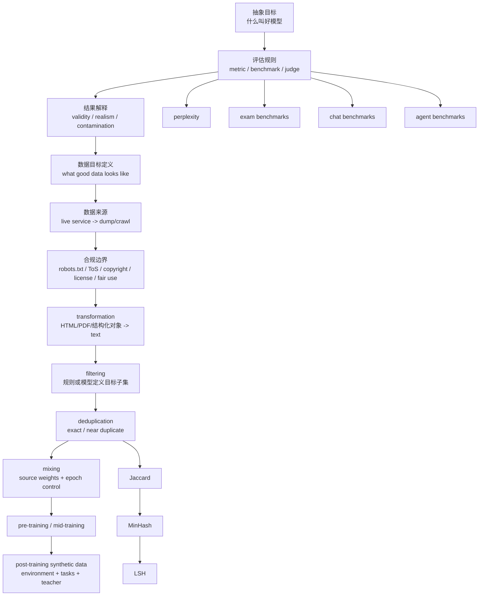

## 适用范围与来源边界

本模块只基于以下三份课程根笔记整理，不引入任何外部事实、外部定义或额外案例：

1. [Lecture 12 NOTES](/courses/stanford-cs336-s26/lectures/012/)
2. [Lecture 13 NOTES](/courses/stanford-cs336-s26/lectures/013/)
3. [Lecture 14 NOTES](/courses/stanford-cs336-s26/lectures/014/)

凡是讲义中明确标成 `[需回听]`、字幕疑点、老师说“不了解”或“这里只给 landscape”的地方，本模块都保留不确定性，不自行补全。

## 模块目的

这三讲连在一起，回答的是同一条训练链路上的三个问题：

1. 先定义什么叫“好模型”，否则无法决定要优化什么，也无法决定要收什么数据。
2. 再解释训练数据不是“整个互联网自然掉下来”，而是 live service 经过抓取、许可判断、转换与筛选后的产物。
3. 最后进入真正的数据管线：transformation、filtering、deduplication、mixing，以及 post-training synthetic data。

如果把这三讲拆开看，会记住很多名词；把它们连起来看，才会看到老师真正强调的方法论：

`抽象目标 -> 评估规则 -> 数据定义 -> 数据处理 -> 训练分布 -> 最终模型行为`

## 先修要求

学习本模块前，默认已经具备下列背景：

1. 已理解前面课程的训练主线，包括架构、优化、训练循环、系统、并行化、scaling laws，以及少量推理加速内容。[代码: lecture_12.py p.2] [代码: lecture_12.py p.4]
2. 能接受语言模型可被视作 token 序列上的概率分布 $P(x)$，并理解 few-shot prompting、chain-of-thought、ELO、agent scaffold、contamination、ecological validity 等术语在课堂中的基本作用。[代码: lecture_12.py p.4] [代码: lecture_12.py p.6] [代码: lecture_12.py p.10] [代码: lecture_12.py p.11]
3. 已有上一阶段关于“给定数据如何训练模型”和“如何判断模型是否好”的基础，否则无法理解第 13 讲为何把焦点从训练过程转到“究竟该训练什么数据”。
4. 对 token 数、epoch、长训与过拟合之间的关系有基本概念，否则会看不懂第 14 讲中 threshold 与 mixing 的规模依赖性。[00:17:26-00:20:00][00:53:45-00:57:07]
5. 对集合、交并比和简单概率直觉不陌生，否则很难跟上 Jaccard、MinHash 与 LSH 这条推导链。[00:31:36-00:32:29][00:41:16-00:42:32]

## 精确推进顺序与原始笔记链接

建议严格按下面的顺序推进，而不是先挑自己喜欢的数据集或算法。

1. 先读 [Lecture 12 NOTES](/courses/stanford-cs336-s26/lectures/012/)
时间主线：00:00:06-00:20:03 先建立“抽象目标如何落成 metric”，尤其要吃透 perplexity 的位置与边界；00:20:03-00:49:56 再进入 exam benchmark、开放式评测与 validity；00:49:56-01:18:31 最后把 agent、安全、现实性与评估目的串起来。
2. 再读 [Lecture 13 NOTES](/courses/stanford-cs336-s26/lectures/013/)
时间主线：00:00:05-00:29:52 先理解为什么 live service 不等于训练语料，以及 license / fair use / ToS 的边界；00:29:52-01:09:39 再顺着 Common Crawl、Wikipedia、GitHub、arXiv 到 BERT、WebText、CCNet、C4、GPT-3、The Pile、LLaMA、RefinedWeb、DCLM、Nemotron-CC；01:09:39-01:21:56 最后收束到 The Stack 与 CommonPile，看代码数据与宽松许可路线的上限。
3. 最后读 [Lecture 14 NOTES](/courses/stanford-cs336-s26/lectures/014/)
时间主线：00:00:13-00:20:00 先看 transformation 与 filtering；00:22:56-00:49:53 再集中处理 deduplication 与 MinHash LSH；00:49:53-01:12:53 看 data mixing；01:12:57-01:24:34 用 synthetic data 和 coding post-training 把整个模块闭环。

## 依赖图

## 一、先把“好模型”说清楚：评估是数据之前的前置问题

### 1.1 为什么评估先于数据

第 12 讲开场的核心不是介绍 benchmark 名单，而是把课程顺序倒过来解释清楚：既然数据会塑造模型行为，那么在讨论“该喂什么数据”之前，必须先回答“希望模型表现成什么样”。老师用“训练在代码上会更擅长代码，只训练 DNA 序列就大概率不会说英语”来说明这一点。[代码: lecture_12.py p.2]

因此，评估并不是训练后的附属环节，而是训练目标的外显形式。老师甚至把它说成 AI 开发的 North Star，因为开发者会追着评测分数跑，你定义什么分数，就会反过来定义模型被优化成什么样。[代码: lecture_12.py p.3]

### 1.2 评估的统一结构

老师在第 12 讲给出的统一框架可以整理成四层：

1. 抽象目标：例如“擅长对话”“擅长推理”“用户更愿意付费使用”。[代码: lecture_12.py p.3]
2. 具体指标：例如 perplexity、accuracy、win rate、ELO。
3. 评测载体：例如 completion、考试题、开放式 prompt、agent environment。
4. 结果解释：这个分数到底能不能代表你声称的能力，是否受污染、judge bias、scaffold、抽样方式或环境漏洞影响。[代码: lecture_12.py p.5] [代码: lecture_12.py p.6] [代码: lecture_12.py p.7] [代码: lecture_12.py p.11]

这四层后面会直接过渡到数据定义：如果你最终要优化的是某种 benchmark 或真实场景能力，那么“什么叫好数据”就不再是抽象常数，而会被这个目标反向决定。

## 二、评估主线：perplexity、benchmarks、validity、contamination

### 2.1 perplexity 的吸引力与边界

从语言模型视角出发，最自然的评估是看模型给测试数据集分配了多少概率质量，也就是 perplexity / likelihood / log loss 这一类量。[代码: lecture_12.py p.4]

老师给出的核心论证是：若真实分布是 $t$、模型分布是 $p$，最佳 perplexity 是真实分布的熵 $H(t)$，且仅当 $p=t$ 时达到。于是就会出现一种很有吸引力的信念链：

$$
\text{最小化 perplexity} \to \text{逼近真实分布} \to \text{各种条件生成任务都能被支持}
$$

对应的课堂表达包括：

- 困惑度表达式：$\left(1/p(D)\right)^{1/|D|}$。[代码: lecture_12.py p.4]
- 条件困惑度：$p(\text{response} \mid \text{prompt})^{1/|\text{response}|}$，只聚焦回答部分。[代码: lecture_12.py p.4]

但老师同一时间也给了非常强的边界条件：普通 perplexity 会平均惩罚所有 token，而你真正关心的能力可能只集中在少数 token 上，例如 “Stanford was founded in 1885” 里真正有信息量的可能是 “1885”。因此 perplexity 可能“比你真正需要的更多”。[代码: lecture_12.py p.4]

### 2.2 被 sharpen 的 perplexity：LAMBADA 与 HellaSwag

Lecture 12 明确指出，并非所有 benchmark 都与 perplexity 对立。有些 benchmark 本质上只是“被 sharpen 的 perplexity”：

1. LAMBADA 看似是完形填空，但本质仍是 next-token prediction，只是专门挑出需要长程上下文的位置。[代码: lecture_12.py p.4]
2. HellaSwag 看似是多项选择，但仍可理解为 sentence completion 的比较。[代码: lecture_12.py p.4]

这条判断很重要，因为它说明评估形式和评估本质不一定一致。

### 2.3 exam benchmarks：可控、可判分、但会饱和

老师用 MMLU、MMLU-Pro、GPQA、Humanity's Last Exam 讲了一条升级链：

1. MMLU 代表跨学科的知识与推理考试，采用 few-shot prompting。[代码: lecture_12.py p.5]
2. MMLU-Pro 通过删噪声题、删简单题、从四选一扩到十选一并结合 chain-of-thought 来延后饱和。[代码: lecture_12.py p.5]
3. GPQA 追求 Google-proof，强调高成本人工出题、多轮审核与专家校验。[代码: lecture_12.py p.5]
4. HLE 进一步通过奖金、署名激励、frontier 模型预筛和 private set 来延长有效期。[代码: lecture_12.py p.5]

这类 benchmark 的优点是：学科和难度可控、答案明确、易于评分。[代码: lecture_12.py p.5]

但失败模式也非常明确：

1. benchmark 会被迅速“做旧”，形成“旧 benchmark 饱和 -> 新 benchmark 加难 -> 再次饱和”的循环。[代码: lecture_12.py p.5]
2. 分数可能受 contamination 影响，而且老师明确说外界通常并不知道 frontier 模型到底训练了什么，因此只能“保留一点怀疑”。
3. 高分不自动等于通用能力，尤其当题目本身与真实使用场景脱节时。[代码: lecture_12.py p.6]

### 2.4 开放式 benchmark：更真实，但 judge 问题更重

第 12 讲从 exam benchmark 过渡到开放式评测时，核心判断是：现实用户大多不会问 HLE 那样的问题，真实使用更像开放式请求。[代码: lecture_12.py p.6]

老师讲了两种主要方案：

1. Chatbot Arena：匿名双模型回答 + 人类 pairwise preference + ELO 拟合。[代码: lecture_12.py p.6]
2. AlpacaEval：让被测模型与基线模型都回答，再交给 judge 模型打 against-baseline win rate。[代码: lecture_12.py p.6]

其中 ELO 的课堂公式是：

$$
p(A\ \text{wins against}\ B)=\frac{1}{1+10^{(\mathrm{ELO}_B-\mathrm{ELO}_A)/400}}
$$

优点和风险必须一起记：

1. 优点：更接近真实用户 prompt 分布；pairwise comparison 比绝对评分更容易；ELO 允许稀疏比较图动态更新。[代码: lecture_12.py p.6]
2. 风险：用户分布不受控，style 与 correctness 混在一起，发问者可能并不知道正确答案，sycophancy 会让“更讨喜”冒充“更正确”。[代码: lecture_12.py p.6]
3. LLM-as-a-judge 还会引入 judge bias。Lecture 12 专门提到 AlpacaEval 早期存在长度偏置，后来才用回归去偏。[代码: lecture_12.py p.6]

### 2.5 agent、推理、安全、现实性与 validity

Lecture 12 后半段的关键，不是再背一批 benchmark 名称，而是看到老师在不断追问“这个分数到底能不能代表你说的那个东西”。

从根笔记可提炼出以下链条：

1. agent benchmarks 如 SWE-bench、Terminal-Bench、CyBench、MLEBench 把被测对象从“模型本体”扩展到“模型 + scaffold + 环境”。因此分数不仅反映底模，也反映 scaffold 与环境设计。[代码: lecture_12.py p.7]
2. ARC-AGI 之类 benchmark 试图把推理从知识中剥离出来，但这并不自动消除评估解释难题。[代码: lecture_12.py p.8]
3. 安全 benchmark 继续追问“能力高”是否等于“社会上可接受”。[代码: lecture_12.py p.9]
4. 现实性、有效性与目的问题最终汇总成老师强调的三轴取舍：难度、现实性、有效性。[代码: lecture_12.py p.11] [代码: lecture_12.py p.12]

这里的有效性可以按课堂语境理解为：你的 metric 是否真的测到了你声称想测的对象。Lecture 12 最后把评估目的区分成至少四类：采购决策、原始能力测量、收益与伤害分析、开发反馈；并提醒 methods 与 models/systems 的比赛规则并不一样。[代码: lecture_12.py p.12]

### 2.6 本模块对评估部分的结论

如果只记一句话，应该记老师的总判断：没有唯一正确评估，只有先声明目的，再接受难度、现实性、有效性之间的取舍。[代码: lecture_12.py p.11] [代码: lecture_12.py p.12]

## 三、从评估过渡到数据：什么数据能进入训练并不显然

### 3.1 训练数据不是“整个互联网”

Lecture 13 一开始就拆穿一种常见说法：模型不是在整个互联网的 live servers 上实时行动，而是先通过 crawler 或官方 dump 获取原始数据；而且即便技术上想抓，也会被动态内容、登录墙、付费墙、robots.txt、ToS 和版权边界约束。[00:00:05-00:20:00]

这一点必须和第 12 讲连接起来理解：

1. 第 12 讲先说评估会定义优化方向。
2. 第 13 讲接着说，即便方向明确，真正可被喂给模型的数据空间也受到技术、合同与法律边界的强限制。

### 3.2 数据三阶段与质量趋势

Lecture 13 把训练流水线区分为：

1. pre-training：大量原始文本。
2. mid-training：更高质量、更定向的数据，用来强化能力和长上下文。
3. post-training：聊天记录、强化学习环境等更任务化的数据。

老师给出的总趋势是：从“大量低质量数据”逐步过渡到“少量高质量数据”。

这会在第 14 讲被重新具体化成 transformation、filtering、deduplication、mixing，以及 task-dependent 的 synthetic data。

### 3.3 合规边界：robots.txt、ToS、版权、许可、fair use

Lecture 13 不是泛泛谈“法律风险”，而是给出了多层边界：

1. robots.txt：抓取约束文件，更像自律规则而非自动执行的硬门槛。
2. Terms of Service：可能进一步限制 bot 抓取或 AI 训练用途。
3. copyright：保护原创表达而非思想；作品一经固定通常自动受保护。
4. license：例如 Creative Commons 提供主动授权路径。
5. fair use：法院按四因素综合权衡，而不是机械规则。

老师讲的 fair use 四因素是：

1. 使用目的与性质。
2. 原作品性质。
3. 使用量。
4. 对原作品市场的影响。

同时必须保留第 13 讲非常谨慎的边界：

1. 特定案件里训练行为得到 fair use 的有利判断，不等于所有训练都已被普遍合法化。
2. 训练行为是否可辩护，与原始副本是否通过盗版方式取得，不是同一个问题。
3. 就算版权层面可能站得住，ToS 仍可能禁止 bot 式获取，例如老师用 YouTube 说明这一层约束。

### 3.4 数据来源与数据集演化

Lecture 13 不是随意点名数据集，而是在展示几种不同的数据工程哲学。

#### A. 来源层

老师明确涉及的来源包括：

1. Common Crawl：公开月度 web crawl，大规模但只是起点，不是终点。
2. Wikipedia：高质量、跨语言、官方 dump 可用，但也可能被时间点投毒。[00:29:52-00:39:50]
3. GitHub：不只是代码文件，还有目录结构、提交历史、issues、PR、评论等 live service 层信息。[代码: lecture_13.py p.8]
4. Software Heritage：多源代码仓库归档。[代码: lecture_13.py p.8]
5. arXiv：metadata、PDF、LaTeX source 三种不同表示入口。[代码: lecture_13.py p.9]
6. Reddit 外链：被 GPT-2 / WebText 当作社区质量代理。[代码: lecture_13.py p.12]
7. Project Gutenberg：版权清理后、相对稳妥的书籍来源。[代码: lecture_13.py p.17]
8. Stack Exchange：带问答结构和元数据的高价值来源。[代码: lecture_13.py p.19]
9. 政府文档、wiki、新闻、论文、论坛、教育资源等：在 CommonPile 路线里被重新组合。[代码: lecture_13.py p.27]

#### B. 代表性数据集与方法

Lecture 13 中真正被用来讲方法的代表包括：

1. BERT：Wikipedia + BooksCorpus，代表早期“小而干净”的书加百科路线。[代码: lecture_13.py p.10] [代码: lecture_13.py p.11]
2. WebText / OpenWebText：用 Reddit 高 karma 外链做代理质量。[代码: lecture_13.py p.12]
3. CCNet：用语言识别加“像 Wikipedia”概率做代理质量。[代码: lecture_13.py p.13]
4. C4：规则过滤的典型代表。[代码: lecture_13.py p.14]
5. GPT-3 数据：processed Common Crawl + WebText2 + Books1/2 + Wikipedia，并引入质量分类器与 fuzzy deduplication。[代码: lecture_13.py p.15]
6. The Pile：多源拼装的开放回应。[代码: lecture_13.py p.16]
7. MassiveText / MassiveWeb：文档化较强的多源体系。[代码: lecture_13.py p.20]
8. LLaMA：较详细公开数据处理流程，但也因 Books3 暴露出法律风险。[代码: lecture_13.py p.21]
9. RefinedWeb / FineWeb：坚持“web data is all you need”方向，强调规则过滤、去重、保留网页多样性。[代码: lecture_13.py p.22]
10. Dolma：多源拼装，同时对质量过滤持相对克制态度。[代码: lecture_13.py p.23]
11. DCLM：model-based quality filtering 的代表性节点。[代码: lecture_13.py p.24]
12. Nemotron-CC：对“删得太狠”的反拨，尝试保留更多 token，并加入 synthetic augmentation。[代码: lecture_13.py p.25]
13. The Stack / Stack v2：把许可过滤、去重、PR linearization 和软件开发过程数据纳入代码语料主流程。[代码: lecture_13.py p.26]
14. CommonPile：只收宽松许可或公有领域数据，直接回答“风险厌恶路线能走多远”。[代码: lecture_13.py p.27]

### 3.5 Lecture 13 的核心方法论结论

Lecture 13 的真正重点不是“记住哪些名字”，而是下面这条生产链：

`live service -> dump/crawl -> transformation -> filtering -> deduplication -> usable corpus`

而且老师明确说，很多模型的架构都差不多，但数据及其处理方式会显著塑造模型差异化能力。[01:19:39-01:21:56]

## 四、数据管线：transformation、filtering、deduplication、mixing、synthetic data

### 4.1 transformation：拿到文件不等于拿到文本

Lecture 14 一开始就强调，transformation 不是小问题，而是后续全部步骤的入口条件。[00:01:18-00:06:57]

老师支持的机制只有课堂明确讲到的这些：

1. HTML to text：去 boilerplate，例如导航栏、广告、页眉页脚、菜单，再尽量抽取主体内容。[00:01:51-00:02:20]
2. 处理图片与表格：简单表格可以近似转 markdown，嵌套表格更棘手。[00:02:33-00:03:11]
3. PDF to text：可能需要 recrawl、文本抽取，若是扫描件则要 OCR，通常还伴随更高成本。[00:04:20-00:05:47]
4. 结构化对象 linearization：尤其在 Stack v2 的 PR、评论、事件对象场景里，必须先决定如何编码成线性 token 序列。[代码: lecture_13.py p.26]

边界同样要保留：

1. HTML to text inherently lossy。[00:02:33-00:03:11]
2. 什么算主体内容并不总是清楚，部分“导航元素”也可能携带结构信息。[00:02:20-00:02:31]
3. rule-based processing 常见是因为快，不代表没有失败率。[00:03:11-00:04:20]
4. PDF 质量高但处理难，因为保留的是版面，不是语义标签。[00:05:47-00:06:34]

### 4.2 filtering：质量不是普适常数，而是目标定义出来的

Lecture 14 给出的统一 recipe 非常清晰：

1. 先定义 target data $T$，也就是“什么叫好数据”。[00:10:03-00:10:42]
2. 再从 raw data $R$ 中抽负例，训练一个足够快的分类器，常见是 fastText 这类 bag-of-words 线性模型。[00:10:03-00:10:42]
3. 最后对大规模新文档打分，根据阈值决定保留、丢弃，或者在某些设置下随机保留。[代码: lecture_14.py p.4]

课堂给出的两种抽象打分形式是：

$$
score(x)=p_T(x)
$$

以及

$$
score(x)=p(T\mid x)
$$

支持这一框架的具体机制，Lecture 14 明确提到：

1. language identification：Meta fastText language ID，支持 176 种语言。[00:11:36-00:11:59]
2. OpenMathText：规则过滤 + KenLM perplexity 过滤 + fastText 数学写作分类。[00:13:09-00:13:48] [代码: lecture_14.py p.4]
3. GPT-3 风格过滤：拿高质量来源当正例、一般网页当负例，训练线性分类器。[00:14:27-00:14:54]
4. LLaMA 风格过滤：用“被 Wikipedia 引用的页面”当正例，而不是 Wikipedia 本身。[00:14:54-00:15:03]
5. phi-1：先让昂贵 teacher 对小样本打“educational value”标签，再训练便宜分类器扩展到全量数据。[00:15:28-00:16:17] [代码: lecture_14.py p.4]
6. toxicity filtering：用带毒性标签的数据训练分类器推广到大规模网页。[00:16:33-00:17:08]

第 13 讲也给出两类更宏观的数据集构造哲学：

1. WebText：社区信号代理质量。
2. CCNet：参考分布代理质量。
3. C4：规则过滤。
4. DCLM：模型型质量分类。
5. Nemotron-CC：分类器集成加 synthetic augmentation。

最重要的边界条件是：quality 没有 universal notion。老师明确说，如果目标是数学能力，那么“数学性”就可以被定义成质量。[00:14:13-00:14:27]

### 4.3 filtering 的失败模式

Lecture 14 明确支持以下失败模式判断：

1. 阈值不是一劳永逸常数，而依赖训练 token 预算与是否会进入多次 epoch 区间。[00:17:26-00:20:00]
2. 训练较短时，高质量高阈值往往更优；训练较长时，较大但较低质的数据池可能反超。[00:18:24-00:20:00]
3. 质量过滤越强，潜在偏置也可能越重；Lecture 13 用 RefinedWeb 刻意避免过早模型过滤来说明这一点。[代码: lecture_13.py p.22]
4. target 的定义本身可能已经内含很强价值判断，例如 DCLM 用 OpenHermes 和 ELI5 来定义“高质量”正例。[代码: lecture_13.py p.24]

### 4.4 deduplication：问题从“好不好”变成“是不是冗余”

老师在 Lecture 14 把 filtering 与 deduplication 分得很清楚：

1. filtering 判断单个样本是否符合目标。
2. deduplication 判断样本之间是否冗余。

去重要解决的是两类对象：

1. exact duplicates：完全相同的内容，例如镜像站点、代码仓库 fork。[00:23:14-00:23:56]
2. near duplicates：只差少量 token 的内容，例如模板化页面、只差标点的页面、共用页眉页脚的文档。[00:23:59-00:25:42]

去重的主要目的，Lecture 14 给得非常直接：

1. 节省 flops，避免把 GPU 算力花在重复样本上。[00:26:17-00:26:55]
2. 降低 memorization 风险，从而减轻 copyright 与 privacy 风险。[00:26:36-00:26:49]
3. 与 decontamination 相邻，后者更专注于防止测试集泄漏到训练集。[00:26:58-00:27:07]

### 4.5 Jaccard、MinHash、LSH：Lecture 14 明确支持的近重复机制

老师给出的推导链是本模块里最完整的一条算法链，应该原样掌握。

#### 第一步：把 near duplicate 定义成 Jaccard 阈值问题

$$
Jaccard(A,B)=\frac{|A\cap B|}{|A\cup B|}
$$

课堂例子：

- $A=\{1,2,3,4\}$
- $B=\{1,2,3,5\}$
- 所以 $|A\cap B|=3$，$|A\cup B|=5$，因此 $Jaccard(A,B)=3/5=0.6$。[00:31:36-00:32:03] [代码: lecture_14.py p.8]

老师的 near duplicate 定义方式是：若 Jaccard 超过阈值，例如 0.99，就把两篇文档视作近重复。[00:32:19-00:32:29]

#### 第二步：用 MinHash 把相似度转成碰撞概率

核心性质：

$$
\Pr[h(A)=h(B)] = Jaccard(A,B)
$$

其中 $h$ 是随机哈希函数。[00:32:50-00:33:01] [代码: lecture_14.py p.8]

构造方法是：对集合中每个元素做哈希，取最小哈希值；老师也说明取 max 还是 min 不重要，关键是使用一致的 order statistic。[00:33:54-00:34:16]

这一层的教学含义是：我们不再追求“不同元素尽量别碰撞”，反而要让碰撞概率受相似度控制。[00:33:18-00:33:41]

#### 第三步：用 LSH 把“概率等于相似度”锐化成接近阈值判定

老师定义的 banding 机制是：把独立 hash functions 分成 $b$ 个 band，每个 band 有 $r$ 个哈希；只要存在某个 band 内所有哈希都匹配，就判定两对象 collide。[00:39:58-00:40:57] [代码: lecture_14.py p.9]

相应公式链是：

$$
prob\_match = sim^r
$$

$$
prob\_collision = 1 - (1 - sim^r)^b
$$

$$
threshold = (1 / b)^{(1 / r)}
$$

并且老师说明，在阈值点附近整体碰撞概率约为 $1-1/e\approx0.64$。[00:47:29-00:47:59] [代码: lecture_14.py p.9]

参数作用也要能口头说出来：

1. 增大 $r$：曲线更陡且右移，更难匹配。[00:45:04-00:45:49]
2. 增大 $b$：曲线左移，更容易匹配。[00:45:52-00:46:16]

#### 第四步：工程边界

Lecture 14 明确提醒：

1. exact dedupe 可能破坏文档连贯性，例如 C4 的三句跨度 exact dedupe 会从中间挖掉文本。[00:30:31-00:31:17]
2. 去重不该只在单个 source 内做，理论上应跨整个训练集去重。[00:48:55-00:49:15]
3. 单次 MinHash 不是最终答案，必须通过 LSH 去锐化阈值行为。[00:37:29-00:39:58]

### 4.6 mixing：权重不是越偏向高质量越好

Lecture 14 在 dedupe 后接 data mixing，逻辑非常自然：既然训练集来自多个 source，那它们如何配权？

老师先给出三类 baseline：

1. manual / vibes
2. uniform
3. proportional mixing

但他马上指出两个现实约束：

1. 模型需要 diversity，papers、literature、code 等 source 不能只按单维“高质量”来排队。[00:52:35-00:53:08]
2. 每个 source 都是有限的，小而高质量的数据源若权重过高，会被反复 epoch。[00:53:14-00:53:36]

最重要的反例是：

1. low-quality source：10T tokens
2. high-quality source：10B tokens
3. 总训练量：1T tokens
4. mixture：50/50

则 low source 只会被轻触，而 high source 需要供给 500B token，平均会被重复 50 次，也就是 50 epochs。[00:53:45-00:55:37] [代码: lecture_14.py p.12]

这不是老师在推荐 50 epochs，而是在说明如果不显式检查 source epoch 数，你会无意间把训练计划写成这样。[00:56:29-00:57:07]

### 4.7 Lecture 14 明确支持的 mixing 机制

1. UniMax：尽量均匀采样，但对每个 source 的 epoch 数加 cap，例如最多 20 epochs，把它当 safety net。[00:58:26-00:59:47] [代码: lecture_14.py p.12]
2. simulated epoching：在 Lecture 14 的学习目标和核心概念里被明确提及，用来让小规模代理更像大规模训练，并减少 epoching 偏差；但根笔记没有展开完整操作细节，因此这里只能保留为“被支持的机制名称与目的”，不外推具体算法步骤。
3. regression-based mixing / RegMix：在小规模上试多个 mixtures，训练 proxy models，拟合“mixture weights -> loss”的 surrogate，再优化 surrogate 找到大规模训练的 mixture。[01:00:26-01:02:03] [代码: lecture_14.py p.12]

RegMix 的两条 leaps of faith 必须连同方法本身一起记住：

1. surrogate 在 minimizer 附近仍然准确，这只是 hope，不是 theorem。[01:04:50-01:05:43]
2. 小模型上找到的最优 mixture 能转移到大模型上，这也只是 hope，不是 theorem。[01:05:43-01:09:47]

### 4.8 synthetic data：预训练已开始主动改写，后训练更依赖环境与 teacher

第 13 讲和第 14 讲都涉及 synthetic data，但位置不同。

#### A. 预训练侧的 synthetic augmentation

Lecture 13 讲 Nemotron-CC 时明确说了两类机制：

1. 对低质量文档进行改写，使其更像高质量文本。[代码: lecture_13.py p.25]
2. 对高质量文档生成问答、摘要、关键信息抽取等任务数据。[代码: lecture_13.py p.25]

这说明预训练阶段已经不只是“收集原文”，而开始“重写和构造数据”。[代码: lecture_13.py p.25]

#### B. post-training synthetic data 的统一 recipe

Lecture 14 给出的统一 recipe 是：

1. 定义 environments。
2. 定义 tasks/prompts。
3. 从强 teacher 收集 responses。[01:13:48-01:14:10] [代码: lecture_14.py p.13]

老师还补了一条现实判断：开放社区中的大多数 post-training data 本质上都是 synthetic 的；teacher 可以是人类，但更慢、更贵，因此现实里越来越多是 human-AI hybrid 或直接 teacher model 生成。[01:14:10-01:14:50]

#### C. Lecture 14 明确支持的实例

1. OpenThoughts：1.2M examples，覆盖 math、chemistry、coding 等；经验结论包括“小而高质量 source 更好”“多次采样有帮助”“更强模型不一定是更好 teacher”“简单 answer filtering 没有帮助”。[01:14:53-01:17:08] [代码: lecture_14.py p.13]
2. SWE-Zero：真实 GitHub PR 环境下构造约 300,000 条 agent trajectories，刻意禁止执行 Python，只允许较基础的文本级探索操作，以降低环境负担并防止 agent hacking；后续再蒸馏和过滤 teacher 输出，并补充 13K 条真正需要 execution feedback 的 trajectories。[01:19:42-01:21:37]
3. SWE-rebench 与 12M trajectories 扩展：说明 no-exec 轻量设定会显著放宽样本可用性边界。[01:21:45-01:22:50]

## 五、比较框架：该怎样比较这些方法，而不是只记名字

### 5.1 评估方法比较

| 方法 | 测的对象 | 优点 | 主要失败模式 |
| --- | --- | --- | --- |
| perplexity | 概率分布拟合 | 平滑、自然、适合 scaling laws | 会平均惩罚所有 token；leaderboard 需要相信对方真返回合法分布 [代码: lecture_12.py p.4] |
| conditional perplexity | 回答部分条件建模 | 更聚焦真正关心的 token | 仍未自动解决真实性与能力映射问题 [代码: lecture_12.py p.4] |
| exam benchmarks | 可评分的知识/推理题 | 可控、明确、易比较 | 容易饱和；不真实；可能 contamination [代码: lecture_12.py p.5] [代码: lecture_12.py p.6] |
| chat benchmarks | 开放式回答偏好 | 更接近真实用户 | judge bias、用户分布偏差、sycophancy、长度偏置 [代码: lecture_12.py p.6] |
| agent benchmarks | 模型加 scaffold 加环境 | 更贴近真实任务执行 | 分数混合了底模、scaffold、环境漏洞与任务设计 [代码: lecture_12.py p.7] |

### 5.2 数据构造方法比较

| 方法 | 代表 | 核心想法 | 主要边界 |
| --- | --- | --- | --- |
| 社区信号代理质量 | WebText | 用 Reddit 高 karma 外链筛网页 | 代理质量不一定稳定，且依赖外部平台行为 [代码: lecture_13.py p.12] |
| 参考分布过滤 | CCNet | 用“像 Wikipedia”的概率筛 Common Crawl | 会把参考分布偏好带入语料 [代码: lecture_13.py p.13] |
| 规则过滤 | C4、RefinedWeb | 用显式规则清理网页 | 规则改变来源结构，也可能过于粗糙 [代码: lecture_13.py p.14] [代码: lecture_13.py p.22] |
| 模型型质量分类 | GPT-3 风格过滤、DCLM | 用高质量正例和负例学分类器 | 质量定义强依赖 target 选择 [代码: lecture_13.py p.15] [代码: lecture_13.py p.24] |
| 集成 + 合成增强 | Nemotron-CC | 保更多 token，同时改写低质文档、生成高质任务数据 | 仍然需要验证 synthetic augmentation 是否真的保持质量 [代码: lecture_13.py p.25] |

### 5.3 数据处理步骤比较

| 步骤 | 目标 | Lecture 14 明确支持的机制 | 主要失败模式 |
| --- | --- | --- | --- |
| transformation | 把原始对象转成可训练文本 | HTML 抽取、PDF 提取/OCR、PR linearization | 有损、语义结构丢失、规则误删 [00:01:18-00:06:57] |
| filtering | 保留目标子集 | fastText、KenLM、规则过滤、teacher 标注扩展 | 质量定义不普适、阈值依赖训练规模 [00:10:03-00:20:00] |
| deduplication | 去除冗余样本 | exact dedupe、Jaccard、MinHash、LSH | 文档 coherence 破坏、只做单源去重会漏跨源重复 [00:23:14-00:49:15] |
| mixing | 设计 source 权重 | manual/uniform/proportional、UniMax、RegMix、simulated epoching | 小高质源过度 epoch、surrogate 失真、small-to-large transfer 失败 [00:49:53-01:12:53] |
| synthetic data | 构造更任务化训练样本 | Nemotron 改写/生成，OpenThoughts，SWE-Zero | teacher 不一定越强越好，环境成本高，过滤细节仍关键 [01:13:48-01:24:34] |

## 六、假设、边界与不确定性

### 6.1 本模块允许的推断边界

本模块只做以下层级的总结：

1. 把 Lecture 12-14 已明确给出的概念、例子和结论串成一条学习链。
2. 在老师已经明确对比过的方法之间做比较。
3. 在老师已经给出 caution 的地方，保留 caution，而不替老师下更强结论。

### 6.2 本模块刻意不做的事

1. 不补充任何课堂外 benchmark 背景。
2. 不把课堂提到但未展开的机制写成完整算法说明。
3. 不把特定诉讼的课堂总结扩展成法律结论。
4. 不替 `[需回听]` 的内容做确定化改写。

### 6.3 必须保留的不确定点

1. Lecture 12 根笔记明确保留了若干字幕疑点，如 “top bottles”“remarkably slow perplexity”“another [INAUDIBLE] model”“La Marina”“authentic”“And no trade tests contamination”等，应视为待回听位置，而不是确定事实。
2. Lecture 13 保留的 `[需回听]` 主要集中在 00:01:59-00:02:11、00:11:45-00:11:51、00:30:52-00:31:18、01:09:41-01:09:45。
3. Lecture 14 保留的 `[需回听]` 包括 00:56:16、01:12:15、01:19:42，另外 OpenMathText token 数在老师口头与代码页之间存在“约 15B”与“14.7B”的差异，必须并列保留。[00:13:51-00:13:55] [代码: lecture_14.py p.4]
4. simulated epoching 在 Lecture 14 的学习目标和核心概念中被点名，但本份根笔记没有展开完整过程，因此这里只能写其目的，不能外推其实现细节。

## 七、复习标记

按下面 8 个标记检查自己是否真正掌握，而不是只“看过”。

1. 标记 A：你能否解释为什么 Lecture 12 先讲评估，再讲数据，而不是反过来？
2. 标记 B：你能否口头推到“最佳 perplexity 是 $H(t)$，且仅当 $p=t$ 时达到”这条信念链，并同时说出它为什么不够？
3. 标记 C：你能否比较 exam benchmark 与 chat benchmark 的现实性、评分方式和偏差来源？
4. 标记 D：你能否从 live service 一路讲到 usable corpus，并指出 robots.txt、ToS、copyright、license、fair use 各管哪一层？
5. 标记 E：你能否不用看笔记，列出至少 5 套代表性数据集，并说明它们各自依赖的是哪种质量定义方法？
6. 标记 F：你能否在纸上写出 Jaccard、MinHash 性质、LSH 碰撞公式与 threshold 近似式？
7. 标记 G：你能否解释为什么 50/50 mixture 在 10T low、10B high、1T train 的例子里会把 high source 推到 50 epochs？
8. 标记 H：你能否用 “environment -> tasks/prompts -> teacher responses” 统一描述 OpenThoughts、SWE-Zero 这类 post-training synthetic data？

## 八、掌握标准

如果达到以下标准，可以认为这个模块基本掌握：

1. 你能把 Lecture 12-14 按老师原顺序讲成一条连续因果链，而不是三个并列主题。
2. 你能说明评估如何反向定义“好数据”的标准。
3. 你能明确区分 transformation、filtering、deduplication、mixing 分别在解决什么问题。
4. 你能解释为什么数据工作里“质量”与“合法性”都不是天然给定，而是需要目标定义和逐层判断。
5. 你能说清楚哪些地方老师是在给出结论，哪些地方老师是在提醒边界与怀疑。

## 九、练习题（12 题，含答案）

### 练习 1

问：为什么老师在讲数据之前先讲评估？

答：因为数据会塑造模型行为，所以在决定“该喂什么数据”之前，必须先回答“想要什么行为”，也就是先定义什么叫好模型。[代码: lecture_12.py p.2] [代码: lecture_12.py p.3]

### 练习 2

问：为什么 perplexity 在语言模型研究里长期有吸引力？

答：因为语言模型本质上是 token 序列上的概率分布，perplexity 直接衡量模型给测试数据分配的概率质量；老师进一步给出信念链：当 $p$ 逼近真实分布 $t$ 时，最优 perplexity 逼近 $H(t)$，于是人们会相信持续压低 perplexity 能推动更通用的能力。[代码: lecture_12.py p.4]

### 练习 3

问：为什么老师又说 perplexity 可能“比你真正需要的更多”？

答：因为普通 perplexity 平均惩罚所有 token，而真正关键的能力可能只体现在少量 token 上，所以它会把无关位置的误差也一起算进去；条件困惑度正是为此而提出的聚焦版本。[代码: lecture_12.py p.4]

### 练习 4

问：exam benchmark 的核心优势和核心缺陷分别是什么？

答：优势是题目难度与学科可控、答案明确、易于评分；缺陷是会饱和、可能 contamination，而且往往不代表真实用户如何使用模型。[代码: lecture_12.py p.5] [代码: lecture_12.py p.6]

### 练习 5

问：Chatbot Arena 为什么比直接绝对打分更可行？

答：因为开放式回答没有单一 ground truth，但两个回答之间更容易做 pairwise preference 判断；随后可以用 ELO 从稀疏两两比较中恢复整体排名。[代码: lecture_12.py p.6]

### 练习 6

问：为什么第 13 讲说“模型训练在整个互联网”是不准确的？

答：因为训练不是在 live servers 上实时执行，而是先通过 crawler 或官方 dump 获取原始数据；同时大量内容又受动态页面、登录墙、付费墙、robots.txt、ToS 与版权限制影响，根本不能简单等同为“整个互联网”。[00:00:05-00:20:00]

### 练习 7

问：Lecture 13 把合法性问题拆成了哪些层？

答：至少包括 robots.txt、Terms of Service、copyright、license 和 fair use。老师特别强调训练行为是否可能是 fair use，与原始副本是否通过盗版方式取得，是两个不同问题。

### 练习 8

问：CCNet 与 WebText 的质量定义有何不同？

答：WebText 用 Reddit 高 karma 外链当社区质量代理；CCNet 则用“文档在 Wikipedia 语言模型下有多像 Wikipedia”作为质量信号。[代码: lecture_13.py p.12] [代码: lecture_13.py p.13]

### 练习 9

问：为什么 transformation 不能被当成小型预处理细节？

答：因为 HTML 到文本、PDF 到文本、PR 到线性序列都天然有损，而且错误的抽取或线性化会直接改变后续 filtering 的对象空间和最终训练质量。[00:01:18-00:06:57] [代码: lecture_13.py p.26]

### 练习 10

问：Lecture 14 里 filtering 与 deduplication 的问题类型有何根本差异？

答：filtering 是单样本判断，看某个样本是否符合目标；deduplication 是样本间判断，看两个样本是否冗余，因此算法性质也从逐点打分变成近似两两比较。[00:07:02-00:10:42][00:27:50-00:28:29]

### 练习 11

问：用一句话说明 Jaccard、MinHash、LSH 三者在 near dedupe 中的分工。

答：Jaccard 先定义“多相似才算近重复”，MinHash 把这种相似度转成哈希碰撞概率，LSH 再把碰撞概率锐化成接近阈值判定的 S 型行为。[00:31:36-00:47:59] [代码: lecture_14.py p.8] [代码: lecture_14.py p.9]

### 练习 12

问：为什么老师对 synthetic data 的总结不是“找强模型生成就行”？

答：因为 post-training synthetic data 还依赖 environment 设计、task/prompts 设计、teacher 质量与过滤细节；Lecture 14 甚至明确指出更强模型不一定是更好的 teacher，简单 answer filtering 也未必有效。[01:13:48-01:17:08] [代码: lecture_14.py p.13]

## 十、建议复习顺序

1. 先复习 Lecture 12 的总线：从抽象目标、perplexity 到 benchmark validity，把“评估服务于什么目的”吃透。
2. 再复习 Lecture 13 的生产链：从 live service、crawl、dump、许可与 fair use 到数据集谱系，建立“数据从哪里来”的现实感。
3. 然后复习 Lecture 14 的前半：transformation 与 filtering，重点抓“quality is task-defined”和 threshold 的规模依赖。
4. 接着单独复习 deduplication，把 Jaccard、MinHash、LSH 的定义、性质、公式、参数作用完整复述一遍。
5. 再复习 mixing，先吃透 50 epochs 的反例，再看 UniMax、RegMix 与 simulated epoching 分别在防什么。
6. 最后复习 synthetic data，把 Nemotron 的预训练合成增强与 OpenThoughts、SWE-Zero 的 post-training recipe 放在一起比较。
7. 收尾时回到老师的元评论：真实 data work 往往很 grungy、domain-specific，因此真正复习时必须反复看具体样本与具体边界，而不是只背抽象口号。[01:24:14-01:24:34]

## 十一、最后的总括

这三讲真正讲清楚的不是“评估、数据、过滤”三个并列主题，而是一条统一的方法链：你先决定怎样判断模型是否好，再决定什么数据值得被当成“好数据”，然后再面对现实世界里数据的技术来源、合同边界、法律边界和工程处理。到了最后，连“高质量”本身都不再是自然属性，而变成由任务、预算、训练时长、source size、环境成本和 teacher 质量共同定义的对象。

也正因为如此，老师反复提醒不要把任何单一 metric、单一 benchmark、单一过滤器、单一数据源或单一 mixture 当成银弹。Lecture 12 的 caution 是“先声明目的”；Lecture 13 的 caution 是“先追问来源与许可”；Lecture 14 的 caution 是“真实数据工作很脏、很具体、很依赖经验判断”。把这三层 caution 同时记住，才算真正学会这个模块。
