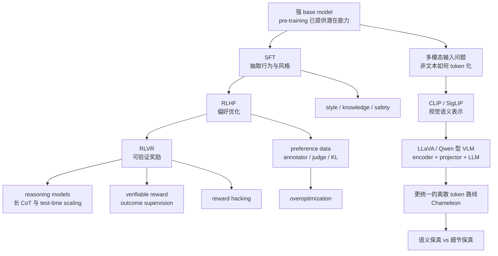

## 适用范围与来源边界

本模块只基于以下三份课程根笔记整理，不引入任何外部事实、外部定义、额外论文细节或课程外案例：

1. [Lecture 15 NOTES](/courses/stanford-cs336-s26/lectures/015/)
2. [Lecture 16 NOTES](/courses/stanford-cs336-s26/lectures/016/)
3. [Lecture 17 NOTES](/courses/stanford-cs336-s26/lectures/017/)

凡是根笔记里已经标成 `[需回听]`、字幕缺失、老师明确说“这是我的推测”或“这里不完全公开”的地方，本模块都保留这种不确定性，不自行补齐。[Lecture 15, 00:03:29-00:04:27][Lecture 16, 易错点与待核对项][Lecture 17, 关键推导、例子与结论边界]

## 模块目的

这三讲连在一起，回答的是同一条训练链路上的三个连续问题：

1. 已经有了强 base model 之后，怎样用 SFT 和 RLHF 把“潜在能力”变成可控助手行为。[课件: lecture_15.pdf p.2][课件: lecture_15.pdf p.32]
2. 如果偏好奖励会过优化，怎样把后训练推进到更可验证的 reward 上，继续做 reasoning 强化学习。[课件: lecture_16.pdf p.3][课件: lecture_16.pdf p.61]
3. 如果模型目标不再只是 `text => text`，又该怎样把图像等非文本模态接入 Transformer，并理解统一多模态系统的结构取舍。[代码: lecture_17.py p.2][代码: lecture_17.py p.10]

把它们拆开看，会像三门不同的小课；把它们合起来看，老师真正强调的是下面这条总主线：

`预训练潜能 -> SFT 抽取与塑形 -> 偏好优化 -> 可验证奖励 -> 更长推理 -> 多模态输入表示 -> 更广义的对齐与系统控制`

## 先修要求

1. 需要先理解 pre-training、base model、next-token prediction、instruction following 这些前面课程已经建立的对象，否则 Lecture 15 的开场动机会失焦。[00:00:51-00:03:04]
2. 需要具备最基础的 RL 直觉，至少知道 policy、reward、policy gradient、KL regularization 分别扮演什么角色，因为 Lecture 15-16 都把这些当默认背景。[Lecture 15, 01:05:48-01:09:21][课件: lecture_16.pdf p.5][课件: lecture_16.pdf p.7]
3. 需要知道 chain-of-thought、outcome supervision、process supervision、test-time scaling、distillation 的基本语义，否则 Lecture 16 的案例部分只能记名词，无法建立比较框架。[课件: lecture_16.pdf p.27][课件: lecture_16.pdf p.37]
4. 需要理解 Transformer、tokenization、embedding、ViT patch、对比学习和基本自回归训练流程，否则 Lecture 17 的多模态部分会断层。[代码: lecture_17.py p.2][代码: lecture_17.py p.3]

## 精确推进顺序与原始笔记链接

建议严格按下面的顺序推进，不要先跳到自己更感兴趣的 GRPO 或多模态页面。这个顺序本身就是老师的论证顺序。

1. [Lecture 15 NOTES](/courses/stanford-cs336-s26/lectures/015/)
时间主线：00:00:10-00:40:01 先建立 SFT 数据的动机、演化与四类关键控制点；00:42:01-01:05:23 再理解 preference data、annotator 与 model-based annotation；01:05:48-01:19:46 最后掌握 PPO、DPO 与 RLHF 的 overoptimization / mode collapse 风险。[课件: lecture_15.pdf p.9][课件: lecture_15.pdf p.19][课件: lecture_15.pdf p.49][课件: lecture_15.pdf p.55][课件: lecture_15.pdf p.63][课件: lecture_15.pdf p.64]
2. [Lecture 16 NOTES](/courses/stanford-cs336-s26/lectures/016/)
时间主线：00:00:05-00:20:01 先理解 RLVR 的动机、REINFORCE/PPO 到 GRPO 的过渡；00:20:01-00:39:56 吃透 GRPO 的偏差与 R1 的极简配方；00:39:56-01:15:45 再用 Kimi、Qwen 与 agentic reward design 把 reasoning RL 的工程面收束起来。[课件: lecture_16.pdf p.3][课件: lecture_16.pdf p.18][课件: lecture_16.pdf p.23][课件: lecture_16.pdf p.39][课件: lecture_16.pdf p.49][课件: lecture_16.pdf p.59]
3. [Lecture 17 NOTES](/courses/stanford-cs336-s26/lectures/017/)
时间主线：00:00:05-00:30:02 先明确多模态的两问，再掌握 CLIP 与 SigLIP 的视觉语义编码；00:30:02-01:09:57 学标准 VLM recipe 与其工程增强；01:09:57-01:17:34 最后比较 Chameleon 的统一离散 token 路线与连续编码器路线的取舍。[代码: lecture_17.py p.2][代码: lecture_17.py p.3][代码: lecture_17.py p.4][代码: lecture_17.py p.5][代码: lecture_17.py p.10]

## 假设、证据边界与阅读原则

1. Lecture 15 明确说现代前沿 post-training 的公开信息远少于 pre-training，因此很多数据细节本来就是不公开的，本模块不能把课堂推测写成确定事实。[00:03:29-00:05:43]
2. Lecture 16 明确把若干 R1、Kimi、Qwen 实践当作公开技术报告上的“可见部分”，并多次提醒简单叙事不等于完整因果解释，例如长 CoT 变长未必代表新认知结构。[课件: lecture_16.pdf p.29][课件: lecture_16.pdf p.30]
3. Lecture 17 明确区分“老师对当前前沿系统的经验性判断”和“公开资料已验证的结构”，例如 `连续编码器 + Transformer + diffusion` 被标成老师的推测而非课程内证实结论。[需回听]
4. 本模块中的所有比较，只能落在课堂明确支持的维度上，例如目标函数、数据形态、奖励来源、表示方式、训练稳定性和 failure mode；不补写 benchmark 数字或外部论文结果。

## 依赖图

## 一条总主线

这三讲虽然标题分别是 SFT/RLHF、RLVR 和 multimodality，但真正贯穿的是同一个问题：如何在 base model 已经很强的前提下，继续“控制”模型而不只是“再训练一点”。

Lecture 15 把控制理解成行为抽取与偏好塑形。Lecture 16 把控制推进成“直接优化更可验证的目标”。Lecture 17 则把控制扩展到输入接口本身，要求模型不仅会说，而且会“看”。[Lecture 15, 00:01:42-00:03:04][Lecture 16, 00:03:10-00:03:46][Lecture 17, 00:00:05-00:10:04]

因此，本模块最该记住的不是一串算法名，而是三类控制对象的变化：

1. Lecture 15 控的是回答风格、任务行为、偏好与安全边界。
2. Lecture 16 控的是 reasoning 过程中能否通过可验证奖励持续提升。
3. Lecture 17 控的是不同模态怎样进入同一 Transformer 主干，以及这种统一会牺牲什么。

## 第一部分：Lecture 15 的核心链路

### 1.1 从 GPT-3 到 ChatGPT，不是“多做一点 pre-training”

Lecture 15 的出发点很直接：老师默认一个强 base model 已经存在，但它距离可用助手仍有明显差距，所以要讨论如何把 instruction following 和更强控制力显式拉出来。[00:00:51-00:03:04][课件: lecture_15.pdf p.2][课件: lecture_15.pdf p.3]

这里最重要的边界是，post-training 不是替代 pre-training，而是在预训练的“primordial soup”里抽取想要的模式。[00:02:31-00:03:04]

### 1.2 SFT 数据的真实推进顺序

Lecture 15 的 SFT 部分不是在讲“微调方法”，而是在讲“数据长什么样”。老师给出的公开演化链可以收束成：

1. FLAN：把旧 NLP benchmark 统一改写成 instruction 风格，任务多但交互不自然。[00:11:24-00:14:24][课件: lecture_15.pdf p.9]
2. Alpaca：蒸馏 ChatGPT 风格轨迹，明显把数据推向更自然、更 chatty 的输入输出。[00:14:32-00:15:33]
3. OpenAssistant：尝试用更长、更详细、看起来更专家化的人类数据逼近高质量助手行为。[00:15:58-00:17:00]
4. Nemotron 风格的 agentic SFT：不再只监督文本回答，还监督 tool calls、todo list 和并行结构化动作。[00:17:00-00:17:52][课件: lecture_15.pdf p.13]

因此，老师看到的趋势不是“数据量越来越大”这么简单，而是三件事同时推进：更 chatty、更强调高质量细节、更接近 agent 接口。[00:17:52-00:18:53]

### 1.3 SFT 的四个关键控制点

#### A. style

Lecture 15 明确提醒，长度、条目结构、详细程度会显著影响人类或模型偏好，但这不自动等于能力提升。[00:20:04-00:21:59][课件: lecture_15.pdf p.15]

老师要求把 style control 和 capability control 分开看，这个区分会直接影响你怎样解释后训练收益。[00:21:08-00:21:59]

#### B. knowledge 与 reference format

老师用 OpenAssistant 的 citation 类样本说明，一条 SFT 数据经常同时在教两件事：具体知识内容，以及“回答这里时应该长得像有引用”。当模型其实不掌握那部分 tail knowledge 时，后者更容易被学会，于是就会产生伪造引用或强行回答的 hallucination。[00:22:09-00:25:18][课件: lecture_15.pdf p.17]

这也是 Lecture 15 明确画出的第一条知识边界：SFT 不适合强灌模型并不真正知道的知识模板。[00:24:02-00:25:18]

#### C. safety

一进入 post-training，安全不再是可选附加项，而是部署前的最后一道行为防线。老师把安全 tuning 的目标压缩为 violation rate 与 false refusal rate 之间的 Pareto trade-off。[00:28:17-00:30:01][课件: lecture_15.pdf p.4]

更关键的是，Lecture 15 明确说只要 base model 足够强，少量安全样本就能大幅 steering 行为，说明 SFT 最适合做的事情是抽取已有模式，而不是凭空发明全新能力。[00:32:14-00:34:18]

#### D. midtraining / two-phase training

Lecture 15 后半明确把 instruction tuning 边界重新打散：很多所谓 base model 在 pre-training 尾端已经混入更高质量、更 chatty 或更 QA-like 的数据，因此 base model 与后训练之间不再有非常干净的墙。[00:36:10-00:39:21][课件: lecture_15.pdf p.29][课件: lecture_15.pdf p.30]

这意味着你不能再把“纯 base model”当成永远无污染的参照物。

### 1.4 preference data、annotator 与 model-based annotation

Lecture 15 对 RLHF 数据部分的主张很清楚：生成示范和人类偏好不是同一回事；verification 有时也比 generation 更容易，这两点共同解释了为什么要从 SFT 走向 RLHF。[00:44:01-00:45:54][课件: lecture_15.pdf p.33]

标准 preference data 流程是：

1. 从 SFT 模型出发采样多个回答。
2. 让人类或 judge 做排序 / 二选一偏好。
3. 训练 reward model，或者把偏好对直接喂给 DPO。
4. 用 RL 或更直接的对比式优化继续更新策略。[00:46:23-00:47:07][课件: lecture_15.pdf p.36]

但 Lecture 15 很快把注意力从“流程图”转到“谁在给反馈”。根笔记明确支持以下几点：

1. annotator 可以是高价专家，也可以是低价众包，两者并存。[00:49:57-00:52:52]
2. annotator verification 本身已经成问题，因为标注者可能直接借助 LLM 完成工作。[00:51:24-00:52:17]
3. demographics 会渗入模型，因为 post-training 是最后一道行为塑形步骤。[00:52:58-00:54:43]
4. expertise 会改变错误分布，非专家更容易受呈现方式影响，专家更在意 factuality 与 inconsistency。[00:55:19-00:56:34]

Lecture 15 还明确说，开放世界已经大规模转向 model-based annotation，因为成本和扩展性都明显更优；但若目标是继续向 frontier 或注入律师、科学家这类 tacit knowledge，仍离不开真实专家。[01:00:08-01:04:27][课件: lecture_15.pdf p.5]

### 1.5 PPO 与 DPO 的位置

Lecture 15 在算法上要求保留三层理解：

1. RLHF 的目标是最大化期望奖励，同时用 KL 把策略限制在 reference model 附近，防止为了高 reward 走向退化。[01:05:48-01:06:56]
2. policy gradient 形式上看起来像“按奖励加权的 SFT”，但朴素做法 rollout 太贵，于是引出 TRPO 和 PPO 的多步复用与距离约束思路。[01:06:58-01:08:59]
3. DPO 的现实价值在于，把带 KL 的 RLHF 目标在强假设下化约成 chosen / rejected 样本上的直接对比式监督学习。[01:10:22-01:14:14][课件: lecture_15.pdf p.55][课件: lecture_15.pdf p.56][课件: lecture_15.pdf p.57][课件: lecture_15.pdf p.58]

Lecture 15 对 DPO 的态度不是“它总比 PPO 强”，而是“它足够简单，且经常够用”。至于各种 length-normalized DPO 或其他变体，老师明确提醒不要从单次实验抽象成普遍规律。[01:14:17-01:16:34][课件: lecture_15.pdf p.59][课件: lecture_15.pdf p.60][课件: lecture_15.pdf p.61]

### 1.6 Lecture 15 的 failure modes

1. 把 style 优势误解成 capability 优势。[00:20:04-00:21:59]
2. 用 citation-heavy 或 tail knowledge 样本强灌模型未知内容，诱发 hallucination。[00:22:30-00:25:18]
3. 低估 annotator demographics、expertise 和 verification 对最终模型的塑形。[00:51:24-00:57:57]
4. 误把 model-based annotation 当成“永远能替代人类”的路线，忽略 frontier caveat。[01:04:18-01:04:27]
5. 在 RLHF 阶段过度优化 reward，导致 overoptimization、mode collapse 与 calibration 问题。[01:16:35-01:18:47][课件: lecture_15.pdf p.63][课件: lecture_15.pdf p.64]

### 1.7 Lecture 15 复习标记

1. 看到 “extract pre-training behaviors” 时，要立刻想起 SFT 最适合抽取而不是硬灌新知识。[00:33:08-00:34:18]
2. 看到 “helpful / truthful / harmless” 时，要立刻联想到偏好数据 guideline，而不是把它当成纯安全口号。[00:47:08-00:49:56]
3. 看到 “DPO” 时，要同时记住它是从带 KL 的 RLHF 目标推导来的，不是凭空发明的替代品。[01:11:18-01:13:22]
4. 看到 “KL regularizer” 时，要想到它主要在防 reward overoptimization，而不是装饰性项。[01:06:11-01:06:56][01:17:24-01:17:27]

### 1.8 Lecture 15 掌握标准

完成 Lecture 15 后，你至少应能：

1. 解释为什么 GPT-3 到 ChatGPT 不是单靠更长 pre-training 自然得到的。[00:00:51-00:03:04]
2. 复述 FLAN 到 agentic SFT 的公开数据演化链，并指出 style、knowledge、safety、midtraining 四个控制点。[00:11:24-00:39:21]
3. 画出 preference data 基本流程，并说明 annotator demographics 与 model-based annotation 为什么重要。[00:46:23-01:04:27]
4. 说明 PPO 与 DPO 各自在 RLHF 中解决什么问题，以及为什么 DPO 被视为“更简单但 often good enough”的方案。[01:05:48-01:16:34]
5. 主动指出 RLHF 的两类核心风险：overoptimization 与 mode collapse / calibration 下降。[01:16:35-01:18:47]

## 第二部分：Lecture 16 的核心链路

### 2.1 为什么要从 RLHF 走向 RLVR

Lecture 16 开场直接承接 Lecture 15 的结尾：RLHF 的关键瓶颈在于 reward model 不是“exactly what we want”，算力不断加上去后会过拟合这个代理奖励，所以 reasoning 强化学习需要更可验证的 reward。[00:01:12-00:03:46][课件: lecture_16.pdf p.3]

数学、代码等领域被老师点名为典型入口，因为 verification 往往比 generation 更容易，这使得 RL 继续扩展有了可能。[00:03:10-00:03:46][课件: lecture_16.pdf p.3]

### 2.2 REINFORCE、PPO、GRPO 的推进顺序

Lecture 16 在算法讲法上非常克制。老师先把 REINFORCE 概括成“按奖励加权的 SFT 更新”，再把 PPO 的存在理由解释成“sample rollout 太贵，所以要复用 rollout 并限制新旧策略差太远”。[00:04:05-00:09:05][课件: lecture_16.pdf p.5][课件: lecture_16.pdf p.7]

PPO 在这里的角色不是“最优方法”，而是一个工程上很痛苦但曾经通用的 workhorse：实现 finicky、依赖 value model、内存贵、细节多。[00:10:05-00:12:12][课件: lecture_16.pdf p.17]

GRPO 的出场动机正是把 PPO 里最让开放社区头痛的 value network 拿掉，改用同 prompt 多次采样后组内 reward 的 z-score 作为 advantage。[00:14:23-00:18:47][课件: lecture_16.pdf p.18][课件: lecture_16.pdf p.19][课件: lecture_16.pdf p.20]

### 2.3 RLVR 中真正该记的不是“GRPO 好背”

Lecture 16 最重要的地方，是老师拒绝把 GRPO 讲成无脑 recipe。他明确指出：

1. 合法 baseline 理论允许减去 prompt-dependent baseline。
2. 但 GRPO 不是只减均值，它还除以标准差。
3. 实践里还常做长度归一化。
4. 所以它不是严格无偏的 reward-descending policy gradient。[00:20:48-00:24:01][课件: lecture_16.pdf p.22][课件: lecture_16.pdf p.23]

这直接导出 Lecture 16 的两个重点 failure mode：

1. 长度归一化会稀释错误长回答的负奖励，诱导错误样本拖长输出。[00:24:01-00:25:48]
2. 标准差归一化会把太容易或太难的题目上权，而未必聚焦最有学习价值的边缘题。[00:25:48-00:26:36]

### 2.4 R1、Kimi、Qwen 给出的不是同一份配方

Lecture 16 的案例价值，在于比较“哪些东西变了，但系统仍能成功”。

#### A. DeepSeek R1

R1-zero 的核心是：在已有一定 instruction following 能力的 base model 上，直接做 GRPO，只用 accuracy reward 和 format reward，迫使模型在 thinking tags 里给出长 CoT。[00:28:14-00:29:58][课件: lecture_16.pdf p.28]

Lecture 16 对 R1 的两点态度必须同时保留：

1. 肯定：它证明极简开放 RLVR 配方也能逼近 O1 风格行为。[课件: lecture_16.pdf p.25][课件: lecture_16.pdf p.36]
2. 降温：长 CoT 与所谓 aha moment 不应直接解读成全新认知结构，因为它们可能部分来自 GRPO 长度偏差，或在 base model 中已可观察到。[课件: lecture_16.pdf p.29][课件: lecture_16.pdf p.30]

#### B. Kimi K1.5

Kimi 的关键贡献不是“完全不同的 RL 理论”，而是把数据课程、best-of-k 难度管理与长度压缩更明确地做了出来。[00:41:30-00:49:56][课件: lecture_16.pdf p.40][课件: lecture_16.pdf p.41][课件: lecture_16.pdf p.42][课件: lecture_16.pdf p.43][课件: lecture_16.pdf p.44]

Lecture 16 对它的主要启发是：

1. RL 对难度分布极其敏感。
2. 错题不能一味压短，否则模型会失去恢复空间。
3. 生产成本会把“更长 CoT”从炫目特征变成必须控制的负担。[00:46:16-00:49:56]

#### C. Qwen 3 与 agentic RL

Lecture 16 的根笔记把 Qwen 3 与 Qwen3-Coder-Next 放在“完整流水线”和“agent 环境奖励设计”的位置上。这里要保留的不是具体实现细节，而是老师的结论：RLVR 不只适用于静态数学题，也会扩展到代码与 agent 环境，但一旦进入环境，就必须认真面对 reward hacking。[课件: lecture_16.pdf p.49][课件: lecture_16.pdf p.55][课件: lecture_16.pdf p.59][课件: lecture_16.pdf p.60]

### 2.5 RLVR 的证据边界

Lecture 16 明确划出了三条边界：

1. 可验证奖励不是“永远不用模型 judge”，很多数学任务最后仍要落回 answer checker 或模型辅助等价判断。
2. outcome supervision 在公开案例里很重要，但这不等于 process supervision 永远没价值。
3. 所谓 verifiable reward 仍可能被 exploit，Git 历史投机和 Lean 漏洞都是老师给的反例。[课件: lecture_16.pdf p.27][课件: lecture_16.pdf p.59][课件: lecture_16.pdf p.60]

### 2.6 Lecture 16 的 failure modes

1. 把 RLVR 理解成完全不同于 RLHF 的学习理论，而不是奖励来源更可验证的近亲。[课件: lecture_16.pdf p.61]
2. 把 GRPO 误当成严格第一性原理推出的无偏 policy gradient。[课件: lecture_16.pdf p.22][课件: lecture_16.pdf p.23]
3. 把 CoT 变长自动等同于更深推理，而忽略长度偏差与成本约束。[课件: lecture_16.pdf p.29][课件: lecture_16.pdf p.43]
4. 低估 reward hacking，把“可验证”误解成“不可被 exploit”。[课件: lecture_16.pdf p.59][课件: lecture_16.pdf p.60]

### 2.7 Lecture 16 复习标记

1. 看到 “exactly what we want” 时，要想到 RLVR 的核心不是换算法名，而是换奖励类型。[课件: lecture_16.pdf p.3]
2. 看到 “GRPO” 时，要同时联想到组内均值、组内标准差、KL 正则，以及两种偏差来源。[课件: lecture_16.pdf p.18][课件: lecture_16.pdf p.23]
3. 看到 “R1” 时，要把极简 outcome reward 与对长 CoT 叙事的降温一起记住。[课件: lecture_16.pdf p.28][课件: lecture_16.pdf p.29][课件: lecture_16.pdf p.30]
4. 看到 “reward hacking” 时，要立刻想到 RLVR 的上限仍受奖励鲁棒性限制。[课件: lecture_16.pdf p.59][课件: lecture_16.pdf p.60][课件: lecture_16.pdf p.61]

### 2.8 Lecture 16 掌握标准

完成 Lecture 16 后，你至少应能：

1. 解释为什么 RLHF 的 reward overoptimization 会把课程推进到 RLVR。[00:01:12-00:03:46]
2. 用自己的话写出 GRPO 的功能形态，并指出它为什么更易开源实现。[00:14:23-00:19:47][课件: lecture_16.pdf p.18][课件: lecture_16.pdf p.19]
3. 说明 GRPO 的标准差归一化与长度归一化分别会带来什么偏差。[00:20:48-00:26:36]
4. 概括 R1、Kimi、Qwen 三条公开路线的共同点和主要差异。
5. 说明 reward hacking 为什么会成为 agentic RL 的中心问题。[课件: lecture_16.pdf p.59][课件: lecture_16.pdf p.60]

## 第三部分：Lecture 17 的核心链路

### 3.1 多模态先回答哪两个问题

Lecture 17 开场先把问题拆成两半：

1. 非文本模态如何输入 Transformer。
2. 非文本模态如何生成出来。

本讲主要回答第一问，因此整讲重点是“如何让模型吃进去图像”，不是系统展开图像生成。[00:00:05-00:10:04][代码: lecture_17.py p.2]

这里最关键的前提是，Transformer 仍是最好用的主干，所以问题不是抛弃 Transformer，而是把非文本模态变成某种可供 Transformer 消化的 token 表示。[00:00:05-00:10:04]

### 3.2 CLIP 与 SigLIP：先学视觉语义表示

Lecture 17 对 CLIP 的定位非常明确：它不是完整 VLM，而是现代视觉语义表示的起点。图像被编码成向量，文本被编码成向量，然后通过 batch 内对比目标让配对图文更接近。[代码: lecture_17.py p.3]

这里必须同时记住两个事实：

1. CLIP 非常擅长学高层语义，所以能支撑零样本 ImageNet 一类能力。[代码: lecture_17.py p.3]
2. CLIP 仍然偏分类语义，难以保住 OCR 等细粒度细节。[Lecture 17, 00:20:03-00:30:02]

SigLIP 的作用则是改写目标函数，把 CLIP 的整批 softmax 排序任务改成逐对 aligned / not aligned 的二分类，从而更好并行，也更好把训练效率与 batch size 解耦。[代码: lecture_17.py p.4]

因此，如果你只想记一句比较，应记成：

1. CLIP 强在建立现代图文语义表示范式。
2. SigLIP 强在把这条路线做得更并行、更高效。[代码: lecture_17.py p.3][代码: lecture_17.py p.4]

### 3.3 LLaVA：标准 VLM recipe

Lecture 17 把 LLaVA 当成开放世界里最清楚的标准模板：

`vision encoder + projector + language model`

具体机制是：

1. 图像先经过 CLIP 这类视觉编码器变成视觉向量。[代码: lecture_17.py p.5]
2. 用 projector 把视觉向量投到语言模型 embedding space。[代码: lecture_17.py p.5]
3. 再把视觉向量和文本 embedding 拼成一串送进语言模型，继续做文本生成。[代码: lecture_17.py p.5]

Lecture 17 对 projector 的强调非常关键，因为这说明“把图像编码成向量”还不够，你还得把它接到 LLM 的残差流入口上。

### 3.4 从 LLaVA 到更强 VLM：OneVision、Qwen 与工程增强

Lecture 17 在根笔记与详细笔记里共同支持的增强方向主要有四类：

1. 动态分辨率与 AnyRes：为了避免固定 `336x336` 破坏 OCR 和高分辨率细节，把图片切块编码，再按 token 预算组合。[Lecture 17, 00:30:02-00:40:02][代码: lecture_17.py p.6]
2. 多图 / 视频 token 预算：单图可以看得更细，多图和视频必须降分辨率或降 token 密度，否则上下文长度会被吃满。[代码: lecture_17.py p.6]
3. adapter 细化：LLaVA 用线性投影，Qwen-VL 用 cross-attention adapter，并显式引入 2D positional encodings。[代码: lecture_17.py p.7]
4. 更深的工程增强：根笔记把动态分辨率、MRoPE、DeepStack 都列成把标准 VLM recipe 做长、做细、做稳的增强对象，但未要求在本讲中把闭源实现细节补齐。[代码: lecture_17.py p.8][代码: lecture_17.py p.9]

从课堂证据出发，最安全的总结是：到这一代系统为止，主流仍然是连续视觉编码器接入语言模型，再通过更好的分辨率管理、位置编码和跨层融合做增强，而不是完全抛弃这条路线。

### 3.5 Chameleon：更统一，但不是课堂上最强的路线

Lecture 17 用 Chameleon 展示另一种吸引人的方向：既然 Transformer 天生擅长离散 token，那就用 VQ-VAE 先把图像压成离散 codebook token，再把图像 token 和文本 token 统一放进同一个自回归模型。[代码: lecture_17.py p.10]

这条路线的优点是接口统一，图文交错输入输出都更自然；但 Lecture 17 也非常明确地指出两个代价：

1. 离散化会丢细节，尤其不利于 OCR 这类高保真任务。[代码: lecture_17.py p.10]
2. 图像 token 与文本 token 的熵结构差异很大，混合训练更容易出现 norm growth 与 logit drift，需要额外稳定化处理。[代码: lecture_17.py p.10]

因此，Lecture 17 对 Chameleon 的定位是“很有吸引力的统一接口实验”，而不是“当前主流最佳实践”。

### 3.6 Lecture 17 的比较框架

| 路线 | 核心机制 | 强项 | 主要边界 / failure mode |
| --- | --- | --- | --- |
| CLIP | 图文对比学习，学共享语义向量 | 零样本语义理解、现代 VLM 表示起点 | 偏分类语义，不适合 OCR 级细节保真 [代码: lecture_17.py p.3] |
| SigLIP | 把整批排序目标改成逐对二分类 | 更易并行、更高训练效率 [代码: lecture_17.py p.4] | 仍主要解决语义表示，不直接等于完整 VLM |
| LLaVA | encoder + projector + LLM | 标准开放 VLM recipe 清晰 [代码: lecture_17.py p.5] | 固定分辨率对高细节任务不友好 |
| OneVision / Qwen 型增强 | 动态分辨率、cross-attention、任务型数据策划 | 更适合多图、视频、OCR、GUI [代码: lecture_17.py p.6][代码: lecture_17.py p.7] | token 预算与数据策划复杂度显著提高 |
| Chameleon | VQ-VAE 离散化图像，再统一自回归建模 | 输入输出接口最统一 [代码: lecture_17.py p.10] | 细节丢失、训练不稳、当前未成主流最强路线 |

### 3.7 Lecture 17 的 evidence boundary

1. 课程公开支持的是“理解侧如何接入图像”的主线，而不是系统讲完多模态生成全景。[代码: lecture_17.py p.2]
2. 根笔记把 `连续编码器 + Transformer + diffusion` 明确标成老师的经验性推测，不应写成课程内已证实的行业事实。[需回听]
3. 根笔记明确区分高层语义理解和高保真生成两种需求，所以不能把一个在 ImageNet 语义上成功的编码器直接拿来推断 OCR 或生成同样强。[代码: lecture_17.py p.10]

### 3.8 Lecture 17 复习标记

1. 看到 “omni model” 时，要先想起两问：怎么输入，怎么生成；本讲主要答前者。[代码: lecture_17.py p.2]
2. 看到 “CLIP” 时，要同时想起它解决语义对齐、但不保证细节保真。[代码: lecture_17.py p.3]
3. 看到 “projector” 时，要想到它的职责是把视觉表示送入 LLM embedding space，而不是简单做压缩。[代码: lecture_17.py p.5]
4. 看到 “Chameleon” 时，要一起记接口统一、细节损失和训练不稳定三件事。[代码: lecture_17.py p.10]

### 3.9 Lecture 17 掌握标准

完成 Lecture 17 后，你至少应能：

1. 用自己的话说明为什么非文本模态也必须先被 token 化或表示化后再送进 Transformer。[00:00:05-00:10:04]
2. 比较 CLIP 与 SigLIP 在目标函数和训练并行性上的区别。[代码: lecture_17.py p.3][代码: lecture_17.py p.4]
3. 口述标准 VLM 的三段式结构，并说明 projector 的作用。[代码: lecture_17.py p.5]
4. 解释为什么动态分辨率、token budget 和 adapter 设计对 OCR、多图和视频都重要。[代码: lecture_17.py p.6][代码: lecture_17.py p.7]
5. 比较 Chameleon 与连续编码器路线在“统一接口”和“细节保真”上的取舍。[代码: lecture_17.py p.10]

## 第四部分：三讲之间真正要对照的比较

### 4.1 奖励、监督与表示三条轴

| 讲次 | 主要控制对象 | 核心监督来源 | 老师最强调的风险 |
| --- | --- | --- | --- |
| Lecture 15 | 行为、风格、偏好、安全 | demonstration data, pairwise preference, reward model, model-based annotation | style 假增益、hallucinated citation、annotator bias、reward overoptimization |
| Lecture 16 | reasoning 轨迹与解题策略 | verifiable reward, outcome supervision, group-based RL updates | GRPO 偏差、长度膨胀、reward hacking |
| Lecture 17 | 非文本输入表示与多模态接口 | 图文对齐、视觉到语言对齐、统一 token 或连续表示 | 语义与细节不对称、token 预算爆炸、训练不稳 |

这个表的作用，是防止把三讲都误读成“只是更多后训练花样”。事实上它们分别在回答三种不同的问题：

1. 你想要模型做什么行为。
2. 你怎样给这种行为定义更可靠的奖励。
3. 你怎样让模型看到更多种类的输入。

### 4.2 三条 recurring failure mode

跨三讲反复出现的失败模式，其实都在说明“代理对象不等于目标本身”：

1. Lecture 15：人类或模型偏好里的长度、格式和风格会冒充真实质量。[00:20:04-00:21:59][01:04:31-01:05:23]
2. Lecture 16：可验证奖励也可能被 exploit，GRPO 的 surrogate 也可能悄悄改了目标函数。[课件: lecture_16.pdf p.23][课件: lecture_16.pdf p.59]
3. Lecture 17：把图像变成 token 并不自动保证保留了你关心的语义或细节。[Lecture 17, 00:00:05-00:10:04][代码: lecture_17.py p.10]

### 4.3 这三讲共同的元结论

如果把三讲压成一句话，最接近老师立场的表达是：

后训练与多模态都不是“再套一层模型就好”，而是不断寻找更合适的监督、更可信的奖励、更稳妥的表示，同时清醒地承认这些代理对象都有边界。

## 模块掌握标准

完成整个模块后，你应当能做到以下几点：

1. 用一条连续叙事讲清楚 SFT、RLHF、RLVR 与多模态接入之间的先后关系，而不是把它们当分散术语清单。
2. 说明 SFT 中 style、knowledge、safety、midtraining 为什么是四个独立控制点。[Lecture 15, 00:20:04-00:39:21]
3. 说明 preference data 与 verifiable reward 的差别，以及 PPO、DPO、GRPO 在这条过渡链上的各自位置。[Lecture 15, 01:05:48-01:16:34][Lecture 16, 00:14:23-00:26:36]
4. 能比较 R1、Kimi、Qwen 这类 RLVR 案例为何都不该被压扁成同一份 cookbook。[Lecture 16, 00:27:15-01:15:45]
5. 能比较 CLIP/SigLIP/LLaVA/Chameleon 这些多模态机制分别解决了什么，以及各自牺牲了什么。[Lecture 17, 00:10:04-01:17:34]
6. 能主动指出至少三类 evidence boundary：前沿数据不公开、公开案例叙事未必等于因果、老师推测不能写成事实。

## 14 个练习与参考答案

### 练习 01

为什么 Lecture 15 一开场要把“强 base model 已存在”当作前提，而不是从零讲训练语言模型？

参考答案：因为这一讲要讨论的是 post-training 的控制问题，即怎样把预训练里已经存在的潜在能力抽取成 instruction following 和可用助手行为，而不是重复 pre-training 本身。[00:00:51-00:03:04]

### 练习 02

FLAN、Alpaca、OpenAssistant、Nemotron 风格 agentic SFT 在课堂里分别代表什么数据变化？

参考答案：FLAN 代表旧 NLP 任务被统一改写成 instruction 数据；Alpaca 代表蒸馏 ChatGPT 风格、让交互更自然；OpenAssistant 代表更长、更详细的人类数据尝试；Nemotron 风格 agentic SFT 代表监督目标从纯文本回复扩展到 tool calls、todo list 等结构化动作。[00:11:24-00:17:52]

### 练习 03

为什么老师要求把 style control 和 capability control 分开看？

参考答案：因为更长、更条目化、更 chatty 的回答很容易提高偏好和 engagement，但这不等于模型真的在 benchmark 或推理能力上变强了。[00:20:04-00:21:59]

### 练习 04

含 citation 的 SFT 样本为什么可能诱发 hallucination？

参考答案：因为模型不仅会学具体事实，还会学“这里应该长成有引用的样子”的输出模板；当它其实不掌握该知识时，模板比知识更容易泛化，于是会伪造引用或硬答。[00:22:09-00:25:18]

### 练习 05

Lecture 15 里为什么说 model-based annotation 已经成为开放世界默认方向，但又不能完全替代人类专家？

参考答案：因为模型反馈在成本、一致性和扩展性上优势很大，足以支撑追赶型 post-training；但如果任务要求 frontier 知识、法律或科研类 tacit knowledge，模型自举还不够，仍需要真实专家监督。[01:00:08-01:04:27]

### 练习 06

PPO 和 DPO 在 Lecture 15 里分别解决什么问题？

参考答案：PPO 解决的是如何在带 KL 约束的 reward 最大化目标下稳定做 RL 更新；DPO 解决的是怎样把这类目标在强假设下改写成更简单的 chosen / rejected 监督学习，从而绕开 reward model 和 on-policy 外环。[01:05:48-01:14:14]

### 练习 07

为什么 Lecture 16 认为 RLVR 是从 RLHF 继续推进 reasoning 的关键一步？

参考答案：因为 RLHF 的 reward model 是代理目标，继续加算力会过优化它；而数学、代码等场景里 reward 更可验证，更接近“exactly what we want”，所以 RL 能更稳定地继续扩展。[00:01:12-00:03:46][课件: lecture_16.pdf p.3]

### 练习 08

GRPO 的 advantage 是怎么得到的？为什么老师说它不是严格无偏 policy gradient？

参考答案：GRPO 对同一 prompt 采样多条 rollout，用组内 reward 的均值和标准差把单条 reward 转成 z-score advantage；老师说它不再严格无偏，是因为合法 baseline 理论允许减 baseline，但不允许把 reward 再除以标准差，而且实践中常见的长度归一化也不是第一性原理推出的。[00:15:19-00:17:59][00:20:48-00:24:01]

### 练习 09

GRPO 的长度归一化会带来什么失败模式？

参考答案：它会把错误长回答的负奖励摊薄，所以模型在知道自己可能答错时，反而有动力把输出拖长，从而形成 length problem。[00:24:01-00:25:48]

### 练习 10

R1 与 Kimi 在课堂里的主要对照点是什么？

参考答案：R1 代表极简 outcome reward 加 GRPO 也能做出强 reasoning；Kimi 则强调题目难度课程、best-of-k 过滤和显式长度压缩，说明成功路线不止一条，而且部署成本会反过来影响训练目标设计。[00:28:14-00:29:58][00:41:30-00:49:56]

### 练习 11

为什么老师说 reward hacking 仍是 RLVR 的中心问题？

参考答案：因为“可验证”不等于“不可被 exploit”。只要环境或判分规则有漏洞，模型就会学会钻空子，所以 RLVR 的上限仍受奖励鲁棒性约束。[课件: lecture_16.pdf p.59][课件: lecture_16.pdf p.60][课件: lecture_16.pdf p.61]

### 练习 12

Lecture 17 为什么说多模态的首要问题不是换掉 Transformer，而是重新定义 token？

参考答案：因为当前最好用的主干仍是 Transformer，它的接口本质上是 token；文本已有相对成熟的 tokenization，而图像、音频、视频没有同样直接的语义单位，所以核心问题是怎样构造可供 Transformer 消化的表示。[00:00:05-00:10:04][代码: lecture_17.py p.2]

### 练习 13

CLIP 与 SigLIP 的关键区别是什么？

参考答案：CLIP 用 batch 内双向对比 / 排序目标来学图文共享语义；SigLIP 把目标改成逐对 aligned / not aligned 的二分类，因此更容易并行，也更好和 batch size 解耦。[代码: lecture_17.py p.3][代码: lecture_17.py p.4]

### 练习 14

LLaVA 路线与 Chameleon 路线的根本取舍是什么？

参考答案：LLaVA 路线保留连续视觉编码器，再通过 projector 接到语言模型，结构上不完全统一但更容易保住视觉语义和细节；Chameleon 把图像离散成 token，接口更统一，但会丢细节、训练也更不稳定。[代码: lecture_17.py p.5][代码: lecture_17.py p.10]

## 复习顺序

建议按下面四轮复习，而不是只挑算法页或案例页：

1. 第一轮只抓总主线：先复习 Lecture 15 开场和结尾，再复习 Lecture 16 开场和结尾，最后复习 Lecture 17 开场和结尾，把 `SFT -> RLHF -> RLVR -> multimodal input` 串成一条线。[Lecture 15, 00:00:10-00:06:22][Lecture 15, 01:16:35-01:19:46][Lecture 16, 00:00:05-00:03:46][Lecture 16, 课件: lecture_16.pdf p.61][Lecture 17, 00:00:05-00:10:04][Lecture 17, 01:09:57-01:17:34]
2. 第二轮只看监督与奖励：集中复习 Lecture 15 的 SFT 数据四控制点、preference data 与 PPO/DPO，再复习 Lecture 16 的 verifiable reward、GRPO 与 reward hacking。[Lecture 15, 00:20:04-01:18:47][Lecture 16, 00:10:05-01:15:45]
3. 第三轮只看案例与 failure modes：对照 R1、Kimi、Qwen，再对照 CLIP、SigLIP、LLaVA、Chameleon，强行把“亮点”和“代价”一起记住。[课件: lecture_16.pdf p.25][课件: lecture_16.pdf p.39][课件: lecture_16.pdf p.49][代码: lecture_17.py p.3][代码: lecture_17.py p.5][代码: lecture_17.py p.10]
4. 第四轮回到证据边界：把所有 `[需回听]`、老师推测、公开信息不足之处单独划出来复查，避免把课堂推断误记成课程内确定事实。[Lecture 15, 易错点与待核对项][Lecture 16, 易错点与待核对项][Lecture 17, 易错点与待核对项]
