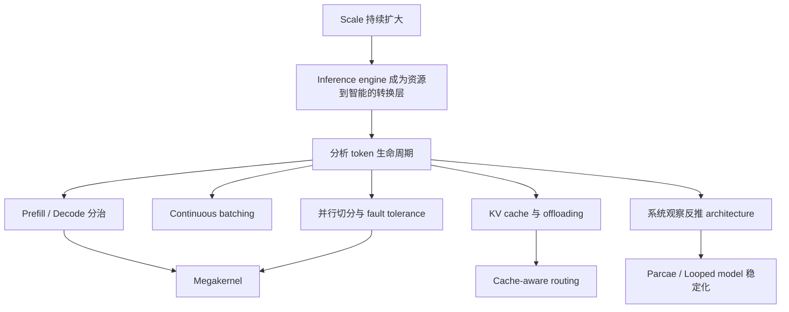

## 模块定位
本模块只覆盖两件事，而且两者必须严格区分。

1. Lecture 18 `Guest lecture: Daniel Selsam`：在 `source-manifest.json` 的 `scheduled_lectures` 中被记录为 `scheduled-source-missing`，没有视频、没有材料、没有可供整理的课堂内容，因此本模块只把它标记为已知资料缺口，不能做任何内容总结。
2. Lecture 19 `Guest lecture: Dan Fu`：本模块仅依据该讲的根笔记 `NOTES.md` 整理；这是一份 transcript-only 讲次，没有官方讲义、PPT 或讲者材料可用来交叉核对。

## 证据边界

### 可用证据
- Lecture 18：`source-manifest.json` 中 `scheduled_lectures` 的第 18 讲条目。
- Lecture 19：`lectures/018-Lecture-19-Guest-lecture-Dan-Fu-9EEm4iMAF5s/NOTES.md`。

### 不可做的事
- 不能为 Lecture 18 补写主题、论点、例子、研究贡献或讲者背景。
- 不能为 Lecture 19 引入任何外部 biography、论文细节、课程官网之外的新事实，或替 transcript 修正专名到“看起来更合理”的版本。
- 不能把 `NOTES.md` 中标为 `[需回听]` 的位置写成确定事实。

## 资料缺口与可用范围

| 讲次 | 状态 | 可用内容 | 处理规则 |
| --- | --- | --- | --- |
| Lecture 18: Daniel Selsam | `scheduled-source-missing` | 只有课表级登记 | 只记录缺口，不做总结 |
| Lecture 19: Dan Fu | transcript-only | 根笔记中整理出的口头内容 | 可以整理系统论点与研究线，但必须保留 transcript 边界 |

## Lecture 18：已记录的 source gap
Lecture 18 在课表层面存在，但当前证据只说明它原定为 `Guest lecture: Daniel Selsam`，且状态为 `scheduled-source-missing`。这意味着目前没有视频、字幕、讲义或材料可以支持内容提炼。因此本模块的唯一合法结论是：Lecture 18 是一个已文档化的资料缺口，不能总结，也不能拿 Lecture 19 的内容去替代它。

### Source-gap checklist
- 已确认讲次存在于课表。
- 已确认状态不是 `recorded-with-materials`，也不是 transcript 可用状态。
- 已确认没有可引用视频 URL、材料链接或本地材料路径。
- 因此本模块不提供 Lecture 18 摘要、术语表、练习题或观点归纳。

## Lecture 19：Dan Fu 的实际论证主线

### 讲次说明
- 性质：transcript-only guest lecture。
- 有效笔记入口：[Lecture 19 NOTES](/courses/stanford-cs336-s26/lectures/018/)

### 一句话总纲
Dan Fu 的核心论证是：当大模型能力与 GPU 投入持续扩张后，真正把“电力/GPU 资源”转成“用户可见 token 与智能”的关键层，不只是模型本身，而是 inference engine；而对 serving system 的细致观察，又会直接催生新的 kernel 设计和新的 architecture 研究。

## Lecture 19：系统与研究内容导读

### 1. 为什么 inference engine 是中心问题
讲次开头先把课程前半段的训练视角切换成“模型训练完以后如何服务出来”。在这个框架里，模型可以被看成运算 DAG，但真正把 GPU 资源变成用户收到的 token 的，是 inference engine 与底层 kernel。这里的判断不是“推理只是部署细节”，而是“推理系统本身决定规模化智能是否能落地”。

### 2. 请求在 serving system 里的实际生命周期
Lecture 19 的系统主线围绕一个请求如何流经服务栈展开。

- 首先是 tokenize 与调度：系统要先判断请求是否命中已有前缀或 activations，能否复用缓存。
- 接着区分 prefill 与 decode：prefill 处理大段未见过的输入，更接近训练前向、偏 compute-bound；decode 每步只新增一个 token，却要反复经过模型，因此更偏 memory-bandwidth-bound。
- 然后是 continuous batching：不同长度、不同阶段的请求会动态拼入同一批次，系统需要同时管理吞吐、排队和显存压力。
- 再往后是 KV cache：前缀共享、多轮会话和大文档追问都依赖缓存复用；显存放不下时，缓存会向 CPU DRAM 与 SSD 外溢。
- 如果模型无法单卡容纳，就会进入 tensor parallelism、mixture-of-experts 等多卡切分问题，连带带来通信、容量和可并发 session 数量的约束。

### 3. 真正推动系统设计的 workload 形状
Dan Fu 反复强调，真实流量不是“平均请求”。Coding agent、长文档问答、多轮聊天、工具调用和跨天继续的会话，会让上下文长度、输出长度、轮次结构和首 token 延迟目标都发生变化。也正因为 workload 差异巨大，系统设计才不能只靠训练侧直觉。

### 4. 为什么 prefill / decode 分治是必要机制
Lecture 19 的一个核心机制判断是：prefill 与 decode 的瓶颈不同，因此应该分别优化，甚至拆到不同 worker 或不同芯片上。prefill 偏 FLOPs，decode 偏 memory bandwidth；prefill 单次更重，decode 重复次数更多。这个分治逻辑也是后面 cache-aware routing、offloading 和 kernel 设计的前提。

### 5. KV cache 如何把 memory hierarchy 变成中心约束
一旦系统想复用前缀和历史会话，KV cache 就从“优化项”变成“核心资产”。它先占 GPU 显存，装不下再外溢到 CPU DRAM，继续增长则需要 SSD。于是 serving 的关键路径不再只由算力决定，而会被缓存冷热、迁移和回填速度重新定义。讲次还把这类 offloading 类比成操作系统里的换页与预取问题：如果未来访问可预测，就可以 prefetch；否则只能依赖近似 LRU 的启发式。

### 6. 系统规模上来后会出现什么问题
讲次给出的例子很具体，而且全部服务于一个结论：大规模 serving 的 bug 形态与小规模测试完全不同。低概率 kernel 错误可能导致 logits 变 NaN，模型卡进重复输出；工具调用链如果断开，模型会陷入反复请求搜索的 doom loop；off-by-one 类错误甚至可能读入未初始化 GPU memory，把整段生成意外带偏到中文。这里的重点不是奇闻轶事，而是说明 inference stack 的可靠性本身就是研究和工程问题。

### 7. 一个高杠杆系统例子：cache-aware routing
Lecture 19 明确给出一个强系统直觉：不是所有 prefill 请求都该抢同一组资源。冷启动长请求的 prefill 成本很高，而很多 warm request 其实只是在已有会话上继续一轮短交互。基于 cache hit rate 把冷请求与 warm request 路由到不同 prefill 资源组，即使只增加很小的 router 逻辑，也可能带来显著加速。这个例子说明 frontier systems 里高收益改动常来自结构正确的切分，而不是更复杂的模型本体。

### 8. 第一条研究线：Megakernel
Megakernel 的出发点是 decode 阶段的利用率问题。每次只生成一个 token，却还要整模型跑一遍，这会让 GPU 更像“高带宽内存搬运器”而不是重算术设备。如果仍然按“一个 operation 一个 kernel”的方式实现，就会暴露大量 launch/teardown 空隙、tail effect 和跨 kernel 等待。

Lecture 19 给出的机制是跨操作融合与更大粒度调度：在依赖允许的地方提前加载后续权重、重叠子阶段，把多个原本分散的步骤放入更大的 kernel 编排里。讲次把这种方向抽象成一种新的 compute paradigm，并把高带宽利用率当作接近硬件极限的信号。

### 9. 第二条研究线：Parcae
第二条线把系统观察继续推回 architecture。问题不再是“推理怎样更快”，而是“除了增大参数和数据，还有没有别的扩展维度”。这里的答案是 loop transformers：让部分 block 循环复用，以固定参数量换更多 FLOPs 与潜在表达力。

但旧 looped model 容易训练不稳，于是讲次用动态系统视角重写问题：先把复杂非线性统摄进一个大盒子 `R`，再把残差动态中真正主导稳定性的部分归到 `A`、`B`。关键论证是 `A^T` 的放大效应会决定训练是否爆炸；因此把 `A` 约束为负对角矩阵，并对 `B` 做简单线性约束，可以从参数化层面换取稳定训练。Lecture 19 的结论不是“循环一定更好”，而是“当 recurrence 被正确稳定化后，它可以成为新的 scaling 旋钮”。

## 机制、例子与 caveats

### 关键机制
- `prefill / decode disaggregation`：按不同瓶颈拆分执行路径。
- `continuous batching`：在动态请求流里平衡吞吐与显存占用。
- `KV cache + offloading`：把会话连续性变成 memory hierarchy 问题。
- `cache-aware routing`：用缓存冷热信息区分冷请求与 warm request。
- `Megakernel`：以跨操作融合减少 decode 阶段空转。
- `Parcae`：通过稳定化参数化让 looped architecture 可训练。

### 讲次中的典型例子
- coding agent、整本书问答、多轮聊天：说明 workload 形状不同，不能用统一平均请求思维处理。
- 重复输出 `hi hi hi` 或一串感叹号：说明数值错误在 serving 中的可见症状。
- 随机冒出中文字符：说明底层 memory / indexing 错误会改变生成轨迹。
- 冷长请求与热短请求分流：说明系统简单路由也可能带来高回报。
- 把矩阵放大直觉退化成类似 `2^T` 的标量例子：帮助理解 recurrence 爆炸为何来自反复乘幂。

### Caveats
- Lecture 19 全部内容都来自 transcript 整理，不能当成有讲义核对过的正式课程文档。
- 专名、公司名、硬件名、量化格式和个别模型名在根笔记里已有多处 `[需回听]` 标记；这里只能保留不确定性，不能替讲者修订。
- 讲次中关于外部传闻的转述，只能理解为课堂口头语境中的例子，不能提升成事实声明。

## Review markers

### Marker 1: 价值链切换
你能否用自己的话说明，为什么这讲把重点从“训练模型”切到“把模型服务出来”，而且把 inference engine 视为资源到智能的转换层？

### Marker 2: token 生命周期
你能否从 tokenize、schedule、prefill、decode、continuous batching、KV cache 一直讲到 offloading 与并行切分，并说清每一步处理的约束？

### Marker 3: 系统 bug 不是边角料
你能否解释为什么 NaN、doom loop、off-by-one 和未初始化 memory 读取都属于 frontier systems 的中心问题，而不是偶发噪声？

### Marker 4: 从系统到研究
你能否分别说明系统观察如何导出 Megakernel，以及为什么 looped model 的稳定化问题会导出 Parcae？

### Marker 5: 部署反推设计
你能否说清 memory、通信、KV cache 热度、量化格式与目标硬件为什么会反过来影响 architecture 选择？

## Mastery criteria
满足以下标准，才算真正掌握本模块。

1. 能明确说出 Lecture 18 只是 source gap，不能被总结，更不能被 Lecture 19 代填。
2. 能准确复述 Lecture 19 的总论点：inference engine 是规模化智能落地的关键层。
3. 能区分 prefill 与 decode 的资源瓶颈，并解释为什么这会牵引 batching、cache 和 worker 分治。
4. 能说明 KV cache 为什么会把 GPU、CPU DRAM、SSD 和会话冷热一起拉进同一个设计问题。
5. 能概括 Megakernel 的收益来源与工程代价，而不把它误解成“只是把 kernel 写大一点”。
6. 能概括 Parcae 的稳定化逻辑，即 `A^T` 放大为什么危险，以及负对角 `A` 与约束 `B` 的作用。
7. 能在不引入外部资料的前提下，指出讲次中哪些专名或细节必须保留为不确定项。

## 练习（含答案）

### 练习 1
为什么本模块不能为 Lecture 18 写摘要？

答案：因为现有证据只有 `source-manifest.json` 中的课表条目，而且状态是 `scheduled-source-missing`；没有视频、材料或 transcript，因此只能记录缺口，不能总结内容。

### 练习 2
Lecture 19 的总论点是什么？

答案：当模型规模和 GPU 投入扩大后，真正把资源转成用户可见智能的是 inference engine；对 serving system 的观察又会进一步催生新的 kernel 和 architecture 研究。

### 练习 3
prefill 与 decode 的关键差别是什么？

答案：prefill 处理大量新 token，更接近训练前向、偏 compute-bound；decode 每步只新增一个 token，却要反复跑模型，因此更偏 memory-bandwidth-bound。

### 练习 4
为什么 Lecture 19 会把 KV cache 提升到核心地位？

答案：因为前缀共享、多轮会话和长文档后续追问都依赖缓存复用，而缓存容量一旦超出 GPU 显存，就会继续牵连 CPU DRAM、SSD、路由和 offloading 策略。

### 练习 5
讲次里的 cache-aware routing 想证明什么？

答案：它说明系统层正确划分冷热请求，即使只增加很小的路由逻辑，也可能带来显著收益；高杠杆优化不一定来自模型本体修改。

### 练习 6
Megakernel 解决的直接问题是什么？

答案：它直接针对 decode 阶段按操作切碎 kernel 带来的 launch 间隙、tail effect 和等待时间，通过跨操作融合与更大粒度调度提高硬件利用率。

### 练习 7
Parcae 的核心稳定化思路是什么？

答案：先把复杂非线性折叠进 `R`，把关注点放到 `A`、`B` 驱动的残差动态；再通过把 `A` 约束为负对角矩阵、对 `B` 做简单线性约束，降低 `A^T` 反复放大的爆炸风险。

### 练习 8
为什么本模块必须保留不确定项，而不能主动“修正”专名？

答案：因为 Lecture 19 是 transcript-only，根笔记已明确标出多处 `[需回听]`；在没有额外证据的前提下，主动修正会把不确定口头内容伪装成确定事实，违反证据边界。

## 最后使用说明
如果你要继续学习本模块，唯一可靠的展开路径是先承认 Lecture 18 目前无源可用，再沿着 Lecture 19 的 transcript-only 笔记复习系统主线、Megakernel 和 Parcae。任何试图补入 Dan Fu 的外部履历、Lecture 18 的假定内容，或把 `[需回听]` 专名写死的做法，都超出了本模块的证据范围。
