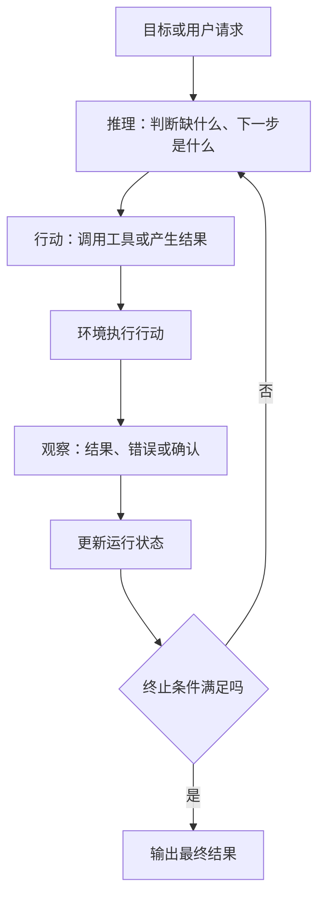
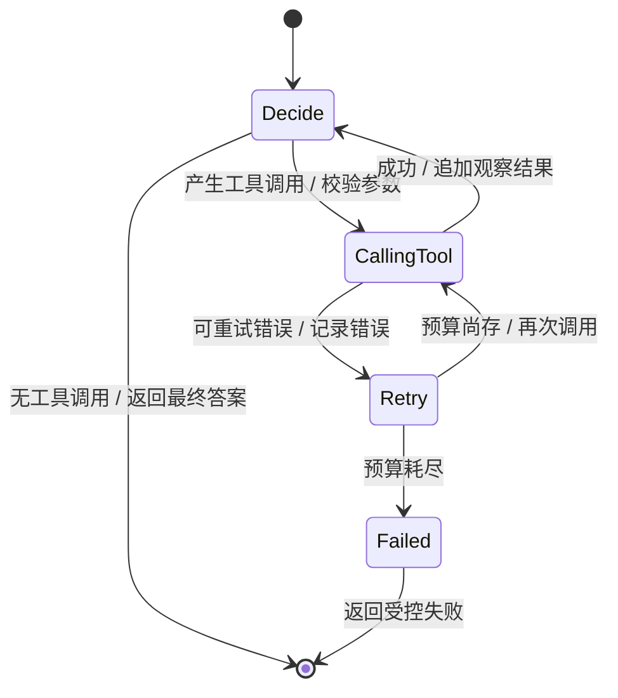
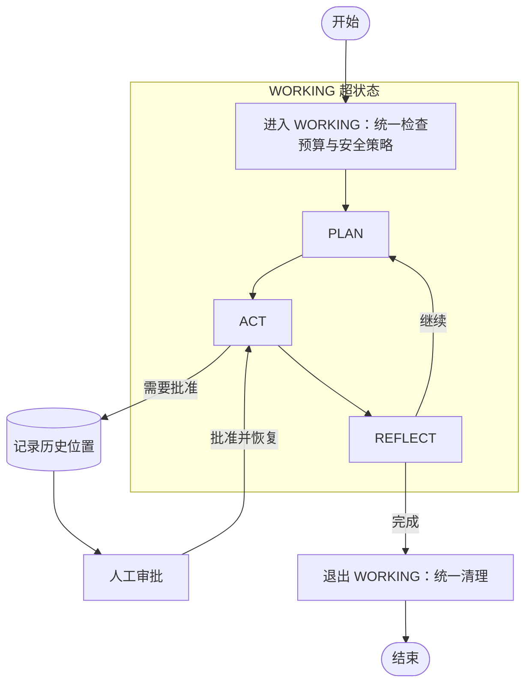
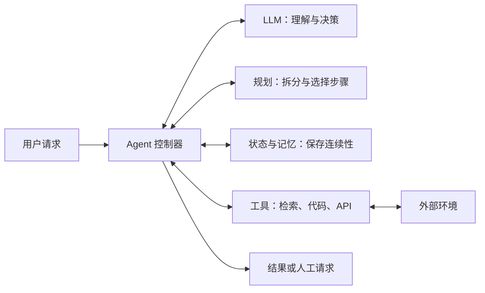
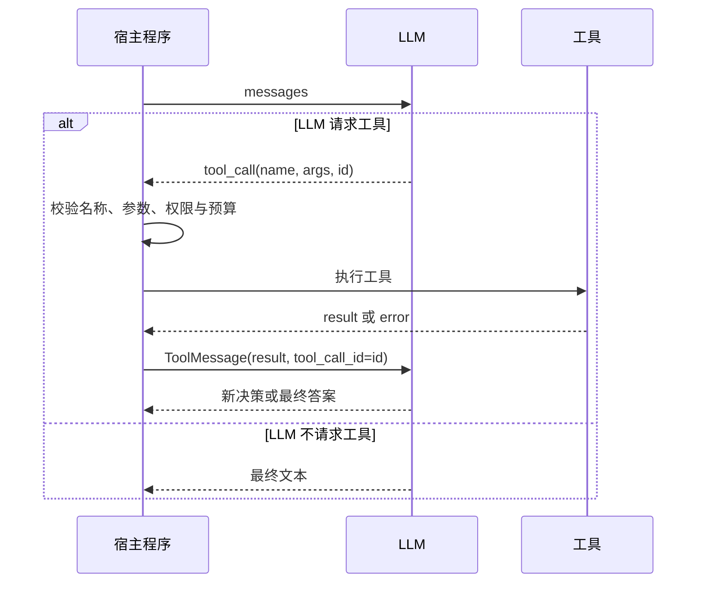
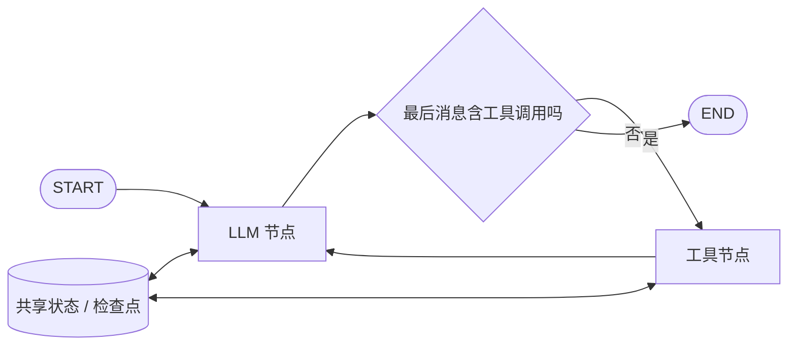
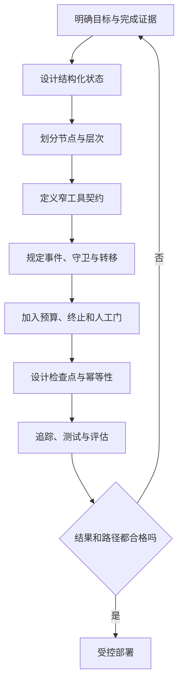
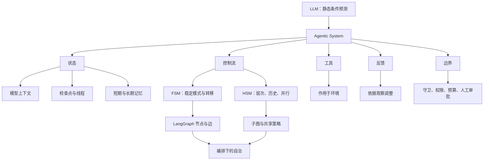

> 原章：*From LLMs to Agents: The Foundational Blueprint*
> 核心问题：一个只能根据上下文预测下一个 token 的 LLM，怎样变成能够持续感知、决策、行动并根据结果调整的 Agent？

## 0. 本章定位与阅读主线

本章没有把 Agent 描写成一个突然拥有完整自主性的“更聪明模型”，而是把它拆回一个可以设计、检查和运行的软件系统：**LLM 提供语言理解与决策能力，状态保存运行现场，控制流组织步骤，工具连接外部环境，反馈驱动下一轮决策，约束则规定系统能做什么和何时必须停止。**

作者的分析顺序很有讲究：

1. 先用人类开发者“思考—行动—反馈”的工作方式解释 Agent 的直觉。
2. 再引入有限状态机（FSM）和层次状态机（HSM），为 Agent 的控制流建立一个严谨的心智模型。
3. 然后对比静态 LLM 与动态 Agent，通过“查纽约温度再求平方”的例子逐步加入工具、状态、检查点和线程。
4. 最后讨论当前 Agent 的自治边界：现实系统实现的是**编排下的自治**，而不是能够任意重写自身目标、工具和架构的完全自治。

整章可以压缩成下面这条演化路径：


这里最重要的判断是：**Agent 的“能动性”首先是系统属性，而不只是模型属性。** 同一个 LLM，放在不同的状态结构、工具集合、权限和控制图中，会表现出完全不同的能力与风险。

---

## 1. 从人的工作闭环理解 Agent

### 1.1 思考、行动与反馈为什么必须形成闭环

作者先以完成软件项目为例。开发者接到需求后通常不会一次性写出最终系统，而会不断经历：

- **思考（reasoning）**：理解目标、识别缺失信息、拆分任务、选择下一步。
- **行动（acting）**：检索文档、修改代码、执行命令、调用服务。
- **反馈（feedback）**：读取测试失败、工具返回值、评审意见或用户的新要求。
- **调整（adapting）**：根据反馈修正计划，再进入下一轮。

LLM Agent 采用相同的闭环。区别只在于，开发者使用浏览器、IDE 和终端，Agent 使用搜索、检索、代码执行器或业务 API 等工具。



一个静态 LLM 调用可以粗略写成：

$$
y_t \sim p_{\theta}(y_t \mid x, y_{<t})
$$

其中：

- $x$ 是当前提示和上下文；
- $y_{<t}$ 是已经生成的 token；
- $\theta$ 是推理期间通常保持不变的模型参数；
- 模型的直接能力是根据已有上下文生成下一个 token 的概率分布。

Agent 则在模型调用外增加一个循环：

$$
a_t = \pi_{\theta}(s_t, g, T)
$$

$$
o_{t+1} = E(a_t)
$$

$$
s_{t+1} = U(s_t, a_t, o_{t+1})
$$

这里 $g$ 是目标，$s_t$ 是第 $t$ 步的运行状态，$T$ 是可用工具集合，$a_t$ 是模型或路由器选择的行动，$E$ 是外部环境，$o_{t+1}$ 是环境返回的观察，$U$ 是状态更新函数。只要终止谓词尚未成立，系统就继续迭代。

这组表达式揭示了一个常见误区：**Agent 根据新结果“调整”不等于 LLM 在运行时重新训练了参数。** 通常变化的是外部状态与下一轮输入，而不是参数 $\theta$。模型仍在做条件预测，只是它现在被放进了一个能读写状态、调用环境并重复执行的控制系统中。

### 1.2 什么是 LLM Agent

本章给出的核心定义可以整理为：

> LLM Agent 是一个被嵌入“推理—行动—反馈”循环的语言模型。它能调用外部工具，并依据工具结果和运行状态调整后续行为，直至达到目标或触发终止条件。

这个定义包含五个不可随意删减的部分：

| 组成 | 回答的问题 | 缺失后的结果 |
|---|---|---|
| 目标 | 系统最终要完成什么 | 无法判断行动是否相关 |
| 推理或决策 | 下一步做什么 | 只能按固定脚本机械执行 |
| 行动或工具 | 怎样影响外部世界 | 只能生成文字，不能查证或执行 |
| 反馈 | 行动实际发生了什么 | 无法发现失败和修正 |
| 状态与终止 | 已经做过什么、何时结束 | 重复劳动、丢失上下文或无限循环 |

因此，“提示写得很长”并不会自动构成 Agent；“模型能输出一个函数名”也还不是完整 Agent。必须有宿主程序实际验证调用、执行工具、记录结果、路由下一步并控制终止。

### 1.3 AI Agent、LLM Agent 与强化学习 Agent

原书为了行文方便交替使用 AI Agent、Agent 和 LLM Agent，但严格说它们并不完全等价。

- **经典 AI Agent**：感知环境，根据策略做决策，通过行动追求目标；不要求使用自然语言。
- **强化学习 Agent**：在环境中试错，通过奖励信号学习策略；例如控制游戏角色或机械臂时可以完全不生成文本。
- **LLM Agent**：把 LLM 作为决策、规划、语言交互或工具选择的核心组件之一。

LLM 的价值不是让“Agent”这个概念首次成立，而是为 Agent 增加：

1. 对自然语言目标的理解；
2. 跨任务的知识迁移与泛化；
3. 以语言表示计划、工具参数和中间结果的能力；
4. 在未为每种输入手写规则时，仍能做相对灵活的选择。

但这些优势也引入不确定性：模型可能误解工具说明、生成无效参数、臆造事实或错误判断已经完成任务，所以系统仍需要确定性的验证、权限和终止机制。

### 1.4 从单 Agent 到多 Agent 系统

作者用软件团队解释扩展过程：小项目可以由一个人包办设计、编码、测试和部署；项目变大后，工作会拆给后端、前端和测试等角色，再由技术负责人协调。对应到 Agent：

- 单 Agent 负责端到端循环；
- 专用 Agent 分别处理检索、分析、编码或审核；
- 监督者 Agent 分派任务、控制交接并整合结果；
- 整体形成多 Agent 系统（Multi-Agent System，MAS）。

多 Agent 的本质不是“多开几个聊天窗口”，而是**任务分解、角色边界、通信协议、共享状态和结果汇合**。如果没有这些结构，增加 Agent 数量只会增加重复、冲突和成本。本章只建立这条演化线，具体架构留给后续章节。

### 1.5 有边界的自治为什么反而可用

开发者也不是无限自治的：编码规范、接口契约、审批流程和生产权限都会限制其行动。Agent 同样只能在开发者提供的工具、权限、工作流和安全措施内选择。

在第 $t$ 步，Agent 实际可选的动作可理解为多个约束集合的交集：

$$
A_t^{allowed} = A_{tools} \cap A_{permissions} \cap A_{guards}(s_t) \cap A_{budget}
$$

- 工具集合决定“有什么动作”；
- 权限决定“允许对哪些对象做动作”；
- 守卫条件根据当前状态决定“此刻能否做”；
- 时间、token、费用和重试预算决定“还能做多少”。

约束不是附加在能力之外的装饰。对于生产系统，只有把开放式模型选择限制在一个可审计、可恢复的空间里，能力才可能稳定地转化为可部署行为。

### 1.6 本书假定的知识基础与目标读者

作者假定读者已经会基本的 LLM 使用和 Python 编程，并了解机器学习、深度学习训练循环、反向传播的目的、Transformer、嵌入和向量存储的基本概念。线性代数与微积分有助于理解后续优化内容，但本章重点不是重新教授 LLM。

目标读者包括：

- 要构建生产系统的数据科学家、软件工程师和机器学习工程师；
- 需要判断能力、成本、风险与护栏的技术负责人；
- 想从演示原型走向真实可运行 Agent 的实践者。

作者强调的是工程现实，而不是把 Agent 当作抽象承诺或思想实验。

---

## 2. 有限状态机：Agent 控制流的基础模型

### 2.1 为什么先讲状态机

LangGraph、CrewAI 等框架暴露的抽象不同：LangGraph 直接突出有状态图，CrewAI 更强调 Agent、Crew 和 Flow。但无论 API 如何命名，任何 Agent 工作流都必须回答：

1. 当前运行到哪里？
2. 刚刚发生了什么？
3. 接下来走哪条路径？
4. 执行后怎样更新现场？
5. 何时结束、失败、暂停或等待人工？

状态机正是回答这些问题的经典控制模型。它已长期用于编译器、GUI、嵌入式设备和网络协议；本章把同一套思想应用到 LLM 推理与工具调用。

严格的有限状态机可表示为：

$$
M = (Q, \Sigma, \delta, q_0, F)
$$

- $Q$：有限的控制状态集合；
- $\Sigma$：事件或输入集合；
- $\delta$：状态转移函数；
- $q_0$：初始状态；
- $F$：接受或终止状态集合。

基本转移为：

$$
q_{t+1} = \delta(q_t, e_t)
$$

工程中的 Agent 图通常更接近**扩展状态机**：控制模式是有限的，但消息、工具结果和计数器等数据可能很大，转移还带守卫、动作和副作用。因此，把 LangGraph 一类系统称为“状态机模式”比断言它是数学上纯粹的 FSM 更准确。

### 2.2 FSM 的核心词汇

| 概念 | 含义 | Agent 中的典型例子 |
|---|---|---|
| 状态（State） | 系统此刻所知信息的快照或所处模式 | 消息列表、当前步骤、剩余预算、已选工具 |
| 事件（Event） | 自上次决策后发生的事情 | 用户输入、工具调用成功、超时、人工批准 |
| 守卫（Guard） | 决定某条边能否通过的条件 | 有工具调用、预算未耗尽、风险评分低于阈值 |
| 动作（Action） | 转移过程中执行的工作 | 调 API、追加消息、保存检查点、请求人工介入 |
| 终止（Termination） | 流程停止的条件 | 目标完成、不可恢复错误、预算耗尽、用户取消 |

一条转移可以理解为：

> 当系统处于状态 $q$，收到事件 $e$，且守卫 $g(s,e)$ 为真时，执行动作 $a$，更新数据状态，并进入下一控制状态。

### 2.3 工具调用 FSM

本章图 1-2 用工具调用说明 FSM。把重试路径展开后，可以得到下面的可执行心智模型：



例如从 `CallingTool` 转到 `Decide`：

- 事件：工具返回成功结果；
- 守卫：返回值通过模式和业务校验；
- 动作：把结果作为工具观察追加到消息状态；
- 下一状态：让 LLM 读取观察并决定下一步。

明确这些元素的价值在于，错误不再只是散落在提示词里的“请重试”，而会变成可测试的控制逻辑。

### 2.4 FSM 解决了什么问题

**第一，任务分解。** “写一篇博客”可拆成选题、提纲、初稿、编辑和 SEO 优化，每个状态只处理一种稳定职责。

**第二，明确交接。** 只有提纲达到规定结构，才进入初稿；只有事实检查通过，才进入发布。转移条件不必完全交给模型猜测。

**第三，恢复执行。** 若在状态边界保存检查点，进程崩溃后可以从最近完成步骤继续，而不是重做整个任务。

**第四，可观察与可测试。** 可以分别检查节点输入输出、守卫真假和转移路径，而不只是评价最终的一大段文本。

不过，“有检查点”不自动保证外部副作用只执行一次。假设 Agent 已成功扣款，但在写入“扣款完成”检查点之前崩溃，恢复后可能重复扣款。可靠实现仍需要幂等键、事务、去重记录或补偿操作。这是状态机可恢复性落地时的重要边界。

### 2.5 FSM 的复杂度瓶颈

加入规划、行动、反思、人工审批、错误恢复和多种重试后，平面 FSM 会遇到：

- 多个状态重复相同的安全检查；
- 每个节点都要连向错误处理和取消路径；
- 边数量快速增长，形成难以维护的“意大利面式路由”；
- 修改全局策略时必须同步修改很多局部节点。

问题不在 FSM 原理错误，而在缺少组织状态的层次。于是作者进一步引入 HSM。

---

## 3. 层次状态机：管理复杂工作流

### 3.1 HSM 增加了哪些能力

层次状态机（Hierarchical State Machine，HSM）允许一个状态内部继续包含状态。

| 概念 | 作用 | Agent 场景 |
|---|---|---|
| 超状态（Superstate） | 组合子状态并承载共同入口、出口和策略 | `WORKING` 统一管理计划、行动、反思 |
| 子状态（Substate） | 超状态内部的具体工作模式 | `PLAN`、`ACT`、`REFLECT` |
| 历史（History） | 离开后记住先前活跃位置 | 人工审批结束后回到先前步骤 |
| 并行区域（Parallel region） | 多个子区域独立推进后汇合 | 并发检索多个来源或让多个专用 Agent 工作 |

历史又分为：

- **浅历史**：恢复到上次活跃的直接子状态；
- **深历史**：连同更深层嵌套状态一起恢复。



### 3.2 为什么层次结构有效

假设 `PLAN`、`ACT`、`REFLECT` 都必须遵守速率限制、安全过滤和熔断策略。平面 FSM 往往在三个状态分别实现；HSM 则把策略挂到 `WORKING` 超状态，子状态继承共同规则。

这样做带来三类收益：

1. **消除重复**：公共入口、出口、守卫只定义一次。
2. **显式策略边界**：一眼就能看到哪些步骤受同一组政策控制。
3. **局部推理**：研究子流程可以独立设计和测试，再作为一个整体嵌入父流程。

作者以研究 Agent 为例，把“研究”从一个巨大的节点拆成关键词搜索、收集 URL、抓取内容和总结发现等子状态。每个子状态甚至可以由一个专用 Agent 承担，再由父图控制进入、退出与汇合。

### 3.3 并行不是无条件同时运行

HSM 的并行区域适合多个互不依赖的工具调用或 Agent 角色，但工程上还必须定义：

- 分支读取和写入哪些共享字段；
- 冲突更新如何合并；
- 是等待全部分支，还是达到法定数量就继续；
- 某个分支超时或失败时，其他结果是否仍可使用；
- 并发上限和费用预算是什么。

因此，HSM 提供的是组织并行控制流的结构，并不替代并发安全、合并策略和资源治理。

---

## 4. FSM/HSM 如何映射到 Agent 框架

### 4.1 LangGraph 中的直接映射

原章以 LangGraph 为主要例子。概念关系如下：

| 状态机概念 | LangGraph 构件 | 说明 |
|---|---|---|
| 数据状态 | `TypedDict` 或 Pydantic 模型 | 定义节点共享的数据接口 |
| 控制状态 | 节点名和当前执行位置 | 表示现在处于哪种工作模式 |
| 动作 | 节点函数或工具节点 | 计算、调用工具并返回状态更新 |
| 转移 | 固定边或条件边 | 把当前节点连接到下一节点 |
| 守卫 | 路由函数 | 根据状态返回目标节点或 `END` |
| 超状态 | 子图 | 封装内部节点和局部路由 |
| 历史 | 检查点加显式位置字段 | 恢复运行数据与上次完成位置 |
| 终止状态 | `END` | 停止当前图执行 |

父图的状态模式类似共享总线。子图声明自己读写哪些键；父子图重叠的键形成接口。例如：

```python
class State(TypedDict):
    messages: Annotated[list[BaseMessage], add_messages]
    working_last: str | None
```

- `messages` 保存对话、工具调用和工具观察；
- `working_last` 是显式的浅历史标记；
- `add_messages` 是合并更新的 reducer，确保节点返回的新消息被追加或按消息 ID 合并，而不是简单覆盖全部历史。

原章前面的 HSM 映射示例使用普通 `List` 来说明共享键，后面的完整 Agent 示例才显式加入 `Annotated[..., add_messages]`。实际实现时是否需要 reducer，取决于并发和更新语义，不能只看字段的 Python 类型。

### 4.2 节点、子图和守卫

`PLAN`、`ACT` 可作为子图内的节点，整个子图相当于 `WORKING` 超状态。子图入口进入第一个子状态，子图的出口边把控制权交还父图。

路由函数是状态机守卫的直接实现：

```python
def route_within_working(state: State):
    if state.get("working_last") == "plan":
        return "ACT"
    return END
```

守卫写成普通 Python 有两个优势：

- 对预算、权限、格式等硬条件可以做到确定、可审计；
- 可以独立单元测试，不必依赖模型“理解”自然语言规则。

LLM 可以提供结构化决策作为事件载荷，但“这个载荷是否允许通过哪条边”最好仍由程序验证。否则，提示词中的安全要求很容易被错误输出或提示注入绕过。

原章还给出一个检查最近消息中是否含有 `stop` 的全局守卫。它适合作为教学示例，但生产中不宜扫描所有角色的自由文本：工具结果恰好含有该词也可能误触发。更稳妥的做法是只检查可信用户事件，或使用经过验证的结构化取消字段。

### 4.3 检查点与 HSM 历史的关系

`MemorySaver` 可以按线程保存已完成节点后的状态，使程序再次运行时恢复消息和执行现场。显式的 `working_last` 则表达业务语义上的“回到 WORKING 时从哪个子状态继续”。

二者相关但不完全相同：

- 检查点回答“系统实际保存了哪个运行快照”；
- HSM 历史回答“重新进入复合状态时应该选择哪个子状态”；
- 只有保存快照还不一定等价于实现所有浅历史或深历史语义；
- `MemorySaver` 是进程内演示存储，不是跨进程、可高可用的生产持久层。

这层区分能防止把框架便利 API 误解为完整的故障恢复方案。

---

## 5. 从静态模型到动态 Agent

### 5.1 静态 LLM 的能力边界

在推理阶段，LLM 本质上是一个条件 token 预测器。它能基于训练参数和当前上下文生成很有说服力的文本，却不会凭空获得：

- 训练截止后发生的实时事件；
- 私有数据库中的业务状态；
- 一段程序真正执行后的结果；
- 某个外部操作是否成功；
- 上一次独立调用中没有再次提供的信息。

这里的“静态”主要指模型参数和一次调用边界，不表示输出永远相同。提示、采样、上下文都可以改变输出，但模型本身不会主动检索、验证或操作环境。

### 5.2 Agency 如何出现

本章把 agency 的形成概括为：**推理与行动耦合。**

- 推理回答“下一步是什么”；
- 行动把决定变成搜索、计算、代码执行或 API 调用；
- 观察把现实结果带回；
- 状态让后续推理知道此前发生过什么；
- 控制流决定循环、分支和停止。

这并不意味着系统具有哲学意义上的自由意志。“能动性”在这里是工程术语，指系统能在运行中根据观察选择下一步并影响环境。

### 5.3 静态 LLM 与 Agentic System 对比

| 静态 LLM 用法 | Agentic System |
|---|---|
| 一次性 token 生成 | 多轮推理—行动—反馈循环 |
| 主要受训练数据和当前提示限制 | 可检索、查证并把新信息写入状态 |
| 调用之间默认无状态 | 维护短期状态，也可连接长期记忆 |
| 线性“提示—响应” | 条件分支、循环、暂停和恢复 |
| 不执行外部工具 | 使用检索、代码和 API 作用于环境 |
| 一次解释用户目标 | 可在反馈后细化或重新解释目标 |
| 没有外部验证闭环 | 可检查结果、发现错误并修正 |

“可更新知识”需要准确理解：通常是更新 Agent 的外部状态、检索库或后续上下文，而不是在线修改 LLM 参数。把检索结果塞进上下文也不保证事实正确，来源质量与验证策略仍由系统负责。

### 5.4 基础 Agent 架构

本章图 1-4 把基础 Agent 分为 LLM 核心、规划、记忆和工具：



各模块解决不同问题：

- **规划**降低长任务的一步式难度。简单方式包括逐步推理，更复杂方式包括思维树的多候选搜索和自我批评。
- **记忆**维持跨步骤或跨会话的连续性，使结果可复用。
- **工具**突破纯文本预测边界，让系统获得实时数据并执行动作。
- **控制器**把这些能力放入可终止、可观测的循环。

逐步推理、思维树和自我批评都只是提高搜索与检查质量的方法，并不天然保证真相。特别是“模型批评模型”仍可能共享同一盲点，关键结论仍需外部证据、程序验证或人工审核。

---

## 6. 第一步：给无状态调用加入工具循环

### 6.1 例 1-1：普通 LLM 调用

原章首先调用一次聊天模型询问“What are AI agents?”。程序提交字符串，模型返回文本，随后结束。此时没有：

- 工具执行；
- 对结果的外部查证；
- 跨调用持久状态；
- 基于反馈继续工作的控制边。

这是一种“把模型当函数”的用法：输入提示，输出文本。

### 6.2 例 1-2：定义搜索与计算工具

随后作者定义两个工具：

1. `internet_search(query)`：通过 SerpAPI 搜索最新信息；
2. `calculator(expression)`：通过 `numexpr` 计算单行数学表达式。

LangChain 的 `@tool` 装饰器会从函数名、类型签名和 docstring 构造给模型看的工具模式。模型不是直接阅读 Python 实现来决定怎样调用，而主要依赖这份契约。

一个工具契约至少应说明：

- 工具名称及其唯一职责；
- 每个参数的名称、类型、含义和限制；
- 返回值的格式与单位；
- 可能的错误和禁止用途；
- 是否有副作用。

docstring 缺失会使 LangChain 无法正常建立描述；描述含糊则更容易产生无效调用。由此可见，工具说明不是普通注释，而是 Agent 与执行环境之间的接口协议。

计算器把 `global_dict` 设为空，只暴露 $\pi$ 和 $e$，比直接使用 Python `eval` 更可控。不过“禁止全局变量”并不等于完整沙箱；生产环境还应限制表达式长度、运算符、数组大小、执行时间和资源占用。

### 6.3 例 1-3：把工具绑定给模型

绑定工具后，模型获得的是可用工具的结构化描述，并可在普通文本回答和工具调用之间选择。`tool_choice="auto"` 的意思是由模型决定是否调用以及调用哪个工具。

这里必须区分两件事：

- **模型提出工具调用**：生成工具名和参数；
- **宿主程序执行工具调用**：校验权限与参数，真正运行函数，再返回观察。

模型永远不应因为“说自己已经调用”就被视作操作完成。真正的执行权在 Agent 运行时。

原例把采样温度设为 0，以降低随机性，但温度为 0 也不应被当作跨服务、版本和硬件绝对确定性的保证。

原章还指出，现代模型已不只是被动接入工具：Kimi K2、Llama 4、Qwen3.6 等模型会针对指令遵循、编码和结构化工具调用进行训练或优化。这会提高模型选择工具和生成参数的能力，但不改变系统责任边界：模型训练决定“提议行动有多好”，运行时治理决定“哪些行动真的可以发生”。

### 6.4 例 1-4：单次运行内的工具循环

工具绑定后，作者实现一个最多 8 步的小循环。它的协议如下：



核心算法可写成：

```text
messages ← [用户请求]
for step in 1..max_steps:
    assistant_message ← LLM(messages)
    messages 追加 assistant_message

    if assistant_message 没有工具调用:
        return assistant_message.content

    for call in assistant_message.tool_calls:
        校验 call
        result ← 执行对应工具
        messages 追加 ToolMessage(result, call.id)

若步数耗尽且最后停在工具观察：
    再要求 LLM 根据已有观察生成最终答案
```

每一步的依据是：

1. 消息列表保存本次运行的局部历史，让模型能看到先前调用。
2. `tool_calls` 是结构化行动请求，不用从自然语言中正则解析函数名。
3. `tool_call_id` 把每个观察与原调用一一关联；并发多个调用时尤其重要。
4. 工具结果作为 `ToolMessage` 回传，模型才能解释结果并决定继续还是回答。
5. `max_steps` 防止模型反复调用工具而不终止。

重要不变量是：**每个被接受的工具调用都应得到一个可关联的成功或失败观察。** 丢失观察、错配 ID 或只记录工具返回而不保留调用消息，都会破坏协议历史。

### 6.5 为什么工具循环仍被称为“无状态”

`run_once` 内确实有一个 `messages` 列表，所以它在一次函数执行期间具有局部状态。但函数返回后列表被丢弃；下一次调用不会自动加载它。因此这里的“无状态”指**跨运行、跨会话没有持久状态**，不是指循环内部一个变量都没有。

这是很容易混淆的层级：

| 层级 | 是否保存 | 生命周期 |
|---|---|---|
| 单次模型调用的 token 上下文 | 是 | 一次模型调用 |
| `run_once` 的消息列表 | 是 | 一次工具循环 |
| Agent 线程检查点 | 当前还没有 | 应跨多次调用 |
| 长期用户或业务记忆 | 当前还没有 | 可跨会话与进程 |

### 6.6 “纽约温度再求平方”案例的设计目的

任务要求：

1. 搜索纽约当前摄氏气温，并返回来源与数值；
2. 把第一步的数值交给计算器求平方；
3. 按固定格式组织最终结果。

假设搜索得到 $T=18$，则：

$$
T^2 = 18^2 = 324
$$

这个例子同时检验四件事：实时检索、数值抽取、跨步骤传值、调用第二个工具。它不是在说明“温度平方”有重要物理意义；若保留量纲，结果是 $324\ ^\circ C^2$，不能解释成普通温度。作者选择这一运算，是为了让数据依赖关系足够简单、结果容易人工核对。

达到最大步数后，最后一条消息有可能仍是工具观察，而不是助手答案。原代码因此追加一条“现在按指定格式结束”的指令，再调用一次模型。这能保证展示结果，但也暴露了当前实现的局限：结束逻辑依赖一段特定任务提示，不是通用的完成协议。

### 6.7 这段最小循环还缺什么

作为教学例子，它刻意省略了生产系统会需要的部分：

- 未知工具名和非法参数的处理；
- 工具超时、限流、异常与重试分类；
- 搜索来源的可信度与交叉验证；
- 有副作用工具的人工批准和幂等控制；
- token、费用和墙上时间预算；
- 跨运行检查点；
- 通用终止与失败状态；
- 完整追踪、指标和敏感信息脱敏。

`max_steps` 只是防无限循环的保险丝，不是任务正确完成的证明。

---

## 7. 第二步：给 LLM 一个显式状态

### 7.1 “状态”不只是模型上下文

本章把状态定义为工作流的**结构化运行快照**。模型上下文只是它的一部分。完整状态还可以包含：

- 消息与工具观察；
- 当前节点和下一路由提示；
- 已完成步骤、重试次数和剩余预算；
- 分支或线程标识；
- 审批结果、错误信息和检查点元数据。

三个相近概念应分开：

| 概念 | 主要含义 | 例子 |
|---|---|---|
| 模型上下文 | 某一次 LLM 调用实际看到的 token | 系统提示、最近消息、检索片段 |
| 工作流状态 | 控制器保存的结构化运行快照 | 消息、计数器、路由字段、任务状态 |
| 记忆 | 为未来步骤或会话保留并可取回的信息机制 | 检查点、用户偏好库、向量检索库 |

控制器可以只把状态的一部分投影到模型上下文。比如权限令牌应参与工具授权，却不应原样发给 LLM。

### 7.2 LangGraph 的四个关键构件

原章概括了四个概念：

**State**
共享数据结构，表示应用当前快照。

**Nodes**
接收当前状态、执行计算或副作用、返回状态更新的函数。

**Edges**
根据状态选择下一节点的规则，可以固定或有条件，并必须覆盖完成路径。

**Command**
把状态更新与下一跳选择组合在一个返回对象中，适合节点间或多参与者通信。

它们与 Agent 循环的关系如下：



### 7.3 例 1-5：构建最小有状态图

状态定义为：

```python
class AgentState(TypedDict):
    messages: Annotated[list[BaseMessage], add_messages]
```

这行代码有三个关键点：

1. `TypedDict` 描述字段结构，帮助静态检查；它本身不像 Pydantic 那样自动完成全面运行时验证。
2. 节点只需返回本次新增的消息，而不是复制整个列表。
3. `add_messages` 规定多个更新怎样归并到已有状态，是状态语义的一部分。

随后建立：

- `llm_node`：读取当前消息，调用绑定工具后的 LLM，返回新的助手消息；
- `ToolNode`：执行助手消息中的结构化工具调用；
- `route`：若最后消息含工具调用则去 `tools`，否则去 `END`；
- `tools → llm` 固定边：工具执行后必须让模型解释观察或继续决策。

这正是前面工具 FSM 的框架实现。LLM 节点内部可以有概率性，外部图的允许路径仍是显式的。

### 7.4 例 1-6：检查点与线程

图定义完成后，作者用 `MemorySaver` 编译：

```python
checkpointer = MemorySaver()
app = graph.compile(checkpointer=checkpointer)
cfg = {"configurable": {"thread_id": "nyc-weather-session"}}
```

含义分别是：

- `compile` 把节点、边和状态更新规则组装成可运行应用；
- checkpointer 在节点边界保存每个线程的状态；
- `thread_id` 是状态命名空间，同一个 ID 继续同一条历史，不同 ID 默认隔离。

`recursion_limit=20` 是一次图运行允许的最大步数保护，作用类似前面循环的 `max_steps`。它控制失控循环，却仍不能判断答案在语义上是否正确。

### 7.5 例 1-7 至 1-9：为什么要观察执行过程

Agent 的失败常常发生在中间路径，而不是最终字符串。例如：模型选错工具、参数正确但结果未写入状态、路由提前结束、消息 ID 错配。只看最终答案无法定位这些问题。

作者因此增加两个辅助能力：

- `_short`：把消息角色、文本摘要和工具名格式化为单行；
- `print_state_snapshot`：读取当前线程状态，显示消息尾部、下一节点和排队任务；
- `app.stream(..., stream_mode="updates")`：按节点输出本次增量，显示进入、更新和离开。

这里要区分**状态快照**与**节点更新**：节点通常返回增量，如 `{"messages": [new_message]}`；reducer 合并后才形成新的完整快照。

追踪输出也可能包含用户文本、搜索结果和工具参数。生产日志应做访问控制、脱敏和保留期限管理，不能因为“只是调试”就默认安全。

### 7.6 例 1-10 与 1-11：同一线程的两轮执行

第一轮询问纽约当前摄氏气温。典型消息轨迹是：

1. `HumanMessage`：查询当前温度；
2. `AIMessage`：请求 `internet_search`；
3. `ToolMessage`：搜索观察；
4. `AIMessage`：给出如 $18\ ^\circ C$ 的答案；
5. checkpointer 把这些消息保存到 `nyc-weather-session`。

第二轮只说“现在计算那个温度的平方”。因为仍使用同一个 `thread_id`：

1. 应用先恢复第一轮消息；
2. 新的人类消息被追加；
3. LLM 从历史中解析“那个温度”为 18；
4. 调用计算器求 `18**2`；
5. 工具返回 324；
6. LLM 形成最终回答，新状态再次保存。

这说明持久状态解决了代词指代与跨轮数据依赖。用户不必把 18 再写一遍，工具结果也不必由应用手工拼进新提示。

### 7.7 例 1-12 与 1-13：分支与隔离

原章随后使用另一个线程处理“不要平方，改为华氏温度”。若摄氏温度为 18，则：

$$
F = 18 \times \frac{9}{5} + 32 = 64.4\ ^\circ F
$$

不同线程的检查点互不污染，因此适合平行探索方案。但是这里必须准确区分：

- **新 `thread_id`**：创建一条默认为空的独立历史；
- **从既有状态分叉**：先复制或重放某个检查点，再在新线程继续。

仅仅把 ID 改成 `nyc-weather-branch`，不会天然把主线程中的 18 复制过去。原章片段也没有展示 `cfg_branch` 的定义与状态克隆过程。要让“it”在新线程中有指代对象，至少需要显式带入主线程消息：

```python
cfg_branch = {"configurable": {"thread_id": "nyc-weather-branch"}}
seed_messages = list(app.get_state(cfg).values["messages"])

app.invoke(
    {
        "messages": seed_messages
        + [HumanMessage(content="Instead, convert that temperature to Fahrenheit.")]
    },
    config=cfg_branch,
)
```

具体框架版本也可能提供基于 checkpoint ID 的分叉 API。无论采用哪种方式，原则都是：**隔离标识解决“不串线”，复制检查点才解决“从同一现场分叉”。** 对很长的历史，更适合复制结构化事实或摘要，而不是无条件复制全部 token。

### 7.8 一个可直接运行的最小状态机示例

下面的纯 Python 示例不依赖 LLM 服务。它故意用确定性路由代替 LLM 决策，以单独展示本章最核心的状态、工具、线程和分叉语义；把 `decide` 换成模型结构化输出后，控制骨架不变。

```python
# 可直接运行：python stateful_agent_demo.py
from copy import deepcopy
from dataclasses import dataclass, field
from enum import Enum, auto

class Mode(Enum):
    PLAN = auto()
    ACT = auto()
    OBSERVE = auto()
    END = auto()

@dataclass
class State:
    messages: list[tuple[str, str]] = field(default_factory=list)
    temperature_c: float | None = None
    pending_tool: str | None = None
    pending_arg: float | str | None = None
    observation: float | None = None
    mode: Mode = Mode.PLAN
    steps: int = 0

class Checkpointer:
    def __init__(self) -> None:
        self._threads: dict[str, State] = {}

    def load(self, thread_id: str) -> State:
        return deepcopy(self._threads.get(thread_id, State()))

    def save(self, thread_id: str, state: State) -> None:
        self._threads[thread_id] = deepcopy(state)

    def fork(self, source_id: str, target_id: str) -> None:
        self._threads[target_id] = self.load(source_id)

def execute_tool(name: str, argument: float | str) -> float:
    if name == "weather":
        # 固定返回值让示例可重复；真实实现会调用天气 API。
        return 18.0
    if name == "square":
        return float(argument) ** 2
    if name == "fahrenheit":
        return float(argument) * 9 / 5 + 32
    raise ValueError(f"unknown tool: {name}")

def decide(state: State, request: str) -> None:
    normalized = request.lower()
    if "temperature" in normalized and state.temperature_c is None:
        state.pending_tool, state.pending_arg = "weather", "New York City"
    elif "square" in normalized:
        if state.temperature_c is None:
            raise ValueError("temperature is missing from this thread")
        state.pending_tool, state.pending_arg = "square", state.temperature_c
    elif "fahrenheit" in normalized:
        if state.temperature_c is None:
            raise ValueError("temperature is missing from this thread")
        state.pending_tool, state.pending_arg = "fahrenheit", state.temperature_c
    else:
        raise ValueError("request is outside this demo's allowed routes")
    state.mode = Mode.ACT

def run_turn(store: Checkpointer, thread_id: str, request: str) -> float:
    state = store.load(thread_id)
    state.messages.append(("user", request))
    state.mode = Mode.PLAN
    state.steps = 0

    while state.mode is not Mode.END:
        state.steps += 1
        if state.steps > 8:
            raise RuntimeError("step budget exhausted")

        if state.mode is Mode.PLAN:
            decide(state, request)
        elif state.mode is Mode.ACT:
            assert state.pending_tool is not None
            assert state.pending_arg is not None
            state.observation = execute_tool(state.pending_tool, state.pending_arg)
            state.mode = Mode.OBSERVE
        elif state.mode is Mode.OBSERVE:
            assert state.observation is not None
            if state.pending_tool == "weather":
                state.temperature_c = state.observation
            state.messages.append(("tool", str(state.observation)))
            state.mode = Mode.END

    store.save(thread_id, state)
    assert state.observation is not None
    return state.observation

if __name__ == "__main__":
    store = Checkpointer()
    print(run_turn(store, "main", "Get the NYC temperature"))  # 18.0
    print(run_turn(store, "main", "Square that temperature"))  # 324.0

    store.fork("main", "fahrenheit-branch")
    result = run_turn(store, "fahrenheit-branch", "Convert it to Fahrenheit")
    print(result)  # 64.4
```

代码与原理的对应关系：

- `State` 是结构化运行快照；
- `Mode` 是有限控制状态；
- `decide` 是路由器，真实 Agent 可由 LLM 生成候选行动，再由程序校验；
- `execute_tool` 是受白名单限制的工具执行层；
- `while` 循环实现 `PLAN → ACT → OBSERVE → END`；
- `steps` 是终止保险丝；
- `Checkpointer` 按线程保存状态；
- `fork` 显式复制快照，说明“新线程”与“从旧线程分支”的差别。

这个示例没有自然语言泛化能力，恰好说明模型与控制器各自的职责：LLM 让决策更灵活，状态机让可选路径和运行边界更明确。

---

## 8. 当前现实：编排下的自治

### 8.1 用 HSM 重新理解“自治程度”

一旦把 Agent 看成状态机，自治就不再是非黑即白的神秘属性，而是“系统在一个受约束区域内拥有多少选择”。

- **路由器**：从有限候选边中做一次选择，相当于带单个守卫的简单 FSM。
- **工具调用 Agent**：在 `PLAN`、`ACT`、`REFLECT` 间循环，相当于 `WORKING` 超状态内的 HSM。
- **多 Agent 系统**：监督者管理多个子图，可有委派、并行和汇合。
- **完全自导演化系统**：理论上还能可靠地重写图、创造新工具、改变策略并验证自身变化；当前尚不成熟。

“看起来有自主性”的关键，是 LLM 可以在允许区域内依据运行时观察做选择；区域本身仍由工程师定义。

### 8.2 当代 Agent 能做与不能稳定做到的事

| 当前能做 | 当前不能可靠做到 |
|---|---|
| 在预定义路径间动态路由 | 自主重写并验证整个控制图 |
| 从允许列表选择工具或子 Agent | 无约束地产生、部署并治理新工具 |
| 判断是否还需更多步骤 | 保证长时间运行中始终对齐且连贯 |
| 在许可范围内修改提示或工具配置 | 稳健地重新定义自身目标和架构 |
| 编写并运行小段代码辅助下一步 | 脱离编排框架成为完全自导系统 |

现实 Agent 可以改变**路径实例**，通常不能任意改变**路径空间本身**。例如它可以选择搜索或计算，可以决定再反思一次，却不能绕开程序定义的审批节点、凭空获取数据库权限，或可靠地把自己的拓扑换成一套未经验证的新系统。

### 8.3 为什么叫“orchestrated autonomy”

“编排下的自治”同时保留两层事实：

1. **自治层**：模型会根据当下状态选择工具、顺序、参数和是否继续，因此不是完全固定脚本。
2. **编排层**：允许的节点、边、工具、权限、预算和升级路径由系统预先规定，因此不是无限自决。

现实中的多数可部署系统位于中间地带：比单次路由器灵活，又远未达到自我演化的完全自治。作者认为这不是缺陷，而是安全、可预测和可部署的前提。

### 8.4 “机械降神”隐喻所批评的误解

古希腊戏剧中的 *deus ex machina* 指神突然出现，替剧情解决无解冲突。作者借此反驳一种 Agent 想象：只要接入一个强模型，机器就会无条件理解目标并独立解决所有问题。

现实能力来自可说明的工程部件：

- 设计良好的工作流；
- 定义准确的工具；
- 可恢复状态；
- 可靠反馈；
- 权限、安全和人工边界。

把 Agent 神秘化会掩盖真正的设计责任，也会让失败难以诊断。

### 8.5 AI Scientist v2 案例：能力与边界同时存在

本章引用 AI Scientist v2 说明有限自治已经能做到什么。该系统把多 Agent 工作流、树搜索、实验管理和视觉—语言反馈组合起来，可以：

1. 生成研究假设；
2. 编写实验代码；
3. 并行运行实验并调试、改进；
4. 可视化和分析结果；
5. 撰写科学论文。

据本章引用的 2025 年报告，系统向 ICLR workshop 投稿三篇论文，其中一篇通过同行评审并被接收。这是从想法到实验和论文的长闭环能力展示。

但证据必须按正确强度解释：

- 接收发生在 workshop，而不是主会顶级赛道；
- 三篇中有两篇被拒；
- 被接收工作仍存在论证不清、方法深度不足和数据集限制；
- 系统出现过引用错误和误导性图表描述等典型 LLM 问题；
- 能搜索、调试和完善实验，不等于能稳定创造全新科学范式。

这个案例支持的结论是：**精心编排的 Agent 已能闭合复杂知识工作的一大段流程，但成果的严谨性、创新性和事实可靠性仍需要外部评价与人类监督。** 它证明的是有限自治的工程潜力，不是完全自治已经实现。

---

## 9. 容易混淆的概念与常见误区

| 易混淆点 | 正确辨析 |
|---|---|
| Agent 就是更大的 LLM | LLM 是核心组件；循环、状态、工具、权限和运行时共同构成 Agent |
| 长提示等于状态 | 提示只是一次模型调用的上下文；状态还含路由、预算、工具结果和检查点 |
| 能调用工具就一定有状态 | 单次工具循环可以在结束后丢弃全部历史，仍是跨运行无状态 |
| 模型输出工具名就已执行动作 | 那只是行动提案；宿主程序必须校验、授权、执行并返回观察 |
| Agent 依据反馈改变就是在线学习 | 多数情况下只更新上下文或外部状态，模型参数并未改变 |
| FSM 意味着所有行为确定 | 图的允许路径明确，但 LLM 节点内部仍可能是概率性的 |
| Agent 图一定是严格有限状态机 | 控制模式有限，消息等数据可能不有限，更接近扩展状态机 |
| 检查点就是长期记忆 | 检查点主要恢复运行现场；长期记忆还涉及筛选、存储、检索和生命周期 |
| `MemorySaver` 足够生产使用 | 它适合进程内示例；生产需要耐久、并发、加密和恢复保证 |
| 新 `thread_id` 会复制旧线程 | 新 ID 只建立隔离空间；真正分叉必须复制或重放检查点 |
| 更多自治一定更强 | 选择空间越大，验证、成本和安全风险也越高；任务匹配比自治最大化重要 |
| 反思能保证正确 | 反思是再次采样和检查，仍可能重复原有偏差，需要外部证据 |
| 温度为 0 保证完全确定 | 它通常降低采样随机性，但服务实现、模型版本等仍可能造成差异 |
| 有最大步数就有正确终止 | 步数限制只防失控；还需完成、失败、取消和人工等待等语义状态 |

---

## 10. 从本章抽象出的 Agent 设计方法

面对一个适合 Agent 化的问题，可以沿以下顺序设计。

### 第一步：定义目标与完成证据

先明确最终产物、质量标准和谁有权确认完成。没有可检查的完成条件，模型只能凭语言感觉宣布“做完了”。

### 第二步：定义最小状态模式

只保存后续决策真正需要的信息，并区分：模型可见字段、控制器私有字段、敏感字段和可持久化字段。状态越庞杂，合并、隐私和上下文成本越高。

### 第三步：识别稳定控制状态

把流程拆成职责清楚的模式，如 `PLAN`、`ACT`、`VERIFY`、`WAIT_FOR_HUMAN`、`DONE` 和 `FAILED`。不要把所有逻辑塞进一个万能节点。

### 第四步：把外部能力定义成窄工具

为工具建立准确模式、单位、错误类型、超时、权限和副作用说明。工具应完成一项可验证工作，而不是让模型通过一个万能 shell 绕开全部治理。

### 第五步：为每条边写事件、守卫和动作

尤其要覆盖错误、取消、重试和人工升级路径。硬约束由代码执行，开放式判断才交给 LLM。

### 第六步：设定预算和终止语义

同时限制步骤、时间、token、费用、并发和重试。区分 `DONE`、`FAILED`、`CANCELLED`、`PAUSED`，不要把所有停止都解释为成功。

### 第七步：设计检查点与副作用一致性

决定何时保存、怎样恢复、工具是否幂等、崩溃窗口内如何避免重复动作。明确线程隔离与状态分叉语义。

### 第八步：让执行路径可观察

记录节点、边、延迟、工具调用、错误分类、预算和状态版本；对敏感内容脱敏。既评价最终答案，也评价路径是否合规高效。

### 第九步：按风险设置人工门

搜索和只读分析可自动执行；付款、删除、发送外部消息、修改生产配置等高影响动作通常需要更强授权或人工批准。

这套方法可概括为：



---

## 11. 本章知识结构总结



### 11.1 核心结论

1. LLM 的直接能力是条件文本预测；Agent 能力来自模型与运行时系统的组合。
2. Agent 的最小闭环是“推理—行动—观察—更新—再决策”，并必须有终止条件。
3. 状态保存的不只是聊天文本，还包括控制、工具、预算、分支和恢复信息。
4. FSM 让步骤、转移和错误路径显式化，HSM 通过超状态、历史和并行管理更大工作流。
5. LangGraph 的状态、节点、条件边、子图和检查点可直接映射到状态机心智模型。
6. 工具模式是模型与执行环境的接口契约；模型提出调用，运行时负责验证和执行。
7. 单次运行内有消息列表，不代表跨运行有状态；线程隔离也不等于状态分叉。
8. 检查点提高可恢复性，但外部副作用仍需幂等、事务或补偿机制。
9. 当前主流 Agent 实现的是预定义边界内的动态选择，即编排下的自治。
10. 边界不是能力的反面。明确工具、权限、预算和人工门，才使 Agent 安全、可靠并可部署。

### 11.2 作者解决问题的一般思路

作者没有从“怎样让模型显得更自主”出发，而是逐层追问：

1. 静态调用缺少什么？——缺少行动、反馈和连续状态。
2. 怎样组织循环？——用状态、节点、边、守卫和终止条件。
3. 复杂后怎样避免重复与混乱？——用 HSM、子图和共享策略。
4. 怎样证明状态真的有效？——用跨两轮的温度案例和线程快照观察。
5. 怎样看待自治？——把它还原为预定义状态空间内的选择范围。
6. 怎样判断现实能力？——同时考察成功案例与失败、质量和监督需求。

这套分析方法的价值在于，它把一个容易被神秘化的话题变成了软件工程问题：**先找缺失能力，再增加最小机制；让控制边界显式；用可观察案例验证；最后诚实描述适用范围与局限。**

---

## 12. 延伸阅读

- Jason Wei 等，*Chain-of-Thought Prompting Elicits Reasoning in Large Language Models*：本章提到的逐步推理背景。
- Shunyu Yao 等，*Tree of Thoughts: Deliberate Problem Solving with Large Language Models*：把单一路径扩展为候选思路搜索。
- Yutaro Yamada 等，*The AI Scientist-v2: Workshop-Level Automated Scientific Discovery via Agentic Tree Search*：本章有限自治案例的来源。
- 原书后续章节：第 2 章继续讨论规划、反应、反思、多 Agent 和人机交互架构；第 10 章再深入记忆架构、存储、检索和持久化。
