> 原章：*Architectures and Patterns: Planning, Reactivity, and Multi-Agent-Systems*
> 核心问题：当一个 Agent 需要处理多步、不确定、高风险或跨专业任务时，怎样通过推理模式、人工介入与多 Agent 协调，把模型能力组织成可控的系统能力？

## 0. 本章定位与阅读主线

第 1 章回答了“LLM 怎样通过状态、工具和反馈成为 Agent”；第 2 章继续追问：**同样的模型和工具，为什么换一种控制架构，系统就会表现出不同的推理质量、适应性、安全性和扩展性？**

作者的核心立场是：

> Agent 的智能不仅来自所用 LLM，也来自任务如何分解、候选路径如何搜索、观察如何反馈、人工在何处介入，以及多个角色如何交换控制权。

原章按照三层递进展开：

1. **组织一个 Agent 的推理与行动**：从单步执行进入 Chain of Thought（CoT）、Tree of Thoughts（ToT）和 ReAct。
2. **组织 Agent 与人的协作**：用 Human-in-the-Loop（HITL）的批准、编辑、工具审查和并行中断约束高风险步骤。
3. **组织多个 Agent 的协作**：比较 supervisor、hierarchical 与 swarm 架构，并构建研究—写作团队。

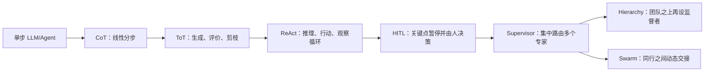

本章不是在给架构排一个从弱到强的固定顺序。每增加一层循环、分支或参与者，通常都会提高适应性，同时增加模型调用、状态同步、终止判断和调试成本。真正的设计问题是：**任务的不确定性和风险，是否值得引入相应复杂度？**

---

## 1. 从单步执行到多步执行

### 1.1 两种执行方式分别是什么

作者先比较同一个任务：“总结一份文档，并为关键统计数据生成柱状图。”

**单步 Agent**接收请求，在一次连续执行中完成内部规划、摘要和图表生成，随后返回结果。中途没有显式检查点，也不会依据部分结果重规划。

**多步 ReAct Agent**把任务拆成连续决策：

1. 判断先提取统计数据；
2. 调用提取工具并把结果写入状态；
3. 根据提取结果规划摘要；
4. 生成摘要并保存；
5. 规划和创建柱状图；
6. 检查中间结果，不完整则继续循环，满足完成条件或预算耗尽才结束。

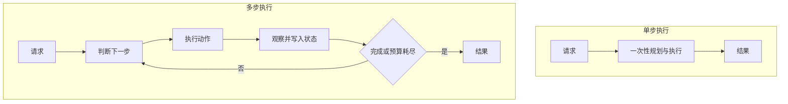

原书图 2-1 为了突出单步路径的非迭代性，把工具结果直接画成输出；生产系统也可能把工具结果再交给 LLM 做一次格式化。这不会改变关键区别：**是否允许中途观察结果并改变后续计划。**

### 1.2 为什么要引入多步循环

单步方式隐含一个很强的前提：执行前就能正确知道完整计划，而且中间步骤大体不会失败。当任务有以下特征时，这个前提容易破裂：

- 后一步依赖前一步真实返回的数据；
- 工具可能失败、超时或返回不完整结果；
- 用户目标存在歧义，需要逐步澄清；
- 结果需要验证、修正或补充证据；
- 无法预先列出所有分支。

多步循环把“先做完再看”改成“做一步、看结果、再决定”。若把状态记为 $s_t$，动作记为 $a_t$，环境观察记为 $o_{t+1}$，一般形式是：

$$
a_t \sim \pi(a \mid s_t),
\qquad
o_{t+1} = E(a_t),
\qquad
s_{t+1} = U(s_t,a_t,o_{t+1})
$$

其中 $\pi$ 是 Agent 的决策策略，$E$ 是工具或环境，$U$ 是状态更新函数。多步能力来自这个闭环，而不是简单地让模型输出更多文字。

### 1.3 多步并不自动优于单步

多步系统的代价包括：

- 每一步都可能增加模型延迟与费用；
- 状态增长会占用上下文窗口；
- 错误可能在步骤间传播；
- 循环可能不终止或反复调用同一工具；
- 中间消息、工具参数和日志扩大隐私暴露面。

如果任务确定、低风险、一步即可验证，例如把一个明确 JSON 字段改名，固定流水线通常更便宜、更稳定。只有当中间观察确实能改善后续决策时，多步架构才有意义。

可以把总成本粗略表示为：

$$
C_{run} = \sum_{t=1}^{T}
\left(C_{model,t}+C_{tool,t}+C_{coord,t}+C_{human,t}\right)
$$

$T$ 是实际步数；除了模型与工具成本，还要计算协调和人工等待成本。架构设计不能只比较“答案看起来是否更聪明”。

---

## 2. Structured Reasoning and Action：先塑造角色，再塑造思考方式

### 2.1 Persona 的作用与边界

作者首先谈到 persona，也就是把 Agent 描述成具有明确职责和心态的角色：

- planner 是有条理的战略制定者；
- critic 是专门寻找缺陷的评价者；
- researcher 负责证据搜集；
- writer 负责综合表达。

角色提示主要解决两个问题：

1. **注意力聚焦**：告诉模型应优先关注哪些信息和质量标准。
2. **协作契约**：让多 Agent 系统知道每个角色应提供什么产物，减少职责重叠。

Persona 并不会给模型凭空增加知识或权限。一个被称作“拥有 20 年经验的专利研究员”的模型，仍只能使用参数知识、当前上下文和被授予的工具。角色名称应落到可检查的职责、输入、输出和停止条件上，否则只是拟人化包装。

### 2.2 角色与推理模式不是一回事

- **角色**规定“从什么职责和评价标准出发”；
- **推理模式**规定“怎样组织求解过程”；
- **工具**规定“能对外部世界做什么”；
- **控制图**规定“谁在何时行动、怎样交接和结束”。

一个 researcher 可以用 CoT 逐步调查，也可以在 ReAct 中反复搜索，还可以成为 supervisor 下的 worker。作者由此从“给 Agent 分配角色”过渡到 CoT、ToT 与 ReAct 三种结构化推理和行动模式。

---

## 3. Chain of Thought：把问题拆成线性中间步骤

### 3.1 CoT 是什么

Chain-of-Thought prompting（CoT，思维链提示）要求模型先处理若干中间步骤，再给出最终答案。抽象地说，普通生成是：

$$
y \sim p_\theta(y \mid x)
$$

CoT 则显式引入中间序列 $z=(z_1,\ldots,z_k)$：

$$
p_\theta(y,z \mid x)
=
\prod_{i=1}^{k}p_\theta(z_i \mid x,z_{<i})
\cdot
p_\theta(y \mid x,z)
$$

$x$ 是问题，$z_i$ 是分解、计算、假设或检查步骤，$y$ 是最终答案。直觉上，复杂映射 $x\rightarrow y$ 被改写为多个更局部的条件预测。

### 3.2 为什么分步可能有效

CoT 的作用不是数学上保证正确，而是改变推理时的计算结构：

1. **保存中间量**：模型不必在一次跳跃中同时记住所有依赖。
2. **把大问题局部化**：每一步只解决一个较小问题。
3. **提供检查点**：后续步骤或外部验证器可检查中间产物。
4. **增加测试时计算**：模型用更多 token 对问题进行条件展开。

因此，较小模型有时可以借助结构化步骤完成原本更困难的任务。但如果第一步假设错误，后续步骤也可能把错误组织得非常流畅。

### 3.3 原章给出的典型提示方式

| 场景 | 分步结构 | 解决的问题 |
|---|---|---|
| 规划 | 逐步制定一周博客安排并解释选择 | 避免遗漏约束和日程冲突 |
| 数据分析 | 描述数据集，再找趋势，最后解释 | 把数据理解、发现和结论分开 |
| 数学 | 拆成小问题，分别求解，再合并 | 降低长依赖计算难度 |
| 研究 | 先列核心问题，逐项调查，再综合 | 防止漫无目的地搜索 |
| 调试 | 列候选原因，逐个测试和排除 | 把猜测变成可证伪假设 |
| 决策 | 列选项，比较优缺点，再按标准选择 | 避免直接锚定第一个答案 |

它们共有一个模式：先定义中间产物及其顺序，再要求最终综合。好的提示不只说“逐步思考”，还应说明每一步要产出什么、用什么证据判断完成。

### 3.4 数据分析 Agent 案例（例 2-1 至 2-3）

作者以数据分析为例，要求最终答案包含三部分：

1. 数据集形状、列和列含义；
2. 发现的模式或趋势；
3. 对洞察的总结。

提示还规定必须成功执行分析后才给最终答案。这里的设计逻辑是：**先让代码产生可观察事实，再让语言模型解释，而不是仅凭列名猜趋势。**

为了执行 Python，例 2-2 创建 `PyodideSandboxTool`：

- Pyodide 把 Python 运行时编译到 WebAssembly，在隔离环境中执行；
- 工具要求代码用 `print` 输出结果，因为宿主通过标准输出接收观察；
- pandas 可处理表格；
- 环境没有 matplotlib，图表需打印为纯 SVG 字符串；
- 沙箱文件系统对宿主不可见，因此不能假定写出的本地图片能被主程序读取；
- `allow_net=True` 允许网络访问，能力更强，同时扩大数据外传和不可信下载风险。

例 2-3 用 `create_react_agent` 将 LLM、Python 工具和系统提示组合起来。这里虽在讲 CoT，执行器本身是预构建 ReAct Agent：**CoT 负责规定分析阶段，ReAct 负责在模型与 Python 工具之间闭环。** 两种模式可以叠加，并非互斥。

作者报告该 Agent 正确描述了演示数据、分析了趋势、生成了柱状图并总结洞察。这个结果是一个运行案例，不是对所有数据集的正确性保证。实际应用还应验证：

- 代码是否读取了正确数据；
- 缺失值和单位是否处理正确；
- 图表是否与统计量一致；
- 结论是否超出样本支持范围；
- 网络和代码执行权限是否最小化。

### 3.5 “可见推理”不等于“忠实解释”

原章强调 CoT 带来透明性和审计轨迹。更准确的工程理解是：显式阶段和中间产物确实更可检查，但模型生成的自然语言理由不一定忠实反映其内部计算，也可能事后合理化错误答案。

因此，最有价值的可见内容通常是：

- 可验证的计划和假设；
- 工具调用与参数；
- 数据、来源和计算结果；
- 质量检查及失败原因；
- 简洁的 reasoning summary。

不应把冗长原始思维文本当作真值、合规证明或唯一审计证据。它还可能泄露敏感提示、用户数据或攻击载荷。**过程透明性的目标是让关键决策可验证，不是无条件保存和展示每个生成 token。**

### 3.6 CoT 的适用范围与失败模式

适合：线性依赖明显的数学、规划、分析、研究拆解和诊断任务。

局限：

- 路径一旦选错，缺少并行候选来纠正“第一答案偏差”；
- 中间步骤可能貌似合理但事实错误；
- 输出更慢、更长、更贵；
- 对简单问题可能只是增加噪声；
- 显式文本不等于因果忠实的内部推理。

当任务存在多个同样合理的方向，需要先探索再选择时，作者转向 ToT。

---

## 4. Tree of Thoughts：生成、评价与剪枝候选路径

### 4.1 从一条链扩展为一棵树

Tree of Thoughts prompting（ToT，思维树）把 CoT 的单一路径扩展为分支搜索。每个节点代表一个显式候选状态或阶段性方案，边代表进一步展开。

若根状态为 $s_0$，候选生成器为 $G$，评价函数为 $V$，则一轮可以写成：

$$
\mathcal{C}_t = G(s_t; b)
$$

$$
s_{t+1} = \underset{s\in\mathcal{C}_t}{\operatorname{argmax}}\ V(s)
$$

$b$ 是分支因子，$\mathcal{C}_t$ 是本轮候选集。若保留前 $k$ 个候选而非一个，就是 beam search 风格的剪枝。

不剪枝地展开到深度 $d$，节点总数为：

$$
N = \sum_{i=0}^{d}b^i
=
\frac{b^{d+1}-1}{b-1}
$$

例如 $b=3,d=3$ 时：

$$
N = 1+3+9+27=40
$$

这说明 ToT 为什么必须限制分支、深度或保留宽度，否则模型调用和评价成本会指数增长。

### 4.2 为什么要探索多个候选

CoT 往往沿第一个看起来合理的方向继续。ToT 则把“提出方案”和“承诺执行”分开：

1. 先扩大搜索空间，降低过早锚定风险；
2. 再按明确标准评价；
3. 丢弃较差分支，把预算集中到更有希望的路径；
4. 对被选路径执行研究或生成。

它适合创意策划、策略选择、复杂规划等“存在多个可行方向，早期选择影响很大”的任务。

### 4.3 本章采用的是轻量 ToT 工作流

原章没有实现递归展开、回溯和多层搜索的完整 ToT，而采用一个务实的四阶段流水线：

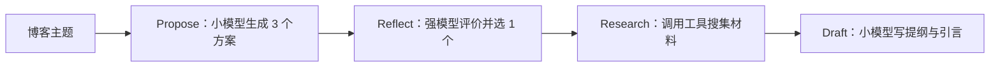

这只有一层显式分支：3 个候选经过一次评价后只保留 1 个。它体现了 ToT 的“多候选—评价—剪枝”思想，但计算量远小于完整树搜索。因此作者称其为工程捷径和简单 ReAct 与完整搜索算法之间的中间地带。

### 4.4 例 2-4：候选生成

`propose_options` 使用较小的生成模型，并通过 `with_structured_output(OptionsPayload)` 要求恰好返回 3 个方案。每个方案包含：

- 标题；
- 目标读者；
- 切入角度；
- 5 条提纲；
- 简短理由。

设计上的关键点：

1. **结构化输出**使候选可以被程序解析和评价，而不是从自由文本中猜边界。
2. **明确要求 distinct**，尽量增加候选多样性。
3. **分支固定为 3**，在探索性与成本之间取平衡。
4. 候选被序列化进 `options_json`，也作为消息写入状态，供后续节点读取。

这里所谓“thought”是工作流显式生成的候选产物，不是声称读取了模型隐藏的内部思维。

候选质量不仅取决于数量。三个换标题不换角度的方案并没有真正扩展搜索空间。实践中可加入差异约束、按类别生成，或用相似度检测去重。

### 4.5 例 2-5：评价与剪枝

`reflect_and_select` 用更强模型和 `ChoicePayload` 结构化输出按四项标准评价：清晰度、原创性、开发者相关性、时间约束下的可行性；随后返回索引 $0,1,2$ 中的一个和理由。

作者把更强模型放在 judge 节点，因为这是高影响路由：一旦错误剪掉最好分支，后续研究和写作无法恢复。其资源分配原则是：

> 廉价模型用于扩大候选，强模型用于少量但高影响的选择，廉价模型再执行低风险生成。

若各指标权重为 $w_j$、候选在指标 $j$ 上得分为 $r_j(s)$，评价可以显式化为：

$$
V(s)=\sum_{j=1}^{m}w_j r_j(s),
\qquad
w_j\ge 0,
\qquad
\sum_j w_j=1
$$

例如清晰度、原创性、相关性、可行性的权重分别为 $0.25,0.20,0.30,0.25$，某方案得分为 $8,9,9,6$（满分 10），则：

$$
V=0.25\times8+0.20\times9+0.30\times9+0.25\times6=8.0
$$

原代码没有实际计算这一加权式，而是让 judge 综合判断；公式展示了怎样把评价标准变得更稳定、可审计。

代码还把模型返回索引截断到合法区间：

```python
idx = max(0, min(choice.choice_index, len(options) - 1))
```

这防止数组越界，却可能把明显无效的 `99` 静默改成最后一项。高风险场景更适合验证失败后重试或报错，而不是悄悄改变模型意图。

### 4.6 例 2-6：把阶段连成图

LangGraph 依次连接：

```text
START → propose → reflect → research → draft → END
```

- `propose`：小型创意生成模型；
- `reflect`：更强 judge/reflector；
- `research`：会调用工具的研究者；
- `draft`：小型写作模型；
- `MemorySaver`：保存图运行状态。

作者在这里引入 **handoff**：它规定控制权由谁移交给谁、何时移交、传递哪些状态。LangGraph 的节点承载角色逻辑，边承载交接关系，共享状态则是角色共同读写的上下文。

但“多个节点”不必然等于“多个独立 Agent”。这些节点既可以是独立角色，也可以只是同一工作流中的多次模型调用。判断是否值得称为 MAS，应看是否存在独立职责、策略/工具边界和显式通信，而不是只数节点数量。

### 4.7 ToT 为什么有效，又会在哪里失败

有效的前提：

- 能生成有实质差异的候选；
- 评价标准与最终目标一致；
- judge 有足够信息辨别质量；
- 被剪枝方案无需在后续证据出现后恢复。

常见失败：

- **分支爆炸**：$O(b^d)$ 级搜索无法承担；
- **同质候选**：表面有树，实际是同一路径的改写；
- **评价偏差**：judge 偏爱文风而非事实或可行性；
- **过早剪枝**：早期看似普通但后期更优的路径被永久丢弃；
- **相关错误**：生成器和 judge 使用相似模型，可能共享盲点；
- **提示注入**：候选或研究资料诱导 judge 改变评价标准。

改进方法包括保留 top-$k$、允许回溯、使用外部测试或规则评分、盲化候选来源、加入人工批准，以及让事实性指标由工具验证。

### 4.8 CoT 与 ToT 的本质差别

| 维度 | CoT | ToT |
|---|---|---|
| 搜索形态 | 单一线性链 | 多候选分支与剪枝 |
| 主要问题 | 怎样把一步难题拆成中间步骤 | 怎样避免过早承诺第一条路径 |
| 计算成本 | 通常较低 | 随分支与深度快速增长 |
| 控制机制 | 顺序阶段 | 生成器、评价器、选择/回溯 |
| 适合任务 | 线性推导、分析、诊断 | 策略、创意、多方案规划 |

二者都属于测试时组织计算的方法；ToT 不是必须由多个 Agent 实现，CoT 也不意味着必须把全部原始推理展示给用户。

---

## 5. ReAct：让推理与外部行动形成闭环

### 5.1 为什么“只想”与“只做”都不够

CoT 和 ToT 主要组织候选思路。若 Agent 只在文本中推理，它无法知道天气、执行代码或验证网页；若只按固定顺序调用工具，它又无法根据结果改变策略。

ReAct 是 Reasoning + Acting：模型在每一步读取当前上下文，选择生成语言推理、发起任务动作，或在工具观察后形成最终答案。核心循环是：

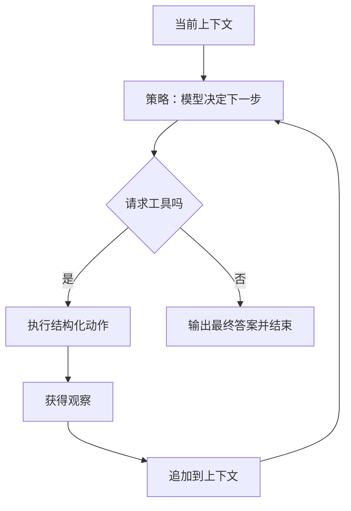

### 5.2 原章的扩展动作空间

原书把任务动作集合记为 $A$，语言推理轨迹集合记为 $L$，扩展动作空间为：

$$
\widehat{A}=A\cup L
$$

在时刻 $t$，上下文 $c_t$ 被映射为扩展动作：

$$
\widehat{a}_t \sim \pi_\theta(\widehat{a}\mid c_t)
$$

- 若 $\widehat{a}_t\in L$，它是语言形式的计划、解释或最终文本；
- 若 $\widehat{a}_t\in A$，它是对环境产生影响的工具调用；
- 现代工具调用消息也可能同时含文本和结构化调用，因此两者不总是严格互斥。

原章写出的上下文更新是：

$$
c_{t+1}=(c_t,\widehat{a}_t)
$$

它强调语言轨迹和动作会被追加到状态。若把工具观察也完整写出，更一般的形式是：

$$
o_{t+1}=
\begin{cases}
E(\widehat{a}_t), & \widehat{a}_t\in A\\
\varnothing, & \widehat{a}_t\in L
\end{cases}
$$

$$
c_{t+1}=c_t\mathbin{\Vert}\widehat{a}_t\mathbin{\Vert}o_{t+1}
$$

$\Vert$ 表示按协议追加，$E$ 是工具环境。对工具动作，下一轮真正有价值的是“动作 + 环境观察”；只记录“我打算搜索”而不写回搜索结果，闭环并未完成。

原章还把上下文展开为：

$$
c_t=(o_1,a_1,\ldots,o_{t-1},a_{t-1},o_t)
$$

因此策略可写为：

$$
\pi(a_t\mid c_t)
$$

这不是说策略必然满足强化学习最优性，只是用策略记号表示“依据完整历史选择下一行动”。

### 5.3 反思从哪里产生

ReAct 中的 reflection 不一定需要单独名为 `reflect` 的节点。工具观察进入消息流后，下一次模型调用会读取：

- 之前为什么选择这个动作；
- 调用了什么工具和参数；
- 工具返回了什么或为何失败；
- 当前目标还有哪些部分未完成。

下一决策因此可以修正查询、换工具或结束。所谓“递归”是上下文不断包含先前决策和观察，并不是模型参数在运行时更新。

### 5.4 例 2-7：状态就是消息流

原章定义：

```python
class AgentState(TypedDict):
    messages: Annotated[Sequence[BaseMessage], add_messages]
```

- `messages` 对应 $c_t$；
- `add_messages` reducer 将节点返回的新消息追加或按 ID 合并；
- `Sequence` 表示读取接口，实际合并结果由框架管理；
- 消息中同时包含用户输入、AI 文本、结构化工具调用和 `ToolMessage` 观察。

这是一种方便但并非唯一的状态设计。生产状态还可能分离计划、预算、审批、结构化事实和错误，以免所有控制逻辑都依赖扫描自由文本。

### 5.5 例 2-8 与 2-9：绑定动作空间并调用策略

`model.bind_tools(TOOLS)` 把工具模式提供给模型，使结构化工具调用成为可生成输出。它扩展的是模型可**提议**的动作空间；真正可执行的动作仍受运行时白名单、权限和参数校验约束。

`call_model` 执行：

```python
response = model.invoke([SYSTEM_PROMPT] + state["messages"], config)
return {"messages": [response]}
```

对应：

$$
\pi(c_t)\rightarrow\widehat{a}_t,
\qquad
c'_t=c_t\mathbin{\Vert}\widehat{a}_t
$$

节点本身不决定下一条边，只负责产生一个 AI 消息；之后由确定性路由函数读取该消息。这种“模型提议、程序路由”的分工便于测试。

### 5.6 例 2-10：把意图变成效果

`tool_node` 遍历最后一条 AI 消息的 `tool_calls`：

1. 读取工具名和参数；
2. 在 `TOOLS_BY_NAME` 白名单中查找；
3. 未知工具返回结构化错误；
4. 已知工具由宿主程序执行；
5. 每个结果包装成 `ToolMessage`；
6. 使用原 `tool_call_id` 关联调用与观察；
7. 返回所有工具观察，由 reducer 加入消息状态。

如果一个 AI 消息并行请求 $n$ 个工具，则应保持：

$$
\forall i\in\{1,\ldots,n\},
\quad
id(o_i)=id(a_i)
$$

也就是每个已接受调用都有唯一可关联的成功或错误观察。否则模型可能把一个查询结果解释成另一个调用的结果。

原代码是教学核心，不是完整执行器。生产中还需要：

- 参数 schema 与业务规则校验；
- 权限、审批和租户隔离；
- 超时、限流和异常捕获；
- 对返回值统一序列化为消息支持的内容类型；
- 对有副作用调用使用幂等键；
- 过滤工具输出中的提示注入与敏感数据。

### 5.7 例 2-11 与 2-12：停止规则和图

`should_continue` 检查最后一条 AI 消息：

- 有 `tool_calls`：返回 `continue`，路由到工具节点；
- 没有：返回 `end`，路由到 `END`。

完整图是：

```text
START → agent ──有工具调用──→ tools → agent
                 └─无工具调用──→ END
```

这个规则保证工具请求不会成为“孤儿动作”：一旦模型提出调用，就先执行并写回观察，再允许模型继续。

它也隐含一个协议假设：**没有工具调用的 AI 文本就是最终答案。** 原文在概念上说语言输出可能只是 thought，但代码无法区分“中间想法”和“最终答案”。实际系统可要求结构化字段 `status: continue|final`、专用完成工具，或单独 verifier 判断完成，避免把一段尚未结束的推理误当结果。

此外还要设置 recursion limit、总时间、token 和费用预算。`END` 表示控制流停止，不自动证明任务正确完成。

### 5.8 苏黎世天气案例

运行轨迹大致是：

1. 用户询问苏黎世当天天气；
2. 模型判断需要实时信息；
3. 生成 `internet_search` 调用和查询词；
4. 搜索工具返回标题、摘要与链接；
5. 观察写回消息流；
6. 模型根据证据生成温度和降雨概述；
7. 无进一步工具调用，流程结束。

这个案例证明的是数据流：模型能选择工具并根据观察回答。天气是时间敏感事实，书中 `14–19°C` 仅是当次运行结果，不能在别的日期复用。单个搜索摘要还可能混合小时预报、单位或不同来源；严谨实现应查询结构化天气 API、记录时间与地点，并验证单位。

### 5.9 ReAct 延伸到多 Agent

每个 worker 都可以拥有自己的 ReAct 循环；其最终结果再作为观察交给 supervisor 或另一个 Agent。此时有两层控制：

- **Agent 内部**：模型与工具之间循环；
- **Agent 之间**：监督者路由或同行 handoff。

共享全部推理轨迹会增加上下文和泄密风险。多 Agent 通信更适合传递结构化任务、证据、结论、置信度和未解决问题，并把详细局部 trace 保存在各自可审计日志中。

### 5.10 CoT、ToT 与 ReAct 总结

| 方法 | 主要解决的问题 | 控制形态 | 优点 | 主要风险 |
|---|---|---|---|---|
| CoT | 一步推导过难 | 线性中间步骤 | 分解清楚、便于检查、成本相对低 | 错误链条、自洽幻觉、冗长 |
| ToT | 第一条路径未必最好 | 多候选、评价、剪枝 | 探索替代方案、减轻首答偏差 | 分支成本、judge 偏差、过早剪枝 |
| ReAct | 推理无法接触现实，固定动作不能适应 | 推理—动作—观察循环 | 实时查证、依据反馈调整、路径可追踪 | 工具滥用、状态复杂、循环不止 |

选择关系不是三选一：一个系统可以用 ToT 选择计划，用 ReAct 执行被选计划，在每个分析节点用结构化 CoT 产出可验证中间结果。

---

## 6. Human-in-the-Loop：在关键状态把控制权交给人

### 6.1 为什么 Agent 需要人工介入

Agent 调错搜索工具有时只是浪费几秒钟；如果错误动作涉及访问控制、转账、删除数据或向客户发送信息，后果就可能不可逆。Human-in-the-Loop（HITL）把人作为工作流中的正式参与者：Agent 在关键节点暂停，展示拟执行动作或中间产物，收到人的结构化决策后才继续。

HITL 解决的不只是“模型会犯错”：

- **风险控制**：把不可逆动作挡在执行之前；
- **责任归属**：保留谁在何时批准了什么；
- **信息补全**：模型缺少业务背景时主动询问；
- **质量修订**：人直接改写状态，而不是让模型盲目重试；
- **组织合规**：满足双人复核、法律审查或权限分离要求。

对某个动作，可用期望损失粗略理解是否值得设人工门：

$$
R(a)=P(\mathrm{error}\mid a,s)\times I(a)
$$

$P(\mathrm{error}\mid a,s)$ 是当前状态下出错概率，$I(a)$ 是错误影响。若人工复核将错误概率降为 $P_h$，而复核的时间与人力成本为 $C_h$，则设门的净收益近似为：

$$
\Delta=(P-P_h)I-C_h
$$

当 $\Delta>0$ 时，人工复核在期望意义上值得。这个式子不是原章给出的生产公式，而是帮助理解作者选择“只在关键点中断”而非“每一步都审批”的直觉：影响越大、可逆性越低，人工门越有价值。

### 6.2 中断不是普通的 `input()`

LangGraph 的 `interrupt(payload)` 表示一种可持久化暂停协议：

1. 节点运行到 `interrupt`；
2. 框架保存当前线程的检查点；
3. 调用者收到中断载荷，可在另一个进程或很久以后展示给人；
4. 人提交结构化响应；
5. 调用者用 `Command(resume=value)` 恢复同一个线程；
6. 该节点重新执行，原 `interrupt` 调用这次返回 `value`；
7. 节点根据响应更新状态或选择下一节点。

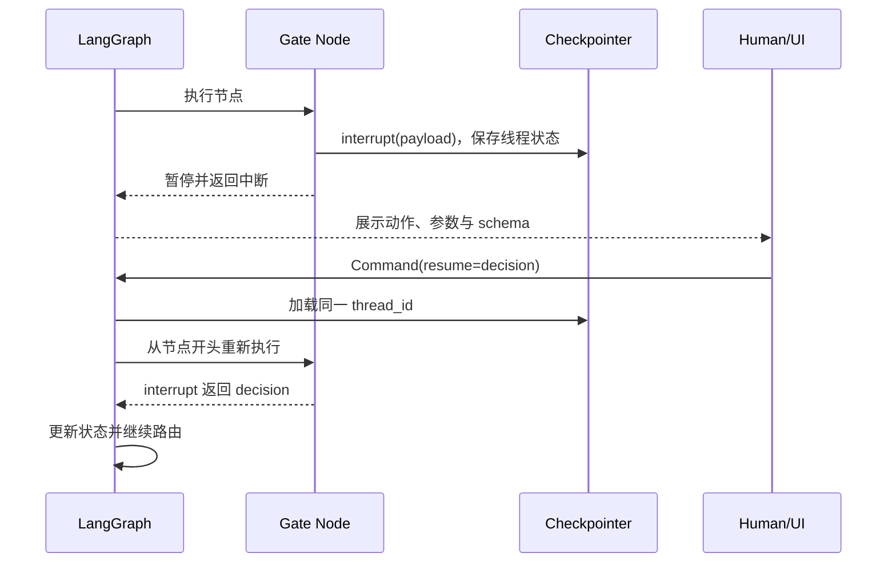

因此，可靠中断至少需要：

- 一个 checkpointer；
- 恢复时沿用同一个 `thread_id`；
- 可序列化的中断载荷和响应；
- 清楚的响应 schema；
- 能处理等待、过期、取消与重复提交的外围应用。

### 6.3 原章归纳的四种 HITL 模式

| 模式 | 人在决定什么 | 典型用途 | 恢复后的动作 |
|---|---|---|---|
| 批准或拒绝 | 是否允许关键步骤发生 | API 调用、付款、发布、删除 | 执行、改道或结束 |
| 审查并编辑 | 中间状态应改成什么 | 摘要、邮件、计划、配置 | 用人工版本覆盖状态 |
| 审查工具调用 | 工具和参数是否合理 | 预订、写数据库、外发消息 | 接受、改参数或以人工响应替代 |
| 验证人工输入 | 缺失信息或选择是什么 | 多轮澄清、业务确认 | 把输入写入状态并继续 |

四种模式的共同点是：人不是在 Agent 运行结束后被动打分，而是在控制流中产生一个会改变状态或下一条边的事件。

### 6.4 例 2-13：六类演示的入口

原章仓库提供菜单，可选择：写作反馈循环、API 前批准门、状态审查编辑、并行中断、ReAct 工具调用审查和用于调试的静态中断。

这份菜单本身没有实现业务逻辑，它传递的工程思想是：HITL 不是一个固定组件，而是一组可以放在不同边界的模式。静态中断偏向开发调试；动态 `interrupt()` 则由运行状态触发，适合真实审批和补充输入。

### 6.5 `Command` 为什么重要

普通节点通常只返回状态增量，边另外决定下一跳。`Command` 可以同时表达：

$$
\mathrm{Command}=(\mathrm{update},\mathrm{goto},\mathrm{resume})
$$

- `update`：写入哪些状态；
- `goto`：控制流接下来去哪个节点；
- `resume`：向挂起的中断提供什么值。

HITL 经常需要“人的决定既修改数据又改变路径”，所以 `Command` 很合适。多 Agent handoff 也会复用同一思想：交接既传递信息，又把执行权转给另一个角色。

### 6.6 批准或修订 HTTP 请求（例 2-14 至 2-16）

#### 第一步：模型提出请求计划

`b_propose` 要求 LLM 为 `https://httpbin.org/get` 生成包含 `url` 和 `params` 的 JSON，并把结果存入 `proposed_request`。若正则未找到 JSON 或解析失败，则使用 fallback。

设计意图是把“模型想做什么”先变成可见、可编辑的数据，而不是立即发送请求：

```text
自然语言目标 → proposed_request → 人工门 → HTTP 副作用
```

原代码用 `re.search(r"\{.*\}", text, re.S)` 从自由文本提取 JSON，适合作为短例，生产中更应使用模型的 structured output，并做运行时 schema 验证。贪婪正则可能跨越多个花括号，fallback 也不能替代安全校验。

#### 第二步：暂停并审查

`b_gate` 把请求和响应 schema 交给 `interrupt`。人可以：

- `approve`：返回 `Command(goto="b_call", update=...)`；
- `revise`：合并 URL 或参数，再回到 `b_gate` 复核。

循环回 gate 很重要：修改后的请求仍需再次展示，不能把“允许编辑”误写成“编辑即自动执行”。

原章把模式称为“approve or reject”，文字也说可拒绝，但例 2-15 的 schema 实际只有 `approve` 和 `revise`，没有 `reject`。若要真正拒绝，应增加显式路径，例如：

```python
if action == "reject":
    return Command(goto=END, update={"decision": "rejected"})
```

这一区别很关键：**没有执行路径的产品文案不是控制保证。**

#### 第三步：批准后才执行

`b_call` 使用最终 `proposed_request` 发起 HTTP GET，并保存状态码和 URL。把它放在 gate 后的独立节点，确保暂停前没有外部副作用。

即使人批准，运行时仍应验证：

- URL 是否在允许的域名和协议列表中，防止 SSRF；
- 参数和响应大小是否受限；
- 凭据是否与目标资源匹配；
- 超时、重定向和证书策略是否安全；
- 审批对象的哈希是否与最终执行对象一致，防止“审的是 A、执行的是 B”。

### 6.7 审查并编辑状态（例 2-17 与 2-18）

`c_write` 先让 LLM 生成两句话的 HITL 摘要并写入 `summary`。`c_edit` 随后暂停，把原摘要和 `edited_text` schema 展示给人。恢复时：

```python
Command(resume={"edited_text": "人工修订后的文本"})
```

节点取得返回值并以人工版本覆盖 `summary`。这不是再提示模型“请参考意见重写”，而是人直接拥有最终状态写权限，所以适合措辞、法律声明和事实修正。

实际系统最好同时保存：原始模型版本、人工版本、审阅者身份、时间、修改原因和差异。只覆盖字段会得到正确当前值，却失去审计历史。

### 6.8 审查工具调用（例 2-19）

`add_hitl` 把任意函数或 `BaseTool` 包装为带人工门的新工具。模型调用工具后，人看到工具名和参数，并选择：

- `accept`：用原参数执行；
- `edit`：用人工修改后的参数执行；
- `response`：不执行工具，直接把人工提供的内容作为工具结果返回。

`response` 与 `reject` 不完全相同。它会向 Agent 提供一个观察，使 ReAct 循环可以继续；例如“目前不要调用该工具，请先补充订单编号”。纯拒绝则可能直接转入取消或失败状态。

包装器复用原工具的名称、描述和参数 schema，模型仍把它看作同一个工具；实际执行前多了一层控制。需要注意：编辑后的参数仍必须重新通过 schema、权限和业务校验，不能因为来自人就默认可信。

### 6.9 中断与副作用：为什么必须分节点

原章特别警告：不要在同一个节点中把外部副作用放在 `interrupt()` 之前。因为恢复时节点会从开头重放。

错误结构：

```python
def unsafe_node(state):
    charge_card(state["amount"])
    decision = interrupt({"question": "Approve?"})
    return {"decision": decision}
```

第一次运行已扣款，然后暂停；恢复时节点重新开始，又扣一次。正确结构是：

```text
prepare → interrupt/gate → approved_effect → record_result
```

即使副作用在独立节点，也要考虑“执行成功但保存检查点前崩溃”的窗口。生产系统还需要：

- 幂等键；
- 事务或 outbox；
- 调用去重记录；
- 可查询的外部操作状态；
- 必要时的补偿操作。

HITL 保证“人有机会审”，不自动保证 exactly-once 执行。

### 6.10 并行人工中断（例 2-20 与 2-21）

有些审批互不依赖，例如法律团队审第一段、技术团队审第二段。例 2-20 从 `START` 同时分出 `d_h1`、`d_h2`，两个节点各自中断并等待修改。

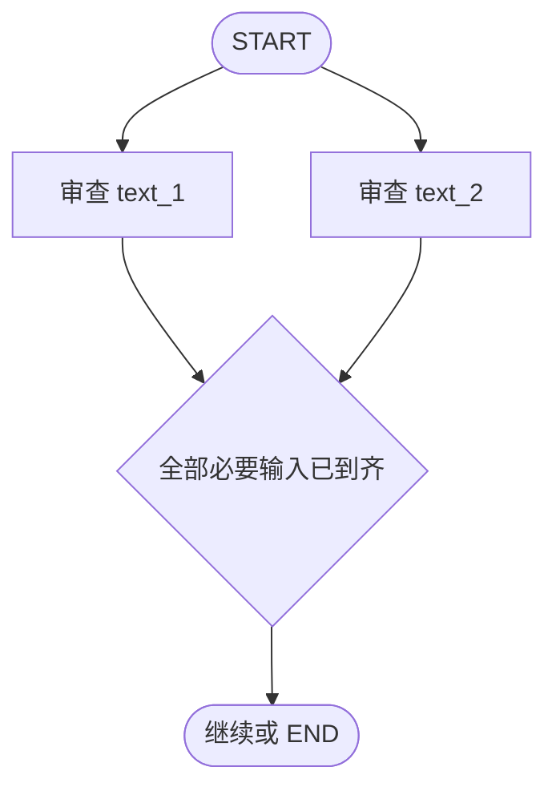

框架会为每个中断分配 `interrupt_id`。例 2-21 读取所有 pending interrupts，建立：

```python
resume_map[interrupt_id] = revised_value
```

再用 `Command(resume=resume_map)` 一次恢复。ID 映射不可省略，因为并行返回顺序不一定等于创建顺序。

生产流程还需定义汇合策略：

- 是否必须等待全部审批；
- 是否允许部分通过；
- 谁可以处理哪个 interrupt ID；
- 超时后提醒、升级还是取消；
- 一个审批被撤回时怎样使其他决定失效；
- 多人同时提交时怎样保证版本一致。

### 6.11 怎样选择人工门的位置

人工门不应平均散布，而应放在“信息充分且副作用尚未发生”的最后责任时刻：

| 风险或不确定性 | 推荐位置 |
|---|---|
| 目标不清楚 | 规划前请求补充输入 |
| 多个候选路线影响很大 | ToT 剪枝或计划提交之后 |
| 内容需要业务负责 | 生成后、发布前审查编辑 |
| 工具参数高风险 | 工具调用生成后、执行前 |
| 多部门独立负责 | 并行中断后汇合 |
| 低风险、可自动验证 | 不设人工门，改用程序校验 |

HITL 的局限也要正视：人会疲劳、误批、响应慢，可能成为吞吐瓶颈。界面应突出变更、风险、来源和后果，而不是把整段 trace 丢给审批者。低风险动作可按策略自动批准，高风险动作才升级。

---

## 7. Advanced Agent Paradigms：为什么需要多 Agent 系统

### 7.1 从复杂任务到专业分工

当单 Agent 的提示、工具和状态越来越庞大时，常见症状包括：

- 不同职责的指令互相干扰；
- 工具列表太长，选择错误增加；
- 上下文中混杂不相关信息；
- 很难分别测试研究、写作、审核等能力；
- 一次失败难以定位到具体责任边界。

Multi-Agent System（MAS）把大任务拆成较小职责，每个 Agent 拥有自己的角色、提示和工具，再通过明确通信协议协调。作者归纳的主要收益是：

1. **模块化**：可以独立开发、替换和测试 worker；
2. **专业化**：每个 Agent 只关注一个领域和较小工具集；
3. **控制**：交接关系与允许的通信路径显式化。

### 7.2 ToT 与 MAS 不要混淆

ToT 和 MAS 都可能画成带分支的图，但组织对象不同：

- **ToT** 在“思路空间”生成多个候选，评价后选择一个或几个；
- **MAS** 在“工作角色空间”决定由哪个专家或团队执行下一项工作。

三个候选博客方案可以由同一个模型连续生成，不一定是 MAS；四个研究 Agent 即使都沿固定顺序运行，也不等于 ToT。二者可以组合：supervisor 先用 ToT 比较研究计划，再把选中的子任务委派给 worker。

### 7.3 单 Agent、监督者与层级架构

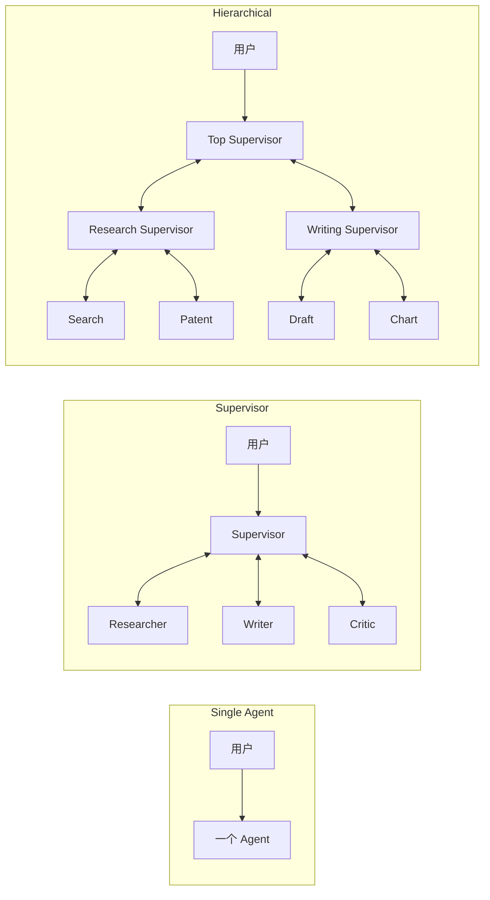

**Supervisor architecture** 中，所有 worker 把结果交回一个中心监督者，由它决定下一个 worker 或结束。

**Hierarchical architecture** 把这一模式递归化：顶层 supervisor 路由整个团队，团队内部 supervisor 再路由各自 worker。它对应第 1 章 HSM 的“子图作为超状态”。

### 7.4 多 Agent 不会免费增加正确性

设 worker 执行成本为 $C_i$，监督者每轮成本为 $C_s$，进行了 $T$ 次路由，则总模型/工具成本至少近似为：

$$
C_{MAS}\approx T C_s+\sum_i n_i C_i+C_{handoff}
$$

$n_i$ 是第 $i$ 个 worker 被调用次数，$C_{handoff}$ 包括消息压缩、状态合并和通信。多个 Agent 还可能共享同一基础模型的偏差，因此“彼此讨论”并不自动形成独立证据。

只有当专业化带来的质量、上下文隔离或并行收益大于协调成本时，MAS 才优于一个 Agent 加普通函数。确定性转换、数据库查询和格式验证通常仍应是函数，而不是拟人化 Agent。

---

## 8. 构建层级式市场研究团队

### 8.1 案例目标与逐步搭建思路

作者没有直接构建完整白皮书系统，而是按以下顺序降低复杂度：

1. 先建立一个 research supervisor；
2. 为搜索、网页抓取、Exa 搜索、专利研究创建四个专用 ReAct worker；
3. 验证 research team 能完成路由；
4. 用相同方法建立 writing team；
5. 最后用顶层 supervisor 把两个 team 子图组合成 super graph。

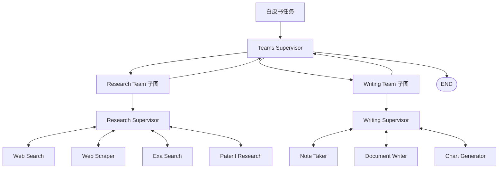

这样做的依据是先验证局部协议，再组合层级。如果四个 worker 的消息格式尚不稳定，就直接叠加 writing team，错误会跨层传播，调试难度陡增。

### 8.2 例 2-22：可复用 supervisor 路由器

状态继承 `MessagesState` 并增加 `next` 字段，用于记录下一 worker。`make_supervisor_node(llm,members)` 动态构造候选：

$$
R=\{\mathrm{FINISH}\}\cup\{w_1,w_2,\ldots,w_n\}
$$

监督者策略为：

$$
r_t \sim \pi_s(r\mid m_{1:t}),
\qquad r_t\in R
$$

其中 $m_{1:t}$ 是当前消息历史。模型通过 structured output 返回 `Router.next`；若为 `FINISH`，程序映射到 `END`，否则 `Command(goto=worker)`。

这段实现的重要设计选择是：

- 候选 worker 是 `Literal` 白名单，模型不能路由到任意节点；
- supervisor 只负责选下一角色，不直接执行所有专业工具；
- 每个 worker 完成后报告结果与状态；
- `FINISH` 是显式终止选择。

structured output 提高可解析性，但不保证路由语义正确。仍需设置 recursion limit，并可增加“同一 worker 连续调用上限”“任务覆盖清单”或确定性完成谓词，避免 supervisor 在角色间循环。

原函数标注返回 `str`，实际返回的是内部函数 `supervisor_node`；更准确的类型应是可调用节点类型。这不影响原章要说明的路由思想，但复制代码时应修正类型契约。

### 8.3 例 2-23：可复用 ReAct worker

`make_react_worker_node` 接收：

- worker 名称；
- 专用工具列表；
- 角色提示；
- 完成后返回的节点，默认是 `supervisor`。

它先用 `create_react_agent` 创建一个局部 ReAct 循环。worker 执行后取最后一条消息，将内容和 worker 名称写回父状态，并通过 `Command(goto="supervisor")` 归还控制权。

这里形成嵌套循环：

```text
外层：supervisor → worker → supervisor
内层：worker LLM → tool → worker LLM → ... → worker final
```

父图没必要接收 worker 的每个内部 token，只需要一个可消费的交接产物。但只传最后一段 `content` 也可能丢掉结构化来源、工具错误和置信信息。更稳妥的 worker contract 可包含：

```json
{
  "status": "complete",
  "findings": [],
  "sources": [],
  "open_questions": [],
  "requested_next_role": null
}
```

原例把 worker 输出包装成带 `name` 的 `HumanMessage` 交给 supervisor，这是所用模式中的通信约定，不表示真实人类说了这段话。设计多 Agent 协议时应保持 role/name 语义一致，避免下游模型误判消息来源。

### 8.4 例 2-24 与 2-25：角色和最小工具权限

研究团队的四个角色是：

| Worker | 职责 | 工具 | 期望产物 |
|---|---|---|---|
| `search` | 常规网页研究 | Tavily | 带来源的简洁研究笔记 |
| `web_scraper` | 深入给定页面 | 抓取工具 | 页面细节与关键发现 |
| `exa_search` | 查找近期结构化资料 | Exa Search | 最新要点 |
| `patent_research` | 检索专利 | Google Patents API | 专利与链接 |

每个 Agent 只获得完成其职责所需工具，这同时改善工具选择和最小权限。若把搜索、抓取、专利、文件写入等全部工具交给所有角色，专业化就只剩提示词标签。

`specs` 列表把名称、工具和 prompt 作为数据配置，再用字典推导批量创建节点。它消除重复样板，也使新增角色时能统一审查工具权限。

角色提示中的“No follow-up questions”避免 worker 与用户直接展开不可控对话，因为缺失信息应通过 supervisor 协调。但绝对禁止追问也可能迫使 worker 猜测；更好的团队协议是允许返回 `needs_clarification`，由 supervisor 决定询问用户还是换角色。

### 8.5 例 2-26 与 2-27：研究团队图

research supervisor 的候选是四个 worker。图注册五个节点，从 `START` 进入 supervisor，所有 worker 都通过边返回 supervisor：

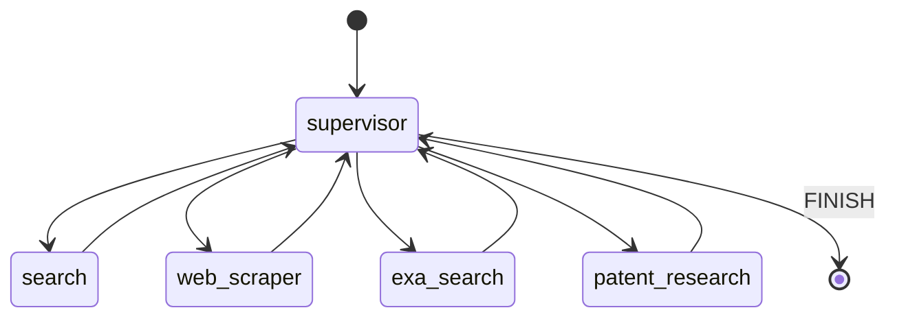

监督者每次都重新读取最新 worker 结果，因此可以按证据动态路由，而不是预先固定顺序。这提供适应性，也使中心节点成为瓶颈和单点故障。

### 8.6 例 2-28：AI Agent 与专利查询

用户问“什么是 AI Agent？是否存在关于 LLM Agent 的专利？”示例路由为：

```text
supervisor → search → supervisor → patent_research → supervisor → END
```

这个顺序体现了任务分解：普通定义由网页研究处理，专利问题交给专门工具。`recursion_limit=100` 是防循环上限，不是推荐每个任务都用满 100 步。

示例省略了 Agent 间实际消息，所以路由序列只证明“谁被调用”，不能单独证明搜索内容正确。评价 MAS 时至少应同时检查：

- 路由是否选择了合适 worker；
- worker 工具是否成功；
- 来源是否权威且与结论对应；
- supervisor 是否漏掉子任务；
- 最终综合是否保留证据和不确定性。

### 8.7 写作团队与团队层级（例 2-29）

writing team 采用相同模式，由 supervisor 协调 note taker、document writer 和 chart generator。然后顶层 `super_graph` 注册：

- `teams_supervisor_node`；
- `research_team` 子图调用节点；
- `writing_team` 子图调用节点。

顶层只显式添加 `START → supervisor`，后续跳转由节点返回的 `Command(goto=...)` 完成。要使完整实现成立，团队调用节点必须把结果更新到父状态并返回顶层 supervisor，且所有动态目标名必须已注册。

层级架构实现了接口压缩：顶层不关心 Tavily 或写文件的每个调用，只关心 research team 和 writing team 的状态。这和软件模块化相同，前提是子图输出契约足够明确。

### 8.8 例 2-30：半导体白皮书案例

任务要求：

1. 写一篇 800 词半导体发展白皮书；
2. 以执行摘要开头；
3. 查找近期相关专利并附链接；
4. 提供所有来源链接；
5. 用 `write_document` 保存到 `semiconductor_whitepaper.txt`。

示例顶层路由是：

```text
supervisor → research_team → supervisor
           → writing_team  → supervisor
           → writing_team  → supervisor → END
```

写作团队被调用两次并不一定是错误：第一次可能生成内容，第二次完成落盘或修订。这显示层级图能按状态重复调用团队，而非固定“一队只运行一次”。

作者报告整个流程约两分钟并成功生成文件。这是特定模型、网络、工具和当时负载下的观察，不是架构复杂度保证。生产验收还应检查文件存在、编码、字数、链接可达性、专利相关性、引用覆盖率和事实一致性，而不能只把 `write_document` 成功当作任务完成。

### 8.9 层级架构的收益与局限

**收益：**

- 团队可独立开发、测试和复用；
- 顶层上下文可以只保留团队级摘要；
- 每层有清晰权限和责任边界；
- 适合角色很多、任务天然分部门的工作流。

**局限：**

- 追踪要跨越多个嵌套图；
- 信息经过多层摘要可能丢失或失真；
- 上层 supervisor 的错误会影响整个系统；
- 每次交接都增加 token、延迟和失败点；
- 中心层级可能串行化原本可并行的任务；
- 文件写入等副作用仍需审批、沙箱和幂等机制。

因此，应让每层 supervisor 处理不同抽象级别，而不是把同一决策重复审批多次。

---

## 9. Swarm：通过同行 handoff 动态转移控制权

### 9.1 Swarm 是什么

Swarm 架构弱化中央 supervisor，让 Agent 根据当前工作和自身专长直接把控制权交给同伴。系统保存当前 active agent，下一次交互从该 Agent 继续。

本章的 research↔writer swarm 是顺序交接，不是所有 Agent 同时并发工作：

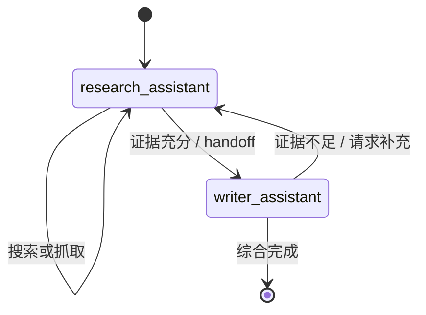

它适合职责互补、需要自然往返、又不值得每次都经过中心路由器的任务。

### 9.2 Handoff 是控制协议，不只是消息

handoff 至少包含三层语义：

1. **目标**：下一个由哪个 Agent 接管；
2. **任务**：对方需要完成什么；
3. **上下文**：传递哪些历史、证据和未解决问题。

LangGraph swarm 默认 handoff 工具会传递完整消息历史，并追加确认交接的工具消息。自定义工具可以修改名称和描述、增加任务参数，或只传过滤后的上下文。

全量历史最简单，但有三项代价：token 持续增长、无关信息干扰下一角色、敏感数据跨权限边界传播。更稳妥的 handoff envelope 是：

```json
{
  "target": "writer_assistant",
  "task": "synthesize licensing options",
  "artifacts": ["source-1", "source-2"],
  "constraints": ["three bullets", "cite regulator"],
  "open_questions": [],
  "history_summary": "..."
}
```

原始证据可存入共享 artifact store，只在消息中传引用，避免复制整份网页。

### 9.3 例 2-31：双向 handoff 工具

作者用 `create_handoff_tool` 创建：

- `to_writer`：研究者收集足够来源后，把控制权交给 writer；
- `to_research`：writer 发现证据薄弱时，把控制权退回 researcher。

工具描述会影响模型何时交接，因此应包含明确前置条件。只写“转给 writer”可能过早移交；原章后续角色提示补上“获得 3–5 个可靠来源并抓取关键页面后”这一标准。

### 9.4 例 2-32：研究者与写作者的角色边界

`research_assistant` 获得 Tavily、网页抓取和 `to_writer`：

- 搜索网页；
- 收集 3–5 个可靠来源；
- 抓取关键页面；
- 证据足够后交接。

`writer_assistant` 只获得 `to_research`：

- 阅读文档与消息；
- 综合带站点名引用的简洁回答；
- 来源不足或含糊时，写一条具体请求并退回研究。

writer 没有搜索工具是刻意的最小权限和职责分离。它不能悄悄补充未经研究流程记录的证据；必须 handoff 回负责证据质量的角色。

### 9.5 例 2-33：创建并编译 swarm

```python
swarm = create_swarm(
    agents=[research_assistant, writer_assistant],
    default_active_agent="research_assistant",
).compile()
```

`default_active_agent` 只规定没有历史时从谁开始；之后 active-agent 状态决定谁继续。编译后的 swarm 是一个协调运行时，Agent 仍各自使用 ReAct 处理局部工具调用。

### 9.6 例 2-34：瑞士 fintech 许可案例

用户要求查找瑞士小型创业公司的当前 fintech 许可选择，使用权威来源，以三个要点和引用总结。典型过程是：

1. research assistant 搜索监管机构和可信金融资料；
2. 收集并抓取 3–5 个来源；
3. handoff 给 writer；
4. writer 综合三点并附站点引用；
5. 若证据不足，则带具体缺口 handoff 回 research；
6. writer 满足输出要求后结束。

作者报告当次运行约 30 秒并得到三个干净要点。这仍是案例性时延和质量。金融许可属于时效性和合规性都很高的信息，应记录检索日期、优先使用 FINMA 等官方来源，并明确内容不替代法律意见。

### 9.7 Swarm 的终止与防乒乓机制

双向 handoff 很容易出现：

```text
research → writer → research → writer → ...
```

可靠实现应增加：

- 总 handoff 次数上限；
- 同一对 Agent 往返上限；
- 每次退回必须包含新的、具体的信息缺口；
- 来源数量、覆盖率或质量的完成谓词；
- 无进展检测；
- 超出预算时交给人或返回受控的不完整结果。

若第 $t$ 次 handoff 后的任务覆盖度为 $q_t$，可设最小进展阈值 $\epsilon$：

$$
q_t-q_{t-1}<\epsilon
$$

连续若干轮成立就判定无进展，而不是继续消耗预算。

### 9.8 Supervisor、Hierarchy 与 Swarm 对比

| 架构 | 控制权 | 适用场景 | 优点 | 主要代价 |
|---|---|---|---|---|
| Supervisor | 集中在一个路由器 | 小型团队、边界清楚 | 简单、可控、全局视图强 | 中央瓶颈、单点故障 |
| Hierarchical | 多层集中控制 | 大型、多团队任务 | 模块化、可扩展、抽象清楚 | 跨层调试难、信息损耗 |
| Swarm | 同行动态交接 | 需要反复往返的互补角色 | 灵活、路径自然、减少中央路由 | 行为较难预测、易循环、上下文治理难 |

这三种并非互斥。一个顶层 hierarchy 内的 research team 可以使用 supervisor，而某个创作子团队内部可以使用 swarm。混合时必须明确每一层谁拥有终止权、预算和最终状态写权限。

---

## 10. 原章结论：架构本身也是智能的一部分

原章最终把三条主线汇合起来：

1. **推理结构**：CoT、ToT 和 ReAct 让 Agent 不再局限于一次生成，分别提供分步、探索与反馈适应能力。
2. **人机边界**：interrupt、批准门与审查步骤把安全和责任嵌入控制流，而不是依赖模型自觉。
3. **协作结构**：supervisor、hierarchy 和 swarm 把任务分布给专业角色，以不同方式平衡控制、规模与灵活性。

因此，比较 Agent 时不能只问“底层用了哪个模型”，还要问：

- 状态里保存了什么；
- 下一步由谁决定；
- 候选是否会被评价和剪枝；
- 工具观察是否真正反馈到后续决策；
- 哪些动作必须由人批准；
- 角色怎样交接、何时结束；
- 失败后怎样恢复并避免重复副作用。

这为下一章的高级规划、测试时计算与可扩展执行奠定基础。

---

## 11. 容易混淆的概念与常见误区

| 易混淆点 | 正确辨析 |
|---|---|
| Persona 让模型成为真正专家 | Persona 聚焦职责，知识仍受模型、上下文和工具限制 |
| CoT 越长越正确 | 更多步骤增加计算，也可能延长一条错误链 |
| 可见 CoT 就是模型真实内部机制 | 它是生成的中间文本，不一定是因果忠实解释 |
| ToT 一定需要多个 Agent | 可由一个模型的多次调用或多个图节点实现 |
| 多节点图一定是 MAS | 节点也可能只是流水线阶段；关键是独立职责与通信边界 |
| ToT 与 supervisor 都是分支，所以相同 | ToT 搜索候选思路，supervisor 路由专业执行者 |
| ReAct 必须公开完整推理 | 可保留内部状态，向用户提供简洁理由、工具与证据摘要 |
| 绑定工具等于模型可以直接执行 | 模型只提出结构化调用，运行时负责授权和执行 |
| 无 `tool_calls` 一定表示任务完成 | 这是简化协议；也可能是中间文本或模型漏调工具 |
| HITL 就是在程序里调用 `input()` | 可靠 HITL 需要持久检查点、线程恢复、身份和审计 |
| 人工批准后无需程序校验 | 人也会犯错；schema、权限、allowlist 和幂等仍必须执行 |
| 原例已实现 approve/reject | 例 2-15 实际是 approve/revise；reject 需另加控制路径 |
| `interrupt` 从断点下一行恢复 | 节点会重新执行，`interrupt` 在恢复时返回 resume 值 |
| 检查点保证副作用只发生一次 | 崩溃窗口仍需幂等、事务或补偿设计 |
| 并行中断可以按数组位置恢复 | 应按稳定 `interrupt_id` 映射响应 |
| 更多 Agent 会自动产生更好答案 | 协调、信息损失和相关偏差可能抵消专业化收益 |
| Supervisor 能避免所有死锁 | 它降低同行互等风险，但自身仍可能循环或错误结束 |
| Swarm 等于所有 Agent 并行 | 本章 swarm 是 active agent 之间顺序动态 handoff |
| 新角色共享全部历史最可靠 | 全量历史增加成本、干扰与越权，应按需过滤和摘要 |
| `END` 代表业务目标正确完成 | 它只表示图停止，仍需业务完成证据和质量验证 |

---

## 12. 从本章抽象出的架构选型方法

### 12.1 先判断问题真正难在哪里

可以沿四个维度诊断：

| 维度 | 低 | 高 | 可能需要的模式 |
|---|---|---|---|
| 推理深度 | 一步转换 | 多个依赖步骤 | CoT |
| 路径不确定性 | 唯一明显方案 | 多个候选且早期难判断 | ToT |
| 环境不确定性 | 无外部数据 | 工具结果会改变计划 | ReAct |
| 影响与不可逆性 | 可重试、低损失 | 付款、发布、删除、合规 | HITL |
| 职责数量 | 单一技能 | 多个工具域与产物 | Supervisor/MAS |
| 组织规模 | 一个小团队 | 团队之上的团队 | Hierarchical |
| 协作方向 | 中心可统一安排 | 同行需频繁往返 | Swarm |

### 12.2 从最简单的可行架构开始

推荐演化顺序不是强制流水线，而是一条复杂度控制原则：

1. 先尝试确定性函数或单次调用；
2. 需要线性分解时加入结构化阶段；
3. 需要外部反馈时加入 ReAct 循环；
4. 只有存在真实备选路径时加入 ToT；
5. 在高影响边界加入 HITL，而非每一步审批；
6. 单 Agent 的职责和工具发生冲突时才拆 worker；
7. worker 数量和团队边界扩大后再引入层级；
8. 只有同行往返确有价值时才使用 swarm。

可用一个多目标函数表达选型取舍：

$$
J(\mathcal{A})=
Q(\mathcal{A})
-\lambda C(\mathcal{A})
-\mu L(\mathcal{A})
-\nu R(\mathcal{A})
-\rho D(\mathcal{A})
$$

$\mathcal{A}$ 是候选架构，$Q$ 是任务质量，$C$ 是费用，$L$ 是延迟，$R$ 是风险，$D$ 是运维与调试复杂度；权重由业务决定。最优架构不是 Agent 数最多，而是在约束下 $J$ 最大。

### 12.3 为每个节点和 handoff 写契约

每个节点应明确：

- 输入字段及来源；
- 可以调用的工具和权限；
- 输出 schema；
- 完成与失败状态；
- 副作用和幂等策略；
- 可见的证据与置信度；
- 下一角色需要知道什么。

每个 handoff 应回答：谁移交给谁、为何移交、传什么、接收方怎样判断接收成功、失败时回哪里。没有契约的“Agent 自由聊天”很难测试。

### 12.4 分开评价结果、路径和协调

Agent 评估至少分三层：

1. **结果质量**：答案、文件或动作是否正确；
2. **过程质量**：工具、来源、参数和审批是否合规；
3. **协调质量**：路由是否合理、是否重复 handoff、上下文是否丢失。

只评最终文本可能掩盖碰巧答对、引用错误或未授权调用；只看路由 trace 也不能证明业务结果有效。

### 12.5 一个可运行的确定性缩影

下面的纯 Python 代码把本章三种关键机制放在一起：supervisor 选择 researcher 或 writer；writer 只能在有证据后起草；发布前必须通过人工 gate。它不调用 LLM，目的是单独验证控制协议。把 `supervisor` 的规则替换成结构化模型输出、把 worker 替换成 ReAct Agent 后，骨架不变。

```python
# Run with: python coordination_demo.py
from dataclasses import dataclass, field
from enum import Enum
from typing import Callable

class Route(str, Enum):
    RESEARCH = "research"
    WRITE = "write"
    REVIEW = "review"
    FINISH = "finish"

@dataclass
class TeamState:
    topic: str
    sources: list[str] = field(default_factory=list)
    draft: str | None = None
    approved: bool = False
    trace: list[str] = field(default_factory=list)

def supervisor(state: TeamState) -> Route:
    if len(state.sources) < 2:
        return Route.RESEARCH
    if state.draft is None:
        return Route.WRITE
    if not state.approved:
        return Route.REVIEW
    return Route.FINISH

def research_worker(state: TeamState) -> None:
    state.sources.extend(["official-regulator", "industry-report"])
    state.trace.append("research:2-sources")

def writing_worker(state: TeamState) -> None:
    joined_sources = ", ".join(state.sources)
    state.draft = f"Report on {state.topic}; sources: {joined_sources}"
    state.trace.append("write:draft")

def review_gate(
    state: TeamState,
    approve: Callable[[str], bool],
) -> None:
    assert state.draft is not None
    state.approved = approve(state.draft)
    state.trace.append(f"review:{'approved' if state.approved else 'rejected'}")

def run_team(
    topic: str,
    approve: Callable[[str], bool],
    max_steps: int = 8,
) -> TeamState:
    state = TeamState(topic=topic)
    for _ in range(max_steps):
        route = supervisor(state)
        state.trace.append(f"supervisor:{route.value}")
        if route is Route.RESEARCH:
            research_worker(state)
        elif route is Route.WRITE:
            writing_worker(state)
        elif route is Route.REVIEW:
            review_gate(state, approve)
            if not state.approved:
                raise RuntimeError("publication rejected by reviewer")
        else:
            return state
    raise RuntimeError("coordination step budget exhausted")

if __name__ == "__main__":
    result = run_team("AI agent architecture", lambda draft: "sources:" in draft)
    print(result.draft)
    print(" -> ".join(result.trace))
```

预期路由：

```text
supervisor:research → research:2-sources
→ supervisor:write → write:draft
→ supervisor:review → review:approved
→ supervisor:finish
```

代码与原理的对应关系：

- `supervisor` 是中心路由器，只返回白名单角色；
- `research_worker` 与 `writing_worker` 有不重叠的职责；
- `TeamState` 是角色之间的共享通信介质；
- `review_gate` 在产物形成后、发布前接收人的决定；
- `trace` 记录协调路径；
- `max_steps` 防止 supervisor 循环；
- 拒绝被建模为显式失败，而不是把未批准结果当作完成。

这段代码没有工具异常、持久检查点和异步人工等待，不能替代 LangGraph 实现；它刻意展示“灵活推理能力”和“可靠控制协议”可以分别测试。

---

## 13. 本章知识结构与核心结论

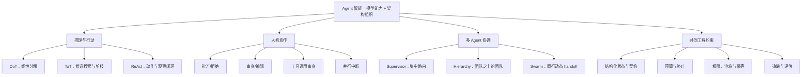

### 13.1 核心结论

1. 多步 Agent 的优势来自“执行—观察—重规划”，不是单纯生成更长文本。
2. CoT 用线性中间步骤降低一步求解难度，但可见理由不保证真实或正确。
3. ToT 通过候选生成、评价与剪枝减轻第一答案偏差，代价随分支和深度增长。
4. ReAct 把语言输出和环境动作纳入同一循环；工具观察必须写回状态，下一决策才真正适应环境。
5. “无工具调用即完成”只是简化停止协议，生产系统应有显式完成证据和预算。
6. HITL 是可恢复的控制流机制，不只是同步询问；审批前后必须隔离副作用。
7. 人工批准不能替代程序验证，检查点也不能替代幂等与事务设计。
8. MAS 的价值是职责、工具和上下文边界；节点多或模型调用多本身不构成有效分工。
9. Supervisor 用集中路由换取控制，hierarchy 用层级模块化扩展规模，swarm 用同行 handoff 换取灵活性。
10. ToT 组织候选思路，MAS 组织专业角色；它们解决不同问题并可组合。
11. handoff 必须传递目标、任务和必要上下文，并有终止、预算和无进展检测。
12. 最佳架构不是最复杂或最自治的架构，而是在质量、成本、延迟、风险与可调试性之间最匹配任务的架构。

### 13.2 作者解决问题的一般思路

作者采用了一条“先增加能力，再补控制，再扩组织”的推导路线：

1. 比较单步与多步，识别静态执行无法依据中间结果适应的问题；
2. 用 CoT 组织线性推理，再用 ToT 处理多候选搜索；
3. 发现推理仍无法接触环境，于是用 ReAct 闭合工具反馈；
4. 发现自治行动带来高影响风险，于是把人作为可暂停、可恢复的控制节点；
5. 发现单 Agent 职责过载，于是拆成专业 worker 并用 supervisor 路由；
6. 发现单个 supervisor 难以管理大型系统，于是组合团队层级；
7. 对需要频繁同行往返的任务，再用 swarm 去中心化交接。

这个方法可以迁移到其他系统设计问题：**先指出当前结构在哪种不确定性下失效，再引入最小的新机制；为新机制补上状态、终止和风险边界；最后用可观察案例验证它是否真的解决了原问题。**

---

## 14. 延伸阅读

- Jason Wei 等，*Chain-of-Thought Prompting Elicits Reasoning in Large Language Models*：CoT 的经典工作。
- Shunyu Yao 等，*Tree of Thoughts: Deliberate Problem Solving with Large Language Models*：用搜索组织多个 reasoning states。
- Shunyu Yao 等，*ReAct: Synergizing Reasoning and Acting in Language Models*：把语言推理与环境行动交错执行。
- 原书第 1 章：状态机、工具、检查点与编排自治的基础。
- 原书第 3 章：更高级的规划、测试时计算、并行与可扩展执行。
- 原书第 6 章：安全执行与工具治理。
- 原书第 10 章：短期、长期记忆与持久化架构。
