> 原章：*Advanced Planning, Reasoning, and Scalable Execution in Agents*
> 核心问题：Agent 怎样从运行轨迹中学习，怎样在推理时用更多计算搜索更好的答案，以及怎样把单个策略的改进扩展到整个 Agent 工作流？

## 0. 本章定位与阅读主线

前两章主要讨论如何**设计** Agent：用状态和工具形成闭环，用 CoT、ToT、ReAct、HITL 与多 Agent 架构组织执行。本章进一步讨论两个不同时间尺度上的改进：

1. **训练时改进（training-time learning）**：采集同一任务的多条轨迹，评价结果，通过 GRPO 或 GSPO 更新模型参数，让未来一次调用本身更可能产生好轨迹。
2. **测试时改进（test-time compute）**：模型参数保持不变，在当前请求上投入更多采样、评价和树搜索，探索多个未来再选择答案。

作者最终用 rLLM 把两者连接起来：搜索和多 Agent 工作流产生轨迹，轨迹经过奖励与相对比较成为训练数据，更新后的策略又能在下一轮搜索中作出更好的选择。

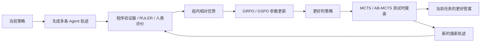

贯穿全章的判断是：

> Agent 看似“自我改进”，实际依赖一套明确的工程闭环：谁生成经验、怎样定义好坏、如何限制策略漂移、预算怎样分配、哪些参数真的被更新。

因此，本章所谓 agency 的增强不是 Agent 无条件重写自己，而是开发者设计了可学习策略、评价器、训练器与搜索器。

---

## 1. Beyond Zero Sum Games：从奖励到推理

### 1.1 标题的含义与边界

作者用“Beyond Zero Sum Games”强调，目标不再是赢下一次回答，而是利用许多成功和失败经历改善整个过程。这里是修辞性说法，不是严格博弈论结论：**零和**描述多方收益之和为零，而相对排名或策略学习本身并不决定一个任务是否为零和博弈。

本节真正研究的是：

- 怎样把 Agent 的语言、工具调用和结果记录为经验；
- 怎样把结果好坏压缩成奖励；
- 怎样从多条可比较经验中得到稳定学习信号；
- 怎样让新策略改善而不偏离原模型过远。

### 1.2 RL 的最小闭环

强化学习（Reinforcement Learning，RL）的直觉是：Agent 在状态或上下文中采取动作，环境给出新观察和奖励，策略依据经验被更新。

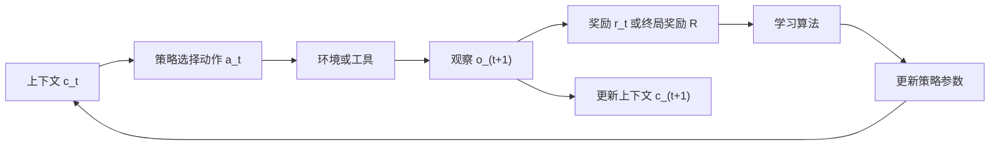

对于普通 RL，动作可能是移动方向；对于 LLM Agent，动作可以是：

- 生成一个 token 或一段消息；
- 选择工具并给出参数；
- 选择下一个 Agent；
- 输出最终答案或停止信号。

若一条完整经历为

$$
\tau=(c_1,a_1,o_2,a_2,\ldots,a_T,o_{T+1}),
$$

则其概率可概括为：

$$
p_\theta(\tau)
=
\prod_{t=1}^{T}
\pi_\theta(a_t\mid c_t)
P(o_{t+1}\mid c_t,a_t),
$$

其中 $\pi_\theta$ 是带参数 $\theta$ 的策略，$P$ 表示环境或工具怎样响应。训练希望提高期望回报：

$$
J(\theta)=\mathbb{E}_{\tau\sim p_\theta}[R(\tau)].
$$

$R(\tau)$ 可以是最终正确性、过程奖励之和，或多个质量指标的组合。这一形式揭示了困难：最终奖励属于整条轨迹，但必须判断哪些 token、工具选择或路由使结果变好，这就是**信用分配（credit assignment）**问题。

### 1.3 本章采用哪一类 RL

原章说明训练示例采用 online、on-policy、model-free RL。六个术语应成对理解：

| 维度 | 类型 | 含义 | Agent 场景 |
|---|---|---|---|
| 经验来源 | Online RL | 学习期间不断用当前系统收集新经验 | 每步训练前生成新 rollout |
| 经验来源 | Offline RL | 只使用预先固定的历史轨迹数据集 | 从生产日志或示范数据训练 |
| 行为策略 | On-policy | 更新所用轨迹来自正在改进的策略或其近邻旧快照 | 用 $\pi_{\theta_{old}}$ 采样后立即更新 |
| 行为策略 | Off-policy | 数据来自其他策略、旧版本、人类或别的 Agent | 重用历史日志或外部演示 |
| 环境知识 | Model-free RL | 不显式学习环境转移模型，直接从交互与奖励优化策略 | 根据工具调用结果学习行动偏好 |
| 环境知识 | Model-based RL | 学习或使用环境如何变化的模型来规划 | 用世界模型模拟动作后果 |

这里有两个容易混淆的“model”：

- LLM 是 Agent 使用的**语言模型**；
- model-based RL 中的 model 是**环境转移模型**。

使用 LLM 并不自动意味着采用 model-based RL。后文 MCTS 会用 LLM 生成候选并搜索，但本章的策略训练仍可按 model-free 方式从奖励优化。

### 1.4 Trajectory、rollout 与 group

原章把 trajectory 定义为从初始提示到最终结果的完整步骤记录，包括消息、推理、工具调用和观察。它随后对 rollout 的措辞略有重叠：既说“收集多条 trajectory 得到 rollouts”，又说“每个 rollout 是一个完整故事”。实践中通常这样使用：

- **trajectory**：一条状态—动作—观察序列及其奖励；
- **rollout**：运行策略采样出这条 trajectory 的过程，也常直接指采样结果；
- **rollout group / trajectory group**：对同一个任务独立采样的多条轨迹。

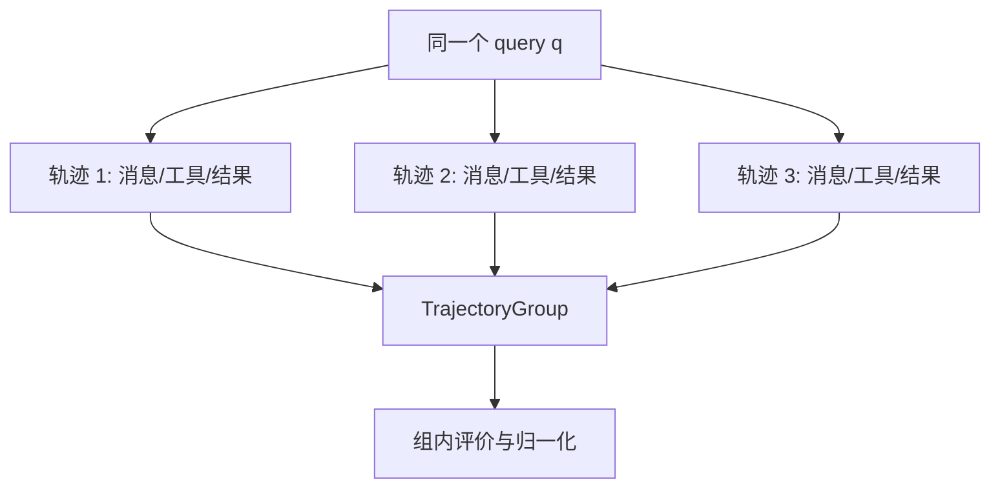

关键不是名词，而是比较时必须让候选面对**同一个任务和相同约束**。把不同难度问题的原始分数直接放入一组，优势值会混入题目难度，而不是只反映策略质量。

### 1.5 奖励、策略与评价器

原章列出六个核心概念：

| 概念 | 是什么 | 在 Agent 学习中的作用 |
|---|---|---|
| Reward | 表示结果好坏的标量信号 | 把行动与后果连接起来 |
| Trajectory | 一次任务的完整步骤记录 | 保存“怎样得到结果” |
| Rollout | 策略的一次采样运行 | 产生可比较经验 |
| Policy | 从上下文映射到下一动作的决策分布 | RL 真正要更新的对象 |
| Reward/Judge Model | 给轨迹打分或排序的模型 | 把开放式质量转成训练信号 |
| Relative Evaluation | 在同题候选中判断谁更好 | 降低绝对标尺的校准难度 |

奖励来源可以是：

- **程序验证器**：单元测试、数学等式、格式与约束检查；
- **LLM-as-judge**：依据 rubric 评价清晰度、完整性和风格；
- **学习得到的 reward model**：根据偏好数据预测质量；
- **人类反馈**：成对偏好、分数、编辑或审批；
- **混合奖励**：先验证硬正确性，再评价软质量。

奖励不是“真实目标”本身，只是目标的代理。若代理有漏洞，策略会学会最大化分数而不是真正完成任务，即 reward hacking。

### 1.6 改进可以发生在哪一层

作者专门区分开放权重和闭源 API：

- **可训练模型**：轨迹可用于 RL/post-training，直接更新参数 $\theta$；
- **闭源 API 模型**：底层权重通常不变，但可依据轨迹改进 prompt、工具描述、路由器、评估集、记忆策略和工作流。

因此，“Agent 从经验中学习”至少有两种含义：

$$
\text{policy learning}: \theta\leftarrow\theta'
$$

$$
\text{system learning}: (prompt,tools,graph,memory)\leftarrow\text{revised configuration}
$$

两者都利用经验，但只有前者是模型参数学习。把一次运行中的状态更新或提示修改称作“模型学会了”，会混淆时间尺度。

---

## 2. Better in Groups：为什么相对排名有用

### 2.1 绝对评分难在哪里

对数学题，可以直接判定答案等于目标；对诗歌、解释、研究报告或客户对话，“0.73 分”缺少天然单位。不同 judge、提示和时间给同一个答案的绝对分也可能漂移。

相比之下，人和模型通常更容易回答：

> 在同一个提示、同一组约束下，A 和 B 哪个更完整、更准确？

相对评价不要求跨任务的 0.8 都代表完全相同的质量，只要求同一组内排序大体一致。它把困难从“建立全球统一标尺”降低为“识别局部差异”。

### 2.2 相对反馈提供了什么信息

对同一 query $q$ 采样 $G$ 个输出：

$$
o_1,o_2,\ldots,o_G\sim\pi_{\theta_{old}}(\cdot\mid q),
$$

评价器给出奖励 $r_1,\ldots,r_G$。组内均值与标准差为：

$$
\mu_G=\frac{1}{G}\sum_{i=1}^{G}r_i,
$$

$$
\sigma_G=\sqrt{\frac{1}{G}\sum_{i=1}^{G}(r_i-\mu_G)^2}.
$$

相对优势为：

$$
A_i=\frac{r_i-\mu_G}{\sigma_G+\delta},
$$

$\delta>0$ 是实际实现中防止除零的小常数；原章公式省略了它。

- $A_i>0$：该候选优于组平均，应提高其概率；
- $A_i<0$：该候选低于组平均，应降低其概率；
- $A_i\approx0$：没有明显相对证据。

若组内所有奖励相同，则 $\sigma_G=0$，这组不能提供排序信号。实现必须加 $\delta$、跳过更新或增加采样多样性。这里不能把“分数都高”误解为“学习信号很强”。

### 2.3 一个组内归一化数值例

沿用后文猫诗的典型分数：

$$
(r_1,r_2,r_3)=(0.90,0.60,0.05).
$$

组均值为：

$$
\mu_G=\frac{0.90+0.60+0.05}{3}\approx0.5167.
$$

采用总体标准差：

$$
\sigma_G
=
\sqrt{\frac{(0.90-0.5167)^2+(0.60-0.5167)^2+(0.05-0.5167)^2}{3}}
\approx0.35198.
$$

于是：

$$
(A_1,A_2,A_3)\approx(1.089,0.237,-1.326).
$$

优势之和约为 0。第一首诗得到明显正信号，第二首略高于平均，跑题回答得到强负信号。

组内 z-score 对正仿射变换基本不变：若所有奖励变成 $r'_i=ar_i+b$ 且 $a>0$，则优势排序不变。这就是不依赖全球绝对刻度的数学直觉。但非线性变换、judge 排序错误、候选组构成变化仍会改变学习信号。

### 2.4 相对评价的前提与局限

相对排名有效需要：

- 同组候选可比；
- 候选之间有足够质量差异；
- judge 在组内排序相对稳定；
- group size 足以估计均值和方差；
- rubric 与真实业务目标一致。

它不能自动解决：

- judge 的位置、长度、文风或自我偏好；
- 所有候选都很差时“差中选优”；
- 同一模型生成并评价造成的相关盲点；
- 候选通过提示注入操纵 judge；
- 跨组奖励不可比较；
- 策略学会迎合 judge 而非用户。

因此，能程序验证的维度应优先使用硬验证器，开放式维度再交给相对 judge。

### 2.5 KL divergence：为什么更新需要锚点

如果只追逐当前奖励，策略可能迅速过拟合 judge，丢失语言流畅性、通用知识或安全行为。原章用 KL divergence 衡量新策略和参考策略的距离：

$$
D_{KL}(\pi_\theta\Vert\pi_{ref})
=
\mathbb{E}_{q,\,o\sim\pi_\theta}
\left[
\log\frac{\pi_\theta(o\mid q)}{\pi_{ref}(o\mid q)}
\right].
$$

它有三个性质：

- $D_{KL}\ge0$；
- 两分布几乎处处相同时为 0；
- 不对称，即 $D_{KL}(P\Vert Q)\ne D_{KL}(Q\Vert P)$。

训练目标中减去 $\beta D_{KL}$：

$$
J_{regularized}=J_{reward}-\beta D_{KL}.
$$

$\beta$ 越大，越保守；越小，越允许策略偏离。KL 是软约束，不是安全证明：只要奖励收益足够大，策略仍可能在局部显著变化。

还要区分两个策略快照：

- $\pi_{\theta_{old}}$：生成当前 rollout 的行为策略，用于重要性比率；
- $\pi_{ref}$：长期锚点，常是冻结的 SFT 模型，也可能按实现取旧策略。

二者可以相同，但概念职责不同。

---

## 3. 从 PPO/DPO 到 GRPO/GSPO 的位置关系

原章用一张表澄清四种方法“谁提供反馈、是否需要 critic、优化什么单位”。整理如下：

| 方法 | 训练信号 | Reference policy | Critic | 主要优化单位 |
|---|---|---|---|---|
| PPO（典型 RLHF） | 学习的 reward model 给标量奖励 | 通常冻结 SFT 模型 | 有 value head 或独立 critic | token 级 ratio 与 advantage |
| DPO | 成对 chosen/rejected 偏好 | 冻结 reference | 无 | sequence 级偏好损失 |
| GRPO | 同题多个候选的 judge/程序奖励 | old policy 或冻结 ref | 无学习 critic | 组优势 + token 级 ratio |
| GSPO | 与 GRPO 类似的组内奖励 | old policy 或冻结 ref | 无 | sequence 级 ratio |

几个关键区别：

1. **DPO 不是在线 rollout RL 的同义词。** 它直接用偏好对优化分类式目标，训练时不需要额外 reward model 打分。
2. **GRPO 不是“没有奖励模型”。** 它不需要 critic，但仍需要 reward function、judge 或 verifier。
3. **GRPO 的 group baseline 替代 critic 的部分作用。** 它用同题候选均值估计相对基线，降低方差。
4. **GSPO 不是简单把最终奖励复制给 token。** 它把新旧策略比率本身也提升到整条 sequence 的尺度。

---

## 4. GRPO：组相对策略优化

### 4.1 GRPO 要解决什么问题

PPO 常训练一个 critic 估计状态价值。对长文本和复杂 Agent 轨迹，critic 会增加参数、显存、训练难度与估计误差。Group Relative Policy Optimization（GRPO）对同一 query 采样多个候选，用组内平均表现作为基线，从而无需单独学习 critic。

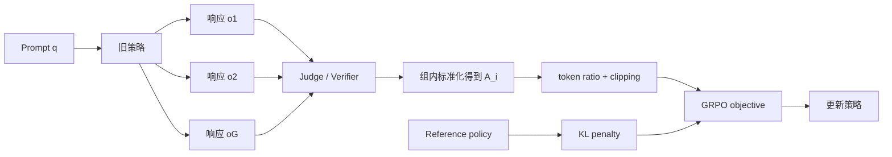

### 4.2 自回归序列概率

对 query $q$ 和响应 $o=(o_1,\ldots,o_{|o|})$，自回归模型的序列概率分解为：

$$
\pi_\theta(o\mid q)
=
\prod_{t=1}^{|o|}
\pi_\theta(o_t\mid q,o_{<t}).
$$

取对数可把连乘变成求和：

$$
\log\pi_\theta(o\mid q)
=
\sum_{t=1}^{|o|}
\log\pi_\theta(o_t\mid q,o_{<t}).
$$

实际计算使用 log-probability，因为许多小概率直接相乘容易数值下溢。

### 4.3 Token-level importance ratio

rollout 由旧策略生成，但梯度更新当前策略。对第 $i$ 个响应的第 $t$ 个 token：

$$
w_{i,t}(\theta)
=
\frac{
\pi_\theta(o_{i,t}\mid q,o_{i,<t})
}{
\pi_{\theta_{old}}(o_{i,t}\mid q,o_{i,<t})
}.
$$

- $w=1$：当前与旧策略对该 token 的概率相同；
- $w>1$：当前策略更偏好它；
- $w<1$：当前策略降低了它的概率。

该比率让旧策略采集的数据可以估计当前策略目标，但两者差得越远，估计方差越大，所以需要 clipping 和频繁刷新 rollout。

### 4.4 Group-relative advantage

每条完整响应得到标量 $r_i$，再按组标准化：

$$
A_i
=
\frac{
r_i-\operatorname{mean}(r_1,\ldots,r_G)
}{
\operatorname{std}(r_1,\ldots,r_G)+\delta
}.
$$

同一个 $A_i$ 通常作用于该响应的所有被训练 token，而每个 token 有自己的 $w_{i,t}$。这就是“奖励在 sequence 级，importance ratio 在 token 级”的含义。

### 4.5 Clipped surrogate objective

原章给出的 GRPO 最大化目标为：

$$
\begin{aligned}
\mathcal{J}_{GRPO}(\theta)
=
\mathbb{E}
\Bigg[
&\frac{1}{G}\sum_{i=1}^{G}
\frac{1}{|o_i|}\sum_{t=1}^{|o_i|}
\min\Big(
w_{i,t}(\theta)A_i,\\
&\operatorname{clip}
(w_{i,t}(\theta),1-\varepsilon,1+\varepsilon)A_i
\Big)
\Bigg]
-\beta D_{KL}(\pi_\theta\Vert\pi_{ref}).
\end{aligned}
$$

若代码把它叫 `loss` 并用梯度下降，通常最小化 $-\mathcal{J}_{GRPO}$；符号约定必须分清。

逐项解释：

1. $1/G$：在同题候选间平均。
2. $1/|o_i|$：在响应 token 间平均，避免长答案仅因 token 更多占更大权重。
3. $w_{i,t}A_i$：提高高优势 token 的概率，降低负优势 token 的概率。
4. `clip`：把 ratio 限制在 $[1-\varepsilon,1+\varepsilon]$ 的保守改善范围。
5. `min`：选择更悲观的 surrogate，阻止更新通过把 ratio 推得过远获取虚假收益。
6. $-\beta D_{KL}$：让整体分布保持靠近 reference。

对 $A_i>0$，若 $w$ 超过 $1+\varepsilon$，正收益被截住；对 $A_i<0$，若 $w$ 低于 $1-\varepsilon$，继续压低概率也不再获得更好目标。两侧共同形成信任区域式约束。

### 4.6 为什么 clipping 和 KL 都需要

- clipping 比较**当前策略与本轮旧策略**，限制单次更新；
- KL 比较**当前策略与参考策略**，限制累计漂移。

只有 clipping 时，许多小步仍可能逐渐远离最初能力；只有 KL 时，单个 minibatch 的高方差更新仍可能不稳。它们是不同时间尺度的稳定器。

### 4.7 GRPO 的适用前提与局限

优势：

- 不训练 critic，减少内存和复杂度；
- 相对奖励不要求跨任务精确校准；
- 很适合有 verifier 或可比较多答案的推理任务；
- 同题 group 为难度提供局部基线。

局限：

- 每题要生成 $G$ 个候选，rollout 成本高；
- $G$ 太小或候选同质时，均值/方差估计噪声大；
- 组内全错仍可能奖励“相对没那么错”的响应；
- 终局奖励共享给所有 token，信用分配粗糙；
- judge 偏差会直接进入策略；
- 长序列中 token ratio 波动可累积不稳定；
- on-policy 数据随参数快速过期，不能无限重用。

“无需手工 reward scaling”指组归一化减少尺度调参，不代表完全不需要设计 reward、rubric、group 和安全约束。

---

## 5. GSPO：把优化单位提升到完整序列

### 5.1 为什么从 token 转向 sequence

Group Sequence Policy Optimization（GSPO）的出发点是：judge 通常给整条回答一个奖励，那么新旧策略的变化也应按整条回答衡量。GRPO 中同一 $A_i$ 搭配许多独立 token ratio，长回答或大型/MoE 模型中可能积累较高方差。

GSPO 对每条响应只构造一个长度归一化的 sequence ratio。

### 5.2 Sequence-level importance ratio 的推导

先看新旧策略对整条序列的比率：

$$
\frac{\pi_\theta(o_i\mid q)}
{\pi_{\theta_{old}}(o_i\mid q)}
=
\prod_{t=1}^{|o_i|}
\frac{
\pi_\theta(o_{i,t}\mid q,o_{i,<t})
}{
\pi_{\theta_{old}}(o_{i,t}\mid q,o_{i,<t})
}.
$$

直接连乘随长度指数变化。GSPO 取 $\lvert o_i\rvert$ 次方根，即 token ratio 的几何平均：

$$
s_i(\theta)
=
\left(
\frac{\pi_\theta(o_i\mid q)}
{\pi_{\theta_{old}}(o_i\mid q)}
\right)^{1/|o_i|}.
$$

等价地，在 log 空间：

$$
s_i(\theta)
=
\exp\left[
\frac{1}{|o_i|}
\sum_{t=1}^{|o_i|}
\log
\frac{
\pi_\theta(o_{i,t}\mid q,o_{i,<t})
}{
\pi_{\theta_{old}}(o_{i,t}\mid q,o_{i,<t})
}
\right].
$$

这里的长度归一化是指数 $1/|o_i|$ 或平均 log-ratio；原章表 3-5 写成 `$o_i^{-1}$` 是概念简写，不能理解成“对响应对象求倒数”。

### 5.3 GSPO objective

组内优势 $A_i$ 与 GRPO 相同。原章展示的目标为：

$$
\mathcal{J}_{GSPO}(\theta)
=
\mathbb{E}
\left[
\frac{1}{G}\sum_{i=1}^{G}
\min\left(
s_i(\theta)A_i,
\operatorname{clip}(s_i(\theta),1-\varepsilon,1+\varepsilon)A_i
\right)
\right].
$$

一次 ratio 和一次 clipping 作用于完整 response，使 reward granularity 与 optimization granularity 对齐。原章公式没有写 KL 项，并明确说明实现常加入 sequence-level KL；也可结合 early stopping 和 group normalization。不能因为展示式省略 KL，就断言 GSPO 永远不使用 reference regularization。

### 5.4 GRPO 与 GSPO 对比

| 维度 | GRPO | GSPO |
|---|---|---|
| 相对信号 | 同题 group-normalized advantage | 相同 |
| Ratio | 每个 token 一个 $w_{i,t}$ | 每条序列一个 $s_i$ |
| Clipping | token 级 | sequence 级 |
| 奖励与优化单位 | sequence reward 配 token ratio | sequence reward 配 sequence ratio |
| 长输出稳定性 | token 波动可能累积 | 长度归一化后通常更平滑 |
| 计算/基础设施 | 需管理 token 级 logprob 与路由一致性 | 可复用 sequence likelihood，通常更简化 |
| 潜在代价 | 局部 token 更新较细 | 单一序列 ratio 可能掩盖局部坏 token |

“GSPO 更稳定”是方法动机和经验性结论，不是对所有模型、数据和超参数的无条件定理。若 reward/judge 错误、group 无多样性或学习率过大，sequence-level objective 同样会失败。

### 5.5 一个极简 ratio 数值例

假设一条 4-token 响应的新旧 token ratio 为：

$$
(1.10,0.90,1.20,0.80).
$$

GSPO sequence ratio 为几何平均：

$$
s=(1.10\times0.90\times1.20\times0.80)^{1/4}
\approx0.987.
$$

它表示整条序列的平均概率变化接近 1，尽管局部 token 有明显起伏。GRPO 会分别处理四个 ratio，GSPO 则用一个整体值。这既解释稳定性，也说明它会压缩局部差异。

---

## 6. Taking Off the Training Wheels：RULER 与 ART 的分工

### 6.1 从算法公式到可训练 Agent

GRPO/GSPO 说明“有 group reward 后怎样更新策略”，但还缺两件工程能力：

1. 对开放式 Agent 轨迹，谁产生一致的 reward？
2. 谁负责运行工具 Agent、采集 trajectory group 并执行训练？

原章引入两个互补框架：

- **RULER（Relative Universal LLM-Elicited Rewards）**：用 LLM-as-judge 依据任务与 rubric 相对评价多条轨迹，属于奖励/判断层。
- **ART（Agent Reinforcement Trainer/Training）**：采集工具使用轨迹并基于 GRPO 更新可训练 Agent，属于 rollout 与行为优化层。

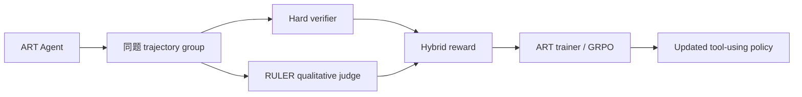

RULER 不负责更新模型；ART 也不会自动知道“什么是好”。二者通过 trajectory reward 接口连接。

---

## 7. RULER：用同组比较评价开放式轨迹

### 7.1 小节标题中的反差

原章小节名是 “Why Absolute Scoring is Easier”，但正文论证的是**相对比较通常比绝对打分容易且更稳**。阅读时应以后续机制为准：RULER 正是为了缓解绝对分数校准困难。

### 7.2 RULER 工作流

对同一任务生成多条轨迹后：

1. 找出候选共享的 system/user 前缀；
2. 去除重复前缀，只保留每条轨迹独特部分，降低 judge 输入成本；
3. 将任务描述、rubric 和候选一起发送给 LLM judge；
4. judge 为每条轨迹给 $[0,1]$ 分数和解释；
5. 在 group 内排序/归一化；
6. 把 reward 写回轨迹，供 GRPO 更新；
7. 保存解释，用于错误分析和低质量轨迹聚类。

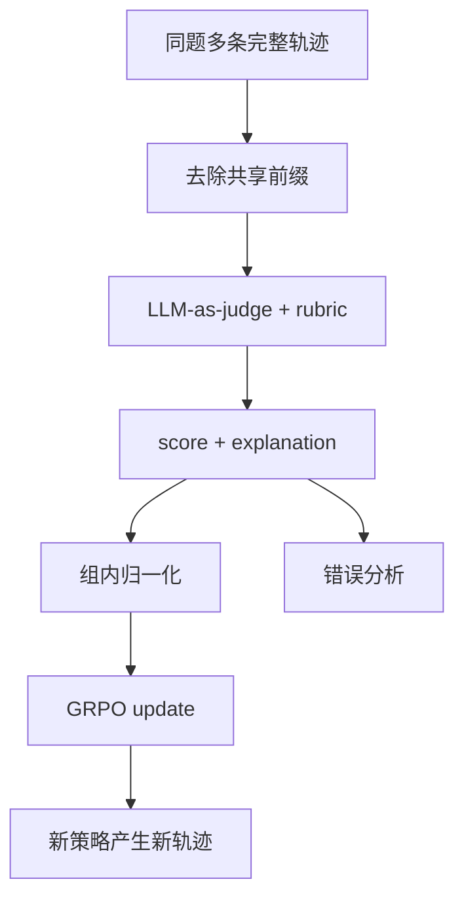

去重只是压缩冗余，不能删掉影响判断的工具参数、观察或安全上下文。应按结构化消息边界去除真正相同的 prefix，而不是用脆弱字符串截断。

### 7.3 猫诗示例（例 3-1 至 3-4）

任务要求写一首猫观察天空、能唤起情感的短诗。原章预设三条 trajectory：

- **good**：猫、星空、月光等意象完整且有诗性；
- **mediocre**：符合猫和星空主题，但表达简单；
- **off-topic**：写狗，违反核心主题。

每条 `art.Trajectory` 包含相同 initial messages 和不同 assistant choice，初始 `reward=0.0`。随后：

```python
group = art.TrajectoryGroup([
    good_trajectory,
    mediocre_trajectory,
    off_topic_trajectory,
])
judged_group = await ruler_score_group(group, "openai/o3", debug=True)
```

典型分数是 $0.90,0.60,0.05$，解释分别指出意象完整、过于简单和主题错误。排序代码按 `trajectory.reward` 降序打印 leaderboard。

这个例子的作用不是证明 judge 分数客观，而是展示接口：**轨迹先是行为记录，RULER 再把同组质量差异写成 reward。** 候选在示例中是手工预设，为了让评分过程清楚；真实训练必须由当前策略独立 rollout。

### 7.4 为什么相对 judge 可用于开放式任务

解释、摘要、论文、客服对话等任务包含清晰度、完整性、语气、创造性与事实性，难以用一个闭式公式表达。将候选并排后，judge 可以基于 rubric 识别：

- 哪条推理更连贯；
- 哪条遗漏约束；
- 哪条有更多幻觉；
- 哪条结论与证据更一致；
- 哪条更符合语气和格式。

但“无需 expected output”不等于“无需监督”。任务描述、rubric、judge 模型的训练偏好和任何 hard verifier 都是监督来源。RULER 减少逐样本标签，不会凭空定义业务价值。

### 7.5 RULER 的可靠性边界

主要风险：

- **position bias**：偏爱列表前后的候选；
- **verbosity bias**：把更长误当更深入；
- **self-preference**：偏爱与 judge 自身风格相似的输出；
- **prompt injection**：轨迹中的网页内容命令 judge 给高分；
- **reward hacking**：策略学会写迎合 rubric 的套话；
- **相关错误**：同系列模型既生成又评价；
- **judge drift**：服务版本变化导致奖励分布变化。

缓解方法：随机候选顺序、多 judge 或不同模型交叉评价、隐藏候选身份、先做事实/安全硬检查、定期用人工标注校准，并把原始 judge 版本和 rubric 与轨迹一起保存。

---

## 8. Hybrid Reward：把硬正确性与软质量结合

### 8.1 为什么不能只用 LLM judge

Countdown 数学任务要求用给定数字和 $+,-,\times,\div$ 得到目标值。答案是否满足表达式约束可以程序验证，不应该让 LLM 凭语言感觉判断。

但多个正确表达式仍可能在以下方面不同：

- 运算数量；
- 冗余括号；
- 是否使用无意义的 $+0$ 或 $\times1$；
- 是否不必要地使用除法；
- 解释和工具轨迹是否清晰。

所以作者采用两阶段奖励：

1. deterministic judge 产生硬 gate $g_i\in\{0,1\}$；
2. RULER 产生组内质量分 $u_i\in[0,1]$。

最终：

$$
R_i
=
g_i(\alpha+\beta u_i).
$$

原例取 $\alpha=0.7,\beta=0.3$，因此：

- 错误答案无论文风多好，$R_i=0$；
- 正确但组内质量最低，$R_i=0.7$；
- 正确且质量最高，$R_i=1.0$。

这体现“correctness first, quality second”。若直接相加 $0.7g+0.3u$，错误但文风好的回答仍会得 0.3；乘法 gate 消除了这个漏洞。

### 8.2 混合奖励的局限

- 若一组没有正确解，所有 reward 都为 0，无法从“接近正确”中学习；
- 二元 gate 对微小语法错误和完全无关答案同样给 0；
- RULER 只在正确答案间有意义，但原实现先对所有 trajectory 打分再 gate；
- $\alpha,\beta$ 是人为价值选择，不是从数据自动得出；
- 质量 rubric 若鼓励少操作，可能偏向难读但短的表达式；
- 组内 min-max 对异常值和小组很敏感。

可逐步加入部分奖励、错误类型课程或先过滤正确候选再做质量排序，但每一种 shaping 都可能产生新的投机路径。

---

## 9. ART Countdown 案例：从轨迹到参数更新

### 9.1 整体任务与实现顺序

作者用 ART 训练 Qwen2.5-7B-Instruct 完成 Countdown：给定目标和若干数字，每个数字最多使用一次，用四则运算构造精确等式。

实现顺序是：

1. 创建 trainable model 与本地 backend；
2. 定义任务 scenario；
3. 定义读取上下文、精确搜索和提交答案的工具；
4. 用 deterministic judge 验证表达式；
5. 运行多个 ReAct rollout 并捕获 trajectory；
6. 用 RULER 评价组内质量；
7. 合成 hybrid reward；
8. ART 以 GRPO 更新策略；
9. 在 held-out scenarios 上用同一 hard judge 测试。

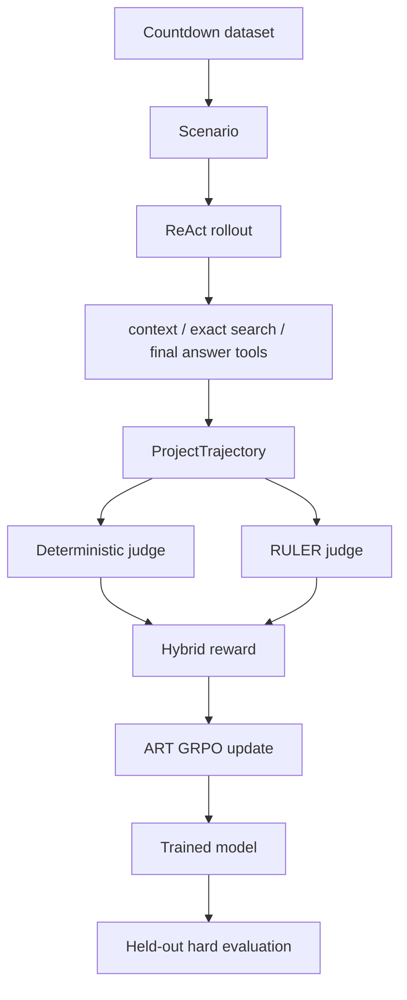

### 9.2 例 3-5 与 3-6：模型和 backend

```python
model = art.TrainableModel(
    name="countdown-agent-001",
    project="countdown-agent",
    base_model="Qwen/Qwen2.5-7B-Instruct",
)

backend = LocalBackend(in_process=True, path="./.art")
await model.register(backend)
```

`TrainableModel` 标识要更新的策略和项目；`LocalBackend` 管理本地训练状态与 checkpoint。`await model.register(backend)` 把逻辑模型连接到执行/训练后端。

这部分要求可访问模型权重和足够算力。若只调用闭源 API，不能用同样代码更新供应商模型参数，只能把轨迹用于系统层改进或训练另一个可控模型。

### 9.3 例 3-7：deterministic judge 如何验证

`judge_countdown_expression(target,allowed_nums,expr,...)` 依次执行：

1. 去掉首尾空白，拒绝空表达式；
2. 用字符白名单拒绝字母和其他操作；
3. 提取表达式中的数字并统计多重集；
4. 检查每个数字是否来自允许列表，使用次数是否超限；
5. 解析 AST，而不是直接对不可信字符串调用裸 `eval`；
6. 可选地用 `Fraction` 精确计算并要求整数中间结果；
7. 目标匹配返回 $(1.0,value,None)$；
8. 错值、除零和解析异常返回 0 与原因。

使用多重集而非普通集合很重要。例如允许数字 `[3,3,4,5]`，表达式可以用两个 3，但不能用三个。令 $c_A(v)$、$c_E(v)$ 分别为允许和实际计数，合法条件是：

$$
\forall v,\qquad c_E(v)\le c_A(v).
$$

用 `Fraction` 避免浮点误差：例如 $1/3+1/3+1/3$ 在二进制浮点中未必精确等于 1，而有理数表示为 $1/1$。原代码在非严格模式用容差：

$$
|value-target|<10^{-9}.
$$

字符白名单只是第一层安全措施；真正的安全来自受限 AST evaluator 只允许指定节点。允许 `.` 还意味着数字提取和输入规则必须一致地处理小数。完整 helper 在原章片段中省略，不能只复制正则就称为安全 evaluator。

### 9.4 例 3-8：Scenario 把数据变成训练接口

`Scenario` 包含：

- 稳定 ID；
- 目标整数 `target`；
- 可用数字列表 `nums`；
- 自然语言问题 `question`。

`mk_scenario` 从数据行构造 prompt，明确“每个数字最多一次、只用四则运算、只返回表达式”。训练集和测试集分别创建，避免用训练任务宣称泛化。

题面是 “at most once”，所以允许不使用某些数字；若目标数据集要求“每个数字恰好一次”，judge 和 prompt 都需改为 $c_E(v)=c_A(v)$。自然语言要求必须与程序 verifier 完全一致，否则策略会面对矛盾奖励。

### 9.5 例 3-9：一条 rollout 怎样形成

`ProjectTrajectory` 扩展 `art.Trajectory`，增加类型化 `final_answer`。每次 rollout：

1. 把当前 scenario 写入工具可读的 scratchpad；
2. 初始化 reward、metadata 和 metrics；
3. 构造含目标、数字、工具和步骤的 system prompt；
4. 创建带三个工具的 ReAct Agent；
5. 为 rollout 分配独立 `thread_id` 和随机 seed；
6. 设置 `recursion_limit=MAX_TURNS` 防工具循环；
7. 异步执行 Agent；
8. 从 final-answer 工具取得结构化答案；
9. hard judge 写入 `reward`、`correct`、实际值和失败原因；
10. 把软质量 rubric 写入 metadata，供 RULER 使用。

三个工具分工：

- `read_countdown_context`：确认当前输入；
- `countdown_search_tool`：用精确搜索寻找合法表达式；
- `return_final_answer_tool`：按协议提交最终答案。

这段代码展示 Agent trajectory 的重点不是最终字符串，而是**读取、搜索、提交和评分的完整行为链**。

### 9.6 轨迹隔离与并发边界

原章把唯一 `thread_id` 和 seed 解释为复现与隔离。更准确地说：

- `thread_id` 隔离框架状态；
- seed 在实现支持时帮助复现采样，但分布式推理和 API 服务未必位级确定；
- 示例中的 `_nonlocal_final` 与 `_current_scenario` 是共享 scratchpad。

若多个 rollout 异步并发，共享全局字典可能互相覆盖。生产实现应使用 `contextvars`、按 trajectory ID 索引的存储，或把 scenario 显式放进工具配置，不能只靠 thread ID 隔离另一套全局变量。

原代码片段也省略了 helper、异常分支以及 ART 如何把模型消息记录进 `messages_and_choices`，并非可单独复制运行的完整函数；作者已说明完整实现位于配套仓库。

### 9.7 例 3-10：RULER group scoring 与降级

代码逐组调用：

```python
rg = await ruler_score_group(group, "openai/gpt-4.1", debug=True)
```

若 judge 异常，则保留原 group。这个 fallback 保证训练流水线不因评价服务暂时失败而停止，但要区分两种情况：

- 原 `t.reward` 仍是 deterministic correctness，可以继续硬奖励训练；
- 不能把未评价的原 reward 误记为 RULER 质量分。

生产指标应记录 judge failure rate；大量静默降级会改变 reward 定义，使不同 batch 不可比。

### 9.8 例 3-11：混合奖励代码逐步解释

对每个 group：

1. 读取 RULER 写入的 `t.reward`；
2. 计算组内 `rmin`、`rmax`；
3. 若二者相等，把 `span` 设为 1，避免除零；
4. 从 `metrics["correct"]` 取二元 gate；
5. 做 min-max normalization：

$$
u_i=\frac{r_i-r_{min}}{\max(r_{max}-r_{min},1\text{ when equal})};
$$

6. 把 NaN 或越界值压到 $[0,1]$；
7. 计算 $R_i=g_i(0.7+0.3u_i)$；
8. 保留 raw score 和 norm，最后覆盖 `t.reward` 作为训练奖励。

若全组 RULER 分数相同，代码令所有 $u_i=0$；正确答案得到 0.7，而不是 1.0。这是一种保守退化语义。若函数使用默认 `alpha=beta=1.0`，正确答案可能在 clipping 前得到 $[1,2]$ 并被压到 1，失去质量区分；原调用显式传入 0.7/0.3 才符合说明。

### 9.9 例 3-12：训练循环

原配置：

| 参数 | 值 | 含义 |
|---|---:|---|
| `groups_per_step` | 4 | 每个优化步处理 4 个 scenario |
| `rollouts_per_group` | 2 | 每题采样 2 条比较轨迹 |
| `num_epochs` | 1 | 遍历小训练切片一次 |
| `learning_rate` | $10^{-5}$ | 参数更新步长 |
| `max_steps` | 3 | 调试期计划限制训练步数 |
| `train_slice` | 64 | 快速首轮使用 64 个场景 |

每个 batch 为每个 scenario 构造 `TrajectoryGroup`，异步收集 rollout，再应用 hybrid reward 和 `model.train` 的 GRPO 更新。`initial_step=await model.get_step()` 支持从已有全局 step 继续。

需要注意，原章摘录中：

- `judged` 和 `hybrid_groups` 的完整生成/作用域没有全部展示；
- `max_steps` 写入配置，但所示循环没有明确 `break` 使用它；
- `model.train(hybrid_groups,...)` 的缩进和每 batch 对应关系需以完整 notebook 为准；
- group size 只有 2，若两次 rollout 相同，组内优势会退化。

这些是“只展示核心片段”的结果，不能把摘录直接当作完整训练脚本。

### 9.10 例 3-13：held-out 测试结果怎样解读

测试对前 10 个 test scenarios 复用同一个 rollout 和 hard judge。原章输出中 8 个正确、2 个返回 `None`：

$$
\widehat{accuracy}=\frac{8}{10}=80\%.
$$

但 10 个样本的估计方差很大，不能仅凭它断言模型已经稳定学会技能。更重要的是，Agent 被授予了**精确搜索工具**；成功可能主要来自工具求解与调用协议，而不全是模型参数通过 RL 获得了算术能力。

严谨实验至少应比较：

- 训练前和训练后同一 held-out 集；
- 相同工具、采样预算和 seed 分布；
- 无 exact-search tool 的消融；
- 只用 hard reward 与 hybrid reward 的差异；
- 工具调用成功率、正确率、平均步数和成本；
- 更多样本及置信区间。

因此，这组输出说明训练管线能产生有效解，尚不足以独立证明因果上的“RL 学会了 Countdown”。

### 9.11 ART 案例真正展示了什么

最重要的不是 8/10，而是奖励闭环的可组合性：

```text
ReAct 工具行为
→ 可回放 trajectory
→ 程序 correctness
→ RULER quality
→ hybrid scalar reward
→ GRPO policy update
→ 同协议 held-out evaluation
```

这种模式可以迁移到代码 Agent：测试用例作为 hard gate，代码可读性和文档由 judge 评价；也可迁移到研究 Agent：引用存在与来源匹配由程序检查，综合质量由 rubric judge 评价。

---

## 10. Test-Time Compute：用更多“思考”代替更多参数

### 10.1 什么是测试时计算

扩大模型参数量需要昂贵的预训练与部署资源，而且每个请求都承担更大的基础成本。Test-time compute（测试时计算、推理时计算）采用另一条轴：模型权重固定，对困难请求增加采样、反思、验证和搜索步骤。

设基础单次生成成本为 $C_0$，采样 $K$ 个候选、每个候选平均评价成本为 $C_e$，再做 $R$ 次 refinement，则推理成本粗略为：

$$
C_{test}
\approx
K(C_0+C_e)+R(C_{refine}+C_e)+C_{coord}.
$$

它把一次性的训练规模换成按请求支付的计算量。优势是可以按任务难度自适应；代价是延迟、费用和 judge 误差也随步骤增长。

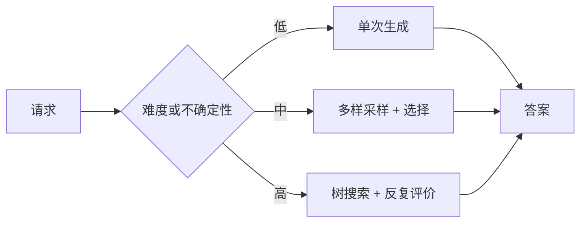

“小模型加更多思考可匹配大模型”是某些任务和预算下的经验性结果，不是普遍定理。若小模型不能生成任何有效候选，搜索只是在坏空间中反复选择；若 judge 不可靠，更多搜索甚至会强化错误。

### 10.2 奖励模型在推理阶段的新角色

训练阶段，reward model/judge 评价 rollout 并产生梯度信号；测试阶段，它不更新参数，而是：

- 评价候选答案；
- 决定下一步扩展哪个分支；
- 判断应探索新方案还是细化已有方案；
- 选择最终输出。

同一评价器可以跨训练与推理复用，但有过拟合风险：若策略在训练时已经学会迎合 judge，测试搜索再按同一 judge 最大化，reward hacking 会被放大。最终高风险答案应有独立 verifier 或人工评价。

---

## 11. 从平面采样到树搜索

### 11.1 Repeated sampling：只扩宽度

Repeated sampling 对同一个 prompt 独立生成多个答案：

$$
o_1,\ldots,o_K\overset{iid}{\sim}\pi_\theta(\cdot\mid q),
\qquad
o^{\ast}=\underset{o_i}{\operatorname{argmax}}\ V(o_i).
$$

它适合：

- 生成分布有多样性；
- 一次完整答案成本可接受；
- evaluator 能可靠选优；
- 候选之间不需要共享中间进展。

它探索广度，却不会把某个 promising candidate 的局部优点继续发展。

### 11.2 Sequential refinement：只挖深度

Sequential refinement 从一个答案开始：

$$
o_{t+1}=F_\theta(o_t,feedback_t),
$$

不断要求模型改进。它能积累上下文和纠错，但容易：

- 锚定初始方案；
- 在同一路径上做表面改写；
- 改坏原来正确的部分；
- 因 judge 的单一偏好趋同。

Repeated sampling 是“多开几条路但不深挖”，sequential refinement 是“沿一条路深挖但不换方向”。MCTS 试图在预算内同时决定何处扩宽、何处加深。

### 11.3 MCTS 的四个阶段

Monte Carlo Tree Search（MCTS）反复执行：

1. **Selection**：从根沿树向下，选择兼顾当前价值与不确定性的节点；
2. **Expansion**：在选中节点下生成一个或多个新子候选；
3. **Simulation/Rollout**：从新节点补全方案并得到评价；
4. **Backpropagation**：把结果沿祖先路径回传，更新访问次数和价值估计。

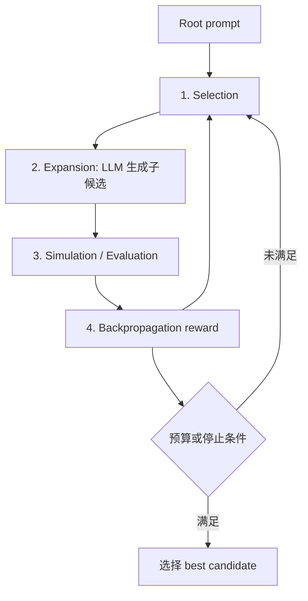

对 LLM 推理，“state”可以是一段部分解、当前代码版本、计划或完整答案；“action”可以是增加一步推导、生成新答案或 refinement。树的语义必须明确，否则比较不同深度节点的 score 没有意义。

### 11.4 UCT：怎样平衡 exploitation 与 exploration

原章给出的 Upper Confidence Bound for Trees（UCT）为：

$$
\operatorname{UCT}(s)
=
V(s)
+
c\sqrt{\frac{\ln N(p)}{N(s)}}.
$$

- $V(s)$：节点 $s$ 的平均价值估计；
- $N(s)$：该节点访问次数；
- $N(p)$：父节点访问次数；
- $c$：exploration weight。

第一项是 exploitation：优先走目前平均回报高的分支。第二项是 exploration bonus：

- 父节点被访问越多，$\ln N(p)$ 增长，未充分探索子节点更值得检查；
- 子节点 $N(s)$ 越大，bonus 越小，避免永远重复成熟路径；
- $c=0$ 时变成纯贪心；
- $c$ 大时更偏探索。

未访问节点通常返回 $+\infty$，保证至少试一次。根没有父节点，不定义该形式的 UCT。

### 11.5 UCT 数值例

假设父节点访问 $N(p)=100$ 次。两个子节点：

- A：平均价值 $V_A=0.80$，访问 $N_A=25$；
- B：平均价值 $V_B=0.65$，访问 $N_B=4$。

取 $c=1$：

$$
UCT(A)=0.80+\sqrt{\frac{\ln100}{25}}
\approx0.80+0.429=1.229,
$$

$$
UCT(B)=0.65+\sqrt{\frac{\ln100}{4}}
\approx0.65+1.073=1.723.
$$

B 当前平均分较低，却因访问少而被选择。这不是认为 B 已经更好，而是认为“了解 B 的信息价值更大”。访问增加后，bonus 会下降，算法再依据观测回报决定是否继续。

### 11.6 例 3-14：UCT 代码

原代码中 `self.value` 是累计 reward，故先计算：

```python
average_reward = self.value / self.visits
```

然后：

```python
exploration_term = math.sqrt(
    math.log(parent_visits) / self.visits
)
return average_reward + exploration_weight * exploration_term
```

边界处理：

- 根节点无 parent，抛错；
- `visits==0` 返回 infinity；
- `parent_visits=max(1,...)` 避免 `log(0)`。

如果系统直接把 `self.value` 存为平均值，再除 visits 会重复归一化。节点数据契约必须说明 value 是累计和还是均值。

### 11.7 Backpropagation 怎样更新

若 rollout 得到 reward $r$，对从叶到根的每个节点 $s$：

$$
N(s)\leftarrow N(s)+1,
$$

$$
W(s)\leftarrow W(s)+r,
$$

$$
V(s)=\frac{W(s)}{N(s)}.
$$

这是单 Agent 最大化同一 reward 的简单情形。对对抗博弈，回传时可能要按玩家取反；本章的答案搜索不是零和对抗，不需要交替符号。

### 11.8 MCTS 用于 LLM 的特殊困难

经典 MCTS 常有清晰合法动作与可模拟环境；自然语言空间几乎无限，LLM judge 又有噪声。因此要额外设计：

- 怎样定义一个节点和“不同分支”；
- 每次 expansion 生成几个候选；
- 如何去重语义相近答案；
- value 是过程分、终局分还是二者组合；
- 不同深度/长度怎样公平比较；
- judge 错误怎样重复采样或校准；
- 何时停止以及怎样选最终节点；
- 是否允许不安全候选进入搜索树。

MCTS 提供预算调度，不会自动提供正确的状态表示和评价函数。

---

## 12. AB-MCTS：自适应决定“开新路”还是“继续改”

### 12.1 固定 branching factor 的问题

标准 MCTS 常假定每个节点有预定义或固定数量的动作。语言模型可以生成近乎无限多的候选：

- branching factor 太小，可能错过完全不同的好方案；
- 太大，则大量预算浪费在浅层低质量候选；
- 所有问题用同一宽度，无法按不确定性调节。

Adaptive Branching MCTS（AB-MCTS）的核心不是简单“分支更多”，而是把**是否产生一个新分支**本身变成搜索决策。

### 12.2 GEN 与 CONT

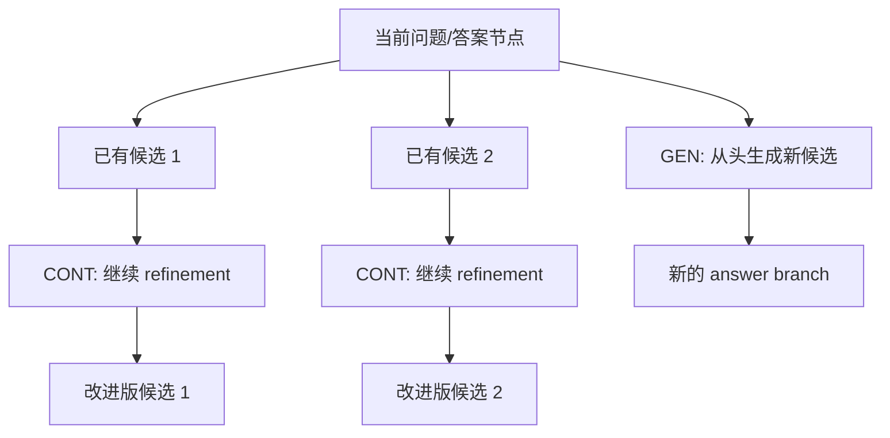

- **GEN node**：被选择时从当前上下文生成一个新的候选，扩宽树；
- **CONT node**：沿已有答案继续改进，增加深度。

算法观察每种选择的历史 reward 与不确定性，动态决定下一份计算预算投向哪里。

### 12.3 Thompson sampling 的直觉

AB-MCTS 使用 Bayesian posterior 来平衡探索和利用。对每个可选分支 $k$ 维护未知质量 $\mu_k$ 的后验：

$$
p(\mu_k\mid D_k),
$$

$D_k$ 是已有评价。每次从每个后验抽一个样本：

$$
\widetilde{\mu}_k\sim p(\mu_k\mid D_k),
$$

选择：

$$
k^{\ast}=\underset{k}{\operatorname{argmax}}\ \widetilde{\mu}_k.
$$

均值高的分支常抽到高值，因此被利用；不确定性大的分支偶尔抽到很高值，因此获得探索机会。随着观测增加，后验变窄，选择逐渐集中。

若 reward 是 $[0,1]$ 的二元/比例结果，可用 Beta-Bernoulli：先验 $\mathrm{Beta}(\alpha,\beta)$，观察 $S$ 次成功、$F$ 次失败后：

$$
\mu\mid D\sim\mathrm{Beta}(\alpha+S,\beta+F).
$$

连续分数可使用 Gaussian 模型，但需要符合噪声和尺度假设。

### 12.4 AB-MCTS-M 与 AB-MCTS-A

| 变体 | 机制 | 优点 | 代价 |
|---|---|---|---|
| AB-MCTS-M（mixed model） | 每个节点用 Bayesian model，根据其 subtree 分数估计 GEN 与已有节点的 posterior predictive distribution | 能从有限观察推断未探索路径的潜力，决策更细 | 模型与推断更复杂，先验/似然错设会误导搜索 |
| AB-MCTS-A（node aggregation） | 每个 answer 节点增加 CONT，将生成与继续改进聚合成节点级选择 | 更接近普通 MCTS、成本较低、实现简单 | 表达能力较粗，聚合可能隐藏子路径差异 |

二者都按 posterior uncertainty 分配计算：不确定时探索，已有高质量证据时 refinement。AB-MCTS-A 可根据奖励分布使用 Gaussian prior，或对 $[0,1]$ 归一化 reward 使用 Beta prior。

“Bayesian”不表示评价就客观；posterior 只是基于 judge 分数与建模假设更新。judge 有系统偏差时，算法会更有把握地优化错误目标。

---

## 13. TreeQuest Fibonacci 案例

### 13.1 案例要展示什么

作者使用开源 TreeQuest 库和 AB-MCTS-A，让模型为“用 Python 编写 Fibonacci sequence”生成答案，再进行五步搜索/refinement。案例的重点是**计算预算怎样在生成与细化之间分配**，不是 Fibonacci 算法本身。

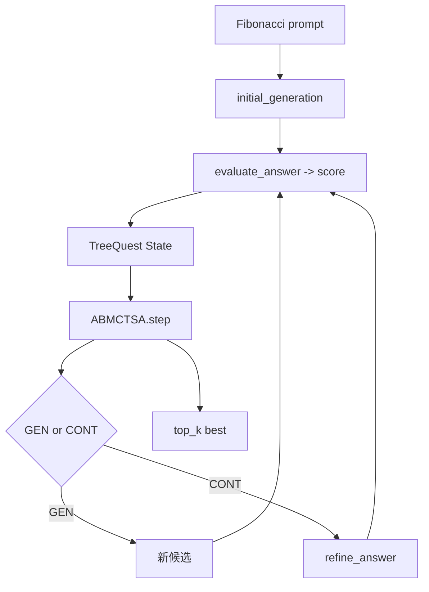

### 13.2 例 3-15：初始候选

`initial_generation`：

1. 向 `gpt-4o` 提交 Fibonacci 编码请求；
2. `temperature=0.7` 保留候选多样性；
3. 取得回答文本；
4. 调用 `evaluate_answer`；
5. 返回 `State(llm_answer=answer,score=score)`。

生成模型支持普通文本即可；原注释提到 JSON 能力，真正需要结构化 JSON 的是后面的 judge 调用。

### 13.3 例 3-16：细化已有候选

`refine_answer(llm_answer,score)` 把当前回答放进 prompt，要求更 informative、accurate、clear，再重新评价 refined answer。

参数 `score` 在函数体中立即被新评价覆盖，没有用于告诉模型具体哪里差。更有效的 refinement 可传入 judge feedback、测试失败或 rubric 维度，而不是只有泛化的“请改进”。否则模型常增加注释和篇幅，却不一定修复算法边界。

### 13.4 例 3-17：结构化 LLM judge

`evaluate_answer` 要求 $[0,1]$ 分数，并用 `ScoreResponse` 结构化解析，避免正则提取 JSON。异常时返回中性值 0.5，让搜索继续。

中性 fallback 的工程取舍：

- 优点：临时 API/解析错误不会中止整棵树；
- 风险：真正未经评价的答案可能超过已知低分节点，污染搜索决策；
- 改进：保存 `evaluation_status=failed`，重试或给不确定性很大的 posterior，而不是伪装成真实 0.5。

该 judge prompt 只有“quality”，没有测试代码正确性、$n<0$、$n=0$、类型、复杂度或 API 约定。示例最终偏向详细文档和注释并不奇怪。代码任务应先运行测试，再让 LLM 评可读性。

### 13.5 例 3-18：TreeQuest generation entry point

原章代码：

```python
def generate(parent_state: State | None) -> tuple[State, float]:
    if parent_state is None:
        return initial_generation(), initial_generation().score
    return refine_answer(parent_state.llm_answer,
                         parent_state.score), parent_state.score
```

这里有两个值得辨析的实现问题：

1. `parent_state is None` 时调用 `initial_generation()` 两次。因为 temperature 为 0.7，两次可能生成不同答案，返回的 `State` 与返回 score 不对应，而且成本翻倍。
2. refinement 分支返回新 `State`，第二个标量却是 `parent_state.score`，而不是新状态 score。除非 TreeQuest API 明确要求“父边基准分”，否则容易造成 utility 不一致。

更自洽的写法是只生成一次，并显式按库契约返回新分数或 delta：

```python
def generate(parent_state: State | None) -> tuple[State, float]:
    if parent_state is None:
        child = initial_generation()
    else:
        child = refine_answer(parent_state.llm_answer, parent_state.score)
    return child, child.score
```

如果 TreeQuest 第二返回值要求 improvement delta，则应返回 `child.score - parent_state.score`，不能靠猜测；应以当前库版本 API 为准。

### 13.6 例 3-19：运行五步 AB-MCTS

代码创建 `tq.ABMCTSA()` 与空树，循环五次：

```python
search_tree = algo.step(
    search_tree,
    {"LLM-Refine": generate},
)
```

第 5 步用 `tq.top_k(...,k=1)` 查看 best-so-far，最后再次选最高候选。预算是固定 step 数，而非质量收敛条件。

原章示例输出得到一个迭代版 `fibonacci(n)`：用 `sequence=[]`、`a,b=0,1`，循环追加 `a` 并更新。这段代码对非负整数 $n$ 的时间复杂度为：

$$
T(n)=O(n),
$$

返回列表空间复杂度为：

$$
S(n)=O(n).
$$

若只求第 $n$ 个数，可将额外空间降到 $O(1)$；若追求大 $n$ 时间，可用 fast doubling 达到 $O(\log n)$。因此“best”取决于题目究竟要求生成前 $n$ 项、求第 $n$ 项，还是展示最易懂代码。原 prompt “code for the Fibonacci sequence” 本身含糊，judge 的高分不能解决规格缺失。

### 13.7 五步改进能证明什么

案例说明 TreeQuest 可以重复生成、评价并保留当前高分候选。它没有提供：

- 与单次生成、best-of-5、连续 refinement 的受控比较；
- 多个随机 seed 的均值；
- 外部测试或独立 judge；
- token、延迟和 API 成本；
- AB-MCTS 实际选择 GEN/CONT 的 trace。

所以它是算法接口示范，不足以单独证明 AB-MCTS 比五次普通采样更优。公平实验应保持总模型调用/总 token 相近，并比较成功率—成本曲线。

---

## 14. rLLM：让整个 Agent 工作流参与 RL

### 14.1 为什么单策略训练还不够

真实 Agent 程序可能包含 planner、executor、solver、judge、条件分支、并行任务和搜索树。只训练一个 worker，其他组件的决策仍是固定或互不适配的。

rLLM 将 RL 抽象提升到工作流层：

- workflow engine 执行 Agent 程序；
- 每个组件产生 trajectory；
- `Episode` 汇总轨迹、reward 与任务结果；
- trainer 计算相对优势，执行 PPO/GRPO 和 KL regularization；
- 更新可以覆盖一个或多个可训练策略。

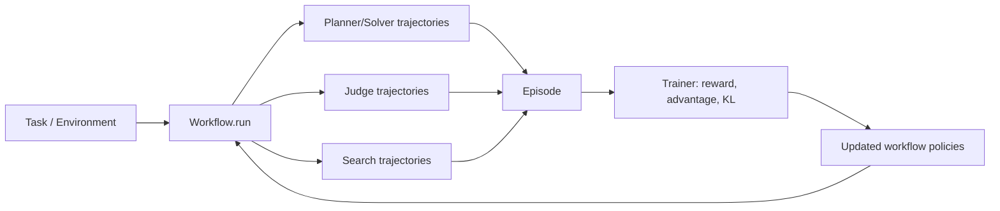

### 14.2 RULER、ART 与 rLLM 是分层互补，不是替代关系

| 框架 | 核心职责 | 学习机制 | 主要范围 |
|---|---|---|---|
| RULER | 相对评价开放式轨迹 | LLM-as-judge 把定性差异转为分数/排序 | reward 与诊断层 |
| ART | 训练工具使用 Agent | 结构化 rollout + GRPO | 单 Agent 行为优化与可靠性 |
| rLLM | 训练 Agentic workflow | 统一采集 reasoning/judgment/search 轨迹并做 RL | 系统级协调与学习 |

RULER 可以为 ART 或 rLLM 提供 reward；ART 适合聚焦一个工具 Agent；rLLM 处理更大的程序结构。选择应看训练对象，而不是按框架名称判断谁“更高级”。

### 14.3 Workflow 与 Episode

原章描述的基本接口是：继承 `Workflow`，在 `run()` 中实现 planner-executor、solver-judge 或树搜索逻辑，返回包含轨迹和奖励的 `Episode`。

这使生产控制流和训练控制流可以共享结构：同一个工具调用、条件分支与搜索节点既运行任务，也记录可学习动作。框架负责执行、重试、轨迹收集及 PPO/GRPO 基础设施。

但“同一个 production workflow 用于训练”不意味着可以直接拿真实生产副作用做在线探索。涉及付款、邮件、删改数据时应使用模拟环境、沙箱或离线 replay，并对策略版本做审批和渐进发布。

### 14.4 Solver–judge 与 24 game 案例

配套 notebook 用多个 solver 尝试 24 game：给定 $3,3,4,5$，每个数按规则组合，用四则运算得到 24；judge 选择候选。

例如合法解之一：

$$
3\times(5+4-3)=18
$$

这并不等于 24，程序 verifier 应拒绝。一个正确构造是：

$$
(5-3)\times(3\times4)=24.
$$

这个小例子说明为什么 solver 和 judge 都需要可验证反馈，而不能只依赖语言流畅度。

在 rLLM Episode 中：

- solver reward 反映表达式是否正确；
- judge reward 反映是否选中了正确解；
- 多个 trajectory 一起更新，使生成和选择策略协同改善。

### 14.5 联合训练的难点

“整个系统一起学习”也带来非平稳性：solver 变好会改变 judge 看到的候选分布，judge 更新又改变 solver 获得的下游 reward。还要处理：

- 每个组件的 credit assignment；
- 一个共享模型还是多个参数策略；
- 不同角色 reward 是否冲突；
- 联合更新是否导致协同 reward hacking；
- 某组件改善是否牺牲整体指标；
- 轨迹与模型版本怎样对应；
- 多 Agent 通信成本怎样纳入目标。

独立 hard verifier、冻结部分组件、交替训练、版本化评估集和端到端指标有助于稳定。rLLM 提供训练基础设施，不会替开发者自动定义正确目标。

### 14.6 RL 与 MCTS 怎样闭环

MCTS 的 selection、expansion、simulation、backpropagation 都产生可记录决策。rLLM 可把搜索节点视作 trajectory steps：

1. 当前搜索策略选择扩展节点；
2. LLM 生成或 refinement；
3. evaluator 给 reward；
4. search tree 回传；
5. Episode 收集这些选择与结果；
6. RL 学习“怎样搜索更有效”，而不只学习最终答案。

这把手写 UCT、prompt 或固定 branching heuristic 逐步变成可优化策略。但搜索策略必须在不同任务上泛化，否则只是记住训练分布中的 evaluator 偏好。

---

## 15. 训练时学习与测试时搜索的统一视角

二者都围绕“生成候选—评价—偏向更好候选”，差别在更新对象和收益时间：

| 维度 | RL post-training | Test-time search |
|---|---|---|
| 模型参数 | 更新 | 固定 |
| 受益范围 | 未来许多请求 | 当前请求 |
| 主要数据 | 多任务 rollouts | 当前题的候选树 |
| 主要成本 | 训练与采样 | 请求延迟和推理 token |
| 稳定机制 | ratio clipping、KL、学习率 | UCT/Thompson、预算、停止条件 |
| 失败方式 | policy collapse、reward hacking | search misguidance、judge overoptimization |
| 适用情况 | 任务重复、可积累大量反馈 | 单次高价值或难度变化大 |

可以写成双层优化：

$$
    heta^{\ast}
=
\underset{\theta}{\operatorname{argmax}}
\mathbb{E}_{q\sim\mathcal{D}}
[R(\operatorname{Search}(q;\theta,B))]
-\beta D_{KL}(\pi_\theta\Vert\pi_{ref}),
$$

其中 $B$ 是测试时预算。内层 Search 用当前策略在某题上探索，外层训练让策略在任务分布上产生更好的搜索轨迹。

实际选型：

- 请求少而每次价值高：优先 test-time search；
- 同类任务持续大量发生：收集轨迹做 post-training 更可能摊薄成本；
- 两者结合：用搜索产生高质量经验训练策略，再用更强策略减少未来所需搜索预算。

---

## 16. 容易混淆的概念与常见误区

| 易混淆点 | 正确辨析 |
|---|---|
| 运行状态改变就是 RL 学习 | RL 通常指依据 reward 更新策略参数；状态/记忆变化不等于权重更新 |
| 使用 LLM 就是 model-based RL | model-based 中的 model 指环境转移模型 |
| Trajectory 与 rollout 有严格统一定义 | 文献和框架常混用，应看是否指采样过程、单条记录或一组运行 |
| 相对评价无需奖励设计 | 仍需 rubric、group 构成、judge/verifier 和安全约束 |
| 相对排名天然客观 | 它只降低绝对校准难度，仍受 judge 偏差影响 |
| GRPO 不需要 reward model，所以没有评价器 | 它不需要 critic，但必须有 reward function、judge 或 verifier |
| DPO、GRPO 都用偏好，所以相同 | DPO 直接优化离线偏好对；GRPO 从同题 rollout group 得到相对 advantage |
| $\pi_{old}$ 与 $\pi_{ref}$ 总是同一个模型 | 前者是采样行为策略，后者是长期正则锚点，具体实现可相同 |
| KL 足以保证安全 | KL 只限制分布漂移，不验证事实、权限或危害 |
| Clipping 与 KL 重复 | clipping 限单步 ratio，KL 限相对 reference 的累计漂移 |
| GRPO 给每个 token 单独 reward | 通常整条 response 的 advantage 共享给 token，只是 ratio 按 token 算 |
| GSPO 完全不需要 KL | 原展示式省略，实际实现可加入 sequence-level KL |
| GSPO 一定优于 GRPO | 稳定性依模型、任务、reward 与实现而定；sequence ratio 也会隐藏局部问题 |
| LLM judge 可以替代程序测试 | 可确定验证的正确性应由 verifier 判断，judge 适合软质量 |
| Hybrid reward 简单相加即可 | 错误答案可能靠文风得分；hard gate 明确“正确性优先” |
| ART 示例的 8/10 证明 RL 学会算术 | 样本太小且有 exact-search tool，需要 baseline 和消融 |
| Test-time compute 会让任何小模型胜过大模型 | 前提是能生成好候选且 evaluator 能识别它们 |
| Repeated sampling 与 MCTS 相同 | 前者是独立平面候选，后者会回传评价并自适应分配后续预算 |
| Sequential refinement 就是树搜索 | 它只有一条深路径，没有宽度选择 |
| UCT 分数就是答案质量 | 它是价值估计加探索 bonus，用于选下一次试验 |
| MCTS 中的 rollout 与训练 rollout 完全相同 | 都是模拟经历，但一个用于树内估值，一个常指采集训练轨迹 |
| AB-MCTS 总是分支更多 | 它动态决定 GEN 还是 CONT，也可能把预算集中在 refinement |
| Thompson sampling 会修正坏 judge | Bayesian update 只处理不确定性，不会消除系统性偏差 |
| Swarm/MAS 工作流一起训练就会自然协作 | 联合策略非平稳且可能共同 reward hack，需要独立约束 |
| `END` 或最高 judge score 表示答案正确 | 只表示搜索/流程按自身协议结束，仍需外部验收 |

---

## 17. 从本章抽象出的设计与实验方法

### 17.1 第一步：先定义可验证任务目标

把要求拆成：

- hard constraints：正确性、安全、权限、格式、资源上限；
- soft qualities：清晰、简洁、风格、解释深度；
- process constraints：工具、步数、来源与审批。

能写 verifier 的 hard constraints 不交给 LLM judge 猜。

### 17.2 第二步：定义 trajectory schema

至少记录：task ID、policy/reference/judge 版本、prompt、消息、工具调用与观察、终止原因、token/延迟/成本、hard metrics、raw/normalized reward 和随机 seed。否则失败无法归因，旧数据也无法可靠重放。

### 17.3 第三步：构造可比较的 groups

同一 group 使用相同任务与约束，保证候选有足够多样性。检查 reward variance；全相同时跳过或重新采样。group size 增大可改善比较，但 rollout 成本线性上升。

### 17.4 第四步：奖励先 gate，再 shape

推荐顺序：

```text
安全/合法性 gate
→ correctness gate
→ 过程约束
→ 开放式质量 judge
→ 组内归一化
```

保存每个分量，不只保存最终标量，防止无法解释 reward 变化。

### 17.5 第五步：小步更新并监控漂移

监控：KL、clip fraction、reward mean/std、entropy、输出长度、工具使用、拒答/安全指标和 held-out accuracy。训练 reward 上升但独立评估下降，是 reward hacking 或过拟合信号。

### 17.6 第六步：公平评估 test-time compute

比较 one-shot、best-of-$K$、sequential refinement、MCTS/AB-MCTS 时，应对齐总调用、token 或美元预算，并使用同一独立 evaluator。报告质量—成本—延迟曲线，而非只展示最好一次。

### 17.7 第七步：按难度自适应预算

简单问题一次生成；不确定时采样；高价值且 verifier 明确时搜索。可用候选分歧、judge margin、entropy 或 hard verifier failure 触发更多预算。

### 17.8 第八步：训练与搜索闭环但保持独立验收

搜索轨迹可以训练策略，训练后的策略可以减少搜索成本；同时保留独立测试集、独立 verifier/judge 和版本化基线，避免系统只会优化自己的评价器。

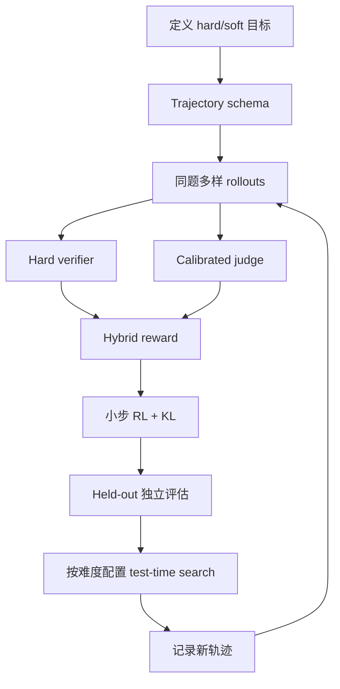

---

## 18. 可运行的最小示例：相对奖励、UCT 与预算搜索

下面的纯 Python 示例不依赖训练框架或外部模型。它验证本章三条核心机制：组内 z-score、hybrid gate，以及 UCT 怎样先探索未访问节点再依据回报利用高质量分支。

```python
# Run with: python rl_search_demo.py
from dataclasses import dataclass
from math import log, sqrt
from statistics import fmean, pstdev

def relative_advantages(rewards: list[float]) -> list[float]:
    mean = fmean(rewards)
    std = pstdev(rewards)
    if std == 0:
        return [0.0 for _ in rewards]
    return [(reward - mean) / std for reward in rewards]

def hybrid_reward(correct: bool, quality: float) -> float:
    quality = min(1.0, max(0.0, quality))
    return float(correct) * (0.7 + 0.3 * quality)

@dataclass
class Node:
    name: str
    visits: int = 0
    reward_sum: float = 0.0

    @property
    def value(self) -> float:
        return self.reward_sum / self.visits if self.visits else 0.0

    def uct(self, parent_visits: int, exploration: float = 1.0) -> float:
        if self.visits == 0:
            return float("inf")
        bonus = exploration * sqrt(log(max(1, parent_visits)) / self.visits)
        return self.value + bonus

    def update(self, reward: float) -> None:
        self.visits += 1
        self.reward_sum += reward

def run_search(budget: int = 8) -> list[Node]:
    nodes = [Node("broad"), Node("refine")]
    observed_rewards = {
        "broad": [0.4, 0.6, 0.5, 0.7],
        "refine": [0.8, 0.9, 0.85, 0.88],
    }
    offsets = {name: 0 for name in observed_rewards}

    for _ in range(budget):
        parent_visits = sum(node.visits for node in nodes) + 1
        selected = max(nodes, key=lambda node: node.uct(parent_visits))
        sequence = observed_rewards[selected.name]
        index = offsets[selected.name] % len(sequence)
        selected.update(sequence[index])
        offsets[selected.name] += 1
    return nodes

if __name__ == "__main__":
    advantages = relative_advantages([0.90, 0.60, 0.05])
    assert abs(sum(advantages)) < 1e-12
    assert advantages[0] > advantages[1] > advantages[2]

    assert hybrid_reward(False, 1.0) == 0.0
    assert hybrid_reward(True, 0.0) == 0.7
    assert hybrid_reward(True, 1.0) == 1.0

    result = run_search()
    by_name = {node.name: node for node in result}
    assert all(node.visits > 0 for node in result)
    assert by_name["refine"].visits > by_name["broad"].visits
    print([(node.name, node.visits, round(node.value, 3)) for node in result])
```

对应关系：

- `relative_advantages` 对应 GRPO/GSPO 的 group normalization；
- 全组等分返回 0，表示没有相对学习信号；
- `hybrid_reward` 让错误答案无法靠软质量得分；
- `Node.value` 是累计 reward 的均值；
- 未访问节点 UCT 为 infinity，确保探索；
- `refine` 的观测 reward 更高，探索后获得更多预算；
- 这只是固定候选的 bandit 缩影，不包含真正的 tree expansion、LLM rollout 或 backpropagation。

---

## 19. 本章知识结构与核心结论

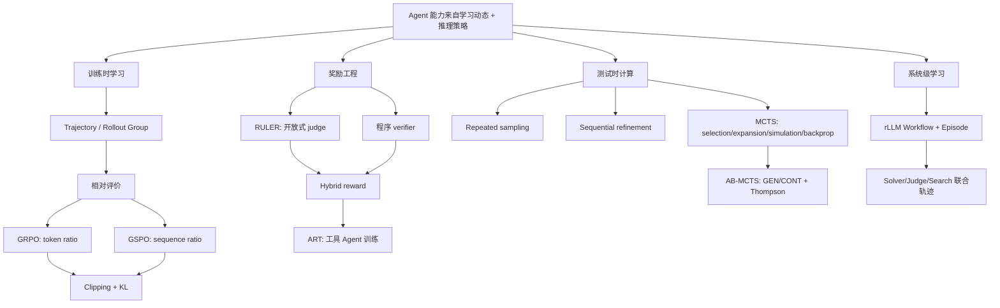

### 19.1 核心结论

1. 奖励把行动和后果连接起来，trajectory 保存过程，rollout group 提供同题替代路径。
2. 相对评价降低开放式任务的绝对分数校准难度，但不消除 judge 偏差和奖励设计责任。
3. GRPO 用同题 group baseline 产生 advantage，省去 learned critic；token-level ratio 仍可能在长序列中积累方差。
4. GSPO 用长度归一化 sequence ratio，使奖励单位和优化单位对齐，通常更适合长输出和大型/MoE 系统。
5. Clipping 限制当前更新相对 old policy 的步幅，KL 限制累计策略相对 reference 的漂移；二者不等价。
6. RULER 是相对奖励层，ART 是工具 Agent 的 rollout/训练层，rLLM 是工作流级 RL 层。
7. Hybrid reward 应让 hard correctness/safety 先 gate，再用 LLM judge 塑造软质量。
8. Countdown 案例展示了完整训练管线，但小样本结果和 exact-search tool 不能单独证明模型学会算术。
9. Test-time compute 在参数不变时，用更多候选、评价和 refinement 改善当前答案。
10. MCTS 通过 selection、expansion、simulation 和 backpropagation 在宽度与深度间分配预算；UCT 分数是决策上界，不是答案质量本身。
11. AB-MCTS 把 GEN 新分支与 CONT refinement 作为可选择动作，用 Bayesian uncertainty 自适应搜索。
12. TreeQuest 示例是接口演示；公平证明搜索收益需要等预算 baseline、外部验证和多次运行。
13. rLLM 让 planner、solver、judge 和搜索节点共同产生 Episode 并参与 RL，但系统级 credit assignment 与非平稳性更难。
14. 训练时学习改善未来策略，测试时搜索改善当前请求；二者结合可让搜索经验反哺策略，再降低未来推理预算。

### 19.2 作者解决问题的一般思路

作者沿一条连续的“信号—更新—搜索—系统”路径推导：

1. 先问 Agent 怎样知道自己做得好不好，于是引入 reward 与 trajectory；
2. 开放式质量难以绝对打分，于是改用同题多轨迹的 relative ranking；
3. 相对反馈还需要稳定参数更新，于是引入 GRPO/GSPO、clipping 与 KL；
4. 单一 judge 不适合所有维度，于是用程序 verifier 与 RULER 构造 hybrid reward；
5. 用 ART 把工具调用、轨迹、奖励和 GRPO 串成实际训练循环；
6. 发现模型参数规模不是唯一计算轴，于是把 evaluator 移到推理阶段；
7. 平面采样只宽、连续 refinement 只深，于是用 MCTS 平衡探索与利用；
8. 固定分支不适合无限语言空间，于是 AB-MCTS 动态选择 GEN 与 CONT；
9. 最后把单 Agent 学习提升为 rLLM 工作流学习，使 solver、judge 与 search 协同改进。

可迁移的一般方法是：**先定义可观察经验和真实验收，再选择评价尺度；用保守约束把反馈变成更新；对单次难题按不确定性分配搜索预算；扩展到系统前，始终保留独立 verifier、版本和成本基线。**

---

## 20. 延伸阅读

- Zhihong Shao 等，*DeepSeekMath: Pushing the Limits of Mathematical Reasoning in Open Language Models*：GRPO 的代表性来源。
- Chujie Zheng 等，*Group Sequence Policy Optimization*：GSPO 与 sequence-level importance ratio。
- Yuichi Inoue 等，*Wider or Deeper? Scaling LLM Inference-Time Compute with Adaptive Branching Tree Search*：AB-MCTS-M/A。
- ART 与 RULER 文档：工具 Agent trajectory training 和相对 LLM-elicited reward。
- TreeQuest：AB-MCTS 搜索实现。
- rLLM：面向 Agent workflow 的 post-training 和部署框架。
- 原书第 2 章：CoT、ToT、ReAct、HITL 与多 Agent 控制流基础。
- 原书后续评估章节：独立评价、可观察性和生产指标。
