> 原章：*Models Behind the Agents: Capabilities and Optimization*
> 核心问题：怎样根据 Agent 的职责、上下文、延迟、成本和部署约束选择模型架构，并通过推理时控制、缓存、PEFT 与量化把能力转化为可运行系统？

## 0. 本章定位与阅读主线

前三章先讨论 Agent 的控制结构、推理模式与学习方法，本章才回到模型本身。作者有意采用“先设计团队，再招聘成员”的顺序：只有明确工作流里需要生成、检索、过滤、推理、路由还是写文件，模型的参数量和架构才有评价依据。

全章按照四层问题推进：

1. **架构能力**：decoder-only、encoder-only、encoder–decoder、embedding、MoE 与 reasoning model 分别擅长什么。
2. **推理运行时**：KV cache、GQA、上下文工程、thinking mode 与 thinking budget 怎样影响吞吐、内存、延迟和质量。
3. **系统组合**：把快速 decoder、深度 reasoning controller、encoder verifier 与 supervisor 组合成研究写作团队。
4. **所有权与优化**：开放权重和闭源 API 怎样改变成本、合规和锁定风险；LoRA、adapter、LoRAX 与 quantization 怎样降低适配和服务成本。

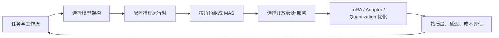

核心结论不是“每个角色必须使用不同模型”，而是：

> 模型是 Agent 系统中的一种可替换执行资源。应把能力、上下文、工具协议、延迟和单位成本与具体节点匹配，而不是用最强模型覆盖全部流程。

---

## 1. The Big Picture：按任务选择架构

### 1.1 模型选型为什么是系统问题

同一个模型在基准测试上更强，并不意味着它在每个 Agent 节点都更合适。选型至少涉及：

- 节点是理解/排序还是开放式生成；
- 输入和输出长度；
- 是否需要逐 token 低延迟；
- 是否有大量并发会话和 KV cache；
- 是否需要本地权重、微调和数据隔离；
- 工具调用格式与模型服务是否兼容；
- 错误影响和质量要求；
- 每次调用与总工作流的成本。

可以把候选模型 $m$ 在节点 $j$ 上的效用写成多目标函数：

$$
U(m,j)
=
w_q Q(m,j)
-w_l L(m,j)
-w_c C(m,j)
-w_r R(m,j)
-w_o O(m,j),
$$

其中 $Q$ 是任务质量，$L$ 是延迟，$C$ 是成本，$R$ 是风险，$O$ 是运维负担。权重来自业务，不存在脱离任务的唯一“最佳模型”。

### 1.2 原章的架构能力地图

| 类型 | 核心计算方式 | 主要能力 | Agent 中的典型角色 |
|---|---|---|---|
| Encoder-only | 对完整输入做双向表征 | 分类、NER、语义理解、重排 | verifier、retriever、filter、classifier |
| Decoder-only | 基于历史 token 自回归生成 | 对话、代码、规划、工具调用 | generator、writer、planner、worker |
| Encoder–decoder | encoder 表示输入，decoder 条件生成输出 | 翻译、摘要、基于输入的问答 | 专用转换器、受控 summarizer |
| Embedding model | 把对象映射到稠密或稀疏向量 | 相似检索、聚类、RAG | retrieval layer、memory index |
| Mixture of Experts | router 为每个 token 激活少数 FFN experts | 以稀疏计算扩展参数容量 | 大型生成/推理模型的条件专家层 |

表中的类型不是互斥产品标签：embedding model 常由 encoder 架构实现；MoE 常嵌入 decoder-only transformer；reasoning model 也通常仍是 decoder-only，只是后训练与推理协议不同。架构、训练目标、产品用途是三个层次。

### 1.3 为什么本章重点讲 decoder、encoder 和 MoE

它们分别对应当前 Agent 系统最常见的三种能力：

- decoder 负责把目标转成语言、代码和工具调用；
- encoder 负责快速理解、检索、分类与验证输入；
- MoE 在保持每 token 稀疏计算的同时扩大模型容量。

encoder–decoder 和 embedding 仍重要，但本章只作定位，不展开完整训练原理。Flash Attention T5 作为现代 encoder–decoder 的侧栏案例出现。

---

## 2. Decoder-Only：生成型 Agent 的基础

### 2.1 自回归生成是什么

decoder-only 模型没有独立 encoder 和 encoder–decoder cross-attention。给定 token 序列 $x_{1:T}$，序列概率按链式法则分解：

$$
p_\theta(x_{1:T})
=
\prod_{t=1}^{T}
p_\theta(x_t\mid x_{<t}).
$$

每一步只能依据此前 token 预测下一个 token，因此适合：

- 文本和代码生成；
- 对话；
- 计划与 reasoning trace；
- 结构化工具调用；
- supervisor routing。

模型“回看自己的输出”是上下文条件递归，不是参数在解码期间更新。早期错误也会成为后续条件，所以长生成需要验证和反馈回路。

### 2.2 Causal self-attention

原章写出的 masked attention 为：

$$
A
=
\operatorname{softmax}
\left(
\frac{QK^\top}{\sqrt{d_h}}
+M_{causal}
\right)V.
$$

- $Q=XW_Q$、$K=XW_K$、$V=XW_V$；
- $d_h$ 是每个 attention head 的维度，缩放防止 dot product 随维度过大；
- $M_{causal}$ 在未来位置填 $-\infty$，允许位置填 0；
- softmax 后未来 token 权重为 0。

对位置 $t$：

$$
M_{t,j}=
\begin{cases}
0,&j\le t,\\
-\infty,&j>t.
\end{cases}
$$

因此 token $t$ 不能读取尚未生成的 $t+1$。原图中的输出层可理解为把最后 hidden state $h_t$ 投影到 vocabulary logits：

$$
z_t=W_{out}h_t+b,
\qquad
p(x_{t+1}\mid x_{\le t})=\operatorname{softmax}(z_t).
$$

原图注把它概括为 `$y + L$`，实际常是 learned linear projection，而不是简单数值相加。

### 2.3 Prefill 与 decode

推理分两阶段：

1. **Prefill**：并行处理整个输入 prompt，计算各层 hidden states 和 K/V；计算密集。
2. **Decode**：每轮只生成一个新 token，读取历史 K/V；内存带宽和 cache 容量常成为瓶颈。

如果每轮都重新处理长度 $t$ 的全部前缀，生成 $T$ 个新 token 会重复大量历史投影。历史 token 的 $K_{1:t-1}$、$V_{1:t-1}$ 在参数和 token 不变时也不变，所以可以缓存。

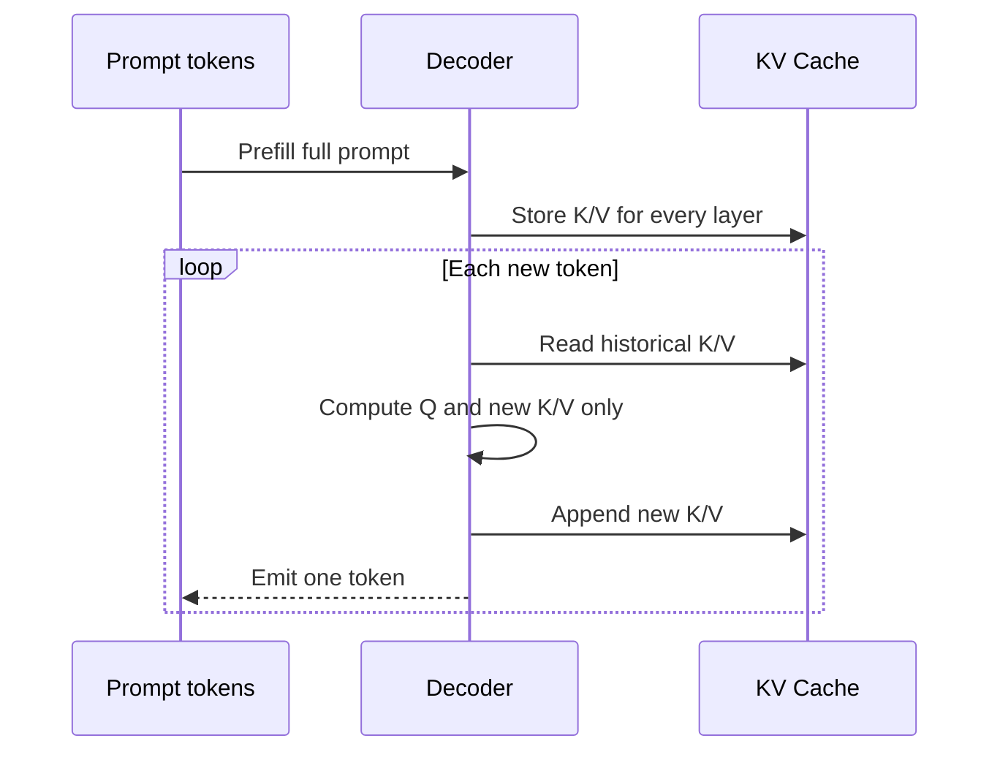

---

## 3. KV Cache 与 GQA：以显存换解码速度

### 3.1 KV cache 保存什么

每层 self-attention 都为历史 token 产生 key 和 value。cache 保存它们，使新 token 只需计算自身 $q_t,k_t,v_t$，再让 $q_t$ 与历史 keys 做 attention。

若 batch size 为 $B$、已缓存序列长度为 $S$、层数为 $L$、KV head 数为 $H_{kv}$、head dimension 为 $D_h$、每个元素 $b$ bytes，则近似内存：

$$
M_{KV}
=
B\times S\times L\times H_{kv}\times D_h\times2\times b.
$$

因子 2 对应 K 与 V。该式省略 block metadata、padding、allocator fragmentation 和其他 runtime buffer，因此是下界式容量估算。

### 3.2 一个可复算的缓存例子

假设：

- $B=1$；
- $S=32,768$；
- $L=28$；
- $H_{kv}=4$；
- $D_h=128$；
- BF16/FP16，$b=2$ bytes。

则：

$$
M_{KV}
=
32768\times28\times4\times128\times2\times2
=1,879,048,192\text{ bytes}
\approx1.75\text{ GiB}.
$$

若 16 条会话都保持相同上下文，仅 cache 理论上约：

$$
16\times1.75=28\text{ GiB}.
$$

这解释了为什么模型权重装得下，并不代表长上下文高并发也装得下。

### 3.3 MHA、MQA 与 GQA

| 机制 | Query heads | KV heads | 关系 | 特点 |
|---|---:|---:|---|---|
| MHA | $H_q$ | $H_q$ | 每个 query head 有独立 K/V | 表达力强，cache 最大 |
| MQA | $H_q$ | 1 | 所有 query heads 共用一组 K/V | cache 最小，可能损失质量 |
| GQA | $H_q$ | $H_{kv}$，且 $1<H_{kv}<H_q$ | 一组 K/V 服务若干 query heads | 质量与效率折中 |

原章以 `Qwen2.5-7B-Instruct-1M` 的配置为例：

```text
num_attention_heads = 28
num_key_value_heads = 4
```

分组比：

$$
g=\frac{H_q}{H_{kv}}=\frac{28}{4}=7.
$$

与 28 个 KV heads 的 MHA 相比，KV tensor 相关内存约降为：

$$
\frac{4}{28}=\frac17,
$$

即约 7 倍 reduction。这个倍数只针对 KV head 数主导的 cache 和读带宽，不代表总显存、总 FLOPs 或端到端延迟都提升 7 倍。

### 3.4 KV cache 带来的真实取舍

**收益：**

- 避免每步重算历史 K/V；
- 降低 decode 首尾 token 间重复工作；
- 提升交互式延迟和吞吐。

**代价：**

- cache 随 $B,S,L,H_{kv},D_h,b$ 线性增长；
- 多轮 Agent、并行工具分支和多候选搜索会复制或延长 cache；
- 长会话可能因 cache memory 而降低可并发 batch；
- 调度、分页和 cache invalidation 变成正确性问题。

KV cache 主要减少 K/V projection 的重复计算；attention score 仍需让新 query 读取历史 keys，标准全注意力下每个 decode step 对历史长度仍近似线性。

### 3.5 Prefix reuse、trimming 与 sliding window

- **beam/shared-prefix reuse**：多个候选共享相同 prompt 时复用公共 K/V，直到分叉位置。
- **prefix caching**：不同请求若 token prefix 完全一致，可复用 prefill cache。
- **trimming**：接近最大上下文时删除不再需要的旧消息。
- **sliding window**：只保留最近 $N$ 个 token 的注意范围，使 cache 有界。

删除旧 token 不是“安全且无损”的普遍操作。系统提示、任务约束、用户偏好和未完成 tool call 可能仍有语义依赖。应先结构化总结、保存外部状态，并用任务评估验证剪枝策略。

### 3.6 vLLM 的缓存管理机制

| 机制 | 做法 | 主要收益 |
|---|---|---|
| Paged Attention | 把 KV 分成固定大小 block，动态分配和回收 | 降低碎片，支持变长会话 |
| Prefix Caching | 按 token block/hash 复用相同 prefix | 省去重复 prefill |
| Chunked Prefill | 长 prompt 分块进入调度 | 防单个长请求独占算力和 cache |
| Continuous Batching | 动态混合 prefill/decode 请求 | 提高 GPU 利用率与吞吐 |
| Hash-based verification | 使用 token block hash 检查可复用前缀 | 防错配或陈旧 cache |
| Dynamic reclamation | 请求结束/抢占后立即归还 block | 保持显存池可用 |
| Disaggregated KV transfer | 在分离的 prefill/decode workers 间传输 KV | 隔离计算密集 prefill 与延迟敏感 decode |

具体特性、默认值和名称依 vLLM 版本及部署模式变化。原章说某些功能如 prefix caching 可能默认开启，不能替代检查当前版本配置和指标。

### 3.7 Context engineering 怎样影响 cache 正确性

KV cache 是**某个模型版本、token 序列和位置编码**的派生物。若在位置 $k$ 修改、插入、删除或重排 token，则通常从该点起的 cached states 都不再对应新前缀。

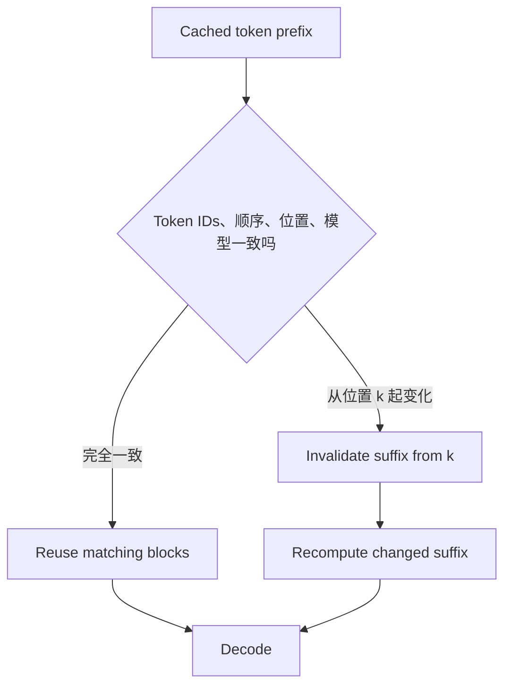

RAG 注入新文档、trim 历史或改 system prompt 时，不能盲目复用旧 cache。可采用：

- 固定静态 system prefix，单独缓存；
- 将 system、retrieval、user turns 分 segment；
- 对 token IDs、模型/adapter ID、RoPE 设置和位置做 hash；
- 只使变化后的 suffix 失效；
- 对不活跃 cache 设置 TTL；
- 对 sliding-window 模型按其位置语义管理窗口。

cache 错配会导致输出异常，但“hallucination”不是专门诊断码；还应排查 tokenizer、position IDs、adapter、模型版本和 sampling config。

### 3.8 Haystack 问题应怎样理解

原章用 Softmax 分母随上下文变长来直观解释：候选 token 增多会增加归一化竞争，若 logits 差异不大，单个权重会变小。对相同 logit $z$ 的 $n$ 个位置：

$$
\alpha_i=\frac{e^z}{ne^z}=\frac1n.
$$

但真实 attention logits 并非“每个分数大体不变”，softmax 也能在很长序列上保持尖锐。Lost-in-the-middle/haystack 还与训练长度、位置编码、内容干扰、查询—证据匹配、层间信息传递和模型数据分布有关。因此 trimming 是一种上下文治理手段，不是由 Softmax 公式直接推出的万能修复。

### 3.9 Flash Attention T5 侧栏

原章指出 encoder–decoder 在多任务、zero-shot、输入到输出映射上仍可能优于纯 decoder。Flash Attention T5（FAT5）现代化 T5：

- 使用 FlashAttention 内核避免显式保存完整 attention matrix；
- 降低 attention 的中间内存开销，支持更长 context；
- 保留 sequence-to-sequence generation；
- 可用 encoder 部分做分类 fine-tuning。

“near-linear memory behavior”主要指 attention kernel 的额外 memory 与序列长度近似线性，不表示 attention 的所有理论计算都自动变成 $O(S)$；具体复杂度取决于 kernel、mask 和架构。

---

## 4. Encoder-Only：理解、检索与验证

### 4.1 与 decoder-only 的根本区别

encoder-only 模型对整个输入做双向 self-attention：位置 $i$ 可以读取左右两侧所有 token。其 attention mask 通常不施加 causal 上三角屏蔽。

训练常采用 Masked Language Modeling（MLM）：随机遮蔽一部分 token 集合 $\mathcal{M}$，最大化：

$$
\mathcal{L}_{MLM}
=
-\sum_{i\in\mathcal{M}}
\log p_\theta(x_i\mid x_{\setminus\mathcal{M}}).
$$

模型学习的是输入表示，不是逐 token 自回归生成。它一次并行处理完整已知输入，因此适合：

- 分类和路由；
- NER 与信息抽取；
- dense embedding；
- cross-encoder reranking；
- 语义过滤和结果验证。

“不需要 KV cache”指没有长时间逐 token decode 的增量缓存需求；encoder 仍会在一次 forward 中计算 K/V，也可能使用普通 activation memory。

### 4.2 Encoder 在 Agent/RAG 中的位置

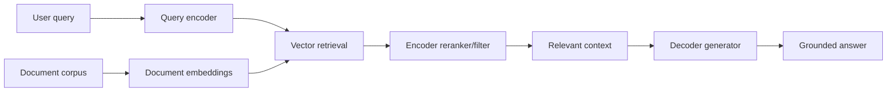

decoder 负责“说”，encoder 负责“找、分、判”。让大型 generator 扫描全部文档既昂贵又容易受无关上下文干扰；先用 encoder 缩小候选，可以降低 token、KV cache 和生成错误。

### 4.3 BERT 到现代 encoder 的演进

原章表 4-4 的代表性配置：

| 模型 | 参数 | 层/hidden/head | 位置编码 | 上下文 | FlashAttention |
|---|---:|---|---|---:|---|
| BERT base | 120M | 12/768/12 | learned absolute | 512 | 否 |
| BERT large | 350M | 24/1024/16 | learned absolute | 512 | 否 |
| NomicBERT base | 137M | 12/768/12 | RoPE | 2048 | 是 |
| ModernBERT base | 149M | 22/768/12 | RoPE | 1024→8192 | 是 |
| ModernBERT large | 395M | 28/1024/16 | RoPE | 1024→8192 | 是 |
| NeoBERT medium | 250M | 28/768/12 | RoPE | 1024→4096 | 是 |

箭头表示训练/阶段或支持长度的演进，不能脱离具体 checkpoint 配置解释。原章引用的 NeoBERT throughput 图显示其在相应测试设置中跨长度高于 ModernBERT；硬件、batch、precision 和 kernel 不同时不能直接复用该吞吐结论。

### 4.4 RoPE 是什么

Rotary Positional Embedding（RoPE）不把位置向量直接加到 token embedding，而是在每个二维子空间旋转 query/key。对第 $m$ 个位置：

$$
R(m\omega)=
\begin{bmatrix}
\cos(m\omega)&-\sin(m\omega)\\
\sin(m\omega)&\cos(m\omega)
\end{bmatrix}.
$$

令：

$$
q_m=R(m\omega)q,
\qquad
k_n=R(n\omega)k.
$$

则 dot product：

$$
q_m^\top k_n
=
q^\top R(m\omega)^\top R(n\omega)k
=
q^\top R((n-m)\omega)k.
$$

位置只通过 $n-m$ 出现，所以 attention score 自然包含相对距离。这是“把 token 排在圆上”的数学含义；实际模型在许多频率的二维通道上同时旋转，不是所有位置真的落在一个单圆上。

### 4.5 RoPE scaling 为什么能扩上下文

linear scaling 通常把位置或频率按 factor $f$ 压缩，使原来较远的位置映射到训练期见过的角度范围。例如配置：

```python
rope_scaling={"type": "linear", "factor": 4.0}
```

理论目标是把有效窗口近似扩大 4 倍。但可接受长度不是仅由配置项决定：模型训练长度、实现支持、attention pattern、position interpolation 方法与下游质量都需要验证。

原章代码以 `answerdotai/ModernBERT-base` 配 vLLM `LLM.generate`，并声称从 32k 扩到 128k；这和同章表中 ModernBERT 的 8192 长度不一致，而且 encoder-only checkpoint 未必支持 decoder-style text generation。该片段适合说明 `rope_scaling` 配置形状，不应未经模型卡和运行时兼容性验证直接执行。更保守的解释是：

$$
S_{configured}\approx fS_{base},
$$

但 $S_{quality}$ 可能显著小于 $S_{configured}$。扩窗后必须做 needle retrieval、分类/检索质量、吞吐和显存测试。

### 4.6 Encoder-only 的限制

- 不能天然长篇自回归生成；
- embedding 的 cosine similarity 不等于事实正确；
- bi-encoder 高效但 query/document 交互较弱；
- cross-encoder 精确但需逐候选成对计算；
- 长输入的全注意力仍有计算/内存代价；
- domain shift 下分类阈值和 embedding 空间会漂移。

因此 encoder 是专业理解组件，而非比 decoder “低一级”的通用替代品。

---

## 5. Mixture of Experts：用条件计算扩展容量

### 5.1 MoE 改变了 transformer 的哪一部分

典型 MoE 把 transformer block 中的 dense Feed-Forward Network（FFN）替换为 $E$ 个 experts。Router 根据 token hidden state $h$ 给出 logits：

$$
z=W_rh,
\qquad
p=\operatorname{softmax}(z).
$$

选出 top-$k$ experts 集合 $\mathcal{K}(h)$，输出：

$$
y
=
\sum_{e\in\mathcal{K}(h)}
\widetilde{p}_e E_e(h),
$$

$\widetilde p_e$ 是在选中 experts 上重新归一化的 router 权重。Attention 和其他 dense 部分仍会运行，只有 MoE 层中的专家 FFN 稀疏激活。

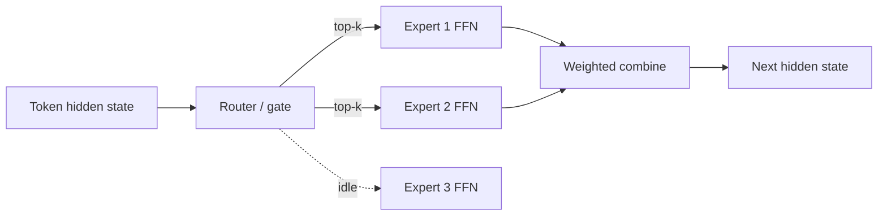

### 5.2 Total parameters 与 active parameters

设共有 $E$ 个等规模 experts，每 token 激活 $k$ 个。若忽略 shared/dense 层，专家部分 active fraction 约：

$$
\rho=\frac{k}{E}.
$$

例如 64 experts、top-2 routing：

$$
\rho=\frac{2}{64}=3.125\%.
$$

这使模型拥有很大的参数容量，而每 token 只支付少量 expert FLOPs。但所有权重通常仍要驻留 GPU/CPU 集群，通信、router、attention 和内存带宽成本不会按同一比例缩小。因此“trillion parameter MoE 运行成本等同小 dense model”是方向性直觉，不是只凭 $k/E$ 就能保证的等式。

### 5.3 三类路由方式

| 路由 | 机制 | 主要目的/代价 |
|---|---|---|
| Top-k routing | 每 token 选择最高分的 $k$ 个 experts | 简单有效，但热门 expert 可能拥塞 |
| Noisy gating | router logits 加噪声 | 鼓励探索和均衡，增加随机性 |
| Expert-choice | expert 从 token 中选择自己处理的部分 | 改善容量利用，改变 token 分配语义 |

训练常加 load-balancing auxiliary loss，使 expert 使用更均衡，并设 capacity factor。若一个 expert 接收过多 token，可能排队、drop token 或路由到备选 expert。

### 5.4 MoE 与 Multi-Agent System 不同

- MoE expert 是模型内部 FFN 子网络，通常每 token 自动路由；
- MAS Agent 是系统级角色，有独立 prompt、状态、工具和控制边；
- MoE router 不等于 LangGraph supervisor；
- 一个 MoE decoder 可以作为一个 MAS worker，二者可嵌套。

“专家像团队成员”是帮助理解 conditional computation 的比喻，不能据此把模型内部 expert 解释成拥有可审计自然语言职责的 Agent。

### 5.5 MoE 的优势与限制

优势：更大总容量、每 token 稀疏计算、潜在任务/模式 specialization。

限制：

- 所有 expert 参数的存储与加载压力；
- 跨设备 all-to-all 通信；
- router imbalance 与 expert collapse；
- batching 时不同 token 路由不规则；
- fine-tuning 时 expert/router 稳定性；
- “某 expert 专门懂法律”通常不是可靠、可命名契约。

---

## 6. Reasoning Models：差别主要在行为优化和推理循环

### 6.1 Reasoning model 不是新的基本 transformer 类型

原章把 reasoning model 称为“thinker”，但明确指出它通常仍是 decoder-based。区别主要来自：

- 针对分步推理、规划和验证的 post-training；
- reasoning tokens 或隐藏 scratchpad 协议；
- tool-augmented reflection；
- inference-time search、自一致性或多候选选择；
- 可控制 thinking mode/budget 的 serving interface。

所以“decoder-only”描述网络结构，“reasoning model”描述训练和推理行为。Qwen3 或 DeepSeek-R1 可以同时属于两类。

### 6.2 为什么更慢但可能更可靠

普通 fast path 近似一次生成；reasoning path 先生成中间计算，再输出答案。若 reasoning token 数为 $T_r$、最终答案 token 数为 $T_a$，总生成至少为：

$$
T_{gen}=T_r+T_a.
$$

成本和延迟一般随 $T_{gen}$ 增加，且更长 cache 还降低并发。收益是模型有更多测试时计算来分解、检查或探索。它适合数学、代码、复杂规划、工具选择和高风险验证，不适合每个问候或已确定的格式化节点。

推理更长也不保证正确：模型可能反复确认错误前提、产生冗长 rationalization，或在预算耗尽时没有形成答案。

### 6.3 Thinking mode（例 4-1 与 4-2）

Transformers chat template 示例：

```python
tokenizer.apply_chat_template(
    messages,
    tokenize=False,
    add_generation_prompt=True,
    enable_thinking=True,
)
```

OpenAI-compatible vLLM 示例通过 provider-specific `extra_body`：

```python
extra_body={
    "top_k": 20,
    "chat_template_kwargs": {"enable_thinking": False},
}
```

开关并非 OpenAI API 的跨模型标准字段。是否支持、默认值、reasoning trace 是否可见以及 token 怎样计费，都取决于模型 chat template、server 和 provider。只在 prompt 里说“不要思考”是软指令，不能等同于 server 确实关闭 reasoning mode。

原章说禁用 thinking 后很多模型仍保留 hidden trace structure；这应按具体模型理解，不能假定所有服务会生成隐藏 CoT。工程上只依赖公开响应 schema，不依赖不可观测内部过程。

### 6.4 怎样选择 mode

| 任务 | 建议 | 原因 |
|---|---|---|
| 简单分类、抽取、格式转换 | fast/non-thinking 或 encoder | 低不确定性，额外 token 收益小 |
| 已有确定计划后的机械执行 | fast mode | 控制流已验证 |
| 多工具规划与路由 | thinking | 需要比较依赖和风险 |
| 数学、代码、复杂约束 | thinking + verifier | 分解有价值，但仍需客观检查 |
| 高影响动作 | thinking + HITL/规则 | 深思不能替代授权 |

更好的策略是按难度或失败信号升级：先走便宜路径，置信度低、verifier 失败或任务复杂时再切 thinker。

### 6.5 Thinking budget（例 4-3）

原章区分：

- `thinking_budget=1024`：reasoning phase 最多允许的 token；
- `max_new_tokens=32768`：整个生成的上限；
- hidden reasoning token 即使不显示，也消耗 token、时间和 cache。

若总输出上限为 $B_{total}$，thinking 实际使用 $B_r$，插入边界文本占 $B_h$，则 final answer 可用预算至多：

$$
B_a
=
\max(0,B_{total}-B_r-B_h).
$$

因此不能把 `thinking_budget` 和 `max_new_tokens` 当成两个彼此独立、可全部用满的额度。

### 6.6 原代码的两阶段生成逻辑

示例检查 tokenizer-specific token IDs：

- `151668` 被解释为 `</think>`；
- 若尚未出现结束标记且 reasoning budget 达到，则插入 handoff text 与 `</think>`；
- 拼接当前 generated IDs；
- 第二次 `model.generate` 继续生成最终答案；
- 剩余额度按当前 `input_ids.size(-1)` 计算。

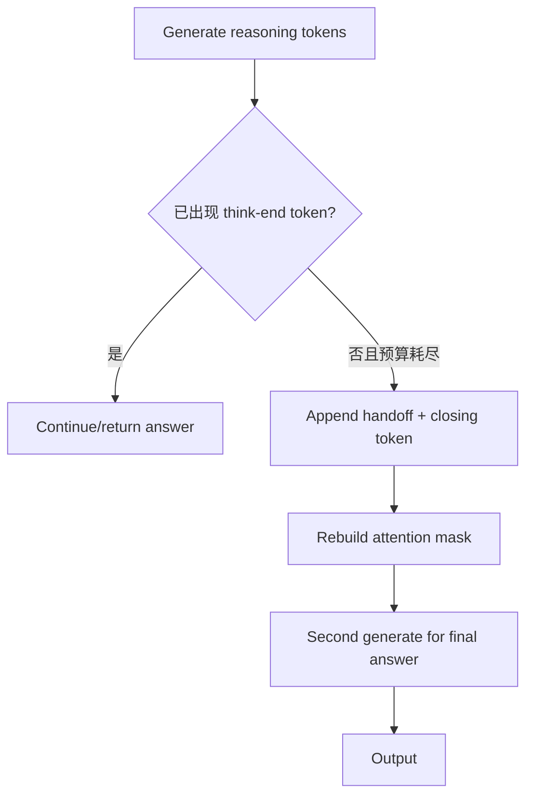

### 6.7 这段 budget 代码的边界

1. Special token ID 与 tokenizer/checkpoint 强绑定，升级模型后必须从 tokenizer 查询，不能硬编码通用化。
2. 插入的自然语言 closing phrase 会进入模型上下文并影响答案。
3. `max_new_tokens=input_length+max_new_tokens-input_ids.size(-1)` 可能为负，原章也明确警告；调用前应 `max(0,remaining)` 并处理零预算。
4. 第二次生成可能重复或破坏 cache，取决于 API 是否支持传 `past_key_values`。
5. 手工解析 `<think>` 格式不适用于所有 reasoning model/provider。
6. “1024 以上通常有效”是经验建议，不是跨任务最佳值。

生产上更适合使用模型/服务原生 reasoning budget API，并记录 reasoning tokens、answer tokens、time-to-first-token、total latency、正确率和工具成功率，按节点调参。

### 6.8 Every Token Counts

一次 Agent 请求的成本不只有最终答案：

$$
C_{workflow}
=
\sum_j
\left(
T^{input}_j p^{input}_j
+T^{reason}_j p^{reason}_j
+T^{answer}_j p^{output}_j
\right)
+C_{tools}+C_{infra}.
$$

多 Agent handoff 会重复上下文，Tree-of-Thought/MCTS 会复制候选，tool observation 也占后续输入。优化 thinking budget 不能只看单次模型账单，而要看完整工作流的成功任务成本。

---

## 7. Putting It All Together：设计一个模型专家团队

### 7.1 为什么按节点混用模型

若所有节点都调用最大 reasoning model：

- 搜索、写提纲等简单步骤支付不必要的 reasoning token；
- 整体延迟由串行慢节点累加；
- KV cache 与并发成本增加；
- 一个模型兼任生成和验证，错误相关性更高。

作者因此把“模型选型”落到一个研究写作 MAS：高频、低风险节点使用 fast decoder；关键证据分析由 thinker 驱动，并用 encoder 做语义过滤；supervisor 使用另一个高能力模型路由和判断完成。

### 7.2 原章团队配置

| 角色 | 模型/架构 | 任务 | 工具 |
|---|---|---|---|
| Semantic research | Qwen3-32B fast decoder | Exa neural search 和 highlights | `exa.search_and_contents` |
| Patent research | Qwen3-32B fast decoder | 查近期专利 | Google Serper/API wrapper |
| Analyst | Qwen3-235B-A22B Thinking controller + ModernBERT encoder | 分层分析、语义过滤、extractive summary | `semantic_filter_tool` |
| Note taker | Qwen3-32B fast decoder | 创建提纲 | `create_outline`, `read_document` |
| Writer | Qwen3-32B fast decoder | 起草、编辑和保存 | `write_document`, `edit_document`, `read_document` |
| Supervisor | GPT-4.1 deliberate LLM | 路由 worker、判断结束 | Agents as tools/graph nodes |

原章代码的 `specs` 还包括 `search` 节点及 Tavily 工具，表 4-5 没单列它；图和实现 roster 因抽象层次不同存在小差异。实际文档应从单一配置源生成，避免表、图、代码漂移。

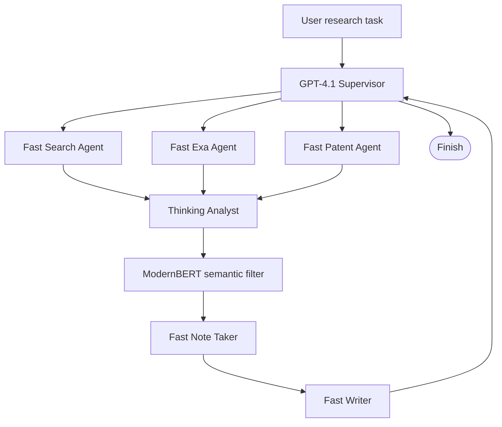

### 7.3 例 4-4：角色 prompt 是能力契约

原章定义 Exa researcher、patent researcher、note taker、writer 和 analyst prompts。最关键的是 analyst：

- 必须调用 `semantic_filter_tool` **恰好一次**；
- 输入 `query` 和 teammates 收集的 raw `documents`；
- 不直接回答用户；
- 不做自由写作；
- 只把 tool result 返回 supervisor。

这把 analyst 限定为受控中间节点，而不是第二个 writer。角色 prompt 解决“应该做什么”，工具白名单解决“能够做什么”，graph edge 解决“做完交给谁”。三层都需要。

“must call exactly once”仅靠自然语言不是硬保证。生产实现可用状态计数和路由验证：

$$
\operatorname{valid}(trajectory)
=
\mathbb{1}
\left[
\#\mathrm{semantic\_filter\_tool}=1
\right].
$$

若计数不为 1，应重试、失败或由程序直接调用，而不是接受模型声称已经遵守。

### 7.4 例 4-5：为不同角色配置不同推理模式

`fast_llm`：

- Qwen3-32B fast endpoint；
- `temperature=0`；
- `enable_thinking=False`；
- 用于搜索、专利、提纲和写作等频繁步骤。

`thinker_llm`：

- Qwen3-235B-A22B Thinking；
- thinking 开启；
- token budget 为 1536；
- 用于 analyst 的高影响证据综合。

`supervisor_llm`：GPT-4.1、temperature 0，用于路由。

这体现**能力路由（capability routing）**：不是只按 prompt 内容选择模型，也按节点风险、调用频率和所需推理深度配置 endpoint。

provider 的 `extra_body` 字段可能不同；即便都是 OpenAI-compatible API，也只说明请求外形相近，不保证 thinking、top-k、usage accounting 和 tool calling 语义一致。应在 adapter layer 统一能力检测和响应解析。

### 7.5 例 4-6：通用 ReAct worker helper

`make_react_worker_node` 接收模型、名称、工具、prompt 和返回节点：

1. `create_react_agent` 构造局部 LLM↔tool 循环；
2. worker 读取共享 `State`；
3. `agent.invoke(state)` 执行；
4. 取最后一条消息 content；
5. 以带 worker name 的消息写回父状态；
6. `Command(goto="supervisor")` 归还控制权。

这和第 2 章的 helper 相同，变化的是传入的模型。由此可见，Agent abstraction 把**控制协议**与**模型实现**分离：同一个 worker factory 可以承载 fast decoder 或 reasoning model。

只传最后一条文本会丢失结构化 tool evidence、scores 和 errors。更可靠的 handoff 可定义：

```json
{
  "status": "complete",
  "findings": [],
  "source_ids": [],
  "relevance_scores": [],
  "open_questions": []
}
```

### 7.6 例 4-7：用数据配置批量创建 Agent

`specs` 为每个节点绑定：

$$
(name, tools, prompt, llm).
$$

字典推导统一调用 helper，避免每个 worker 重复样板。它也是模型替换点：例如 analyst 的 `llm` 从 thinker 换为 fast model，只改配置。

配置驱动仍要验证：

- 工具是否与角色匹配；
- 模型是否支持 tool calling 和所需 schema；
- 角色是否获得不必要的副作用权限；
- context window 是否容纳其输入；
- provider endpoint 是否支持指定 thinking 参数；
- 模型/adapter/tokenizer 版本是否一致。

### 7.7 Analyst 的双层复核链

原章运行输出显示 ModernBERT 对某段内容给 relevance score 0.956。数据流是：

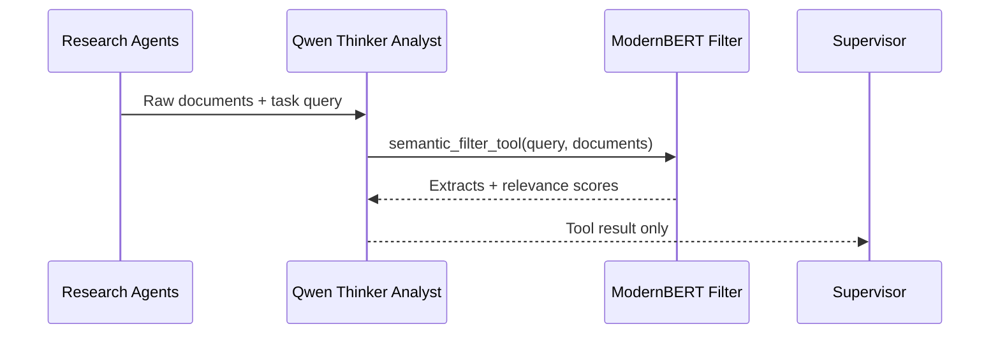

0.956 是该 encoder/tool 定义下的相关性分数，不是“95.6% 事实正确概率”，也不证明无 hallucination。Encoder 能检查 query—document semantic relevance；它通常不能独立验证网页真实性、引用是否支持 claim、时效性或推理结论。

所谓 self-auditing 更准确地说是**异构交叉检查**：generator/reasoner 与 encoder scorer 使用不同模型和目标，减少部分相关错误。但仍需来源验证、claim–evidence alignment 和业务验收。

### 7.8 这个团队怎样节省成本

若 fast 模型单次平均成本为 $c_f$，thinker 为 $c_t$，全 thinker 方案有 $n$ 个节点，则：

$$
C_{all}=nc_t.
$$

若只有 $k$ 个关键节点用 thinker：

$$
C_{routed}=kc_t+(n-k)c_f+C_{encoder}.
$$

只要：

$$
(n-k)(c_t-c_f)>C_{encoder}+C_{routing},
$$

混合方案在直接成本上更省。还需比较质量和失败重试；便宜模型若导致大量返工，单次 token 便宜不等于成功任务成本低。

### 7.9 MAS 示例的局限

原章有意省略工具实现、graph wiring 和 supervisor routing，所以 4-4 至 4-7 不是完整可运行应用。还应补充：

- thread/checkpoint 与终止预算；
- 文件写入沙箱和 HITL；
- source provenance；
- analyst 输入超长时的分块策略；
- encoder threshold 校准；
- 节点级 latency/cost/quality tracing；
- 模型 endpoint 故障降级；
- prompt injection 隔离。

---

## 8. Open vs. Closed：模型选择也是组织战略

### 8.1 先澄清“开放”的含义

日常语言常把 open-source model、open-weight model 混用。严格说：

- **open weights**：可下载参数，但训练数据、训练代码或许可证未必完全开放；
- **open source**：通常要求源码与许可证满足开放定义，AI 模型是否完整满足仍有争议；
- **closed API**：权重和运行时由 vendor 控制，只暴露服务接口；
- **managed open model**：模型权重开放，但实际由第三方云托管。

本章沿用“open-source”表述，做战略决策时应逐项审查许可证、权重、代码、数据披露与再分发权。

### 8.2 六个决策维度

#### 创新与部署速度

开放生态能快速吸收 Hugging Face、vLLM、Ollama 等工具和新架构；闭源能力按 vendor 发布节奏变化。但启动速度可能相反：闭源 API 和 managed open endpoint 几分钟即可使用，自托管需要容量、监控和安全工程。

应区分：

- ecosystem innovation velocity；
- 团队 application iteration velocity；
- infrastructure deployment velocity。

#### Accessibility 与可见性

开放权重便于离线 benchmark、检查配置和本地部署；不一定公开训练数据，也不天然可审计。闭源 API 限制 rate、region、版本与内部可见性，但降低基础设施门槛。

#### Customization 与 ownership

闭源 vendor 可能提供 fine-tuning、DPO/RL 或 custom model 服务，但最终权重、runtime 和导出权仍由 vendor 决定。开放权重允许本地 LoRA、量化、版本 pinning 和迁移。

作者的概括很准确：闭源可“借用灵活性”，开放权重才更可能“拥有改进成果”。前提是许可证允许相应用途且团队保留训练数据、adapter 与评估资产。

#### Performance

闭源 frontier models 常受益于专有数据和大规模训练；Qwen、Kimi 等开放/开放权重模型缩小差距。排行榜不是 Agent 节点表现：tool calling、JSON adherence、目标语言、context recall、延迟和 quantized quality 都要在自己的 workflow 上测。

#### Cost

原章给出截至 2026 年初的示例性 token 价格：某些闭源高端模型可达每百万 input \$150、output \$600，而低价 managed open model 约 input \$0.3、output \$3。价格高度时效、受缓存/批处理/region/tier 影响，只能说明数量级差异，不能当永久报价。

闭源 API 成本近似：

$$
C_{API}
=
N_{in}p_{in}
+N_{out}p_{out}
+C_{tools}.
$$

自托管总拥有成本：

$$
C_{self}
=
C_{GPU}+C_{idle}+C_{ops}+C_{storage}+C_{network}+C_{security}+C_{people}.
$$

假设固定月成本 $F$，自托管每百万 token 可变成本 $v$，API 单位成本 $p$，且 $p>v$，粗略 break-even volume：

$$
V^{\ast}=\frac{F}{p-v}.
$$

流量稳定、利用率高时自托管更可能便宜；早期低流量或突发负载下，API 避免 idle GPU 和专业团队成本，可能更优。

#### Data security 与 compliance

自托管/私有云可控制数据边界、密钥、日志、版本与 on-prem encryption，但责任也全部转移给组织。Managed service 的 SOC 2、ISO 27001 等认证可简化采购，不代表自动满足具体数据用途。

任何 managed route 都要核查：DPA、retention、是否用于训练、推理 region、subprocessors、访问审计、删除机制、密钥、incident response 和跨境要求。

### 8.3 Hybrid strategy 为什么常见

作者建议：早期用 managed API 快速形成 workflow；需求稳定、规模增长或监管要求提高后，把适合的 open models 自托管。

更一般的混合架构：

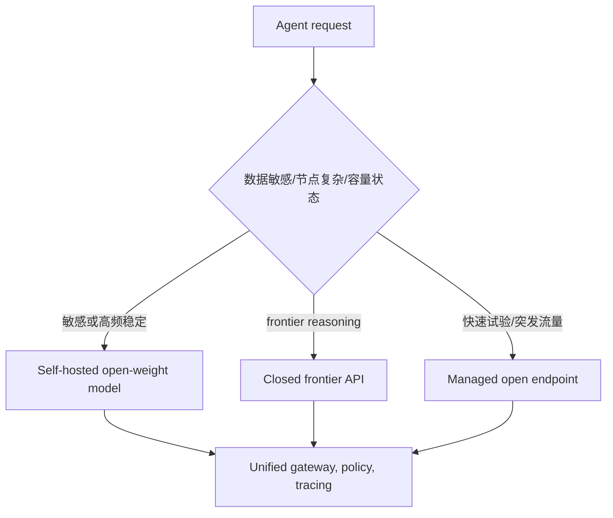

混合策略不是无代价：要维护多个 tokenizer、prompt template、tool schema、质量基线和 fallback，数据也必须在路由前分类。用统一 gateway 和 capability registry 隔离 provider 差异。

### 8.4 一个决策矩阵

| 条件 | 更偏 closed API | 更偏 managed open | 更偏 self-host open |
|---|---|---|---|
| 上线速度 | 强 | 强 | 弱 |
| Frontier reasoning | 常较强 | 取决于 provider | 取决于可部署模型 |
| 权重控制 | 无 | 模型可得但 runtime 不控 | 强 |
| 低流量 TCO | 常有利 | 常有利 | idle 成本高 |
| 高稳定流量 TCO | token 单价可能高 | 中间 | 利用率高时有利 |
| 私有部署 | 通常受限 | provider 决定 | 强 |
| 深度优化/量化 | 弱 | 部分 | 强 |
| 运维负担 | 低 | 中低 | 高 |
| Vendor lock-in | 高 | 中 | 较低但有硬件/框架锁定 |

---

## 9. Optimizing Open Models：为什么需要 PEFT

### 9.1 Full fine-tuning 的内存压力

模型有 $P$ 个参数、参数精度 $b_w$ bytes。仅权重内存约：

$$
M_{weights}=Pb_w.
$$

训练还要保存 gradients、optimizer states、master weights 和 activations。以 Adam、混合精度为例，每参数状态可能包括 FP16/BF16 weight、gradient、FP32 master weight、一阶矩和二阶矩，粗略可达十几 bytes/parameter，远大于推理权重。

原章说每个 trainable parameter 约有“四倍 memory overhead”，这是简化 rule of thumb；实际倍数由 optimizer、precision、ZeRO/FSDP、gradient checkpointing 和 quantization 决定。

PEFT（Parameter-Efficient Fine-Tuning）冻结绝大多数 base weights，只训练很小的增量参数，降低：

- gradient/optimizer memory；
- checkpoint size；
- 每个任务的存储；
- 多领域切换成本。

Quantization 严格说主要是数值表示/压缩技术，不等同于 PEFT；它可以与 LoRA 结合成 QLoRA 式训练，也可单独用于 inference。

---

## 10. LoRA 与 Adapters：冻结底座，学习小增量

### 10.1 LoRA 的核心公式

对线性层：

$$
y=Wx,
\qquad
W\in\mathbb{R}^{d_{out}\times d_{in}}.
$$

Full fine-tuning 学整个 $\Delta W$。LoRA 假设任务更新具有较低 intrinsic rank，用两个小矩阵分解：

$$
W'=W+\Delta W,
$$

$$
\Delta W
=
\frac{\alpha}{r}BA,
$$

其中：

$$
A\in\mathbb{R}^{r\times d_{in}},
\qquad
B\in\mathbb{R}^{d_{out}\times r},
\qquad
r\ll\min(d_{in},d_{out}).
$$

base $W$ 冻结，只训练 $A,B$。原线性层参数量：

$$
P_{full}=d_{out}d_{in}.
$$

LoRA 参数量：

$$
P_{LoRA}=r(d_{in}+d_{out}).
$$

### 10.2 一个 LoRA 参数例

若 $d_{in}=d_{out}=4096,r=16$：

$$
P_{full}=4096^2=16,777,216,
$$

$$
P_{LoRA}=16(4096+4096)=131,072.
$$

比例：

$$
\frac{P_{LoRA}}{P_{full}}
=
0.0078125
=0.78125\%.
$$

这是单个方阵层的比例；实际模型要看 LoRA 注入哪些 Q/K/V/O 和 FFN 层、各层维度与是否训练 bias。

### 10.3 LoRA 为什么可能有效

许多下游任务不需要重写全部知识，只需调整少数行为方向。低秩矩阵把更新限制在 $r$ 维子空间，既是参数压缩，也是正则化。

前提与局限：

- 任务增量确实能由较低 rank 近似；
- rank 太小会欠拟合，太大减少效率优势；
- 数据质量比 adapter 大小更重要；
- 领域知识大幅改变时，LoRA 不一定接近 full fine-tuning；
- 冻结 base 降低 catastrophic forgetting 风险，但 adapter 仍可改变输出行为和安全性；
- 多 adapter 组合可能冲突。

### 10.4 Merge 与 dynamic application

部署时可：

- **merge**：预先计算 $W'=W+\Delta W$，单 adapter 推理无额外低秩 matmul，但产生一份合并权重；
- **dynamic**：保留共享 base，请求时选择 adapter，支持多租户/多任务，但 runtime 需加载、缓存和批处理 adapter。

merge 后可在数学上恢复 base+adapter，前提是保留原权重和 adapter；对量化 merge 还要注意反量化、重重量化和误差。

### 10.5 Adapter modules 与 LoRA 的差别

传统 adapter 在 transformer block 中插入小 bottleneck network，例如：

$$
h'=h+W_{up}\,\sigma(W_{down}h),
$$

$W_{down}:d\rightarrow r$，$W_{up}:r\rightarrow d$。它改变 computation graph；LoRA 通常在已有线性层权重旁增加低秩更新。

| 维度 | LoRA | Bottleneck adapter |
|---|---|---|
| 插入位置 | 现有 linear weights 的增量 | block 间/内部新增模块 |
| 是否可直接 merge | 通常可以 | 通常作为模块保留 |
| 推理开销 | dynamic 时有少量，merge 后近零 | 每层增加额外运算 |
| 模块切换 | 容易 | 容易 |
| 表达方式 | 低秩 weight update | 非线性 bottleneck transformation |

二者都冻结 base、隔离任务参数，便于一个 backbone 服务多个领域。

---

## 11. LoRAX：共享一个底座服务许多 LoRA

### 11.1 为什么普通部署会浪费 GPU

若为 $N$ 个 task adapters 各启动一份完整 base model，权重内存约：

$$
M_{naive}\approx N M_{base}+\sum_i M_{adapter_i}.
$$

共享 base 的 multi-adapter serving：

$$
M_{shared}\approx M_{base}+\sum_i M_{cached\ adapter_i}+M_{runtime}.
$$

由于 $M_{adapter}\ll M_{base}$，节省主要来自不复制底座。

### 11.2 原章介绍的三项机制

**Dynamic adapter loading**
请求到来时按 adapter ID 加载，不必全部常驻 GPU。

**Tiered weight caching**
在 GPU、CPU、disk 间分层缓存；热门 adapter 留在快层，冷 adapter 下沉，避免 OOM。

**Continuous multi-adapter batching**
将不同 adapter 的请求放在共享 base batch 中调度，尽量保持公平和吞吐。

LoRAX 可在合适硬件、模型和 adapter 大小下服务上百个 specialization；“over a hundred”是系统能力案例，不是任意模型/延迟 SLO 下的保证。

### 11.3 Agent 场景

同一个 base decoder 可以动态挂载：

- customer-support adapter；
- legal-analysis adapter；
- code-generation adapter；
- 不同语言或租户 adapter。

Agent router 选择 adapter ID，而不是启动新模型。这比为每个 Agent 独占 GPU 更经济，但要管理：

- base/adapter compatibility；
- tenant authorization；
- adapter cache miss latency；
- batching 公平；
- adapter provenance 和评估版本；
- 恶意/损坏 adapter 隔离。

---

## 12. Quantization：降低数值精度以换取容量和速度

### 12.1 基本思想

Quantization 用较低 bit-width 表示 weights，常见 FP16/BF16→INT8/FP8/INT4。若只按原始 bit 计算，$P$ 个权重的理论内存：

$$
M_{raw}=P\frac{b}{8}\text{ bytes}.
$$

对 7B 参数：

| 精度 | 理论权重内存 |
|---|---:|
| FP32 | $7\times10^9\times4\approx28$ GB |
| FP16/BF16 | $\approx14$ GB |
| INT8 | $\approx7$ GB |
| INT4 | $\approx3.5$ GB |

真实 checkpoint/runtime 还包含 scale、zero point、group metadata、未量化层和对齐，显存不会恰好等于表中数值。

### 12.2 一个线性量化公式

对范围 $[x_{min},x_{max}]$ 映射到整数区间 $[q_{min},q_{max}]$：

$$
s=\frac{x_{max}-x_{min}}{q_{max}-q_{min}},
$$

$$
z=\operatorname{round}\left(q_{min}-\frac{x_{min}}s\right),
$$

$$
q=\operatorname{clip}
\left(
\operatorname{round}\left(\frac{x}{s}\right)+z,
q_{min},q_{max}
\right).
$$

反量化近似：

$$
\widehat{x}=s(q-z).
$$

误差 $x-\widehat{x}$ 来自有限离散级别。Per-channel/group-wise quantization 为不同通道/组使用独立 scale，通常比全 tensor 一个 scale 更准确，但 metadata 和 kernel 更复杂。

### 12.3 Quantization 是否一定更快

不一定。收益取决于：

- GPU/CPU 是否有对应低精度 kernel；
- workload 是 memory-bound 还是 compute-bound；
- dequantization overhead；
- batch size 和序列长度；
- weights、activations、KV cache 哪些被量化；
- framework 是否能 fuse 操作。

4-bit weight-only 往往显著省显存，使更大模型或更多并发可运行；端到端 tokens/s 是否上升必须 benchmark。Quantization 还可能影响 tool-call JSON、数学、长上下文和小概率 token，不应只测 perplexity。

### 12.4 PTQ、QAT 与 QLoRA

- **Post-Training Quantization（PTQ）**：训练后直接校准/量化，成本低，可能损失质量。
- **Quantization-Aware Training（QAT）**：训练时模拟量化误差，质量更稳，训练更复杂。
- **QLoRA**：以量化 base 做前向/反向存储，只训练高精度 LoRA adapter，进一步降低 fine-tuning memory。

原章把 bitsandbytes、Unsloth 作为简化量化与训练的工具，并指出许多模型提供官方 quantized variants。官方变体仍需检查格式、group size、校准数据、许可证和 serving engine compatibility。

### 12.5 LoRA、adapter 与 quantization 怎样组合

常见开放模型流水线：

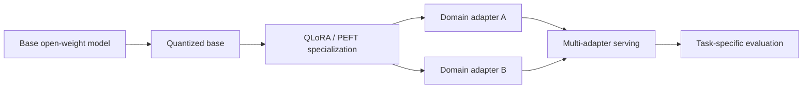

- quantized base 降低权重/训练内存；
- LoRA/adapter 保存任务增量；
- LoRAX 类 runtime 共享底座、动态选择 specialization；
- 每个 adapter × quantization × base 版本组合都要单独验证。

顺序和 merge 需谨慎：在高精度 base 上 merge LoRA 后再量化，与量化 base 上动态应用 adapter，误差和 runtime 行为可能不同。

---

## 13. 容易混淆的概念与常见误区

| 易混淆点 | 正确辨析 |
|---|---|
| 最强模型适合所有 Agent 节点 | 频率、风险、输入输出和延迟不同，应按节点路由能力 |
| Embedding model 是与 encoder 完全平行的架构 | 它是用途类别，常由 encoder/dual encoder 实现 |
| Reasoning model 是新的 transformer 基本架构 | 多数仍是 decoder-only，差异主要在训练和推理协议 |
| Autoregressive 意味模型在线学习自己的输出 | 它只把先前 token 当条件，参数通常不更新 |
| KV cache 保存“对话记忆”语义 | 它保存特定 token prefix 的 attention K/V，是运行时张量，不是长期记忆 |
| KV cache 让 attention 变成常数复杂度 | 它省历史 K/V 投影；新 query 仍需读取历史 keys/values |
| GQA 的 7× reduction 是端到端 7× 加速 | 只近似描述 KV head 相关 cache/带宽缩减 |
| 修改 prompt 后仍可直接复用 cache | token、顺序、位置或模型改变会使相应 suffix 失效 |
| 长上下文失效只因 Softmax 分母变大 | 还涉及位置、训练分布、干扰和检索等多因素 |
| Sliding window 可安全删除所有旧消息 | 旧约束可能仍重要，需结构化状态和任务验证 |
| Encoder 不计算 K/V | 它在 forward 中计算，但不需要自回归跨步 KV cache |
| RoPE 自动保证任意长度外推 | scaling 只是配置；可用质量常小于声明窗口 |
| 原 ModernBERT 代码证明可 128k 生成 | checkpoint 长度与 encoder/decoder API 需核实，示例有内部不一致 |
| MoE expert 就是一个 Agent | expert 是模型内部 FFN；Agent 有系统级状态、工具和协议 |
| MoE 只激活 3% 参数，所以总成本只剩 3% | attention、shared layers、存储、通信和 routing 仍有成本 |
| Thinking mode 开启就保证正确 | 只是增加推理计算，仍需 verifier、工具和 HITL |
| Prompt 说“不思考”等于 server 关闭 thinking | 软指令与 chat-template/runtime 开关不同 |
| 隐藏 reasoning token 不计费 | 它仍占生成、cache、延迟，计费取决于 provider |
| `max_new_tokens` 与 thinking budget 可分别用满 | reasoning 通常占总生成额度，应留 final-answer budget |
| Encoder score 0.956 是 95.6% 事实正确 | 通常只是相关性/模型分数，需校准且不验证事实 |
| 多模型组合天然 self-auditing | 异构检查降低部分相关错误，不替代独立证据与验收 |
| Open-source 等于无许可证限制 | 应区分 open weights、代码、训练数据和商用条款 |
| 自托管一定更便宜更安全 | 取决于利用率和团队能力，安全责任也转移给自己 |
| Vendor fine-tuning 等于拥有模型 | 仍无法控制/导出权重、runtime 和版本策略 |
| PEFT 包含所有量化 | PEFT 是少量参数适配；量化是数值压缩，可与 PEFT 组合 |
| LoRA 完全消除遗忘和风险 | 冻结 base 降低权重覆盖，但 adapter 仍会改变行为 |
| Adapter 参数只占 0.8%，训练内存也严格只占 0.8% | activations、base forward、optimizer 与 runtime buffer 仍占内存 |
| INT4 必然比 FP16 快 4× | 理论权重体积约 1/4，速度依 kernel、硬件和 workload |
| 量化只影响语言流畅度 | 也可能影响工具参数、数学、长上下文与置信排序 |

---

## 14. 从本章抽象出的模型选型与优化方法

### 14.1 第一步：先做节点清单，而不是模型清单

为每个 Agent/node 记录：输入类型与 P95 长度、输出上限、工具、调用频率、风险、是否可程序验证、SLO、并发和数据等级。

### 14.2 第二步：匹配能力类别

- 分类/embedding/reranking 优先测 encoder；
- 开放生成/tool calling 用 decoder；
- 多输入→受控输出可测 encoder–decoder；
- 高难推理节点用 reasoning path；
- 大容量但每 token 成本受限时评估 MoE endpoint。

### 14.3 第三步：建立 cheap-first escalation

先用 fast model；若 hard verifier 失败、置信度低、候选冲突或风险高，则升级 thinker/闭源 frontier/human review。升级必须由结构化信号触发，不能让 fast model 自报“我很有信心”作为唯一依据。

### 14.4 第四步：做容量估算

估算 weights、KV cache、activations、adapter cache 和并发：

$$
M_{total}
\approx
M_{weights}+M_{KV}+M_{runtime}+M_{adapters}+M_{headroom}.
$$

长 context 必须乘 active sequences，不能只看单请求。

### 14.5 第五步：设计 context/cache 边界

固定 system prefix、分离 retrieval segment、记录 token hash 和模型/adapter/RoPE version；定义 trim/summarize 策略与不可删除控制状态。

### 14.6 第六步：用自己的 Agent 轨迹 benchmark

同时测：

- task success 与 hard verifier；
- tool selection、参数 schema adherence；
- context retrieval/needle；
- TTFT、inter-token latency、P95 end-to-end；
- input/reasoning/output tokens；
- GPU memory、cache hit、preemption；
- 每个成功任务成本，而非每 token 单价。

### 14.7 第七步：再决定 ownership

用真实流量算 API 与 self-host TCO，加入员工、idle capacity、HA、安全和迁移成本。敏感数据先做治理，不以“开放”或“认证”代替 threat model。

### 14.8 第八步：渐进优化

先选择合适 base，再量化 benchmark；有稳定领域数据和可验证收益时做 LoRA/adapter；需要多 specialization 时才引入 multi-adapter serving。每步保留未优化 baseline，防止成本下降但业务成功率下降。

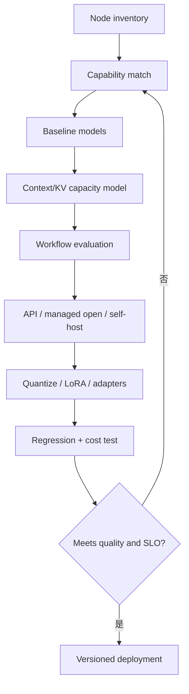

---

## 15. 可运行的容量与适配参数计算器

下面的纯 Python 代码不加载模型，验证本章最容易算错的三类容量：KV cache、LoRA 参数和量化权重下界。

```python
# Run with: python model_capacity_demo.py
from dataclasses import dataclass

@dataclass(frozen=True)
class AttentionConfig:
    layers: int
    kv_heads: int
    head_dim: int
    bytes_per_element: int

def kv_cache_bytes(
    config: AttentionConfig,
    sequence_length: int,
    batch_size: int = 1,
) -> int:
    return (
        batch_size
        * sequence_length
        * config.layers
        * config.kv_heads
        * config.head_dim
        * 2
        * config.bytes_per_element
    )

def lora_parameters(
    input_dim: int,
    output_dim: int,
    rank: int,
) -> tuple[int, int, float]:
    full = input_dim * output_dim
    lora = rank * (input_dim + output_dim)
    return full, lora, lora / full

def raw_weight_bytes(parameters: int, bits: int) -> float:
    if bits <= 0:
        raise ValueError("bits must be positive")
    return parameters * bits / 8

if __name__ == "__main__":
    config = AttentionConfig(
        layers=28,
        kv_heads=4,
        head_dim=128,
        bytes_per_element=2,
    )
    cache = kv_cache_bytes(config, sequence_length=32_768)
    assert cache == 1_879_048_192
    assert cache / 1024**3 == 1.75

    full, lora, ratio = lora_parameters(4096, 4096, rank=16)
    assert full == 16_777_216
    assert lora == 131_072
    assert ratio == 0.0078125

    seven_billion = 7_000_000_000
    assert raw_weight_bytes(seven_billion, 16) == 14_000_000_000
    assert raw_weight_bytes(seven_billion, 4) == 3_500_000_000
    print({"kv_gib": 1.75, "lora_percent": ratio * 100, "int4_gb": 3.5})
```

代码与原理对应：

- KV 函数显式包含 K/V 的因子 2；
- 使用 KV heads 而不是 query heads，体现 GQA；
- LoRA 函数比较 $d_{out}d_{in}$ 与 $r(d_{in}+d_{out})$；
- quantization 只计算 raw weight lower bound，不假装包含 scales 与 runtime；
- `batch_size` 可用于估算多并发线性增长，但真实 paged allocation 还受变长和碎片影响。

---

## 16. 本章知识结构与核心结论

```mermaid
flowchart TB
    ROOT[Agent 能力 = Task × Model × Runtime × Deployment]

    ROOT --> ARCH[Architecture]
    ARCH --> DEC[Decoder: generation/tool use]
    ARCH --> ENC[Encoder: retrieval/filter]
    ARCH --> ED[Encoder-decoder: seq2seq]
    ARCH --> MOE[MoE: sparse capacity]

    ROOT --> INF[Inference control]
    INF --> KV[KV cache + GQA]
    INF --> CTX[Context engineering]
    INF --> THINK[Thinking mode/budget]

    ROOT --> TEAM[Model team]
    TEAM --> FAST[Fast workers]
    TEAM --> REASON[Reasoning analyst]
    TEAM --> VERIFY[Encoder verifier]
    TEAM --> SUP[Supervisor]

    ROOT --> STRAT[Ownership strategy]
    STRAT --> CLOSED[Closed API]
    STRAT --> MANAGED[Managed open]
    STRAT --> OPEN[Self-host open]

    ROOT --> OPT[Optimization]
    OPT --> LORA[LoRA/adapters]
    OPT --> LORAX[Multi-adapter serving]
    OPT --> QUANT[Quantization]
```

### 16.1 核心结论

1. 模型选型应从 Agent 节点职责和约束出发，而非只看通用 benchmark 或参数量。
2. Decoder-only 是生成和工具调用主力；encoder-only 适合并行理解、retrieval、classification 和 verification。
3. Encoder–decoder、embedding、MoE、reasoning 是不同层次的分类，不能当成完全互斥架构。
4. KV cache 以线性增长的显存换取历史 K/V 复用；长 context 和并发会迅速放大容量。
5. GQA 通过多个 query heads 共享较少 KV heads 缩小 cache；head ratio 不等于端到端加速倍数。
6. Cache 绑定 token prefix、位置、模型和 adapter，context 修改必须精确失效；KV cache 不是 Agent 长期记忆。
7. RoPE 让 query/key dot product依赖相对距离，但 scaling 配置不能替代长上下文训练和 workload evaluation。
8. MoE 只稀疏激活部分 FFN experts，以 active compute 换总容量；权重存储、通信和负载均衡仍是成本。
9. Reasoning model 通常仍是 decoder，差别主要来自 post-training 与 test-time protocol。
10. Thinking mode/budget 应按任务难度配置，reasoning token 即使隐藏也消耗成本、延迟与 KV cache。
11. Fast decoder + reasoning analyst + encoder verifier 展示了按能力组合模型，但相关性分数不是事实正确率。
12. 开放/闭源选择决定的不只是单价，还包括权重所有权、版本控制、合规、运维与 vendor lock-in。
13. LoRA 用低秩增量大幅减少可训练参数；adapter 用新增 bottleneck 模块隔离 specialization。
14. LoRAX 类 runtime 通过共享 base、动态加载和多 adapter batching 降低多领域部署成本。
15. Quantization 降低 raw weight memory，但速度与质量收益依硬件、kernel、格式和任务而定。
16. 最佳方案通常是渐进且混合的：cheap-first model routing、按需 reasoning、managed/self-host 组合、量化底座加可切换 adapter。

### 16.2 作者解决问题的一般思路

作者采用“能力角色化，再工程落地”的路线：

1. 先把 transformer 类型映射为 generator、analyst、specialist、thinker；
2. 对最常用 decoder 追问推理瓶颈，导出 KV cache、GQA 和运行时管理；
3. 再补上 encoder 的双向理解、RoPE 和检索验证价值；
4. 用 MoE 说明总参数容量与每 token active compute 可以分离；
5. 用 thinking switch/budget 把 reasoning 从模型标签变成可调运行时资源；
6. 把不同能力放入同一 MAS，证明模型可以按节点异构配置；
7. 从技术选型扩展到 open/closed 的成本、合规和所有权；
8. 最后用 LoRA、adapter、LoRAX 和 quantization 说明拥有权重后怎样适配和规模化服务。

可迁移的一般方法是：**先定义工作，再定义能力；先测基础模型，再调运行时；先做真实容量和成功成本模型，再决定所有权；最后用最小可逆优化逐步压缩成本，并始终保留质量回归。**

---

## 17. 延伸阅读

- Raffel 等，*Exploring the Limits of Transfer Learning with a Unified Text-to-Text Transformer*：T5/encoder–decoder。
- Devlin 等，*BERT*；Liu 等，*RoBERTa*：encoder-only 基础。
- Warner 等，*ModernBERT*；Le Breton 等，*NeoBERT*：现代长上下文 encoder。
- Su 等，*RoFormer: Rotary Position Embedding*：RoPE 数学基础。
- Hu 等，*LoRA: Low-Rank Adaptation of Large Language Models*：低秩适配。
- vLLM 文档：PagedAttention、prefix caching、chunked prefill、distributed serving。
- LoRAX：共享 base 的 multi-adapter serving。
- bitsandbytes、Unsloth 与模型卡：量化、QLoRA 和硬件兼容性。
- 原书第 2、3 章：模型团队的控制流、test-time compute 与 post-training。
