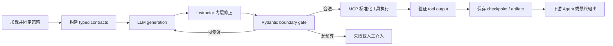
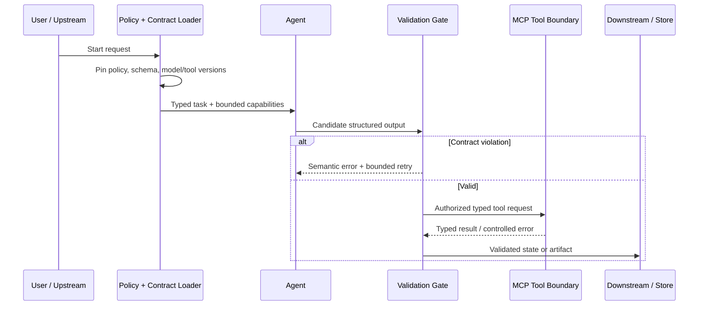
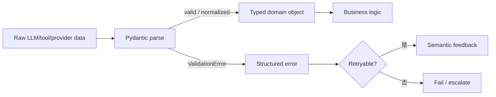
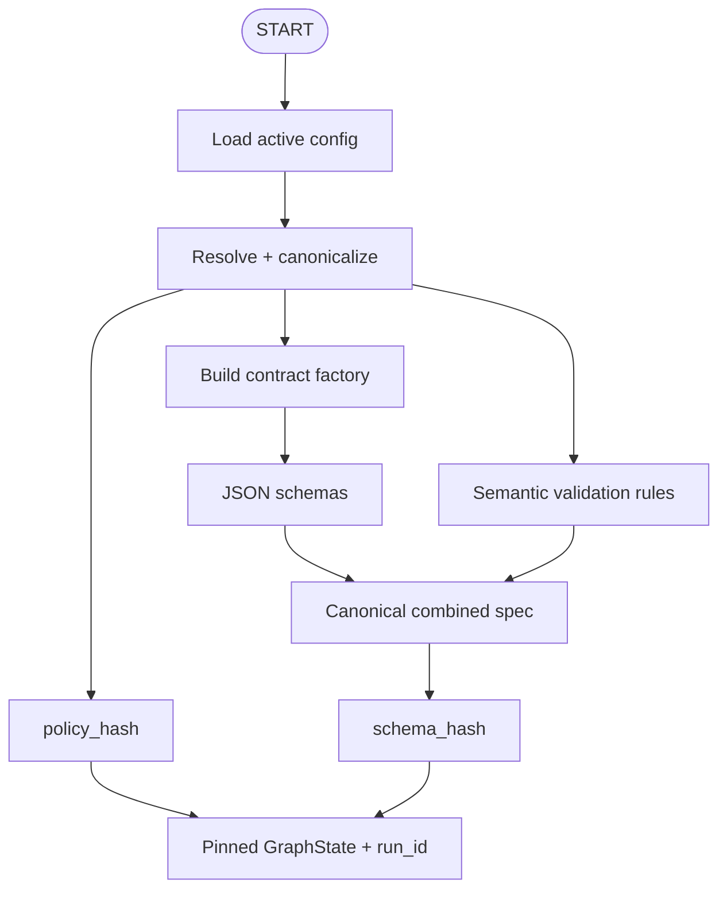
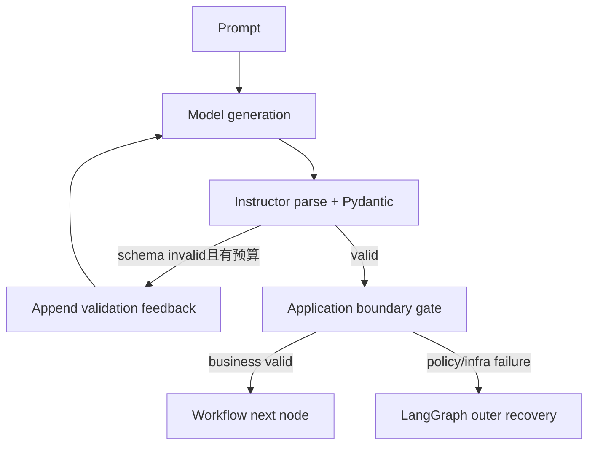
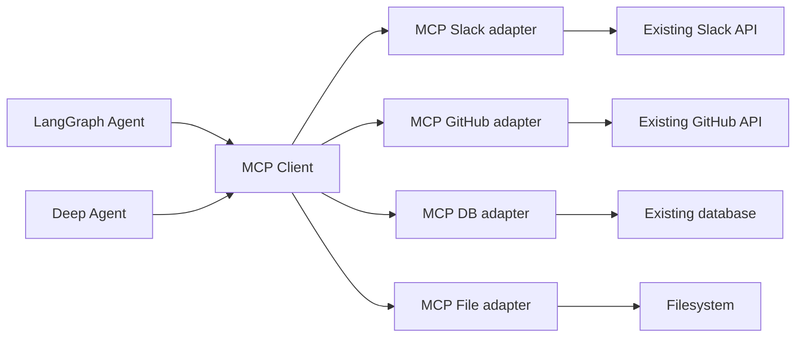
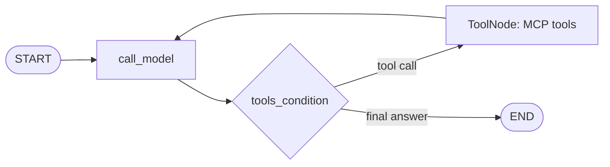
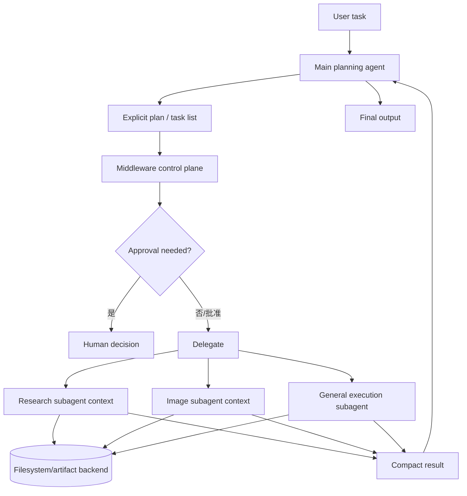
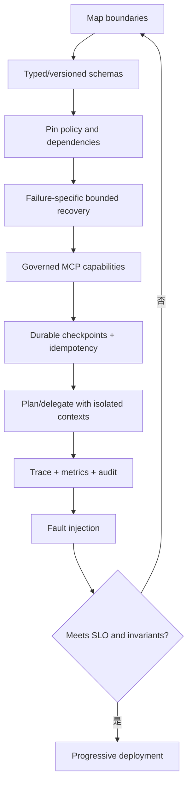
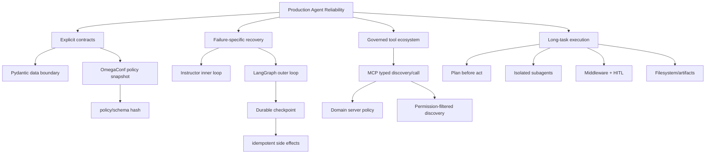

> 原章：*From Prototypes to Production: Contracts, Tools, and Reliable Execution*
> 核心问题：怎样把概率性的 LLM 行为包进明确、可验证、可恢复且可治理的系统边界，使 Agent 不只“偶尔能跑”，而是能够稳定地与其他 Agent、工具和生产数据协作？

## 0. 本章定位与阅读主线

前四章已经说明怎样设计 Agent、组织推理、从轨迹学习并选择模型。到这一步，很容易做出令人印象深刻的演示，但演示与生产之间仍隔着一组看似普通、实际决定成败的机制：数据类型、接口契约、策略版本、重试语义、工具权限、持久状态和故障恢复。

作者用“团队需要劳动合同和员工手册”作比喻：

- **Pydantic** 定义技术合同，规定数据允许长什么样；
- **Instructor** 在模型生成窗口内尽量让输出满足合同；
- **LangGraph + checkpointer** 在工作流层路由失败、保存进度并恢复；
- **MCP** 用标准协议暴露和发现外部工具；
- **deep agents** 在长任务中先规划、再执行，并把工具密集工作委派给隔离的 subagents；
- **middleware、HITL、SKILL.md、AGENTS.md** 补充执行政策和组织约束。



全章的核心命题是：

> 生产可靠性主要不是让模型“更听话”，而是让不可信输出必须经过确定性合同，让策略在一次运行内不可漂移，让重试发生在正确层次，让副作用经过受控工具边界，并让每一步都可恢复、可审计。

这也意味着 schema、protocol 和 planning harness 都不是安全魔法。它们只是建立可执行边界；真正的权限、事务、身份、审计和业务不变量仍需由系统代码落实。

---

## 1. 从原型到生产：智能不是最先坏掉的部分

### 1.1 原型为何容易显得成功

原型通常具有有利条件：

- 输入由开发者精心设计；
- 只连接少数工具；
- 失败后可以手动重跑；
- 没有高并发和真实脏数据；
- API、prompt 和模型版本短期固定；
- 人会无意识地补全模型遗漏的信息。

生产环境则会遇到：字段缺失、类型漂移、provider schema 差异、超时、重复请求、部分成功、重启、策略热更新、权限变化和恶意输入。单个模型回答看起来不错，不能证明这些组合路径可靠。

### 1.2 生产 Agent 的端到端控制点

原章图 5-1 的重点不是增加更多智能节点，而是把治理放在动作之前、传播之前和恢复边界：



每个控制点回答不同问题：

| 控制点 | 要回答的问题 | 典型机制 |
|---|---|---|
| 配置加载 | 此次运行遵守哪套规则 | OmegaConf、版本与 hash |
| 输入合同 | 允许什么字段、类型和值 | Pydantic model |
| 生成约束 | 怎样让模型在离开生成层前修正格式 | Instructor |
| 工作流 gate | 输出能否传播、重试还是终止 | LangGraph routing |
| 工具边界 | Agent 能发现和调用什么 | MCP server/client |
| 副作用治理 | 谁授权、怎样避免重复 | middleware、HITL、幂等键 |
| 恢复与审计 | 从哪里继续、当时规则是什么 | durable checkpointer、run ID |

目标不是让系统永不失败，而是让它**显式失败、局部失败、可恢复失败**。

### 1.3 三个基础库的分工

| 组件 | 主要职责 | 不负责什么 |
|---|---|---|
| Pydantic | 建模、解析和校验 Python 数据边界 | 不会自动让 LLM 重试，也不提供权限控制 |
| Instructor | 把 Pydantic schema 接入模型调用，解析失败后在生成层 re-ask | 不处理数据库事务、网络恢复或工具副作用 |
| MCP | 标准化 tool discovery、schema 与 invocation | 不自动保证工具安全、正确或有权限 |

将三者混成一个“可靠性库”会导致错误层级不清。原章后续正是按 failure source 分层处理。

---

## 2. 合同为何比提示词更适合管理数据流

### 2.1 Prompt 约定与 executable contract 的差别

提示词“请返回整数 user_id”只是一条模型可违反的软要求。Pydantic schema 则是宿主程序实际执行的谓词：

$$
\operatorname{accept}(x)
=
\mathbb{1}[x\in\mathcal{S}],
$$

$\mathcal{S}$ 是满足字段、类型和约束的数据集合。不属于该集合的数据不能悄悄进入下游。

合同至少包含：

- 字段名称与必填性；
- 类型和是否允许 coercion；
- 数值范围、字符串长度和枚举；
- 跨字段业务不变量；
- schema/version 标识；
- 错误分类和恢复语义。

合同不只约束 Agent→Agent，也应约束 Agent→tool、tool→Agent、workflow→database 和 checkpoint→resume。

### 2.2 Brittle JSON trap

裸 JSON 只保证文本能否解析成 JSON 值，不保证：

- `user_id` 必然存在；
- `age` 是整数而非字符串或 null；
- 数值在业务范围；
- provider 没有增加嵌套层；
- tool result 与持久化 schema 一致。

“JSON mode 成功”只是语法层成功，距离业务合同仍有多层：

```text
valid JSON
→ expected object shape
→ field types
→ field constraints
→ cross-field invariants
→ authorization/business policy
→ safe side effect
```

### 2.3 顺序链中的可靠性乘法

若 $N$ 个步骤必须全部成功，步骤 $i$ 成功概率为 $p_i$，并暂时假设失败独立、顺序执行，则：

$$
P_{system}
=
\prod_{i=1}^{N}p_i.
$$

若每步 $p=0.98$：

$$
P_{system}=0.98^N.
$$

| 步数 $N$ | $0.98^N$ |
|---:|---:|
| 1 | 98.000% |
| 3 | 94.119% |
| 5 | 90.392% |
| 10 | 81.707% |

这解释了为什么“每个 Agent 都有 98% 准确率”不等于十 Agent 系统接近 98%。链条越长，任意一个失败即可破坏整次任务。

### 2.4 Validation gate 的简化收益公式

原章设合同错误发生概率 $1-p$，validation 对这些错误的捕获并成功恢复概率为 $v$，则单步有效成功率：

$$
p_{effective}
=
p+(1-p)v.
$$

取 $p=0.98,v=0.9$：

$$
p_{effective}
=0.98+0.02\times0.9
=0.998.
$$

于是：

| 步数 $N$ | 无 gate：$0.98^N$ | 简化恢复模型：$0.998^N$ |
|---:|---:|---:|
| 1 | 98.000% | 99.800% |
| 3 | 94.119% | 99.401% |
| 5 | 90.392% | 99.004% |
| 10 | 81.707% | 98.018% |

### 2.5 这组公式依赖哪些强假设

公式把“捕获”与“恢复成功”合并成 $v$。如果 gate 只阻止坏数据、不产生正确替代结果，那么它提高的是安全性和错误可见性，不一定提高任务完成率。

更一般地，设：

- $d$：错误被检测的概率；
- $r$：被检测后修复成功的概率；
- $u$：未检测错误仍碰巧不影响任务的概率。

则可写成：

$$
p_{effective}
=
p+(1-p)dr+(1-p)(1-d)u.
$$

原章公式相当于忽略未检测错误的侥幸成功，并令 $v=dr$。

实际系统还常违反独立性：同一错误 prompt、共享 provider、错误 schema 或上游脏数据会造成相关失败。乘法模型是理解风险放大的教学模型，不是 SLA 预测器。应从生产 trace 估计条件失败概率。

---

## 3. Pydantic：让错误停在边界

### 3.1 例 5-1：一个字符串怎样变成静默故障

原例直接从 dict 读取：

```python
user_id = data.get("user_id")
age = data.get("age")
result = user_id * 2
```

若 `user_id=123`，结果为 246；若 `user_id="123"`，Python 结果是字符串 `"123123"`，不一定抛异常。原注说“breaks”，更准确地说它可能产生**类型合法但业务错误**的结果，这是比立即崩溃更危险的 silent corruption。

代码还把 `age` 拼进 SQL：

```python
query = f"SELECT * FROM users WHERE age > {age}"
```

类型验证也不能替代参数化查询。即使 age 是整数，生产数据库仍应使用 driver parameters，而不是手工构造 SQL 字符串。

### 3.2 例 5-2：边界校验

```python
class UserData(BaseModel):
    user_id: int
    age: int = Field(ge=0, le=150)
```

`UserData(**data)` 会：

1. 检查必填字段；
2. 按 Pydantic 默认规则尝试把数字字符串转换为整数；
3. 检查 `0 <= age <= 150`；
4. 成功后输出具有稳定类型的对象；
5. 失败时产生结构化 `ValidationError`。

这里必须区分：

- **lenient parsing/coercion**：`"123"` 可能规范化为 `123`；
- **strict validation**：要求输入原本就是整数，否则拒绝。

若合同必须禁止 coercion，可用 strict field/model 配置。Pydantic 的“验证”不天然等于“严格拒绝所有类型变化”。

### 3.3 Boundary validation 的价值



收益：

- 失败位置靠近来源；
- 下游不再到处写 `if field is None`；
- provider 差异被 adapter/contract 吸收；
- 错误可分类、计数和测试；
- schema 可生成工具定义和 API 文档。

限制：schema 只能验证它表达出来的规则。`source_url: str` 不能证明 URL 可信，`amount: float` 不能证明用户有付款权限。

---

## 4. OmegaConf 与 policy-driven contracts

### 4.1 为什么不把规则硬编码进模型类

生产政策会按环境、租户、模型能力或风险等级变化。例如：

- strict mode：格式违规立即阻断；
- lenient mode：允许规范化并反馈重试；
- 某 provider 更容易输出 Markdown，需要禁止代码围栏；
- 图像尺寸、MIME 和字节上限因产品变化；
- 数据库 schema 有版本。

把这些值散落在 prompt 和 Python class 中，修改需要重新部署，而且难以回答“这条记录当时用了哪套规则”。OmegaConf 用层次化 YAML/structured config 集中管理并允许合并环境覆盖。

### 4.2 例 5-3：governance config

原配置的 strict policy 包含：

- `max_retries: 3`；
- prompt 最短 50 字符；
- 必须含 `pydantic`、`validation`、`contract`；
- 禁止 Markdown code block；
- 要求 style tag；
- image size 在 512–1536；
- 只允许 `image/png`；
- 最大 2,000,000 bytes；
- DB JSON serialization 与 schema version 1。

这些规则跨越三种层次：

| 层次 | 示例 | 应在哪里执行 |
|---|---|---|
| 字段 schema | 长度、整数范围、MIME enum | Pydantic |
| 语义内容 | 必须含关键词、禁止代码块 | field/model validator |
| 工作流策略 | retry 次数、失败路由、DB version | graph/runtime |

不能把所有 YAML 字段直接塞进 JSON Schema；工作流政策必须由 orchestration 执行。

### 4.3 热更新不等于运行中漂移

配置可动态更新，但一次 run 应在 START 固定快照：

```text
global active policy changes
    ├── existing run: continues with pinned snapshot
    └── new run: loads new snapshot
```

否则同一任务的 writer 按 policy v1 生成，validator 却在几秒后按 v2 拒绝，checkpoint 恢复也无法复现。

### 4.4 例 5-4：动态 Pydantic factory

`build_image_prompt_model(policy_dict,mode,policy_hash)` 从当前 policy 提取：

- min length；
- required keywords；
- size min/max；
- 是否禁止 Markdown；
- 是否需要 style tag。

内部定义 `ImagePrompt(BaseModel)`，字段约束与 validator 闭包捕获这些配置，并通过：

```python
model_config = {
    "title": f"ImagePrompt_{mode}_{policy_hash}"
}
```

在内存和 schema 中标记版本。

Factory Pattern 的价值是调用者只请求“当前 policy 的合同”，不硬编码具体 class。不同模型/provider 可绑定不同 policy，而 graph interface 保持一致。

### 4.5 动态 class 的工程边界

- 每次无缓存地创建 class 会增加内存和 schema 编译开销，应按完整 policy/schema hash 缓存；
- closure validator 影响行为，却不一定完整出现在 JSON Schema 中；
- class title 不保证 schema 唯一，真正 cache key 应来自规范化内容；
- 动态 class 的 pickling、import path 和跨进程恢复需要测试；
- policy 数据本身必须先由一个静态配置 schema 验证，否则错误政策会生成错误合同。

---

## 5. Policy pinning 与可审计 fingerprint

### 5.1 例 5-5 的初始化步骤

`node_initialize_policy` 在图的 START：

1. 读取 active policy；
2. `OmegaConf.to_container(...,resolve=True)` 展开引用，得到普通容器；
3. 记录 active mode；
4. 规范化并 hash policy；
5. 按 policy 构建/缓存 Pydantic models；
6. 提取 JSON Schema 之外的 semantic rules；
7. 合并 schema 与语义后生成 `schema_hash`；
8. 把 policy snapshot、hash、retry budget、run ID 和初始 flags 写入 GraphState。



### 5.2 稳定 hash 怎样生成

规范化 JSON 常用：

```python
canonical = json.dumps(
    value,
    sort_keys=True,
    separators=(",", ":"),
    ensure_ascii=False,
)
digest = hashlib.sha256(canonical.encode("utf-8")).hexdigest()
```

`sort_keys` 消除 dict 插入顺序，紧凑 separators 消除空白差异，UTF-8 统一字节表示。若 required keywords 的顺序不影响语义，应先排序；否则等价政策会产生不同 hash。

### 5.3 policy hash 与 schema hash 的区别

- `policy_hash`：整个 active policy 快照的 fingerprint；
- `schema_hash`：真正影响输入/输出校验的 schema + semantic validators fingerprint；
- `run_id`：一次执行实例的身份；
- `thread_id`：checkpoint namespace，可与 run ID 相同或映射。

原代码片段里的 `combined` 定义被省略，复制时必须明确它包含哪些 JSON schemas 和 semantic rules。只 hash Pydantic JSON Schema 会遗漏 `required_keywords` 等 closure 行为。

### 5.4 Hash 能证明什么，不能证明什么

能证明：两份规范化内容是否极大概率相同，帮助 cache、关联日志和检测漂移。

不能证明：

- policy 来自可信发布者；
- policy 获得审批；
- 内容没有被攻击者同时篡改并重新 hash；
- 运行时真的执行了所有规则。

需要真实性时应使用签名、不可变 artifact registry、发布审批和 append-only audit log。原章截取 hash 前 16 hex 字符便于标识；高保证审计更适合保存完整 digest。

Secrets 不应进入可广泛查看的 hash input/log；配置 fingerprint 应只包含影响行为且可安全持久化的值，secret 使用独立版本 ID。

---

## 6. Validation Gate 与 bounded retry

### 6.1 例 5-6 的职责

`node_prompt_validation_gate` 不重新读取 global policy，而从 state 加载 pinned policy/mode/hash，构建同一合同。随后：

- 用 `ImagePrompt(**image_prompt)` 验证；
- 成功则存 normalized `model_dump()`、`prompt_ok=True` 并清零 retry count；
- 失败则 `retry_count += 1`；
- 记录一条可行动的 validation message；
- 后续 router 根据显式字段选择 retry、fail 或 downstream。

“显式 signal”比“没有异常就当成功”更容易检查和恢复。

### 6.2 原片段还需要配套 router

```python
def route_after_prompt_gate(state):
    if state["prompt_ok"]:
        return "generate_image"
    if state["retry_count"] <= state["max_retries"]:
        return "refine_prompt"
    return "failed_or_human_review"
```

如果 `max_retries=3` 表示初次调用之外允许 3 次重试，则总 attempts 至多 4。命名和比较符号必须统一，避免 off-by-one。

### 6.3 Retry 的概率与成本

假设每次尝试独立失败概率为 $q$，最多允许 $r$ 次 retry，加上初次共 $r+1$ 次，则最终至少一次成功概率：

$$
P_{success}=1-q^{r+1}.
$$

期望尝试次数：

$$
E[A]
=
\sum_{k=0}^{r}q^k
=
\frac{1-q^{r+1}}{1-q}.
$$

若 $q=0.2,r=3$：

$$
P_{success}=1-0.2^4=99.84\%,
$$

$$
E[A]=1+0.2+0.04+0.008=1.248.
$$

真实 LLM retries 不独立：相同 prompt 和模型可能重复同一错误。把 validation error 转成简洁、语义化反馈，或改变生成约束，才可能降低下一次 $q$。

### 6.4 为什么不要回传 raw stack trace

模型需要的是：

> `size_px` 必须在 512 到 1536；当前值为 2048。请只修正该字段。

而不是内部文件路径、SQL、token、library stack 和几百行 traceback。Semantic error translation 可以：

- 降低 token；
- 避免泄露内部实现与 secret；
- 防止模型被工具返回中的攻击文本干扰；
- 让修复只针对失败字段。

但日志系统仍应保存受保护的完整原始异常，供工程诊断。给模型的反馈和给运维的 trace 是两个 audience。

### 6.5 Retry 何时不应发生

不重试或需特殊处理：

- permanent authentication/authorization failure；
- 明确业务拒绝；
- 非幂等副作用已经成功但响应丢失；
- policy 本身无效；
- 内容安全违规；
- retry budget/成本已耗尽；
- 相同 validation signature 连续出现且无进展。

对 rate limit、timeout 等 transient failure 使用 backoff/jitter；对 schema failure 使用立即 semantic re-ask；两者不能共用一种 retry policy。

---

## 7. Checkpointing：恢复的是运行现场，不只是聊天记录

### 7.1 完整 checkpoint 应保存什么

原章强调：

- messages；
- 中间 tool results/artifact references；
- 最后完成节点和 pending next nodes；
- retry counts 与 validation flags；
- pinned policy/schema hashes；
- model、prompt、tool 和版本配置；
- run/thread identity；
- pending interrupts。

如果只保存消息，恢复后可能用新 policy、新工具或新模型继续旧任务，结果不可复现。

### 7.2 例 5-7：InMemorySaver 与生产持久化

```python
memory = InMemorySaver()
app = workflow.compile(checkpointer=memory)
config = {
    "configurable": {
        "thread_id": "production_run_001"
    }
}
```

`InMemorySaver` 适合教程和单进程测试，进程退出即丢失，也不提供生产 HA。原章建议换成 `PostgresSaver` 等 durable backend。还需考虑 encryption、retention、tenant isolation、schema migration 和 checkpoint GC。

### 7.3 例 5-8：检查 snapshot

`app.get_state(config)` 可读取：

- `snapshot.next`：接下来待执行节点，不一定是“最后执行节点”；
- pinned policy 是否存在；
- run ID；
- policy/schema hashes；
- state values 和 queued tasks。

“time travel”是从某个历史 checkpoint 创建/恢复执行分支，不表示任意外部世界也会回滚。文件、邮件、付款和数据库写入必须另行处理。

### 7.4 Checkpoint 怎样降低成本

若昂贵 research/writer 节点已完成，后面的 image/API 节点失败，恢复可重用前面的结果。若各节点成本为 $c_i$，失败在节点 $k$，从头重跑成本：

$$
C_{restart}=\sum_{i=1}^{k}c_i.
$$

从最近稳定 checkpoint $j<k$ 恢复：

$$
C_{resume}=\sum_{i=j+1}^{k}c_i+C_{checkpoint}.
$$

节省约为：

$$
\Delta C=\sum_{i=1}^{j}c_i-C_{checkpoint}.
$$

但 schema failure 要修复生产该无效对象的节点；checkpoint 只能避免重跑更早且仍有效的节点，不能凭空把坏输出变好。

### 7.5 Checkpoint 不等于 exactly-once

最危险窗口：

```text
外部工具已成功执行
→ 进程在保存成功 checkpoint 前崩溃
→ 恢复后再次执行工具
```

解决方案包括 idempotency key、transactional outbox、deduplication table、查询外部操作状态和 compensation。checkpoint 提供 at-least-once 恢复基础，不自动保证 exactly-once 副作用。

### 7.6 三项生产收益

**Fault tolerance**：从稳定节点恢复，不重做不相关的昂贵推理。

**Auditability**：DB record、checkpoint 与 policy/schema hash/run ID 关联，可回答“谁按什么规则生成”。

**Scalability**：外部 tool response contract 与内部 persistence contract 分离；adapter 吸收 API 变化，数据库按自己的 schema 演进。

---

## 8. Instructor：在生成层修复 schema failure

### 8.1 Pydantic gate 与 Instructor 的关系

Pydantic gate 位于模型输出离开生成节点之后。失败恢复需要 graph 路由到 producer/refiner。Instructor 把同一个 Pydantic response model 接入 generation call：解析或验证失败时，将错误反馈给模型并在该调用边界内 re-ask。



Instructor 不取代 Pydantic，它使用 Pydantic 作为 response contract；也不应取消系统边界的防御性再验证。

### 8.2 例 5-9：创建 provider-compatible client

原章通过：

```python
client = instructor.from_provider(
    f"openrouter/{model_slug}",
    base_url="https://openrouter.ai/api/v1",
    mode=instructor.Mode.TOOLS,
)
```

把 OpenRouter/OpenAI-compatible provider 包装为 Instructor client。`Mode.TOOLS` 利用模型 tool/function schema 产生结构化输出。

“OpenAI-compatible”表示请求接口相似，不保证每个模型的 tool calling、JSON schema、错误返回和 retry quality 相同。切 provider 后仍需 contract conformance tests。

### 8.3 例 5-10：response_model 与 max_retries

```python
result = client.create(
    messages=[...],
    response_model=ImagePrompt,
    max_retries=policy.max_retries,
    temperature=0.2,
)
```

- `response_model` 触发 schema wiring、解析与 Pydantic validation；
- `max_retries` 限制 generation-level re-asks；
- Instructor 内部把 validation failure 转成下一轮可修复反馈；
- 最终返回 typed `ImagePrompt` 或抛出失败。

“无需手写 retry logic”只针对这一类生成 schema failure。调用方仍要设置 timeout、cancellation、rate limit retry、circuit breaker 和总成本预算。

### 8.4 Inner loop 与 outer loop

| 维度 | Instructor inner loop | Pydantic + LangGraph outer loop |
|---|---|---|
| 位置 | 单次生成窗口 | Agent/system boundary |
| 触发 | malformed JSON、缺字段、字段约束 | policy、tool、DB、timeout、logic、handoff |
| 粒度 | 再做一次模型生成 | 节点、subgraph、人工分支 |
| 频率/延迟 | 高频、相对低延迟 | 低频、可能跨服务/等待 |
| Checkpoint | 通常在节点内部 | 保存节点级稳定状态 |
| 副作用 | 不应执行外部副作用 | 必须按幂等/审批治理 |

错误属于哪一层，就在哪一层修复：把所有错误都交给 Instructor 会漏掉系统故障；把一个漏字段问题升级成完整 graph rerun 又浪费成本。

### 8.5 Retry budget 应统一计算

若 Instructor 最多调用 $a$ 次，outer graph 又最多重跑 producer $b$ 次，最坏模型调用数可达：

$$
N_{calls}\le a\times b
$$

（具体是否包含初次调用取决于 API 语义）。嵌套层各自设置 3 次，不能想当然地认为总计只有 3 次。应由 run-level budget 统一限制 token、金额、墙钟时间和 attempts。

### 8.6 OpenRouter routing 说明

原章提到 OpenRouter 可按价格或延迟选择 provider，并报告 latency-first 在作者测试中约快 4–5 倍。这是特定时点、模型、地区和 provider 的观察，不是稳定保证。跨 provider 路由还可能改变：

- 模型版本或量化；
- context/tool limits；
- data retention 与 region；
- output schema adherence；
- cache 命中和计费。

低延迟路由必须服从数据治理和模型版本 pinning，不能只按实时速度漂移。

### 8.7 两层纠错的最终原则

```text
模型输出形状错
    → Instructor 在生成内修复

跨 Agent handoff / tool output 不符合合同
    → Pydantic gate 阻断并由 graph 路由

网络 timeout / rate limit
    → runtime retry + backoff/circuit breaker

不可逆动作
    → HITL + idempotency + transaction

策略或代码错误
    → fail closed、告警、修复部署
```

生产系统的目标是“按原因失败”，不是无差别重试到偶然成功。

---

## 9. MCP：Agent 的标准化工具接口

### 9.1 MCP 要解决的耦合问题

没有统一协议时，每个 Agent runtime 都要分别适配 Slack、GitHub、数据库、文件系统等 API：

$$
\text{adapter count}\approx N_{clients}\times M_{systems}.
$$

若每个底层系统只包一层标准 server，每个 Agent client 只实现 MCP，集成面更接近：

$$
N_{clients}+M_{servers}.
$$

这是协议标准化的主要杠杆：client 可以 discover tools、读取 schema、发起 call 和接收 result，而无需知道底层是 REST、SDK、SQL 还是本地函数。



原章称 MCP 为“universal remote/USB-C”，重点是稳定的小 client surface 和薄 adapter layer。标准插头不证明接入设备安全；MCP 同样不自动提供身份、最小权限、审批、事务或内容可信度。

### 9.2 MCP 与 AGENTS.md 的位置

原章提到 2025 年 12 月 Linux Foundation 成立 Agentic AI Foundation（AAIF），MCP 与 AGENTS.md 等成为 founding contributions。两者作用不同：

- **MCP**：运行时工具/数据连接协议；
- **AGENTS.md**：仓库中面向 coding agent 的项目指导约定；
- AGENTS.md 描述期望，不是强制执行器；
- policy enforcement 仍需 middleware、server、sandbox、CI 与审批。

### 9.3 Transport selection

| Transport | 适用 | 主要考虑 |
|---|---|---|
| `stdio` | 本地开发、父进程启动的单用户 server | 简单、无网络暴露；进程生命周期与日志隔离 |
| Streamable HTTP/HTTP | 远程、多用户、Web/service deployment | TLS、authn/authz、tenant、rate limit、load balancing |
| gRPC 适配/企业 transport | 已有 gRPC 微服务环境 | 复用 service mesh 与 IDL，但要保持 MCP discovery/call 语义 |

原章正文在一处提到 deployment 可用 HTTP 或 WebSocket，另有侧栏提 gRPC；具体 MCP 规范支持和 FastMCP API 会随版本演进，应查当前文档，不凭类比选 transport。

### 9.4 Concurrency 与 governance

**Concurrency safety：** 每次调用独立连接/transaction，不共享不安全 global cursor；SQLite 可开启 WAL 以允许写期间并发读，并使用原子更新防 lost update。

**Governance：** server 是重要政策边界，但 policy 还应存在于 graph、middleware、approval service 和 audit infrastructure。模型说“我有权限”不构成授权。

**Typed IO：** input/output 都定义 schema。错误也应有稳定类型，例如：

```json
{
  "code": "FILE_NOT_FOUND",
  "message": "Requested file does not exist",
  "retryable": false
}
```

不要让不同工具随意抛任意 traceback 给模型。

---

## 10. 构建一个 Typed File Manager MCP Server

### 10.1 例 5-11：输入模型

原章定义：

- `ReadFileRequest(file_path: str)`；
- `WriteFileRequest(file_path: str,content: str)`；
- `ListFilesRequest(directory: str,pattern: Optional[str])`。

Field descriptions 不只是文档，也会进入 tool schema，帮助模型构造参数。输入 contract 只验证形状，`file_path: str` 并未限制 Agent 可以访问哪里。

### 10.2 例 5-12：FastMCP tools

```python
mcp = FastMCP("FileManager")

@mcp.tool()
def read_file(request: ReadFileRequest) -> str: ...
```

`@mcp.tool()` 将函数名、docstring 和 Pydantic input 暴露为 MCP capability。原示例实现：

- read：检查存在后以 UTF-8 读取；
- write：创建父目录并写文本，返回 status/path/bytes_written；
- list：按 glob 或 `iterdir` 返回文件相对路径；
- main 中用 `mcp.run(transport="stdio")`。

这足以展示协议结构，但它不是安全文件服务器。

### 10.3 原文件工具的生产风险

1. **Path traversal**：`../../secret.txt` 可逃出工作目录。
2. **Absolute path**：直接访问系统任意文件。
3. **Symlink escape**：表面在 sandbox 内的 symlink 指向外部。
4. **TOCTOU**：先 `exists()` 再读取之间文件可被替换。
5. **Unbounded read/write**：大文件耗尽内存或磁盘。
6. **Overwrite**：默认覆盖现有内容，没有审批、版本或原子替换。
7. **Glob abuse**：复杂 pattern 扫描巨大目录。
8. **Information disclosure**：错误消息和 list 结果泄露路径。
9. **Incorrect byte count**：`len(request.content)` 是 Unicode code points，不是 UTF-8 bytes；中文和 emoji 会不一致。

正确字节数应是：

$$
\text{bytes\_written}
=
\left|content.encode(\text{"utf-8"})\right|.
$$

### 10.4 安全路径约束

设允许根目录为 $R$，用户相对路径为 $u$：

$$
p=\operatorname{resolve}(R/u).
$$

只有当：

$$
p=R
\quad\text{或}\quad
R\in p.parents
$$

才允许访问。还需防 symlink race；高保证实现可用操作系统级 sandbox、directory file descriptor 和 no-follow flags，而不只做字符串 `startswith`。

### 10.5 为什么 output 也要模型化

原 read 返回 string、write 返回 dict、list 返回 list。虽然能运行，生产工具更适合定义：

```python
class WriteFileResult(BaseModel):
    status: Literal["created", "updated"]
    relative_path: str
    bytes_written: int = Field(ge=0)
    content_sha256: str
```

输出模型使 client 无需猜 dict keys，也便于版本化、审计和测试。敏感工具应避免返回 host absolute path。

---

## 11. 把 MCP Server 接入 LangGraph

### 11.1 例 5-13：MultiServerMCPClient

原章为 `file_manager` 配置：

```python
{
    "command": "python",
    "args": [os.path.abspath("file_manager_server.py")],
    "transport": "stdio",
}
```

client 启动本地 Python server，并通过 stdio 交换 MCP 消息。命令路径、Python interpreter、工作目录和 environment 都应显式固定；不要从模型输入拼 shell command。

默认 `MultiServerMCPClient` 是 stateless：每次 tool call 创建 session、执行并清理。若 server 依赖 session-local cursor、transaction 或认证流程，应显式使用 stateful session。

这里的“stateless”指 MCP session 生命周期，不表示 filesystem 工具没有持久副作用。写入的文件在 session 结束后仍然存在。

### 11.2 例 5-14：加载工具并绑定模型

```python
tools = await client.get_tools()
```

将远端 tool metadata 转为 LangChain tools。图结构：



模型只看到 tool schema；`ToolNode` 负责 dispatch，MCP adapter 再发送给 server。协议层分离了 Agent 与 tool implementation。

原代码每次 `call_model` 都执行 `model.bind_tools(tools)`，可在图构建时预绑定以减少重复对象创建，除非 tools 会动态变化。

### 11.3 例 5-15 与 5-16：write→read 测试

用户要求创建 `test.txt` 写入 `Hello from MCP!`，再读回。典型轨迹：

```text
AI tool_call write_file
→ MCP server writes artifact
→ ToolMessage success
→ AI tool_call read_file
→ MCP server returns content
→ AI final answer
```

显示函数遍历 messages，打印 AI content 和 tool calls。完整测试还应断言：

- 文件位于 sandbox root；
- content bytes 一致；
- write result schema 合法；
- read-after-write 确实来自 tool result；
- cleanup 后无测试污染；
- unauthorized path 被拒绝；
- 重复调用的 overwrite policy 符合预期。

### 11.4 为什么 MCP 不等于业务治理

MCP 统一 handshake 和 schema，但业务部门仍应拥有自己的 server 和 policy：

- Inventory server 检查库存与部门权限；
- Billing server 执行额度、审批和幂等；
- File server 限制 sandbox 和 MIME；
- Email server 区分 draft 与 send。

Agent 不应通过通用数据库 MCP tool 绕过这些领域不变量。薄 adapter 是协议上薄，不表示授权逻辑可以省略。

### 11.5 SQLite inventory 延伸案例

原章配套 notebook 用 SQLite inventory 展示 persistent state、安全保证和边界 policy。关键原则：

- 使用 parameterized SQL；
- WAL 改善并发读写，但仍只有单 writer 语义；
- stock decrement 应在 transaction 内条件更新；
- 使用 row count 判断是否成功，防 check-then-act race；
- 每次 call 使用独立 connection；
- tool contract 与 DB schema 分离。

例如原子扣库存：

```sql
UPDATE inventory
SET quantity = quantity - :amount
WHERE sku = :sku AND quantity >= :amount;
```

若 affected rows 为 0，返回 `INSUFFICIENT_STOCK` 或 `NOT_FOUND`，而不是先 SELECT 后 UPDATE。

---

## 12. Tool Discovery：从硬编码能力到运行时能力目录

### 12.1 为什么动态发现工具

固定为模型绑定数百个 tools 会产生：

- tool schema token 膨胀；
- 名称/描述相近导致误选；
- 权限面过大；
- 每次新增集成都要改应用；
- provider tool limit。

动态 discovery 先根据 intent 从 catalog 找 top-$k$ capability，再只把候选子集提供给模型：

$$
\mathcal{T}_{candidate}
=
\operatorname{TopK}
(\operatorname{Search}(intent,\mathcal{T}_{allowed})).
$$

注意先与用户/租户允许集合 $\mathcal{T}_{allowed}$ 取交集，再做语义检索。不能先搜索全球 catalog 后把越权工具暴露给模型。

### 12.2 Composio 与 Docker MCP 的位置

原章用 Composio 作为第三方集成 gateway，覆盖 Gmail、GitHub、Slack、Jira 等，并返回 OpenAI-compatible tool definitions；Docker MCP 提供 containerized MCP servers。它们扩展了 custom internal MCP server 的思路，但 ecosystem、SDK 和协议支持会演进，应按当前版本确认。

Composio 是托管 integration platform，不应与 MCP 协议本身画等号。统一 gateway 带来便利，也引入凭据托管、供应链、tenant mapping 和可用性依赖。

### 12.3 例 5-17：初始化 client 与身份

```python
COMPOSIO_USER_ID = os.getenv(
    "COMPOSIO_USER_ID",
    "course-user@example.com",
)
composio = Composio(
    api_key=COMPOSIO_API_KEY,
    provider=OpenAIProvider(),
)
```

`user_id` 是 credential/entity routing 的关键安全字段，不应在生产默认回退到共享示例邮箱。必须由已认证 principal 映射，并防跨租户伪造。

### 12.4 例 5-18：基于 intent 搜索工具

`get_composio_tools_for_use_case(use_case, limit=10)` 封装下面的 discovery 调用：

```python
composio.tools.get(
    user_id=COMPOSIO_USER_ID,
    search=use_case,
    limit=10,
)
```

语义搜索返回相关 tools；notebook 还按 toolkit 或 exact slug fallback。Discovery 阶段**没有执行工具**，只把 capability metadata 加入 Agent 的可见世界模型。

这种区分十分重要：

- discover/list：通常是 read-only metadata；
- select/plan：模型决定候选调用；
- authorize：系统验证身份、scope、参数和审批；
- execute：真正产生副作用。

### 12.5 例 5-19 与 5-20：列出 email 工具

工具定义按 OpenAI function shape 到达，名称位于 `tool["function"]["name"]`。示例按名称第一个 `_` 前缀分组，得到 Gmail、Outlook、SendGrid 的 send/draft tools。

按名称 split 只是显示 heuristic；toolkit 名可能含 underscore，SDK object 也未必是 dict。生产中使用显式 toolkit metadata，而不是从字符串推断安全域。

自然语言 intent “I want to send an email” 返回：

- `GMAIL_SEND_EMAIL`；
- `GMAIL_CREATE_EMAIL_DRAFT`；
- `GMAIL_SEND_DRAFT`；
- `OUTLOOK_SEND_EMAIL`；
- `SENDGRID_SEND_EMAIL_WITH_TWILIO_SEND_GRID`。

高风险系统不应让模糊 intent 直接导致 send。更安全的 policy 是默认只允许 create draft，收件人/主题/正文经 schema 与 human approval 后再授予 send capability。

### 12.6 Discovery 的排序与学习

完整 notebook 可把发现的 tools 交给 OpenRouter tool loop，并通过 Composio 执行。它还复用第 3 章 ART/RULER，让 Agent 学习选择最合适工具，而不是第一个关键词匹配。

训练信号可包含：

- task 是否完成；
- 选中工具是否最小权限；
- 参数是否合法；
- 调用次数、费用和延迟；
- 是否触发不必要副作用；
- 人工纠正。

不能只奖励“调用成功”，否则模型可能偏爱宽权限、容易返回 200 的工具。

### 12.7 Tool discovery 的新增风险

- tool description prompt injection；
- 同名/typosquatting malicious server；
- catalog metadata 陈旧；
- semantic search 漏掉正确工具；
- runtime schema 在 discovery 后发生变化；
- OAuth scope 与展示能力不一致；
- 第三方工具把敏感数据带出边界。

应使用 allowlisted/signed registry、server identity、schema hash/version、capability scopes、最小 top-$k$、审批和 execution audit。Discovery 是缩小候选的检索问题，不是授权决策。

---

## 13. Deep Agents：先规划、隔离上下文，再执行

### 13.1 为什么“拥有很多工具”还不够

Agent 一旦获得大量 MCP tools，可能：

- 未分解任务就试错调用；
- 把网页、shell、文件输出全部塞进主 context；
- 重复搜索和写文件；
- 在高风险动作前没有 approval；
- 长任务中失去目标和完成条件。

Deep agent harness 增加显式 planning、filesystem/artifact、middleware 和 subagent delegation。它不是一种新基础模型，而是围绕模型的执行架构。

### 13.2 原章列出的五项收益

| 能力 | 解决的问题 |
|---|---|
| Planning before execution | 减少无目标 tool sprawl 和返工 |
| Isolated execution contexts | 防止主 context 被中间 artifact 污染 |
| Governed tool usage | 在执行边界加入 policy 和 approval |
| Reproducible behavior | 保存计划、版本、artifact 和 trace |
| Composable workflows | 用 delegation 代替一个超长 prompt |

这些是设计目标，不会仅因安装 `deepagents` 自动成立。工具和 middleware 仍需正确配置。

### 13.3 Deep agent 组件



**LLM model**：可替换 provider/model，planning logic 不应和单一 endpoint 紧耦合。

**System prompt**：定义领域 workflow、停止标准和质量要求；不应承担全部 tool security。

**Tools**：可包含 custom/MCP tools；capability exposure 与调用 policy 分离。

**Middleware**：注入 tools、执行 lifecycle hooks、interrupt、policy、sandbox 和 audit，是实际 control plane。

**Subagents**：独立 context、model、tools 和 instructions，可并行或顺序处理局部任务。

**Filesystem/memory**：artifact 与 durable state 放在可插拔 backend，不把所有内容复制进 prompt。

**HITL**：敏感 tool 在执行前暂停，允许 approve/edit/reject。

### 13.4 Subagent 怎样缓解 context bloat

假设主 Agent 自己完成 $m$ 个 tool calls，每个观察平均 $t$ tokens，主 context 新增近似：

$$
T_{direct}\approx mt.
$$

若 subagent 在局部 context 执行，只向主 Agent返回 $s$ token summary/artifact references：

$$
T_{delegated}\approx s,
\qquad s\ll mt.
$$

但总系统 token 并未消失：subagent 仍支付内部 $mt$ 和自己的 prompt。节省的是主 context 污染与后续每轮重复输入，是否降低总成本取决于 handoff、摘要和后续轮数。

Subagent summary 还可能遗漏证据。应传 artifact IDs、source references、status 和 unresolved questions，而不是只返回一段不可追溯结论。

### 13.5 Skills、SKILL.md 与 AGENTS.md

原章把 agent skills 描述为“能力 + 何时/怎样执行一系列动作的逻辑”，区别于单个 tool action。

- `SKILL.md` 可定义能力说明、流程和约束；
- `AGENTS.md` 定义项目角色、语气、质量和 workflow expectations；
- 二者被 harness/model 读取，是 declarative contract；
- 真正 enforcement 仍由 middleware、tool permission、tests 和 sandbox 完成。

原章称它们“execution contracts”，但文字文件本身通常不能强制模型绝不违反。可执行合同与指导合同必须区分。

### 13.6 Ephemeral state、persistent state 与 artifacts

- **Ephemeral state**：一次 run 内临时计划、scratchpad、短期 tool state，结束后可丢弃；
- **Persistent state**：跨运行的用户/任务记忆和 durable checkpoint；
- **Artifact**：文件、数据集、图片、报告等可独立寻址产物。

把 artifact 内容全部放入 message history 会造成 context bloat。更好的状态只保存 URI/hash/metadata，需要时按权限读取。

### 13.7 内容创作案例

作者基于 LangChain deepagents content-writing example 做了适配：

1. 选择 provider/OpenRouter；
2. 结构化 research；
3. 起草 blog、LinkedIn 或 X 内容；
4. 生成匹配图片；
5. 在单个步骤前加入 HITL approve/edit/reject。

完整代码位于作者 fork 和配套 notebook，本章正文没有给代码列表，重点是架构原则。图像生成、文件写入和社交发布是不同风险级别，审批应靠近具体副作用，不应只在任务开始时一次性批准全部未来动作。

### 13.8 Planning 也有失败模式

- 计划过长，成本超过直接执行；
- 计划基于未知 tool result，过早固定；
- planner 与 executor 的状态不一致；
- subagent 重复工作或循环委派；
- summary 丢失关键 evidence；
- 主 Agent 不验证 subagent output；
- tool discovery 动态变化使计划过期。

应把计划视为可修订 state，而不是不可更改剧本；每个 task 有 owner、输入、输出合同、依赖、预算和 done predicate。

---

## 14. 容易混淆的概念与常见误区

| 易混淆点 | 正确辨析 |
|---|---|
| JSON 可解析就满足合同 | 还需 shape、type、value、业务和授权校验 |
| Pydantic 总是严格拒绝字符串整数 | 默认可能 coercion；需要 strict 配置才拒绝 |
| Validation 提高了模型本身准确率 | 它检测、阻断或触发恢复；是否提高完成率取决于修复成功率 |
| $p_{effective}=p+(1-p)v$ 是通用 SLA 公式 | 它假设独立失败并把检测与修复合并，是教学近似 |
| Agent 多时只需提高单体 benchmark | 顺序成功率会乘法衰减，接口和相关故障同样关键 |
| 动态 policy 意味运行中立刻切换 | 新 run 可用新 policy，已有 run 应固定快照 |
| Pydantic JSON Schema 包含所有 validator 语义 | closure/custom validators 可能不完整反映在 schema 中 |
| Hash 能证明 policy 可信 | hash 证明内容指纹，不证明来源、审批或执行 |
| Schema hash 可以包含 secret | 不应泄露或把 secret value写入广泛日志 |
| Retry 越多越可靠 | 相关错误会重复，成本上升，副作用重试可能更危险 |
| `max_retries=3` 总调用一定是 3 | 常是初次 + 3 retry；必须查 API 语义并统一预算 |
| Checkpoint 只保存 message history | 还应保存 routing、tool result、policy/model/tool versions |
| `snapshot.next` 是最后执行节点 | 通常表示接下来待执行节点 |
| Time travel 会回滚外部世界 | 只能恢复 graph state；副作用需事务/补偿 |
| Checkpoint 保证 exactly-once | 恢复常是 at-least-once，需要幂等和去重 |
| Instructor 取代 Pydantic | Instructor 使用 Pydantic，并把 schema failure 的修复移近生成源 |
| Instructor 处理所有 retry | timeout、infra、policy、DB 和副作用仍属 outer runtime |
| OpenAI-compatible 等于行为相同 | tool/schema/error/retention/version 仍可能不同 |
| MCP 是权限和安全协议的完整答案 | 它标准化能力接口，授权和业务 policy 仍由 server/system 执行 |
| MCP stateless client 意味工具无状态 | session 短暂，文件/DB 副作用仍可持久 |
| Typed `file_path` 已防路径穿越 | `str` 只验证类型，必须 sandbox + resolve/no-follow |
| `len(content)` 是写入字节数 | Unicode 字符数不等于 UTF-8 bytes |
| Discovery 就是 execution | discovery 只得到 metadata；还需选择、授权和调用 |
| 找到最相关工具就允许使用 | relevance 不等于 authorization 或 least privilege |
| Tool 名称前缀可靠表示 toolkit | 应读显式 metadata，不靠字符串 heuristic |
| MCP 和 Composio 是同一事物 | MCP 是协议；Composio 是提供 integrations/discovery 的平台 |
| Deep agent 是更大的 reasoning model | 它是 planning、middleware、filesystem 和 subagent harness |
| Subagent 降低的 token 会凭空消失 | 主要隔离主 context；subagent 内部仍消耗 token |
| SKILL.md/AGENTS.md 能强制安全 | 它们是指导/声明，强制依靠代码、权限和 sandbox |
| Plan before act 意味计划不可更改 | 工具观察会改变事实，计划必须可修订且有预算 |

---

## 15. 从本章抽象出的生产化方法

### 15.1 第一步：画出所有 trust boundaries

列出 user→Agent、Agent→Agent、Agent→tool、tool→store、checkpoint→resume。每条边定义 owner、input/output schema、权限、错误和版本。

### 15.2 第二步：区分三类合同

- **Data contract**：字段、类型、范围、version；
- **Behavior/policy contract**：retry、allowed tools、approval、done predicate；
- **Persistence contract**：DB/checkpoint/artifact schema 与 migration。

外部 tool contract 不应直接等于内部 DB schema；中间 adapter 允许二者独立演进。

### 15.3 第三步：在 run start 固定依赖

保存 policy/schema/prompt/model/tool/adapter 版本与 hashes；secret 保存引用版本而非值。配置发布走验证、审批和回滚。

### 15.4 第四步：按 failure taxonomy 放 retry

```text
parse/schema -> Instructor
handoff/business validation -> graph gate
rate limit/transient network -> exponential backoff + jitter
infra dependency down -> circuit breaker/fallback
side effect uncertain -> idempotency/query status/human
permanent policy denial -> no retry
```

### 15.5 第五步：先 checkpoint，再进入昂贵/风险阶段

checkpoint 放在稳定且重算昂贵的边界；artifact 使用 content hash。副作用节点设计 idempotency，不在 interrupt 前执行。

### 15.6 第六步：把工具包装成领域 capability

优先 `create_invoice`、`reserve_inventory` 等 narrow domain tools，而不是 unrestricted SQL/shell。MCP server 负责身份、scope、validation、transaction 和 audit。

### 15.7 第七步：Discovery 先过滤权限，再做相关性

```text
authenticated principal
→ allowed registry/connected accounts
→ semantic top-k discovery
→ schema/version verification
→ model selection
→ parameter validation
→ approval
→ execute
```

### 15.8 第八步：长任务使用 artifact 与 delegation

主 Agent 保留 goal、plan、task statuses 和 compact handoffs；大网页、日志和文件存 backend，通过 ID 引用。Subagent output 同样过 Pydantic gate。

### 15.9 第九步：观测正确指标

至少记录：

- contract failure rate，按 field/provider/model 分类；
- Instructor re-ask count 与成功率；
- outer retry、重复 error signature；
- checkpoint restore 与重复副作用；
- tool discovery precision/recall、tool selection accuracy；
- authorization denial 与 HITL edit/reject；
- 每成功任务 token、金额、延迟；
- policy/schema/model/tool versions。

### 15.10 第十步：用故障注入验收

主动测试缺字段、错误类型、provider shape drift、timeout、进程在 tool success 后崩溃、DB contention、malicious path、symlink、tool schema 更新、错误 OAuth tenant 和 subagent summary 丢失。Happy-path demo 不能验证生产可靠性。



---

## 16. 可运行示例：固定策略、边界校验和安全文件路径

下面的纯 Python 示例只使用标准库。它展示三个与框架无关的核心原则：canonical policy hash、bounded validation retry，以及 filesystem root containment。Pydantic/Instructor/MCP 的实际项目会把同一原则接入各自 API。

```python
# Run with: python production_contract_demo.py
from dataclasses import dataclass
from hashlib import sha256
from pathlib import Path
import json
import tempfile

def stable_hash(value: dict) -> str:
    canonical = json.dumps(
        value,
        sort_keys=True,
        separators=(",", ":"),
        ensure_ascii=False,
    )
    return sha256(canonical.encode("utf-8")).hexdigest()

@dataclass(frozen=True)
class Contract:
    min_length: int
    max_retries: int
    required_keywords: tuple[str, ...]

    def validate(self, candidate: dict) -> tuple[bool, str]:
        prompt = candidate.get("prompt")
        if not isinstance(prompt, str):
            return False, "prompt must be a string"
        if len(prompt) < self.min_length:
            return False, f"prompt must contain at least {self.min_length} characters"
        lowered = prompt.lower()
        missing = [word for word in self.required_keywords if word not in lowered]
        if missing:
            return False, "prompt is missing required keywords: " + ", ".join(missing)
        return True, ""

def generate_with_bounded_repair(
    contract: Contract,
    generator,
) -> tuple[dict, int]:
    feedback = ""
    for attempt in range(1, contract.max_retries + 2):
        candidate = generator(feedback)
        valid, feedback = contract.validate(candidate)
        if valid:
            return candidate, attempt
    raise ValueError(f"contract failed after {contract.max_retries + 1} attempts: {feedback}")

def resolve_inside(root: Path, user_path: str) -> Path:
    root = root.resolve(strict=True)
    candidate = (root / user_path).resolve(strict=False)
    if candidate != root and root not in candidate.parents:
        raise PermissionError("path escapes the allowed root")
    return candidate

if __name__ == "__main__":
    first = {"mode": "strict", "keywords": ["contract", "validation"]}
    second = {"keywords": ["contract", "validation"], "mode": "strict"}
    assert stable_hash(first) == stable_hash(second)

    contract = Contract(
        min_length=20,
        max_retries=2,
        required_keywords=("contract", "validation"),
    )
    responses = iter([
        {"prompt": "too short"},
        {"prompt": "A contract alone is not enough."},
        {"prompt": "A contract plus validation creates a reliable boundary."},
    ])
    result, attempts = generate_with_bounded_repair(
        contract,
        lambda feedback: next(responses),
    )
    assert attempts == 3
    assert "validation" in result["prompt"]

    with tempfile.TemporaryDirectory() as directory:
        root = Path(directory)
        safe = resolve_inside(root, "artifacts/report.txt")
        assert root.resolve() in safe.parents
        try:
            resolve_inside(root, "../secret.txt")
        except PermissionError:
            pass
        else:
            raise AssertionError("path traversal was not blocked")

    print({"attempts": attempts, "policy_hash": stable_hash(first)[:16]})
```

对应关系：

- `stable_hash` 使 dict key 顺序不影响 policy fingerprint；
- immutable `Contract` 表示一次 run 固定规则；
- repair loop 明确总 attempts = initial + retries；
- feedback 是语义错误，不暴露 stack；
- `resolve_inside` 比字符串 prefix 更可靠地阻断 `..`；
- 示例仍不能完全阻止并发 symlink/TOCTOU，生产需 OS sandbox/no-follow；
- MCP server 的 Pydantic request、Instructor re-ask 和 graph gate 可分别复用这些原则。

---

## 17. 本章知识结构与核心结论



### 17.1 核心结论

1. 多 Agent 的首要生产风险常在接口与执行边界，而非单次模型智力。
2. JSON syntax、typed schema、业务不变量、授权和安全副作用是逐层收紧的不同合同。
3. 顺序步骤的可靠性在简化独立模型下乘法衰减；validation 只有在能检测并修复/阻断时才改善系统结果。
4. Pydantic 提供可执行 data boundary，但默认可能 coercion，也不能验证 schema 未表达的事实和权限。
5. OmegaConf 集中治理规则；动态更新用于新 run，已有 run 应 pin policy 防 mid-run drift。
6. Policy/schema hashes 连接 config、checkpoint 和 DB audit，但 fingerprint 不等于签名或执行证明。
7. Validation gate 应输出显式成功标记、结构化语义错误和中央 retry count。
8. Checkpoint 保存完整运行现场并减少昂贵重算；外部副作用仍需幂等、事务和补偿。
9. Instructor 处理 generation-level schema re-ask，LangGraph 处理 system-level retry；嵌套预算必须统一。
10. MCP 通过稳定 discovery/call interface 降低 tool integration 耦合，但 server 才是业务授权和事务边界。
11. Typed file path 不等于安全路径；文件工具必须防 traversal、symlink、无限 IO 和覆盖。
12. MCP stateless session 与工具副作用持久性是两个概念。
13. Tool discovery 先缩小能力集合，不执行动作；authorization 必须先按 principal 过滤并在调用前重验。
14. Deep agents 用 planning、middleware、artifact backend 和 subagent isolation 管理长任务，而不是靠一个无限 prompt。
15. Subagents 减少主 context bloat，但会增加局部调用和信息压缩风险，handoff 仍需 typed contract。
16. SKILL.md/AGENTS.md 描述能力和期望；可执行治理依靠 middleware、sandbox、tests、HITL 和工具权限。
17. 可靠生产系统不是“不失败”，而是失败被分类、限制、保存、审计，并在正确层恢复。

### 17.2 作者解决问题的一般思路

作者沿着错误传播路径逐层加控制：

1. 先指出 Agent 链条中的局部格式错误会成为全局状态，建立合同问题；
2. 用 Pydantic 在 handoff 边界 fail fast；
3. 发现规则会变化，于是用 OmegaConf 生成动态合同；
4. 发现运行中变化破坏复现，于是 pin policy 并 hash schema/semantics；
5. 发现失败会重复昂贵上游，于是 checkpoint 稳定现场；
6. 发现很多错误产生于生成层，于是用 Instructor 把 re-ask 移到源头；
7. 输出稳定后才允许接触外部世界，用 MCP 标准化工具协议；
8. 工具数量增加后再引入 intent discovery，避免硬编码和 tool sprawl；
9. 长任务仍会造成上下文与执行混乱，于是用 deep-agent planning、subagent 和 middleware 分离计划与局部工作。

可迁移的一般方法是：**沿数据和副作用的真实路径寻找最早可阻断点；把软期望变成 typed/authorized contract；按 failure source 放置最小恢复循环；固定一次运行的依赖；用持久状态和幂等性跨越故障；扩展能力时始终让 discovery、authorization 与 execution 分层。**

---

## 18. 延伸阅读

- Pydantic v2：strict mode、field/model validators、JSON Schema 与 error handling。
- OmegaConf：structured config、merge、resolver 与 read-only flags。
- Instructor：provider modes、re-ask、Tenacity retry 和 response models。
- LangGraph persistence：durable checkpointers、interrupts、state history 和 time travel。
- Model Context Protocol / FastMCP：tools、resources、prompts、transport 与 authorization。
- SQLite WAL 与 transaction 文档：并发读写和原子更新。
- Composio、Docker MCP：第三方 integration discovery 与 credential governance。
- LangChain deepagents：planning middleware、subagents、filesystem backend 和 HITL。
- AGENTS.md 与 Agent Skills：项目指导和能力打包约定。
- 原书第 6 章：安全执行、工具治理和 CLI-driven deep agents。
