> 原章：*Secure Execution and Tool Governance*
> 核心问题：当 Agent 能调用工具、读写文件、访问网络乃至生成并执行代码时，怎样让能力始终经过不可绕过的政策、预算、审批与隔离边界，使系统即使出错也能安全失败？

## 0. 本章定位与阅读主线

第 5 章用合同、重试、检查点和 MCP 解决“数据与工具接口怎样可靠”。第 6 章继续追问更危险的问题：**即使一个调用格式完全合法，Agent 是否应该被允许执行它？即使工具在 allowlist 中，连续组合这些工具会不会越过意图边界？即使调用经过审批，模型生成的代码又应在哪里运行？**

作者按风险逐层升级：

1. **协议与控制面**：把 tool request 从模型 reasoning channel 中抽离，用 A2A artifacts/task states、policy、budget、argument gate 和 HITL 决定是否执行。
2. **运行时隔离**：代码进入 Docker 非 root 容器，文件访问限制在单一工作根；高风险代码进一步进入 gVisor、Firecracker 或云端 ephemeral sandbox。
3. **程序化工具调用**：让模型生成小型 orchestration program，以减少模型 round trips；代码在 deny-by-default interpreter 中执行，每个 host function call 仍暂停并经过 allowlist 和 budget。

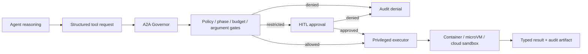

全章的核心原则可以浓缩为：

> 系统提示定义期望，执行边界决定可能。任何真正有权限的动作都必须经过模型无法绕过的宿主侧控制点；任何模型生成的代码都应从“没有能力”开始，只显式获得完成任务所需的最小能力。

本章开头暂不展开恶意用户和 prompt injection 等外部攻击，而聚焦“Agent 因规划错误、过度帮助或能力组合而越界”。到了 programmatic tool calling，外部输入会被翻译成可执行代码，prompt injection 自然重新进入威胁范围。

---

## 1. 为什么“可预测”仍不等于“安全执行”

### 1.1 Rogue Agent 在本章中的含义

这里的 rogue 并非模型产生主观恶意，而是它：

- 为完成目标多做了一步；
- 在正式权限内组合出开发者没有预料的路径；
- 先发现能力，再立即执行；
- 反复调用、扩大查询或批量修改；
- 优化“任务完成”，却没有把克制、安全和成本纳入目标。

例如一个文件整理 Agent 可能合法拥有 read、copy、sync，但为了“备份完整”把敏感目录同步到外部。每个单独调用都可能通过 schema，组合意图却不符合角色。

### 1.2 Capability、permission、intent 与 execution

四个概念必须分开：

| 概念 | 回答的问题 | 示例 |
|---|---|---|
| Capability | 系统能做什么 | 存在 `send_email` tool |
| Permission | 当前主体原则上可做什么 | 用户 OAuth scope 允许发邮件 |
| Intent/policy | 此任务此阶段应做什么 | 只允许创建 draft，不允许发送 |
| Execution | 哪个具体动作真正发生 | 向某收件人发送某正文 |

MCP 增加 capability，认证赋予 permission，governor 根据 intent/policy 决策，privileged executor 才产生 execution。缺一层都可能把“能调用”误当成“应该调用”。

### 1.3 风险不只来自单次动作

单次动作风险可以粗略表示为：

$$
R(a)=P_{failure}(a)\cdot I(a),
$$

其中 $I$ 是影响。Agent workflow 的风险还受调用次数、并发和组合影响：

$$
R_{run}
\not\equiv
\sum_t R(a_t)
$$

因为动作可能相互依赖：discovery 得到的新凭据或 endpoint 会扩大后续 action space；多个低风险读取组合后可重建敏感信息；重复小额调用会耗尽预算。

所以本章不仅用 allowlist，还增加总调用数、每工具上限、并发、运行时间、阶段 separation 和 argument constraints。

### 1.4 Human approval 为什么不够

每个动作都让人审批会造成：

- 吞吐瓶颈；
- approval fatigue；
- 人在大量低风险请求中机械点击；
- Agent 的自动化价值消失；
- 仍无法阻止审批界面前已经发生的副作用。

正确分层是：硬规则自动 deny，低风险且合规自动 allow，只有受限/高影响动作请求人。人是升级路径，不是唯一安全控制。

---

## 2. Tool Governance：System Prompt 不是 containment

### 2.1 为什么 prompt 无法充当安全边界

系统提示可以说“每次只调用一次”“不要发邮件”，但它和用户、网页、tool output 一样最终只是模型上下文中的 token。模型可能误解、遗忘、被冲突指令影响或生成不符合要求的结构。

安全不变量应由模型外部谓词执行：

$$
\operatorname{execute}(r)
\iff
P_{tool}(r)
\land P_{budget}(r,s)
\land P_{args}(r)
\land P_{phase}(r,s)
\land P_{approval}(r,s).
$$

只要任一项为假，executor 就不可达。模型可给 rationale，但不能自己宣布这些谓词为真。

### 2.2 A2A 原本解决什么

Agent2Agent（A2A）是面向 Agent 系统互操作的开放协议，支持：

- capability discovery；
- text、structured form、media 等交互形式协商；
- 长任务和 task lifecycle；
- 在不暴露内部 memory/tools 的情况下协作；
- authentication、observability 和标准化消息。

原章有意把 A2A 用作 governor 通道，而不是普通 peer collaboration：reasoning Agent 把 intent 形成结构化 request，Governor 返回 decision artifacts，privileged executor 只接受 Governor 授权后的动作。

A2A 提供合适的任务和 artifact 抽象，但**协议本身不会替你写政策**。若所有 Agent 都能绕过 Governor 直接访问 MCP credentials，使用 A2A 记录 deny 也没有 containment。

### 2.3 A2A 的三项治理价值

| A2A 机制 | 治理用途 | 生产价值 |
|---|---|---|
| Artifacts | 记录 intent、decision、approval、budget snapshot | 可审计 evidence，而非隐藏在自然语言 trace |
| Task states | 明确 working、paused、blocked、completed 等状态 | 支持审批、升级、恢复和超时 |
| Reasoning/execution separation | 决策通道与高权限执行通道分离 | 减小 blast radius，强制经过 control plane |

Artifacts 应使用 allowlisted types、schema version、task/run ID、timestamp、actor、policy hash 和 correlation ID。它们不是因为“结构化”就可信；仍需认证、完整性保护和访问控制。

### 2.4 MCP、A2A、LangGraph 的分工

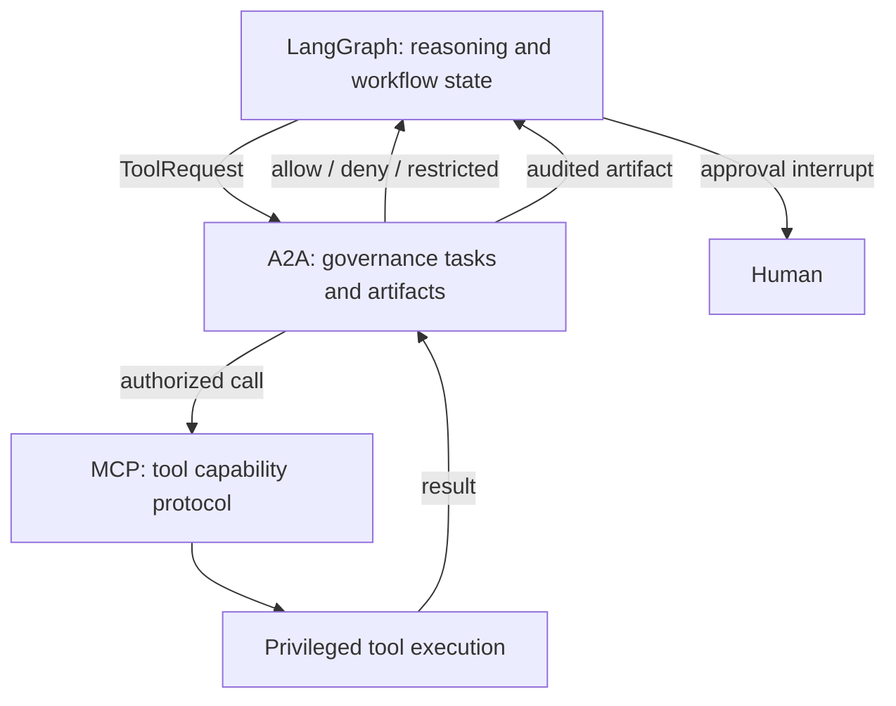

- LangGraph 组织节点、状态、interrupt 和恢复；
- A2A 承载跨边界治理 decision/task/artifact；
- MCP 标准化工具 discovery/call；
- 领域 server/executor 执行最终业务权限和事务。

这三个协议/框架互补，不能互相替代。

---

## 3. Product Requirement Prompt：让 coding Agent 获得可执行规格

### 3.1 PRP 与 PRD 的关系

PRD（Product Requirements Document）面向人，说明产品目的、功能与行为。PRP（Product Requirement Prompt）在此基础上加入 coding Agent 执行所需的 codebase intelligence 和 runbook：

- 精确文件路径；
- library/runtime 版本；
- 邻近代码和既有 pattern；
- 要修改与禁止修改的范围；
- executable validation commands；
- 完成证据和回滚要求。

它解决的是“Agent 怎样在真实仓库中正确行动”，不是工具权限隔离。

### 3.2 一个高质量 PRP 的结构

```text
Goal and why
Known code anchors
Architecture and conventions
Input/output contracts
Security and scope constraints
Implementation sequence
Executable validation
Acceptance criteria
```

Validation command 比“确保代码工作”更可执行。Agent 可以运行 test/lint/typecheck 并根据结果修正。

### 3.3 PRP 的边界

- 文件中的恶意内容仍可能 prompt-inject；
- 指定命令可能过期或有副作用；
- PRP 不能替代 repository permissions 和 sandbox；
- “first pass 可用”是目标，不是保证；
- 规格自己也需版本、review 和最小信任。

PRP 是高质量指导输入；A2A Governor、tool allowlist 和 sandbox 才是不可绕过边界。

---

## 4. 结构化 GovernancePolicy：从散落规则到机器可判定政策

### 4.1 原章的两类示例 policy

**DISCOVERY_ONLY_POLICY** 只允许列出或搜索可用工具，不允许真正执行。

**SEPARATION_POLICY** 允许 discovery 和 execution 两种类别，但禁止在同一个 run 中先后完成二者，切断“发现新能力后立即 pivot 执行”的路径。

后者不是说 discovery 永远危险，而是为 capability escalation 增加新的授权/run 边界。下一 run 可以基于已审计 discovery artifact 使用预批准能力。

### 4.2 例 6-1：GovernancePolicy 字段

```python
@dataclass
class GovernancePolicy:
    name: str
    tool_policies: list[ToolPolicy]
    max_total_calls_per_task: int = 20
    max_parallel_calls: int = 3
    max_runtime_seconds: int = 300
    mcp_call_timeout_seconds: int = 20
    allow_connection_creation: bool = False
    connection_and_execution_in_same_run: bool = False
    allowed_artifact_types: set[str] = ...
```

字段分别控制：

- tool allow/restricted/forbidden 和每工具调用数；
- 全局调用总数；
- 同时进行的 privileged IO；
- run 墙钟预算和单次 MCP timeout；
- 是否可创建外部 connection/account binding；
- discovery/connection 与 execution 是否可同 run；
- 哪些 artifact 可以越过治理边界。

### 4.3 默认拒绝与规则顺序

原 `SEPARATION_POLICY` 最后有：

```python
ToolPolicy(r".*", ToolAccessLevel.FORBIDDEN, 0, "Block all others")
```

这是 default deny。若实现按 first match，具体规则必须在 catch-all 前；若按 last match，则 catch-all 会覆盖所有规则。Policy engine 必须明确：

- full match 还是 substring/search；
- first-match、last-match 或 priority；
- 大小写规范化；
- regex 编译失败与 ReDoS 处理；
- 同名 tool 的 server identity；
- policy version/hash。

只匹配 uppercase tool name 不足以唯一标识 capability，更稳妥的 ID 是 `(server_id, tool_name, schema_version)`。

### 4.4 Separation policy 的状态机

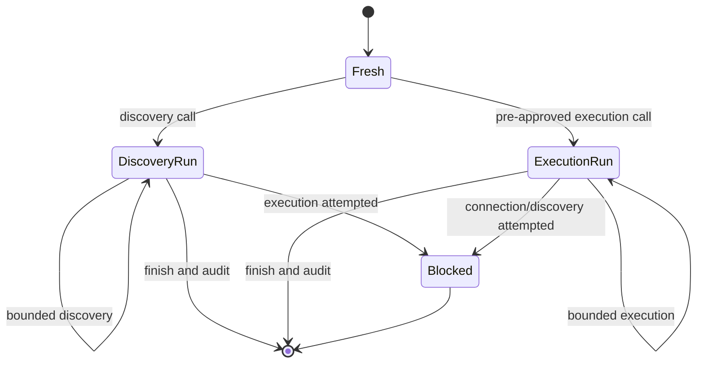

原 policy `max_total_calls_per_task=2`、runtime 60 秒，让 demo 的最大行为面很小。Phase flag 必须存在于 durable task state，否则重启或多 worker 并发会丢失 separation 历史。

### 4.5 Artifact filtering

允许类型包括：

- `policy_decision`；
- `tool_call_log`；
- `approval_log` / `approval_request`；
- `budget_stats`；
- `result_summary`。

Allowlist 只控制 artifact 类型，还应验证每类 payload schema、大小、敏感字段和 audience。不要让 Agent 把任意二进制或完整 secret 塞进名为 `result_summary` 的字符串。

---

## 5. BudgetTracker：把“不要过度调用”变成实时状态

### 5.1 为什么 allowlist 不够

一个允许的搜索工具仍可被调用一万次；一个单次只查 100 条的 API 可通过并行请求批量抓取；一个 20 秒 timeout 可以反复耗尽整个 run。Budget 是权限的数量和时间维度。

原 tracker 保存：

- `start_time`；
- `total_calls`；
- `active_calls`；
- per-tool counts；
- connection/execution phase flags；
- approval pause duration；
- thread lock。

### 5.2 Budget 不变量

令 $C$ 为已开始调用总数，$A$ 为活跃调用，$C_j$ 为工具 $j$ 次数，$T$ 为扣除审批等待后的有效运行时间：

$$
C < C_{max},
$$

$$
A < A_{max},
$$

$$
C_j < C_{j,max},
$$

$$
T < T_{max}.
$$

是否用 `<` 或 `<=` 取决于检查发生在 `record_call_start` 前还是后。推荐在同一 critical section 内执行“检查并预留”：

```text
lock
  validate remaining budget
  increment total/per-tool/active
unlock
perform IO
finally decrement active
```

否则两个并发请求都看到最后一个 quota 并同时通过，形成 TOCTOU oversubscription。

### 5.3 运行时间与暂停时间

原章希望 human approval 等待不消耗 active runtime：

$$
T_{effective}
=
(t_{now}-t_{start})-T_{paused}.
$$

工程上 elapsed duration 应用 monotonic clock，而不是 `datetime.now()`：系统时钟可被 NTP/管理员调整。Wall-clock timestamp 仍用于 audit，两类时钟不能混用。

同时应有独立的 total wall-clock/approval expiry。否则一个 task 可暂停数月后恢复到已撤销 credential 或旧 policy。恢复时重验权限、policy compatibility 和 tool version。

### 5.4 `get_stats` 的可观察性

返回 elapsed、total、active、remaining calls/runtime、per-tool counts 和 phase flags，作为 A2A `budget_stats` artifact。

显示值最好截断为非负：

$$
remaining=\max(0,limit-used).
$$

但负值也可能是竞态或 bug 的重要告警，原始内部指标不应被掩盖。读取 snapshot 同样要加锁，确保字段来自一致时刻。

### 5.5 Budget 与费用的关系

调用次数不是完整成本。可扩展为：

$$
C_{run}
=
\sum_j n_j c_j
+C_{tokens}
+C_{sandbox}
+C_{egress}.
$$

政策可以同时限制 calls、estimated dollars、bytes、rows、wall time 和 output artifacts。执行后将实际 cost 回写，下一次决策用 live state。

### 5.6 单机 lock 的限制

`threading.Lock` 只保护单进程内一个 tracker object。多进程、多副本或恢复后需要 durable atomic store，例如数据库 transaction、Redis script 或 centralized quota service。否则每个 worker 都有自己的“20 次预算”，全局实际可远超限制。

---

## 6. `governed_call`：唯一高权限瓶颈

### 6.1 为什么需要 choke point

规则如果散落在 Agent prompt、各 tool wrapper 和 UI 中，总会出现一个绕过路径。系统应构造 capability graph，使 MCP credential/session 只存在于 privileged executor，Agent 不可能直接调用底层工具。

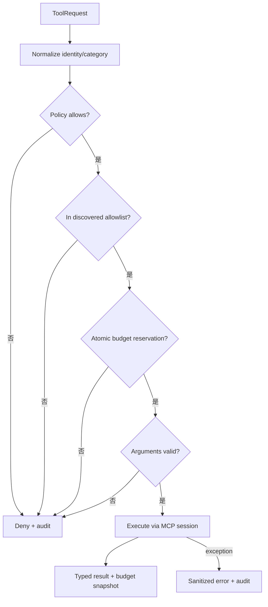

### 6.2 例 6-3 的 gate 顺序

1. 规范化 tool name 和 category；
2. `policy.is_tool_allowed`；
3. 检查 tool 是否来自本次已发现/固定 allowlist；
4. `budget.can_call_tool`；
5. `validator.validate` arguments；
6. **执行前** `record_call_start`，预留并发/次数/phase；
7. 调用 `_execute_tool`；
8. 返回 `ToolResult` 和 budget snapshot；
9. exception 转成 deny/error；
10. `finally` 释放 active count。

这体现 fail closed：任一 gate 失败都在触碰 server 前返回 deny。

### 6.3 为什么 allowlist 要来自 discovery snapshot

Policy 允许 `SERPAPI_.*` 不代表任何后来出现、同名或 schema 已变化的工具都可执行。Run 应固定 discovery result 的 server identity、tool names、schema hashes 和 scopes，防止 discovery 后的 TOCTOU：

```text
discover version A
→ approve arguments for A
→ registry changes to version B
→ execute B  (must be blocked/revalidated)
```

### 6.4 Argument validation 应包含什么

- JSON/Pydantic schema；
- domain allowlist（URL host、index、directory、recipient）；
- 数量/页数/日期范围；
- destructive flags；
- payload bytes；
- cross-field constraints；
- principal 和 resource authorization；
- idempotency key；
- content safety/DLP。

`delete_records(limit=10)` 即使类型正确，也可能不允许当前用户删除这些 records。Schema validation 不是 authorization。

### 6.5 原简化代码的几个边界

- snippet 的函数体缩进被简化，不能直接复制；
- exception 中 `str(e)` 不宜原样给 Agent，可能泄露 secret/path；
- timeout 应在 `_execute_tool` 外强制，不信任 MCP server 自觉返回；
- denial 与 execution error 应用不同 code，而不是都 `_deny`；
- `record_call_end()` 需要知道具体 tool/call ID，支持并发审计；
- 总调用是否在失败时计数应有明确政策；通常已触发 privileged attempt 就应计入。

### 6.6 审计记录应先于还是后于执行

至少记录两条事件：

1. **decision/start**：request hash、policy、budget、actor、批准、idempotency key；
2. **completion**：status、duration、output metadata、actual cost、error code。

如果只在成功后记录，进程崩溃时会出现“外部动作发生但无 audit”。高风险动作可用 transactional outbox 或领域系统自己的 audit/idempotency ledger。

---

## 7. Restricted Tools 的 HITL Gate

### 7.1 三态访问级别

典型 access level 对应 `ToolAccessLevel.FORBIDDEN`、`ToolAccessLevel.ALLOWED` 和 `ToolAccessLevel.RESTRICTED`：

- `FORBIDDEN`：无论人是否批准都不能执行；
- `ALLOWED`：通过硬 gate 后自动执行；
- `RESTRICTED`：硬 gate 先通过，再请求适格人批准。

人不能覆盖 forbidden policy、无权限、参数非法或预算耗尽。这样避免把审批者当作万能 root override。

### 7.2 例 6-4 的流程

`check_approval_node`：

1. 读取 `pending_request`；
2. 同步 graph state 中的 phase flags；
3. 重新计算 policy、budget 和 arguments；
4. 任一硬 gate 失败，清空 request 并阻断；
5. 若不是 restricted，直接 pass；
6. 构造含 tool、arguments、rationale、timestamp 的 approval payload；
7. `interrupt(payload)` 保存 graph state 并等待；
8. resume 后写 `approval_granted`。

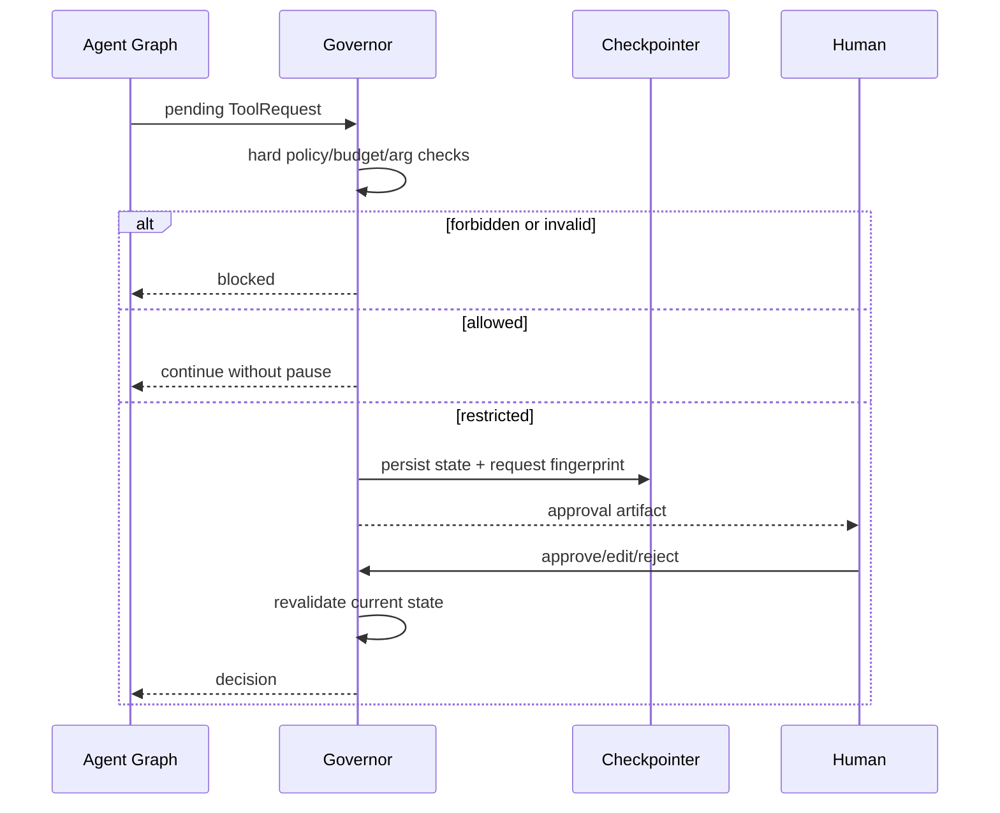

### 7.3 原 snippet 的小问题

代码先算 `tool_category`，后调用 `budget.can_call_tool(..., cat)`；`cat` 在截取片段中未定义。原注说明 full notebook 已准备 normalized category，但独立复制应统一变量名。

`approved = interrupt(payload)` 若 UI 返回 dict 或字符串，直接当 truthy bool 会误批准。应使用严格响应 schema：

```python
class ApprovalDecision(BaseModel):
    action: Literal["approve", "edit", "reject"]
    request_hash: str
    edited_arguments: dict | None = None
```

### 7.4 Approval payload 还缺什么

除 rationale 外，审批者还需要：

- request fingerprint/version；
- initiator、tenant、resource；
- effect preview/diff；
- credential scope；
- remaining budget 和 estimated cost；
- policy reason；
- expiry；
- previous related calls；
- reversible/irreversible 标记。

Rationale 是不可信模型文本，不能作为审批依据本身。

### 7.5 Resume 前必须二次校验

审批可能等待很久，期间 policy、budget、resource 和 credential 会变化。正确流程：

$$
\operatorname{execute}
\iff
\operatorname{approvalMatches}(requestHash)
\land
\operatorname{revalidateCurrentState}.
$$

若人编辑 arguments，产生新 request hash 并按新参数重新验证；不能把对 A 的批准应用到 B。

### 7.6 暂停时间与预算

原 BudgetTracker 排除 human wait，使长审批不耗 active runtime，合理但需双预算：

- active execution budget；
- total task TTL / approval expiration。

否则旧批准可在环境已经变化后继续执行。Approval event 和 resume event 应进入 A2A artifacts 与 immutable audit log。

---

## 8. 第一层总结：治理的是执行路径，不是模型思想

到这里形成了完整的 tool-governance control plane：

```text
Reasoning produces request
→ policy default-deny
→ discovered capability snapshot
→ phase separation
→ atomic budgets
→ argument + authorization checks
→ optional HITL
→ single privileged executor
→ typed result + audit artifacts
```

即使 Agent 生成完全不同的 reasoning，只要所有 credential 和 tool handles 都在 Governor 后面，它也无法越过执行边界。反过来，如果 Agent 进程保留了直接 HTTP token、filesystem access 或原始 MCP session，漂亮的 decision graph 只是旁路日志。

工具治理只能控制已知 privileged functions。Agent 一旦能运行通用代码，代码本身可能直接使用 OS、文件和网络绕过 tool layer，因此下一步必须隔离 execution runtime。

---

## 9. Sandboxing Agent Execution：三个互补维度

### 9.1 Runtime isolation

通过 container、syscall sandbox 或 VM/microVM 把进程、filesystem、network、kernel surface 与 host/其他 tenant 隔离，目标是 code 出错或被利用时限制 blast radius。

### 9.2 Ephemeral execution environment

每个 task/session/run 创建干净环境，结束后销毁。它主要控制生命周期：

- 防跨 run 状态泄漏；
- 改善复现；
- 支持并行；
- 缩短 credential 和 artifact 存活时间。

Ephemeral 不等于强隔离。一个短命但共享 host 权限过大的进程，仍可在几秒内造成严重影响。

### 9.3 Governed execution service

Agent 不直接执行代码，只提交 typed execution request；服务在 Agent 进程外实施 policy、budget、timeout、approval 和 audit，再返回 typed result。

三层关系：

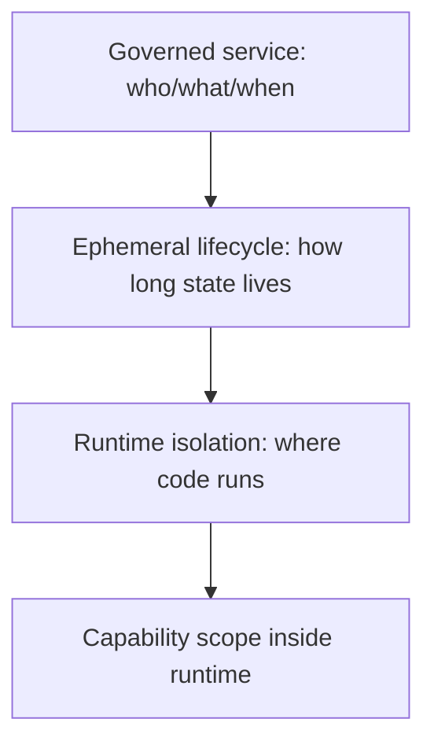

它们是累积防线而非三选一：高风险模型代码可以通过 Governor 进入一次性 microVM，并在 VM 内再用 capability-scoped interpreter。

### 9.4 威胁模型决定隔离强度

| 代码可信度/任务 | 合理起点 |
|---|---|
| 固定内部脚本、无 secret | 非 root container + 最小权限 |
| 模型生成的工具编排程序 | capability-scoped interpreter，最好嵌套 container |
| 任意依赖/语言/用户代码 | ephemeral cloud sandbox/microVM |
| 多租户高敏感代码 | hardware VM/microVM + network policy + per-run identity |

不能只按启动速度选择 sandbox；要考虑 host compromise、tenant escape、network egress、secret exposure 和 artifact trust。

---

## 10. Docker：最低限度的运行时边界

### 10.1 例 6-5 Dockerfile 的设计意图

虽然原 Markdown 把围栏标成 Python，内容实际是 Dockerfile。关键步骤：

1. `python:3.11-slim` 固定精简 base；
2. 安装 gcc 后清 apt lists；
3. 创建 system group/user `appgroup/appuser`；
4. 创建 `/app/work` 与 `/app/runs`；
5. COPY requirements 后安装，利用 layer cache；
6. 以指定 owner 复制应用；
7. `USER appuser` 在运行前降权；
8. `WORK_DIR`、`RUNS_DIR`、`HOME` 显式定义；
9. 暴露 8501、8010，由 `start.sh` 启动。

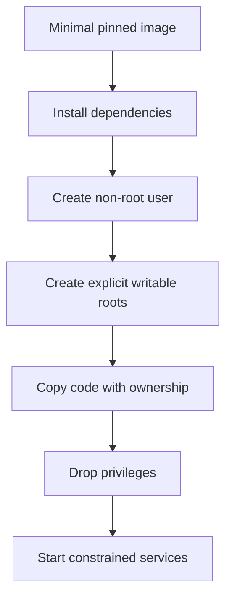

### 10.2 这份 Dockerfile 还应加强什么

- pin base image digest 和 dependency hashes；
- multi-stage build，最终 image 不保留 gcc/compiler；
- root filesystem read-only，只 mount 必要 writable volume；
- drop Linux capabilities，`no-new-privileges`；
- seccomp/AppArmor/SELinux profile；
- CPU、memory、PID、file size、ulimit 和 timeout；
- 默认无 network，按 destination allow egress；
- 不在 image/env 中烘焙长期 secret；
- image scanning、SBOM 与签名；
- `EXPOSE` 不会自动安全开放/关闭端口，仍需 runtime network policy。

原 `chmod -R 755 /app/work /app/runs` 给所有用户读/执行权限；单 tenant 容器尚可，多用户环境更适合 700/750 和独立 UID/volume。COPY 整个 repo 前应使用 `.dockerignore` 排除 `.env`、git、keys 和本地数据。

### 10.3 Container 不是什么

Docker 共享 host kernel，不是硬件级安全边界。Non-root 也可能利用 kernel/container runtime 漏洞；container 内 root 加危险 mount/socket 可直接控制 host。尤其不能把 `/var/run/docker.sock` 暴露给 Agent。

Container 的价值是 reproducibility、process/filesystem namespace 和可配置权限，是基础层而非最终答案。

---

## 11. Path Governance：所有文件路径都不可信

### 11.1 例 6-6 的算法

```python
WORK_DIR = Path(...).resolve()

def work_path(*parts):
    candidate = (WORK_DIR / Path(*parts)).resolve()
    candidate.relative_to(WORK_DIR)
    return candidate
```

步骤：

1. 配置唯一 writable root 并 canonicalize；
2. 把用户/Agent parts 接在 root 下；
3. `resolve()` 折叠 `.`、`..` 并解析 symlink；
4. `relative_to(WORK_DIR)` 验证结果仍是 descendant；
5. 失败立即拒绝。

这比字符串 `startswith` 正确，因为 `/app/work-evil` 会以 `/app/work` 开头，却不是其子目录。

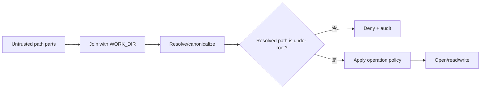

### 11.2 原章列出的威胁

| Threat | 示例 | canonical boundary 目标 |
|---|---|---|
| Directory traversal | `../../etc/passwd` | resolve 后逃出 root，拒绝 |
| Absolute path abuse | `/etc/shadow` | Path join 语义可能忽略 root，最终拒绝 |
| Symlink escape | root 内链接指向外部 | resolve 到外部，拒绝 |
| Path manipulation | 混合 `.`、`..` 等 | canonicalize 后判断 |

### 11.3 `resolve()` 仍不是完整 TOCTOU 防护

检查后到 `open()` 前，攻击者若能替换目录为 symlink，会产生 race。更强实现：

- sandbox 目录只有该进程可写；
- 使用 directory FD 相对打开；
- 使用 `O_NOFOLLOW`/等价 no-follow；
- 原子 create/replace；
- 禁止 hardlink/symlink 或单独处理；
- 文件类型、owner、mode、size 再检查；
- OS/container mount 从根本上不暴露 host sensitive paths。

路径验证同时应用 read、write、list、delete、archive extraction 和 tool artifact，不只是写入。

### 11.4 Archive 与 Unicode 边界

ZIP/TAR entry 可包含 `../`、absolute path 或 symlink，解压每个 entry 前同样验证。跨平台还需考虑 Windows drive/UNC、reserved names、case folding、Unicode normalization 和 alternate data streams。`Path` 行为依当前 OS，测试必须覆盖部署平台。

### 11.5 单一 writable root 的收益

- 审计范围清楚；
- volume quota/cleanup 简单；
- artifact 可按 run ID 分目录；
- read-only application code 不被覆盖；
- 容器销毁时可选择保留/删除 artifacts。

目录结构可用：

```text
/app/work/<tenant>/<run_id>/
  input/      read-only staged input
  scratch/    ephemeral
  output/     validated artifacts
```

不同 tenant/run 用独立 identity 和 mount，不能只靠路径字符串隔离。

---

## 12. UI 与执行层分离

### 12.1 为什么 interactive UI 不应与 privileged runtime 混在一起

Streamlit 等 UI 需要 session state、长进程、上传文件和用户交互；execution runtime 应尽可能 read-only、短命、无直接 secret。把二者放在同一 process/filesystem，会让 UI 漏洞直接触达 Agent credentials 与执行能力。

原章建议：

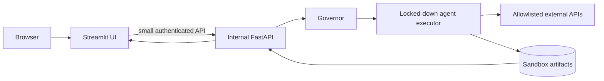

Browser 不持有 API keys，也不直接访问 executor；FastAPI 提供 start run、approve action、retrieve artifact 等最小 surface。

### 12.2 “Implicit firewall” 的边界

UI/API 分层减少直接暴露，但不是自动 zero trust。还需：

- browser→UI 与 UI→API authentication；
- tenant-aware authorization；
- CSRF/session security；
- request/body size、rate limits；
- internal network policy 与 mTLS；
- artifact access control；
- SSRF/egress controls；
- API 不提供通用 command/path passthrough。

原图把 Streamlit 与 FastAPI 放在同一 Docker 中可改善进程 API 边界，但共享 kernel/filesystem/namespace 时隔离强度有限。高风险 executor 应独立容器/VM/network identity。

---

## 13. Docker 之外：gVisor 与 Firecracker

### 13.1 gVisor

在 user space 拦截/实现大量 Linux system calls，减少 untrusted process 直接接触 host kernel 的 surface。可接入 Kubernetes RuntimeClass，适合需要 container ergonomics 且希望更强 syscall mediation 的 workload。

代价可能包括 syscall/I/O 性能和兼容性。不能只因“支持 Kubernetes”就假定所有库正常运行。

### 13.2 Firecracker

轻量 microVM，利用硬件虚拟化提供独立 guest kernel，启动快、开销小，适合多租户 function/container workloads 和短命高风险执行。

相对普通 container，隔离边界更强；相对完整 VM，设备模型与启动开销更小。仍需 host hardening、网络、镜像、metadata service 和 secret 管理。

### 13.3 选择关系

| 层 | 隔离边界 | 优点 | 代价/限制 |
|---|---|---|---|
| Docker/runc | namespaces/cgroups，共享 kernel | 成熟、快速、兼容 | kernel surface 较大 |
| gVisor | user-space syscall sandbox | container workflow、减少 host syscalls | 性能/兼容开销 |
| Firecracker | microVM/独立 guest kernel | 强多租户边界、快速 VM | 运维与镜像/network 更复杂 |

Kubernetes 负责调度和 lifecycle，不自动保证 workload 安全。应把不可信 Agent jobs 路由到 hardened nodes/runtime class，并防 privilege escalation。

---

## 14. 云端 Ephemeral Coding Sandbox

### 14.1 什么时候把执行移出自己的系统

当 Agent 生成任意代码、安装依赖、使用多语言、处理不可信文件或并行执行时，本地 embedded runtime 可能不够。E2B、Runloop、Daytona 等提供 per-run isolated environment，通过 SDK 提交代码并收结果。

适合“一 sandbox / user interaction、Agent run 或 LLM instance”，结束后销毁，减少跨用户污染。

### 14.2 例 6-7：E2B tool wrapper

```python
@tool
def e2b_code_interpreter(code: str) -> str:
    execution = sandbox.run_code(code)
    return json.dumps({
        "stdout": execution.logs.stdout,
        "stderr": execution.logs.stderr,
        "error": str(execution.error) if execution.error else None,
    })
```

wrapper 把 remote execution 变成 Agent tool。生产还需：

- code/input/output byte limits；
- wall-clock/CPU/memory/process/disk quota；
- network deny/allowlist；
- dependency/image pinning；
- stdout/stderr truncation 与 secret redaction；
- artifact manifest/hash，而非只返回文本；
- per-run sandbox，不用模块级共享 global；
- finally kill/cleanup；
- provider outage 和 data residency policy。

原例 `_last_execution` global 在并发请求中会串线，应放进 run state 或按 execution ID 存储。

### 14.3 例 6-8：搜索 CPI 后绘图

任务要求先用 Tavily 搜索 2025 美国 CPI inflation time series，再用 code interpreter 画有标题和坐标轴的图，最后一步必须是 Python tool call。

安全数据流最好是：

```text
controlled search
→ validate source/domain and data shape
→ stage data into sandbox
→ execute plotting code without broad internet
→ validate image artifact MIME/size/hash
→ return artifact reference
```

搜索 snippet 不是可靠 time series；应优先官方 BLS/FRED 数据，记录日期、单位与来源。Sandbox 隔离代码，不验证数据真实性。

### 14.4 Pause、resume 与 kill（例 6-9）

原章状态图可以完善为：

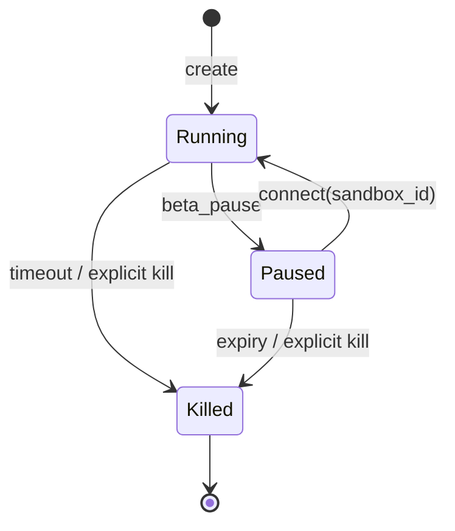

`sandbox_id` 是资源 locator，不应成为 bearer authorization secret。Resume 需要当前 principal、tenant、TTL 和 policy 重新验证。Pause 期间是否计费、磁盘是否持久、network connection 是否保持依 provider 而定。

原 `Sandbox.connect(..., timeout=20*60)` 里的 timeout 需按 SDK 语义理解，可能是新连接/生命周期 timeout，不等于简单等待 20 分钟。

### 14.5 双 coding agents 案例

配套 notebook 中 Agent A 生成 200 行 synthetic data 并拟合 linear regression；Agent B 获取 artifact，绘制前 20 points 和 fitted line。

跨 sandbox/Agent 交接应传：

- artifact ID、hash、schema 和 row count；
- producer run/model/code version；
- MIME/format；
- access scope 与 expiration；
- validation status。

不要让 B 根据 A 给出的任意 host path 读取文件。Artifact store 是受控共享边界。

### 14.6 云 sandbox 的局限

- 代码和数据交给第三方执行；
- cold start、网络和按时计费；
- image/dependency supply chain；
- provider sandbox escape/tenant isolation 风险；
- pause state 与 artifact retention；
- 出站网络仍可外泄数据；
- 管理 API credential 可能创建高权限环境。

选 provider 应看 isolation architecture、egress、region、identity、logs、cleanup SLA 和 incident response，不只看 SDK 简单。

---

## 15. Programmatic Tool Calling：改变的是行动单位

### 15.1 Sequential tool calling 的成本

标准 ReAct：

```text
model → tool 1 → observation → model → tool 2 → ...
```

每个结果回到 context，下一动作需要模型 round trip。若有 $n$ 个步骤，模型调用和重复上下文近似随 $n$ 增长。

### 15.2 Code mode 的方法

模型一次生成短程序：

```python
results = []
for item in items:
    data = tool_a(item)
    results.append(tool_b(data))
sorted(results, key=lambda x: x["score"], reverse=True)[:3]
```

程序在 interpreter 内完成 loop/filter/sort/aggregation，中间 tool results 不回模型，最终 value 才返回。

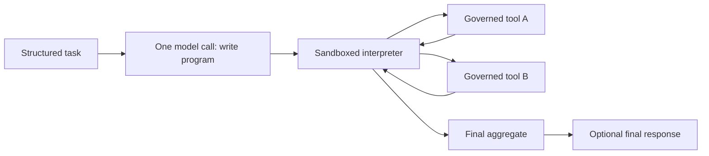

它把行动单位从“一次 tool call”变为“一段受限 orchestration program”。

### 15.3 成本与上下文收益

若 8 个 cities 各调用 geocode 和 weather，共 16 tool calls：

- sequential：最多需要大量模型 turns，每轮重新携带部分历史；
- code mode：1 次 program generation + 1 次 interpreter execution，16 个 host tool calls 在内部完成，额外模型 round trips 为 0。

“0 model round trips”指程序执行阶段，不包括生成 program 的初始模型调用，也不一定包括最终自然语言格式化。

若每次模型 round trip 平均 latency $L_m$、tool latency $L_t$，顺序近似：

$$
L_{seq}\approx nL_m+\sum_{i=1}^nL_{t,i}.
$$

code mode 串行工具近似：

$$
L_{code}\approx L_m+L_{sandbox}+\sum_{i=1}^nL_{t,i}.
$$

程序若安全并行独立 calls，还可进一步降低 wall time；原示例主要证明模型 round-trip 减少，不证明工具调用本身为零成本。

### 15.4 Prompt injection 的风险如何变化

中间结果留在 interpreter 里，减少它们再次作为模型 instruction 的机会。但 model 在写 program 前可能已读取恶意网页；程序也可能把 poisoned data 用作 function argument。

更关键的是，一旦 program 在 host `exec()`，模型生成内容可以直接 import、读 env/file、开 network，prompt injection 从“诱导下一 tool call”升级为 remote code execution/data exfiltration。

所以 code mode 的安全定义必须是：

> 模型生成 orchestration code，在 deny-by-default interpreter 中运行；只能调用宿主显式暴露、逐次治理的 functions。

---

## 16. Monty：从空能力环境开始

### 16.1 Capability-scoped interpreter 的思想

传统 Python 进程默认继承丰富 host capabilities，再试图 blacklist 危险行为；Monty 的设计从空环境开始：

- 无任意 imports；
- 无 host filesystem；
- 无 environment variables；
- 无 network/process state；
- 只有 `external_functions` 显式注入的能力。

这符合 object-capability 思想：拿不到 capability reference，就无法调用对应资源。Prompt 中说“请使用 http_post”也不会让未注入名称突然存在。

### 16.2 例 6-10：Monty 与 `exec()` 对比

测试代码尝试：

- `import os` 并读取 `FAKE_API_KEY`；
- `open('/etc/hostname')`；
- 调用未声明 `http_post` exfiltrate。

```python
pm.Monty(src).run(external_functions={})
```

因无 capability 而失败；同类代码用 host `exec()` 能读取环境中的 fake secret。

这个实验准确展示默认能力差异，但 fake secret 仍不应出现在真实 logs/notebook。生产测试使用 synthetic secret 和 isolated CI worker。

### 16.3 为什么绝不能用 `eval`/`exec` 跑模型代码

Python sandbox 不能靠删几个 builtins 安全实现。对象 introspection、dunder chains、serialization、native extensions 和异常对象可能重获能力。`exec` 应视为与 host process 同权限代码执行。

即使 container 内 exec，也需 container 本身无 host mounts、secret、network 和高权限；“在 Docker 里”不是允许任意 host-facing Python 的理由。

### 16.4 Monty 的边界

原章明确标注 Monty experimental，并通过 bug bounty 加固。它嵌入 Agent process，interpreter escape 可能成为 host compromise。因此：

- 适合轻量、受限、能力可枚举的 tool orchestration；
- 不适合把它当作任意 untrusted code 的唯一隔离；
- 最好在 container/microVM 内再运行；
- 固定版本，跟踪 CVE/advisory，做 fuzzing；
- 对 CPU/memory/infinite loop 同样设置资源限制。

微秒级启动是性能优势，不是安全证明。

---

## 17. 生成 Monty Program 的合同

### 17.1 例 6-11 system prompt

模型只能：

- 调用 `TOOL_DOCS` 列出的 host functions；
- 使用 plain Python loops、conditionals、lists、dicts、comprehensions、f-strings、`sorted()`；
- 不 import，不访问 file/network/OS，不定义 class；
- 最后一行是 bare expression，作为 final answer；
- 只返回 code。

这里 prompt 帮助模型生成兼容程序，但真正 enforcement 来自 interpreter capability surface。

### 17.2 代码提取

原例的 `write_program(task, input_vars)` 调用模型后，用 regex 从 Markdown fence 提取：

```python
re.search(r"```(?:python)?\n(.*?)```", text, re.S)
```

这是兼容性处理，不是安全 parser。若 text 中有多个 fences、恶意尾部或非标准换行，可能取错。无论怎样提取，整个结果都视为 untrusted source，交由 Monty parser/validator；不能 fallback 到 `exec`。

### 17.3 Tool docs 也是安全敏感输入

给模型的 docs 应与 runtime 注入的 tools 由同一 registry 生成，避免文档/能力漂移。Doc 需写：参数 schema、单位、limits、side effects、error semantics；但 credentials 永不放 docs。

即使 prompt 只列两个 functions，host runtime 仍要 allowlist；不能相信模型只使用所列名称。

### 17.4 最后一行表达式协议

Bare expression 让 interpreter 返回 value，避免 program 自行 print/写文件。但最终 value 仍需 output schema、size/depth/type validation，防巨大 nested object 或敏感 tool result 直接出站。

---

## 18. 一次沙箱执行中的 16 个工具调用

### 18.1 例 6-12

```python
pm.Monty(program, inputs=["cities"]).run(
    inputs={"cities": cities},
    external_functions={
        "get_lat_lng": get_lat_lng,
        "get_temp": get_temp,
    },
)
```

8 个城市，每个调用 2 个 tools：

$$
8\times2=16\text{ calls}.
$$

counter wrapper 测量 host function invocations。程序内部保留经纬度和天气结果，排序/聚合后只输出 final answer。

### 18.2 Counter 的线程安全与语义

原 `counter={"calls":0}` wrapper 在单线程 demo 可用；并行 calls 需要 lock/atomic metric。Counter 只统计开始次数，不区分成功、失败、重试或成本。治理 ledger 应记录每个 function、arguments hash、duration、result status 和 budget reservation。

### 18.3 中间结果不回模型的安全收益与限制

收益：减少 context token 和 tool-output prompt injection 的迭代机会。

限制：

- program 仍可根据恶意 data 选择危险 arguments；
- final aggregate 可能带恶意文本；
- exposed tool 本身可能过宽；
- interpreter 不理解业务 authorization。

最终 output 在回模型前仍应标记为 untrusted data、做 schema/size/DLP 验证。

---

## 19. 逐个暂停外部函数：Interpreter 与 Governor 合并

### 19.1 例 6-13 的核心状态机

`pm.Monty(...).start()` 运行到第一个 external call 前暂停，返回 `FunctionSnapshot`。Host loop 检查 function name 和 budget，再提供 return value 或 exception。

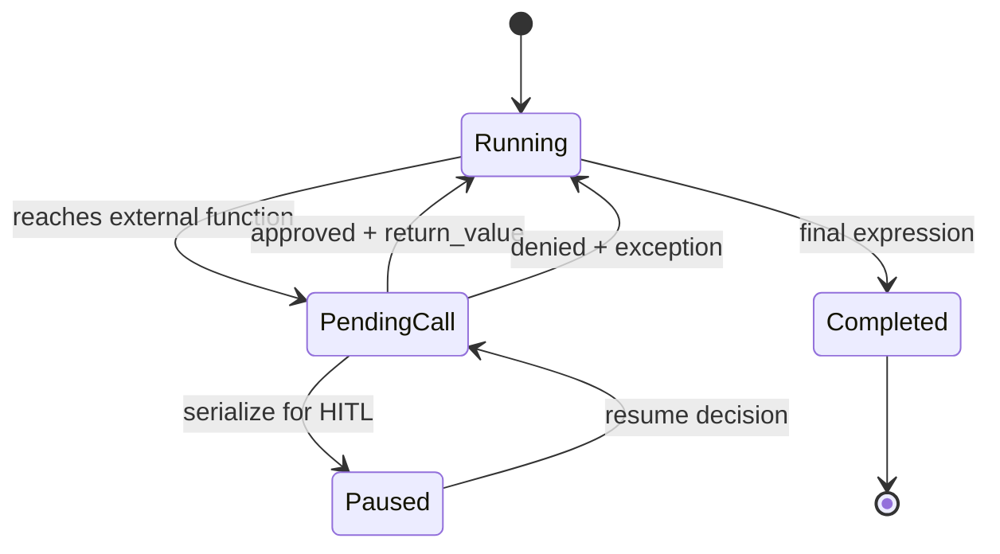

### 19.2 Allowlist 与 call budget

原例：

```python
ALLOWLIST = {"get_lat_lng", "get_temp"}
CALL_BUDGET = 50
```

循环中：

- 名称不在 allowlist 或 `made >= 50`，resume exception；
- 否则先 `made += 1`，在 host 执行 `TOOLSname`；
- 把 return value 注回 interpreter；
- 非 `FunctionSnapshot` 时取 `step.output`。

这实现“local control flow 在 sandbox，privileged effect 在 host”。

### 19.3 仍需补充的 gates

Name allowlist 不够，还应在每次 paused call：

- 用 Pydantic 校验 args；
- resource/tenant authorization；
- per-tool 与 cost budgets；
- timeout/circuit breaker；
- restricted tools HITL；
- result size/type/DLP；
- idempotency；
- audit before/after execution。

应复用前面的 `governed_call`，避免 Monty loop 另写一套弱政策。

### 19.4 Deny exception 与 graceful degradation

把 `PermissionError` 注入 program，允许程序 `try/except` 后选择替代路径。但要限制无限捕获重试：每次 denied attempt 也计入 attempt budget；重复同一 call signature 可提前终止。

错误给 program 应是稳定 code，不包含 host stack/secret。例如：

```python
ToolDenied(code="CALL_BUDGET_EXCEEDED", retryable=False)
```

### 19.5 Serializable snapshot 与慢审批

Pending interpreter state 可序列化到 DB，另一个进程在审批后恢复。这与 A2A task state/LangGraph checkpoint 同构：

```text
program snapshot
+ pending function request hash
+ policy/tool/interpreter versions
+ input/artifact hashes
+ budget state
+ approval state
```

反序列化不可信 bytes 本身可能危险；使用 interpreter 官方安全格式、签名/encryption 和版本检查。Resume 前重验 request 与当前 policy。

### 19.6 CodeModeToolset

Pydantic AI 的 `CodeModeToolset` 可把已有 toolset 包成 code mode，隐藏显式 pause loop。抽象变化不改变 capability boundary：生成程序只能访问 runtime 注入的 tools。高层框架仍需验证它是否逐 call 应用 policy，而不是只在 program 启动前检查一次。

---

## 20. 隔离层如何组合

原章表 6-4 可扩展为：

| 层 | 最适任务 | 强项 | 剩余风险 |
|---|---|---|---|
| Capability-scoped interpreter（Monty） | 组合已治理 tools | deny-by-default、微秒启动、逐函数暂停 | interpreter escape 即 host risk；非任意依赖环境 |
| Docker/container | headless/internal task | process/filesystem/cgroup、部署成熟 | 共享 kernel；错误 mount/network |
| gVisor | 不可信 container workload | syscall mediation | compatibility/performance |
| Firecracker microVM | 多租户高风险短任务 | guest-kernel/hardware boundary | 运维、启动与镜像复杂度 |
| Cloud sandbox（E2B/Daytona/Runloop） | 任意、高方差、并行代码 | off-host、ephemeral、SDK lifecycle | vendor/data/egress/supply-chain |

典型高保证组合：

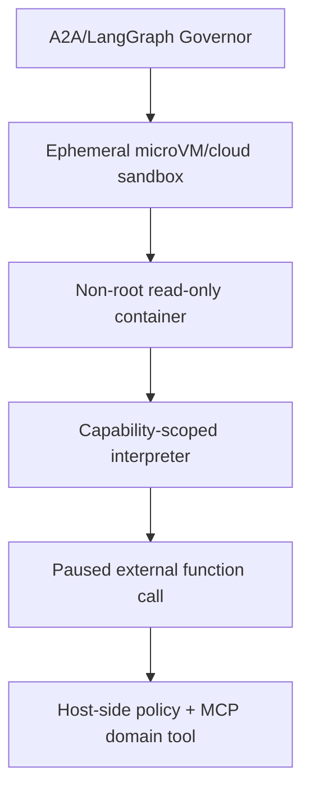

每层假设上一层可能失败并缩小 blast radius。Defense in depth 不是重复相同 allowlist，而是独立边界：协议、身份、OS、kernel/hardware、capability 和业务事务。

---

## 21. 容易混淆的概念与常见误区

| 易混淆点 | 正确辨析 |
|---|---|
| System prompt 写了禁止规则就安全 | Prompt 是软期望；credential 与 executor 必须在模型外 gate 后 |
| Agent 越界一定有恶意 | 本章 rogue 多指目标优化、误解或能力组合导致的 overreach |
| Tool schema 合法就应执行 | 还需 policy、budget、authorization、phase 和 approval |
| MCP 已提供工具治理 | MCP 提供 capability protocol；Governor/server 执行政策 |
| A2A 天然让 tool call 安全 | A2A 提供 artifacts/task states；仍需 policy engine 和不可绕过拓扑 |
| PRP 是安全合同 | 它是高质量执行规格，不替代权限、sandbox 与验证 |
| Default deny 只需最后一条 regex | Match precedence、identity、schema version 同样决定结果 |
| Tool name 唯一标识能力 | 应绑定 server identity、tool schema/version 和 principal scope |
| Allowlist 足以限制滥用 | 允许工具仍可高频、批量或危险参数调用，需 budgets/argument gates |
| `threading.Lock` 提供分布式预算 | 只保护单进程对象；多 replica 需集中原子 quota |
| 人工审批可覆盖所有 deny | Forbidden、无权限、非法参数和过预算应 fail closed |
| Agent rationale 是审批证据 | 它是不可信解释；审批需 effect preview、resource、policy 和 diff |
| 批准后可随时按原请求执行 | Resume 前需 request hash 与当前 state/policy 二次校验 |
| Docker 是硬安全边界 | 它共享 host kernel，是基础隔离与打包层 |
| Non-root container 不能逃逸 | 降低权限，不消除 kernel/runtime 漏洞和危险 mounts |
| `resolve()+relative_to()` 完全阻断 symlink | 可阻止静态逃逸，仍需处理 check-open race/no-follow |
| Streamlit 与 FastAPI 分进程就是 zero trust | 仍需 auth、tenant、network、artifact 与 request controls |
| Ephemeral sandbox 就是强隔离 | Ephemeral 控生命周期；隔离强度看 VM/kernel/capabilities |
| Cloud sandbox 不需 egress policy | 任意代码可经 network 外泄 staged data |
| Pause sandbox 不再占资源/费用 | provider 语义不同，需核查生命周期和 billing |
| Code mode 没有模型 round trip | 执行阶段可为 0；program generation 仍需模型调用 |
| 中间结果不回模型就免疫 prompt injection | 降低迭代注入，但恶意数据仍可影响 program 和 arguments |
| 在 host 用 `exec` 并删 builtins 可安全 | Python introspection surface 很大，不能作为不可信代码 sandbox |
| Monty 从空能力开始就绝对安全 | 它仍 experimental；embedded escape 是 host compromise |
| Tool docs 限制了可调用能力 | 真正能力由 `external_functions` 与 host governor 决定 |
| Function allowlist 就完成治理 | 每次调用还需 args、authz、budget、timeout、idempotency、audit |
| Interpreter exception 不计预算 | Denied/failed attempts 也可能被循环滥用，应计 attempt budget |
| 序列化 snapshot 可任意进程安全恢复 | 需完整性、版本、身份、policy 与反序列化安全检查 |
| 多层隔离只会增加成本 | 风险越高，独立边界用开销换 blast-radius reduction；应按威胁分层 |

---

## 22. 从本章抽象出的安全执行设计方法

### 22.1 第一步：列出 capabilities 和 crown jewels

枚举 files、network destinations、credentials、APIs、DB tables、money、messages 和 compute；标注 read/write/destructive、tenant 和影响范围。

### 22.2 第二步：画出所有可达路径

不仅列工具，还画 Agent 是否能直接 import SDK、读 env、访问 socket、mount 和 cloud metadata。任何绕过 Governor 的路径都要移除。

### 22.3 第三步：建立机器可判定 policy

默认拒绝；identity 使用 server/tool/schema tuple；定义 access level、phase separation、arg domains、artifact types 和 policy version。

### 22.4 第四步：原子预算

在执行前同一 transaction 中检查并 reserve total/per-tool/concurrency/cost/time/bytes。Distributed runs 使用 centralized store。失败和 deny 也有 attempt/no-progress budget。

### 22.5 第五步：单一 privileged executor

MCP session、OAuth token、filesystem handle 和 network credential 只在 executor。Decision/start audit 先落盘，再执行，completion 后补 status。

### 22.6 第六步：按影响设置 approval

Forbidden 永不审批；allowed 自动；restricted 以 typed payload 请求。Approval 绑定 request hash、principal、expiry 和 effect preview；resume 二次校验。

### 22.7 第七步：按代码可信度选择 sandbox

固定脚本用 hardened container；tool orchestration 用 capability interpreter；任意模型/用户代码用 ephemeral VM/cloud sandbox；多租户高风险嵌套多层。

### 22.8 第八步：收紧 filesystem/network/secret

Read-only root、single writable run directory、no-follow、quota；默认 deny egress；short-lived per-tool credentials；阻断 cloud metadata；结果过 DLP。

### 22.9 第九步：把 artifacts 当不可信输入

验证 schema、MIME、size、hash、producer identity；跨 Agent 用 artifact reference，不接受任意 host path。Tool result 回模型前做 instruction/data separation。

### 22.10 第十步：故障与攻击测试

测试 policy bypass、regex ordering、并发最后一个 quota、resume 旧批准、path traversal/symlink race、container escape assumptions、infinite loop/fork bomb、network exfil、prompt-injected code、huge stdout、duplicate side effect、sandbox provider outage。

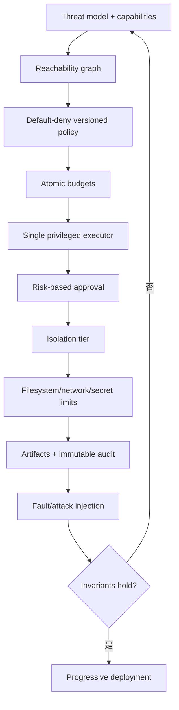

---

## 23. 可运行示例：原子预算与安全路径

下面的纯 Python 示例不调用 A2A/MCP/Monty，但验证本章最核心的宿主侧不变量：default deny、每工具/总调用/并发/phase budget 的原子 reservation，以及路径 containment。

```python
# Run with: python secure_execution_demo.py
from dataclasses import dataclass, field
from pathlib import Path
from threading import Lock
import tempfile

class Denied(RuntimeError):
    pass

@dataclass
class Budget:
    max_total: int
    max_parallel: int
    per_tool: dict[str, int]
    total: int = 0
    active: int = 0
    counts: dict[str, int] = field(default_factory=dict)
    phase: str | None = None
    lock: Lock = field(default_factory=Lock, repr=False)

    def reserve(self, tool: str, category: str) -> None:
        with self.lock:
            if tool not in self.per_tool:
                raise Denied("tool is not allowlisted")
            if self.total >= self.max_total:
                raise Denied("total call budget exhausted")
            if self.active >= self.max_parallel:
                raise Denied("parallel call budget exhausted")
            if self.counts.get(tool, 0) >= self.per_tool[tool]:
                raise Denied("per-tool budget exhausted")
            if self.phase is not None and self.phase != category:
                raise Denied("discovery and execution require separate runs")
            self.total += 1
            self.active += 1
            self.counts[tool] = self.counts.get(tool, 0) + 1
            self.phase = category

    def finish(self) -> None:
        with self.lock:
            if self.active <= 0:
                raise RuntimeError("unbalanced call completion")
            self.active -= 1

def safe_path(root: Path, relative: str) -> Path:
    root = root.resolve(strict=True)
    candidate = (root / relative).resolve(strict=False)
    try:
        candidate.relative_to(root)
    except ValueError as error:
        raise Denied("path escapes writable root") from error
    return candidate

if __name__ == "__main__":
    budget = Budget(
        max_total=2,
        max_parallel=1,
        per_tool={"LIST_TOOLS": 1, "SEARCH": 1},
    )
    budget.reserve("LIST_TOOLS", "discovery")
    try:
        budget.reserve("SEARCH", "execution")
    except Denied as error:
        assert "parallel" in str(error) or "separate runs" in str(error)
    else:
        raise AssertionError("unsafe concurrent/phase transition was allowed")
    budget.finish()

    try:
        budget.reserve("SEARCH", "execution")
    except Denied as error:
        assert "separate runs" in str(error)
    else:
        raise AssertionError("same-run discovery-to-execution pivot was allowed")

    try:
        budget.reserve("DELETE_ALL", "execution")
    except Denied as error:
        assert "allowlisted" in str(error)
    else:
        raise AssertionError("unknown tool was allowed")

    with tempfile.TemporaryDirectory() as directory:
        root = Path(directory)
        assert safe_path(root, "output/report.txt").is_relative_to(root.resolve())
        try:
            safe_path(root, "../../secret.txt")
        except Denied:
            pass
        else:
            raise AssertionError("path traversal was allowed")

    print({"total": budget.total, "phase": budget.phase, "counts": budget.counts})
```

代码与原理对应：

- `per_tool` 字典同时充当 exact allowlist 和 per-tool quota；
- `reserve` 在 lock 内完成 check+increment，避免并发 oversubscription；
- `active` 在 IO 前增加、`finally` 中应调用 `finish`；
- phase 一旦是 discovery，同一 run 的 execution 会被拒绝；
- 未知 destructive tool 默认拒绝；
- resolved path 必须是 root descendant；
- 该 lock 仍仅单进程，path check 仍不消除 symlink TOCTOU，文中边界保持不变。

---

## 24. 本章知识结构与核心结论

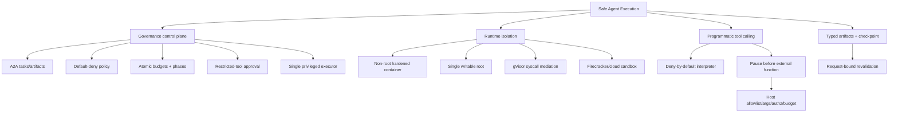

### 24.1 核心结论

1. 可预测输出不等于安全执行；合法 tool call 仍可能超出角色、预算或组合意图。
2. System prompt 和 PRP 提供指导，无法替代模型外部 policy 和 capability isolation。
3. MCP 提供工具能力，A2A 可承载治理 decision/artifact，LangGraph 管理状态/HITL；领域 executor 才执行最终权限和事务。
4. Policy 应 default deny，并同时限制 identity、arguments、phase、artifact、总量、并发、时间和费用。
5. Discovery 与 execution 分 run 可阻断即时 capability pivot，但状态必须 durable，恢复后不可丢失。
6. Budget check 和 reservation 必须原子；单进程 lock 不等于分布式 quota。
7. 所有高权限调用经过唯一 bottleneck；Agent 进程不能持有旁路 credentials/session。
8. 人只审批 hard gates 已通过的 restricted action；批准绑定 request hash，并在 resume 前重验。
9. Runtime isolation、ephemeral lifecycle 和 governed service 解决不同问题，应按风险叠加。
10. Docker 是实用基础层而非硬安全边界；不可信多租户代码可使用 gVisor、microVM 或云 sandbox。
11. Path canonicalization 阻止常见 traversal，但 production 还需 no-follow、原子文件操作和 OS sandbox 防 race。
12. UI 与 executor 应通过最小认证 API 分离，secret 和 outbound calls 留在受控后端。
13. 云 sandbox 隔离 code workload，不自动验证输入数据、network egress 或 artifact。
14. Programmatic tool calling 用一次程序生成代替多次模型 round trips，减少 context/latency，但提升为代码执行风险。
15. 模型代码绝不能在 host `exec()`；capability-scoped interpreter 从零能力开始，只注入明示 functions。
16. Monty 适合轻量 tool orchestration，但 experimental embedded interpreter 应嵌套更强边界。
17. 每个 external function 仍在 host pause point 经过 allowlist、args、authz、budget、approval 和 audit。
18. Safe-to-fail 的含义不是不会出错，而是每层失败都 fail closed、blast radius 有界、状态可审计且副作用可控制。

### 24.2 作者解决问题的一般思路

作者沿 capability 升级带来的风险逐步增加防线：

1. 先指出 Agent 可能在正式权限内过度行动，因此 system prompt 不足；
2. 用 A2A 的 task/artifact/separation 建治理 control plane；
3. 把散落要求变成 versioned policy、phase 和 live budget；
4. 将所有 MCP execution 收束到 `governed_call`；
5. 对少数 restricted actions 加 LangGraph interrupt，而非让人审批一切；
6. 发现通用代码可绕过 tool layer，于是把执行放入 non-root container 并收紧路径；
7. 对高风险代码增加 gVisor、Firecracker 或 off-host ephemeral sandbox；
8. 对只是组合已治理 tools 的任务，不启动完整 VM，而使用低开销 capability interpreter；
9. 最后在 interpreter 的每个 external call 前暂停，把代码模式重新接回同一 Governor。

可迁移的一般方法是：**先区分模型提出行动与系统拥有能力；消除所有旁路，把权限集中到单一执行点；用状态化 policy 和原子预算约束组合行为；再按代码可信度分配隔离层；即使在最深 sandbox 中，外部副作用仍回到宿主侧逐次治理。**

---

## 25. 延伸阅读

- A2A protocol：Agent cards、tasks、messages、artifacts、authentication 与 streaming。
- MCP/FastMCP：tool identity、transport、server authorization 与 typed results。
- LangGraph interrupts/persistence：approval-bound resume 与 durable state。
- OWASP Path Traversal、SSRF、Command Injection 与 LLM Prompt Injection guidance。
- Docker security：rootless、seccomp、capabilities、read-only rootfs、resource limits。
- gVisor 与 Firecracker：syscall sandbox 与 microVM isolation。
- E2B、Runloop、Daytona：ephemeral coding sandbox 生命周期与网络治理。
- Pydantic Monty 与 Pydantic AI `CodeModeToolset`：capability-scoped programmatic tool calling。
- Anthropic Programmatic Tool Calling / Code Execution with MCP；Hugging Face smolagents。
- 原书第 5 章：contracts、MCP 和 deep-agent execution harness；第 7 章：真实产品部署。
