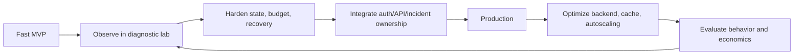
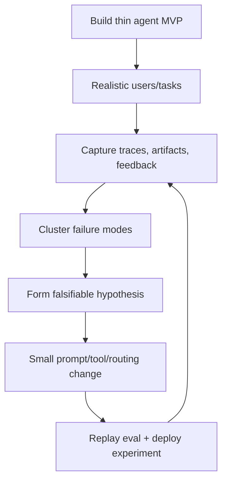
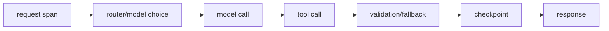
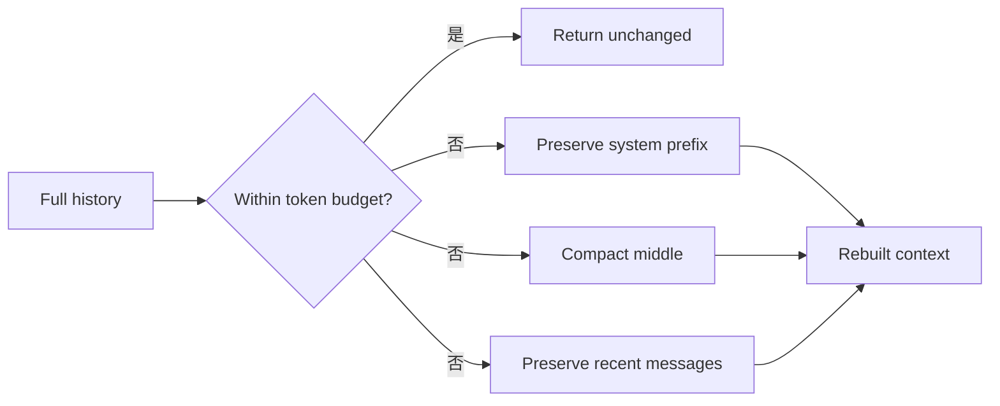
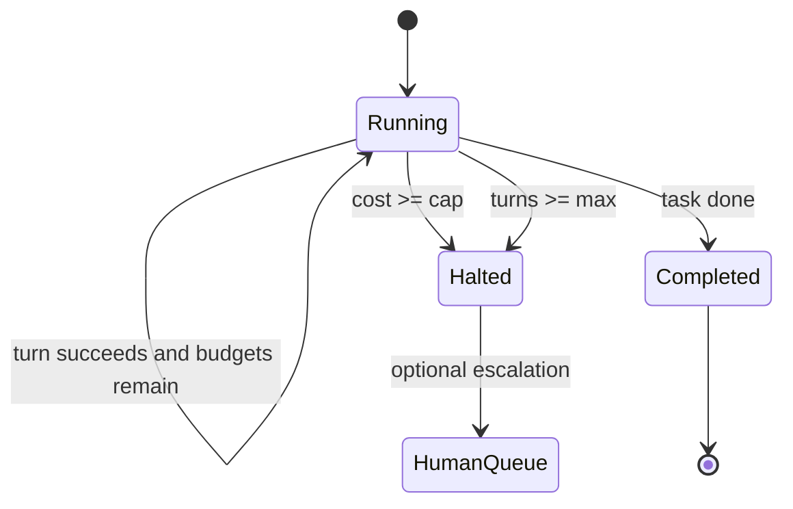
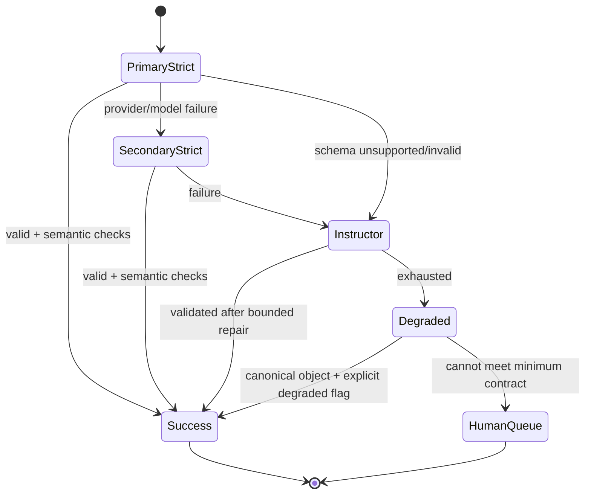
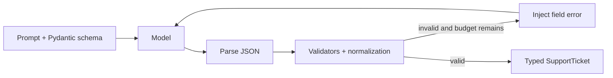
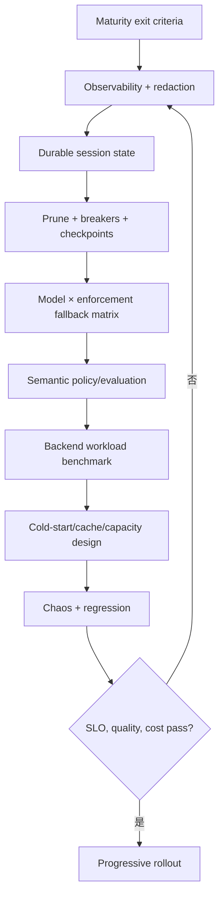

> 原章：*Deploying Agents in Real Products*
> 核心问题：Agent 离开 notebook 后，怎样通过成熟度分阶段、可观察实验、状态硬化、fallback 和推理运行时工程，把非确定性行为变成用户可依赖、团队可运营、成本可持续的产品能力？

## 0. 本章定位与阅读主线

前两章解决了接口合同和安全执行。本章不再把“部署”理解为把代码推到云端、得到一个 endpoint，而是讨论 endpoint 之后的真实问题：

- 模型和 provider 会超时、漂移或返回不同语义；
- Agent loop 会无限调用工具、膨胀 context 和消耗预算；
- 长任务会遇到 502、重启和部分完成；
- fallback model 即使返回合法 JSON，也可能改变业务决策；
- 自托管 GPU 服务有 cold start、KV cache、并发、显存和 eviction 的物理约束；
- 监控、应急路径和所有权必须嵌入组织，而不只存在于开发者脑中。

作者的顺序是：

1. 用 deployment maturity model 分阶段交付；
2. 把 MVP 当 diagnostic lab，建立 observation→refinement 回路；
3. 通过 serializable session、context pruning、circuit breaker 和 checkpoint 硬化骨架；
4. 构造 strict schema→Instructor→degraded canonicalization 三层 fallback；
5. 比较 fallback models 的结构与语义漂移；
6. 自托管时处理 vLLM/TGI/SGLang、cold start、scale-to-zero、KV/prefix cache 和 memory pressure。



本章的中心判断是：

> 生产不是一次发布状态，而是一条持续闭环。模型质量只是其中一个变量；真正的部署能力是及时发现退化、限制影响、保存进度、切换依赖、量化成本，并把结果反哺下一次发布。

---

## 1. Deployment Maturity Model：生产是所有权转移

### 1.1 为什么不是“一键部署”教程

云平台已经能把模型或 Web app 快速发布为 endpoint，但按钮不会替你定义：

- fallback 与 degraded mode；
- loop/cost circuit breaker；
- context 与 checkpoint lifecycle；
- provider/schema drift；
- tracing/redaction/alerts；
- incident response 与业务 owner；
- GPU cold start 和 unit economics。

因此本章刻意保持 provider-agnostic，关注可迁移的系统机制，避免把某家云的配置步骤误当生产架构。

### 1.2 五个成熟阶段

| 阶段 | 主要问题 | 代表 stack | 退出条件 |
|---|---|---|---|
| Fast MVP | 核心任务是否有价值 | Streamlit/Gradio、OpenRouter、LiteLLM | 有可运行交互和初步任务成功证据 |
| Alpha | 陌生用户和边界输入下哪里坏 | Docker、MCP、FastAPI、tracing、eval set | 已识别主要 UX/行为/延迟故障 |
| Hardening + Beta | 能否让真实合作方安全使用 | fallback、HITL、可靠性测试 | 故障可记录、限制、恢复，有设计伙伴验证 |
| Production | 能否进入真实产品与运营流程 | Product APIs、auth、logs、alerts | 有 SLO、incident path、on-call/owner、前后端集成 |
| Scale | 大规模下延迟和成本是否可持续 | Kubernetes/Ray、vLLM/TGI、cache、checkpoint、autoscaling | 吞吐、P95/P99、成本和容量满足目标 |

Beta 仍是学习阶段；production 的关键是责任转移给真实系统和运营团队，而不是用户数量突然达到某阈值。

### 1.3 成熟度模型不是线性瀑布

图 7-1 强调循环：build→observe→harden→integrate→optimize。每次模型、prompt、tool、policy、quantization 或 backend 变化都可能让系统在某维度退回 alpha/beta 验证。

例如替换 fallback model 只是配置变更，却可能让 priority 从 p0 变 p1；启用 prefix cache 提高平均 latency，却可能因 cache eviction 改变 P99。成熟度是**每项能力的证据水平**，不是整个项目只能拥有一个标签。

### 1.4 非确定性“员工”的管理含义

Agent 有概率输出、外部工具和成本权限。因此部署像管理演员/团队：排练典型任务、压力测试边界、消除已知错误、设计替补，并在正式开放前明确中止条件。

但比喻有边界：Agent 没有人的责任主体资格。最终 accountability 在产品 owner、工程、安全和运营流程。

---

## 2. From MVP Vibes to Production Setup

### 2.1 MVP 的角色为何不同

传统 MVP 主要验证功能/市场；Agent MVP 还必须作为 high-fidelity diagnostic lab，主动暴露：

- ambiguous input；
- model latency 波动；
- partial/malformed tool result；
- unexpected structured output；
- prompt/routing coupling；
- reasoning/tool loops；
- cost spikes 与用户纠正。

“成功完成一次任务”几乎没有统计意义。真正产物是带版本和 trace 的失败样本、eval dataset、行为假设和后续修复优先级。

### 2.2 为什么早期使用轻量 UI 和 Managed PaaS

Streamlit/Gradio 让团队快速构造接近产品的交互，不先投入复杂 frontend；DigitalOcean App Platform、Heroku、Render 等连接 Git 仓库后自动部署，使 prompt/tool/routing 小改动约 5–15 分钟可观察。

选择依据不是这些平台永远适合生产，而是 alpha 阶段优化目标是：

$$
\text{learning velocity}
=
\frac{\text{validated behavioral insights}}
{\text{calendar time}}.
$$

基础设施抽象减少 DevOps 等待，让团队把时间投入真实 interaction。进入 production 后，版本固定、rollout、security、capacity 和 ownership 会超过“每 commit 自动发布”的便利。

### 2.3 Diagnostic loop



每次修改应绑定 prompt/model/tool/policy version；否则观察到改善也无法归因。生产数据反馈还需 consent、redaction 和 retention，不可把用户内容无条件变成训练/eval 数据。

### 2.4 从“vibes”到证据

建议把主观感觉改写成指标：

| Vibe | 可验证定义 |
|---|---|
| “Agent 经常卡住” | turn count 分布、重复 tool signature、无进展率 |
| “有点慢” | TTFT、time-to-final、tool latency、P95/P99 |
| “回答不稳定” | 同一 eval 多次运行的 decision agreement |
| “成本太高” | 每成功任务 input/output/tool/GPU 成本 |
| “fallback 还行” | failover 后 schema/semantic/task success 与恢复时间 |

---

## 3. Monitoring：观察系统和 Agent 行为

### 3.1 为什么 request success 不够

HTTP 200 可能包含：

- Agent 偏离角色；
- JSON 合法但 priority 错误；
- 多调用了 10 次工具；
- 引用了无关来源；
- fallback/degraded mode 静默触发；
- 用户得到答案，但成本超过业务价值。

所以监控分为行为、成本、延迟、trace、log：

| 维度 | 观察对象 | 主要问题 |
|---|---|---|
| Agent behavior | role/style、schema、tool usage、decision | 是否 silent drift |
| Cost | input/output/reasoning tokens、API/GPU/tool spend | 是否 loop、路由和上下文回归 |
| Latency | model TTFT/decode、tool、queue、end-to-end | 瓶颈和耦合在哪里 |
| Tracing | node/decision/tool path、fallback tier | 为什么得到该结果 |
| Logging | error、retry、artifact、checkpoint | 怎样复盘和恢复 |

### 3.2 Metrics、logs、traces、events 不要混淆

- **Metric**：低基数聚合数字，如 P95 latency、error rate；
- **Log**：某事件的结构化记录；
- **Trace**：一个 request/run 的因果 span tree；
- **Business event**：如 ticket escalated、order refunded；
- **Artifact**：model output、tool result、file 等可寻址产物。

不要把 user ID、prompt 或 session ID 直接做 metric label，会产生高 cardinality 和隐私问题；把它们放受控 trace/log fields。

### 3.3 Agent trace 应包含哪些 span



每个 span 至少记录：run/session/correlation ID、model/provider/version、prompt/schema/tool hash、tokens、latency、retry、status、cost estimate；敏感正文默认不记录或先脱敏。

### 3.4 Monitoring loop

原章图 7-3 对应：live system→monitor→find drift/failure→improve prompt/routing/architecture→evaluate→redeploy。Monitoring 只提供信号，不自动创造 resilience；后续 circuit breaker/checkpoint 才在运行中控制影响。

### 3.5 Trace sampling 与 redaction

原章经验策略：

- development/test：100% traces；
- production：100% errors，成功请求采 10–25%；
- incident/大改动：临时提高到 100%。

在启用 tracing **之前** 定义 PII、PCI、credential、access token、customer content redaction。采样后再脱敏太晚，敏感数据已进入 collector。

固定随机采样会漏掉稀有高价值行为。更稳妥的是 tail/priority sampling：

$$
P(keep\mid event)
=
\begin{cases}
1,&error\lor policy\_deny\lor fallback\lor high\_latency,\\
s,&normal\ success.
\end{cases}
$$

同时保留低比例 unbiased sample 才能估计总体分布。只存 errors 会无法计算真实 error rate 的分母。

### 3.6 Monitoring 自身的成本和风险

Trace 增加 serialization、network、storage 和 query 成本，也可能阻塞 request。使用异步 exporter、bounded queue、drop policy 和 collector backpressure。Telemetry outage 不应拖垮主业务，但 security audit event 可能要求更强 durability。

可设观测成本比例：

$$
\rho_{obs}
=
\frac{C_{telemetry}}
{C_{agent\ workload}}.
$$

采样决策应同时考虑可检测性、法规和 $
ho_{obs}$，不能机械套 10%。

---

## 4. Hardening the Backbone：从观察故障到实时约束

### 4.1 Streaming 为什么早期重要

Agent workflow 常超过传统 HTTP gateway 30 秒 timeout。原章建议 WebSocket 或 SSE streaming progress/state/user-safe intermediates，而不是长 `POST` 等最终结果。

Streaming 不等于后台任务可靠。生产 API 更常采用：

```text
POST /runs → 202 + run_id
GET/SSE /runs/{id}/events
POST /runs/{id}/cancel
POST /runs/{id}/resume
```

执行由 durable queue/worker 继续，即使 browser 断线。SSE 适合 server→client 单向事件；WebSocket 适合双向低延迟交互。两者都需 auth、resume cursor、heartbeats、backpressure 和 proxy timeout 配置。

### 4.2 三项最小硬化机制

| Pattern | 控制对象 | 机制 | 防止什么 |
|---|---|---|---|
| Checkpointing | 运行状态 | durable snapshots | crash 后从头重算与丢失进度 |
| Context pruning | 输入 token | token-aware compaction | latency/cost/attention degradation |
| Circuit breaker | loop 与预算 | turns/cost/time/tool fuses | runaway execution |

它们分别解决状态、性能和安全，不可互相替代。

---

## 5. AgentSession：把恢复所需状态显式化

### 5.1 例 7-1 字段

`AgentSession(BaseModel)` 包含：

- `session_id`；
- model 与 system prompt；
- rolling message history；
- turn count；
- total tokens 与 USD estimate；
- `running|halted|completed` lifecycle；
- halt reason；
- checkpoint count。

集中 `add_message` 作为 history write path，`summary()` 生成 dashboard/log 的 compact snapshot。

### 5.2 为什么 serializable state 是生产前提

进程内局部变量在 crash、redeploy 和 worker migration 后消失。恢复函数需要的所有决定性输入应进入 state 或可版本化引用：

$$
S_{resume}
=
(messages,counters,budgets,status,pending\ tasks,
model/prompt/tool/policy\ versions,artifacts).
$$

原示例是教学最小集。真正 Agent 还要 pending tool call IDs、idempotency keys、checkpoint/schema version、tenant/user、created/updated timestamps、trace ID、fallback tier 与 artifact refs。

### 5.3 状态不变量

- `turn_count,total_tokens,total_usd,checkpoints_saved >= 0`；
- completed/halted session 不再执行普通 turn；
- history 中 tool call 与 ToolMessage 正确配对；
- model/prompt version 在 run 中固定或迁移显式；
- cost 单调增加，refund/adjustment 另记 ledger；
- session ID 不由不可信 path 直接使用。

Pydantic 类型并不会自动表达全部不变量，需要 validators 和 state-transition methods。

### 5.4 Cost accounting 应怎样做

若第 $t$ 次调用有 input/output/cached/reasoning tokens 与 tool cost：

$$
c_t
=
n^{in}_tp^{in}
+n^{out}_tp^{out}
+n^{reason}_tp^{reason}
+c^{tool}_t.
$$

$$
C_T=\sum_{t=1}^{T}c_t.
$$

价格按 model/provider/version 存储，不能只保存 float total 而无法复核。并发更新 total 要原子；预算检查需 reserve estimated cost，完成后 reconcile actual usage，避免多个并发调用同时越线。

---

## 6. Context Janitor：保留控制前缀和近期状态

### 6.1 为什么不应填满上下文窗口

更长 context 带来：

- prefill token/attention 计算增加；
- KV cache 增长，降低 concurrency；
- 旧信息和新目标冲突；
- relevant evidence 淹没；
- 每轮重复 input 成本上升。

最大窗口是协议上限，不是最佳工作点。

### 6.2 例 7-2 的算法

`prune_history(history,max_tokens=4000,keep_recent=6)`：

1. `count_tokens` 若未超 budget，原样返回；
2. 若第一个消息是 system，保留；
3. 保留最后 6 条 messages；
4. middle 是 system 与 recent 之间的消息；
5. 统计被删消息的 role counts；
6. 插入 `[Context Janitor] Pruned ...` system message；
7. 重建 system→summary→recent。



### 6.3 原示例不是语义摘要

原 `summary_msg` 只说删了多少 user/assistant/tool messages，不保存事实、承诺、订单号、tool result 或 unresolved task。它是 pruning metadata，不是真正 conversation summary。

例如用户早先说“不要退款，只需要换货”，若落在 middle，role count 无法保留这个约束。生产 compaction 应生成 typed summary：

```json
{
  "user_constraints": [],
  "confirmed_facts": [],
  "tool_results": [],
  "pending_actions": [],
  "decisions": [],
  "source_message_ids": []
}
```

并通过 deterministic extraction/verifier 或人工检查高风险字段。原 messages 仍应在 external store 可追溯，summary 只用于 model context。

### 6.4 Token budget 需要二次校验

函数在 pruning 后没有再次调用 `count_tokens`。若 system prompt 本身很长或 recent 6 条包含大 tool output，结果仍可能超过 4000。稳妥算法：

```text
preserve immutable control messages
compact middle
truncate/externally store large tool artifacts
preserve newest messages while fitting budget
count again
fail or shrink further
```

`keep_recent` 按 message 数而非 turn 数，可能切断 assistant tool_call 与 ToolMessage；要按 protocol group 保留原子 message bundle。

### 6.5 41→8 的诊断结果

原章案例把 41 条 messages、2917 tokens 压成 8 条、432 tokens。缩减比例：

$$
1-\frac{432}{2917}
\approx85.19\%.
$$

这是 token/成本收益，不证明语义保真。应同时评估 compaction 前后任务答案、约束召回和 tool continuity。

---

## 7. Circuit Breaker：预算与回合双保险

### 7.1 例 7-3

两个 fuse：

- 若 `total_usd >= budget_cap`，session 设为 halted，记录 budget reason，抛 `CircuitBreakerTripped`；
- 若 `turn_count >= max_turns`，同样 halt，阻止无限 reasoning/tool loop。

异常携带完整 session，使 FastAPI 层可以持久化、记录并返回用户友好信息或升级 human queue。



### 7.2 为什么需要两个 fuse

便宜模型或失败工具可能循环很多次但暂时未超金额；昂贵调用可能少数 turns 就超预算。用 turns 和 cost 覆盖不同失控模式。还可增加：

- wall-clock deadline；
- per-tool count；
- consecutive error/no-progress signature；
- total output bytes；
- nested subagent depth；
- external side-effect count。

### 7.3 检查时点与 off-by-one

原函数使用 `>=`。若在开始新 turn 前检查，`turn_count=12` 时禁止第 13 次合理；若在完成后才增加/检查，语义不同。文档要明确 `max_turns` 是允许完成的最大 turns 还是尝试阈值。

Cost fuse 同样应在调用前 reserve，不能先花完再检查。若预计下一调用成本为 $\hat c$：

$$
allow\iff C_{spent}+C_{reserved}+\widehat c\le C_{cap}.
$$

实际 cost 返回后 reconcile。

### 7.4 Circuit breaker 与 provider spending cap

Provider cap 是账户/项目级最后防线，粒度粗且可能延迟；session cap 在业务 loop 内实时控制。还应有 user/tenant/day、tool 和 global emergency cap。多层 quota 防单个 session 与大规模并发分别失控。

### 7.5 Halt 后怎样服务用户

不要只把异常变成 500。可以：

- 返回“无法安全完成，已保存进度”；
- 创建 human ticket；
- 提供已验证的 partial result；
- 允许有权限用户增加预算并 resume；
- 对重复 loop 标记 Agent/model/tool 版本供分析。

任何 resume 都重新验证 budget/policy，不能简单把 status 改回 running。

---

## 8. Checkpointing：将 crash 变成可恢复事件

### 8.1 例 7-4 的三个函数

- `save_checkpoint`：按 session ID 写 JSON，成功后 checkpoint count 已加一；失败则回滚计数；
- `load_checkpoint`：文件存在则 JSON parse 并由 `AgentSession.model_validate` 恢复；
- `list_checkpoints`：列出目录中 `.json` stem。

每 turn 顺序为：prune→LLM/tool→metrics→breaker→save。

### 8.2 文件 checkpoint 的风险

1. `session_id` 直接进入文件名，可 path traversal；应只允许 UUID/安全 ID。
2. `write_text` 不是崩溃原子；半写文件会损坏。
3. 多 worker 同时保存会 lost update。
4. 临时目录不 durable，container 重启可能丢失。
5. checkpoint 包含用户内容/system prompt，需 encryption、ACL、retention。
6. `list_checkpoints` 暴露其他 tenant IDs。
7. 无 schema version/migration 和 integrity hash。

原子文件模式：写临时文件、flush/fsync、`os.replace`；生产用 Postgres/Redis/object store 时使用 optimistic version/CAS 和 tenant key。

### 8.3 Checkpoint 时点和外部副作用

Checkpoint after every turn 降低重算，但不能自动保证 exactly-once。若工具成功后、checkpoint 前 crash，恢复会重放。每个 side-effect tool 需要 idempotency key/operation ledger。

推荐状态：

```text
checkpoint intent + idempotency key
→ execute external action
→ record external result
→ checkpoint completion
```

恢复先查询 operation status，而不是盲目再执行。

### 8.4 恢复必须固定依赖版本

恢复旧 session 时模型、system prompt、tools、normalization maps 和 policy 可能已变化。Checkpoint 保存 hashes/version；不兼容则 migrate、继续旧 runtime 或 fail for review，不能静默换模型。

### 8.5 原章四个 diagnostic runs

| 场景 | 观察 | 能证明什么 | 不能证明什么 |
|---|---|---|---|
| 正常多轮 | tool、metrics、checkpoint 都走通 | baseline path 连通 | 高并发/长期稳定性 |
| 41→8 pruning | 2917→432 tokens | context 显著缩小 | 摘要语义完整 |
| max_turns=3 | 重复 policy lookup 被 halt | turn fuse 有效 | 所有 loop 可检测 |
| crash restore | 从 turn 2 恢复 | session 可反序列化继续 | 外部副作用 exactly-once |

诊断测试是 evidence 的起点，应加入 fault injection、并发、corrupt checkpoint 和 dependency version drift。

---

## 9. 前半章小结：Agent 硬化已经是系统工程

至此，MVP→production 的第一条链形成：

```text
Diagnostic interactions
→ monitoring + trace versions
→ serializable session
→ context compaction
→ cost/turn circuit breakers
→ durable checkpoint + idempotency
```

但系统仍依赖外部模型/provider。Primary model 会 timeout、5xx、拒绝 schema 或给出语义不同的合法对象。因此下一步不是再假设 primary 永远工作，而是把 fallback 当正常路径设计和测试。

---

## 10. The Need for a Fallback：替补必须通过整条流水线

### 10.1 Fallback 触发条件

Fallback 不只在 provider down 时使用，还可能由：

- timeout/5xx/rate limit；
- latency 超 SLO；
- confidence/verification failure；
- strict schema 不支持；
- budget 路由；
- tool incompatibility；
- safety refusal；
- model region/capacity 不可用。

Fallback 是运行时依赖图的一部分，不能上线后临时找“第二个模型”。它必须预先测试 prompt、tool calling、schema、normalization、latency、cost 与业务决策。

### 10.2 Fallback 不是越多越可靠

如果两个模型共享同一 provider、region、proxy、auth、prompt 或 judge，故障高度相关。可靠 fallback 要在需要的 failure domain 上多样化：

```text
model family
provider/region
inference backend
schema mechanism
tool adapter
capacity pool
```

同时越多 provider 越增加数据治理、版本和测试成本。按具体故障模式设计，而不是随机堆模型。

### 10.3 Fallback 状态机



原章三 tier 主要指同一 model call 的 structured-output enforcement，不完全等同于 primary→secondary model failover。生产系统常把“选择哪个模型”和“用哪一层 schema enforcement”做成两个正交维度。

---

## 11. 三层 Structured Output Enforcement

### 11.1 Tier 1：provider strict JSON Schema

Provider 在 token generation 阶段做 constrained decoding，使输出满足 JSON Schema。优点：结构保证最强、无需先生成错误 JSON 再修；限制：

- 是 provider/model capability，不一定通过 proxy 正确实现；
- 只覆盖单次 completion；
- 不覆盖 tool output 和跨 Agent handoff；
- schema shape 合法不代表字段判断正确；
- unsupported schema features/limits 因 provider 而异。

### 11.2 Tier 2：Instructor + Pydantic

模型先生成 JSON-like output，client 解析并运行 Pydantic validators；失败把 semantic error 回传并 bounded retry。优势：跨 provider、可做 normalization/custom validators；代价：额外 calls/latency，仍依赖模型能修复。

### 11.3 Tier 3：prompt-only + canonicalization

Prompt 描述固定 keys/enums，得到 raw output 后用 deterministic aliases/maps/defaults 转为 canonical object。它最脆弱，只应作为 emergency degraded path，并显式标记来源和置信/人工复核，不应悄悄伪装 Tier 1 成功。

### 11.4 三层比较

| Tier | 强制位置 | 主要解决 | 无法保证 |
|---|---|---|---|
| Strict schema | provider decoding | 单次 JSON shape | 语义、跨 turn/tool、proxy 实现 |
| Instructor/Pydantic | client boundary | parse、types、normalization、retry | 外部系统、真实判断、无限修复 |
| Canonicalization | application fallback | 最小可消费对象 | 原模型信息完整、决策正确 |

最少实现 Tier 1+2；业务关键场景可加 Tier 3，但 Tier 3 的 conservative default 仍可能产生业务动作，通常应限制为排队/人工而非自动高影响执行。

---

## 12. Model Drift 与 Normalization Maps

### 12.1 本章的 drift 是什么

这里不是经典“数据分布随时间变化”一种含义，而是不同/同一模型将相同语义表达成不同 label：

- `authentication`、`account access`、`authentication/login` → `login`；
- `critical`→p0，`urgent/high`→p1；
- `anxious/urgent`→`frustrated`。

这些差异可全部是合法字符串，却会破坏 downstream route 和 alert。

### 12.2 例 7-5 normalization maps

原示例的 `CATEGORY_MAP`、`PRIORITY_MAP`、`SENTIMENT_MAP` 三个 dict 将开放词汇压缩为 product enum。Normalization 函数应：

1. Unicode normalize；
2. trim/casefold；
3. exact alias lookup；
4. 未知值按字段风险采取 reject 或 conservative default；
5. 记录 raw value、canonical value 和 map version。

映射是受版本管理的业务逻辑，不是随手 post-processing。改变 `urgent` 从 p1 到 p0 会改变 paging，应经过 review/eval。

### 12.3 为什么 priority 要比 category 更严格

原 `SupportTicket`：

- unknown category 默认为 `other`；
- unknown priority 抛 validation error；
- ambiguous sentiment 默认 `frustrated`。

这是风险选择：category 错误通常影响统计/队列，priority 错误直接改变响应时限。未知 priority 不应静默降级。Sentiment 默认 frustrated 是 conservative，但可能导致过度升级，需用业务成本验证。

### 12.4 Semantic agreement 指标

对同一 eval item 运行 $K$ 次，某字段 mode label 出现次数为 $n_{max}$：

$$
Agreement=\frac{n_{max}}{K}.
$$

跨模型还可计算 confusion matrix、Cohen's kappa（双标注）或 Fleiss' kappa（多模型），并与人工 gold label 比较。100% 一致可能是所有模型一致地错，agreement 不是 accuracy。

---

## 13. SupportTicket 双合同：JSON Schema 与 Pydantic

### 13.1 例 7-6 JSON Schema

原示例的 `SUPPORT_TICKET_SCHEMA` 要求 9 个 fields，category/priority/sentiment enum，`repro_steps` 为 string array，`additionalProperties=False`。

它发给 provider strict mode，约束 wire representation。生产还应加：

- min/max length；
- ticket ID pattern；
- maxItems；
- text size；
- schema version；
- semantic/business invariants。

### 13.2 例 7-7 Pydantic model

本地 `SupportTicket` 使用 `Literal` types，并在 `mode="before"` validators 中先 normalization，再做 Literal validation。

JSON Schema 与 Pydantic 虽字段相似，职责不同：

- provider schema 约束 generation；
- Pydantic 是不信任 provider 的本地 boundary；
- custom maps/inference 可能不体现在 strict schema；
- 两份合同可能 drift，应从单一 source 生成/对比 schema hash。

### 13.3 业务语义仍需独立 validator

Schema 不能仅凭 enum 判断：用户 demo 一小时后登录失败应该 p0 还是 p1？这取决于组织 SLA，不应让模型自由解释。可写 deterministic policy：

```text
security breach / global outage → p0
single user blocked + imminent business deadline → p1
workaround available → p2
cosmetic/feature → p3
```

模型提取事实，policy engine 计算 priority，通常比让不同模型直接给优先级更稳定。

---

## 14. API Retry 与测试 Ticket

### 14.1 例 7-9 的输入意图

Customer 无法登录、昨天开始、重置密码两次、1 小时后 demo、语言愤怒。它同时测试：

- category login；
- repro steps；
- urgency vs severity；
- sentiment；
- suggested action。

单个 prompt 只能演示，不构成 benchmark。需覆盖模糊、矛盾、多语言、prompt injection、缺信息和不同 severity/deadline 组合。

### 14.2 例 7-10 jittered retry

原 helper `call_openrouter(payload, retries=2, timeout_s=25)` 对 5xx 等待 0.4–1.0 秒后重试；4xx 立即抛错。原则正确：transient 与 permanent error 分开。

但参数 `retries=2` 的循环 `range(retries)` 实际总 attempts=2，而许多人会理解为 initial + 2 retries=3。API 命名应改 `max_attempts` 或循环 `range(retries+1)`。

生产 retry 还需：

- exponential backoff + full jitter；
- `Retry-After`；
- 429/408/connection reset 分类；
- total deadline/cancellation；
- idempotency（completion 通常无副作用，tool call 另论）；
- circuit breaker 与 provider failover；
- 响应大小和 error redaction。

简单 full jitter：

$$
sleep_k\sim U(0,\min(cap,base\cdot2^k)).
$$

### 14.3 Retry 放大流量

若原始请求率 $\lambda$，单次失败率 $q$，无限独立 retry 的期望 attempts：

$$
E[A]=\frac1{1-q}.
$$

Provider 故障时 $q$ 接近 1，retry storm 会进一步压垮服务。需要 bounded retry、jitter、circuit breaker 和 global concurrency limits。

---

## 15. Tier 1：Strict JSON Schema（例 7-11）

### 15.1 请求结构

原例由 `run_strict(model)` 组装请求并记录 latency/raw content。`response_format` 为：

`response_format`：

```json
{
  "type": "json_schema",
  "json_schema": {
    "name": "support_ticket",
    "strict": true,
    "schema": "SUPPORT_TICKET_SCHEMA"
  }
}
```

函数计时，保留 model/mode/latency/raw content。即使 provider 声称 strict，也要本地 parse + Pydantic validate；raw output 作为受保护 debug artifact，不能默认记录客户正文。

### 15.2 Strict JSON mode 为什么不是 cure

1. Tool result 可改变后续模型对 enum 的判断；
2. Agent A 的合法 object 进入 Agent B 后，B 可能重新解释；
3. Proxy/底层 provider 支持不一致；
4. 不同模型对同一事实选择不同合法 enum；
5. Schema 不表达业务 correctness。

因此 strict 提供 syntactic/structural safety for one generation boundary，不提供 pipeline semantics。

---

## 16. Tier 2：Instructor（例 7-8 与 7-12）

### 16.1 Client setup

`instructor.from_openai(OpenAI(base_url=OpenRouter...), mode=Instructor.Mode.JSON)` 不要求 provider 原生 strict schema，只要求能输出可解析 JSON-like content。

### 16.2 执行流程

`run_instructor(model)` 通过 Instructor client 请求类型化 `SupportTicket`，流程如下：



`max_retries=2` 是 fallback 设计的一部分，但需确认 Instructor 版本对总 attempts 的定义。Latency 包括 retries；监控必须记录 re-ask count，不能只看最终成功。

### 16.3 Typed object 的审计

原例把 `ticket.model_dump_json(indent=2)` 叫 raw validated object。它其实是 canonical/validated serialization，不是模型原始响应。调试 drift 最好分别保存（经 redaction）：

- provider raw response；
- parse error/validation errors；
- normalization transformations；
- final canonical object。

否则无法知道模型最初说 `urgent` 还是已经被映射成 p1。

---

## 17. Tier 3：Degraded Prompt 与 Canonicalization

### 17.1 例 7-13 为什么减少自由度

`run_degraded(model)` 的 system prompt 明列 9 个 keys、enum、array type、无额外字段、无 Markdown。它不使用 provider strict constraint，只尽可能让弱 fallback model 返回易解析 JSON。

Degraded mode 应输出 metadata：

```json
{
  "quality_tier": "degraded",
  "canonicalization_used": true,
  "needs_review": true
}
```

不能只返回与 Tier 1 相同 shape，让 downstream 误以为信号质量相同。

### 17.2 例 7-14 canonicalize

`canonicalize(raw)` 的算法：

1. `ticket_id` 接受 `id` alias，缺失用 `TCK-0000`；
2. summary 接受 `subject/title`；
3. category 用 map，未知为 other；
4. priority map 失败则由 prompt、summary、sentiment、category 推断；
5. 其他字段同样 aliases→maps→conservative defaults；
6. 返回 canonical dict，之后仍应经 `SupportTicket.model_validate`。

### 17.3 Canonicalization 的危险边界

- `TCK-0000` 会让多个 tickets ID 冲突，应由系统生成 UUID，而非模型/default；
- 空 summary 填固定文本会隐藏信息缺失；
- infer priority 依赖全局 `PROMPT`，不适合并发/复用；应显式传参数；
- defaults 可让不完整对象看似完整；需 provenance per field；
- alias map 可能误吞未知语义；高影响 field 应 fail/escalate。

推荐 canonical field：

```json
{
  "value": "p1",
  "source": "inferred",
  "raw": null,
  "confidence": null
}
```

至少在 metadata 保存来源，不一定改变 product schema。

---

## 18. 多模型实验：合法 JSON 不等于稳定决策

### 18.1 例 7-15 与表 7-6/7-7

原章的 `MODELS` 列表包含 `openai/gpt-5.2`、`qwen/qwen3-max-thinking`、`anthropic/claude-haiku-4.5`、`minimax/minimax-m2.5`，各跑两次：

- 前三者 Tier 1 strict 成功；
- MiniMax 走 Tier 3 canonicalized；
- GPT/Claude 给 p0 angry；Qwen 给 p1 frustrated；
- MiniMax 两次在 p0/p1 之间变化；
- latency 从约 3.1s 到 10.7s，repro steps 数量也变化。

这些是 illustrative trials，模型名、版本、价格和 provider 行为随时间变化；两次运行不足以估计稳定率。

### 18.2 结构稳定与语义稳定的二维矩阵

| | 语义稳定 | 语义漂移 |
|---|---|---|
| 结构合法 | 理想路径 | **最危险 silent failure** |
| 结构非法 | 可被 schema gate 捕获 | 明显失败、进入 retry/fallback |

Schema 工具最擅长左/右行的结构区分，却无法自动发现右上角。因此需要 gold eval、business rule、cross-model consistency 和 downstream outcome monitoring。

### 18.3 Priority 漂移的业务影响

p0 与 p1 不是文案差异，而可能是：立即 page on-call vs 次晨处理。Model replacement 必须经过 shadow traffic、decision diff 和 approval：

$$
DriftRate
=
\frac{\#\{x:f_{new}(x)\ne f_{old}(x)\}}
{|D_{shadow}|}.
$$

还要按高风险 field 加权：priority mismatch 比 repro-step wording mismatch 重要。

### 18.4 Fallback 的正确测试单位

不是“模型回答看起来不错”，而是整条 pipeline：

```text
provider adapter
→ strict/tool schema
→ local validation/normalization
→ business decision
→ tools/handoffs
→ latency/cost
→ logs/checkpoints
→ user outcome
```

定期 chaos test 主 provider timeout/5xx/schema unsupported，确认 fallback 自动触发、不会 retry storm、degraded flag 可见且恢复后不会重复副作用。

---

## 19. Inference Backends：Agent 最终运行在物理资源上

### 19.1 六类部署物理

| Concern | 发生什么 | 产品影响 |
|---|---|---|
| Cold start | 下载/读权重、装 VRAM、初始化 kernel/cache | 第一请求延迟几十秒到数分钟 |
| Scale to zero | 空闲 worker 被销毁，再按需启动 | 交互延迟不稳定 |
| KV cache | 每层保存历史 K/V | context×batch 增长显存 |
| Prefix caching | 相同 token prefix 复用 KV blocks | 降 TTFT、提高吞吐 |
| Invalidation | prompt/RAG/profile/branch 改前缀 | cache miss，出现 mini cold start |
| Memory pressure | 长 context 和 batch 争夺 KV blocks | eviction、P99 上升、batch 效率下降 |

### 19.2 Cold start 的组成


区分：container start、model load、engine readiness、first-request warmup。只测 process PID 出现不是 service ready。

### 19.3 Scale to zero 与 persistent weights

Scale-to-zero 省 idle GPU，但每个 idle period 后用户承受 cold start。Custom checkpoint 若每次从 internet 下载数 GB，启动更慢且依赖外网。

原章建议把 weights 存持久 bucket/volume（S3/GCS 等）并正确配置 IAM，使 worker 从本地/区域持久盘读取。还可：

- min replicas/keep-warm TTL；
- scheduled warmup；
- predictive autoscaling；
- small fallback model during warmup；
- readiness gate 不接流量直到模型可用。

Persistent disk 消除重复 internet download，不消除 disk→RAM→VRAM load 和 kernel warmup。

### 19.4 Modal 的定位

原章以 Modal 举例：在 Python 中声明 container、GPU、persistent volume、worker lifetime，由平台处理底层。它简化 config，不消除 cold-start/capacity/cost 权衡。仍需 benchmark 自己的 checkpoint 和 region。

---

## 20. TGI、vLLM 与 SGLang

### 20.1 共同点与差异

三者提供 OpenAI-compatible serving，支持 LLM/一定范围 multimodal，但内部调度和 cache 结构不同。

**vLLM**：PagedAttention、iteration-level/continuous scheduling，高并发通用默认，生态成熟。

**TGI**：Hugging Face ecosystem 集成强，v3 引入/采用高性能 kernels；具体吞吐/并发需当前版本实测，不能永久贴“饱和差”标签。

**SGLang**：RadixAttention 将共享 prefix 组织成 radix tree，适合 multi-turn、fork/Tree-of-Thought 的前缀复用；也有 diffusion 扩展。

### 20.2 OpenAI-compatible 不是完全可互换

`base_url` 切换可保持基本 client code，但还需 capability adapter：

- supported models/architectures；
- tool/JSON schema；
- streaming event shape；
- logprobs/usage fields；
- multimodal payload；
- max context；
- error codes；
- scheduler/cache flags。

后端无关是应用接口目标，不是忽略差异。

### 20.3 为什么必须 benchmark

瓶颈取决于 A100/H100/其他 GPU、7B/70B、precision、tensor parallel、input/output length、concurrency 和 prefix sharing。报告：

- TTFT；
- inter-token latency / TPOT；
- end-to-end latency P50/P95/P99；
- request/token throughput；
- queue time；
- GPU utilization、KV usage/eviction；
- error/preemption；
- cost per successful task。

保持 workload distribution 与生产相似；单请求 notebook benchmark 不能代表高并发 Agent。

---

## 21. Backend Config 与 vLLM 参数（例 7-16 至 7-19）

### 21.1 例 7-16

`BACKEND_CONFIGS` 为 vLLM/TGI/SGLang 指定不同 local ports 和 start commands。Commands 是可信管理员配置，不应由用户/Agent 拼接并 shell 执行。

vLLM command 启用 `--enforce-eager` 和 `--enable-prefix-caching`；TGI 限 input 4096、total 4608；SGLang 指定 model path/served name。不同 limits 必须通过统一 capability config 暴露给 Agent router。

### 21.2 例 7-17 参数

原代码用 `GPU_MEMORY_UTILIZATION` 等常量集中表达 engine 设置：

| 参数 | 原值 | 作用与权衡 |
|---|---:|---|
| tensor parallel | 1 | 模型跨 GPU 切分；多 GPU 加通信开销 |
| GPU memory utilization | 0.90 | engine 可用 VRAM 目标；过高易 OOM/抢占 |
| max model len | 4096 | context 上限，影响 KV capacity |
| dtype | auto | 按模型/硬件选 FP16/BF16 等 |
| swap space | 4 GiB | CPU overflow 缓冲；PCIe 慢于 VRAM |
| max num seqs | 64 | batch concurrency 上限；受 context 分布限制 |
| disable log stats | true | notebook 安静；生产不应牺牲必要指标 |

`MAX_NUM_SEQS=64` 不表示总能并发 64 个 4096-token sessions；权重和 KV memory 才决定可行组合。

### 21.3 `--enforce-eager`

例 7-18 的 `build_vllm_args(...)` 将 flags 组装为 argument list，并用 OpenAI server entrypoint。`--enforce-eager` 禁用 CUDA graph capture，常减少初始化复杂性/启动时间，但 steady-state throughput 可能更低。效果依版本/模型，需 A/B 测量。

使用 list args 而非拼 shell string 更安全。仍需 validate `model`, `port`, `extra_args` 来源，避免不可信 Agent 控制 server flags。

### 21.4 例 7-19 process lifecycle

`start_vllm_server(...)` 用 `subprocess.Popen` 启动 server，stdout/stderr 写 log file。完整 supervisor 还需：

- 保存并关闭 parent log file handle；
- readiness polling with deadline；
- process early-exit 检测并读取 tail log；
- graceful terminate→kill；
- orphan cleanup；
- port conflict；
- health/liveness 区分；
- model download credential/lock；
- 不让 notebook 无限残留 GPU process。

生产通常由 Kubernetes/systemd/platform 管理，而不是应用进程手动 Popen。

---

## 22. Cold Start 实验与 Quantization

### 22.1 原章结果

`Qwen/Qwen2.5-3B-Instruct` 在 A100 测得：

- first start：124.6s；
- warm requests（第 3–5 次平均）：0.277s。

比值：

$$
\frac{124.6}{0.277}\approx449.82.
$$

所以“约 450 倍”。Cold start 和 warm request 不是完全相同操作：前者含服务启动/权重加载，后者是 inference latency；比值用于用户体验冲击，不是模型 token performance speedup。

### 22.2 30–120 秒范围的边界

原文说 3B 通常 30–120 秒，但该实测为 124.6 秒，恰好说明范围不是 SLA。时间受：checkpoint cache、network/disk、precision、GPU、kernel compilation、engine flags 和 concurrent startup 影响。

### 22.3 Quantization 怎样改变部署

低 bit weight：

- checkpoint 更小，下载/读盘/VRAM transfer 可能更快；
- 权重显存下降，可能从多 GPU 变单 GPU；
- 更多 VRAM 可留给 KV cache/concurrency；
- kernel/hardware 支持良好时吞吐可提高。

代价是 quality/compatibility；尤其 tool JSON、reasoning、long context 应回归。原章提 Unsloth/官方 quantized variants 作为容量 orientation，不应把估算当真实 hardware guarantee。

### 22.4 冷启动 SLO 设计

交互产品不能让用户等待两分钟。可采用：

- deployment pre-warm + readiness；
- blue/green：新 worker ready 后切流；
- min warm replica；
- warmup synthetic request；
- load model from local persistent cache；
- fallback managed/small model；
- async run accepted，stream starting status。

Cold-start rate 本身要监控：

$$
ColdStartRate
=
\frac{cold\ starts}{worker\ starts\ or\ requests}.
$$

---

## 23. Context、KV Cache 与 Prefix Cache

### 23.1 长 context 的三项物理影响

1. **TTFT 增加**：prefill 处理完整 prompt；标准 attention 计算随长度常近似 $O(S^2)$，但 FlashAttention 降内存、不改变一般 dense attention 的算术阶。
2. **KV memory 增长**：

$$
M_{KV}\propto B\cdot S\cdot L\cdot H_{kv}\cdot d_h.
$$

3. **Decode 变慢**：新 query 每步读取更长历史 K/V，memory bandwidth 增加。

Context janitor 降单请求长度，prefix cache 降重复公共 prefill，解决不同部分。

### 23.2 Prefix caching 工作条件

只有 exact token prefix（及 model/tokenizer/adapter/RoPE 等配置）匹配，才能复用 blocks。适合稳定 system prompt、重复模板和共享 few-shot examples。

不应为了 cache hit 把动态/敏感用户内容放入全局 prefix；multi-tenant cache 需要 isolation 与 side-channel 防护。

### 23.3 原章 A/B 表

| Request | 无 cache | 有 cache | 实际 speedup |
|---|---:|---:|---:|
| 1 | 0.321s | 0.289s | $0.321/0.289\approx1.111$ |
| 2 | 1.032s | 0.840s | $1.032/0.840\approx1.229$ |

与表中 1.11×、1.23×一致。原文其他位置说 prefix cache “typically 2–5×” 是宽泛经验，当前实验只有 1.11–1.23×；收益取决于 shared prefix 比例、prefill 占比、cache warmness 和测量噪声。

### 23.4 Cache invalidation tax

以下变化导致 miss/部分失效：

- A/B system prompt；
- role switch；
- RAG docs/user profile/tool result 插在前缀；
- conversation branch；
- tokenizer/model/adapter 变化。

工程上把稳定内容放前、动态内容放后，可最大化 longest common prefix。但语义与安全优先，不能为 cache 牺牲正确 message ordering。

### 23.5 Eviction 与 tail latency

Paged KV cache 有限。长会话和高 concurrency 占用 blocks，旧/低优先级 prefix 被回收；后续请求重新 prefill，形成 latency spike。平均 latency 可能好看，P99 却受 eviction 影响。

监控：cache hit tokens/rate、KV utilization、evictions/preemptions、prefix length、queue time 与 P99。Autoscaler 若只看 GPU utilization，可能忽略 KV memory pressure。

---

## 24. 容易混淆的概念与常见误区

| 易混淆点 | 正确辨析 |
|---|---|
| Endpoint 可访问就是 production | 还需 SLO、fallback、state、alerts、security、owner 和 unit economics |
| MVP 只用于展示可行性 | Agent MVP 更重要的产物是 traces、eval 和 failure taxonomy |
| 每 commit 自动部署越快越好 | Alpha 利于学习；production 需 versioning、gates、rollback |
| HTTP 200 表示 Agent 成功 | 可能 schema/semantic/tool/cost 静默失败 |
| Monitoring 会自动恢复系统 | 它给信号；breaker/checkpoint/fallback 才控制运行 |
| 记录全部 prompt 最利于调试 | 可能泄露 PII/secret；先 redaction、再采样 |
| 只采 errors 足以监控 | 缺成功分母和行为 drift baseline，需要 unbiased success sample |
| Streaming 等于 durable long task | 连接会断；执行状态应由后台 run/queue/checkpoint 持久化 |
| AgentSession 字段有类型就满足所有不变量 | 跨字段、状态迁移、版本和原子成本仍需代码 |
| 最大 context 应尽量填满 | 只是上限，长 context 增延迟、KV 和干扰 |
| 原 context janitor 真正总结了对话 | 它只统计被删 role；高风险事实可能丢失 |
| Keep recent 6 messages 等于 6 turns | message 与 turn 不同，可能切断 tool-call bundle |
| Circuit breaker 在超预算后检查就够 | 应在调用前 reserve 估算，完成后 reconcile |
| Provider spending cap 可替代 session cap | 粒度/延迟不同，需要多层 quota |
| JSON 文件 checkpoint 已经生产可靠 | 非原子、无并发/tenant/version/security，只适合演示 |
| Checkpoint 保证 exactly-once | 外部副作用需 idempotency/ledger |
| Fallback 就是换另一个模型 | 要测试完整 schema、tool、semantic、latency/cost pipeline |
| 多 fallback 必然独立 | 共享 provider/region/proxy 会相关失败 |
| Strict JSON 保证业务判断 | 只保证单次 shape，不保证 priority/sentiment 正确 |
| Instructor raw_content 是模型原始输出 | `model_dump_json` 是 validated canonical serialization |
| Canonicalization 修复了模型答案 | 它构造最低可消费对象，可能隐藏信息缺失，需 degraded provenance |
| 合法 JSON 的系统是安全的 | 语义漂移是最危险 silent failure |
| OpenAI-compatible backend 可无差异替换 | 基本 API 相似，能力、events、limits、errors 不同 |
| `MAX_NUM_SEQS=64` 保证 64 并发长会话 | 实际受权重/KV/长度/显存和 scheduler 限制 |
| `--enforce-eager` 永远更快 | 常缩短启动但可能降低 steady throughput，需实测 |
| Process 启动就 ready | 权重、kernel 和 health 尚未完成 |
| Scale to zero 总是最省 | GPU 省钱但冷启动可能破坏 UX/SLO |
| Persistent weights 消除 cold start | 只省重复下载，仍要加载 VRAM/初始化 |
| Quantization 只影响内存 | 还影响 quality、kernel、冷启动和并发 |
| Prefix cache 对相似文本命中 | 通常要求 exact token prefix 和兼容配置 |
| Prefix caching 通常固定 2–5× | 原章实测仅 1.11–1.23×，收益依 workload |
| Context pruning 与 prefix cache 是同一优化 | 前者减少 token，后者复用相同 token 的 prefill |

---

## 25. 从本章抽象出的部署方法

### 25.1 第一步：为每个成熟阶段定义 exit criteria

不要按日期宣称 production。MVP 有价值证据；alpha 有 failure inventory/eval；beta 有恢复和安全测试；production 有 SLO/on-call；scale 有容量与成本曲线。

### 25.2 第二步：先 instrumentation 后用户流量

定义 run/trace IDs、版本、redaction 和 metrics；部署前能回答某次决策由哪个 model/prompt/tool/fallback 产生。

### 25.3 第三步：把 session 当 durable state machine

明确 lifecycle、serializable fields、state invariants、schema migration；长任务通过 async run+stream events，不绑定浏览器连接。

### 25.4 第四步：控制三类无界增长

- context token：compaction/artifacts；
- execution loop：turn/no-progress/depth；
- spend/resources：pre-reserved cost/tool/concurrency/deadline。

### 25.5 第五步：checkpoint 与幂等一起设计

在昂贵边界保存；每个副作用有 idempotency key；恢复查询 external operation status；checkpoint atomic/versioned/encrypted。

### 25.6 第六步：将 fallback 作为二维策略

一维选择 model/provider，另一维选择 strict/Instructor/degraded enforcement。每个格子都有 test、budget、business permission 和 observability。

### 25.7 第七步：语义决策尽量从模型移到 policy

模型提取事实，deterministic rule/approved classifier 计算 priority、eligibility 和 escalation。无法规则化时用 gold eval 与 drift alert。

### 25.8 第八步：自托管先测 workload physics

用真实 input/output/context/concurrency/prefix distribution 测 vLLM/TGI/SGLang；报告 TTFT/TPOT/P99/throughput/KV/cost，而非单次 demo。

### 25.9 第九步：设计 cold-start experience

Persistent weight、readiness、warm pool、blue-green、fallback；统计 cold-start frequency，而不仅是一次启动秒数。

### 25.10 第十步：持续 chaos 与 regression

注入 provider 5xx、strict unsupported、fallback drift、checkpoint corruption、worker crash、KV eviction、cold worker、tool timeout、telemetry outage。每次 model/backend/config upgrade 回放 eval。



---

## 26. 可运行示例：会话硬化与三层 canonical fallback

下面的标准库示例把原章两个核心部分组合起来：context 以消息 bundle 为单位压缩，session 在调用前 reserve turns/cost；结构化 ticket 先 normalization，缺失高风险 priority 时显式进入 degraded review，而不是伪装成功。

```python
# Run with: python deployment_reliability_demo.py
from dataclasses import dataclass, field
from typing import Any

class CircuitOpen(RuntimeError):
    pass

@dataclass
class Session:
    max_turns: int
    budget: float
    turns: int = 0
    spent: float = 0.0
    reserved: float = 0.0
    status: str = "running"
    history: list[dict[str, Any]] = field(default_factory=list)

    def reserve_call(self, estimated_cost: float) -> None:
        if self.status != "running":
            raise CircuitOpen("session is not running")
        if self.turns >= self.max_turns:
            self.status = "halted"
            raise CircuitOpen("turn budget exhausted")
        if self.spent + self.reserved + estimated_cost > self.budget:
            self.status = "halted"
            raise CircuitOpen("cost budget exhausted")
        self.turns += 1
        self.reserved += estimated_cost

    def settle_call(self, estimated_cost: float, actual_cost: float) -> None:
        self.reserved -= estimated_cost
        self.spent += actual_cost

PRIORITY_MAP = {
    "critical": "p0",
    "urgent": "p1",
    "high": "p1",
    "medium": "p2",
    "low": "p3",
    "p0": "p0",
    "p1": "p1",
    "p2": "p2",
    "p3": "p3",
}

def canonical_ticket(raw: dict[str, Any]) -> dict[str, Any]:
    summary = str(raw.get("summary") or raw.get("subject") or "").strip()
    priority = PRIORITY_MAP.get(str(raw.get("priority") or "").strip().lower())
    missing = []
    if not summary:
        missing.append("summary")
    if priority is None:
        missing.append("priority")
    return {
        "summary": summary,
        "priority": priority,
        "quality_tier": "validated" if not missing else "degraded",
        "needs_review": bool(missing),
        "missing_fields": missing,
    }

if __name__ == "__main__":
    session = Session(max_turns=2, budget=0.50)
    session.reserve_call(0.20)
    session.settle_call(0.20, 0.18)
    session.reserve_call(0.20)
    session.settle_call(0.20, 0.19)
    assert session.turns == 2
    assert abs(session.spent - 0.37) < 1e-12
    try:
        session.reserve_call(0.01)
    except CircuitOpen:
        assert session.status == "halted"
    else:
        raise AssertionError("turn fuse did not trip")

    valid = canonical_ticket({"subject": "Cannot log in", "priority": "urgent"})
    assert valid["priority"] == "p1"
    assert valid["quality_tier"] == "validated"

    degraded = canonical_ticket({"subject": "Cannot log in", "priority": "soon"})
    assert degraded["priority"] is None
    assert degraded["needs_review"] is True
    assert degraded["missing_fields"] == ["priority"]
    print({"spent": session.spent, "valid": valid, "degraded": degraded})
```

对应关系：

- `reserve_call` 在外部调用前同时检查 turns 和 estimated cost；
- `settle_call` 用 actual cost 对账；真实并发需 lock/DB transaction；
- 第 3 次 call 被 turn fuse 阻断；
- alias `subject` 可规范成 summary；
- `urgent` 映射 p1；未知 `soon` 不猜 priority，而显式 degraded + review；
- 示例没有实现 checkpoint 和 context summarizer，避免用不完整 demo 假装 durable production runtime。

---

## 27. 本章知识结构与核心结论

```mermaid
flowchart TB
    ROOT[Operate Agent Products]

    ROOT --> MAT[Maturity loop]
    MAT --> MVP[MVP diagnostic lab]
    MAT --> ALPHA[Observe/evaluate]
    MAT --> PROD[Integrate/own]
    MAT --> SCALE[Optimize]

    ROOT --> OBS[Observability]
    OBS --> BEH[Behavior + semantic drift]
    OBS --> SYS[Cost/latency/traces/logs]

    ROOT --> HARD[Hardening]
    HARD --> STATE[Serializable session]
    HARD --> PRUNE[Context compaction]
    HARD --> BREAK[Circuit breakers]
    HARD --> CKPT[Checkpoint + idempotency]

    ROOT --> FALL[Fallback]
    FALL --> STRICT[Provider strict schema]
    FALL --> INST[Instructor/Pydantic]
    FALL --> DEG[Degraded canonicalization]
    FALL --> SEM[Semantic decision checks]

    ROOT --> PHYS[Inference physics]
    PHYS --> COLD[Cold start/scale-to-zero]
    PHYS --> ENG[vLLM/TGI/SGLang]
    PHYS --> KV[KV/prefix cache]
    PHYS --> MEM[Memory/concurrency]
```



### 27.1 核心结论

1. 部署不是 endpoint 创建，而是 build→observe→harden→integrate→optimize 的持续成熟闭环。
2. Agent MVP 是 diagnostic lab；最重要的早期资产是 trace、failure taxonomy 和 eval set。
3. Production monitoring 同时覆盖行为、语义、成本、延迟、trace 和 artifact；HTTP success 远远不够。
4. Trace 先 redaction 再采样；错误全量与正常样本抽样结合，兼顾 forensic 和 drift baseline。
5. 长任务用 async run 与 SSE/WebSocket 展示，执行状态不能依赖前端连接存活。
6. Serializable session 要保存恢复所需状态和依赖版本，并通过状态迁移维护不变量。
7. Context pruning 减少 token/延迟/KV，但原 role-count janitor 不是语义摘要；compaction 必须验证事实与 protocol bundle。
8. Turn/cost breaker 覆盖不同 runaway 模式；费用在调用前 reserve，完成后按 actual reconcile。
9. Checkpoint 降低重算但不保证副作用 exactly-once；需要原子持久化、version 和 idempotency ledger。
10. Fallback model 必须通过整条 pipeline，并在 provider/region/model failure domain 上有意义地多样化。
11. Strict JSON Schema 只保证单次结构，Instructor 提供本地 normalization/retry，canonicalization 只提供显式 degraded 最低对象。
12. Valid JSON 不代表稳定 decision；priority、sentiment 等语义 drift 需业务规则、gold eval 和 shadow comparison。
13. 高影响 priority 最好由模型提取事实、deterministic policy 决策，而不是自由生成 label。
14. 自托管把抽象 API 变成 GPU 物理：cold start、VRAM、KV、batch、eviction 直接影响 UX 与成本。
15. vLLM、TGI、SGLang 都可暴露兼容 API，但调度、cache 和能力不同；必须按真实 workload benchmark。
16. Scale-to-zero 节约 idle cost，却可能惩罚首用户；persistent weights 只解决下载的一部分 cold start。
17. Quantization 可减少权重和 cold-start transfer，但要回归 Agent tool/semantic quality。
18. Prefix cache 要求兼容 exact token prefix；原章实测收益 1.11–1.23×，不存在固定 2–5× 保证。
19. 长 context 同时增加 prefill、KV memory 和 decode reads；pruning 与 cache reuse 要组合而非二选一。
20. 生产 Agent 的目标不是消除所有故障，而是观测、限制、降级、恢复，并把每次故障转成下一轮评估数据。

### 27.2 作者解决问题的一般思路

作者沿“先学习行为，再控制故障，最后接受物理约束”的路径推进：

1. 用成熟度模型拒绝一步到 production，先建立快速学习环；
2. 把 MVP 改造成 diagnostic lab，以真实交互暴露非确定性；
3. 发现无法改进不可见行为，于是从第一天加入 monitoring；
4. 监控只能报告，不能阻止，于是加入 session state、pruning、breakers 和 checkpoint；
5. 内部硬化仍挡不住 provider/model failure，于是设计 model 与 schema fallback；
6. 结构 fallback 仍出现合法但不同的 priority，于是区分 structural validity 与 semantic stability；
7. 最后自托管模型时，把 cold start、KV、cache 和 memory 纳入产品 SLO，而不是当底层实现细节。

可迁移的一般方法是：**把每个“应该能工作”的假设变成可观测指标和故障实验；先限制无界状态、循环和成本，再为外部依赖设计显式降级；把结构正确和业务正确分开评价；最后用真实 workload 将软件架构映射到硬件容量与用户体验。**

---

## 28. 延伸阅读

- OpenTelemetry：metrics/logs/traces、semantic conventions 和 tail sampling。
- LangGraph persistence：durable state、checkpoint history、interrupt/resume。
- Pydantic 与 Instructor：结构合同、normalization 和 bounded repair。
- vLLM PagedAttention、prefix caching 和 engine arguments。
- Hugging Face TGI；SGLang RadixAttention；Ray LLM load benchmark。
- Kubernetes/Ray autoscaling、readiness/liveness、GPU scheduling 与 persistent volumes。
- SRE：SLI/SLO/error budget、circuit breaker、retry storm、incident response。
- 原书第 8、9 章：基础与定制 Agent evaluation/observation。
