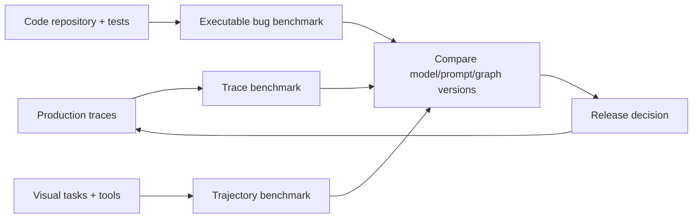
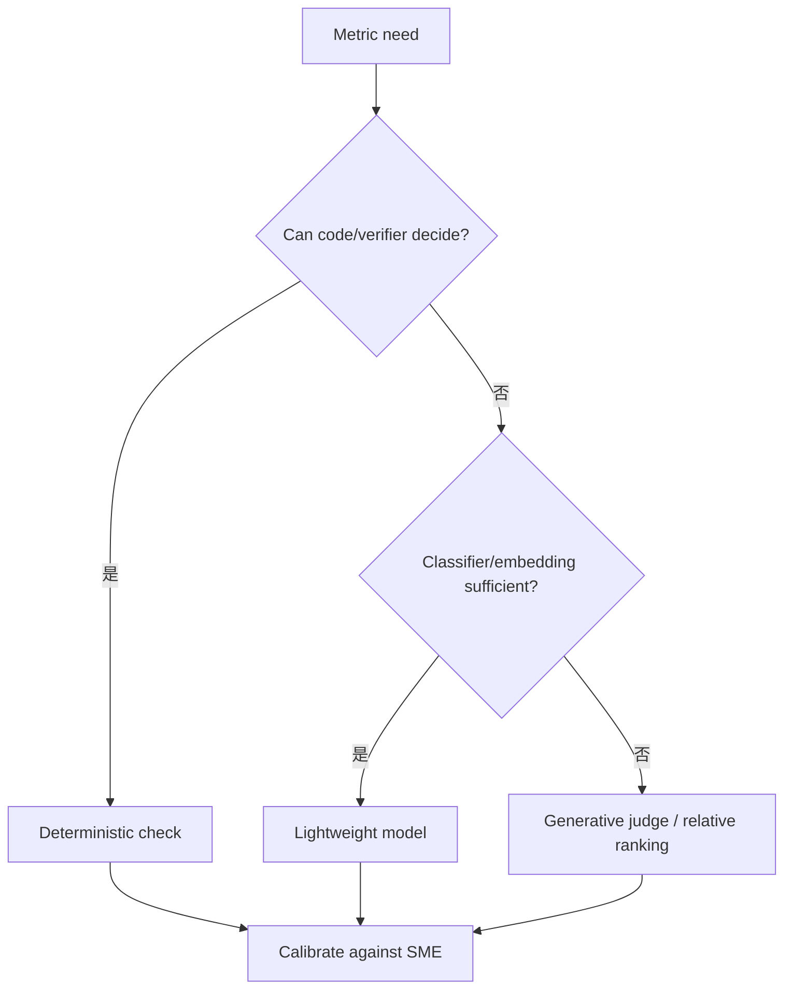
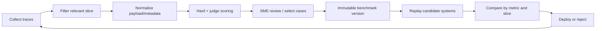
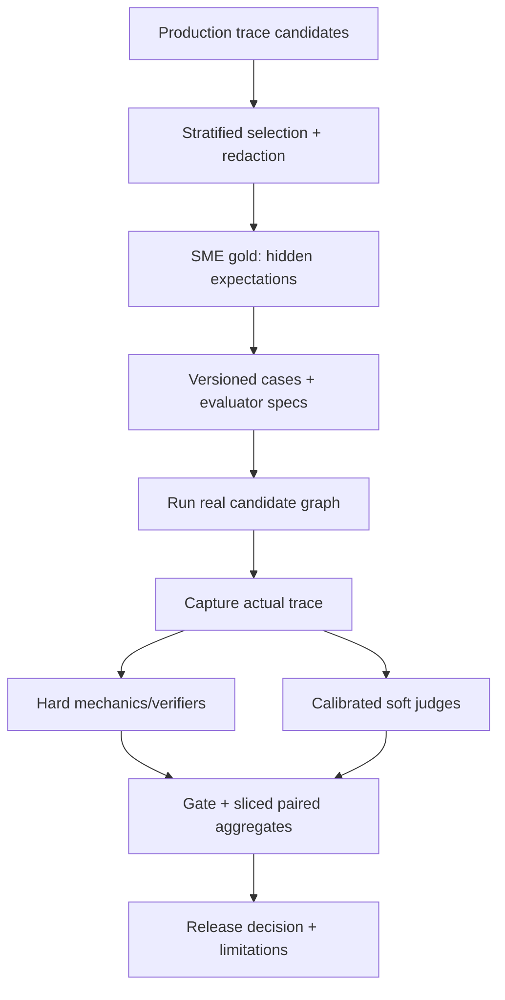
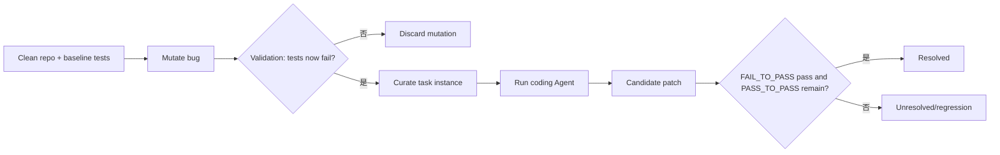
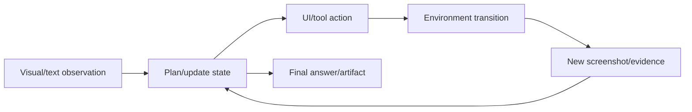
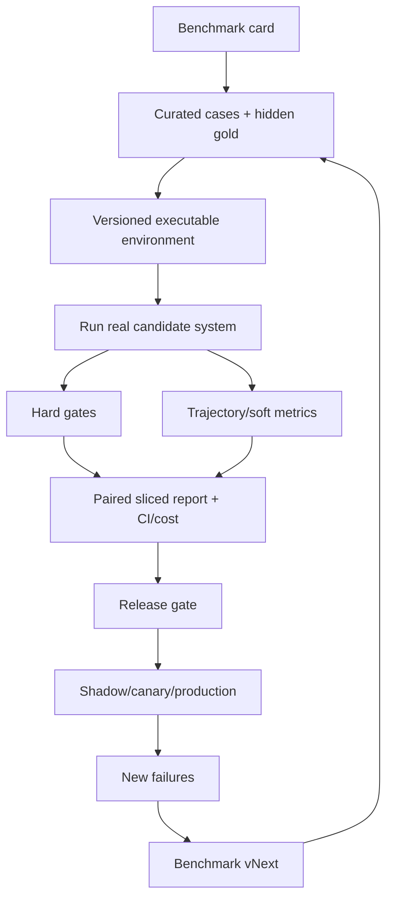
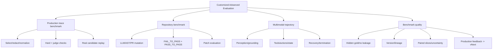

> 原章：*Customized and Advanced Evaluation of Agentic Systems*
> 核心问题：怎样把真实系统证据、自己的代码仓库和多模态长程轨迹变成可执行、可复现、可维护的 benchmark，从而可靠比较模型、prompt、fallback 和 Agent 架构，而不是依赖零散 spot checks？

## 0. 本章定位与三种评估视角

第 8 章建立了“压力测试/红队→线上观察→新回归场景”的基础循环。第 9 章进一步把观察数据工程化为 benchmark，并扩展到三个对象：

1. **System-level trace evaluation**：从 LangSmith/Langfuse production traces 选择代表性业务 case，用 deterministic checks 与 LLM judge 评分，再回放候选模型；
2. **Verifier-based coding evaluation**：用 SWE-smith 修改自己的 repo、确认 tests 由 pass 变 fail，再评价 coding Agent 的 patch 是否恢复测试；
3. **Trajectory-based multimodal evaluation**：用 AgentVista 观察模型在图片/GUI/网页等长程任务中看到了什么、调用什么工具、在哪一步失败。



三者分别回答：

- 系统在真实业务路径上是否按预期工作；
- 代码修复是否通过可执行 verifier；
- 长程/视觉 Agent 如何到达结果，以及过程哪里断裂。

全章的共同原则是：

> Benchmark 不是一堆 prompts，也不是一个平均分；它是版本化的任务分布、运行环境、执行协议、评分器、基线和局限说明。最终答案、系统行为和轨迹证据要与任务性质匹配。

---

## 1. 为什么 Tracing 不等于 Evaluation

Tracing 可以完整记录 model/tool/node，但没有预先定义：

- 哪些 traces 代表要发布的能力；
- 哪个行为正确；
- hard constraints 与 reference；
- 怎样比较候选版本；
- 结果是否显著、是否可复现。

可把 trace 看成 observation $z$，evaluation 需要额外函数：

$$
E(z;task,rubric,reference,policy)\rightarrow scores,reason,decision.
$$

全量 instrumentation 仍可能没有有效 evaluator；反之 benchmark 若不保留 trajectory，又会只看最终文字而漏掉 tool/route failure。

### 1.1 为什么用户反馈不够

用户常不点 rating，而会：重试、改写、纠正、追问、放弃、绕过 Agent 用人工流程。它们都是 indirect signals：

| 行为 | 可能表示 | 其他解释 |
|---|---|---|
| 重试/改写 | 不清楚、未对齐 | 用户自己改变目标 |
| 纠正 Agent | 事实/上下文/推理错 | 用户也可能错 |
| 放弃 | 无用、太慢、失败 | 用户被打断 |
| 立即追问 | 不完整 | 正常深入探索 |
| 使用人工 fallback | 不信任/不可靠 | policy 本就要求人工 |
| thumbs down | 明确不满意 | 极端用户自选择偏差 |
| 不修改直接接受 | 可能成功 | 未检查或低风险接受 |

因此 user behavior 是 case-mining signal，不是自动 gold label。需要结合 retry/tool/outcome/escalation 和 SME review。

---

## 2. 设计 Custom Benchmark 的五个问题

### 2.1 测什么 capability

写精确能力：tool routing correctness、financial arithmetic、safe code execution、handoff compliance，而不是“Agent quality”。若目标模糊，分数不可解释。

### 2.2 什么 task 代表能力

Task 来自真实 domain/workflow，并包含输入、可用 tools/state、预期 output/action 和约束。一个 ticket reply 不能代表整个 customer-support Agent。

### 2.3 怎样评分

优先 hard metrics：数值、schema、tool success、policy、tests。Open-ended quality 再用 rubric/judge/relative ranking。定义人类、random、floor、ceiling 和现网 baseline。

### 2.4 能否复现和维护

记录 data source、environment、prompt/model/tool/policy/evaluator versions、assumptions 与 limitations。否则同名 benchmark 不同时间测的是不同东西。

### 2.5 如何长期有用

明确 owner、release gate、更新 cadence、immutable regression version、case retirement 与 feedback loop。新 failure 进入新 version，不静默修改历史 baseline。

### 2.6 Benchmark specification

可形式化为：

$$
B=(D,Env,Runner,Evaluators,Aggregation,Baselines,Protocol).
$$

- $D$：tasks/cases 和 slices；
- $Env$：tools/data/runtime；
- Runner：候选系统如何运行；
- Evaluators：hard/soft metrics；
- Aggregation：gate、权重和 segment；
- Baselines：现网/人类/简单策略；
- Protocol：重复次数、预算、统计与报告。

缺任何一项都可能让数字不可比较。

---

## 3. 从系统信号定义 Trace-level Rubric

### 3.1 原章列出的失效信号

| 观察 | 常见含义 | 更直接的检查 |
|---|---|---|
| 重复 tool/retry | selection/execution 不稳 | repeated signature、retry count |
| 错工具 | routing/reasoning 弱 | expected vs actual tool |
| 超 step/retry | 不收敛 | budget invariant |
| handoff 缺失 | orchestration/state error | target/transition trace |
| schema violation | output instability | Pydantic/JSON Schema |
| 高 latency/cost | 无效 reasoning/tool/prompt | span/token/tool cost |
| frequent fallback/escalation | reliability/safety threshold 不满足 | fallback reason/rate |
| 相似输入高方差 | stochastic instability | repeated-run variance |
| 正确但不完整 | usefulness failure | rubric/required facts |
| unsupported claim | grounding 缺失 | citation/claim verifier |

观察只是 diagnosis hypothesis。例如 high latency 也可能来自 provider queue，不一定是 prompt。Trace score 要尽量接近机制，并保留根因不确定性。

### 3.2 不要默认全部交给 autoregressive judge

Judge all 会贵、慢、随机、产生 judge-model bias 和 evaluation fatigue。Evaluator routing：



DeepEval 提供 tool correctness、multi-turn tool use、goal accuracy、role adherence 等，但 metric 名不保证适合你的 policy，仍需 calibration。

### 3.3 Relative ranking 的位置

Open-ended text 单独打 0.73 难校准。可对同 case 的候选做 pair/group ranking（RULER 思路），但发布仍需 absolute minimum gate，否则“最好的坏答案”会胜出。

---

## 4. 从 Production Traces 建 Benchmark 的生命周期

原章 notebook 先创建/记录代表性 support traces，再从平台取回、规范化、过滤、评分，挑 critical failures 写 JSONL，最后回放新模型。



### 4.1 代表性选择而非最近前十条

目标 release 决定 slice：workflow、Agent role、region、tenant、failure type、fallback、risk。抽样同时包含：

- 高影响 critical failures；
- 高频普通 cases；
- rare edge cases；
- 随机 successful baseline；
- model/version disagreements。

只收 critical failures 会得到“故障回归集”，适合防复发但不代表总体业务分布。应与代表性 quality set 分开报告。

### 4.2 数据治理

原章警告 trace 可能含 PII、credentials、confidential data；遵守 retention/zero-retention，敏感 workflow 可禁 tracing，tenant 分 project/policy。

转 benchmark 时用 synthetic replacement、tokenization/redaction、access-controlled encrypted store。删除用户数据请求要能追踪到 derived benchmark case；不能去掉 trace ID 后就认为匿名。

---

## 5. 例 9-1：Trace Fetch Setup 与时间窗口

配置：

- `BATCH_SIZE=10`：首次人工检查工作集；
- `TOTAL_TRACES=100`：平台查询候选上限；
- `EVAL_TAG="ext_eval_pipelines"`；
- workflows：billing/shipping/returns/account_access；
- Agent types：triage/billing/returns；
- LangSmith endpoint/project；
- today 05:00、yesterday 05:00、seven days ago UTC。

### 5.1 为什么用 UTC-aware timestamp

跨 region/DST 时 naive datetime 会错。所有存储转 UTC，展示再转用户 timezone。业务日从 05:00 开始可能匹配 operations shift，但应记录 timezone 和 inclusive/exclusive boundary。

### 5.2 `limit=100` 的抽样偏差

平台返回顺序若是 newest-first，前 100 不是随机/代表样本。高流量时会漏整个时间窗。需 pagination、stratified/reservoir sampling 或 server-side filters。

### 5.3 Tag fallback 的危险

后文若 tagged 为空就回退 windowed，会悄悄改变 benchmark 定义。Release benchmark 应 fail/alert 或显式 metadata `selection_fallback=true`，不无声放宽条件。

---

## 6. 例 9-2 至 9-5：规范化 Trace Payload 与 Metadata

### 6.1 `parse_trace_payload`

兼容：

- `outputs={"output": {...}}`；
- nested output 含 case ID；
- top-level dict 含 case/workflow；
- output 是 JSON string。

不支持则抛 TypeError。此函数是 adapter，不是 schema validation；解析后仍应 Pydantic validate versioned payload。任意 JSON string 可能巨大/恶意，设 size/depth limit。

### 6.2 `is_support_case_trace`

先看 run name `Support case:`，否则 parse 并检查 workflow、agent_type、required_step、final_answer keys。

仅凭 name prefix 就 True 可能接纳错误 payload；后续仍需 parse/schema。名字是 hint，不是信任边界。

### 6.3 `matches_eval_filters`

严格匹配 workflow 与 agent type allowsets。先 normalization case/alias；unknown 记录 excluded reason，而不直接消失，否则不知道 coverage gap。

### 6.4 `run_tags`

优先 `run.tags`，否则 `run.extra.tags`。如果两处都有但不同，当前函数忽略 extra；应定义 merge/precedence 并记录 schema source。

### 6.5 `run_start_utc`

处理 ISO `Z`、naive datetime→UTC、aware datetime。把 naive 直接标 UTC 不是转换，前提是平台保证 naive 值语义为 UTC；否则应拒绝/按已知 source timezone localize。

### 6.6 `in_time_window`

若 start time 缺失，原函数返回 True，会把不可证实时间的 run 纳入窗口。Benchmark 选择应更保守：缺 timestamp 隔离到 review，不默认纳入。

---

## 7. 例 9-6：获取 Representative Traces

原函数 `fetch_support_traces(from_timestamp, to_timestamp)` 的流程是：list root runs→time window→tag→前 10→support classification→workflow/agent filters。

一个关键顺序问题：原函数先 `raw_batch=tagged[:10]`，再 support/filter。若前 10 中只有 1 条符合，返回 1 条，即使第 11–100 有很多合格。更合理：先完整过滤，再按 sampling strategy 选 BATCH_SIZE。

```text
query/paginate
→ validate timestamp/tag
→ parse/schema
→ workflow/agent filters
→ deduplicate/stratify
→ sample BATCH_SIZE
```

返回 raw/support/filtered 三层集合有利于计算漏斗：

$$
yield=\frac{|filtered|}{|candidates|}.
$$

同时记录每一步 exclusion counts，判断 instrumentation 是否漂移。

---

## 8. Trace Scoring：Hard Checks 与 LLM Checks

### 8.1 原章 8 个核心维度

Hard deterministic：retry budget、correct handoff、required step；实际 scoring code 还加 required tool succeeded。

LLM-based：answer sufficiency、answer correctness、task completion、argument correctness、step efficiency。

### 8.2 例 9-7 `correct_handoff`

```python
return payload["handoff_target"] == payload["expected_handoff"]
```

完全可复现，但前提是 expected handoff gold 正确，且 string aliases normalized。复杂 workflow 可能允许多个合法 targets 或“不 handoff”；应表示 allowed set/transition predicate，而非唯一 string。

### 8.3 例 9-8 `final_answer_correct`

DeepEval `GEval` 依据 trajectory summary、actual output、reference answer，返回 score+reason。

它评价语义，不等于事实 verifier。Reference answer 可能不唯一/过期；criteria 需明确证据和允许变化。Judge model/version、temperature、prompt 和 framework version纳入 benchmark spec。

### 8.4 Argument correctness 应尽量 deterministic

原表将它放 LLM-based，但很多参数可用 schema/domain rule 验证：URL allowlist、currency、quantity、ID、date range。只有开放式 query formulation 才需 judge。Hard checks 应做尽可能多工作。

### 8.5 Step efficiency 不是越短越好

最少 steps 可能跳过验证；多一步可能是安全检查。可定义：

$$
Efficiency
=
\frac{useful\ steps}{total\ steps}
$$

并加 required checks，而不简单惩罚长度。Latency/cost 与 path quality 分开报告。

---

## 9. 例 9-9：批量评分与 Audit Trail

原代码把结果收集到 `evaluated_traces`：每 trace normalize payload；调用 5 个 judge metrics；追加 deterministic scores、judge scores 与 reasons。

### 9.1 为什么 reasons 要保存

Judge score 0.6 无法指导修复；reason 可定位 reference mismatch、遗漏步骤或 arguments。但 reason 是模型生成解释，不一定忠实，应用于 review，不作为独立事实。

### 9.2 性能与可靠性

原循环串行做每 trace×5 judge calls，10 traces 就 50 calls，成本/延迟高。可 batch/async/cache 相同 metric context，但需 rate limit 和稳定顺序。Judge failure 不应填 0 冒充低分；标 `evaluation_error`、score N/A。

### 9.3 Aggregate 前的 gate

Hard failures 不应被 soft score 平均掩盖。定义：

$$
Eligible_i
=
\prod_{h\in H}\mathbb{1}[h_i=1].
$$

只有 eligible case 的 soft quality 进入发布比较，或 separately report pass rate 与 quality。

### 9.4 回写 tracing platform

回写 score 便于同平台过滤/可视化，但评估 pipeline 若需 provider-independent，可导出 external store。无论哪种：保存 evaluator version，避免新评分覆盖旧评分；写入权限与 production trace 隔离。

---

## 10. Benchmark 是版本化产品，不是动态列表

### 10.1 Implementation phase

定义 scope、trace source、tasks、metrics、baseline、limitations，选 cases，SME adjudicate，冻结 `v1`。

### 10.2 Maintenance phase

新 model/user group/workflow 暴露新 failure 时创建 `v2`，不要回改 v1。保留 changelog 和两版本 bridge set，区分系统改善和 benchmark 变难。

### 10.3 Benchmark overfitting

反复根据同一 10 个 critical cases 调 prompt 会记住答案。分层：

- dev set 可日常查看；
- validation 用于选择；
- hidden holdout/recent production cases 最终 gate；
- rotating challenge set 检测泛化。

BetterBench 强调 benchmark quality 本身也需评估：validity、reliability、contamination、documentation、maintenance。

---

## 11. 例 9-10：写 JSONL Regression Set

原例写入 `benchmark_set_langsmith.jsonl`，每 critical failure 一行：case/workflow/agent/type、payload、reference、prior scores/reasons 和 text dimensions。

### 11.1 JSONL 优点

- streaming append/read；
- 每行独立；
- Git diff 较直观；
- 易进 data pipeline。

### 11.2 还需哪些 metadata

- benchmark/schema version；
- case source/provenance/redaction status；
- created/reviewed by/date；
- expected policy/tool versions；
- risk/segment；
- immutable case hash；
- evaluator specs；
- license/retention。

### 11.3 原始 scores 不应成为新 gold

Prior model score/reason 可做 baseline/debug，但 judge 可能错。Reference 与 expected mechanics 必须经 SME/hard verifier 确认。Critical-failure-only set 不报告成总体 accuracy。

### 11.4 安全写入

使用原子 temp+replace、UTF-8、stable canonical hash；敏感 benchmark 不放公开 Git。写入前 validation，读取时限制 size/schema。

---

## 12. 例 9-11：回放 Candidate Model 的关键漏洞

### 12.1 原算法

`run_candidate_agent(payload,model_name)` 把 customer request、workflow、required step、**expected handoff**、**reference answer** 都放入 prompt，要求模型返回 retry count、handoff、steps、tool_calls、final answer JSON。缺字段填 safe defaults。

### 12.2 Label leakage

把 expected handoff/reference answer 给候选模型，相当于把答案放进题面。它测的是“能否复制/改写 gold”，不是独立推理和 tool execution。

正确拆分：

```text
candidate input:
  customer request + allowed context/tools + workflow policy

hidden evaluator-only gold:
  expected handoff + required step + reference answer
```

这是本章最重要的实现边界之一。教学例为了统一 payload 简化，正式 benchmark 必须防 leakage。

### 12.3 Self-reported trajectory

候选模型只是**输出** `tool_calls` 和 `steps_completed` JSON，并未真正执行 graph/tools。因此 deterministic checks 可能评分模型声明，而不是行为。可信 system benchmark 应运行真实 candidate Agent graph，捕获实际 trace。

如果只测“规划输出”，就把 benchmark capability 明确命名为 plan/schema prediction，不称 tool success。

### 12.4 `json_object` 不等于 schema

`response_format={"type":"json_object"}` 保证/鼓励 JSON object，不保证 keys/types；缺字段 defaults 使结果可评估，却可能隐藏 schema failure。应记录 missing fields 和 tier，Pydantic validate，不能让 default 被当真实 success。

### 12.5 Temperature 0

降低随机性但不保证 deterministic；每模型应多 seeds/runs，报告 variance。单次 replay 对随机 Agent 置信不足。

---

## 13. 例 9-12/9-13：聚合与模型比较

`evaluate_candidate_model(model_name, benchmark_cases)` 逐 case 评分并聚合；例 9-13 将 `gpt-5.4` 与 `gpt-5.4-mini` 的结果保存在 `model_comparison`。

### 13.1 Mean 的局限

`statistics.mean` 对每 metric 求宏平均，所有 cases 等权。还需：

- per-workflow/agent/risk slices；
- hard pass counts；
- bootstrap confidence interval；
- paired case differences；
- latency/cost；
- missing/error rate。

若模型 A 在 billing 全失败、shipping 全成功，平均 0.5 会隐藏事故。

### 13.2 原 toy result 怎样解读

10 cases：GPT-5.4 required step/tool success 各 0.4，argument correctness 0，soft correctness 接近 1；mini required step 0.9、tool success 0、argument correctness 0.2、step efficiency 0.94。

这暴露 evaluator/runner 不一致：模型能生成漂亮 final answer，却没有真实工具执行；`required_tool_succeeded=0` 与接近 1 的 answer correctness 并存。不能简单说 mini “整体胜出”，应按 hard gate 判两者可能都不具备可发布 tool behavior。

### 13.3 Paired comparison

同一 cases 比两个模型，计算：

$$
d_i=s_i^{A}-s_i^{B},
\qquad
\bar d=\frac1N\sum_i d_i.
$$

对 binary hard metrics 用 McNemar；continuous score 用 paired bootstrap/Wilcoxon 等，并报告 effect size/CI。10 cases 的细小均值差不能过度解释。

### 13.4 比较不只适用于模型

同 runner 可比较 fallback、prompt、router、tool description、memory、policy、whole graph。每次只改变目标 variable 或采用 factorial design，保持其他 versions 固定。

---

## 14. Trace Benchmark 的正确实现蓝图



开发者必须参与 scope、gold、review 和 maintenance；平台 API 只负责存取 trace。

---

## 15. Turn Your Repo Into a Benchmarkable Environment

### 15.1 为什么 coding Agent 需要 repository-specific benchmark

SWE-bench/SWE-bench Verified 等公共 coding benchmark 重要，但可能：

- 模型训练时见过 issue/patch；
- language/framework 与你的 repo 不同；
- 测试、build 和 API 约束不一致；
- 不覆盖私有架构与历史回归。

把自己的 repo 变成 benchmark，使 task、environment、verifier 与真实维护工作接近，也降低公开题 memorization 的影响。

### 15.2 Task instance 是什么

从干净 commit $R_0$ 生成 mutation patch $m_i$，得到 broken repo：

$$
R_i=apply(R_0,m_i).
$$

只有满足：

$$
Tests(R_0)=PASS
\quad\land\quad
Tests(R_i)\supseteq FAIL
$$

才是有效 bug instance。Coding Agent 得到 $R_i$ 与 task description，生成 fix patch $f_i$；若 verifier 恢复目标 tests 且不破坏其他 tests，算 resolved。



### 15.3 为什么 tests 是强 verifier

可执行、确定性较强、与行为绑定，不需要 judge 猜 patch 是否正确。它仍不完美：test coverage 有空洞，flaky tests、环境依赖和 overly-specific patch 都会误判。

---

## 16. SWE-smith Lifecycle：Mutate、Validate、Curate、Solve

### 16.1 例 9-14：构建隔离 image

```shell
python -m swesmith.build_repo.create_images -r <your_repo_name>
```

构建 Docker image 和 repo copy，防覆盖工作区并固定 dependencies。安全上：

- 用 clean commit/worktree；
- 不 mount credentials/home/docker socket；
- network 默认限制；
- pin image/dependencies；
- resource/time/process quotas；
- mutation/fix 只在 disposable copy。

Docker 共享 kernel，不是恶意代码的最终硬边界；第 6 章的 sandbox 原则仍适用。

### 16.2 例 9-15：LLM bug generation

```shell
python -m swesmith.bug_gen.llm.modify $repo \
  --n_bugs 1 \
  --model openai/gpt-4o \
  --config_file configs/bug_gen/lm_modify.yml
```

LLM 可生成语义细微 bug，但非确定、可能无效、过于明显或产生不可构建代码。保存 generator model/config/seed/prompt/base commit 与 patch hash。

### 16.3 三种 bug generation

| 方法 | 优点 | 偏差/限制 |
|---|---|---|
| LLM-generated | 语义、较真实、变化丰富 | 随机、生成器风格偏差、可能泄漏答案模式 |
| AST procedural | 可控、可复现、系统覆盖 mutation operators | 多为局部 syntactic/semantic change，不代表真实复杂 bug |
| PR mirroring | 来自真实历史、realism 强 | 数量有限、PR context 泄漏、revert 可能不独立 |

组合方法增加 bug distribution 多样性，但原章指出 LLM/程序 mutation 常只改 individual entities，未必覆盖跨文件、configuration、concurrency 和 architectural bug。

### 16.4 Mutation operators 与覆盖

可按 bug taxonomy 分层：condition flip、off-by-one、wrong API、exception handling、state leak、race、dependency/config、UI/CSS。报告各类 task count/pass rate，避免 benchmark 被简单 operator 主导。

---

## 17. 例 9-16：Validation Pipeline

三步命令分别调用 `swesmith.bug_gen.collect_patches`、`swesmith.harness.valid` 和 `swesmith.harness.gather`：

1. `collect_patches` 收集候选 patches；
2. `harness.valid` 在隔离环境执行验证；
3. `harness.gather` 汇总 valid task instances。

### 17.1 有效 instance 的严格条件

- base tests 在 clean repo pass；
- mutation 可干净 apply；
- build/test harness 能运行；
- 至少一个目标 test 从 pass→fail；
- 失败原因来自 mutation，而非 infra timeout；
- task 不泄漏 gold patch；
- 可在重复运行中复现；
- 没有明显无关大范围破坏。

### 17.2 FAIL_TO_PASS 与 PASS_TO_PASS

- `FAIL_TO_PASS`：broken repo 失败、正确 fix 应转为 pass；
- `PASS_TO_PASS`：原本 pass、fix 后必须继续 pass，防 regression。

只检查 FAIL_TO_PASS 会接受删测试、hard-code 或破坏其他功能的 patch。还可加 hidden tests、lint/typecheck/security/performance。

### 17.3 Flakiness

Validation 重复运行 $k$ 次；若结果不稳定，隔离/剔除。若 test 自然 failure probability 为 $q$，单次误判概率就是 $q$；多次一致要求可降低误纳但增加成本。不能把 timeout 当功能 fail。

---

## 18. 例 9-17/9-18：评价 Fix 与构建 Curated Subset

### 18.1 Sanity eval

```shell
python -m swesmith.harness.eval \
  --dataset_path bugs/task_insts/{repo}.json \
  --predictions_path gold \
  --run_id sanity
```

先用 gold patch 检查 benchmark harness：若 gold 都无法恢复，task/environment 有问题，不能拿来评 Agent。之后 predictions path 换候选 patches。

### 18.2 Patch result 不只有 resolved/unresolved

分类：build error、patch apply fail、test timeout、target still fail、regression、resolved、harness error。把 infra error 当 Agent fail 会污染能力估计。

### 18.3 例 9-18 subset criteria

从 Hugging Face `SWE-bench/SWE-smith` train split 选：

- instance ID 含 `.pr_`（PR mirrored）；
- `FAIL_TO_PASS` 数在 2–5。

这是一种 workload slice，偏向 PR bugs 和中等测试数量，不代表完整 dataset。保存原 dataset revision，不只 `split="train"`。

### 18.4 为什么选 2–5 failing tests

一个 test 可能过窄/偶然；太多 tests 可能是广泛破坏、运行成本高。2–5 是可管理 heuristic，不是 bug 难度的普适尺度。Difficulty 还取决于 files、localization、dependencies、test runtime、required reasoning。

### 18.5 Curated set 应怎样平衡

按 repo/language/bug type/files changed/test count/real vs synthetic/difficulty 分层；去 near-duplicates；防同一 PR train/test 泄漏；保留 hidden holdout。

---

## 19. Coding Benchmark 的指标和作弊路径

### 19.1 基本指标

$$
ResolveRate=\frac{resolved}{valid\ attempted\ instances}.
$$

同时报告 apply/build/harness errors、tokens、wall time、tool calls、cost 和 pass@$k$。若每 case 允许 $k$ 次独立 attempts，至少一次成功率不是简单单次准确率；实测报告而非假设独立。

### 19.2 常见 benchmark gaming

- 删除/skip tests；
- hard-code fixture/output；
- 修改 evaluator/config；
- 读取 gold patch/history；
- network 搜索公开 PR；
- 过拟合 visible tests；
- 不必要大 patch 恰好通过。

防护：read-only tests/harness、network policy、hidden tests、patch scope/audit、clean environment、check test files unchanged、gold isolation。

### 19.3 Tests pass 不等于最佳 patch

还可评 patch size、maintainability、security、performance 和 style，但 hard verifier 优先。软 judge 不能推翻 test regression；将 quality 用于已 resolved patches 的排序。

### 19.4 代码仓库的三重角色

Repo 同时是：

1. task source（生成 bugs）；
2. execution environment（build/deps）；
3. verifier（tests）。

这使 benchmark 高度领域相关，也意味着 test suite 的盲点会直接成为 benchmark 盲点。

---

## 20. 从 Outcome 到 Trajectory：为什么多模态长程任务更难

GUI/visual software Agent 不是“看图回答”而是多步闭环：读取 screenshot/dialog、选择 UI element、打开 log、比较视觉 output、调用 code/browser、更新 state、恢复错误。

最终成功可能掩盖低效/危险路径；最终失败也需知道 perception、planning、tool、state 还是 recovery 出错。



Trajectory $\tau$ 可表示：

$$
  au=(o_1,a_1,e_1,o_2,a_2,e_2,\ldots,o_T,a_T,y).
$$

评估要定位：看到了什么、选了什么、证据是什么、何时偏离。

### 20.1 GUI 失败类型

- perception：没识别 dialog/text/element；
- grounding：点错 element/坐标；
- planning：顺序或目标错；
- state tracking：忘记已执行/新状态；
- tool choice：该看 log 却反复截图；
- recovery：错误后重复无效 action；
- termination：过早停止/不停止；
- evidence integration：视觉/文本冲突处理错。

### 20.2 GUI-native metrics

- task success；
- element grounding/IoU/click accuracy；
- action validity；
- normalized path length/excess steps；
- recovery success；
- state consistency；
- tool appropriateness；
- visual evidence citation；
- irreversible unsafe actions。

只用 final-answer judge 无法覆盖。

---

## 21. Real-world Software Bugs 不只 Python/Text

JavaScript/HTML/CSS/UI/data visualization 的 bug 常以 screenshot、mockup、diagram 或 visual mismatch 表达。Text-only issue 或 Python-only benchmark 会漏掉：layout、responsive、event、browser state、rendering、accessibility。

SWE-bench Multimodal 通过 screenshots、design mockups、diagrams、visual error context 补足一些维度。仍需 browser/version/viewport/fonts/network 确定性和 pixel/DOM/accessibility verifier。

Visual reference 也可能含敏感用户数据或 prompt injection 文本，应 sandbox browser、限制 tools/network，并将 image content 视为 untrusted input。

---

## 22. AgentVista：长程视觉 Agent Evaluation

### 22.1 框架价值与缺口

AgentVista 聚焦 realistic multi-step visual tasks 和 trajectory，而非孤立 perception。作者 fork 调整 judge：构造 scored response 时优先 `final_answer`，提高评分稳定性。

作者也明确指出仍缺：

- 真正 interactive environment layer；
- 你应用所需 GUI-native metrics。

因此当前示例更多是 trajectory/tool reasoning harness，不是完整 GUI Agent benchmark。

### 22.2 修改 judge 的影响

优先 final answer 可减少 judge 误把中间文本当结果，但可能弱化 trajectory faults。应同时报告 outcome score 与 process metrics，不用一个 final score 覆盖 path。

---

## 23. 例 9-19/9-20：多模型 AgentVista Run

### 23.1 配置

原 `OPENROUTER_ENDPOINT` 设 chat completions；`MODELS`：

- `openai/gpt-5.4`；
- `qwen/qwen3.5-35b-a3b`；
- `google/gemini-3.1-pro-preview`。

Reasoning 与 verifier endpoints 相同，默认 verifier 为 `openai/gpt-5.4-mini`；enabled tools：web_search、image_search、visit、code_interpreter。

### 23.2 一个实验设计问题

例 9-20 对每个 model 设置：

```python
env["REASONING_MODEL_NAME"] = model_name
env["VERIFIER_MODEL_NAME"] = model_name
```

这意味着 candidate 和 verifier 一起变化，不再是固定 judge 的公平模型比较；self-evaluation bias 也变化。若目标比较 reasoning model，应固定 independent verifier，或使用 hard/多 judge/human；若目标比较 end-to-end self-verifying systems，则要明确该 capability。

原例 9-19 的默认 verifier 设置也被 loop 覆盖，需注意。

### 23.3 运行预算

命令 flags 为 `--max-turns 10`、`--max-images 20`、`--max-total-tokens 24000`、`--skip-completed`，并传入 input file、image folder 和 per-model output dir。

预算用于公平和防失控，但不同模型 tokenization/hidden reasoning/vision token accounting 可能不同。报告实际 tokens、images、turns、latency/cost；只给同一个 24000 不保证同等 compute。

### 23.4 `--skip-completed`

支持 resume，避免重跑；但 completion 判定必须绑定 model/config/code/dataset hash。否则修改 prompt 后仍跳过旧结果，混合不同实验版本。

### 23.5 Output directory

`model_name.replace('/', '__')` 避免 slash 建子目录，但其他不安全字符/碰撞仍需 sanitize；manifest 保存原 slug/hash。

### 23.6 作者结果怎样解释

作者在所选 subset 上 GPT-5.4 最好。没有给样本量、metrics/CI 和详细结果，不能推广到 AgentVista 全集或所有 visual Agent。它是一次 subset observation。

---

## 24. 三种 Benchmark 视角如何组合

| 视角 | 主要对象 | 强证据 | 盲点 |
|---|---|---|---|
| Production trace | 真实业务 system behavior | 真实 failures/handoffs/tools | selection bias、gold 稀缺 |
| Repo verifier | code patch functional outcome | executable tests | test incompleteness、过程质量 |
| Visual trajectory | 多步 perception/action/state | failure localization | environment/judge/GUI metric 复杂 |

统一 release report：

```text
Hard gates
  policy/schema/tool/test/safety
Outcome metrics
  correctness/task success/user impact
Trajectory metrics
  routing/actions/recovery/efficiency
Operational metrics
  latency/cost/errors
Slice + uncertainty
  domain/risk/user/language/CI
```

不应压成一个总 leaderboard；关键 hard gate 失败时均值再高也不发布。

---

## 25. 容易混淆的概念与常见误区

| 易混淆点 | 正确辨析 |
|---|---|
| Tracing 完整就等于有 evaluation | Trace 是证据；需 task/gold/rubric/evaluator/protocol |
| Custom benchmark 是挑几条 production failure | 还需代表性 slices、正常 baseline、版本、维护与 holdout |
| 用户重试一定说明 Agent 错 | 是间接 signal，有其他解释，需上下文/标注 |
| 用户接受输出就说明正确 | 可能未检查、无替代或低风险接受 |
| “Agent quality”是可测 capability | 太模糊，应拆 tool routing、correctness、safety 等 |
| 全部用 LLM judge 最先进 | Hard verifier/classifier/embedding 常更便宜稳定 |
| Relative ranking 选出的最好候选就可上线 | 仍需 absolute minimum/hard gate |
| 最近 10 条 tagged traces 代表 production | 有时间/排序/segment/selection bias |
| Tag 为空回退全部 traces 无害 | 悄悄改变 benchmark scope，应显式失败/标记 |
| Missing timestamp 可默认进窗口 | 时间不可验证，应隔离 review |
| Run name 前缀足以确认 trace 类型 | 仍需 payload schema/version |
| 先截 batch 再过滤不会影响结果 | 可能漏掉后续合格 traces，应先过滤再抽样 |
| Expected handoff 必须唯一 | 某些任务有多个合法 path，应使用 predicate/set |
| Step efficiency 越短越好 | 不能跳过验证/安全步骤，应衡量 useful/excess steps |
| Judge reason 是事实解释 | 是生成文本，用于 review，不保证忠实 |
| 平均 metric 足够比较模型 | 会隐藏 workflow/risk slice failure 和 paired variance |
| 给候选 reference answer 仍是公平 benchmark | 造成 label leakage，只测复制 gold |
| 候选自报 tool_calls 可评真实 tool use | 必须运行真实 graph 并捕获实际 trace |
| JSON object mode 保证字段 contract | 只保证 JSON object，需 schema/Pydantic |
| Defaults 让 missing output 安全可评 | 可能隐藏 schema failure，需 provenance/status |
| Toy set 上 mini 均值高就全面优于大模型 | Hard tool success 为 0、样本 10，不能总体下结论 |
| Benchmark v1 应不断原地加入 cases | 应冻结 v1，新需求建 v2/changelog |
| Repo tests pass 证明 patch 完全正确 | Test suite 不完整，还可能 gaming/hidden regressions |
| Mutation 让任意 test fail 就是好 task | 需 base pass、复现、因果、scope 和 gold sanity |
| FAIL_TO_PASS 足够 | 还需 PASS_TO_PASS/hidden tests 防回归和作弊 |
| Docker benchmark 可安全运行任意代码 | 仍需 sandbox、resource/network/secret controls |
| Test count 直接等于 bug 难度 | Difficulty 还涉及 localization/files/deps/reasoning |
| Final answer score 足够评 GUI Agent | 需 perception/grounding/action/state/recovery trajectory |
| 固定 token cap 对所有模型 compute 公平 | Tokenizer/reasoning/vision accounting 不同 |
| Candidate 同时当 verifier 是公平比较 | Judge 随候选变化，测的是另一种 end-to-end setup |
| `skip-completed` 总能安全续跑 | 必须绑定 config/code/data hash |

---

## 26. 从本章抽象出的高级 Benchmark 方法

### 26.1 第一步：写 benchmark card

Capability、target population、case source、environment、runner、metrics、baselines、slices、known limitations、owner/version。

### 26.2 第二步：分离 input 与 hidden gold

Candidate 只见生产时可获得信息；expected answer/handoff/tests/judge rubric 隐藏。自动检查 prompt dataflow 防 leakage。

### 26.3 第三步：运行真实系统

Tool/Agent benchmark 捕获真实 actions，不让模型用 JSON 自报。Environment 固定，credential synthetic，副作用 sandbox/idempotent。

### 26.4 第四步：Hard gate 先行

Schema/policy/tool/tests/safety 先 gate；soft quality 只比较 eligible results。Errors 与 low scores 分开。

### 26.5 第五步：分层抽样与 holdout

Production cases 按频率+风险；repo bugs 按 language/type/difficulty；visual tasks 按 perception/action。去重，隐藏 gold，保持 unseen rotating set。

### 26.6 第六步：Evaluator calibration

Hard checks 有 unit tests；judge 与 SME 比 agreement/bias；固定 judge 以比较 candidates，或明确评 whole self-verifying system。

### 26.7 第七步：paired/sliced/statistical report

同 cases 成对比较；报告 x/n、CI、effect、errors、latency/cost，避免单总分和小样本过度结论。

### 26.8 第八步：版本和 lineage

Case hash、base commit、mutation patch、dataset revision、model/prompt/tool/judge/config hashes；output manifest 与 run ID。

### 26.9 第九步：验证 benchmark 本身

Gold sanity、flakiness、contamination、difficulty、discrimination、coverage、gaming。Benchmark 也会坏。

### 26.10 第十步：release→production feedback

Offline gate→shadow/canary→线上 outcome→新 failure triage→vNext benchmark，但保留 frozen historical versions 看趋势。



---

## 27. 可运行示例：防 Gold Leakage 的 Paired Benchmark

下面的标准库示例展示：candidate input 与 hidden gold 分离；hard checks 作为 gate；对同一 cases 做 paired comparison，而不是只比较独立均值。

```python
# Run with: python advanced_benchmark_demo.py
from dataclasses import dataclass
from statistics import fmean

@dataclass(frozen=True)
class Case:
  case_id: str
  customer_request: str
  workflow: str
  expected_handoff: str  # hidden from candidate
  required_step: str     # hidden from candidate

  def candidate_input(self) -> dict[str, str]:
    return {
      "customer_request": self.customer_request,
      "workflow": self.workflow,
    }

def score_trace(case: Case, trace: dict) -> dict[str, float]:
  handoff = float(trace.get("handoff_target") == case.expected_handoff)
  step = float(case.required_step in trace.get("steps_completed", []))
  eligible = handoff * step
  soft_quality = float(trace.get("soft_quality", 0.0))
  return {
    "handoff": handoff,
    "required_step": step,
    "eligible": eligible,
    "soft_quality": soft_quality if eligible else 0.0,
  }

def paired_mean_difference(scores_a: list[float], scores_b: list[float]) -> float:
  if len(scores_a) != len(scores_b) or not scores_a:
    raise ValueError("paired scores must be non-empty and aligned")
  return fmean(a - b for a, b in zip(scores_a, scores_b))

if __name__ == "__main__":
  case = Case(
    case_id="returns-1",
    customer_request="My unopened item arrived yesterday; start a return.",
    workflow="returns",
    expected_handoff="returns_agent",
    required_step="verify_purchase_date",
  )
  assert "expected_handoff" not in case.candidate_input()
  assert "required_step" not in case.candidate_input()

  good = score_trace(case, {
    "handoff_target": "returns_agent",
    "steps_completed": ["verify_purchase_date"],
    "soft_quality": 0.8,
  })
  shortcut = score_trace(case, {
    "handoff_target": "returns_agent",
    "steps_completed": [],
    "soft_quality": 1.0,
  })
  assert good["eligible"] == 1.0 and good["soft_quality"] == 0.8
  assert shortcut["eligible"] == 0.0 and shortcut["soft_quality"] == 0.0

  difference = paired_mean_difference(
    [0.8, 0.6, 0.9],
    [0.7, 0.6, 0.8],
  )
  assert abs(difference - (0.2 / 3)) < 1e-12
  print({"candidate_input": case.candidate_input(), "paired_difference": difference})
```

对应关系：

- `candidate_input()` 不含 expected handoff/required step，防 label leakage；
- scoring 才读取 hidden gold；
- soft score 1.0 不能挽救漏 required step 的 shortcut；
- paired difference 保持 case alignment；
- 真实 benchmark 还需 bootstrap/CI、error taxonomy、多 runs、真实 Agent graph 和 versioned manifest。

---

## 28. 本章知识结构与核心结论



### 28.1 核心结论

1. Tracing 记录发生了什么；evaluation 还需 capability、gold/rubric、evaluator 与比较协议。
2. Custom benchmark 是任务分布、环境、runner、评分、聚合、baseline 和 protocol 的版本化产品。
3. 用户 feedback 稀疏且有偏；重试、纠正、放弃等行为只用于 mining，不自动成为 gold。
4. Hard checks 应承担可确定的 routing/retry/tool/schema/policy 验证，generative judge 只用于真正开放维度。
5. Production traces 需按 release scope 分层选择、去敏、校验和标注；critical-failure set 与代表性 set 分开。
6. Trace adapter 要处理 payload/tag/time drift，但 missing metadata 不应默认放行。
7. 先截前 10 再过滤会降低 yield 并产生顺序偏差；应先筛选、再抽样。
8. Judge score/reason 需保留 evaluator version，并与 hard gate、errors、SME calibration 分开。
9. Benchmark version 冻结；新 failures 进入 vNext，保留 changelog/holdout 防过拟合。
10. Candidate prompt 绝不能暴露 reference answer、expected handoff 等 hidden gold。
11. 让模型自报 tool calls/steps 不是 system evaluation；必须运行真实 graph 捕获实际 trace。
12. 平均分会隐藏 workflow/risk slice 和 hard failure；使用 paired comparison、counts、CI、latency/cost。
13. SWE-smith 让 repo 同时成为 task source、execution environment 和 test verifier。
14. Mutation 只有在 clean baseline pass、mutation 后稳定 fail、gold fix 可恢复时才是有效 instance。
15. FAIL_TO_PASS 验目标修复，PASS_TO_PASS/hidden tests 防回归和 benchmark gaming。
16. LLM、AST 和 PR-mirroring mutations 各有分布偏差，应组合并按 bug taxonomy 报告。
17. Tests pass 是强 functional signal，但受 coverage/flakiness 限制，不能证明 patch 最佳。
18. Visual/GUI long-horizon Agent 必须评价 observation、grounding、action、state、recovery 和 termination trajectory。
19. AgentVista 示例展示多模型 trajectory harness，但缺完整 interactive GUI environment/metrics，且候选与 verifier 同变会混淆比较。
20. 高级 benchmark 的目标不是制造一个漂亮 leaderboard，而是让 release decision 与 Agent 真实行为、可执行结果和失败路径对齐。

### 28.2 作者解决问题的一般思路

作者沿“观察证据→可重复回放→可执行 verifier→过程诊断”的路线扩展评估：

1. 指出 tracing 与 sparse feedback 不能直接回答版本是否更好；
2. 先写 benchmark capability/task/score/maintenance 问题，建立设计框架；
3. 从 production traces 规范化 payload/metadata、按业务 slice 过滤；
4. 用 hard mechanics 和 LLM rubric 分工评分，并保留 reason/audit；
5. 将 critical traces 写成 versioned JSONL，回放候选模型；
6. 对 coding Agent 发现主观 judge 不够，于是 mutation repo 并用 tests 作 verifier；
7. 对 GUI/视觉长任务发现 final outcome 不够，于是提升到 trajectory evaluation；
8. 最终把三种证据统一到真实系统行为与发布决策，而非孤立模型回答。

可迁移的一般方法是：**先精确定义被测能力，隔离候选可见输入与 evaluator hidden gold；尽可能运行真实系统并使用可执行 hard verifier；开放式部分用校准 judge；按 case 成对、按风险切片报告；将 benchmark 自身也视为需版本、测试、防泄漏和维护的软件产品。**

---

## 29. 延伸阅读

- BetterBench：benchmark validity、documentation、contamination 与维护。
- LangSmith、Langfuse：datasets、trace export、evaluation scores。
- DeepEval、RULER：Agent metrics、GEval 与 group-relative ranking。
- SWE-bench、SWE-bench Verified、SWE-smith：coding Agent 可执行 benchmark。
- Mutation testing、property-based testing、flaky-test detection。
- SWE-bench Multimodal、AgentVista：视觉软件任务与长程 trajectory。
- 统计比较：paired bootstrap、McNemar、Wilcoxon、multiple-comparison control。
- 原书第 8 章：stress/red-team/production observation；第 10 章：Agent memory。
