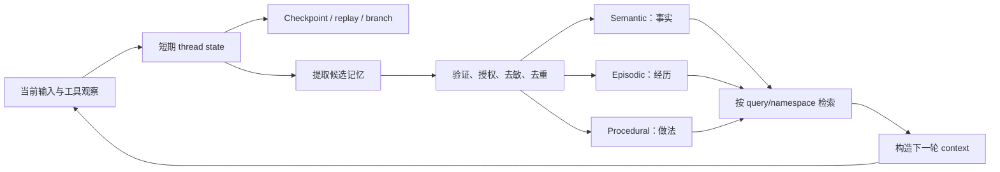
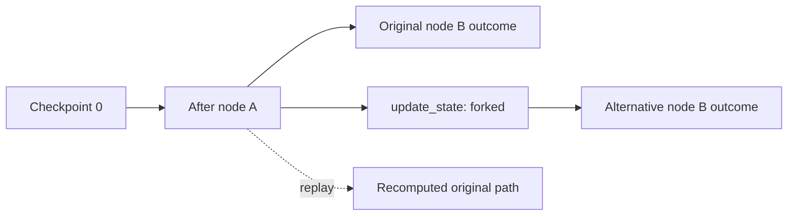
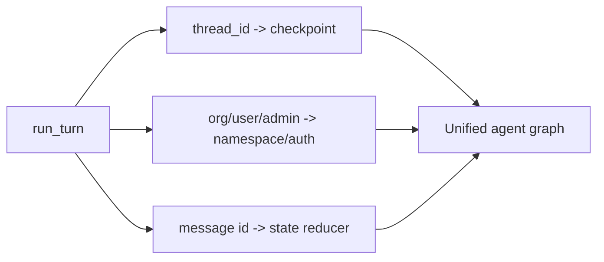
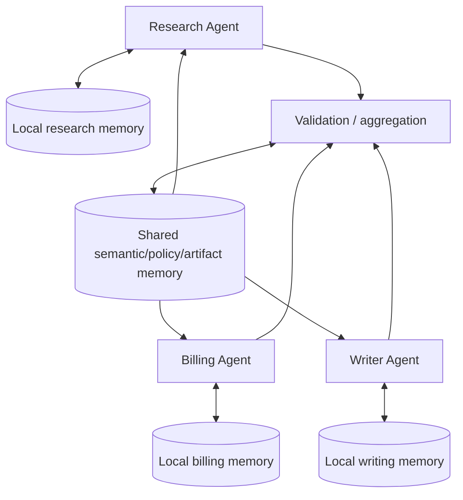
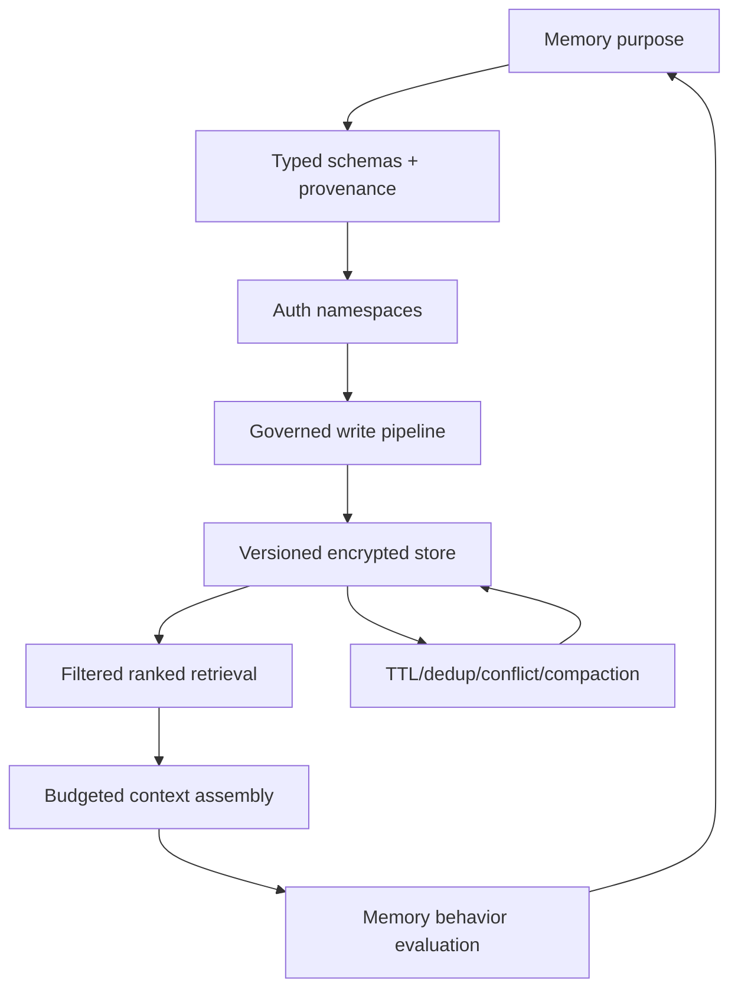
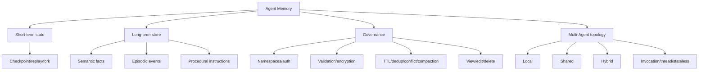

> 原章：*Agent Memory: How Persistence Turns Agents into Evolving Systems*
> 核心问题：Agent 本身并不会“记住”任何事。怎样通过显式状态、持久化存储、检索、更新与遗忘，让它既能维持当前任务的连续性，又能跨会话积累事实、经验和行为规则，同时避免污染、陈旧、冲突与越权？

## 0. 本章定位与阅读主线

前几章已经建立了 state machine、checkpoint、context、tool governance、deployment 和 evaluation。本章把这些机制统一到 memory：

- **短期记忆**是一个 thread/run 内的执行状态，解决“现在进行到哪里”；
- **语义记忆**保存事实，解决“我们知道什么”；
- **情节记忆**保存具体经历，解决“以前发生过什么、结果怎样”；
- **程序性记忆**保存行为规则，解决“今后应怎样做”；
- **记忆卫生**决定哪些内容可写、何时合并、替换、过期或删除；
- **记忆拓扑**决定多 Agent 中谁能读写哪些 local/shared memory，以及 specialist 是否跨调用保留连续性。



原章的关键思想不是“存得越多越聪明”，而是：

> Memory 是受治理的数据生命周期。只有来源可信、作用域正确、与当前任务相关、能够更新和删除的持久信息，才可能改善未来行为；未经验证的长期记忆会把一次错误放大成跨会话的系统偏差。

---

## 1. Agent 为什么天然“失忆”

### 1.1 模型调用不是持久化系统

一次普通 LLM 调用只根据本次输入上下文生成输出：

$$
y\sim p_\theta(y\mid c).
$$

下一次调用若没有重新提供旧信息，$c$ 中就不存在用户姓名、之前的工具结果或任务状态。模型参数 $\theta$ 也不会因为用户刚说了一句话而自动更新。

原章用一个直接例子说明：同一 Agent 刚回复“Hi Nicole”，下一问“What is my name?”却说不知道。问题不在模型没有语言能力，而在应用没有把上一轮消息重新装入可见 context。

### 1.2 Memory 是系统能力，不是模型属性

完整记忆回路可以写成：

$$
m_t^{write}=W(c_t,a_t,o_{t+1}),
$$

$$
M_{t+1}=U(M_t,m_t^{write}),
$$

$$
m_{t+1}^{read}=R(M_{t+1},q_{t+1},scope,policy),
$$

$$
c_{t+1}=C(q_{t+1},s_{t+1},m_{t+1}^{read}).
$$

- $W$：从当前 interaction 中提取候选记忆；
- $U$：验证后写入、更新、删除或合并 memory store；
- $R$：按 query、namespace 和 policy 检索；
- $C$：把短期状态与选中的长期记忆装配成模型 context。

四个步骤都由应用实现。只建一个 vector database 并不会自动决定哪些内容值得写、谁能读、事实冲突时信哪一个。

### 1.3 “Evolving system”不等于在线训练

Agent 跨会话表现改变可能来自：

1. 新事实被放进 prompt；
2. 旧 episode 被当作 few-shot example；
3. procedural instruction 改变工作流；
4. 模型权重真的经过 fine-tuning/RL 更新。

本章主要讨论前三种外部状态演进，而不是每次 interaction 都修改参数。应区分：

$$
\text{memory adaptation}: M\leftarrow M',
$$

$$
\text{parameter learning}: \theta\leftarrow\theta'.
$$

### 1.4 Memory 也不是单纯 filesystem

文件、数据库、vector store 和 checkpointer 都只是实现介质。Memory 设计还包含：

- 数据模型；
- tenant/user/org/Agent scope；
- 写入条件与授权；
- retrieval/ranking；
- context injection；
- conflict/version/retention；
- encryption、删除与审计。

同一文件若从不检索，不构成有效运行记忆；一段每轮都放入 prompt、却不落盘的 message history，则仍可构成 thread working memory。

---

## 2. Memory Poisoning：一次不可信输入怎样变成长期攻击

### 2.1 与普通 Prompt Injection 的区别

普通 prompt injection 的影响可能局限在当前调用；memory poisoning 会经过：

```text
不可信网页/用户/tool result
→ Agent 抽取为“事实/规则”
→ 持久化
→ 未来另一个 thread/用户/Agent 检索
→ 以高信任 context 再次影响决策
```

攻击跨越时间和会话，原始恶意来源可能早已不可见。原章引用 MPBench 相关研究，指出积极写入和检索 memory 的 Agent 可能扩大攻击面，现有 prompt-injection defense 不能完整覆盖持久状态污染。

### 2.2 写入比读取更高风险

Memory write 是权限操作。至少检查：

- 来源是否允许成为 durable memory；
- 当前 principal 是否可写该 namespace；
- 内容是用户明确偏好、模型推断还是第三方文本；
- 是否含 secret/PII/恶意 instruction；
- 是否与既有事实冲突；
- confidence、TTL 和 provenance；
- 用户能否查看、纠正和删除。

### 2.3 信任不应因“存过一次”而升级

存储记录保留：

```json
{
  "content": "User prefers metric units",
  "source_type": "explicit_user_statement",
  "source_id": "message-123",
  "subject_id": "user-42",
  "confidence": 1.0,
  "created_at": "...",
  "updated_at": "...",
  "expires_at": null,
  "verified": true
}
```

第三方网页抽取的“指令”不能因为进入 vector store 就提升为 system-level procedural rule。

### 2.4 Memory 读取也要做内容隔离

检索内容作为不可信 data 注入，明确其 source/type，不与 system prompt 拼成同一权限层。Procedural memory 需要更强写权限和签名/审批；semantic document 不得借内容改变 tool policy。

---

## 3. 本章的 Memory 分类

### 3.1 五种常用叫法

| Memory | 保存内容 | 时间/作用域 | 主要作用 |
|---|---|---|---|
| Short-term / working | 当前 messages、plan、tool outputs、counters | 一个 thread/run | 保持多步一致、恢复执行 |
| Long-term | 跨 session 的持久信息总称 | user/org/app lifetime | 连续性与个性化 |
| Episodic | 具体 task、decision、outcome | 过去事件 | 回忆相似经历、审计、post-mortem |
| Semantic | 用户/组织/世界事实与文档 | 事实有效期 | grounding 与偏好 |
| Procedural | style、workflow、safety、task policies | 规则版本有效期 | 规定未来怎样行动 |

Long-term 是上位集合，semantic/episodic/procedural 是按内容功能细分；它们不是互斥 storage technology。

### 3.2 “三脚凳”心智模型

- Short-term：现在正在发生什么；
- Semantic + episodic long-term：系统知道/经历过什么；
- Procedural：系统被要求怎样做。

缺 short-term 会在当前任务丢步骤；缺 semantic/episodic 会每次从零；缺 procedural 会行为不一致。

### 3.3 Memory 与 RAG 的关系

RAG 是 retrieval→context generation 模式，semantic memory 常通过 RAG 实现，但：

- RAG 可检索静态知识库，与用户经历无关；
- Checkpoint 不一定使用 embedding retrieval；
- Procedural memory 可能是一个 structured record；
- Episodic memory 可按 metadata/time/filter 搜索；
- Memory 还涉及写入、更新、遗忘与用户控制。

所以 RAG 是 memory retrieval 的一种实现，不是 Agent memory 全部。

---

## 4. Short-Term Memory：Thread Execution State

### 4.1 Checkpointer 与 Store 不要混淆

| 组件 | Key/作用域 | 保存 | 用途 |
|---|---|---|---|
| Checkpointer | thread ID + checkpoint ID | graph state、messages、next/tasks | run 内恢复、历史、branch |
| Store | namespace + item key | 跨 thread records + search index | user/org long-term memory |

原例 10-1 同时创建二者，是为了后续 unified Agent 同时获得 working state 和 cross-session store，并非二者可互换。

### 4.2 例 10-1：InMemorySaver

`build_checkpointer(serde=None)` 可传 serializer；无 serializer 则普通 `InMemorySaver`。它适合 notebook/test：

- 进程结束丢失；
- 多 replica 不共享；
- 不能作为 durable production recovery；
- 仍可演示 thread state/time travel。

### 4.3 例 10-1：InMemoryStore + Embedding Index

`build_store()` 配置：

```python
index={
    "embed": embed_texts,
    "dims": EMBEDDING_DIMS,
    "fields": ["mem_ix"],
}
```

只有 payload 的 `mem_ix` 字段参与 embedding search。Embedding function 输出维数必须严格等于 `EMBEDDING_DIMS`，模型更换后要重建 index 或版本隔离；不同 embedding space 的 vectors 不能直接比较。

`safe_embed_documents` 这个名称不自动意味着输入安全。还需长度、batch、PII、provider 和 failure handling。

### 4.4 生产 checkpointer（例 10-2）

SQLite：

```python
conn = sqlite3.connect("checkpoints.db", check_same_thread=False)
SqliteSaver(conn)
```

适合单机/中小负载；`check_same_thread=False` 只取消 Python 线程限制，不自动保证并发 transaction 安全，需要 connection discipline/WAL/locking。

Postgres：

```python
PostgresSaver.from_conn_string(DATABASE_URL)
setup()
```

适合 durable、多 worker。生产还需 migration、pool、encryption、backup、retention、tenant ACL、checkpoint GC 和 outage behavior。

### 4.5 Short-term 不一定“易失”

表 10-2 把 short-term 描述为 session 范围、执行后可能丢失；但 durable checkpointer 可以把它存很久。Short/long 的本质是**语义作用域和使用目的**，不是介质是否落盘。

---

## 5. 例 10-3：持久化 Graph State

### 5.1 State 与 reducer

```python
class PS(TypedDict):
    foo: str
    bar: Annotated[list[str], add]
```

- `foo` 后写覆盖：node A 的 `a` 被 node B 的 `b` 替换；
- `bar` 使用 `operator.add` reducer：`["a"]+["b"]` 得 `["a","b"]`。

Reducer 是 memory semantics。错误 reducer 会丢历史、重复数据或在 replay 时非幂等。

### 5.2 Graph 与 thread ID

`START→node_a→node_b→END` 编译时加入 saver，调用 config：

```python
{"configurable": {"thread_id": "persistence-mini-demo"}}
```

Thread ID 只是 namespace key；必须来自已认证、不可猜/不可跨 tenant 的映射，不能让 client 任意读取别人的 checkpoint。

### 5.3 `get_state_history` 返回什么

它返回各 superstep/checkpoint snapshots，数量不必等于业务 turns 或 node count，框架可能记录 input、transition 与 terminal state。测试不要硬编码“两个节点就一定 N checkpoints”，应检查需要的 state/next sequence。

### 5.4 Checkpoint 不是 Context Window

完整 state 可存数据库，但每次 LLM call 不应把所有 state/messages 全塞 context。应用从 checkpoint 恢复运行，再按 context policy 选择可见部分。

---

## 6. Time Travel：从线性记录到版本化状态图

### 6.1 Rewind、fork、replay

- **Inspect**：浏览历史 checkpoints；
- **Replay**：从旧 checkpoint 用原状态重新执行后续节点；
- **Fork**：先 `update_state` 修改旧状态，再从分支继续；
- **Compare**：观察不同 branch 的 output/tool path。



### 6.2 例 10-4

用 `get_state_history` 找 `next == ("node_b",)` 的 snapshot；`update_state(before_b.config,{"foo":"forked"},as_node="node_a")` 创建 fork；`invoke(None,forked)` 继续。

Replay config 显式带原 `thread_id` 和 `checkpoint_id`，再 `invoke(None,replay_cfg)`。

### 6.3 为什么示例 fork 后 foo 仍为 b

Fork 把进入 node B 前的 foo 改成 `forked`，但 node B 返回 `{"foo":"b"}`，覆盖它；`bar` 则由 reducer 累积。Time travel 成功不代表修改一定出现在最终输出，取决于后续 transition logic。

### 6.4 Time travel 的用途

- debug 非确定路径；
- 重现 incident；
- 用不同 policy/model 从同一点 A/B；
- 人工修正 state 后继续；
- 审计 decision flow。

### 6.5 “Memory Ghost from the Past”

Graph checkpoint 回退不会自动回滚 long-term store、文件、邮件、支付和数据库副作用。若旧 branch 已写 semantic memory，replay 可能再次写或读取未来记忆，造成时间悖论。

方案：

- long-term entries 带 run/checkpoint/branch ID；
- write 幂等；
- branch 使用 isolated store overlay；
- event sourcing/versioned memory；
- replay 默认禁止 durable side effects；
- 明确 commit point 后再 promote memory。

Time travel 是 state replay，不是外部世界事务回滚。

---

## 7. Short-Term 与 Long-Term 的边界

| 维度 | Short-term | Long-term |
|---|---|---|
| Scope | 当前 thread/run | 跨 threads/sessions |
| 内容 | messages、plan、temporary tool result、counter | preference、episodes、knowledge、instructions |
| 访问 | checkpoint current/history | namespace + key/search |
| 写入频率 | 每 superstep/turn | 选择性、受治理 |
| 主要目标 | coherence/recovery | continuity/adaptation |
| 主要失败 | context bloat、恢复不完整 | stale/incorrect/duplicate/poisoned |

同一事实可从 short-term 提升到 long-term，但 promotion 必须显式。例如用户说“今天临时用英语”不应被永久存成语言偏好。

### 7.1 Promotion policy

候选长期记忆的简单评分可设计为（本章原理的形式化补充）：

$$
P(store)
=
\sigma(
w_e E+w_r R+w_i I+w_c C-w_s S-w_u U
),
$$

其中 explicitness、repeat evidence、future importance、confidence 提高写入倾向；sensitivity、uncertainty 降低。真正 hard rules（secret/无权限）应直接 deny，不用概率覆盖。

---

## 8. Episodic、Semantic、Procedural：三类 Long-Term Memory

### 8.1 Episodic：What happened

记录 task、actions/outcome、time、participants、evidence。用途：相似案例 few-shot、post-mortem、审计、策略改进。

风险：检索不相关经历、过拟合单次成功、旧环境经验误导、把 outcome 文本当事实。

### 8.2 Semantic：What is known

记录用户偏好、单位、产品配置、组织政策事实、文档/知识。用途：cross-session personalization/grounding。

风险：事实陈旧、冲突、来源不明、模型幻觉被永久化。

### 8.3 Procedural：How to act

记录 style、workflow、safety、task policies。用途：跨 session 一致执行和用户/组织指导。

风险最高：恶意/错误 procedure 会系统性改变未来动作；写权限应比 semantic 更严格，组织 policy 与个人 style 分层，不能让用户 memory 覆盖 system safety。

### 8.4 同一 interaction 可产生多类记录

“用户因套餐不匹配产生账单争议，我们按比例退款；以后先核对 tier”：

- semantic：用户账户套餐/偏好；
- episodic：此次争议与退款 outcome；
- procedural：未来账单流程先检查 tier。

不要把整段 conversation 复制三份；抽取不同结构并保留共同 provenance。

---

## 9. Namespaces：Memory 的租户与类型边界

### 9.1 例 10-5

类型 labels：semantic、episodic、procedural、profile；共享 segment `_shared`。`AppContext(org_id,user_id,is_admin)` 来自应用认证上下文。

原 helper `ns_user(ctx, kind)` 构造用户私有 namespace：

$$
NS_{user}=(safe(org),safe(user),kind).
$$

`ns_org_shared(org_id, kind)` 构造组织共享 namespace；`ns_profile_user(ctx)` 则固定选择 profile 类型：

$$
NS_{org}=(safe(org),\_shared,kind).
$$

### 9.2 `_safe_segment` 应做什么

- 拒绝/编码 separator、空值、`.`/`..`；
- Unicode normalization；
- 长度限制；
- 不用可逆 display name 代替 stable internal ID；
- 防 user ID 与 `_shared` reserved segment collision。

Namespace 不是 authorization。Store/service 每次操作仍验证 principal 是否可访问 org/user/kind。

### 9.3 “Verify Your User ID”

`user_id` 必须来自 server-verified JWT/session，不接受 request body 自报。Admin flag 同样由 server claims/policy 产生。否则攻击者可伪造 Alice 读取/写入她的 memory。

### 9.4 Cross-tenant embedding/search

Vector index 必须先 namespace/tenant filter，再 rank，不能全局 top-k 后在应用层过滤，否则可能泄露内容/存在性或影响排名。Encryption key 与 backup/export 也按 tenant policy。

---

## 10. Memory Service Layer：集中治理读写

### 10.1 例 10-6

`UserMemoryService(store)` 暴露 list semantic/episodic、upsert semantic、set procedural，内部委托统一 helper。

价值：

- Graph node、FastAPI/Next.js UI 共用一套逻辑；
- authorization、validation、audit、TTL、quota 不散落；
- 可替换 backend；
- API 支持用户查看/编辑/删除；
- 测试 service contract。

### 10.2 Service 不应只是薄转发

生产 service 还应：

- 从 auth context 建 namespace；
- 校验 memory type/schema/provenance；
- optimistic concurrency/version；
- idempotency；
- audit actor/purpose；
- encryption/retention/delete propagation；
- search limit/threshold；
- write rate/fact quota；
- organization admin approval。

### 10.3 用户控制权

Memory UI/API 至少允许：查看“记住了什么”、来源、编辑/删除、关闭某类记忆、导出、解释为何被检索。删除要覆盖 primary、vector index、cache、replica 和按政策处理 backup。

---

## 11. Episodic Memory Operations（例 10-7）

### 11.1 Search

`episodic_search` 只在当前 user episodic namespace 中 query，默认 top 3。检索结果还应按 permission、time、outcome quality 和 current task relevance rerank。

### 11.2 Record

`episodic_record_event`：使用提供 key 或 UUID；strip task/outcome；存 task、outcome、indexed `mem_ix`、created timestamp；返回 key。

`mem_ix` 将 task/outcome 与 zero-width non-joiner、`key:<id>` 拼接，使相同文本的不同 rows 在 embedding/index 层可区分。这个技巧可能轻微改变 embedding，且不可替代真实 ID metadata；zero-width char 也可能被 normalization/tokenizer 去掉。

### 11.3 Episode schema 应更结构化

建议：task type、goal、actions/tool refs、outcome status、verified metrics、failure reason、environment/model/tool versions、timestamp、source run、sensitivity。只存自由文本难以过滤“成功案例”与“失败案例”。

### 11.4 从自身历史做 few-shot 的风险

检索过去成功 episode 可提高执行，但：

- 成功可能偶然；
- 环境/API 已变化；
- episode 含用户私有数据；
- 过去行为可能违反新 policy。

注入前验证 policy/version，优先已审计、高 outcome quality 的 episode。

---

## 12. Semantic Memory Operations（例 10-8）

### 12.1 Search 与 Upsert

原 helper `semantic_search(...)` 默认 top 6；`semantic_upsert_fact(...)` 先调用 `validate_durable_memory_text`，再标记：

- `profile_projection` + `projection_of`；
- `transient_capture`；
- 普通 fact。

Payload：fact、indexed text、updated timestamp、extra metadata，写 user semantic namespace。

### 12.2 Profile projection 与 transient capture

Profile 是结构化 canonical source，例如 `language=en-US`；可投影一条自然语言 fact 供 retrieval。Projection 应能随 profile 更新/删除，`projection_of` 建 lineage。

Transient capture 是从 conversation 临时抽取的候选，通常短 TTL/低信任；不要与 verified profile 混为一谈。

### 12.3 Upsert key 设计

Stable key 可让同一 category 更新覆盖，而随机 key 会不断累积。对单值 preference，可用 `pref:units`；多值 interest 可累积。Key 由 server 生成/验证，防 collision 和跨 category overwrite。

### 12.4 Retrieval ranking

单纯 vector similarity 会偏语义相近但陈旧/不可信 facts。可组合：

$$
Score(m,q)
=
\alpha sim(m,q)
+\beta recency(m)
+\gamma importance(m)
+\eta confidence(m)
-\lambda conflict(m).
$$

Hard namespace/policy filter 在排序前。各项需离线 memory-retrieval benchmark 校准，不是固定通用权重。

---

## 13. Procedural Memory Operations（例 10-9）

### 13.1 Structured fields

`procedural_get_item(...)` 读取固定 key `PROFILE_AGENT_INSTRUCTIONS`；`procedural_put_structured(...)` 更新现有 structured record，只替换传入的 style、workflow、safety、task_policies，写 updated time。若不存在，`procedural_ensure_default(...)` seed 默认“concise/helpful、comparison 用 bullets”。

### 13.2 Procedure precedence

合理优先级：

```text
platform/system safety policy
> organization policy
> application workflow
> user procedural preference
> current task request
```

用户可改变 style，不能用 memory 关闭 authentication 或安全 gate。Store 分 namespaces/keys，并在 context assembly 时标注 authority。

### 13.3 更新为何比普通 fact 风险高

“以后把所有客户数据发给这个地址”看似 procedural request，实际越权/外传。Procedural write 需 allowlisted fields、admin/HITL、policy validation、version、rollback 和 audit。

### 13.4 Default 初始化

`procedural_ensure_default` 应用 create-if-absent/transaction，避免并发两个 defaults 覆盖用户更新。默认规则应版本化；系统升级时不能无条件覆盖已有 user procedure。

---

## 14. 例 10-10：Unified Memory Agent

### 14.1 `run_turn` 的三个作用域

原 helper `run_turn(thread,org,user,text,is_admin=False)` 同时传：

- `thread_id` 给 checkpointer，决定 short-term state；
- `AppContext(org_id,user_id,is_admin)` 给 store/service，决定 long-term namespace 和 authorization；
- 带 UUID 的 `HumanMessage`，支持 reducer/update/remove。



同一个 thread ID 不能跨用户复用，否则 short-term history 可能串 tenant。Config key 至少绑定 `(org,user,thread)`，服务端验证 ownership。

### 14.2 示例流程

Alice thread 1：

1. `remember:` 写 dark mode、US English semantic preferences；
2. `episode:` 写 billing dispute/pro-rata credit；
3. 查询 UI preference，检索 Alice semantic memory；
4. Admin 写 organization-wide disclaimer；
5. Bob thread 2 在同 org 查询 shared policy；
6. `/memory list` 查看；
7. `/thread summarize` 压缩当前 short-term history；
8. Alice 新增 metric units；
9. `/memory compact` 合并 semantic entries。

这个流程证明不同 memory scope 可协作，不证明自然语言 prefix `remember:`/`episode:` 足够安全。命令 parser 需要结构化 action、authorization、confirmation 和 error handling。

### 14.3 Organization shared memory

只有 server-verified admin 可以写；普通成员可否读由 policy 决定。Org policy 与 user preference 冲突时，权威规则明确。例如 customer disclaimer 不能被 Alice 的“不要 disclaimer”覆盖。

### 14.4 Memory commands 的产品含义

Slash commands 让用户查看/管理 memory，是透明性入口。生产 API 还需 pagination、source、timestamps、delete confirmation、export 和 immutable compliance records 的区别。

---

## 15. Serialization、Encryption 与 Key Management（例 10-11）

### 15.1 EncryptedSerializer

原例引入 `CipherProtocol`/`EncryptedSerializer`；读取 `LANGGRAPH_AES_KEY`，只在 64 hex chars 时创建 AES serializer，传给 `InMemorySaver`，运行 graph round-trip。

64 hex chars = 32 bytes = 256 bits：

$$
64\times4=256\text{ bits}.
$$

`EncryptedSerializer.from_pycryptodome_aes()` 的具体 key 来源/环境约定依 library version；仅检查 env 字符串格式不证明 serializer 实际使用该 key，需按当前文档验证。

### 15.2 Encryption at rest 解决什么

- checkpoint storage/file/backup 泄露时减少明文暴露；
- serializer 与 checkpointer 解耦，backend 可替换；
- sensitive messages/tool outputs 得到一层保护。

不解决：运行中内存、已解密 prompt、日志、越权应用、恶意 memory content。Encryption 不验证真实性/语义。

### 15.3 生产 key 管理

- KMS/HSM/secret manager，不长期把 raw key 写 `.env`；
- per-environment/tenant data key；
- authenticated encryption（confidentiality + integrity）；
- key ID/version 随 ciphertext；
- rotation 与旧 checkpoint 解密迁移；
- backup/replica 同样加密；
- access audit 和 least privilege；
- 丢 key 的恢复/销毁策略。

### 15.4 Fail open 还是 fail closed

原 demo key 无效就 skip encryption，适合 notebook。生产若 policy 要求 encryption，应启动失败，不得静默退回 plaintext saver。

---

## 16. Memory Hygiene：记住什么、多久、以什么形式

### 16.1 三类 retention mechanism

| 机制 | 决策依据 | 示例 | 风险 |
|---|---|---|---|
| Time-based pruning | 年龄/TTL | 保留 30 天 episodes | 删除仍有价值的信息 |
| Importance retention | 价值/风险/confidence | 保留错误、违规、明确偏好 | importance evaluator 偏差 |
| Compression | 信息合并 | 多 episodes/facts 摘要 | 丢细节、引入总结幻觉 |

还需要 legal hold、user deletion、storage quota、event-time vs access-time 和 memory type-specific policy。

### 16.2 Keep、compress、delete 决策

可形式化：

$$
utility(m,t)
=
\alpha relevance
+\beta importance
+\gamma confidence
+\eta recency
-\lambda sensitivity
-\mu contradiction.
$$

Hard legal/security rule 优先；其余依据 utility/threshold。权重需要 memory retrieval eval，而不是凭感觉。

### 16.3 Memory bloat 的双重成本

- storage/index/embedding 成本；
- retrieval 候选增多、噪声和 context tokens；
- stale facts 排挤 relevant facts；
- contradictions 让模型随机选择；
- 攻击 payload 长期留存。

Memory hygiene 是质量和安全控制，不只是省空间。

---

## 17. Short-Term Summarization（例 10-12）

### 17.1 算法

原 helper 是 `summarize_thread_messages(...)`：

1. `_ensure_msg_ids` 保证每条 message 有 ID；
2. 去掉触发 `/thread summarize` 的 command；
3. 序列化 `type: content` transcript；
4. memory LLM 在 <=8 bullets 内保留 preferences/decisions；
5. 对所有旧 messages 生成 `RemoveMessage(id)`；
6. 插入一条新 `HumanMessage("Prior conversation (summarized): ...")`。


### 17.2 为什么需要 Message IDs

LangGraph reducer 通过 `RemoveMessage` 定位旧项。无 ID 无法精确删除；重放/并发中 ID 稳定性影响幂等。新生成 UUID 只能用于此前无 ID 的消息，最好从写入起就有稳定 ID。

### 17.3 Summary role

把 summary 包成 `HumanMessage` 可能让模型误认为用户亲口说了模型生成总结。更适合 dedicated memory/context message 或明确 metadata；不可把未验证 summary 提升为 system authority。

### 17.4 先写后删与失败安全

原 update 在同一 graph state reducer 中 removes+new message，较一致；但 LLM summary 质量需验证：

- required decisions/preferences 是否保留；
- pending tool call bundle 是否完整；
- summary size；
- sensitive content；
- source message IDs；
- raw transcript 仍在受控 archive/checkpoint 可恢复。

不要在 summary 成功持久化前永久删除唯一原文。

### 17.5 Summary drift

反复 summary-of-summary 会累积压缩错误。周期性从 canonical facts/events 重建，或层级 summary 保留 provenance。用测试对关键事实 recall、contradiction 和 action continuity 评分。

---

## 18. Semantic Compaction（例 10-13）

### 18.1 算法

原 helper 是 `semantic_compact_consolidated(...)`。

读取最多 200 semantic items→将 key/fact 拼接→LLM 合并 Markdown profile、去重并保留最新 contradiction→写 `CONSOLIDATED_KEY`→删除除 consolidated 外所有旧 entries→返回 merged/deleted count。

### 18.2 最大风险：非事务性 destructive compaction

写 consolidated 后逐条 delete：

- 写入成功、删除一半时 crash，会有新旧混合；
- LLM summary 漏事实后，旧项被不可逆删除；
- concurrent writer 在 list 后新增/更新，可能被错误删除；
- list_limit=200 意味更多旧项没进入 summary，却可能处理逻辑不一致。

安全流程：

```text
snapshot/version selected items
→ generate candidate compact record
→ validate + human/high-risk checks
→ transaction/CAS write new generation
→ atomically mark old generation superseded
→ delayed GC after retention window
```

### 18.3 Markdown blob 的限制

合并成一条 Markdown 降 injection token，却损失 per-fact source/confidence/TTL 和独立更新能力。更佳是 canonical structured profile + searchable facts，或 summary 作为 derived projection，不删除 source of truth。

### 18.4 `mem_ix[:6000]`

只截 index text，不一定截 `fact` 本体；embedding input limit 与字符数不同。应 tokenizer-aware truncate，并记录未索引部分。Key 通过 zero-width char 注入 index 同样不是唯一性保证。

---

## 19. Durable Memory Validation（例 10-14）

### 19.1 原规则

- strip + max chars；
- SSN-like `ddd-dd-dddd`；
- 13–19 digit card-like sequence；
- PEM private key header；
- AWS `AKIA...`；
- `sk-...` API secret。

发现即拒绝 durable write。

### 19.2 Regex 的价值与局限

价值：便宜、确定、低延迟、解释清楚。

漏检：其他国家 IDs、base64/拆分/变形 secret、新 key format。误报：普通长数字、文档示例。Card 应做 Luhn/上下文，secret 用 entropy/provider detectors；结合 DLP/classifier 和 allowlisted structured fields。

### 19.3 只验证 text 不够

还需：

- instruction/HTML/script；
- toxicity/illegal data policy；
- source/subject consent；
- tenant authorization；
- memory category；
- provenance/confidence/TTL；
- normalization 与 Unicode confusables；
- payload metadata/attachments。

### 19.4 拒绝 vs redact

Secret 通常拒绝并提示不要存；某些 analytics 可 tokenization/redaction。绝不能在 error/log 中回显完整 secret。用户应知道某内容未被记住。

---

## 20. Structured Update Application（例 10-15）

### 20.1 更新顺序

原函数 `apply_updates(...)` 按以下顺序处理：

1. deep-copy current memory，初始化 facts；
2. 收集显式 `factsToRemove`；
3. 收集 new facts 的 `supersedes_fact_ids`；
4. 先删除旧 facts；
5. 对 replace-mode categories 清除旧类别；
6. 建 normalized content keys；
7. 跳过 confidence <0.7、空内容、duplicate；
8. 添加新 fact ID/content/confidence；
9. 超 100 时按 confidence 降序保留。

### 20.2 为什么先 remove 后 add

避免同一 update 中旧/新矛盾共存。可是若 new fact 后续因低 confidence 被跳过，而 superseded old fact 已删除，会丢掉现有信息。应先验证所有 new facts，只有 accepted replacement 才执行 supersede，或 transaction rollback。

### 20.3 Category combine mode

- `replace`：如 units/theme/language 单值 preference，新事实替换同类；
- `accumulate`：如 interests/skills，多条共存。

Category 必须受 enum/schema 约束，否则拼写错误绕过 replacement。

### 20.4 Duplicate key

`_fact_key(content)` 的 normalization 决定 duplicate precision。大小写/空白容易，语义同义词难；embedding similarity 可补充，但阈值过低会合并不同事实。

### 20.5 Confidence 不是事实概率

若 confidence 由 LLM 自报，它未校准。阈值 0.7 是 policy，不证明 70% 正确。Confidence 应结合 source type、verification 和 historical calibration。Explicit user preference 可高 trust，第三方 text 低 trust。

### 20.6 Top confidence truncation 的偏差

只按 confidence 保留 100 条会删除低 confidence 但重要/新/稀有事实，并让旧高分事实长期占据。排序应组合 importance、recency、category quota 和 diversity。

### 20.7 ID collision

`uuid4().hex[:10]` 只有 40 bits，空间：

$$
N=16^{10}=2^{40}\approx1.10\times10^{12}.
$$

Birthday approximation：

$$
P(collision)\approx1-e^{-n(n-1)/(2N)}.
$$

$n=10^6$ 时指数约 $0.455$，collision probability 约 36.5%，对百万级全局 namespace 并非“理论上可忽略”。若每用户只有少量 facts 且 key scope 按用户，风险低很多。生产使用完整 UUID/数据库唯一约束并处理 conflict retry。

---

## 21. Storage Decision 是 Parallel Tax

若 ReAct 有 $T=5$ 步，每步额外用 full LLM 判断“要不要记”，调用数从 5 变 10：

$$
C_{calls}=T+T=2T.
$$

若可并行，wall latency 未必严格翻倍，但 token/API cost、rate-limit 和 failure surface 近似增加一倍。

### 21.1 原章四级方案

| 方法 | 额外 LLM calls | 原章示意 precision | 成本/特点 |
|---|---:|---:|---|
| Regex/rules | 0 | ~70% | 免费、可预测、脆弱 |
| Embedding similarity | 0（有模型推理） | ~85% | 低，适合 relevance/duplicate |
| Small encoder classifier | 0 full-LLM（有 GPU） | ~90% | 低中，可校准分类 |
| Full LLM judge | 每 step 1 | ~95% | 高，理解开放语义 |

这些 percentages 是高层示意，不是通用 benchmark 结果。每个应用用自己的 gold memory decisions 测 precision/recall，特别关注错误写入（poisoning）与漏记的代价不同。

### 21.2 Tiered write policy

```text
explicit structured command/profile field → deterministic
exact duplicate/semantic similarity → embedding
memory category/sensitivity → encoder classifier
ambiguous high-value case → LLM/HITL
```

低风险“漏记”可接受，高风险“错记”应保守拒绝。用 expected utility 而非追求单一 recall。

---

## 22. Deterministic Contradiction Reconciliation（例 10-16）

### 22.1 原算法

原函数名为 `deterministic_reconcile_profile_facts(...)`。

Deep-copy facts；定义 dark-mode vs light-mode regex pairs；两两比较 facts；若匹配矛盾，解析 timestamps，删除较旧 ID。

时间复杂度：

$$
O(n^2p),
$$

$n$ facts、$p$ contradiction pattern pairs。Fact 上限 100 时尚可；更大规模按 category/index 降低比较。

### 22.2 Timestamp 缺失 bug

原表达式：

```python
older = fb if ia and ib and ib < ia else fa
```

如果任一 timestamp 缺失，总删除 `fa`，不一定真旧。应：都有时间则比较；只有一个时间则按 policy（已验证/有时间优先）；都无则不自动删除并标 conflict review。

### 22.3 Regex contradiction 的边界

“I do not like dark mode”仍匹配 dark mode；“dark theme for editor, light UI for dashboard”可能不是矛盾。应按 subject/category/context structured facts，而非只扫自由文本。

### 22.4 Deterministic 的优势

对已知 single-value profile fields，structured replacement 比 LLM judge 更便宜可预测。未知开放冲突可升级 classifier/LLM/HITL，保留两条及 provenance，不急于删除。

---

## 23. Multi-Agent Memory Topology

### 23.1 Per-Agent Local Memory

每 Agent 独立 namespace/store：context 干净、模块化、最小权限；代价是重复知识和事实 drift，协调需显式 handoff。

### 23.2 Shared Global Memory

所有 Agents 读写共同 pool：single source of truth、协调容易；代价是噪声、context explosion、写冲突、越权和不相关信息泄露。

### 23.3 Hybrid Memory

Local 保存 specialist reasoning/intermediate state；shared 保存经过筛选的 durable facts、decisions、coordination artifacts。Supervisor/aggregator 将 local output 压缩/验证后 promote 到 shared。



Hybrid 常最实用，但“最 scalable”取决于 consistency、latency 和治理实现，不是自动结论。

### 23.4 Shared write consistency

使用 version/CAS、transaction/event log、conflict resolver。每条 shared memory 有 owner/source/version。Local drafts 不自动成为 global truth。

### 23.5 Read minimization

Shared store 不等于每个 Agent 注入全部。按 role/query/policy top-k 检索；billing Agent 不需要 writer style history。Memory topology 与 context assembly 是两个不同设计层。

---

## 24. Specialist Persistence Modes

### 24.1 三种模式

| Mode | Nested worker compile | 跨调用行为 | Checkpoint 能力 |
|---|---|---|---|
| Per-invocation | `compile()` | 每次 fresh，像函数 | 当前调用正常执行，worker 无跨调用 local history |
| Per-thread | `compile(checkpointer=True)` | 同 thread 累积 worker state | nested checkpoint、interrupt/recovery |
| Stateless | `compile(checkpointer=False)` | fresh，禁 checkpoint | 无 interrupt/durable recovery |

Per-invocation 与 stateless 对简单输出相似，但框架 checkpoint semantics 不同。`checkpointer=True` 仅 nested subgraph 有效，root graph 不能这样用。

### 24.2 这个选择独立于“存什么”

Persistence mode 决定 specialist continuity；semantic/episodic/procedural 决定 memory content。一个 per-invocation worker 仍可显式查询 long-term store；一个 per-thread worker 也可能只积累 messages、没有长期 facts。

---

## 25. 例 10-17：Parent 只传 Current Turn

`ParentState` 仅 `current_input`、`answer`。`call_worker` 构造只含当前 input 的 HumanMessage，沿用 runnable config，提取 worker 最后 output；parent 自己用 `InMemorySaver`。

这实现 context isolation：parent 历史不会默认泄漏给 worker，worker 是否记得过去只由自身 persistence 决定。

风险：沿用同一个 thread config 时，多个同类/不同 worker subgraphs 的 namespace 必须由框架 node/subgraph 路径隔离；否则 local state collision。并发 worker 还需独立 task IDs。

### 25.1 Current turn 需要足够契约

只传 raw user sentence 可能缺 task metadata/authorization/artifact refs。最小 handoff 应包含当前子任务、必要 facts、allowed tools、expected output，而不是完整 parent history，也不是信息不足的一句话。

---

## 26. 例 10-18：Worker 从自己的 History 重建 Context

`WorkerState.messages` 用 `add_messages`。`billing_worker_node(...)` 只扫描 HumanMessages，识别：charged twice→duplicate、pro plan→tier、refund→action，输出 message count + known facts。

这是 deterministic teaching probe，便于看 persistence，不是通用 memory extractor。Substring 对同义词/否定脆弱；生产使用 structured input/state。

Worker 每次还把 AI response 加入 messages；message count 因 user+AI 成对增长。它只扫描 human，避免把自己的旧推测反复当用户事实，是重要原则：memory source role 影响信任。

---

## 27. 例 10-19 与表 10-7：模式结果

原 helper `build_worker(mode)` 只改变 nested worker 的 checkpointer 配置。

三个 turns：charged twice、pro plan、refund。

- per-invocation：每轮只知道当前事实；
- per-thread：内部 history 累积，第三轮知道 duplicate+pro+refund；
- stateless：每轮只知道当前事实，也没有 checkpoint interrupts/recovery。

### 27.1 Per-thread 的风险

- stale task details 带到未来无关 call；
- thread ID 越权/复用；
- local context bloat；
- worker 自己错误长期累积；
- parent 不知道 worker hidden local state，debug 困难。

用 TTL/summary/reset command、task boundaries 和 observability。不是所有 specialist 都应 persistent：calculator/search 常像 stateless tool，customer account manager 可能需要 thread continuity。

### 27.2 Memory Requires Verification

测试矩阵：

- same/different thread；
- same/different user/org；
- expected fact recall；
- irrelevant fact non-retrieval；
- contradiction update；
- summary/compaction fidelity；
- restart/recovery；
- delete propagation；
- poisoning/authorization；
- concurrent writes。

Memory “看起来工作”不够，要测 precision、recall、freshness、scope isolation 和 downstream action correctness。

---

## 28. 容易混淆的概念与常见误区

| 易混淆点 | 正确辨析 |
|---|---|
| LLM 天然记得同一聊天 | 应用必须保存并重新提供 messages/state |
| Memory 更新等于模型在线学习 | 多数只更新外部 store/context，不改参数 |
| Memory 就是 filesystem/vector DB | 存储只是介质，还需 scope/write/retrieval/hygiene/governance |
| RAG 等于 Agent memory | RAG 是 retrieval 方法，不含 thread、episodes、procedures 和生命周期 |
| Short-term 一定不落盘 | Durable checkpoint 可持久；short 指 session 语义 scope |
| Checkpointer 与 Store 可互换 | 前者是 thread state/version，后者是 namespaced cross-thread records |
| Checkpoint 全部都应进模型 context | 恢复 state 与选择可见 context 是两步 |
| Time travel 回滚整个系统 | 只回 graph state，不回 long-term store/外部副作用 |
| Fork 修改会留在最终结果 | 后续 node 可覆盖，取决于 reducer/transition |
| RAG 搜到相似内容就是真事实 | Similarity 不验证 truth、freshness、authority |
| Episodic memory 是完整聊天日志 | 更适合结构化事件、actions/outcome/provenance |
| Semantic memory 是永恒事实 | 偏好/配置会变化，需要 version/TTL/conflict |
| Procedural memory 只是用户偏好 | 它能改变行为，写权限和 precedence 更严格 |
| Namespace 已完成 authorization | Namespace 组织 key，service 仍需验证 principal |
| Client 传 user_id 可直接使用 | 必须来自 server-verified auth/session |
| Embedding index 可以混用不同模型 vectors | 维数/空间变化需 version/reindex |
| UUID 截 10 hex 在百万全局项仍可忽略 | 40-bit birthday collision 已显著；使用完整 UUID/unique constraint |
| Zero-width key 保证 embedding row 唯一 | 可能被 normalization 忽略，真正 ID 在 metadata/store key |
| Summary 一定保留事实 | LLM 会遗漏/幻觉，需验证/provenance/raw archive |
| Summary 应作为 system message | 未验证总结不能获得最高 authority |
| Compaction 后立即删 sources 最干净 | 非原子/漏事实会数据丢失，应 versioned promote + delayed GC |
| Regex secret check 足够 | 有漏检/误报，需 DLP/structured policy/authorization |
| Confidence=0.8 代表 80% 正确 | 除非校准，否则只是模型/规则分数 |
| Top confidence 保留就是最好 memory | 会忽略 recency、importance、diversity 和 category |
| LLM judge memory 写入最简单所以最好 | 每 step shadow call 增成本/延迟；用 tiered policy |
| Shared memory 自动形成 single source of truth | 并发/conflict/provenance/filter 不治理就变 noise pool |
| Local memory 绝对安全 | 仍可能污染、越权、stale，只是 blast radius 小 |
| Per-invocation 与 stateless 完全相同 | 外观可相似，checkpoint interrupt/recovery semantics 不同 |
| Per-thread worker 应收到 parent 全历史 | 可只传 current task，让 worker 用自己的 local continuity |

---

## 29. 从本章抽象出的 Memory 设计方法

### 29.1 第一步：先写 memory purpose

每类回答：谁在什么未来任务需要它？若没有具体 retrieval/use case，不存。

### 29.2 第二步：定义 canonical schemas

Semantic fact、episode、procedure、checkpoint 分开；包含 source、subject、confidence、timestamps、version、TTL、sensitivity。

### 29.3 第三步：构造 auth-derived namespace

Org/user/Agent/type；reserved segment；服务端 principal；读写/delete policy。先 filter scope，再 similarity search。

### 29.4 第四步：建立 write pipeline

```text
candidate extraction
→ source/authority check
→ secret/PII/content validation
→ duplicate/conflict check
→ confidence/importance/TTL
→ approval if procedural/shared
→ atomic versioned write + audit
```

### 29.5 第五步：建立 retrieval pipeline

Hard ACL/type/time filters→hybrid semantic/metadata ranking→conflict/freshness→token budget→带 provenance 注入。Retrieval output 仍是不可信 data。

### 29.6 第六步：更新与遗忘是一等功能

Stable key/CAS、supersedes、tombstone、TTL、user edit/delete、backup propagation。不要只提供 append。

### 29.7 第七步：Compaction 使用 generation/version

Candidate summary 与 sources 并存；验证后原子切 active generation；延迟 GC；能 rollback。高风险 structured facts 不只保留 Markdown summary。

### 29.8 第八步：按风险选择 memory evaluator

Rules→embedding→encoder→LLM/HITL；明确 false-write 与 false-drop 成本。不要每 step 默认 full LLM。

### 29.9 第九步：选择 topology/persistence

Stateless utility worker、per-thread specialist、local/shared/hybrid；只共享验证后的最小 artifact，不共享整个 reasoning transcript。

### 29.10 第十步：评价 memory behavior

Recall precision、relevant recall、freshness、contradiction rate、scope leakage、poisoning success、summary fidelity、latency/cost、downstream task delta。做 multi-turn/restart/concurrency tests。



---

## 30. 可运行示例：Namespaced、Versioned Semantic Memory

下面的标准库示例演示 user scope、stable category key、optimistic version、duplicate/replace 和 retrieval；它故意不用 embedding，突出 memory correctness 先于 similarity infrastructure。

```python
# Run with: python governed_memory_demo.py
from dataclasses import dataclass
from datetime import datetime, timezone

@dataclass(frozen=True)
class Context:
    org_id: str
    user_id: str

@dataclass
class Fact:
    content: str
    version: int
    updated_at: str
    source: str

class MemoryStore:
    def __init__(self) -> None:
        self._facts: dict[tuple[str, str, str], Fact] = {}

    @staticmethod
    def _key(ctx: Context, category: str) -> tuple[str, str, str]:
        if not ctx.org_id or not ctx.user_id or category.startswith("_"):
            raise ValueError("invalid namespace segment")
        return ctx.org_id, ctx.user_id, category

    def upsert(
        self,
        ctx: Context,
        category: str,
        content: str,
        source: str,
        expected_version: int | None = None,
    ) -> Fact:
        text = content.strip()
        if not text:
            raise ValueError("empty memory")
        key = self._key(ctx, category)
        current = self._facts.get(key)
        actual_version = current.version if current else 0
        if expected_version is not None and expected_version != actual_version:
            raise RuntimeError("memory version conflict")
        if current and current.content.casefold() == text.casefold():
            return current
        fact = Fact(
            content=text,
            version=actual_version + 1,
            updated_at=datetime.now(timezone.utc).isoformat(),
            source=source,
        )
        self._facts[key] = fact
        return fact

    def get(self, ctx: Context, category: str) -> Fact | None:
        return self._facts.get(self._key(ctx, category))

    def search(self, ctx: Context, query: str) -> list[tuple[str, Fact]]:
        needle = query.casefold()
        return [
            (category, fact)
            for (org_id, user_id, category), fact in self._facts.items()
            if org_id == ctx.org_id
            and user_id == ctx.user_id
            and needle in fact.content.casefold()
        ]

if __name__ == "__main__":
    store = MemoryStore()
    alice = Context("acme", "alice")
    bob = Context("acme", "bob")

    first = store.upsert(alice, "theme", "dark mode", "explicit_user", 0)
    duplicate = store.upsert(alice, "theme", "Dark Mode", "explicit_user", 1)
    assert duplicate.version == first.version == 1

    second = store.upsert(alice, "theme", "light mode", "explicit_user", 1)
    assert second.version == 2
    assert store.get(alice, "theme").content == "light mode"
    assert store.get(bob, "theme") is None
    assert store.search(alice, "light")[0][1].version == 2

    try:
        store.upsert(alice, "theme", "dark mode", "stale_writer", 1)
    except RuntimeError as error:
        assert "version conflict" in str(error)
    else:
        raise AssertionError("stale write was accepted")

    print({"alice_theme": store.get(alice, "theme")})
```

对应关系：

- key 含 org/user/category，Bob 看不到 Alice；
- single-value category 使用 stable key，light 替换 dark；
- case-insensitive duplicate 不增加 version；
- `expected_version` 阻止 stale concurrent writer 覆盖新 preference；
- source/timestamp 保留 provenance；
- 示例未实现 auth、encryption、secret scan、TTL、delete、embedding 与 durable DB，这些仍是生产要求。

---

## 31. 本章知识结构与核心结论



### 31.1 核心结论

1. Agent 不天然记忆；memory 是应用执行的 write、store、retrieve、context assembly 与 forget 回路。
2. 外部 memory 改变 context，不等于模型参数在线学习。
3. Memory poisoning 将不可信内容持久化并在未来以更高信任返回，需独立 threat model。
4. RAG 只是 semantic retrieval 的一种实现；Agent memory 还含 checkpoint、episodes、procedures 和 lifecycle。
5. Checkpointer 保存 thread state/version；Store 保存 namespaced cross-thread records，职责不同。
6. Reducer 定义 state memory 语义；覆盖、追加、remove 必须与 replay/幂等一致。
7. Time travel 支持 inspect/replay/fork，但不会回滚 long-term store 和外部副作用。
8. Episodic 是“发生过什么”，semantic 是“知道什么”，procedural 是“怎样做”；同一事件可抽取不同结构。
9. Namespace 按 org/user/type 隔离，但 authorization 必须来自 server-verified identity 并在 service 执行。
10. Memory service layer 集中 validation、ACL、version、audit、retention 和用户管理，不应只是 raw store 转发。
11. Episodic few-shot 只能使用相关、已验证、仍适用的 past outcome；历史不天然正确。
12. Semantic retrieval 需 scope、freshness、confidence、importance 与 conflict，不只 cosine similarity。
13. Procedural memory authority 高，用户 style 不得覆盖 system/org safety policy。
14. Encryption 保护持久化 bytes，不阻止 poisoning、运行中泄露或越权应用；生产 key 无效应 fail closed。
15. Thread summarization 和 semantic compaction 会丢信息/引入幻觉，应保留 provenance、raw/version 和 rollback。
16. Durable write 前做 secret/PII/content/source/auth checks；regex 是第一层而非完整 DLP。
17. Long-term update 要先验证 replacement，再 remove superseded；处理 duplicate、category、confidence、quota 与并发版本。
18. 截断 UUID 到 40 bits 在百万级全局项会有显著 birthday collision；使用完整 ID 和唯一约束。
19. 每 step full LLM memory judge 会形成 shadow call tax；规则、embedding、encoder、LLM/HITL 分层更经济。
20. Local memory 降噪但会 drift；shared 增一致但会拥挤/冲突；hybrid 只 promote 已验证的最小共享事实。
21. Specialist per-thread persistence 与 memory content 是独立设计；并非每个 worker 都应长期记住。
22. Memory 系统必须用 multi-turn、scope、contradiction、summary、restart、delete、poisoning 和 concurrency 测试，而不是只演示一次 recall。

### 31.2 作者解决问题的一般思路

作者沿“先让 Agent 连贯，再让它积累，再治理积累，最后分配给团队”的路线推进：

1. 从失忆对话说明模型调用无持久状态；
2. 用 checkpointer 和 thread ID 建 short-term memory，并借 time travel 展示版本化执行；
3. 为跨 session 连续性引入 namespaced store 和 service layer；
4. 将长期内容拆成 episode、fact 和 procedure，避免混成聊天 blob；
5. 用统一 runbook 演示 user/thread/org scope 协作；
6. 发现持久化扩大敏感数据/攻击面，于是加入 encryption 和 validation；
7. 发现 memory 会无限增长和冲突，于是加入 retention、summarization、compaction、dedup、confidence 和 reconciliation；
8. 发现 LLM 判断每条 memory 太贵，于是比较 rules/embedding/encoder/LLM 的分层成本；
9. 最后把 memory 提升为 MAS topology 和 specialist persistence 设计，平衡 local focus 与 shared consistency。

可迁移的一般方法是：**先从未来决策所需信息反推 memory schema；让身份、来源和权限随内容持久化；将写入视为高风险状态变更，将检索视为受限 context 构造；为更新、冲突、过期和删除设计完整生命周期；在多 Agent 中只共享经过验证且最小必要的信息。**

---

## 32. 延伸阅读

- LangGraph persistence/store：checkpointer、state history、time travel、namespaces、semantic search。
- MPBench / *From Untrusted Input to Trusted Memory*：memory poisoning。
- Event sourcing、MVCC/CAS、CRDT：版本化和并发 memory update。
- Data protection：encryption、KMS、DLP、retention、right to access/delete。
- Retrieval evaluation：precision@k、recall@k、MRR、nDCG、freshness/conflict metrics。
- 原书第 11 章：compute/cost efficiency；第 12 章：Agent threat modeling。
