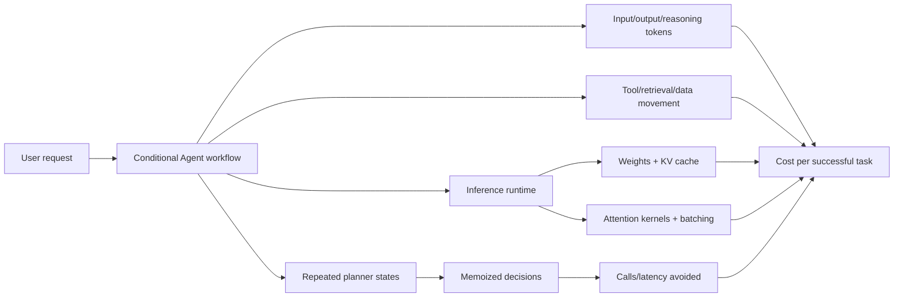
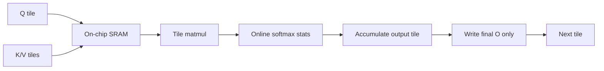
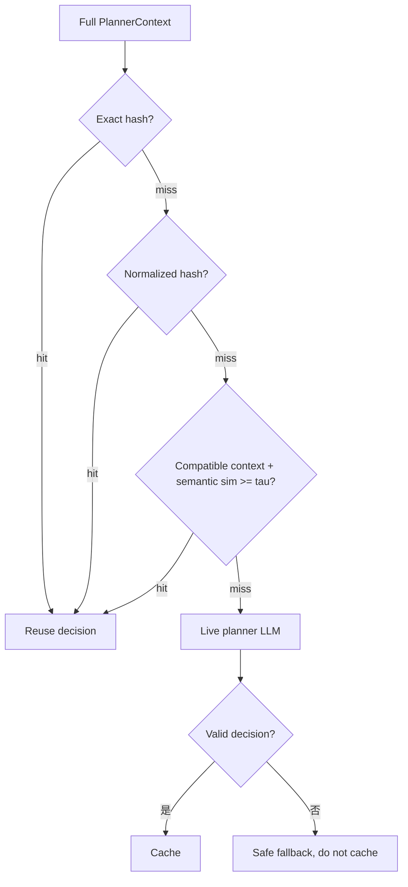
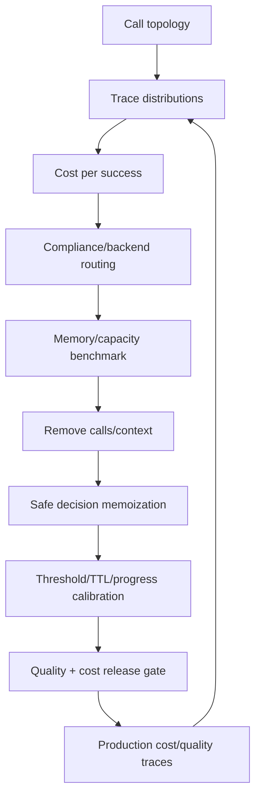
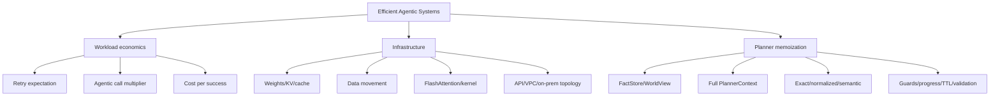

> 原章：*From Compute to Cost: Designing Efficient Agentic Systems*
> 核心问题：Agent 的多步推理、重试、工具、长上下文和多 Agent 协调怎样放大计算与成本？怎样把模型架构、GPU/内存、部署拓扑和状态 memoization 联合设计，使系统不只“能完成任务”，还能够以可持续的单位经济运行？

## 0. 本章定位与阅读主线

前章讨论 memory 如何让 Agent 累积经验，本章讨论每次“思考、读取、调用、重复”付出的计算账单。作者沿三层推进：

1. **硬件与基础设施层**：weights、KV cache、prefill/decode、batch、MoE/hybrid attention、data movement 和 FlashAttention；
2. **工作流层**：一次用户请求会条件触发 router、retrieval、reasoning、reflection、guardrails，形成 Agentic cost multiplier；
3. **算法/状态层**：把 planner 看作“完整状态→动作”的函数，用 exact、normalized、semantic 三层 cache 复用安全的状态转移，避免重复 reasoning。



本章中心结论：

> Agent 成本不能用“某模型每百万 token 单价 × 一次调用”估算。必须按工作流的条件执行概率、上下文重复、重试、工具、网络、缓存命中和离散 GPU 容量建模；最高收益往往不是让同一 reasoning 更快，而是证明该 reasoning 已经做过并安全复用。

---

## 1. 为什么 Cost 是系统约束而非上线后优化

### 1.1 Agent 的能力与成本来自同一机制

迭代 planning、tool feedback、reflection 和 multi-agent delegation 提高任务能力，也增加：

- model calls；
- repeated prompt/context；
- generated reasoning/output；
- tool/API/network；
- KV cache 和 GPU occupancy；
- latency 与 failure/retry surface。

单次 demo 的几分钱乘以用户、turn、retry 和月份后，可能超过业务价值。原章援引预测：相当比例 Agentic AI 项目可能因成本或无法转化价值被取消。该预测是外部估计，不是技术定律；重要的是建立自己的单位经济。

### 1.2 正确的分母

不要只看每 call cost，应该看：

$$
C_{successful\ task}
=
\frac{
C_{model}+C_{tool}+C_{retrieval}+C_{network}+C_{compute}+C_{ops}
}{N_{successful\ business\ outcomes}}.
$$

如果便宜模型导致更多 retry/fallback 和失败，token 单价低却可能每成功任务更贵。

### 1.3 Cost、latency、quality 三目标

可写成约束优化：

$$
\min_{architecture} C
\quad\text{s.t.}\quad
Q\ge Q_{min},
L_{p95}\le L_{SLO},
R\le R_{max}.
$$

不能以降低成本为由跳过 safety/quality gate；也不能用无限 reasoning 换取边际质量。

---

## 2. Retry Economics：准确率怎样换成调用数

### 2.1 原章五次 attempts 示例

单次成功率 $p=0.6$，每次独立，最多 $n=5$ 次 attempts，至少一次成功：

$$
p^{\ast}=1-(1-p)^n
=1-0.4^5
=0.98976.
$$

注意原文称“multiple retries/5x token budget”，公式中的 $n=5$ 是**总 attempts**；若“初次 + 5 retries”，则 $n=6$，成功率不同。

### 2.2 5× 是最坏上界，不是期望成本

如果成功即停止，attempt count $A$ 截断在 $n$：

$$
E[A]
=
\sum_{k=1}^{n}P(A\ge k)
=
\sum_{k=0}^{n-1}(1-p)^k
=
\frac{1-(1-p)^n}{p}.
$$

取 $p=0.6,n=5$：

$$
E[A]=\frac{1-0.4^5}{0.6}=1.6496.
$$

所以最坏调用 5 次，平均约 1.65 次（在独立同成本假设下）。原章“5× token budget”适合容量/最坏预算，不应解释成每请求平均必然 5×。

### 2.3 重试通常不独立、也不同成本

Instructor/LangGraph 将 validation error 和先前 output 加入下一 attempt：

- 后续成功率可能提高；
- prompt 变长，单次 token cost 增加；
- 同一模型/错误 prompt 也可能重复失败；
- provider outage 下重试高度相关。

一般期望成本：

$$
E[C]
=
\sum_{k=1}^{n}
P(A\ge k)\,C_k,
$$

$C_k$ 可随 correction context 增长。生产从 traces 估计每 failure class 的 conditional retry success/cost，而非套独立公式。

### 2.4 Retry 不是唯一恢复方式

可选择：deterministic repair、smaller/stronger fallback、human escalation、partial result、fail fast。Permanent auth/policy error 不重试；schema error re-ask；5xx backoff；不确定 side effect 查 idempotency ledger。

---

## 3. 为什么 Infrastructure 决定 Agent Economics

### 3.1 不只是 FLOPS

现代 GPU 的矩阵 compute 增长很快，但 Agent inference 常受：

- HBM bandwidth；
- KV cache capacity/reads；
- network/data movement；
- serialization；
- queue/batching；
- non-matmul ops；
- cold start/idle capacity。

限制吞吐的资源才决定 marginal cost。更高理论 FLOPS 若 kernel/内存喂不满，小时单价更高但任务吞吐不增。

### 3.2 Hyperscaler vs Neocloud

**Hyperscaler**：managed ecosystem、storage/vector/serverless/GPU 集成、运维低；pricing layers 和跨 service movement 可能更贵。

**Neocloud**：接近 GPU、持续负载 price/performance 和控制强；网络、存储、orchestration、HA、安全由团队承担。

不能只比较 GPU $/hour。总成本：

$$
C_{TCO}=C_{GPU}+C_{idle}+C_{storage}+C_{network}+C_{managed}+C_{ops}+C_{people}.
$$

### 3.3 Moving data 的隐藏成本

Neocloud GPU 每一步访问 hyperscaler vector DB，会支付：

$$
L_{step}=L_{serialize}+L_{network}+L_{service}+L_{deserialize},
$$

$$
C_{egress}=bytes\times price_{egress}.
$$

多步 retrieval 重复，网络可能比 inference 更贵/慢。让 compute、vector/data store 同 region/provider，或缓存/批量/压缩；但 compliance/HA 优先。

---

## 4. Deployment Spectrum 与 Regulatory Constraint

### 4.1 四层部署

| Tier | 部署 | Data location | GPU planning | 适用/边界 |
|---|---|---|---|---|
| 1 | Fully managed API | provider | 无 | 快速；需 DPA，某些监管阻止 |
| 2 | Dedicated endpoint | provider isolated tenancy | 无/少 | BAA/DPA/SOC2 等取决 provider |
| 3 | Private weights in VPC/storage | 自己云边界 | 需 sizing | sovereignty/control 与免物理硬件折中 |
| 4 | On-prem self-host | 自有 data center | 全硬件/运维 | 最大控制，最高责任 |

“Tier 3 满足大多数 compliance”不是自动事实。要看数据类别、region、key、operator access、subprocessor、logs 和行业规则。

### 4.2 按数据敏感度拆 Agent Graph

Supervisor 只看 category 可走 managed API；retrieval Agent 处理 raw PII 可走 VPC/self-host。设每节点 sensitivity $s_j$、允许 deployment set $D(s_j)$，选择满足约束的最低 TCO backend：

$$
d_j^{\ast}=\arg\min_{d\in D(s_j)} C(j,d).
$$

这样无需为全部 Agent 购买最严格 GPU。跨 boundary 的 handoff 只传最小、去敏、结构化信息。

### 4.3 Hybrid topology 的治理成本

多 backend 增加 provider adapters、identity、network、observability 和 fallback tests。Savings 必须扣除 integration/operation cost，不能只加各节点 token cost。

---

## 5. Model Memory Footprint：Weights、KV Cache 与 Headroom

### 5.1 Weight memory

若总参数 $P$、每参数 $b_w$ bytes：

$$
M_{weights}=P b_w.
$$

7B BF16/FP16 原始 weights 约 14 GB；INT8 约 7 GB；INT4 约 3.5 GB。Runtime 还有 scales、buffers、allocator 和 graph workspace。

### 5.2 KV cache

对 batch/active sequences $B$、context $S$、KV-cache layers $L_{kv}$、KV heads $H_{kv}$、head dim $D_h$、precision bytes $b_{kv}$：

$$
M_{KV}
=
B\,S\,L_{kv}\,H_{kv}\,D_h\,2\,b_{kv}.
$$

2 是 K/V。Hybrid attention 只有部分 layers 传统 KV，使用 $L_{kv}$ 而非总层数；GQA/MQA 用 KV heads 而非 query heads。

### 5.3 Available cache memory

GPU 总 HBM $M_{GPU}$，利用率目标 $u$：

$$
M_{available\ KV}
=uM_{GPU}-M_{weights}-M_{runtime}-M_{safety}.
$$

单 sequence 每 token KV bytes：

$$
m_{token}=L_{kv}H_{kv}D_h2b_{kv}.
$$

最大 cache tokens 近似：

$$
T_{KV,max}=\left\lfloor\frac{M_{available\ KV}}{m_{token}}\right\rfloor.
$$

平均每 active sequence 占 $\bar S$ tokens，则 concurrency 上界：

$$
B_{max}\approx\left\lfloor\frac{T_{KV,max}}{\bar S}\right\rfloor.
$$

实际还有 fragmentation、prefix sharing、scheduler/preemption，需 runtime profile。

### 5.4 MoE active parameters

MoE 总 weights 决定 storage/HBM（除非 offload），每 token active parameters 决定主要 expert compute。不能用总参数直接估 FLOPs，也不能用 active 参数估全部显存。

### 5.5 Config inspector

Hugging Face multimodal/conditional config 的 LLM 字段可能在 `text_config`，plain text 顶层。要读取：hidden/layers/heads/KV heads/head dim、attention pattern、dtype、total/active params、context。Model custom code/config version需固定。

### 5.6 Estimator 是计划，不是测量

Notebook/vLLM calculator 给容量估算；最终用目标 runtime 实测 peak memory、cache blocks、batch、TTFT/TPOT 和 OOM margin。价格也时变，原章明确所有 cost numbers 是估计，必须 tracing + provider/GPU bills 对账。

---

## 6. Prefill 与 Decode 的不同成本曲线

### 6.1 Prefill

Prompt tokens 并行处理、填 KV，不生成 token。Dense attention 算术通常随 sequence 近 $O(S^2d)$，但 kernel/tile 改 IO；长 prefix 对 TTFT 和 energy 影响大。

### 6.2 Autoregressive decode

每步生成一个 token，读取历史 KV；通常 memory-bandwidth bound，小 batch 时 compute utilization 低。KV reuse 避免重算历史 K/V，不消除读取。

### 6.3 Batching

把多 sequences 放入 scheduler 提高吞吐，但 latency/queue 和 KV memory 增大。Capacity plan 需要真实 prompt/output length 分布，不只 max context。

### 6.4 Prompt/prefix caching

重复 system prompt/tool schemas/few-shot 可缓存 prefill 或按 provider cached-token 价计费。但 dynamic RAG/user content 改 prefix 会 miss；缓存不消除 route/tool/reflection/synthesis calls。

---

## 7. FlashAttention：相同数学、不同 IO 计划

### 7.1 Naive attention

标准：

$$
O=\operatorname{softmax}\left(\frac{QK^T}{\sqrt d}+M\right)V.
$$

Naive 实现把 $N\times N$ scores/softmax intermediate 写 HBM，memory traffic/temporary storage 随 $N^2$ 增长。

### 7.2 FlashAttention

把 Q/K/V 分 tiles 搬入 SRAM/on-chip memory，使用 online softmax 维护每行 max、normalizer 和 partial output，不 materialize 完整 matrix。数学上 exact attention（浮点顺序有数值差），算术复杂度仍是 dense attention 量级，主要降低 HBM IO 和中间 memory。



### 7.3 Hardware asymmetry

Tensor Core FLOPS 增长快于 HBM/shared-memory/SFU。若 softmax exp、memory movement 和 synchronization 跟不上，matmul units idle。Kernel/hardware co-design 决定昂贵 GPU 能否被利用。

### 7.4 版本与硬件

| 版本 | 硬件 focus | 优化重点 |
|---|---|---|
| FA1 | pre-Hopper/A100 | HBM IO |
| FA2 | A100/early Hopper | work partition、non-matmul |
| FA3 | H100/H200 | async、warp specialization、low precision |
| FA4 | Blackwell/B200 | SFU/memory 与 asymmetric pipelining |

表是高层映射，不表示旧版本只在该 GPU 可用或新版本“required”才运行；runtime/model/head dim/mask 支持需核查。

### 7.5 Deep research loop 的复合收益

长 context 在多个 steps 反复 prefill/attention，单步效率差异乘以 steps。FA4 在 Blackwell 让 SFU softmax 与 matrix pipeline overlap、减少 HBM movement；收益依 sequence、batch、precision 和 architecture，不能用固定倍数估账。

### 7.6 更贵 GPU 何时总成本更低

GPU A 小时价 $p_A$、吞吐 $r_A$ tasks/hour；单位 compute cost：

$$
c_A=\frac{p_A}{r_A}.
$$

更贵 B 若：

$$
\frac{p_B}{r_B}<\frac{p_A}{r_A},
$$

则单位任务更便宜，还可能少 GPU/低 latency。但需包括利用率、idle、failure 和 quality，不能只比较峰值 kernel benchmark。

---

## 8. Agentic Cost Multiplier

### 8.1 定义

步骤 $i$ 触发概率 $p_i$、触发时 model calls $k_i$、cache/memoization 消除比例 $h_i$：

$$
E[N_i]=p_i k_i(1-h_i).
$$

总期望 calls：

$$
M_{calls}=\sum_i E[N_i].
$$

若 step 会重复/条件相关，更一般用 traces 估 $E[N_i\mid request\ slice]$，不能假设独立。

### 8.2 原表 11-3

| Step | $p_i$ | $k_i$ | optimization | expected calls |
|---|---:|---:|---:|---:|
| Router | 1.0 | 1 | 0 | 1.0 |
| Retrieval | 0.8 | 1 | 25% memoized | $0.8(0.75)=0.6$ |
| Reasoning | 0.7 | 1 | 0 | 0.7 |
| Reflection | 0.25 | 2 | 0 | 0.5 |
| Guardrails | 1.0 | 2 | 0 | 2.0 |

总和：

$$
M_{calls}=1+0.6+0.7+0.5+2=4.8.
$$

一个用户请求平均约 4.8 次 LLM calls，不是 1 次。

### 8.3 Calls 不等价成本

第 $i$ 步 input/output/cached/reasoning token 与模型单价不同：

$$
E[C_{model}]
=
\sum_i E[N_i]
\left(
t_i^{in}p_i^{in}
+t_i^{cached}p_i^{cached}
+t_i^{out}p_i^{out}
+t_i^{reason}p_i^{reason}
\right).
$$

再加 tools/network/compute。Guardrail 小模型两 calls 可能比一个 frontier reflection 便宜。

### 8.4 Shared prefix amplification

若 6 calls 每次重复 5000-token prefix，就有 30k prefix token processing；用户新增 500 token 只是小部分。Prompt caching 降 repeated prefix cost，不减少 6 个 conditional decisions。

### 8.5 Token topology

Single-shot、ReAct、supervisor MAS multiplier 依 graph，不是固定倍数。Agent loops 有长尾；平均 4.8 外，还报告 P95 calls/tokens/cost，防少量 runaway 吃掉预算。

---

## 9. 从期望 Calls 到月度成本

月请求 $R$：

$$
N_{calls,month}=R\,M_{calls}.
$$

API-heavy cost 近连续随 usage 增长：

$$
C_{API}(R)\approx R c_{request}.
$$

Self-host GPU 以离散 capacity $K$ tasks/GPU-month provision：

$$
C_{self}(R)
=
\left\lceil\frac{R}{K}\right\rceil C_{GPU}
+C_{fixed}+C_{network}.
$$

所以曲线阶梯上升；低利用率时 API 便宜，高稳定量可能 self-host/hybrid 更优。Hybrid 按 sensitivity/complexity route。

### 9.1 Breakeven 的简化解

忽略阶梯、API 单请求 $a$，self-host fixed $F$ + variable $vR$：

$$
R^{\ast}=\frac{F}{a-v},\quad a>v.
$$

真实应加入 GPU redundancy/headroom、峰谷、on-call、egress、commit discounts、fallback API 和 quality/retry multiplier。

### 9.2 Worst、average、tail 三种预算

- average 用财务 forecast；
- P95/P99 用 capacity/SLO；
- hard max/session budget 防 runaway。

只看平均会在高峰 OOM/排队；只按 worst 永远 provision 会低利用率。

---

## 10. 成本优化的优先顺序

1. 删除无价值步骤/重复 decisions；
2. cheap deterministic rule 替代 LLM；
3. model routing/early exit；
4. context pruning/prefix caching；
5. memoize result/decision；
6. batch/parallelize independent work；
7. quantization/serving/kernel/hardware；
8. topology/procurement。

先优化 graph multiplier，通常比为相同无效 workflow 换便宜 GPU更有杠杆。每项都用质量/安全 eval 防回归。

---

## 11. Memoizing Agentic State Transitions

### 11.1 从结果缓存到决策缓存

普通 memoization 缓存函数 $f(x)$。Planner 可视为：

$$
a_{t+1}=\pi_{LLM}(S_t).
$$

若状态完整等价，复用此前 state→decision：

$$
Decision(S)=
\begin{cases}
M[H(S)],&\text{safe cache hit},\\
\pi_{LLM}(S),&\text{miss}.
\end{cases}
$$

把昂贵 LLM planning 变成 retrieval，可降成本/latency并提高重复状态下的一致性。

### 11.2 Fact-defined state

原章先写 $S_t\subseteq\mathcal F$：当前已知 facts 是全局 fact space 的子集。但实际 PlannerContext 还包括 task、available/stale tools 和 evidence；只用 fact set 不充分。

### 11.3 Exact 与 semantic equivalence

Exact hash 对相同 state 复用；normalized hash 对格式差异等价；semantic：

$$
d(S_{current},S_{cached})\ge\tau
\Rightarrow reuse.
$$

原公式把 $d$ 叫 similarity（越大越近）；若实现的是 distance，方向应反。命名必须明确。



### 11.4 何时适合 planner caching

- research/swarm 重复遇到相同 fact state；
- deterministic/slow-changing tool universe；
- planning 比 lookup 昂贵；
- decision 可验证并有 TTL；
- state 表示覆盖所有约束。

不适合高频变化市场、时间敏感权限、每次工具 side effect 不同、state 难以完整编码的任务。

---

## 12. FactStore：Shared Blackboard 与 Meaningful Version

### 12.1 例 11-1 四种写入结果

按 canonical key 分 history：

- `added`：新 key；
- `duplicate`：同 canonical value + 同 source，完全无新信息；
- `reinforced`：同 value，不同 source；
- `conflict`：同 key 出现不同 value。

只有 added/reinforced/conflict 增 `_version`，duplicate 不增。Version 表示**新 evidence/state transition**，不是只表示 current value 改变。

### 12.2 为什么 reinforcement 也增 version

当前 best value 可能不变，但 source support 增加，WorldView evidence 变化，planner confidence/是否继续搜索可能改变。因此需要重新考虑。

### 12.3 Current fact policy

`max(history,key=(timestamp,confidence))`：先最新，timestamp 相同再 confidence。它不保证 truth：低质量新 source 可覆盖高质量旧 source。应加 source authority、verification 和 conflict policy。

### 12.4 Canonicalization

`canonical_key/value` 要稳定、versioned、locale/units aware。若过度 canonicalize（把两个概念合并）会误 conflict/reinforce；不足则 miss duplicates。保存 raw 与 canonical/provenance。

### 12.5 Concurrency

原 in-memory store 非 thread-safe。多 agents 同时 add 会 race/version lost。生产用 lock/transaction/event log；Fact immutable、有 unique event ID/idempotency。

---

## 13. WorldView：Current Facts + Evidence Summary

### 13.1 例 11-2

`WorldView` frozen：

- `current: frozenset[Fact]`，每 key 选 current；
- `evidence: tuple[(canonical_key, sorted_sources, distinct_value_count)]`。

Sort keys/sources、immutable set/tuple 让 construction deterministic/hashable。

### 13.2 为什么 current facts 不够

两个 states 当前值都为 `price=100`：一个有 3 sources 一致，另一个有 100/120 conflict 后最新为100。Planner 应不同 confidence/继续核查。Evidence 把 source support/conflict 纳入 key。

### 13.3 `distinct_values > 1`

表示历史出现冲突，不表示当前一定 unresolved；可能旧值已过期/错误。Evidence 还应含 resolved status、source quality、last update/TTL，避免永远因历史冲突阻断。

### 13.4 Fact hashability

`frozenset[Fact]` 要求 Fact frozen/hashable，且 hash/eq 字段稳定。若 Fact 含 mutable dict/list 不能直接 hash；timestamp included 会让语义相同 state 永远 exact miss。Exact 与 normalized representation 应明确字段。

---

## 14. PlannerContext：安全 Cache Key 必须完整条件化

### 14.1 四个组成

```python
PlannerContext(
    task,
    view,
    tools_available=sorted tuple,
    stale_tools=sorted tuple,
)
```

- task：目标；
- view：facts+evidence；
- available tools：合法 action space；
- stale tools：近期未产生新信息的 anti-loop state。

### 14.2 漏 stale_tools 的危险

在工具都 stale 时 planner 选择 DONE；如果 key 只有 task+facts，在 fresh run 中 facts 恰同但工具尚未尝试，会错误复用 DONE，提前终止。

漏 available tools 可复用当前无权限/不存在的 tool。完整条件化是 cache correctness，不是优化细节。

### 14.3 还可能需要哪些 context

- policy/version/user permissions；
- current time/data freshness；
- model/prompt/planner version；
- budget/deadline；
- tool schema/version/region；
- branch/session constraints；
- safety mode。

若这些改变 decision，必须进 key/guard/TTL。Key 太宽会少 hit，太窄会 unsafe hit，这正是 cost vs correctness tradeoff。

---

## 15. TieredCache Entry 与索引结构

### 15.1 例 11-4 Entry

原 `_CacheEntry` 保存 exact hash、normalized hash、full embedding、fact count、decision、fact keys、available/stale tool guards。`TieredCache` stats 包含 exact/normalized/semantic hits、misses、comparisons 和 `semantic_context_skips`。

### 15.2 原 skeleton 的复杂度

Entries 是 list：

- exact lookup 线性 scan $O(n)$；
- normalized 再 scan $O(n)$；
- semantic scan $O(nd)$。

原文“cache lookup constant time”是经典 hash cache 理想；当前教学实现 exact/normalized 并非常数。生产用 dict hash indexes + vector ANN index：

$$
T_{exact}\approx O(1),
\qquad
T_{semantic}\approx O(\log n)\text{ / approximate}.
$$

### 15.3 Persistent cache

In-memory 重启即丢，multi replicas 不共享。Persistent cache 需 tenant/policy namespace、encryption、TTL、eviction、version migration、stampede prevention 和 concurrency。

---

## 16. Exact 与 Normalized Keys（例 11-5）

### 16.1 Key material

`_exact_hash(...)` 与 `_normalized_hash(...)` 使用的 context parts 是 TASK、TOOLS sorted、STALE sorted、FACTS 和 EV evidence，再用分隔符拼接 SHA-256。

Exact facts 使用 raw `f.key=f.value`；normalized 使用 canonical key/value。Evidence 两者相同。

### 16.2 Serialization collision

字符串拼接若 value 含 separator/`=` 可能歧义。更安全用 canonical JSON/CBOR length-prefix，sort keys，显式 schema version：

```python
json.dumps(obj, sort_keys=True, separators=(",", ":"), ensure_ascii=False)
```

### 16.3 24 hex chars = 96 bits

$$
16^{24}=2^{96}\approx7.92\times10^{28}.
$$

Birthday collision 近似：

$$
P\approx1-e^{-n(n-1)/(2\cdot2^{96})}.
$$

$n=10^9$ entries 时约 $6.31\times10^{-12}$，很低；但 cache decision correctness 高风险时保留完整 digest 成本也小。真正更常见的问题是 canonical serialization bug，不是 cryptographic collision。

### 16.4 Versioning

Hash input 加 key schema/planner/prompt/model version；否则 upgrade 后命中旧 decision。或 namespace rotate/clear cache。

---

## 17. Tiered Lookup（例 11-6）

原方法 `TieredCache.lookup(...)` 按以下三个 tier 查找。

### 17.1 Exact tier

最安全，raw state 完全相同。仍需 TTL/policy version；相同事实在时间敏感任务不等价。

### 17.2 Normalized tier

容忍 casing/units/format aliases。Canonicalization 必须保证业务等价，不能把“$100 USD”和“100 EUR”归一成100。

### 17.3 Semantic tier

把 task、tools、stale、facts 和 evidence 转 text embedding；只比较 tools/stale tuples 完全相同 entries；cosine 最大且 >= threshold 复用。

$$
cos(a,b)=\frac{a\cdot b}{\|a\|\|b\|}.
$$

Zero vector 返回0，正确防除零。

### 17.4 Guard 的范围仍不足

Semantic loop 只显式 guard tools/stale，task/facts/evidence 在 embedding 中是软相似。两个不同任务 embedding 接近仍可能错误复用。可加 exact task/task-type、fact key subset/count、policy/version guards。

Entry 已存 `fact_count` 和 `fact_keys`，原 lookup snippet 没用；生产可要求 key set equality/allowed containment，减少 false hit。

### 17.5 Threshold $\tau$

太低：高 hit、错误 decision/hallucinated logic；太高：安全但 savings 小。用 labeled state pairs 和 downstream decision agreement 校准：precision of reuse 比 raw hit rate 更重要。

### 17.6 Semantic embedding cost

Miss exact/normalized 后仍调用 embedding model，每 lookup 有 GPU/API cost；cache savings 需扣：

$$
Savings
=
C_{planner\ avoided}
-C_{embedding}
-C_{lookup/storage}
-C_{wrong\ hit}.
$$

### 17.7 Cache hit rate 不是目标

90% stale/no-progress hits 会更快失败。记录 hit 后 tool 是否新增 fact/version、task success、loop count。No progress 重复 hit 时强制 live planner/alternative/DONE。

---

## 18. Store Decision（例 11-7）

原方法 `TieredCache.store(...)` 将验证后的 live planner decision 连同 exact/normalized/vector/context guards 保存。

### 18.1 只存“有效”还不够

结构/tool name 合法不代表 decision 高质量。可在执行后确认 outcome/progress 再 promote；先 probation cache，失败 invalidate。尤其 side-effect decisions 不宜跨 users/runs直接复用。

### 18.2 Duplicate entries

原 `.append` 对相同 exact key 多次存，lookup 返回最早旧 decision，可能不更新。生产 dict upsert，保存 created/last_used/hit/outcome/version，定义 replacement policy。

### 18.3 Decision payload

Reasoning text 可能含敏感信息且没必要缓存；存 chosen tool、validated args template、confidence/provenance。Args 若含 request-specific IDs/PII，不能 semantic reuse。

---

## 19. SwarmPlanner Runtime（例 11-8/11-9）

### 19.1 Init

`SwarmPlanner.__init__` 注入 config/cache；持久 `requests.Session` 复用 TCP/TLS；Authorization header；stats calls/errors/invalid。

Session 需 timeout、pool size、close、thread safety；API key 不进 logs/cache。Planner 单一 reasoning point 便于 memoization，也成为 bottleneck/single failure，需 HA。

### 19.2 LLM retry

`_call_llm(...)` 使用 Tenacity 最多3 attempts、exponential 2–15s，只 retry connection/timeout。HTTP 429/5xx 的 `raise_for_status` 是否被 retry 取决异常类型，snippet 可能不重试；需显式分类/Retry-After。

### 19.3 Full conditioning prompt

Task、known facts、fact count、available/stale tools（system prompt omitted）。事实按 key 排序，temperature 0，JSON object。

Prompt 与 cache key 必须同构：任何影响 prompt decision 的字段都进 PlannerContext；否则 cache/live planner 不同 conditioning。

### 19.4 Structured output

`json_object` 只保证 JSON-like，不保证 schema；后续 `_validate_planner_decision` 必需。Raw exception/error 要脱敏。

### 19.5 Anti-loop stale warning

提示 DON'T choose stale tools 是软约束。Runtime 也应 block/penalize unchanged call signature，设置 no-progress circuit breaker。Stale list 更新依 FactStore meaningful version。

---

## 20. Cache-first Decide（例 11-10）

### 20.1 流程

原主入口是 `decide(...)`：

1. 构建完整 PlannerContext；
2. cache lookup；
3. hit→构造 cached PlannerDecision；
4. miss→live `_call_llm`；
5. exception→stats error、fallback DONE，不缓存；
6. invalid output→DONE，不缓存；
7. valid→cache store→返回。

### 20.2 Fallback DONE 的风险

Planner outage/invalid 被 coercion DONE 可静默返回不完整任务。安全但不一定正确。Decision 应标 status=`degraded/error`，上层选择 retry/fallback/human，而不是把 DONE 当正常 completion。

### 20.3 Cached decision validation

命中后也应重验 tool availability/args authorization/budget/TTL。Cache 决策不是执行授权。原 guard tools tuple 有帮助，但 permissions/resource state 可变化。

### 20.4 `_cache_similarity`

Lookup snippet 返回 decision+tier，没展示将 similarity 注入 payload；cached.get 默认1.0 会把 semantic hit similarity 错报1.0，observability 不准确。Lookup 应返回 `(decision,tier,similarity,entry_id)`。

### 20.5 Cache stampede

多个 concurrent misses 同 key 会同时调用 LLM。使用 singleflight/request coalescing、短 lock/lease；失败不长期 negative-cache，避免 outage 冻结。

---

## 21. Synthesis（例 11-11）

### 21.1 Planning 与 synthesis 分开

Planner 决定下一 action，适合缓存；`synthesize(...)` 汇总最终 facts/conflicts，通常 task-specific，值得把省下 token 用于质量。

### 21.2 Conflict-aware prompt

传 current facts 及 evidence 中 `distinct_values>1` 的 key/sources/count，让 final answer 表达 uncertainty，而不是只使用“最新赢家”。最好传具体 conflicting values/source quality，而不仅 count。

### 21.3 Synthesis 也可缓存吗

可对 immutable full final state/output cache，但 output freshness/user format/locale/security 进 key。不要因 planner cache 就自动缓存 final response。

### 21.4 验证

JSON parse 后需 schema/citation/claim verifier；LLM error重试。Synthesis `self.stats["calls"]` 与 planner calls混在一起会误算“planner calls avoided”，应按 call type 分 counters。

---

## 22. 47% Calls Avoided 应怎样解读

若无 cache baseline planner calls $N_0$，实际 live calls $N_1$：

$$
AvoidRate=\frac{N_0-N_1}{N_0}.
$$

47% 意味 $N_1=0.53N_0$，不是总 Agent/LLM 成本减少47%；embedding、synthesis、tools、cache infra仍在。

净成本减少：

$$
NetSaving
=
(N_0-N_1)C_{planner}
-C_{embed}
-C_{cache}
-C_{miss/error/wrongHit}.
$$

原图是 illustrative run，实际依 task repetition、threshold、state representation/policy。必须同时报告 task quality/progress，避免通过错误复用“节省”。

### 22.1 Experience accumulation 的边界

Cache 增长让重复 state 更省，但不是模型学会新 policy；是外部 decision memory。Dynamic environment 需 TTL/invalidation，否则过去经验成为 temporally stale hallucination。

### 22.2 TTL

TTL 按 data/tool/task volatility：stock price 秒/分钟，codebase commit/version，static policy 按版本。命中时：

$$
valid\iff now-created\_at\le TTL
\land versions\ compatible.
$$

也可 event-based invalidation：tool schema/policy/model/index/data version change。

---

## 23. 容易混淆的概念与常见误区

| 易混淆点 | 正确辨析 |
|---|---|
| 单次模型价格可估 Agent 成本 | 一请求条件触发多 calls/tools/context，需 multiplier |
| 5 attempts 把平均成本固定变5× | 5×是上界；成功即停时原例期望1.6496次 |
| Retry 独立 | 纠错 context 改概率/成本，provider failure 相关 |
| Cost 优化上线后再做 | 架构 multiplier/合规/topology 早期决定成本曲线 |
| GPU FLOPS 决定吞吐 | decode常受 HBM/KV/queue/kernel 限制 |
| Neocloud GPU便宜所以TCO低 | 网络/存储/ops/人力/HA可能反超 |
| Tier 3 自动满足 compliance | 仍需具体 data/key/access/log/regulatory review |
| 全 Agent 用最严格 backend 最安全 | 可按数据 sensitivity partition，传最小去敏 handoff |
| 参数量即可估 GPU | 还需 dtype、KV、runtime、hybrid attention、concurrency |
| MoE active params 可估显存 | 总 weights 多数仍需存储；active主要估 compute |
| FlashAttention 把 dense attention 算术变线性 | 主要降低 IO/中间 memory，数学仍 exact dense attention |
| 更贵 GPU 一定更贵 | 若任务吞吐增长更快，单位任务成本可更低 |
| Prompt caching 消除 Agentic multiplier | 只省共享 prefix processing，conditional calls 仍存在 |
| Calls 都同成本 | 不同模型/token/tool/reasoning成本差异巨大 |
| Self-host cost连续增长 | GPU容量离散，曲线阶梯且有 idle/headroom |
| Memoization 只缓存 final answer | 本章缓存完整状态下 planner decision |
| Fact set足够作为 planner key | 还需 task、tools、stale、policy/time/budget等 |
| Reinforced fact不改变状态 | current值不变但evidence增强，planner可能改变 |
| 最新 fact一定真 | 需 source authority/verification/conflict policy |
| Frozenset自动保证稳定 key | Fact hash fields/canonicalization/timestamp仍影响 |
| Cache lookup都是O(1) | 当前 list exact/semantic扫描是O(n)/O(nd) |
| 96-bit hash collision是主要风险 | 序列化/key遗漏/陈旧决策通常更现实 |
| Normalized match总安全 | Units/currency/entity过度归一会误合并 |
| Semantic hit率越高越好 | 错误/无进展命中会更快循环失败 |
| Similarity threshold可凭直觉选 | 用 labeled state equivalence和decision outcome校准 |
| Cache hit后无需验证 | Tool/auth/budget/TTL仍需执行时重验 |
| Valid JSON decision值得缓存 | 结构合法不等于有进展/高质量，最好执行后promote |
| LLM失败返回DONE就是正常完成 | 应标degraded/error，由上层处理 |
| 47% planner calls avoided=47%总成本节省 | 需扣embedding/cache，且synthesis/tools不变 |
| Memoization等于模型学习 | 是外部state-decision memory，不改weights |

---

## 24. 从本章抽象出的成本设计方法

### 24.1 第一步：画调用拓扑

列每 node trigger、loop、model、input/output、tools、fallback、parallelism。不要从一个平均 prompt 猜。

### 24.2 第二步：从 traces 估条件分布

$E[calls/tokens/tool/latency\mid slice]$，报告 average/P95/max；区分 success/failure/retry。

### 24.3 第三步：构造单位经济

每成功业务 outcome 成本与价值，含 API/GPU/network/storage/ops。失败和 human fallback 也计入。

### 24.4 第四步：做 sensitivity/compliance routing

节点选择 managed/dedicated/VPC/on-prem；共同位置减少 egress；记录跨边界数据。

### 24.5 第五步：容量估算后实测

Weights + KV + runtime/headroom；真实 length/concurrency；目标 hardware/runtime kernel benchmark。

### 24.6 第六步：先减少 multiplier

删除步骤、deterministic checks、early exit、smaller model routing、context/prefix cache，再优化 kernel/GPU。

### 24.7 第七步：只 memoize 完整纯状态

定义 PlannerContext schema/version；side effects 不直接缓存；exact→normalized→semantic；严格 guards。

### 24.8 第八步：校准 threshold 与 TTL

State-pair gold、wrong-hit cost、volatility；version/event invalidation。Hit 后追踪 progress。

### 24.9 第九步：执行后 promote

Decision valid + tool有进展/成功，再进入 trusted cache；失败 invalidate/negative evidence。

### 24.10 第十步：质量与成本联合发布 gate

Task success、安全、wrong-hit、P95 latency、cost/success 都达标。Savings 不以质量退化换取。



---

## 25. 可运行示例：期望调用与 Progress-Aware Cache

下面的标准库示例验证：条件 call multiplier、完整 key、duplicate 不推进 version，以及重复 cache decision 没有 progress 时强制 miss。

```python
# Run with: python efficient_agent_demo.py
from dataclasses import dataclass
from hashlib import sha256
import json

def expected_calls(steps: list[tuple[float, int, float]]) -> float:
    return sum(probability * calls * (1 - hit_rate) for probability, calls, hit_rate in steps)

@dataclass(frozen=True)
class Context:
    task: str
    facts: tuple[tuple[str, str], ...]
    tools: tuple[str, ...]
    stale_tools: tuple[str, ...]

    def key(self) -> str:
        payload = {
            "task": self.task,
            "facts": sorted(self.facts),
            "tools": sorted(self.tools),
            "stale_tools": sorted(self.stale_tools),
            "schema_version": 1,
        }
        canonical = json.dumps(payload, sort_keys=True, separators=(",", ":"))
        return sha256(canonical.encode()).hexdigest()

class ProgressCache:
    def __init__(self, max_no_progress_hits: int = 1) -> None:
        self._decisions: dict[str, str] = {}
        self._last_version: dict[str, int] = {}
        self._no_progress_hits: dict[str, int] = {}
        self.max_no_progress_hits = max_no_progress_hits

    def store(self, context: Context, decision: str, world_version: int) -> None:
        key = context.key()
        self._decisions[key] = decision
        self._last_version[key] = world_version
        self._no_progress_hits[key] = 0

    def lookup(self, context: Context, world_version: int) -> str | None:
        key = context.key()
        if key not in self._decisions:
            return None
        if world_version == self._last_version[key]:
            self._no_progress_hits[key] += 1
            if self._no_progress_hits[key] > self.max_no_progress_hits:
                return None
        else:
            self._last_version[key] = world_version
            self._no_progress_hits[key] = 0
        return self._decisions[key]

if __name__ == "__main__":
    multiplier = expected_calls([
        (1.0, 1, 0.0),
        (0.8, 1, 0.25),
        (0.7, 1, 0.0),
        (0.25, 2, 0.0),
        (1.0, 2, 0.0),
    ])
    assert abs(multiplier - 4.8) < 1e-12

    base = Context("research", (("topic", "agents"),), ("search",), ())
    constrained = Context("research", (("topic", "agents"),), ("search",), ("search",))
    assert base.key() != constrained.key()

    cache = ProgressCache(max_no_progress_hits=1)
    cache.store(base, "search", world_version=1)
    assert cache.lookup(base, world_version=1) == "search"
    assert cache.lookup(base, world_version=1) is None
    cache.store(base, "synthesize", world_version=2)
    assert cache.lookup(base, world_version=3) == "synthesize"
    print({"expected_calls": multiplier, "key_prefix": base.key()[:24]})
```

对应关系：

- `expected_calls` 使用 $p_i k_i(1-h_i)$；
- canonical JSON/full SHA 防 delimiter ambiguity；
- stale tool 改变 key，避免复用旧 DONE/search；
- 同 world version 连续命中后强制 live planning，防无进展 loop；
- 示例是 exact cache，不含 semantic embedding、TTL、authorization、execution validation 和 distributed singleflight。

---

## 26. 本章知识结构与核心结论



### 26.1 核心结论

1. Agent 成本的正确分母是成功业务 outcome，不是单次模型调用。
2. 5次独立 attempts 把60%至少一次成功率提到98.976%，但成功即停时平均约1.6496次；容量上界与平均成本不同。
3. Agent 成本由 calls、repeated context、reasoning/output、tools、network、GPU/ops共同构成。
4. Hyperscaler/neocloud/API/self-host 比较必须使用 TCO 和数据移动，不只 GPU 小时价。
5. 可按节点数据敏感度拆部署，避免所有 Agent 使用最严格/最贵环境，但跨边界需去敏与治理。
6. Weight memory 由总参数决定；KV 由 active sequences×context×KV layers/heads/dim/precision决定；MoE active params主要影响compute。
7. Prefill 与 decode瓶颈不同，容量估算后必须在真实runtime/length/concurrency上测量。
8. FlashAttention保持attention数学，借tiling/online softmax减少HBM movement；更强硬件需匹配kernel才有经济收益。
9. 原工作流期望4.8 LLM calls/request，说明single-call pricing严重低估。
10. Prompt cache只省shared prefix，不删除router/retrieval/reflection等条件步骤。
11. API cost较连续，self-host以GPU unit阶梯增长；breakeven受利用率、峰值、HA、ops和quality影响。
12. 高杠杆顺序是先删除重复/无价值reasoning，再做model/context/cache/kernel/hardware优化。
13. Planner memoization缓存完整状态下的decision，不只是final response；它是外部经验，不是模型参数学习。
14. FactStore区分duplicate、reinforcement、conflict；evidence变化也可触发replan。
15. WorldView必须携带current facts和source/conflict evidence，不能只看最新值。
16. PlannerContext至少含task、view、available tools、stale tools；policy/time/budget若影响决策也须纳入。
17. Exact最安全，normalized依canonical correctness，semantic扩reuse但有wrong-hit与embedding成本。
18. 原教学TieredCache用list线性扫描，不是所有lookup都O(1)；生产需hash/vector index。
19. 高cache hit若不产生new facts/progress，是更快的logic loop；命中质量比hit rate重要。
20. 决策命中后仍需执行时重验tool、args、auth、budget、TTL；cache不是授权。
21. Invalid/error decisions不缓存；有效decision最好执行后确认progress再promote。
22. 原47%是planner calls avoided，不是总成本降47%；净收益要扣embedding/cache/wrong-hit。
23. 动态环境使用TTL和event/version invalidation，防temporally stale decision。

### 26.2 作者解决问题的一般思路

作者沿“先算放大，再找物理瓶颈，最后消除重复认知”推进：

1. 用 retry success 说明准确率提升背后有调用预算；
2. 将 managed/self-host 选择拆成 GPU、数据移动、合规与运维；
3. 从 decoder prefill/decode 推导 weights、KV、batch 和 bandwidth；
4. 用 FlashAttention 展示同一算法通过 IO-aware kernel 改变硬件利用；
5. 用 trigger probability 把一次 request 展开为4.8 expected calls；
6. 将该 multiplier 映射到 API 连续成本和 GPU 阶梯成本；
7. 发现更快执行仍会重复同一 planner decision，于是引入 state-transition memoization；
8. 逐步扩展 state 表示：FactStore→WorldView evidence→完整 PlannerContext；
9. 用 exact/normalized/semantic tiers平衡reuse与安全；
10. 最后用validation、progress、TTL和conflict-aware synthesis守住质量。

可迁移的一般方法是：**先从真实 trace 建条件成本模型；把软件调用拓扑映射到硬件/网络资源；按成功任务比较方案；优先删除重复计算；任何 memoization 都先证明函数输入完整、输出可验证、环境未过期，并持续测量命中后的真实进展。**

---

## 27. 延伸阅读

- FlashAttention 1–4：IO-awareness、work partition、asynchrony 与 hardware co-design。
- vLLM PagedAttention/capacity calculators、SGLang prefix/radix cache。
- Queueing/capacity planning：Little's Law、tail latency、autoscaling、GPU bin-packing。
- SemanticALLI、AgenticCache：Agent intermediate reasoning/plan caching。
- Cost observability：OpenTelemetry/Langfuse/LangSmith token/tool/GPU traces。
- 原书第4章模型/KV/量化，第7章部署物理，第10章memory，第12章threat model。
