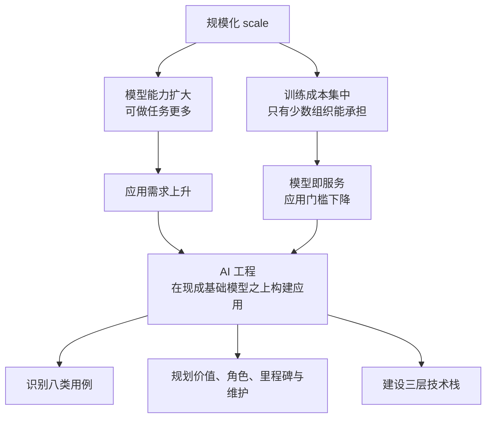
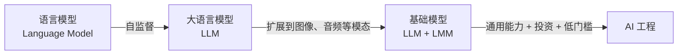
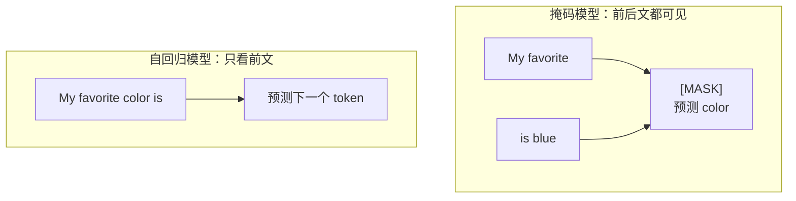
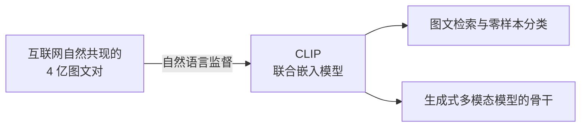
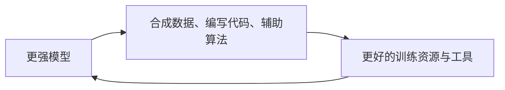
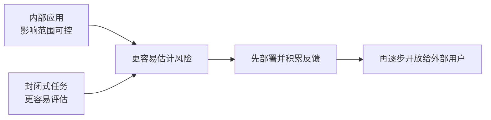
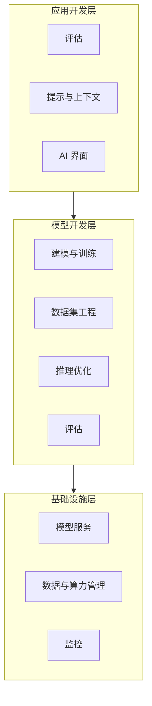
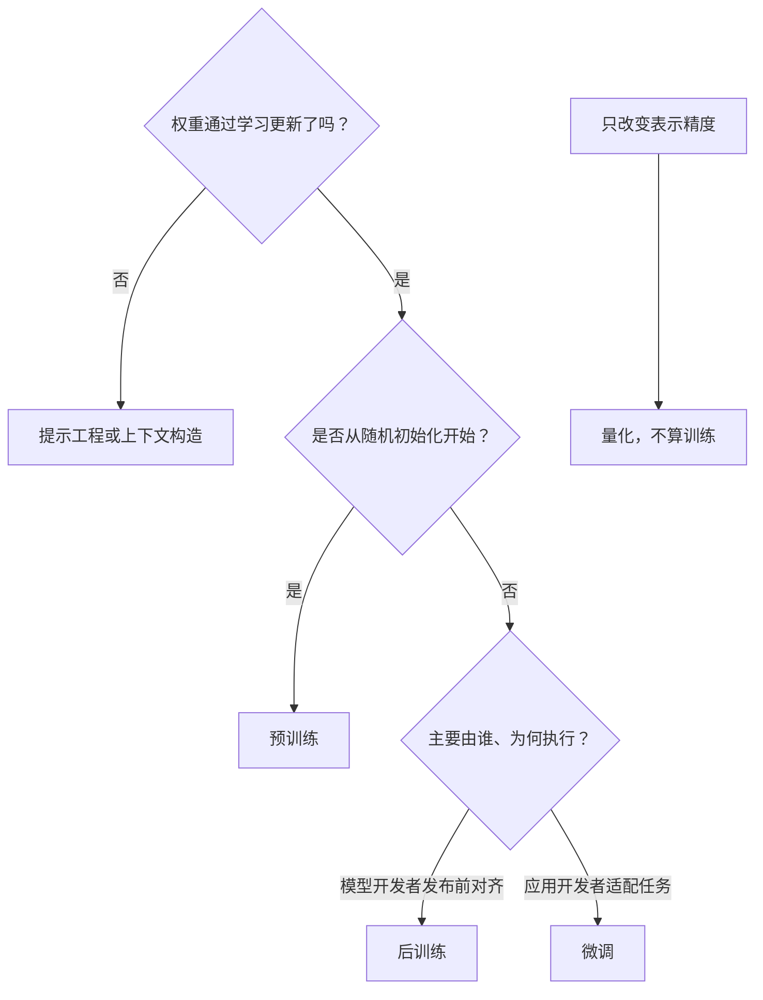

## 0. 学习目标与主线

学完本章，应当能够回答四组问题：

1. **AI 工程为什么在此时兴起？** 理解规模化（scale）的两个后果，以及语言模型、LLM、基础模型到 AI 工程的演化链。
2. **基础模型为何能通用，又怎样适配？** 掌握 token、掩码与自回归、自监督、多模态，以及提示工程、RAG、微调三种常见适配方式。
3. **什么应用值得做，怎样逐步上线？** 能用八类用例识别机会，并从价值、人与 AI 的角色、护城河、期望、里程碑和维护成本判断一个产品是否成立。
4. **团队真正要建设什么？** 看清应用开发、模型开发、基础设施三层技术栈，以及 AI 工程与传统 ML 工程、全栈工程的分工差异。

本章的因果主线如下。代码示例使用 Python 3.11 标准库，不需要联网或 API key；展示的输出均为实际运行结果。



---

## 1. 开篇：为什么一个词是「规模（scale）」

### 1.1 规模首先表现为资源约束

2020 年后的 AI 可以用一个词概括：**规模**。这里不宜只盯着参数量，因为今天的“大”很快会变成明天的“小”。更稳定的判断方法是看外部资源：训练和运行 ChatGPT、Gemini、Midjourney 一类模型已经消耗不可忽视的电力，公开互联网数据也逐渐接近可用上限。当一种技术开始碰到全球电力和数据存量的物理边界时，规模就不再只是相对称呼。

规模并不自动等于产品价值。它的意义在于同时触发了两个方向相反、却共同推动 AI 工程的后果。

### 1.2 规模化的两个后果

第一条链从**能力**出发：更大的数据与计算投入让模型能完成更多任务，于是以前无法实现的应用变得可行，企业和个人对 AI 应用的需求上升。

第二条链从**成本**出发：训练前沿模型需要海量数据、算力和专门人才，只有少数大型企业、政府和资金充足的创业公司负担得起。应用团队若都从零训练，绝大多数想法会在开始前就被固定成本挡住，于是市场形成了**模型即服务（model as a service）**：少数组织负责造模型，通过 API 把能力提供给大量开发者。

| | 后果一：能力扩大 | 后果二：训练集中 |
|---|---|---|
| 直接变化 | 能完成更多任务 | 数据、算力、人才成本过高 |
| 市场结果 | AI 应用需求上升 | 模型即服务兴起 |
| 开发者结果 | 值得做的事情更多 | 不必先训练模型，进入门槛下降 |

两条链交汇后得到本章的核心定义：**AI 工程是在现成可用的基础模型之上构建应用的过程。** 模型越昂贵，专业分工反而越有必要；高固定成本由模型提供商承担，应用开发者按需购买近乎可复制的软件能力。其结果是**应用需求上升，同时构建门槛下降**。

这个分工与云计算相似：不是数据中心不重要了，而是多数团队不再需要先建数据中心才能发布产品。同理，基础模型仍然复杂而昂贵，但应用团队可以把精力移到问题定义、适配、评估和产品体验上。

### 1.3 「这不是新事」与「这确实是新事」

在模型上构建应用并不是新事。推荐系统、欺诈检测和流失预测早已进入生产环境，业务指标映射、实验、监控、反馈循环等经验仍然有效。本章把基础模型之前的机器学习统称为**传统 ML（traditional ML）**，只是为了区分工程范式，不代表旧方法失效。

真正的新变化有两点：一是同一个通用模型可以覆盖过去需要多个专用模型的任务；二是模型可通过服务直接获得。开放式输出、多种适配手段和高推理成本也随之而来，因此团队面对的是一组新的可能性与工程难题，而不是把旧系统简单换个模型名称。

### 1.4 从已验证模式认识机会

模型能力变化很快，直接预测几年后的边界并不可靠。更可迁移的方法是先理解基础模型为何出现，再观察已经成功的用例，归纳模型擅长和不擅长的任务，最后把这些判断落实到产品规划与技术栈。这样关注的是较稳定的需求模式与工程约束，而不是某个短期工具的热度。

---

## 2. The Rise of AI Engineering（AI 工程的兴起）

ChatGPT 和 GitHub Copilot 并非突然出现。它们站在几十年语言建模工作的积累之上：语言模型借助自监督扩大为 LLM，文本能力再扩展到其他模态而形成基础模型，基础模型的可获得性最终催生了 AI 工程。



### 2.1 From Language Models to Large Language Models

#### 2.1.1 语言模型：把语言变成概率问题

语言看起来充满语义与歧义，不容易直接计算。语言模型的关键转换是：**用统计信息描述一个 token 在给定上下文中出现的可能性。** 给定 “My favorite color is”，一个掌握英语统计规律的模型应当给 “blue” 比 “car” 更高的概率。

这种想法并不新。1905 年的小说《跳舞的小人》中，福尔摩斯利用字母频率破译密码；Claude Shannon 在二战及其 1951 年论文 *Prediction and Entropy of Printed English* 中使用了更系统的语言统计与熵。现代模型规模巨大，但核心问题仍是“在上下文中什么最可能出现”。

把 token 序列记为 $w_1,w_2,\ldots,w_n$，概率链式法则给出：

$$
P(w_1,w_2,\ldots,w_n)=\prod_{t=1}^{n}P(w_t\mid w_1,\ldots,w_{t-1})
$$

这条等式本身不要求独立性假设。早期方法常用马尔可夫近似，只看最近的 $k$ 个 token；现代自回归神经网络则试图利用更长的上下文逼近右侧条件分布。模型仍然是在做概率预测，因此输出“很像正确答案”并不保证事实正确，这个边界会贯穿评估、界面和人工审核设计。

#### 2.1.2 token、tokenization 与 vocabulary

模型不直接处理人类眼中的“词”，而是先把文本切成 token。

| 术语 | 定义 | 直觉 |
|---|---|---|
| **token（词元）** | 模型处理的基本单位，可以是字符、单词或子词 | 模型使用的积木 |
| **tokenization（词元化）** | 把文本拆成 token 序列 | 把人类文本变成模型输入 |
| **vocabulary（词表）** | 模型可处理的全部 token 集合 | 可用积木的种类 |

几个数值能帮助建立尺度感：

- GPT-4 会把 “I can't wait to build AI applications” 切成 **9 个 token**，其中 “can't” 可拆成 “can” 和 “'t”。
- 一个常用粗略换算是 **1 token 约等于 3/4 个英文单词**，所以 100 tokens 约为 75 words。它只适合估算，不能当作所有语言的固定比例。
- Mixtral 8x7B 的词表为 **32,000**，GPT-4 为 **100,256**。词表和切分方法由模型开发者决定，并不统一。
- 同样语义在不同语言中可能消耗不同数量的 token。非英语文字有时一个 Unicode 字符会被拆成多个 token，因此会占用更多上下文、产生更高 API 成本和更长延迟。多语言产品必须实测，而不能套用英文比例。

#### 2.1.3 为什么用 token，而不是只用词或字符

字符词表很小，几乎没有未登录项，但序列长、单个字符语义弱；完整单词语义强、序列短，却需要巨大词表，遇到新词就困难。子词 token 处在两者之间：`cooking` 可以拆为 `cook + ing`，`chatgpting` 即使没见过，也能由已有片段表示。

| 切分单位 | 词表大小 | 单位语义 | 未登录词 | 序列长度 |
|---|---:|---:|---|---:|
| 字符 | 小 | 弱 | 几乎没有 | 长 |
| 完整单词 | 很大 | 强 | 难处理 | 短 |
| 子词 token | 中等 | 中等 | 可继续拆分 | 中等 |

下面的最长匹配切分器不是 BPE，只用来直观呈现这种工程折中。

```python
"""用最长匹配子词切分演示 tokenization 的三个工程取舍。
这不是 GPT-4 使用的 BPE，只用于呈现子词切分的直觉。"""

VOCAB = ["chatgpt", "cook", "street", "food", "love", "ing", "s", "ed", "I", "."]

def tokenize(word, vocab):
    """从左到右做最长匹配，找不到子词时退化为单字符。"""
    tokens, index = [], 0
    while index < len(word):
        for end in range(len(word), index, -1):
            if word[index:end] in vocab:
                tokens.append(word[index:end])
                index = end
                break
        else:
            tokens.append(word[index])
            index += 1
    return tokens

print("理由1+3：拆成有意义的组件，且能处理没见过的词")
for word in ["cooking", "chatgpting", "foods", "cooked", "zebra"]:
    print(f"  {word:12} -> {tokenize(word, VOCAB)}")

print(f"\n理由2：词表只有 {len(VOCAB)} 个单元，却能拼出上面所有词")

RATIO = 0.75
print(f"\n换算：100 tokens ≈ {100 * RATIO:.0f} words")
for words in [500, 5000, 150000]:
    print(f"  {words:>6} words ≈ {round(words / RATIO):>6} tokens")
```

实际运行输出：

```text
理由1+3：拆成有意义的组件，且能处理没见过的词
  cooking      -> ['cook', 'ing']
  chatgpting   -> ['chatgpt', 'ing']
  foods        -> ['food', 's']
  cooked       -> ['cook', 'ed']
  zebra        -> ['z', 'e', 'b', 'r', 'a']

理由2：词表只有 10 个单元，却能拼出上面所有词

换算：100 tokens ≈ 75 words
     500 words ≈    667 tokens
    5000 words ≈   6667 tokens
  150000 words ≈ 200000 tokens
```

`zebra` 被继续拆成字符，说明子词方案可以避免彻底失败；代价是词表设计会影响序列长度、成本和模型对不同语言的效率。

#### 2.1.4 掩码语言模型与自回归语言模型

两类语言模型的分界不在“是不是 Transformer”，而在**预测时可以看哪些上下文**。

- **掩码语言模型（masked language model）**预测序列中任意位置的缺失 token，可以同时看空缺前后。例如从 “My favorite __ is blue” 预测 `color`。BERT 是典型代表，适合文本分类、情感分析和需要双向上下文的理解任务。
- **自回归语言模型（autoregressive language model）**只根据前文预测下一个 token，也称因果语言模型（causal language model）。它可以把刚生成的 token 接回输入，持续生成后续 token，因此天然适合开放式生成。后文未特别说明时，“语言模型”均指这一类。

| 维度 | 掩码模型 | 自回归模型 |
|---|---|---|
| 目标 | 预测任意缺失 token | 预测下一个 token |
| 上下文 | 双向 | 只看前文 |
| 训练直觉 | 完形填空 | 续写 |
| 代表 | BERT | GPT 系列 |
| 常见用途 | 理解、分类 | 文本生成 |



自回归模型在生成任务上的优势来自训练目标和推理目标一致：训练时学习 $P(w_t\mid w_{<t})$，生成时也正是从这个分布采样。掩码模型训练时假设空缺右侧已经存在，真正从零生成时却没有右侧上下文，需要额外的迭代填充策略。这个区分是用途倾向，不是绝对能力边界；掩码模型也能经过特殊设计用于生成。

#### 2.1.5 开放式输出、生成式 AI 与补全

有限词表可以组成近乎无限的序列。若词表大小为 $|\mathcal V|$、最大输出长度为 $L$，候选序列数为

$$
\sum_{k=1}^{L}|\mathcal V|^k
$$

GPT-4 词表大小取 $100{,}256$ 时，仅长度为 10 的序列就约有 $100256^{10}\approx 10^{50}$ 种。开放式输出因此具有创造力，也不可能像二分类那样穷举全部正确答案，这是后面“评估更难”的组合学根源。

可以把自回归语言模型看成**补全机器**：输入提示 “To be or not to be”，模型按概率续写 “, that is the question.”。翻译、摘要、分类、编程和数学解题都可以改写成补全格式，例如：

| 任务 | 提示中的任务表达 | 期望补全 |
|---|---|---|
| 翻译 | `How are you in French is ...` | `Comment ça va` |
| 垃圾邮件判断 | `邮件如下：... 是否可能为垃圾邮件？答案：` | `可能是垃圾邮件` |

这里改变的是任务表达，不是模型的基本动作。提示工程的第一层工作，就是把业务任务改写成模型容易续写的上下文。

必须同时记住两个边界。第一，补全是概率预测，不是事实数据库查询；高概率文本也可能错误。第二，**补全不等于对话**。只做预训练的模型看到一个问题，可能续写另一个问题，而不是回答它。让模型遵循指令、表现为助手，需要后训练和偏好对齐。

#### 2.1.6 自监督：规模化真正绕开的瓶颈

语言模型之所以成为规模化中心，不只是架构强，而是训练信号可以从文本自身获得。

监督学习需要人工标签。欺诈检测要先标出“欺诈/非欺诈”，AlexNet 要依赖 ImageNet 中 100 多万张图片和 1,000 个类别。若每张图片标注费为 5 美分，100 万张就是 5 万美元；双人复核翻倍为 10 万美元。若保持每类样本数不变，把 1,000 类扩到 100 万类，图片数和成本都乘 1,000，单是标注就达到 5,000 万美元。日常物体尚可由普通人标注，拉丁语翻译或 CT 癌症判断还需要昂贵专家。

下面的计算保留这些数值，并用 SageMaker Ground Truth 当时的两个价格端点展示规模经济。中间数量的真实阶梯费率会更细，不能把这个两档函数当作报价器。

```python
"""计算图片标注成本，并展示标注人数、类别规模与分档单价的影响。"""

def labeling_cost(n_images, price_per_image, n_annotators=1):
    """总成本 = 图片数 × 单价 × 标注人数。"""
    return n_images * price_per_image * n_annotators

N_IMAGES = 1_000_000
print("【固定单价演算】")
print(f"  100 万张 × $0.05 单人      = ${labeling_cost(N_IMAGES, 0.05):>12,.0f}")
print(f"  100 万张 × $0.05 双人交叉  = ${labeling_cost(N_IMAGES, 0.05, 2):>12,.0f}")
print(f"  扩到 100 万个类别（×1000） = ${labeling_cost(N_IMAGES, 0.05) * 1000:>12,.0f}")

print("\n【分档定价演算】")
def sagemaker_price(n_images):
    """用小批量 8 美分与百万级 2 美分两个端点做简化演示。"""
    return 0.08 if n_images < 50_000 else 0.02

for n_images in [10_000, 1_000_000, 10_000_000]:
    unit_price = sagemaker_price(n_images)
    print(f"  {n_images:>10,} 张 @ ${unit_price}/张 = ${n_images * unit_price:>12,.0f}")
print(f"  小批量单价是大批量的 {0.08 / 0.02:.0f} 倍 —— 标注存在明显规模经济")
```

实际运行输出：

```text
【固定单价演算】
  100 万张 × $0.05 单人      = $      50,000
  100 万张 × $0.05 双人交叉  = $     100,000
  扩到 100 万个类别（×1000） = $  50,000,000

【分档定价演算】
      10,000 张 @ $0.08/张 = $         800
   1,000,000 张 @ $0.02/张 = $      20,000
  10,000,000 张 @ $0.02/张 = $     200,000
  小批量单价是大批量的 4 倍 —— 标注存在明显规模经济
```

“扩到 100 万类别”依赖**每类样本数保持不变**这一假设。长尾类别往往更难，实际成本还可能更高；而数据采集、清洗和存储也未计入。

自监督（self-supervision）绕开了人工逐条贴标签的瓶颈：标签直接从输入构造。对 token 序列 `I love street food .`，每个前缀是输入，下一个 token 是标签；再加入序列开始和结束标记，就能得到六个样本。

| 输入上下文 | 预测目标 |
|---|---|
| `<BOS>` | `I` |
| `<BOS>, I` | `love` |
| `<BOS>, I, love` | `street` |
| `<BOS>, I, love, street` | `food` |
| `<BOS>, I, love, street, food` | `.` |
| `<BOS>, I, love, street, food, .` | `<EOS>` |

`<BOS>` 与 `<EOS>` 是特殊 token，分别标出序列开始和结束；后者让模型学会何时停止。代码直接构造上述训练对：

```python
"""从一句话自动构造自回归语言建模的训练样本。"""

def build_lm_samples(tokens):
    """返回 (上下文, 下一个 token) 训练样本。"""
    sequence = ["<BOS>"] + tokens + ["<EOS>"]
    return [(sequence[:index], sequence[index]) for index in range(1, len(sequence))]

tokens = ["I", "love", "street", "food", "."]
samples = build_lm_samples(tokens)

print("输入（上下文）".ljust(38), "输出（下一个 token）")
for context, target in samples:
    print(", ".join(context).ljust(38), target)

print(f"\n样本数 = {len(samples)}，等于 len(tokens) + 1 = {len(tokens) + 1}")
print("原因：n 个真实 token 产生 n 个预测目标，再加上预测 <EOS> 这一个样本")
```

实际运行输出：

```text
输入（上下文）                                输出（下一个 token）
<BOS>                                  I
<BOS>, I                               love
<BOS>, I, love                         street
<BOS>, I, love, street                 food
<BOS>, I, love, street, food           .
<BOS>, I, love, street, food, .        <EOS>

样本数 = 6，等于 len(tokens) + 1 = 6
原因：n 个真实 token 产生 n 个预测目标，再加上预测 <EOS> 这一个样本
```

若语料有 $T$ 个 token，自回归目标可产生约 $T$ 个训练信号。这里“免标注”不等于数据总成本为零：采集、授权、清洗、去重和训练计算仍然昂贵。关键是监督信号不再随样本量线性消耗人工标注时间。

自监督也不等于无监督：

| 学习方式 | 标签从哪里来 | 典型任务 |
|---|---|---|
| 监督学习 | 人工或外部系统提供 | 图像分类、欺诈检测 |
| 自监督学习 | 从输入数据自动构造 | 语言建模 |
| 无监督学习 | 不使用标签 | 聚类、降维 |

书籍、文章、博客和论坛中天然存在海量文本序列。数据来源广、监督信号可自动生成，才使语言模型能够扩大为 LLM。

#### 2.1.7 LLM 的“大”是移动的尺度

LLM 不是严格的科学分类，因为“大”的阈值不断变化。模型规模通常按**参数量**衡量；参数是训练过程中更新的变量，常统称为权重，严格说也包括偏置。参数越多通常意味着容量越大，但容量不等于必然更好，还取决于数据、训练和任务。

| 时间 | 模型或尺度 | 参数量 | 当时语境 |
|---|---|---:|---|
| 2018 年 6 月 | 首个 GPT | 117M | 当时被视为很大 |
| 2019 年 2 月 | GPT-2 | 1.5B | 117M 很快被称为小模型 |
| 本章写作时期 | 常见“大”尺度 | 100B | 未来仍可能变小 |

$1.5\text{B}/117\text{M}\approx 12.8$，只隔约八个月；100B 则约为 117M 的 855 倍。因此在技术决策中应写清模型、参数、能力和评测条件，不要让“大模型”替代可验证规格。

#### 2.1.8 为什么更大模型还需要更多数据

“大模型学习能力强，是否应该需要更少数据？”这个疑问混合了两个目标：

- 若只要求达到同一固定性能，更大模型可能用更少样本达到目标。
- 若目标是发挥更大模型的全部容量、继续提高上限，就需要更多数据。

本章讨论的是第二种。大模型可以在小数据上训练，但未被数据充分约束的额外容量只会浪费计算；小模型可能以更低成本达到相同甚至更好结果。一个粗略的尺度直觉是训练计算量随参数量 $N$ 和训练 token 数 $D$ 同时增长：

$$
C\propto N\cdot D
$$

它只说明固定预算下模型规模与数据量需要平衡，不给出最优配比；具体 scaling law 还依赖架构、优化和数据质量。

### 2.2 From Large Language Models to Foundation Models（从 LLM 到基础模型）

#### 2.2.1 为什么不能停在文本

语言模型只处理文本，而真实世界还包含图像、音频、视频、3D 资产，甚至蛋白质结构。人类不会只通过文字感知世界，AI 若要参与真实任务，也必须处理文本之外的数据。GPT-4V、Claude 3 一类模型把图像纳入输入，正代表这一方向。

#### 2.2.2 「基础模型」强调可复用的地基

Gemini、GPT-4V 虽常被口语化地称为 LLM，更准确的上位概念是**基础模型（foundation model）**。“基础”同时表示两件事：它们是许多应用的共同底座，也能被不同团队继续适配。

传统研究常按模态分割：NLP 处理文本，计算机视觉处理图像，语音系统处理 STT/TTS。基础模型开始跨越这些边界，并从“一个任务一个模型”转向“一个底座支持许多任务”。

#### 2.2.3 多模态模型与 LMM

能处理一种以上数据模态的模型称为**多模态模型**；能产生开放式多模态输出的模型也称**大型多模态模型（large multimodal model, LMM）**。语言模型根据文本 token 预测后续 token，多模态模型则可以让预测条件同时包含文本、图像或其他模态的表示。

本章使用“基础模型”统称 LLM 和 LMM。这个术语不保证模型一定生成内容；是否属于生成模型，要看训练目标和输出形式。

#### 2.2.4 CLIP：自然语言监督、嵌入与生成的边界

多模态扩展仍然需要规模化数据。CLIP 使用**自然语言监督（natural language supervision）**：不为每张图片另请标注员，而是收集互联网上自然共现的图像与文字，共得到 **4 亿个图文对**，规模约为 ImageNet 的 **400 倍**。网页上下文在这里充当了监督信号，把文本自监督“从数据自身取得标签”的思路扩展到图文。

CLIP 本身**不是生成模型**。它学习把文本和图像映射到共享嵌入空间；嵌入可理解为尽量保留语义的向量。这样的图文对齐能力可以成为 Flamingo、LLaVA、Gemini 等生成式多模态系统的骨干。



自然共现数据省去了专门标注，却不保证描述准确、公平或无偏。扩大规模时，噪声与偏见也会一起进入训练集。

#### 2.2.5 从任务专用模型到通用模型

过去的情感分类模型不会自动翻译，翻译模型也不会自动分类。基础模型凭借规模和训练方式，在未做适配时就能相对不错地完成许多任务，但“相对不错”不等于在具体业务上达到最佳。品牌语气、内部知识、合规要求和严格延迟目标，都会推动进一步适配。

任务专用模型仍有价值：它们可能更小、更快、更便宜，也更容易控制。通用与专用不是替代关系，而是先用通用底座验证需求，再根据质量与成本决定是否下沉。

#### 2.2.6 三种常见适配

假设零售商要自动生成商品描述。通用模型能写出事实正确的文本，却可能充满套话，不符合品牌语气。可以按问题来源选择三种手段：

| 手段 | 做法 | 最适合解决的问题 |
|---|---|---|
| **提示工程（prompt engineering）** | 在输入中提供清晰指令和优秀示例 | 任务表述、格式、语气不明确 |
| **检索增强生成（RAG）** | 从商品资料、客户评价等数据库取回相关上下文 | 模型缺少私有或最新知识 |
| **微调（finetuning）** | 用高质量商品描述继续训练模型、更新权重 | 稳定行为、风格或新任务需要固化 |

三者可以组合，但应从便宜、可逆的手段开始。若问题是缺少实时商品事实，单纯微调会让知识过时；若问题只是输出格式，先训练模型则投入过重。

#### 2.2.7 适配还是从零构建：buy-or-build

适配现有强模型可能只需 **10 个示例和一个周末**，从零构建专用模型则可能需要 **100 万个示例和六个月**。这正是基础模型缩短上市时间的方式。但当调用量很大、数据必须留在本地，或任务模型可以极小且稳定时，自建或自托管仍可能更合适。

下面用一个简化模型量化 buy-or-build 的直觉。设自建固定成本为 $F$，API 与自托管每请求边际成本分别为 $c_{\text{api}}$、$c_{\text{self}}$，累计请求量为 $N$：

$$
\operatorname{Cost}_{\text{buy}}(N)=c_{\text{api}}N,\qquad
\operatorname{Cost}_{\text{build}}(N)=F+c_{\text{self}}N
$$

若 $c_{\text{api}}>c_{\text{self}}$，盈亏平衡点为：

$$
N^*=\frac{F}{c_{\text{api}}-c_{\text{self}}}
$$

若 API 边际成本已经不高于自托管，单靠请求量无法收回固定投入。模型还忽略了团队机会成本、容量闲置、迁移风险和质量差异，因此只能作为第一轮筛选。

```python
"""计算 buy-or-build 盈亏平衡点，并观察 API 降价的影响。"""

def breakeven(fixed_cost, api_cost, self_hosted_cost):
    """返回累计请求平衡点；API 不更贵时返回 None。"""
    margin = api_cost - self_hosted_cost
    return None if margin <= 0 else fixed_cost / margin

FIXED_COST = 200_000.0
SELF_HOSTED_COST = 0.0005
MONTHLY_REQUESTS = 10_000_000

for label, api_cost in [("当前 API 价格", 0.002),
                        ("API 降价 50%", 0.001),
                        ("API 降价 75%", 0.0005)]:
    request_count = breakeven(FIXED_COST, api_cost, SELF_HOSTED_COST)
    if request_count is None:
        print(f"{label:14} c_api=${api_cost}  -> 永远无法回本（API 已不比自建贵）")
    else:
        print(f"{label:14} c_api=${api_cost}  -> 平衡点 {request_count:>12,.0f} 次请求"
              f" ≈ {request_count / MONTHLY_REQUESTS:5.1f} 个月")
```

实际运行输出：

```text
当前 API 价格      c_api=$0.002  -> 平衡点  133,333,333 次请求 ≈  13.3 个月
API 降价 50%     c_api=$0.001  -> 平衡点  400,000,000 次请求 ≈  40.0 个月
API 降价 75%     c_api=$0.0005  -> 永远无法回本（API 已不比自建贵）
```

API 价格减半后，平衡期从 13.3 个月拉长到 40 个月；降价 75% 后，自建不再因边际成本获得经济优势。这也说明选型不是一次性决定，维护阶段必须持续复算。

### 2.3 From Foundation Models to AI Engineering（从基础模型到 AI 工程）

#### 2.3.1 定义与边界

**AI 工程是利用基础模型构建应用的过程。** 传统 ML 工程常以开发模型为中心，AI 工程更多利用已有模型，把重心移到适配、评估、界面和系统集成。两者仍有大量重叠，区别是工作重心，不是互斥职业。

#### 2.3.2 AI 工程兴起的三个共同因素

**因素一：通用能力扩大。** 基础模型不只把旧任务做得更好，还覆盖了更多任务。沟通、写作、图像生成、代码编写和数据合成都可进入应用；模型还能帮助生成训练数据、算法和代码，再反过来改善后续模型。



这是一种潜在的自我强化关系，不代表能力会无条件自动增长；数据质量、算力、评估和安全仍是约束。

**因素二：资金与组织投入增加。** ChatGPT 的成功让风险投资和企业预算快速流入。作者访谈中，Scribd 的应用研究负责人估计某用例的 AI 成本在 2022 年 4 月到 2023 年 4 月下降了约两个数量级。2023 年第二季度，约三分之一标普 500 公司在财报电话会提到 AI，是前一年的三倍；提及 AI 的公司同期平均涨幅 4.6%，未提及者为 2.4%。后一个数据只是相关性，不能证明 AI 导致股价上涨，可能还包含公司选择效应和市场叙事效应。

**因素三：构建门槛降低。** 模型 API 接收请求并返回输出，开发者无需先建设托管基础设施；模型还能辅助写代码，人们也可以用自然语言表达任务。造前沿基础模型仍主要属于大型公司、政府和资金充足的创业公司，但适配模型的机会向更广泛团队开放。

三个因素缺一不可：只有能力而不可获得，应用不会普及；只有 API 而能力不足，没有足够价值；只有资金而没有低门槛，创新仍集中在少数实验室。

#### 2.3.3 增长数据应该怎样读

两类数据说明当时处于快速扩张期：AutoGPT、Stable Diffusion Web UI、LangChain、Ollama 等工具在很短时间获得大量 GitHub stars；LinkedIn 在 2023 年 8 月观察到，个人资料新增 “Generative AI”“ChatGPT”“Prompt Engineering”等词的专业人士数量平均每月增长 75%。

这些数据适合说明**方向和爆发期**，不适合线性外推。月增 75% 若持续一年，会变成 $1.75^{12}\approx825$ 倍，显然会撞上人口上限；高增长率也可能来自极低基数。判断新闻式增长数据时，应至少检查基数、时间窗口、样本渠道和能否持续。

#### 2.3.4 为什么叫 AI engineering

“ML engineering”可以覆盖更广的模型工程，却不突出基础模型带来的适配与开放式评估问题；“MLOps、LLMOps”等名称强调运维，而本章关注的是让模型按产品需求工作的工程过程。作者最终访谈了 **20 名**正在基础模型之上开发应用的人，多数人偏好 “AI engineering”，于是采用了这个名称。命名的意义在于沟通共同工作边界，不在于创造互斥学科。

---

## 3. Foundation Model Use Cases（基础模型用例）

### 3.1 用例很多，分类取决于问题

基础模型通用且开放，很难列出穷尽的用例清单。AWS 按业务职能分成客户体验、员工生产力、流程优化；O'Reilly 按任务分成编程、分析、支持、写作、研究、设计等；Deloitte 和 Gartner 则按成本、效率、增长、创新和业务连续性分类。

分类法不统一并非坏事，而是在回答不同问题：

| 目标 | 更合适的分类方式 | 要回答的问题 |
|---|---|---|
| 技术探索 | 按任务 | 模型能完成什么 |
| 产品立项 | 按业务职能 | 谁会在何处使用 |
| 预算决策 | 按价值 | 能省什么、赚什么、规避什么风险 |

Gartner 2023 年对 2,500 名高管的调查中，7% 把业务连续性列为采用生成式 AI 的动机。这意味着某些组织把“不采用”本身视为生存风险，但不代表所有团队都应追逐相同热点。

### 3.2 职业暴露度：衡量任务提效，不是人数替代

Eloundou 等人在 2023 年的研究把任务定义为“暴露”，条件是 AI 或 AI 软件能让完成时间至少减少 **50%**。职业暴露度 80% 的意思是该职业 80% 的任务达到这个门槛，不是 80% 的从业者会失业，也不是整份工作自动快 80%。

| 分组 | 代表职业 | 暴露度 |
|---|---|---:|
| Human α：模型直接作用 | 口译员和笔译员 | 76.5% |
| Human α | 调查研究员 | 75.0% |
| Human α | 创意写作者 | 68.8% |
| Human β：AI 软件作用 | 调查研究员 | 84.4% |
| Human β | 作家与作者 | 82.5% |
| Human β | 口译员和笔译员 | 82.4% |
| Human ζ | 数学家、报税员、金融量化分析师、作家、网页与数字界面设计师 | 100% |
| 无暴露代表 | 厨师、石匠、运动员 | 0% |

α 与 β/ζ 的差异说明，围绕模型构建的软件会继续扩大可自动化任务范围，这正是 AI 工程的作用。

下面用一个简化的 Amdahl 模型量化“暴露”对总工时的影响。设总工时归一化为 1，暴露任务占比为 $e$，这些任务的耗时缩减比例为 $r$，且各任务可加、互不影响：

$$
T'(e,r)=e(1-r)+(1-e)=1-er
$$

$$
\text{时间节省}=er,\qquad \text{整体加速比}=\frac{1}{1-er}
$$

模型未计入审核输出、修复错误等新任务，因此更接近乐观上界。

```python
"""把职业任务暴露度换算成整体时间节省和 Amdahl 式加速比。"""

def time_saved(exposure, reduction=0.5):
    """整体时间节省 = 暴露比例 × 单任务耗时缩减比例。"""
    return exposure * reduction

def speedup(exposure, reduction=0.5):
    """整体加速比 = 1 / (1 - 时间节省比例)。"""
    return 1 / (1 - time_saved(exposure, reduction))

occupations = [
    ("厨师/石匠/运动员(无暴露)", 0.000),
    ("公共关系专员 (alpha)",   0.667),
    ("口译员和笔译员 (alpha)", 0.765),
    ("调查研究员 (beta)",       0.844),
    ("数学家/报税员 (zeta)",     1.000),
]

print(f"{'exposure':>10}{'time_saved':>12}{'speedup':>10}  occupation")
for name, exposure in occupations:
    print(f"{exposure:>10.1%}{time_saved(exposure):>12.1%}{speedup(exposure):>9.2f}x  {name}")

print("\n[边界检验] 即使 100% 暴露，若每个任务只省 50% 时间：")
print(f"  加速比上界 = {speedup(1.0, 0.5):.2f}x —— 100% 暴露 != 效率无限提升")
print("\n[瓶颈在未暴露部分] 假设 AI 强到让暴露任务耗时归零 (r->1)：")
for exposure in [0.5, 0.8, 0.95]:
    print(f"  暴露度 {exposure:.0%} -> 加速比上界 = {1/(1-exposure):.1f}x")
```

实际运行输出：

```text
  exposure  time_saved   speedup  occupation
      0.0%        0.0%     1.00x  厨师/石匠/运动员(无暴露)
     66.7%       33.4%     1.50x  公共关系专员 (alpha)
     76.5%       38.2%     1.62x  口译员和笔译员 (alpha)
     84.4%       42.2%     1.73x  调查研究员 (beta)
    100.0%       50.0%     2.00x  数学家/报税员 (zeta)

[边界检验] 即使 100% 暴露，若每个任务只省 50% 时间：
  加速比上界 = 2.00x —— 100% 暴露 != 效率无限提升

[瓶颈在未暴露部分] 假设 AI 强到让暴露任务耗时归零 (r->1)：
  暴露度 50% -> 加速比上界 = 2.0x
  暴露度 80% -> 加速比上界 = 5.0x
  暴露度 95% -> 加速比上界 = 20.0x
```

口译员 76.5% 暴露在最低缩减门槛 $r=0.5$ 下对应 38.2% 总时间节省、约 1.62 倍加速。研究衡量的是任务结构的变化，不直接预测就业人数。

### 3.3 调研方法与八类用例

为了兼顾企业与消费者，作者访谈了 **50 家公司**的 AI 战略，阅读 **100 多个案例研究**，并检查了 GitHub 上 **205 个至少 500 stars 的开源 AI 应用**。这套方法把访谈、案例和可观察项目结合起来，但开源样本会低估适合闭源销售的教育、写作和企业数据产品。

调研归纳出八类常见用例：

| 类别 | 消费级例子 | 企业级例子 |
|---|---|---|
| **编程** | 写代码、解释错误 | 代码生成、迁移、测试、文档 |
| **图像与视频制作** | 修图、头像、设计 | 广告、演示、素材变体 |
| **写作** | 邮件、博客、社交内容 | 文案、SEO、报告、设计文档 |
| **教育** | 辅导、语言练习、评分 | 入职与员工培训 |
| **对话机器人** | 通用助手、陪伴 | 客服、产品副驾 |
| **信息聚合** | 摘要、与文档对话 | 市场研究、会议行动项 |
| **数据组织** | 图片搜索、个人知识库 | 知识管理、文档处理 |
| **工作流自动化** | 旅行规划、退款、表单 | 线索、开票、录入、客户请求 |

一个产品可以跨越多类：客服机器人既是对话界面，也在聚合知识并自动化工单流程。分类用于帮助思考，不应成为产品边界。

### 3.4 企业为何先做低风险、可评估的应用

企业通常先部署内部应用，再让 AI 直接面对客户。内部知识管理可以积累能力，同时把隐私、合规和灾难性失败控制在较小范围。即使基础模型能开放生成，许多企业仍先做分类和抽取等封闭式任务，因为答案空间更小、评估更清楚，风险也更容易估计。



部署顺序由**可评估性和错误代价**共同决定，不只是由模型能否完成任务决定。历史也提醒我们，最终占主导的用例可能出人意料，就像互联网早期很少有人预见社交媒体的地位。

### 3.5 八类用例逐一理解

#### 3.5.1 Coding（编程）

编程是早期最受欢迎的生成式 AI 用例。一方面，代码结构明确、互联网上训练材料丰富，还有编译器和测试可提供反馈；另一方面，最早开发 AI 工具的人本身多是程序员，天然更了解自己的痛点。因此流行度既反映技术适配，也反映建造者分布。

GitHub Copilot 发布两年后 ARR 超过 **1 亿美元**。应用从通用补全扩展到自然语言转 SQL、网页或 PDF 数据抽取、截图生成前端、语言迁移、文档、测试和 commit message。

“AI 是否取代软件工程师”需要拆成任务。McKinsey 的研究中，AI 让文档编写约快 **2 倍**，代码生成和重构提升 **25% 到 50%**，对高度复杂任务帮助很小；一些工具开发者还观察到模型在前端上通常比后端更强。若文档只占工程师工时的 15%，即使该任务快一倍，整体加速也只有 $1/(1-0.15\times0.5)\approx1.081$，约 8%。局部任务翻倍不等于整个职业翻倍。

更稳妥的结论是：工作内容会改变，公司可能用更少工程师完成更多产出，简单、非核心的外包任务更容易先受到影响；复杂需求澄清、架构权衡、验证和责任并不会因代码能生成而消失。

#### 3.5.2 Image and Video Production（图像与视频制作）

概率性在精确事实任务中可能造成错误，在创意任务中却能提供多样性。图像和视频模型适合生成概念稿、修图、营销素材与大量变体。Midjourney 在 2023 年底、成立约一年半时达到约 **2 亿美元 ARR**，说明消费者愿意为直接可见的创作价值付费。

企业可让专家从初稿继续迭代，也可为 A/B 测试、季节和地域生成多个广告版本。公司预算平均约 11% 用于营销，使这类提效有较大价值空间。但输出仍受版权、品牌一致性、人物真实性和训练数据许可约束；模型越容易生成内容，审核与来源记录越重要。随着能力进入默认工具，“AI”最终可能不再需要出现在产品名称里。

#### 3.5.3 Writing（写作）

写作常见、耗时，而且多数场景允许人拒绝不合适的建议，因此是理想的人机协作任务。一个可迁移的筛选法是同时看：**频率是否高、过程是否枯燥、错误是否容易发现和撤回**。反过来，低频、高责任、错误难以逆转的决策不宜直接自动化。

Noy 和 Zhang 在 2023 年将 **453 名**受过大学教育的专业人士随机分组完成职业相关写作任务。可使用 ChatGPT 的组平均耗时下降 **40%**、质量提高 **18%**，质量差距也缩小；两周后在真实工作中继续使用的概率是对照组的 **2 倍**，两个月后为 **1.6 倍**。随机分组让结果比一般观察性数据更能支持因果判断。耗时下降 40% 对应吞吐约 $1/(1-0.4)=1.67$ 倍，而且质量没有为速度让步。

应用包括润色邮件、把要点扩成段落、生成营销文案和绩效报告，也能做可互动、随读者偏好变化的故事。边界同样明显：亚马逊曾出现大量粗制滥造的 AI 旅游指南，内容农场能每天批量生产文章，广告还会为其提供收入。低成本生成会降低人们对公开内容的信任，可信作者、品牌、来源和校验反而更重要。

#### 3.5.4 Education（教育）

教育的矛盾是：广告早已个性化，学习材料却常按统一节奏提供。AI 可根据学生水平总结教材、调整讲解方式、生成测验、扮演语言对话角色和提供多种观点；听觉学习者可听解释，偏好代码的人可把公式转成代码理解。Khan Academy 等产品还为学生提供助教、为教师提供课程助手。

学校最初因作弊担忧封禁 ChatGPT，纽约市公立学校和洛杉矶联合学区等又在数月后撤销禁令，说明简单禁止无法替代教学设计。更好的任务可以让学生检查 AI 生成文章中的错误，把核验能力本身变成学习目标。Duolingo 对课程开发阶段的分析认为，课程个性化尤其能受益。

AI 既可能替代现有教育服务，也能成为学习任何技能的低成本导师。Chegg 股价从 2022 年 11 月约 28 美元跌到 2024 年 9 月约 2 美元，是商业冲击的代表，但不能仅凭单一公司股价把全部变化归因于 AI。教育产品仍需处理事实错误、学生依赖、隐私和教师责任。

#### 3.5.5 Conversational Bots（对话机器人）

对话机器人把开放模型包装成用户熟悉的问答关系。消费端可用于找信息、解释概念、头脑风暴、陪伴或角色模拟；研究者也可用多个机器人模拟社会互动。企业端最成熟的是客户支持和产品副驾，帮助用户完成保险理赔、报税、查政策等高摩擦流程。

界面不只限于文字，还可以是语音、游戏中的 3D 角色或智能 NPC。生成能力让 NPC 不再局限于少量脚本，但也会带来不可预测行为。聊天像“有人在回答”会放大用户信任，因此治疗、陪伴和高风险建议尤其需要身份说明、边界提示和人工升级通道。

#### 3.5.6 Information Aggregation（信息聚合）

现代工作的瓶颈常不是没有信息，而是无法及时筛选邮件、Slack、新闻、合同和论文。Salesforce 2023 年调查中，**74%** 的生成式 AI 用户用它提炼复杂想法或总结信息。与文档对话（talk-to-your-docs）让用户用自然语言查询合同、披露文件和论文。

企业中的价值不应停在“生成一段摘要”。Instacart 内部提示市场的热门模板 “Fast Breakdown” 把会议记录、邮件和 Slack 内容分成**事实、开放问题、行动项**，行动项还能进入项目管理工具并分派负责人。输出结构应按下游处理路径设计：事实用于同步，问题用于决策，行动项用于执行。这样信息聚合才真正减轻协调和中层管理负担。

局限是摘要会压缩细节并可能误归因。对法律、财务和关键决策，应保留来源定位，让用户能回到证据，而不是只看流畅结论。

#### 3.5.7 Data Organization（数据组织）

照片、视频、日志和 PDF 持续增长，却多是非结构化或半结构化数据。模型可为图像生成描述，把文本查询映射到视觉内容，也可从驾照、收据、邮件签名、合同、报告和图表中提取字段。Google Photos 一类产品说明，数据量大到一定程度后，没有语义搜索就很难找回个人内容。

模型还可编写分析代码、生成可视化、寻找异常或做预测。工程难点不是“能抽取一次”，而是定义稳定 schema、处理缺失与冲突、追踪来源并对低置信结果升级人工。复杂文档中的表格结构、跨页关系和歧义仍需要专门评估。

#### 3.5.8 Workflow Automation（工作流自动化）

最终目标不是让用户在更多聊天框里复制粘贴，而是自动完成流程。消费者希望自动订餐、退款、规划旅行和填写表单；企业希望自动处理销售线索、开票、报销、客户请求和数据录入。AI 还可以生成或初标数据，再由人改进标签，形成模型改进循环。

许多流程需要访问外部工具：预订餐厅要搜索电话、拨号并写入日历。能规划步骤和使用工具的 AI 被称为**智能体（agent）**。它们可能显著提高生产率，但工具权限也把文本错误升级成现实动作错误。生产系统必须限制权限、记录操作、支持幂等与撤销，并在人类确认前阻止高影响动作。

---

## 4. Planning AI Applications（规划 AI 应用）

用基础模型做出有趣 demo 很容易，做出可盈利、可靠、可维护的产品很难。学习时可以先动手；以此为生时，则要先回答为什么做、成功如何衡量、人与 AI 怎样协作、最后一公里谁来承担。

### 4.1 Use Case Evaluation（用例评估）

第一问不是“用哪个模型”，而是“为什么要做”。动机可按风险从高到低分三层：

1. **生存威胁**：不做就会被采用 AI 的竞争对手淘汰。文档处理、信息聚合、广告、设计等高暴露行业需要优先判断。
2. **利润与生产率机会**：用 AI 降低获客成本、改善支持和个性化、提高留存，或加强线索、研究与内部沟通。
3. **探索性学习**：尚不确定价值，但需要积累判断力。大公司可由 R&D 承担；小型创业公司可能承受不起专人“看看再说”，必须保护产品焦点。

动机还影响自建还是购买。若 AI 关系生存和核心差异，把能力完全外包给潜在竞争者风险较高；若只是通用提效，成熟产品或 API 往往更快、更便宜。先做战略判断，再用 buy-or-build 成本模型校验，而不是只比较当前单价。

一个候选用例至少应回答：

- 当前流程的成本、时长、质量和错误代价是什么？
- 模型改善的是哪个业务指标，是否有无需 AI 的更简单方案？
- 谁会审核，错误能否发现、撤回和补救？
- 可用数据和反馈从哪里来，是否合法可持续？
- 即使底层模型明天增强或降价，产品为何仍有价值？

### 4.2 AI 与人的角色

AI 在产品中的角色决定可靠性、延迟、反馈和权限要求，可以从三组维度判断。

#### 4.2.1 关键还是辅助

若没有 AI 产品就无法工作，AI 是**关键的（critical）**，如依赖人脸识别的 Face ID；若去掉 AI 主流程仍在，AI 是**辅助的（complementary）**，如 Gmail Smart Compose。越关键，准确性、可用性和降级方案要求越高；辅助功能出错时，用户通常更容易忽略建议。

#### 4.2.2 反应式还是主动式

聊天机器人收到请求才回答，是**反应式（reactive）**；地图在发现拥堵机会时主动提示，是**主动式（proactive）**。反应式功能通常需要低延迟，因为用户正在等待；主动式功能可以预计算，却有更高质量门槛，因为用户没有请求它，差建议会被视为打扰。

主动功能应以置信度或预期效用阈值控制触发，并允许关闭。阈值不是模型自报概率就够了，还要用真实数据校准错误成本和遗漏成本。

#### 4.2.3 动态还是静态

**动态（dynamic）**功能随用户反馈持续更新，例如人脸随年龄变化、助手记住个人偏好；**静态（static）**功能只随共享版本周期更新，例如照片产品中的通用目标检测。动态系统可能为每个用户保留模型、记忆或个性化状态，价值更高，但隐私、遗忘、漂移和调试都更复杂。

#### 4.2.4 Human-in-the-loop 与 Crawl-Walk-Run

客服系统可以让 AI 只给人工候选回复，也可以自动处理简单请求、复杂请求转人工，最后才可能直接处理全部请求。让人参与 AI 决策称为 **human-in-the-loop（HITL）**。

Microsoft 的 Crawl-Walk-Run 框架把自动化逐步放开：

| 阶段 | 人和 AI 的关系 |
|---|---|
| **Crawl** | 人工参与是强制的，AI 只建议 |
| **Walk** | AI 可直接与内部员工交互，简单任务可自动化 |
| **Run** | 自动化程度提高，AI 可能直接面对外部用户 |

一种升级证据是：人工对简单请求的 AI 建议有 **95%** 会原样采用。但这不是“AI 辅助开始划算”的门槛，而是“是否有资格考虑移除人工”的高门槛。

下面用一个简化模型量化这两个阈值。设人工从零处理耗时为 $T_h$，审核 AI 建议耗时为 $T_r$，建议原样采纳率为 $a$。假设不采纳时审核时间完全损失：

$$
\mathbb E[T]=aT_r+(1-a)(T_r+T_h)=T_r+(1-a)T_h
$$

辅助模式比纯人工更快的条件为：

$$
\mathbb E[T]<T_h\iff a>\frac{T_r}{T_h}
$$

这个模型只衡量时间，不包含错误损失和客户信任；因此跨过盈亏线不等于可以无人审核。

```python
"""计算 HITL 审核模式的期望耗时，区分提效阈值与自动化阈值。"""

HUMAN_TIME = 5.0
REVIEW_TIME = 1.0

def expected_time(acceptance, human_time=HUMAN_TIME, review_time=REVIEW_TIME):
    """AI 建议加人工审核时，每个请求的期望耗时。"""
    return acceptance * review_time + (1 - acceptance) * (review_time + human_time)

print(f"独立人工处理耗时 T_h = {HUMAN_TIME} 分钟，审核耗时 T_r = {REVIEW_TIME} 分钟")
print(f"盈亏平衡采纳率 = T_r / T_h = {REVIEW_TIME / HUMAN_TIME:.0%}\n")
print(f"{'a':>6}{'E[T]分钟':>12}{'节省':>8}  阶段判断")
for acceptance in [0.0, 0.20, 0.50, 0.80, 0.95, 1.0]:
    duration = expected_time(acceptance)
    saving = 1 - duration / HUMAN_TIME
    if acceptance < REVIEW_TIME / HUMAN_TIME:
        stage = "不划算：AI 反而拖慢"
    elif acceptance < 0.95:
        stage = "Crawl/Walk：人必须在回路里"
    else:
        stage = "可考虑 Run：简单请求交给 AI 直连"
    print(f"{acceptance:>6.2f}{duration:>12.2f}{saving:>8.0%}  {stage}")
```

实际运行输出：

```text
独立人工处理耗时 T_h = 5.0 分钟，审核耗时 T_r = 1.0 分钟
盈亏平衡采纳率 = T_r / T_h = 20%

     a      E[T]分钟      节省  阶段判断
  0.00        6.00    -20%  不划算：AI 反而拖慢
  0.20        5.00     -0%  Crawl/Walk：人必须在回路里
  0.50        3.50     30%  Crawl/Walk：人必须在回路里
  0.80        2.00     60%  Crawl/Walk：人必须在回路里
  0.95        1.25     75%  可考虑 Run：简单请求交给 AI 直连
  1.00        1.00     80%  可考虑 Run：简单请求交给 AI 直连
```

采纳率为 0 时，审核让流程比纯人工慢 20%；20% 只是时间持平点。95% 仍留下 5% 未被原样采纳的请求，若这些错误代价高，就必须继续路由给人。人的角色应随真实质量变化，而不是在架构图上一次写死。

### 4.3 AI 产品的防御性（defensibility）

低门槛既是机会也是威胁。你的产品容易构建，竞争者也容易复制；底层模型增强后，还可能直接吞掉上层功能。例如产品只解决“通用模型不会解析 PDF”，一旦模型原生支持长文档，差异化就会消失。若产品提供本地部署、合规、流程集成和审计，模型能力增强反而可能扩大其价值。

第二种威胁来自平台：某个独立产品也许只是 Google Docs 或 Microsoft Office 用几名工程师就能复制的功能。AI 产品通常从三类优势建立护城河：

| 优势 | 现实判断 |
|---|---|
| **技术** | 大家使用相似基础模型，单纯“接了更强模型”很难持久 |
| **分发** | 大平台天然占优，初创公司要找到被忽视的渠道或群体 |
| **数据** | 最有机会，但必须形成合法、可持续的产品学习循环 |

数据优势不只指把用户内容直接拿去训练。即使隐私和合规不允许训练，使用数据仍能告诉团队用户如何操作、何处失败、什么反馈最重要，再指导评估集、数据采集和产品设计。


Calendly、Mailchimp、Photoroom 都曾看似可以成为大产品的一个功能，却通过聚焦体验长成独立公司。起点可以是一项功能，护城河必须逐步转向工作流、数据反馈、信任和分发，而不能永远停留在模型包装层。

### 4.4 Setting Expectations（设定期望）

成功首先要用业务语言定义。客服机器人可以追踪自动处理比例、每小时工单量、响应时间、人力成本，同时必须观察客户满意度；“回答更多”不等于“用户更满意”。

在让客户使用前，还要定义**可用性门槛（usefulness threshold）**：

| 指标组 | 代表问题 |
|---|---|
| 业务 | 收入、留存、成本、吞吐发生什么变化 |
| 质量 | 正确性、相关性、安全性是否过线 |
| 延迟 | TTFT、TPOT、总延迟是否符合交互 |
| 成本 | 单请求与总拥有成本是否可持续 |
| 责任 | 公平性、可解释性、隐私和人工升级是否满足要求 |

门槛必须来自当前流程和用户需求，而不是抽象地追求越快越好。若人工客服中位响应时间是一小时，几分钟可能已经有价值；实时补全则可能需要数百毫秒。

**TTFT（time to first token）**决定用户多久看到第一个 token，**TPOT（time per output token）**决定后续生成速度。若输出 token 数为 $N_{\text{out}}$，近似总延迟为：

$$
\text{总延迟}=\text{TTFT}+\text{TPOT}\times(N_{\text{out}}-1)
$$

这里假设 TPOT 恒定并忽略排队、网络和上下文增长开销。流式聊天更在意 TTFT，必须拿到完整 JSON 才能处理的后台任务更在意总延迟。

```python
"""计算 TTFT、TPOT、输出长度与总延迟的关系。"""

def total_latency(ttft_ms, tpot_ms, output_tokens):
    """首 token 计入 TTFT，其余 token 各花 TPOT。"""
    return ttft_ms + tpot_ms * (output_tokens - 1)

TTFT_MS, TPOT_MS = 200, 10
print(f"TTFT={TTFT_MS}ms, TPOT={TPOT_MS}ms")
print(f"{'n_out':>8}{'总延迟(ms)':>14}  感知")
for output_tokens in [1, 20, 100, 500, 1000]:
    latency = total_latency(TTFT_MS, TPOT_MS, output_tokens)
    feeling = "瞬时" if latency < 300 else ("可接受" if latency < 2000 else "明显等待")
    print(f"{output_tokens:>8}{latency:>12}  {feeling}")

print(f"\n生成算例：10ms x 100 token = {10 * 100} ms = 1 秒")

TARGET_MS = 100
print(f"\n若要求 100 个 token 的总延迟 <= {TARGET_MS}ms：")
print(f"  即便 TTFT=0，也需要 TPOT <= {TARGET_MS / 99:.2f} ms/token")
print(f"  而当前 TPOT={TPOT_MS} ms/token，差距 {TPOT_MS / (TARGET_MS / 99):.1f} 倍")
```

实际运行输出：

```text
TTFT=200ms, TPOT=10ms
   n_out       总延迟(ms)  感知
       1         200  瞬时
      20         390  可接受
     100        1190  可接受
     500        5190  明显等待
    1000       10190  明显等待

生成算例：10ms x 100 token = 1000 ms = 1 秒

若要求 100 个 token 的总延迟 <= 100ms：
  即便 TTFT=0，也需要 TPOT <= 1.01 ms/token
  而当前 TPOT=10 ms/token，差距 9.9 倍
```

自回归逐 token 依赖使典型互联网应用的 100ms 目标很难达到。产品可通过流式显示、缩短输出、缓存、较小模型和更好的服务优化改善体验，但应先明确用户真正等待的是首字还是完整结果。

### 4.5 Milestone Planning（里程碑规划）

规划应从评估现成模型开始。若目标是自动化 60% 的客服工单，而基线模型已经能处理 30%，后续投入与从 0 开始完全不同。评估也可能证明达到可用门槛的成本高于回报，此时停止项目是合理结果。

基础模型的初始能力容易制造错觉：周末 demo 能达到看似不错的 60% 或 80%，剩余部分却包含长尾输入、幻觉、集成、权限、监控和用户体验。UltraChat 团队把它概括为“从 0 到 60 容易，从 60 到 100 极难”。LinkedIn 的项目约一个月达到目标体验的 80%，又花四个月才超过 95%。

下面用一个简化模型量化“最后一公里”的直觉。数据只有两个点，任何外推都只能表示边际成本上升的数量级，不能作为工期承诺。

先检验指数收敛 $p(t)=1-e^{-t/\tau}$。由 $p(1)=0.8$ 得 $\tau\approx0.6213$，它会预测第五个月达到 99.968%，明显高于实际约 95%，说明后期比简单指数衰减还慢。

再用幂律表示达到完成度 $p$ 的累计时间：

$$
t(p)=t_1\left(\frac{1-p_1}{1-p}\right)^k
$$

代入 $(t_1,p_1)=(1,0.80)$、$(t_2,p_2)=(5,0.95)$：

$$
k=\frac{\ln(t_2/t_1)}{\ln((1-p_1)/(1-p_2))}
=\frac{\ln 5}{\ln 4}\approx1.161
$$

```python
"""用两个项目数据点比较指数收敛与幂律最后一公里模型。"""
import math

FIRST_MONTH, FIRST_QUALITY = 1.0, 0.80
FIFTH_MONTH, FIFTH_QUALITY = 5.0, 0.95

tau = -FIRST_MONTH / math.log(1 - FIRST_QUALITY)
print(f"[模型 A 指数收敛] tau = {tau:.4f}")
print(f"  预测 t=5 个月时的完成度：{1 - math.exp(-FIFTH_MONTH / tau):.4%}")
print(f"  但实际只有 {FIFTH_QUALITY:.0%} —— 指数模型严重高估了后期速度\n")

k = math.log(FIFTH_MONTH / FIRST_MONTH) / math.log(
    (1 - FIRST_QUALITY) / (1 - FIFTH_QUALITY)
)
print(f"[模型 B 幂律] 拟合出的指数 k = {k:.4f}\n")

def months_to(quality):
    """按两点拟合的幂律估算达到质量水平所需累计月数。"""
    return FIRST_MONTH * ((1 - FIRST_QUALITY) / (1 - quality)) ** k

print(f"{'完成度':>8}{'累计月数':>12}{'下一个百分点耗时':>18}")
for quality in [0.80, 0.90, 0.95, 0.98]:
    next_point = months_to(quality + 0.01) - months_to(quality)
    print(f"{quality:>8.0%}{months_to(quality):>12.2f}{next_point:>16.2f} 月")

print(f"\n从 95% 到 99% 还需额外 {months_to(0.99) - months_to(0.95):.1f} 个月")
early_cost = months_to(0.81) - months_to(0.80)
late_cost = months_to(0.99) - months_to(0.98)
print(f"边际成本比：(98->99) / (80->81) = {late_cost / early_cost:.0f} 倍")
```

实际运行输出：

```text
[模型 A 指数收敛] tau = 0.6213
  预测 t=5 个月时的完成度：99.9680%
  但实际只有 95% —— 指数模型严重高估了后期速度

[模型 B 幂律] 拟合出的指数 k = 1.1610

     完成度        累计月数          下一个百分点耗时
     80%        1.00            0.06 月
     90%        2.24            0.29 月
     95%        5.00            1.48 月
     98%       14.49           17.91 月

从 95% 到 99% 还需额外 27.4 个月
边际成本比：(98->99) / (80->81) = 292 倍
```

两个点恰好能拟合参数，却不能证明真实过程遵循幂律；“完成度”本身也未必是单一、稳定的指标。可迁移的结论不是“99% 必须再花 27.4 个月”，而是：**不要按初期速度线性估算后期，在里程碑中为长尾和可靠性单独留预算，并为停止条件设闸门。**

### 4.6 Maintenance（维护）

达到上线目标不是规划终点。基础模型能力、上下文长度、价格和速度都在变化，好变化也会打乱已有投资：今天自托管更便宜，三个月后 API 降价一半；今天深度集成某供应商，明天它可能停止服务。

模型 API 正逐渐趋同，但接口兼容不等于行为兼容。不同模型有不同提示偏好、强弱项和输出习惯，替换时仍要调整提示、数据和工作流。因此上线前就需要：

- 模型、提示、检索配置和评估集的版本管理；
- 可重复的离线评估与线上监控；
- 模型提供商抽象层和迁移演练；
- 定期复算质量、成本和延迟，而不是只看最初采购价。

变化还包括更难控制的外部风险。GPU 和数据跨境可能因国家安全政策受限；GDPR 等规则曾带来巨额合规投入；AI 训练数据和生成内容的知识产权规则仍在演进，游戏工作室等 IP 密集企业会因此谨慎采用。法务、供应链和部署地区不是上线前最后签字，而应在立项与架构阶段进入决策。

| 变化 | 主要风险 | 提前准备 |
|---|---|---|
| 模型能力与价格 | 既有自建投资失去优势 | 持续成本收益复算 |
| 模型或供应商替换 | 提示、数据、行为不兼容 | 版本化评估和迁移层 |
| 供应商倒闭 | 服务中断、数据迁移困难 | 避免不可逆绑定，保留替代路径 |
| 算力与数据监管 | 地区不可用、合规成本变化 | 多区域预案、法务前置 |
| IP 规则 | 训练来源或产出权属不确定 | 可审计来源、自有数据、合同保障 |

---

## 5. The AI Engineering Stack（AI 工程技术栈）

### 5.1 在工具洪流中先看稳定结构

模型、框架和产品快速增长会制造 FOMO。更可靠的学习方式是先掌握稳定构件，再按产品需要选择工具。AI 工程从 ML 工程演化而来，许多公司由现有 ML 团队率先探索，也有越来越多工程师从 Web 和全栈开发进入。二者能力重叠，但进入路径不唯一。

### 5.2 Three Layers of the AI Stack（三层技术栈）

任何 AI 应用都可以拆为三层。基础模型现成可用后，团队通常**从上往下**工作：先验证应用和用户价值，只有上层无法达到门槛时，才深入模型和基础设施。

| 层 | 核心职责 | 典型问题 |
|---|---|---|
| **应用开发** | 评估、提示与上下文、AI 界面 | 用户需要什么，系统是否可用 |
| **模型开发** | 建模训练、数据集工程、推理优化 | 模型怎样更准、更快、更便宜 |
| **基础设施** | 服务、数据与算力管理、监控 | 如何稳定、安全、规模化运行 |



评估同时出现在应用层和模型层，因为它既要判断用户价值，也要比较模型与适配方案。

作者在 2024 年 3 月统计 GitHub 上至少 500 stars 的 AI 相关仓库，共 **920 个**。2023 年在 Stable Diffusion 和 ChatGPT 之后，增长最明显的是应用与应用开发工具；基础设施层增长较少。原因不是基础设施不重要，而是资源管理、服务和监控的核心需求相对稳定。实践上，上层应学习权衡和方法，下层的服务治理、GPU 调度与可观测性具有更长知识半衰期。

四条传统经验仍然成立：

1. 把业务指标映射到 ML 指标，并能反向解释技术改善的业务意义。
2. 做系统化实验；实验对象从超参数扩大到模型、提示、检索、采样变量。
3. 持续降低延迟和成本。
4. 建立生产反馈循环，用真实数据迭代。

### 5.3 AI Engineering Versus ML Engineering（三大差异）

| 差异 | 传统 ML 工程重心 | AI 工程重心 |
|---|---|---|
| 模型来源 | 为任务训练模型 | 利用已有模型，重点做适配 |
| 资源规模 | 常见模型较小 | 模型更大、更贵、延迟更高，优化压力更强 |
| 输出空间 | 多为封闭式 | 开放式输出，评估显著更难 |

规模变化还会改变基础设施问题。某财富 500 强企业 AI 负责人说，团队会用 10 个 GPU，却不会用 1,000 个。十卡与千卡不是简单放大：跨节点通信、并行策略、检查点、自动恢复、调度和利用率都会成为独立系统问题。若单卡日故障概率为 $p=0.001$，1,000 卡至少一张故障的概率为 $1-(1-p)^{1000}\approx63\%$；大规模下故障是常态，不能靠人工重启。

一句话概括：AI 工程相对更少关注从零开发模型，更关注**适配和评估模型**；但有严格性能、成本或部署要求时，仍会下沉到训练和基础设施。

### 5.4 模型适配的两大类

适配技术最清晰的分界是**是否更新权重**：

| 类别 | 是否更新权重 | 优势 | 边界 |
|---|---|---|---|
| **基于提示** | 否 | 上手快、数据少、可便宜尝试更多模型 | 复杂任务或严格要求下可能不够 |
| **微调** | 是 | 可显著改善质量、延迟、成本，能固化新行为 | 数据与工程投入更高 |

很多成功应用只用提示工程。其价值不只是单次便宜，还在于能快速搜索更多“模型 + 提示 + 检索”组合，发现某个模型在特定场景中的意外优势。稳妥顺序是先用提示和上下文建立基线，再让评估结果决定是否微调。

### 5.5 Model Development（模型开发层）

模型开发层包含三项主要职责：建模与训练、数据集工程、推理优化。

#### 5.5.1 Modeling and Training（建模与训练）

建模与训练包括选择架构、从零训练和微调，常用工具有 TensorFlow、Transformers 和 PyTorch。深入这一层需要理解聚类、逻辑回归、决策树、协同过滤等算法，前馈、循环、卷积、Transformer 等架构，以及梯度下降、损失函数和正则化。

基础模型使 ML 知识不再是构建每个 AI 应用的硬前提：只调用模型和搭建产品，也能创造价值。但 ML 知识仍会扩展可用手段，并在模型不符合预期时帮助定位数据、目标、采样或训练问题。“不必先会”与“没有价值”是两回事。

#### 5.5.2 训练术语专栏

判断术语时先问权重是否改变。**训练一定改变权重，但改变权重不一定是训练**；量化降低权重精度，虽然数值变化，却不被视为训练。

| 术语 | 起点与过程 | 常见语境 |
|---|---|---|
| **预训练（pre-training）** | 权重随机初始化，从零训练；LLM 常学习文本补全 | 建立基础能力 |
| **微调（finetuning）** | 从已有权重继续训练 | 应用开发者适配具体需求 |
| **后训练（post-training）** | 预训练之后继续训练 | 模型开发者做指令跟随与偏好对齐 |
| **提示工程** | 只改变输入上下文，不改权重 | 临时告诉模型任务与资料 |
| **量化** | 改变权重表示精度，不通过学习更新 | 降低内存和推理成本 |

后训练和微调在机制上都是继续训练，常按执行者与目标区分：模型提供者发布前做的通常叫后训练，应用团队针对自身任务做的通常叫微调。InstructGPT 的预训练占总体计算和数据资源最高可达 **98%**，说明从随机权重建立基础能力远比后续适配昂贵；预训练中的小错误也会造成巨大损失。

把童年日记放进一次对话，让模型模仿过去的自己，技术上仍是提示工程，因为资料只在上下文中。如果系统另有持久记忆，它也不等于权重训练。最可靠的判据不是“模型好像学会了”，而是权重是否通过训练过程更新。



#### 5.5.3 Dataset Engineering（数据集工程）

数据集工程包括策划、生成和标注训练或适配所需数据。传统 ML 多处理表格与封闭式输出，常以特征工程为中心；基础模型多处理非结构化数据和开放式输出，工作重点转向去重、词元化、上下文检索、质量控制、敏感信息和有害内容清理。

开放式标注像写问答题，封闭式标注像做选择题。判断邮件是否为垃圾邮件远比写出一篇理想文章容易，因此开放式数据的质量规范、标注者一致性和评审成本更高。

一般所需数据量满足：

$$
\text{从零训练}>\text{微调}>\text{提示工程}
$$

即使不训练模型，数据知识仍能帮助选型：模型的训练数据语言、领域和质量，会暴露它更可能擅长或忽略什么。当通用模型逐渐商品化，业务独有且合法可用的数据、评估集和反馈流程会成为重要差异。

#### 5.5.4 Inference Optimization（推理优化）

推理优化让模型更快、更便宜。基础模型更大，成本与延迟更高，所以这项传统任务更加重要。自回归生成还具有串行依赖：

$$
w_t\sim P(\cdot\mid w_1,\ldots,w_{t-1})
$$

不知道第 $t-1$ 个 token，就无法准确开始第 $t$ 个。训练时完整序列已知，各位置可并行计算；生成时依赖链天然限制单请求延迟。10ms/token 生成 100 tokens 约需 1 秒，与典型互联网应用 100ms 的体验目标相差一个数量级。

批处理可以提高同时服务多个用户的**吞吐**，却未必降低单个用户的**延迟**。量化、蒸馏、缓存、推测解码、并行和更高效服务需要围绕具体目标选择，不能把“每秒总 token 数”当成全部体验。

### 5.6 Application Development（应用开发层）

许多团队使用相同基础模型后，差异主要来自评估、提示与上下文、界面和工作流集成。

#### 5.6.1 Evaluation（评估）

评估用于降低风险并发现机会，贯穿整个适配周期：选模型、建立基线、判断能否上线、上线后发现问题。基础模型评估更难有两个根源：开放式任务没有唯一真值；适配手段很多，表现属于“模型 + 提示 + 检索 + 采样 + 数据”的组合，而不只属于模型名字。

Gemini Ultra 与 GPT-4 的 MMLU 案例说明比较条件为何必须一致。Google 发布 Gemini 时使用 CoT@32，即给 Gemini 32 个示例；GPT-4 的另一列只给 5 个示例。跨设置看似 Gemini 领先，但同为 5-shot 时 GPT-4 反而领先。

| 模型 | CoT@32 | 5-shot |
|---|---:|---:|
| Gemini Ultra | 90.04% | 83.7% |
| GPT-4 | 87.29% | 86.4% |

```python
"""固定提示设置比较 MMLU 分数，展示跨设置比较为何会反转结论。"""

results = [
    ("Gemini Ultra", "CoT@32", 90.04),
    ("Gemini Ultra", "5-shot", 83.70),
    ("GPT-4",        "CoT@32", 87.29),
    ("GPT-4",        "5-shot", 86.40),
]

def compare_under(method):
    """仅在同一提示技术下横向比较模型。"""
    scores = {model: score for model, technique, score in results if technique == method}
    winner = max(scores, key=scores.get)
    return scores, winner, max(scores.values()) - min(scores.values())

print("【公平比较：固定提示技术】")
for method in ["CoT@32", "5-shot"]:
    scores, winner, gap = compare_under(method)
    detail = "   ".join(f"{model}={score}%" for model, score in scores.items())
    print(f"  {method:7} {detail}  -> {winner} 领先 {gap:.2f} 个百分点")

print("\n【不公平比较：跨提示技术，会得出相反结论】")
print(f"  Gemini(CoT@32)=90.04% vs GPT-4(5-shot)=86.40%"
      f"  -> 看起来 Gemini 赢 {90.04 - 86.40:.2f} 个百分点")
print(f"  但同为 5-shot 时，GPT-4 反而领先 {86.40 - 83.70:.2f} 个百分点")

print("\n【提示技术本身带来的分数变化】")
for model in ["Gemini Ultra", "GPT-4"]:
    scores = {technique: score for name, technique, score in results if name == model}
    print(f"  {model:13} 5-shot={scores['5-shot']}%  ->  CoT@32={scores['CoT@32']}%"
          f"   提升 {scores['CoT@32'] - scores['5-shot']:.2f} 个百分点")
```

实际运行输出：

```text
【公平比较：固定提示技术】
  CoT@32  Gemini Ultra=90.04%   GPT-4=87.29%  -> Gemini Ultra 领先 2.75 个百分点
  5-shot  Gemini Ultra=83.7%   GPT-4=86.4%  -> GPT-4 领先 2.70 个百分点

【不公平比较：跨提示技术，会得出相反结论】
  Gemini(CoT@32)=90.04% vs GPT-4(5-shot)=86.40%  -> 看起来 Gemini 赢 3.64 个百分点
  但同为 5-shot 时，GPT-4 反而领先 2.70 个百分点

【提示技术本身带来的分数变化】
  Gemini Ultra  5-shot=83.7%  ->  CoT@32=90.04%   提升 6.34 个百分点
  GPT-4         5-shot=86.4%  ->  CoT@32=87.29%   提升 0.89 个百分点
```

同一设置下，CoT@32 是 Gemini 领先 2.75 分，5-shot 是 GPT-4 领先 2.70 分；Gemini 自己更换提示后提高 6.34 分，甚至大于模型间差距。公平比较必须固定提示模板、示例数量与内容、采样参数、数据集和评分方法；否则比较的是不同系统组合。

#### 5.6.2 Prompt Engineering and Context Construction（提示与上下文构造）

提示工程是在不改变权重的情况下，通过输入让模型表现出期望行为。它不只包括“告诉模型做什么”，还包括三部分：

1. 给出任务、约束、示例和输出格式。
2. 提供完成任务所需的上下文与工具，例如 RAG 和工具调用。
3. 为长任务提供记忆管理，让系统能追踪历史状态。

Gemini 从 5-shot 的 83.7% 到 CoT@32 的 90.04% 说明提示具有很大杠杆，但提升并不能直接迁移到所有模型。提示必须与模型、数据和评分共同版本化，并经过回归评估。

#### 5.6.3 AI Interface（AI 界面）

过去的 ML 功能多嵌在既有产品里，如支付产品的欺诈检测、流媒体的推荐。基础模型降低门槛后，AI 可以成为独立产品，也可以作为插件、扩展或机器人进入现有工作流：ChatGPT、Perplexity 是独立产品，GitHub Copilot 常作为编辑器插件，Grammarly 常作为浏览器扩展，Midjourney 可独立使用或集成 Discord。

界面可以是 Web、桌面、移动端、浏览器扩展、Slack/微信/WhatsApp 机器人，也可以是语音或 AR/VR 中的具身交互。Streamlit、Gradio、Plotly Dash 等工具让原型更快，但界面设计的核心仍是让用户理解能力边界、检查来源、纠正错误和撤销动作。

对话界面让用户能用自然语言给出丰富反馈，却比点赞/点踩更难聚合。系统应同时保留结构化信号和可分析的文本反馈，并把纠错路径设计成产品主流程，而不是隐藏入口。

### 5.7 AI Engineering Versus Full-Stack Engineering（与全栈工程的关系）

应用与界面的重要性让 AI 工程更接近全栈开发，可以把它理解为“技术栈中加入了 AI 模型的软件工程”。传统 ML 工具以 Python 为中心，现在 LangChain.js、Transformers.js、OpenAI Node 库和 Vercel AI SDK 等 JavaScript 工具也在增长。全栈工程师的优势是能快速把想法变成产品、取得反馈并迭代；ML 工程师的优势是能更深入理解数据、模型和评估。成熟团队需要两者结合。

最重要的变化是产品顺序反转：

| 传统 ML 工程 | 基础模型时代的 AI 工程 |
|---|---|
| 先收集数据 | 先用现成模型构建产品 |
| 再训练模型 | 获取真实用户反馈 |
| 最后做产品 | 证明潜力后再投资数据和模型 |

下面用简单期望成本解释为什么这种顺序合理。设模型投入为 $C_m$，产品原型投入为 $C_p$，产品确有需求的概率为 $q$，且 $C_p\ll C_m$：

$$
\mathbb E[C_{\text{旧}}]=C_m+C_p,\qquad
\mathbb E[C_{\text{新}}]=C_p+qC_m
$$

两者差值为 $(1-q)C_m$。新顺序把最昂贵的投入推迟到需求得到证据之后，尤其适合需求不确定、训练昂贵的场景。模型和产品开发也因此不再割裂：AI 工程师更早参与产品决策，用户反馈反过来决定数据与模型投资。

---

## 6. Summary（本章小结）

本章完成了两个任务：解释基础模型为何催生 AI 工程，并给出从识别用例到构建应用的整体框架。

规模化一方面扩大模型能力和应用需求，另一方面把训练集中到少数组织，推动模型即服务、降低应用门槛。语言模型依靠 token 表示和自监督从文本中自动获得训练信号，扩大为 LLM；模型跨越文本进入图像等模态后，基础模型成为更合适的上位概念。团队通常通过提示工程、RAG 和微调适配这些底座。

应用机会横跨编程、图像视频、写作、教育、对话机器人、信息聚合、数据组织和工作流自动化，但能做出 demo 不代表值得做产品。用例要经过业务价值、人与 AI 的角色、护城河、可用门槛、最后一公里和长期维护检验。

AI 工程从 ML 工程演化而来。业务指标、系统实验、效率优化和反馈循环仍然适用；变化在于团队更多利用现成模型、面对更大的推理压力和更难评估的开放式输出。三层栈中，变化最快的是应用开发层，模型层和基础设施层则在需要时支撑严格性能与规模。

领域更新速度会超过任何静态材料。工具可以帮助聚合新信息，却不能替代判断框架；越是信息过载，越需要用稳定的概念、可比的评估和清晰的决策闸门导航。

---

## 7. 常见误解辨析

| 常见误解 | 更准确的理解 |
|---|---|
| LLM 与基础模型完全相同 | 基础模型是上位概念，本章用它统称 LLM 与 LMM |
| 参数超过某个数就永远算“大” | “大”随时代移动，应写清模型、参数和能力 |
| 自监督就是无监督 | 自监督有标签，只是标签由输入自动构造；无监督不使用标签 |
| CLIP 会生成图像 | CLIP 是图文联合嵌入模型，不是开放式生成模型 |
| 把资料放进聊天框就是训练或微调 | 上下文不更新权重，属于提示或上下文构造 |
| 权重数值变化都算训练 | 量化会改表示精度，但不通过学习更新，不算训练 |
| 后训练和微调是完全不同的机制 | 都是从已有权重继续训练，常按执行者和目标区分名称 |
| 暴露度 76.5% 表示 76.5% 的人失业 | 它表示该职业 76.5% 的任务可被 AI 至少缩短一半时间 |
| 某项任务快两倍，整份工作就快两倍 | 总体收益受该任务工时占比限制，可用 Amdahl 模型估算 |
| 有 AI 辅助就一定提效 | 当采纳率低于审核耗时与人工耗时之比时，审核反而拖慢流程 |
| demo 达到 80%，产品就快完成了 | 长尾、幻觉、权限、集成和监控使最后一公里边际成本激增 |
| 基准分高的模型一定更强 | 不固定提示、样本、采样和评分条件，比较结论可能反转 |
| 有基础模型后 ML 知识无用 | 它不再是每个应用的入场券，但仍扩展手段并帮助排障 |
| AI 工程与 ML 工程毫无关系 | AI 工程由 ML 工程演化而来，保留大量生产原则，只是重心转向适配与评估 |
| API 兼容就能无痛换模型 | 提示偏好、数据、输出行为和质量仍需重新评估 |

---

## 8. 一页速记

### 8.1 概念地图

`语言模型` → 通过**自监督**规模化为 `LLM` → 扩展多模态成为 `基础模型` → 通过**通用能力、投资增加、低进入门槛**催生 `AI 工程`。

三种适配依次问：任务是否没说清，用**提示工程**；事实是否不在上下文，用 **RAG**；行为是否需要持久改变，用**微调**。

### 8.2 用例判断卡

- **价值**：解决生存风险、利润机会，还是只为探索？
- **适配度**：高频、枯燥、容易核验和撤回的任务优先。
- **角色**：关键/辅助，反应式/主动式，动态/静态。
- **自动化**：Crawl 先建议，Walk 做内部与简单任务，Run 才直接面对外部用户。
- **护城河**：技术容易趋同，重点看数据学习循环、工作流、信任和分发。
- **门槛**：业务、质量、延迟、成本、公平与合规都要有上线阈值。
- **维护**：模型、提示、检索和评估集都要版本化，并持续复算 buy-or-build。

### 8.3 技术栈与工程差异

| 层 | 记忆点 |
|---|---|
| 应用开发 | 评估、提示与上下文、界面；先验证用户价值 |
| 模型开发 | 建模训练、数据集工程、推理优化；按门槛下沉 |
| 基础设施 | 服务、算力、数据和监控；变化相对稳定 |

AI 工程相对传统 ML 工程更重**适配与评估**，相对全栈工程多了概率模型、数据与实验约束。新的产品顺序是：**先产品与反馈，后数据与模型重投入。**

### 8.4 计算工具箱

| 问题 | 简化公式 | 使用边界 |
|---|---|---|
| buy-or-build | $N^*=F/(c_{\text{api}}-c_{\text{self}})$ | 还要计入质量、闲置、团队与迁移成本 |
| 职业暴露 | $\text{speedup}=1/(1-er)$ | 任务需可加，未计新增审核工作 |
| HITL 提效 | $a>T_r/T_h$ | 只判断时间收益，不代表可移除人工 |
| 生成延迟 | $\text{TTFT}+\text{TPOT}(N_{\text{out}}-1)$ | 忽略排队、网络和 TPOT 变化 |
| 产品顺序 | 新旧期望成本差 $(1-q)C_m$ | 依赖低成本原型能验证需求 |

最后记住一条评估纪律：**比较模型时固定除模型外的变量，规划产品时不要用 demo 的早期速度外推最后一公里。**
